# 为什么DDD火

DDD（Domain Driven Design,领域驱动设计） 是一种开发复杂软件的系统化的方法学和思想。

## 为什么传统面向对象方法学不够，还要DDD

早期面向对象的成功，主要是在几个特定的领域，比如计算机语言、图形用户界面、办公自动化软件等等，但在企业应用方面还没有取得成功（企业应用包括银行贷款系统、保险公司理赔系统、电信公司计费系统等等）。

### 传统面向对象方法学还存在很多问题

1. 很多研发走了一条只重技术不重业务的弯路。
   1. 重技术不重业务的思想造成技术人员与业务人员之间难以相互理解，难以真正满足业务需求。
2. 围绕业务开发的方法学本身就不好学。
3. 早期面向对象方法学主要考虑的是建模技术，很少考虑协作问题。
   1. 很多伟大的软件开始的时候都是个人作品（UNIX、C语言），而企业应用多数是团队作战。
4. 难以适应编码。
   1. 早期面向对象方法学很少讨论如何应对变化的需求。

### DDD如何解决

DDD就是为了解决上述问题而提出的，从名字可以看出，领域就是业务领域，就是说要从业务出发进行系统设计，把开发者从重技术的路上拉回来。

DDD 从面向对象和敏捷中提炼出了一套原则、模式和实践，使面向对象方法学在企业应用中更加容易学习和掌握。使面向对象方法学在企业应用中更加容易学习和掌握。

DDD 非常强调业务人员和技术人员要一起协作进行领域建模，在这个过程中提炼领域知识。

DDD 重视如何应对变化，提出了所谓“柔性设计”的概念，使得模型和系统可以随着需求的变化而演进。随着业务变化，将变化频繁的部分重构得越来越灵活，而不常变化的部分则保持不变。也就是说，模型中的哪些部分需要设计得灵活，是自然演进形成的，这样就避免了“过度设计”。这个过程就是柔性设计。而这个重构的过程，也是不断加深领域知识理解的过程。

### 为什么之前不火

- 必要性不够强

在 DDD 刚出现的时候，很多企业软件还不太复杂。一些复杂的软件，变化也不像现在这样频繁。甚至还有一些企业，干脆每隔四五年把原来的系统推翻重建一次。

另一方面，当时一些新兴的产业，例如互联网，还处在跑马圈地、野蛮生长的阶段。这时关注的是系统快速上线，抢占市场，至于软件质量好不好，容不容易维护，暂时不是考虑的重点。

- 普及需要的前提条件不足

首先是敏捷软件开发刚刚出现不久，还不普及。如果没有迭代开发、持续重构、测试驱动、持续集成等敏捷实践的支持，构建良好的领域模型并在代码上落地是很困难的。

其次是配套的开发框架还不成熟。那时 J2EE 还被认为是企业应用事实上的标准，而基于这种框架开发程序，是很难和 DDD 的领域模型相衔接的。

### 为什么现在火起来了

- 数字化时代的到来

数字化时代，技术逐渐成为企业核心竞争力的主要因素，无论业务还是系统都变得更加复杂。因此，如何将业务和技术融为一体，就成了很多企业的主要问题，而这正是 DDD 的主要优势。

行业竞争的加剧也要求系统具有更好的用户体验、更高的质量、更快地满足变化的需求。这些问题很难解决，必须引入系统化的方法。

- DDD普及的前提条件已经准备好

现在，敏捷软件开发已经普及。迭代、演进、协作等思想已经深入人心。DevOps 技术应用得也日益广泛。而且 Spring boot 等轻量级框架已经得到广泛使用。这些框架支持了领域模型与具体技术的关注点分离，使开发人员从技术细节中解放出来，将更多的精力投入到领域逻辑本身的分析和设计。

再者，相关的架构实践也已经研究得比较透彻，像整洁架构、事件驱动架构以及 CQRS 等等，都有力地支持了 DDD 的落地实施。DDD 本身也在不断完善，比如补充了像领域事件等新的模式，出现了事件风暴等新的实践。

### 尽信DDD不如不用DDD。

这是我看到的一条评论。DDD也不是完美的理论，要用平常心来看待DDD，发现有用就用一下，不能用也不要勉强。

# 打通DDD的最小闭环

## 开启一个小项目

通过迭代一，实现一个“麻雀虽小、五脏俱全”的项目。打通从需求分析，到领域建模，再到架构设计，最后到数据库和代码实现的完整闭环。

### 迭代需求

经过了一轮市场调研，我们发现很多中小企业，都有诸如考勤管理、工时管理、项目管理、请假管理等通用的需求。我们姑且把这些应用统称为“企业管理系统”。

在领域驱动设计中有一个重要的角色叫做“领域专家”，叫业务专家也可以。领域专家需要对业务有总体性和本质性的把握，同时对业务发展也要有一定前瞻性，也就是说，心里要有一盘棋。

- 需求一：租户管理

多租户系统，系统可以提供给多个企业使用，数据隔离。

- 需求二：人员与组织管理

对员工可以增删改查，把员工分配到部门，每个员工只属于一个部门。

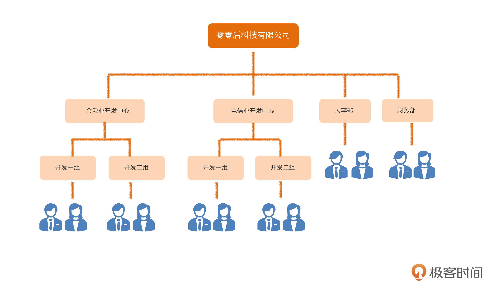

- 需求三：项目管理

租户要向它的客户提供服务，就要和客户签订合同，然后完成合同下的项目。

1. 一个租户企业可以有多个客户，可以在系统里对客户信息进行增删改查，每个客户都有一个客户经理来跟进；
2. 租户可以和它的客户签订多份合同，在系统中对合同信息进行增删改查，每个合同都有一个销售人员负责，可以开始和结束合同；
3. 一个合同下可以有多个项目，系统可以对项目进行增删改查，每个项目有一个项目经理；
4. 可以在系统中开始和结束项目，需要记录开始和结束时间等信息。项目结束以后，很多事情就不能随便做了。

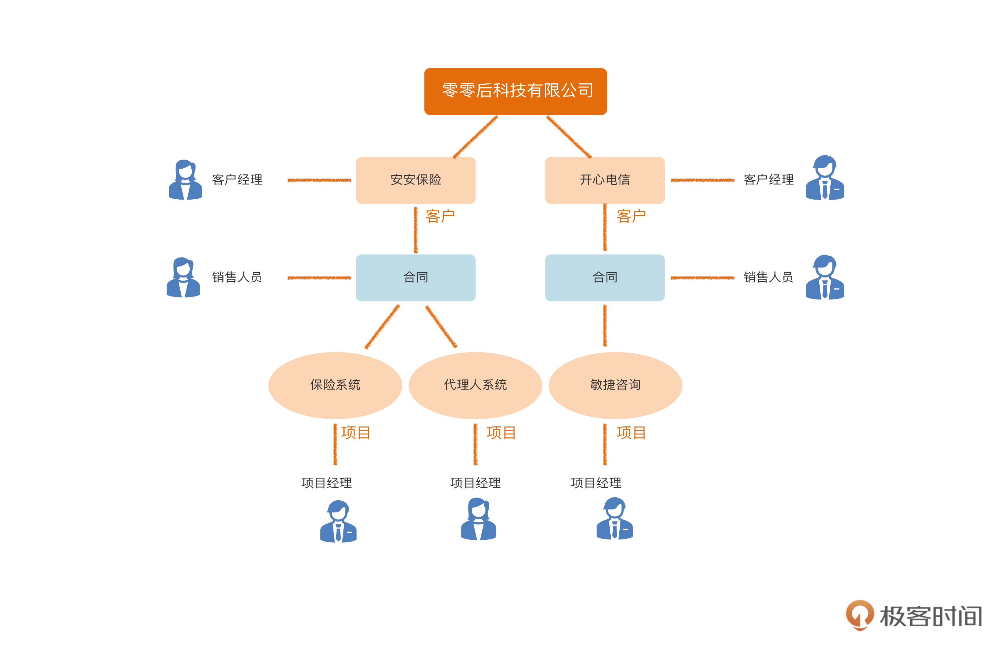

- 需求四：人员分配

有了项目，我们就可以把员工分配到项目上，也可以让一个人退出项目。而且，一个项目可以有多个人参与，一个人又可以同时参与多个项目。

在把人分配到项目上的时候，还要记录每个人预计的投入百分比。为了让企业能够在总体上调配人力资源。

- 需求五：工时登记

规定只有当一个员工分配到一个项目上以后，才能通过这个项目报工时。

每个员工每周都需要在系统中填报工时，登记自己哪一天在哪个项目上投入了多少时间。当然，员工可对工时进行查询和修改，还可以为每天的投入的时间填写备注。

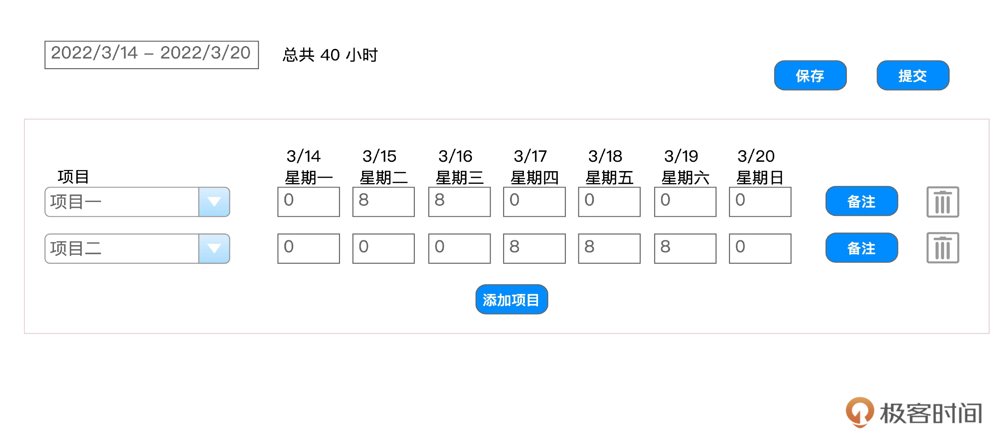

### DDD的基本开发过程

领域驱动设计中的主要流程。

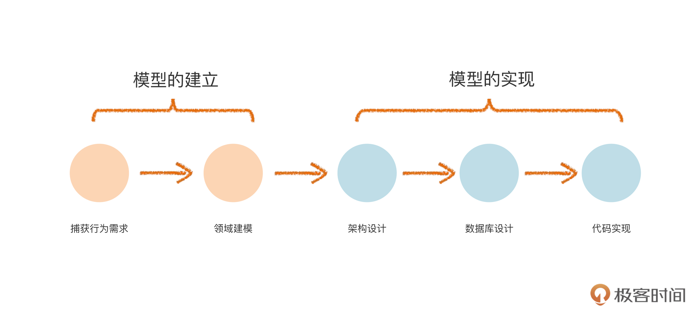

#### 模型的建立

模型的建立阶段，使用的都是**业务术语**，归根结底来自业务人员，业务人员不仅能听懂，而且负责评价建模的正确性。通过领域专家和开发人员的协作共同完成的。

- 捕获行为需求

在整个开发流程中，首先是要捕获行为需求，也就是传统软件工程里的“获取需求”。

在传统软件工程中，这一步常用的方式是用例建模，也就是用 Use Case 来建模。在这套课程里面，我们会用 DDD 中比较流行的一种方法，叫做“事件风暴”。

- 领域建模

接下来通过建立领域模型，把需求里的主要业务知识描述清楚。DDD 的领域模型，大体上相当于传统软件工程中的分析模型。

#### 模型的实现

模型的实现增加技术语言，则是业务人员不需要理解也不关注的，会包含技术实现方面的内容。两者的边界很重要。

- 架构设计

基于领域模型，我们就可以做架构设计，包括进程间和进程内的架构。比如说微服务设计、中台设计都属于进程间架构。而 DDD 分层架构，通常说的是进程内架构。

- 数据库设计
- 代码实现

在实践中，尤其是对敏捷软件开发来说，这些步骤不是线性的，而是反复迭代、互相穿插的。

## 事件风暴（上）：怎样和业务愉快地需求？

事件风暴的必要性包括从头脑中挖掘需求、补充遗漏的需求、使业务人员和技术人员理解一致，以及辅助识别领域对象四点。其中事件来自于领域事件，风暴来自于头脑风暴。

捕获行为需求的方法有好几种，在传统的软件工程中，最常用的方法是“用例”，也就是 Use Case。但是，Eric Evans 在《领域驱动设计》这本书里，并没有规定捕获行为需求的具体方法。直到 2013 年，一位叫 Alberto 的 DDD 专家提出了“事件风暴”，也就是 Event Storming。

事件风暴的主要过程：

### 事件风暴的第一步：识别领域事件

1. 业务人员和技术人员在一起分别识别出领域事件，领域事件表示的是业务流程中每个步骤引发的结果，业务人员关注的那些已经发生的事情，例如订单已提交。领域事件意味着业务流程中每个步骤的结果。这种结果导向的思维方式更容易理清业务。
2. 然后对这些领域事件进行讨论，找出真正的领域事件，其中不能出现一些技术事件和动作（例如查询功能），要用一些业务术语和一些已经约定俗成的业务属于。逐步统一认知并统一语言。

先发散，后收敛，反复迭代

注意两点

1. 不要把技术事件当做领域事件
2. 不要把动作或者过程当做领域事件

“协作”才是事件风暴的精髓，而具体结果怎样呈现，反而是第二位的

## 事件风暴（下）：事件风暴还有哪些诀窍？

### 事件风暴的第二步：识别命令

所谓命令（command），就是引发领域事件的操作，我们可以通过分析领域事件得到。除了识别出命令本身以外，我们通常还要识别出谁执行的命令，以及为了执行命令我们要查询出什么数据。

- 定义命令，也就是导致结果的操作
- 找出操作者，可以是多个，可以是人可以是系统
- 找出执行操作要查询的数据，可以是多个

比如合同已签订这个事件，命令或者是操作就是签订合同，执行者是销售人员，要查询的数据是客户信息。

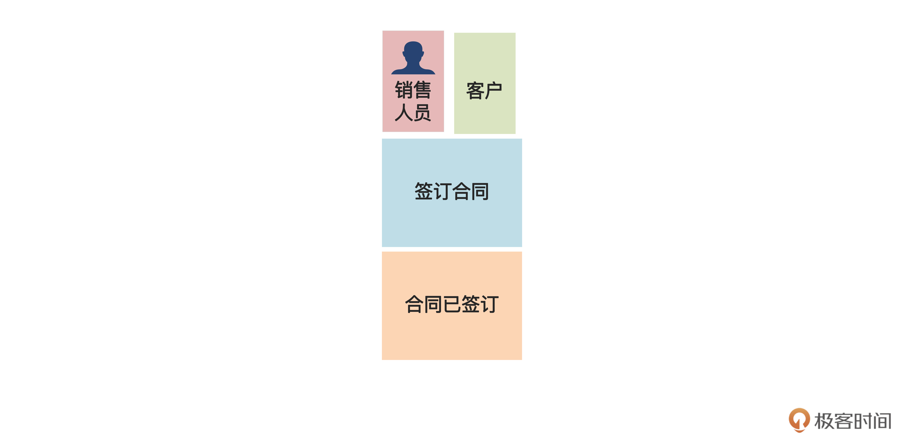

### 事件风暴第三步：识别领域名词

这里说的领域名词，是从命令、领域事件、执行者、查询数据里找到的名词性概念。

例如，对于签订合同这个命令而言，受到影响的名词性概念是“合同”；类似地，对于合同已签订这个领域事件，是由于“合同”这个名词性概念的状态变化所导致的。

- 把围绕一个领域名词的事件、命令、执行者、查询数据分组到一起。
- 对于一个事件或者命令出现两个名词，那就复制一份分别在两个组中。
- 观察分组，有些组中只有查询数据，有些只有执行者，这些可以留到领域建模时进一步想清楚。

### 再谈事件风暴的作用

首先我们看看领域事件的作用。从代码实现的角度来看，领域事件一般会对应一段代码逻辑，这段逻辑可能会最终改变数据库中的数据。另外，在事件驱动的架构中，一个领域事件可能会表现为一个向外部发送的异步消息。

那命令的作用体现在哪儿呢？领域建模时，我们可以通过对命令的走查（walkthrough），细化和验证领域模型。在实现层面，一个命令可能对应前端的一个操作，例如按下按钮；对于后端而言，一个命令可能对应一个 API。

再来说命令的执行者。在领域建模时，执行者可能本身就是一个领域对象，也可能是领域对象充当的角色，或者是权限管理中的一个角色。

至于查询数据，我们上一讲说过，查询功能不产生领域事件，因此也不会有相应的命令。那么怎样保证查询功能不被遗漏呢？实际上，每个查询数据，就对应着一个查询功能。不过，这里的查询数据是为了某个命令服务的。系统中可能还有一些单纯的查询功能，并不与某个特定的命令绑定。这些查询功能不会通过事件风暴识别出来，需要单独进行分析。

**识别领域名词的最终目的是要找到领域模型中的对象。**

为什么不叫做识别领域对象？应为这里的名词不一定是领域对象，只有到领域建模时才能真正清楚。

事件风暴本身并不是进行这种深入分析的合适工具，所以，我们在这一步只需要识别出领域名词就可以了，这些名词将成为领域建模的“素材”。

### 事件风暴常见问题

#### 在事件风暴里是否要列出所有的领域事件和命令？

在事件风暴里只列出主要的、足以用于表达和交流领域知识的步骤。列出所有领域事件和命令并没有原则上的错误，但这样做会让结果变得繁琐，反而让人抓不住重点。

那么不列出来，怎么保证这些功能不被遗漏呢？我们可以结合用户故事或者传统的功能列表等方法保存系统功能的全集，这样就能解决了。

#### 各个领域事件需要体现严格的时间顺序吗？

只需要按照大致的顺序，贴出领域事件就可以了。顺序严格会用到大量复杂符号，使事件风暴过于繁琐。

#### 每个步骤的颗粒度应该有多大？

原则上宜粗不宜细。可以先采用比较大的颗粒度。后面必要的时候，再拆细，就可以了。分成小的领域事件，并没有意义，所以不再分成更小的步骤了。

#### 事件风暴适用于所有项目吗？

第一个层面，事件风暴主要应用在需求不清晰，或者理解不统一的情况下，通过协作的方式理清业务、达成一致，所以通常对于新项目比较适用。如果大家对这个系统的业务知识很清楚，只是要进行架构改造，那么事件风暴的意义就不大了。

第二个层面，即便在适用的场合，事件风暴也不是唯一的方法，我们还可以用用例分析、用户故事等方法实现类似的目的。只要抓住协作、统一语言等等要点，这些方法都可以用在 DDD 的项目里。

#### 怎么保存和维护事件风暴的结果？

电子图，表格，例如

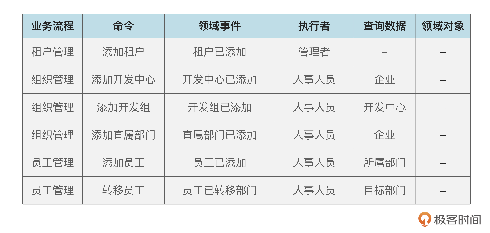

通常，如果事件风暴的内容最终会反映到用户故事、用例、功能列表等产出物中，而这些产出物会进行维护，那我们就不必专门更新事件风暴的产出物了，只在需要的时候作为一种沟通工具，将电子化的结果作为一种中间产物保存就可以了。但是，如果你的团队并没有用户故事和用例等保存行为需求的方式，那么我建议你对事件风暴进行维护和更新。

#### 怎么保存领域规则？

领域规则是重要的领域知识，必须妥善保存。在事件风暴的过程里我们已经识别出了一些领域规则，在后续的领域建模阶段，可能还会识别出更多。如果只是写在便利贴上，或者画在图上，时间长了，就很难维护了。

所以，我们要编一个领域规则表，把所有的领域规则都汇总在里面，然后再把领域规则表和领域模型放在一起，作为领域知识的重要组成部分，后面就是一个例子。

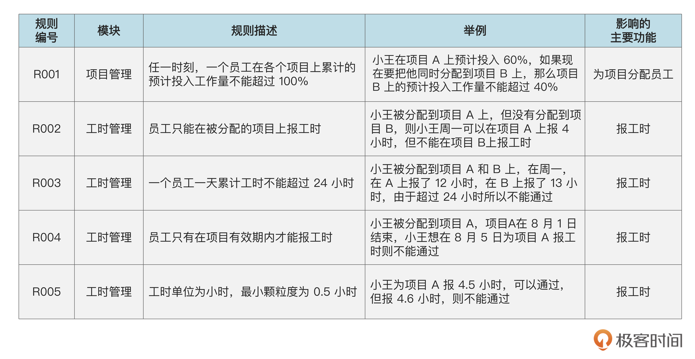

## 领域建模实践（上）：怎样既准确又深刻地理解业务知识？

### 领域建模中的一些基本概念

领域建模主要有两个目的：

- 将知识可视化，准确、深刻地反映领域知识，并且在业务和技术人员之间达成一致；
- 指导系统的设计和编码，也就是说，领域模型应该能够比较容易地转化成数据库模式和代码实现。

建立领域模型，主要是要识别领域对象（domain object），领域对象之间的关系，以及领域对象的关键属性，必要的时候还要将领域对象组织成模块。

我们系统中要处理的各种“事物”就是领域对象。比如说项目、员工、账户等等。这些对象都反映了名词性的概念。

有些名词化了的动词也是领域对象。比如说我们进行了一笔支付操作，并且想把这笔操作记录下来。这时，“支付”也是领域对象。支付本来是动词，但这里实际上是要把一笔支付的信息记录下来，在这里就把“支付”当名词用了。

领域模型是用领域模型图来表达的，通常用 UML 来画。通常用类图。

### 初步识别实体

DDD 中将领域对象又分成实体（entity）和值对象（value object），这里先讲实体。

识别实体时，可以假设所有的领域名词都是实体，把他们用类的符号画出来，如果实体的名字已经能清晰说明实体的含义，那我们就不需要加属性了。如果名字还不足以充分表达含义，我们可以写几个关键属性，来辅助说明。

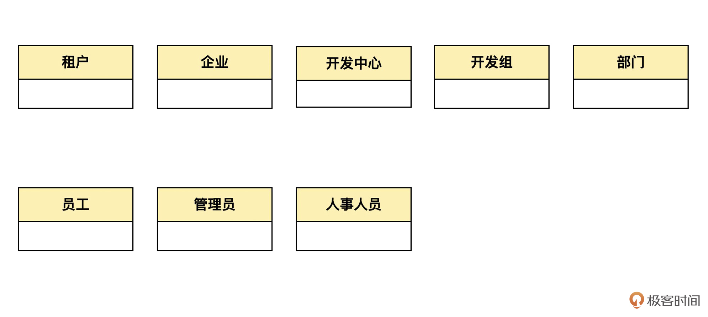

### 识别“一对一”关联

租户与企业。一个租户只能对应一个企业，一个企业只能作为一个租户，所以他们具有一对一关系。

### 识别“一对多”关联

企业与开发中心。一个开发中心只能属于一个企业，一个企业可以有多个开发中心。他们具有一对多关联。

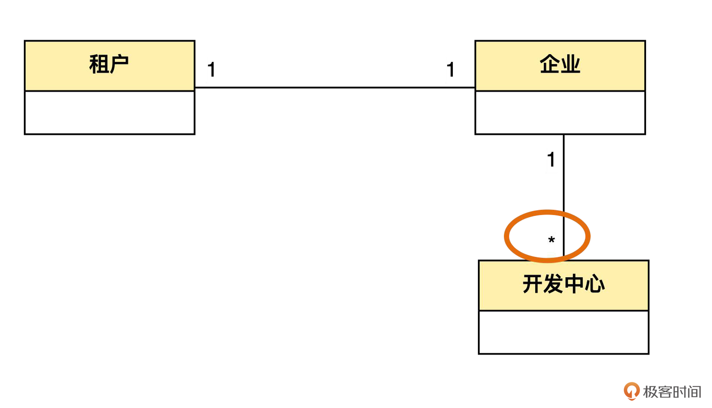

当开发中心和开发组之间增加一层开发团队，模型需要修改，也就是说这个**模型不容易适应组织层级的变化**。或者一个员工不属于开发组而只属于开发中心，比如开发中心的主管。同理，企业总经理也只属于企业本身而不属于任何下属部门。那么为了表达这种关系，我们就要再增加两条表示关联的线。

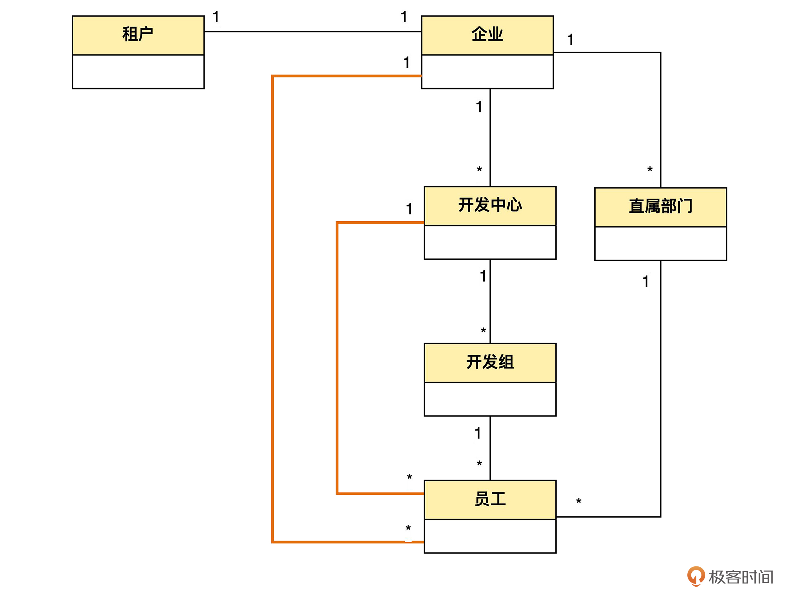

线越多，图就越杂乱。也就是说，这个**模型不够简洁**。怎么解决？

### 进行抽象

企业、开发中心、开发组、直属部门，其实都是组织结构中的节点而已，从这一点来说，他们是有共性的。将他们抽象成**组织**。组织有不同的组织类别。一个组织类别下可以有多个组织，而一个组织只能属于一个组织类别。

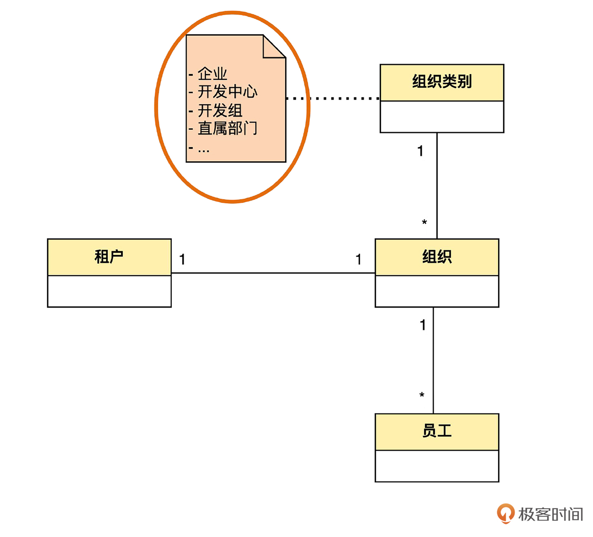

### 识别“自关联”

这个图还不能表示企业、开发中心、开发组等之间的上下级关系。这可以用组织这个实体上的“自关联”来表达。一个组织可以有多个组织作为自己的下级；而一个组织只能有一个组织作为自己的上级。

在这个自关联的两端，有上级和下级两个词。它们在 UML 里称为“角色”（role）。

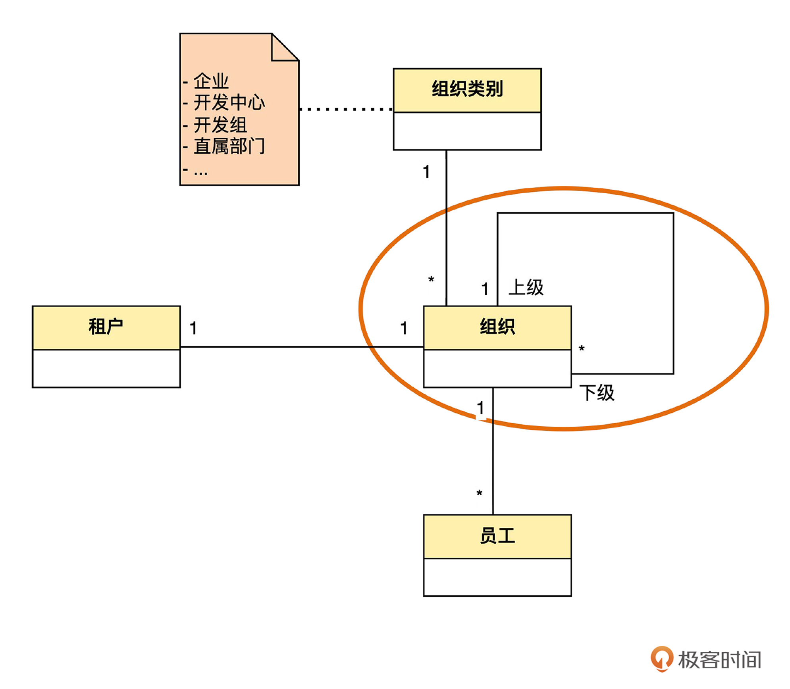

### 增加“约束”

为了说明“一个开发中心下面有多个开发组，而不是一个开发组下面有多个开发中心”这个业务规则，我又另外加了一个注释。

这个注释和上一个有些区别，它的内容用大括号括起来了。在 UML 中，用大括号括起来的内容称为“约束”（constraint）。和一般性的注释不同，凡是约束，必须在程序中的某个地方进行实现。

关于租户还有两个问题没有在这个模型中表达出来。第一个问题是，没有说明“只有企业才能作为租户，其他类别的组织不能作为租户”；另一个问题是，作为多租户系统，其实每一个实体都应该与租户有一个关联，说明这个实体是属于哪一个租户的，这样才能把不同租户的数据区分开。

如果都用线关联起来会非常复杂，可以添加一个注释和一个约束来说明上面两个问题。

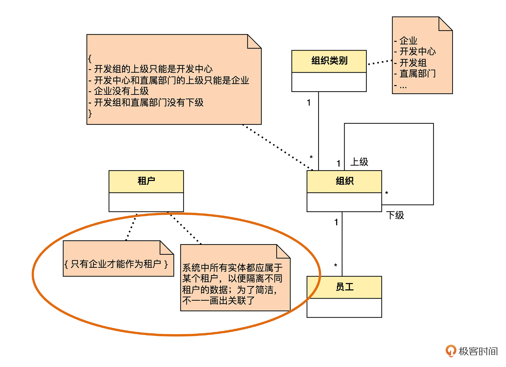

### 识别“多对多”关联

管理员和人事人员怎么加入呢，其实他们都是员工担任的岗位。一个员工可以担任多个岗位，而一个岗位也可以有多个员工担任。员工和岗位之间是“多对多”关联。

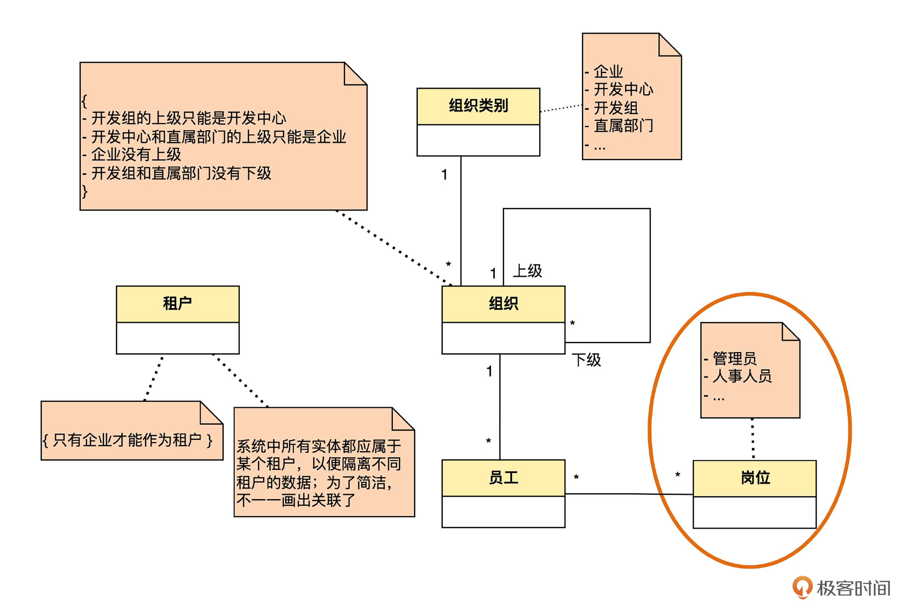

### 更丰富的“多重性”

多重性可以在细化。一个组织最少有 0 个员工，最多可以有很多员工。

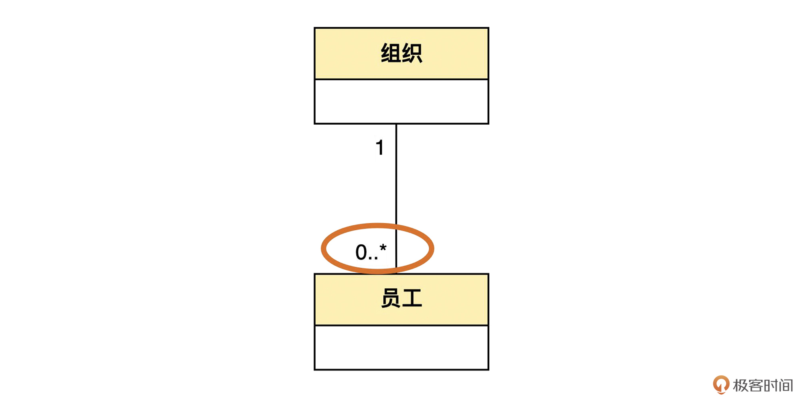

一个员工必须属于一个组织。

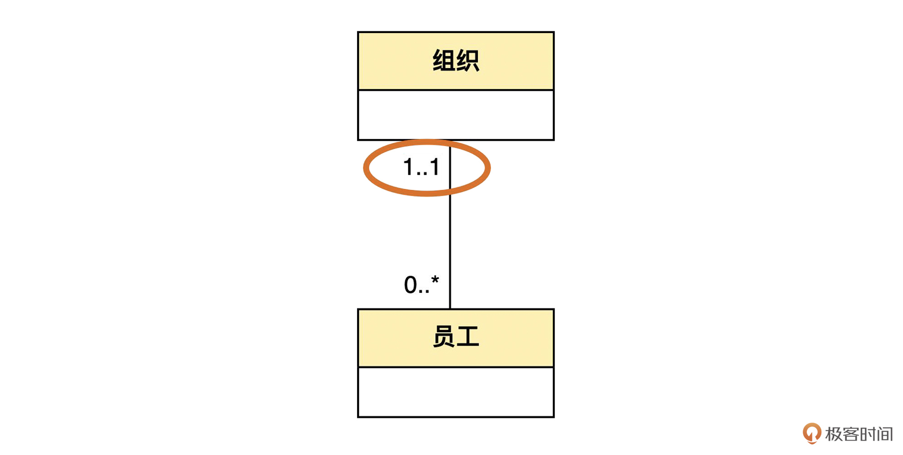

在实际项目中，团队可以自行决定，把多重性识别得粗一点，只写 “1”和 “*” ；还是细一点，识别出 “1..1” “0..*” 等等。

丰富了多重性以后，整个模型成为了下面的样子：

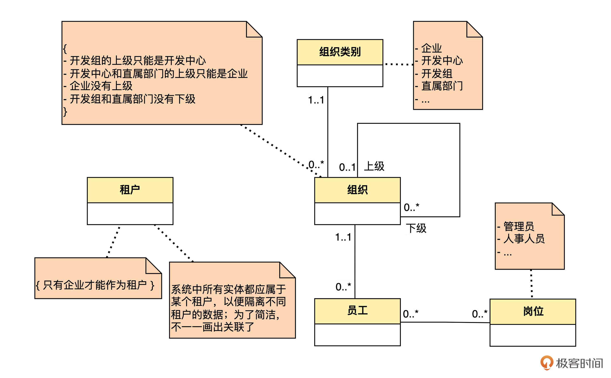

## 领域建模实践（下）：领域建模还有什么其他技巧？

test

test2
