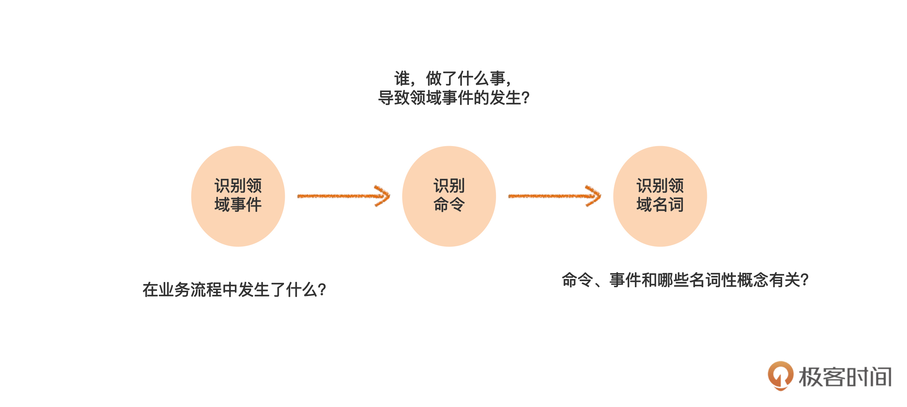

# 为什么DDD火

DDD（Domain Driven Design,领域驱动设计） 是一种开发复杂软件的系统化的方法学和思想。

## 为什么传统面向对象方法学不够，还要DDD

早期面向对象的成功，主要是在几个特定的领域，比如计算机语言、图形用户界面、办公自动化软件等等，但在企业应用方面还没有取得成功（企业应用包括银行贷款系统、保险公司理赔系统、电信公司计费系统等等）。

### 传统面向对象方法学还存在很多问题

1. 很多研发走了一条只重技术不重业务的弯路。
   1. 重技术不重业务的思想造成技术人员与业务人员之间难以相互理解，难以真正满足业务需求。
2. 围绕业务开发的方法学本身就不好学。
3. 早期面向对象方法学主要考虑的是建模技术，很少考虑协作问题。
   1. 很多伟大的软件开始的时候都是个人作品（UNIX、C语言），而企业应用多数是团队作战。
4. 难以适应变化。
   1. 早期面向对象方法学很少讨论如何应对变化的需求。

### DDD如何解决

DDD就是为了解决上述问题而提出的，从名字可以看出，领域就是业务领域，就是说要从业务出发进行系统设计，把开发者从重技术的路上拉回来。

DDD 从面向对象和敏捷中提炼出了一套原则、模式和实践，使面向对象方法学在企业应用中更加容易学习和掌握。使面向对象方法学在企业应用中更加容易学习和掌握。

DDD 非常强调业务人员和技术人员要一起协作进行领域建模，在这个过程中提炼领域知识。

DDD 重视如何应对变化，提出了所谓“柔性设计”的概念，使得模型和系统可以随着需求的变化而演进。随着业务变化，将变化频繁的部分重构得越来越灵活，而不常变化的部分则保持不变。也就是说，模型中的哪些部分需要设计得灵活，是自然演进形成的，这样就避免了“过度设计”。这个过程就是柔性设计。而这个重构的过程，也是不断加深领域知识理解的过程。

### 为什么之前不火

- 必要性不够强

在 DDD 刚出现的时候，很多企业软件还不太复杂。一些复杂的软件，变化也不像现在这样频繁。甚至还有一些企业，干脆每隔四五年把原来的系统推翻重建一次。

另一方面，当时一些新兴的产业，例如互联网，还处在跑马圈地、野蛮生长的阶段。这时关注的是系统快速上线，抢占市场，至于软件质量好不好，容不容易维护，暂时不是考虑的重点。

- 普及需要的前提条件不足

首先是敏捷软件开发刚刚出现不久，还不普及。如果没有迭代开发、持续重构、测试驱动、持续集成等敏捷实践的支持，构建良好的领域模型并在代码上落地是很困难的。

其次是配套的开发框架还不成熟。那时 J2EE 还被认为是企业应用事实上的标准，而基于这种框架开发程序，是很难和 DDD 的领域模型相衔接的。

### 为什么现在火起来了

- 数字化时代的到来

数字化时代，技术逐渐成为企业核心竞争力的主要因素，无论业务还是系统都变得更加复杂。因此，如何将业务和技术融为一体，就成了很多企业的主要问题，而这正是 DDD 的主要优势。

行业竞争的加剧也要求系统具有更好的用户体验、更高的质量、更快地满足变化的需求。这些问题很难解决，必须引入系统化的方法。

- DDD普及的前提条件已经准备好

现在，敏捷软件开发已经普及。迭代、演进、协作等思想已经深入人心。DevOps 技术应用得也日益广泛。而且 Spring boot 等轻量级框架已经得到广泛使用。这些框架支持了领域模型与具体技术的关注点分离，使开发人员从技术细节中解放出来，将更多的精力投入到领域逻辑本身的分析和设计。

再者，相关的架构实践也已经研究得比较透彻，像整洁架构、事件驱动架构以及 CQRS 等等，都有力地支持了 DDD 的落地实施。DDD 本身也在不断完善，比如补充了像领域事件等新的模式，出现了事件风暴等新的实践。

### 尽信DDD不如不用DDD。

这是我看到的一条评论。DDD也不是完美的理论，要用平常心来看待DDD，发现有用就用一下，不能用也不要勉强。

# 打通DDD的最小闭环

## 开启一个小项目

通过迭代一，实现一个“麻雀虽小、五脏俱全”的项目。打通从需求分析，到领域建模，再到架构设计，最后到数据库和代码实现的完整闭环。

### 迭代需求

经过了一轮市场调研，我们发现很多中小企业，都有诸如考勤管理、工时管理、项目管理、请假管理等通用的需求。我们姑且把这些应用统称为“企业管理系统”。

在领域驱动设计中有一个重要的角色叫做“领域专家”，叫业务专家也可以。领域专家需要对业务有总体性和本质性的把握，同时对业务发展也要有一定前瞻性，也就是说，心里要有一盘棋。

- 需求一：租户管理

多租户系统，系统可以提供给多个企业使用，数据隔离。

- 需求二：人员与组织管理

对员工可以增删改查，把员工分配到部门，每个员工只属于一个部门。

- 需求三：项目管理

租户要向它的客户提供服务，就要和客户签订合同，然后完成合同下的项目。

1. 一个租户企业可以有多个客户，可以在系统里对客户信息进行增删改查，每个客户都有一个客户经理来跟进；
2. 租户可以和它的客户签订多份合同，在系统中对合同信息进行增删改查，每个合同都有一个销售人员负责，可以开始和结束合同；
3. 一个合同下可以有多个项目，系统可以对项目进行增删改查，每个项目有一个项目经理；
4. 可以在系统中开始和结束项目，需要记录开始和结束时间等信息。项目结束以后，很多事情就不能随便做了。

- 需求四：人员分配

有了项目，我们就可以把员工分配到项目上，也可以让一个人退出项目。而且，一个项目可以有多个人参与，一个人又可以同时参与多个项目。

在把人分配到项目上的时候，还要记录每个人预计的投入百分比。为了让企业能够在总体上调配人力资源。

- 需求五：工时登记

规定只有当一个员工分配到一个项目上以后，才能通过这个项目报工时。

每个员工每周都需要在系统中填报工时，登记自己哪一天在哪个项目上投入了多少时间。当然，员工可对工时进行查询和修改，还可以为每天的投入的时间填写备注。

### DDD的基本开发过程

领域驱动设计中的主要流程。

#### 模型的建立

模型的建立阶段，使用的都是**业务术语**，归根结底来自业务人员，业务人员不仅能听懂，而且负责评价建模的正确性。通过领域专家和开发人员的协作共同完成的。

- 捕获行为需求

在整个开发流程中，首先是要捕获行为需求，也就是传统软件工程里的“获取需求”。

在传统软件工程中，这一步常用的方式是用例建模，也就是用 Use Case 来建模。在这套课程里面，我们会用 DDD 中比较流行的一种方法，叫做“事件风暴”。

- 领域建模

接下来通过建立领域模型，把需求里的主要业务知识描述清楚。DDD 的领域模型，大体上相当于传统软件工程中的分析模型。

#### 模型的实现

模型的实现增加技术语言，则是业务人员不需要理解也不关注的，会包含技术实现方面的内容。两者的边界很重要。

- 架构设计

基于领域模型，我们就可以做架构设计，包括进程间和进程内的架构。比如说微服务设计、中台设计都属于进程间架构。而 DDD 分层架构，通常说的是进程内架构。

- 数据库设计
- 代码实现

在实践中，尤其是对敏捷软件开发来说，这些步骤不是线性的，而是反复迭代、互相穿插的。

## 事件风暴（上）：怎样和业务愉快地需求？

事件风暴的必要性包括从头脑中挖掘需求、补充遗漏的需求、使业务人员和技术人员理解一致，以及辅助识别领域对象四点。其中事件来自于领域事件，风暴来自于头脑风暴。

捕获行为需求的方法有好几种，在传统的软件工程中，最常用的方法是“用例”，也就是 Use Case。但是，Eric Evans 在《领域驱动设计》这本书里，并没有规定捕获行为需求的具体方法。直到 2013 年，一位叫 Alberto 的 DDD 专家提出了“事件风暴”，也就是 Event Storming。

事件风暴的主要过程：

### 事件风暴的第一步：识别领域事件

领域事件表示的是，**业务流程中每个步骤引发的结果。**

这一步要识别需求中的每一个流程中的领域事件。

1. **业务人员和技术人员**在一起分别识别出领域事件，领域事件表示的是业务流程中每个步骤引发的结果，业务人员关注的那些已经发生的事情，例如订单已提交。领域事件意味着业务流程中每个步骤的结果。这种结果导向的思维方式更容易理清业务。
2. 然后对这些领域事件**进行讨论，找出真正的领域事件**，其中不能出现一些技术事件和动作（例如查询功能），要用一些业务术语和一些已经约定俗成的业务属于。逐步统一认知并统一语言。

先发散，后收敛，反复迭代

注意两点

1. 不要把技术事件当做领域事件
2. 不要把动作或者过程当做领域事件，
3. 命名套用英语语法的话，一般是完成时和被动语态。如果有业务上约定俗成的术语，则一般优先用约定俗称的业务术语。
   1. 例如项目已创建，有更通用的数据是已立项，就可以用已立项。

比如，如下你作为架构师，我作为产品经理，在客户已创建和客户已添加上有分歧。

我做为产品经理从业务角度分析，客户本来就是存在的，不需要被创建，而只是把客户资料添加到我们的系统而已。所以以后不能叫客户已创建了，统一叫做用户已添加。**这个过程就是建立统一语言的过程。**

“协作”才是事件风暴的精髓，而具体结果怎样呈现，反而是第二位的

## 事件风暴（下）：事件风暴还有哪些诀窍？

### 事件风暴的第二步：识别命令

所谓命令（command），就是**引发领域事件的操作**，我们可以通过分析领域事件得到。除了识别出命令本身以外，我们通常还要识别出**谁执行**的命令，以及为了执行命令我们要**查询出什么数据**。

- 定义命令，也就是导致结果的操作
- 找出操作者，可以是多个，可以是人可以是系统
- 找出执行操作要查询的数据，可以是多个

比如合同已签订这个事件，命令或者是操作就是签订合同，执行者是销售人员，要查询的数据是客户信息。

### 事件风暴第三步：识别领域名词

这里说的领域名词，是从命令、领域事件、执行者、查询数据里找到的**名词性概念**。

例如，对于签订合同这个命令而言，受到影响的名词性概念是“合同”；类似地，对于合同已签订这个领域事件，是由于“合同”这个名词性概念的状态变化所导致的。

- 把围绕一个领域名词的事件、命令、执行者、查询数据分组到一起。
  - 例如执行者：客户、命令：添加客户、领域事件：客户已查询，这三个放在一组。其中客户就是领域名词

- 对于一个事件或者命令出现两个名词，那就复制一份分别在两个组中。
- 观察分组，有些组中只有查询数据，有些只有执行者，这些可以留到领域建模时进一步想清楚。

### 再谈事件风暴的作用

首先我们看看领域事件的作用。从代码实现的角度来看，领域事件一般会对应一段代码逻辑，这段逻辑可能会最终改变数据库中的数据。另外，在事件驱动的架构中，一个领域事件可能会表现为一个向外部发送的异步消息。

那命令的作用体现在哪儿呢？领域建模时，我们可以通过对命令的走查（walkthrough），细化和验证领域模型。在实现层面，一个命令可能对应前端的一个操作，例如按下按钮；对于后端而言，一个命令可能对应一个 API。

再来说命令的执行者。在领域建模时，执行者可能本身就是一个领域对象，也可能是领域对象充当的角色，或者是权限管理中的一个角色。

至于查询数据，我们上一讲说过，查询功能不产生领域事件，因此也不会有相应的命令。那么怎样保证查询功能不被遗漏呢？实际上，每个查询数据，就对应着一个查询功能。不过，这里的查询数据是为了某个命令服务的。系统中可能还有一些单纯的查询功能，并不与某个特定的命令绑定。这些查询功能不会通过事件风暴识别出来，需要单独进行分析。

**识别领域名词的最终目的是要找到领域模型中的对象。**

为什么不叫做识别领域对象？应为这里的名词不一定是领域对象，只有到领域建模时才能真正清楚。

事件风暴本身并不是进行这种深入分析的合适工具，所以，我们在这一步只需要识别出领域名词就可以了，这些名词将成为领域建模的“素材”。

### 事件风暴常见问题

#### 在事件风暴里是否要列出所有的领域事件和命令？

在事件风暴里只列出主要的、足以用于表达和交流领域知识的步骤。列出所有领域事件和命令并没有原则上的错误，但这样做会让结果变得繁琐，反而让人抓不住重点。

那么不列出来，怎么保证这些功能不被遗漏呢？我们可以结合用户故事或者传统的功能列表等方法保存系统功能的全集，这样就能解决了。

#### 各个领域事件需要体现严格的时间顺序吗？

只需要按照大致的顺序，贴出领域事件就可以了。顺序严格会用到大量复杂符号，使事件风暴过于繁琐。

#### 每个步骤的颗粒度应该有多大？

原则上宜粗不宜细。可以先采用比较大的颗粒度。后面必要的时候，再拆细，就可以了。分成小的领域事件，并没有意义，所以不再分成更小的步骤了。

#### 事件风暴适用于所有项目吗？

第一个层面，事件风暴主要应用在需求不清晰，或者理解不统一的情况下，通过协作的方式理清业务、达成一致，所以通常对于新项目比较适用。如果大家对这个系统的业务知识很清楚，只是要进行架构改造，那么事件风暴的意义就不大了。

第二个层面，即便在适用的场合，事件风暴也不是唯一的方法，我们还可以用用例分析、用户故事等方法实现类似的目的。只要抓住协作、统一语言等等要点，这些方法都可以用在 DDD 的项目里。

#### 怎么保存和维护事件风暴的结果？

电子图，表格，例如

通常，如果事件风暴的内容最终会反映到用户故事、用例、功能列表等产出物中，而这些产出物会进行维护，那我们就不必专门更新事件风暴的产出物了，只在需要的时候作为一种沟通工具，将电子化的结果作为一种中间产物保存就可以了。但是，如果你的团队并没有用户故事和用例等保存行为需求的方式，那么我建议你对事件风暴进行维护和更新。

#### 怎么保存领域规则？

领域规则是重要的领域知识，必须妥善保存。在事件风暴的过程里我们已经识别出了一些领域规则，在后续的领域建模阶段，可能还会识别出更多。如果只是写在便利贴上，或者画在图上，时间长了，就很难维护了。

所以，我们要编一个领域规则表，把所有的领域规则都汇总在里面，然后再把领域规则表和领域模型放在一起，作为领域知识的重要组成部分，后面就是一个例子。

## 领域建模实践（上）：怎样既准确又深刻地理解业务知识？

### 领域建模中的一些基本概念

领域建模主要有两个目的：

- 将知识可视化，准确、深刻地反映领域知识，并且在业务和技术人员之间达成一致；
- 指导系统的设计和编码，也就是说，领域模型应该能够比较容易地转化成数据库模式和代码实现。

建立领域模型，主要是要识别**领域对象**（domain object），**领域对象之间的关系**，以及**领域对象的关键属性**，必要的时候还要**将领域对象组织成模块**。

我们系统中要处理的各种“事物”就是领域对象。比如说项目、员工、账户等等。这些对象都反映了名词性的概念。

有些名词化了的动词也是领域对象。比如说我们进行了一笔支付操作，并且想把这笔操作记录下来。这时，“支付”也是领域对象。支付本来是动词，但这里实际上是要把一笔支付的信息记录下来，在这里就把“支付”当名词用了。

领域模型是用领域模型图来表达的，通常用 UML 来画。通常用类图。

### 识别实体

DDD 中将**领域对象又分成实体（entity）和值对象（value object）**，这里先讲实体。

识别实体时，可以假设所有的领域名词都是实体，把他们用类的符号画出来，如果实体的名字已经能清晰说明实体的含义，那我们就不需要加属性了。如果名字还不足以充分表达含义，我们可以写几个关键属性，来辅助说明。

### 识别实体之间的关系

#### 识别“一对一”关联

租户与企业。一个租户只能对应一个企业，一个企业只能作为一个租户，所以他们具有一对一关系。

#### 识别“一对多”关联

企业与开发中心。一个开发中心只能属于一个企业，一个企业可以有多个开发中心。他们具有一对多关联。

当开发中心和开发组之间增加一层开发团队，模型需要修改，也就是说这个**模型不容易适应组织层级的变化**。或者一个员工不属于开发组而只属于开发中心，比如开发中心的主管。同理，企业总经理也只属于企业本身而不属于任何下属部门。那么为了表达这种关系，我们就要再增加两条表示关联的线。

### 进行抽象

线越多，图就越杂乱。也就是说，这个**模型不够简洁**。可以通过抽象来解决。

企业、开发中心、开发组、直属部门，其实都是组织结构中的节点而已，从这一点来说，他们是有共性的。将他们抽象成**组织**。组织有不同的组织类别。一个组织类别下可以有多个组织，而一个组织只能属于一个组织类别。

### 识别“自关联”

这个图还不能表示企业、开发中心、开发组等之间的上下级关系。这可以用组织这个实体上的“自关联”来表达。一个组织可以有多个组织作为自己的下级；而一个组织只能有一个组织作为自己的上级。

在这个自关联的两端，有上级和下级两个词。它们在 UML 里称为“角色”（role）。

### 增加“约束”

为了说明“一个开发中心下面有多个开发组，而不是一个开发组下面有多个开发中心”这个业务规则，我又另外加了一个注释。

这个注释和上一个有些区别，它的内容用大括号括起来了。在 UML 中，用大括号括起来的内容称为“约束”（constraint）。和一般性的注释不同，凡是约束，必须在程序中的某个地方进行实现。

关于租户还有两个问题没有在这个模型中表达出来。第一个问题是，没有说明“只有企业才能作为租户，其他类别的组织不能作为租户”；另一个问题是，作为多租户系统，其实每一个实体都应该与租户有一个关联，说明这个实体是属于哪一个租户的，这样才能把不同租户的数据区分开。

如果都用线关联起来会非常复杂，可以添加一个注释和一个约束来说明上面两个问题。

### 识别“多对多”关联

管理员和人事人员怎么加入呢，其实他们都是员工担任的岗位。一个员工可以担任多个岗位，而一个岗位也可以有多个员工担任。员工和岗位之间是“多对多”关联。

### 更丰富的“多重性”

多重性可以在细化。一个组织最少有 0 个员工，最多可以有很多员工。

一个员工必须属于一个组织。

在实际项目中，团队可以自行决定，把多重性识别得粗一点，只写 “1”和 “*” ；还是细一点，识别出 “1..1” “0..*” 等等。

丰富了多重性以后，整个模型成为了下面的样子：

## 领域建模实践（下）：领域建模还有什么其他技巧？

## 领域建模原理

### 什么是领域模型

模型的几个特点：

- 模型是以解决特定问题为目的的。
- 模型都是对现实世界或人们思维中的事物进行的模拟。
- 模型总是提取了被模拟事物中的部分信息，而忽略掉了其他大部分信息。
- 模型可以有多种表现形式。
  - 例如图纸、影像、公式以及电脑中的文件等等。具体采用哪种形式，取决于要解决的问题和当前的技术水平。
- 模型是一种人造物。
  - 大自然本身是不存在模型的。

### 传统软件开发

软件开发是一个建模过程。

1. 第一步是捕获行为需求，研究为了满足业务需求需要有怎样的流程和功能，可以用传统的用例分析来做，也可以用咱们这里的事件风暴。
2. 第二步是分析，在行为需求的基础上，对现实世界中领域知识或者说业务概念进行分析和提炼，形成分析模型。尽管分析模型反映的仍然是业务概念，然而是经过抽象得来的，更加严谨、精练和一致，因此比行为需求更加接近实现。
3. 第三步是设计，在分析模型的基础上，增加技术关注点，进行架构设计、详细设计、数据库设计等，形成设计模型。设计模型介于分析模型和代码之间。
4. 第四步是编写代码。代码经过编译后，就成为了运行在机器上的“机器模型”了。

其实，第二步中的分析，就是对领域知识的抽象和提炼的过程，所以分析模型也可以称为领域模型，这个过程也可以叫做领域建模。

但是，很多伙伴在开发软件时，并没有经过领域建模这一步，而是直接进行设计和编码。如果是简单系统的话还可以，如果是复杂系统，就会出现很多问题了。

## 数据库设计

数据库设计，属于模型的实现。

这章主要体会数据库设计是如何与领域模型保持一致的。

数据库设计在软件工程中叫做，建立**物理数据模型（physical data model, PDM）**。具体包含以下几点：

- 建立哪些表
- 表中有哪些字段
- 表的主键和外键是什么
- 字段的数据类型以及约束

一般来说，对领域模型进行数据库实现有以下可以参考的原则：

- 一个实体可以映射为一个数据库表。
- 领域模型中的属性，一般会映射成为表中的字段。
- 一个一对多关联，在数据库设计时可以映射成为一个外键。
  - 为了减少数据库处理瓶颈，一般通过程序来保证外键约束。可以把数据模型中的外键替换成虚拟外键，表示关系
- 多对多关联，需要增加一个关联表。

### 按照DDD进行数据库设计和以前方法的对比

比起“拍脑袋”的方法，DDD 的方法更容易和业务专家对齐领域知识，而且不容易违反数据库设计范式。

另一方面，DDD 方法是 ER 图法的“超集”，并且能够将静态数据和动态逻辑整合在一起，达到业务、数据库和代码三者的统一。ER 图只能表达静态的数据关系，领域模型图则可以将静态数据和动态行为绑定，不仅可以用于数据库设计，还可以用于程序设计，能够保证程序设计和数据库设计的高度统一。

## 分层架构

## 代码实现（上）

## 代码实现（中）

## 代码实现（下）

# 渐入佳境

## 迭代二概述：怎样更深刻地理解领域知识

## 聚合的概念：怎么保护业务规则？

“聚合”（Aggregate)。保护业务规则不被破坏的一种手段。

### 聚合的概念

在一个生命周期内都是有效的，不会有时有效有时无效，称为“不变规则”（invariant）。

具有下面两个特征的一组领域对象，在对DDD里就叫做一个聚合。

- 具有整体与部分的关系。
- 具有不变规则，而且这种不变规则在并发的时候可能被破坏。

例如员工，和员工的技能。

### 聚合的表示法

在一个聚合里，表示整体的实体就是聚合根。一个聚合只有一个聚合根。

在图中用<<aggregate root>>表示。

用一个包把这个聚合中的类包起来，从而可以一眼看出这个聚合的边界。一般我们约定，聚合包的名字和聚合根的名字是一样的。

## 聚合的实现（上）：怎么封装

## 聚合的实现（中）：怎样实现不变规则

## 聚合的实现（下）：怎样用事务保护聚合

## 值对象（上）

## 值对象（中）

## 值对象（下）

## 用限定建模

## 泛化建模（上）

## 限界上下文

系统和团队规模变大后遇到的挑战，都是普遍性的问题。

**解决的方法就是运用限界上下文。**

DDD 的限界上下文，是一种**解决大系统或者大模型概念不一致的手段**。我们把一个大模型分成几个小模型，保持每个小模型内部概念的一致性，而不同模型之间的概念不必一致，这种小模型就叫做限界上下文。

放弃对全局一致性不切实际的追求，退而求其次，代之以局部一致性，从而使概念一致性问题得到足够的管理，达到业务目标，这种思维就是限界上下文与传统划分模块或子系统思路的本质区别。

一个限界上下文对应一套统一语言。**脱离上下文谈统一语言是没有意义的。**

之所以限界上文不追求全局一致性，实际上是由于**全局一致性已经超过了团队的认知负载。**所以**限界上下文的划分在理论上应该和团队的划分保持一致。**这也印证了康威定律。

### 架构设计

通过聚焦某一个上下文的设计，不受其他上下文概念的干扰，我们得到了一个更加简洁和灵活的设计。

基于划分出的限界上下文，就可以设计系统的架构了。到底使用微服务还是单体架构需要综合考虑。通常要根据投入产出、人员能力、基础设施等因素做出权衡。

### 微服务设计

设计微服务，我们可以先**假定每个限界上下文对应一个微服务。**然后，再综合考虑多方面的因素，决定是否需要进一步细分。下面是几种常见的情况。

1. 第一，**不同的可伸缩性要求**。如果一个上下文里有些部分，需要随着使用情况，动态部署到更多的容器，比如说“双十一”促销的时候。而另外的部分性能要求比较稳定，不需要动态伸缩。那么，如果不同部分都混在一个微服务中，那么当扩展到更多容器的时候，成本就会比较高了。这时候，我们可以考虑根据可伸缩性的不同，划分成两个微服务。
2. 第二，**不同的安全性要求**。比如说，有些功能要接入互联网，有些部分在内网用，需要部署在防火墙的不同位置。这时候，也需要划分成不同的微服务。
3. 第三，**技术异构性**。比如说，有些部分需要用 Java 开发，有些部分需要用 node.js 开发，这时候，也要分成不同的微服务了。

#### 为什么根据限界上下文来设计微服务

微服务的划分，可以从**功能性需求**和**非功能性需求**两方面考虑。

根据限界上下文来划分模型，既考虑到了传统模块化思维中对业务概念的**松耦合、高内聚**的要求，又考虑到**团队的认知负载和认知边界**。这样，

- 一方面**解决了团队协作和概念一致性问题**。
- 另一方面，**每个限界上下文又是一个业务概念内聚的边界。**在这个边界内部，就更容易建立可维护、易扩展的模型。

从另一个角度来说，**合理的微服务划分，应该是对于多数需求变更，只需改动一个或少量的微服务。**而划分不合理的话，对于多数业务需求，都要修改多个微服务。有人把这种现象叫做**“分布式单体”**，这其实也是因为模型划分不合理，没有找到内聚的业务边界。而限界上下文可以解决这个问题。

限界上下文为微服务的划分奠定了基础。然后，就可以再考虑性能、安全、可用性等非功能性需求，看是不是需要进一步划分。有时候，其实也可以考虑把几个限界上下文合并到一个微服务里。极端情况下，所有上下文合并到一个服务，就又变成了单体。

总结微服务要做到什么：

- 做到业务的高内聚、低耦合
- 涉及到团队认知边界，方便团队协作
- 避免分布式单体，如果牵一发动全身说明划分不合理

限定上下文都可以解决上面问题

#### 限定上下文的集成

- 数据同步
- api调用
  - 同步调用
  - 异步调用

不论采用哪种策略，概念层面的映射关系都是一样的，只是实现层面不同。不同的实现策略，可以根据性能、时效性、技术复杂度、数据可靠性等多个维度进行权衡。

#### 防腐层

当两个上下文发生概念映射的时候，进行数据转换的逻辑应该写在哪里。

DDD 中，防腐层也是一种用于上下文映射的模式。指的是两个上下文之间的转换逻辑，这个逻辑可以屏蔽两个上下文的差异，从而使两个上下文可以相对独立地演进。我们目前采用的方法是让**适配器充当防腐层**。

防腐层隔离了上下文之间的变化，可以使两个上下文各自独立演化，逻辑更加内聚，也更容易测试。

#### 什么是战略设计和战术设计

所谓战术设计，就是细粒度的建模，包括实体、值对象、关联、模块、聚合等等。

而战略设计，解决的是当系统变得很大很复杂的时候，怎样从宏观上把握系统的总体结构，应对系统的规模和复杂性的问题。我们的课程中讲的限界上下文，就是一种在宏观上分而治之的手段。

## CQRS

CQRS （Command Query Responsibility Segregation），也就是“命令和查询职责分离”模式。

查询功能是否必须经过领域模型呢？

回想一下为什么要经过领域模型，因为如果绕过领域模型，领域逻辑和数据就可能分散在程序各个地方，无法保证数据的完整和一致性，程序也将很难理解和维护。

**但是，查询的逻辑并不会改变数据，所以并不会造成数据的不完整和不一致。**

所以CQRS模式认为，查询是特殊的，不用走领域模型，可以提高效率。

CQRS有两个原则：

- 命令（增删改）要走领域模型。
- 查询不走领域模型，直接用 SQL 和 DTO。

### 四种策略

这种架构可以适应下面的架构特点来解决一些问题：

- **代码结构分离**：这个特点是CQRS必选的。命令走领域模型，查询不走。
- **数据库结构分离**：查询为了避免因为联表过多造成性能问题，通过区分两种类型的数据库结构，为查询设计专门的设计模型，表之间进行数据同步。
  - 反规范化设计：为了实现数据库结构分离，需要进行反规范化设计。
  - 数据库结构分离策略的好处是提高了性能。但这么做也有明显代价，包括后面三个方面。1. 增加了两种数据模型同步的复杂性和出错的可能性。2. 数据同步可能带来性能损失。3. 会占用额外的存储空间。
- **应用服务分离**
  - 使用命令的并发请求相对比较少，而使用查询的并发请求却很多。所以会有不同的伸缩拓展需求，就会有必要拆分成两个微服务，方便横向扩展。
- **数据库实例分离**
  - 微服务的横向扩展，可以解决由于应用程序造成的性能瓶颈，但是如果**性能瓶颈是由数据库引发的**，就可以考虑“数据库实例分离”的策略了。
  - 采用这种策略时，我们把数据库实例也分成了两个，分别用于命令和查询两种数据模型。数据库实例分离以后，查询模型库就未必是关系型数据库了，我们可以选择 NoSql 数据库、内存数据库或其他数据存储技术。
  - 数据库实例分离策略的**好处是查询数据库可以横向扩展**，可以灵活地选择数据存储机制，比较容易解决数据库造成的性能瓶颈。**代价是增加了数据同步的复杂性**，数据同步的延迟也可能会更高。
- 各种策略的组合
  - 后三者策略可以灵活组合

### 为了实现命令进行的查询

**这种查询是不需要绕过领域模型的。**

这是因为，这种查询的目的就是查出领域对象，然后进一步执行领域逻辑。而查询模型中的表结构可能已经按照查询的要求进行了反规范化，返回结果也是 DTO 而不是领域对象，这时候，转换回领域模型反而会更麻烦了。

这个问题，我们也可以从另一个角度来理解。CQRS 中的 Q（查询），指的其实是来自客户端的意图。也就是说，客户端的目的就是查询，才算是 CQRS 里的 Q，如果客户端的目的是增、删、改，在这个过程中发生的查询，一般不算是 CQRS 里的 Q。

## 落地经验

###  DDD 的切入场景

讨论 3 种最常见的切入 DDD 的场景。

- 新建系统
  - 也就是说现在刚好有一个新项目，可能是要开发一个全新的系统，也可能是为现有系统新增或重写一个比较大的模块。这时候，领导希望保证质量，降低风险，觉得需要方法学的支持，因此要引入 DDD。

- 改造现有系统
  - 常见的情况是，某个对公司很有价值的系统，已经维护了很多年，系统架构和质量日益腐化，很难维护，不能满足快速变化的业务需求。这时候希望引入 DDD 对系统进行比较大的重构，使系统重新“焕发青春”。另一种情况是企业要进行服务化改造，把一些现有的单体应用拆分成微服务。

- 改进现有研发流程
  - 公司未必想专门花一大笔预算新建或者改造系统，但领导已经意识到目前的研发流程有种种不足，如果再“野蛮生长”下去，会有很大的隐患。因此希望通过引入 DDD 等方法，提高研发水平和效能。

不论哪种情况，推广 DDD 都应该是**“大处着眼，小处着手”**。所谓大处着眼，就是认识到，从长远来看引入 DDD 对公司的整体收益，并基于这种理念做宏观的长期规划。所谓小处着手，指的是，不能指望在短期内靠“运动式”地推广，就能让 DDD 大范围普及，而是要先选择若干个范围适中的项目和团队作为试点，取得经验后，再扩大战果、逐步推广。

### 试点项目和团队的选择

综合考虑“项目”和“团队”两方面，我们可以从这几点关键因素来衡量：有价值、有痛点、有意愿和有时间。

**所谓有价值**，是指站在企业的角度，这个系统对达成企业的战略目标有较大的意义；或者从业务角度，这个系统能够为公司带来比较大的收益。包括 DDD 在内的任何技术改进过程，都需要一定的成本。只有应用到价值较大系统，才能带来足够的回报。

有些组织为了降低引入 DDD 的风险，会选择一些价值很小的琐碎项目“试试”看。这往往造成投入不足，难以坚持，最后销声匿迹，反而浪费了投入的成本。当然，风险也是要考虑的，尤其是改造核心业务系统。这时候，可以在价值较大的系统中选择一个风险和规模适中的模块做尝试。

**所谓有痛点**，指的是公司管理层或者开发团队确实遇到了难以解决的困难，需求寻求方法学的帮助。如果目前的开发方法挺顺利的，没有感受到明显的问题，只是“为了引入而引入 DDD”，那么往往会动力不足。

“从痛点出发”是引入技术改进的重要思路。有了痛点，才容易制定改进目标，有的放矢，也更容易制定衡量改进效果的标准。痛点识别是否准确，往往影响着 DDD 的落地效果。

**所谓有意愿，**指的是开发团队确实愿意学习新技能。其中，项目经理、开发组长、技术骨干等角色往往起着决定性的作用。

其实，从概率的角度，当我们引入一个新技能的时候，总有 20% 的人一开始就很想尝试；有 20% 的人一开始就比较抗拒；中间 60% 的人是“随大流”，先观望一下，看别人做得好了，自己再做。所以，在开始推广的时候，**我们要想办法识别出前 20% 最有意愿的团队，先做出榜样，再带动其他人，这样就可以了。**

**最后，有时间也很重要。**引入任何新技术，总会有些成本。包括学习成本、试错成本等等。关键是看产出是否大于成本。这些成本初期往往体现为对开发时间的占用。如果团队天天 996 ，根本没有做任何技术改进的时间，那么也很难成功。当然，并不是要团队把所有手头上的事情都暂停，投入 100% 的时间学习 DDD。而是要有一个合理的投入比例。

### 新建系统要注意什么

新建系统的历史包袱比较小，引入 DDD 往往比重构系统容易。

但是在开发过程中一定要**避免“瀑布型思维”。**这种思维假设在项目的前期，就可以把需求理解得很透彻，模型建立得很合理，然后在中后期，把模型交给开发人员编码就万事大吉了。

对于比较大的项目，**前期的总体规划和设计还是必要的**。但要意识到，这时候产生的模型还是**方向性的、粗粒度的**，之后开发过程中要随着对问题理解的深入，不断演进。

除了从需求到模型，再由模型到编码的方向以外，在编码过程中发现模型的问题，反过来修正模型也很重要。另外，刚开始引入 DDD 的时候，架构师往往还不成熟，建模时就更容易出现错误，这时候更需要这种**演进式的改进。**

### 改造现有系统要注意什么

对于引入 DDD 来说，改造现有系统比新建系统更常见。这是因为，多数公司在初创的时候，往往是野蛮生长，并不注重系统的内在质量。发展到一定阶段，粗放式开发的弊病才暴露出来，也就有了改进系统需求。这时候引入 DDD，往往就是为了治理已经存在的系统。

#### 现有系统改造步骤

4步

1. 反推领域模型

新建系统的时候是从需求到模型，可以叫做正推。而由于现有系统已经存在了，所以我们做的第一步，反而是从系统现状中“反推”出当前的领域模型，目的是客观地反映出系统当前的领域知识和逻辑。这时候的模型往往有不少问题，比如不能正确反映领域知识、存在矛盾、冗余等。

**如何反推模型：**

反推领域模型，我们可以从**数据库、用户界面、代码**等方面入手。一般是先看数据库，因为数据库里常常已经凝聚了 80% 的业务知识。如果数据库看不明白，再看界面，如果还不明白，就只能翻代码了。之所以把代码放在最后，是因为阅读代码比较耗时，尤其是现有系统的代码往往很难理解。

反推出的领域模型可以为进一步的改进建立“基线”。在反推的过程中所发现的问题，也可以作为下一步建立目标领域模型的输入。

2. 建立目标领域模型。

根据当前系统的痛点、问题以及业务需求，就可以建立目标领域模型，作为改进的方向。建立目标领域模型，一定要有明确的“时间点”。也就是说，这个目标是 1 年的、3 个月的、还是 2 周的。

**脱离时间谈目标是没有意义的。**越远的目标应该越宏观，越粗粒度；越近的目标应该越具体，越细致。过于长远的目标模型往往难以落地，所以要合理地设置目标时间。

3. 设计演进路线。

有了**当前模型和目标模型，**就可以分析两者之间的差距。**跨越这个差距的过程就是改进的过程。**设计演进路线最大的问题就是怎么**保证可行性。**一般要把改进过程化整为零，迭代实施，并且还要**兼顾日常的业务需求，**后面我们还会提到这个问题。

4. 实施迭代

最好基于敏捷软件开发方法，小步快跑地实施。在这个过程中，必然会对之前建立的目标领域模型进行反馈，不断改进。同时还要不断评估开发现状，保证不偏离目标。

#### 精益切片

上面这 4 步是改造现有系统的总体思路，但真正实施的时候，不能一开始就针对整个系统进行。

建议的做法是，首先选择系统中一个相对独立的小模块，然后按照前面的 4 步，尽快落地到代码并上线，建立最小闭环。通过这个过程，初步掌握 DDD 落地技能并取得实际效果。同时，这么做也能培养人才，积累经验，建立必要的开发流程。完成之后，再选择下一个切片，逐步扩大范围，并深化 DDD 的技能。

这个相对独立的模块往往称为“精益切片”。**精益切片的难度、范围、风险要适中，最好在 3 个月内形成最小闭环。**

### 改进研发流程要注意什么

首先要看看公司目前是否已经有**成熟的研发流程**。**如果没有，那么就把引入 DDD 作为规范研发流程的契机。**

几个常见节点，可以引入DDD

1. 创建需求
   1. 对于 DDD 比较成熟的团队，在产品经理、BA 等角色创建需求的时候，**最好就和架构师一起进行分析**，初步建立领域模型、词汇表、业务规则表等交付物。
2. 梳理需求
   1. 也就是在开始编码之前，需求方要给开发人员讲解需求的时候。如果之前已经有了初步的领域模型，这时候可以同步进行评审和优化。**如果之前没有，就可以在这时由需求方和开发人员共同建模。**
3. 系统设计
   1. 复杂的需求要有专门的设计阶段。这时候要注意**设计方案是否与领域模型吻合，同时也进一步检验领域模型的合理性。**
4. 编写代码
   1. 要求开发人员一定要**根据模型来编写代码和设计数据库。**如果发现模型有**不合理的地方，也要及时反馈。**
5. 代码评审
   1. 在评审过程中，也要**检视代码是否和模型一致，**及时处理发现的问题。
6. 上线
   1. 正式上线后，要对**领域模型做好归档，**进行必要的版本控制。
7. 内部审计环节
   1. 有些公司每年对研发流程还有内部审计环节。在这个过程中，可以让审计人员观察 DDD 是否执行到位。比如说，如果发现**领域模型有 3 个月没有更新了**，那么多半说明 DDD 已经**名存实亡**了。

### 合理的资源和时间安排

做技术改进，常见的问题就是和开发业务需求争抢资源。有些团队为了重构系统，一上来就提出要冻结需求 3 个月，业务方往往很难答应。

> 怎样才能兼顾技术改进和业务需求呢？

就是运用**演进式架构、重构**等技巧，可以把原来看起来不能拆分的**系统改造工作，拆成一个个相对独立的小任务。**每个任务大概几天就可以完成，并且可以在不影响系统功能的前提下上线。上线后，尽管还不能达到总体的改进目标，但已经向目标迈进了一小步。

比如说，每个迭代争取 30% 的时间改造系统。然后，把拆分出的小任务分散在各个迭代中，就可以和业务需求并行处理了。

当然，投入资源和时间越多，达成改进目标就越快。投入时间的比例，要根据企业的战略目标，由各相关干系人协商决定。关键是，**我们建立了一种受控的、可以兼顾业务和技术的方式来推进技术改进工作。**

### 低配版的DDD

怎样在推广过程中降低 DDD 的难度。

那么在开始的时候，哪些可以省略，哪些不能省略呢？我梳理了一张表，供你参考。

### 配套开发技能

最后，为了保证 DDD 顺利落地，团队还要加强一些基本的开发技能，包括整洁代码、面向对象设计、代码重构、自动化测试，持续集成、持续交付，以及进一步的 DevOps 等等。

当然，并不是说不掌握这些技能，就不能开始 DDD。事实上，常见的情况是，在推进 DDD 的过程中，同步提升相关技能，起到相得益彰的效果。

# DDD知识库总结

## 负责业务代码怎么写

- 过程分解：自上而下的结构化分解
- 对象建模：自下而上的面向对象建模

**过程分解分析和对象建模分析两个步骤是相辅相成的**。上面的分析是为了帮助理清楚模型之间的关系，下面的模型分析与表达是为了帮助我们提高复用能力和业务语义表达（可读性）能力。

**DDD的本质就是统一语言、边界划分、面向对象分析的方法。**但如果一味地将业务收拢到领域模型中，则会过于臃肿不见得会有明显的效果。

所以我倾向于采用**能力下沉策略**，即不强调一次性设计出领域模型的所有能力，以及不强调把所有的业务都聚拢到领域模型；而是采用实用主义，在多场景需要复用同一能力的时候，再去将能力抽象并下沉到领域模型中。不用复用的就先放在app成的use case中吧（**先把APP做厚，再把APP做薄**）。

承认模型不是一次性设计出来的，是迭代演化成来的。

