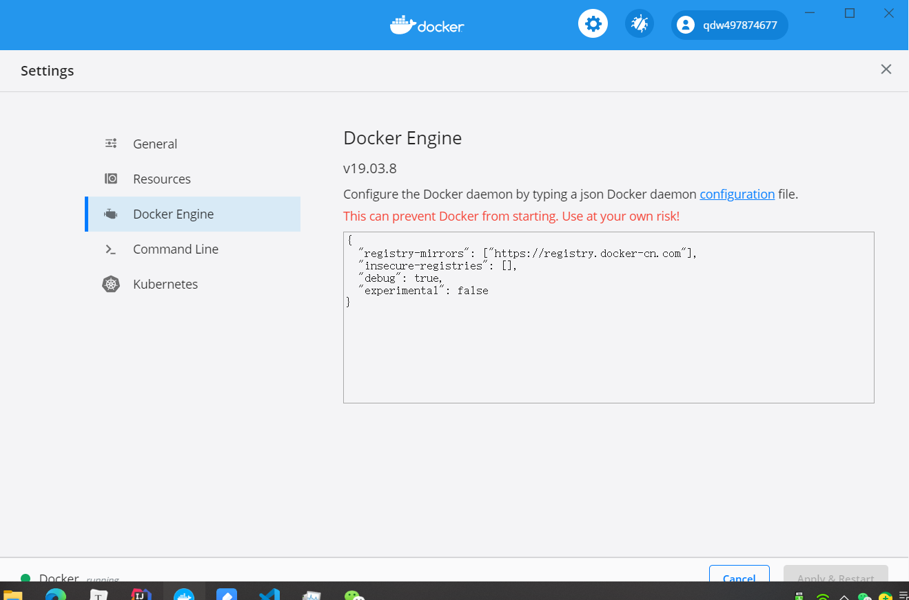
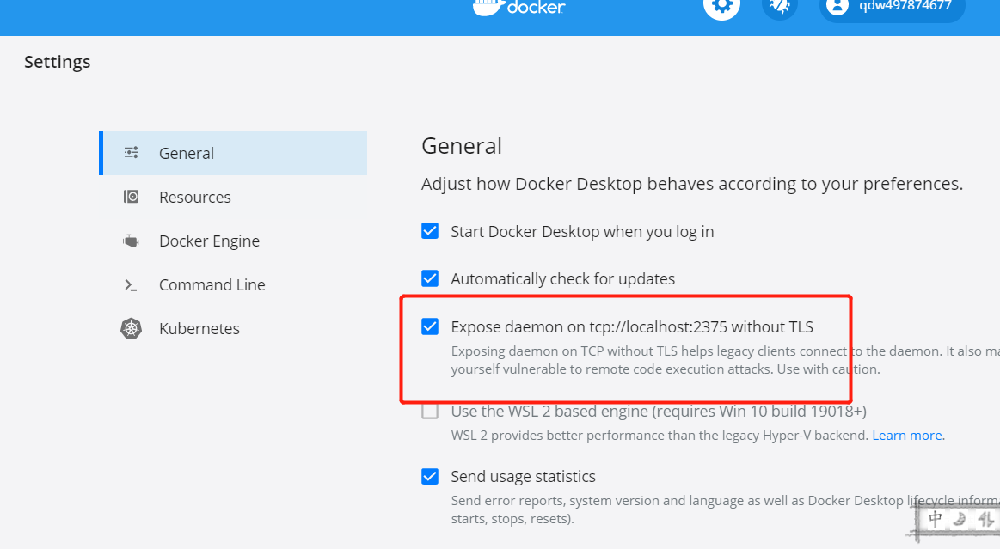
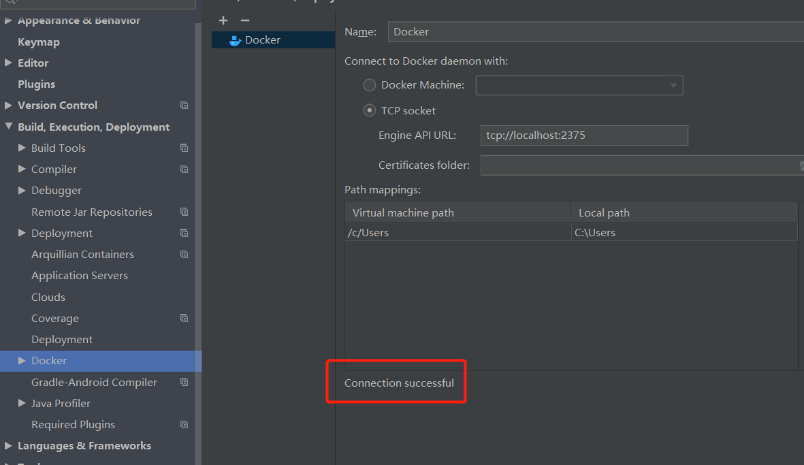
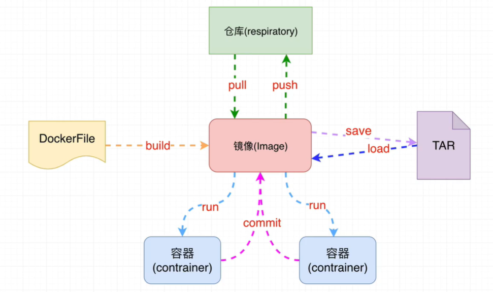

# 安装

## windows

安装hyper-v

将如下代码添加到记事本中，并另存为Hyper-V.cmd文件

~~~bash
pushd "%~dp0"
dir /b %SystemRoot%\servicing\Packages\*Hyper-V*.mum >hyper-v.txt
for /f %%i in ('findstr /i . hyper-v.txt 2^>nul') do dism /online /norestart /add-package:"%SystemRoot%\servicing\Packages\%%i"
del hyper-v.txt
Dism /online /enable-feature /featurename:Microsoft-Hyper-V-All /LimitAccess /ALL
~~~

我们找到Hyper-V.cmd文件图标，在右键菜单中点击：以管理员身份运行

然后弹出一个 用户帐户控制 - Windows命令处理程序 对话框，我们点击：是

然后系统自动进行Windows命令处理，我们等待处理完成以后，【这个过程中不要关闭窗口或者关机】在最末处输入：Y，电脑自动重启，进行配置更新

电脑重启之后，在window管理工具中可以看到已经成功安装了Hyper-V。这样就可以在不用重装专业版系统的情况下，使用Hyper-V虚拟机了

在控制面版中开启

伪装win专业版

管理员cmd执行

~~~cmd
REG ADD "HKEY_LOCAL_MACHINE\software\Microsoft\Windows NT\CurrentVersion" /v EditionId /T REG_EXPAND_SZ /d Professional /F
~~~


设置镜像加速

可以用自己阿里云中的镜像加速



~~~json
{
  "registry-mirrors": ["https://12pqsix0.mirror.aliyuncs.com"],
  "insecure-registries": [],
  "debug": true,
  "experimental": false
}
~~~


在idea中使用docker部署项目

安装docker插件

在docker中设置



在idea中显示连接成功




## ubuntu

~~~shell
sudo apt-get update

sudo apt-get install \
   apt-transport-https \
   ca-certificates \
   curl \
   gnupg-agent \
   software-properties-common
   
curl -fsSL https://download.docker.com/linux/ubuntu/gpg | sudo apt-key add -

sudo add-apt-repository \
   "deb [arch=amd64] https://download.docker.com/linux/ubuntu \
  $(lsb_release -cs) \
  stable"
  
  
sudo apt-get update
sudo apt-get install docker-ce docker-ce-cli containerd.io
sudo docker run hello-world
~~~


# 简介

Docker是一个应用容器平台。

解决什么问题

- 合作开发的时候，在本机可以跑，别人电脑跑不起来
  - 将应用程序打包成镜像，直接运行在容器中。
- 一台服务器上的不同程序相互影响
  - Docker可以帮助隔离
- 部署新的服务器很麻烦


# 核心架构



每个镜像就相当于一个软件环境。


# 基础命令

一、基本命令
docker version查看docker版本
docker info查看docker详细信息
docker --help查看docker命令
二、镜像命令
docker images查看docker镜像

PEPOSITORY：镜像的仓库源
TAG：镜像的标签
IMAGE ID：镜像ID
CREATED：镜像创建时间
SIZE：镜像大小
 同一个仓库源可以有多个TAG，表示这个仓库源的不同版本，我们使用REPOSITORY:TAG来定义不同的镜像。如果不指定一个镜像的版本标签，例如只使用tomcat，docker将默认使用tomcat:latest镜像
docker images -a列出本地所有的镜像
docker images -p只显示镜像ID
docker images --digests显示镜像的摘要信息
docker images --no-trunc显示完整的镜像信息

docker search tomcat从Docker Hub上查找tomcat镜像


STARS：关注度
docker search -s 30 tomcat从Docker Hub上查找关注度大于30的tomcat镜像
docker pull tomcat从Docker Hub上下载tomcat镜像。等价于：docker pull tomcat:latest
docker commit -m "提交的描述信息" -a "作者" 容器ID 要创建的目标镜像名称:[标签名]提交容器使之成为一个新的镜像。
如：docker commit -m "新的tomcat" -a "lizq" f9e29e8455a5 mytomcat:1.2
docker rmi hello-world从Docker中删除hello-world镜像
docker rmi -f hello-world从Docker中强制删除hello-world镜像
docker rmi -f hello-world nginx从Docker中强制删除hello-world镜像和nginx镜像
docker rmi -f $(docker images -p)通过docker images -p查询到的镜像ID来删除所有镜像
三、容器命令。
docker run [OPTIONS] IMAGE根据镜像新建并启动容器。IMAGE是镜像ID或镜像名称
OPTIONS说明：
 --name=“容器新名字”：为容器指定一个名称
 -d：后台运行容器，并返回容器ID，也即启动守护式容器
 -i：以交互模式运行容器，通常与-t同时使用
 -t：为容器重新分配一个伪输入终端，通常与-i同时使用
 -P：随机端口映射
 -p：指定端口映射，有以下四种格式：
  ip:hostPort:containerPort
  ip::containerPort
  hostPort:containerPort
  containerPort
docker ps列出当前所有正在运行的容器
docker ps -a列出所有的容器
docker ps -l列出最近创建的容器
docker ps -n 3列出最近创建的3个容器
docker ps -q只显示容器ID
docker ps --no-trunc显示当前所有正在运行的容器完整信息
exit退出并停止容器
Ctrl+p+q只退出容器，不停止容器
docker start 容器ID或容器名称启动容器
docker restart 容器ID或容器名称重新启动容器
docker stop容器ID或容器名称停止容器
docker kill 容器ID或容器名称强制停止容器
docker rm 容器ID或容器名称删除容器
docker rm -f 容器ID或容器名称强制删除容器
docker rm -f $(docker ps -a -q)删除多个容器
docker logs -f -t --since --tail 容器ID或容器名称查看容器日志
如：docker logs -f -t --since=”2018-09-10” --tail=10 f9e29e8455a5
 -f : 查看实时日志
 -t : 查看日志产生的日期
 --since : 此参数指定了输出日志开始日期，即只输出指定日期之后的日志
 --tail=10 : 查看最后的10条日志
docker top 容器ID或容器名称查看容器内运行的进程
docker inspect 容器ID或容器名称查看容器内部细节
docker attach 容器ID进到容器内
docker exec 容器ID进到容器内
docker cp 容器ID:容器内的文件路径 宿主机路径从容器内拷贝文件到宿主机.
如：docker cp f9e29e8455a5:/tmp/yum.log /root

# 安装Redis

下载最新镜像

~~~bash
docker pull redis
~~~

获取所有安装的镜像列表

~~~bahs
docker images
~~~

创建一个实例

~~~bash
docker run --name myRedis -it -p 6379:6379 redis
~~~

启动另一个终端，启动redis-cli

~~~bash
docker exec -it myRedis redis-cli
~~~


# 安装MySQL

拉取

~~~
docker pull mysql:5.7
~~~

查看镜像 

```
docker images
```

　**创建 MySQL 容器**

```
docker run -id --name=mymysql -p 3306:3306 -e MYSQL_ROOT_PASSWORD=123321 mysql:5.7
```

进入mysql容器

```
docker exec -it mymysql /bin/bash
```

登陆mysql, 密码是上面设的 root

```
mysql -u root -p
```


## 远程访问

## 1. docker拉取mysql镜像

```shell
docker pull mysql
1
```

## 2.拉取完后运行mysql容器

```shell
docker run --name mysql -p 3305:3306 -e MYSQL_ROOT_PASSWORD=123 -d mysql
1
```

解释下：

```
--name :后面是这个镜像的名称
3307:3306：表示在这个容器中使用3307端口(第二个)映射到本机的端口号也为3306(第一个)
-d :后台运行
-e MYSQL_ROOT_PASSWORD=123：设置root初始密码
1234
```

## 3.进入到mysql容器内部

```shell
docker exec -it mysql bash
1
```

登录：

```
mysql -uroot -p123
1
```

查看用户信息：

```
mysql> select host,user,plugin,authentication_string from mysql.user; 
+-----------+------------------+-----------------------+------------------------------------------------------------------------+
| host      | user             | plugin                | authentication_string                                                  |
+-----------+------------------+-----------------------+------------------------------------------------------------------------+
| %         | root             | caching_sha2_password | $A$005$HF7;krfwhkKHp5fPenQm4J2dm/RJtbbyjtCUVdDCcboXQw3ALxsif/sS1 |
| localhost | mysql.infoschema | caching_sha2_password | $A$005$THISISACOMBINATIONOFINVALIDSALTANDPASSWORDTHATMUSTNEVERBRBEUSED |
| localhost | mysql.session    | caching_sha2_password | $A$005$THISISACOMBINATIONOFINVALIDSALTANDPASSWORDTHATMUSTNEVERBRBEUSED |
| localhost | mysql.sys        | caching_sha2_password | $A$005$THISISACOMBINATIONOFINVALIDSALTANDPASSWORDTHATMUSTNEVERBRBEUSED |
| localhost | root             | mysql_native_password | *6BB4837EB74329105EE4568DDA7DC67ED2CA2AD9                              |
+-----------+------------------+-----------------------+------------------------------------------------------------------------+
12345678910
```

备注：host为 % 表示不限制ip localhost表示本机使用 plugin非mysql_native_password 则需要修改密码

修改加密方式：

```
ALTER USER 'root'@'%' IDENTIFIED WITH mysql_native_password BY '123456';  ### 123456 mysql的登录密码
flush privileges;
12
```

在查看用户信息

```
mysql> select host,user,plugin,authentication_string from mysql.user;
+-----------+------------------+-----------------------+------------------------------------------------------------------------+
| host      | user             | plugin                | authentication_string                                                  |
+-----------+------------------+-----------------------+------------------------------------------------------------------------+
| %         | root             | mysql_native_password | *6BB4837EB74329105EE4568DDA7DC67ED2CA2AD9                              |
| localhost | mysql.infoschema | caching_sha2_password | $A$005$THISISACOMBINATIONOFINVALIDSALTANDPASSWORDTHATMUSTNEVERBRBEUSED |
| localhost | mysql.session    | caching_sha2_password | $A$005$THISISACOMBINATIONOFINVALIDSALTANDPASSWORDTHATMUSTNEVERBRBEUSED |
| localhost | mysql.sys        | caching_sha2_password | $A$005$THISISACOMBINATIONOFINVALIDSALTANDPASSWORDTHATMUSTNEVERBRBEUSED |
| localhost | root             | mysql_native_password | *6BB4837EB74329105EE4568DDA7DC67ED2CA2AD9                              |
+-----------+------------------+-----------------------+------------------------------------------------------------------------+
5 rows in set (0.00 sec)
1234567891011
```

刷新配置

```
flush privileges;
```


记得开放端口


# 安装RabbitMQ

下载镜像，这里我下载带web管理界面的

~~~
sudo docker pull rabbitmq：management
~~~

创建容器并运行（15672是管理界面的端口，5672是服务的端口。这里顺便将管理系统的用户名和密码设置为admin admin）

~~~
docker run -dit --name myrabbitmq -e RABBITMQ_DEFAULT_USER=admin -e RABBITMQ_DEFAULT_PASS=admin -p 15672:15672 -p 5672:5672 rabbitmq:management
~~~


# 安装KafKa

安装docker和docker-compose

kafka需要zookeeper管理

## 拉取镜像

~~~bash
docker pull wurstmeister/zookeeper
docker pull wurstmeister/kafka
~~~


## 启动kafka

可能会JVM内存不足，所以多一个设置。docker logs kafka看日志

~~~bash
docker run -d --name kafka -p 9092:9092 -e KAFKA_BROKER_ID=0 -e KAFKA_HEAP_OPTS="-Xmx256M -Xms256M" -e KAFKA_ZOOKEEPER_CONNECT=49.233.90.47:2181 -e KAFKA_ADVERTISED_LISTENERS=PLAINTEXT://49.233.90.47:9092 -e KAFKA_LISTENERS=PLAINTEXT://0.0.0.0:9092 -t wurstmeister/kafka
~~~

## 测试

进入kafka容器

~~~bash
docker exec -ti kafka /bin/bash
~~~