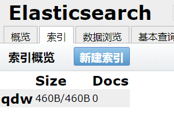

[**首页**](https://github.com/qdw497874677/myNotes/blob/master/首页检索.md)

# 简介

ElasticSearch是一个开源的高扩展的分布式全文检索引擎。使用java开发并使用Lucene作为核心来实现所有的索引和搜索功能。通过RESTful API简化Lucene的操作。


Solr，用java开发基于Lucene的全文搜索服务器。提供网络API、用户可以通过HTTP请求向服务器提交一定格式的文件，生成索引；也可以通过提出查找请求，得到返回结果。

对比

- es开箱即用很简单；solr略复杂。
- solr利用Zookeeper进行分布式管理；而es自身带有分布式协调管理功能。
- solr支持更多格式的数据比如json、xml、csv；es只支持json。
- solr官方提供的功能更多；es本身更注重核心功能，高级功能有很多第三方插件提供。
- solr查询快，但是更新索引时慢（插入删除慢）；es建索引快，即实时性查询快。


## ELK

Elasticsearch、Logstash、Kibana三大开源框架首字母。Logstash是ELK的中央数据引擎，用不同目标收的不同格式的数据，经过过滤后支持输出到不同目的地。Kibana可以将Elasticsearch的数据展示出来。

# 安装ES和head插件

下载并解压


重要的目录

- config：放配置文件
  - elasticsearch.yml：es的配置文件。
    - 默认端口：9200
  - jvm.options：jvm的配置文件，配置不好可以改一下内存占用大小。
  - log4j2.properties：日志配置文件。
- libs：相关jar包。
- logs：日志。
- modules：功能模块。
- plugins：插件。


启动

双击bin目录中的elasticsearch.bat


启动完成后访问9200端口


## 安装可视化插件head

在github上下载。

解压后cmd命令安装。

~~~bash
cnpm install
~~~

安装完启动。

~~~bash
npm run start
~~~


端口使9100。然后要解决跨域问题。

在elasticsearch.yml中添加。

~~~
http.cors.enabled: true
http.cors.allow-origin: "*"
~~~

重启ES。

刷新9100。


连接成功。

创建一个索引。




可以把ES当做一个数据库。索引就是一个表。


# 安装Kibana

Kibana用来搜索、查看交互存储在ElasticSearch索引中的数据。

## 下载安装

版本要个ES一致。

解压

## 启用

双击bin目录下的kibana.bat

要保证磁盘空间足够，否则kibana会将一个索引设置为只读，产生问题。

端口：5601


配置中文

中文在这个目录下


在config目录的kibana.yml中添加

~~~
i18n.locale: "zh-CN"
~~~

重启下kibana

访问5601


# 理解ES

ES是面向文档的。一切都是json。

和关系型数据库对比。

| Relational BD      | ElasticSearch             |
| ------------------ | ------------------------- |
| 数据库（database） | 索引（indices）           |
| 表（tables）       | types。新版本逐渐弃用了。 |
| 行（rows）         | 文档（documents）         |
| 字段（columns）    | 字段（fields）            |


物理设计：

ES在后台把每个索引划分为多个分片，每个分片可以再集群中的不同服务器间迁移。

逻辑设计：

一个索引类型中，包含多个文档。可以通过一定的顺序找到：索引——类型——文档id。


倒排索引


正向索引就是，一个文档的id，他对应着这个文档中的关键词列表。倒排索引就是把文件ID对应到关键词的映射转换为关键词到文件ID的映射。每个关键词都对应着一系列的文件，这些人间中都出现这个关键词。

# IK分词器插件

分词：把一段话分解成多个单词。

如果操作中文，建议使用IK分词器。


## 下载解压

将文件夹放到ES的插件目录下


全部重启

观察到加载了插件


通过命令查看加载的插件

~~~
elasticsearch-plugin list
~~~

重启kibana

用kibana中的开发工具测试


IK分词器提供了两个分词算法：

- ik_smart：最少切分，没有重复的词
- ik_max_word：最细粒度划分，尽可能组合，有重复的词


测试一个分词，用ik_smart

~~~json
GET _analyze
{
  "analyzer": "ik_smart",
  "text": "今天是个好日子"
}
~~~

响应

~~~json
{
  "tokens" : [
    {
      "token" : "今天是",
      "start_offset" : 0,
      "end_offset" : 3,
      "type" : "CN_WORD",
      "position" : 0
    },
    {
      "token" : "个",
      "start_offset" : 3,
      "end_offset" : 4,
      "type" : "CN_CHAR",
      "position" : 1
    },
    {
      "token" : "好日子",
      "start_offset" : 4,
      "end_offset" : 7,
      "type" : "CN_WORD",
      "position" : 2
    }
  ]
}

~~~

用ik_max_word

~~~json
GET _analyze
{
  "analyzer": "ik_max_word",
  "text": "今天是个好日子"
}
~~~

响应

~~~json
{
  "tokens" : [
    {
      "token" : "今天是",
      "start_offset" : 0,
      "end_offset" : 3,
      "type" : "CN_WORD",
      "position" : 0
    },
    {
      "token" : "今天",
      "start_offset" : 0,
      "end_offset" : 2,
      "type" : "CN_WORD",
      "position" : 1
    },
    {
      "token" : "是",
      "start_offset" : 2,
      "end_offset" : 3,
      "type" : "CN_CHAR",
      "position" : 2
    },
    {
      "token" : "个",
      "start_offset" : 3,
      "end_offset" : 4,
      "type" : "CN_CHAR",
      "position" : 3
    },
    {
      "token" : "好日子",
      "start_offset" : 4,
      "end_offset" : 7,
      "type" : "CN_WORD",
      "position" : 4
    },
    {
      "token" : "日子",
      "start_offset" : 5,
      "end_offset" : 7,
      "type" : "CN_WORD",
      "position" : 5
    }
  ]
}

~~~


拆分“我就是权大玮”

~~~json
GET _analyze
{
  "analyzer": "ik_smart",
  "text": "我就是权大玮"
}
~~~

发现权大玮被拆开，分词器不认为这是个单词

~~~json
{
  "tokens" : [
    {
      "token" : "我",
      "start_offset" : 0,
      "end_offset" : 1,
      "type" : "CN_CHAR",
      "position" : 0
    },
    {
      "token" : "就是",
      "start_offset" : 1,
      "end_offset" : 3,
      "type" : "CN_WORD",
      "position" : 1
    },
    {
      "token" : "权",
      "start_offset" : 3,
      "end_offset" : 4,
      "type" : "CN_CHAR",
      "position" : 2
    },
    {
      "token" : "大",
      "start_offset" : 4,
      "end_offset" : 5,
      "type" : "CN_CHAR",
      "position" : 3
    },
    {
      "token" : "玮",
      "start_offset" : 5,
      "end_offset" : 6,
      "type" : "CN_CHAR",
      "position" : 4
    }
  ]
}
~~~


可以将自己需要的词加到字典中。

在分词器目录中的config目录中创建一个.dic文件


加入一个单词


在IKAnalyzer.cfg.xml中配置自己的扩展字典

~~~xml
<?xml version="1.0" encoding="UTF-8"?>
<!DOCTYPE properties SYSTEM "http://java.sun.com/dtd/properties.dtd">
<properties>
	<comment>IK Analyzer 扩展配置</comment>
	<!--用户可以在这里配置自己的扩展字典 -->
	<entry key="ext_dict">qdw.dic</entry>
	 <!--用户可以在这里配置自己的扩展停止词字典-->
	<entry key="ext_stopwords"></entry>
	<!--用户可以在这里配置远程扩展字典 -->
	<!-- <entry key="remote_ext_dict">words_location</entry> -->
	<!--用户可以在这里配置远程扩展停止词字典-->
	<!-- <entry key="remote_ext_stopwords">words_location</entry> -->
</properties>

~~~

重启ES

重新测试

发现“权大玮”作为了一个词

~~~json
{
  "tokens" : [
    {
      "token" : "我",
      "start_offset" : 0,
      "end_offset" : 1,
      "type" : "CN_CHAR",
      "position" : 0
    },
    {
      "token" : "就是",
      "start_offset" : 1,
      "end_offset" : 3,
      "type" : "CN_WORD",
      "position" : 1
    },
    {
      "token" : "权大玮",
      "start_offset" : 3,
      "end_offset" : 6,
      "type" : "CN_WORD",
      "position" : 2
    }
  ]
}
~~~


# Rest风格操作

用Rest操作ES

| method | url                                             | 描述                   |
| ------ | ----------------------------------------------- | ---------------------- |
| PUT    | localhost:9200/索引名称/类型名称/文档id         | 创建文档（指定文档id） |
| POST   | localhost:9200/索引名称/类型名称                | 创建文档（随机文档id） |
| POST   | localhost:9200/索引名称/类型名称/文档id/_update | 修改文档               |
| DELETE | localhost:9200/索引名称/类型名称/文档id         | 删除文档               |
| GET    | localhost:9200/索引名称/类型名称/文档id         | 通过文档id查询文档     |
| POST   | localhost:9200/索引名称/类型名称/_search        | 查询所有文档           |

这里在kibana测试

创建一个文档

~~~json
PUT /test1/type1/1
{
  "name":"qdw",
  "age":"18"
}
~~~

响应，创建成功

~~~json
#! Deprecation: [types removal] Specifying types in document index requests is deprecated, use the typeless endpoints instead (/{index}/_doc/{id}, /{index}/_doc, or /{index}/_create/{id}).
{
  "_index" : "test1",
  "_type" : "type1",
  "_id" : "1",
  "_version" : 1,
  "result" : "created",
  "_shards" : {
    "total" : 2,
    "successful" : 1,
    "failed" : 0
  },
  "_seq_no" : 0,
  "_primary_term" : 1
}
~~~


字段的类型：

- 字符串类型
  - text、keyword
- 数值类型
  - long、integer、short、byte、double、float、half float、scaled float
- 日期类型
  - date
- 布尔值类型
  - boolean
- 二进制类型
  - binary


## 关于索引的操作


创建规则，指定字段的类型。相当于数据库的建表，指定字段名和字段类型。

~~~json
PUT /test2
{
  "mappings": {
    "properties": {
      "name": {
        "type": "text"
      },
      "age": {
        "type": "integer"
      },
       "birthday": {
        "type": "date"
      }
    }
  }
}
~~~

响应，成功

~~~json
{
  "acknowledged" : true,
  "shards_acknowledged" : true,
  "index" : "test2"
}
~~~


获取规则

~~~json
GET test2
~~~

响应

~~~json
{
  "test2" : {
    "aliases" : { },
    "mappings" : {
      "properties" : {
        "age" : {
          "type" : "integer"
        },
        "birthday" : {
          "type" : "date"
        },
        "name" : {
          "type" : "text"
        }
      }
    },
    "settings" : {
      "index" : {
        "creation_date" : "1588600414582",
        "number_of_shards" : "1",
        "number_of_replicas" : "1",
        "uuid" : "pcDk6afPRROikScYzFqLhg",
        "version" : {
          "created" : "7060299"
        },
        "provided_name" : "test2"
      }
    }
  }
}

~~~


查看默认信息

~~~json
PUT /test3/_doc/1
{
  "name": "qdw",
  "age": 18,
  "birthday": "1996-04-02"
}
~~~

响应，没有索引规则的话，它会默认给一个类型

~~~json
{
  "test3" : {
    "aliases" : { },
    "mappings" : {
      "properties" : {
        "age" : {
          "type" : "long"
        },
        "birthday" : {
          "type" : "date"
        },
        "name" : {
          "type" : "text",
          "fields" : {
            "keyword" : {
              "type" : "keyword",
              "ignore_above" : 256
            }
          }
        }
      }
    },
    "settings" : {
      "index" : {
        "creation_date" : "1588600742129",
        "number_of_shards" : "1",
        "number_of_replicas" : "1",
        "uuid" : "ZwHOFynbTmezsK7hlX6AaQ",
        "version" : {
          "created" : "7060299"
        },
        "provided_name" : "test3"
      }
    }
  }
}
~~~


拓展命令：

获取健康值

~~~json
GET _cat/health
~~~

响应

~~~json
1588601186 14:06:26 elasticsearch yellow 1 1 11 11 0 0 8 0 - 57.9%
~~~

获取所有索引信息

~~~json
GET _cat/indices?v
~~~

响应

~~~json
health status index                    uuid                   pri rep docs.count docs.deleted store.size pri.store.size
yellow open   test2                    pcDk6afPRROikScYzFqLhg   1   1          0            0       283b           283b
yellow open   test3                    ZwHOFynbTmezsK7hlX6AaQ   1   1          1            0      3.9kb          3.9kb
green  open   .kibana_task_manager_1   ikOSFPESSSakOGQmRc4IoA   1   0          2            0     12.4kb         12.4kb
yellow open   qdw                      lccxJH-VQm-vZt0qG-Y-vg   5   1          0            0      1.3kb          1.3kb
green  open   .apm-agent-configuration Aczi_fdpSh-AehPhdC9iaA   1   0          0            0       283b           283b
green  open   .kibana_1                AECvwQf-SbS0sUeNYHbsCg   1   0         15            5     81.9kb         81.9kb
yellow open   test1                    IUUHaaRrTZOhPa38nX_CZw   1   1          1            0        4kb            4kb

~~~


修改可以用PUT或POST去覆盖，也可以用POST加_update来更新。

修改之后版本号增加。状态改为"updated"

~~~json
POST /test3/_doc/1/_update
{
  "doc":{
    "name":"qqq"
  }
}
~~~

响应

~~~json
#! Deprecation: [types removal] Specifying types in document update requests is deprecated, use the endpoint /{index}/_update/{id} instead.
{
  "_index" : "test3",
  "_type" : "_doc",
  "_id" : "1",
  "_version" : 3,
  "result" : "noop",
  "_shards" : {
    "total" : 0,
    "successful" : 0,
    "failed" : 0
  },
  "_seq_no" : 2,
  "_primary_term" : 1
}
~~~


删除索引，DELETE。或者删文档DELETE /test1/type1/1

~~~json
DELETE /test1
~~~

响应

~~~json
{
  "acknowledged" : true
}
~~~


## 关于文档的操作

先创建一个索引和文档

~~~json
PUT /test1/user/1
{
  "name":"qdw",
  "age":18,
  "desc":"找不到实习，很烦。",
  "tags":["单身","直男"]
}
~~~

响应

~~~json
#! Deprecation: [types removal] Specifying types in document index requests is deprecated, use the typeless endpoints instead (/{index}/_doc/{id}, /{index}/_doc, or /{index}/_create/{id}).
{
  "_index" : "test1",
  "_type" : "user",
  "_id" : "1",
  "_version" : 1,
  "result" : "created",
  "_shards" : {
    "total" : 2,
    "successful" : 1,
    "failed" : 0
  },
  "_seq_no" : 0,
  "_primary_term" : 1
}
~~~

获取文档

~~~json
GET /test1/user/1
~~~

根据条件获取

~~~json
GET /test1/user/_search?q=name:qdw
~~~

响应

~~~json
#! Deprecation: [types removal] Specifying types in search requests is deprecated.
{
  "took" : 3,
  "timed_out" : false,
  "_shards" : {
    "total" : 1,
    "successful" : 1,
    "skipped" : 0,
    "failed" : 0
  },
  "hits" : {
    "total" : {
      "value" : 1,
      "relation" : "eq"
    },
    "max_score" : 0.6931471,
    "hits" : [
      {
        "_index" : "test1",
        "_type" : "user",
        "_id" : "1",
        "_score" : 0.6931471,
        "_source" : {
          "name" : "qdw",
          "age" : 18,
          "desc" : "找不到实习，很烦。",
          "tags" : [
            "单身",
            "直男"
          ]
        }
      }
    ]
  }
}
~~~

查text类型的desc

~~~json
GET /test1/user/_search?q=desc:"实习"
~~~

响应

~~~json
#! Deprecation: [types removal] Specifying types in search requests is deprecated.
{
  "took" : 1,
  "timed_out" : false,
  "_shards" : {
    "total" : 1,
    "successful" : 1,
    "skipped" : 0,
    "failed" : 0
  },
  "hits" : {
    "total" : {
      "value" : 1,
      "relation" : "eq"
    },
    "max_score" : 1.2471496,
    "hits" : [
      {
        "_index" : "test1",
        "_type" : "user",
        "_id" : "1",
        "_score" : 1.2471496,
        "_source" : {
          "name" : "qdw",
          "age" : 18,
          "desc" : "找不到实习，很烦。",
          "tags" : [
            "单身",
            "直男"
          ]
        }
      }
    ]
  }
}
~~~

### 复杂查询

先添加一个数据

~~~json
PUT /test1/user/3
{
  "name":"权大玮哥哥",
  "age":18,
  "desc":"找不到实习，很烦。",
  "tags":["单身","直男"]
}
PUT /test1/user/4
{
  "name":"权大玮弟弟",
  "age":10,
  "desc":"不找实习了。",
  "tags":["单身","直男"]
}
~~~

#### 单值查询

~~~json
GET test1/user/_search
{
  "query": {
    "match": {
      "name": "权大玮"
    }
  }
}
~~~

响应。包含一个字就能查到。（之前qdw查q不行，要求是单词）

~~~json
#! Deprecation: [types removal] Specifying types in search requests is deprecated.
{
  "took" : 782,
  "timed_out" : false,
  "_shards" : {
    "total" : 1,
    "successful" : 1,
    "skipped" : 0,
    "failed" : 0
  },
  "hits" : {
    "total" : {
      "value" : 2,
      "relation" : "eq"
    },
    "max_score" : 0.5446157,
    "hits" : [
      {
        "_index" : "test1",
        "_type" : "user",
        "_id" : "3",
        "_score" : 0.5446157,
        "_source" : {
          "name" : "权大玮哥哥",
          "age" : 18,
          "desc" : "找不到实习，很烦。",
          "tags" : [
            "单身",
            "直男"
          ]
        }
      },
      {
        "_index" : "test1",
        "_type" : "user",
        "_id" : "4",
        "_score" : 0.5446157,
        "_source" : {
          "name" : "权大玮弟弟",
          "age" : 10,
          "desc" : "不找实习了。",
          "tags" : [
            "单身",
            "直男"
          ]
        }
      }
    ]
  }
}
~~~

hit包含：

- 查询的结果总数
- 关系
- 最大分数
- 具体结果
- 。。。

#### 查询指定字段

~~~json
GET test1/user/_search
{
  "query": {
    "match": {
      "name": "玮"
    }
  },
  "_source": ["name","desc"]
}
~~~

响应

~~~json
#! Deprecation: [types removal] Specifying types in search requests is deprecated.
{
  "took" : 3,
  "timed_out" : false,
  "_shards" : {
    "total" : 1,
    "successful" : 1,
    "skipped" : 0,
    "failed" : 0
  },
  "hits" : {
    "total" : {
      "value" : 2,
      "relation" : "eq"
    },
    "max_score" : 0.5446157,
    "hits" : [
      {
        "_index" : "test1",
        "_type" : "user",
        "_id" : "3",
        "_score" : 0.5446157,
        "_source" : {
          "name" : "权大玮哥哥",
          "desc" : "找不到实习，很烦。"
        }
      },
      {
        "_index" : "test1",
        "_type" : "user",
        "_id" : "4",
        "_score" : 0.5446157,
        "_source" : {
          "name" : "权大玮弟弟",
          "desc" : "不找实习了。"
        }
      }
    ]
  }
}
~~~

#### 查询排序

升序asc，降序desc

~~~json
GET test1/user/_search
{
  "query": {
    "match": {
      "name": "玮"
    }
  },
  "sort": [
    {
      "age": {
        "order": "desc"
      }
    }
  ]
}
~~~

#### 分页查询

从第from条数据开始，页大小为1

~~~json
GET test1/user/_search
{
  "query": {
    "match": {
      "name": "玮"
    }
  },
  "sort": [
    {
      "age": {
        "order": "asc"
      }
    }
  ],
  "from": 0,
  "size": 1
}
~~~

#### 多条件查询

加一个bool

must：两个match都要匹配，相当于and

~~~json
GET test1/user/_search
{
  "query": {
    "bool": {
      "must": [
        {
          "match": {
            "name": "权"
          }
        },
        {
          "match": {
            "age": 10
          }
        }
      ]
    }
  }
~~~

should：相当于or

~~~json
GET test1/user/_search
{
  "query": {
    "bool": {
      "should": [
        {
          "match": {
            "name": "权"
          }
        },
        {
          "match": {
            "age": 10
          }
        }
      ]
    }
  }
}
~~~

must_not：相当于not

~~~json
GET test1/user/_search
{
  "query": {
    "bool": {
      "must_not": [
        {
          "match": {
            "name": "权"
          }
        },
        {
          "match": {
            "age": 10
          }
        }
      ]
    }
  }
}
~~~

#### 过滤

大于等于18小于等于20

- gt：大于
- gte：大于等于
- lt：小于
- lte：小于等于

~~~json
GET test1/user/_search
{
  "query": {
    "bool": {
      "must_not": [
        {
          "match": {
            "name": "权"
          }
        }
      ],
      "filter": [
        {
          "range": {
            "age": {
              "gte": 18,
              "lte": 20
            }
          }
        }
      ]
    }
  }
}
~~~


#### 多匹配查询

匹配集合中的多个元素

tags里面有元素包含了一个，就可以被查询出来

~~~json
GET test1/user/_search
{
  "query": {
    "match": {
      "tags": "直 渣"
    }
  }
}
~~~


#### 精确查询

keyword类型的不会被拆分，会当成一个整体关键字。

term，利用倒排索引，精确匹配关键字。而match是通过分析文档，包含关键字就会匹配的，会给出不同的分数。

~~~json
GET test1/user/_search
{
  "query": {
    "term": {
      "name": "qdw"
    }
  }
}
~~~


#### 多个精确查询

bool，把后面的match替换成term。


#### 高亮查询

选择要高亮的字段

~~~json
GET test1/_search
{
  "query": {
    "match": {
      "desc": "实习"
    }
  },
  "highlight": {
    "fields": {
      "desc": {}
    }
  }
}
~~~

可以自定义标签

~~~json
GET test1/_search
{
  "query": {
    "match": {
      "desc": "实习"
    }
  },
  "highlight": {
    "pre_tags": "<p class='key' style='color:red'>",
    "post_tags": "</p>", 
    "fields": {
      "desc": {}
    }
  }
}
~~~

响应

~~~json
{
  "took" : 2,
  "timed_out" : false,
  "_shards" : {
    "total" : 1,
    "successful" : 1,
    "skipped" : 0,
    "failed" : 0
  },
  "hits" : {
    "total" : {
      "value" : 3,
      "relation" : "eq"
    },
    "max_score" : 1.1116803,
    "hits" : [
      {
        "_index" : "test1",
        "_type" : "user",
        "_id" : "4",
        "_score" : 1.1116803,
        "_source" : {
          "name" : "权大玮弟弟",
          "age" : 10,
          "desc" : "不找实习了。",
          "tags" : [
            "单身",
            "直男"
          ]
        },
        "highlight" : {
          "desc" : [
            "不找<p class='key' style='color:red'>实</p><p class='key' style='color:red'>习</p>了。"
          ]
        }
      },
      {
        "_index" : "test1",
        "_type" : "user",
        "_id" : "1",
        "_score" : 0.9614533,
        "_source" : {
          "name" : "qdw",
          "age" : 18,
          "desc" : "找不到实习，很烦。",
          "tags" : [
            "单身",
            "直男"
          ]
        },
        "highlight" : {
          "desc" : [
            "找不到<p class='key' style='color:red'>实</p><p class='key' style='color:red'>习</p>，很烦。"
          ]
        }
      },
      {
        "_index" : "test1",
        "_type" : "user",
        "_id" : "3",
        "_score" : 0.9614533,
        "_source" : {
          "name" : "权大玮哥哥",
          "age" : 18,
          "desc" : "找不到实习，很烦。",
          "tags" : [
            "单身",
            "直男"
          ]
        },
        "highlight" : {
          "desc" : [
            "找不到<p class='key' style='color:red'>实</p><p class='key' style='color:red'>习</p>，很烦。"
          ]
        }
      }
    ]
  }
}

~~~


# 集成SpringBoot

建项目


要保证导入es依赖的版本和要连接的es版本一致。

默认的是6.8.7


改成7.6.2

~~~xml
<properties>
	<java.version>1.8</java.version>				  <elasticsearch.version>7.6.2</elasticsearch.version>
</properties>
~~~


配置ES，配置Bean

~~~java
package com.qdw.config;

import org.apache.http.HttpHost;
import org.elasticsearch.client.RestClient;
import org.elasticsearch.client.RestHighLevelClient;
import org.springframework.context.annotation.Bean;
import org.springframework.context.annotation.Configuration;

@Configuration
public class ElasticSearchConfig {
    @Bean
    public RestHighLevelClient restHighLevelClient(){
        RestHighLevelClient client = new RestHighLevelClient(
                RestClient.builder(
                        //集群可以new多个
                        new HttpHost("127.0.0.1", 9200, "http")));
        return client;
    }
}

~~~


# 关于索引的API操作

创建索引

~~~java
@SpringBootTest
class EsApiApplicationTests {
    @Autowired
    private RestHighLevelClient restHighLevelClient;
    @Test
    void testCreateIndex() throws IOException {
        //创建 创建索引的请求
        CreateIndexRequest request = new CreateIndexRequest("qdw_index");
        //执行请求，获得相应
        CreateIndexResponse response = restHighLevelClient.indices().create(request, RequestOptions.DEFAULT);
        System.out.println(response);
    }

}
~~~

返回的response

~~~
org.elasticsearch.client.indices.CreateIndexResponse@455b2c36
~~~


获取索引

```java
@Test
void testExistIndex() throws IOException {
    //获取索引
    GetIndexRequest request = new GetIndexRequest("qdw_index");
    boolean exists = restHighLevelClient.indices().exists(request, RequestOptions.DEFAULT);
    System.out.println(exists);
}
```
删除索引

~~~java
    @Test
    void testDeleteIndex() throws IOException {
        //删除索引
        DeleteIndexRequest request = new DeleteIndexRequest("qdw_index");
        AcknowledgedResponse delete = restHighLevelClient.indices().delete(request, RequestOptions.DEFAULT);
        System.out.println(delete);
    }
~~~


# 关于文档的API操作

引入一下fastjson的依赖


添加文档数据

~~~java
    @Test
    void testAddDocument() throws IOException {
        //创建对象
        User user = new User("权大玮",18);
        //创建请求
        IndexRequest indexRequest = new IndexRequest("qdw_index");
        //设置规则
        indexRequest.id("1");
        indexRequest.timeout(TimeValue.timeValueSeconds(1));
        //将数据放入请求,用json
        indexRequest.source(JSON.toJSONString(user), XContentType.JSON);
        //客户端发送请求
        IndexResponse response = restHighLevelClient.index(indexRequest, RequestOptions.DEFAULT);
        //获取响应结果
        System.out.println(response);
    }
~~~


查看文档是否存在

~~~java
    @Test
    void testExistsDocument() throws IOException {
        //获取文档请求
        GetRequest request = new GetRequest("qdw_index", "1");
        //不获取返回的_source的上下文了，不重要
        request.fetchSourceContext(new FetchSourceContext(false));
        boolean exists = restHighLevelClient.exists(request, RequestOptions.DEFAULT);
        System.out.println(exists);
    }
~~~


获取文档信息

~~~java
    @Test
    void testGetDocument() throws IOException {
        //获取文档请求
        GetRequest request = new GetRequest("qdw_index", "1");
        //获取文档信息
        GetResponse documentFields = restHighLevelClient.get(request, RequestOptions.DEFAULT);
        System.out.println(documentFields.getSourceAsString());
    }
~~~

~~~
{"age":18,"name":"权大玮"}
~~~


更新文档

~~~java
    @Test
	//更新文档
    void testUpdateDocument() throws IOException {
        UpdateRequest request = new UpdateRequest("qdw_index", "1");
        request.timeout("1s");
        User user = new User("权巨玮", 20);
        request.doc(JSON.toJSONString(user),XContentType.JSON);
        UpdateResponse update = restHighLevelClient.update(request, RequestOptions.DEFAULT);
        System.out.println(update);
    }
~~~


删除文档

~~~java
    @Test
    void testDeleteDocument() throws IOException {
        //删除文档
        DeleteRequest request = new DeleteRequest("qdw_index", "1");
        DeleteResponse delete = restHighLevelClient.delete(request, RequestOptions.DEFAULT);
        System.out.println(delete.status());
    }
~~~


批量处理

~~~java
    @Test
    void testBulkRequest() throws IOException {
        //批处理
        BulkRequest bulkRequest = new BulkRequest();
        bulkRequest.timeout("10s");
        List<User> userList = new ArrayList<>();
        userList.add(new User("qdw1",15));
        userList.add(new User("qdw2",16));
        userList.add(new User("qdw3",17));
        for (int i = 0; i < userList.size(); i++) {
            bulkRequest.add(new IndexRequest("qdw_index")
                    //不设置id就会用默认随机id
                    .id(""+(i+1))
                    .source(JSON.toJSONString(userList.get(i)),XContentType.JSON));
        }
        BulkResponse bulk = restHighLevelClient.bulk(bulkRequest, RequestOptions.DEFAULT);
        System.out.println(bulk.status());
    }
~~~


查询

~~~java
    @Test
    void testSearch() throws IOException {
        //创建搜索请求
        SearchRequest request = new SearchRequest("qdw_index");
        //构建搜索条件
        SearchSourceBuilder searchSourceBuilder = new SearchSourceBuilder();
        //使用QueryBuilders快速构建条件
        TermQueryBuilder termQueryBuilder = QueryBuilders.termQuery("name", "qdw1");
        searchSourceBuilder.query(termQueryBuilder);
        //设置超时时间
        searchSourceBuilder.timeout(new TimeValue(10, TimeUnit.SECONDS));
        //分页
//        searchSourceBuilder.from();
//        searchSourceBuilder.size();
        //把查询放入请求
        request.source(searchSourceBuilder);
        //把请求放进客户端
        SearchResponse search = restHighLevelClient.search(request, RequestOptions.DEFAULT);
        System.out.println(JSON.toJSONString(search.getHits()));
        System.out.println("~~~~~~~~~~~~~~~~~~~~~~~~~~~~~~~");
        for (SearchHit hit : search.getHits().getHits()) {
            System.out.println(hit.getSourceAsMap());
        }
    }
~~~


# 京东搜索——项目搭建


构建项目


关闭thymeleaf缓存

~~~properties
# 关闭thymeleaf的缓存
spring.thymeleaf.cache=false
~~~

导入前端页面资源


# 京东搜索——爬取数据

jsoup（音乐电影用tika）

导入依赖

~~~xml
<?xml version="1.0" encoding="UTF-8"?>
<project xmlns="http://maven.apache.org/POM/4.0.0" xmlns:xsi="http://www.w3.org/2001/XMLSchema-instance"
         xsi:schemaLocation="http://maven.apache.org/POM/4.0.0 https://maven.apache.org/xsd/maven-4.0.0.xsd">
    <modelVersion>4.0.0</modelVersion>
    <parent>
        <groupId>org.springframework.boot</groupId>
        <artifactId>spring-boot-starter-parent</artifactId>
        <version>2.2.6.RELEASE</version>
        <relativePath/> <!-- lookup parent from repository -->
    </parent>
    <groupId>com.qdw</groupId>
    <artifactId>es-jd</artifactId>
    <version>0.0.1-SNAPSHOT</version>
    <name>es-jd</name>
    <description>Demo project for Spring Boot</description>

    <properties>
        <java.version>1.8</java.version>
        <elasticsearch.version>7.6.2</elasticsearch.version>
    </properties>

    <dependencies>
<!--        解析网页-->
        <dependency>
            <groupId>org.jsoup</groupId>
            <artifactId>jsoup</artifactId>
            <version>1.13.1</version>
        </dependency>
        <dependency>
            <groupId>com.alibaba</groupId>
            <artifactId>fastjson</artifactId>
            <version>1.2.68</version>
        </dependency>
        <dependency>
            <groupId>org.springframework.boot</groupId>
            <artifactId>spring-boot-starter-data-elasticsearch</artifactId>
        </dependency>
        <dependency>
            <groupId>org.springframework.boot</groupId>
            <artifactId>spring-boot-starter-thymeleaf</artifactId>
        </dependency>
        <dependency>
            <groupId>org.springframework.boot</groupId>
            <artifactId>spring-boot-starter-web</artifactId>
        </dependency>

        <dependency>
            <groupId>org.springframework.boot</groupId>
            <artifactId>spring-boot-devtools</artifactId>
            <scope>runtime</scope>
            <optional>true</optional>
        </dependency>
        <dependency>
            <groupId>org.springframework.boot</groupId>
            <artifactId>spring-boot-configuration-processor</artifactId>
            <optional>true</optional>
        </dependency>
        <dependency>
            <groupId>org.projectlombok</groupId>
            <artifactId>lombok</artifactId>
            <optional>true</optional>
        </dependency>
        <dependency>
            <groupId>org.springframework.boot</groupId>
            <artifactId>spring-boot-starter-test</artifactId>
            <scope>test</scope>
            <exclusions>
                <exclusion>
                    <groupId>org.junit.vintage</groupId>
                    <artifactId>junit-vintage-engine</artifactId>
                </exclusion>
            </exclusions>
        </dependency>
    </dependencies>

    <build>
        <plugins>
            <plugin>
                <groupId>org.springframework.boot</groupId>
                <artifactId>spring-boot-maven-plugin</artifactId>
            </plugin>
        </plugins>
    </build>

</project>

~~~


爬取代码

~~~java
package com.qdw.util;

import com.qdw.pojo.Content;
import org.jsoup.Jsoup;
import org.jsoup.nodes.Document;
import org.jsoup.nodes.Element;
import org.jsoup.select.Elements;

import java.io.IOException;
import java.net.MalformedURLException;
import java.net.URL;
import java.util.ArrayList;
import java.util.List;

public class HtmlParseUtil {
    public static void main(String[] args) throws IOException {
        List<Content> list = praseJD("java");
        list.forEach(System.out::println);
        System.out.println("size="+list.size());
    }
    public static List<Content> praseJD(String keywords) throws IOException {
        String url = "https://search.jd.com/Search?keyword="+keywords;
        //解析网页
        Document document = Jsoup.parse(new URL(url), 30000);
        Element element = document.getElementById("J_goodsList");
        //获取所有li标签
        Elements li = document.getElementsByTag("li");
        //获取元素
        List<Content> goodsList = new ArrayList<>();
        for (Element e : li) {
            //String img = e.getElementsByTag("img").eq(0).attr("data-lazy-img");
            String img = e.getElementsByTag("img").eq(0).attr("src");
            if (img==null || img==""){
                continue;
            }
            String price = e.getElementsByClass("p-price").eq(0).text();
            String title = e.getElementsByClass("p-name").eq(0).text();
            goodsList.add(new Content(title,img,price));
        }
        return goodsList;
    }
}

~~~


# 京东搜索——业务代码


业务层

爬取并入库

查询

~~~java
package com.qdw.Service;

import com.alibaba.fastjson.JSON;
import com.alibaba.fastjson.serializer.SerializeFilter;
import com.qdw.pojo.Content;
import com.qdw.util.HtmlParseUtil;
import org.apache.lucene.util.QueryBuilder;
import org.elasticsearch.action.bulk.BulkRequest;
import org.elasticsearch.action.bulk.BulkResponse;
import org.elasticsearch.action.index.IndexRequest;
import org.elasticsearch.action.search.SearchRequest;
import org.elasticsearch.action.search.SearchRequestBuilder;
import org.elasticsearch.action.search.SearchResponse;
import org.elasticsearch.client.RequestOptions;
import org.elasticsearch.client.RestHighLevelClient;
import org.elasticsearch.common.unit.TimeValue;
import org.elasticsearch.common.xcontent.XContentType;
import org.elasticsearch.index.query.QueryBuilders;
import org.elasticsearch.search.SearchHit;
import org.elasticsearch.search.builder.SearchSourceBuilder;
import org.springframework.beans.factory.annotation.Autowired;
import org.springframework.stereotype.Service;

import java.io.IOException;
import java.util.ArrayList;
import java.util.List;
import java.util.Map;
import java.util.concurrent.TimeUnit;

@Service
public class ContentService {
    @Autowired
    private RestHighLevelClient restHighLevelClient;

    //解析数据放到ES中
    public Boolean parseContent(String keywords) throws IOException {
        List<Content> contents = HtmlParseUtil.praseJD(keywords);
        BulkRequest bulkRequest = new BulkRequest();
        bulkRequest.timeout("1m");

        for (int i = 0; i < contents.size(); i++) {
            bulkRequest.add(new IndexRequest("jd_goods").source(JSON.toJSONString(contents.get(i)),XContentType.JSON));

        }
        BulkResponse bulk = restHighLevelClient.bulk(bulkRequest, RequestOptions.DEFAULT);
        return !bulk.hasFailures();
    }
    //获取数据实现搜索
    public List<Map<String,Object>> searchPage(String keywords,int pageNo,int pageSize) throws IOException {
        if (pageNo<=1){
            pageNo = 1;
        }
        SearchRequest request = new SearchRequest("jd_goods");
        SearchSourceBuilder searchSourceBuilder = new SearchSourceBuilder();

        //分页
        searchSourceBuilder.from(pageNo);
        searchSourceBuilder.size(pageSize);

        TermQueryBuilder query = QueryBuilders.termQuery("title", keywords);
        searchSourceBuilder.query(query);
        searchSourceBuilder.timeout(new TimeValue(60, TimeUnit.SECONDS));

        //执行查询
        request.source(searchSourceBuilder);
        SearchResponse response = restHighLevelClient.search(request, RequestOptions.DEFAULT);
        //解析结果
        List<Map<String,Object>> list = new ArrayList<>();
        for (SearchHit hit : response.getHits().getHits()) {
            list.add(hit.getSourceAsMap());
        }
        return list;
    }
}

~~~


控制层

提供服务的接口

~~~java
package com.qdw.controller;

import com.qdw.Service.ContentService;
import org.springframework.beans.factory.annotation.Autowired;
import org.springframework.stereotype.Controller;
import org.springframework.web.bind.annotation.GetMapping;
import org.springframework.web.bind.annotation.PathVariable;
import org.springframework.web.bind.annotation.RestController;

import java.io.IOException;
import java.util.List;
import java.util.Map;

@RestController
public class ContentController {
    @Autowired
    private ContentService contentService;

    //爬取数据并入库
    @GetMapping("/parse/{keywords}")
    public Boolean parse(@PathVariable("keywords") String keywords) throws IOException {
        return contentService.parseContent(keywords);
    }

    //查询
    @GetMapping("/search/{keywords}/{pageNo}/{pageSize}")
    public List<Map<String,Object>> search(@PathVariable("keywords") String keywords,
                                           @PathVariable("pageNo") Integer pageNo,
                                           @PathVariable("pageSize") Integer pageSize) throws IOException {
        if (pageNo==null){
            pageNo = 1;
        }
        if (pageSize==null){
            pageSize = 10;
        }
        return contentService.searchPage(keywords,pageNo,pageSize);

    }
}

~~~


# 京东搜索——前后端交互

导入vue依赖

CDN

~~~html
<script src="https://cdn.jsdelivr.net/npm/vue/dist/vue.js"></script>
<script src="https://unpkg.com/axios/dist/axios.min.js"></script>
~~~


前端代码

~~~html
<!DOCTYPE html>
<html xmlns:th="http://www.thymeleaf.org">

<head>
    <meta charset="utf-8"/>
    <title>狂神说Java-ES仿京东实战</title>
    <link rel="stylesheet" th:href="@{/css/style.css}"/>
    <script th:src="@{/js/jquery.min.js}"></script>
    <script src="https://cdn.jsdelivr.net/npm/vue/dist/vue.js"></script>
    <script src="https://unpkg.com/axios/dist/axios.min.js"></script>
</head>

<body class="pg">
<div class="page" id="app">
    <div id="mallPage" class=" mallist tmall- page-not-market ">

        <!-- 头部搜索 -->
        <div id="header" class=" header-list-app">
            <div class="headerLayout">
                <div class="headerCon ">
                    <!-- Logo-->
                    <h1 id="mallLogo">
                        
                    </h1>

                    <div class="header-extra">

                        <!--搜索-->
                        <div id="mallSearch" class="mall-search">
                            <form name="searchTop" class="mallSearch-form clearfix">
                                <fieldset>
                                    <legend>天猫搜索</legend>
                                    <div class="mallSearch-input clearfix">
                                        <div class="s-combobox" id="s-combobox-685">
                                            <div class="s-combobox-input-wrap">
                                                <input type="text" v-model="keywords" autocomplete="off" value="dd" id="mq"
                                                       class="s-combobox-input" aria-haspopup="true">
                                            </div>
                                        </div>
                                        <button type="submit" @click.prevent="searchKey" id="searchbtn">搜索</button>
                                    </div>
                                </fieldset>
                            </form>
                            <ul class="relKeyTop">
                                <li><a>狂神说Java</a></li>
                                <li><a>狂神说前端</a></li>
                                <li><a>狂神说Linux</a></li>
                                <li><a>狂神说大数据</a></li>
                                <li><a>狂神聊理财</a></li>
                            </ul>
                        </div>
                    </div>
                </div>
            </div>
        </div>

        <!-- 商品详情页面 -->
        <div id="content">
            <div class="main">
                <!-- 品牌分类 -->
                <form class="navAttrsForm">
                    <div class="attrs j_NavAttrs" style="display:block">
                        <div class="brandAttr j_nav_brand">
                            <div class="j_Brand attr">
                                <div class="attrKey">
                                    品牌
                                </div>
                                <div class="attrValues">
                                    <ul class="av-collapse row-2">
                                        <li><a href="#"> 狂神说 </a></li>
                                        <li><a href="#"> Java </a></li>
                                    </ul>
                                </div>
                            </div>
                        </div>
                    </div>
                </form>

                <!-- 排序规则 -->
                <div class="filter clearfix">
                    <a class="fSort fSort-cur">综合<i class="f-ico-arrow-d"></i></a>
                    <a class="fSort">人气<i class="f-ico-arrow-d"></i></a>
                    <a class="fSort">新品<i class="f-ico-arrow-d"></i></a>
                    <a class="fSort">销量<i class="f-ico-arrow-d"></i></a>
                    <a class="fSort">价格<i class="f-ico-triangle-mt"></i><i class="f-ico-triangle-mb"></i></a>
                </div>

                <!-- 商品详情 -->
                <div class="view grid-nosku">

                    <div class="product" v-for="result in results">
                        <div class="product-iWrap">
                            <!--商品封面-->
                            <div class="productImg-wrap">
                                <a class="productImg">
<!--                                    -->
                                    
                                </a>
                            </div>
                            <!--价格-->
                            <p class="productPrice">
<!--                                <em><b>¥</b>2590.00</em>-->
                                <em><b>¥</b>{{result.price}}</em>
                            </p>
                            <!--标题-->
                            <p class="productTitle">
<!--                                <a> dkny秋季纯色a字蕾丝dd商场同款连衣裙 </a>-->
                                <a> {{result.title}} </a>
                            </p>
                            <!-- 店铺名 -->
                            <div class="productShop">
                                <span>店铺： qdw </span>
                            </div>
                            <!-- 成交信息 -->
                            <p class="productStatus">
                                <span>月成交<em>999笔</em></span>
                                <span>评价 <a>3</a></span>
                            </p>
                        </div>
                    </div>
                </div>
            </div>
        </div>
    </div>
</div>

<script>
    new Vue({
        el: '#app',
        data: {
            keywords: '',
            results: []
        },
        methods: {
            searchKey: function(){
                var keywords = this.keywords;
                console.log(keywords);
                //开始对接
                axios.get('search/'+keywords+'/1/10').then(response=>{
                    console.log(response);
                    //绑定数据
                    this.results = response.data;
                })
            }
        }
    })
</script>

</body>
</html>
~~~


# 京东搜索——设置高亮


设置高亮

~~~java
package com.qdw.Service;

import com.alibaba.fastjson.JSON;
import com.alibaba.fastjson.serializer.SerializeFilter;
import com.qdw.pojo.Content;
import com.qdw.util.HtmlParseUtil;
import org.apache.lucene.util.QueryBuilder;
import org.elasticsearch.action.bulk.BulkRequest;
import org.elasticsearch.action.bulk.BulkResponse;
import org.elasticsearch.action.index.IndexRequest;
import org.elasticsearch.action.search.SearchRequest;
import org.elasticsearch.action.search.SearchRequestBuilder;
import org.elasticsearch.action.search.SearchResponse;
import org.elasticsearch.client.RequestOptions;
import org.elasticsearch.client.RestHighLevelClient;
import org.elasticsearch.common.text.Text;
import org.elasticsearch.common.unit.TimeValue;
import org.elasticsearch.common.xcontent.XContentType;
import org.elasticsearch.index.query.QueryBuilders;
import org.elasticsearch.index.query.TermQueryBuilder;
import org.elasticsearch.search.SearchHit;
import org.elasticsearch.search.builder.SearchSourceBuilder;
import org.elasticsearch.search.fetch.subphase.highlight.HighlightBuilder;
import org.elasticsearch.search.fetch.subphase.highlight.HighlightField;
import org.springframework.beans.factory.annotation.Autowired;
import org.springframework.stereotype.Service;

import java.io.IOException;
import java.util.ArrayList;
import java.util.List;
import java.util.Map;
import java.util.concurrent.TimeUnit;

@Service
public class ContentService {
    @Autowired
    private RestHighLevelClient restHighLevelClient;

    //解析数据放到ES中
    public Boolean parseContent(String keywords) throws IOException {
        List<Content> contents = HtmlParseUtil.praseJD(keywords);
        BulkRequest bulkRequest = new BulkRequest();
        bulkRequest.timeout("1m");

        for (int i = 0; i < contents.size(); i++) {
            bulkRequest.add(new IndexRequest("jd_goods").source(JSON.toJSONString(contents.get(i)),XContentType.JSON));

        }
        BulkResponse bulk = restHighLevelClient.bulk(bulkRequest, RequestOptions.DEFAULT);
        return !bulk.hasFailures();
    }
    //获取数据实现搜索
    public List<Map<String,Object>> searchPage(String keywords,int pageNo,int pageSize) throws IOException {
        if (pageNo<=1){
            pageNo = 1;
        }
        SearchRequest request = new SearchRequest("jd_goods");
        SearchSourceBuilder searchSourceBuilder = new SearchSourceBuilder();

        //分页
        searchSourceBuilder.from(pageNo);
        searchSourceBuilder.size(pageSize);

        TermQueryBuilder query = QueryBuilders.termQuery("title", keywords);
        searchSourceBuilder.query(query);
        searchSourceBuilder.timeout(new TimeValue(60, TimeUnit.SECONDS));

        //设置高亮
        HighlightBuilder highlightBuilder = new HighlightBuilder();
        highlightBuilder.field("title");
        //关闭多个高亮
//        highlightBuilder.requireFieldMatch(false);
        highlightBuilder.preTags("<span style='color:red'>");
        highlightBuilder.postTags("</span>");
        searchSourceBuilder.highlighter(highlightBuilder);

        //执行查询
        request.source(searchSourceBuilder);
        SearchResponse response = restHighLevelClient.search(request, RequestOptions.DEFAULT);
        //解析结果
        List<Map<String,Object>> list = new ArrayList<>();
        for (SearchHit hit : response.getHits().getHits()) {
            //将高亮字段解析出来
            Map<String, HighlightField> highlightFields = hit.getHighlightFields();
            HighlightField title = highlightFields.get("title");
            Map<String, Object> sourceAsMap = hit.getSourceAsMap();
            if (title!=null){
                Text[] fragments = title.fragments();
                StringBuilder newTitle = new StringBuilder();
                for (Text fragment : fragments) {
                    newTitle.append(fragment);
                }
                sourceAsMap.put("title",newTitle);
                System.out.println(newTitle);
            }
            list.add(hit.getSourceAsMap());
        }
        return list;
    }
}

~~~


# 项目案例

- 搜索功能
- es数据初始化
- es与数据库的异步同步功能

es上要存储前端列表中需要显示的字段加上一个id，有id、作者姓名、标题、摘要、创建时间、分类、标签。

标题和摘要用文本类型，其他的用keyword，分词器用ikmaxword

项目启动把数据库中对应的项目放到ES中。


之后对数据库项目修改，需要同步ES。

用RabbitMQ，数据变化后，发送一条消息到mq，然后mq消费端接收消息后把这条消息的最新状态同步到es中。

