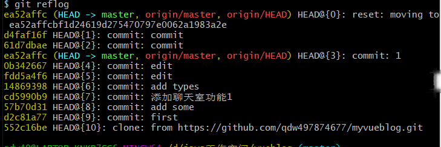
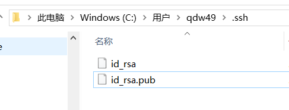

[**首页**](https://github.com/qdw497874677/myNotes/blob/master/首页检索.md)

# 下载安装

> https://npm.taobao.org/mirrors/git-for-windows/

# idea的配置工作原理

Git本地有三个工作区域：工作目录（Working Directory）、暂存区(Stage\Index)、资源库(Repository或Git Directory)。

- 工作区：平时存放项目代码的地方
- 暂存区：是一个文件，用于临时存放改动。
- 本地仓库：安全存放数据的位置，有提交的所有版本的数据。HEAD指向最新放入仓库的版本。
- 远程仓库：托管代码的服务器，

工作流程

- 在工作目录中添加文件、修改文件。
- 将需要进行版本管理的文件放入暂存区。git add
- 将暂存区的文件提交的git仓库。git commit

因此，git管理的文件有三种状态

- 已修改(modified)
- 已暂存(staged)
- 已提交(committed)

# 基本linux命令

>- cd：改变目录
>- cd ..：回退目录
>- pwd：显示当前所在目录
>- ls(ll)：显示当前目录文件
>- touch：新建一个文件
>- rm：删除一个文件
>- mkdir：新建一个目录（文件夹）
>- rm -r：递归删除文件（删除文件夹和里面的所有）
>- mv：移动文件。mv 文件名 目录 文件名(省略就是说同名)
>- reset：重新初始化终端
>- clear：清屏
>- history：显示历史命令
>- help：帮助
>- exit：退出

# 配置

> 所有的配置文件都保存在本地。

查看配置

~~~bash
git config -l
~~~

查看系统配置，D:\Git\Git\etc\gitconfig

~~~bash
git config --system --list
~~~

**设置用户名和邮箱(必须)**

~~~bash
git config --global user.name "qdw497874677"
git config --global user.email 497874677@qq.com
~~~

查看全局配置，只是用于当前登录用户的配置，C:\Users\qdw49\.gitconfig

~~~bash
git config --global --list
~~~

# Git仓库创建

两种：创建本地仓库、克隆远程仓库。

常用命令：

## 创建仓库

### 本地创建

在要创建仓库的文件夹下执行

~~~bash
git init
~~~

### 远程克隆

~~~bash
git clone https://github.com/qdw497874677/demo.git
~~~

# Git基本操作

文件的四种状态

- Untracked：未跟踪，此文件在文件夹中，但并没有加入到git库，不参与版本控制。
  - 通过git add，转换状态为Staged。
- Unmodify：文件已经入库，未修改。版本库中的文件快照和文件夹中的完全一致。
  - 通过修改文件，转换状态为Modified。
  - 通过git rm，装换状态为Untracked。
- Modified：文件已修改。
  - 通过git add，转换为Staged。
  - 通过git checkout，从库中取出文件覆盖修改，转换为Unmodify。
- Staged：暂存状态。
  - 通过git commit将修改同步到库中。此时库文件和本地文件一致，文件状态转换为Unmodify。
  - 通过git reset HEAD filename，取消暂存，状态转换为Modofied

## 查看文件状态

~~~bash
git status [filename]
#查看所有文件状态
git status

~~~

## 提交新版本

git管理的是文件的修改，要想提交新版本到仓库，需要先把修改内容添加到暂存区，然后再提交，提交只会提交暂存区中的修改

添加到暂存区，然后提交到本地仓库

~~~bash
# 添加所有文件到暂存区
git add .
# 提交暂存区的文件到本地仓库 -m表示提交信息
git commit -m
~~~

## 版本回退

查看历史记录

~~~bash
git log
# 显示版本内容到一行
git log --pretty=oneline
~~~

回退版本

~~~bash
git reset --hard 版本号
~~~

git log中新的版本就看不到了

但是知道新版本的版本号，还是可以回退到新的版本中。

如果找不到版本好了，还是可以反悔的。

**显示所有历史记录的版本**

~~~bash
git reflog
~~~

忽略文件

不把一些文件加入到控制版本中。

在主目录下创建.gitignore文件。

规则

~~~bash
*.txt
!lib.txt
/temp
build/
doc/*.txt
~~~

一般java的忽略文件

~~~
# Compiled class file
*.class

# Log file
*.log

# BlueJ files
*.ctxt

# Mobile Tools for Java (J2ME)
.mtj.tmp/

# Package Files #
*.jar
*.war
*.nar
*.ear
*.zip
*.tar.gz
*.rar

# virtual machine crash logs, see http://www.java.com/en/download/help/error_hotspot.xml
hs_err_pid*
~~~

## 撤销修改

### 撤销工作区的修改

丢弃工作区的修改。

~~~bash
git checkout -- 文件名
~~~

### 撤销暂存区的修改

已经add到暂存区了。

先把文件从暂存区撤回到工作区。

~~~bash
git reset HEAD 文件名
~~~

再把工作区的修改撤销

~~~bash
git checkout -- 文件名
~~~

如果文件提交到版本仓库中了，那就不好办了，想隐藏是很难得，可以回退或者创建新的版本，但是如果回到这个版本，内容是一定存在的。

## 删除

先直接删除文件

然后把删除操作添加到暂存区

~~~bash
git rm 文件名 
# 或者
git add 
~~~

提交到版本库

~~~bash
git commit -m 信息
~~~

其实操作和修改类似。

# GIT分支

用来将特性开发绝缘开来。在创建仓库的时候，master是默认的。在其他分支上进行开发，完成后再将他们合并到主分支上。

## 查看分支

查看本地仓库分支

~~~bash
# 查看仓库分支
git branch
~~~

查看远程仓库分支

~~~bash
# 查看远程仓库分支
git branch -r
~~~

## 创建分支

~~~bash
# 新建一个分支，并切换到该分支
git checkout -b [branch-name]
~~~

## 切换分支

~~~bash
# 切换分支
git checkout [branch-name]
~~~

## 合并分支

先切换到要合并到的分支

比如想去合并到master中

~~~bash
git checkout master
~~~

合并分支到当前分支

~~~bash
git merge [branch-name]
~~~

## 删除分支

~~~bash
# 删除分支
git branch -d [branch-name]
~~~

## 解决冲突

当要把自己防止合并到当初创建分支的那个分支上时，这个原分支的版本已经变化了，在自己执行merge后，这个目标分支检测到了冲突。此时目标分支还没提交新版本，需要解决冲突。

必须手动解决冲突后，在commit新版本。

冲突在文件中显示类似这样

需要手动修改后，去重新add到暂存区，然后去commit。

## 挑拣提交

获取某一个分支的单笔提交，并作为一个新的提交引入到你当前分支上。 当我们需要在本地合入其他分支的提交时，如果我们不想对整个分支进行合并，而是只想将某一次提交合入到本地当前分支上，那么就要使用git cherry-pick了。

~~~bash
# 先切换到一个分支中
git checkout feature1
# 查看当前分支的最近三次提交
git log -oneline -3
# 切换到要操作的分支上
git checkout feature2
# 把feature1中的一次提交合入到feature2分支上
git cherry-pick git cherry-pick 2555c6e
~~~

分支命令

~~~bash
# 查看仓库分支
git branch
# 查看远程仓库分支
git branch -r
# 新建一个分支，并切换到该分支
git checkout -b [branch-name]
# 新建一个分支，但依然停留在当前分支
git branch [branch-name]
# 切换分支
git checkout [branch-name]
# 推送分支到远程
git push origin [branch-name]
# 删除分支
git branch -d [branch-name]
# 删除远程分支
git push origin -delete [branch-name]
~~~

更新与合并

~~~bash
# 更新本地仓库至最新改动
git pull
# 合并指远程定分支到当前本地分支
git merge [branch-name]
# 可能发生冲突，需要手动修改并合并这些冲突，执行下面命令标记为合并成功。
git add [file-name]
# 合并改动之前可以使用下面命令查看
git diff [source-branch] [target-branch]

~~~

# 远程仓库

这里用github

## 向本地git中添加远程仓库

这里的origin在日后就表示后面的远程地址。这个远程仓库不能是初始化后的。因为之后的推向远程仓库的本地仓库是已经初始化好的。

~~~bash
git remote add origin 远程仓库地址
~~~

如果要用这个origin名字去添加新的远程仓库，需要先把这个删除。删除远程仓库地址。

~~~bash
git remote remove 远程地址名（也就是上面的origin）
~~~

## 将本地分支推向远程仓库

第一次推，加上-u，表示强制更新

~~~bash
git push -u origin 分支名
~~~

需要输入用户名和密码。

之后对本地仓库的提交之后，就可以直接push推到远程仓库

强制推送到远程

~~~bash
git push -f origin master
~~~

## 从远程更新本地仓库

把远程仓库拉取合并到本地仓库。可能有冲突，要解决冲突。

~~~bash
git pull
~~~

## 解决冲突

当你想push到远程仓库时，远程仓库被别人修改了一次，就发生了冲突。

需要先把远程仓库pull到本地，来手动解决冲突。

~~~bash
git pull
~~~

执行git status发现有文件被同时修改，发生冲突，这是需要修改这些文件的冲突，然后去add，然后commit，标记解决冲突，然后再push

~~~bash
# 想修改冲突的文件
git add .
git comit -m "冲突已解决"
git push
~~~

## 创建新的分支，并推向远程仓库

自己去修改新的版本，还没有开发完，不能去push或者合并。那么需要新建一个分支，还可以把新分支推向远程仓库。

~~~bash
git checkout -b dev
git add .
git commit -m "添加新文件"
git push origin dev
~~~

## 删除远程分支

git branch -a 查看所有分支（本地和远程所有）

在其他分支执行（不能在当前分支删除当前分支），删除远程的new_a分支

~~~bash
git push origin --delete new_a
~~~

## 获取远程主机的更新

~~~bash
git fetch <远程主机名>
~~~

## 设置SSH公钥

先设置好用户名邮箱

~~~bash
git config --global user.name "qdw497874677"
git config --global user.email "497874677@qq.com"
~~~

在.ssh目录下用git创建公钥

~~~bash
qdw49@LAPTOP-KNKB7SC6 MINGW64 ~/.ssh
$ ssh-keygen -t rsa -C "497874677@qq.com"
# 在提示输入密码的地方输入密码
~~~

将公钥添加到github上

## 

# 分支命令

master：主分支，永远是可用的、稳定的、可直接发布的版本，不能直接在该分支上开发

develop：开发主分支，代码永远是最新，所有新功能以这个分支来创建自己的开发分支，该分支只做只合并操作，不能直接在该分支上开发

feature-xxx：功能开发分支，在 develop 上创建分支，以自己开发功能模块命名，功能测试正常后合并到 develop 分支

release：预分布分支，在合并好 feature 分支的 develop 分支上创建，主要是用来测试 bug 的分支，修改好bug并确定稳定之后合并到 develop 和 master 分支，然后发布 master 分支

release-fix：功能 bug 修复分支，在 release 上创建分支修复，修复好测试出来的 bug 之后合并回 release 分支

hotfix-xxx：紧急 bug 修改分支，项目上线之后可以会遇到一些环境问题需要紧急修复，在 master 分支上创建，流程跟 release 分支相似，修复完成后合并到 develop 和 master 分支

# idea

## 全局配置

## 

## 切换版本

或者

如何回滚到指定版本

复制版本号

