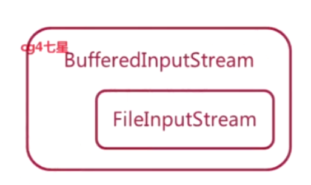

网络编程的本质就是进程间通信

通信的基础就是IO模型

# java.io基础

四个抽象类

## 字符流

下面的需要在另外的字符流上加功能，创建的时候需要传入另外的字符流

### 使用

读取文件

~~~java
Reader reader = new FileReader(filePath);
BufferedReader bufferedReader = new BufferedReader(reader);
StringBuffer bf = new StringBuffer();
String str;
while ((str = bufferedReader.readLine()) != null) {
    bf.append(str + "\n");
}
bufferedReader.close();
reader.close();
System.out.println(bf.toString());
~~~

## 字节流

最后四个实现，创建时需要传入字节流实例

## 装饰器模式

就像在FileInputStream外面装饰了Buffer

## Socket

socket是网络通信的端点

### Unix中的Socket

- Unix系统中，一切皆是文件
- 打开文件就会有一个文件描述符。文件描述符表时已打开文件的索引
- 每个进程都会维护一个文件描述符表

### 通过Socket发送数据

- 应用进程创建Socket实例
- 为Socket绑定目标ip地址和端口（告诉驱动程序把这些配置绑定到Socket实例上）
- 向Socket实例中写入数据
- 驱动程序收到Socket传来的数据，然后让数据从硬件层面上发送出去

### 通过Socket发送数据

- 应用进程创建服务端Socket实例
- 为Socket绑定ip地址和端口
- 从Socket实例中读取数据

### 过程

#### 建立通信链路

客户端与服务器端通信，**客户端要创建一个Socket实例**，操作系统为这个Socket实例分配一个没有被使用过的本地端口号，并创建一个包含本地和远程地址和端口号的套接字数据结构。这个数据结构一直保存在系统中，直到这个连接关闭。在创建Socket市里的构造函数返回正确之前，要进行TCP的三次握手，握手完，Socket实例对象将创建完成，否则抛出IOException错误。

服务端创建一个ServerSocket实例，ServerSocket创建只要指定的端口号没有被占用，一般实例创建就会成功。操作系统为ServerSocket实例创建一个底层数据结构，包含指定监听的端口号，和包含监听地址的通配符。当调用accept()方法时，将进入阻塞状态，等待客户端的请求。当一个新的请求到来时，将这个连接创建一个新的套接字数据结构，这个套接字的信息包含的地址和端口信息就是请求的。新创建的套接字的数据关联到ServerSocket的一个未完成的列表中（正在与客户端建立TCP连接），三次握手成功后，才返回Socket实例。

#### 数据传输

当连接建立成功，服务端和客户端都会有一个Socket实例，每个Socket实例都会有一个InputStream和OutputStream。网络I/O都是以字节流传输的。操作系统会为 InputStream 和 OutputStream 分别分配一定大小的缓冲区，数据的写入和读取都是通过这个缓存区完成的。写入端将数据写到 OutputStream 对应的 SendQ 队列中，当队列填满时，数据将被发送到另一端 InputStream 的 RecvQ 队列中，如果这时 RecvQ 已经满了，那么 OutputStream 的 write 方法将会阻塞直到 RecvQ 队列有足够的空间容纳 SendQ 发送的数据。值得特别注意的是，这个缓存区的大小以及写入端的速度和读取端的速度非常影响这个连接的数据传输效率，由于可能会发生阻塞，所以网络 I/O 与磁盘 I/O 在数据的写入和读取还要有一个协调的过程，如果两边同时传送数据时可能会产生死锁，在后面 NIO 部分将介绍避免这种情况。

https://developer.ibm.com/zh/articles/j-lo-javaio/

## IO模型

根据不同的操作对象，可以划分为磁盘IO、网络IO、数据库IO等等

### 内核缓冲区和进程缓冲区

缓冲区的目的就是为了减少频繁地与设备之间的物理交换。外部设备的直接读写会涉及到操作系统的中断，发生和技术系统中断时，需要保存和恢复进程数据等信息，为了减少这种底层系统的时间损耗和性能损耗，出现了内存缓冲区。

每个用户进程都有自己的缓冲区，叫做进程缓冲区

### 同步异步阻塞非阻塞

- 同步异步：强调被调用方
  - 同步：被调用之后要把自己的任务做完，然后返回结果。
  - 异步：被调用后先返回一个暂时的结果，自己的任务之后继续做，做完后去通知调用者。
- 阻塞非阻塞：强调调用方
  - 阻塞：调用其他方法之后，自己必须等待调用结果返回，才去做接下来的事。
  - 非阻塞：调用其他方法之后，不管有没有结果，接着做接下来的事。

### Java中的IO模型

#### Blocking IO

**同步阻塞的IO模型**，数据的读取阻塞在一个线程中，等待OS把数据准备好，然后把数据从内核空间拷贝到用户空间

调用过程：

- 应用程序想要读取数据，调用read操作，对应的就是调用底层的recvfrom方法。通知OS执行，OS判断数据是否准备好，没有准备好就会在这里阻塞等待。
- OS准备好数据后，就会将数据**从内核空间拷贝到用户空间**（应为处于安全考虑用户空间不能访问内核空间），拷贝完成后read()的阻塞就会解除，能得到read()的结果

socket.accept()、socket.read()、socket.write()都时阻塞的

可以通过多线程来实现处理多个连接。

但是严重依赖线程，线程的成本比较高：

- 创建和销毁成本高
- 线程本身占用较大内存
- 线程切换的成本很高。切换时需要保存线程的上下文，然后执行系统调用。

#### New （Non-Blocking） IO

同时支持阻塞和非阻塞模型。这里拿**同步非阻塞IO模型**来说明。同时NIO中的选择器可以使用多路复用来提高性能。

##### 特点

- 面向缓冲区：数据通过通道写入或者读取缓冲区。可以创建非直接缓冲区和直接缓冲区（直接内存）。如果时使用直接缓冲区，会直接在物理内存中创建缓冲器（通过物理内存映射文件），jvm会尽量不去做用户空间和内核空间数据的拷贝，而是直接操作物理内存缓冲区。
  - 传递数据通过Channel和Buffer。用Channel连接双方，调用read或者write来在Buffer中读取或者写入数据。
- 非阻塞
  - 在网络IO中，对于调用OS来准备数据的阶段是非阻塞了，会立刻返回。在数据从内核（网卡）到用户内存拷贝的过程中时CPU操作。虽然不是阻塞的，但是方法返回时很多时候是没有可操作性的余地的，需要不断的轮训。通过配合多路复用选择器减少线程切换的开销。
- 有Selecter
  - 利用多路复用（内核实现，可以单线程处理多个socket），来让一个线程处理多个channel。将channel注册到Selecter中，调用select方法，会阻塞直到某个注册的通道有事件就绪。
  - 用法：用channel的register方法把自己在selector中注册一个表示等待接收状态的事件（selector会根据状态是否满足而返回）。循环地调用selector地select()，会阻塞到有channel准备好。准备好了以后调用selector地selectedKeys()获取SelectionKey。可以用迭代器去遍历每个key，判断状态来处理调用不同地处理方法。如果有可接受状态，就通过注册的channel来调用accept()获取新的channel，然后把他注册到selector上，设置为读状态。等下次收到读状态完成的事件，就根据事件获取channel去做
- 管道
  - 提供两个线程之间 的单向数据连接。pipe有一个source通道和sink通道，数据会被写到sink通道，从source通道读取。

##### 多线程优化

- 一个线程负责事件分发，返回事件来让别人处理
- 使用cpu核心数的线程来处理IO，比如连接，读和写
- 业务线程，处理IO前后的业务部分用单独的线程处理

##### 适用场景

连接数目多，且连接比较短的场景。比如聊天服务器。

#### Asynchronous I/O

是**异步非阻塞的IO模型**。AIO是在数据准备好后，才会通知数据使用者

进程发起io操作后，就会直接返回。当io操作完成后，os会通知进程这个io已经完成了

是基于事件和回调机制实现的，线程操作后会直接返回，不会堵塞在那里，当后台处理完成，操作系统会通知响应的线程进行后续的操作。

##### 适用场景

适用于连接数目多，且连接比较长的场景，比如相册服务器

#### IO Multiplex

IO多路复用。

不同的操作系统有不同的实现：

- Windows：selector
- Linux：epoll
- Mac：kqueue

好处就是，单个进程可以同时处理多个网络连接的IO。比如调用的select，线程会阻塞，**同时内核空间会监视select负责的所有socket**。任何一个socket的数据准备好了，select就会返回。这时候调用read操作，就把数据从内核空间拷贝到用户空间了。相当于用户态这里通过read操作可以去处理多个socket。

多路复用的优势是，可以同时处理多个连接。一般就是配合NIO使用。

其中epoll，kqueue比selector更为高效，这是因为他们监听方式的不同。selector的监听是通过轮询FD_SETSIZE来问每一个`socket`：“你改变了吗？”，假若监听到时间，那么selector就会调用相应的时间处理器进行处理。但是epoll与kqueue不同，他们把socket与事件绑定在一起，当监听到socket变化时，立即可以调用相应的处理。

## socket是协议吗（待更新！！！）

# BIO

## Socket和ServerSocket

### 简单服务端

~~~java
public class ServerTest {
    public static void main(String[] args) {
        int port = 8000;
        ServerSocket serverSocket = null;
        try {
            serverSocket = new ServerSocket(port);
            Socket accept = null;
            while (true){
                accept = serverSocket.accept();
                int cPort = accept.getPort();
                System.out.println(cPort+"已连接");
                BufferedReader bufferedReader = new BufferedReader(new InputStreamReader(accept.getInputStream()));
                BufferedWriter bufferedWriter = new BufferedWriter(new OutputStreamWriter(accept.getOutputStream()));
                String s = null;
                // 读客户端发来的信息
                while ((s=bufferedReader.readLine())!=null){
                    System.out.println(cPort+"："+s);
                    // 发送给客户端信息，注意最后要加换行符
                    bufferedWriter.write(s+" 我收到了，你好呀"+"\n");
                    bufferedWriter.flush();
                }
                System.out.println(s+"退出");
            }
        } catch (IOException e) {
            e.printStackTrace();
        } finally {
            if (serverSocket!=null){
                try {
                    serverSocket.close();
                } catch (IOException e) {
                    e.printStackTrace();
                }
            }
        }
    }
}
~~~

### 简单客户端

~~~java
public class ClientTest {
    public static void main(String[] args) {
        int port = 8000;
        String ip = "127.0.0.1";
        Socket socket = null;
        try {
            socket = new Socket(ip,port);
            BufferedWriter bufferedWriter = new BufferedWriter(new OutputStreamWriter(socket.getOutputStream()));
            BufferedReader bufferedReader = new BufferedReader(new InputStreamReader(socket.getInputStream()));
            BufferedReader console = new BufferedReader(new InputStreamReader(System.in));
            String s = null;
            while ((s=console.readLine())!=null){
                if ("quit".equals(s)){
                    break;
                }
                // 发送给服务器信息
                bufferedWriter.write(s+"\n");
                bufferedWriter.flush();
                // 读取服务器返回的信息
                String msg = bufferedReader.readLine();
                if (msg!=null){
                    System.out.println("服务器："+msg);
                }
            }
        } catch (Exception e){
            System.out.println("连接关闭");
            e.printStackTrace();
        } finally {
            if (socket!=null){
                try {
                    socket.close();
                } catch (IOException e) {
                    e.printStackTrace();
                }
            }
        }
    }
}
~~~

BIO中的阻塞：

- ServerSocket.accept()
- InputStream.read()
- OutputStream.write()

所以无法在同一个线程里处理多个Stream I/O

# NIO

newio

非阻塞

- 用Channel代替Stream
  - Channel是双向的，一个Channel既可以输入也可以输出
  - Channel可以阻塞可以不阻塞
- 使用Selector监控多条Channel
- 可以在一个线程里处理多个Channel I/O

## Buffer

往Channel写数据，数据是写到了Buffer中。读就是从Buffer中读。

写的时候从position开始写数据

### flip()

position指针放到buffer开始，limit放到最后，将模式转换为读模式

从positon可以读到limit

### clear()

切换为写模式，重置指针，相当于清空了buffer。如果之前读数据没有读完，这样写会覆盖未读数据。

### compact()

先将未读数据拷贝到buffer的开始，position指向未读数据的下一个位置，limit到最后，然后切换为写模式。这样写不会覆盖之前未读的数据。

## Channel

Channel可以对buffer写入或者读取

两个Channel对象也可以传输数据

几个重要的Channerl：

- FIleChannel
- ServerSocketChannel
- SocketChannel

## Selector

通过一个selector可以监视多个channel的状态，调用select可以阻塞直到有channel就绪了，可以将对应的channel返回（SelectionKey集合）。

### channel的状态

- connect：如果SocketChannel与一个ServerSocketChannel建立了连接，就是连接状态
- accept：如果ServerSocketChannel接受了一个SocketChannel的请求，就是接受状态
- read：如果SocketChannel有可读数据，就是可读状态
- write：如果SocketChannel可以向其中写数据，就是可写状态

在Selector上注册channel时，可以绑定一个感兴趣的状态，如果状态满足就会处于继续状态从select方法返回结果中作为一个SelectionKey实例返回。

# 本地文件拷贝

## 不用缓冲区的流

## 用缓冲区的流

## NIO+缓冲

~~~java

~~~

## NIO+链接

~~~java
package com.qdw.io.nio;

import java.io.*;
import java.net.Socket;
import java.nio.Buffer;
import java.nio.ByteBuffer;
import java.nio.channels.FileChannel;

/**
 * @PackageName:com.qdw.io.nio
 * @ClassName: FileCopyDemo
 * @Description:
 * @date: 2020/9/8 0008 17:33
 */
interface FileCopyer{
    void copyFile(File source,File target);
}
public class FileCopyDemo {
    // 统一的关闭流方法
    public static void close(Closeable closeable) {
        if (closeable != null) {
            try {
                closeable.close();
            } catch (IOException e) {
                e.printStackTrace();
            }
        }
    }
    public static void main(String[] args) {
        
        // 流 不用缓冲区（非常慢）
        FileCopyer noBufferStreamCopy = new FileCopyer() {
            @Override
            public void copyFile(File source, File target) {
                InputStream fin = null;
                OutputStream fout = null;
                try {
                    fin = new FileInputStream(source);
                    fout = new FileOutputStream(source);
                    int res;
                    while((res=fin.read())!=-1) {
                        fout.write(res);
                    }
                } catch (IOException e) {
                    e.printStackTrace();
                } finally {
                    close(fin);
                    close(fout);
                }
            }
        };

        // 流 用缓冲区
        FileCopyer bufferedStreamCopy = new FileCopyer() {
            @Override
            public void copyFile(File source, File target) {
                InputStream fin = null;
                OutputStream fout = null;
                try {
                    fin = new BufferedInputStream(new FileInputStream(source));
                    fout = new BufferedOutputStream(new FileOutputStream(target));
                    byte[] buffer = new byte[1024];
                    int res;
                    // 先读到缓冲区
                    while((res=fin.read(buffer))!=-1){
                        // 从缓冲区中取数据写入
                        fout.write(buffer,0,res);
                    }
                } catch (IOException e){
                    e.printStackTrace();
                } finally {
                    close(fin);
                    close(fout);
                }
            }
        };

        // nio 管道+缓冲
        FileCopyer nioBufferCopy = new FileCopyer() {
            @Override
            public void copyFile(File source, File target) {
                FileChannel fin = null;
                FileChannel fout = null;
                try {
                    fin = new FileInputStream(source).getChannel();
                    fout = new FileOutputStream(target).getChannel();
                    // 创建一个字节缓存区
                    ByteBuffer buffer = ByteBuffer.allocate(1024);
                    // 输入到buffer中
                    while(fin.read(buffer)!=-1){
                        // 将position指针放到开始，转换为读模式
                        buffer.flip();
                        while (buffer.hasRemaining()){
                            fout.write(buffer);
                        }
                        // 重置为写模式
                        buffer.clear();
                    }
                } catch (IOException e) {
                    e.printStackTrace();
                } finally {
                    close(fin);
                    close(fout);
                }
            }
        };
        
        // nio 管道+链接
        FileCopyer nioTransferCopy = new FileCopyer() {
            @Override
            public void copyFile(File source, File target) {
                FileChannel fin = null;
                FileChannel fout = null;
                try {
                    fin = new FileOutputStream(source).getChannel();
                    fout = new FileOutputStream(target).getChannel();
                    long t = 0L;
                    long size = fin.size();
                    while (t!=size){
                        t += fin.transferTo(0, size, fout);
                    }
                } catch (IOException e) {
                    e.printStackTrace();
                } finally {
                    close(fin);
                    close(fout);
                }
            }
        };
    }
}

~~~

##  NIO聊天室

