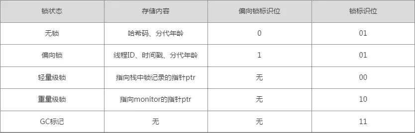
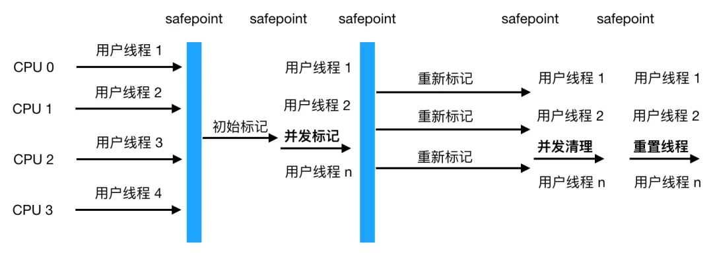
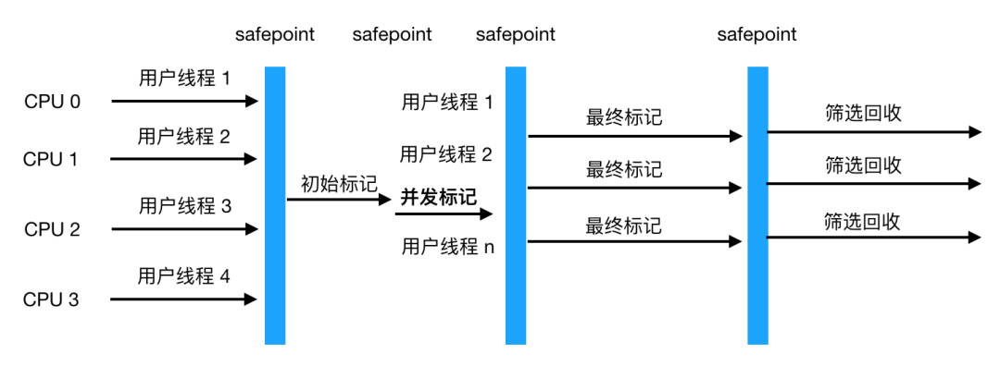
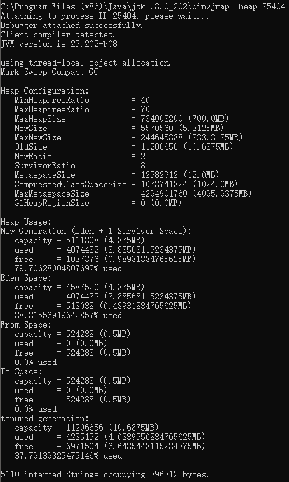
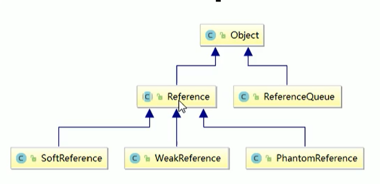

[**首页**](https://github.com/qdw497874677/myNotes/blob/master/首页检索.md)

## JVM内存模型

主要由五块

- **程序计数器**（PC寄存器，是物理寄存器的抽象）：线程私有。如果线程正在执行一个Java方法，这个计数器用来记录正在执行的虚拟机字节码指令的地址（行号）。程序计数器是Java虚拟机中**唯一一个没有规定任何OOM的情况的区域**。
- **虚拟机栈**：线程私有。线程请求的栈深度大于虚拟机允许的深度，抛出StackOverflowError。如果虚拟机栈可以动态扩展，而扩展时无法申请到足够的内存，抛出OOM。
  - 栈帧：每当一个方法调用时，会创建一个对应的栈帧，压入栈。存放方法执行过程中的各种数据信息，包括各种局部变量。当一个栈帧出栈只会有两种情况：1.栈帧对应的方法调用执行结束，return指令。2.方法执行中出现未捕获的异常，将异常抛出到上一层调用。
    - 局部变量表：存放局部变量，包括基本数据类型、对象引用、returnAddress 类型（指向一条字节码指令的地址）。实际定义是一个int数组，存储的内容都可以用int表示。
    - 操作数栈：在字节码指令的执行过程中，某些操作需要用到栈，比如表达式求值，操作数栈就是提供这样的功能。是基于数组实现的。
    - 动态链接：每个栈帧内部都包含一个指向运行时常量池中该栈帧所属方法的引用，这个引用的目的就是为了支持当前方法的代码能够实现动态链接。动态链接的作用就是：为了将这些符号引用转为调用方法的直接引用。**这些方法在编译期间无法被确定下来，所以需要运行时区动态地转换为直接引用，也就是指向对应存储结构的合适偏移量位置。实现了多态。**
    - 方法出口：通过这个出口来退出方法。有两种方式，一个是遇到return指令返回，二是出现本方法中没有捕获的异常
    - 一些附加信息
- **本地方法栈**：线程私有。和虚拟机栈很类似，只不过本地方法栈是提供Native方法的支持，它可以通过JNI（java native interface）来访问虚拟机运行时的数据区，甚至可调用集寄存器。本地方法是c或c++编写的所以单独用本地方法栈来处理。
  - 最常见的本地方法就是System.currentTimeMillis().
- **堆**：线程共享的区域。存放几乎所有的对象。是内存管理的核心区域，是垃圾回收的重点区域。为了方便垃圾回收一般把堆划分成下面几部分。
  - 年轻代
    - 伊甸园区：8/10
    - 幸存者区：2/10
      - To：1/10
      - From：1/10
  - 老年代
- **方法区**：1.6之前HotSpot用永久代实现方法区，之后用本地内存实现方法区，1.8之后用在本地内存实现的元空间来作为方法区。方法区存放**类信息**、静态变量、**常量**、即时编译器编译后的代码缓存等数据。当一个类加载的内存中时，他的类信息会放在方法区中，对应地在堆中创建一个Class对象，可以访问到类信息。
  - **运行时常量池**（1.6及以前）：是方法区的一部分。Class文件中的常量池表，存放编译期生成的各种字面量和**符号引用**（方法或者字段引用），这些内容在类加载后存放到方法区的运行时常量池中。在1.7及以后不在方法区了，而是在JVM堆中
- **直接内存**：**它并不是虚拟机运行时数据区的一部分**。但是被频繁使用。
  - jdk1.4加入了NIO，引入一种基于通道和缓冲区的I/O方式，它可以直接使用本地方法直接分配堆外内存，然后通过存储在java堆中的**DirectByteBuffer对象作为这块内存的引用**进行操作，避免了在Java堆和Native堆中来回复制数据。

### 方法区

1.6之前HotSpot用**永久代**实现方法区，之后用本地内存实现方法区，1.8之后用在本地内存实现的**元空间**来作为方法区。

方法区存放类信息、静态变量、常量、即时编译器编译后的代码缓存等数据。

### 常量池

常量池以表的形式存在，实际可分为两种

- class文件常量池：包含：
  - 字面量：文本字符串、final修饰的常量
  - 符号引用：类和接口的全限定名、字段的名称和描述符、方法的名称和描述符
- 运行时常量池：是方法区的一部分。完成类加载之后，将class文件中的静态常量池加载到内存中。在连接的准备阶段会把这些符号引用替换为直接引用。运行期间也会将新的常量放入池中。
  - 每个加载后的类都在内存中有个运行时常量池
  - 全局字符串常量池：生成字符串对象后，会把这个实例的引用放到字符串常量池中的一个hash表中驻留。一个JVM中只有一个字符串常量池。它只存String对象的引用

#### 字符串常量池位置

- 在 JDK6.0 及之前版本，字符串常量池是放在永久代区(也就是方法区)中，此时常量池中**存储的是对象**。
- 在 JDK7.0 版本，字符串常量池被移到了堆中了。此时**常量池存储的就是引用**了。在 JDK8.0 中，永久代（方法区）被元空间取代了。

## 类加载

在java代码中，类型的加载、连接、初始化都是在程序的运行期间完成的。

### 类加载过程

类加载指的是把通过Java源代码编译成的.class文件读入内存中，然后产生与所加载类对应的Class对象。加载完成后，Class对象还不完整。加载后进入连接阶段，这一阶段包括验证、准备、解析。最后对类进行初始化。通过这五步加载。

- 加载：由**类加载器**执行的。可玩性高，可以自定义类加载器，赋予程序获取运行代码的动态性。
  1. 通过类的**全限定名**（包名+类名）来获取类的二进制字节流（Class字节码）。
  2. 把二进制流根据虚拟机的定义的格式进行转化，存储在**方法区**（元空间）中。
  3. 在Java堆中实例化一个java.lang.Class对象，这个对象作为访问方法区中类的数据的外部接口，通过这个Class对象就可以访问到方法区中对应的类数据。
- 连接：验证Class文件中的一些信息是否符合当前虚拟机要求，为静态域分配空间并设置类变量的初始值（零值）。如果必须的话，将常量池中的符号引用转化为直接引用。**加载阶段和连接阶段的部分动作是交叉进行的**，但两个阶段区分是明确地，开始时间的先后顺序也是固定的。
  - 验证：确保Class文件中的字节流信息**符合当前虚拟机要求**。
  - 准备：在方法区（元空间）为类变量（静态成员变量）分配内存，并设置变量初始值（零值）。如果是**final修饰的类变量会直接在这个阶段赋指定的初始值**，而不是赋零值。
  - 解析：虚拟机将常量池内的**符号引用替换为直接引用**。主要就是把之前随意的符号引用**替换为具体的内存地址**。在这个阶段会检查方法和字段的可访问性。解析动作主要针对类或接口、字段、类方法、接口方法、方法类型、方法句柄、调用点限定符，七类符号引用进行。
- 初始化：开始**执行类中定义的Java程序代码**。
  - 执行类构造器<clinit>()方法的过程。<clinit>()方法是由编译器自动收集**类中的所有类变量(static)的赋值动作和静态代码块中的语句**合并产生的。收集的顺序就是代码对应的顺序，静态代码块只能访问到定义在他之前的变量，定义在他之后的他可以赋值但是不能访问。父类如果没有初始化会先初始化父类，保证<clinit>()执行前，父类的<clinit>()先执行完毕。 
  - 对于接口，接口内不能使用静态代码块。同时**接口**的初始化执行<clinit>()**不需要先执行父接口**的<clinit>()，只有当父接口中的变量使用到了才会被初始化。同理，**接口**的**实现类在初始化的时候，也不会执行接口**的<clinit>()方法。
  - 如果多个线程同时实例化一个类，只会有一个线程去执行<clinit>()，其他线程进入阻塞，<clinit>()执行完，其他线程就不会执行<clinit>()了。在同一个类加载器下，一个类型只会被初始化一次。
- 卸载
  - 当一个类的Class对象和对应的类加载器被回收了，没有变量去引用了，就会发生卸载。

### 符号引用和直接引用

- 符号引用：以一组符号来描述所引用的目标，符号引用可以是任何形式的字面量，只要能无歧义的定位到目标，与虚拟机的布局无关。可以理解为暂时虚拟机并不知道引用到的地址，就用符号引用来代替。在解析阶段就是为了把符号引用转化为真正能访问的地址。
- 直接引用：与虚拟机的布局是相关的，不同的虚拟机通过同一个符号引用翻译过来的直接引用一般不同。如果有了直接引用，那么直接引用的目标一定加载到了内存中。
  - 直接引用可以是：
    1. 直接指向目标的指针。（指向对象、类变量和类方法的指针）
    2. 相对偏移量。（指向实例的变量、方法的指针）
    3. 一个间接定位到对象的句柄。

### 类初始化时机

- 遇到new、getstatic、putstatic或invokestatic这四条字节码指令。
  - 使用new关键字实例化对象时。
  - 读取或者设置一个类的静态字段时。
  - 调用一个类的静态方法时。
- 使用反射时，如果类没有进行过初始化，要先初始化。
- 初始化一个类，如果发现他的父类没有初始化过，先初始化父类。
- 虚拟机启动时，指定的主类（有main()方法的）要先初始化。
- 当使用jdk1.7动态语言支持时，如果一个java.lang.invoke.MethodHandle实例最后的解析结果REF_getstatic,REF_putstatic,REF_invokeStatic的方法句柄，并且这个方法句柄所对应的类没有进行初始化，则需要先出触发其初始化。

### 类卸载

当方法区中**类信息不可达**，即类在堆中的Class对象不可达时被回收后，类才会被卸载。

由Java虚拟机自带的类加载器所加载的类（根加载器、拓展类加载器、系统类加载器），在虚拟机的生命周期中，始终不会被卸载。因为Java虚拟机本身会始终引用这些类加载器，而这些**类加载器始终引用**他们所加载的类的Class对象。

类加载器和Class对象是双向关联的。类加载器内部有一个集合来存放加载类的引用，Class对象通过getClassLoader()方法来获取自己对应的类加载器。

**用户定义的类加载器加载的类是可能被卸载的。**

当一个类满足下面三种情况就被卸载：

- 对应类加载器被回收了，不在引用class对象
- 类的实例对象都被回收了，没有本类对象引用class对象了
- 类的class对象没有在任何地方被引用

然后class对象就会被gc回收

### class文件来源

- 本地磁盘中的.class文件。
- 网络下载.class文件。
- war包，jar包中的.class文件。
- 从专门的数据库中读取的.class文件（少）。
- 将java源文件动态编译成的.class文件。
  - 动态代理，运行期间生成的.class文件
  - jsp会转换为servlet，servlet是java文件，会被编译成.class文件。

通过**类加载器**加载，加载到方法区（元空间）。分两个区域：

- .class的字节码数据。
- Class对象，可以访问对应class的数据。

### 类加载器

**通过一个类的全限定名来获取描述该类的二进制字节流**，这个动作被放到了虚拟机外部去实现的，以便让程序自己去决定如何去获取所需的类。实现**这个动作的代码被成为类加载器**（Class Loader）

任意一个类的唯一性，由这个类的类加载器和这个类本身一起确立的。

#### 双亲委派模型

> 从JDK 1.2开始，类加载过程采用双亲委派机制。
>
> 如果一个类加载器接收到了类加载请求，它首先不会尝试自己去加载，而是把请求委托给父类加载器去加载。当父类不能加载，才尝试自己加载。
>
> 作用：保证JDK核心类的优先加载。

**从虚拟机的角度看**，只存在两种类加载器：一种是启动类加载器（Bootstrap ClassLoader），这个类加载器由C++实现（之后HotSpot由java实现的了），是虚拟机自身的一部分；另一种就是其他所有的类加载器，由Java语言实现，是独立存在虚拟机外部，继承自抽象类java.lang.ClassLoader。

**从Java开发人员的角度看**，划分更精细，分为三层

- 启动类加载器（Bootstrap ClassLoader）：负责加载存放在<JAVA_HOME>\lib目录，或者是被-Xbootclasspath参数指定的目录下的，能被虚拟机识别的类库（名字不符合的不会加载）。无法被Java程序直接引用。
- 扩展类加载器（Extention ClassLoader）：负责加载存放在<JAVA_HOME>\lib\ext目录中，或者被java.ext.dirs系统变量指定的路径下的所有类库。这个类加载器是一Java代码的形式存在的。
- 应用程序类加载器（SystemAppClass 、Appclass Loader）：负责加载存放在用户类路径（ClassPath）上的所有类库。如果应用程序中没有定义过自己的类加载器，一般就默认用这个加载器加载。

用户可以定义自己的类加载器来进行拓展，比如**增加除了磁盘以外的Class文件来源**，或者通过类加载器**实现类的隔离、重载等功能**。

各种类加载器之间的层次关系被称为**双亲委派模型**。主要效果就是：如果一个类加载器接收到了类加载请求，它首先不会尝试自己去加载，而是把请求委托给父类加载器去加载。当父类不能加载，才尝试自己加载。

通过类加载器中的loadClass方法实现双亲委派模型。

1. 检查要加载的类是否已经存在。
2. 如果不存在就调用父类的loadClass去加载类。
   1. 如果父类加载器不是null，就直接调用父类加载器的loadClass去加载类。
   2. 如果父类加载器是null，那就默认使用启动类加载器作为父类加载器，去加载类。
3. 父类加载器加载失败会抛异常，就调用自己的findClass方法来自己加载类。

#### 破坏双亲委派模型

SPI接口：Java在核心类库中定义了很多接口，但未给出实现，需要服务商定制实现类，在META-INF/services中注册实现类信息。

接口的定义在Java的核心类库中，而实现类交给开发者，而实现类并不会被启动类加载器所加载，放在系统类加载的地方。按照双亲委派模型，是不能够拿到这个实现类的。**但是这个不算破坏双亲委派，只是绕过了。**

SPI Serviceloader 通过线程上下文获取能够加载实现类的classloader，打破了双亲委派模型。

java.sql.Driver是典型的SPI接口

#### 破坏

自定义一个类加载器并重写loadClass方法是可以打破双亲委派机制的。

#### 自定义类加载器

- 沿用双亲委派机制
  - 继承ClassLoader类并重写findClass方法
- 打破双亲委派机制
  - 继承ClassLoader类并重写loadClass和findClass方法
    - 默认的loadClass方法实现了双亲委派机制的逻辑，让父类加载器加载。为了破坏必须重写。

~~~java
protected Class<?> loadClass(String name, boolean resolve)
        throws ClassNotFoundException
    {
        synchronized (getClassLoadingLock(name)) {
            // First, check if the class has already been loaded
            Class<?> c = findLoadedClass(name);
            if (c == null) {
                long t0 = System.nanoTime();
                try {
                    if (parent != null) {
                        c = parent.loadClass(name, false);
                    } else {
                        c = findBootstrapClassOrNull(name);
                    }
                } catch (ClassNotFoundException e) {
                    // ClassNotFoundException thrown if class not found
                    // from the non-null parent class loader
                }

                if (c == null) {
                    // If still not found, then invoke findClass in order
                    // to find the class.
                    long t1 = System.nanoTime();
                    c = findClass(name);

                    // this is the defining class loader; record the stats
                    sun.misc.PerfCounter.getParentDelegationTime().addTime(t1 - t0);
                    sun.misc.PerfCounter.getFindClassTime().addElapsedTimeFrom(t1);
                    sun.misc.PerfCounter.getFindClasses().increment();
                }
            }
            if (resolve) {
                resolveClass(c);
            }
            return c;
        }
    }
~~~

## 对象

### 对象的访问定位

使用对象时，通过栈上的引用变量（reference）来操作堆上的具体对象。

引用获取对象有两种形式

- Java堆中会分配一块内存作为句柄池。引用存储的是句柄地址。

- 引用中直接存储对象地址

> 比较：
>
> 使用句柄的最大好处是引用中存储的是稳定的句柄地址。对象移动（GC）时只改变实例数据指针地址，引用自身不用修改。
>
> 直接指针访问的好处就是速度快。
>
> 如果对象频繁GC那么句柄好，如果对象频繁访问则直接指针访问好。

### 创建对象方法

1. 使用new关键字创建对象。
2. 反射机制。
   1. 使用Class类的newInstance方法(反射机制)。这个newInstance方法调用无参的构造器创建对象。
   2. 使用Constructor类的newInstance方法(反射机制)。可以通过这个newInstance方法调用有参数的和私有的构造函数。事实上Class的newInstance方法内部调用的也是Constructor的newInstance方法。
3. 使用Clone方法创建对象。要想使用clone方法，我们就必须先实现Cloneable接口并实现其定义的clone方法，这也是原型模式的应用。
4. 使用(反)序列化机制创建对象。

### 创建对象的过程

当虚拟机接收到一个new指令时

- 检查这个**指令的参数**，是否能在常量池中定位到一个类的**符号引用**。如果有检查这个符号引用代表的**类是否已被创建**。如果没有没有创建，先进行类加载（加载、连接、初始化）。
- 给对象分配内存。设定分配内存大小在类加载完成时就已经确定。
  - 对象内存包括：对象头、实例数据、对齐填充
    - 对象头：与类无关、与操作系统有关、大小确定
    - 实例数据：父类和子类实例数据都会分配内存，相同宽度的字段会分配在一起，父类字段在子类之前。
    - 对齐填充：满足虚拟机对8的倍数的要求
  - 内存分配：分配和回收是相关的，不同回收策略有不同分配策略
    - 如果用具有压缩过程的回收策略，如Serial、ParNew，则分配内存需要考虑Java堆中的内存规整。**指针碰撞**：内存工整，占用的在一边，空闲的在一边。**分配内存通过移动分界点的指针。**
    - 如果回收不需要压缩过程，如CMS，则可以维护一个记录哪些内存可用的空闲列表。**空间列表**：内存不工整。维护一个列表，记录哪些内存块可用，**分配在合适的区域，然后更新列表。**
  - 分配过程的线程安全：两种解决方式：
    - CAS+失败重试（自旋）
    - 每个线程提前分配一小块内存，称为本地线程分配缓冲（TLAB），创建对象时先在自己的TLAB上分配。
- 将内存空间全部附零值（不包括对象头）。
- 对对象头进行设置。
  - 对象头包括三个区域
    - MarkWord：哈希码、GC年龄、关于锁的标记等
      - 
    - 类型指针：指向元数据的指针
    - 数组长度：如果是数组的话，表示数组的长度
- 调用对象的<init>方法完成初始化。

### 对象初始化

父类的成员变量和代码块 -> 父类的构造函数 -> 子类的成员变量和代码块 -> 子类的构造函数。

对象初始化过程中主要涉及三种执行对象初始化的结构。

- 实例变量初始化。
- 实例代码块初始化。
- 构造函数初始化。

#### 实例变量和实例代码块初始化

在定义实例变量的同时，可以直接对实例变量进行赋值，或者使用实例代码块进行赋值。这两种方式对变量进行实例化是执行在构造函数之前的。**实际上，编译器会把这种方式赋值的代码放到构造函数中去，在调用父类构造函数之后，构造函数本身的代码之前。**

#### 构造函数初始化

在编辑生成的字节码中，构造函数被命名为<init>()方法。

为了保证创建一个完整的对象。Object对象之外的对象的构造函数的第一条语句必须是父类构造函数的构造函数或者调用语句。如果没有显示调用，编译器会自动生成。

## 垃圾回收算法与回收器

### 概述

> 程序计数器、虚拟机栈、本地方法栈三个区域随线程自生自灭（因为线程私有）。
>
> 堆和元空间不一样。只有在程序处于运行期才知道哪些对象会创建，这部分内存的分配和回收是动态的。

### 判断对象死活

#### 引用计数法

> 早期算法。给对象添加一个引用计数器。当对象被引用一次，计数+1。当一个对象的一个引用超过了生命周期或者被设置为新值时，计数器-1。计数器为0时，这个对象就可以被当做垃圾收集。

缺点

- 无法解决对象循环引用。

#### 可达性分析法

> 根据作为GC根（GC Roots）的对象作为起点，从这些节点出发走过的路径称为引用链。当一个对象到GC根没有任何引用链相连的时候，说明对象不可用。

#### GC roots

是一组必须活跃的引用

这些引用能指到的对象有。

- 虚拟机栈中引用的对象（局部变量）
- 本地方法栈中本地方法引用的对象
- 静态变量引用的对象
- 常量引用的对象
- 活动线程
- 用于同步的Monitor对象

#### 回收元空间

元空间垃圾回收主要回收两部分：废弃的常量、无用的类

- 废弃的常量：没有被引用的常量
- 无用的类：满足下面三个条件
  - 该类的所有实例都被回收
  - 加载该类的类加载器被回收
  - 该类的Class对象没有在任何地方被引用

### GC类型

按照HosSpot标准，分为两大类：部分GC和全GC

- PartialGC：只回收堆中部分区域，又分为三类
  - Minor GC/Young GC：针对年轻代的垃圾回收
    - 触发条件：分配新对象内存时，Eden区装不下了。永远是被动地，会引发STW。
  - Major GC/Old GC：针对老年代的回收。只有CMS有这种行为
  - Mixed GC：收集整个年轻代和部分老年代。目前只有G1有这种行为。
- Full GC：收集整个Java堆（新、老）和方法区。
  - 触发条件有五种
    - 调用System.gc()
    - 老年代空间不足以分配
    - 方法区空间不足以分配
    - 要Minor GC时判断GC不安全。

### 垃圾回收算法

基于可达性分析

#### 标记-清除算法

> 1. 标记阶段：进行一次可达性分析，把从GC跟可达的对象进行标记。
> 2. 清除阶段：遍历堆，把未标记的对象回收。同时恢复对象之前的标记。
>

缺点：

- 回收时，应用需要挂起
- 清除无用的对象效率不高，因为要一个一个清除
- 会产生内存碎片

#### 标记-复制算法

> 把空间分成两块，每次对其中的一块存有对象的区域中GC后存活下来的对象复制到另一块区域上，然后整体清除上一块区域。解决了内存碎片问题，同时提高清除的效率。

一般应用于对象存活周期比较短的年轻代。

缺点：

- 会浪费一定空间。

#### 标记-整理算法

> 在标记清除的基础上，把先把标记的存活对象向内存空间的一侧移动，然后清理掉边界之外的内存。

不会像复制算法需要额外空间，清除对象也是通过直接清除一块区域，所以清除效率相对标记清除高。但是对于对象的移动相对代价会高一些，所以适合对象长期存活的区域。

#### 分代回收

> 根据不同的情况制定相应的回收算法，结合这些算法的优先，是现代虚拟机采用的首选算法（策略）。
>
> - 年轻代：每次回收都有大量的对象死去，少量存活。通常选用复制算法。
> - 老年代：对象存活率高。使用标记清楚或者标记整理算法。

##### 年轻代的回收

因为大部分对象生命周期很短，所以分代收集算法根据对象存活周期的不同将堆分成新生代和老年代，默认比例1：2。

为了节省空间，在年轻代，将空间划分为三块。伊甸园区、两个幸存者区（To、From）。他们的空间大小比例为8：1：1。

当伊甸园区满时，触发第一次young gc（Minor GC），把存活的对象复制到一个幸存者From区，然后清空Eden区，存活的对象的年龄+1（对象年龄即参与MinorGC的次数）。当伊甸园区再次触发young gc时，会回收伊甸园区和幸存者From区，把存活的对象复制到幸存者To区，然后清空之前的两个区域。

之后伊甸园区触发gc时，就会对伊甸园区和幸存者To区进行回收。把存活对象放到From区。

##### 空间分配担保

发生MinorGC之前，虚拟机会先检查**老年代最大可用的连续空间**是否大于新生代所有对象的总空间。如果大于MinorGC就是安全的，如果不大于就会检查设置是否允许担保失败，如果允许，就会继续检查老年代最大可用连续空间是否大于历次晋升到老年代对象的平均大小，如果大于就进行MinorGC，否则可能进行一次FullGC（MajorGC）。

**总结：晋升担保：MinorGC之前，虚拟机检查老年代是否能容纳所有年轻代的对象。如果不够就需要直接提早进行一次FullGC，防止下次MinorGC晋升失败。如果设置了允许担保失败，在担保失败时，还会检查老年代能不能容纳平均晋升到老年代的对象**

##### Stop The World 

如果老年代满了，会触发FullGC，会同时回收年轻代和老年代（即回收整个堆）。它会导致Stop The World（STW），产生性能开销。

STW：在GC（MinorGC或FullGC）期间，只有垃圾回收器线程在工作，其他线程都被挂起。

一般FullGC会导致工作线程停顿时间过长（清理整个堆中的不可用对象），如果此时server收到很多请求，就会拒绝服务。（MinorGC也会造成STW，但是相对影响较少）

所以，把新生代设置为三个区，给对象设置年龄阈值，把新生代和老年代的比例设为1：2都是为了尽可能避免对象过早地进入老年代，尽可能晚的触发Full GC

因为GC会影响性能，就需要在一个合适的时间点发起GC，这个时间点称为Safe Point。这个时间点的选定不能太少（导致GC时间太长产生过长时间的卡顿），也不能过于频繁（导致过多的运算消耗）。

- 循环的末尾
- 方法返回前
- 调用方法的call之后
- 抛出异常的位置

#### 经典分配流程

- 优先分配到Eden区
  - Eden区装得下，直接分配了
  - Eden区装不下，进行Minor GC，清空Eden区，再尝试分配
    - 装得下，直接分配
    - 装不下，尝试分配到老年代
      - 老年代装得下，直接分配
      - 装不下，触发一个Full GC，在尝试分配
        - 装得下，直接分配
        - 装不下，说明老年代不够了，直接OOM

#### 对象进入老年代时机

##### YGC幸存者区空间不足

在YGC时，幸存者区不足以存放存活的对象，对象会直接进入到老年代。

##### 大对象

> -XX:PretenureSizeThreshold=0（默认）： 设置阈值，大小超过这个值的对象将直接在老年代分配。默认是0，即所有对象都优先在新生代分配。注意这个参数不能写=10M，只能写完整的byte size。
>
> （此参数仅针对 Serial 和 ParNew 两款新生代收集器有效，对 Parallel-Scavenge无效。）

##### 年龄晋升

> 新生代中对象经过若干次回收后依然存活的话就会晋升到老年代。
>
> 每个对象的对象头有一个Age，标记经历的GC次数。
>
> -XX:MaxTenuringThreshold=15（默认）：设置晋升阈值。

##### 动态年龄判断

> 并非一定要达到年龄阈值后才会晋升，还有另一种称之为动态对象年龄判断的规则：
>
> -XX:TargetSurvivorRatio=50：设定**survivor区的目标使用率**。默认50，即survivor区对象目标使用率为50%。
>
> 1. 通过 TargetSurvivorRatio 乘以 Survivor的大小，得到一个 desired_survivor_size；
> 2. 所有对象，会按年龄从小到大，将它们的大小进行累加。当新加一个对象之后累加和大于 desired_survivor_size 时，就会将大于等于这个对象的年龄的全部对象移动到老年代。
>
> 这种规则使得Survivor的对象能提前进入老年代。

#### 触发FGC

FGC处理的区域同时包括新生代和老年代。

##### 晋升对象大于剩余空间

从年轻代晋升的对象大于老年代的剩余空间，就会触发FGC或者Major GC

##### 老年代内存使用率

当老年代的内存使用率达到一定阈值，直接触发FGC。阈值可通过参数调整。

##### 空间分配担保

发生MinorGC之前，虚拟机会先检查**老年代最大可用的连续空间**是否大于新生代所有对象的总空间。如果大于MinorGC就是安全的，进行GC。如果不大于就会检查设置**是否允许担保失败**，如果允许，就会继续检查老年代最大可用连续空间是否大于历次晋升到老年代对象的平均大小，如果大于就进行MinorGC。否则还是任务MinorGC是不安全的，可能进行一次FullGC（MajorGC）。

**总结：晋升担保：MinorGC之前，虚拟机检查老年代是否能容纳所有年轻代的对象。如果不够就需要直接提早进行一次FullGC，防止下次MinorGC晋升失败。如果设置了允许担保失败，还会多检查一次，看老年代能不能容纳平均晋升到老年代的对象**

##### 元空间不足

元空间不足时会进行扩容，当扩容到 -XX:MetaspaceSize 参数的指定值时，也会触发FGC。

##### 显示调用

System.gc()或者Runtime.gc()被显式调用时，会触发FGC。

#### 方法区的GC

JVM没有明确要求对方法区进行GC，因为和堆相比收益很小。主要回收两部分内容：**被废弃的常量和不再使用的类**。对于常量的判断和对象类似。判断一个类是否不再被使用的条件非常苛刻：

- 堆中不存在该类的对象
- 加载类的加载器已经回收了
- 该类对应的Class对象也没有地方引用了。

#### GC的影响

不管是YGC还是FGC，都会造成一定程度地程序卡顿（STW：GC线程工作，工作线程挂起）。

GC对程序产生的影响，严重程度从高到低，主要包括下面四种：

- FGC过于频繁：FGC过程通常比较慢。正常情况下每隔几个小时或者几天才会执行一次FGC。如果发生比较频繁，几十分钟一次，应该是有问题，这样对性能影响比较大。
- YGC耗时过长：因为YGC本身发生就比较频繁，如果每次YGC耗时变长，甚至接近FGC的耗时，对系统影响比较大，导致比较多的超时问题
- FGC耗时过长：FGC耗时增加，卡顿时间也会随之增加，尤其对于高并发服务，可能导致FGC期间比较多的超时问题，可用性降低，这种也需要关注。
- YGC过于频繁：即使YGC不会引起服务超时，但是YGC过于频繁也会降低服务的整体性能，对于高并发服务也是需要关注的。

#### 从程序角度看FGC

从程序角度看，有哪些原因导致FGC

- 大对象：系统一次性加载过多数据到内存中
- 内存泄露：频繁创建大量对象，但是使用完无法被回收。先触发FGC，然后导致OOM。（比如IO对象使用完未调用close方法释放资源）
- 长生命周期：频繁创建长生命周期的对象。当这些对象的存货年龄超过分代年龄，就会进入老年代，导致在FGC时才被释放。（可能缩短生命周期在年轻代就可以提前回收了）
- 生成新类：bug导致动态生成很多新类，使元空间不断被占用，先触发FGC，最后导致OOM
- 显示调用gc方法
- JVM参数：包括总内存大小、新生代、老年代、伊甸园、幸存者区大小、元空间大小、垃圾回收算法等。

### 垃圾回收器

> 垃圾回收算法是内存回收的理论，垃圾回收器是内存回收的实践。
>
> 根据不同分代的特点，回收器可能不同。有些回收器用于新生代，有些回收器用于老年代，有时

连线说明可以搭配使用

- 在新生代工作的垃圾回收器：Serial, ParNew, ParallelScavenge
- 在老年代工作的垃圾回收器：CMS，Serial Old, Parallel Old
- 同时在新老生代工作的垃圾回收器：G1

小总结：

- Serial（串行）：**单线程**、**客户端**、**年轻代、复制算法**
- ParNew：**多线程**、**服务端**、**年轻代、复制算法**。是串行收集器的多线程版本、是使用CMS的默认年轻代回收器
- Parallel Scavenge（并行）：**多线程、年轻代、吞吐量可控、复制算法**
- Serial Old（串行老）：**单线程、客户端、老年代、标记整理**
- Parallel Old（并行老）：**多线程、老年代、吞吐量可控、标记整理**
- CMS（并发标记清理）：**并发、服务端、老年代、响应速度快、标记清理**
- G1：服务端、可预测

#### Serial 收集器

> 这是一个**单线程**收集器。意味着它只会使用一个 CPU 或一条收集线程去完成收集工作，并且在进行垃圾回收时必须暂停其它所有的工作线程直到收集结束。**单线程**、**客户端**、**年轻代**

主要运行在Client模式下的虚拟机，是新生代的默认收集器

#### ParNew 收集器

> 可以认为是 Serial 收集器的多线程版本。**多线程**、**服务端**、**年轻代**

主要工作在Server。

#### Parallel Scavenge 收集器

> 这是一个新生代收集器，也是使用复制算法实现，同时也是并行的多线程收集器。**多线程、年轻代、高吞吐量、复制算法**

新生代收集器，多线程，相对于CMS，PS更关注吞吐量，适合用户交互比较小的任务。

#### Serial Old 收集器

> 收集器的老年代版本，单线程，使用 标记 —— 整理。**单线程、客户端、老年代、标记整理**

老年代收集器。一般在Client模式下使用。

#### Parallel Old 收集器

> Parallel Old 是 Parallel Scavenge 收集器的老年代版本。多线程，使用 标记 —— 整理。**多线程、老年代、高吞吐量、标记整理**

是PS的老年代版本，也是多线程的。关注吞吐量。

#### CMS 收集器（重要）

Concurrent Mark Sweep 并发标记清除

关注停顿时间，尽可能减少停顿时间，提高响应速度。与应用线程**并发执行**，用于**老年代**，**基于标记清除法。**

如果老年代使用CMS垃圾回收器，需要添加虚拟机参数-"XX:+UseConcMarkSweepGC"。

根据GC的触发机制不同，有两种**实现机制：周期性Old GC（被动）和主动Old GC**

##### 周期性Old GC

默认每2s对老年代进行回收。

###### 触发条件

- 如果没有设置-XX:+UseCMSInitiatingOccupancyOnly，虚拟机会根据收集的数据决定是否触发
- 老年代使用率达到阈值CMSInitiatingOccupancyFraction，默认92%
- 永久代的使用率达到阈值CMSInitiatingPermOccupancyFraction，默认92%，前提是开启CMSClassUnloadingEnabled
- 新生代的晋升担保失败。

###### 过程

对象在标记过程中，根据标记情况分为三类。

1. 白色对象，表示自身未被标记。
2. 灰色对象，表示自身被标记，但内部引用未被处理。
3. 灰色对象，表示自身被标记，内部引用都被处理。

过程：

- 初始化标记：整个过程STW，GC线程单线程执行。
  - 标记**GC Roots可达**的老年代对象
  - 标记**新生代对象可达**的老年代对象
- 并发标记：GC线程和应用程序线程并发执行。本阶段把对象标记为Dirty。
  - 遍历上个阶段标记的对象，继续**递归遍历**他们可达的对象。
  - 对于更新的引用对象，标记为Dirty，方便之后重新标记检查。（运行期间允许新生代对象晋升到老年代、直接分配到老年代、更新老年代对象的引用关系）
- 预清理：通过参数`CMSPrecleaningEnabled`选择关闭该阶段，默认启用
  - 标记新生代对象新引用的老年代对象。
  - 在并发标记阶段中，标记为Dirty的有内部引用更新的老年代对象，把他们重新遍历标记。
- 可中断的预清理：该阶段发生的前提是，新生代Eden区的内存使用量大于参数`CMSScheduleRemarkEdenSizeThreshold` 默认是2M。其实就是在新生区的使用率比较小，对老年代对象影响概率比较小的情况下，帮助之后的重新标记阶段提前标记一下。
  - 处理幸存者区的对象，标记可达的老年代对象。
  - 标记Dirty对象。
- 并发重新标记：STW。数：`CMSScavengeBeforeRemark` 默认关闭，如果打开，这阶段前会默认执行一个YGC，减少扫描新生代的规模。
  - 遍历新生代对象，重新标记，之前并发标记阶段处理了一部分，这里只处理有变化的。
  - 根据GC Roots，重新标记
  - 根据老年代的Dirty对象，重新标记

##### 主动Old GC

###### 触发条件

1. YCG过程担保失败，触发OldGC
2. 比如执行了`System.gc()`，前提是没有参数`ExplicitGCInvokesConcurrent`

如果触发主动Old GC时，周期性正在执行，会剥夺执行权。

主动Old GC开始时，会判断本次GC是否对老年代的空间进行压缩整理。

##### 简单的运作步骤

1. **初始标记**(CMS initial mark)：**STW**，单线程，标记 GC Roots 能**直接关联**到的对象
2. **并发标记**(CMS concurrent mark)：GC线程和应用程序线程并发执行。对于标记的对象所有能引用到的都标记上。（时间较长）
3. 并发预清除(Concurrent precleaning)：GC线程和应用程序线程并发执行。对于老年代对象的状态更新的对象（在并发阶段发生的：新生代晋升到老年代、直接分配到老年代、重新标记了老年代对象）**重新标记**。减少下面重新标记的工作量。
4. **重新标记**(CMS remark)：**STW**，GC线程多线程并发执行，**修正并发标记期间标记变动的对象**，对这些重新标记，这些对象相对较少所以虽然是STW，但是不会很长。（比初始标记时间长，但是也比较短）
5. **并发清除**(CMS concurrent sweep)：GC线程和应用程序线程并发执行。清理垃圾对象。（时间较长）
6. **并发重置**：清空状态等待下次GC

适用于对时延要求比较高的服务，用户线程停顿的时间相对较短。

缺点：

- **对 CPU 资源敏感。**对CPU资源的依赖较大。**很吃吞吐量。**
- **无法收集浮动垃圾。** **并发清理阶段用户线程还在进行**，所以清理的同时会产生新的垃圾，这部分垃圾（浮动垃圾）只能下一次GC时清理。所以为了保证用户线程运行，需要预**留足够空间**，不能等到老年代满了在使用。
- **标记清除 算法带来的空间碎片。**可以设置是否开启每次Full GC后整理内存碎片，和整理的频率。

#### （！！！待更新）G1（Garbage First）收集器

> 面向服务端的垃圾回收器。

适合服务器端，可以与应用线程并发执行。停顿时间容易预测，**可以设定最大停顿时间**，尽可能控制设置的时间内完成（因为他对堆的拆分比较细化，同时责任明确，比价好估算价值）。不会像CMS牺牲大量吞吐量。

G1不采用之前的分代方式，而是将**堆划分为若干个相等的区域**，每个区域都可以根据需要扮演不同类型：新生、幸存者、老年、巨型（存放巨大对象，大于等于区域的一半）。**G1的各代的地址是不连续的。**

Young GC：Eden空间耗尽时触发。新生区和幸存者区的对象移动到一个新的空区作为新的幸存者区，如果

优点：

1. 和CMS一样，能与用户线程并发执行。
2. 整理空闲空间更快，不会产生内存碎片。从**整体看是标记整理算法**，局部上划分很多个区域，两个**区域间是基于复制算法**。（抛弃了传统的分代）
3. 不需要想CMS那样牺牲大量的性能。
4. 不需要更大的堆空间。
5. 在STW上建立了可预测的停顿时间模型，用户可以指定期望停顿时间，G1会将停顿时间控制在用户设定的停顿时间以内。
   1. 传统收集器的FullGC对整个堆进行收集，而分配成各个区域，方便G1跟踪每个区域里的价值大小。**根据价值大小维护一个优先队列**，根据允许的收集时间，优先回收价值最大的区域。通过避免回收整个堆，只根据需求回收部分，来控制停顿时间。

G1提供了两种GC模式

- Young GC：
- Mixed GC：

运作步骤:

1. **初始标记**(Initial Marking)：标记GC Roots能直接关联到的对象。STW
2. **并发标记**(Concurrent Marking)：从上面标记的对象中递归扫描所有可达的对象。
3. **最终标记**(Final Marking)：处理并发标记剩余的对象。STW
4. **筛选回收**(Live Data Counting and Evacuation)：更新Region的统计数据，对每个Region的回收价值和成本排序。根据用户的期望的停顿时间制定回收计划。STW

### 默认回收器

jdk1.7 默认垃圾收集器Parallel Scavenge（新生代）+Parallel Old（老年代）

jdk1.8 默认垃圾收集器Parallel Scavenge（新生代）+Parallel Old（老年代）

jdk1.9 默认垃圾收集器G1

 

-XX:+PrintCommandLineFlagsjvm参数可查看默认设置收集器类型

-XX:+PrintGCDetails亦可通过打印的GC日志的新生代、老年代名称判断

## JVM参数

- -XX:+PrintFlagsInitial：查看所有参数的默认初始值
- -XX:+PrintFlagsFinal：查看所有参数的最终值
- -Xms：-Xms1g
  - 初始堆空间内存大小，默认是总物理内存的1/64
- -Xmx：-Xmx1g
  - 最大堆空间内存大小，默认是总物理内存的1/4。这两个参数设置为一样就可以，防止gc后频繁的改变堆大小。
- -Xmn：Xmn512m
  - 设置年轻代大小（伊甸园+2幸存者）。年轻代设置大，老年代就会变小。Sun官方推荐为整个堆的3/8
- -XX:NewRatio：-XX:NewRatio=4
  - 设置年轻代于老年代的比值。=4表示年轻代和老年代比值为1：4。当设置了初始堆大小并且和堆最大值相等且设置了年轻代大小，就不需要设置这个了。
- -XX:MaxNewSize：设置年轻代最大空间大小。
- -XX:SurvivorRatio：-XX:SurvivorRatio=8
  - 设置幸存者区与伊甸园区的比例。=8表示幸存者区与伊甸园区的比例为1：1：8
- -XX:MetaspaceSize 
  - 初始元空间大小
- -XX:MaxMetaspaceSize
  - 最大元空间大小
- -Xss：设置每个线程的堆栈大小

## OOM

### OOM类型

- StackOverflowError：栈溢出。
  - 无限递归方法。
  - 解决：
    - 增加栈空间
    - 可以尝试用堆这种动态分配的空间去解决问题，从而替换掉用栈。
    - 查询内存占用情况，通过命令定位到具体的代码。
- OutOfMemoryError:Java heap space：堆内存溢出。
  - 无限创建对象，或者创建很大的对象（new byte[80 * 1024 * 1024]）。
- OutOfMemoryError:GC overhead limit exceeded：GC回收时间过长。超过98%的时间来做GC。
  - 不断往集合中放入对象。
- OutOfMemoryError:Direct buffer memory：直接内存溢出。对于某些方法把一些对象分配到本地内存，GC不管。
  - 比如NIO程序用BtyeBuffer来读取和写入数据，这是一种基于通道和缓冲区的I/O方式，可以使用本地方法直接分配堆外内存，可以避免Java堆和Native堆中来回复制数据，从而提升性能。用BtyeBuffer.callocateDirect();不断创建对象，把直接内存撑满。
- OutOfMemoryError:unable to create new native thread：不能创建新的本地线程了。一个应用进程创建了过多的线程。linux系统默认允许单个进程最多可以创建1024个线程。
  - 不断创建持久的线程。
  - 解决：分析是否需要用到这么多的线程，尽量减少线程的创建，如果非要用，可以修改系统配置扩大上限
- OutOfMemoryError:Metaspace：元空间内存溢出。即方法区溢出，如果产生大量的类，就会发生溢出。
  - 通过cglib的动态代理，不断创建代理对象，生成class填入元空间。

### OOM排查

##### 生成heap dump文件

###### 参数

通过参数 -XX:+HeapDumpOnOutOfMemoryError 可以让虚拟机在**出现溢出时**自动dump出当前的内存堆转储快照以便事后进行分析。

###### jmap

可以打印出进程内存中所有对象的相关信息

- jmap -dump
  - 如 jmap -dump:live,format=b,file=myjmapfile.txt 17561 
  - 生成堆转储快照dump文件
  - format=b：表示生成二进制类型的dump文件，file=：后面写的是输出的dump文件路径，17561 ：为jvm进程id
- jmap -heap pid
  - 打印堆摘要信息，包括使用的GC算法（回收器）、堆配置信息、内存各区域使用情况
  - Concurrent Mark-Sweep GC ：CMS回收器
  - Mark Sweep Compact GC：串行GC（Serial GC）
  - Parallel GC with 2 thread(s)： 并行GC（ParNew）
- jmap -histo[:live] pid
  - 显示堆中对象的统计信息，包括每个Java类、对象数量、内存大小(单位：字节)、完全限定的类名。打印的虚拟机内部的类名称将会带有一个’*’前缀。如果指定了live子选项，则只计算活动的对象。

~~~
 jmap -dump:format=b,file=heap.prof  17561 
~~~

分析dump文件的gc情况，如果fullgc次数明显多于younygc，说明老年代有始终释放不掉的大对象

## 四种引用

- 强引用：用强引用引用的对象，垃圾收集器不会强制回收。是内存泄漏的主要原因。
- 软引用：如果**内存不足，垃圾收集器会回收**软引用引用的对象。（加载缓存）
  - 比如用HashMap保存图片路径和响应关联的软引用（或者弱引用）之间的映射。内存不足时会回收图片所占的空间，避免OOM。
- 弱引用：垃圾收集器回收时，**发现弱引用**引用的对象，无论内存是否充足，都会回收。
  - WeakHashMap。map中的key不阻止垃圾收集器回收key映射的对象。（做缓存用）
- 虚引用：虚引用不影响对象的生命周期，垃圾收集器可以随意回收，它的get方法总是返回null。主要用来跟踪垃圾收集器的活动。
  - 虚引用必须和引用队列联合引用。当对象gc后，将虚引用放到引用队列。

## 内存泄露和内存溢出

### 内存泄漏

内存泄漏指被分配的对象可达，但无用，因为引用关系未消除导致垃圾收集器无法回收。比如在集合中加入大量的对象就可以造成这种效果。

场景：

- 某些集合中弹出元素，却没有让对应索引位置为null
- 长生命周期的对象持有短生命周期的引用，可能出现内存泄漏
- 数据库连接、IO连接没有及时close
- 例如ThreadLocalMap的键值对中的key是弱引用（ThreadLocal），value是强引用。ThreadLocal没有被外部引用的情况下，垃圾回收时，key会被清理掉，而value不会被清理掉。就会产生内存泄漏。
  - ThreadLocalMap使用的key是ThreadLocal的弱引用，而value是强引用。所以如果ThreadLocal**没有被外部强引用的情况下**，垃圾回收时，key会被清理掉，但是value不会被清理掉（引用value的必须是强引用，因为没有地方会再强引用他了）。这样ThreadLocalMap中出现key为null的Entry。假如我们不做任何措施，**value永远无法被GC回收**，就出现了内存泄漏。ThreadLocalMap视线中已经考虑了这种情况，在调用set()、get()、remove()方法的时候，会清理掉key为null的记录。使用完ThreadLocal方法后**最好手动调用remove()方法**。
- 解决：
  - 使用临时变量时，尽可能在使用完释放掉，将引用置为null。
  - 尽量用StringBuffer代替String

### 内存溢出

内存溢出指无法申请到足够的内存而产生错误。