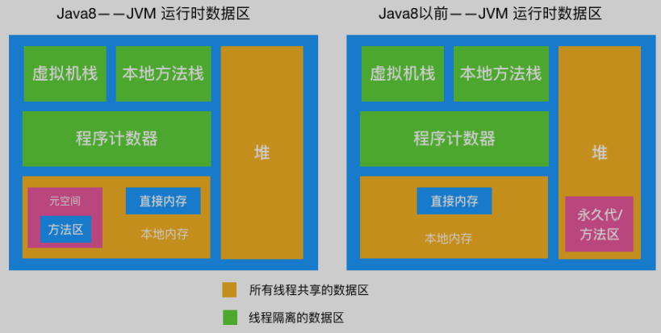
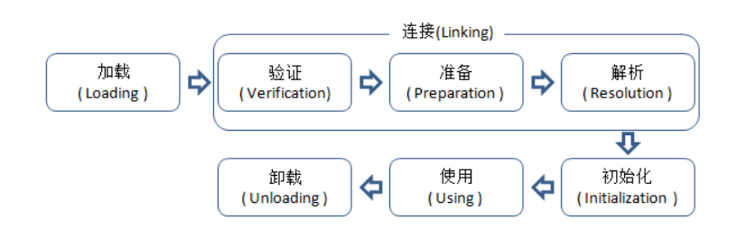
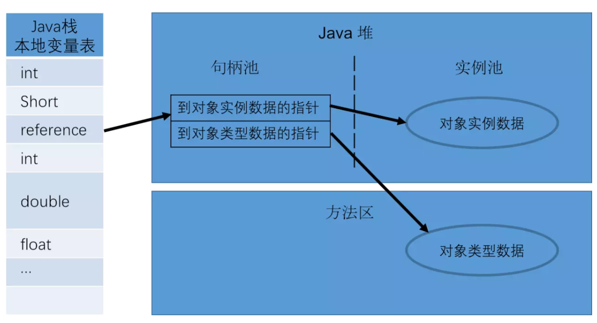
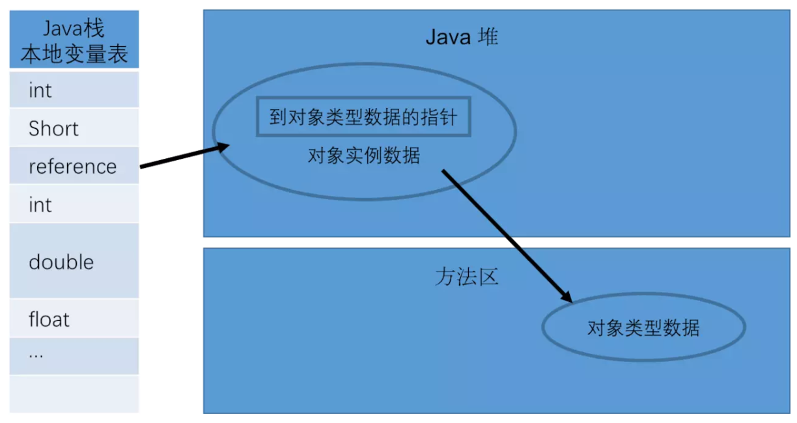
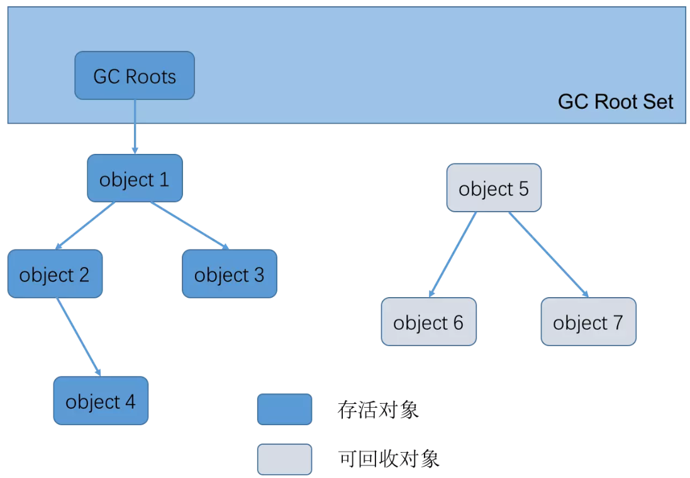
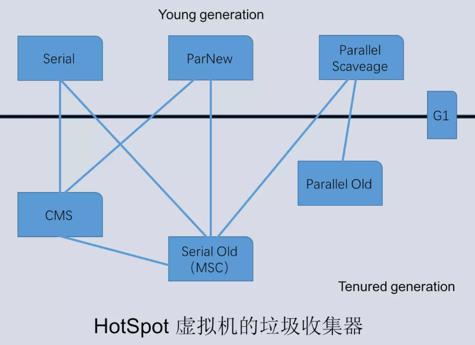

[**首页**](https://github.com/qdw497874677/myNotes/blob/master/首页检索.md)

# 运行时区域

- 程序计数器：线程私有。如果线程正在执行一个Java方法，这个计数器用来记录正在执行的虚拟机字节码指令的地址（行号）。程序计数器是Java虚拟机中**唯一一个没有规定任何OOM的情况的区域**。
- 本地方法栈：线程私有。提供本地方法的支持，其他类似虚拟机栈。
- 虚拟机栈：线程私有。线程请求的栈深度大于虚拟机允许的深度，抛出StackOverflowError。如果虚拟机栈可以动态扩展，而扩展时无法申请到足够的内存，抛出OOM。
  - 栈帧：当方法执行时，会创建一个对应的栈帧，压入栈，方法结束后出栈。
    - 局部变量表：存放局部变量，包括基本数据类型、对象引用、returnAddress 类型（指向一条字节码指令的地址）
    - 操作数栈：执行方法的操作
    - 动态链接：
    - 方法出口：通过这个出口来退出方法
- 堆：存放对象。（下面对堆的分区分代是由垃圾收集器定义的）
  - 年轻代
    - 伊甸园区
    - 幸存者区
      - To
      - From
  - 老年代
- 方法区：1.6之前HotSpot用永久代实现方法区，之后用本地内存实现方法区，1.8之后用在本地内存实现的元空间来作为方法区。方法区存放类信息，静态变量，常量池（存放常量）。
  - 运行时常量池：是方法区的一部分。Class文件中的常量池表，存放编译期生成的各种字面量和**符号引用**，这些内容在类加载后存放到方法区的运行时常量池中。
- 直接内存：它并不是虚拟机运行时数据区的一部分。
  - jdk1.4加入了NIO，引入一种基于通道和缓冲区的I/O方式，它可以直接使用本地方法直接分配堆外内存，然后通过存储在java堆中的DirectByteBuffer对象作为这块内存的引用进行操作，避免了在Java堆和Native堆中来回复制数据。

# 类加载

在java代码中，类型的加载、连接、初始化都是在程序的运行期间完成的。

## 类加载过程

类加载指的是把通过Java源代码编译成的.class文件读入内存中，然后产生与所加载类对应的Class对象。加载完成后，Class对象还不完整。加载后进入连接阶段，这一阶段包括验证、准备、解析。最后对类进行初始化。通过这五步加载。

- 加载：由**类加载器**执行的。可玩性高，可以自定义类加载器，赋予程序获取运行代码的动态性。
  1. 通过类的**全限定名**（包名+类名）来获取类的二进制字节流（Class字节码）。
  2. 把二进制流根据虚拟机的定义的格式转化存储在**方法区**（元空间）中。
  3. 在Java堆中实例化一个java.lang.Class对象，这个对象作为访问方法区中类的数据的外部接口。
- 连接：验证Class文件中的一些信息是否符合当前虚拟机要求，为静态域分配空间并设置类变量的初始值（零值）。如果必须的话，将常量池中的符号引用转化为直接引用。加载阶段和连接阶段的部分动作是交叉进行的，但两个阶段区分是明确地，开始时间的先后顺序也是固定的。
  - 验证：确保Class文件中的字节流信息符合当前虚拟机要求。
  - 准备：在方法区（元空间）为类变量（静态成员变量）分配内存，并设置变量初始值（零值）。如果是**final修饰的类变量会直接在这个阶段赋指定的初始值**，而不是赋零值。
  - 解析：虚拟机将常量池内的**符号引用替换为直接引用**。在这个阶段会检查方法和字段的可访问性。解析动作主要针对类或接口、字段、类方法、接口方法、方法类型、方法句柄、调用点限定符，七类符号引用进行。
- 初始化：开始执行类中定义的Java程序代码。
  - 执行类构造器<clinit>()方法的过程。<clinit>()方法是由编译器自动收集**类中的所有类变量(static)的赋值动作和静态代码块中的语句**合并产生的。收集的顺序就是代码对应的顺序，静态代码块只能访问到定义在他之前的变量，定义在他之后的他可以赋值但是不能访问。父类如果没有初始化会先初始化父类，保证<clinit>()执行前，父类的<clinit>()先执行完毕。 
  - 对于接口，接口内不能使用静态代码块。同时接口的初始化执行<clinit>()**不需要先执行父接口**的<clinit>()，只有当父接口中的变量使用到了才会被初始化。同理，接口的**实现类在初始化的时候，也不会执行接口**的<clinit>()方法。
  - 如果多个线程同时实例化一个类，只会有一个线程去执行<clinit>()，其他线程进入阻塞，<clinit>()执行完，其他线程就不会执行<clinit>()了。在同一个类加载器下，一个类型只会被初始化一次。

### 符号引用和直接引用

- 符号引用：以一组符号来描述所引用的目标，符号引用可以是任何形式的字面量，只要能无歧义的定位到目标，与虚拟机的布局无关。可以理解为暂时虚拟机并不知道引用到的地址，就用符号引用来代替。在解析阶段就是为了把符号引用转化为真正能访问的地址。
- 直接引用：与虚拟机的布局是相关的，不同的虚拟机通过同一个符号引用翻译过来的直接引用一般不同。如果有了直接引用，那么直接引用的目标一定加载到了内存中。
  - 直接引用可以是：
    1. 直接指向目标的指针。（指向对象、类变量和类方法的指针）
    2. 相对偏移量。（指向实例的变量、方法的指针）
    3. 一个间接定位到对象的句柄。

## 类初始化时机

- 遇到new、getstatic、putstatic或invokestatic这四条字节码指令。
  - 使用new关键字实例化对象时。
  - 读取或者设置一个类的静态字段时。
  - 调用一个类的静态方法时。
- 使用反射时，如果类没有进行过初始化，要先初始化。
- 初始化一个类，如果发现他的父类没有初始化过，先初始化父类。
- 虚拟机启动时，指定的主类（有main()方法的）要先初始化。
- 当使用jdk1.7动态语言支持时，如果一个java.lang.invoke.MethodHandle实例最后的解析结果REF_getstatic,REF_putstatic,REF_invokeStatic的方法句柄，并且这个方法句柄所对应的类没有进行初始化，则需要先出触发其初始化。

## class文件来源

- 本地磁盘中的.class文件。
- 网络下载.class文件。
- war包，jar包中的.class文件。
- 从专门的数据库中读取的.class文件（少）。
- 将java源文件动态编译成的.class文件。
  - 动态代理，运行期间生成的.class文件
  - jsp会转换为servlet，servlet是java文件，会被编译成.class文件。

通过**类加载器**加载，加载到方法区（元空间）。分两个区域：

- .class的字节码数据。
- Class对象，可以访问对应class的数据。

## 类加载器

**通过一个类的全限定名来获取描述该类的二进制字节流**，这个动作被放到了虚拟机外部去实现的，以便让程序自己去决定如何去获取所需的类。实现**这个动作的代码被成为类加载器**（Class Loader）

任意一个类的唯一性，由这个类的类加载器和这个类本身一起确立的。

### 双亲委派模型

> 从JDK 1.2开始，类加载过程采用双亲委派机制。
>
> 如果一个类加载器接收到了类加载请求，它首先不会尝试自己去加载，而是把请求委托给父类加载器去加载。当父类不能加载，才尝试自己加载。
>
> 作用：保证JDK核心类的优先加载。

**从虚拟机的角度看**，只存在两种类加载器：一种是启动类加载器（Bootstrap ClassLoader），这个类加载器由C++实现（之后HotSpot由java实现的了），是虚拟机自身的一部分；另一种就是其他所有的类加载器，由Java语言实现，是独立存在虚拟机外部，继承自抽象类java.lang.ClassLoader。

**从Java开发人员的角度看**，划分更精细，分为三层

- 启动类加载器（Bootstrap ClassLoader）：负责加载存放在<JAVA_HOME>\lib目录，或者是被-Xbootclasspath参数指定的目录下的，能被虚拟机识别的类库（名字不符合的不会加载）。无法被Java程序直接引用。
- 扩展类加载器（Extention ClassLoader）：负责加载存放在<JAVA_HOME>\lib\ext目录中，或者被java.ext.dirs系统变量指定的路径下的所有类库。这个类加载器是一Java代码的形式存在的。
- 系统类加载器（SystemAppClass 、Appclass Loader）：负责加载存放在用户类路径（ClassPath）上的所有类库。如果应用程序中没有定义过自己的类加载器，一般就默认用这个加载器加载。

用户可以定义自己的类加载器来进行拓展，比如**增加除了磁盘以外的Class文件来源**，或者通过类加载器**实现类的隔离、重载等功能**。

各种类加载器之间的层次关系被称为**双亲委派模型**。主要效果就是：如果一个类加载器接收到了类加载请求，它首先不会尝试自己去加载，而是把请求委托给父类加载器去加载。当父类不能加载，才尝试自己加载。

通过类加载器中的loadClass方法实现双亲委派模型。

1. 检查要加载的类是否已经存在。
2. 如果不存在就调用父类的loadClass去加载类。
   1. 如果父类加载器不是null，就直接调用父类加载器的loadClass去加载类。
   2. 如果父类加载器是null，那就默认使用启动类加载器作为父类加载器，去加载类。
3. 父类加载器加载失败会报错，就调用自己的findClass方法来自己加载类。

### 破坏双亲委派模型

JNDI服务

### 自定义类加载器

- 沿用双亲委派机制
  - 继承ClassLoader类并重写findClass方法
- 打破双亲委派机制
  - 继承ClassLoader类并重写loadClass和findClass方法
    - 默认的loadClass方法实现了双亲委派机制的逻辑，让父类加载器加载。为了破坏必须重写。

# 对象

## 对象的访问定位

使用对象时，通过栈上的引用变量（reference）来操作堆上的具体对象。

引用获取对象有两种形式

- Java堆中会分配一块内存作为句柄池。引用存储的是句柄地址。

- 引用中直接存储对象地址

> 比较：
>
> 使用句柄的最大好处是引用中存储的是稳定的句柄地址。对象移动（GC）时只改变实例数据指针地址，引用自身不用修改。
>
> 直接指针访问的好处就是速度快。
>
> 如果对象频繁GC那么句柄好，如果对象频繁访问则直接指针访问好。

## 类从加载到初始化的过程

- 类加载检查：遇到new指令时，先检查这个命令的参数是否能在常量池中定位到一个类的符号引用，并检查这个符号引用代表的类是否已被加载、解析和初始化过。如果没有先进行类的加载过程。
- 分配内存：两种方式：
  - 碰撞指针：假设Java堆中的内存是规整的，用过的内存在一边，空闲的在一边，中间有个指针指向分界点。分配内存就是把指针向空闲的那边移动对象大小的距离。
  - 空闲列表：假设Java堆中的内存不是规整的。虚拟机必须维护一个列表，记录哪些内存块可用，分配时从列表中找到一块足够大的空间划分给对象，然后更新列表的记录。
  - 划分空间时，可能会遇到线程安全问题。解决方法有两种：
    - 对分配内存空间的动作进行同步处理：采用CAS和自旋锁。
    - 把分配内存的动作划分在不同空间进行。
- 初始化零值：将分配到的内存空间都初始化为零值。
- 设置对象头：主要设置类的源数据信息、对象的哈希值、对象的GC分代年龄等信息。
- 执行init方法（构造函数）初始化。

> 总结：
>
> 一个java对象的创建过程包括两个阶段：类初始化阶段和类实例化阶段。
>
> 一个对象被创建时，虚拟机会为其分配内存来存放自己的实例变量和从父类继承过来的实例变量。同时这些实例变量被赋予初始值（零值）。
>
> 内存分配完成后，虚拟机开始对新创建的对象按照程序员的意愿进行初始化。

## 对象初始化

### Java对象创建时机

1. 使用new关键字创建对象。
2. 反射机制。
   1. 使用Class类的newInstance方法(反射机制)。这个newInstance方法调用无参的构造器创建对象。
   2. 使用Constructor类的newInstance方法(反射机制)。可以通过这个newInstance方法调用有参数的和私有的构造函数。事实上Class的newInstance方法内部调用的也是Constructor的newInstance方法。
3. 使用Clone方法创建对象。要想使用clone方法，我们就必须先实现Cloneable接口并实现其定义的clone方法，这也是原型模式的应用。
4. 使用(反)序列化机制创建对象。

父类的类构造器<clinit>() -> 子类的类构造器<clinit>() -> 父类的成员变量和实例代码块 -> 父类的构造函数 -> 子类的成员变量和实例代码块 -> 子类的构造函数。

对象初始化过程中主要涉及三种执行对象初始化的结构。

- 实例变量初始化。
- 实例代码块初始化。
- 构造函数初始化。

#### 1.实例变量初始化和实例代码块初始化。

在定义实例变量的同时，可以直接对实例变量进行赋值，或者使用实例代码块进行赋值。这两种方式对变量进行实例化是执行在构造函数之前的。**实际上，编译器会把这种方式赋值的代码放到构造函数中去，在调用父类构造函数之后，构造函数本身的代码之前。**

#### 2.构造函数初始化。

在编辑生成的字节码中，构造函数被命名为<init>()方法。

为了保证创建一个完整的对象。Object对象之外的对象的构造函数的第一条语句必须是父类构造函数的构造函数或者调用语句。如果没有显示调用，编译器会自动生成。

### 对象的创建流程

虚拟机的部分：

- 遇到new指令时，检查这个**指令的参数**，是否能在常量池中定位到一个类的**符号引用**。如果有检查这个符号引用代表的**类是否已被创建**。如果没有没有创建，先进行类加载。
- 在类加载检查通过后，虚拟机为新生对象分配内存（对象所需内存大小在类加载后可完全确定）。
  - 分配内存算法：
    - 指针碰撞：内存工整，占用的在一边，空闲的在一边。分配内存通过移动分界点的指针。
    - 空间列表：内存不工整。维护一个列表，记录哪些内存块可用，分配的时候找合适的块，然后更新列表。
    - 堆内存是否工整由所采用的垃圾收集器是否带有**空间压缩整理的能力**决定的。采用Serial、ParNew等，系统会采用指针碰撞算法。采用CMS这种基于清除算法的收集器时，理论上采用空闲列表。
  - 还要考虑线程安全：
    - CAS+失败重试（自旋）
    - 每个线程分配一小块内存，称为本地线程分配缓冲（TLAB）
- 对对象进行必要的设置。设置对象头的一些数据。

Java代码的部分：

- 执行构造函数：
  - 执行<init>()方法，来根据程序员的意愿对对象进行初始化。

# 垃圾回收算法与回收器

## 概述

> 程序计数器、虚拟机栈、本地方法栈三个区域随线程自生自灭（因为线程私有）。
>
> 堆和元空间不一样。只有在程序处于运行期才知道哪些对象会创建，这部分内存的分配和回收是动态的。

## 判断对象死活

### 引用计数法

> 早期算法。给对象添加一个引用计数器。当对象被引用一次，计数+1。当一个对象的一个引用超过了生命周期或者被设置为新值时，计数器-1。计数器为0时，这个对象就可以被当做垃圾收集。

缺点

- 无法解决对象循环引用。

### 可达性分析法

> 根据作为GC根（GC Roots）的对象作为起点，从这些节点出发走过的路径称为引用链。当一个对象到GC根没有任何引用链相连的时候，说明对象不可用。

可作为GC根的对象

- 虚拟机栈中引用的对象
- 本地方法栈中本地方法引用的对象
- 静态属性引用的对象
- 常量引用的对象

### 回收元空间

元空间垃圾回收主要回收两部分：废弃的常量、无用的类

- 废弃的常量：没有被引用的常量
- 无用的类：满足下面三个条件
  - 该类的所有实例都被回收
  - 加载该类的类加载器被回收
  - 该类的Class对象没有在任何地方被引用

## GC分类

- Minor GC：Eden区被填满时，会执行Minor GC，和Young GC是等价的。
- Major GC：老年代的垃圾收集叫做Major GC，通常和full GC是等价的，收集整个GC堆。

## 垃圾回收算法

基于可达性分析

### 复制算法

> 把空间分成两块，每次对其中的一块存有对象的区域进行GC。然后将存活的放到另一块上。解决了内存碎片问题。一般应用于年轻代。

缺点：

- 会浪费一定空间。

### 标记清除算法

> 1. 标记阶段：进行一次可达性分析，把从GC跟可达的对象进行标记。
> 2. 清除阶段：遍历堆，把未标记的对象回收。同时恢复对象之前的标记。
>
> 一般应用于老年代。

缺点：

- 回收时，应用需要挂起
- 效率不高
- 会产生内存碎片

### 标记整理算法

> 在标记清除的基础上，把标记的存活对象向一侧的空间移动。

解决的内存碎片的问题

### 分代回收

> 根据不同的情况制定相应的回收算法，结合这些算法的优先，是现代虚拟机采用的首选算法（策略）。
>
> - 年轻代：每次回收都有大量的对象死去，少量存活。通常选用复制算法。
> - 老年代：对象存活率高。使用标记清楚或者标记整理算法。

#### 年轻代的回收

因为大部分对象生命周期很短，所以分代收集算法根据对象存活周期的不同将堆分成新生代和老年代，默认比例1：2。

为了节省空间，在年轻代，将空间划分为三块。伊甸园区、两个幸存者区（To、From）。他们的空间大小比例为8：1：1。

当伊甸园区满时，触发第一次young gc（Minor GC），回收伊甸园区，把存活的对象放到一个幸存者From区，对象的年龄+1（对象年龄即参与MinorGC的次数）。当伊甸园区再次触发young gc时，会回收伊甸园区和幸存者From区，存活的对象放到幸存者To区（先复制再对旧的清除）。

之后伊甸园区触发gc时，就会对伊甸园区和幸存者To区进行回收。把存活对象放到From区。

#### 进入老年代的时机

- 对象年龄到达阈值15时，进入老年代。
- 大对象：当某个对象分配需要大量连续内存时，直接分配到老年代。因为会很占用幸存者区。
- 幸存者区中，相同年龄的对象大小之和大于一个幸存者区空间一半以上时，将大于等于这个年龄的对象放入老年代。

#### 空间分配担保

发生MinorGC之前，虚拟机会先检查**老年代最大可用的连续空间**是否大于新生代所有对象的总空间。如果大于MinorGC就是安全的，如果不大于就会检查设置是否允许担保失败，如果允许，就会继续检查老年代最大可用连续空间是否大于历次晋升到老年代对象的平均大小，如果大于就进行MinorGC，否则可能进行一次FullGC（MajorGC）。

**总结：晋升担保：MinorGC之前，虚拟机检查老年代是否能容纳所有年轻代的对象。如果不够就需要直接提早进行一次FullGC，防止下次MinorGC晋升失败。如果设置了允许担保失败，在担保失败时，还会检查老年代能不能容纳平均晋升到老年代的对象**

#### Stop The World

如果老年代满了，会触发FullGC，会同时回收年轻代和老年代（即回收整个堆）。它会导致Stop The World（STW），产生性能开销。

STW：在GC（MinorGC或FullGC）期间，只有垃圾回收器线程在工作，其他线程都被挂起。

一般FullGC会导致工作线程停顿时间过长（清理整个堆中的不可用对象），如果此时server收到很多请求，就会拒绝服务。（MinorGC一会曹正STW，但是相对影响较少）

所以，把新生代设置为三个区，给对象设置年龄阈值，把新生代和老年代的比例设为1：2都是为了尽可能避免对象过早地进入老年代，尽可能晚的触发FULL GC

因为GC会影响性能，就需要在一个合适的时间点发起GC，这个时间点称为Safe Point。这个时间点的选定不能太少（导致GC时间太长产生过长时间的卡顿），也不能过于频繁（导致过多的运算消耗）。

- 循环的末尾
- 方法返回前
- 调用方法的call之后
- 抛出异常的位置

## 垃圾回收器

> 垃圾回收算法是内存回收的理论，垃圾回收器是内存回收的实践。

连线说明可以搭配使用

- 在新生代工作的垃圾回收器：Serial, ParNew, ParallelScavenge
- 在老年代工作的垃圾回收器：CMS，Serial Old, Parallel Old
- 同时在新老生代工作的垃圾回收器：G1

### Serial 收集器

> 这是一个单线程收集器。意味着它只会使用一个 CPU 或一条收集线程去完成收集工作，并且在进行垃圾回收时必须暂停其它所有的工作线程直到收集结束。

主要运行在Client模式下的虚拟机，是新生代的默认收集器

### ParNew 收集器

> 可以认为是 Serial 收集器的多线程版本。

主要工作在Server。

### Parallel Scavenge 收集器

> 这是一个新生代收集器，也是使用复制算法实现，同时也是并行的多线程收集器。

新生代收集器，多线程，相对于CMS，PS更关注吞吐量，适合用户交互比较小的任务。

### Serial Old 收集器

> 收集器的老年代版本，单线程，使用 标记 —— 整理。

老年代收集器。一般在Client模式下使用。

### Parallel Old 收集器

> Parallel Old 是 Parallel Scavenge 收集器的老年代版本。多线程，使用 标记 —— 整理

是PS的老年代版本，也是多线程的。关注吞吐量。

### CMS 收集器

关注停顿时间，尽可能减少停顿时间，提高响应速度。与应用线程并发执行，用于老年代，**用的是标记清除法。**

如果老年代使用CMS垃圾回收器，需要添加虚拟机参数-"XX:+UseConcMarkSweepGC"。

根据GC的触发机制不同，有两种**实现机制：周期性Old GC（被动）和主动Old GC**

#### 周期性Old GC

默认每2s对老年代进行回收。

##### 触发条件

- 如果没有设置-XX:+UseCMSInitiatingOccupancyOnly，虚拟机会根据收集的数据决定是否触发
- 老年代使用率达到阈值CMSInitiatingOccupancyFraction，默认92%
- 永久代的使用率达到阈值CMSInitiatingPermOccupancyFraction，默认92%，前提是开启CMSClassUnloadingEnabled
- 新生代的晋升担保失败。

##### 过程

对象在标记过程中，根据标记情况分为三类。

1. 白色对象，表示自身未被标记。
2. 灰色对象，表示自身被标记，但内部引用未被处理。
3. 灰色对象，表示自身被标记，内部引用都被处理。

过程：

- 初始化标记：整个过程STW，GC线程单线程执行。
  - 标记**GC Roots可达**的老年代对象
  - 标记**新生代对象可达**的老年代对象
- 并发标记：GC线程和应用程序线程并发执行。本阶段把对象标记为Dirty。
  - 遍历上个阶段标记的对象，继续**递归遍历**他们可达的对象。
  - 对于更新的引用对象，标记为Dirty，方便之后重新标记检查。（运行期间允许新生代对象晋升到老年代、直接分配到老年代、更新老年代对象的引用关系）
- 预清理：通过参数`CMSPrecleaningEnabled`选择关闭该阶段，默认启用
  - 标记新生代对象新引用的老年代对象。
  - 在并发标记阶段中，标记为Dirty的有内部引用更新的老年代对象，把他们重新遍历标记。
- 可中断的预清理：该阶段发生的前提是，新生代Eden区的内存使用量大于参数`CMSScheduleRemarkEdenSizeThreshold` 默认是2M。其实就是在新生区的使用率比较小，对老年代对象影响概率比较小的情况下，帮助之后的重新标记阶段提前标记一下。
  - 处理幸存者区的对象，标记可达的老年代对象。
  - 标记Dirty对象。
- 并发重新标记：STW。数：`CMSScavengeBeforeRemark` 默认关闭，如果打开，这阶段前会默认执行一个YGC，减少扫描新生代的规模。
  - 遍历新生代对象，重新标记，之前并发标记阶段处理了一部分，这里只处理有变化的。
  - 根据GC Roots，重新标记
  - 根据老年代的Dirty对象，重新标记

#### 主动Old GC

##### 触发条件

1. YCG过程担保失败，触发OldGC
2. 比如执行了`System.gc()`，前提是没有参数`ExplicitGCInvokesConcurrent`

如果触发主动Old GC时，周期性正在执行，会剥夺执行权。

主动Old GC开始时，会判断本次GC是否对老年代的空间进行压缩整理。

简单的运作步骤:

1. 初始标记(CMS initial mark)：STW，单线程，标记 GC Roots 能**直接关联**到的对象
2. 并发标记(CMS concurrent mark)：GC线程和应用程序线程并发执行。对于标记的对象进行**递归标记。**
3. 并发预清除(Concurrent precleaning)：GC线程和应用程序线程并发执行。对于老年代对象的状态更新的对象（在并发阶段发生的：新生代晋升到老年代、直接分配到老年代、重新标记了老年代对象）**重新标记**。减少下面重新标记的工作量。
4. 重新标记(CMS remark)：STW，GC线程多线程并发执行，**扫描剩余的对象**，并递归标记。
5. 并发清除(CMS concurrent sweep)：GC线程和应用程序线程并发执行。清理垃圾对象。

适用于对时延要求比较高的服务，用户线程停顿的时间相对较短。

缺点：

- **对 CPU 资源敏感。**对CPU资源的依赖较大。**很吃吞吐量。**
- **无法收集浮动垃圾。**并发清理阶段用户线程还在进行，所以清理的同时会产生新的垃圾，这部分垃圾（浮动垃圾）只能下一次GC时清理。为了保证用户线程运行，需要预留足够空间，不能等到老年代满了在使用。
- **标记清除 算法带来的空间碎片。**可以设置是否开启内存碎片的整理，和整理的频率。

### G1（Garbage First）收集器

> 面向服务端的垃圾回收器。

适合服务器端，可以与应用线程并发执行。停顿时间容易预测，可以指定停顿时间，尽可能控制设置的时间内完成（因为他对堆的拆分比较细化，同时责任明确，比价好估算价值）。不会像CMS牺牲大量吞吐量。

优点：

1. 和CMS一样，能与用户线程并发执行。
2. 整理空闲空间更快，不会产生内存碎片。从整体看是标记整理算法，局部上划分很多个区域，两个区域间是基于复制算法。（抛弃了传统的分代）
3. 不需要想CMS那样牺牲大量的性能。
4. 不需要更大的堆空间。
5. 在STW上建立了可预测的停顿时间模型，用户可以指定期望停顿时间，G1会将停顿时间控制在用户设定的停顿时间以内。

运作步骤:

1. 初始标记(Initial Marking)
2. 并发标记(Concurrent Marking)
3. 最终标记(Final Marking)
4. 筛选回收(Live Data Counting and Evacuation)

## 默认回收器

jdk1.7 默认垃圾收集器Parallel Scavenge（新生代）+Parallel Old（老年代）

jdk1.8 默认垃圾收集器Parallel Scavenge（新生代）+Parallel Old（老年代）

jdk1.9 默认垃圾收集器G1

 

-XX:+PrintCommandLineFlagsjvm参数可查看默认设置收集器类型

-XX:+PrintGCDetails亦可通过打印的GC日志的新生代、老年代名称判断

# JVM常用的基本配置

- -Xms：虚拟机中的内存大小，大概是总内存的1/64
- -Xmx：虚拟机试图使用的最大内存，大概是总内存的1/4
- 

# OOM

- StackOverflowError：栈溢出。
  - 无限递归方法。
  - 解决：
    - 增加栈空间
    - 可以尝试用堆这种动态分配的空间去解决问题，从而替换掉用栈。
    - 查询内存占用情况，通过命令定位到具体的代码。
- OutOfMemoryError:Java heap space：堆内存溢出。
  - 无限创建对象，或者创建很大的对象（new byte[80 * 1024 * 1024]）。
- OutOfMemoryError:GC overhead limit exceeded：GC回收时间过长。超过98%的时间来做GC。
  - 不断往集合中放入对象。
- OutOfMemoryError:Direct buffer memory：直接内存溢出。对于某些方法把一些对象分配到本地内存，GC不管。
  - 比如NIO程序用BtyeBuffer来读取和写入数据，这是一种基于通道和缓冲区的I/O方式，可以使用本地方法直接分配堆外内存，可以避免Java堆和Native堆中来回复制数据，从而提升性能。用BtyeBuffer.callocateDirect();不断创建对象，把直接内存撑满。
- OutOfMemoryError:unable to create new native thread：不能创建新的本地线程了。一个应用进程创建了过多的线程。linux系统默认允许单个进程最多可以创建1024个线程。
  - 不断创建持久的线程。
  - 解决：分析是否需要用到这么多的线程，尽量减少线程的创建，如果非要用，可以修改系统配置扩大上限
- OutOfMemoryError:Metaspace：元空间内存溢出。
  - 通过cglib的动态代理，不断创建代理对象，生成class填入元空间。

通过参数 -XX:+HeapDumpOnOutOfMemoryError 可以让虚拟机在出现溢出时Dump出当前的内存堆转储快照以便事后进行分析。

# 内存泄露和内存溢出

- 内存泄漏指被分配的对象可达，但无用。比如在集合中加入大量的对象就可以造成这种效果。
  - 例如ThreadLocal的元素的key是弱引用，value是强引用。ThreadLocal没有被外部引用的情况下，垃圾回收时，key会被清理掉，而value不会被清理掉。就会产生内存泄漏。
  - 解决：
    - 使用临时变量时，尽可能在使用完释放掉，将引用置为null。
    - 尽量用StringBuffer代替String
- 内存溢出指无法申请到足够的内存而产生错误。