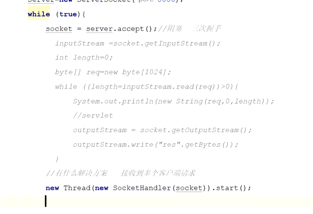
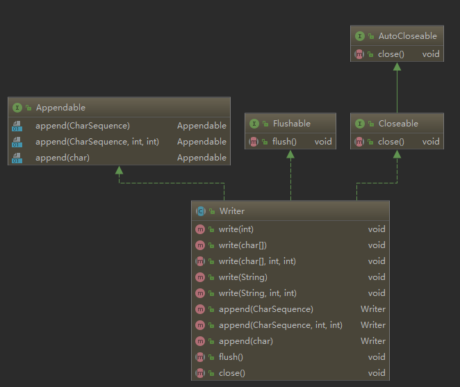

[**首页**](https://github.com/qdw497874677/myNotes/blob/master/首页检索.md)

## 设计模式六原则

- 开闭原则：对扩展开放，对修改关闭。拓展时不能修改原有代码。
- 里氏代换原则：子类可以扩展父类的功能,但不能改变父类原有的功能。
- 依赖倒转原则：针对接口编程，依赖于抽象而不依赖与实体
- 接口隔离原则：使用多个隔离的接口，比使用单个接口更好，抽象更细致。
- 最少知道原则：一个实体尽量少与其他实体之间发生相互作用（不需要知道具体是谁，我自己做好就行）
- 合成复用原则：尽量使用合成/聚合的方式，而不是使用继承。

## Java是编译型还是解释型

Java代码需要编译，才能去运行，像是编译型。

Java编译后的代码不能直接运行，操作系统不能直接理解，需要运行在JVM上，像是解释型。

个人认为是解释型的，因为就算是编译后的.class文件，是字节码，操作系统还是不识别的，需要在JVM上解释后才能执行，所以才会是跨平台的。

## JRE和JDK

- JRE：java运行时环境。主要包含两个部分，jvm的标准实现和java的一些基本类库。相较于jvm多出来一部分java类库。
- JDK：java开发工具包。集成了jre和一些工具，如
  - javac.exe：表一java源文件
  - java.exe：启动java虚拟机运行java程序
  - jar.exe：把java应用打包成一个文件

## 面向对象

万物皆对象。对象有具体的实例化。任何方法或者属性都要写在对象（类）里面。

三大特征：

- 封装：把类的方法和属性用访问控制符修饰，只通过适当的方式暴露给外面。
  - 便于权限控制，保护属性。提高了代码的可维护可拓展性。
- 继承：一个新类可以从现有的类中派生。允许和鼓励类的重用。
- 多态：允许基类的指针或者引用指向派生类对象，在具体访问方法时实现方法的动态绑定。可以把不同的子类都看作父类，来屏蔽掉子类对象之间的差异，写出通用的代码。
  - 三个定义
    - 父类定义子类结构，父类不能调用子类独有的方法。子类方法覆盖（隐藏）了父类，调用会使用子类的方法。
    - 接口定义实体类结构
    - 抽象类定义实体类
  - 两个方法
    - 重载：同一个类中，定义了多个方法，具有相同的方法名和不同的参数列表
    - 重写：final类型的方法和static类型的方法是不能被重写的。
      - 一个前提：前提是在继承体系结构下。
      - 三个相同：子类中定义的方法与父类中的方法，有相同的名字、参数列表、返回值类型。
      - 两个规定：子类方法的范围限定不能比父类的范围小，不能抛出更多的异常。

好处：

- 易维护
- 易复用
- 易拓展

## 重载和重写

- 重载指同一个类中有相同的名字不同参数的方法来执行。
  - 方法名相同，参数类型不同或者个数不同
- 重写指子类对父类允许访问的方法的实现过程进行重新编写。

## 继承（待更新！！！）

子类拥有父类所有的属性和方法（包括私有的）。但是父类中私有的方法和属性，子类无法使用，只能通过父类的非私有去简介访问。只能使用私有之外的。

## Java怎么实现多态

多态的实现是通过对访问的方法进行动态绑定来实现的。而动态绑定的实现主要依赖于方法表。当某个方法被调用时，JVM检查对应的运行时常量池，找到方法的符号引用，并查找调用类的方法表来确定方法的直接引用，然后才进行真正的调用。

方法表是动态调用的核心。存储于方法区中的类型信息，包含有该类型所定义的所有方法及指向这些方法代码的指针。这些具体的方法代码可能是被重写的方法，也可能是继承基类的方法。

## 接口和抽象类

接口：

- 可以有变量和方法。变量隐式的指定为public static final变量。方法隐式地指定为public abstract方法。如果一个非抽象类实现接口就要实现所有方法。如果是抽象类实现接口就可以不实现接口中的抽象方法。
- JDK8之后，接口也可以定义静态方法，可以直接用接口名调用。
- 一个类可以实现多个接口
- 从使用者角度看问题。接口是对行为的抽象。强调合约，双方无法犯错，是一种行为规范。

抽象类：

- 可以有成员变量，普通成员方法，可以有静态代码块和静态方法。
- 有抽象方法，有了抽象方法这个类就成为了抽象类。抽象方法必须为public或者protected修饰（private修饰后不能被继承，子类就不能实现方法）。抽象方法子类必须实现。如果子类没有实现父类的抽象方法，那必须将子类也定义为抽象方法。
- 抽象方法不能创建对象，
- 不可以多重继承，**接口可以**（只要继承的两个方法没有一样的方法就可以（方法名和参数））
- 抽象是对类的抽象，是一种模板式设计。

两者的区别

- 抽象类可以提供一些共有的实现，接口可以表示具有哪些功能
- 抽象类是对一种事物的抽象，包括属性和行为。接口是强调合约，双方无法犯错。
- 抽象类是一种模板式设计，接口是一种行为规范。
- 抽象类修改添加删除方法，子类不受影响。接口进行变更，实现接口的类都要改变。

### 抽象类可以实现接口吗

抽象类可以实现接口，可以不重写全部方法。没有重写实现的方法，需要让子实体类实现。

### 抽象类可以继承实体类吗

父类如果没有声明构造器，jvm是会生成一个默认的无参构造。其实上面的意思就是继承要满足一般继承的规则。**和实体类的继承一样，也要求父类可继承，并且拥有子类可访问到的构造器。**

### 多继承

- 类为什么不能多继承
  - 当类

## 基本数据类型

- 逻辑型
  - boolean：1bit
- 整型
  - byte：8bit-1字节-最大128
  - short：16bit-2字节
  - int：32bit-4字节-最大大概能表示二十亿
  - long：64bit-8字节
- 浮点型
  - float：32bit-4字节
  - double：64bit-8字节
- 字符型
  - char：16bit-2字节

## （待更新！！！）浮点数

浮点数组成：符号位 | 基数m | 指数e

- 基数m部分：使用二进制数来表示此浮点数的实际值。
- 指数e部分：占用8bit(1个字节)的二进制数，可表示数值范围为0-255。但是指数可正可负，所以，IEEE规定，此处算出的次方必须减去127才是真正的指数。所以，float类型的指数可从-126到128。

## 访问控制符

抽象类方法

接口：方法可以用public（不同包-子父类-同包-同类），protected（子父类-同包-同类），defailt（同包-同类）修饰。不能用private修饰方法。属性只能定义常量。

## （待更新！！！）内部类

优点：

- 内部类和外部类可以方便的访问彼此的私有域。（包括私有方法和私有属性）
- 内部类时另外的一种封装，对外部的其他类隐藏。
- 内部类可以突破单继承的局限。（每一个内部类都可以继承一个类）

分类

- 成员内部类：内部不允许存在静态方法或者变量。
- 静态内部类：使用static修饰内部类，就是静态内部类。
- 方法内部类：方法内部类不允许使用访问权限修饰符。对外部类完全隐藏，除了创建这个类的方法可以访问它以外，其他地方都不行。方法内部类如果想使用方法的形参，这个参数必须是final的。（JDK8形参变为隐式final声明）
- 匿名内部类：没有类名所以没有构造方法，必须继承一个抽象类或者实现一个接口。其他的类似于方法内部类。

内部类与外部类的关系

- 对于非静态的内部类，内部类的创建依赖外部类的实例对象，在没有外部类实例之前是无法创建内部类的。
- 内部类可以直接访问外部类的元素，包括私有域。外部类会在内部类创建之前创建，创建内部类时会将外部类的对象引用。
- 外部类可以通过内部类的引用间接访问内部类元素。想要访问内部类属性，必须先创建内部类对象。

## 异常

### 异常的结构

- Throwable
  - Error：错误。无法被程序处理。不应该试图去处理它引起的异常状态。（JVM承担）
    - VirtualMachineError：虚拟机错误
    - OutOfMempryError：内存溢出
    - ThreadDeath：线程死锁
  - Exception：异常。能被程序本身处理，可以catch，尽量在程序中处理这些异常。
    - Checked Exception：受检异常。Java编译器负责，可检测出，如果不处理，就不能编译通过。
      - IOException：IO异常。
      - SQLException：SQL异常
      - ClassNotFoundException：找不到类定义的异常
        - Class.forName()找不到指定的类
        - ClassLoader中的loadClass()找不到指定类
    - RuntimeException：非受检异常（运行时异常）。Java编译器不会检查这类异常。即使没有用trycathc捕获，也没有throws抛出，也会编译通过。为了就是找出错误从而修改程序。
      - NullPointerException：空指针异常
      - ArrayIndexOutOfBoundsException：数组下标越界异常
      - ArithmeticException：算数异常
      - ClassCastException：类型转换异常

- 可查异常：除了Exception中的RuntimeException及RuntimeException的子类以外，其他的Exception类及其子类(例如：IOException和ClassNotFoundException)都属于可查异常。
- 不可查异常：包括运行时异常（RuntimeException与其子类）和错误（Error）。

### 异常处理机制

- 抛出异常
- 捕获异常

### 异常堆栈信息

~~~
Exception in thread "main" java.lang.NullPointerException
	at com.bsx.test.TestException.m3(TestException.java:22)
	at com.bsx.test.TestException.m2(TestException.java:17)
	at com.bsx.test.TestException.m1(TestException.java:13)
	at com.bsx.test.TestException.main(TestException.java:9)
~~~

对于单个堆栈块。先出现的是最底层的抛出异常的方法。从被调用者开始报错，然后是调用者，依次报错。

### 断言

执行断言语句时，java计算断言assertion的值，如果是false，抛出AssertionError异常。该类有一个无参构造方法和七个重载的单参数构造方法，参数类型为int，long，float，double，boolean，char和Object。

不应该使用断言代替异常处理，异常处理用于在程序运行期间处理非常环境，断言是要确保程序的正确性。异常处理针对程序的健壮性，而断言设计程序的正确性。与异常处理类似，断言不能代替正常的检验，只是检测内部的一致性和有效性。断言在运行是检验，可以在程序启动时打开或关闭。

## （！！！待完成）JDK1.8新特性

- Lambda表达式

- 函数式接口：只有定义一个方法的接口。为了更方便的使用lambda表达式。得到的是一个函数式接口的实现类。

- 方法引用和构造器引用：lambda体中的内容有方法已经实现了，那么可以使用“方法引用”。直接把方法作为lambda体中的那个方法，最终得到的还是一个lambda，是一个函数式接口的实现类。

- Stream API：可进行流操作，将原先数据库能执行的操作提供到编码方式实现

  - | 去重：distinct  | distinct()      |
    | --------------- | --------------- |
    | 排序：order by  | sorted()        |
    | 分页：limit     | limit()、skip() |
    | 条件：where     | filter()        |
    | 分组： group by | groupingBy()    |

  - 创建stream

  - 中间操作（过滤、map）

  - 终止操作

- 接口中的默认方法和静态方法

  - ~~~java
    public interface Interface {
        default  String getName(){
            return "zhangsan";
        }
    
        static String getName2(){
            return "zhangsan";
        }
    }
    ~~~

    

- 新时间日期API

- Optional<T>：用于代替null的一个工具类

  - 它是box类型，保持对另一个对象的引用。
  - 是不可变的，不可序列化的
  - 没有公共构造函数
  - 只能是present 或absent
  - 通过of(), ofNullable(), empty() 静态方法创建。

- 

## 数组的存储

new一个数组之后，在堆内存中开辟连续的空间，返回这个空间的首地址给引用类型变量

## static关键字的作用

static关键字有四种使用场景

- 修饰**成员变量和成员方法**：被static修饰的成员属于类，可以通过类名调用。静态方法只能访问和调用静态的。在方法区（元空间）中。
- 修饰代码块：静态代码块，在类被初次加载时执行静态代码块（在构造方法前），只有执行一次。对于定义在他后面的静态变量可以赋值（不能对非静态的变量赋值），但是不能访问。
  - 和非静态代码块（构造代码块）的相同与不同：
    - 相同点：都是**在构造方法之前执行**，在类中都可以定义多个，定义多个时按照顺序执行，一般在代码块中对一些static变量进行赋值。
    - 不同点：静态代码块在非静态代码块之前执行。静态代码块只在第一次初始化执行一次（特例：Class.forName("ClassDemo")创建Class对象的时候也会执行。）；非静态代码块每初始化一次就执行一次。非静态代码块可在普通方法中定义；静态代码块不行。
- 静态内部类：静态内部类和非静态内部类的最大区别：**非静态内部类在编译完成后会隐含保存一个引用，引用指向创建它的外部类**，但是静态内部类没有。所以：
  - 静态内部类的创建不需要依赖外部类创建。
  - 静态内部类不能使用外部类的非静态的成员变量和方法。
- 静态导包：可以导入某个类中的指定静态资源，使用时不需要使用类名。

### 非静态代码块和构造方法的区别

非静态代码块是给所有对象进行统一初始化，而构造方法是给对应的对象初始化，因为构造方法可以有过个。

## final、finally、finalize

final有四种使用场景。

- 修饰类：这个类**无法被继承**、类中的所有成员方法都默认是final修饰的。
- 修饰方法：该**方法不能被重写**。private方法都隐式地指定为final。
- 修饰方法参数：编写方法时，在参数前面加final修饰，表示整个方法中，**不会改变参数的值**。
- 修饰变量：表示常量，**只能被赋值一次**，不能再改变。如果是基本数据类型，值是不能改变的。如果是引用类型的变量，变量指向对象后，不能让其再指向另外一个对象了。引用的对象的值是可以改变的，但引用类型的变量值是不能改变的。
  - 赋值可以在声明的时候赋值，或者在类的构造方法中赋值（包括非静态代码块）。staticc final修饰的变量会直接在类加载过程的准备阶段赋值（不是零值）。

finally是异常处理的一部分，无论是否捕获或处理异常，finally 块里的语句都会被执行。当在 try 块或 catch 块中遇到 return 语句时，finally 语句块将在方法返回之前被执行。下面四种情况finally块不会被执行：

- finally块中第一行发生了异常。
- 前面执行的代码中用了System.exit(int)退出了程序。
- 程序所在的线程死亡。
- 关闭CPU。

finalize()是Object类中的成员方法。被垃圾收集的时候会先执行这个方法，只执行一次，如果执行了，下次如果被回收，就会直接回收了。

## 为什么数组快

数组为随机访问。为什么支持随机访问：

- 数组占用内存的连续空间
- 数组元素大小一样

还有一个快的原因是：因为连续内存，所以在cpu读取时，把数据块取到缓存中，这样多次访问数据效率会高（现在缓存中找）。

## （待更新！！！）父类子类

### 变量

子类同名的变量会隐藏父类中的

### 构造器

父类的构造器不能被子类继承。

- 子类的构造器中有一个**隐式的super()来调用父类中的无参数构造器**。
- 如果子类调用了父类的有参构造器，就不会隐式调用无餐的了。

## Java类中的代码调用顺序

先类再实例，先父再子

子类和父类第一次调用

new Son()；

1. 父类静态代码块
2. 子类静态代码块
3. 父类非静态代码块
4. 父类构造方法
5. 子类非静态代码块
6. 子类构造方法

new Son();

1. 父类非静态代码块
2. 父类构造方法
3. 子类非静态代码块
4. 子类构造方法

new Fathar();

1. 父类非静态代码块
2. 父类构造方法

## Java线程的状态

6种

- NEW：新建状态，线程对象创建后进入新建状态，但还没有调用start()方法。
- RUNABLE：运行状态，调用start()后进入。Java线程将操作系统中的就绪和运行两种状态统称为运行中。ready状态的线程，获取到cpu时间片后处于running状态
- BLOCKED：阻塞状态，表示线程阻塞于锁（synchronize），是被动的释放cpu。
- WAITING：等待状态，表示线程进入等待状态，进入该状态表示当前线程需要等待其他线程做出一些特定动作（通知或者中断）。执行wait()、join()、park()方法进入等待状态（一般是主动进入)。
- TIME_WATTING：超时等待状态，可以再指定时间自行返回。执行wait(long millis)方法进入超时等待状态。之后返回到运行状态。
- TERMINATED：终止状态，表示当前线程已经执行完毕。线程的run()方法完成时，或者主线程的main()方法完成时，我们就认为它终止了。

## BLOCKED和WAITING有什么区别

线程可以通过wait()、join()方法进入wating状态，进入wating状态的线程要等待唤醒(notify或notifyAll)才有机会获取获取cpu时间片。

blocked状态是因为获取不到锁后，线程**被动进入**的，进入blocked状态是在同步代码之外，进入waiting状态是在同步代码之内。

## 启动线程用run()还是start()

start()开始一个线程后，线程就进入**就绪状态**，使线程所代表的虚拟处理机处于可运行状态，这意味着它可以由JVM调度并执行。start()在java中最终调用一个本地方法来准备启动一个线程。

通过run()方法启动线程，并没有真正的创建多线程，此时还是只有一个主线程，调用run方法相当于调用类的普通方法。

## 执行两次Start()方法会发生什么

Java的线程是不允许启动两次的，第二次调用必然会抛出IllegalThreadStateException，这是一种**运行时异常**，多次调用start被认为是编程错误。

## join、yield、sleep、wait

- join：让一个线程等待另一个线程执行完后才能执行（调用目标线程的join）
- yield：让当前线程切换到就绪态，重新竞争cpu，不释放锁
- sleep：让当前线程阻塞指定时间，不释放锁
- wait：让当前线程阻塞，释放锁

## object类

一共有11个方法

- getClass()

> 是一个native方法，是final修饰的，不允许重写。
>
> 返回当前实例的Class对象。

- hashCode()

> 返回对象的哈希码。哈希码为了确定对象在哈希表中的索引位置。

- equals()

> 用于判断两个对象是否相等。默认是比较两个对象是否拥有相同的地址。

- clone()

> 用于克隆一个对象，被克隆的对象需要实现Cloneable接口，并且重写clone()。
>
> 浅拷贝：对基本数据类型进行值传递，对引用数据类型进行引用传递的拷贝。
>
> 深拷贝：对基本数据类型进行值传递，对引用数据类型，创建一个新的对象，复制其内容，即在浅拷贝的基础上对所有引用的其他对象也进行了拷贝，为深拷贝。

- toString()

> 默认返回类名和哈希码。

- notify()

> native方法，被final修饰。
>
> 用于唤醒正在此对象监视器上的一个等待线程。唤醒的线程是随机的。

- notifyAll()

> native方法，被final修饰。
>
> 用于唤醒所有正在当前对象监视器的等待线程。

- wait()

> 一个线程调用一个对象的wait()方法后，线程将进入WAITING或者调用带超时时间地进入TIMED_WAITING状态。直到被唤醒。同时会让当前线程释放它所持有的所有锁，直到其他线程调用此对象的notify()或notifyAll()。wait()只能在同步代码中调用，也就是说必须先获得锁，调用后会释放锁，让出CPU。
>
> 与sleep()的区别
>
> - sleep()是Thread类中的静态方法；wait()是Object类中的方法。
> - sleep()导致程序暂停执行指定的时间，让出cpu，它会保持监控状态，时间到了自动恢复运行，过程中不会释放锁。调用wait()方法的时候，线程会放弃对象锁，进入等待状态，只有针对此对象调用notify()方法后本线程才进入准备状态。
> - sleep()可以在任何地方使用；wait()只能在同步方法或者同步块中用。
> - 它们都可以被interrupted方法中断。
> - 

- finalize()

> 垃圾回收器回收一个无用的对象时，会调用这个方法。可以重写这个方法来做一些清除工作。

## serializable和clone接口

### serializable

要想将对象序列化和反序列化，对象的类需要实现serializable接口。使用transient修饰的变量不会被序列化。

### clone

#### 浅克隆

深克隆

类要想克隆，需要实现clone接口，并重写Object类的clone()方法。这个只是浅克隆。

自己引用的类也要实现clone接口，并重写Object类的clone()方法。就可以实现深克隆。

也可以通过序列化对象，把对象转化为输出流，在转化为数据流，在获取到对象，来实现深克隆

## ==、eqauls、hashcode

- ==
  - 如果是基本数据类型用==，就是比较他们的值，如果对象比较用==，就是比较他们的内存地址是否相等。
- eqauls
  - equals()用来判断两个对象是否相等。默认判断两个对象的地址是否相等。可以通过重写来实现比较对象的内容。
- hashcode
  - 返回与这个对象的存储地址和字段等相关的一个值。不同的对象可能生成相同的hashcode值。hashcode值不同，肯定是不同的对象。

## 哈希碰撞和哈希冲突

碰撞指哈希表中计算key，得到了和另一个key相同的hashCode

碰撞强调，计算出同一个索引位置。

## HashMap中的key为什么重写eqauls和hashcode

HashMap比较key的时候，先对key的使用hashcode()，比较其值是否相等，若相等再用equals()比较。若不等就认为他们不相等。

自定义的类的hashcode()方法继承与Object类，返回与这个对象的存储地址和字段等相关的一个值。所以逻辑上相等的对象，默认的hashcode()并不相等。

如果认为逻辑上相等的对象就是相等的。那么需要重写类的hashcode()和equals()。如果HashMap判断hashcode()相等后会接着判断equals()，equals()默认是比较对象地址是否相等，所以也要重写equals()，确保相同的对象的hashcode()和equals()是相等的。

hashmap中的判断是否是同一个key的代码

~~~java
if (p.hash == hash && ((k = p.key) == key || (key != null && key.equals(k))))
~~~

规定

> - 如果两个对象相等，则hashcode一定相等。
> - 如果两个对象相等，两对象相互调用equals方法都返回true。
> - 如果两个对象有相等hashcode，他们不一定相等。
> - hashCode()默认是对堆上的对象产生独特值。如果没有重写，那么这个类的两个对象无论如何都不会相等。

### 重写的案例

~~~java

~~~

## String、StringBuilder 和 StringBuffer

- String

String**类被final修饰**，不能被继承。String类底层数据结构为一个char型的数组，**被final修饰的**。String的值是不能改变的，String类是一个不可变类。不可变类的好处是，**保证线程安全。**

new String() 和 new String(“”)都是声明一个新的空字符串，是空串不是null。

String类维护了一个字符串常量池，JDK1.6在方法区、1.7在堆内存、1.8在元空间。

1. 当使用字面值（String s = "hello";）创建一个字符串时，JVM会先检查常量池中是否存在。如果存在就将这个实例地址赋给引用；如果常量池中不存在，就会实例化字符串对象放在常量池中，将此对象地址赋值给引用。也就是说无论常量池中是否有，**都返回常量池中的对象**。
2. 当通过new 创建字符串对象时。new String("abc")
   1. 在类加载时：如果字符串常量池中没有对应的字符串（先前的类加载没有创建过），就创建一个引用驻留在常量池中的字符串实例（类加载时"abc"就在常量池中创建）。
   2. new时：然后在堆中创建一个String对象且内容引用使用常量池中的字符串引用（常量池中维护着一个存储字符串实例的引用的hash表）；
   3. 也就是说**无论常量池中是否有，最终都要在堆中创建一个String对象且内容都引用常量池中的字符串**。但是堆中的对象里的字符串值也是引用的常量池
3. String.intern()返回的就是字符串对象在常量池中对应的值
4. 字符串相加
   1. 字符串常量相加，在预编译时会被优化，自动合成一个字符串常量
   2. 字符串变量相加（a += "a"），本质是new了StringBuilder对象进行append操作，然后调用toString()返回String对象

~~~java
String s1 = "111";
String s2 = "111";
System.out.println(s1==s2);//true

String s1 = "111";
String s2 = new String("111");
System.out.println(s1==s2);//false

String s1 = new String("111");
String s2 = new String("111");
System.out.println(s1==s2);//false

String s1 = "111111";
String s2 = "111"+"111";
System.out.println(s1==s2);//true

String s1 = "111111";
String a = "111";
String b = "111";
String s2 = a+b;
System.out.println(s1==s2);//false
~~~

因为字符串是不可变的，所以不用担心数据冲突。

- StringBuilder

StringBuilder类中修改字符串是针对对象本身，不会像String去生成新的对象重新赋给变量引用。它不是线程安全的。

默认字符数组长度为参数长度+16，扩容时先长度*2+2，如果还不够就直接扩容到需要的长度。

- StringBuffer

StringBuffer类是线程安全的，他的很多方法用了synchronized。

## Java8的字符串拼接

新增了三种方式：

### StringJoiner

JDK1.8，添加了一个新的用于字符串拼接的类，适用于需要分隔符的场景——StringJoiner。在构造时可以指定一个分隔符，然后每连接一个元素，它便会加上一个分隔符。还可以指定前缀和后缀。StringJoiner本质是一个StringBuilder。

~~~java
public static String formatList(List<String> list, String delimiter) {
    StringJoiner result = new StringJoiner(delimiter);
    for (String str : list) {
        result.add(str);
    }
    return result.toString();
}
~~~

### String.join()

JDK1.8还为String类添加了一个新的静态方法——String.join。第一个参数的分隔符，第二个参数是Iterable（实现可迭代）。

### Collectors.joining()

JDK1.8还提供了对于字符串集合的连接操作的专门的流式API——Collectors.joining。

- 无参的 joining() 方法，即不存在连接符（底层实现为 StringBuilder）；
- joining(CharSequence delimiter) 方法，即分隔符为 delimiter（底层实现为 StringJoiner）；
- joining(CharSequence delimiter, CharSequence prefix, CharSequence suffix)方法，即分隔符为 delimiter，前缀为 prefix，后缀为 suffix（底层实现为 StringJoiner）。

~~~java
public static String formatList(
        List<String> list, String delimiter, String prefix, String suffix) {

    return list.stream().collect(Collectors.joining(delimiter, prefix, suffix));
}

public static void main(String[] args) throws Exception {
    List<String> list = Arrays.asList("a", "b", "c", "d", "e", "f", "g");

    System.out.println("使用 Collectors.joining：");
    String format = formatList(list, ", ", "{ ", " }");
    System.out.println(format);
}
~~~

## valueOf判空

~~~java
public static String valueOf(Object obj) {
    return (obj == null) ? "null" : obj.toString();
}
~~~

String.valueOf会对传进来的对象进行判空，如果是空就返回字符串null，否则返回对象的toString()方法。

而null调用toString()方法会报异常。

## 包装、拆装箱

### 为什么要有包装类

- 万物皆对象，方便使用和管理
- 有些操作要求必须是对象，比如泛型
- 便于完成类型转换

- 装箱：基本类型转换为包装类型。
- 拆箱：包装类型转换为基本类型。

- 自动装箱：基本数据类型的值赋给包装类对象，会执行隐式的装箱（valueOf）。
- 主动拆箱：包装类对象的值赋给基本数据类型，会执行隐式的拆箱（intValue等等方法）。

包装类有一个缓存，将常用的一定范围的包装类对象存储在缓存中，在装箱时如果缓存中存在，就引用已有的，如果不存在就创建新的对象。

Integer、Byte、Short、Integer、Long、Character。默认缓存中有**[-128,127]**

缓存拿Integer为例

~~~java
public static Integer valueOf(int i) {
	return  i >= 128 || i < -128 ? new Integer(i) : SMALL_VALUES[i + 128];
}
~~~

用SMALL_VALUES数组来存。它是一个**静态的Integer对象数组**

~~~java
private static final Integer[] SMALL_VALUES = new Integer[256];
~~~

### Integer比较可以用==吗

在两个Integer的值在**[-128,127]**时，用==是返回true的，因为地址是一样的。如果不是这个范围就推荐用equals吧。

## for和foreach

foreach适用于数组或者实现了iterator的集合类。用foreach循环遍历一个数组时，不能改变集合中的元素，如增加元素、修改元素。否则会抛出ConcurrentModificationException异常，这就是单线程状态下产生的 fail-fast 机制。

fail-fast 机制：多个线程对 fail-fast 集合进行修改的时，可能会抛出ConcurrentModificationException，单线程下也会出现这种情况，上面已经提到过。

迭代器：遍历方便，删除方便；（Iterator只有3个方法：hasNext()、next()、remove()）

普通for：遍历时可删除，可修改；

增强for：遍历最方便，不可编辑。（实际上调用的还是迭代器）

## 设计模式

三大类：

- 创建型模式：单例模式、抽象工厂模式、工厂方法模式、建造者模式、原型模式
- 结构性模式：适配器模式、装饰器模式、代理模式、外观模式、桥接模式、组合模式、享元模式
- 行为型模式：策略模式、模板方法模式、观察者模式、迭代子模式、责任链模式、命令模式、备忘录模式、状态模式、访问者模式、中介者模式、解释器模式

## Java实现回调

java提供了 接口帮我们实现 回调函数，俗称 接口回调。

这个父亲有一个儿子，一个女孩，并且父亲开始动筷子了，他们两个才可以动。

~~~java
package zt;

/**
 * 接口回调
 */
public final class App {
    public static void main(String[] args) {
        new Father(new Son(),new Sister()).start();;
    }
}

interface Start{
    void Fstart(Object obj);
}

/**
 * 父亲类，里面有个start函数，表示开始动筷子
 */
class Father{

    private Sister sister;
    private Son son;

    Father(Son son,Sister sister){
        this.son= son;
        this.sister = sister;
    }

    public void start(){
        System.out.println("父亲开始动筷子了");
        son.Fstart("父亲动了筷子");
        sister.Fstart("父亲动了筷子");
    }
}
/**
 * 儿子类，里面有个start函数，表示开始动筷子
 */
class Son implements Start{
    private void start(){
        System.out.println("儿子可以开始动筷子了");
    }

    @Override
    public void Fstart(Object obj) {
        if(obj.toString().equals("父亲动了筷子")){
            start();
        }
    }
}
/**
 * 姐姐类，里面有个start函数，表示开始动筷子
 */
class Sister implements Start{
    private void start(){
        System.out.println("姐姐可以开始动筷子了");
    }

    @Override
    public void Fstart(Object obj) {
        if(obj.toString().equals("父亲动了筷子")){
            start();
        }
    }
}
~~~

## Java IO中涉及到的哪些类以及哪些设计模式

涉及到的类主要有FileInputStream ，InputStreamReader ，BufferedReader 。

###### 装饰者模式

动态地将责任附加到对象上，若要扩展功能，装饰者模提供了比继承更有弹性的替代方案。
通俗的解释：装饰模式就是给一个对象增加一些新的功能，而且是动态的，要求装饰对象和被装饰对象实现同一个接口，装饰对象持有被装饰对象的实例。

###### 适配器模式

将一个类的接口，转换成客户期望的另一个接口。适配器让原本接口不兼容的类可以合作无间。
适配器模式有三种：类的适配器模式、对象的适配器模式、接口的适配器模式。
通俗的说法：适配器模式将某个类的接口转换成客户端期望的另一个接口表示，目的是消除由于接口不匹配所造成的类的兼容性问题。

1、适配器模式 
//file 为已定义好的文件流 

~~~java
FileInputStream fileInput = new FileInputStream(file); 
InputStreamReader inputStreamReader = new InputStreamReader(fileInput);
~~~

以上就是适配器模式的体现，FileInputStream是字节流，而并没有字符流读取字符的一些api，因此通过InputStreamReader将其转为Reader子类，因此有了可以操作文本的文件方法。换句话说，就是将FileInputStream读取一个字节流的方法扩展转换为InputStreamReader读取一个字符流的功能。
2、装饰者模式

~~~java
BufferedReader bufferedReader=new BufferedReader(inputStreamReader);
~~~

构造了缓冲字符流，将FileInputStream字节流包装为BufferedReader过程就是装饰的过程，刚开始的字节流FileInputStream只有read一个字节的方法，包装为inputStreamReader后，就有了读取一个字符的功能，在包装为BufferedReader后，就拥有了read一行字符的功能。

## IO模型

IO就包括两个过程，一个是发起IO等待数据的过程，一个是读写（拷贝）数据的过程。而且还要明白，一定不能包括操作数据的过程。

拿网络IO来说，等待的过程就是数据从网络到网卡再到内核空间。读写的过程就是内核空间和用户空间的相互拷贝。

应用程序都是运行在用户空间的，所以它们能操作的数据也都在用户空间。按照这样子来理解，只要数据没有到达用户空间，用户线程就操作不了。

- 同步和异步：两个以上的事物是否协同步调。
  - 同步：多个事物不能同时进行，要一个一个来。
  - 异步：多个事物可以用时进行，你做你的我做我的。
- 阻塞和非阻塞：对于遇到障碍后，有不同的处理方式。
  - 阻塞：遇到障碍时，进入阻塞状态，对于当前的障碍只能等待。
  - 非阻塞：遇到障碍时，就当没有遇到障碍。

阻塞IO

非阻塞

多路复用

epoll的零拷贝：上面的数据拷贝其实是不存在的，直接告诉应用程序数据的地址，免去了拷贝的过程。

同步、异步强调被调用方的执行方式和返回时机。是不做完不返回；还是立刻返回，然后再去做事，最后想办法再通知。

- 同步：被调用方做完事情之后再返回。
- 异步：被调用方先返回，然后再做事情，做完后再想办法通知调用方。

阻塞、非阻塞强调对调用方的影响，调用方是否要一直等待结果返回。

- 阻塞：A调用B，A一直等待B的返回，不做别的事情。
- 非阻塞：A调用B，A不用一直等待着B的返回，去做别的请求。

- 阻塞IO：发起IO请求的进程会被阻塞。要想拿到数据必然会被阻塞。如用户线程被阻塞在等待数据上或者拷贝数据上。
- 非阻塞IO：发起IO请求的进程不会被阻塞。用户线程不参与等待IO和拷贝数据的过程。数据拷贝到用户空间后，才去通知用户线程，上来就能直接操作数据。
- 同步IO：发起IO请求后，IO数据的拷贝需要进程参与，必须拿到IO的数据才能继续执行。
- 同步阻塞IO：
  - 在等待数据或者数据拷贝的过程中，线程都在阻塞，就是同步阻塞IO
  - 在等待数据的过程中，线程采用死循环轮询，在拷贝数据过程中，线程在阻塞，这其实还是同步阻塞IO。（并不是同步非阻塞，在IO的概念上同步和非阻塞式不能搭配的，他们是相悖的）
- 异步IO：发起IO请求后，实际的IO读写（内核态与用户态的数据拷贝）不需要进程参与，不用拿到IO的数据进程还能干活。
- 异步阻塞IO：在等待数据的过程中，用户线程继续执行，在拷贝数据的过程中，线程在阻塞。前面是异步，后面是阻塞。
- 异步非阻塞IO：在等待数据的过程中和拷贝数据的过程中，用户线程都在继续执行。
- IO多路复用：是同步非阻塞。事件驱动

Java中的IO实现。

- BIO：同步阻塞式IO。客户端类为Socket，服务器端类为ServerSocket。每个客户端接入时，服务器必须创建一个新的线程处理新接入的客户端连接。一个线程只能处理一个客户端连接。
- NIO：同步阻塞式IO和同步非阻塞式IO。支持面向缓冲区、基于通道的IO操作。客户端类为SocketChannel，服务端类为ServerSocketChannel。使用一个IO线程（Selector轮询检查每一个注册的Channel）去处理所有的客户端连接，且IO操作会立刻返回，不会产生BIO中保持资源等待的情况。三个重要组件：
  - 缓冲区Buffer：在NIO库中，所有数据都是用缓冲区处理的。在读取数据时，它是直接读到缓冲区中的； 在写入数据时，它也是写入到缓冲区中的。
  - 通道Channel：通道是双向的，通过一个Channel既可以进行读，也可以进行写。通道是一个对象，通过它可以读取和写入数据，当然了所有数据都通过Buffer对象来处理。
  - 选择器Selector：Selector会不断地轮询注册在上面的所有通道，如果某个通道为读写等事件准备好，那么就处于就绪状态。通过Selector可以不断轮询发现出就绪的channel，进行后续的IO操作。一个Selector能够同时轮询多个channel。这样，一个单独的线程就可以管理多个channel，从而管理多个网络连接。
  - 阻塞式：
  - 非阻塞式：
  - 缺点：IO操作的完成情况是不确定的，导致处理逻辑复杂。其次IO线程通过轮询方式监测，当注册在Selector上的Channel非常多时，会成为瓶颈。
- AIO：就是NIO2，异步非阻塞式IO。是基于事件和回调机制实现的，线程操作后会直接返回，不会堵塞在那里，当后台处理完成，操作系统会通知响应的线程进行后续的操作。客户端类为AsynchronousSocketChannel，服务端类为AsynchronousServerSocketChannel。相比要用一个线程处理IO操作的NIO，AIO中不需要额外的IO线程，而是通过事件回调的方式来执行。
  - 优点：不需要IO线程，相比于NIO的线程轮询，采用事件响应模式开销更小。

## 网络IO

数据——网卡——（数据准备）内核（内核空间）——（数据拷贝）应用程序（用户空间）

### 同步异步阻塞非阻塞

同步、异步强调被调用方的执行方式和返回时机。是不做完不返回；还是立刻返回，然后再去做事，最后想办法再通知。

- 同步：被调用方做完事情之后再返回。
- 异步：被调用方先返回，然后再做事情，做完后再想办法通知调用方。

阻塞、非阻塞强调对调用方的影响，调用方是否要一直等待结果返回。

- 阻塞：A调用B，A一直等待B的返回，不做别的事情。
- 非阻塞：A调用B，A不用一直等待着B的返回，去做别的请求。

### 阻塞IO

java

可以用多线程实现同时处理多个socket

### 非阻塞IO

不断地尝试获取数据，放在链表中，然后去读链表，不断循环。这样的非阻塞太耗费cpu

### IO多路复用

内核中的epoll去循环检查是否有socket。

并且数据拷贝是零拷贝，就是说不真正进行拷贝，只是用户空间去拷贝数据的内存地址。

NIO是基于IO多路复用。

java

## IO

### 全面认识

传统的IO大致分为四种类型

- InputStream、OutputStream基于字节操作的IO
- Writer、Reader基于字符操作的IO
- File基于磁盘操作的IO
- Socket基于网络操作的IO

划分

- 按照流的流向划分
  - 输入流
  - 输出流
- 按照操作单元划分
  - 字节流
  - 字符流
- 按照流的角色划分
  - 节点流
  - 处理流

java中IO流涉及40多个类。从下面4个抽象类中派生出来。

- InputStream/Reader：所有输入流的基类。前者是字节输入流，后者是字符输入流。
- OutputStream/Writer：所有输出流的基类。前者是字节流输出流，后者是字符输出流。

如果是音频文件、图片等媒体文件用字节流比较好，如果涉及到字符的话使用字符流比较好。

### IO使用

接下来看 InputStream、OutputStream、Writer、Reader 的继承关系图和使用示例。

#### InputStream的使用

~~~java
InputStream inputStream = new FileInputStream("D:\\log.txt");
byte[] bytes = new byte[inputStream.available()];
inputStream.read(bytes);
String str = new String(bytes, "utf-8");
System.out.println(str);
inputStream.close();
~~~

#### OutputStream的使用

~~~java
OutputStream outputStream = new FileOutputStream("D:\\log.txt",true); // 参数二，表示是否追加，true=追加
outputStream.write("你好，老王".getBytes("utf-8"));
outputStream.close();
~~~

#### Writer的使用

~~~java
Writer writer = new FileWriter("D:\\log.txt",true); // 参数二，是否追加文件，true=追加
writer.append("老王，你好");
writer.close();
~~~

#### Reader的使用

~~~java
Reader reader = new FileReader(filePath);
BufferedReader bufferedReader = new BufferedReader(reader);
StringBuffer bf = new StringBuffer();
String str;
while ((str = bufferedReader.readLine()) != null) {
    bf.append(str + "\n");
}
bufferedReader.close();
reader.close();
System.out.println(bf.toString());
~~~

## 同步、异步、阻塞、非阻塞

### 同步与异步

同步：一个任务的完成需要依赖另一个任务。要么都成功要么都失败，状态可以保持一致。

异步：一个任务的完成不需要一个被依赖的任务的完成，只要通知了被依赖的任务要做什么，然后把自己的任务完成就好了。被依赖的任务是否真的完成，依赖它的任务并不知道。

同步异步强调被调用方的执行和返回方式。所以对调用者的影响很大。

同步就是一个任务的完成需要依赖另一个任务，是一种可靠地任务序列。你调用这个任务，他要把他的事情做完，把全部结果返回给你才结束。

异步不需要等待被依赖的任务完成，只通知被依赖的任务要完成什么工作。你调用一个任务，他立刻给你返回，做任务的过程和结果，他自己去完成，想办法告诉你。

### 阻塞与非阻塞

阻塞：CPU停下来等待一个慢的操作完成

非阻塞：慢的操作在执行时CPU去做其他的事

阻塞非阻塞强调调用方如何处理。

阻塞就是调用方调用一个任务，要拿到任务的返回结果才继续做后面的事。

非阻塞就是调用方调用一个任务，接下来就去做别的是，等任务完成之后再接着做该做接下来的事。一般是通过线程切换，这样导致上下文切换次数多。

### 结合

同步阻塞，最常见最简单的。（BIO）

同步非阻塞，通过多线程的方式实现非阻塞。线程过多会导致cpu资源消耗大。（多线程BIO、NIO）

异步阻塞，比如数据库从库的同步，一般是通过异步阻塞。（多路复用IO）

异步非阻塞，很复杂。

## 优雅的文件读写

### Java7之前

~~~java
// 添加文件
FileWriter fileWriter = new FileWriter(filePath, true);
fileWriter.write(Content);
fileWriter.close();

// 读取文件
FileReader fileReader = new FileReader(filePath);
BufferedReader bufferedReader = new BufferedReader(fileReader);
StringBuffer bf = new StringBuffer();
String str;
while ((str = bufferedReader.readLine()) != null) {
    bf.append(str + "\n");
}
bufferedReader.close();
fileReader.close();
System.out.println(bf.toString());
~~~

Java 7 引入了Files（java.nio包下）的，大大简化了文件的读写，如下：

~~~java
// 写入文件（追加方式：StandardOpenOption.APPEND）
Files.write(Paths.get(filePath), Content.getBytes(StandardCharsets.UTF_8), StandardOpenOption.APPEND);

// 读取文件
byte[] data = Files.readAllBytes(Paths.get(filePath));
System.out.println(new String(data, StandardCharsets.UTF_8));
~~~

Files 下还有很多有用的方法，比如创建多层文件夹，写法上也简单了:

~~~java
// 创建多（单）层目录（如果不存在创建，存在不会报错）
new File("D://a//b").mkdirs();
~~~

## Socket

Socket是描述计算机之间完成相互通信的一种抽象功能。在代码中，可以用一个Socket实例唯一代表一个主机上的一个应用程序的通信链路。

### 建立通信链路

客户端与服务器端通信，**客户端要创建一个Socket实例**，操作系统为这个Socket实例分配一个没有被使用过的本地端口号，并创建一个包含本地和远程地址和端口号的套接字数据结构。这个数据结构一直保存在系统中，直到这个连接关闭。在创建Socket市里的构造函数返回正确之前，要进行TCP的三次握手，握手完，Socket实例对象将创建完成，否则抛出IOException错误。

服务端创建一个ServerSocket实例，ServerSocket创建只要指定的端口号没有被占用，一般实例创建就会成功。操作系统为ServerSocket实例创建一个底层数据结构，包含指定监听的端口号，和包含监听地址的通配符。当调用accept()方法时，将进入阻塞状态，等待客户端的请求。当一个新的请求到来时，将这个连接创建一个新的套接字数据结构，这个套接字的信息包含的地址和端口信息就是请求的。新创建的套接字的数据关联到ServerSocket的一个未完成的列表中（正在与客户端建立TCP连接），三次握手成功后，才返回Socket实例。

### 数据传输

当连接建立成功，服务端和客户端都会有一个Socket实例，每个Socket实例都会有一个InputStream和OutputStream。网络I/O都是以字节流传输的。操作系统会为 InputStream 和 OutputStream 分别分配一定大小的缓冲区，数据的写入和读取都是通过这个缓存区完成的。写入端将数据写到 OutputStream 对应的 SendQ 队列中，当队列填满时，数据将被发送到另一端 InputStream 的 RecvQ 队列中，如果这时 RecvQ 已经满了，那么 OutputStream 的 write 方法将会阻塞直到 RecvQ 队列有足够的空间容纳 SendQ 发送的数据。值得特别注意的是，这个缓存区的大小以及写入端的速度和读取端的速度非常影响这个连接的数据传输效率，由于可能会发生阻塞，所以网络 I/O 与磁盘 I/O 在数据的写入和读取还要有一个协调的过程，如果两边同时传送数据时可能会产生死锁，在后面 NIO 部分将介绍避免这种情况。

https://developer.ibm.com/zh/articles/j-lo-javaio/

## BIO、NIO、多路复用IO、AIO

### BIO

BIO，就是阻塞IO。同步阻塞。一个线程去读取网络数据，但是无法预知对方已经发送数据，因此在收到数据之前，只能进入阻塞等待。可以通过多个线程同时等待，但是过多的线程导致过的的上下文切换，浪费cpu资源，而且每个线程也会占用内存空间。

### NIO

NIO。同步非阻塞。在获取数据时，**如果没有可以立刻返回。通过不断轮询**的方式获取数据。

两个关键类：Channel、Selector、Buffer。NIO引入这些类，来让Socket相关的概念变得更具体，让程序员有机会控制他们。

- Channel：
  - 定义：NIO数据的源头/目的地。
  - 作用：向Buffer提供数据，读取Buffer中的数据。
- Buffer：
  - 定义：NIO数据读/写的中转地（一块连续的内存块）。
  - 作用：数据缓存。
- Selector：
  - 定义：异步IO的核心类。
  - 作用：实现异步、非阻塞IO操作。

工作过程

- 创建一个Selector
- 创建一个服务端的Channel绑定到一个Socket对象，把这个Channel绑定到

### 多路复用IO

异步阻塞。

- 用户线程发送一个请求，是会阻塞的。用户监听数据是否准备好
- 内核空间把数据准备好后会通知用户线程，
- 然后用户线程发送请求获取数据。

### AIO

异步非阻塞。

- 用户进程发送请求，直接返回结果
- 用户会监听数据
- 当数据准备好了会通知用户，用户再次发送请求获取数据

## 排序算法

1. 冒泡排序：O( n2 )。稳定。思路简单，适合小数据的排序。

2. 选择排序：O( n2 )。用数组实现不稳定，用链表实现稳定。在各种情况复杂度波动小，一般优于冒泡排序，适用于小数据排序。

   1. 优化：插入的过程优化为二分法查找待插入的位置。

3. 插入排序：O( n2 )。稳定。使用小数据排序。JDK 7 java.util.Arrays所用的sort方法的实现中，当待排数组长度小于47时，会使用插入排序。

4. 归并排序：O( nlogn )。稳定。空间复杂度O( n )。

5. 快速排序：O( nlogn )。不稳定。大多数情况下都适用，尤其是数据量大的时候性能更好。

   1. 优化1：三数中值。从左端中间有段三个元素中的中值作为基准。解决数据基本有序。

      1. ~~~java
         int NumberOfThree(int arr[],int low,int high)
         {
         	int mid = low + ((high - low) >> 1);//右移相当于除以2
          
         	if (arr[mid] > arr[high])
         	{
         		Swap(arr[mid],arr[high]);
         	}
         	if (arr[low] > arr[high])
         	{
         		Swap(arr[low],arr[high]);
         	}
         	if (arr[mid] > arr[low]) 
         	{
         		Swap(arr[mid],arr[low]);
         	}
         	//此时，arr[mid] <= arr[low] <= arr[high]
         	return arr[low];
         }
         ~~~

      2. 

   2. 优化2：随机选取基准。解决部分有序情况，固定选取基准效率低的问题。

   3. 优化3：优化小数组。因为对于很小或者部分有序的数据，快排不如插排好。当待排序列长度分割到一定大小后，继续分割的效率比插入排序查，此时可以使用插排而不是快排。所以待排序列长度为10的情况下改用插入排序。

6. 堆排序：堆是可以被看成是一颗完全二叉树的数组。利用完全二叉树的性质来。把无序数组构建成二叉堆，然后循环取堆顶与尾部元素交换，就可以实现排序。父节点的下标是i，左孩子的下标就是2*i+1，右孩子下标就是2*i+2。时间复杂度O(nlog2(n))，额外空间复杂度O(1)。

   1. 维护堆：调整一次的时间复杂度是O(log2(n))
      1. 删除堆顶元素：删除堆顶后要选择一个新的元素作为二叉树的根节点。把最后一个元素放到堆顶位置，然后调整成堆的定义。和子节点比较，交换后在对交换后的子节点检查是否符合，然后向下一一调整。
      2. 添加一个元素：把新元素放在末尾，然后和它的父节点比较，自下向上比较，直到符合堆的结构。（这里和父节点交换后不用考虑父节点对现在的子节点的影响了，因为前提是已经在堆中添加，节点的祖先节点都是肯定满足要求的。）
   2. 构建堆：O(n)
      1. 把数据作为完全二叉树（数组可以当成是二叉树的层次遍历）交换元素调整成堆。
         1. 从最后一个非叶子节点开始向下调整堆，比较节点和子节点选出合适的替换，对调整后新的叶子节接着进行调整。直到最后从根节点调整。
      2. 还可以借鉴插入排序的思路。视第一个元素为一个堆，然后不断向其中添加新的元素。需要循环插入n-1个元素。

## 反射

**反射是Java被视为动态语言的关键**。有了反射可以在运行时获取和改变代码结构。加载完类之后，在堆内存中生成一个Class类型的对象，这个对象包含了完整的类的结构信息。通过这个Class类得到类的信息，就是反射。

### 获取Class

- 调用对象的getClass()方法。这个方法所有类的父类Object类定义的方法，不能被重写。
- 通过类的class属性获取。
- 用类的名字通过Class.forName("...")获取。可能抛出ClassNotFoundException
- 基本数据类型可以用类名.Type获取
- 通过类加载器

### 用Class对象做什么

- 创建对应类的实例
  - newInstance()。需要无参构造器，如果没有，需要其他方式，获取构造器传入指定类型的参数，然后用过Constructor实例化对象。
- 调用类的方法
  - 通过Class类的getMethod(String name,Class...parameterTypes)方法获取一个Method对象。设置好参数。使用Object invoke(Object obj,Object[] args)进行调用，并向方法中传递设置的obj对象的参数信息。Object 为方法的返回值

