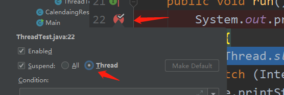

## SPI接口

## Guava

### 限流器

### 缓存

## 设计限流器

限流为了应对突发流量。

### 简单计数限流

保存一个计数器，处理一个请求计数器减一，请求处理完计数器加一。

如果计数器的值在单机内存中，则就是单机限流，如果在第三方存储里，就是分布式限流。

优点：简餐粗暴，单机就是用原子类、Redis就是用incr。

缺点：如果阈值过高，突发流量无法处理。比如要求5秒内处理一万个请求，单数可能会存在一瞬间来了一万个请求。

### 固定窗口限流

在计数器基础上，每隔固定时间将计数清零。

缺点：无法处理临界处的流量。

### 滑动窗口限流

存储请求和对应的时间，每次请求到来时，将超过固定时间的请求删除，然后判断窗口中的请求数据量是否超过阈值，来决定是否允许当前请求。

缺点：阈值过高，还是无法处理高并发。

### 漏斗

整个限流过程就像是从一个漏斗中滴水，当如果漏斗满了就拒绝了。（只要能放入桶都立刻通过了，这里和现实中的漏斗过程还是有区别的）

漏斗容量C、流出速率R、上次流出时间LT、当前时间NT、漏斗剩余水量L

请求到来时，先求出自上次流水到现在流出的水量：P = （NT - LT）* R

求出现在的漏斗中剩余的水量：（L - P），最小为0

当前流量加上剩余水量，如果没有大于漏斗容量，则可以执行。

~~~java
package com.qdw.springstudy.rateLimiter;

import java.util.LinkedHashMap;
import java.util.Map;

public class NativeFunnelRateLimiter {

    static class Cache extends LinkedHashMap<String, Funnel> {
        private int max;
        public Cache(int max){
            super(16,0.75f);
            this.max = max;
        }

        Funnel getFunnel(String key,int capacity,int quotaPreSec){
            Funnel funnel = get(key);
            if (funnel==null){
                funnel = new Funnel(capacity,quotaPreSec);
                put(key,funnel);
            }
            return funnel;
        }

        @Override
        protected boolean removeEldestEntry(Map.Entry<String, Funnel> eldest) {
            return max<this.size();
        }
    }

    static class Funnel{
        // 漏斗总容量
        int capacity;
        // 流水频率，每毫秒通过的数量。一秒走一个的频率为1/1000
        float leakingRate;
        // 剩余配额
        int leftQuota;
        // 上次流水的时间
        long leakingTs;
        public Funnel(int capacity,int quotaPreSec){
            this.capacity = capacity;
            this.leakingRate = (float)quotaPreSec/1000;
        }

        void makeSpace(){
            long curTs = System.currentTimeMillis();
            long cha = curTs - leakingTs;
            // 和上次之间的间隔时间中流走的水
            int newQuota = (int) (cha * leakingRate);
            System.out.println(newQuota);
            if (newQuota>=1){
                leftQuota += newQuota;
                // 剩余空间最多不能超过总容量
                leftQuota = Math.min(leftQuota, capacity);
                leakingTs = curTs;
            }else if(newQuota<0){// 说明时间太长了，肯定全流走了
                leftQuota = capacity;
            }
            System.out.println("leftQuota:"+leftQuota);
        }
        boolean watering(int quota){
            makeSpace();
            if (leftQuota>=quota){
                leftQuota -= quota;
                return true;
            }
            return false;
        }
    }

    private Cache cache;
    public NativeFunnelRateLimiter(int max){
        cache = new Cache(max);
    }
    public boolean isActionAllowed(String useId, String actionKey, int capacity,int quotaPreSec,int quota) {
        Funnel funnel = cache.getFunnel(useId + actionKey,capacity,quotaPreSec);
        return funnel.watering(quota);
    }
}

~~~

### 令牌桶

和漏斗的思路相反。

## Cglib动态代理

定义拦截器，去拦截一个类中的所有方法

~~~java
class MyInterceptor0 implements MethodInterceptor{

    @Override
    public Object intercept(Object o, Method method, Object[] objects, MethodProxy methodProxy) throws Throwable {
        System.out.println("增强0");
        Object o1 = methodProxy.invokeSuper(o, objects);
        return o1;
    }
}
~~~

利用拦截器去创建代理对象

~~~java
class Test{
    public Object getProxyInstance(){
        Enhancer enhancer = new Enhancer();
        enhancer.setSuperclass(A.class);
        enhancer.setCallback(new MyInterceptor());
        return enhancer.create();
    }
}
~~~

#### 针对不同方法做不同处理

定义过滤器把不同方法映射到不同拦截器上

~~~java
class MyCallackFilter implements CallbackFilter {

    // 返回值表示顺序
    @Override
    public int accept(Method method) {
        if ("show".equals(method.getName())){
            System.out.println("拦截到了"+method.getName());
            return 0;
        }
        return 1;
    }
}
~~~

返回值表示使用拦截器的顺序

所以还需要定义多个拦截器

~~~java
class MyInterceptor0 implements MethodInterceptor{

    @Override
    public Object intercept(Object o, Method method, Object[] objects, MethodProxy methodProxy) throws Throwable {
        System.out.println("增强0");
        Object o1 = methodProxy.invokeSuper(o, objects);
        return o1;
    }
}
class MyInterceptor1 implements MethodInterceptor{

    @Override
    public Object intercept(Object o, Method method, Object[] objects, MethodProxy methodProxy) throws Throwable {
        System.out.println("增强1");
        Object o1 = methodProxy.invokeSuper(o, objects);
        return o1;
    }
}
~~~

把拦截器和过滤器都设置到增强器中

~~~java
class Test{
    public Object getProxyInstance(){
        Enhancer enhancer = new Enhancer();
        enhancer.setSuperclass(A.class);
        enhancer.setCallbacks(new Callback[]{new MyInterceptor0(),new MyInterceptor1()});
        enhancer.setCallbackFilter(new MyCallackFilter());
        return enhancer.create();
    }
}
~~~

**可以把获取实例的方法直接放在拦截器中**

## 异步方法

用Java8自带的CompletableFuture就可以实现异步地调用

定义一个异步方法，返回值使用CompletableFuture<T>。可以带返回值也可以不带。也可以传入自己的线程池。

~~~java
// 这里定义了一个带返回值的
CompletableFuture<String> precess(String task, Executor executor){
        return CompletableFuture.supplyAsync(()->{
            System.out.println(Thread.currentThread()+" 执行Process1");
            return task + " 执行Process1";
        },executor);
    }
~~~

可以通过CompletableFuture，来实现任务之间的调用

~~~java
public void asyncTest(){
        ExecutorService executorService = Executors.newFixedThreadPool(3);
        // process1完成后，process2又会异步地执行
        CompletableFuture<String> res = process1.precess("测试开始", executorService).thenCompose(a -> {
            return process2.precess("测试开始", executorService);
        });
        try {
            System.out.println(res.get());
        } catch (InterruptedException e) {
            e.printStackTrace();
        } catch (ExecutionException e) {
            e.printStackTrace();
        }

    }
~~~

也可以直接通过同步的执行每个异步任务的get方法，来实现同步执行。

## 定时任务

利用线程池相关API

Executors.newScheduledThreadPool()创建的ScheduledExecutorService类型周期执行器。ScheduledExecutorService继承了ExecutorService并且多提供了几个周期相关的执行方法。

- schedule()
  - 参数为任务、时间、单位，可以将任务延后执行
- scheduleWithFixedDelay()
  - 参数为为任务、初次延时时间、延时时间、单位，表示任务第一次执行的时间延时，并且当任务执行完毕后，延时固定时间，再次执行任务。
- scheduleAtFixedRate()
  - 参数为为任务、初次延时时间、延时时间、单位，表示任务第一次执行时间延时，当任务开始时就计时固定时间，再次执行任务。如果前一个任务没有完成，就等任务完成后，立刻执行下一个任务。

## Debug

- 追踪代码的运行流程
- 程序进行异常定位和调试
- 线上问题追踪

### IDEA中Debug

- 设置断点（F9）
- 调试程序（8个按钮）

debug几个按钮的含义

- 显示执行点
- 步过：执行下一步，不进入方法
- 步入：执行下一步，如果有方法就进入方法内部
- 强制步入：步入的加强，可以进入官方类库方法
- 步出：从方法体中退出。当进入不想看的方法体中，可以使用步出退出当前方法体。
- 回退断点：返回当前所在方法体的调用处
- 运行到光标处
- 计算表达式：可以显示变量或者对象的值，也可以去修改值。调用对象的set或者直接让变量=一个值

variables中可以添加new watch来方便观察类中的属性值

### 条件断点

想在某个条件下才去在断点处终止。

右键断点就可以设置条件，比如下图

### 多线程调试

可以选择线程

当进行下一步时发现，两个线程都执行了

可以通过设置，只针对单个线程进行调试

## 流式操作

### collect

转成另一种集合

~~~java
.collect(Collectors.toMap(,Function.identity))
~~~

