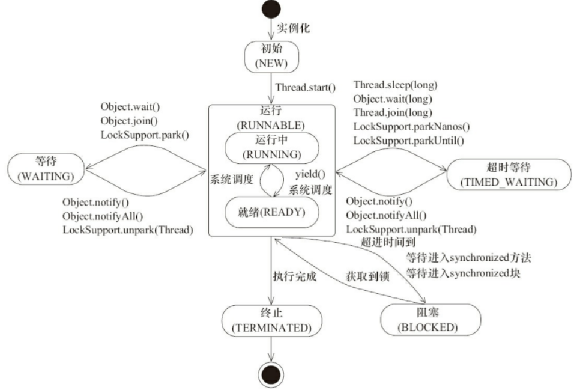

[**首页**](https://github.com/qdw497874677/myNotes/blob/master/首页检索.md)

## 上下文切换

CPU通过给每个线程分配时间片来达到单线程也支持多线程执行代码的效果。CPU切换执行的线程时，会保存之前任务状态，以便下次切换回来接着执行。**任务从保存到再加载的过程就是一次上下文切换。**

### 如何减少上下文切换

- 无锁并发编程。可以通过一些办法避免使用锁，比如根据数据的id进行哈希取模，进行分段，不同的线程处理不同段的数据。
- CAS。通过CAS来更新数据，可以不需要加锁。
- 使用最少的线程。避免创建不需要的线程。
- 协程。在单线程里实现多任务的调度，并在单线程里维持多个任务间的切换。

## 什么是线程安全

不是指线程的安全，是指内存的安全。对于进程公共区域的数据，进程中所有线程都可以访问到，有可能会发生数据被意外修改。比如你获取的数据副本，和此时主内存中的数据不一致了。

## Java内存模型（JMM）

> JMM本身是一种抽象的概念，并不真实存在。它描述的是一种规范或者约定。这种规范定义了程序中各个变量（包括实例字段，静态字段和构成数组对象的元素）的访问方式。

### 并发编程模型的两个关键问题

- 线程之间如果通信。
- 线程之间如何同步。

在命令式编程中，线程之间的通信机制有两种：共享内存和消息传递。

- 共享内存的并发模型：线程之间共享程序的公共状态，通过读写内存中的公共状态进行隐式的通信。
- 消息传递的并发模型：线程之间没有公共状态，线程之间必须通过发送消息来显示进行通信。

Java的并发采用的是共享内存的并发模型。

### JMM的抽象结构

Java中，所有的**实例域、静态域和数组元素**都存储在堆内存中，堆内存在线程之间共享。**局部变量、方法定义参数和异常处理器参数不会**在线程之间共享，他们不会有内存可见性问题，也不会受内存模型的影响。

Java线程之间的通信由JMM控制。JMM决定一个线程对共享变量的写入何时对另一个线程可见，控制主内存与每个县城的本地内存之间的交互。JMM定义了线程和主内存之间的抽象关系：**线程之间的共享变量存储在主内存中，每个线程都有一个私有的本地内存（抽象），本地内存中存储了该线程为了读/写共享变量而从主内存中获取的变量的副本。**

如果线程A、B之间要通信的话，必须经历两个步骤：

- 线程A把本地内存中更新过的变量刷回到主内存中。
- 线程B到主存中去读取线程A之前已更新过的共享变量。

JMM通过控住主内存与每个线程的本地内存之间的交互，来为Java程序员提供内存可见性保证。

> 总结：JMM是Java内存模型，他是一种规范，来控制线程之间的通信。通信的方式是通过共享内存模型。他定义了线程和主内存之间的抽象关系：共享变量存储在主内存中，每个线程都有一个私有的工作内存，存储从主内存中获取的变量副本。

### happens-before

JDK5引入了新的内存模型，通过happens-before（先行发生原则）的概念来阐述操作之间的内存可见性。

**在JMM中，如果一个操作执行的结果要对另一个操作可见，那这两个操作必须存在happens-before关系。**

happens-before是JMM呈现给程序员的概念。

- 程序顺序规则：一个线程中的每个操作，happens-before于该线程中任意后续操作。
- 监视器锁规则：对一个锁的解锁，happens-before于随后对这个锁的加锁。
- volatile变量规则：对一个volatile变量的写，happens-before于任意后续对这个volatile变量之前。
- 传递性：如果A happens-before B，且B happens-before C，那么A happens-before C。

JMM关于同步的规定

1. 线程解锁前，必须把共享变量的值刷回主内存
2. 线程加锁前，必须读取主内存的最新值到自己的工作内存
3. 加锁解锁是同一把锁

> 线程对变量的操作要在自己的工作内存中进行，工作内存是线程私有的。而所有的变量都存在主内存，线程不能直接操作主存，只能通过把主存的变量拷贝到自己的工作内存，操作完再写回主内存。

JMM认为如果提高线程安全，可以去保障下面三个性质。

- 可见性。一个线程获取主内存的一个变量，通过一些操作改变了变量，并写会主存。其他获取之前主内存旧的变量的线程，会发现之前的变量发生了变化。就叫可见性。
  - 解决：
    - volatile
- 原子性。不可分割。线程往主存写数据的时候被打断，等恢复后写进主存可能会导致数据错误。
  - 解决：
    - synchronized
    - 用Auomic类作为变量
      - 
    - 
- 有序性。为了提高性能，编译器和处理器常常会对指令重新排序执行。单线程环境里会保证执行结果一致。处理器在进行重排时要考虑指令之间的**数据依赖性**。但是多线程下，就可能会出现问题。因为可能认为一个线程的指令重排，按理确实不会影响自己的计算结果，但是可能会影响到别的进程中的赋值，会导致数据错误。
  - 
  - 解决：
    - 对于关键的变量用volatile修饰，可以禁止指令重排。
      - 内存屏障（Memory Barrier），是一个CPU指令。有两个作用：
        1. 保证特定操作的执行顺序
        2. 保证某些变量的内存可见性
      - 通过插入内存屏障禁止在内存屏障前后的指令执行重新排序优化。
        - 

## volatile

> volatile是java虚拟机提供的轻量级的同步机制。他可以保证他修饰共享变量的可见性，当一个线程修改这个共享变量改变时，其他线程会可以读取到这个改变的值。
>
> 与synchronized相比
>
> - volatile本质是告诉JVM当前工作内存中的值是不确定的；synchronized是锁定当前变量，只有当前线程可以访问该变量，其他线程被阻塞。
> - volatile只能使用在变量级别；synchronized可以使用在变量、方法和类级别。
> - volatile只能保证修饰的变量的可见性，并不保证原子性；synchronized可以保证可见性和原子性。
> - volatile不会造成线程的阻塞；synchronized可能会造成线程的阻塞。 
> - volatile标记的变量不会被编译器优化；synchronized标记的变量可以被编译器优化 

volatile变量的写操作转换成汇编代码时，会有一个lock前缀。在对volatile进行写操作时，会有两个原则：

- 处理器会将缓存中这个值写会到内存中。
- 缓存写回的操作会使缓存在其他cpu中的这个变量的值无效，在需要这个值的时候会重新从内存中获取。因为有一个缓存已执行协议，每个处理器通过嗅探在总线上传播的数据来检查自己缓存的数据是否过期，如果发现对应在内存中的数据被修改，那么会将自己缓存的对应数据设为失效。

三个特性

- 保证可见性
- 不保证原子性（对单个volatile变量的读或者写操作是具有原子性的）
- 禁止指令重排

对volatile变量的单个读写效果可以理解为，对volatile修饰的变量的读写操作加了同一个锁做了同步处理。对一个volatile变量的单个读写，和**一个普通变量的一次读写操作通过同一个锁来同步，这两个的效果一样。**

一个volatile变量的读操作，总是能看到这个变量的最后写入的值。

### 内存语义

- volatile写的内存语义：**当一个线程写一个volatile变量时，JMM会把该线程对应的本地内存中的共享变量值刷新到主内存。**
- volatile读的内存语义：**当一个线程读一个volatile变量时，JMM会把该线程对应的本地内存置为无效。线程接下来将从主内存中读取共享变量。**

一段程序中的代码，不同线程执行，他们的执行顺序通过建立**先行发生原则**来确立。

为了满足为volatile设计的语义，为volatile的先行发生原则呈现给程序员的为：**对同一个变量的vo读要发生在vo写后面。**

### 内存语义的实现

https://www.cnblogs.com/fanguangdexiaoyuer/p/10743619.html

JMM要去限制重排序

为了实现volatile的内存语义，编译器在生成字节码时，会在指令序列中插入**内存屏障**来**禁止特定类型的处理器重排序**。

下面是基于保守策略的JMM内存屏障插入策略：

- 在每个vo写操作前插入一个StoreStroe屏障。
- 在每个vo写操作后插入一个StoreLoad屏障。
- 在每个vo读操作后插入一个LoadLoad屏障。
- 在每个vo读操作后插入一个LoadStore屏障。

StoreStroe屏障：禁止上面的普通写和下面的vo写重排序，保证vo写之前，前面的所有普通写操作已经对任意处理器可见。

### 在那些地方用过volatile

#### 单例模式DCL

一个进程在执行到第一次监测时，读取到instance不为null，有可能是给instance对象分配了空间，但是还没有完成初始化。

~~~java
instance = new SingletonDemo();
//可分为三步
memory = allocate();//1.分配对象内存空间
instance(memory);//2.初始化对象
instance = memory;//3.设置instance指向刚分配的内存地址，此时instance!=null
~~~

> 步骤2和步骤3不存在数据依赖关系，这种指令重排处理器是允许的。
>
> 当一个线程读取到instance不为null时，实际上这个实例还没有完成初始化，就产生了线程安全问题。
>
> 所以对这个实例的引用变量加volatile。

~~~java
package com.qdw.main;
public class SingletonDemo {
    private static volatile SingletonDemo instance;
    private SingletonDemo(){
        System.out.println("执行构造方法");
    }
    private static SingletonDemo getInstance(){
        if (instance == null){
            synchronized (SingletonDemo.class){
                if (instance == null){
                    instance = new SingletonDemo();
                }
            }
        }
        return instance;
    }
    public static void main(String[] args) {
        for (int i = 0; i < 10; i++) {
            new Thread(()->{
                System.out.println(Thread.currentThread().getName()+" "+SingletonDemo.getInstance());
            },String.valueOf(i)).start();
        }
    }
}
~~~

#### 读写锁手写缓存

#### JUC包里面的大规模使用volatile

### synchronized关键字和volatile关键字的区别

- volatile关键字是线程同步的轻量级实现，并且**只能用于变量**。synchronized关键字可以**修饰方法以及代码块**。
- 多线程访问volatile关键字不会发生阻塞，而synchronized关键字可能会发生阻塞。
- volatile关键字能保证数据的可见性，但不能保证数据的原子性。synchronized关键字两者都能保证。
- volatile关键字主要用于解决**变量在多个线程之间的可见性**，被修饰的变量在主内存中的改变后，保证其他线程对与这个变量需要从主存中刷新；而synchronized关键字解决的是**多个线程之间访问资源的同步性**，同一时间内，只能有一个线程在同步方法或者同步块内。

## CAS

> 比较并交换。
>
> 比较目标值和我期望值是否相等，如果相等就执行一个操作，如果不等就不执行。
>
> 是乐观锁的一种实现方式。一般结合自旋。

### 应用

从原子类AtomicInteger里看CAS怎么发挥作用。

下面是AtomicInteger里的一个方法

~~~java
public final boolean compareAndSet(int expect, int update) {
        return unsafe.compareAndSwapInt(this, valueOffset, expect, update);
    }
~~~

根据内存地址，去比较主内存变量和自己的工作内存的变量进行比较，是否是期望的值，在相等的时候执行操作。（如果不等，这个unsafe类会有自己的一些操作，他会循环比较，为了就是在最新的值上去执行操作）

### 底层原理（Unsafe）

对于原子类AtomicInteger的自加方法

~~~java
public final int getAndIncrement() {
        return unsafe.getAndAddInt(this, valueOffset, 1);
    }
~~~

Unsafe类是什么

> 是CAS的核心类，类中大部分都是native方法。它的一些方法可以操作内存。
>
> Java中的CAS最终实现，就是通过Unsafe中的native方法去调用CPU原语在实现原子操作。

- var1：AtomicInteget对象本身
- var2：该对象的一个值的引用地址
- var4：需要变动的数量
- var5：通过var1和var2找出主存中真是的值

var5不断地变成最新值，如果比较成功了，就把var4加上。这个compareAndSwapInt方法是native方法，他调用CPU原语，具有原子性，是不会被打断的。var5的作用就是可以比较多次直到完成CAS操作，这个期望值只要是最新的就可以操作了。（自旋）

相当于就尽量去保证是最新的值加上了var4。类似于乐观锁，如果不对就重新取值，直到满足要求。

### 缺点

- 循环时间长开销大
- 只能保证**一个**共享变量的原子操作
- 无法解决ABA问题

### ABA问题

> 线程T1在执行CAS操作中，如果主存中的值被线程T2从A变为B之后又变为A，T1的CAS操作是发现不到的，认为没有变化，实际上是被别的线程动过的。

#### 原子引用AtomicReference

AtomicReference可以让类成为原子类。

~~~java
public class Test3 {
    public static void main(String[] args) {
        User z3 = new User("z3");
        User l4 = new User("l4");
        AtomicReference<User> atomicUser = new AtomicReference<User>();
        atomicUser.set(z3);
        System.out.println(atomicUser.compareAndSet(z3,l4)+" "+atomicUser.toString());
        System.out.println(atomicUser.compareAndSet(z3,l4)+" "+atomicUser.toString());
    }
}
@Data
@AllArgsConstructor
class User{
    private String name;
}
~~~

#### 解决ABA

用带时间戳的原子引用

~~~java
public class Test3 {
    public static void main(String[] args) {
        AtomicStampedReference<Integer> atomicStampedReference  = new AtomicStampedReference<>(100,1);
        new Thread(()->{
            //T1先获取版本号，然后没有完成CAS
            int stamp = atomicStampedReference.getStamp();
            System.out.println(Thread.currentThread().getName()+"获取版本号："+stamp);
            try {
                TimeUnit.SECONDS.sleep(2);
            } catch (InterruptedException e) {
                e.printStackTrace();
            }
            boolean b = atomicStampedReference.compareAndSet(100, 200, stamp, stamp + 1);
            System.out.println(Thread.currentThread().getName()+"尝试CAS成功与否："+b+" 当前版本号："+stamp);
        },"T1").start();

        new Thread(()->{
            //T2在T1获取版本号但是没有完成CAS时，也获取了这个值，让后出现ABA
            try {
                TimeUnit.SECONDS.sleep(1);
            } catch (InterruptedException e) {
                e.printStackTrace();
            }
            int stamp = atomicStampedReference.getStamp();
            Integer temp = 200;
            atomicStampedReference.compareAndSet(100,temp,stamp,stamp+1);
            stamp = atomicStampedReference.getStamp();
            System.out.println(Thread.currentThread().getName()+"执行CAS后，当前版本号："+stamp);
            atomicStampedReference.compareAndSet(temp, 100, stamp, stamp + 1);
            stamp = atomicStampedReference.getStamp();
            System.out.println(Thread.currentThread().getName()+"执行两次CAS，产生一个ABA后，当前版本号："+stamp);
        },"T2").start();
    }
}
~~~

### CAS和Synchronized的区别

- Synchronized为锁机制，隐含着获取锁和解锁的操作。利用操作系统提供支持实现访问竞争资源的顺序性。
- CAS实现了lock-free的概念，不引用锁也能解决并发问题。减少了上下文切换。

## Atomic原子类

在java.util.concurrent.atomic包下。

基本类型

- AtomicInteger
- AtomicLong
- AtomicBoolean

数组类型

- AtomicIntegerArray
- AtomicLongArray
- AtomicReferenceArray

引用类型

- AtomicReference
- AtomicStampedReference
- AtomicMarkableReference

对象的属性修改类型

- AtomicIntegerFieldUpdater：原子更新整形字段的更新器
- AtomicLongFieldUpdater：原子更新长整形字段的更新器
- AtomicStampedReference：原子更新带有版本号的引用类型。该类将整数值与引用关联起来，可用于解决原子的更新数据和数据的版本号，可以解决使用 CAS 进行原子更新时可能出现的 ABA 问题。

例如。AtomicInteger 类主要利用 CAS (compare and swap) + volatile 和 native 方法来保证原子操作，从而避免 synchronized 的高开销，执行效率大为提升。

## 集合类不安全

### ArrayList

#### 线程不安全的例子

~~~java
public class Test4 {
    public static void main(String[] args) {
        List<String> list = new ArrayList<>();
        for (int i = 0; i < 100; i++) {
            new Thread(()->{
                list.add(UUID.randomUUID().toString().substring(0,8));
//                System.out.println(list);
            },String.valueOf(i)).start();

        }
        while (Thread.activeCount()>2){
            Thread.yield();
        }
        System.out.println(list);
    }
}
~~~

#### 解决方法

- Vector（加锁的ArrayList）
- Collections.synchronizedList(new ArrayList<>())（通过工具类转换为一个线程安全的集合）
- CopyOnWriteArrayList

##### CopyOnWriteArrayList

> 写时复制。读写分离的思想。
>
> 写入元素的时候，先把原数组复制一份把新元素放到新数组上面。然后把数组引用指向新数组。
>
> 写的时候是会加锁的。读在原数组上读，读写分离不影响，所以可以同时读写性能好，同时写操作也加了锁保证并发安全

add方法

~~~java
//array是用volatile修饰的
private transient volatile Object[] array;

public boolean add(E e) {
        final ReentrantLock lock = this.lock;
        lock.lock();
        try {
            Object[] elements = getArray();
            int len = elements.length;
            Object[] newElements = Arrays.copyOf(elements, len + 1);
            newElements[len] = e;
            setArray(newElements);
            return true;
        } finally {
            lock.unlock();
        }
    }
~~~

### HashSet

> HashSet底层是一个初始容量为16，负载因子为0.75的HashMap。用HashMap的key存元素，value是一个Object类型的常量。

#### 线程不安全例子

~~~java
public class Test4 {
    public static void main(String[] args) {
//        List<String> list = new ArrayList<>();
//        List<String> list = Collections.synchronizedList(new ArrayList<>());
//        List<String> list = new CopyOnWriteArrayList<>();
        Set<String> set = new HashSet<>();
        for (int i = 0; i < 100; i++) {
            new Thread(()->{
                set.add(UUID.randomUUID().toString().substring(0,8));
                System.out.println(set);
            },String.valueOf(i)).start();
        }
        while (Thread.activeCount()>2){
            Thread.yield();
        }
        System.out.println(set);
    }
}
~~~

#### 解决方法

- Collections.synchronizedSet(new HashSet<>())
- CopyOnWriteArraySet

##### CopyOnWriteArraySet

> CopyOnWriteArraySet底层是CopyOnWriteArrayList。

add最终会调用CopyOnWriteArrayList中的一个方法，addIfAbsentadd元素前要检查集合中是否包含这个元素。

~~~java
private boolean addIfAbsent(E e, Object[] snapshot) {
        final ReentrantLock lock = this.lock;
        lock.lock();
        try {
            Object[] current = getArray();
            int len = current.length;
            if (snapshot != current) {
                // Optimize for lost race to another addXXX operation
                int common = Math.min(snapshot.length, len);
                for (int i = 0; i < common; i++)
                    if (current[i] != snapshot[i] && eq(e, current[i]))
                        return false;
                if (indexOf(e, current, common, len) >= 0)
                        return false;
            }
            Object[] newElements = Arrays.copyOf(current, len + 1);
            newElements[len] = e;
            setArray(newElements);
            return true;
        } finally {
            lock.unlock();
        }
    }
~~~

### HashMap

#### 例子

~~~java
public class Test4 {
    public static void main(String[] args) {
        Map<String,String> map = new HashMap();
        for (int i = 0; i < 100; i++) {
            new Thread(()->{
                map.put(Thread.currentThread().getName(),UUID.randomUUID().toString().substring(0,8));
                System.out.println(map);
            },String.valueOf(i)).start();
        }
        while (Thread.activeCount()>2){
            Thread.yield();
        }
        System.out.println(map);
    }
}
~~~

#### 解决方法

- ConcurrentHashMap<>()

## Java锁

### 公平和非公平锁

> 公平锁：多个线程按照申请锁的顺序来获取锁。
>
> 非公平锁：多个线程获取锁的顺序不是按照申请锁的顺序，有可能后申请的线程比先申请的线程优先获取锁。有可能造成优先级反转或者饥饿现象。

synchronized关键字，他是获取一个非公平锁。

ReentrantLock默认是非公平，可以设置一个参数为true改为公平。

### 可重入锁（递归锁）

> 一个线程获取锁之后，锁没有释放的情况下，再次要获取同一把锁，可以立刻获取。
>
> 线程可以进入任何一个它已经拥有的锁所同步着的代码块。
>
> 最大作用：避免死锁。

synchronized、ReentrantLock是可重入锁。

这里线程锁了data对象，对于data对象的两个方法都可以执行。

~~~java
public class Test5 {
    public static void main(String[] args) {
        Data data = new Data();
        new Thread(()->{
            data.A();
        },"T1").start();
        new Thread(()->{
            data.A();
        },"T2").start();
    }
}
class Data{
    public synchronized void A(){
        System.out.println(Thread.currentThread().getName()+" invoked A");
        B();
    }
    public synchronized void B(){
        System.out.println(Thread.currentThread().getName()+" invoked B");
    }
}
~~~

~~~java
public class Test5 {
    public static void main(String[] args) {
        Data data = new Data();
        new Thread(()->{
            data.X();
        },"T1").start();
        new Thread(()->{
            data.X();
        },"T2").start();
    }
}
class Data{
    Lock lock = new ReentrantLock();
    public void X(){
        lock.lock();
        try {
            System.out.println(Thread.currentThread().getName()+" invoked X");
            Y();
        } catch (Exception e) {
            e.printStackTrace();
        } finally {
            lock.unlock();
        }
    }
    public void Y(){
        lock.lock();
        try {
            System.out.println(Thread.currentThread().getName()+" invoked Y");
        } catch (Exception e) {
            e.printStackTrace();
        } finally {
            lock.unlock();
        }
    }
}
~~~

#### 如何实现

### 自旋锁

> 尝试获取锁的线程不会立即阻塞，而是采用**循环的方式去尝试获取锁**。好处是减少线程上下文切换的消耗，缺点是循环会消耗CPU。

~~~java
public final int getAndSetInt(Object var1, long var2, int var4) {
        int var5;
        do {
            var5 = this.getIntVolatile(var1, var2);
        } while(!this.compareAndSwapInt(var1, var2, var5, var4));

        return var5;
    }
~~~

自旋锁Demo

~~~java
public class Test6 {
    public static void main(String[] args) {
        SpinLockDemo spinLockDemo = new SpinLockDemo();
        new Thread(()->{
            spinLockDemo.lock();
            try {
                TimeUnit.SECONDS.sleep(3);
            } catch (InterruptedException e) {
                e.printStackTrace();
            }
            spinLockDemo.unlock();
        },"T1").start();

        try {
            TimeUnit.SECONDS.sleep(1);
        } catch (InterruptedException e) {
            e.printStackTrace();
        }

        new Thread(()->{
            spinLockDemo.lock();
            try {
                TimeUnit.SECONDS.sleep(3);
            } catch (InterruptedException e) {
                e.printStackTrace();
            }
            spinLockDemo.unlock();
        },"T2").start();
    }

}
class SpinLockDemo{
    AtomicReference<Thread> atomicReference = new AtomicReference<>();
    public void lock(){
        while (!atomicReference.compareAndSet(null,Thread.currentThread())){

        }
        System.out.println(Thread.currentThread().getName()+" 获得锁");
    }
    public void unlock(){
        atomicReference.compareAndSet(Thread.currentThread(),null);
        System.out.println(Thread.currentThread().getName()+" 释放锁");
    }
}

~~~

### 独占锁

> 该锁只能被一个线程持有。

synchronized、ReentrantLock都是独占锁。

### 共享锁

> 该锁可被多个线程持有。

ReentrantReadWriteLock，其读锁是共享锁，其写锁是独占锁。

### 读写锁

> 多个线程可以同时读一个共享数据，如果有线程想写共享数据，那么其他线程就不能对该资源进行读或写。
>
> 写操作：原子+独占。

ReadWriteLock接口，实现类 ReentrantReadWriteLock。

~~~java
public class Test7 {
    public static void main(String[] args) {
        ReadWriteLock lock = new ReentrantReadWriteLock();
        lock.readLock().lock();
        try {

        } finally {
            lock.readLock().unlock();
        }
        lock.writeLock().lock();
        try {

        } finally {
            lock.writeLock().unlock();
        }
    }
}
~~~

### 乐观锁和悲观锁

乐观锁总是任务并发时，不会发生冲突，发生之后再去解决。Java中的CAS就是一个乐观锁的实现。

悲观锁总是认为并发时，总会发生冲突，采用互斥的策略。比如Java中的synchronized。

### synchronized

synchronized是Java关键字，解决多个线程之间访问资源的同步性，可以保证被它修饰的方法或者代码块在任意时刻只能有一个线程执行。

Java早期版本中，synchronized属于重量级锁，Java6之后官方从JVM层面对synchronized进行了优化。

#### synchronized保证：

- 原子性
- 可见性
- 有序性

#### synchronized可以修饰：

java中每一个对象都可以作为锁。

- 实例方法：锁是当前实例对象。
- 静态方法：锁是当前类的Class对象。可以同时两个线程分别调用一个类的静态方法和非静态方法，不会互斥。
- 同步代码块：锁是括号里的对象。指定类Class就对Class类加锁，指定实例对象就对实例对象加锁。

尽量不要对带有常量池的对象加锁。

#### synchronized底层原理

1. 修饰代码块

在字节码中显示，同步块的实现使用monitorenter和monitorexit指令。前置在同步块的开始位置，后者在结束位置。（重量级锁）当执行monitorenter指令时，线程试图获取对象的monitor（monitor对象存在于每个Java对象的对象头）的持有权。当计数器为0就可以成功获取。获取后计数器加1。执行monitorexit指令后，计数器减1。如果获取monitor失败，当前线程就要阻塞等待。

2. 修饰方法

在字节码中显示，用ACC_SYNCHRONIZED标识这个方法为同步方法。JVM通过这个标识辨别方法是否为同步，从而执行响应的同步操作。（重量级锁）当某个线程要访问某个方法时，会检查是否有ACC_SYNCHRONIZED，如果有设置就要先获得监视器锁，然后执行方法，执行后释放监视器锁。

不管是哪种方式，都是对一个对象监视器进行获取，这个获取是排他的。

#### 1.6之后synchronized做了什么优化

锁主要存在四种状态：无锁状态、偏向锁状态、轻量级锁状态、重量级锁状态。他们随着竞争的激烈逐渐升级。只可升级不可降级。这种策略为了提高获得锁和释放锁的效率。

先解释对象头。

synchronized用的锁存在Java对象头中。jvm用三个字宽（Word）存储对象头（如果不是数组类型， 有两个）

- Mark Word：存储对象的hashCode或锁信息等。长度32/64bit
- Class Metadata Address：存储到对象类型数据的指针。长度32/64bit
- Array length：数组的长度（如果当前对象是数组）。长度32/64bit

Java对象头的MarkWord里默认存储对象的HashCode、分代年龄和锁标志位。

- 偏向锁

引入偏向锁和引入轻量级锁的目的很像，他们都是为了没有多线程竞争的前提下，减少传统的重量级锁带来的性能消耗。不同的是轻量级锁在无竞争的情况下使用CAS操作代替使用互斥量；而偏向锁在无竞争的情况下会把整个同步都消除掉。

1. 获取锁：当一个线程访问同步块并获取锁时，会在对象头和栈帧中的锁记录里存储锁偏向的线程ID，以后这个线程再进入和退出同步块时就不需要进行CAS操作来加锁和解锁，只需要简单地测试一下对象头的Mark Word里是否存储着指向当前线程的偏向锁。如果测试成功，表示线程已经获得了锁。如果测试失败，则需要再测试一下Mark Word中偏向锁的标识是否设置为1（表示当前是偏向锁）。如果没有设置，就使用CAS竞争锁；如果设置了，则尝试使用CAS将对象头的偏向锁指向当前线程。
2. 撤销锁：当有其他线程尝试访问同步块时，尝试将MarkWord替换为自己的线程，发现替换不成功，就会撤销偏向锁，之前正在执行的线程要暂停等待偏向锁撤销之后再继续运行。

偏向锁，会偏向第一个获得它的线程，如果接下来的执行中，该锁没有被其他线程获取，那线程就不需要进行同步。在净重激烈的场合，偏向锁失效，优先升级为轻量级锁。

- 轻量级锁（1.6之后加入的）

轻量级锁，用CAS代替互斥量，在没有多线程竞争的前提下，减少重量级锁使用操作系统互斥量产生的性能消耗。在有竞争的情况下，会比重量级锁更慢，所以会升级为重量级锁。

1. 加锁：线程执行同步块之前，JVM会先在当前线程的栈帧中创建用于存储锁记录的空间，并将对象头中的Mark Word复制到锁记录中。然后线程尝试使用CAS将对象头中的MarkWord替换为指向锁记录的指针（相当于相互都有对方的信息）。如果成功当前线程就获取锁；如果失败，表示其他线正在竞争锁，当前线程便尝试使用自旋在获取锁。
2. 解锁：使用CAS将栈帧中的MarkWord副本替换回到对象头MarkWord位置。如果成功，则表示没有竞争发生；如果失败，表示当前锁存在竞争，锁就会膨胀成重量级锁。

- 自旋锁和自适应自旋

轻量级锁失败后，虚拟机为了避免线程真实地在操作系统层面挂起，还会使用自旋锁优化。（自旋占用处理器，阻塞状态不占用处理器但是切换耗时）如果自旋超过了一定次数，就要挂起线程了。

1.6加入自适应的自旋锁，自旋的时间不固定，而是由上一次同一个锁上的自旋时间和锁拥有者的状态决定。

- 锁消除

虚拟机检测到一些共享变量不可能存在竞争，就会执行锁消除，节省请求锁的时间。

- 锁粗化

原则上，代码中尽量将同步块的作用范围缩小。但是如果一些列的连续操作都对同一个对象反复加锁和解锁，会带来不必要的性能消耗。所以这种情况要对锁范围加粗。

### synchronized和Lock对比

- 都是可重入锁
- synchronized是一个java关键字；Lock是一个接口，是api层面的锁。
- synchronized不需要手动释放锁；Lock需要手动释放锁。
- synchronized不可中断，除非抛出异常或者正常运行完成；Lock可中断：

  - Lock：

    1. 用tryLock(long time, TimeUnit unit)方法尝试获取锁，优先响应中断再响应锁获取，可以设置超时参数。

    2. 用lockInterruptibly()去尝试获取锁，优先响应中断再响应所获取（就是说如果在获取锁的过程中进入阻塞，对他发起的中断它可以响应到，Thread.interrupt()可以发起中断。）。
- synchronized是非公平锁；Lock两者都可，默认是非公平锁，传入参数true就为公平锁。
- synchronized唤醒线程要么随机唤醒一个线程。要么唤醒全部线程；Lock可以通过绑定多个Condition（对象监视器）来实现分组唤醒需要唤醒的线程，可以精准唤醒。

### Lock精准唤醒

~~~java
class Data{
    private int flag;
    private Lock lock;
    private Condition conditionA;
    private Condition conditionB;
    private Condition conditionC;
    public Data(){
        flag = 1;
        lock = new ReentrantLock();
        conditionA = lock.newCondition();
        conditionB = lock.newCondition();
        conditionC = lock.newCondition();
    }
    public void printA(){
        lock.lock();
        try {
            while (flag!=1){
                conditionA.await();
            }
            System.out.println("A");
            flag = 2;
            conditionB.signal();
        } catch (InterruptedException e) {
            e.printStackTrace();
        } finally {
            lock.unlock();
        }
    }
    public void printB(){
        lock.lock();
        try {
            while (flag!=2){
                conditionB.await();
            }
            System.out.println("B");
            flag = 3;
            conditionC.signal();
        } catch (InterruptedException e) {
            e.printStackTrace();
        } finally {
            lock.unlock();
        }
    }
    public void printC(){
        lock.lock();
        try {
            while (flag!=3){
                conditionC.await();
            }
            System.out.println("C");
            flag = 1;
            conditionA.signal();
        } catch (InterruptedException e) {
            e.printStackTrace();
        } finally {
            lock.unlock();
        }
    }
}

~~~

## AQS

AbstractQueuedSynchronizer，在java.util.concurrent.locks包下面。

AQS是一个用来构建锁和同步器的框架，使用AQS能简单高效地个构造出应用广泛的大量的同步器。比如ReentrantLock，Semaphore，ReentrantReadWriteLock，SynchronousQueue，FutureTask，等等都是基于AQS的。

AQS中维护了一个 volatile int state 和一个FIFO线程等待队列

state：代表共享资源，volatile保证多线程下的可见性，=1表示当前对象已经被占用，其他线程来加锁时则会失败。

FIFO：多线程争用资源被阻塞时会进入这个队列。加锁失败的线程会被放入一个FIFO的等待队列中。

AQS中提供了很多关于锁的实现方法

- getState()：获取锁的标志state值
- setState()：设置
- tryAcquire(int)：独占方式获取锁，禅师获取资源，成功true，失败false
- tryRelease(int)：独占方式释放锁，尝试释放资源
- 。。。

### ReentrantLock中的实现

tryAcquire(int)：

多个线程尝试CAS修改state，如果是0，就把设置当前线程为为独占线程，返回true。如果不为零就说明被占用，然后判断是不是自己占用的锁。如果是就累加state，返回true，释放的时候也要递减。如果被占用且不是自己，就将加入到等待队列中。

等待队列是一个双向链表，节点为Node。

在链表为空的时候，创建第一个节点，使用CAS设置head指针，然后tail、t都指向第一个Node。在有了head之后，将线程作为节点放到head后面。通过addWaiter()返回线程对应的节点。然后执行acquireQueued(addWaiter(Node.EXCLUSIVE), arg)，先判断前置节点是否为head，如果是尝试加锁，成功后当前节点设为head节点，然后空置之前的head节点，方便回收。如果不是head，通过shouldParkAfterFailedAcquire设置Node的waitStatus，然后执行parkAndChecknIterrupt，**调用`LockSupport.park()`挂起当前线程。**

使用LockSupport.park()将线程挂起。

Node中

## CountDownLatch

倒计时器。可以让一个线程等待计数器归零时，再开始执行。

~~~java
//调用await()方法的线程会被挂起，它会等待直到count值为0才继续执行
public void await() throws InterruptedException { };   
//和await()类似，只不过等待一定的时间后count值还没变为0的话就会继续执行
public boolean await(long timeout, TimeUnit unit) throws InterruptedException { };  
//将count值减1
public void countDown() { };  
~~~

demo

~~~java
package com.qdw.util;

import java.util.concurrent.CountDownLatch;
public class Demo1 {
    public static void main(String[] args) throws InterruptedException {
        //倒计时，总数是6
        CountDownLatch countDownLatch = new CountDownLatch(6);

        for (int i = 0; i <= 6; i++) {
            new Thread(()->{
                System.out.println(Thread.currentThread().getName()+"运行完了");
                //计数器减一
                countDownLatch.countDown();
            },String.valueOf(i)).start();
        }
        //等待计数器归零，然后再向下执行
        countDownLatch.await();
        System.out.println("归零了，都走完了");
    }
}
~~~

## CyclicBarrier

循环栅栏。和倒计时器类似。让一组线层到达一个屏障（同步点）时被阻塞，直到最后一个线程到达时，屏障会被打开，这些阻塞的线程被唤醒。

满足数量要求，就执行代码

~~~java
CyclicBarrier cyclicBarrier = new CyclicBarrier(3,()->{
    System.out.println("合成三连！");
});
~~~

线程等待，如果数量满足了才执行

~~~java
cyclicBarrier.await();
~~~

demo

~~~java
package com.qdw.util;
import java.util.concurrent.BrokenBarrierException;
import java.util.concurrent.CyclicBarrier;
public class Demo2 {
    public static void main(String[] args) {
        CyclicBarrier cyclicBarrier = new CyclicBarrier(3,()->{
            System.out.println("合成三连！");
        });
        for (int i = 1; i <= 3; i++) {
            final int temp = i;
            new Thread(()->{
                System.out.println(Thread.currentThread().getName()+":有第"+temp+"张卡一样的卡");
                try {
                    //等待，数量满足后执行CyclicBarrier传入的Runnable，然后本线程才继续
                    cyclicBarrier.await();
                } catch (InterruptedException e) {
                    e.printStackTrace();
                } catch (BrokenBarrierException e) {
                    e.printStackTrace();
                }
                System.out.println(Thread.currentThread().getName()+"卡融合");
            }).start();
        }
    }
}
~~~

## Semaphore

信号量。允许多个线程同时访问一个资源。可以管理线程的数量。设置初值，通过获取和释放来控制线程数量。

先得到再释放，如过超过设置的数，就得不到只能等待其他线程释放

~~~java
Semaphore semaphore = new Semaphore(3);
~~~

获取，信号量-1，最多有设置的数量的线程获取，没有获取到的就等待

~~~java
semaphore.acquire();
~~~

释放，信号量+1，等待获取的一个线程就可以获取了

~~~java
semaphore.release();
~~~

## 阻塞队列

> 首先是一个队列。
>
> 试图从空的阻塞队列中获取元素的线程会被阻塞。
>
> 试图往满的阻塞队列中添加元素的线程会被阻塞。
>
> 帮助阻塞和唤醒线程。

BlockingQueue接口。

7个实现类

- **ArrayBlockingQueue**：由数组结构组成的有界阻塞队列。
- **LinkedBlockingQueue**：由链表结构组成的有界（但默认大小为integet.MAX_VALUE）阻塞队列。
- PriorityBlockingQueue：支持优先级排序的无界阻塞队列。
- DelayQueue：使用优先级队列实现的延迟无界阻塞队列。
- **SynchronousQueue**：不存储元素的阻塞队列，也即单个元素的队列。
- LinkedTransferQueue：由链表结构组成的无界阻塞队列。
- LinkedBlockingDeque：由链表结构组成的双向阻塞队列。

### API

#### 抛出异常组

> 队列满时，再添加就报队满异常。
>
> 队列空时，再移除就报没有元素异常。

~~~java
public class Test7 {
    public static void main(String[] args) {
        BlockingQueue<String> blockingQueue = new ArrayBlockingQueue<>(3);
        System.out.println(blockingQueue.add("a"));
        System.out.println(blockingQueue.add("b"));
        System.out.println(blockingQueue.add("c"));
        //队列满时，再添加就报队满异常
//        System.out.println(blockingDeque.add("d"));
        //检查队首元素
        System.out.println(blockingQueue.element());
        System.out.println(blockingQueue.remove());
        System.out.println(blockingQueue.remove());
        System.out.println(blockingQueue.remove());
        //队列空时，再移除就报没有元素异常
//        System.out.println(blockingQueue.remove());
    }
}
~~~

#### 布尔值组

> 正常插入，返回true.
>
> 插入满队，返回false
>
> 正常移除，返回true
>
> 移除空队，返回false

~~~java
public class Test7 {
    public static void main(String[] args) {
        BlockingQueue<String> blockingQueue = new ArrayBlockingQueue<>(3);
        //正常插入，返回true
        System.out.println(blockingQueue.offer("a"));
        System.out.println(blockingQueue.offer("b"));
        System.out.println(blockingQueue.offer("c"));
        //插入满队，返回false
        System.out.println(blockingQueue.offer("d"));
        //检查元素，空返回false
        System.out.println(blockingQueue.peek());
        //正常移除，返回true
        System.out.println(blockingQueue.poll());
        System.out.println(blockingQueue.poll());
        System.out.println(blockingQueue.poll());
        //移除空队，返回false
        System.out.println(blockingQueue.poll());
    }
}
~~~

#### 阻塞组

> 线程试图插入满队，会阻塞线程。
>
> 线程试图移除空队，会阻塞线程。

~~~java
public class Test7 {
    public static void main(String[] args) throws InterruptedException {
        BlockingQueue<String> blockingQueue = new ArrayBlockingQueue<>(3);
        //正常插入
        blockingQueue.put("a");
        blockingQueue.put("b");
        blockingQueue.put("c");
        //线程试图插入满队，会阻塞线程
//        blockingQueue.put("c");
        //正常移除
        System.out.println(blockingQueue.take());
        System.out.println(blockingQueue.take());
        System.out.println(blockingQueue.take());
        //线程试图移除空队，会阻塞线程
        System.out.println(blockingQueue.take());
    }
}
~~~

#### 超时控制组

> 线程试图插入满队，会阻塞线程固定时间。
>
> 线程试图移除空队，会阻塞线程固定时间。

~~~java
public class Test7 {
    public static void main(String[] args) throws InterruptedException {
        BlockingQueue<String> blockingQueue = new ArrayBlockingQueue<>(3);
        //正常插入，返回true
        System.out.println(blockingQueue.offer("a", 2L, TimeUnit.SECONDS));
        System.out.println(blockingQueue.offer("b", 2L, TimeUnit.SECONDS));
        System.out.println(blockingQueue.offer("c", 2L, TimeUnit.SECONDS));
        //线程试图插入满队，会阻塞线程固定时间，不行就返回false
        System.out.println(blockingQueue.offer("d", 2L, TimeUnit.SECONDS));
        //正常移除，返回true
        System.out.println(blockingQueue.poll( 2L, TimeUnit.SECONDS));
        System.out.println(blockingQueue.poll( 2L, TimeUnit.SECONDS));
        System.out.println(blockingQueue.poll( 2L, TimeUnit.SECONDS));
        //线程试图移除空队，会阻塞线程固定时间，不行就返回null
        System.out.println(blockingQueue.poll( 2, TimeUnit.SECONDS));
    }
}
~~~

### SynchronousQueue

> 它是一个不存储元素的BlockingQueue。每一个put必须等待一个take，反之亦然。

~~~java
public class Test7 {
    public static void main(String[] args) throws InterruptedException {
        BlockingQueue<String> blockingQueue = new SynchronousQueue<>();
        new Thread(()->{
            try {
                blockingQueue.put("a");
                System.out.println(Thread.currentThread().getName()+" put a");
                blockingQueue.put("b");
                System.out.println(Thread.currentThread().getName()+" put b");
                blockingQueue.put("c");
                System.out.println(Thread.currentThread().getName()+" put c");
            } catch (InterruptedException e) {
                e.printStackTrace();
            }
        },"T1").start();
        new Thread(()->{
            try {
                System.out.println(Thread.currentThread().getName()+" put "+blockingQueue.take());
                System.out.println(Thread.currentThread().getName()+" put "+blockingQueue.take());
                System.out.println(Thread.currentThread().getName()+" put "+blockingQueue.take());
            } catch (InterruptedException e) {
                e.printStackTrace();
            }
        },"T2").start();
    }
}
~~~

### 使用场景

#### 生产者消费者

- Lock版

防止虚假唤醒，唤醒操作要在while里

~~~java
public class PC {
    public static void main(String[] args) {
        Data data = new PC().new Data();
        new Thread(()->{
            for (int i = 0; i < 100; i++) {
                data.decrement();
            }
        }).start();
        new Thread(()->{
            for (int i = 0; i < 100; i++) {
                data.increment();
            }
        }).start();

    }
    class Data{
        int sum = 0;
        Lock lock = new ReentrantLock();
        Condition condition = lock.newCondition();
        public void increment(){
            lock.lock();
            try {
                while (sum!=0){
                    condition.await();
                }
                sum++;
                System.out.println("increment:1 sum="+sum);
                condition.signalAll();
            } catch (InterruptedException e) {
                e.printStackTrace();
            } finally {
                lock.unlock();
            }
        }
        public void decrement(){
            lock.lock();
            try {
                while (sum==0){
                    condition.await();
                }
                sum--;
                System.out.println("decrement:1 sum="+sum);
                condition.signalAll();
            } catch (InterruptedException e) {
                e.printStackTrace();
            } finally {
                lock.unlock();
            }
        }

    }
}
~~~

- 阻塞队列版

~~~java
public class PC_New {
    public static void main(String[] args) throws InterruptedException {
        Resource resource = new Resource(new ArrayBlockingQueue<String>(3));
        new Thread(()->{
            try {
                resource.producer();
            } catch (InterruptedException e) {
                e.printStackTrace();
            }
        },"T1").start();
        new Thread(()->{
            try {
                resource.consumer();
            } catch (InterruptedException e) {
                e.printStackTrace();
            }
        },"T2").start();

        TimeUnit.SECONDS.sleep(10);
        resource.stop();
        System.out.println("生产消费停止");
    }
}
class Resource{
    //貌似这个volatile在这里作用不大
    private volatile boolean flag = true;
    private AtomicInteger atomicInteger = new AtomicInteger(0);
    private BlockingQueue<String> blockingQueue;
    public Resource(BlockingQueue<String> blockingQueue){
        this.blockingQueue = blockingQueue;
        System.out.println(blockingQueue.getClass().getName());
    }
    public void stop(){
        flag = false;
    }
    public void producer() throws InterruptedException {
        String data;
        while (flag){
            TimeUnit.SECONDS.sleep(1);
            data = atomicInteger.incrementAndGet() + "";
            blockingQueue.put(data);
            System.out.println(Thread.currentThread().getName()+" 生产"+data+" 总数："+blockingQueue.size());
        }
        System.out.println(Thread.currentThread().getName()+" 生产停止");
    }

    public void consumer() throws InterruptedException {
        String res;
        while (flag){
            TimeUnit.SECONDS.sleep(1);
            res = blockingQueue.take();
            System.out.println(Thread.currentThread().getName()+" 消费"+res+" 总数："+blockingQueue.size());
        }
        System.out.println(Thread.currentThread().getName()+" 消费停止");
    }
}
~~~

## 线程

### Java线程的状态

6种

- NEW：新建状态，线程对象创建后进入新建状态，但还没有调用start()方法。
- RUNABLE：运行状态，Java线程将操作系统中的就绪和运行两种状态统称为运行中。ready状态的线程，获取到cpu时间片后处于running状态
- BLOCKED：阻塞状态，表示线程阻塞于锁（synchronize），是被动的释放cpu。
- WAITING：等待状态，表示线程进入等待状态，进入该状态表示当前线程需要等待其他线程做出一些特定动作（通知或者中断）。执行wait()、join()、park()方法进入等待状态。
- TIME_WATTING：超时等待状态，可以再指定时间自行返回。执行wait(long millis)方法进入超时等待状态。之后返回到运行状态。
- TERMINATED：终止状态，表示当前线程已经执行完毕。线程的run()方法完成时，或者主线程的main()方法完成时，我们就认为它终止了。

### BLOCKED和WAITING有什么区别

线程可以通过wait()、join()方法进入wating状态，进入wating状态的线程要等待唤醒(notify或notifyAll)才有机会获取获取cpu时间片。

blocked状态是因为获取不到锁后，线程被动进入的，进入blocked状态是在同步代码之外，进入waiting状态是在同步代码之内。

### 启动线程用run()还是start()

start()开始一个线程后，线程就进入就绪状态，使线程所代表的虚拟处理机处于可运行状态，这意味着它可以由JVM调度并执行。start()在java中最终调用一个本地方法来准备启动一个线程。

通过run()方法启动线程，并没有真正的创建多线程，此时还是只有一个主线程，调用run方法相当于调用类的普通方法。

### 执行两次Start方法会发生什么

Java的线程是不允许启动两次的，第二次调用必然会抛出IllegalThreadStateException，这是一种运行时异常，多次调用start被认为是编程错误。

## 终止线程

### 标志位

使用退出标识，使线程正常退出，也就是当run()方法完成后线程终止。

### stop()

Thread类提供的一个方法，已经被启用，因为这个方法不安全。

- 调用stop()方法会立刻停止run()方法中剩余的全部工作，包括catch或finally语句中的代码，并抛出ThreadDeath异常。可能会导致无法完成一些清理性的工作。比如关闭文件数据库什么的。
- 调用stop()方法会立即释放该线程持有的所有锁，导致数据得不到同步。比如线程正在修改一个对象的A、B字段，修改完A被stop()了，释放了锁，别人读到这个对象A和B的数据不一致。

### interrupt()

interrupt()不会立刻终止线程的所有活动，而是在线程中做一个终止的标记。就是通知线程希望你能终止。

~~~java
public boolean Thread.isInterrupted() //是实例方法　判断是否被中断
public static boolean Thread.interrupted() //是静态方法　判断是否被中断，并清除当前中断状态
~~~

如果希望一个线程在中断后停止，需要添加对应处理中断的代码：先用isInterrupted()判断自己当前线程是否被中断。

~~~java
@Override
public void run() {
    super.run();
    for(int i = 0; i <= 200000; i++) {
        //判断是否被中断
        if(Thread.currentThread().isInterrupted()){
            //处理中断逻辑
            break;
        }
        System.out.println("i=" + i);
    }
}
~~~

如果线程被Object.wait, Thread.join和Thread.sleep三种方法之一阻塞，此时调用线程interrupted()方法，那么该线程将抛出一个 InterruptedException中断异常（该线程必须事先预备好处理此异常），从而提早地终结被阻塞状态。如果线程没有被阻塞，这时调用 interrupt()将不起作用，直到执行到wait(),sleep(),join()时,才马上会抛出 InterruptedException。

## 创建线程

### 继承Thread

### 实现Runnable

### 实现Callable

有返回值

通过FutureTask类，传入Callable接口实现。FutureTask实现了Runnable接口，可以作为Thread的参数传入。（适配器模式）

一个FutureTask只执行一次。

~~~java
public class Test7 {
    public static void main(String[] args) throws InterruptedException, ExecutionException {
        FutureTask<Integer> futureTask = new FutureTask<>(new MyThread());
        Thread t1 = new Thread(futureTask,"T1");
        t1.start();
        //获取线程执行的结果，如果还没有完成就会阻塞，直到完成
        System.out.println("result:"+futureTask.get());
    }
}
class MyThread implements Callable<Integer>{
    @Override
    public Integer call() throws Exception {
        System.out.println("call");
        return 1024;
    }
}
~~~

### 实现Runnable接口和Callable接口的区别

Runnable接口不会返回结果或抛出异常检查，Callable接口可以。

工具类Executors可以实现两者实现类对象之间的像话转化。（Executors.callable（Runnable task）或 Executors.callable（Runnable task，Object resule））。

## 线程池

> 主要工作是控制运行的线程的数量，处理过程中将任务放入队列，然后在线程创建后启动这些任务。如果线程数量超过最大数量+队列里排队的数量，就要等其他线程执行完毕，再从队列中取出任务来执行。

### 为什么要用线程池

通过池化技术的思想减少每次获取资源的消耗。

- 降低资源消耗。通过重复利用已创建的线程，降低线程创建和销毁造成的消耗。
- 提高响应速度。当任务到达时，不需要等待线程创建就能立刻执行。
- 提高线程的可管理性。可以进行线程的统一分配，调优和监控。

### 三个常用方法（Executors工具类中创建线程池）

newFixedThreadPool(int nThreads)

返回一个固定线程数量的线程池。一个池子n个线程。

~~~java
public class Test7 {
    public static void main(String[] args) throws InterruptedException, ExecutionException {
        ExecutorService threadPool = Executors.newFixedThreadPool(3);
//        ExecutorService threadPool = Executors.newSingleThreadExecutor();
//        ExecutorService threadPool = Executors.newCachedThreadPool();
        try {
            for (int i = 0; i < 10; i++) {
                threadPool.execute(()->{
                    System.out.println(Thread.currentThread().getName()+" 执行");
                });
            }
        } catch (Exception e) {
            e.printStackTrace();
        } finally {
            threadPool.shutdown();
        }
    }
}
~~~

newSingleThreadExecutor()

返回一个只有一个线程的线程池。一个池子1个线程

~~~java
public class Test7 {
    public static void main(String[] args) throws InterruptedException, ExecutionException {
//        ExecutorService threadPool = Executors.newFixedThreadPool(3);
        ExecutorService threadPool = Executors.newSingleThreadExecutor();
//        ExecutorService threadPool = Executors.newCachedThreadPool();
        try {
            for (int i = 0; i < 10; i++) {
                threadPool.execute(()->{
                    System.out.println(Thread.currentThread().getName()+" 执行");
                });
            }
        } catch (Exception e) {
            e.printStackTrace();
        } finally {
            threadPool.shutdown();
        }
    }
}
~~~

newCachedThreadPool()

返回一个可根据实际情况调整线程数量的线程池。一个池子n个线程

~~~java
public class Test7 {
    public static void main(String[] args) throws InterruptedException, ExecutionException {
//        ExecutorService threadPool = Executors.newFixedThreadPool(3);
//        ExecutorService threadPool = Executors.newSingleThreadExecutor();
        ExecutorService threadPool = Executors.newCachedThreadPool();
        try {
            for (int i = 0; i < 10; i++) {
                threadPool.execute(()->{
                    System.out.println(Thread.currentThread().getName()+" 执行");
                });
            }
        } catch (Exception e) {
            e.printStackTrace();
        } finally {
            threadPool.shutdown();
        }
    }
}
~~~

~~~java
pool-1-thread-2 执行
pool-1-thread-3 执行
pool-1-thread-1 执行
pool-1-thread-5 执行
pool-1-thread-4 执行
pool-1-thread-6 执行
pool-1-thread-7 执行
pool-1-thread-3 执行
pool-1-thread-7 执行
pool-1-thread-6 执行

~~~

> 为什么不推荐用三个默认方法创建线程池。
>
> - newFixedThreadPool和newSingleThreadExecutor的等待队列大小没有限制，可能堆积大量的任务请求，导致OOM。
> - newCachedThreadPool的线程数量没有限制，可能创建大量的线程，导致OOM。

### 七大参数

~~~java
ThreadPoolExecutor(int corePoolSize,
                              int maximumPoolSize,
                              long keepAliveTime,
                              TimeUnit unit,
                              BlockingQueue<Runnable> workQueue,
                              ThreadFactory threadFactory,
                              RejectedExecutionHandler handler)
~~~

- int corePoolSize：核心线程数。当线程池中的线程数量达到核心线程数后，会吧之后到达的任务放到阻塞队列中。
- int maximumPoolSize：线程池能同时容纳的最大线程数。
- long keepAliveTime：空闲线程的存活时间。当线程池中线程的数量超过核心线程数后，**多余线程的空闲时间达到这个存活时间时**，就销毁空闲线程直到剩下核心数量的线程。
- TimeUnit unit：存活时间的单位。
- BlockingQueue<Runnable> workQueue：任务队列。是阻塞队列，元素是Runnable实现类，相当于要创建线程的任务。如果队列满了，又有任务来，且线程数量没有到最大线程数。这时要创建非核心线程并且立刻执行这个新来的任务。
- ThreadFactory threadFactory：线程工厂。
- RejectedExecutionHandler handler：拒绝策略。

执行任务的主要流程

- 提交任务
  - 如果未达到核心线程数
    - **创建线程执行任务。**
  - 如果已达到核心线程数
    - 如果阻塞队列未满
      - **将任务存储在阻塞队列中。**
    - 如果阻塞队列已满
      - 如果未达到最大线程数
        - **创建线程执行任务。**（执行的是这个新来的任务，而不是阻塞队列中的任务）
      - 如果已达到最大线程数
        - **按照拒绝策略执行任务。**
- 当一个线程空闲超过超时时间，线程池判断当前线程数是否大于核心线程数。如果大于就会销毁这个线程。所以任务都完成后，线程池会收缩到核心线程数的大小。

### 拒绝策略

> 线程数量达到最大数量，队列也满了，这时来了新的任务，就要对这个任务执行拒绝策略。

- AbortPolicy（默认）：直接抛出RejectedExecutionException异常。
- CallerRunsPolicy：将任务回退给调用者。
- DiscardOldestPolicy：丢弃阻塞队列中等待最久的任务，然后尝试执行任务（加入到则阻塞队列）。
- DiscardPolicy：直接丢弃任务。

### 自定义线程池例子

submit和executor连个方法执行线程的区别，submit可以提供Task<T>返回值。

~~~java
public class Test7 {
    public static void main(String[] args) throws InterruptedException, ExecutionException {
        ExecutorService executorService = new ThreadPoolExecutor(
                2,
                5,
                1L,
                TimeUnit.SECONDS,
                new LinkedBlockingQueue<Runnable>(3),
                Executors.defaultThreadFactory(),
//                new ThreadPoolExecutor.AbortPolicy());
//                new ThreadPoolExecutor.CallerRunsPolicy());
//                new ThreadPoolExecutor.DiscardOldestPolicy());
                new ThreadPoolExecutor.DiscardPolicy());
        try {
            for (int i = 0; i < 10; i++) {
                final int temp = i;
                executorService.execute(()->{
                    System.out.println(Thread.currentThread().getName()+" 执行"+temp);
                });
            }
        } catch (Exception e) {
            e.printStackTrace();
        } finally {
            executorService.shutdown();
        }

    }
}
~~~

### 如何配置

首先知道机器的配置，有多少核，支持多少线程。

- CPU密集型：任务需要大量的运算，没有阻塞，CPU全速运行。
- IO密集型：任务线程并不是一直在执行任务，则应该配置尽量多的线程数，比如CPU核数*2。
  - 还可以参考一个公式：CPU核数/（1-阻塞系数）。阻塞系数一般在0.8-0.9之间。

### 执行execute()方法和submit()方法的区别是什么呢？

- execute()方法用于不需要返回值的任务。
- submit()方法用于提交需要返回值的任务。线程池会返回一个Future类型的对象，通过Future对象可判断任务是否执行成功，可通过get()方法获取返回值，get()方法会阻塞当前线程直到任务完成，用get（long timeout，TimeUnit unit）方法会阻塞一段时间后返回。

### 一些小的知识点

在一般的web项目中，线程池一般用在service中作为属性；或者在方法中创建，记得关闭。

最好的设置几个参数的方法就是，去监控，进入等待队列少，就减少核心数，多了就增加核心数

线程的异步和mq的异步的使用场景不同。对于需要及时获得返回值的场景，不适合mq的异步。用到线程的异步，一般是需要及时的返回结果，同时去提高cpu的效率。

## ThreadLocal

ThreadLocal类可以让**每个线程绑定自己的值**。线程通过ThreadLocal获取自己现成的变量副本。

~~~java
public class Local implements Runnable {
    private static final ThreadLocal<String> localStr = ThreadLocal.withInitial(()->"init");
    public static void main(String[] args) {
        new Thread(new Local(),"线程1").start();
        new Thread(new Local(),"线程2").start();
    }
    @Override
    public void run() {
        try {
            Thread.sleep(1000);
        } catch (InterruptedException e) {
            e.printStackTrace();
        }
        System.out.println(Thread.currentThread().getName()+" "+localStr.get());
        localStr.set(Thread.currentThread().getName());
        System.out.println(Thread.currentThread().getName()+" "+localStr.get());
    }
}
~~~

~~~
线程2 init
线程2 线程2
线程1 init
线程1 线程1
~~~

### 原理

Thread类中有两个变量：threadLocals和inheritableThreadLocals。他们都是ThreadLocalMap类型的变量，这个类型可以理解为ThreadLocal类实现的定制化HashMap。默认情况两个变量都是null，只有当线程调用ThreadLocal类的set或get方法时，才创建他们。使用他们要调用ThreadLocalMap类对应的get()、set()方法。

~~~java
public void set(T value) {
        Thread t = Thread.currentThread();
        ThreadLocalMap map = getMap(t);
        if (map != null)
            map.set(this, value);
        else
            createMap(t, value);
    }
    ThreadLocalMap getMap(Thread t) {
        return t.threadLocals;
    }
~~~

所以变量是放在当前线程对应的ThreadLocalMap中，并不是存在ThreadLocal中。ThreadLocal可以理解为是ThreadLocalMap的封装，用来传递变量值。

**ThreadLocal类中可以通过Thread.currentThread()获取到当前线程对象后，直接通过getMap(Thread t)可以访问到该线程的ThreadLocalMap对象。**

### ThreadLocalMap

ThreadLocalMap是ThreadLocal的静态内部类，可以存储以ThreadLocal为key 的键值对。

### 原理总结

Thread类中有ThreadLocalMap类型的变量，存储以ThreadLocal为key的键值对。ThreadLocal可以通过获取当前线程获取ThreadLocalMap变量，然后根据自身ThreadLocal对象作为key找到对应的值。

### 内存泄漏问题

ThreadLocalMap使用的key是ThreadLocal的弱引用，而value是强引用。所以如果ThreadLocal没有被外部强引用的情况下，垃圾回收时，key会被清理掉，而value不会被清理掉。这样ThreadLocalMap中出现key为null的Entry。假如我们不做任何措施，**value永远无法被GC回收**，就出现了内存泄漏。ThreadLocalMap视线中已经考虑了这种情况，在调用set()、get()、remove()方法的时候，会清理掉key为null的记录。使用完ThreadLocal方法后最好手动调用remove()方法。

~~~java
staticclass Entry extends WeakReference<ThreadLocal<?>> {
            /** The value associated with this ThreadLocal. */
            Object value;

            Entry(ThreadLocal<?> k, Object v) {
                super(k);
                value = v;
            }
        }
~~~

### 案例

SimpleDateFormat产生的实例是单例，在多线程情况下会有线程安全问题。可以在ThreadLocal中去创建来解决线程安全问题。

## 死锁

### 产生死锁的主要原因

> 死锁指两个或者两个以上的进程在执行过程中，因争夺资源而造成的一种互相等待的现象，若无外力干涉，它们都将无法推进下去。

例子

~~~java
public class Test8 {
    public static void main(String[] args) {
        String lockA = "lockA";
        String lockB = "lockB";
        new Thread(new HoldLockThread(lockA,lockB)).start();
        new Thread(new HoldLockThread(lockB,lockA)).start();
    }
}
class HoldLockThread implements Runnable{
    private String lockA;
    private String lockB;
    public HoldLockThread(String lockA, String lockB) {
        this.lockA = lockA;
        this.lockB = lockB;
    }
    @Override
    public void run() {
        synchronized (lockA){
            System.out.println(Thread.currentThread().getName()+" 自己持有"+lockA+" 尝试获取；lockB");
            try {
                TimeUnit.SECONDS.sleep(1L);
            } catch (InterruptedException e) {
                e.printStackTrace();
            }
            synchronized (lockB){
                System.out.println(Thread.currentThread().getName()+" 自己持有"+lockB+" 尝试获取；lockA");
            }
        }
    }
}
~~~

### 死锁产生的必要条件

只要有一条不满足，就不会发生死锁。

- 互斥条件：对资源的占用具有排他性。
- 不剥夺条件：资源使用完毕前，不能被夺走。
- 请求和保持条件：因为请求资源而阻塞时，对已获得的资源保持不放。
- 循环等待：存在对资源的循环等待。链中每个资源的获取者，等待获取其他人持有的资源。

### 定位死锁

~~~bash
#找到出问题的进程
jps -l
#根据进程id
jstack 进程id
~~~

### 如何避免死锁

- 银行家

在进程申请资源时，检测是否满足。

- 指定加锁顺序

如果确保所有线程都是按照相同的顺序获得锁，就不会发生死锁了。这种方式需要事先知道所有可能会用到的锁。

- 加锁时限

在尝试获取锁的时候加一个超时时间，如果在时间内没有获取到锁，就释放所有已经获得的锁，然后等待一段随机的时间后重试。超时锁可以通过自定义锁来实现。超时锁可能带来饥饿的情况。

- 死锁监测

上面两中都不合适的情况下使用。每当一个线程获得了锁，会在线程和锁相关的数据结构中将其记下。每当有线程请求锁，也需要记录在这个数据结构中。当一个线程请求锁失败时，这个线程可以遍历锁的关系图，看是否有死锁发生，如果请求链中包含了自己，就说明发生了死锁。

当检查出死锁时：可以选择释放所有的锁，回退，等待一段随机的时间后重试。（和超时锁的区别是这个只是在检查到死锁后才执行）另一个办法就是给这些线程随机设置优先级，让一个或几个线程回退，剩下的线程就像没发生死锁一样继续保持。

## ForkJoin

ForkJoin框架用于并行执行任务。他的思想就是将一个大任务分割成若干小任务。最终汇总每个小任务的结果得到这个大任务的结果。

既然任务要被逐渐细化，就需要把这些任务存在一个池子里面，这个池子就是ForkJoinPool。

工作窃取：一个大任务被划分成很多小任务，这些任务被分配到不同的队列中，这些队列有的干活块，有的干活慢。于是干活快的在没任务执行的时候，去其他队列中拿任务来执行。

ForkJoinTask就是ForkJoinPool里面的每个任务。他主要有两个子类：RecursiveAction和RecursiveTask。然后通过fork()方法去分配任务执行任务，通过join()方法汇总任务结果。

这就是整个过程。他有两个子类，使用这两个子类都可以实现我们的任务分配和计算。

- RecursiveAction 一个递归无结果的ForkJoinTask（没有返回值）

- RecursiveTask 一个递归有结果的ForkJoinTask（有返回值）

ForkJoinPool由ForkJoinTask数组和ForkJoinWorkerThread数组组成，ForkJoinTask数组负责存放程序提交给ForkJoinPool的任务，而ForkJoinWorkerThread数组负责执行这些任务。

