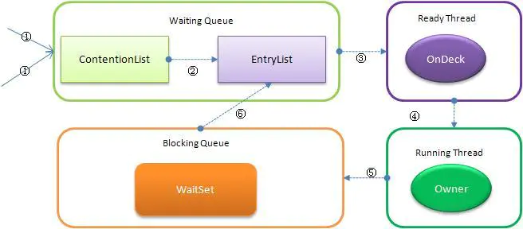
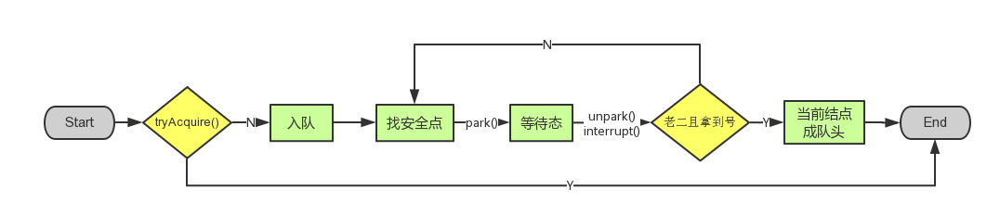
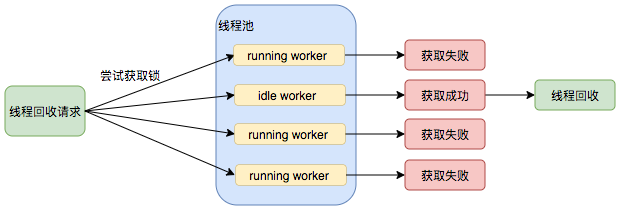

[**首页**](https://github.com/qdw497874677/myNotes/blob/master/首页检索.md)

## 上下文切换

CPU通过给每个线程分配时间片来达到单线程也支持多线程执行代码的效果。CPU切换执行的线程时，会保存之前任务状态，以便下次切换回来接着执行。**任务从保存到再加载的过程就是一次上下文切换。**

### 如何减少上下文切换

- 无锁并发编程。可以通过一些办法避免使用锁，比如根据数据的id进行哈希取模，进行分段，不同的线程处理不同段的数据。
- CAS。通过CAS来更新数据，可以不需要加锁。
- 使用最少的线程。避免创建不需要的线程。
- 协程。在单线程里实现多任务的调度，并在单线程里维持多个任务间的切换。

## Java内存模型（JMM）

> JMM本身是一种抽象的概念。它描述的是一种规范。这种规范定义了java程序中各个变量（包括实例字段，静态字段和构成数组对象的元素）的**访问方式**。用来**屏蔽**各个硬件平台和操作系统的**内存访问差异**，以实现让Java程序在各个平台下都能达到一致的并发效果。规定了线程如何和何时可以**看到**其他线程修改过的**共享变量**，以及在必须时如果**同步共享变量**。

### 并发编程模型的两个关键问题

- 线程之间如果通信。
- 线程之间如何同步。

在命令式编程中，线程之间的通信机制有两种：共享内存和消息传递。

- 共享内存的并发模型：线程之间共享程序的公共状态，通过读写内存中的公共状态进行隐式的通信。
- 消息传递的并发模型：线程之间没有公共状态，线程之间必须通过发送消息来显示进行通信。

**Java的并发采用的是共享内存的并发模型**。

### JMM规定

JMM有以下规定：

> **所有共享变量都存储于主内存。每个线程存在自己的工作内存**，保存线程使用的共享变量的副本。**线程所有的操作（读、写）都必须在工作内存中完成**，而不能直接读写主内存中的变量。**不同线程间不能访问对方工作内存中的变量**，线程间变量的传递需要通过主内存完成。

因为这样的机制导致可见性的存在。可见性：一个线程获取主内存的一个变量，通过一些操作改变了变量，并写会主存。其他获取之前主内存旧的变量的线程，会发现之前的变量发生了变化。就叫可见性。

解决可见性问题

- synchronized：使用synchronized对变量加锁。线程获取锁前清空工作内存，从主内存拷贝共享变量最新值到工作内存成为副本。释放锁前把修改的副本的值刷回主存。
- volatile：用volatile修饰共享变量

### volatile

volatile是java虚拟机提供的轻量级的同步机制。他可以保证不同线程对他修饰的共享变量的可见性。简单说就是一个线程修改了volatile修饰的变量，当修改后会立刻写会主存，其他线程拿到的也总是最新的值。

### 特性

- 保证可见性（只保证了当前变量是最新的）
- 禁止指令重排

不保证原子性（对单个volatile变量的读或者写操作是具有原子性的）

对于可见性的语义就是

- 主存中volatile变量被修改会让所有线程的工作内存中对应的变量副本失效，当需要读取变量副本时，需要主存中重新获取
- 线程修改完从主内存中取到工作内存的变量副本后会立刻写会主存

### 内存语义

- volatile写的内存语义：**当一个线程写一个volatile变量时，JMM会把该线程对应的本地内存中的共享变量值刷新到主内存。**
- volatile读的内存语义：**当一个线程读一个volatile变量时，JMM会把该线程对应的本地内存置为无效。线程接下来将从主内存中读取共享变量。**

一段程序中的代码，不同线程执行，他们的执行顺序通过建立**先行发生原则**来确立。

为了满足为volatile设计的语义，为volatile的先行发生原则呈现给程序员的为：**对同一个变量的vo读要发生在vo写后面。**

### 实现原理概述

#### 可见性——读取部分

volatile变量的访问代码转换机器码时，会有一个lock前缀。lock有多种实现，通过各种形式来实现volatile规定的语义

- 缓存一致性
- 如果cpu不支持缓存一致性协议，需要用其他办法等价实现，比如在总线上加锁，导致其他cpu无法访问主存

#### 可见性——写部分

cpu执行写主存操作时，**先把数据写入缓冲区**。

为了让数据能尽快写回主存。jvm会给volatile变量**写操作加一个lock前缀**。lcok前缀的作用之一就是**强制**把写缓存中的数据**写入主存**。

#### 防止指令重排

Java编译器会在生成指令系列时在适当的位置插入**内存屏障**来禁止特定类型的处理器重排序。

在volatile域写的前面和后面分别插入内存屏障，防止和前面的写重排，防止和后面的读重排。

在volatile域读的后面加入两个内存屏障，防止和后面的读重排，防止和后面的写重排。

JDK5开始，提出了happens-before（先行发生原则）的概念，通过这个概念来阐述操作之间的内存可见性。

**在JMM中，如果一个操作执行的结果要对另一个操作可见，那这两个操作必须存在happens-before关系。**

happens-before是JMM呈现给程序员的概念。

- 程序顺序规则：一个线程中的每个操作，happens-before于该线程中任意后续操作。
- 监视器锁规则：对一个锁的解锁，happens-before于随后对这个锁的加锁。
- volatile变量规则：对一个volatile变量的写，happens-before于任意后续对这个volatile变量之前。
- 传递性：如果A happens-before B，且B happens-before C，那么A happens-before C。

### 指令重排

为了提高性能，在不改变单线程执行结果的前提下，编译器和处理器会对既定的代码执行顺序进行指令重排序。

编译器、runtime和处理器都必须遵守as-if-serial语义。

### 缓存一致性

当多个处理器的工作都涉及到主内存中的同一块区域，可能导致各自的缓存数据不一致。为了解决一致性问题各个处理器访问缓存都遵循一些协议，在读写时根据协议来进行操作。最出名的是Intel的**MESI协议**。

MESI协议保证**每个缓存使用的共享变量的副本是一致**的。当**cpu写数据**时，如果发现操作的变量是**共享变量**（其他cpu缓存中也有该变量的副本），会发出信号通知其他cpu将该变量在缓存中的**副本设置为无效**。当需要读取这个这个变量副本时，发现无效就会从内存**重新读取**。

#### 总线风暴

频繁地去嗅探主存，无效的交互导致总线带宽达到峰值。

### 与synchronized相比

- volatile本质是告诉JVM当前工作内存中的值是不确定的；synchronized是锁定当前变量，只有当前线程可以访问该变量，其他线程被阻塞。
- volatile只能使用在变量级别；synchronized可以使用在变量、方法和类级别。
- volatile只能保证修饰的变量的可见性，并不保证原子性；synchronized可以保证可见性和原子性。
- volatile不会造成线程的阻塞；synchronized可能会造成线程的阻塞。 
- volatile标记的变量不会被编译器优化；synchronized标记的变量可以被编译器优化 

volatile修饰符适用于以下场景：某个属性被多个线程共享，其中有一个线程修改了此属性，其他线程可以立即得到修改后的值

### 在那些地方用过volatile

#### 单例模式DCL

一个进程在执行到第一次监测时，读取到instance不为null，有可能是给instance对象分配了空间，但是还没有完成初始化。

~~~java
instance = new SingletonDemo();
//可分为三步
memory = allocate();//1.分配对象内存空间
instance(memory);//2.初始化对象
instance = memory;//3.设置instance指向刚分配的内存地址，此时instance!=null
~~~

> 步骤2和步骤3不存在数据依赖关系，这种指令重排处理器是允许的。
>
> 当一个线程读取到instance不为null时，实际上这个实例还没有完成初始化，就产生了线程安全问题。
>
> 所以对这个实例的引用变量加volatile。

~~~java
package com.qdw.main;
public class SingletonDemo {
    private static volatile SingletonDemo instance;
    private SingletonDemo(){
        System.out.println("执行构造方法");
    }
    private static SingletonDemo getInstance(){
        if (instance == null){
            synchronized (SingletonDemo.class){
                if (instance == null){
                    instance = new SingletonDemo();
                }
            }
        }
        return instance;
    }
    public static void main(String[] args) {
        for (int i = 0; i < 10; i++) {
            new Thread(()->{
                System.out.println(Thread.currentThread().getName()+" "+SingletonDemo.getInstance());
            },String.valueOf(i)).start();
        }
    }
}
~~~

#### 读写锁手写缓存

#### JUC包里面的大规模使用volatile

### synchronized关键字和volatile关键字的区别

- volatile关键字是线程同步的轻量级实现，并且**只能用于变量**。synchronized关键字可以**修饰方法以及代码块**。
- 多线程访问volatile关键字不会发生阻塞，而synchronized关键字可能会发生阻塞。
- volatile关键字能保证数据的可见性，但不能保证数据的原子性。synchronized关键字两者都能保证。
- volatile关键字主要用于解决**变量在多个线程之间的可见性**，被修饰的变量在主内存中的改变后，保证其他线程对与这个变量需要从主存中刷新；而synchronized关键字解决的是**多个线程之间访问资源的同步性**，同一时间内，只能有一个线程在同步方法或者同步块内。

### volatile能保证线程安全吗

在有些情况下可以。

满足两个条件，可以保证修饰的变量的线程安全

- 对变量的写操作不依赖于当前值。（若没有则添加，若相等则移除，是不可以的。++是不行的）
- 该变量没有包含在具有其他变量的不变式中。

JMM关于同步的规定

1. 线程解锁前，必须把共享变量的值刷回主内存
2. 线程加锁前，必须读取主内存的最新值到自己的工作内存
3. 加锁解锁是同一把锁

> 线程对变量的操作要在自己的工作内存中进行，工作内存是线程私有的。而所有的变量都存在主内存，线程不能直接操作主存，只能通过把主存的变量拷贝到自己的工作内存，操作完再写回主内存。

JMM认为如果提高线程安全，可以去保障下面三个性质。

- 可见性。一个线程获取主内存的一个变量，通过一些操作改变了变量，并写会主存。其他获取之前主内存旧的变量的线程，会发现之前的变量发生了变化。就叫可见性。
  - 解决：
    - synchronized：线程获取锁前清空工作内存，从主内存拷贝共享变量最新值到工作内存成为副本。释放锁前把修改的副本的值刷回主存。
    - volatile
- 原子性。不可分割。线程往主存写数据的时候被打断，等恢复后写进主存可能会导致数据错误。
  - 解决：
    - synchronized
    - 用Auomic类作为变量
      - 
    - 
- 有序性。为了提高性能，编译器和处理器常常会对指令重新排序执行。单线程环境里会保证执行结果一致。处理器在进行重排时要考虑指令之间的**数据依赖性**。但是多线程下，就可能会出现问题。因为可能认为一个线程的指令重排，按理确实不会影响自己的计算结果，但是可能会影响到别的进程中的赋值，会导致数据错误。
  - 
  - 解决：
    - 对于关键的变量用volatile修饰，可以禁止指令重排。
      - 内存屏障（Memory Barrier），是一个CPU指令。有两个作用：
        1. 保证特定操作的执行顺序
        2. 保证某些变量的内存可见性
      - 通过插入内存屏障禁止在内存屏障前后的指令执行重新排序优化。
        - 

## 线程

### 什么是线程安全

在堆内存中的数据由于可以在任何线程访问到，在没有限制的情况下，就会存在被意外修改的风险。一个线程处理过的数据，可能被其他线程意外修改。

### 保证线程安全的方式

- 显而易见的安全，**隔离数据**
  - 局部变量：每个线程只能访问自己的，因为方法在栈里是线程私有的
  - 常量：只能读不能修改
  - ThreadLocal：可以让数据在堆内存中为每个线程都复制一份，放到线程的实例中去了。每个线程可以把自己线程的数据和自己的线程实例绑定在一起。
    - 比如对于单例对象，如果对象本身没有考虑线程安全，那么多线程操作可能会有线程安全，就可以用ThreadLocal给每个线程复制一份去使用。
- 给操作共享数据的方法或者代码块**加同步锁**
  - synchronized
  - Lock
- 在竞争不激烈的情况下用**乐观锁**：并发量小，数据被意外修改的记录很低的情况下，用同步锁会比较大材小用。这种情况下用乐观锁，比如说CAS配合自旋的方式，会比较好。
  - 原子类：把可能发送发送共享变量包装

### 线程间通信

指多个线程之间配合工作

- 通过**共享变量**：多线程操作共享变量可能会出现线程安全，有下面三种方式去处理。

  - 变量可用**volatile**修饰，可以线程的工作内存中的变量拷贝在使用时保持最新，也让线程对拷贝变量的更新及时刷回主存，保证变量可见性。多个线程通过对volatile修饰的共享变量进行访问和修改，让其他线程感知到变化。
  - 可以对**访问变量的方法或者代码块加锁**；
  - 可以用**原子类来替换变量**，让变量的变化变为原子性的。

- **通知/等待**机制，比如synchronized 配合Object类的wait() notify()；Lock配合Condition的await()、signal()

- **join()**方法：等待一个线程终止后，方法才返回。

- **同步工具类**，比如CountDownLatch、CyclicBarrier、Semaphore

  

### Java线程的状态

6种

- **NEW：新建状态。**创建一个线程实例，但还没有调用start()方法。
- **RUNABLE：运行状态。**Java线程将操作系统中的就绪和运行两种状态统称为运行中。ready状态的线程，获取到cpu时间片后处于running状态
  - 就绪状态：调用start()方法后，线程获取了除CPU之外的所有资源
  - 运行状态：线程获取到了CPU的使用权，run()方法开始执行。
- **BLOCKED：阻塞状态。**表示线程阻塞于锁（synchronize），是被动的释放cpu。
- **WAITING：等待状态。**表示线程进入等待状态，进入该状态表示当前线程需要等待其他线程做出一些特定动作（通知或者中断）。执行wait()、join()、park()方法进入等待状态。
  - 调用最为锁的对象的wait()后，当前线程释放锁，进入对象的**等待池**（等待队列），等待池中的线程**不会去竞争该对象的锁**。当锁对象的notify或者notifyAll调用后，就把对象等待队列中的随机一个或者所有线程加入同步队里，来竞争对象的锁。
- **TIME_WATTING：超时等待状态。**和等待状态不同的是，可以在指定时间自行返回。执行wait(long millis)方法进入超时等待状态。之后返回到运行状态。
- **TERMINATED：终止状态。**表示当前线程已经执行完毕。线程的**run()方法完成**时，或者主线程的**main()方法完成**时，我们就认为它终止了。

### wait()

在同步方法（不在的话会报非法监视器状态的异常）中调用wait方法，会让**发起调用的当前线程**释放cpu和锁资源，变为等待状态进入锁对象的等待队列中，等待唤醒。**当线程被唤醒后，且获取到锁后，wait方法才会返回。**

### notify()、notifyAll()

在同步方法中调用锁对象的notify()会让对象的等待队列中的随机一个线程**进入同步队列**，状态变为阻塞，来竞争锁。调用notify()是会唤醒等待队列中所有的线程，都进入到同步队列中去竞争锁。

### 线程方法

- sleep：当前线程进入休眠，**交出CPU，但是不释放锁**。sleep可以在任意区域调用，进入的是TIMED-WAITING状态。
- yiled：使当前线程让出CPU，给优先级相同或更高的线程，回到RUNNABLE状态，重新竞争CPU时间片。和sleep类似**不会释放锁**。
- join：当前线程阻塞直到被调用join的线程运行终止。**底层使用wait，也会释放锁**。
  - join方法是用synchronized以目标线程作为锁对象。A线程调用B线程的join：A进入同步状态**以线程B作为锁对象**，判断B处于运行状态后**调用wait**阻塞当前进入同步区域的线程。**由于线程终止时会调用自己的notifyAll()方法，唤醒所有以自己为锁的在等待的线程。**当B执行完终止后，唤醒处于等待状态的A线程。
- interrupt()：设置线程的中断标志位。要看线程去怎么处理中断标志。
  - 如果线程通过sleep、wait、join处于等待状态，那么线程会定期检查中断位是否为true，会在这些方法中抛出IntrruptedException异常，并在抛出异常后重置中断位为false。
  - 如果线程正在运行竞争synchronized、执行lock()，那么是不可中断的，他们会暂时忽略，知道成功获取资源后再去把中断补回来
  - 判断中断标志的三种方式：
    - isInterrupted()：不会重置
    - interrupted()：会重置
    - throw InterruptException：抛出异常同时重置。
- suspend()/resume()：suspend会挂起线程，直到被resume。调用suspend和调用resume的线程，可能会因为挣锁的问题发生锁死。所有JDK7已经弃用。

### 等待池和锁池（等待队列、同步队列）

在同步代码中，调用了锁对象的wait方法后，当前线程就进入等待池（等待队列），状态由运行状态变为等待状态。当锁对象的notify或者notifyAll方法被调用后，锁对象对应的等待池中的线程就进入到锁池中（同步队列），状态变为阻塞状态，来竞争锁（优先级高的线程获取到锁的概率大）。

### 阻塞状态和等待状态有什么区别

线程可以通过wait()、join()方法进入等待状态，在对象监视器的等待队列中。进入等待状态的线程要等待唤醒(notify或notifyAll)，变为阻塞状态，进入同步队列中，才有机会去重新获取cpu资源。

阻塞状态的可以是因为线程获取不到对象的锁（监视器），而进入同步队列中，等待获取锁。也可以是唤醒了处于等待状态的线程，先进入同步队列变为阻塞状态，如果没有没有竞争的话就可以取执行了。

### 启动线程用run()还是start()

start()开始一个线程后，线程就进入就绪状态，使线程所代表的虚拟处理机处于可运行状态，这意味着它可以由JVM调度并执行。start()在java中最终调用一个本地方法来准备启动一个线程。

通过run()方法启动线程，并没有真正的创建多线程，此时还是只有一个主线程，调用run方法相当于调用类的普通方法。

### 执行两次Start方法会发生什么

Java的线程是不允许启动两次的，第二次调用必然会抛出IllegalThreadStateException，这是一种运行时异常，多次调用start被认为是编程错误。

### 创建线程

#### 继承Thread类

重写

#### 实现Runnable接口

#### 实现Callable接口

有返回值，能在方法定义上throws异常

通过FutureTask类，传入Callable接口实现。FutureTask实现了Runnable接口和Future接口，可以作为Thread的参数传入。（适配器模式）

也可以通过线程池的submit方法来执行，返回一个Future的实例，通过get阻塞获取结果。

一个FutureTask只执行一次。

~~~java
public class Test1 {
    public static void main(String[] args) {
        MyThread myThread = new MyThread();
        FutureTask<String> futureTask = new FutureTask<>(myThread);
        Thread thread = new Thread(futureTask);
        try {
            thread.start();
            String s = futureTask.get();
            System.out.println(s);
        } catch (InterruptedException e) {
            e.printStackTrace();
        } catch (ExecutionException e) {
            e.printStackTrace();
        }
        ExecutorService executorService = Executors.newSingleThreadExecutor();
        Future<String> submit = executorService.submit(myThread);
        try {
            System.out.println(submit.get());
        } catch (InterruptedException e) {
            e.printStackTrace();
        } catch (ExecutionException e) {
            e.printStackTrace();
        }
        executorService.shutdown();
    }
}
class MyThread implements Callable<String> {

    @Override
    public String call() throws Exception {

        System.out.println(Thread.currentThread().getId()+":工作。。。");
        return "完成";
    }
}

~~~

#### 实现Runnable接口和Callable接口的区别

Runnable接口不会返回结果或抛出异常检查，Callable接口可以。

Callable可以通过Future的实现类来完成执行和获取结果

工具类Executors可以实现两者实现类对象之间的像话转化。（Executors.callable（Runnable task）或 Executors.callable（Runnable task，Object resule））。

### 如何让线程运行10秒停下来

让线程执行，在过程中处理中断。如果有sleep在catch中去处理中断。没有sleep可以在循环的某处通过当前线程对象的isInterrupted()来处理中断。主线程sleep10秒后对线程执行中断。

~~~java
public class Test4 {
    public static void main(String[] args) {
        Thread thread = new Thread(() -> {
            for (int i = 0; i < 20; i++) {
                try {
                    Thread.sleep(1000);
                } catch (InterruptedException e) {
                    e.printStackTrace();
                    System.out.println("被中断");
                    return;
                }
                System.out.println(i);
            }
        });
        thread.start();
        try {
            Thread.sleep(10000);
        } catch (InterruptedException e) {
            e.printStackTrace();
        }
        thread.interrupt();
    }
}
~~~

## CAS

> 比较并交换。
>
> 比较目标值和我期望值是否相等，如果相等就执行一个操作，如果不等就不执行。
>
> 是乐观锁的一种实现方式。一般结合自旋。

一般使用时会先读取变量获取期望值，然后调用unsafe类中的提供的比较赋值方法来尝试更新变量。

### 应用

从原子类AtomicInteger里看CAS怎么发挥作用。

下面是AtomicInteger里的一个方法

~~~java
public final boolean compareAndSet(int expect, int update) {
        return unsafe.compareAndSwapInt(this, valueOffset, expect, update);
    }
~~~

根据内存地址，去比较主内存变量和自己的工作内存的变量进行比较，是否是期望的值，在相等的时候执行操作。（如果不等，这个unsafe类会有自己的一些操作，他会循环比较，为了就是在最新的值上去执行操作）

### 底层原理（Unsafe）

对于原子类AtomicInteger的自加方法

~~~java
public final int getAndIncrement() {
        return unsafe.getAndAddInt(this, valueOffset, 1);
    }
~~~

Unsafe类是什么

> 是CAS的核心类，类中大部分都是native方法。它的一些方法可以操作内存。
>
> Java中的CAS最终实现，就是通过Unsafe中的native方法去调用CPU原语在实现原子操作。

- var1：AtomicInteget对象本身
- var2：该对象的一个值的引用地址
- var4：需要变动的数量
- var5：通过var1和var2找出主存中真是的值

var5不断地变成最新值，如果比较成功了，就把var4加上。这个compareAndSwapInt方法是native方法，他调用CPU原语，具有原子性，是不会被打断的。var5的作用就是可以比较多次直到完成CAS操作，这个期望值只要是最新的就可以操作了。（自旋）

相当于就尽量去保证是最新的值加上了var4。类似于乐观锁，如果不对就重新取值，直到满足要求。

### 缺点

- 循环时间长开销大
- 只能保证**一个**共享变量的原子操作
- 无法解决ABA问题

### ABA问题

之前说的cas存在一个漏洞

> 线程T1在执行CAS操作中，初次读取的时候是变量值是A，但是在准备检查赋值前，变量被别的线程操作从A变成B再变成A。T1的CAS操作没有发现变化，但实际上是被别的线程动过的。

可以通过多加一个版本字段来实现

#### 原子引用AtomicReference

AtomicReference可以让类成为原子类。

~~~java
public class Test3 {
    public static void main(String[] args) {
        User z3 = new User("z3");
        User l4 = new User("l4");
        AtomicReference<User> atomicUser = new AtomicReference<User>();
        atomicUser.set(z3);
        System.out.println(atomicUser.compareAndSet(z3,l4)+" "+atomicUser.toString());
        System.out.println(atomicUser.compareAndSet(z3,l4)+" "+atomicUser.toString());
    }
}
@Data
@AllArgsConstructor
class User{
    private String name;
}
~~~

#### 解决ABA

用带时间戳的原子引用AtomicStampedReference。但实际上大部分ABA问题不会影响程序并发的正确性，如果需要解决，用传统的互斥同步可能更高效。

~~~java
public class Test3 {
    public static void main(String[] args) {
        AtomicStampedReference<Integer> atomicStampedReference  = new AtomicStampedReference<>(100,1);
        new Thread(()->{
            //T1先获取版本号，然后没有完成CAS
            int stamp = atomicStampedReference.getStamp();
            System.out.println(Thread.currentThread().getName()+"获取版本号："+stamp);
            try {
                TimeUnit.SECONDS.sleep(2);
            } catch (InterruptedException e) {
                e.printStackTrace();
            }
            boolean b = atomicStampedReference.compareAndSet(100, 200, stamp, stamp + 1);
            System.out.println(Thread.currentThread().getName()+"尝试CAS成功与否："+b+" 当前版本号："+stamp);
        },"T1").start();

        new Thread(()->{
            //T2在T1获取版本号但是没有完成CAS时，也获取了这个值，让后出现ABA
            try {
                TimeUnit.SECONDS.sleep(1);
            } catch (InterruptedException e) {
                e.printStackTrace();
            }
            int stamp = atomicStampedReference.getStamp();
            Integer temp = 200;
            atomicStampedReference.compareAndSet(100,temp,stamp,stamp+1);
            stamp = atomicStampedReference.getStamp();
            System.out.println(Thread.currentThread().getName()+"执行CAS后，当前版本号："+stamp);
            atomicStampedReference.compareAndSet(temp, 100, stamp, stamp + 1);
            stamp = atomicStampedReference.getStamp();
            System.out.println(Thread.currentThread().getName()+"执行两次CAS，产生一个ABA后，当前版本号："+stamp);
        },"T2").start();
    }
}
~~~

### CAS和Synchronized的区别

- Synchronized为锁机制，隐含着获取锁和解锁的操作。利用操作系统提供支持实现访问竞争资源的顺序性。
- CAS实现了lock-free的概念，不引用锁也能解决并发问题。减少了上下文切换。

## Atomic原子类

在java.util.concurrent.atomic包下。

基本类型

- AtomicInteger
- AtomicLong
- AtomicBoolean

数组类型

- AtomicIntegerArray
- AtomicLongArray
- AtomicReferenceArray

引用类型

- AtomicReference
- AtomicStampedReference
- AtomicMarkableReference

对象的属性修改类型

- AtomicIntegerFieldUpdater：原子更新整形字段的更新器
- AtomicLongFieldUpdater：原子更新长整形字段的更新器
- AtomicStampedReference：原子更新带有版本号的引用类型。该类将整数值与引用关联起来，可用于解决原子的更新数据和数据的版本号，可以解决使用 CAS 进行原子更新时可能出现的 ABA 问题。

例如。AtomicInteger 类主要利用 CAS (compare and swap) + volatile 和 native 方法来保证原子操作，从而避免 synchronized 的高开销，执行效率大为提升。

## Java锁

### 乐观锁和悲观锁

> 锁的一种宏观分类方式是**悲观锁和乐观锁**。
>
> - 悲观锁的策略是，每次操作数据时都认为别人会修改，所以**每次都会加锁独占资源**。
> - 乐观锁的策略是，每次操作数据都会认为别人不会修改，所以**不上锁**，所以当更新数据时会**检查**在读取和更新这段时间里资源数据有没有被修改。如果改变就重新读取重新更新。

#### 乐观锁的基础——CAS

Compare-and-Swap，即**比较并替换**。

1. 比较：当读取了一个值A，在将它更新为B之前，检查原值是否还是A
2. 替换（设置）：如果是就更新为B，否则什么都不做

上面两步都是原子性的。整个过程没有加锁和解锁，乐观锁策略也被称为无所编程。换句话说乐观锁不是锁，只是循环重试CAS的算法。

AQS框架下的锁则是先尝试用CAS乐观锁去获取锁，如果没有获取到，才转为悲观锁的方式。如RetreenLock

>  Java中的CAS最终实现，就是通过Unsafe中的native方法去调用CPU原语在实现原子操作。

#### 应用

- 原子类中的一些自增操作，通过CAS来完成
- 涉及到多线程的一些操作，都尽量会先用CAS的方式来减少线程阻塞。

### 公平和非公平锁

> 公平锁：线程获取到同一个锁的顺序是和尝试获取锁的顺序一致的。
>
> 非公平锁：多个线程获取锁的顺序不是按照申请锁的顺序，有可能后申请的线程比先申请的线程优先获取锁。有可能造成优先级反转或者饥饿现象。

- synchronized关键字，他是获取一个非公平锁。

- ReentrantLock默认是非公平，可以设置一个参数为true改为公平。
  - ReentrantLock公平的原理：当资源可用时，公平锁模式下线程尝试获取锁时，会比非公平模式下多一个判断：**尝试获取锁线程是不是阻塞队列的第一个**。

### 可重入锁（递归锁）

> 一个线程获取锁之后，锁没有释放的情况下，再次要获取同一把锁，可以立刻获取。
>
> 线程可以进入任何一个它已经拥有的锁所同步着的代码块。
>
> 最大作用：避免死锁。

synchronized、ReentrantLock是可重入锁。

这里线程锁了data对象，对于data对象的两个方法都可以执行。

~~~java
public class Test5 {
    public static void main(String[] args) {
        Data data = new Data();
        new Thread(()->{
            data.A();
        },"T1").start();
        new Thread(()->{
            data.A();
        },"T2").start();
    }
}
class Data{
    public synchronized void A(){
        System.out.println(Thread.currentThread().getName()+" invoked A");
        B();
    }
    public synchronized void B(){
        System.out.println(Thread.currentThread().getName()+" invoked B");
    }
}
~~~

~~~java
public class Test5 {
    public static void main(String[] args) {
        Data data = new Data();
        new Thread(()->{
            data.X();
        },"T1").start();
        new Thread(()->{
            data.X();
        },"T2").start();
    }
}
class Data{
    Lock lock = new ReentrantLock();
    public void X(){
        lock.lock();
        try {
            System.out.println(Thread.currentThread().getName()+" invoked X");
            Y();
        } catch (Exception e) {
            e.printStackTrace();
        } finally {
            lock.unlock();
        }
    }
    public void Y(){
        lock.lock();
        try {
            System.out.println(Thread.currentThread().getName()+" invoked Y");
        } catch (Exception e) {
            e.printStackTrace();
        } finally {
            lock.unlock();
        }
    }
}
~~~

#### 如何实现

当线程已经获取了锁，已经在同步区域执行之后，再去获取相同的锁，就是先通过比较线程是不是当前获取资源的线程，如果是就给对象监视器中的对应的重入标记+1（或者是AQS中表示资源的state+1），并获取到锁。当退出锁范围就把标记-1。

### 自旋锁

> 尝试获取锁的线程不会立即阻塞，而是采用**循环的方式去尝试获取锁**。好处是减少线程上下文切换的消耗，缺点是循环会消耗CPU。

~~~java
public final int getAndSetInt(Object var1, long var2, int var4) {
        int var5;
        do {
            var5 = this.getIntVolatile(var1, var2);
        } while(!this.compareAndSwapInt(var1, var2, var5, var4));

        return var5;
    }
~~~

自旋锁Demo

~~~java
public class Test6 {
    public static void main(String[] args) {
        SpinLockDemo spinLockDemo = new SpinLockDemo();
        new Thread(()->{
            spinLockDemo.lock();
            try {
                TimeUnit.SECONDS.sleep(3);
            } catch (InterruptedException e) {
                e.printStackTrace();
            }
            spinLockDemo.unlock();
        },"T1").start();

        try {
            TimeUnit.SECONDS.sleep(1);
        } catch (InterruptedException e) {
            e.printStackTrace();
        }

        new Thread(()->{
            spinLockDemo.lock();
            try {
                TimeUnit.SECONDS.sleep(3);
            } catch (InterruptedException e) {
                e.printStackTrace();
            }
            spinLockDemo.unlock();
        },"T2").start();
    }

}
class SpinLockDemo{
    AtomicReference<Thread> atomicReference = new AtomicReference<>();
    public void lock(){
        while (!atomicReference.compareAndSet(null,Thread.currentThread())){

        }
        System.out.println(Thread.currentThread().getName()+" 获得锁");
    }
    public void unlock(){
        atomicReference.compareAndSet(Thread.currentThread(),null);
        System.out.println(Thread.currentThread().getName()+" 释放锁");
    }
}

~~~

### 独占锁

> 该锁只能被一个线程持有。

synchronized、ReentrantLock都是独占锁。

### 共享锁

> 该锁可被多个线程持有。

ReentrantReadWriteLock，其读锁是共享锁，其写锁是独占锁。

### 读写锁

> 多个线程可以同时读一个共享数据，如果有线程想写共享数据，那么其他线程就不能对该资源进行读或写。
>
> 写操作：原子+独占。

ReadWriteLock接口，实现类 ReentrantReadWriteLock。

~~~java
public class Test7 {
    public static void main(String[] args) {
        ReadWriteLock lock = new ReentrantReadWriteLock();
        lock.readLock().lock();
        try {

        } finally {
            lock.readLock().unlock();
        }
        lock.writeLock().lock();
        try {

        } finally {
            lock.writeLock().unlock();
        }
    }
}
~~~

### synchronized

synchronized是Java关键字，**解决多个线程之间访问资源的同步性**，可以保证被它修饰的方法或者代码块在**任意时刻只能有一个线程执行**。synchronized 代码块使用一对儿 monitorenter/monitorexit 指令来获取和释放对象的Monitor，**Monitor 对象是同步的基本实现单元**

Java早期版本中，synchronized主要靠操作系统内部的互斥锁，是一个无差别的重量级操作，属于重量级锁。Java6之后官方从JVM层面对synchronized进行了优化，提供了三种Monitor 实现。

#### 特性

- 原子性
- 可见性
- 有序性

#### 非公平

当锁释放时，会给在阻塞队列中的就绪的线程CAS竞争锁的权利，同时不在队列中的线程也可以同时竞争锁，就可能会出现非队列里的线程提前获取到锁的情况，就造成了不公平的情况。牺牲了公平但是提高了执行效率。

#### 可重用

线程每次持有对象锁，就会把锁的计数器值加一，在退出同步区域时，锁计数器的值减1。当计数器值为1就会释放锁。

#### 使用场景

java中每一个对象都可以作为锁。

- 实例方法：锁是当前实例对象。
- 静态方法：锁是当前类的Class对象。可以同时两个线程分别调用一个类的静态方法和非静态方法，不会互斥。
- 同步代码块：锁是括号里的对象。指定类.class就对类的Class对象加锁，指定实例对象就对实例对象加锁。

尽量不要对带有常量池的对象加锁。

#### 底层原理

##### 对象构成

对象在内存中分为三块区域

- 对象头
  - Mark Word（标记字段）：默认存储对象的HashCode、分代年龄、锁标志位信息。它会根据对象状态（锁标志位），改变自己存储的内容。
  - Klass Point（类型指针）：对象的这个指针指向它的类元数据，表示自己是哪个类的实例。
- 实例数据
  - 主要存放类的数据信息，父类的信息
- 对其填充：为了字节对齐

##### 同步代码

对象头会关联一个monnitor对象。

- 当进入同步代码时，执行**monitorenter**，就获取想要同步的对象的所有权，这时monitor的进入数+1，这个线程就是这个monitor的拥有者。
- 如果你已经是这个monitor的拥有者了，再次进入会把进入数再+1
- 当同步代码执行完，执行完**monitorexit**，进入数-1，当到0时，这个monitor才能被别的线程拥有。

##### 同步方法

同步方法的时候，判断是否有这个标志位**ACC_SYNCHRONIZED**，有的话会隐式调用上面那两个指令monitorenter和monitorexit。

##### monitor

是C++写的。属性包括：重入次数、当前持有的线程、wait状态的线程列表、等待锁状态的线程列表等等

##### 线程状态和状态转换

多个线程同时请求某个对象监视器时，**对象监视器**会设置几种状态来区分请求的线程

- 阻塞队列
  - Contention List：所有请求锁的线程将首先放置到该竞争队列。
    - 是一个后进先出队列。
  - Entry List：Contention List中那些有资格成为候选人的线程被移到Entry List。
    - 引入这个是为了降低对Contention List尾部的竞争。
    - Owner线程会在unlock时，把Contention List中线程迁移到Entry List，并且执行Entry List中一个线程为OnDeck线程，即就绪的线程。Owner线程释放锁后，把竞争锁的权利交给OnDeck线程。牺牲了公平性，提高了吞吐量。
- 等待队列：
  - Wait Set：放置调用wait方法被阻塞的线程（进入waiting状态）
    - OnDeck线程获取锁之后成为Owner线程，当锁对象调用wait后，此线程释放锁，进入Wait Set。当锁对象调用notify/notifyAll，会唤醒Wait Set中的一个或者全部线程，进入Entry Set。
- OnDeck：表示下一个能竞争到锁的线程。只能有一个。
- Owner：获得锁的线程
- !Owner：释放锁的线程

##### 非公平的体现

Owner线程释放锁后，队列中处于就绪状态的线程和此时还不在队列中正好也要竞争锁的线程，**都通过自旋锁CAS来竞争这个锁**。当不在队列线程竞争到了锁后，队列就绪线程就只能继续留在Entry List中作为OnDeck线程。这就不公平了。

#### notify和notifyAll的区别

先说两个概念：**锁池和等待池**

- 锁池：当一个线程尝试执行某个对象中的synchronized方法或者代码块，先要获取对象的锁，而对象的锁已经被其他线程获取，因此这个线程就进入了该对象的锁池中。当对象**锁被释放掉后**，**锁池中的线程会去继续竞争锁**。
- 等待池：线程调用某个对象的wait()方法后，线程就会**释放该对象的锁**，**进入到该对象的等待池中**。

当线程**调用对象的wait()**方法后，线程便会处于该对象的**等待池中**，等待池中的线程**不会去竞争该对象的锁**。

当有线程调用对象的notifyAll()方法会唤醒所有wait线程，或者调用notify()方法只随机唤醒一个wait线程。被唤醒的线程便会**从等待池进入该对象的锁池**中，锁池中的线程会去竞争该对象的锁。

优先级高的线程竞争到锁的概率大，**如果没有竞争到锁，还会留在锁池中**。只有线程再次调用wait()方法，才会重新回到等待池中。**当对象锁被释放掉后，这时锁池中的线程会继续竞争对象锁。**

#### 为什么notify()可能会导致死锁

notify()只会唤醒对象锁池中的随机一个线程，让他进入等待池参与锁的竞争。当有很多个线程处于锁池中，如果前面没有用notify()让所有的等待锁线程进入等待池，那么就会有线程永远在等待池中不参与竞争。

如果用notifyAll()会唤醒所有对象中的等待线程参与锁的竞争，也就是让对象从等待池转移到锁池。当对象的锁被释放后，在锁池中的线程会去继续竞争对象锁。

#### 锁升级优化

1.6之前synchronized的实现为重量级锁，涉及用户态和内核态的切换，为了减少资源的消耗，引入了锁升级。调用了不同的实现去获取锁，失败就去用更高级的实现，锁的重量级越来越大。

synchronized锁存在四种状态：无锁状态、偏向锁状态、轻量级锁状态、重量级锁状态。他们**随着竞争的激烈逐渐升级**。**过程不可逆**。这种策略**为了提高获得锁和释放锁的效率**。

##### 偏向锁

**使用场景**：只有一个线程进入临界区。比较理想的情况就是，一个线程消亡了之后，别的进程才来。

1. 获取锁：当线程尝试进入同步代码后，用CAS设置对象头中的MarkWord中的锁标志为偏向模式，并把线程id记录在对象头中。这个锁就偏向了这个线程，当这个线程再次进入同步区时，比较线程id一致后就无需加锁直接进入。也就是说线程**执行完同步代码后，不会释放锁**。
2. 撤销锁：如果其他线程尝试获取锁，发现线程id和对象头中的id不一致。此时检查之前偏向的线程还是否存活，如果不存活就将锁设置为无锁状态，重新偏向新的线程。如果存活，表示对象锁被多个线程竞争，退出偏向模式，升级成轻量级锁。

##### 轻量级锁（自旋锁）

**使用场景**：多个线程交替进入临界区。这种情况下几乎没有竞争，或者有轻微的竞争。通过短暂的忙等，去换取用户态内核态切换的开销。

主要的形式就是用CAS去尝试将锁标志的空闲状态改为锁定状态，如果成功了就将锁的持有者设置为自己。

1. 获取锁：线程进入同步区域，如果没有锁定，线程把锁对象的Mark Word拷贝到自己栈帧中新创建的锁记录空间里。然后用CAS对象头中的MarkWord替换为指向栈帧中锁记录的指针（这个线程就成了锁的持有者）。没有成功就自旋再次尝试修改
2. 解锁：自旋重试多次后（默认10次），如果都失败了，说明对于同步代码是有竞争的，就升级为重量级锁，修改锁标记位。

- 锁消除

虚拟机检测到一些共享变量不可能存在竞争，就会执行锁消除，节省请求锁的时间。

- 锁粗化

原则上，代码中尽量将同步块的作用范围缩小。但是如果一些列的连续操作都对同一个对象反复加锁和解锁，会带来不必要的性能消耗。所以这种情况要对锁范围加粗。

##### 重量级锁

使用场景：多个线程同时进入临界区

特点：不消耗CPU资源，但是会阻塞，阻塞会切换内核态，响应时间变慢。

### synchronized和Lock的对比

synchronized是java关键字，Lock是接口。Lock在类库层面实现同步，没有用到Synchronized，而是利用了volatile的可见性。都是可重用锁。

- **释放锁方式**：synchronized同步区域的代码执行完毕就会自动释放锁退出同步区域。而Lock需要手动执行获取锁释放锁的操作。
- **等待可中断**：获取synchronized锁的阻塞线程是不处理中断的。Lock中用tryLock(long time, TimeUnit unit)方法和lockInterruptibly()去尝试获取锁，在获取锁前是可以相应中断的。
- **公平性**：synchronized是非公平的。Lock的一个实现类ReentranLock默认是非公平的，也可以指定为公平锁。指定为公平锁性能会下降。
- **精准唤醒**：synchronized中调用锁的notify/notifyAll只能唤醒等待池中的一个或者所有线程。ReentranLock可以同时绑定多个Condition，Condition的await和signal只针对这个Condition。所以可以根据不同的Condition实例去await和signal，实现精准唤醒。

### 生产者消费者模式

用synchronized实现

~~~java
public class A {
    public static void main(String[] args) {
        Data data = new Data();
        new Thread(()->{
            for (int i = 0; i < 10; i++) {
                data.increment();
            }
        },"A").start();
        new Thread(()->{
            for (int i = 0; i < 10; i++) {
                data.decrement();
            }
        },"B").start();
    }
}
class Data{
    private int num = 0;
    public synchronized void increment() {
        if (num!=0){
            try {
                this.wait();
            } catch (InterruptedException e) {
                e.printStackTrace();
            }
        }
        num++;
        System.out.println(Thread.currentThread().getName()+"产生数据，num="+num);
        this.notify();
    }
    public synchronized void decrement() {
        if (num==0){
            try {
                this.wait();
            } catch (InterruptedException e) {
                e.printStackTrace();
            }
        }
        num--;
        System.out.println(Thread.currentThread().getName()+"取出数据，num="+num);
        this.notify();
    }
}
~~~

用lock实现

~~~java
public class B {
    public static void main(String[] args) {
        Data2 data = new Data2();
        new Thread(()->{
            for (int i = 0; i < 50; i++) {
                data.increment();
            }
        },"A").start();
        new Thread(()->{
            for (int i = 0; i < 50; i++) {
                data.decrement();
            }
        },"B").start();
        new Thread(()->{
            for (int i = 0; i < 50; i++) {
                data.increment();
            }
        },"C").start();
        new Thread(()->{
            for (int i = 0; i < 50; i++) {
                data.decrement();
            }
        },"D").start();
    }
}
class Data2{
    private int num = 0;
    Lock lock = new ReentrantLock();
    Condition condition = lock.newCondition();
    public void increment() {
        lock.lock();
        try {
            while (num!=0){
                try {
                    condition.await();
                } catch (InterruptedException e) {
                    e.printStackTrace();
                }
            }
            num++;
            System.out.println(Thread.currentThread().getName()+"产生数据，num="+num);
            condition.signalAll();
        } catch (Exception e) {
            e.printStackTrace();
        } finally {
            lock.unlock();
        }
    }
    public void decrement() {
        lock.lock();
        try {
            while (num==0){
                try {
                    condition.await();
                } catch (InterruptedException e) {
                    e.printStackTrace();
                }
            }
            num--;
            System.out.println(Thread.currentThread().getName()+"取出数据，num="+num);
            condition.signalAll();
        } catch (Exception e) {
            e.printStackTrace();
        } finally {
            lock.unlock();
        }
    }
}
~~~

### 双重检查锁单例

~~~java
public class LazyMan {
    private LazyMan(){
    }
    //加上volatile防止指令重排
    private volatile static LazyMan lazyMan;
    public static LazyMan getInstance(){
        //外面再判断一次为了效率，如果存在对象就不进入同步代码块了
        if (lazyMan == null){
            //加锁如果两个线程同时进入这个方法，可能创建两个实例
            synchronized (LazyMan.class){
                if (lazyMan == null){
                    //可能发生指令重排产生错误
                    lazyMan = new LazyMan();
                }
            }
        }
        return lazyMan;
    }
}
~~~

- 第一个if：在进入同步块之前先判断一下是否实例已经创建
- synchronized：防止两个线程同时判断为null后去new实例
- volatile：创建实例的过程字节码分为三步：1.分配对象内存空间，2.调用构造方法进行初始化，3.将对象引用赋值给引用变量（此时引用变量的引用不为null）。jvm运行时2和3可能发生重排，他们只依赖于1的执行结果。

### synchronized和Lock对比

- 都是可重入锁
- synchronized是一个java关键字；Lock是一个接口，是api层面的锁。
- synchronized不需要手动释放锁；Lock需要手动释放锁。
- synchronized不可中断，除非抛出异常或者正常运行完成；Lock可中断：

  - Lock：

    1. 用tryLock(long time, TimeUnit unit)方法尝试获取锁，优先响应中断再响应锁获取，可以设置超时参数。

    2. 用lockInterruptibly()去尝试获取锁，优先响应中断再响应所获取（就是说如果在获取锁的过程中进入阻塞，对他发起的中断它可以响应到，Thread.interrupt()可以发起中断。）。
- synchronized是非公平锁；Lock两者都可，默认是非公平锁，传入参数true就为公平锁。
- synchronized唤醒线程要么随机唤醒一个线程。要么唤醒全部线程；Lock可以通过把线程绑定到多个Condition中来实现分组唤醒需要唤醒的线程，可以精准唤醒。

### Lock精准唤醒

~~~java
class Data{
    private int flag;
    private Lock lock;
    private Condition conditionA;
    private Condition conditionB;
    private Condition conditionC;
    public Data(){
        flag = 1;
        lock = new ReentrantLock();
        conditionA = lock.newCondition();
        conditionB = lock.newCondition();
        conditionC = lock.newCondition();
    }
    public void printA(){
        lock.lock();
        try {
            while (flag!=1){
                conditionA.await();
            }
            System.out.println("A");
            flag = 2;
            conditionB.signal();
        } catch (InterruptedException e) {
            e.printStackTrace();
        } finally {
            lock.unlock();
        }
    }
    public void printB(){
        lock.lock();
        try {
            while (flag!=2){
                conditionB.await();
            }
            System.out.println("B");
            flag = 3;
            conditionC.signal();
        } catch (InterruptedException e) {
            e.printStackTrace();
        } finally {
            lock.unlock();
        }
    }
    public void printC(){
        lock.lock();
        try {
            while (flag!=3){
                conditionC.await();
            }
            System.out.println("C");
            flag = 1;
            conditionA.signal();
        } catch (InterruptedException e) {
            e.printStackTrace();
        } finally {
            lock.unlock();
        }
    }
}

~~~

## AQS

AbstractQueuedSynchronizer，**抽象的队列同步器**，是一个抽象类，在java.util.concurrent.locks包下面。

AQS是一个用来构建锁和同步器的框架，使用AQS能简单高效地个构造出应用广泛的大量的同步器。同步器面向的是锁的实现者，它简化了锁的实现方式，屏蔽了同步状态管理，线程排队等底层操作。比如ReentrantLock，Semaphore，ReentrantReadWriteLock，SynchronousQueue，FutureTask，等等都是基于AQS的。

AQS是提供一些基础模板方法，模板方法中的有些小方法是需要开发者去实现的。比如说提供过acquire获取资源实现、acquireQueued进入同步队列实现、release释放资源实现等，而获取独占资源的tryAcquire需要开发者去自己实现，这些需要实现的方法会被框架中的模板方法调用，比如tryAcquire会被acquireQueued调用，acquire也会调用tryAcquire。

AQS中维护了一个 **volatile int state** 和一个**FIFO队列**（Node节点）

state：代表同步状态，volatile保证多线程下的可见性，=1表示当前对象已经被占用，其他线程来加锁时则会失败。

FIFO：多线程争用资源的线程会封装成node进入这个队列，队列后面的等待队首的释放资源。

> 核心思想

如果请求的共享资源**空闲**，则将请求资源的线程设置为有效的工作线程，将共享资源设置为锁定状态。

如果请求的共享资源**被占用**，就会将这个线程封装成一个Node，插入（CAS）双向队列的尾部，然后这个线程进入阻塞状态等待被唤醒。

共享资源用volatile修饰。线程通过CAS去改变状态。没有成功获取就进入队列。

还提供一个共享模式（另一个是独占模式），线程执行会消耗state，在state不为0的时候，可以继续唤醒等待的线程。

### CLH队列

~~~java
static final class Node {
        static final Node SHARED = new Node();
        static final Node EXCLUSIVE = null;
        //取消状态
        static final int CANCELLED =  1;
        //等待触发状态
        static final int SIGNAL    = -1;
        //等待条件状态
        static final int CONDITION = -2;
        //需要向后传播状态，在共享模式下使用
        static final int PROPAGATE = -3;
        //当前节点状态
        volatile int waitStatus;
        //前驱节点
        volatile Node prev;
        //后驱节点
        volatile Node next;
        //节点持有的线程
        volatile Thread thread;
        Node nextWaiter;
        ...
}
~~~

Node类中包括：线程、前驱后驱、等待状态waitStatus等

waitStatus的状态包括：

- waitStatus = (CANCELLED = 1) ——表示这个节点因为某些原因被取消掉了
- waitStatus = (SIGNAL= -1) ——表示这个节点正在等待触发状态，只有前驱节点是这个状态的时候，当前节点才会进入休眠状态。
- waitStatus = (CONDITION = -2) ——表示这个节点等待某个条件
- waitStatus = (PROPAGATE= -1) ——表示这个节点被唤醒后需要向后继续传播，唤醒下一个节点

因为多线程竞争的原因，CLH队列插入节点和设置节点都采用CAS+自旋的方式来完成。

### 等待队列

和一个Condition对象绑定。一个Condition对象去调用await方法，当前线程进入这个condition的等待队列中，然后释放锁。一个Condition对象去调用signal方法，会将对待队列里面的第一个waiter转移到同步队列。

### 独占模式

#### acquire(int)

是独占模式下，获取共享资源的顶级入口。如果获取到资源直接返回，否则进入同步队列直到获得资源为止，获取到资源前的过程中是忽略中断的。这个也是可重用锁的lock方法，lock方法中就是一个acquire(1)

~~~java
public final void acquire(int arg) {
        if (!tryAcquire(arg) &&
            acquireQueued(addWaiter(Node.EXCLUSIVE), arg))
            selfInterrupt();
    }
~~~

函数流程：

1. tryAcquire(arg)方法尝试去获取资源，如果成功直接返回
2. addWaiter()方法将线程加入同步队列尾部，标记为独占模式
3. acquireQueued()使线程进入等待状态，当轮到自己（被unpark）时尝试获取资源，一直等待获取到后才返回。当返回时如果在等待期间被中断过就返回true，否则返回false。
4. 对于在队列中阻塞过程发生的中断，会在获取资源后通过selfInterrupt()方法自我中断，补上。

##### tryAcquire()

这个方法是空的，只返回异常，需要由子类去重写。

~~~java
protected boolean tryAcquire(int arg) {
        throw new UnsupportedOperationException();
    }
~~~

之所以不是直接用抽象方法定义，是因为在独占和共享模式下，都需要两者都实现（一般是在一个自定义同步器内定义内部类来继承AQS来实现需要的方法），这样减少了开发量。

##### addWaiter()

将当前线程加入等待队列的尾部，返回当前线程所在的节点。

~~~java
private Node addWaiter(Node mode) {
        Node node = new Node(Thread.currentThread(), mode);
        // Try the fast path of enq; backup to full enq on failure
        Node pred = tail;
        if (pred != null) {
            node.prev = pred;
            if (compareAndSetTail(pred, node)) {
                pred.next = node;
                return node;
            }
        }
        enq(node);
        return node;
    }
~~~

流程：

1. 根据模式为当前线程构造节点，有独占和共享模式
2. 尝试用CAS快速入队
3. 失败后通过end方法入队

##### end()

将node加入队尾

~~~java
private Node enq(final Node node) {
        for (;;) {
            Node t = tail;
            if (t == null) { // Must initialize
                if (compareAndSetHead(new Node()))
                    tail = head;
            } else {
                node.prev = t;
                if (compareAndSetTail(t, node)) {
                    t.next = node;
                    return t;
                }
            }
        }
    }
~~~

自旋的尝试CAS加入队尾。

##### acquireQueued()

前面tryAcquire失败了，执行完addWaiter后，线程已经被放到队列尾部了。接下来acquireQueued就要让线程进入等待状态休息，直到其他线程释放资源后唤醒自己。

在这个队列中在合适的地方等待，被唤醒时继续尝试获取资源，否则接着等待。释放资源的节点的清除，是通过后面的线程获取资源后来操作将引用置为null，让gc来清理。

~~~java
final boolean acquireQueued(final Node node, int arg) {
        boolean failed = true;
        try {
            boolean interrupted = false;
            for (;;) {
                final Node p = node.predecessor();
                if (p == head && tryAcquire(arg)) {
                    setHead(node);
                    p.next = null; // help GC
                    failed = false;
                    return interrupted;
                }
                if (shouldParkAfterFailedAcquire(p, node) &&
                    parkAndCheckInterrupt())
                    interrupted = true;
            }
        } finally {
            if (failed)
                cancelAcquire(node);
        }
    }
~~~

流程：

1. 标记是否拿到资源，标记等待过程是否被中断过
2. 开始自旋操作。这里循环指的是，线程如果进入等待后重新被唤醒了，接着尝试获取资源，不行就接着尝试进入等待。
   1. 拿到前驱节点去判断，如果前驱是头结点（头结点获取了资源），那么作为老二就是去用tyAcquire去尝试获取资源。获取到后将head指向自己表示为头结点，把之前拿到的前驱节点引用p置为null，帮助gc。（）
   2. 如果不是老二，或者没有获取到资源就表示自己可以先休息了，通过后方法内的park()方法进入等待状态，这个方法可以将哪些被中断的等待线程唤醒后发现拿不到资源继续park()等待。通过shouldParkAfterFailedAcquire()进入等待状态，配合parkAndCheckInterrupt()方法来标记是否有被中断。
   3. 最后都要执行，也就是在finally中判断是否拿到资源，然后调用cancelAcquire()来取消节点在队列中的等待。

##### shouldParkAfterFailedAcquire()

用来检查状态，看看自己是不是真的可以进入waiting状态了，寻找一个安全的休息点。

~~~java
private static boolean shouldParkAfterFailedAcquire(Node pred, Node node) {
        int ws = pred.waitStatus;
        if (ws == Node.SIGNAL)
            /*
             * This node has already set status asking a release
             * to signal it, so it can safely park.
             */
            return true;
        if (ws > 0) {
            /*
             * Predecessor was cancelled. Skip over predecessors and
             * indicate retry.
             */
            do {
                node.prev = pred = pred.prev;
            } while (pred.waitStatus > 0);
            pred.next = node;
        } else {
            /*
             * waitStatus must be 0 or PROPAGATE.  Indicate that we
             * need a signal, but don't park yet.  Caller will need to
             * retry to make sure it cannot acquire before parking.
             */
            compareAndSetWaitStatus(pred, ws, Node.SIGNAL);
        }
        return false;
    }
~~~

流程：

1. 判断前驱节点，是不是SIGNAL状态，如果是说明前驱节点已经park进入等待状态了，所以自己也可以进入了，就返回true了
2. 如果前驱状态>0，即前驱放弃排队了，那么当前节点就一直往前找到一个正常等待的节点排在后面。
3. 如果前驱<=0，即前驱正常，就把前驱状态设置为SIGNAL

##### parkAndCheckInterrupt()

在shouldParkAfterFailedAcquire()成功找到安全休息点后，通过park使自己线程进入等待状态，唤醒后返回自己是不是被中断的。

~~~java
private final boolean parkAndCheckInterrupt() {
        LockSupport.park(this);
        return Thread.interrupted();
    }
~~~

流程：

1. 使自己进入等待状态
2. 醒来时返回自己的中断状态，并重置中断标记

#### release(int)

此方法是独占模式下线程释放共享资源的顶层入口。**如果所有资源全部释放了，就会唤醒等待队列中的其他线程来获取资源**。根据tryRelease的返回值来判断是否释放了所有资源。

如果release抛异常了，没有unpark，那么队列中的线程永远也不会被唤醒了。

~~~java
public final boolean release(int arg) {
        if (tryRelease(arg)) {
            Node h = head;
            if (h != null && h.waitStatus != 0)
                unparkSuccessor(h);
            return true;
        }
        return false;
    }
~~~

##### tryRelease(int)

尝试去释放指定量的资源，成功释放后返回true。为了实现可重用，当state=0时才返回true，让release去唤醒下一个线程。

~~~java
protected boolean tryRelease(int arg) {
        throw new UnsupportedOperationException();
    }
~~~

这个方法要求独占模式的子类去实现。

##### unparkSuccessor(Node)

用于唤醒等待队列中的下一个线程。总结：**用unpark()唤醒等待队列中最前面的那个未放弃的线程。**

~~~java
private void unparkSuccessor(Node node) {
        /*
         * If status is negative (i.e., possibly needing signal) try
         * to clear in anticipation of signalling.  It is OK if this
         * fails or if status is changed by waiting thread.
         */
        int ws = node.waitStatus;
        if (ws < 0)
            compareAndSetWaitStatus(node, ws, 0);

        /*
         * Thread to unpark is held in successor, which is normally
         * just the next node.  But if cancelled or apparently null,
         * traverse backwards from tail to find the actual
         * non-cancelled successor.
         */
        Node s = node.next;
        if (s == null || s.waitStatus > 0) {
            s = null;
            for (Node t = tail; t != null && t != node; t = t.prev)
                if (t.waitStatus <= 0)
                    s = t;
        }
        if (s != null)
            LockSupport.unpark(s.thread);
    }
~~~

### 共享模式

共享模式实质就是控制一定数量的线程并发。

#### acquireShared(int)

此方法是共享模式下，线程获取共享资源的顶级入口。他会指定定量的资源，获取成功则直接返回，获取失败就进入等待队列，直到取到资源为止。

~~~java
public final void acquireShared(int arg) {
        if (tryAcquireShared(arg) < 0)
            doAcquireShared(arg);
    }
~~~

流程：

1. 通过tryAcquireShared()去获取资源
2. 如果剩余资源不足，就通过doAcquireShared()进入等待队列，直到获取到资源
   1. 线程自己获取到资源后，如果还剩余资源会尝试唤醒下一个线程

##### doAcquireShared(int)

此方法将当前线程加入等待队列尾部并休息，直到其他线程释放资源唤醒自己获取到足够资源后，才返回。

~~~java
private void doAcquireShared(int arg) {
        final Node node = addWaiter(Node.SHARED);
        boolean failed = true;
        try {
            boolean interrupted = false;
            for (;;) {
                final Node p = node.predecessor();
                if (p == head) {
                    int r = tryAcquireShared(arg);
                    if (r >= 0) {
                        setHeadAndPropagate(node, r);
                        p.next = null; // help GC
                        if (interrupted)
                            selfInterrupt();
                        failed = false;
                        return;
                    }
                }
                if (shouldParkAfterFailedAcquire(p, node) &&
                    parkAndCheckInterrupt())
                    interrupted = true;
            }
        } finally {
            if (failed)
                cancelAcquire(node);
        }
    }
~~~

流程和acquireQueue()类似

跟独占模式相比，只有线程是head.next，即老二时才会尝试获取资源，有剩余的话还会唤醒之后的线程。如果老二不够，老三够，资源时不会让给老三的，AQS严格保证队列性质，为了保证公平

##### setHeadAndPropagate(Node,int)

让自己成为头结点，如果有剩余让给下一个需要的线程，去做doReleaseShared()来唤醒下一个状态正常的线程。

~~~java
private void setHeadAndPropagate(Node node, int propagate) {
        Node h = head; // Record old head for check below
        setHead(node);
        /*
         * Try to signal next queued node if:
         *   Propagation was indicated by caller,
         *     or was recorded (as h.waitStatus either before
         *     or after setHead) by a previous operation
         *     (note: this uses sign-check of waitStatus because
         *      PROPAGATE status may transition to SIGNAL.)
         * and
         *   The next node is waiting in shared mode,
         *     or we don't know, because it appears null
         *
         * The conservatism in both of these checks may cause
         * unnecessary wake-ups, but only when there are multiple
         * racing acquires/releases, so most need signals now or soon
         * anyway.
         */
        if (propagate > 0 || h == null || h.waitStatus < 0 ||
            (h = head) == null || h.waitStatus < 0) {
            Node s = node.next;
            if (s == null || s.isShared())
                doReleaseShared();
        }
    }
~~~

#### releaseShared()

此方法是共享模式下线程释放资源的顶层入口。释放指定资源，如果成功释放且允许唤醒等待线程，他会唤醒等待队列里的下一个状态正常的线程来获取资源。

~~~java
public final boolean releaseShared(int arg) {
        if (tryReleaseShared(arg)) {
            doReleaseShared();
            return true;
        }
        return false;
    }
~~~

流程：

1. 尝试释放指定数量的资源。
2. 释放成功就去唤醒下一个线程。

##### tryReleaseShared(int)

这个方法也需要让子类去重写，用来释放执行数量的资源。共享模式中就不需要考虑重用问题了。

~~~java
protected boolean tryReleaseShared(int arg) {
        throw new UnsupportedOperationException();
    }
~~~

##### doReleaseShared()

用于唤醒后继线程

~~~java
private void doReleaseShared() {
        /*
         * Ensure that a release propagates, even if there are other
         * in-progress acquires/releases.  This proceeds in the usual
         * way of trying to unparkSuccessor of head if it needs
         * signal. But if it does not, status is set to PROPAGATE to
         * ensure that upon release, propagation continues.
         * Additionally, we must loop in case a new node is added
         * while we are doing this. Also, unlike other uses of
         * unparkSuccessor, we need to know if CAS to reset status
         * fails, if so rechecking.
         */
        for (;;) {
            Node h = head;
            if (h != null && h != tail) {
                int ws = h.waitStatus;
                if (ws == Node.SIGNAL) {
                    if (!compareAndSetWaitStatus(h, Node.SIGNAL, 0))
                        continue;            // loop to recheck cases
                    unparkSuccessor(h);
                }
                else if (ws == 0 &&
                         !compareAndSetWaitStatus(h, 0, Node.PROPAGATE))
                    continue;                // loop on failed CAS
            }
            if (h == head)                   // loop if head changed
                break;
        }
    }
~~~

### ReentrantLock的实现

ReentrantLock内部定义了一个抽象类**Sync**，实现了具体的tryRelease()方法，但是没有实现tryAcquire()方法。后面又定义了Sync的子类**FairSync**和**NonfairSync**两个类。

#### 公共的tryRelease()实现

~~~java
protected final boolean tryRelease(int releases) {
            int c = getState() - releases;
            if (Thread.currentThread() != getExclusiveOwnerThread())
                throw new IllegalMonitorStateException();
            boolean free = false;
            if (c == 0) {
                free = true;
                setExclusiveOwnerThread(null);
            }
            setState(c);
            return free;
}
~~~

就是判断state是否为0，为0就返回true，这样AQS就会去唤醒阻塞的线程了。

#### 公平获取锁的tryAcquire(）

FairSync类中的公平获取方法。这里面的getExclusiveOwnerThread()判断独占资源的线程是不是自己，体现了可重用性，如果独占线程是自己，就设置state接着+1。getExclusiveOwnerThread()是AQS中就实现的方法，来获取当前同步器的独占线程

公平的关键方法：用aqs提供的hasQueuedPredecessors()，通过这个判断当前线程是不是阻塞队列的第一个。（所以线程获取锁必须要先进队列然后从队列中出来）

~~~java
final void lock() {
       acquire(1);
}

protected final boolean tryAcquire(int acquires) {
            final Thread current = Thread.currentThread();
            int c = getState();
            if (c == 0) {
                //判断当前线程是不是阻塞队列的第一个,如果没有才去尝试获取锁
                if (!hasQueuedPredecessors() &&
                    compareAndSetState(0, acquires)) {
                    setExclusiveOwnerThread(current);
                    return true;
                }
            }
            //如果当前线程和占用锁的线程是同一个线程，就可以继续进入
            //ReentrantLock的可重用性就是通过这个来体现的
            else if (current == getExclusiveOwnerThread()) {
                int nextc = c + acquires;
                if (nextc < 0)
                    throw new Error("Maximum lock count exceeded");
                setState(nextc);
                return true;
            }
            return false;
}
~~~

如果资源状态为0就去判断是否有线程正在阻塞中，且通过CAS尝试改变state为1。如果成功了，就把当前线程设置为独占线程。

如果不为0，判断占用锁的线程是不是和自己是同一个线程，如果是同一个就可以继续占用，增加state返回true。如果不是一个线程就返回false。

#### 非公平获取锁的tryAcquire(）

~~~java
final void lock() {
            //先尝试直接设置state状态，设置成功了说明锁获得成功,其他线程看到state!=0就会进入休眠
            if (compareAndSetState(0, 1))
                setExclusiveOwnerThread(Thread.currentThread());
            else
                acquire(1);
}

protected final boolean tryAcquire(int acquires) {
            return nonfairTryAcquire(acquires);
}
final boolean nonfairTryAcquire(int acquires) {
            final Thread current = Thread.currentThread();
            int c = getState();
            if (c == 0) {
                //直接尝试获取锁
                if (compareAndSetState(0, acquires)) {
                    setExclusiveOwnerThread(current);
                    return true;
                }
            }
            //可重入
            else if (current == getExclusiveOwnerThread()) {
                int nextc = c + acquires;
                if (nextc < 0) // overflow
                    throw new Error("Maximum lock count exceeded");
                setState(nextc);
                return true;
            }
            return false;
}
~~~

通过CAS设置state为1，如果成功了就说明获取到了锁。非公平的获取中没有是否是队列第一个的这个判断。所以在释放锁通知队列第一个来获取锁的期间，可能有别的线程主动获取了锁。造成了不公平的现象。

等待队列是一个双向链表，节点为Node。

在链表为空的时候，创建第一个节点，使用CAS设置head指针，然后tail、t都指向第一个Node。在有了head之后，将线程作为节点放到head后面。通过addWaiter()返回线程对应的节点。然后执行acquireQueued(addWaiter(Node.EXCLUSIVE), arg)，先判断前置节点是否为head，如果是尝试加锁，成功后当前节点设为head节点，然后空置之前的head节点，方便回收。如果不是head，通过shouldParkAfterFailedAcquire设置Node的waitStatus，然后执行parkAndChecknIterrupt，**调用`LockSupport.park()`挂起当前线程。**

使用LockSupport.park()将线程挂起。

### 自定义同步组件

同步器的设计是基于模板方法的。使用者需要继承同步器并重写指定方法。之后将同步器组合在自定义的同步组件中，去调用同步器提供的模板方法，这些模板方法会调用使用者重写的方法。

AQS提供了获取资源失败入队，唤醒出队等实现。只需要开发者去实现获取释放资源即可。

重写方法时，对**同步状态的访问和修改要用同步器提供的三个方法**：

- getState()：获取当前同步状态
- setState(int newState)：设置当前同步状态
- compareAndSetState(int expect,int update)：使用CAS设置当前状态，能保证原子性。

**需要重写的方法**：

- isHeldExclusively()：该线程是否正在独占资源。只有用到condition才需要去实现它。
- tryAcquire(int)：独占方式。尝试获取资源，成功则返回true，失败则返回false。
- tryRelease(int)：独占方式。尝试释放资源，成功则返回true，失败则返回false。
- tryAcquireShared(int)：共享方式。尝试获取资源。负数表示失败；0表示成功，但没有剩余可用资源；正数表示成功，且有剩余资源。
- tryReleaseShared(int)：共享方式。尝试释放资源，如果释放后允许唤醒后续等待结点返回true，否则返回false。

## Condition接口

提供了类似Object的监视器方法，与Lock配合可以实现等待/通知模式

使用方法的前置条件，用Lock.lock()获取锁，调用Lock.newCondition()获取Condition对象

当调用Condition对象的await()后，当前线程会进入condition的阻塞队列，然后释放锁，而其他线程调用Condition对象的signal()方法后，阻塞队列头部的线程加入同步队列，去竞争锁，从await()方法返回时，就已经获取了锁。

## CountDownLatch

倒计时器。可以让一个线程等待计数器归零时，再开始执行。

设置倒计时数，线程执行完可以让数-1，没完之前倒计时的await()方法会阻塞

~~~java
//调用await()方法的线程会被挂起，它会等待直到count值为0才继续执行
public void await() throws InterruptedException { };   
//和await()类似，只不过等待一定的时间后count值还没变为0的话就会继续执行
public boolean await(long timeout, TimeUnit unit) throws InterruptedException { };  
//将count值减1
public void countDown() { };  
~~~

demo

~~~java
package com.qdw.util;

import java.util.concurrent.CountDownLatch;
public class Demo1 {
    public static void main(String[] args) throws InterruptedException {
        //倒计时，总数是6
        CountDownLatch countDownLatch = new CountDownLatch(6);

        for (int i = 0; i <= 6; i++) {
            new Thread(()->{
                System.out.println(Thread.currentThread().getName()+"运行完了");
                //计数器减一
                countDownLatch.countDown();
            },String.valueOf(i)).start();
        }
        //等待计数器归零，然后再向下执行
        countDownLatch.await();
        System.out.println("归零了，都走完了");
    }
}
~~~

## （待更新！！！）CyclicBarrier

循环栅栏。和倒计时器类似。让一组线层到达一个屏障（同步点）时被阻塞，直到最后一个线程到达时，屏障会被打开，这些阻塞的线程被唤醒。

CountDownLatch只能用一次，而CyclicBarrier的计数器可用reset方法重置。

满足数量要求，就执行代码

~~~java
CyclicBarrier cyclicBarrier = new CyclicBarrier(3,()->{
    System.out.println("合成三连！");
});
~~~

线程等待，如果数量满足了才执行

~~~java
cyclicBarrier.await();
~~~

demo

~~~java
package com.qdw.util;
import java.util.concurrent.BrokenBarrierException;
import java.util.concurrent.CyclicBarrier;
public class Demo2 {
    public static void main(String[] args) {
        CyclicBarrier cyclicBarrier = new CyclicBarrier(3,()->{
            System.out.println("合成三连！");
        });
        for (int i = 1; i <= 3; i++) {
            final int temp = i;
            new Thread(()->{
                System.out.println(Thread.currentThread().getName()+":有第"+temp+"张卡一样的卡");
                try {
                    //等待，数量满足后执行CyclicBarrier传入的Runnable，然后本线程才继续
                    cyclicBarrier.await();
                } catch (InterruptedException e) {
                    e.printStackTrace();
                } catch (BrokenBarrierException e) {
                    e.printStackTrace();
                }
                System.out.println(Thread.currentThread().getName()+"卡融合");
            }).start();
        }
    }
}
~~~

## Semaphore

信号量。允许多个线程同时访问一个资源。可以管理线程的数量。设置初值，通过获取和释放来控制线程数量。

先得到再释放，如过超过设置的数，就得不到只能等待其他线程释放

~~~java
Semaphore semaphore = new Semaphore(3);
~~~

获取，信号量-1，最多有设置的数量的线程获取，没有获取到的就等待

~~~java
semaphore.acquire();
~~~

释放，信号量+1，等待获取的一个线程就可以获取了

~~~java
semaphore.release();
~~~

**设置资源，让线程从里面获取资源，没有就会阻塞**

### 应用

- 限流

## 阻塞队列

> 首先是一个队列。
>
> 试图从空的阻塞队列中获取元素的线程会被阻塞。
>
> 试图往满的阻塞队列中添加元素的线程会被阻塞。
>
> 帮助阻塞和唤醒线程。

BlockingQueue接口。

7个实现类

- **ArrayBlockingQueue**：由数组结构组成的有界阻塞队列。
- **LinkedBlockingQueue**：由链表结构组成的有界（但默认大小为integet.MAX_VALUE）阻塞队列。
- PriorityBlockingQueue：支持优先级排序的无界阻塞队列。
- DelayQueue：使用优先级队列实现的延迟无界阻塞队列。
- **SynchronousQueue**：不存储元素的阻塞队列，也即单个元素的队列。
- LinkedTransferQueue：由链表结构组成的无界阻塞队列。
- LinkedBlockingDeque：由链表结构组成的双向阻塞队列。

### API

#### 抛出异常组

> 队列满时，再添加就报队满异常。
>
> 队列空时，再移除就报没有元素异常。

~~~java
public class Test7 {
    public static void main(String[] args) {
        BlockingQueue<String> blockingQueue = new ArrayBlockingQueue<>(3);
        System.out.println(blockingQueue.add("a"));
        System.out.println(blockingQueue.add("b"));
        System.out.println(blockingQueue.add("c"));
        //队列满时，再添加就报队满异常
//        System.out.println(blockingDeque.add("d"));
        //检查队首元素
        System.out.println(blockingQueue.element());
        System.out.println(blockingQueue.remove());
        System.out.println(blockingQueue.remove());
        System.out.println(blockingQueue.remove());
        //队列空时，再移除就报没有元素异常
//        System.out.println(blockingQueue.remove());
    }
}
~~~

#### 布尔值组

> 正常插入，返回true.
>
> 插入满队，返回false
>
> 正常移除，返回true
>
> 移除空队，返回false

~~~java
public class Test7 {
    public static void main(String[] args) {
        BlockingQueue<String> blockingQueue = new ArrayBlockingQueue<>(3);
        //正常插入，返回true
        System.out.println(blockingQueue.offer("a"));
        System.out.println(blockingQueue.offer("b"));
        System.out.println(blockingQueue.offer("c"));
        //插入满队，返回false
        System.out.println(blockingQueue.offer("d"));
        //检查元素，空返回false
        System.out.println(blockingQueue.peek());
        //正常移除，返回true
        System.out.println(blockingQueue.poll());
        System.out.println(blockingQueue.poll());
        System.out.println(blockingQueue.poll());
        //移除空队，返回false
        System.out.println(blockingQueue.poll());
    }
}
~~~

#### 阻塞组

> 线程试图插入满队，会阻塞线程。
>
> 线程试图移除空队，会阻塞线程。

~~~java
public class Test7 {
    public static void main(String[] args) throws InterruptedException {
        BlockingQueue<String> blockingQueue = new ArrayBlockingQueue<>(3);
        //正常插入
        blockingQueue.put("a");
        blockingQueue.put("b");
        blockingQueue.put("c");
        //线程试图插入满队，会阻塞线程
//        blockingQueue.put("c");
        //正常移除
        System.out.println(blockingQueue.take());
        System.out.println(blockingQueue.take());
        System.out.println(blockingQueue.take());
        //线程试图移除空队，会阻塞线程
        System.out.println(blockingQueue.take());
    }
}
~~~

#### 超时控制组

> 线程试图插入满队，会阻塞线程固定时间。
>
> 线程试图移除空队，会阻塞线程固定时间。

~~~java
public class Test7 {
    public static void main(String[] args) throws InterruptedException {
        BlockingQueue<String> blockingQueue = new ArrayBlockingQueue<>(3);
        //正常插入，返回true
        System.out.println(blockingQueue.offer("a", 2L, TimeUnit.SECONDS));
        System.out.println(blockingQueue.offer("b", 2L, TimeUnit.SECONDS));
        System.out.println(blockingQueue.offer("c", 2L, TimeUnit.SECONDS));
        //线程试图插入满队，会阻塞线程固定时间，不行就返回false
        System.out.println(blockingQueue.offer("d", 2L, TimeUnit.SECONDS));
        //正常移除，返回true
        System.out.println(blockingQueue.poll( 2L, TimeUnit.SECONDS));
        System.out.println(blockingQueue.poll( 2L, TimeUnit.SECONDS));
        System.out.println(blockingQueue.poll( 2L, TimeUnit.SECONDS));
        //线程试图移除空队，会阻塞线程固定时间，不行就返回null
        System.out.println(blockingQueue.poll( 2, TimeUnit.SECONDS));
    }
}
~~~

### SynchronousQueue

> 它是一个不存储元素的BlockingQueue。每一个put必须等待一个take，反之亦然。

~~~java
public class Test7 {
    public static void main(String[] args) throws InterruptedException {
        BlockingQueue<String> blockingQueue = new SynchronousQueue<>();
        new Thread(()->{
            try {
                blockingQueue.put("a");
                System.out.println(Thread.currentThread().getName()+" put a");
                blockingQueue.put("b");
                System.out.println(Thread.currentThread().getName()+" put b");
                blockingQueue.put("c");
                System.out.println(Thread.currentThread().getName()+" put c");
            } catch (InterruptedException e) {
                e.printStackTrace();
            }
        },"T1").start();
        new Thread(()->{
            try {
                System.out.println(Thread.currentThread().getName()+" put "+blockingQueue.take());
                System.out.println(Thread.currentThread().getName()+" put "+blockingQueue.take());
                System.out.println(Thread.currentThread().getName()+" put "+blockingQueue.take());
            } catch (InterruptedException e) {
                e.printStackTrace();
            }
        },"T2").start();
    }
}
~~~

### 实现类

- ArrayBlockingQueue：基于数组的有界阻塞队列。默认不公平
- LinkedBlockingQueue：基于链表的有界阻塞队列。
- PriorityBlockingQueue：支持优先级排序的无界阻塞队列
- DelayQueue：支持延时获取元素的无界阻塞队列
- SynchronousQueue：不存储元素的阻塞队列，每一个put操作必须等待一个take。
- LinkedTransferQueue：链表组成的无界阻塞队列，相比其他阻塞队列多了tryTransfer和transfer方法。可以把传入的元素直接传输给消费者
- LinkedBlockingDeque：基于链表的双向阻塞队列。

### 使用场景

#### 生产者消费者

- Lock版

防止虚假唤醒，唤醒操作要在while里

~~~java
public class PC {
    public static void main(String[] args) {
        Data data = new PC().new Data();
        new Thread(()->{
            for (int i = 0; i < 100; i++) {
                data.decrement();
            }
        }).start();
        new Thread(()->{
            for (int i = 0; i < 100; i++) {
                data.increment();
            }
        }).start();

    }
    class Data{
        int sum = 0;
        Lock lock = new ReentrantLock();
        Condition condition = lock.newCondition();
        public void increment(){
            lock.lock();
            try {
                while (sum!=0){
                    condition.await();
                }
                sum++;
                System.out.println("increment:1 sum="+sum);
                condition.signalAll();
            } catch (InterruptedException e) {
                e.printStackTrace();
            } finally {
                lock.unlock();
            }
        }
        public void decrement(){
            lock.lock();
            try {
                while (sum==0){
                    condition.await();
                }
                sum--;
                System.out.println("decrement:1 sum="+sum);
                condition.signalAll();
            } catch (InterruptedException e) {
                e.printStackTrace();
            } finally {
                lock.unlock();
            }
        }

    }
}
~~~

- 阻塞队列版

~~~java
public class PC_New {
    public static void main(String[] args) throws InterruptedException {
        Resource resource = new Resource(new ArrayBlockingQueue<String>(3));
        new Thread(()->{
            try {
                resource.producer();
            } catch (InterruptedException e) {
                e.printStackTrace();
            }
        },"T1").start();
        new Thread(()->{
            try {
                resource.consumer();
            } catch (InterruptedException e) {
                e.printStackTrace();
            }
        },"T2").start();

        TimeUnit.SECONDS.sleep(10);
        resource.stop();
        System.out.println("生产消费停止");
    }
}
class Resource{
    //貌似这个volatile在这里作用不大
    private volatile boolean flag = true;
    private AtomicInteger atomicInteger = new AtomicInteger(0);
    private BlockingQueue<String> blockingQueue;
    public Resource(BlockingQueue<String> blockingQueue){
        this.blockingQueue = blockingQueue;
        System.out.println(blockingQueue.getClass().getName());
    }
    public void stop(){
        flag = false;
    }
    public void producer() throws InterruptedException {
        String data;
        while (flag){
            TimeUnit.SECONDS.sleep(1);
            data = atomicInteger.incrementAndGet() + "";
            blockingQueue.put(data);
            System.out.println(Thread.currentThread().getName()+" 生产"+data+" 总数："+blockingQueue.size());
        }
        System.out.println(Thread.currentThread().getName()+" 生产停止");
    }

    public void consumer() throws InterruptedException {
        String res;
        while (flag){
            TimeUnit.SECONDS.sleep(1);
            res = blockingQueue.take();
            System.out.println(Thread.currentThread().getName()+" 消费"+res+" 总数："+blockingQueue.size());
        }
        System.out.println(Thread.currentThread().getName()+" 消费停止");
    }
}
~~~

### 终止线程

#### 标志位

使用退出标识，使线程正常退出，也就是当run()方法完成后线程终止。

#### stop()

Thread类提供的一个方法，已经被弃用，因为这个方法不安全。

- 调用stop()方法会立刻停止run()方法中剩余的全部工作，包括catch或finally语句中的代码，并抛出ThreadDeath异常。可能会导致无法完成一些清理性的工作。比如关闭文件数据库什么的。
- 调用stop()方法会立即释放该线程持有的所有锁，导致数据得不到同步。比如线程正在修改一个对象的A、B字段，修改完A被stop()了，释放了锁，别人读到这个对象A和B的数据不一致。

#### interrupt()

interrupt()不是直接终止一个线程，而是在线程中做一个终止的标记，**需要被中断的线程自己处理中断**。

线程A通过interrupt()将线程B的中断状态设置为true，线程B的代码中可以在合适的时候调用isInterrupted()或者interrupted()来检测状态，并添加相应的处理。

~~~java
public boolean Thread.isInterrupted() //是实例方法　判断是否被中断
public static boolean Thread.interrupted() //是静态方法　判断是否被中断，并清除当前中断状态
~~~

如果希望一个线程在中断后停止，需要添加对应处理中断的代码：先用isInterrupted()判断自己当前线程是否被中断。

~~~java
@Override
public void run() {
    super.run();
    for(int i = 0; i <= 200000; i++) {
        //判断是否被中断
        if(Thread.currentThread().isInterrupted()){
            //处理中断逻辑
            break;
        }
        System.out.println("i=" + i);
    }
}
~~~

例如：如果线程被Object.wait, Thread.join和Thread.sleep三种方法之一阻塞，此时调用线程interrupted()方法，那么该线程将抛出一个 InterruptedException中断异常（该线程必须事先预备好处理此异常），从而提早地终结被阻塞状态。如果线程没有被阻塞，这时调用 interrupt()将不起作用，直到执行到wait(),sleep(),join()时,才马上会抛出 InterruptedException。

#### 类库中有哪些调用 interrupt()

- FutureTask()中的cancel()，如果传入参数为true，他将会在运行异步任务的线程上调用 interrupt()
- ThreadPoolExecutor线程池中的shutdownNow()会遍历线程池中的工作线程并调用线程的interrupt()
- Object.wait, Thread.join和Thread.sleep三种方法之一阻塞

## 线程池

> 主要工作是控制运行的线程的数量，处理过程中将任务放入队列，然后在线程创建后启动这些任务。如果线程数量超过最大数量+队列里排队的数量，就要等其他线程执行完毕，再从队列中取出任务来执行。

### 为什么要用线程池

通过池化技术的思想减少每次获取资源的消耗。

- **降低资源消耗**。通过重复利用已创建的线程，降低线程创建和销毁造成的消耗。
- **提高响应速度**。当任务到达时，不需要等待线程创建就能立刻执行。
- **提高线程的可管理性**。可以进行线程的统一分配，调优和监控。

线程池可以预先创建若干数量的线程，不能由用户直接对线程进行控制，在这个前提下，**可以通过线程的复用来减少开销。**也可以平缓过量任务。

线程池接口主要方法：

- execute(Job job)：执行job
- shutdown()：关闭线程池

当调用execute(Job)方法时，会不断地向任务列表中添加job，然后每个工作线程会不断从jobs中取出job进行执行。当任务队列空时，工作线程进入等待状态。

### 三个常用方法（Executors工具类中创建线程池）

newFixedThreadPool(int nThreads)

核心和最大线程数都是参数n，存活时间是0。

返回一个固定线程数量的线程池。一个池子n个线程。

~~~java
public class Test7 {
    public static void main(String[] args) throws InterruptedException, ExecutionException {
        ExecutorService threadPool = Executors.newFixedThreadPool(3);
//        ExecutorService threadPool = Executors.newSingleThreadExecutor();
//        ExecutorService threadPool = Executors.newCachedThreadPool();
        try {
            for (int i = 0; i < 10; i++) {
                threadPool.execute(()->{
                    System.out.println(Thread.currentThread().getName()+" 执行");
                });
            }
        } catch (Exception e) {
            e.printStackTrace();
        } finally {
            threadPool.shutdown();
        }
    }
}
~~~

newSingleThreadExecutor()

核心和最大线程数都是参数1，存活时间是0。

返回一个只有一个线程的线程池。一个池子1个线程

~~~java
public class Test7 {
    public static void main(String[] args) throws InterruptedException, ExecutionException {
//        ExecutorService threadPool = Executors.newFixedThreadPool(3);
        ExecutorService threadPool = Executors.newSingleThreadExecutor();
//        ExecutorService threadPool = Executors.newCachedThreadPool();
        try {
            for (int i = 0; i < 10; i++) {
                threadPool.execute(()->{
                    System.out.println(Thread.currentThread().getName()+" 执行");
                });
            }
        } catch (Exception e) {
            e.printStackTrace();
        } finally {
            threadPool.shutdown();
        }
    }
}
~~~

newCachedThreadPool()

核心线程数时0，最大线程数是int最大值，存活时间是60s。

返回一个可根据实际情况调整线程数量的线程池。一个池子n个线程

~~~java
public class Test7 {
    public static void main(String[] args) throws InterruptedException, ExecutionException {
//        ExecutorService threadPool = Executors.newFixedThreadPool(3);
//        ExecutorService threadPool = Executors.newSingleThreadExecutor();
        ExecutorService threadPool = Executors.newCachedThreadPool();
        try {
            for (int i = 0; i < 10; i++) {
                threadPool.execute(()->{
                    System.out.println(Thread.currentThread().getName()+" 执行");
                });
            }
        } catch (Exception e) {
            e.printStackTrace();
        } finally {
            threadPool.shutdown();
        }
    }
}
~~~

~~~java
pool-1-thread-2 执行
pool-1-thread-3 执行
pool-1-thread-1 执行
pool-1-thread-5 执行
pool-1-thread-4 执行
pool-1-thread-6 执行
pool-1-thread-7 执行
pool-1-thread-3 执行
pool-1-thread-7 执行
pool-1-thread-6 执行

~~~

> 为什么不推荐用三个默认方法创建线程池。
>
> - newFixedThreadPool和newSingleThreadExecutor的等待队列大小没有限制，可能堆积大量的任务请求，导致OOM。
> - newCachedThreadPool的线程数量没有限制，可能创建大量的线程，导致OOM。

### 七大参数

~~~java
ThreadPoolExecutor(int corePoolSize,
                              int maximumPoolSize,
                              long keepAliveTime,
                              TimeUnit unit,
                              BlockingQueue<Runnable> workQueue,
                              ThreadFactory threadFactory,
                              RejectedExecutionHandler handler)
~~~

- int corePoolSize：核心线程数。当线程池中的线程数量达到核心线程数后，会吧之后到达的任务放到阻塞队列中。
- int maximumPoolSize：线程池能同时容纳的最大线程数。
- long keepAliveTime：超过核心线程数的线程空闲存活的时间。当线程池中线程的数量超过核心线程数后，**多余线程的空闲时间达到这个存活时间时**，就销毁空闲线程**直到剩下核心数量**的线程。
- TimeUnit unit：存活时间的单位。
- BlockingQueue<Runnable> workQueue：任务队列。是阻塞队列，元素是Runnable实现类，相当于要创建线程的任务。如果队列满了，又有任务来，且线程数量没有到最大线程数。这时要创建非核心线程并且立刻执行这个新来的任务。
- ThreadFactory threadFactory：线程工厂。
- RejectedExecutionHandler handler：拒绝策略。

### 主要流程

- 提交任务
  - 如果未达到核心线程数
    - **创建（核心）线程执行任务。**
  - 如果已达到核心线程数
    - 如果阻塞队列未满
      - **将任务存储在阻塞队列中。**
    - 如果阻塞队列已满
      - 如果未达到最大线程数
        - **创建（非核心）线程执行任务。**（执行的是这个新来的任务，而不是阻塞队列中的任务）
      - 如果已达到最大线程数
        - **按照拒绝策略执行任务。**
- 当线程空闲时间超过超时时间，会被清除。

### 线程池状态

- RUNNING：接受新任务并且处理阻塞队列里的任务。显示调用shutdown()；或者隐式调用finalize()，它里面调用了shutdown()
- SHUTDOWN：拒绝新任务，但是处理阻塞队列里的任务。执行shutdown()方法从RUNNING进入SHUTDOWN
- STOP：拒绝新任务并且不再处理阻塞队列里的任务，同时会中断正在处理的任务。显示调用shutdownNow()方法时，从RUNNING或者SHUTDOWN进入STOP
- TIDYING：所有任务都执行完（包括阻塞队列里的），当前线程池中活动线程为0。线程池和任务队列都为空时从SHUTDOWN 进入TIDYING。线程池为空时，从STOP进入TIDYING
- TERMINATED（终止）：终止状态。terminated()方法完成后从TIDYING状态进入TERMINATED

### ctl

成员变量 ctl 是个 Integer 的原子变量用来记录线程池状态 和 线程池中线程个数。高三位表示线程状态，后面29位记录线程池个数

### mainLock

是一个线程池中的全局锁，用来保证新增Worker时的原子性

### Worker

表示任务的对象。继承了AQS，实现了Runnable。

在没有达到核心线程数，执行的任务都是通过创建一个Worker来完成，调用Worker的线程执行runWorker(Worker w)。

**复用线程的关键**就是执行了runWorker(Worker w)，当前线程执行第一个任务，然后循环地调用getTask()来从阻塞队列中获取任务去执行。执行任务时会对Worker加锁。

当getTask()返回null，即没有获取到任务，就执行processWorkerExit()去退出worker，尝试把worker从HashSet中移除。并执行tryTerminate()

### 为什么没达到核心线程要去创建线程

个人感觉是为了预热，优先让线程数量达到核心数量，再去考虑复用。

### 为什么阻塞队列满了直接创建新的线程执行

由上面的原理可知，创建的Worker可以去循环的执行阻塞队列中的任务，这样可以简单地创建新的Worker来加速消化阻塞队列中的任务。

### 执行execute()方法和submit()方法的区别是什么呢？

- execute(Runnable)方法用于不需要返回值的任务。
- submit()方法用于提交需要返回值的任务。线程池会返回一个Future类型的对象，通过Future对象可判断任务是否执行成功，可通过get()方法获取返回值，get()方法会阻塞当前线程直到任务完成，用get（long timeout，TimeUnit unit）方法会阻塞一段时间后返回。

### 关闭线程池

- shutdown

可以**安全地关闭**一个线程池，调用之后不会立刻关闭，会等到线程池中正在执行的任务和队列中等待的任务完成后才彻底关闭。调用之后，如果有新任务提交，会直接根据拒绝策略拒绝。

- isShutdown

这个方法可以返回布尔值，判断线程池**是否已经开始了关闭工作**，就是说是否执行了shutdown或者shotdownNow方法。如果线程池已经关闭了就返回false

- isTerminated

这个方法可以**检测线程池是否真正终结**了，就是说线程中的所有任务是不是都执行完毕了，同时线程池已经关闭了。

- awaitTermination

传一个时间参数，在给定的时间内等待，直到发生：线程池关闭且所有任务执行完，返回true；超时第一种情况没发生，返回false；被中断，抛出中断异常。

- shutdownNow

立刻关闭。首先会给所有线程池中的线程**发送interrupt中断信号**，尝试中断，然后将任务队列中的正在等待的所有任务转移到一个List中并返回。

### 线程池监控

- taskCount：线程池需要执行的任务数量。
- completedTaskCount：线程池在运行过程中已完成的任务数量，小于或等于taskCount。
- largestPoolSize：线程池里曾经创建过的最大线程数量。通过这个数据可以知道线程池是否曾经满过。如该数值等于线程池的最大大小，则表示线程池曾经满过。
- getPoolSize：线程池的线程数量。如果线程池不销毁的话，线程池里的线程不会自动销毁，所以这个大小只增不减。
- getActiveCount：获取活动的线程数。

通过扩展线程池进行监控。可以通过继承线程池来自定义线程池，重写线程池的beforeExecute、afterExecute和terminated方法，也可以在任务执行前、执行后和线程池关闭前执行一些代码来进行监控。例如，监控任务的平均执行时间、最大执行时间和最小执行时间等。

### 任务调度

任务调度是线程池的主要入口。执行过程如下：

1. 检测线程池运行状态，如果不是RUNNING，则直接拒绝，线程池要保证在RUNNING的状态下执行任务。
2. 如果workerCount < corePoolSize，则创建并启动一个线程来执行新提交的任务
3. 如果workerCount >= corePoolSize，且线程池内的阻塞队列未满，则将任务添加到阻塞队列中。
4. 如果workerCount >= corePoolSize 且 workerCount < maximumPoolSize 且阻塞队列未满，则创建一个线程来执行新提交的任务。
5. 如果workerCount >= maximumPoolSize，并阻塞队列满了，就根据拒绝策略来处理任务。

### 任务缓冲

任务缓冲模块是线程能够管理任务的核心部分。线程池的本质就是对任务和线程的管理，其中关键思想就是将任务和线程解耦，才能进行后续的分配工作。线程池中通过生产者消费者模式，和阻塞队列来实现。**阻塞队列缓存任务，工作线程从阻塞队列中获取任务。**

使用不同的阻塞队列可以实现不同的任务存区策略。

### 任务申请

任务的执行有两种，一种是任务直接由新创建的线程执行，另一种是任务从任务队列中获取然后执行。执行完任务的空闲线程会再次从队列中申请任务再去执行。

getTask方法让线程从任务模块中不断地取任务执行。流程为：

getTask进行多次判断，是为了控制线程的数量，符合线程池的状态。如果线程池不应该有那么多线程，就会返回null。工作线程Worker会不断地接收新任务去执行，而当工作线程Worker接收不到任务时，就会开始被回收。

#### getTask()

获取阻塞队列中的Runnable()

- 如果状态大于等于SHUTDOWN并且状态大于等于STOP或阻塞队列是空，就返回null了。

  - ~~~java
    if (rs >= SHUTDOWN && (rs >= STOP || workQueue.isEmpty())) {
                    decrementWorkerCount();
                    return null;
                }
    ~~~

- 如果设置了核心线程可超时，或者当前线程大于核心线程数并且timeOut为true，就用poll从阻塞队列中超时拿，否则直接take()。如果返回的Runable是null就设置timeOut为true，然后重新循环，再判断一次

### 任务拒绝

任务拒绝模块是线程池的保护部分，线程池有一个最大的容量，当线程池任务缓存队列已满，并且线程数量达到最大线程数，就需要拒绝掉任务。

拒绝策略是一个接口，可以实现接口定制拒绝策略，JDK提供了四种已有的拒绝策略。

- ThreadPoolExecutor.AbortPolicy：丢弃任务并抛出RegectEdExecutionException异常。是线程池的默认拒绝策略。可以己时反馈状态，如果是比较关键的业务，推荐使用，可以及时发现问题。
- ThreadPoolExecutor.DiscardPolicy：直接丢弃任务。无法发现异常，无关紧要的任务可以用。
- ThreadPoolExecutor.DiscardOldestPolicy：丢弃队列最前面的任务，然后重新提交拒绝的任务。需要根据业务去判断丢弃老任务是否合适。
- ThreadPoolExecutor.CallerRunsPolicy：让调用的线程处理任务。这种情况是需要让所有任务执行完毕，适合大量计算的任务类型，使用对线程是为了最大化吞吐量，必须让每个任务执行完。

### Worker线程

Worker实现了Runnable接口，有一个**初始化的任务firstTask**——保存第传入的第一个任务（可以为null），一个**Thread对象**。Thread对象是在构造方法中通过线程工厂创建的线程。Worker先执行传入的任务，然后从阻塞队列中获取任务执行。

**线程池通过一张Hash表去持有线程的引用，来控制线程的生命周期。**如何知道线程是否执行任务呢：

Worker继承了AQS，**利用了AQS的独占锁+不可重入的特性来反应当前的执行状态。**

- 获取了独占锁，表示当前线程正在执行中。如果正在执行，则不应该中断线程。
- 如果不是独占锁状态，说明没有处理任务，这时可以对线程进行中断。

线程池执行shutdown方法时会尝试中断空闲线程，**通过tryLock尝试获取线程独占状态来判断线程是否空闲**，如果空间就可以安全回收。

#### Worker增加

通过线程池的addWorker方法增加一个Woker线程，两个参数：

- Runnable firstTask：可为null，
- boolean cure：如果为true，增加线程会判断是否少于核心线程数，如果为false，会判断是否少于最大线程数。

#### Worker回收

Worker销毁依赖于JVM的自动垃圾回收。线程池来维护符合要求的线程的引用，防止自动回收。对于想要回收的线程将其引用消除即可。

核心线程可以无限等待获取任务，非核心要限时获取任务。

**当Worker无法获取任务**，即获取的任务为空时，循环会结束，**Worker会主动消除自身在线程池内的引用。**

#### Worker执行任务

Worker类中的run方法调用runWorker方法，执行任务。

runWorker方法的执行过程为：

1. while循环从getTask()方法获取任务
2. getTask()从阻塞队列中取任务
3. 获取锁
4. 如果线程池正在停止，要让线程处于中断状态。
5. 获取任务执行任务
6. 释放锁
7. 如果getTask()返回null跳出循环，执行processWorkerExit()方法销毁线程。

### 业务实践

#### 快速响应用户请求

#### 快速处理批量任务

### 如何配置参数

#### 经验

首先知道机器的配置，有多少核，支持多少线程。

- CPU密集型：任务需要大量的运算，没有阻塞，CPU全速运行。这种情况把线程数量保持在cpu数量就好了
- IO密集型：任务线程并不是一直在执行任务，则应该配置尽量多的线程数，比如CPU核数*2。
  - 还可以参考一个公式：CPU核数/（1-阻塞系数）。阻塞系数一般在0.8-0.9之间。

#### 动态调整

将线程池的参数从代码迁移到分布式配置中心上，**实现线程池参数可以动态配置和即时生效。**

动态化线程池的核心设计包括三个方面：

- 简化线程池配置：核心的就三个参数：corePollSize、maximumPoolSize、workQueue。实际应用中并发场景主要两种：
  - 并行执行子任务，提高响应速度。使用同步队列，不存储元素。
  - 并行执行大批次任务，提升吞吐量。使用有界队列，设置容量，防止堆积。
- 参数可动态修改：
- 增加线程池监控：

### 一些小的知识点

在一般的web项目中，线程池一般用在service中作为属性；或者在方法中创建，记得关闭。

最好的设置几个参数的方法就是，去监控，进入等待队列少，就减少核心数，多了就增加核心数

线程的异步和mq的异步的使用场景不同。对于需要及时获得返回值的场景，不适合mq的异步。用到线程的异步，一般是需要及时的返回结果，同时去提高cpu的效率。

### 自定义线程池例子

submit和executor连个方法执行线程的区别，submit可以提供Task<T>返回值。

~~~java
public class Test7 {
    public static void main(String[] args) throws InterruptedException, ExecutionException {
        ExecutorService executorService = new ThreadPoolExecutor(
                2,
                5,
                1L,
                TimeUnit.SECONDS,
                new LinkedBlockingQueue<Runnable>(3),
                Executors.defaultThreadFactory(),
//                new ThreadPoolExecutor.AbortPolicy());
//                new ThreadPoolExecutor.CallerRunsPolicy());
//                new ThreadPoolExecutor.DiscardOldestPolicy());
                new ThreadPoolExecutor.DiscardPolicy());
        try {
            for (int i = 0; i < 10; i++) {
                final int temp = i;
                executorService.execute(()->{
                    System.out.println(Thread.currentThread().getName()+" 执行"+temp);
                });
            }
        } catch (Exception e) {
            e.printStackTrace();
        } finally {
            executorService.shutdown();
        }

    }
}
~~~

## ThreadLocal

ThreadLocal类可以让**每个线程绑定自己的值**。线程通过ThreadLocal获取自己现成的变量副本。

场景：

- 避免对象的多次传递。
- 线程间的数据隔离，减少线程不安全的因素。
- 进行事物操作时，用于存储线程事务信息。
- 数据库连接，Session会话管理。

~~~java
public class Local implements Runnable {
    private static final ThreadLocal<String> localStr = ThreadLocal.withInitial(()->"init");
    public static void main(String[] args) {
        new Thread(new Local(),"线程1").start();
        new Thread(new Local(),"线程2").start();
    }
    @Override
    public void run() {
        try {
            Thread.sleep(1000);
        } catch (InterruptedException e) {
            e.printStackTrace();
        }
        System.out.println(Thread.currentThread().getName()+" "+localStr.get());
        localStr.set(Thread.currentThread().getName());
        System.out.println(Thread.currentThread().getName()+" "+localStr.get());
    }
}
~~~

~~~
线程2 init
线程2 线程2
线程1 init
线程1 线程1
~~~

### 原理

Thread类中有两个变量：threadLocals和inheritableThreadLocals。他们都是ThreadLocalMap类型的变量，这个类型可以理解为ThreadLocal类实现的定制化HashMap。默认情况两个变量都是null，只有当线程调用ThreadLocal类的set或get方法时，才创建他们。使用他们要调用ThreadLocalMap类对应的get()、set()方法。

~~~java
public void set(T value) {
        Thread t = Thread.currentThread();
        ThreadLocalMap map = getMap(t);
        if (map != null)
            map.set(this, value);
        else
            createMap(t, value);
    }
    ThreadLocalMap getMap(Thread t) {
        return t.threadLocals;
    }

public T get() {
    Thread t = Thread.currentThread();
    ThreadLocalMap map = getMap(t);
    if (map != null) {
        ThreadLocalMap.Entry e = map.getEntry(this);
        if (e != null) {
            @SuppressWarnings("unchecked")
            T result = (T)e.value;
            return result;
        }
    }
    return setInitialValue();
}

public void remove() {
    ThreadLocalMap m = getMap(Thread.currentThread());
    if (m != null)
        m.remove(this);
}
~~~

所以变量是放在当前线程对应的ThreadLocalMap中，并不是存在ThreadLocal中。ThreadLocal可以理解为是ThreadLocalMap的封装，用来传递变量值。

**ThreadLocal类中可以通过Thread.currentThread()获取到当前线程对象后，直接通过getMap(Thread t)可以访问到该线程的ThreadLocalMap实例。**

### ThreadLocalMap

ThreadLocalMap是ThreadLocal的静态内部类，里面定义了Entry来保存数据，可以存储以**ThreadLocal为key** 的键值对。还是继承的弱引用。

### 原理总结

每个Thread类对应一个ThreadLocalMap类型的变量，每个ThreadLocalMap（即threadLocals）可以存储多个ThreadLocal实例（都是属于本线程的），存储以ThreadLocal为key的键值对。ThreadLocal实例可以set值，可以获取值。ThreadLocal实例可以通过获取当前线程获取ThreadLocalMap类型变量，然后根据自身ThreadLocal实例作为key找到对应的值，这个值就是当前线程中这个ThreadLocal实例对应set存储的值。

### 内存泄漏问题

ThreadLocalMap使用的key是ThreadLocal的弱引用，而value是强引用。

用弱引用是为了在线程不在引用key后，能够检测出这个键值对已经不再需要了。

所以如果ThreadLocal**没有被外部强引用的情况下**，垃圾回收时，key会被清理掉，但是value不会被清理掉（引用value的必须是强引用，因为没有地方会再强引用他了）。这样ThreadLocalMap中出现key为null的Entry。假如我们不做任何措施，**value永远无法被GC回收**，就出现了内存泄漏。ThreadLocalMap视线中已经考虑了这种情况，在调用set()、get()、remove()方法的时候，会清理掉key为null的记录。使用完ThreadLocal方法后**最好手动调用remove()方法**。

~~~java
staticclass Entry extends WeakReference<ThreadLocal<?>> {
            /** The value associated with this ThreadLocal. */
            Object value;

            Entry(ThreadLocal<?> k, Object v) {
                super(k);
                value = v;
            }
        }
~~~

#### 案例

SimpleDateFormat产生的实例是单例，在多线程情况下会有线程安全问题。可以在ThreadLocal中去创建来解决线程安全问题。

## 限流

限流可以保护高并发系统。主要对并发访问进行限速。

常见的限流方式和场景：

- 限制总并发数：数据库连接池、线程池
- 限制瞬时并发数：nginx的imit_conn模块
- 限制时间窗口内的平均速率：Guava的RateLimiter
- 等等

两个基本限流算法

- 漏桶算法：限制常量流入速率，即流出速率是一个固定常量。按照固定频率从队列中取。
- 令牌桶算法：限制的是平均流入速率，允许突发请求。固定频率往令牌桶中添加令牌，每个请求需要获取令牌。

## ForkJoin

ForkJoin框架用于并行执行任务。他的思想就是将一个大任务分割成若干小任务。最终汇总每个小任务的结果得到这个大任务的结果。

既然任务要被逐渐细化，就需要把这些任务存在一个池子里面，这个池子就是ForkJoinPool。

工作窃取：一个大任务被划分成很多小任务，这些任务被分配到不同的队列中，这些队列有的干活块，有的干活慢。于是干活快的在没任务执行的时候，去其他队列中拿任务来执行。

ForkJoinTask就是ForkJoinPool里面的每个任务。他主要有两个子类：RecursiveAction和RecursiveTask。然后通过fork()方法去分配任务执行任务，通过join()方法汇总任务结果。

这就是整个过程。他有两个子类，使用这两个子类都可以实现我们的任务分配和计算。

- RecursiveAction 一个递归无结果的ForkJoinTask（没有返回值）

- RecursiveTask 一个递归有结果的ForkJoinTask（有返回值）

ForkJoinPool由ForkJoinTask数组和ForkJoinWorkerThread数组组成，ForkJoinTask数组负责存放程序提交给ForkJoinPool的任务，而ForkJoinWorkerThread数组负责执行这些任务。

