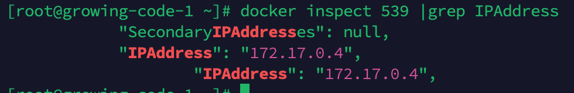

# 入门篇


## 初试容器

### Docker 的诞生

PyCon2013 大会之后，许多人都意识到了容器的价值和重要性，发现它能够解决困扰了云厂商多年的打包、部署、管理、运维等问题，Docker 也就迅速流行起来，成为了 GitHub 上的明星项目。然后在几个月的时间里，Docker 更是吸引了 Amazon、Google、Red Hat 等大公司的关注，这些公司利用自身的技术背景，纷纷在容器概念上大做文章，最终成就了我们今天所看到的至尊王者 Kubernetes 的出现。


### docker安装

安装Docker Engine


### docker的使用


### docker的架构

下图描述了 Docker Engine 的内部角色和工作流程


在客户端通过docker命令，与后台服务Docker daemon通信，而镜像储存在远程仓库里。Docker daemon 负责从远端拉取镜像、在本地存储镜像，还有从镜像生成容器、管理容器等所有功能。

官方提供一个demo

```bash
docker run hello-world
```

它会先检查本地镜像，如果没有就从远程仓库拉取，再运行容器，最后输出运行信息：


## 容器的本质——被隔离的进程

广义上来说，容器技术是动态的容器、静态的镜像和远端的仓库这三者的组合。

### 容器到底是什么

从字面上来看，容器就是 Container，就像是现实中的集装箱，一旦打包完成之后，就可以从一个地方迁移到任意的其他地方。相比散装形式而言，集装箱隔离了箱内箱外两个世界，保持了货物的原始形态，避免了内外部相互干扰，极大地简化了商品的存储、运输、管理等工作。

容器，就是一个特殊的隔离环境，它能够让进程只看到这个环境里的有限信息，不能对外界环境施加影响。


### 为什么要隔离

- 系统安全
  - 使用容器技术，我们就可以让应用程序运行在一个有严密防护的“沙盒”（Sandbox）环境之内。避免无意的 Bug 导致信息泄漏或者其他安全事故。
- 资源分配
  - 容器技术的另一个本领就是为应用程序加上资源隔离，在系统里切分出一部分资源，让它只能使用指定的配额。避免容器内进程过度消耗系统资源。

### 与虚拟机的区别

#### 目的

容器和虚拟机的目的都是隔离资源，保证系统安全，然后是尽量提高资源的利用率。

#### 虚拟化原理

- 虚拟机虚拟化出来的是硬件，需要在上面再安装一个操作系统后才能够运行应用程序，而硬件虚拟化和操作系统都比较“重”。不过好处就是隔离程度非常高，每个虚拟机之间可以做到完全无干扰。
- docker的容器直接利用了下层的计算机硬件和操作系统，因为比虚拟机少了一层，所以自然就会节约 CPU 和内存。因为多个容器共用操作系统内核，应用程序的隔离程度就没有虚拟机那么高了。

#### 运行效率

是容器相比于虚拟机最大的优势。


#### 不互相排斥

虚拟机和容器这两种技术也不是互相排斥的，它们完全可以结合起来使用，就像我们的课程里一样，用虚拟机实现与宿主机的强隔离，然后在虚拟机里使用 Docker 容器来快速运行应用程序。


### 隔离是怎么实现的

虚拟机使用的是 Hypervisor（KVM、Xen 等），那么，容器是怎么实现和下层计算机硬件和操作系统交互的呢？为什么它会具有高效轻便的隔离特性呢？

Linux 操作系统内核之中，为资源隔离提供了三种技术：namespace、cgroup、chroot，虽然这三种技术的初衷并不是为了实现容器，但它们三个结合在一起就会发生奇妙的“化学反应”。

- namespace 是 2002 年从 Linux 2.4.19 开始出现的，和编程语言里的 namespace 有点类似，它可以创建出独立的文件系统、主机名、进程号、网络等资源空间，相当于给进程盖了一间小板房，这样就实现了系统全局资源和进程局部资源的隔离。
- cgroup 是 2008 年从 Linux 2.6.24 开始出现的，它的全称是 Linux Control Group，用来实现对进程的 CPU、内存等资源的优先级和配额限制，相当于给进程的小板房加了一个天花板。
- chroot 的历史则要比前面的 namespace、cgroup 要古老得多，早在 1979 年的 UNIX V7 就已经出现了，它可以更改进程的根目录，也就是限制访问文件系统，相当于给进程的小板房铺上了地砖。


## 容器化的应用

容器就是被隔离的进程。

### 什么是容器化的应用

容器技术里的镜像也是同样的道理。因为容器是由操作系统动态创建的，那么必然就可以用一种办法**把它的初始环境给固化下来，保存成一个静态的文件**，相当于是把容器给“拍扁”了，这样就可以非常方便地存放、传输、版本化管理了。

镜像是只读的。

从功能上来看，镜像和常见的 tar、rpm、deb 等安装包一样，都打包了应用程序，但最大的不同点在于它里面**不仅有基本的可执行文件，还有应用运行时的整个系统环境。**这就让镜像具有了非常好的跨平台便携性和兼容性。

所谓的“**容器化的应用**”，或者“应用的容器化”，**就是指应用程序不再直接和操作系统打交道，而是封装成镜像，再交给容器环境去运行。**

镜像就是静态的应用容器，容器就是动态的应用镜像。

### 常用的镜像操作有哪些


docker pull 从远端仓库拉取镜像，docker images 列出当前本地已有的镜像。

镜像的完整名字由两个部分组成，名字和标签，中间用 : 连接起来。有一个比较特殊的标签叫“latest”，它是默认的标签，如果只提供名字没有附带标签，那么就会使用这个默认的“latest”标签。


IMAGE ID是镜像唯一的标识。

IMAGE ID 还有一个好处，因为它是十六进制形式且唯一，Docker 特意为它提供了“短路”操作，在本地使用镜像的时候，我们不用像名字那样要完全写出来这一长串数字，通常只需要写出前三位就能够快速定位，在镜像数量比较少的时候用两位甚至一位数字也许就可以了。


docker rmi ，它用来删除不再使用的镜像。


### 常用的容器操作有哪些


**docker run** 命令把这些静态的应用（镜像）运行起来，变成动态的容器了。

基本的格式是“docker run 设置参数”，再跟上“镜像名或 ID”，后面可能还会有附加的“运行命令”。比如这个命令：

```bash
docker run -h srv alpine hostname
```

几个最常用的参数。

- -it 表示开启一个交互式操作的 Shell，这样可以直接进入容器内部，就好像是登录虚拟机一样。（它实际上是“-i”和“-t”两个参数的组合形式）
- -d 表示让容器在后台运行，这在我们启动 Nginx、Redis 等服务器程序的时候非常有用。
- --name 可以为容器起一个名字，方便我们查看，不过它不是必须的，如果不用这个参数，Docker 会分配一个随机的名字。

**docker ps** 命令来查看容器的运行状态

对于正在运行中的容器，我们可以使用 **docker exec** 命令在里面执行另一个程序。它最常见的用法是使用 -it 参数打开一个 Shell，从而进入容器内部，例如：

```bash
docker exec -it red_srv sh
```

**docker stop** 命令来强制停止容器，可以使用容器名字，也可以用“CONTAINER ID”的前三位数字。

容器被停止后使用 docker ps 命令就看不到了。-a 命令查看系统里所有的容器，当然也包括已经停止运行的容器。

停止运行的容器可以用 **docker start** 再次启动运行，如果你确定不再需要它们，可以使用 **docker rm** 命令来彻底删除，只删除容器不删除镜像。

docker run 命令的时候加上一个 **--rm** 参数，这就会告诉 Docker 不保存容器，只要运行完毕就自动清除，省去了我们手工管理容器的麻烦。


## 创建容器镜像——编写Dockerfile

### 镜像的内部机制是什么

容器镜像内部并不是一个平坦的结构，而是由许多的镜像层组成的，每层都是只读不可修改的一组文件，相同的层可以在镜像之间共享，然后多个层像搭积木一样堆叠起来，再使用一种叫“Union FS 联合文件系统”的技术把它们合并在一起，就形成了容器最终看到的文件系统。


docker inspect 来查看镜像的分层信息

```bash
docker inspect nginx:alpine
```

它的分层信息在“RootFS”部分：


通过这张截图就可以看到，nginx:alpine 镜像里一共有 6 个 Layer。

### Dockerfile 是什么

Dockerfile 是一个纯文本，里面记录了一系列的构建指令，比如选择基础镜像、拷贝文件、运行脚本等等，每个指令都会生成一个 Layer，而 Docker 顺序执行这个文件里的所有步骤，最后就会创建出一个新的镜像出来。

来一个简单实例

```bash
# Dockerfile.busybox
FROM busybox                  # 选择基础镜像
CMD echo "hello world"        # 启动容器时默认运行的命令
```

第一条指令是 FROM，所有的 Dockerfile 都要从它开始，表示选择构建使用的基础镜像，相当于“打地基”，这里我们使用的是 busybox。

第二条指令是 CMD，它指定 docker run 启动容器时默认运行的命令，这里我们使用了 echo 命令，输出“hello world”字符串。

docker build 命令来创建出镜像。注意命令的格式，用 -f 参数指定 Dockerfile 文件名，后面必须跟一个文件路径，叫做“构建上下文”（build’s context）。

```bash
docker build -f Dockerfile.busybox .

Sending build context to Docker daemon   7.68kB
Step 1/2 : FROM busybox
 ---> d38589532d97
Step 2/2 : CMD echo "hello world"
 ---> Running in c5a762edd1c8
Removing intermediate container c5a762edd1c8
 ---> b61882f42db7
Successfully built b61882f42db7
```


### 怎样编写正确、高效的 Dockerfile

因为构建镜像的第一条指令必须是 FROM，所以基础镜像的选择非常关键。如果关注的是镜像的安全和大小，那么一般会选择 Alpine；如果关注的是应用的运行稳定性，那么可能会选择 Ubuntu、Debian、CentOS。

```bash
FROM alpine:3.15                # 选择Alpine镜像
FROM ubuntu:bionic              # 选择Ubuntu镜像
```


可以使用 COPY 命令，它的用法和 Linux 的 cp 差不多，不过拷贝的源文件必须是“构建上下文”路径里的，不能随意指定文件。也就是说，如果要从本机向镜像拷贝文件，就必须把这些文件放到一个专门的目录，然后在 docker build 里指定“构建上下文”到这个目录才行。

```bash
COPY ./a.txt  /tmp/a.txt    # 把构建上下文里的a.txt拷贝到镜像的/tmp目录
COPY /etc/hosts  /tmp       # 错误！不能使用构建上下文之外的文件
```


RUN ，可以执行任意的 Shell 命令。通常会是 Dockerfile 里最复杂的指令，会包含很多的 Shell 命令，但 Dockerfile 里一条指令只能是一行，所以有的 RUN 指令会在每行的末尾使用续行符 \，命令之间也会用 && 来连接，这样保证在逻辑上是一行。

```bash
RUN apt-get update \
    && apt-get install -y \
        build-essential \
        curl \
        make \
        unzip \
    && cd /tmp \
    && curl -fSL xxx.tar.gz -o xxx.tar.gz\
    && tar xzf xxx.tar.gz \
    && cd xxx \
    && ./config \
    && make \
    && make clean
```


可以把这些 Shell 命令集中到一个脚本文件里，用 COPY 命令拷贝进去再用 RUN 来执行。

```bash
COPY setup.sh  /tmp/                # 拷贝脚本到/tmp目录

RUN cd /tmp && chmod +x setup.sh \  # 添加执行权限
    && ./setup.sh && rm setup.sh    # 运行脚本然后再删除
```


Dockerfile可以通过ARG和ENV创建变量。ARG 创建的变量只在镜像构建过程中可见，容器运行时不可见，而 ENV 创建的变量不仅能够在构建镜像的过程中使用，在容器运行时也能够以环境变量的形式被应用程序使用。

```bash
ARG IMAGE_BASE="node"
ARG IMAGE_TAG="alpine"

ENV PATH=$PATH:/tmp
ENV DEBUG=OFF
```

EXPOSE，它用来声明容器对外服务的端口号，对现在基于 Node.js、Tomcat、Nginx、Go 等开发的微服务系统来说非常有用：

```bash
EXPOSE 443           # 默认是tcp协议
EXPOSE 53/udp        # 可以指定udp协议
```


**每个指令都会生成一个镜像层，尽量精简合并，否则太多的层会导致镜像臃肿不堪。**


### docker build 是怎么工作的

Dockerfile 必须要经过 docker build才能生效，其中的构建上下文指定的路径作为打包镜像时依赖的文件，可以通过在路径中建立一个 .dockerignore 文件来忽略不需要的文件。

.dockerignore的例子

```bash
# docker ignore
*.swp
*.sh
```

docker build 通过-f指定文件，如果不指定则默认处理名字是 Dockerfile 的文件。

docker build 通过-t 参数指定生成镜像的名称。名字应该符合规范，用:分割名称和tag，如果没有tag，默认为latest


## 镜像仓库Docker Hub

### 什么是镜像仓库


右边的区域就是镜像仓库，术语叫 Registry。就像是手机应用商店。

### 什么是 Docker Hub

在不指定镜像仓库时，就会使用默认的镜像仓库Docker Hub（https://hub.docker.com/）。

Docker Hub 里面不仅有 Docker 自己打包的镜像，而且还对公众免费开放，任何人都可以上传自己的作品。

### 如何在 Docker Hub 上挑选镜像

在 Docker Hub 上有官方镜像、认证镜像和非官方镜像的区别。

- 有一个特殊的“Official image”的标记，这就表示这个镜像经过了 Docker 公司的认证，有专门的团队负责审核、发布和更新，质量上绝对可以放心。
- 标记是“Verified publisher”，也就是认证发行商，比如 Bitnami、Rancher、Ubuntu 等。它们都是颇具规模的大公司，具有不逊于 Docker 公司的实力，所以就在 Docker Hub 上开了个认证账号，发布自己打包的镜像
- 非官方镜像
  - 有些公司不想交钱来认证发行商，以非官方镜像的形式发布。要鉴别和小心。
  - 真正的非官方镜像，质量上难以得到保证，下载的时候需要小心谨慎。看它的下载量、星数、还有更新历史

### Docker Hub上镜像的命名规则

Docker Hub的命名规则采用用户名/应用名的形式，比如 bitnami/nginx、ubuntu/nginx、rancher/nginx 等等。docker pull 下载这些非官方镜像的时候，就必须把用户名也带上，否则默认就会使用官方镜像。

不同的版本通过标签（tag）来区分，默认标签为latest。

通常来说，镜像标签的格式是应用的版本号加上操作系统。版本号基本上都是主版本号 + 次版本号 + 补丁号的形式。

有的标签还会加上 slim、fat，来进一步表示这个镜像的内容是经过精简的，还是包含了较多的辅助工具。


### 怎么自己上传镜像

四步

1. 第一步，你需要在 Docker Hub 上注册一个用户，这个就不必再多说了。
2. 第二步，你需要在本机上使用 docker login 命令，用刚才注册的用户名和密码认证身份登录
3. 第三步很关键，需要使用 docker tag 命令，给镜像改成带用户名的完整名字，表示镜像是属于这个用户的。或者简单一点，直接用 docker build -t 在创建镜像的时候就起好名字。
4. 第四步，用 docker push 把这个镜像推上去，我们的镜像发布工作就大功告成了


### 离线环境

最佳的方法就是在内网环境里仿造 Docker Hub，创建一个自己的私有 Registry 服务，由它来管理我们的镜像，就像我们自己搭建 GitLab 做版本管理一样。

还有一种原始的方法：手动打包镜像

Docker 提供了 save 和 load 这两个镜像归档命令，可以把镜像导出成压缩包，或者从压缩包导入 Docker，而压缩包是非常容易保管和传输的，可以联机拷贝，FTP 共享，甚至存在 U 盘上随身携带。

需要注意的是，这两个命令默认使用标准流作为输入输出（为了方便 Linux 管道操作），所以一般会用 -o、-i 参数来使用文件的形式，例如：

```bash
docker save ngx-app:latest -o ngx.tar
docker load -i ngx.tar
```


## 容器如何与外界互联互通

容器需要与外界相连提供服务。

### 如何拷贝容器内的数据

Docker 提供的 cp 命令，它可以在宿主机和容器之间拷贝文件，是最基本的一种数据交换功能。

docker cp 指定源路径和目标路径。如果是容器内的路径要指定**容器名或者容器 ID**。

```bash
docker cp a.txt 062:/tmp
```


### 如何共享主机上的文件

虚拟机有一种“共享目录”的功能。它可以在宿主机上开一个目录，然后把这个目录“挂载”进虚拟机，这样就实现了两者共享同一个目录，一边对目录里文件的操作另一边立刻就能看到，没有了数据拷贝，效率自然也会高很多。

容器也提供了这样的共享宿主机目录的功能。docker run 命令启动容器的时候使用 -v 参数就行，具体的格式是“宿主机路径: 容器内路径”。

例如

```bash
docker run -d --rm -v /tmp:/tmp redis
```


### 如何实现网络互通

Docker 提供了三种网络模式，分别是 null、host 和 bridge。

1. null 是最简单的模式，也就是没有网络，但允许其他的网络插件来自定义网络连接

2. host 是直接使用宿主机网络，相当于去掉了容器的网络隔离，所有的容器会共享宿主机的 IP 地址和网卡。效率高但是不安全，容易端口冲突。

host 模式需要在 docker run 时使用 --net=host 参数

例如：

```bash
docker run -d --rm --net=host nginx:alpine
```

3. bridge，也就是桥接模式，容器和宿主机再通过虚拟网卡接入这个网桥（图中的 docker0），那么它们之间也就可以正常的收发网络数据包了。

可以用 --net=bridge 来启用桥接模式，但是默认网络模式就是bridge。


可以用 docker inspect 直接查看容器的 ip 地址

```bash
docker inspect xxx |grep IPAddress
```


### 如何分配服务端口号

使用host或者bridge模式都需要指定暴露的端口号。

为了缓解多个容器之间的端口号冲突，可以通过映射的方式，容器内部还是用自己的端口号，但是从外部看是另一个端口号。

端口号映射需要使用 bridge 模式，并且在 docker run 启动容器时使用 -p 参数，形式和共享目录的 -v 参数很类似，用 : 分隔本机端口和容器端口。

例如如果要启动两个 Nginx 容器，分别跑在 80 和 8080 端口上：

```bash
docker run -d -p 80:80 --rm nginx:alpine
docker run -d -p 8080:80 --rm nginx:alpine
```

使用 **docker ps** 命令能够在**“PORTS”**栏里更直观地看到端口的映射情况：


## 实战演练


### 搭建私有镜像仓库


### 搭建WrodPress网站

简单的网络架构图


网站需要用到三个容器：WordPress、MariaDB、Nginx，直接使用 docker pull 拉取它们的镜像

```bash
docker pull wordpress:5
docker pull mariadb:10
docker pull nginx:alpine
```


#### 先来运行 MariaDB

根据说明文档，需要配置“MARIADB_DATABASE”等几个环境变量，用 --env 参数来指定启动时的数据库、用户名和密码，这里我指定数据库是“db”，用户名是“wp”，密码是“123”，管理员密码（root password）也是“123”。

命令：

```bash
docker run -d --rm \
    --env MARIADB_DATABASE=db \
    --env MARIADB_USER=qdw \
    --env MARIADB_PASSWORD=123321 \
    --env MARIADB_ROOT_PASSWORD=123321 \
    mariadb:10
```


进入容器验证下数据库

```bash
docker exec -it 68b mysql -u qdw -p
```


查看容器的ip地址：

```bash
docker inspect 68b |grep IPAddress
```


"IPAddress": "172.17.0.3"

#### 运行WordPress

```bash
docker run -d --rm \
    --env WORDPRESS_DB_HOST=172.17.0.3 \
    --env WORDPRESS_DB_USER=qdw \
    --env WORDPRESS_DB_PASSWORD=123321 \
    --env WORDPRESS_DB_NAME=db \
    wordpress:5
```

查看容器的ip地址：

```bash
docker inspect 539 |grep IPAddress
```



"IPAddress": "172.17.0.4"

#### 运行Nginx

没有为WP配置映射端口号，我们用Nginx配置反向代理，把请求转发给WP的80端口。这里需要WP的IP地址。

写出配置文件如下：

```bash
server {
  listen 80;
  default_type text/html;

  location / {
      proxy_http_version 1.1;
      proxy_set_header Host $host;
      proxy_pass http://172.17.0.4;
  }
}
```

启动Nginx，用-p把本机的端口映射到Nginx容器的80端口，然后用-v把配置文件挂在到Nginx的conf.d目录下。

```bash
docker run -d --rm \
    -p 8080:80 \
    -v ./wp-nginx.conf:/etc/nginx/conf.d/default.conf \
    nginx:alpine
```


登录成功


# 初级篇


## 走进云原生：搭建Kubernetes环境

### 什么是容器编排

容器技术开启了云原生时代，但它也只走出了一小步，还要面临容器之间相互协作的问题。

这些容器之上的管理、调度工作，就是这些年最流行的词汇：**“容器编排”**（Container Orchestration）。

### 什么是Kubernetes

>作为最大的搜索引擎，Google 拥有数量庞大的服务器集群，为了提高资源利用率和部署运维效率，它专门开发了一个集群应用管理系统，代号 Borg，在底层支持整个公司的运转。
>
>2014 年，Google 内部系统要“升级换代”，从原来的 Borg 切换到 Omega，于是按照惯例，Google 会发表公开论文。
>
>因为之前在发表 MapReduce、BigTable、GFS 时吃过亏（被 Yahoo 开发的 Hadoop 占领了市场），所以 Google 决定借着 Docker 的“东风”，在发论文的同时，把 C++ 开发的 Borg 系统用 Go 语言重写并开源，于是 Kubernetes 就这样诞生了。
>
>由于 Kubernetes 背后有 Borg 系统十多年生产环境经验的支持，技术底蕴深厚，理论水平也非常高，一经推出就引起了轰动。然后在 2015 年，Google 又联合 Linux 基金会成立了 CNCF（Cloud Native Computing Foundation，云原生基金会），并把 Kubernetes 捐献出来作为种子项目。

简单来说，**Kubernetes 就是一个生产级别的容器编排平台和集群管理系统**，不仅能够创建、调度容器，还能够监控、管理服务器，它凝聚了 Google 等大公司和开源社区的集体智慧，从而让中小型公司也可以具备轻松运维海量计算节点——也就是“云计算”的能力。


### 什么是 minikube

Kubernetes 提供了一些快速搭建 Kubernetes 环境的工具来学习这个系统，在官网（https://kubernetes.io/zh/docs/tasks/tools/）上推荐的有两个：**kind 和 minikube**，它们都可以在本机上运行完整的 Kubernetes 环境。

- kind

kind 基于 Docker，意思是“Kubernetes in Docker”。它功能少，用法简单，也因此运行速度快，容易上手。不过它缺少很多 Kubernetes 的标准功能，例如仪表盘、网络插件，也很难定制化，所以我认为它比较适合有经验的 Kubernetes 用户做快速开发测试，不太适合学习研究。

- minikube

从名字能看出来，是一个mini版的Kubernetes，自从 2016 年发布以来一直在积极地开发维护，紧跟 Kubernetes 的版本更新。

minikube 最大特点就是“小而美”，可执行文件仅有不到 100MB，运行镜像也不过 1GB，但就在这么小的空间里却集成了 Kubernetes 的绝大多数功能特性，不仅有核心的容器编排功能，还有丰富的插件

### 如何搭建minikube环境

minikube 支持 Mac、Windows、Linux 这三种主流平台。

安装命令

```bash
# Intel x86_64
curl -Lo minikube https://storage.googleapis.com/minikube/releases/latest/minikube-linux-amd64

# Apple arm64
curl -Lo minikube https://storage.googleapis.com/minikube/releases/latest/minikube-linux-arm64

sudo install minikube /usr/local/bin/
```

安装完成之后，你可以执行命令 minikube version，看看它的版本号。

不过 minikube 只能够搭建 Kubernetes 环境，要操作 Kubernetes，还需要另一个专门的客户端工具“kubectl”。

kubectl 的作用有点类似之前我们学习容器技术时候的工具“docker”，它也是一个命令行工具，作用也比较类似，同样是与 Kubernetes 后台服务通信，把我们的命令转发给 Kubernetes，实现容器和集群的管理功能。

kubectl 是一个与 Kubernetes、minikube 彼此独立的项目，所以不包含在 minikube 里，但 minikube 提供了安装它的简化方式，你只需执行下面的这条命令：

```bash
minikube kubectl
```

它就会把与当前 Kubernetes 版本匹配的 kubectl 下载下来，存放在内部目录（例如 .minikube/cache/linux/arm64/v1.23.3），然后我们就可以使用它来对 Kubernetes“发号施令”了。

在 minikube 环境里，我们会用到两个客户端：**minikube 管理 Kubernetes 集群环境，kubectl 操作实际的 Kubernetes 功能**。


### 验证minikube环境


