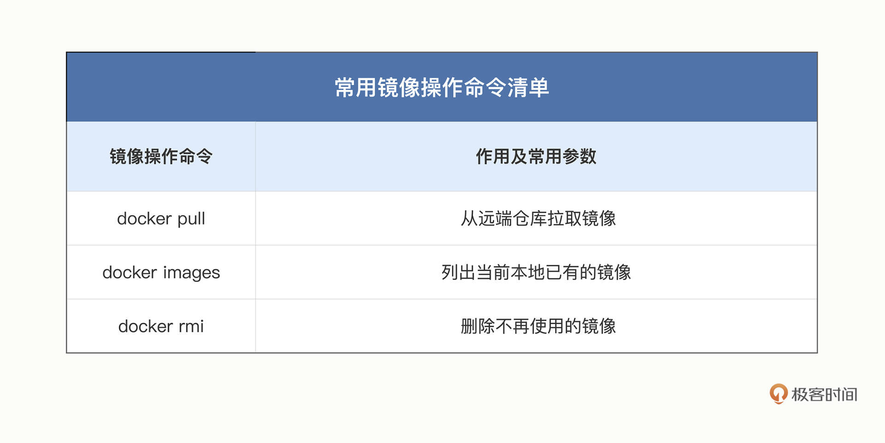
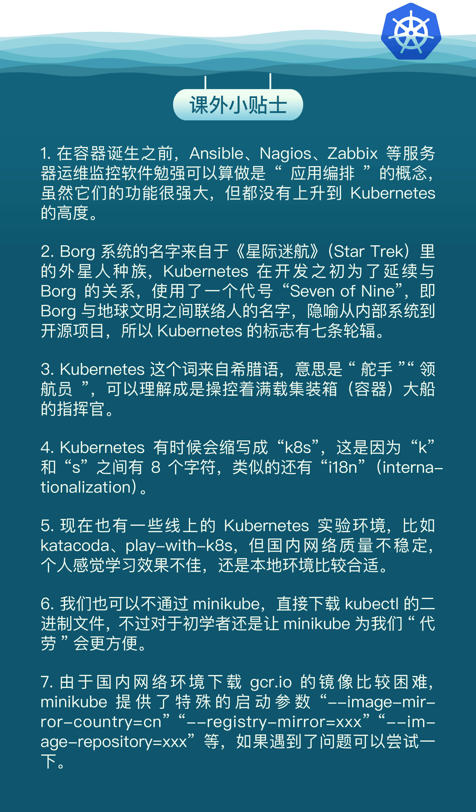
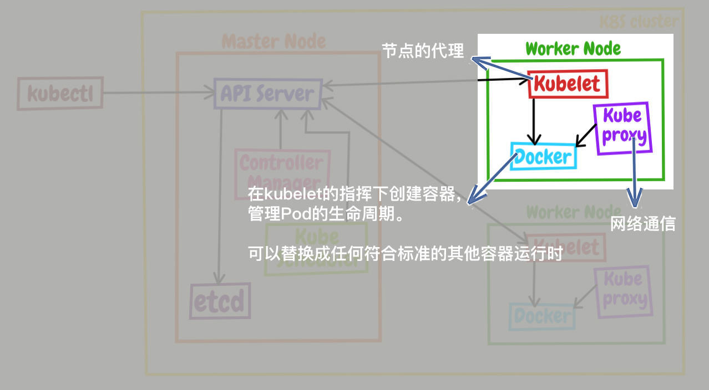

# 入门篇


## 初试容器

### Docker 的诞生

PyCon2013 大会之后，许多人都意识到了容器的价值和重要性，发现它能够解决困扰了云厂商多年的打包、部署、管理、运维等问题，Docker 也就迅速流行起来，成为了 GitHub 上的明星项目。然后在几个月的时间里，Docker 更是吸引了 Amazon、Google、Red Hat 等大公司的关注，这些公司利用自身的技术背景，纷纷在容器概念上大做文章，最终成就了我们今天所看到的至尊王者 Kubernetes 的出现。


### docker安装

安装Docker Engine


### docker的使用


### docker的架构

下图描述了 Docker Engine 的内部角色和工作流程


在客户端通过docker命令，与后台服务Docker daemon通信，而镜像储存在远程仓库里。Docker daemon 负责从远端拉取镜像、在本地存储镜像，还有从镜像生成容器、管理容器等所有功能。

官方提供一个demo

```bash
docker run hello-world
```

它会先检查本地镜像，如果没有就从远程仓库拉取，再运行容器，最后输出运行信息：


## 容器的本质——被隔离的进程

广义上来说，容器技术是动态的容器、静态的镜像和远端的仓库这三者的组合。

### 容器到底是什么

从字面上来看，容器就是 Container，就像是现实中的集装箱，一旦打包完成之后，就可以从一个地方迁移到任意的其他地方。相比散装形式而言，集装箱隔离了箱内箱外两个世界，保持了货物的原始形态，避免了内外部相互干扰，极大地简化了商品的存储、运输、管理等工作。

容器，就是一个特殊的隔离环境，它能够让进程只看到这个环境里的有限信息，不能对外界环境施加影响。


### 为什么要隔离

- 系统安全
  - 使用容器技术，我们就可以让应用程序运行在一个有严密防护的“沙盒”（Sandbox）环境之内。避免无意的 Bug 导致信息泄漏或者其他安全事故。
- 资源分配
  - 容器技术的另一个本领就是为应用程序加上资源隔离，在系统里切分出一部分资源，让它只能使用指定的配额。避免容器内进程过度消耗系统资源。

### 与虚拟机的区别

#### 目的

容器和虚拟机的目的都是隔离资源，保证系统安全，然后是尽量提高资源的利用率。

#### 虚拟化原理

- 虚拟机虚拟化出来的是硬件，需要在上面再安装一个操作系统后才能够运行应用程序，而硬件虚拟化和操作系统都比较“重”。不过好处就是隔离程度非常高，每个虚拟机之间可以做到完全无干扰。
- docker的容器直接利用了下层的计算机硬件和操作系统，因为比虚拟机少了一层，所以自然就会节约 CPU 和内存。因为多个容器共用操作系统内核，应用程序的隔离程度就没有虚拟机那么高了。

#### 运行效率

是容器相比于虚拟机最大的优势。


#### 不互相排斥

虚拟机和容器这两种技术也不是互相排斥的，它们完全可以结合起来使用，就像我们的课程里一样，用虚拟机实现与宿主机的强隔离，然后在虚拟机里使用 Docker 容器来快速运行应用程序。


### 隔离是怎么实现的

虚拟机使用的是 Hypervisor（KVM、Xen 等），那么，容器是怎么实现和下层计算机硬件和操作系统交互的呢？为什么它会具有高效轻便的隔离特性呢？

Linux 操作系统内核之中，为资源隔离提供了三种技术：namespace、cgroup、chroot，虽然这三种技术的初衷并不是为了实现容器，但它们三个结合在一起就会发生奇妙的“化学反应”。

- namespace 是 2002 年从 Linux 2.4.19 开始出现的，和编程语言里的 namespace 有点类似，它可以创建出独立的文件系统、主机名、进程号、网络等资源空间，相当于给进程盖了一间小板房，这样就实现了系统全局资源和进程局部资源的隔离。
- cgroup 是 2008 年从 Linux 2.6.24 开始出现的，它的全称是 Linux Control Group，用来实现对进程的 CPU、内存等资源的优先级和配额限制，相当于给进程的小板房加了一个天花板。
- chroot 的历史则要比前面的 namespace、cgroup 要古老得多，早在 1979 年的 UNIX V7 就已经出现了，它可以更改进程的根目录，也就是限制访问文件系统，相当于给进程的小板房铺上了地砖。


## 容器化的应用

容器就是被隔离的进程。

### 什么是容器化的应用

容器技术里的镜像也是同样的道理。因为容器是由操作系统动态创建的，那么必然就可以用一种办法**把它的初始环境给固化下来，保存成一个静态的文件**，相当于是把容器给“拍扁”了，这样就可以非常方便地存放、传输、版本化管理了。

镜像是只读的。

从功能上来看，镜像和常见的 tar、rpm、deb 等安装包一样，都打包了应用程序，但最大的不同点在于它里面**不仅有基本的可执行文件，还有应用运行时的整个系统环境。**这就让镜像具有了非常好的跨平台便携性和兼容性。

所谓的“**容器化的应用**”，或者“应用的容器化”，**就是指应用程序不再直接和操作系统打交道，而是封装成镜像，再交给容器环境去运行。**

镜像就是静态的应用容器，容器就是动态的应用镜像。

### 常用的镜像操作有哪些



docker pull 从远端仓库拉取镜像，docker images 列出当前本地已有的镜像。

镜像的完整名字由两个部分组成，名字和标签，中间用 : 连接起来。有一个比较特殊的标签叫“latest”，它是默认的标签，如果只提供名字没有附带标签，那么就会使用这个默认的“latest”标签。


IMAGE ID是镜像唯一的标识。

IMAGE ID 还有一个好处，因为它是十六进制形式且唯一，Docker 特意为它提供了“短路”操作，在本地使用镜像的时候，我们不用像名字那样要完全写出来这一长串数字，通常只需要写出前三位就能够快速定位，在镜像数量比较少的时候用两位甚至一位数字也许就可以了。


docker rmi ，它用来删除不再使用的镜像。


### 常用的容器操作有哪些


**docker run** 命令把这些静态的应用（镜像）运行起来，变成动态的容器了。

基本的格式是“docker run 设置参数”，再跟上“镜像名或 ID”，后面可能还会有附加的“运行命令”。比如这个命令：

```bash
docker run -h srv alpine hostname
```

几个最常用的参数。

- -it 表示开启一个交互式操作的 Shell，这样可以直接进入容器内部，就好像是登录虚拟机一样。（它实际上是“-i”和“-t”两个参数的组合形式）
- -d 表示让容器在后台运行，这在我们启动 Nginx、Redis 等服务器程序的时候非常有用。
- --name 可以为容器起一个名字，方便我们查看，不过它不是必须的，如果不用这个参数，Docker 会分配一个随机的名字。

**docker ps** 命令来查看容器的运行状态

对于正在运行中的容器，我们可以使用 **docker exec** 命令在里面执行另一个程序。它最常见的用法是使用 -it 参数打开一个 Shell，从而进入容器内部，例如：

```bash
docker exec -it red_srv sh
```

**docker stop** 命令来强制停止容器，可以使用容器名字，也可以用“CONTAINER ID”的前三位数字。

容器被停止后使用 docker ps 命令就看不到了。-a 命令查看系统里所有的容器，当然也包括已经停止运行的容器。

停止运行的容器可以用 **docker start** 再次启动运行，如果你确定不再需要它们，可以使用 **docker rm** 命令来彻底删除，只删除容器不删除镜像。

docker run 命令的时候加上一个 **--rm** 参数，这就会告诉 Docker 不保存容器，只要运行完毕就自动清除，省去了我们手工管理容器的麻烦。


## 创建容器镜像——编写Dockerfile

### 镜像的内部机制是什么

容器镜像内部并不是一个平坦的结构，而是由许多的镜像层组成的，每层都是只读不可修改的一组文件，相同的层可以在镜像之间共享，然后多个层像搭积木一样堆叠起来，再使用一种叫“Union FS 联合文件系统”的技术把它们合并在一起，就形成了容器最终看到的文件系统。


docker inspect 来查看镜像的分层信息

```bash
docker inspect nginx:alpine
```

它的分层信息在“RootFS”部分：


通过这张截图就可以看到，nginx:alpine 镜像里一共有 6 个 Layer。

### Dockerfile 是什么

Dockerfile 是一个纯文本，里面记录了一系列的构建指令，比如选择基础镜像、拷贝文件、运行脚本等等，每个指令都会生成一个 Layer，而 Docker 顺序执行这个文件里的所有步骤，最后就会创建出一个新的镜像出来。

来一个简单实例

```bash
# Dockerfile.busybox
FROM busybox                  # 选择基础镜像
CMD echo "hello world"        # 启动容器时默认运行的命令
```

第一条指令是 FROM，所有的 Dockerfile 都要从它开始，表示选择构建使用的基础镜像，相当于“打地基”，这里我们使用的是 busybox。

第二条指令是 CMD，它指定 docker run 启动容器时默认运行的命令，这里我们使用了 echo 命令，输出“hello world”字符串。

docker build 命令来创建出镜像。注意命令的格式，用 -f 参数指定 Dockerfile 文件名，后面必须跟一个文件路径，叫做“构建上下文”（build’s context）。

```bash
docker build -f Dockerfile.busybox .

Sending build context to Docker daemon   7.68kB
Step 1/2 : FROM busybox
 ---> d38589532d97
Step 2/2 : CMD echo "hello world"
 ---> Running in c5a762edd1c8
Removing intermediate container c5a762edd1c8
 ---> b61882f42db7
Successfully built b61882f42db7
```


### 怎样编写正确、高效的 Dockerfile

因为构建镜像的第一条指令必须是 FROM，所以基础镜像的选择非常关键。如果关注的是镜像的安全和大小，那么一般会选择 Alpine；如果关注的是应用的运行稳定性，那么可能会选择 Ubuntu、Debian、CentOS。

```bash
FROM alpine:3.15                # 选择Alpine镜像
FROM ubuntu:bionic              # 选择Ubuntu镜像
```


可以使用 COPY 命令，它的用法和 Linux 的 cp 差不多，不过拷贝的源文件必须是“构建上下文”路径里的，不能随意指定文件。也就是说，如果要从本机向镜像拷贝文件，就必须把这些文件放到一个专门的目录，然后在 docker build 里指定“构建上下文”到这个目录才行。

```bash
COPY ./a.txt  /tmp/a.txt    # 把构建上下文里的a.txt拷贝到镜像的/tmp目录
COPY /etc/hosts  /tmp       # 错误！不能使用构建上下文之外的文件
```


RUN ，可以执行任意的 Shell 命令。通常会是 Dockerfile 里最复杂的指令，会包含很多的 Shell 命令，但 Dockerfile 里一条指令只能是一行，所以有的 RUN 指令会在每行的末尾使用续行符 \，命令之间也会用 && 来连接，这样保证在逻辑上是一行。

```bash
RUN apt-get update \
    && apt-get install -y \
        build-essential \
        curl \
        make \
        unzip \
    && cd /tmp \
    && curl -fSL xxx.tar.gz -o xxx.tar.gz\
    && tar xzf xxx.tar.gz \
    && cd xxx \
    && ./config \
    && make \
    && make clean
```


可以把这些 Shell 命令集中到一个脚本文件里，用 COPY 命令拷贝进去再用 RUN 来执行。

```bash
COPY setup.sh  /tmp/                # 拷贝脚本到/tmp目录

RUN cd /tmp && chmod +x setup.sh \  # 添加执行权限
    && ./setup.sh && rm setup.sh    # 运行脚本然后再删除
```


Dockerfile可以通过ARG和ENV创建变量。ARG 创建的变量只在镜像构建过程中可见，容器运行时不可见，而 ENV 创建的变量不仅能够在构建镜像的过程中使用，在容器运行时也能够以环境变量的形式被应用程序使用。

```bash
ARG IMAGE_BASE="node"
ARG IMAGE_TAG="alpine"

ENV PATH=$PATH:/tmp
ENV DEBUG=OFF
```

EXPOSE，它用来声明容器对外服务的端口号，对现在基于 Node.js、Tomcat、Nginx、Go 等开发的微服务系统来说非常有用：

```bash
EXPOSE 443           # 默认是tcp协议
EXPOSE 53/udp        # 可以指定udp协议
```


**每个指令都会生成一个镜像层，尽量精简合并，否则太多的层会导致镜像臃肿不堪。**


### docker build 是怎么工作的

Dockerfile 必须要经过 docker build才能生效，其中的构建上下文指定的路径作为打包镜像时依赖的文件，可以通过在路径中建立一个 .dockerignore 文件来忽略不需要的文件。

.dockerignore的例子

```bash
# docker ignore
*.swp
*.sh
```

docker build 通过-f指定文件，如果不指定则默认处理名字是 Dockerfile 的文件。

docker build 通过-t 参数指定生成镜像的名称。名字应该符合规范，用:分割名称和tag，如果没有tag，默认为latest


## 镜像仓库Docker Hub

### 什么是镜像仓库


右边的区域就是镜像仓库，术语叫 Registry。就像是手机应用商店。

### 什么是 Docker Hub

在不指定镜像仓库时，就会使用默认的镜像仓库Docker Hub（https://hub.docker.com/）。

Docker Hub 里面不仅有 Docker 自己打包的镜像，而且还对公众免费开放，任何人都可以上传自己的作品。

### 如何在 Docker Hub 上挑选镜像

在 Docker Hub 上有官方镜像、认证镜像和非官方镜像的区别。

- 有一个特殊的“Official image”的标记，这就表示这个镜像经过了 Docker 公司的认证，有专门的团队负责审核、发布和更新，质量上绝对可以放心。
- 标记是“Verified publisher”，也就是认证发行商，比如 Bitnami、Rancher、Ubuntu 等。它们都是颇具规模的大公司，具有不逊于 Docker 公司的实力，所以就在 Docker Hub 上开了个认证账号，发布自己打包的镜像
- 非官方镜像
  - 有些公司不想交钱来认证发行商，以非官方镜像的形式发布。要鉴别和小心。
  - 真正的非官方镜像，质量上难以得到保证，下载的时候需要小心谨慎。看它的下载量、星数、还有更新历史

### Docker Hub上镜像的命名规则

Docker Hub的命名规则采用用户名/应用名的形式，比如 bitnami/nginx、ubuntu/nginx、rancher/nginx 等等。docker pull 下载这些非官方镜像的时候，就必须把用户名也带上，否则默认就会使用官方镜像。

不同的版本通过标签（tag）来区分，默认标签为latest。

通常来说，镜像标签的格式是应用的版本号加上操作系统。版本号基本上都是主版本号 + 次版本号 + 补丁号的形式。

有的标签还会加上 slim、fat，来进一步表示这个镜像的内容是经过精简的，还是包含了较多的辅助工具。


### 怎么自己上传镜像

四步

1. 第一步，你需要在 Docker Hub 上注册一个用户，这个就不必再多说了。
2. 第二步，你需要在本机上使用 docker login 命令，用刚才注册的用户名和密码认证身份登录
3. 第三步很关键，需要使用 docker tag 命令，给镜像改成带用户名的完整名字，表示镜像是属于这个用户的。或者简单一点，直接用 docker build -t 在创建镜像的时候就起好名字。
4. 第四步，用 docker push 把这个镜像推上去，我们的镜像发布工作就大功告成了


### 离线环境

最佳的方法就是在内网环境里仿造 Docker Hub，创建一个自己的私有 Registry 服务，由它来管理我们的镜像，就像我们自己搭建 GitLab 做版本管理一样。

还有一种原始的方法：手动打包镜像

Docker 提供了 save 和 load 这两个镜像归档命令，可以把镜像导出成压缩包，或者从压缩包导入 Docker，而压缩包是非常容易保管和传输的，可以联机拷贝，FTP 共享，甚至存在 U 盘上随身携带。

需要注意的是，这两个命令默认使用标准流作为输入输出（为了方便 Linux 管道操作），所以一般会用 -o、-i 参数来使用文件的形式，例如：

```bash
docker save ngx-app:latest -o ngx.tar
docker load -i ngx.tar
```


## 容器如何与外界互联互通

容器需要与外界相连提供服务。

### 如何拷贝容器内的数据

Docker 提供的 cp 命令，它可以在宿主机和容器之间拷贝文件，是最基本的一种数据交换功能。

docker cp 指定源路径和目标路径。如果是容器内的路径要指定**容器名或者容器 ID**。

```bash
docker cp a.txt 062:/tmp
```


### 如何共享主机上的文件

虚拟机有一种“共享目录”的功能。它可以在宿主机上开一个目录，然后把这个目录“挂载”进虚拟机，这样就实现了两者共享同一个目录，一边对目录里文件的操作另一边立刻就能看到，没有了数据拷贝，效率自然也会高很多。

容器也提供了这样的共享宿主机目录的功能。docker run 命令启动容器的时候使用 -v 参数就行，具体的格式是“宿主机路径: 容器内路径”。

例如

```bash
docker run -d --rm -v /tmp:/tmp redis
```


### 如何实现网络互通

Docker 提供了三种网络模式，分别是 null、host 和 bridge。

1. null 是最简单的模式，也就是没有网络，但允许其他的网络插件来自定义网络连接

2. host 是直接使用宿主机网络，相当于去掉了容器的网络隔离，所有的容器会共享宿主机的 IP 地址和网卡。效率高但是不安全，容易端口冲突。

host 模式需要在 docker run 时使用 --net=host 参数

例如：

```bash
docker run -d --rm --net=host nginx:alpine
```

3. bridge，也就是桥接模式，容器和宿主机再通过虚拟网卡接入这个网桥（图中的 docker0），那么它们之间也就可以正常的收发网络数据包了。

可以用 --net=bridge 来启用桥接模式，但是默认网络模式就是bridge。


可以用 docker inspect 直接查看容器的 ip 地址

```bash
docker inspect xxx |grep IPAddress
```


### 如何分配服务端口号

使用host或者bridge模式都需要指定暴露的端口号。

为了缓解多个容器之间的端口号冲突，可以通过映射的方式，容器内部还是用自己的端口号，但是从外部看是另一个端口号。

端口号映射需要使用 bridge 模式，并且在 docker run 启动容器时使用 -p 参数，形式和共享目录的 -v 参数很类似，用 : 分隔本机端口和容器端口。

例如如果要启动两个 Nginx 容器，分别跑在 80 和 8080 端口上：

```bash
docker run -d -p 80:80 --rm nginx:alpine
docker run -d -p 8080:80 --rm nginx:alpine
```

使用 **docker ps** 命令能够在**“PORTS”**栏里更直观地看到端口的映射情况：


## 实战演练


### 搭建私有镜像仓库


### 搭建WrodPress网站

简单的网络架构图


网站需要用到三个容器：WordPress、MariaDB、Nginx，直接使用 docker pull 拉取它们的镜像

```bash
docker pull wordpress:5
docker pull mariadb:10
docker pull nginx:alpine
```


#### 先来运行 MariaDB

根据说明文档，需要配置“MARIADB_DATABASE”等几个环境变量，用 --env 参数来指定启动时的数据库、用户名和密码，这里我指定数据库是“db”，用户名是“wp”，密码是“123”，管理员密码（root password）也是“123”。

命令：

```bash
docker run -d --rm \
    --env MARIADB_DATABASE=db \
    --env MARIADB_USER=qdw \
    --env MARIADB_PASSWORD=123321 \
    --env MARIADB_ROOT_PASSWORD=123321 \
    mariadb:10
```


进入容器验证下数据库

```bash
docker exec -it 68b mysql -u qdw -p
```


查看容器的ip地址：

```bash
docker inspect 68b |grep IPAddress
```


"IPAddress": "172.17.0.3"

#### 运行WordPress

```bash
docker run -d --rm \
    --env WORDPRESS_DB_HOST=172.17.0.3 \
    --env WORDPRESS_DB_USER=qdw \
    --env WORDPRESS_DB_PASSWORD=123321 \
    --env WORDPRESS_DB_NAME=db \
    wordpress:5
```

查看容器的ip地址：

```bash
docker inspect 539 |grep IPAddress
```


"IPAddress": "172.17.0.4"

#### 运行Nginx

没有为WP配置映射端口号，我们用Nginx配置反向代理，把请求转发给WP的80端口。这里需要WP的IP地址。

写出配置文件如下：

```bash
server {
  listen 80;
  default_type text/html;

  location / {
      proxy_http_version 1.1;
      proxy_set_header Host $host;
      proxy_pass http://172.17.0.4;
  }
}
```

启动Nginx，用-p把本机的端口映射到Nginx容器的80端口，然后用-v把配置文件挂在到Nginx的conf.d目录下。

```bash
docker run -d --rm \
    -p 8080:80 \
    -v ./wp-nginx.conf:/etc/nginx/conf.d/default.conf \
    nginx:alpine
```


登录成功


# 初级篇


## 走进云原生：搭建Kubernetes环境

这里环境搭载我的本地mac上

### 什么是容器编排

容器技术开启了云原生时代，但它也只走出了一小步，还要面临容器之间相互协作的问题。

这些容器之上的管理、调度工作，就是这些年最流行的词汇：**“容器编排”**（Container Orchestration）。

### 什么是Kubernetes

>作为最大的搜索引擎，Google 拥有数量庞大的服务器集群，为了提高资源利用率和部署运维效率，它专门开发了一个集群应用管理系统，代号 Borg，在底层支持整个公司的运转。
>
>2014 年，Google 内部系统要“升级换代”，从原来的 Borg 切换到 Omega，于是按照惯例，Google 会发表公开论文。
>
>因为之前在发表 MapReduce、BigTable、GFS 时吃过亏（被 Yahoo 开发的 Hadoop 占领了市场），所以 Google 决定借着 Docker 的“东风”，在发论文的同时，把 C++ 开发的 Borg 系统用 Go 语言重写并开源，于是 Kubernetes 就这样诞生了。
>
>由于 Kubernetes 背后有 Borg 系统十多年生产环境经验的支持，技术底蕴深厚，理论水平也非常高，一经推出就引起了轰动。然后在 2015 年，Google 又联合 Linux 基金会成立了 CNCF（Cloud Native Computing Foundation，云原生基金会），并把 Kubernetes 捐献出来作为种子项目。

简单来说，**Kubernetes 就是一个生产级别的容器编排平台和集群管理系统**，不仅能够创建、调度容器，还能够监控、管理服务器，它凝聚了 Google 等大公司和开源社区的集体智慧，从而让中小型公司也可以具备轻松运维海量计算节点——也就是“云计算”的能力。


### 什么是 minikube

Kubernetes 提供了一些快速搭建 Kubernetes 环境的工具来学习这个系统，在官网（https://kubernetes.io/zh/docs/tasks/tools/）上推荐的有两个：**kind 和 minikube**，它们都可以在本机上运行完整的 Kubernetes 环境。

- kind

kind 基于 Docker，意思是“Kubernetes in Docker”。它功能少，用法简单，也因此运行速度快，容易上手。不过它缺少很多 Kubernetes 的标准功能，例如仪表盘、网络插件，也很难定制化，所以我认为它比较适合有经验的 Kubernetes 用户做快速开发测试，不太适合学习研究。

- minikube

从名字能看出来，是一个mini版的Kubernetes，自从 2016 年发布以来一直在积极地开发维护，紧跟 Kubernetes 的版本更新。

minikube 最大特点就是“小而美”，可执行文件仅有不到 100MB，运行镜像也不过 1GB，但就在这么小的空间里却集成了 Kubernetes 的绝大多数功能特性，不仅有核心的容器编排功能，还有丰富的插件

### 如何搭建minikube环境

minikube 支持 Mac、Windows、Linux 这三种主流平台。

安装命令

```bash
# Intel x86_64
curl -Lo minikube https://storage.googleapis.com/minikube/releases/latest/minikube-linux-amd64

# Apple arm64
curl -Lo minikube https://storage.googleapis.com/minikube/releases/latest/minikube-darwin-arm64

sudo install minikube /usr/local/bin/
```


安装完成之后，你可以执行命令 minikube version，看看它的版本号。


不过 minikube 只能够搭建 Kubernetes 环境，要操作 Kubernetes，还需要另一个专门的客户端工具“kubectl”。

kubectl 的作用有点类似之前我们学习容器技术时候的工具“docker”，它也是一个命令行工具，作用也比较类似，同样是与 Kubernetes 后台服务通信，把我们的命令转发给 Kubernetes，实现容器和集群的管理功能。

kubectl 是一个与 Kubernetes、minikube 彼此独立的项目，所以不包含在 minikube 里，但 minikube 提供了安装它的简化方式，用minikube执行命令：

```bash
minikube kubectl
```

它就会把与当前 Kubernetes 版本匹配的 kubectl 下载下来，存放在内部目录（例如 .minikube/cache/linux/arm64/v1.23.3），然后我们就可以使用它来对 Kubernetes“发号施令”了。

在 minikube 环境里，我们会用到两个客户端：**minikube 管理 Kubernetes 集群环境，kubectl 操作实际的 Kubernetes 功能**。


### 验证minikube环境

运行minikube，创建Kubernetes实验环境

使用命令 minikube start 会从 Docker Hub 上拉取镜像，以当前最新版本的 Kubernetes 启动集群。

可以在后面再加上一个参数 --kubernetes-version，明确指定要使用 Kubernetes 版本。

这里用1.23.3

```bash
minikube start --kubernetes-version=v1.23.3
```


查看集群的状态：

```bash
minikube status
minikube node list
```


从上图能看到，集群中只有一个节点，minikube，型是“Control Plane”，里面有 host、kubelet、apiserver 三个服务，ip地址是192.168.49.2。

可以通过登录到这个节点上：

```bash
minikube ssh
```


exit登出

使用 kubectl 来操作一下，查看版本

```bash
kubectl version
```

> 我的可以直接用

不过这条命令还不能直接用，因为使用 minikube 自带的 kubectl 有一点形式上的限制，要在前面加上 minikube 的前缀，后面再有个 --，像这样：

minikube kubectl -- version 

为了避免这个不大不小的麻烦，我建议你使用 Linux 的“alias”功能，为它创建一个别名，写到当前用户目录下的 .bashrc 里，也就是这样：

alias kubectl="minikube kubectl --"

另外，kubectl 还提供了命令自动补全的功能，你还应该再加上“kubectl completion”：

source <(kubectl completion bash)


**在 Kubernetes 里运行一个 Nginx 应用**，命令与 Docker 一样，也是 run，不过形式上有点区别，需要用 --image 指定镜像，然后 Kubernetes 会自动拉取并运行：

```bash
kubectl run ngx --image=nginx:alpine
```

这里涉及 Kubernetes 里的一个非常重要的概念：**Pod**，可以暂时理解成容器，查看 Pod 列表需要使用命令 kubectl get pod，它的效果类似 docker ps：

```bash
kubectl get pod
```





## Kubernetes工作机制


### 云计算时代的操作系统

Kubernetes可以说是一个集群级别的操作系统，主要功能就是资源管理和作业调度。

相比于单机上的操作系统，他管理的是多台服务器上的计算资源，而不只是单台机器的计算资源和进程。

应用实施流程也发生了变化。在k8s这里，开发和运维的界线不那么清晰了，组合成DevOps。

### Kubernetes 的基本架构

操作系统的一个重要功能就是抽象，从繁琐的底层事务中抽象出一些简洁的概念，然后基于这些概念去管理系统资源。

k8s结构图


Kubernetes 采用了现今流行的**“控制面 / 数据面”（Control Plane / Data Plane）**架构。

集群里的计算机被称为**“节点”（Node）**，可以是实机也可以是虚机。少量的节点用作控制面来执行集群的管理维护工作，其他的大部分节点都被划归数据面，用来跑业务应用。

控制面的节点在 Kubernetes 里叫做 **Master Node**，一般简称为 **Master**，它是整个集群里最重要的部分，可以说是 Kubernetes 的大脑和心脏。

数据面的节点叫做 **Worker Node**，一般就简称为 **Worker** 或者 **Node**，相当于 Kubernetes 的手和脚，在 Master 的指挥下干活。

**kubectl**，它就是 Kubernetes 的客户端工具，用来操作 Kubernetes，但它位于集群之外，理论上不属于集群。

Master 和 Node 的划分不是绝对的。当集群的规模较小，工作负载较少的时候，**Master 也可以承担 Node 的工作**。

我们搭建的 minikube 环境，它就只有一个节点，这个节点既是 Master 又是 Node。

查看 Kubernetes 的节点状态：

```bash
kubectl get node
```


### 节点内部的结构

节点内部由很多的模块组成，主要分为两类

- **组件（Component）**：实现了 Kubernetes 的核心功能特性，没有这些组件 Kubernetes 就无法启动。
- **插件（Addon）**：是 Kubernetes 的一些附加功能，属于“锦上添花”，不安装也不会影响 Kubernetes 的正常运行。


### Master里的组件有哪些

Master 里有 4 个组件，分别是 **apiserver、etcd、scheduler、controller-manager**。


- apiserver：是 Master 节点——同时也是整个 **Kubernetes 系统的唯一入口**，它对外公开了一系列的 RESTful API，并且加上了验证、授权等功能，**所有其他组件都只能和它直接通信**，可以说是 Kubernetes 里的联络员。
- etcd：是一个高可用的分布式 Key-Value 数据库，用来**持久化存储系统里的各种资源对象和状态**，相当于 Kubernetes 里的配置管理员。**它只与 apiserver 有直接联系**，也就是说任何其他组件想要读写 etcd 里的数据都必须经过 apiserver。
- scheduler：**负责容器的编排工作**，检查节点的资源状态，把 Pod 调度到最适合的节点上运行，相当于部署人员。因为节点状态和 Pod 信息都存储在 etcd 里，所以 scheduler 必须通过 apiserver 才能获得。
- controller-manager：**负责维护容器和节点等资源的状态，实现故障检测、服务迁移、应用伸缩等功能**，相当于监控运维人员。同样地，它也必须通过 apiserver 获得存储在 etcd 里的信息，才能够实现对资源的各种操作。

这 4 个组件也都被容器化了，运行在集群的 Pod 里，我们可以用 kubectl 来查看它们的状态，使用命令：

```bash
kubectl get pod -n kube-system
```

注意命令行里要用 -n kube-system 参数，表示检查“kube-system”名字空间里的 Pod，至于名字空间是什么，我们后面会讲到。


### Node里的组件有哪些

Master 里的 apiserver、scheduler 等组件需要获取节点的各种信息才能够作出管理决策，那这些信息该怎么来呢？

需要 Node 里的 3 个组件：**kubelet、kube-proxy、container-runtime**。

- kubelet：Node 的代理，负责管理 Node 相关的绝大部分操作，**Node 上只有它能够与 apiserver 通信**，实现状态报告、命令下发、启停容器等功能，相当于是 Node 上的一个“小管家”。
- kube-proxy：Node 的网络代理，**只负责管理容器的网络通信**，简单来说就是为 Pod 转发 TCP/UDP 数据包，相当于是专职的“小邮差”。
- container-runtime：是容器和镜像的实际使用者，**在 kubelet 的指挥下创建容器，管理 Pod 的生命周期**，是真正干活的“苦力”。



**Kubernetes 的定位是容器编排平台**，所以它没有限定 container-runtime 必须是 Docker，完全可以替换成任何符合标准的其他容器运行时，例如 containerd、CRI-O 等等，只不过在这里我们使用的是 Docker。

使用 minikube ssh 命令登录到节点后，可以用 docker ps 看到 kube-proxy：

```bash
minikube ssh
docker ps |grep kube-proxy
```


而 kubelet 用 docker ps 是找不到的，需要用操作系统的 ps 命令：

```bash
ps -ef|grep kubelet
```


再把 Node 里的组件和 Master 里的组件放在一起来看，能看出来 Kubernetes 的大致工作流程：

- 每个 Node 上的 kubelet 会定期向 apiserver 上报节点状态，apiserver 再存到 etcd 里。
- 每个 Node 上的 kube-proxy 实现了 TCP/UDP 反向代理，让容器对外提供稳定的服务。
- scheduler 通过 apiserver 得到当前的节点状态，调度 Pod，然后 apiserver 下发命令给某个 Node 的 kubelet，kubelet 调用 container-runtime 启动容器。
- controller-manager 也通过 apiserver 得到实时的节点状态，监控可能的异常情况，再使用相应的手段去调节恢复。


这些流程再k8s出现前也存在，k8s把这些流程和操作都抽象化和规范化了。

### 插件（Addons）有哪些

只要服务器节点上运行了 apiserver、scheduler、kubelet、kube-proxy、container-runtime 等组件，就可以说是一个功能齐全的 Kubernetes 集群了。

Kubernetes 本身的设计非常灵活，所以就有大量的插件用来扩展、增强它对应用和集群的管理能力。

minikube 也支持很多的插件，使用命令 minikube addons list 就可以查看插件列表：

```bash
minikube addons list
```


比较重要的有两个：DNS 和 Dashboard。

- DNS ，它在 Kubernetes 集群里实现了域名解析服务，能够让我们以域名而不是 IP 地址的方式来互相通信，是服务发现和负载均衡的基础。由于它对微服务、服务网格等架构至关重要，所以基本上是 Kubernetes 的必备插件。

- Dashboard 就是仪表盘，为 Kubernetes 提供了一个图形化的操作界面，非常直观友好，虽然大多数 Kubernetes 工作都是使用命令行 kubectl，但有的时候在 Dashboard 上查看信息也是挺方便的。

  - 你只要在 minikube 环境里执行一条简单的命令，就可以自动用浏览器打开 Dashboard 页面，而且还支持中文：

  - ```bash
    minikube dashboard
    ```


## YAML

### 声明式和命令式

- “声明式”（Declarative）：特点是交互性强，注重顺序和过程，告诉计算机每步应该做什么，所有步骤都列清楚。
- “命令式”（Imperative）：特点是不关心具体的过程，更注重结果。只需要告诉计算机一个目标状态，他就会自己想办法去完成任务。

>  两者不是绝对对立关系，可能相互包含。

Docker中的Dockerfile属于命令式，大多数编程语言属于命令式。

对于使用者更少的关心细节，很多事在系统中已经定义好了如何去做。

容器技术里的 Shell 脚本和 Dockerfile 可以很好地描述“命令式”，但对于“声明式”就不太合适了，这个时候，我们需要使用专门的 YAML 语言。

### 什么是YAML

YAML 语言创建于 2001 年，比 XML 晚了三年。XML 是一种类似 HTML 的标签式语言，有很多繁文缛节。YAML更适合人类阅读，计算机解析起来也很容易。

**YAML是JSON的超集。**但和 JSON 比起来，YAML 的语法更简单，形式也更清晰紧凑，比如：

- 使用空白与缩进表示层次（**有点类似 Python**），可以不使用花括号和方括号。
- 可以使用 # 书写注释，比起 JSON 是很大的改进。
- 对象（字典）的格式与 JSON 基本相同，但 Key 不需要使用双引号。
- 数组（列表）是使用 - 开头的清单形式（有点类似 MarkDown）。
- 表示对象的 : 和表示数组的 - 后面都必须要有空格。
- 可以使用 --- 在一个文件里分隔多个 YAML 对象。


### 什么是API对象

YAML 语言只相当于“语法”，要与 Kubernetes 对话，我们还必须有足够的“词汇”来表示“语义”。

作为一个集群操作系统，Kubernetes 归纳总结了 Google 多年的经验，在理论层面抽象出了很多个概念，用来描述系统的管理运维工作，这些概念就叫做“**API 对象**”。

查看当前 Kubernetes 版本支持的所有对象：

```bash
kubectl api-resources
```


在输出的“NAME”一栏，就是对象的名字，第二栏是这种资源的简写。

在使用 kubectl 命令的时候，你还可以加上一个参数 --v=9，它会显示出详细的命令执行过程，清楚地看到发出的 HTTP 请求，比如：

```bash
kubectl get pod --v=9
```


kubectl 客户端等价于调用了 curl，向 8443 端口发送了 HTTP GET 请求，URL 是 /api/v1/namespaces/default/pods。


### 如何描述API对象

之前**运行nginx**是这样的kubectl run ngx --image=nginx:alpine，kubectl run是命令式的，如果**改写成声明式的YAML**，就需要描述应用是什么样子，让k8s去拉取。

```yaml
apiVersion: v1
kind: Pod
metadata:
  name: ngx-pod
  labels:
    env: demo
    owner: chrono

spec:
  containers:
  - image: nginx:alpine
    name: ngx
    ports:
    - containerPort: 80
```

它是一个 Pod，要使用 nginx:alpine 镜像创建一个容器，开放端口 80，而其他的部分，就是 Kubernetes 对 API 对象强制的格式要求了。

一个API对象大概分为两部分：

第一部分是API对象的基本信息，包含三个字段apiVersion、kind、metadata。

- apiVersion 表示操作这种资源的 API 版本号，由于 Kubernetes 的迭代速度很快，不同的版本创建的对象会有差异，为了区分这些版本就需要使用 apiVersion 这个字段，比如 v1、v1alpha1、v1beta1 等等。
- kind 表示资源对象的类型，这个应该很好理解，比如 Pod、Node、Job、Service 等等。
- metadata 这个字段顾名思义，表示的是资源的一些“元信息”，也就是用来标记对象，方便 Kubernetes 管理的一些信息。

第二部分对于不同的对象有不同的规格定义，表现为spec字段

上面例子中有个containers数组，里面元素又是一个对象，指定了名字、镜像、端口等信息。

**通过这个yam文件，创建或者删除对象**：

```bash
kubectl apply -f ngx-pod.yml
kubectl delete -f ngx-pod.yml
```


### 如何编写YAML

官方文档：https://kubernetes.io/docs/reference/kubernetes-api/

两个技巧：

1. 显示出资源对象相应的 API 版本和类型。

```bash
bashkubectl api-resources
```


1. Kubernetes 自带的 API 文档。

```bash
kubectl explain
```


比如想要看 Pod 里的字段该怎么写，就可以这样：

```bash
kubectl explain pod
kubectl explain pod.metadata
kubectl explain pod.spec
kubectl explain pod.spec.containers
```


3. 生成模板

```bash
kubectl run ngx --image=nginx:alpine --dry-run=client -o yaml
```

两个特殊参数 **--dry-run=client 和 -o yaml**，前者是空运行，后者是生成 YAML 格式，结合起来使用就会让 kubectl 不会有实际的创建动作，而只生成 YAML 文件。

然后来定制这个YAML


```yaml
apiVersion: v1
kind: Pod
metadata:
  creationTimestamp: null
  labels:
    run: ngx
  name: ngx
spec:
  containers:
  - image: nginx:alpine
    name: ngx
    resources: {}
  dnsPolicy: ClusterFirst
  restartPolicy: Always
status: {}
```


再进化一下，把这段参数定义成 **Shell 变量**（名字任意，比如$do/$go，这里用的是$out），用起来会更省事，比如：

```bash
export out="--dry-run=client -o yaml"
kubectl run ngx --image=nginx:alpine $out
```


## Pod

那么为什么 Kubernetes 不直接使用已经非常成熟稳定的容器？为什么要再单独抽象出一个 Pod 对象？为什么几乎所有人都说 Pod 是 Kubernetes 里最核心最基本的概念呢？

### 为什么要有Pod

有些应用容器联系紧密，要求一组容器在一次才能完成一件事。

为了**解决这样多应用联合运行的问题**，同时还要不破坏容器的隔离，就需要在容器外面再建立一个“收纳舱”，让多个容器既保持相对独立，又能够小范围共享网络、存储等资源，而且永远是“绑在一起”的状态。

- **容器：单个应用的封装** 
- **pod：一组协同/依赖的多个应用的封装**

可以在 Pod 的 YAML 里看到，“spec.containers”字段其实是一个数组，里面允许定义多个容器。

### 为什么Pod是Kubernetes的核心对象

因为 Pod 是对容器的“打包”，里面的容器是一个整体，总是能够一起调度、一起运行，绝不会出现分离的情况，而且 Pod 属于 Kubernetes，可以在不触碰下层容器的情况下任意定制修改。所以有了 Pod 这个抽象概念，Kubernetes 在集群级别上管理应用就会“得心应手”了。

**Kubernetes 让 Pod 去编排处理容器，然后把 Pod 作为应用调度部署的最小单位**，Pod 也因此成为了 Kubernetes 世界里的“原子”（当然这个“原子”内部是有结构的，不是铁板一块），基于 Pod 就可以构建出更多更复杂的业务形态了。


随着 Kubernetes 的发展，这张图已经不能够全面地描述 Kubernetes 的资源对象了。

重新画了一份以 Pod 为中心的 Kubernetes 资源对象关系图，添加了一些新增的 Kubernetes 概念


从这两张图中你也应该能够看出来，所有的 Kubernetes 资源都直接或者间接地依附在 Pod 之上，**所有的 Kubernetes 功能都必须通过 Pod 来实现**，所以 Pod 理所当然地成为了 Kubernetes 的核心对象。


### 如何使用YAML描述Pod

Pod 也是 API 对象，所以它也必然具有 apiVersion、kind、metadata、spec 这四个基本组成部分。

- apiVersion：对于Pod一般是固定值v1
- kind：对于Pod一般是固定值Pod
- metadata：一般有两个字段：name和labels
  - name：Pod 必须要有一个名字，这也是 Kubernetes 里所有资源对象的一个约定。通常给Pod名字后面加上pod后缀。name 只是一个基本的标识，信息有限。
  - labels：可以添加任意数量的 Key-Value，给 Pod“贴”上归类的标签，结合 name 就更方便识别和管理了。
    - 比如可以通过标签区分环境：env=dev/test/prod；区分使用的数据中心：region: north/south等等。

下面是一个简单的Pod

```yaml
apiVersion: v1
kind: Pod
metadata:
  name: busy-pod
  labels:
    owner: chrono
    env: demo
    region: north
    tier: back
```

“spec”字段由于需要管理、维护 Pod 这个 Kubernetes 的基本调度单元，里面有非常多的关键信息，今天我介绍最重要的“containers”

- **spec**
  - **container**：必须有一个name，其他字段和Docker中的类似
    - **name**
    - **ports**：列出容器对外暴露的端口
    - **imagePullPolicy**：指定镜像的拉取策略，可以是 Always/Never/IfNotPresent，一般默认是 IfNotPresent，也就是说只有本地不存在才会远程拉取镜像
    - **env**：定义Pod的环境变量。和 Dockerfile 里的 ENV 指令有点类似，但它是运行时指定的，更加灵活可配置。
    - **command**：定义容器启动时要执行的命令，相当于 Dockerfile 里的 ENTRYPOINT 指令。
    - **args**：command 运行时的参数，相当于 Dockerfile 里的 CMD 指令，这两个命令和 Docker 的含义不同，要特别注意。

```yaml
spec:
  containers:
  - image: busybox:latest
    name: busy
    imagePullPolicy: IfNotPresent
    env:
      - name: os
        value: "ubuntu"
      - name: debug
        value: "on"
    command:
      - /bin/echo
    args:
      - "$(os), $(debug)"
```

为 Pod 指定使用镜像 busybox:latest，拉取策略是 IfNotPresent ，然后定义了 os 和 debug 两个环境变量，启动命令是 /bin/echo，参数里输出刚才定义的环境变量。

把这份 YAML 文件和 Docker 命令对比一下，可以看出，用“声明式”把容器的运行状态描述得非常清晰准确，要比 docker run 那长长的命令行要整洁的多，对人、对机器都非常友好。

### 如何使用kubectl操作Pod

YAML文件

```yaml
apiVersion: v1
kind: Pod
metadata:
  name: busy-pod
  labels:
    owner: chrono
    env: demo
    region: north
    tier: back
spec:
  containers:
  - image: busybox:latest
    name: busy
    imagePullPolicy: IfNotPresent
    env:
      - name: os
        value: "ubuntu"
      - name: debug
        value: "on"
    command:
      - /bin/echo
    args:
      - "$(os), $(debug)"    
```


指定YAML文件创建或者删除Pod

```bash
kubectl apply -f busy-pod.yml
kubectl delete -f busy-pod.yml
```


在YAML中定义了name字段，所以可以直接使用指定名字来删除。

```bash
kubectl delete pod busy-pod
```

Kubernetes 的 Pod 不会在前台运行，只能在后台（相当于docker中默认使用了参数 -d）。我们可以用命令 kubectl logs，它会把 Pod 的标准输出流信息展示。

```bash
kubectl logs busy-pod
```


查看 Pod 列表和运行状态：

```bash
kubectl get pod
```


检查Pod的详细状态，它在调试排错时很有用：

```bash
kubectl describe pod busy-pod
```


末尾的“**Events**”部分，它显示的是 **Pod 运行过程中的一些关键节点事件**。


对于这个 busy-pod，因为它只执行了一条 echo 命令就退出了，而 **Kubernetes 默认会重启 Pod**，所以就会进入一个反复停止 - 启动的循环错误状态。

Kubernetes 里运行的应用大部分都是不会主动退出的服务。启动一个 Nginx 服务，这才是大多数 Pod 的工作方式。

nginx日志：


kubectl 也提供与 docker 类似的 cp 和 exec 命令，kubectl cp 可以把本地文件拷贝进 Pod，kubectl exec 是进入 Pod 内部执行 Shell 命令，用法也差不多。比如我有一个“a.txt”文件，那么就可以使用 kubectl cp 拷贝进 Pod 的“/tmp”目录里：

```bash
echo 'aaa' > a.txt
kubectl cp a.txt ngx-pod:/tmp
```


## Job/CronJob

Pod 比容器更能够表示实际的应用，所以 Kubernetes 不会在容器层面来编排业务，而是把 Pod 作为在集群里调度运维的最小单位。

### 为什么要有Job/CronJob

Job 和 CronJob，它们就组合了 Pod，实现了对离线业务的处理。

k8s中的业务分为两种：

- 在线业务：运行起来基本上不会停，永远在线。
  - 例如 Nginx、Node.js、MySQL、Redis 等等。
- 离线业务：特点是必定会退出，不会无限制运行下去，所以需要考虑运行超时、状态检查、失败重试、获取计算结果等管理事项。
  - 例如日志分析、数据建模、视频转码等等

这些业务特性与容器管理没有必然的联系，如果只让一个Pod来实现业务就违反了单一职责，所以抽取出一个新的对象来去控制Pod的执行，完成业务。

离线业务也可以再细分两种：

- 临时任务：跑完就完事。
- 定时任务：周期性运行。

Kubernetes 里，**“临时任务”就是 API 对象 Job，“定时任务”就是 API 对象 CronJob**，使用这两个对象你就能够在 Kubernetes 里调度管理任意的离线业务了。

### 如何使用YAML描述Job

开头必备字段

- apiVersion 不是 v1，而是 batch/v1。
- kind 是 Job，这个和对象的名字是一致的。
- metadata 里仍然要有 name 标记名字，也可以用 labels 添加任意的标签。

job不能用kubectl run。kubectl run只能创建Pod，要创建 Pod 以外的其他 API 对象，需要使用命令 **kubectl create**，再加上对象的类型名。

比如用 busybox 创建一个“echo-job”：

```bash
export out="--dry-run=client -o yaml"              # 定义Shell变量
kubectl create job echo-job --image=busybox $out
```

或

```bash
kubectl create job echo-job --image=busybox --dry-run=client -o yaml
```


会生成一个基本的 YAML 文件，保存之后做点修改，就有了一个 Job 对象：

```bash
apiVersion: batch/v1
kind: Job
metadata:
  name: echo-job

spec:
  template:
    spec:
      restartPolicy: OnFailure
      containers:
      - image: busybox
        name: echo-job
        imagePullPolicy: IfNotPresent
        command: ["/bin/echo"]
        args: ["hello", "world"]
```


在“spec”字段里，多了一个 template 字段，然后又是一个“spec”。

它其实就是在 Job 对象里应用了组合模式，template 字段定义了一个“应用模板”，**里面嵌入了一个 Pod**，这样 Job 就可以从这个模板来创建出 Pod。

这个 Pod 因为受 Job 的管理控制，不直接和 apiserver 打交道，也就没必要重复 apiVersion 等“头字段”，只需要定义好关键的 spec，描述清楚容器相关的信息就可以了，可以说是一个“无头”的 Pod 对象。


在 containers 里写好名字和镜像，command 执行 /bin/echo，输出“hello world”。

作为Job，在spec中多加了一个字段restartPolicy，指定Pod运行失败时的策略。OnFailure 是失败原地重启容器，而 Never 则是不重启容器，让 Job 去重新调度生成一个新的 Pod。

### 如何在Kubernetes里操作Job

创建对象，执行离线作业：

```bash
kubectl apply -f echo-job.yaml
```


创建之后 Kubernetes 就会从 YAML 的模板定义中提取 Pod，**在 Job 的控制下运行 Pod**，你可以用 kubectl get job、kubectl get pod 来分别查看 Job 和 Pod 的状态：

```bash
kubectl get job
kubectl get pod
```


Pod 被 Job 管理，它就不会反复重启报错了，而是会显**示为 Completed 表示任务完成**，而 Job 里也会列出运行成功的作业数量，这里只有一个作业，所以就是 1/1。

从图中能看到，Pod 被自动关联了一个名字：Job名字加上一个随机字符串。

获取Pod的运行结果：

```bash
kubectl logs 
```


Kubernetes 的这套 YAML 描述对象的框架提供了非常多的灵活性，可以在 Job 级别、Pod 级别添加任意的字段来定制业务，这种优势是简单的容器技术无法相比的。

几个控制离线作业的重要字段，其他更详细的信息可以参考 Job 文档：

- activeDeadlineSeconds，设置 Pod 运行的超时时间。
- backoffLimit，设置 Pod 的失败重试次数。
- completions，Job 完成需要运行多少个 Pod，默认是 1 个。
- parallelism，它与 completions 相关，表示允许并发运行的 Pod 数量，避免过多占用资源。

这4个字段在spec字段下，都是属于Job级别的，用来控制模板里的Pod对象。


再创建一个模拟运行长时间的对象，sleep-job。设置15秒超时，最多重试2次，总共需要运行完4个Pod，同一时间最多并发两个Pod：

```bash

apiVersion: batch/v1
kind: Job
metadata:
  name: sleep-job

spec:
  activeDeadlineSeconds: 15
  backoffLimit: 2
  completions: 4
  parallelism: 2

  template:
    spec:
      restartPolicy: OnFailure
      containers:
      - image: busybox
        name: echo-job
        imagePullPolicy: IfNotPresent
        command:
          - sh
          - -c
          - sleep $(($RANDOM % 10 + 1)) && echo done
```

创建并运行Job：

```bash
kubectl apply -f sleep-job.yaml
```


实时观察Pod状态：

```bash
kubectl get pod -w
```


四个Pod都完成

再次执行相同的对象时，显示资源未改变。说明声明式对象就是使用apply描述一个资源最终的状态。


再次执行这个Job需要换个字段或者得把当前这个删除资源。


再创建Job资源，看到 Pod 不断被排队、创建、运行的过程：


创建/更新资源 使用声明式对象配置 `kubectl apply -f XXX.yaml`

删除资源 使用命令式对象配置 `kubectl delete -f XXX.yaml`

查询资源 使用命令式对象管理` kubectl get(describe) 资源名称`

### 如果使用YAML描述CronJob

使用命令 kubectl create 来创建 CronJob 的样板。

CronJob简写为cj，并且CronJob需要在命令行里指定参数--schedule。

```bash
export out="--dry-run=client -o yaml"              # 定义Shell变量
kubectl create cj echo-cj --image=busybox --schedule="" $out
```

或

```bash
kubectl create cj echo-cj --image=busybox --schedule="" --dry-run=client -o yaml
```


```bash
apiVersion: batch/v1
kind: CronJob
metadata:
  creationTimestamp: null
  name: echo-cj
spec:
  jobTemplate:
    metadata:
      creationTimestamp: null
      name: echo-cj
    spec:
      template:
        metadata:
          creationTimestamp: null
        spec:
          containers:
          - image: busybox
            name: echo-cj
            resources: {}
          restartPolicy: OnFailure
  schedule: ""
status: {}
```


基于这个模板，编辑CronJob对象：

```bash
apiVersion: batch/v1
kind: CronJob
metadata:
  name: echo-cj

spec:
  schedule: '*/1 * * * *'
  jobTemplate:
    spec:
      template:
        spec:
          restartPolicy: OnFailure
          containers:
          - image: busybox
            name: echo-cj
            imagePullPolicy: IfNotPresent
            command: ["/bin/echo"]
            args: ["hello", "world"]
```

里面有连续三个spec嵌套层次：

- 第一个 spec 是 CronJob 自己的对象规格声明
- 第二个 spec 从属于“jobTemplate”，它定义了一个 Job 对象。
- 第三个 spec 从属于“template”，它定义了 Job 里运行的 Pod。

CronJob 其实是又组合了 Job 而生成的新对象。


除了定义 Job 对象的“jobTemplate”字段之外，CronJob 还有一个**新字段就是“schedule”**，用来定义任务周期运行的规则。用的是标准的Cron语法。

用法和Job几乎一样。

创建对象


查看CronJob状态和Pod状态


执行完三次了，每个Pod一个结果。


## ConfigMap/Secret


