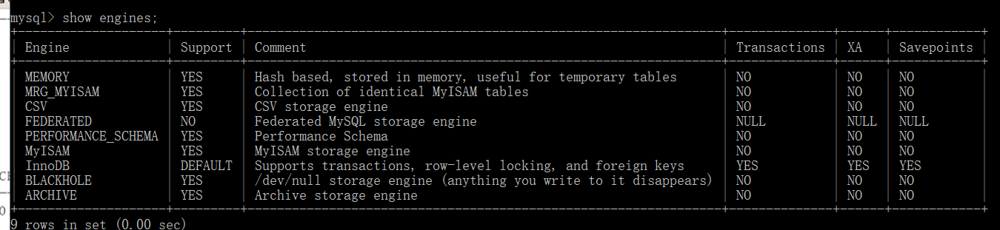
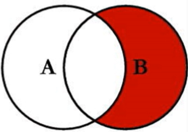
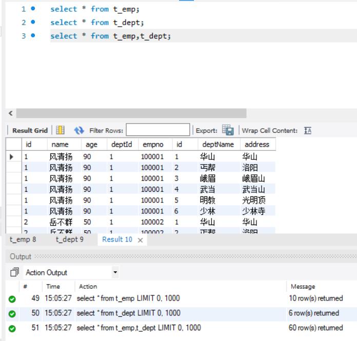
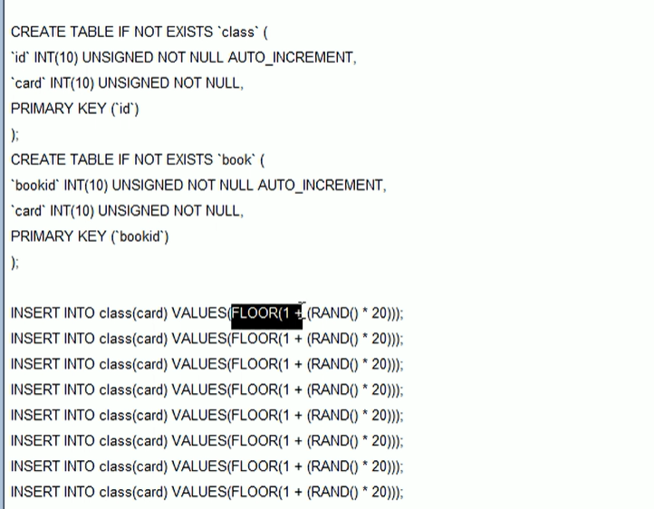
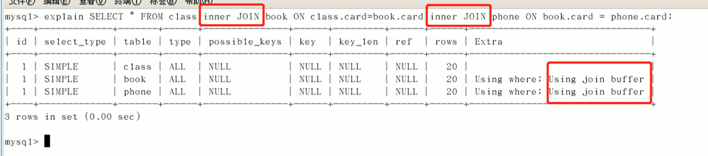

[**首页**](https://github.com/qdw497874677/myNotes/blob/master/首页检索.md)

# SQL语句

## 排序检索数据


## 过滤数据


## 字段的计算

- Concat()：拼接两个列。（MySQL）
  - 例如：select Concat( name, ' (' , email , ')' ) from table;
  - 这样可以根据自己的需求拼接字段
- RTrim()：删除值右边的所有空格。
- LTrim()：删除值左边的所有空格。
- AS：别名。
- 执行算数计算。


## 函数

上面的RTrim()之类的也是函数

- Upper()：将文本转换为大写。
- Soundex()：将字符串转换为发音类似的。
  - 例如：select name from table where Soundex( name ) = 'Lie'
  - 上面这条是能搜索到Lee的。
- 日期和时间
- 数值处理
  - Abs()
  - Cos()
  - 。。。
- 如果查到的字段为空则设置默认值：ifnull(字段,0)
- 拼接字符串，可以是多个字段拼接，也可以是一个分组中的同一个字段的多个值去拼接
  - concat()：
    - concat(str1, str2,...)　　
    - concat(str1, seperator,str2,seperator,...)：可以指定分割符
  - concat_ws()
    - concat_ws(separator, str1, str2, ...)：可以一次性指定分割符
  - group_concat()：将group by产生的同一个分组中的值连接起来，返回一个字符串结果。
    - group_concat( [distinct] 要连接的字段 [order by 排序字段 asc/desc  ] [separator '分隔符'] )
    - 说明：通过使用distinct可以排除重复值；如果希望对结果中的值进行排序，可以使用order by子句；separator是一个字符串值，缺省为一个逗号。
- ifnull(value1,value2)：如果value1为空，返回value2


## 汇总数据

- AVG()：返回某列的平均值。
- COUNT()：返回某列的行数。
  - count(列)：对特定列中的值进行数目统计，不包括NULL。
  - cout(*)：对行的数目进行统计，包括NULL。
- MAX()：返回某列的最大值。
- MIN()：返回某列的最小值。
- SUM()：返回某列值之和。里面可以是某列，也可以是某几列计算的值。
- DISTINCT：表示只聚集不同的值。只能用于列，不能用于计算值。
  - 例如：select AVG(DISTINCT price ) from table where id = 1000 ;
  - 这样相同价格的值只算作一个。


## 分组数据

### 创建分组

GROUP BY

通过group by将指定字段分组，这样可以分别计算每个组的数据。

使用规定

- group by子句可以包含任意数量的列。
- 子句中嵌套分组后，数据将在最后的分组中汇总，也就是说不能从个别的列取回数据。
- 子句中的每个列都必须是检索列或有效的表达式（不能是聚集函数）。不能使用别名。
- 除了聚集计算语句外，select语句中的每个列都必须在group by子句中给出。
- 如果分组中有NULL，将NULL作为一个分组返回，如果有多行NULL，它们就分为一组。
- group by子句必须出现在where子句之前，order by子句之后。


### 过滤分组

HAVING。用来过滤分组，就是对group by创建出来的分组进行过滤。支持所有where操作符。

例如：找出选课两门以上的学生姓名和对应的选课数目，学生和选择都在一个表中。

~~~sql
select name,count(*) as num_class from table group by id having count(*) >= 2；
~~~

也可以和where同时使用，先用where对总体进行过滤。

例如：找出选课两门以上且年龄大于18岁的学生姓名和对应的选课数目，学生和选择都在一个表中。

~~~sql
select name,count(*) as num_class from table where age > 18 group by id having count(*) >= 2；
~~~

还可以再进行排序。

例如：找出选课两门以上且年龄大于18岁的学生姓名和对应的选课数目，并且根据选课数量逆序，学生和选择都在一个表中。

~~~sql
select name,count(*) as num_class from table where age > 18 group by id having count(*) >= 2 order by num_class；
~~~


## select子句中的循序

select-from-where-group by-having-order by-limit


## 子查询

### 使用子查询进行过滤

例如：查询有标签是'java'的所有博客标题。tag表存tagId和名字。blog_tag表存博客和标签对应的id。blog表存博客id，blog_tag的id和标题等。

~~~sql
select title from blog where blogid in (select blogid from blog_tag where tagid in (select tagid from tag where tag_name = 'java'));
~~~

### 使用子查询作为计算字段

例如：查询博客标题和这个博客拥有标签的数量。

~~~sql
select title,(select count(*) from blog_tag where blog_tag.blogid = blog.blogid) as num_tags from blog;
~~~

可以，但不是最优的解决方案。

### 非相关子查询

非相关子查询的执行不依赖与外部的查询。
执行过程：
（1）执行子查询，其结果不被显示，而是传递给外部查询，作为外部查询的条件使用。
（2）执行外部查询，并显示整个结果。　　

### 相关子查询

相关子查询的执行依赖于外部查询。多数情况下是子查询的WHERE子句中引用了外部查询的表。
执行过程：
（1）从外层查询中取出一个元组，将元组相关列的值传给内层查询。
（2）执行内层查询，得到子查询操作的值。
（3）外查询根据子查询返回的结果或结果集得到满足条件的行。
（4）然后外层查询取出下一个元组重复做步骤1-3，直到外层的元组全部处理完毕。 　　


## 联结表

- 笛卡尔积：没有联结条件返回笛卡尔积，条数等于两个表条数之积
- 内部联结（等值联结）：用join on 或者 where 来匹配不同表中对应的联结的行
- 可以联结多个表

使用联结还是子查询？

| 情况                                                         | 倾向于                                                       |
| ------------------------------------------------------------ | ------------------------------------------------------------ |
| 从子查询中返回的数值对于外部查询中的所有行是相同的           | 预查询。声明变量，然后选择需要的值放入变量中，这能使即将形成的子查询只执行一次，而不是对外部表中的每一条记录执行一次。事实上SQL Server中的优化器相当聪明，它一旦察觉到处于这样的情形，将为你进行预查询，但是别依赖它。为了以防万一，当你意识到这样的情形时，请执行你自己的预查询。 |
| 两个表都相对较小（例如：只有10 000条记录或者更少）           | 子查询。不清楚确切的原因是什么，但是，经过实验可知，当所有的查找数据仅仅属于一、两个数据页时，查找比起联结花费的开销更少。 |
| 在考虑了所有的条件后，匹配将只返回一个值                     | 子查询。同样，比起必须联结整张表来说，只找寻一条记录并代换它所需的开销要少得多。 |
| 在考虑了所有的条件后，匹配将只返回相对较少的值，并且，在查找列上没有索引 | 子查询。通常，比起散列联结来说，单独的一次或者甚至数次查找将花费较少的开销。 |
| 查找表相对较小，基表很大                                     | 若可以的话，则使用嵌套子查询；若联结相对于相关子查询，则使用联结。使用子查询时，查找只发生一次，因而其开销相对较小。然而，如果使用的是相关子查询，则查找将会循环许多次-----既如此，大多数情况此案联结将是更好的选择。 |
| 相关子查询与联结                                             | 联结。本质上，相关子查询将造成嵌套循环的情形。这会产生相当多的开销。多数情况下，他远远快于游标，但是，它比其他可能的选择方案要慢一些。 |
| 派生表与其他选择                                             | 派生表常常意味着大量的开销，因此需要谨慎使用。要知道，派生表只运行一次，随后就会驻留于内存中，因而，多数的开销存在于首次创建的过程中以及没有索引的较大结果集上。它们可能很快、也可能很慢，这取决于具体的情况。在进行编写派生表前要仔细考虑。 |
| EXISTS与其他选择                                             | EXISTS。不必针对同样的条件进行多次查找------但找到了特定行的一个匹配，将进入到下一个查找中，这能够极大地减少开销。 |


## 高级联结

- 自联结
  - 例如：查找学生名字，要求学生有语文成绩和数学成绩，并且语文比数学分数高。（一个表中包含学生id、姓名、课程和成绩）
  - select name from table a,table b where a.id = b.id and a.分数 >= b.分数 and a.课程="语文" and b.课程="数学"
- 自然联结：排除重复出现的列
- 外部联结：包含没有关联的行
  - left join on
  - right join on
- 带聚集函数的联结
  - 例如，查询博客标题和博客拥有标签的数量
  - select b.title,count(t.tid) from blog b join tag_blog t on b.id=t.bid group on b.id


## 组合查询

union

将多个select作为单个查询结果集返回。

情况：

- 从不同的表返回结构类似的数据作为一个查询结果
- 对单个表执行多个查询，作为单个查询结果

union自动去除重复的行，如果不需要用union all

组合查询只能使用一个order by子句进行全部排序

## 全文搜索


## SQL技巧

### 查一条数据是否存在

~~~sql
SELECT 1 FROM table WHERE a = 1 AND b = 2 LIMIT 1
~~~

~~~java
Integer exist = xxDao.existXxxxByXxx(params);
if ( exist != NULL ) {
		//当存在时，执行这里的代码
} else {
		//当不存在时，执行这里的代码
}
~~~


# 面试问题

## 数据库三大范式

- 元组的分量不可再分
- 所有分量唯一决定主键码，不允许部分依赖
- 不允许传递依赖

通俗的说

1. 要求数据库的每一个字段都是不可分割的
2. 在1的基础上，确保每一个字段都和主键相关，而不是和主键的某一部分相关
3. 在2的基础上，确保每一个字段都是和主键直接相关，而不是间接相关。
   1. 假如某个字段依赖于另一个字段，应该拆成另一个表


## SQL

### group by 和distinct对比

对于不包含聚集函数的操作来说，group by 和distinct的结果是等价的。

group by是按指定的列分组，查询中必须包含聚集函数，会自动进行排序（如果不需要可以用order by null）

distinct是指定字段重复的行排除，支持单列、多列，不能显示去重字段以外的字段（对查询的所有字段同时去重）。


区别：

- 去重字段的重复字符比较多时用group by更快；重复字符比较少时用distinct 更快

### drop、truncate、delete

- drop：drop table 表名
  - 删除表的结构和内容
- truncate：truncate table 表名
  - 删除表中的所有内容数据（保存表的数据结构）
- delete：delete from 表名 （where 列明=值）
  - 删除表中行数据。（删除操作是数据库操作语言（dml），会最为事务记录在日志中，方便回滚）

执行速度：drop>truncate>delete

## MySQL的架构

大体上分为两层：**Server层和存储引擎层**

### Server层

Server层包括：连接器、查询缓存、分析器、优化器、执行器。

- 连接器：负责和客户端建立连接，获取权限、维持和管理连接。
- 查询缓存：在支持缓存的情况下，拿到一个查询请求后，会先到缓存中去检查是否有对应的缓存。缓存以查询语句作为key，结果作为value。不建议使用缓存，更新表，表的缓存会被清空，命中率很低，除非业务使用静态表操作。
- 分析器：对SQL语句做解析。
  - 词法分析：分词
  - 语法分析：构造解析树，保证没有语法错误
  - 语义分析：验证合法性，比如该表或字段是否存在等
- 优化器：对解析好的语句做优化，比如如何**选择索引**、多个**关联表的连接顺序**。选择索引会**根据索引的区分度**（基数：一个索引上的不同值的个数）来区分索引，获取基数主要是通过采样统计来得到。
- 执行器：判断权限，根据引擎的接口去操作表

### 存储引擎层

存储引擎层负责数据的存储和、提取。是插件式的，比如支持MyISAM、InnoDB等存储引擎。

#### MyISAM和InnoDB区别

- **事务支持**：MyISAM强调的是性能，每次查询具有原子性，但是不支持事务。InnoDB提供事务、外键等高级数据库功能，具有事务提交、回滚和崩溃修复能力。
- 存储空间：MyISAM可被压缩，占据的存储空间较小，支持静态表、动态表、压缩表三种不同的存储格式。InnoDB需要更多的内存和存储，它会在主内存中建立其专用的缓冲池用于高速缓冲数据和索引。
- 可移植性、备份、恢复：MyISAM的数据是以文件的形式存储，所以在跨平台的数据转移中会很方便，同时在备份和恢复时也可单独针对某个表进行操作。InnoDB免费的方案可以是拷贝数据文件、备份 binlog，或者用 mysqldump，在数据量达到几十G的时候就相对痛苦了。
- **表锁差异**：MyISAM只支持表级锁，用户在操作MyISAM表时，select、uodate、delete和insert语句都会给表自动加锁。InnoDB支持事务和行级锁，但实际上看要扫描多少行。针对InnoDB的表使用行锁，被锁定字段不是主键，也没有针对它建立索引的话。行锁锁定的也是整张表。
- **表主键**：MyISAM**允许没有任何索引和主键**的表存在，主键索引和其他索引没有结构上的不同，**索引都是保存行的地址**。对于InnoDB，如果没有设定主键或者非空唯一索引，就会自动生成一个6字节的主键(用户不可见)，数据是主索引的一部分，附加索引保存的是主索引的值。
- 全文索引：MyISAM支持 FULLTEXT类型的全文索引；InnoDB不支持FULLTEXT类型的全文索引，但是innodb可以使用sphinx插件支持全文索引，并且效果更好。
- 表的具体行数：MyISAM保存表的总行数，select count() from table;会直接取出出该值；而InnoDB没有保存表的总行数，如果使用select count() from table；就会遍历整个表，消耗相当大，但是在加了where条件后，myisam和innodb处理的方式都一样。
- 外键：MyISAM不支持外键，而InnoDB支持外键。


## MySQL的日志系统

MySQL更新语句的执行过程

- 从内存中找出记录，进行更新
- 将更新记录到redo log 中
- 将逻辑操作记录到binlog中
- 触发落盘规则后，后台线程会异步地把内存的记录更新到磁盘中

### redo log（重做日志）

也叫事务日志。是InnoDB引擎自己的日志系统，当有事务对数据进行更改新时，会在内存中修改对应的数据页，并把数据页的更改记录的redo log写到redo log buffer里面，这个记录就算更新完成了。redo log buffer中的redo log会根据刷新策略刷入到磁盘中。

innodb_flush_log_at_trx_commit：用来控制redo log刷入到磁盘的策略

- 1：默认是1，表示事务每次提交都将redo log buffer写入os buffer并调用fsync()来刷入磁盘。
- 0：表示redo log buffer中的redo log每秒一次写入os buffer并调用fsync()异步的刷入磁盘的redo log file中。
- 2：表示事务每次提交将redo log buffer写入os buffer中，然后每秒调用fsync()

redo log是固定大小的，是一个循环写入的形式，在空间满的情况下，新写入的会覆盖旧的。

### binlog（归档日志）

binlog是MySQL的Server层自己的日志。

binlog的日志是追加写，一个文件满了会穿件另一个继续。

binlog主要作用是主从同步和数据库基于时间点的还原。记录的是语句的原始逻辑。

具体过程同样也是先记录到内存中的binlog cache中，然后用过fsync()写到磁盘中。

### 两阶段提交

因为binlog和redo log是两个独立的区域，要保证他们的数据一致，就是分布式事务场景，需要通过**两阶段提交协议（Two-phase Commit，2PC）**来保持一致。


将redo log的写入拆成两个步骤：prepare和commit，把binlog的写入加在中间，来保证数据的一致。这也也只能保证单事务一致。在多事务的情况下还需要加锁，同一时间只能有一个事务进入prepare的机会，知道commit才释放锁。

为了提高性能，MySQL5.6引入了binlog组提交。通过队列机制保证redo log和binlog的落盘顺序一致。


### undo log（回滚日志）

主要作用就是回滚。可以利用回滚的作用来实现MVCC（多版本并发控制）。数据修改的过程中，记录一条与当前操作相反的逻辑日志到undo log中。通过回滚日志来构建不同的视图。不同时刻启动的事务有不同的视图。当没有事务需要这些回滚日志时，会被删除。


## 数据类型

### int(M)

M指示最大显示宽度，最大有效显示宽度为255。会在真实数值**前面补零**。


### varchar的长度

MySQL5.0.3之前varchar(n)这里的n表示字节数。

MySQL5.0.3之后varchar(n)这里的n表示字符数，比如varchar（200），不管是英文还是中文都可以存放200个。

MySQL要求一个**行定义长度不能超过65535个字节**，不包括text、blob等大字段类型，**varchar长度受此长度限制**，和其他非大字段加起来不能超过65535个字节.

- varchar(n)占用几个字节

varchar(n)占用几个字节跟字符集有关系：

字符类型若为gbk，每个字符占用2个字节。

字符类型若为utf8，每个字符最多占用3个字节。


### char和varchar

#### char

char是固定长度字符类型。插入数据不足规定长度，右边补空格。取数据时去掉多余空格。

查询效率比varchar高，但是在容量不能充分利用的时候会造成空间浪费

#### varchar

varchar类型的列是不定长的。5.0之后最大长度是65536字节。4.0之后varchar后面的括号里表示字符最长长度

| 编码    | 长度                                                   |
| ------- | ------------------------------------------------------ |
| utf8    | 65533/3=21844(汉字占3个字符)                           |
| utf8mb4 | 65533/4=16383(汉字占4个字符，包含了生僻汉字和文字表情) |

#### 为什么char类型查询效率高

因为char类型存放的时候每个数据长度是一致的，方便存储和查找；而varchar类型的每个数据开头都有一段空间存放数据段的长度，尾部还有一段空间标记此字段的节数。所以在遍历varchar的时候每个数据都要读开头然后读开头表示的字节数，这样比char多度很多次磁盘。

###### 适用情况

- MyISAM存储引擎：建议使用char。
- InnoDB存储引擎：建议使用varchar类型。对于InnoDB数据表，内部的行存储格式没有区分固定长度和可变长度列（所有数据行都使用指向数据列值的头指针），因此在本质上，使用固定长度的CHAR列不一定比使用可变长度VARCHAR列性能要好。因而，主要的性能因素是数据行使用的存储总量。由于CHAR平均占用的空间多于VARCHAR，因此使用VARCHAR来最小化需要处理的数据行的存储总量和磁盘I/O是比较好的。
- 存储很短的信息：应该用char，因为varchar还要占几个byte存储长度
- 固定长度的：比如uuid主键，或者手机号这种差不多长度的。存固定长度的数据，varchar长度可变的特性ius没有了
- 频繁改动的数据：这样的数据适合用char，因为varchar每次存储都有额外的计算

### test与blob

保存较大文本时，通常会选择使用TEXT或者BLOB。

TEXT和BLOB中又分别包括TEXT,MEDIUMTEXT,LONGTEXT和BLOB,MEDIUMBLOB,LONGBLOB三种不同的类型，他们之间的主要区别是存储文本长度不同和存储字节不同

- BLOB：能用来保存二进制数据，比如照片。
- TEXT：只能保存字符数据。

删除操作会在数据库表中**留下很大的“空洞”**，以后要填入这些“空洞”的记录在插入的性能上会有影响。为了提高性能，建议定期使用OPTIMEIZE TABLE功能对这类表进行碎片整理，避免因为“空洞”导致性能问题。

## 索引

```sql
CREATE INDEX index_name ON table_name (column_name)
```

### 聚簇和非聚簇索引

- 聚簇索引：决定数据在磁盘上的物理排序（物理连续）。一个表只能有一个聚簇索引，一般用主键来约束。**聚簇索引的叶子节点存储行记录。**
- 非聚簇索引：不决定数据在磁盘上的物理排序（逻辑连续）。**索引上只包含被建立索引的数据**，以及一个行定位符row-locator。通过这个定位符可以找到整行数据。**非聚簇索引的叶子节点存储索引字段和主键。**根据非聚簇索引找到主键并查询主键中的行信息就是回表。

### 主键就是聚集索引索引吗？主键和索引有什么区别？

主键是一种特殊的唯一索引，它可以是聚集索引，也可以是非聚集索引。

InnoDB作为MySQL存储引擎时，默认按照**主键**进行聚集，如果没有定义主键，InnoDB会试着使用非空的**唯一索引**来代替。如果没有这种索引，InnoDB就会定义**隐藏的主键**然后在上面进行聚集。所以，对于聚集索引来说，你创建主键的时候，自动就创建了主键的聚集索引。


### 创建索引时如何选择唯一索引和普通索引

- 根据列数据中是否允许重复值的出现：唯一索引会在插入数据时，检测列中是否含有重复数据。
- 查询语句的差异：
  - 唯一索引：要检索记录看是否满足条件。
  - 普通索引：查找到第一个符合条件的记录，就停止继续检索。
- 更新语句的差异：
  - 更新的目标在内存中
    - 唯一索引：找到对应值，判断是否会发生冲突，然后更新值。
    - 普通索引：找到对应值，更新值。
  - 更新的目标不在内存中
    - 唯一索引：需要将数据页读入到内存，判断是否会产生冲突，然后更新值。
    - 普通索引：将更新记录在change buffer中。


### InnoDB索引实现

InnoDB的数据文件本身就是索引文件。

查找数据需要考虑哪些问题

- 需要支持哪些查找方式：单key/多key/范围查找
- 插入/删除效率
- 查找效率（空间复杂度）
- 存储大小（空间复杂度）

#### Hash索引

key、value的形式，通过散列函数，快速根据key找到value。

- 查询方式：单key
- 插入删除效率：O(1)
- 查找效率：接近O(1)
- 存储大小：小，除了数据没有额外的存储


#### （待更新！！！）平衡二叉树、红黑树、B-树、B+树

#### B+树索引

B+树特征：

1. n棵子树的非叶子结点中含有n个关键字（b树是n-1个），这些关键字不保存数据，只用来索引，**所有数据都保存在叶子节点**（b树是每个关键字都保存数据）。对于聚集索引数据为一行的所有数据，对于非聚集索引数据为索引值和主键（为什么不是地址，因为地址会变，主键不会变）。
2. 所有的叶子结点中包含了全部关键字的信息，及指向含这些关键字记录的指针，且叶子结点本身以关键字的大小自小而大进行连接。
3. 所有的非叶子结点可以看成是索引部分，结点中仅含其**子树中的最大（或最小）关键字**。
4. 通常B+树上有两个头指针，一个指向根节点，一个指向关键字最小的叶子节点。
5. 同一个数字会在不同节点中重复出现，根节点的最大元素就是B+树的最大元素。


相比B树的优势

1. B+树中间结点不保存具体信息，所以节点中的关键字数量就相对较多，一次性读入内存的中的要查找的关键字就多，相对来说IO操作次数就减少了。
2. B+树查询必须查找到叶子节点，B树只要匹配到即可。B+树中所有的查找路径都是相等，所以查询数据更稳定。
3. B+树叶子节点用指针相连，对于范围查找很高效。B树需要中序遍历。
4. **增删节点效率更高**，因为B+树的叶子节点包含所有关键字，并以有序的链表结构存储。

### 一个B+树节点存多少个元素

B+树的**一个节点为一页或者页的倍数最合适**。如果小于一页，读取节点也会读出一页造成浪费。

MySQL的基本存储结构是页，数据都记录在页里面。**一页默认是16KB。**

- 各个数据页可以组成一个双向链表。
- 每个数据页中的记录可以组成一个单项链表。
- 每个数据页都会为存储在它里面的记录生成一个页目录，在**通过主键**查找某条记录的时候可以在页目录中使用二分法款速定位到对应的槽，然后再遍历该槽对应分组的记录即可快速找到指定的记录。
- 以其他列（非主键）作为搜索条件，只能从最小记录开始依次遍历单链表中的每条记录。

例如查询 select * from user where username='qdw'。没有进行任何sql语句优化。

- 遍历双向链表，找到所在的页。（定位所在页）
- 因为不是主键，只能遍历所在页的单链表。（在页中查找记录）


### 为什么用自增主键

为了防止页分裂。

因为B+树结构的索引是有序的，对于主键索引，要把每次插入放到合适的位置上。

一个数据页的默认大小是16k，当一个数据页存满了，就会申请一个新的数据页来存储。

如果主键为自增id，mysql写满一个数据页时，直接申请一个新的数据页接着写就可以了，不会触发页分裂。如果不是自增，为了确保有序，每次插入都要放到合适的位置上。在插入的时候如果页满了会申请新的页，然后把以前一页的数据分到两页中，即**降低数据页的利用率，还增加操作的成本。**


### 回表

大概就是，有一个主键为id的索引，和一个普通name字段的索引（非聚集索引）。在普通字段上搜索。 select * from user where username='qdw'。

执行的流程是，查询到name索引上的qdw，然后找到他的id是2，最后去主键索引，找到id为2对饮的值。

**回到主键索引搜索的过程，就是回表。可以通过覆盖索引避免回表。**

覆盖索引就是搜索有索引的字段覆盖要查询的字段。字段值在搜索的索引上就有了，就不需要回表了。

### 索引失效的情况

- 有or
- 联合索引没用左边字段
- like以%开头
- 需要转换类型
- where中索引列有运算
- where中索引列使用了函数
- 如果mysql觉得全表扫描更快时

### 最左前缀原则

联合索引，要从左边开始匹配，顺序可以不一样因为优惠器会调整顺序，但是从左边缺少索引的字段是不行的，就不能用到索引了。

**B+树按照从左到右的顺序来建立搜索树。**会优先按照前面的记录来确定后面的搜索路径。

比如索引（a、b、c、d）。对于查询筛选字段为a、b、d，只有a、b字段用到索引。因为在前面的字段相同的情况下，后面的字段才是有序的，才能利用到索引。MySQL创建联合索引的规则是**首先对联合索引的最左边第一个字段排序，在第一个字段的排序基础上，再对第二个字段进行排序**。


### 索引查找和索引扫描

索引查找：根据索引快速定位一条数据。索引扫描：扫描整个索引的数据。


### Redo log和bin log

- redo log：重做日志。是InnoDB存储引擎层的日志。记录的是数据修改之后的值，不管事务是否提交。会在空闲的时候按照更新策略将log中的内容更新到磁盘中。
  - 写入机制：事务执行过程中，先把日志写入binlog cache，事务提交的时候再把binlog cache写入binlog文件中。一个事务的binlog是不能被拆开的。每次事务提交后把cache里的一个事务的binlog写入binlog中。每个线程都有自己的binlog cache，但是共用一个binlog文件。
- bin log：归档日志。是Server层记录的日志。以二进制的形式记录的是语句的原始逻辑。可用于数据库的基于时间点的还原。还可用于主从复制，从库利用主库上的binlog进行重播，实现主从同步。
  - 写入机制：redo log buffer中的并不是每次生成后都要持久化到磁盘，但是由于自动执行的线程会刷一部分到磁盘。innoDB 后台有一个线程，每隔1s 就会把redo log buffer中的日志，调用write写到文件系统的page cache,然后fsync持久化到磁盘
    - redo log buffer 占用的空间即将达到 innodb_log_buffer_size 一半的时候，后台线程会主动写盘。
    - 并行的事务提交的时候，顺带将这个事务的 redo log buffer 持久化到磁盘。
- undo log：回滚日志。保存事务发生之前的数据的一个版本，可以用来回滚，同时提供MVCC下的读。


### MySQL怎么保证数据不丢失

只要redolog和binlog保证持久化到磁盘，就能确保MySQL重启后，数据可恢复。


## 事务

### ACID特性

- 原子性：事务是不可再分割的，事务中的操作要么都发生，要么都不发生
- 一致性：事务开启和结束，数据库的完成性约束没有被破坏
  - 一致性是事务追求的最终目标
- 隔离性：事务之间是隔离的，一个事务不应该影响其他事务的运行效果
- 持久性：事务完成之后，事务对数据库所做的更改永久保存在数据库中

### 锁

#### 从粒度划分

- 表锁（一般MyISAM 用、适合偏读）
- 行锁（InnoDB 用，适合偏写）
- 页锁

MyISAM 支持表锁；InnoDB 行锁（可通过锁住所有行实现行锁）。

- 锁定粒度：表锁 > 行锁
- 加锁效率：表锁 > 行锁
- 冲突概率：表锁 > 行锁
- 并发性能：表锁 < 行锁

#### 从操作划分

- 共享锁（读锁、S锁）：行锁。多个事务可以同时获取数据的共享锁，获取共享锁的事务可以进行读操作，但是不能写。
  - select * from teachers WHERE id=1 LOCK IN SHARE MODE; commit/rollback
- 排它锁（写锁、X锁）：行锁。排它锁不能与其他锁并存，获取数据排它锁的事务可以进行读和写。获取排它锁期间其他事务不能获取数据的排它锁和共享锁
- 意向共享锁：表锁
- 间隙锁：行算法锁。只在RR事务隔离级别存在。范围查询或等值查询没有名著，锁住这些**不存在的数据记录**。（左开右开）
- 临键锁：行算法锁（行锁+间隙锁）。范围查找，且有数据命中时，加锁会加上临键锁，锁住索引的记录+区间。（左开右闭）

#### 解决问题

##### 脏读问题

事务A查询数据D，此时数据D是被事务B修改但为提交的状态，**A查到的是B未提交的脏数据**。

可以通过让事务B的**修改时给数据加上排它锁**，在事务结束后移除锁。

##### 不可重复读

事务A查询数据D，之后事务B修改数据D并提交，事务**A再次查询数据D发现数据不一致**。

可以让事务A**查询时对数据加共享锁**，在事务结束后移除锁。事务B尝试修改时会阻塞。

##### 幻读

事务A对此查询一个范围内的数据，期间事务B在这个范围内增加或者删除了数据，事务**A读取的范围数据不一致**。事务A查询的时候给范围数据加上临键锁，防止其他事务修改范围内的数据，防止幻读。


### MVCC

MVCC(Mutil-Version Concurrency Control)，就是**多版本并发控制**。是一种并发控制的方法。与MVCC相对的，是基于锁的并发控制（Lock-Based Concurrency Control）。MVCC的优点：**读不加锁**，**解决了读写冲突**。提高在读操作上的并发量。

#### 基本原理

通过**保存数据在某一个时间点的快照**来实现。

在InnoDB引擎中，读提交和可重复读这两种隔离级别实现需要的并发控制就是通过MVCC的实现来解决的。

MVCC实现的读操作可以分为两类：

- 快照读：读取的是记录的目标可见版本。**RC、RR的查询语句。**
- 当前读：读取的是记录的最新版本。并且，当前读返回的记录，都会上锁，保证其他事务不会并发修改这条记录。**更新数据时的查询操作。**

InnoDB中每个事务都有一个唯一的事务ID，在事务开始时申请的，事务更新时会记录这个更新的事务id。


#### InnoDB的实现

关键的三个概念**：隐藏列，undo log，ReadView**

- 隐藏列：和mvcc有关系的两个隐藏列（总共有3个）。一个是事务id，一个是回滚指针
- undo log：事务对数据进行一次更新时，生成一个回滚日志，通过回滚日志可以获取到之前事务的数据。
- ReadView：事务进行查询操作时，会生成一个ReadView。记录**当前时间点活跃的动态事务列表**，列表中事务提交之后就会从列表中移除。**InnoDB 利用了“所有数据都有多个版本”的这个特性，实现了“秒级创建快照”的能力。**

启动事务之后，在查询一条数据时，检查数据行最新的数据

- 如果事务id **< ReadView中最小记录**，说明数据行对当前事务是可见的，返回结果。
- 如果事务id **> ReadView中最大记录**，说明这一个记录是新的事务修改过的，是对当前事务不可见，就通过undo log寻找历史记录中满足条件的那个。
- 如果事务id在最小记录和最大记录之间，要遍历整个ReadView，如果存在就表示这个版本是由还没有提交的事务生成的——不可见。如果不存在说明这个版本是由已经提交了的事务生成的（因为已经提交的就从列表中移除了）。

总结

> 对于一个事务所能看到的数据版本，可以通过不同的**一致性视图**（read-view）来区分，视图的构成是通过**回滚日志（undo log）**来实现的。RC每个查询语句都创建最新提交版本的一致性视图，RR事务中只在当前事务能看到的数据版本的一致性视图。

InnoDB为每个事务构造一个数组，用来保存这个事务启动瞬间，正在活跃的所有事务id（动态的，会删除和新增）。根据事务id和回滚日志，生成对应的视图。

对于可重复读最终得到的结果为：**对于自己的事务内的更新是可见的。对于其他未提交的事务是不可见的。对于当前视图前的版本中提交的事务是可见的，之后的版本中提交的事务是不可见的。**

三个可见一个不可见。


### 并发事务带来的问题

- 脏读：一个事务读到另一个事务没有提交的数据
- 不可重复读：一个事务两次查询数据不一致
- 幻读：一个事务两个范围查询的数据量不一致

### 事务隔离级别

- 读未提交（read-uncommitted）：所有的数据都是共享的，不同的事务的操作对其他事务都是可见的。
  - 实现：只对写加排它锁
- 读提交（read-committed）：事务只能看见已提交的数据。
  - 实现：
    - MVCC：读操作是**快照读**，**每个读操作**都创建当前数据的最新提交过的数据的一致性视图；每个更新操作都是先用**当前读**到最新值。
    - LBCC：**查询时加读锁，查完释放**。**更新时加写锁，保持到事务提交**。
- 可重复读（repeatable-read）（MySQL默认）：一个事务内读取的数据都是一致的，事务开启后，其他事务对这个数据的修改对于这个事务是不可见的，但是插入和删除是可见的。
  - 实现：
    - MVCC：读操作是快照读，只在**事务开始**创建一个一致性视图，事务内的查询共用；更新操作都先用**当前读**
    - LBCC：**查询时加写锁，事务提交后释放**。
- 串行化（serializable）：所有有数据交集的事务都是串行的。
  - 实现：通过临键锁，对查询范围里的所有数据加锁，事务结束后解锁。

### 快照读和当前读

#### 快照读

基于MVCC和undo log来实现，适用于select语句

查询时，获取的数据为到目标时刻为止所有已经提交的数据。对于RC就是每次读时候的最新提交数据，对于RR就是读当前所在事务的中第一个查询之前的最新提交数据。

#### 当前读

基于临键锁（行锁+间隙锁）来实现的，适用于insert，update，delete， select ... for update， select ... lock in share mode 语句，以及加锁了的 select 语句。

更新数据时，都是先读后写，这个读就是当前读。读数据时，读取该数据的已经提交的最新数据


### 悲观锁和乐观锁

是两种常见的资源并发锁设计思路。

- 悲观锁：先获得锁再进行业务操作。悲观锁悲观地认为所有的操作都会导致并发问题，所以要确保先获得锁。适合读多写少。
  - mysql中用select... for update 语句。这会把所有扫描的行都会加上锁。
- 乐观锁：先进行业务操作，在最后实际更新数据时检查数据是否被更新过，若未被更新过，则更新成功。否则失败重试。适合读少写多。
  - 乐观锁可以再数据库上直接实现，不需要特殊支持。一般是加入版本号或者时间戳字段。


## 如何优化索引

### 什么地方适合加索引

- where、group by、order by后面。
- **查询中与其他表关联的字段应该加索引。**

### 加索引有什么注意的地方

用explain来看一下sql最终优化的情况。

与索引相关的优化或者什么地方需要索引

- 主键会自动创建唯一索引，并且默认把主键的索引作为聚集索引。
- **尽量使用覆盖索引，减少不必要的回表。**
- 对于长的字符串添加索引可以根据需求制定索引前缀。前缀太小可能会导致索引的重复率高，回表次数多。**定义好前缀索引，**可以既节省空间，就减少回表。
- 对于查询语句中的多个索引字段，**要遵循最左匹配原则。**
  - 范围条件导致右边的索引失效。
  - 一些反向选择，比如非等于（!=、<>）、is null、is not null、or连接，导致右边的索引失效。
  - like后面的字符串以通配符开头，导致后面的索引失效。
- 查询语句过滤条件中，尽量不要对索引列用一些函数做处理。
- **对于联表查询，尽量使用join**，往往比单表子查询性能好一点。使用join时，尽量让小表作为驱动表（左连接就是左表），对于被驱动表的连接字段需要有索引，可以用到，而驱动表是全盘扫描。
- （待更新！！！）in ex
- **尽量用自增id作为主键索引。**经常用主键作为查询且只需要一个索引，也可以把业务字段最为主键，可以少用一个索引来减少空间的占用。

### 哪些不需要建索引

- 表记录少，就没有必要键索引。
- 经常增删改的表。
- 数据重复且分布均匀的字段（区分度不高的字段）。

可以用Explain去查看MySQL是怎么优化处理理解一条SQL。

可根据结果看出读表顺序、什么样的读取类型、哪些索引可以用、哪些索引实际被使用、表之间的引用

### 优化分页

相同偏移量下，查询数量越大，时间越长。

相同查询数量下，偏移量越大，时间越长。大于10万以后急剧增加

#### 使用子查询优化

先定位偏移位置的id，然后往后查询，这种方式**适用于id递增**的情况。

~~~sql
select * from orders_history where type=8 and
id>=(select id from orders_history where type=8 limit 100000,1)
limit 100;
~~~


#### 使用id限定优化

如果可以直接根据查询页数和查询的记录数算出id的范围，且id是连续的，就可以用in between

~~~java
select * from orders_history where type=2
and id between 1000000 and 1000100 limit 100;
~~~

或

~~~java
select * from orders_history where id >= 1000001 limit 100;
~~~

或者，使用in，在联表查询的时候，使用别的小的表查出的id中来查询

~~~java
select * from orders_history where id in
(select order_id from trade_2 where goods = 'pen')
limit 100;
~~~


- 前端控制：限制分页页数。
- 每次记录最大id：每次查询记录最大的id，下一页直接从最大id开始查指定数目的数据。只适用于查询有顺序的字段。
- in获取id：通过子查询的方式先获取所有的id，然后根据id查找分页。
- join+覆盖索引：子查询根据条件和limit查询到所有数据的主键id。然后根据id和原表进行join。对于子查询的where条件进行覆盖索引的处理。
  - 例如：select * from table_name inner join ( select id from table_name where user = ‘qdw’ limit 10000,10) b using (id)
  - 创建索引：alter table test add index idx_user_id(user, id)将where 放第一位，limit用到的主键放第2位，而且只能select 主键！

总结：把联表查询拆成，主表关联子查询，只对子查询做limit（需要排序只针对子查询），子查询查出主键id。

子查询查出需要的数据的索引列（主键id），主表根据主键id过滤数据来limit。

### SQL基本优化诗

- 全值匹配我最爱
- 带头大哥不能死
- 中间兄弟不能断
- 索引列上无计算
- 范围之后全失效
- like百分加右边
- 覆盖索引替换星
- 不等空值还有or
- varchar引号不能丢
- 索引失效要少用


# 安装

## linux

### ubuntu

~~~bash
sudo apt-get update
sudo apt-get install mysql-server
#查看是否开启
service mysql status
#登录MySQL
mysql -u root -p

~~~


修改密码

~~~bash
#修改密码
UPDATE user SET authentication_string=PASSWORD('123321'),plugin='mysql_native_password' where USER='root';
#刷新
FLUSH PRIVILEGES;

~~~


> 远程连接Ubuntu上的MySQL数据库

确保3306端口开放

~~~bash
#打开3306号端口
sudo ufw allow 3306
#查看端口状态
sudo ufw status
#关闭防火墙
sudo ufw disable
#开启防火墙
sudo ufw enable
~~~

配置mysql允许其他ip访问

~~~bash
#编辑配置文件，把其中bind-address = 127.0.0.1注释了
vi /etc/mysql/mysql.conf.d/mysqld.cnf
~~~

允许root用户在其他ip上登录

~~~bash
#登录mysql
mysql -u root -p 密码
#使用mysql库
mysql> use mysql;
#查看user表的host和user数据
mysql> select host,user from user;	#会发现root用户允许的host是localhost
#修改数据
mysql> update user set host='%' where user='root';	#host改为%，表示允许在所有IP上登录
#重启mysql
/etc/init.d/mysql restart
~~~

## 主要配置文件

- log-bin二进制日志：主从复制
- log-error错误日志：默认关闭的，记录严重的警告和错误信息。
- log查询日志：默认关闭，记录查询的slq语句。
- 数据文件
  - windows：MySQLServer5.5\data目录
  - linux：/var/lib/mysql
  - frm文件：存放表结构
  - myd文件：存放表数据
  - myi文件：存放表索引
- 如何配置
  - windows：my.ini文件。新版本在C:\ProgramData\MySQL\MySQL Server 8.0目录下
  - linux：/etc/my.cnf文件

# 基本命令

~~~sql
--查看所有数据库
show databases;
--切换数据库
use 数据库名;
--查看数据库中所有表
show tables;
--查看表信息
describe 表名;
--创建数据库（简单）
create database 名字;
--退出连接
exit;
~~~


## 导出数据库
导出全部数据库
在管理员模式下cmd，在mysqldump对应的目录下

~~~
mysqldump -u root -p --all-databases >sql20200419.sql
~~~


然后输入密码

导出单个数据库

~~~
mysqldump -u root -p 数据库名 >sql20200419.sql
~~~


导入

~~~
mysql -h localhost -u root -p < F:\hello world\niuzi.sql
~~~


## INSERT ... ON DUPLICATE KEY UPDATE命令

### 单条记录下使用

```java
INSERT INTO t1 (a,b,c) VALUES (1,2,3)
  ON DUPLICATE KEY UPDATE c=c+1;
```

如上sql假如t1表的主键或者UNIQUE 索引是a，那么当执行上面sql时候，如果数据库里面已经存在a=1的记录则更新这条记录的c字段的值为原来值+1，然后返回值为2。如果不存在则插入a=1,b=2,c=3到数据库，然后返回值为1。

### 多记录下使用

```java
INSERT INTO t1 (a,b,c) VALUES (1,2,3),(4,5,6)
  ON DUPLICATE KEY UPDATE c=VALUES(c);
```


### 函数

~~~sql
-- 这个字段的数据取前4位
left(字段,4)
~~~


# 逻辑架构简介

- 连接层
- 业务层
- 引擎层
- 存储层


## 存储引擎介绍



默认使用innodb

### 对比


| 对比     | MyISAM                                               | InnoDB                                                     |
| -------- | ---------------------------------------------------- | ---------------------------------------------------------- |
| 主外键   | 不支持                                               | 支持                                                       |
| 事务     | 不支持                                               | 支持                                                       |
| 行表锁   | 表锁。即使操作一条数据也要锁住整个表，不适合高并发。 | 行锁。操作一行只锁住这一行，不对其他行有影响，适合高并发。 |
| 缓存     | 只缓存索引，不缓存真实数据。                         | 不仅缓存索引，还缓存真实数据，对内存要求较高。             |
| 表空间   | 小                                                   | 大                                                         |
| 关注点   | 性能                                                 | 事务                                                       |
| 默认安装 | Y                                                    | Y                                                          |


# 事务

## ACID

指事务

- 原子性（Atomicity）：事务中的操作，**要么全执行，要么全不执行**。
- 一致性（Consistent）：在事务开始和完成时，**数据完整性要保持一致**。符合逻辑运算。
- 隔离性（Isolation）：多个并发事务之间要相互隔离，**不能被其他事务干扰**。
- 持久性（Durable）：一个事务一旦提交，它对**数据库中的数据的改变是永久性的**。

## 并发事务带来的问题

- 脏读：一个事务读了另一个事务正在修改但是没有提交的数据。
- 不可重复读：一个事务读第二次的结果和第一次不一致。
- 幻读：一个事务读到了其他事务新增的或者删除了的数据（数量量不同）。
- 更新丢失：几个事务都要更新一行，导致有些有些事务的更新别别的事务的更新覆盖。


## 事务隔离级别

- 读未提交（read-uncommitted）：所有的数据都是共享的，A事务在执行的任何操作，B事务都能看见，不管有没有提交。
- 读提交（read-committed）：事务只能看到已提交的数据。
- 可重复读（repeatable-read）（MySQL默认）：一个事务内读取的数据都是一致的，就算其他事务提交了这个数据的修改，读的还是和开始的一样。
- 串行化（serializable）：对于同一行记录，写会加写锁，读会加读锁。

| 隔离级别 | 读数据一致性                           | 脏读 | 不可重复读 | 幻读 |
| -------- | -------------------------------------- | ---- | ---------- | ---- |
| 读未提交 | 最低级别，只保证不读取物理上损坏的数据 | 是   | 是         | 是   |
| 读已提交 | 语句级                                 | 否   | 是         | 是   |
| 可重复读 | 事务级                                 | 否   | 否         | 是   |
| 串行化   | 最高级别，事务级                       | 否   | 否         | 否   |


# 索引优化分析

## SQL性能下降原因

执行时间长，等待时间长


### 查询语句写的烂

频繁使用的字段，可以考虑建索引

建单值索引

~~~sql
--idx_user_name是索引名，命名一般是idx表示索引，user是表明，name是字段名
create index idx_user_name on user(name)
~~~

 


## SQL解析过程


## Join


~~~sql
select <select_list> from TableA A left join TableB B on A.Key=B.Key
~~~


~~~sql
select <select_list> from TableA A right join TableB B on A.Key=B.Key
~~~


~~~sql
select <select_list> from TableA A inner join TableB B on A.Key=B.Key
~~~


~~~sql
select <select_list> from TableA A left join TableB B on A.Key=B.Key where B.Key is null
~~~




~~~sql
select <select_list> from TableA A right join TableB B on A.Key=B.Key where A.Key is null
~~~


~~~sql
select <select_list> from TableA A outer join TableB B on A.Key=B.Key 
~~~


~~~sql
select <select_list> from TableA A outer join TableB B on A.Key=B.Key where A.Key is null or B.Key is null
~~~


### 使用示例

为了方便我用图形界面连接数据

创建表

~~~sql
use dbtestjoin;
CREATE TABLE `t_dept` ( 
`id` INT(11) NOT NULL AUTO_INCREMENT, 
`deptName` VARCHAR(30) DEFAULT NULL, 
`address` VARCHAR(40) DEFAULT NULL, 
PRIMARY KEY (`id`) 
) ENGINE=INNODB AUTO_INCREMENT=1 DEFAULT CHARSET=utf8; 

CREATE TABLE `t_emp` ( 
`id` INT(11) NOT NULL AUTO_INCREMENT,
`name` VARCHAR(20) DEFAULT NULL, 
`age` INT(3) DEFAULT NULL, 
`deptId` INT(11) DEFAULT NULL, 
empno int not null, 
PRIMARY KEY (`id`), 
KEY `idx_dept_id` (`deptId`),
CONSTRAINT `fk_dept_id` FOREIGN KEY (`deptId`) REFERENCES `t_dept` (`id`) ) ENGINE=INNODB AUTO_INCREMENT=1 DEFAULT CHARSET=utf8; 

INSERT INTO t_dept(deptName,address) VALUES('华山','华山'); 
INSERT INTO t_dept(deptName,address) VALUES('丐帮','洛阳'); 
INSERT INTO t_dept(deptName,address) VALUES('峨眉','峨眉山'); 
INSERT INTO t_dept(deptName,address) VALUES('武当','武当山'); 
INSERT INTO t_dept(deptName,address) VALUES('明教','光明顶'); 
INSERT INTO t_dept(deptName,address) VALUES('少林','少林寺'); 
INSERT INTO t_emp(NAME,age,deptId,empno) VALUES('风清扬',90,1,100001);
INSERT INTO t_emp(NAME,age,deptId,empno) VALUES('岳不群',50,1,100002); 
INSERT INTO t_emp(NAME,age,deptId,empno) VALUES('令狐冲',24,1,100003); 
INSERT INTO t_emp(NAME,age,deptId,empno) VALUES('洪七公',70,2,100004); 
INSERT INTO t_emp(NAME,age,deptId,empno) VALUES('乔峰',35,2,100005); 
INSERT INTO t_emp(NAME,age,deptId,empno) VALUES('灭绝师太',70,3,100006); 
INSERT INTO t_emp(NAME,age,deptId,empno) VALUES('周芷若',20,3,100007); 
INSERT INTO t_emp(NAME,age,deptId,empno) VALUES('张三丰',100,4,100008); 
INSERT INTO t_emp(NAME,age,deptId,empno) VALUES('张无忌',25,5,100009); 
INSERT INTO t_emp(NAME,age,deptId,empno) VALUES('韦小宝',18,null,100010);

~~~


笛卡尔查出60个数据

~~~sql
select * from t_emp;
select * from t_dept;
select * from t_emp,t_dept;
~~~




内联（inner join）

~~~sql
select * from t_emp e inner join t_dept d on e.deptId = d.id;
~~~


> 没有部门号的员工：韦小宝，没有员工与之相连的部门：少林
>
> 没有在结果里。
>
> 结果中只有公有部分


左联（left join）——左右的共有+左的独有

~~~sql
select * from t_emp e left join t_dept d on e.deptId = d.id;
~~~


> 左边的表都在，没有的部分用null补上


右联（right join）——左右的共有+右的独有

~~~sql
select * from t_emp e right join t_dept d on e.deptId = d.id;
~~~


> 右边的表都在，没有的部分用null补上


变体————左的独有

~~~sql
select * from t_emp e left join t_dept d on e.deptId = d.id where d.id is null;
~~~


> join后只要左表独有的部分


变体————右表的独有

~~~sql
select * from t_emp e right join t_dept d on e.deptId = d.id where e.deptId is null;
~~~


> join后只要右表独有的部分


全连——左右表的共有+左右表各自的独有

~~~sql
select * from t_emp e left join t_dept d on e.deptId = d.id
union
select * from t_emp e right join t_dept d on e.deptId = d.id;
~~~


> 两个表所有的行，能连接就连接，不能连用null，全在结果里


左右表各自的独有

~~~sql
select * from t_emp e left join t_dept d on e.deptId = d.id where d.id is null
union
select * from t_emp e right join t_dept d on e.deptId = d.id where e.deptId is null;
~~~


> 左右表各自的独有


## 索引简介

### 索引是什么

> 索引是帮助MySQL高效获取数据的**数据结构。**

> 如果查“mysql”这个单词，需要定位到m，然后找下一个y，再找剩下的s、q、l
>
> 如果没有索引，那么需要从a-z。

> 在数据之外，**数据库系统还维护着满足特定查找算法的数据结构**，这些数据结构以某种方式指向数据。这样就可以在这些数据结构上实现高级查找算法。这种数据结构就是索引。

> **索引可以理解为“排好序的快速查找数据结构”。**主要干了两件事：排序和查找


加快了Col2的查找。右边二叉查找树的一个节点包括一个索引键值和一个记录对应数据物理地址的指针。

> 一般来说索引本身也很大，不能全部存在内存中，因此往往以磁盘文件的形式存在磁盘上。


### 优势

- 提高数据检索效率，降低IO成本
- 通过索引列队数据进行排序，降低数据排序的成本，降低了CPU的消耗

### 劣势

- 索引实际上也是一张表，保存了主键与索引字段，并指向实体表的记录。所以索引也要占用空间的。

- 提高的查询速度，但是会降低更新表的速度。因为更新表的同时，MySQL不仅要保存数据，还要保存索引对应的数据。
- 索引只是提高效率的一个因素，需要花时间去研究如果建立最好的索引


### 索引分类

- 单值索引：一个索引质只包含单个列。
- 唯一索引：索引列的值必须唯一，可以是空值。
- 复合索引：一个索引包含多个列。（如果使用到复合索引，需要查的字段是从复合索引左边开始连续的。比如复合索引（c1,c2,c3），where c1=，where c1= and c2=，where c1= and c2= and c3=这三个是可以用到索引的；where c2=就用不到索引。）

> 基本语法

~~~sql
-- 创建 加unique就表明是唯一索引 表名后面的括号里如果有多个列名就是复合索引
create [unique] index 索引名 on 表名(列名)
-- 或者
alter 表名 add [unique] index [索引名] on (列名)

-- 删除
drop index [索引名] on 表名

-- 查看
show index from 表名

-- 实际中的四种添加索引方式
-- 添加一个主键索引
alter table 表名 add primary key(列名);
-- 添加唯一索引
alter table 表名 add unique 索引名(列名);
-- 添加普通索引
alter table 表名 add index 索引名(列名);
-- 添加全文索引
alter table 表名 add fulltext 索引名(列名);
~~~


### 索引结构

- BTree索引
  - B+Tree结构，属于平衡多路查找树。索引在磁盘中，每次找到一个磁盘块，直到找到要找的数据。减少树高可以大幅提高查找效率。
  - B+Tree的两个特征：
    - 非叶子节点不存储数据只存多个索引键。所有关于真正数据的地址信息都存储在叶子节点。相对于BTree非叶子节点可以放更多的索引键，树高更低。
    - 所有叶子节点由指针连接。可以提高范围查找的效率。
- Hash索引
- full-text全文索引
- RTree索引


### 哪些需要建索引

- 主键自动创建唯一索引。
- 频繁作为查询条件的字段应该创建索引。
- 查询中与其他表关联的字段，外间关系建立索引。
- 单值索引和组合索引，尽量用组合索引。
- 查询中排序的字段。
- 查询中统计或者分组的字段。


### 哪些不需要建索引

- 表记录太少
- 经常增删改的表
- 不出现在where中的字段
- 数据重复且分布均匀的字段。（比如性别）

> 索引的选择性是指索引列中不同值的数目与表中记录数的比。比如一个表有2000条字段，一个索引列中不同值的有1980条。这个索引的选择性就是1980/2000=0.99。选择性越接近1，索引的效率越高


## 性能分析

- MySQL Query Optimizer
  - MySQL中有专门的负责优化SELECT语句的优化模块。主要功能：通过计算分析系统中收集到的统计信息，为客户端请求的Query提供他认为最优的执行计划。
  - 
- MySQL常见瓶颈
  - CPU：CPU在饱和的时候一般发生在数据装入内存或从磁盘上读取数据的时候。
  - IO：磁盘I/O瓶颈发生在装入数据远大于内存容量的时候。
  - 服务器硬件的性能瓶颈：top,fee,iostat和vmstat来查看系统的性能状态
- Explain

### Explain

> 使用Explain关键字可以模拟优化执行SQL查询语句，从而知道MySQL是如何处理你的SQL语句的。分析查询语句或是表结构的性能瓶颈。

能干什么

- 表的顺序读取
- 数据读取操作的操作类型
- 哪些索引可以使用
- 哪些索引被实际使用
- 表之间的引用
- 每张表有多少航被优化器查询


#### 字段分析

执行一个简单的命令

~~~sql
explain select * from t_emp;
~~~


- id
  - id相同：执行顺序由上到下。
    - 
  - id不同：如果是子查询，id序号递增，id值越大越先被执行。（可以理解为括号里的优先执行）。
    - 
  - id相同和id不同同时存在：id序号大的优先执行，id相同的由上到下循序执行。
    - 
- select_type
  - 
  - SIMPLE：简单的select查询，查询中不包含子查询或者union。
  - PRIMARY：查询中如果包含任何复杂的字部分，最外层查询则被标记为PRIMARY。
  - SUBQUERY：在select或where列表中包含子查询
  - DERIVED：在from列表中包含的子查询被标记为DERIVED（衍生）。MySQL会递归执行这些子查询，把结果放在临时表里。
  - UNION：如果第二个select出现在union之后，则被标记为union。如果from中存在union，则这个查询标记为DERIVED。
  - UNION RESULT：说明查询的结果两个union查询合并的。为了解释UNION的。
- table：表示这一行的：查询关于哪张表。
- type：访问类型。
  - 
  - 显示了查询使用了何种类型。
  - 访问类型排序。
    - 从最好到最差排序
      - system > const > eq_ref > ref > range > index > ALL
    - system：表只有一行记录，这个是const类型的一个特例。
    - const：表示通过一次索引就找到了。比如将主键放在where列表，一次就查到。（用索引，只用直接查一个）
    - eq_ref ：唯一性索引扫描。对于每个索引键，表中只有一条记录与之匹配。常见于主键或唯一索引扫描。（用索引差了很多条记录，最后只匹配一个，一般是链表查询，相当于两个表员工和部门，只查唯一的一个员工）
    - ref ：非唯一性索引扫描。返回匹配某个单独值的所有行。本质也是一种索引访问，但是可能会找到很多符合条件的行（也可能只有一个匹配，但是也会扫描所有），所以属于查找和扫描的混合体。
    - range：扫描给定的范围，使用索引来选择行。一般是where列表出现between、<、>、in等的查询。这种也是比全表扫描要好，因为只需要开始于索引的某一点，而结束于另一点，不用扫描全部索引。
    - index：扫描全部索引。全表扫描，但是只扫描索引，比all好点。（select id from t1;id是主键，这样就扫描所有索引。）
    - all：扫描整个表。扫描表的每一行。
- possible_keys：显示可能应用在这张表中的索引，一个或多个。查询涉及到的字段上若存在索引，则该索引被列出。（不一定实际使用）
- key：实际使用到的索引。如果为NULL，则没有使用索引。查询中若使用了覆盖索引，则该索引仅出现在key列表中。
  - 
- key_len：表示索引中使用的字节数。可通过该列计算查询中使用的索引长度。在不失精度的情况下，长度越短越好。key_len显示的为索引字段的最大可能长度，并非实际使用长度，是根据表定义计算出的，而不是通过表内检索出的。
- ref：表示哪些列或者常量被索引使用了。
  - 
- rows：根据表统计信息及索引选用情况，大概估计出找到所需的记录所需要读取的行数。
- Extra：包含不适合显示，但也很重要的额外信息。
  - **Using filesort**：说明mysql会对数据使用一个外部的索引排序，而不是按照索引顺序进行读取。mysql中无法利用索引完成的排序操作成为文件排序。 出现了不太好。
    - 
  - **Using temporary**：表示使用了临时表保存中间结果，mysql在查询排序时使用临时表。常见于排序order by和分组查询group by。出现了不太好。
  - **Using index**：表示相应的select操作中使用了覆盖索引，避免访问了表的数据行，效果不错。
    - 覆盖索引：或者叫索引覆盖
      - 理解方式一：select的字段包含在索引字段中，就不用读取数据行，mysql可以利用索引返回select列表中的字段，而不必根据索引再次读取数据文件（不需要回表查询）。（**查询列被有索引的列覆盖**）
      - 理解方式二：
    - 如果同时出现Using where，表示索引被用来执行索引键值的查找。
    - 如果没有同时出现Using where，表示索引用来读取数据而没有执行查找动作。
  - Using where：表示使用了where过滤。
  - Using join buffer：使用了连续缓存。
  - Impossible where：where的子句的值总是false，不能获取任何元组。
  - select tables optimized away：没有group by子句的情况下，基于索引优化min/max操作或者对于MyISAM存储引擎优化count(*)操作，不必等到执行阶段再进行计算，查询执行计划生成的阶段就已经完成优化。
  - distinct：优化distinct操作，在找到第一匹配的元组后就停止找相同值。


#### 热身例子


执行顺序：

1：select name,id from t2;

2：select id,name from t1 where othre_column = '';

3：select id from t3;

4：select d1.name,结果2 from 结果3； 

5：结果4 union 结果1;


## 索引优化

### 分析

#### 单表案例


优化下面这个查询


添加一个复合索引


排序没有用到索引


> Mysql无法利用范围后的索引进行检索，只能一个一个比较。**范围搜索后面的索引失效。**

应该有更合适的方法，这里把刚才建的索引删除。

只建一个没有范围查找那列的复合索引就好了，先用索引检索好两个字段，然后范围查找的范围就小了。


#### 两表案例

book的card连接class的card



连接


先给book的card字段加索引试试（加在左连接的右表上）。class表还是全表查询，book表用了ref索引。


把上个索引删除，给class的card字段加索引试试（加在左连接的左表上）。book表还是全表查询，class表用了索引。


加在左边和右边两个效果不一样。左连接的话左表全部需要，右连接的话右表全部需要。

> left join：给右表对应字段加索引。
>
> right join：给左表对应字段加索引。
>
> 当然交换连接的表也可以解决。


#### 三表案例

加上上面两个表，现在有三个表class、book、phone。


这种情况会出现Using join buffer。这里演示下会出现这个字段。




如果不用索引，连续两个左连接都是全表扫描。


给右边的两个表建索引。


优化成ref。


> 后面的要加索引。用小结果集驱动大的结果集。

### 避免索引失效

建一个员工表。建一个复合索引。


- 全值匹配好。
- 最佳左前缀法则。如果索引了多列。遵守最左前缀法则，查询从索引的最做前列开始并且，不跳过索引中的列。如果顺序不对，**mysql会自动优化顺序**，但是最好安装顺序。
- 不在索引列上做操作。（计算、函数、类型转换）
- 存储引擎不能使用索引中范围条件右边的列。条件中的字段如果有范围条件，那么这个字段右边的字段索引都失效。
- 尽量使用覆盖索引（只访问索引的查询）。尽量要什么字段写什么字段，覆盖索引字段越多性能越好一些，不要用"select *"。
  - 
  - 因为查询的字段都是索引，索引这个范围条件没有导致type成为range。
- 使用非等于（!=、<>）的时候无法使用索引。会导致实现，但是该写还得写。
- is null、is not null也无法使用索引。
- like以通配符开头（'%abc...'）会导致索引失效。如果like前面条件字段符合最左原则，且左边没有%就是range。如果有右边有%，那么这个查询条件右边的字段字段还没有失效，和>不同。
  - 解决办法：
    - 用覆盖索引。如果左边有%，但是使用到了覆盖索引，即索引字段覆盖了select后面的字段。
- 字符串不加单引号导致索引失效。
- 用or连接会导致索引失效。

口诀

> - 全值匹配我最爱
> - 带头大哥不能死
> - 中间兄弟不能断
> - 索引列上无计算
> - 范围之后全失效
> - like百分加右边
> - 覆盖索引替换星
> - 不等空值还有or
> - varchar引号不能丢
> - 索引失效要少用


一般性建议

> - 对于单值索引，尽量选择针对当前query过滤性更好的索引。
> - 在选择组合索引的时候，当前query中过滤性最好的字段在索引字段循序中，位置越靠左越好。
> - 在选择组合索引的时候，尽量选择可以能够包含当前quert中的where子句中更多字段的索引。
> - 尽可能通过分析统计信息和调整query的写法来达到选择合适索引的目的。


## 查询截取分析

> 1. 观察。
> 2. **开启慢查询日志，设置阈值。**
> 3. **explain+慢SQL分析。**
> 4. **show profile**查询SQL在MySQL服务器里面执行的细节和生命周期情况。
> 5. SQL服务器的参数调优。


### 查询优化

这里是where以后的优化。

#### in和exists

> 小标驱动大表。

- 对于in
- select * from A where id in (select id from B)
- B数据集大小比A小。这样的情况用in优于exists。
  - B数据集大小比A小。这样的情况用in优于exists。

- 对于exists
- select * from A exists (select 1 from B where A.id=B.id) 
- exists：将主查询的数据放到子查询中做条件验证，根据验证结果（True或False）来决定主查询的结果是否保留。括号里的是子查询。这里是把A表的A.id作为外循环，循环检查B表中是否有B.id相等。索引A驱动B。
  - A数据集大小小于B。这样的情况用exists优于in。


#### order by

- 尽量使用index方式排序，避免使用Filesort方式排序。
  - order by后面字段遵循最左原则。
  - where和order by的子句组合列符合最左原则。比如下面都可以：
    - KEY a_b_c (a,b,c)
    - where a = 1 order by b,c
    - where a = 1 and b = 1 order by c
    - where a = 1 and b = 1 order by b,c
    - where a = 1 and b>1  order by b,c
    - 这个不行order by a,b,d
  - 同升或者同降。
  - 顺序要和索引顺序一致。
- 如果不用索引，Filesort还有两种算法：
  - 双路排序：MySQL4.1之前使用的。要扫描两次磁盘。
    - 从磁盘中读取行指针和orderby的列，对他们进行排序。然后扫描已经排好序的列表，按照列表中的值重新从表中读取对应的数据输出。
  - 单路排序：只取一次，利用缓冲区。
    - 从磁盘中读取查询需要的所有列和orderby的列，按照orderby的列在buffer中对他们进行排序，然后扫描排序后的列表进行输出。

单路在数据大于缓冲区的时候性能会下降，要多路合并，取很多次。

> 能用索引排序性能更好。如果不行就只能用Filesort。
>
> 如果因为buffer小而性能下降，那么可以尝试：
>
> - 谨慎适用select *，减少查找的数据量。
>   - 查询字段大小总和小于max_lengh_for _sort_data，并且排序字段不是TEXT|BLOB类型时，可以用单路排序，否则用多路排序。
> - 增大sort_buffer_size参数的设置。
> - 增大max_lengh_for _sort_data参数的设置。


#### group by

- group by实质就是先排序再分组，遵循最左原则。
- 在不能使用索引的情况下，也可以通过增大sort_buffer_size和max_lengh_for _sort_data参数来尝试提高性能。
- 能用where限定的条件，不要用having。
- 其他和orderby相似。


### 慢查询

> MySQL的慢查询日志是MySQL提供的一种日志记录，它用来记录在MySQL中响应时间**超过**阈值（long_query_time）的语句。long_query_time的默认值为10，表示运行10秒以上的。

默认没有开启慢查询日志。开启后会有性能影响。

查看

~~~sql
show variables like '%slow_query_log%';
~~~


通过设置slow_query_log的值开启

~~~sql
-- 通过这个值开启当前数据库的慢查询日志，重启后失效
set global slow_query_log=1;
~~~

要想荣就生效，要修改配置文件my.cnf

要添加下面参数

~~~
slow_query_log=1
slow_query_log_file=/.../XXX.log
~~~


查看阈值

~~~sql
show global variables like '%slow_query_time%';
~~~

设置阈值，set后面加上global 代表全局，其他会话也会生效，不加global只是会话级别。

~~~sql
set global long_query_time=3;
~~~

重新连接或者新开一个会话，用下面才能看见修改值。

~~~sql
show global variables like '%slow_query_time%';
~~~

可以sleep

~~~sql
select sleep(4);
~~~

查询慢查询的条数

~~~sql
show global status like '%Slow_queries%';
~~~


#### 日志分析工具

mysqldumpslow

在bash上执行

> 得到返回记录集最多的10个SQL。

~~~bash
mysqldumpslow -s r -t 10 /var/lib/mysql/VM-0-3-ubuntu-slow.log
#结果
Reading mysql slow query log from /var/lib/mysql/VM-0-3-ubuntu-slow.log
Count: 2  Time=4.00s (8s)  Lock=0.00s (0s)  Rows=1.0 (2), root[root]@localhost
  select sleep(N)

~~~


> 得到访问次数最多的10个SQL。

~~~bash
mysqldumpslow -s c -t 10 /var/lib/mysql/VM-0-3-ubuntu-slow.log
#结果
Reading mysql slow query log from /var/lib/mysql/VM-0-3-ubuntu-slow.log
Count: 2  Time=4.00s (8s)  Lock=0.00s (0s)  Rows=1.0 (2), root[root]@localhost
  select sleep(N)

~~~


> 得到按照时间顺序的前10条里面含有左连接的查询语句。

~~~shell
mysqldumpslow -s t -t 10 -g /var/lib/mysql/VM-0-3-ubuntu-slow.log
#结果
~~~


> 结合|和more使用

~~~shell
mysqldumpslow -s r -t 10 /var/lib/mysql/VM-0-3-ubuntu-slow.log | more
~~~


## 批量数据脚本


## show profile

> mysql提供可以用来分析当前会话中SQL语句执行的资源消耗情况。
>
> 默认情况下，关闭。
>
> 保存最近15次的运行结果。

分析步骤

1. 是否支持。
2. 开启。
3. 运行SQL。
4. 查看结果。
5. 诊断SQL。


查看是否开启

~~~sql
show variables like 'profiling';
~~~

开启

~~~sql
set profiling=on;
~~~

查看所有的查询信息

~~~sql
show profiles;
~~~

查看单独一条的具体信息

~~~sql
-- 查3号SQL的资源消耗情况
show profile cpu,block io for query 3;  
~~~


出现下面几种情况有危险。

- converting HEAP to MyISAM：查询结果太大，内存都不够用，开始往磁盘上搬。
- Creating tmp table：创建临时表。会拷贝数据到临时表，然后用完再删除。
- Copying to tmp table on disk：把内存中临时表复制到磁盘，危险！
- locked


## 全局查询日志

**不要再生产环境开启这个功能**

通过配置启用

在my.cnf中配置。

~~~shell
#开启
general_log=1
#记录日志文件的路径
general_log_file=/path/logfile
#输出格式
log_output=FILE
~~~


通过命令启用

~~~sql
set global general_log=1;
set global log_output='TABLE';
~~~

之后所有的sql语句将会记录到mysql库里的general_log表中。可用下面命令查看。

~~~sql
select * from mysql.general_log;
~~~


# MySQL锁机制（待更新！！！）

> 通过锁来管理不同事务对共享资源的并发访问

## 从粒度划分

- 表锁（一般MyISAM 用、适合偏读）
- 行锁（InnoDB 用，适合偏写）
- 页锁

MyISAM 支持表锁；InnoDB 行锁（可通过锁住所有行实现行锁）。

- 锁定粒度：表锁 > 行锁
- 加锁效率：表锁 > 行锁
- 冲突概率：表锁 > 行锁
- 并发性能：表锁 < 行锁


## 从操作划分

- 共享锁（读锁、S锁）：行锁。多个事务可以同时获取数据的共享锁，获取共享锁的事务可以进行读操作，但是不能写。
  - select * from teachers WHERE id=1 LOCK IN SHARE MODE; commit/rollback
- 排它锁（写锁、X锁）：行锁。排它锁不能与其他锁并存，获取数据排它锁的事务可以进行读和写。获取排它锁期间其他事务不能获取数据的排它锁和共享锁
- 意向共享锁：表锁
- 间隙锁：行算法锁。只在RR事务隔离级别存在。范围查询或等值查询没有名著，锁住这些**不存在的数据记录**。（左开右开）
- 临键锁：行算法锁。范围查找，且有数据命中时，加锁会加上临键锁，锁住索引的记录+区间。（左开右闭）


## 解决问题

### 脏读问题

事务A查询数据D，此时数据D是被事务B修改但为提交的状态，**A查到的是B未提交的脏数据**。

可以通过让事务B的修改时给数据加上排它锁，在事务结束后移除锁。

### 不可重复读

事务A查询数据D，之后事务B修改数据D并提交，事务**A再次查询数据D发现数据不一致**。

可以让事务A查询时对数据加共享锁，在事务结束后移除锁。事务B尝试修改时会阻塞。

### 幻读

事务A对此查询一个范围内的数据，期间事务B在这个范围内增加或者删除了数据，事务**A读取的范围数据不一致**。事务A查询的时候给范围数据加上临键锁，防止其他事务修改范围内的数据，防止幻读。


## 实验

### 表锁

MyISAM和InnoDB都有支持。MyISAM常用。

表锁有两种：表共享读锁(Table Read Lock)、表独占写锁(Table Write Lock)

- 开销小，加锁快。
- 无死锁。
- 锁粒度大，发生锁冲突的概率最高，并发度低。

手动添加表锁

~~~sql
lock table 表名 read，表名 write;
~~~

查看表上是否加锁

~~~sql
show open tables;
~~~

分析表锁定

~~~sql
show status like 'table%';
~~~

显示两个参数：

- Table_locks_immediate：产生表级锁定的次数，表示可以立即获取锁的查询次数。每立即查询一次值就加一。
- Table_locks_waited：出现表级锁定争用而发生等待的次数。每次不能立刻获取锁，就会加一。


session1给table1加了读锁。

- session1可以读table1；session2可以读table1。
- session1不可以修改table1，会报错；session2不可以修改table1，会阻塞，等session1释放锁后才会继续操作。
- session1不可以读或者写没有加锁的table2，会报错；session2可以读或者写没有加锁的table2。

session1给table1加了写锁。

- session1可以读或者写table1；session2不可以读或者写table1，会阻塞。
- session1不可以读或者修改没有加锁的table2，会报错；session2可以读或者写没有加锁的table2。

> MyISAM在执行查询前，会自动给涉及的所有表加读锁；执行增删改前，会自动给涉及的表加写锁。
>
> 一句话：读锁会阻塞写，但是不阻塞读。写锁阻塞读和写。

> MyISAM的读写锁调度是写优先，所以不适合作以写为主。因为写锁后，其他线程不能做任何操作，大量的更新会是查询很难得到所。

### 行锁

- 开销大，加锁慢。
- 会出现死锁。
- 锁粒度大，发生锁冲突的概率小，并发度高。

InnoDB默认使用行锁，隔离级别为可重复度。

> 一个事务处理对应的数据行还有没提交，此时别的事务读这些行的数据的话会读最新的快照版本（防止脏读），如果是修改的话会阻塞（可重复读）。

> 处理的不是同一行数据，就不会相互影响。

> 索引失效可能导致行锁变表锁。所以尽量让所有数据检索都通过索引完成。

手动锁定一行

~~~sql
select * from XX where a=1 for update;
~~~

如果查看行锁信息

~~~sql
show status like 'innodb_row_lock';
~~~

Innodb_row_lock_time_avg：等待平均时长

Innodb_row_lock_waits：等待总次数

Innodb_row_lock_time：等待总时长


#### 间隙锁

当用范围条件检索数据时，并用行锁时，会把符合条件的已有数据记录的索引项加锁；对于符合条件但不存在的记录，叫做“间隙”。

InnoDB也会对这个“间隙”加锁，这种锁机制就是间隙锁。（防止幻读）

危害：

在范围内但是不存在的索引键值也会被锁，导致范围内无法插入和删除任何数据。在某些场景下会造成危害。

> 所以要注意检索条件，减少检索范围，避免间隙锁。


### 页锁

- 开销和加锁时间介于表锁和行锁之间。
- 会出现死锁。
- 锁粒度介于表锁和行锁之间，并发度一般。


## MVCC

> 多版本并发控制（Multi-Version Concurrency Control）。指的是一种提高并发的技术。早期数据库只有读读之间可以并发其他三种会阻塞；引入多版本后，只有写写之间相互阻塞。是乐观锁的一种实现方式。MVCC只在RC、RR隔离级别下工作。
>
> MySQL的InnoDB存储引擎默认事务隔离级别是RR，是通过行级锁row_level_lock+MVCC来实现的，正常读不加锁，写的时候加锁。MCVV 的实现依赖：隐藏字段、Read View、Undo log。

基本原理

通过保存数据再某个时间点的快照来实现。

表上有隐藏字段，记录事务id和回滚指针。

大概流程：

1. 是

基本特征

- 每行数据都存在一个版本，每次数据更新时都更新该版本。
- 修改时Copy出

# 主从复制


## MySQL复制过程

1. master主机将数据的改变记录到二进制日志（binary log）中。这些记录过程叫做二进制日志事件（binary log events）。
2. slave从机将master主机的二进制日志读取，然后写到自己的中继日志（relay log）中。
3. slave从机会重做中继日志中的记录的事件，将改变应用到自己的数据库中。

MySQL复制是异步的且串行化的。


## 规则

- 每个slave只有一个master。
- 每个slave只能有一个唯一的服务器ID。
- 每个master可以有多个salve。


## 一主一从常见配置

MySQL最好版本一致，且后台以服务运行。

这里windows的mysql作为主机。

配置windows主机的my.ini文件。

~~~bash
# 主服务器唯一ID（必须）
server-id=1
# 启动二进制日志（必须）
log-bin="C:/Users/qdw49/Documents/mysqllog/LAPTOP-KNKB7SC6-bin"
# 启用错误日志（可选）
log-error="C:/Users/qdw49/Documents/mysqllog/LAPTOP-KNKB7SC6.err"
# 根目录（可选）

# 临时目录（可选）

# 数据目录（可选）
datadir=C:/ProgramData/MySQL/MySQL Server 8.0/Data
# 表示主机读写都可以（可选）
read-only=0
# 设置不要复制的数据库（可选）
binlog-ignore-db=mysql
# 设置需要复制的数据库
binlog-do-db=数据库名字

~~~


配置linux从的my.cnf配置文件

~~~bash
# 从机的唯一ID（必选）
# 启用二进制日志（可选）
server-id               = 2
log_bin                 = /var/log/mysql/mysql-bin.log
~~~


改完之后要重启服务。

主从机都关闭防火墙。

~~~
service iptables stop
# 或者
systemctl stop firewalld
~~~


在windows主机上建立账户并授权slave。

~~~sql
grant replication slave on *.* to 'root'@'从机ip' identified by '123321';
flush privileges;
-- 查看master状态
show master status;
+----------------------------+----------+--------------+------------------+-------------------+
| File                       | Position | Binlog_Do_DB | Binlog_Ignore_DB | Executed_Gtid_Set |
+----------------------------+----------+--------------+------------------+-------------------+
| LAPTOP-KNKB7SC6-bin.000003 |      155 |              |                  |                   |
+----------------------------+----------+--------------+------------------+-------------------+
1 row in set (0.00 sec)
~~~

在linux从机上。其中最后两个位置写主机master状态上的两个字段的信息。

~~~sql
change master to master_host='主机ip地址',master_user='root',master_password='123321',master_log_file='binlog文件',master_log_pos=Position的值
~~~

查看从机状态

~~~sql
show slave status;
~~~


两个YES说明成功。


停止主从复制

~~~sql
stop slave;
~~~


# 分库分表（！！！待更新）

表索引树的高度不超过3层。B+树索引每个节点需要存储一个指针（8Byte）和一个键值（8Byte）.MySQL每次读取磁盘页的大小是16KB。所以一页可以存储1k个节点，三层数可以有10亿个数据。


