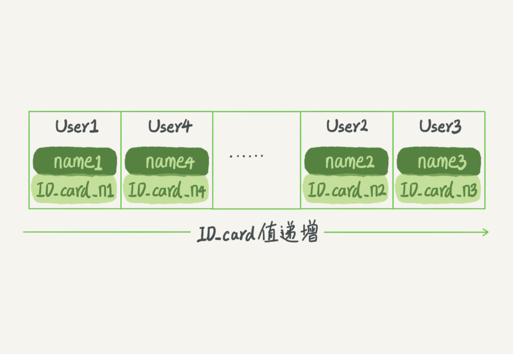
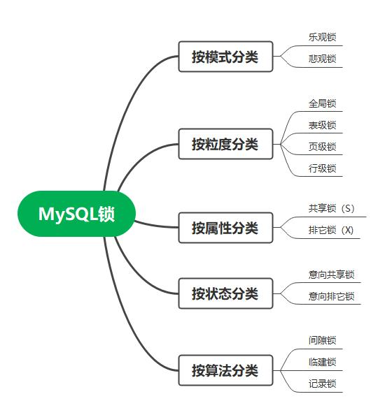
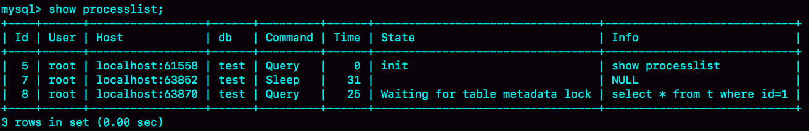
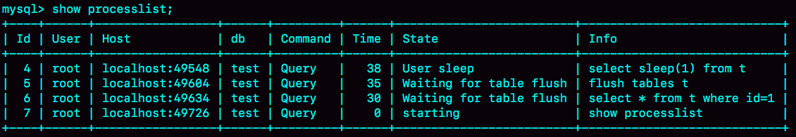
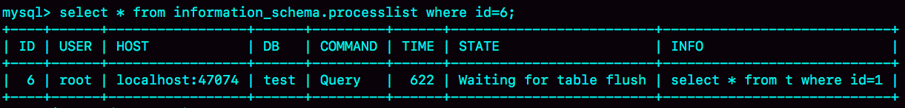
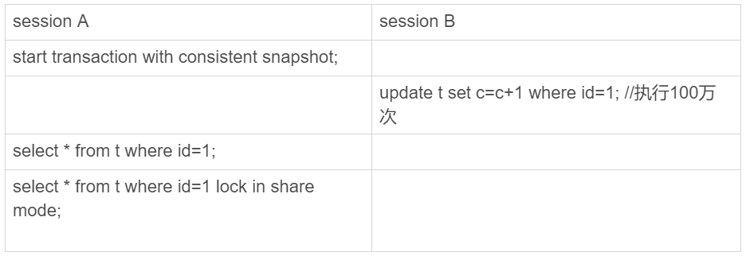
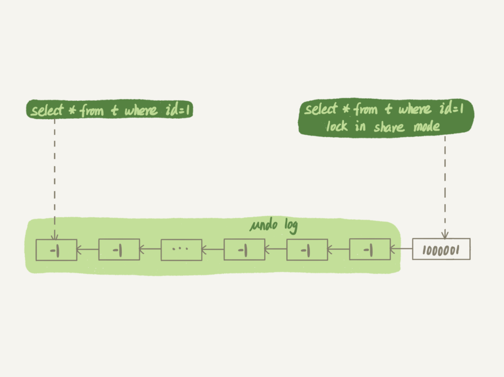

[**首页**](https://github.com/qdw497874677/myNotes/blob/master/首页检索.md)

# 基础架构

MySQL的基本架构示意图


大体分为两层：**Server层和存储引擎层**

Server层包括连接器、查询缓存、分析器、优化器、执行器，覆盖MySQL的大多数核心服务功能，以及所有的内置函数。所有跨存储引擎的功能都在这一层实现，比如存储过程、触发器、视图等。

存储引擎层负责数据的存储和提取。其架构模式是插件式的，支持InnoDB、MyISAM、Memory等多个存储引擎。现在最常用的存储引擎是InnoDB，从MySQL5.5.5版本开始成为了默认存储引擎。

从图中不难看出，不同的存储引擎共用一个 Server 层，也就是从连接器到执行器的部分。你可以先对每个组件的名字有个印象，接下来我会结合开头提到的那条 SQL 语句，带你走一遍整个执行流程，依次看下每个组件的作用。

## 连接器

连接器负责跟客户端建立连接、获取权限、维持和管理连接。连接命令一般是这么写的：

~~~bash
mysql -h$ip -P$port -u$user -p
~~~

连接命令中的 mysql 是客户端工具，用来跟服务端建立连接。在完成经典的 TCP 握手后，连接器就要开始认证你的身份，这个时候用的就是你输入的用户名和密码。

密码验证通过后，连接器会到权限表里面查出你拥有的权限，之后这个连接里面的权限判断逻辑，都依赖此时读到的权限。一个用户成功建立连接后，即使你用管理员账号对这个用户的权限做了修改，也不会影响已经存在连接的权限。修改完成后，只有再新建的连接才会使用新的权限设置。

连接完成后，如果没有后续动作，这个连接就处于空闲状态，可以通过show processlist;命令查看。Command 列显示为“Sleep”的这一行，就表示现在系统里面有一个空闲连接。


客户端如果太长时间没动静，连接器就会自动将它断开。这个时间是由参数 wait_timeout 控制的，默认值是 8 小时。断开后，客户端发送请求时会有错误提示，如果想继续，需要重连。

数据库里面，**长连接**是指连接成功后，如果客户端持续有请求，则一直使用同一个连接。**短连接**则是指每次执行完很少的几次查询就断开连接，下次查询再重新建立一个。

但是全部使用长连接后，你可能会发现，有些时候 MySQL 占用内存涨得特别快，这是因为 MySQL 在执行过程中临时使用的内存是管理在连接对象里面的。这些资源会在连接断开的时候才释放。所以如果长连接累积下来，可能导致内存占用太大，被系统强行杀掉（OOM），从现象看就是 MySQL 异常重启了。

解决的两种方案：

1. 定期断开长连接。使用一段时间，或者程序里面判断执行过一个占用内存的大查询后，断开连接，之后要查询再重连。
2. 如果你用的是 MySQL 5.7 或更新版本，可以在每次执行一个比较大的操作后，通过执行 mysql_reset_connection 来重新初始化连接资源。这个过程不需要重连和重新做权限验证，但是会将连接恢复到刚刚创建完时的状态。

## 查询缓存

MySQL 拿到一个查询请求后，会**先到查询缓存看看**，之前是不是执行过这条语句。之前执行过的语句及其结果可能会以 key-value 对的形式，被直接缓存在内存中。key 是查询的语句，value 是查询的结果。如果你的查询能够直接在这个缓存中找到 key，那么这个 value 就会被直接返回给客户端。如果语句不在缓存中，就会继续后面的执行阶段，执行结果会被存入查询缓存中。

**大多数情况下不建议使用查询缓存。**

只要有对一个表的更新，这个表上所有的查询缓存都会被清空。所以对于更新频繁的表，缓存的命中率很低。除非业务是对一张静态表操作，比如系统配置表，这张表的查询才适合使用查询缓存。

可以将参数query_cache_type 设置成 DEMAND，这样对于默认的 SQL 语句都不使用查询缓存。而对于你确定要使用查询缓存的语句，可以用 SQL_CACHE 显式指定，像下面这个语句一样：

~~~bash
mysql> select SQL_CACHE * from T where ID=10；
~~~

**MySQL 8.0 版本直接将查询缓存的整块功能删掉了**，也就是说 8.0 开始彻底没有这个功能了。

## 分析器

如果没有命中查询缓存，就要开始真正执行语句了。MySQL需要知道你要做什么，所以要对SQL语句做解析。

## 优化器

经过了分析器，MySQL 就知道你要做什么了。在开始执行之前，还要先经过优化器的处理。

优化器是在表里面有多个索引的时候，决定使用哪个索引；或者在一个语句有多表关联（join）的时候，决定各个表的连接顺序。比如你执行下面这样的语句，这个语句是执行两个表的 join：

~~~bash
mysql> select * from t1 join t2 using(ID)  where t1.c=10 and t2.d=20;
~~~

- 既可以先从表 t1 里面取出 c=10 的记录的 ID 值，再根据 ID 值关联到表 t2，再判断 t2 里面 d 的值是否等于 20。
- 也可以先从表 t2 里面取出 d=20 的记录的 ID 值，再根据 ID 值关联到 t1，再判断 t1 里面 c 的值是否等于 10。

优化器阶段完成后，这个语句的执行方案就确定下来了，然后进入执行器阶段。

## 执行器

MySQL 通过分析器知道了你要做什么，通过优化器知道了该怎么做，于是就进入了执行器阶段，开始执行语句。

先判断对于这些表有没有执行查询的权限，如果没有返回没有权限的错误提示。（如果命中缓存，会在查询缓存返回结果的时候做权限验证。）查询也会在优化器之前调用 precheck 验证权限)。

如果有权限，就打开表继续执行。打开表的时候，执行器就会根据表的引擎定义，去使用这个引擎提供的接口。

例如：

~~~sql
mysql> select * from T where ID=10;
~~~

ID 字段没有索引，那么执行器的执行流程是这样的：

1. 调用 InnoDB 引擎接口取这个表的第一行，判断 ID 值是不是 10，如果不是则跳过，如果是则将这行存在结果集中；
2. 调用引擎接口取“下一行”，重复相同的判断逻辑，直到取到这个表的最后一行。
3. 执行器将上述遍历过程中所有满足条件的行组成的记录集作为结果集返回给客户端。

对于有索引的表，执行的逻辑也差不多。第一次调用的是“取满足条件的第一行”这个接口，之后循环取“满足条件的下一行”这个接口，这些接口都是引擎中已经定义好的。

你会在数据库的慢查询日志中看到一个 rows_examined 的字段，表示这个语句执行过程中扫描了多少行。这个值就是在执行器每次调用引擎获取数据行的时候累加的。

在有些场景下，执行器调用一次，在引擎内部则扫描了多行，因此**引擎扫描行数跟 rows_examined 并不是完全相同的。**


# 日志系统

MySQL 可以恢复到半个月内任意一秒的状态。

从一条更新语句说起。

建表

~~~sql
mysql> create table T(ID int primary key, c int);
~~~

更新，ID等于2的一行的c值加一

~~~sql
mysql> update T set c=c+1 where ID=2;
~~~

查询语句的那一套流程，更新语句也是同样会走一遍。

与查询流程不一样的是，更新流程还涉及两个重要的日志模块，它们正是我们今天要讨论的主角：**redo log（重做日志）**和 **binlog（归档日志）**。

## binlog

binlog是MySQL的**Server层自己的日志**。

binlog的日志是追加写，一个文件满了会创建另一个继续。

作用：

1. **主从同步**：在主机上开启 binlog，主机将 binlog 同步给从机，从机通 过 binlog 来同步数据，进而实现主机和从机的数据同步。
2. **数据恢复**：通过使用 mysqlbinlog 工具再结合 binlog 文件，可以将数据恢复到过去的某一时刻。（备份）

记录的是语句的**逻辑记录**（把XX表XX条件的数据做了XX修改）。

具体过程同样也是先记录到内存中的binlog cache中，然后用过fsync()写到磁盘中。

binlog侧重做数据归档，比如从库数据同步。

binlog的落盘机制：

- sync_binlog=0：表示每次提交事务只把log写到os cache,并不执行fsync刷盘，刷盘取决于操作系统；
- sync_binlog=1：表示每次提交事务会将binlog刷盘（默认）;
- sync_binlog=N（N>=2): 表示每次提交事务只把log写到os cache，等累积到N个才执行fsync刷盘;

## redolog

redo log 是 InnoDB 引擎特有的日志，而 **Server 层也有自己的日志，称为 binlog（归档日志）。**

最开始 MySQL 里并没有 InnoDB 引擎。MySQL 自带的引擎是 MyISAM，但是 MyISAM 没有 crash-safe 的能力，**binlog 日志只能用于归档**。而 InnoDB 是另一个公司以插件形式引入 MySQL 的，既然只依靠 binlog 是没有 crash-safe 能力的，所以 InnoDB 使用另外一套日志系统——也就是 **redo log 来实现 crash-safe 能力**。

### 写入原理

采用WAL机制，进行写操作前先写日志。

当有一条记录需要更新的时候，InnoDB 引擎就会先把记录写到 redolog 里面，并更新内存，这个时候更新就算完成了。同时，InnoDB 引擎会在适当的时候，将这个操作记录更新到磁盘里面，而这个更新往往是在系统比较空闲的时候做。如果每次更新都写入磁盘，那么IO成本会很高。

innoDB 的 redolog 是固定大小的，比如可以配置为一组 4 个文件，每个文件的大小是 1GB。write pos 是当前记录的位置，一边写一边后移，写到第 3 号文件末尾后就回到 0 号文件开头。checkpoint 是当前要擦除的位置，也是往后推移并且循环的，擦除记录前要把记录更新到数据文件。（是循序写）

如果 write pos 追上 checkpoint，表示日志满了，这时不能执行新的更新了，需要擦除一些日志记录，把checkpoint推进一下。

有了 redolog，InnoDB 就可以保证即使数据库发生异常**重启，之前提交的记录都不会丢失，**这个能力称为 crash-safe。

sync_binlog 这个参数设置成 1 的时候，表示每次事务的 binlog 都持久化到磁盘。这个参数我也建议你设置成 1，这样可以保证 MySQL 异常重启之后 binlog 不丢失。

redolog的落盘机制：

- 0 – 每N秒将Redo Log Buffer的记录写入Redo Log文件，并且将文件刷入硬件存储1次。N由innodb_flush_log_at_timeout控制；
- 1 – 每个事务提交时，将记录从Redo Log Buffer写入Redo Log文件，并且将文件刷入硬件存储；
- 2 – 每个事务提交时，仅将记录从Redo Log Buffer写入Redo Log文件。Redo Log何时刷入硬件存储由操作系统和innodb_flush_log_at_timeout决定。这个选项可以保证在MySQL宕机，而操作系统正常工作时，数据的完整性。


### 与binlog的不同

两种日志有三点不同：

- redolog 是 InnoDB 引擎特有的；binlog 是 MySQL 的 Server 层实现的，所有引擎都可以使用。
- redolog 是物理日志，**记录的是“在某个数据页上做了什么修改”**；binlog 是逻辑日志，**记录的是这个语句的原始逻辑**，比如“给 ID=2 这一行的 c 字段加 1 ”。
- redolog 是循环写的，**空间固定会用完**；binlog 是可以追加写入的。“追加写”是指 binlog 文件写到一定大小后会切换到下一个，并**不会覆盖以前的日志**。
- redolog提供crash-safe能力，能够更快速地将提交但是没有写库的日志恢复（落盘策略为1，即提交时立刻写磁盘）。
  - 为什么说binlog不支持crash-safe能力？因为binlog本身设计出来就是为了做备份用，如果用修改binlog逻辑理论上是能实现crash-safe，但是性能会差很多或者说是配置更复杂，binlog目前是不支持的。
    - 怎么修改binlog可以支持crash-safe？
      - 在启动的时候，先拿到最新的全量数据，然后再执行之后的所有binlog日志
      - 或者，在binlog中增加类似redolog中的checkpoint，就能够分辨哪些数据已经提交但没有落库。


### 更新时的内部流程

有了对这两个日志的概念性理解，我们再来看执行器和 InnoDB 引擎在执行这个简单的 **update 语句时的内部流程**。

1. 执行器先找引擎取ID=2的这一行。ID是主键，引擎直接用树搜索找到这一行，如果ID=2这一行所在的数据页本来就在内存中，就直接返回给执行器；否则，需要先从磁盘读入内存，然后再返回。
2. 执行器拿到引擎给的行数据，把这个值加上1，得到新的一行数据，再调用引擎接口写入这行新数据。
3. 引擎将这行新数据更新到内存中，同时将这个更新操作记录到redo log中（在buffer中操作，写磁盘看机制），此时redo log处于prepare状态。然后告知执行器执行完成了，随时可以提交事务。
4. 执行器生成这个操作的binlog，并把binlog写入磁盘（根据机制）。
5. 执行器调用引擎提供的提交事务接口，引擎把刚刚写入的redolog改为提交状态（在buffer中操作，写磁盘看机制），更新完成。


图中浅色框表示是在 InnoDB 内部执行的，深色框表示是在执行器中执行的。

redolog 的写入拆成了两个步骤：**prepare 和 commit，这就是"两阶段提交"**。

## 两阶段提交

>  为什么必须有“两阶段提交”呢？

当存在使用binlog的场景，则就要考虑**让两份日志之间的逻辑一致**。要说明这个问题，我们得从文章开头的那个问题说起：怎样让数据库恢复到半个月内任意一秒的状态？

binlog 会记录所有的逻辑操作，并且是采用“追加写”的形式。如果你的 DBA 承诺说半个月内可以恢复，那么备份系统中一定会保存最近半个月的所有 binlog，同时系统会定期做整库备份。这里的“定期”取决于系统的重要性，可以是一天一备，也可以是一周一备。

当需要恢复到指定的某一秒时，比如某天下午两点发现中午十二点有一次误删表，需要找回数据，那你可以这么做：

- 首先，找到最近的一次全量备份，如果你运气好，可能就是昨天晚上的一个备份，从这个备份恢复到临时库；
- 然后，从备份的时间点开始，将备份的 binlog 依次取出来，重放到中午误删表之前的那个时刻。

这样你的临时库就跟误删之前的线上库一样了，然后你可以把表数据从临时库取出来，按需要恢复到线上库去。

**为什么需要 两阶段提交 呢**

由于 redo log 和 binlog 是两个独立的逻辑，如果不用两阶段提交，要么就是先写完 redo log 再写 binlog，或者采用反过来的顺序。我们看看这两种方式会有什么问题。

- 先写redo log后写binlog：如果在写完redo log后，binlog还没有写的时候发生cash。用binlog恢复的临时库，会丢失一条数据，与原库（存储引擎提供的数据，包含redo log）的值不同。
- 先写binlog后写redo log：如果在写完binlog后，redo log还没有写的时候发生cash。之后用binlog恢复的临时库，会比原库多一条数据。

可以看到，如果不使用“两阶段提交”，那么数据库的状态就有可能和用它的日志恢复出来的库的状态不一致。

不光是误操作后需要这个过程来**恢复数据**。当你需要**扩容**的时候，也就是需要再多搭建一些备库来增加系统的读能力的时候，现在常见的做法也是用全量备份加上应用 binlog 来实现的，这个“不一致”就会导致你的线上出现主从数据库不一致的情况。

简单说，redo log 和 binlog 都可以用于表示事务的提交状态，而两阶段提交就是让这**两个状态保持逻辑上的一致**。

# 事务隔离

简单来说，事务就是要保证一组数据库操作，要么全部成功，要么全部失败。在MySQL中，事务支持是在引擎层实现的。MySQL 原生的 MyISAM 引擎就不支持事务，这也是 MyISAM 被 InnoDB 取代的重要原因之一。

## 隔离性与隔离级别

提到事务，就会想到ACID（原子性、一致性、隔离性、持久性），其中的I就是**隔离性**。

当数据库上有多个事务同时执行的时候，就可能出现脏读、不可重复读、幻读的问题。为了解决这些问题，就有了**隔离级别**的概念。

隔离性越高，效率就也低，所以很多时候要去寻找平衡点。SQL标准的事务隔离界别包括：**读未提交、读提交、可重复读和串行化**。

- 读未提交：指一个事务还没提交时，它做的变更就能被别的事务看到。
- 读提交（Oracle 数据库的默认隔离级别）：指一个事务提交之后，它做的变更才会被其他事务看到。
- 可重复读（MySQL默认隔离级别）：指一个事务执行过程中，总是跟这个事务在启动时看到的数据是一致的（只能看到事务开启时的数据）。同时也有读提交的特性。
- 串行化：对同一行记录，写会加写锁，读会加读锁。当出现读写锁冲突时，后访问的事务必须等待前一个事务执行完成，才能继续执行。

在实现上，数据库里面会创建一个视图，访问的时候以视图的逻辑结果为准。在**可重复读**隔离级别下，这个视图是在事务启动时创建的，整个事务存在期间都用这个视图。在**读提交**的隔离级别下，这个视图是在每个SQL语句开始执行的时候创建的，所以其他事务修改了数据后，读提交的事务中有可能查到不一致的数据。**读未提交**隔离级别下直接返回记录上的最新值，没有视图概念。**串行化**隔离级别下直接用加锁的方式避免并行访问。

配置隔离级别的方式，将启动参数 transaction-isolation 的值设置成 READ-COMMITTED。可以用 show variables 来查看当前的值。

~~~sql
mysql> show variables like 'transaction_isolation';

+-----------------------+----------------+

| Variable_name | Value |

+-----------------------+----------------+

| transaction_isolation | READ-COMMITTED |

+-----------------------+----------------+
~~~

使用可重复级别的场景：管理一个银行账户。一个表存账户余额，一个表存账单明细，现在要做数据校对，判断一个月的余额之差，是否和账单明细一致。在校验过程中，及时有用户发生了交易，也不影响校对结果。

## 事务隔离的实现

在 MySQL 中，实际上每条记录在更新的时候都会同时记录一条回滚操作。记录上的最新值，通过回滚操作，都可以得到前一个状态的值。

假设一个值从 1 被按顺序改成了 2、3、4，在回滚日志（undo log）里面就会有类似下面的记录。


当前值是 4，在查询这条记录的时候，**不同时刻启动的事务会有不同的 read-view**。在视图 A、B、C 里面，这一个记录的值分别是 1、2、4，同一条记录在系统中可以存在多个版本，就是数据库的**多版本并发控制（MVCC）**。

对于 read-view A，要得到 1，就必须将当前值依次执行图中所有的回滚操作得到。即使现在另一个事务正在将4改为5，这个事务根视图A、B、C对应的事务是不冲突的。

系统判断没有事务需要这些回滚日志时，回滚日志会被**删除**。就是系统里面没有比这个回滚日志更早的视图的时候。

> 为什么尽量不要使用长事务

使用长事务说明系统中**存在很老的事务视图**。这些事务可能访问数据库里面的任何数据，所以这个事务提交之前，数据库里面这些事务用到的视图对应的用到**回滚信息**都必须要保存，就会导致大量的占用存储空间。

在 MySQL 5.5 及以前的版本，回滚日志是跟数据字典一起放在 ibdata 文件里的，即使长事务最终提交，回滚段被清理，文件也不会变小。

除了对回滚段的影响，长事务还**占用锁资源**，也可能拖垮整个库，这个我们会在后面讲锁的时候展开。

## 事务的启动方式

MySQL的事务启动方式有以下几种：

1. 显示启动事务语句。begin或start transaction。配套的提交语句是commit，回滚语句是rollback。
2. set autocommit=0。这个命令会将这个线程的自动提交关掉。执行SQL后，事务就启动了，但不会自动提交，需要助兴执行commit或者rollback或者断开连接。

有些客户端连接框架会默认连接成功后先执行一个 set autocommit=0 的命令。这就导致接下来的查询都在事务中，如果是长连接，就导致了意外的长事务。因此，我会建议你总是使用 set autocommit=1, 通过显式语句的方式来启动事务。


可以在 information_schema 库的 innodb_trx 这个表中查询长事务，比如下面这个语句，用于查找持续时间超过 60s 的事务。

~~~sql
select * from information_schema.innodb_trx where TIME_TO_SEC(timediff(now(),trx_started))>60
~~~


# 索引一

## 索引的常见模型

### 哈希表


哈希表是一种以键 - 值（key-value）存储数据的结构，我们只要输入待查找的键即 key，就可以找到其对应的值即 Value。

不可避免地，多个 key 值经过哈希函数的换算，会出现同一个值的情况。处理这种情况的一种方法是，拉出一个链表。

好处是增加新的 User 时速度会很快，只需要往后追加。但缺点是，因为不是有序的，所以哈希索引做区间查询的速度是很慢的。

哈希表这种结构**适用于只有等值查询的场景**，比如 Memcached 及其他一些 NoSQL 引擎。

### 有序数组



有序数组在等值查询和范围查询场景中的性能就都非常优秀。

如果仅仅看查询效率，有序数组就是最好的数据结构了。但是，在需要更新数据的时候就麻烦了，你往中间插入一个记录就必须得挪动后面所有的记录，成本太高。

所以，有序数组索引**只适用于静态存储引擎**。

### 搜索树


当然为了维持 O(log(N)) 的查询复杂度，你就需要保持这棵树是平衡二叉树。为了做这个保证，更新的时间复杂度也是 O(log(N))。

二叉树是搜索效率最高的，但是实际上大多数的数据库存储却并不使用二叉树。其原因是，索引不止存在内存中，还要写到磁盘上。

为了让一个查询尽量少地读磁盘，就必须让查询过程访问尽量少的数据块。那么，我们就不应该使用二叉树，而是要使用“N 叉”树。这里，“N 叉”树中的“N”取决于数据块的大小。

在 MySQL 中，索引是在存储引擎层实现的，所以并没有统一的索引标准，即不同存储引擎的索引的工作方式并不一样。而即使多个存储引擎支持同一种类型的索引，其底层的实现也可能不同。

## InnoDB的索引模型

在InnoDB中，表都是根据主键顺序以索引的形式存放的，这种存储方式的表称为索引组织表。InnoDB 使用了 B+ 树索引模型，所以数据都是存储在 B+ 树中的。

**每一个索引在InnoDB里面对应一颗B+树**。

假设有一个主键为ID的表，表中有字段k，并且在k上有索引。

~~~sql
mysql> create table T(
id int primary key, 
k int not null, 
name varchar(16),
index (k))engine=InnoDB;
~~~

表中 R1~R5 的 (ID,k) 值分别为 (100,1)、(200,2)、(300,3)、(500,5) 和 (600,6)，两棵树的示例示意图如下。


根据叶子节点的内容，索引类型分为主键索引和非主键索引。

主键索引的叶子节点存的是整行数据，在InnoDB里，主键索引也被称为聚簇索引。

非主键索引的叶子节点内容为主键的值，在InnoDB里，非主键索引也被称为二级索引。

> 基于主键索引和普通索引的查询有什么区别？

- 基于主键查询，只需要搜索主键的这颗B+树；
- 基于普通索引的查询，需要先搜索普通索引的树，得到主键值，然后再到主键索引数上搜索一次。这个过程称为回表。

## 索引维护

B+树为了维护索引的有序性，在插入新值的时候需要做必要的维护。

如果R5所在的数据页满了，根据B+树的算法，这时需要申请一个新的数据页，然后挪动部分数据过去，这个过程称为**页分裂**。

除了性能外，页分裂操作还影响数据页的利用率。原本放在一个页中的数据，现在分到两个页中。

有分裂就有合并。当相邻两个页面由于删除了数据，利用率很低之后，将数据页做合并。合并的过程，可以认为是分裂过程的逆过程。

>  根据索引维护的过程，讨论那些情况下应该使用自增主键，那些场景不行？

设置自增主键后，每次插入新纪录都是追加操作，不会触发叶子节点的分裂。

有业务逻辑的字段作为主键，往往不容易保证有序插入，这样写数据成本相对较高。

除了考虑性能外，我们还可以从存储空间的角度来看。假设表中有一个唯一字段，比如身份证号。如果用身份证号做主键，那么每个二级索引的叶子节点需更多空间存储主键值。**显然主键长度越小，普通索引的叶子节点就越小，普通索引占用的空间也就越小。**

适合用业务字段做主键的场景：

1. 只有一个索引
2. 该索引必须是唯一索引

这样的场景就是KV场景。**尽量使用主键查询**。

# 索引二

建表

~~~sql
mysql> create table T (
ID int primary key,
k int NOT NULL DEFAULT 0, 
s varchar(16) NOT NULL DEFAULT '',
index k(k))
engine=InnoDB;

insert into T values(100,1, 'aa'),(200,2,'bb'),(300,3,'cc'),(500,5,'ee'),(600,6,'ff'),(700,7,'gg');
~~~


> 如果我执行 select * from T where k between 3 and 5，需要执行几次树的搜索操作，会扫描多少行？

这条SQL的查询流程：

1. 在k索引树上找到k=3的记录，取得主键ID=300；
2. 再到ID索引树上查ID=300对应的整条记录R3；
3. 在k索引树取下一个值k=5，取得 ID=500；
4. 再回到 ID 索引树查到 ID=500 对应的 R4；
5. 在 k 索引树取下一个值 k=6，不满足条件，循环结束。

整个搜索过程回表了两次。

怎么通过索引优化，避免回表？

## 覆盖索引

在查询中，查询的索引覆盖了查询的需求，就称为覆盖索引。

覆盖索引可以减少树的搜索次数，能够显著提升查询性能，是常用的性能优化手段。

比如建立身份证号和姓名的联合索引，对于根据身份证号查询姓名的请求，就能提高效率。但是相对也会增加空间代价，要权衡。

建一个市民表

~~~sql
CREATE TABLE `tuser` (
  `id` int(11) NOT NULL,
  `id_card` varchar(32) DEFAULT NULL,
  `name` varchar(32) DEFAULT NULL,
  `age` int(11) DEFAULT NULL,
  `ismale` tinyint(1) DEFAULT NULL,
  PRIMARY KEY (`id`),
  KEY `id_card` (`id_card`),
  KEY `name_age` (`name`,`age`)
) ENGINE=InnoDB
~~~


## 最左前缀原则

B+树的这种索引结构，可以利用索引的最左前缀，来定位记录。避免为了覆盖索引，创建多个索引树。

这里用(name,age)这个联合索引来分析。


索引项是按照索引定义里面出现的字段顺序排序的。

如果需求是查到所有名字是“张三”的人，可以迅速定位到ID4，然后向后遍历得到所有需要的结果。

如果需求是查到所有名字第一个是“张”的人，你的SQL语句的条件是“where name like ‘张%’”。这时也能用上这个索引，查到到第一个符合条件的记录是ID3，然后向后遍历，直到不满足条件为止。

只要满足最左前缀，就可以利用索引来加速检索。这个最左前缀可以是联合索引的最左N个字段，也可以是字符串索引的最左M个字符。

> 建立联合索引的时候，如何安排索引内的字段顺序？

这里的评估标准是，索引的复用能力。

第一原则就是，如果通过调整顺序，可以少维护一个索引，那么这个顺序往往就是需要有限考虑采用的。

接下来考虑的原则就是空间。比如name和age都要各自查，同时也要联合查询。name比age字段大，可以考虑使用联合索引(name,age)和一个(age)索引（不各建一个单独的索引，是因为要用到覆盖索引）。

## 索引下推

> 不符合最左前缀的情况是什么样的？

以联合索引(name,age)为例。需求：查找出表中名字第一个字是张，而且年龄是10岁的所有男孩。SQL：

~~~sql
mysql> select * from tuser where name like '张%' and age=10 and ismale=1;
~~~

在搜索索引树时，只能用到索引‘张’，找到第一个满足条件的记录ID3。

接下来就要去判断其他条件是否满足

在MySQL5.6之前，只能从ID3开始一个一个回表。到主键索引上找出数据行，再去对比字段值。

MySQL5.6引入的**索引下推**优化。可以在索引遍历过程中，对索引中包含的字段先作判断，直接滤掉不满足条件的记录，减少回表记录。

无索引下推：


有索引下推：


上面两个图中虚线表示回表。

也就是说like或者范围的索引字段所在的联合索引位置中后面的索引字段也有作用了。


# 全局锁和表锁




## 全局锁

对整个数据库实例加锁。MySQL 提供了一个加全局读锁的方法，命令是 Flush tables with read lock (**FTWRL**)。当你需要让整个库处于只读状态的时候，可以使用这个命令，之后其他线程的以下语句会被阻塞：数据更新语句（数据的增删改）、数据定义语句（包括建表、修改表结构等）和更新类事务的提交语句。

典型使用场景：做**全库逻辑备份**。就是吧整个库每个表都select出来存成文本。

这样做的代价：

- 如果从主库上备份，那么备份其阿金不能执行更新，业务基本上停摆。
- 如果在从库上备份，那么备份期间从库不能执行主库同步过来的binlog，导致主从延迟。

但是如果不加锁，可能会导致新来的业务操作的一部分表更新了而另一部分表没有。

可以使用视图是解决。

官方自带的逻辑备份工具是mysqldump。当 mysqldump 使用参数–single-transaction 的时候，导数据之前就会启动一个事务，来确保拿到一致性视图。而由于 MVCC 的支持，这个过程中数据是可以正常更新的。**single-transaction 方法只适用于所有的表使用事务引擎的库。**

readonly 方式(set global readonly=true)也可以让全库进入只读状态，但我还是会建议你用 FTWRL 方式，主要有两个原因：

- 在有些系统中，readonly 的值会被用来做其他逻辑，比如用来判断一个库是主库还是备库。因此，修改 global 变量的方式影响面更大，我不建议你使用。
- 在异常处理机制上有差异。如果执行 FTWRL 命令之后由于客户端发生异常断开，那么 MySQL 会**自动释放**这个全局锁，整个库回到可以正常更新的状态。而将整个库设置为 readonly 之后，如果客户端发生异常，则数据库就会**一直保持** readonly 状态，这样会导致整个库长时间处于不可写状态，风险较高。


## 表级锁

表锁一般是在**数据库引擎不支持行锁的时候才会被用到**的。

MySQL 里面表级别的锁有两种：一种是**表锁**，一种是**元数据锁**（meta data lock，MDL)。

**表锁**的语法是 lock tables … read/write。与 FTWRL 类似，可以用 unlock tables 主动释放锁，也可以在客户端断开的时候自动释放。需要注意，lock tables 语法除了会限制别的线程的读写外，也**限定了本线程接下来的操作对象**。

另一类表级的锁是 **MDL（metadata lock)**。MDL 不需要显式使用，在访问一个表的时候会被**自动加上**。MDL 的作用是，**保证读写的正确性**。在 MySQL 5.5 版本中引入了 MDL，**当对一个表做增删改查操作（DDL）的时候，加 MDL 读锁；当要对表做结构变更操作（DML）的时候，加 MDL 写锁。**

- 读锁之间不互斥，因此你可以有多个线程同时对一张表增删改查。
- 读写锁之间、写锁之间是互斥的，用来保证变更表结构操作的安全性。因此，如果有两个线程要同时给一个表加字段，其中一个要等另一个执行完才能开始执行。

对表做结构变更操作，导致加MDL写锁，在这个变更表结构的操作和之后的读写操作都会被阻塞。写锁前的所有读锁都释放掉后，就可执行这个上写锁的操作了。

> 如何安全的给小表加字段？

首先解决长事务，事务不提交就会一直占着MDL锁。如果要对表结构变更，刚好有长事务在执行，可以先kill这个长事务。

如果是请求很频繁，kill一个不现实。可以在alter table 语句里面设定等待时间，如果在这个指定的等待时间里面能够拿到 MDL 写锁最好，拿不到也不要阻塞后面的业务语句，先放弃。之后开发人员或者 DBA 再通过重试命令重复这个过程。

# 行锁

MySQL 的行锁是在引擎层由各个引擎自己实现的。但并不是所有的引擎都支持行锁，比如 MyISAM 引擎就不支持行锁。

行锁就是针对数据表中行记录的表。事务A更新一行数据中，事务B也要更新这一条数据，必须等待A事务操作完。

## 两段锁

例子，id是表t的主键。事务B的update语句执行时会是什么现象。


问题的结论取决与事务A在执行完两条update语句后，持有哪些锁，以及在什么时候释放。发生的结果是事务B的update语句会被阻塞，直到事务A执行commit之后，事务B才能继续执行。

在InnoDB事务中，**行锁是在需要的时候才加上**的，并不是不需要了就立刻释放，而是要等到**事务结束时才释放**。这个就是两阶段锁协议。

> 实际中有什么优化?

因为行锁是需要的时候才加上，所以可以把最可能造成锁冲突、最可能影响并发度的操作**尽量往事务的后面放**。

> 举个例子
>
> 实现电影票在线交易业务，顾客A要在影院B购买电影票。简化业务后：
>
> - 从顾客A账户余额中扣除电影票价
> - 给影院B的帐户余额增加这张电影票价
> - 记录一条交易日志
>
> 两条update和一条insert。为了保证原子性，要放到一个事务中。要怎么安排语句在事务中的顺序。
>
> 可能发生冲突的部分是第二个操作，给同一个影院增加余额。如果把这条语句放到第三个位置，那么发生冲突获取锁的事务释放锁加快，从而其他事务等待锁的时间就减少了。**（让第二个操作离提交事务节点更近）**
>
> 但是还没有完全解决，访问量大冲突多了就可能导致资源耗尽。

## 死锁和死锁检测

并发系统中不同县城出现循环等待资源依赖，涉及的线程都在等待别的线程释放资源时，就会导致这几个线程进入无限等待的状态，称为死锁。

当出现死锁，有两种解决策略

- 直接进入等待，直到超时。超时时间可以通过参数innodb_lock_wait_timeout来设置
- 发起死锁检测，发现死锁后，主动回滚死锁链条中的某一个事务，让其他事务得以继续执行

在InnoDB中，innodb_lock_wait_timeout的默认值是50s，意味着如果采用第一个策略，当出现死锁后，第一个被锁住的线程要过50s才能退出，然后其他线程才有可能继续执行，对于在线服务难以结束，但是也不能直接设为很小的值，因为时间短不足以判断是死锁。

所以一般采取第二种策略，即：主动死锁检测，而且innodb_deadlock_detect是默认打开的。主动死锁检测：当一个事务被锁的时候，看看它依赖的线程有没有被别人锁住，如此循环，最后判断是否出现了循环等待，也就是死锁。这种策略会导致消耗大量CPU资源，所以上面的例子，CPU利用率很高但是每秒执行的事务不多。

> 到底怎么解决热点行更新导致的性能问题呢？

- 如果你能确保这个业务一定不会出现死锁，可以**临时把死锁检测关掉**。有风险。
- 另一个思路是**控制并发度**。一般并发控制做在服务器端。如果有中间件，可以考虑在中间件实现。基本思路就是，对于相同行的更新，在引入引擎之前排队。
  - 还可以通过将一行改为逻辑上的多行来减少锁冲突·。比如将影院账户余额分为10行，每次加随机选一行来更新，减少锁冲突，从而减少死锁检测的消耗。


# 事务与锁

前面事务讲到，如果是可重复读隔离级别，事务T启动的时候会创建一个视图read-view，之后事务T执行期间，即使有其他事务修改了数据，事务T看到和事务启动时一致。

但是上面讲行锁时又提到，一个事务要更新一行，如果有另外一个事务拥有这一行的行锁，那么后来的事务会进入等待状态。那么等待结束后，这个事务获取的数据是前一个事务更新前还是更新后呢。

举一个例子。

只有两个字段的表

~~~sql
mysql> CREATE TABLE `t` (
  `id` int(11) NOT NULL,
  `k` int(11) DEFAULT NULL,
  PRIMARY KEY (`id`)
) ENGINE=InnoDB;
insert into t(id, k) values(1,1),(2,2);
~~~


（没有声明启动事务，说明是设置了事务自动提交）

事务有两种启动方式

- begin/start transaction：事务在命令之后的第一个操作InnoDB表的语句时启动。一致性视图是在执行第一个快照读语句时创建的。
- start transaction with consistent snapshot：事务在命令执行时创建。一致性视图在这个命令执行时创建。

这个图中的结果为：事务B查到的k的值为3，事务A查到的k的值为1。

在MySQL中，有两个“视图”概念：

- 一个是view。它是一个用查询语句定义的虚拟表，在调用的时候执行查询语句并生成结果。create view
- 另一个是InnoDB在实现MVCC时用到的一致性读视图，即consistent read view，用于支持RC和RR隔离级别的实现。

**没有物理结构，作用是在事务执行期间用来定义“我能看到什么数据”。**

## 快照在MVCC里面怎么工作

在RR隔离级别下，事务在启动的时候就“拍了个快照”。这个快照是基于整个数据库的。

InnoDB里面每个事务有一个**唯一的事务ID**，transaction id。它是在事务开始的时候申请的。而**每行数据也是有多个版本**的。每次事务更新数据的时候，都会生成一个新的数据版本，并且把事务id赋值给这个数据版本的事务id，记为row trx_id。同时旧数据会保留。


图中的三个虚线箭头就是undo log；而V1、V2、V3并不是物理上真实存在的，每次在需要的时候根据当前版本和undo log计算出来的。

**InnoDB通过事务id与一致性视图的对比来定义可见数据版本**。

创建事务id和生成一致性视图，可能是同一时间，也有可能中间相隔一段时间。后者是因为默认情况，在第一次select（更新操作自带前置select）的时候才会创建试图（创建数组和高低水位）。

可重复读就是说，一个事务以它的启动为准，只认版本在它前的，不认在它之后的。对于自己修改过的数据的新版本也认。

下面就是解释InnoDB引擎如何利用MVCC机制来实现可重复读的：

InnoDB**为每个事务构造一个数组**，用来保存这个事务启动瞬间，**当前正在活跃**（启动了还**没提交**）的所有事务id（**动态**的，事务完成就从数组中移除）。

- 低水位：**数组**里面事务id最小值记为**低水准**，
- 高水位：**当前系统**创建过的最大事务id加1记为**高水准**。

这个视图数组和高水准，组成了当前事务的一致性视图（read-view）。**数据版本的可见性规则，就是基于row trx_id和这个一致性视图的对比结果得到的。**


对于当前事务的启动瞬间来说，一个数据版本的row trx_id，有一下几种可能：

1. 如果落在绿色部分，表示这个版本是已提交的事务或者是当前事务自己生成的。这个数据是可见的。
2. 如果落在红色部分，表示这个版本是由将来启动的事务生成的，是不可见的。
3. 如果落在黄色部分。那么有两种情况
   1. 若 row trx_id 在数组中，表示这个版本是由还没提交的事务生成的，不可见；
   2. 若 row trx_id 不在数组中，表示这个版本是已经提交了的事务生成的，可见。

再总结下上面的：

自己的事务，**可见**；比低水位小的事务就是曾经已提交的事务，**可见**；大于低水位且小于高水位，不在数组中的事务，**可见**，在数组中，**不可见**；比高水位大的，**不可见**。

**InnoDB 利用了“所有数据都有多个版本”的这个特性，实现了“秒级创建快照”的能力。**

对于上面的例子


事务A的视图数组是[99,100]，事务B的视图数组是[99,100,101]，事务C的视图数组是[99,100,101,102]

事务A查询的时候，先看到时101版本在红色不可见，看上一个版本，102红色不可见，再看上一版本90可见。所以查到的是(1,1)

真正的流程看起来很麻烦，重新翻译一遍的话就是：一个数据版本，对于一个事务视图来说，除了**自己的更新总是可见以外**，有三种情况：（其实就是可重复读的意思吧）

1. **版本未提交，不可见；**
2. **版本已提交，但是在视图创建后提交的，不可见；**
3. **版本已提交，并且是视图创建前提交的，可见。**

## 更新

事务B在更新的时候，就不能再历史版本上更新了，否则事务C的更新就丢失了。

**更新数据都是先读后写，而这个读，只能读当前的值，成为“当前读”。**select 语句如果加锁，也是当前读。

如果改变一下事务C，让C不立即提交。


那么B的更新语句怎么处理呢。这里就用到了“两阶段锁协议”。事务C还没提交，也就是说(1,2)这个版本上的**写锁还没释放**。而事务B是当前读，必须要读最新版本，所以**必须加锁，因此进入等待状态，等待C释放这个锁。**

想问这种还是可重复读吗？是不是在事务B之后的事务C把数据修改了并提交，修改后的数据在事务B开启的一致性视图中可见。

回答：在事务B开启的一致性视图中是不可见的，因为是高于B一致性视图中的高水位的，只有在更新数据时的当前读是读最新数据，而本事务的更新又是可见的，所以在更新后查询的数据时变化的是合理的符合可重复读。

## 总结事务的可重复读

**可重复读的核心就是一致性读**，而事务更新数据时，只能用当前读，如果当前行锁被其他事务占用就要进入等待。

对于读提交，与可重复读类似，区别：**前者每一个语句执行都会重新计算出一个新的视图；后者只在事务开始的时候创建一致性视图，之后其他查询都要用到这个一致性视图。**

# 实战篇

## 普通索引和唯一索引，怎么选

### 查询过程

- 对于普通索引，查到满足条件的记录后，需要继续查找下一个记录，直到碰到第一个不满足的记录才停止。
- 对于唯一索引，由于定义了唯一性，查到第一个满足条件的记录后就会停止。

这两者带来的性能差异微乎其微。InnoDB 的数据是按数据页为单位来读写的。第一个符合的记录在页的最后位置的概率很小。

### 更新过程

先理解change buffer的机制。

插入一个（4，400）的流程：

第一种情况：这个记录要更新的目标页**在内存中**。

- 对于唯一索引，找到3和5之间的位置，判断到没有冲突，插入这个值，语句执行结束
- 对于普通索引，找到3和5之间的位置，插入这个值，语句执行结束。

第二种情况：记录要更新的目标页**不在内存中**。

- 对于唯一索引，需要将数据页读到内存中，判断没有冲突，插入这个值，语句执行结束
- 对于普通索引，将更新记录在change buffer，语句执行结束。

通过change buffer减少磁盘访问，所以更新性能很明显。

### change buffer 的使用场景

首先**普通索引会用到change buffer ，唯一索引不适用。**

如果数据刚更新就需要查找，那么需要立刻进行merge，这样就不会减少IO的次数，反而增加维护change buffer 的代价，这种业务不适合。

对于写多读少的业务，页面在写完后马上被访问到的概率比较小，此时change buffer 的使用效果更好。

### 索引选择总结

两类索引在查询能力上没有差别，主要考虑对更新性能的影响，建议**尽量选择普通索引**。

如果所有的更新后面，都伴随对这个新纪录的查询，那应该关闭change buffer ，而其他情况下change buffer 都能提升更新性能。

change buffer能够提高更新性能，所以：

1. 尽量选择普通索引而不是唯一索引
2. 尽量不要更新后立刻查询

### change buffer 和redo log

执行下面这个插入语句

~~~java
mysql> insert into t(id,k) values(id1,k1),(id2,k2);
~~~

假设当前k索引树的状态：查找到位置后，k1所在的数据页在内存中（buffer poll），k2所在的数据页不再内存中。


更新语句进行了如下操作：

- 因为Page1**在内存中，直接更新内存**。
- 因为Page2**没有在内存中，就在内存的change buffer区域记录**下“我要往Page2插入一行”这个信息。
- 将上述两个动作**记入redo log中**。

做完上面这些事，事务就可以完成了。写了两处内存，然后写了一处磁盘（两次操作合在一起写了一次磁盘）。

图中两个虚线箭头，是后台操作，不影响更新的响应时间。

>  在这之后的读请求怎么处理？

如果读语句发生在更新语句后不久，内存中的数据都还在，那么此时的这两个读操作就与系统表空间（ibdata1）和redo log（ib_log_fileX）无关了。


从图中可以看出：

1. 读Page1的时候，直接从内存返回
2. 读Page2的时候，需要把Page2从磁盘读入内存中，然后应用change buffer里面的操作日志，生成一个正确的版本并返回结果。需要读 Page 2 的时候，这个数据页才会被读入内存。

简单说如果使用到change buffer的话，就是在更新不在内存中的数据的时候，在change buffer中记录这个更新的操作，当要读这条数据的时候从磁盘读入内存并且执行change buffer的操作。如果不用change buffer，则更新的时候就要从磁盘读出数据到内存。如果更新完不是马上需要查询的话，使用change buffer会提升更新速度，通过减少读磁盘

对比两个机制在提升更新性能上的收益的话：**redo log 主要节省的是随机写磁盘的 IO 消耗（转成顺序写），而 change buffer 主要节省的则是随机读磁盘的 IO 消耗。**


## MySQL为什么会选错索引

例子

在删除和新增数据的场景，MySQL会出现选错索引

### 优化器的逻辑

选择索引就是优化器的工作。影响的因素有：扫描行数，是否使用临时表，是否排序等因素。

> 扫描行数是怎么判断的？

在执行语句前，MySQL并不能精确地知道满足条件的记录有多少条，只能根据统计信息来估算记录数。这个统计信息就是**索引的区分度**。

一个索引上不同的值越多，这个索引的区分度就越好。而一个索引上不同的值的个数，我们称之为**基数**。基数越大区分度越好。

> MySQL是怎么得到索引的基数的呢？

因为对整个表每行统计代价很高，所以MySQL选择采样统计。

**采样统计**：InnoDB默认会选择N个数据页，统计这些页面上的不同值（**索引统计**），得到一个平均值，然后乘以索引的页面数，得到基数。当变更的数据行超过1/M时，会自动触发一次索引统计。

MySQL中有两种存储索引统计数据的方式，可以通过设置参数innodb_stats_persistent的值来选择：

- on：表示索引统计信息会持久化存储。此时默认的N是20，M是10。
- off：表示索引统计信息只存在内存中。此时默认的N是8，M是16。


## 能不能使用join

创建两个表

~~~sql
CREATE TABLE `t2` (
  `id` int(11) NOT NULL,
  `a` int(11) DEFAULT NULL,
  `b` int(11) DEFAULT NULL,
  PRIMARY KEY (`id`),
  KEY `a` (`a`)
) ENGINE=InnoDB;

drop procedure idata;
delimiter ;;
create procedure idata()
begin
  declare i int;
  set i=1;
  while(i<=1000)do
    insert into t2 values(i, i, i);
    set i=i+1;
  end while;
end;;
delimiter ;
call idata();

create table t1 like t2;
insert into t1 (select * from t2 where id<=100)
~~~

这两个表都有一个主键索引 id 和一个索引 a，字段 b 上无索引。存储过程 idata() 往表 t2 里插入了 1000 行数据，在表 t1 里插入的是 100 行数据。


让优化器按照指定的方式去join，用straight_join

~~~sql
select * from t1 straight_join t2 on (t1.a=t2.a);
~~~

看一下explain的结果


可以看到被驱动表t2的字段a上的索引被用到了。执行的流程为：

1. 从表t1中读取一行数据R；
2. 从数据行R中，取出a字段到表t2里去查找；
3. 取出表t2中满足条件的行，跟R组成一行，作为结果集的一部分；
4. 重复执行步骤1到3，直到表t1的末尾循环结束。

总结：就是遍历表t1，根据t1中每行的a字段在t2去查找对应的记录。这个过程中可以用上被驱动表的索引。这个过程为“Index Nested-Loop Join”，简称 NLJ。

流程图：


整个流程里：

1. 对驱动表t1做了全表扫描，需要扫描100行。
2. 对于每一行R，根据a字段去t2查找，通过索引，每次扫描一行，总共100行。
3. 整个流程，总共扫描200行。

> 能不能使用join？

不使用，就只能用单表去查询：

1. 执行select * from t1，查出表 t1 的所有数据，这里有 100 行；
2. 遍历这100行数据
   1. 取出字段a的值$R.a；
   2. 执行select * from t2 where a=$R.a；
   3. 把返回的结果和 R 构成结果集的一行。

也是扫描了200行，但是执行了101条语句，比直接join多了100次交互。除此之外，客户端还要自己拼接 SQL 语句和结果。

所与这样不如直接join

> 怎么选择驱动表

在这个join语句执行中，驱动表走全表扫描（左边），被驱动表走索引的树搜索。

需要让小表作为驱动表。


得到两个结论：

1. 使用join语句，性能比强行拆成多个单表执行SQL语句的性能要好；
2. 如果使用join，需要让小表作驱动表。

前提：可以用到驱动表的索引。


## 怎么给字符串字段加索引？

可以指定索引的前缀长度，减少索引所占空间。

~~~sql
alter table SUser add index index1(email);
# 或
alter table SUser add index index2(email(6));
~~~

每次从索引中比对符合后，回表到主索引中去比对字段的值是不是符合。前缀长度小，可能导致索引中重复的值变多，导致回表次数多。

**用前缀可能因为索引中有重复导致多次从索引中取值回表，从而降低性能。**

所以使用前缀索引，定义好长度，就可以做到既节省空间，又不用额外增加太多的查询成本。

> 如果提高前缀索引的区分度？

可以测试下

~~~sql
select count(distinct left(email,4)）as L4, count(distinct left(email,5)）as L5, count(distinct left(email,6)）as L6, count(distinct left(email,7)）as L7,from SUser;
~~~

> 前缀索引对覆盖索引的印象

如果正常是走覆盖索引，对应的索引使用了前缀索引后，就需要额外回表。因为需要回表确认，是否是所要的值。


## 为什么简单的查询也很慢

这里不涉及到复杂的查询，只讨论非常简单的查询，哪怕只有一条查询也很慢的原因。

还要说明的是，这里也不讨论因为数据库整体负载高导致所有查询都慢的场景。

> 为了便于描述，我还是构造一个表，基于这个表来说明今天的问题。这个表有两个字段 id 和 c，并且我在里面插入了 10 万行记录。

### 第一类：查询长时间不返回

```sql
mysql> select * from t where id=1;
```

大概率是表 t 被锁住了。接下来分析原因的时候，一般都是首先执行一下 **show processlist** 命令，看看当前语句处于什么状态。

#### 等 MDL 锁

使用 show processlist 命令查看 Waiting for table metadata lock 的示意图。



出现这个状态表示的是，**现在有一个线程正在表 t 上请求或者持有 MDL 写锁，把 select 语句堵住了。**

这类问题的处理方式，就是找到谁持有 MDL 写锁，然后把它 kill 掉。


#### 等 flush

show processlist 结果



执行下面的操作排查另一种情况

~~~sql
mysql> select * from information_schema.processlist where id=1;
~~~

查出来这个线程的状态是 Waiting for table flush



出现 Waiting for table flush 状态的可能情况是：有一个 flush tables 命令被别的语句堵住了，然后它又堵住了我们的 select 语句。

> flush tables 命令，关闭所有已打开的表对象，同时将查询缓存中的结果清空。就是说Flush tables的一个效果就是会等待所有正在运行的SQL请求结束。 因为，SQL语句在执行前，都会打开相应的表对象，如select * from t1语句，会找到t1表的frm文件，并打开表内存对象。为了控制表对象使用的内存空间和其他资源，MySQL会隐式（后台表对象管理线程）或显式（flush tables等）来关闭已打开但并没有使用的表对象。 然而，正在使用的表对象是不能关闭的（如SQL请求仍在运行），因此，Flush Tables操作会被正在运行的SQL请求阻塞。


#### 等行锁

~~~sql
mysql> select * from t where id=1 lock in share mode; 
~~~

由于访问 id=1 这个记录时要加读锁，如果这时候已经有一个事务在这行记录上持有一个写锁，我们的 select 语句就会被堵住。


### 查询慢

一种就是因为没加索引导致全表查询慢，另一种情况如下

~~~sql
mysql> select * from t where id=1；
~~~

虽然扫描行数是 1，但执行时间却长达 800 毫秒。

如果用下面的sql加读锁反而会更快，只用0.2毫秒

~~~sql
select * from t where id=1 lock in share mode
~~~

复现一下步骤，看一下具体情况



在事务A开启后，事务B开始执行大量的更新

执行100万次更新之后，**生成了 100 万个回滚日志 (undo log)。**




带 lock in share mode 的 SQL 语句，是当前读，因此会直接读到 1000001 这个结果，所以速度很快；而 select * from t where id=1 这个语句，是一致性读，因此需要从 1000001 开始，依次执行 undo log，执行了 100 万次以后，才将 1 这个结果返回。


