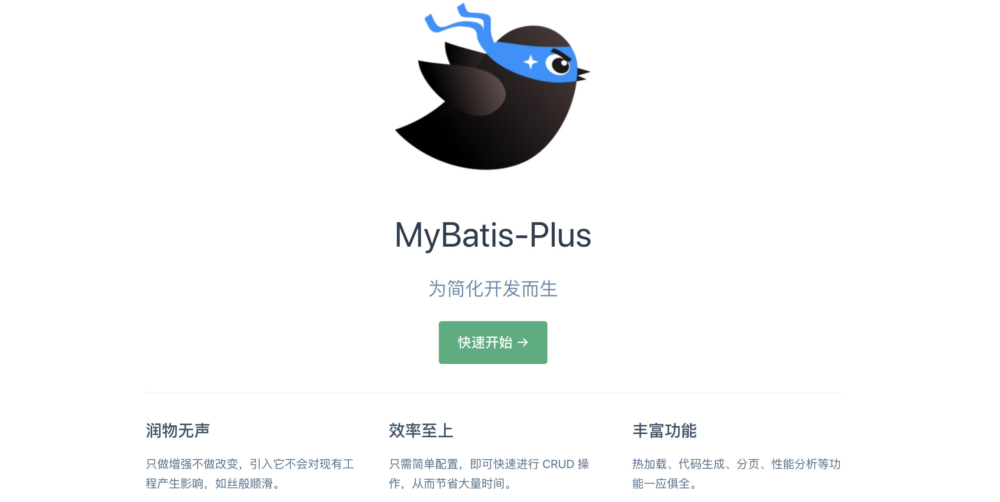
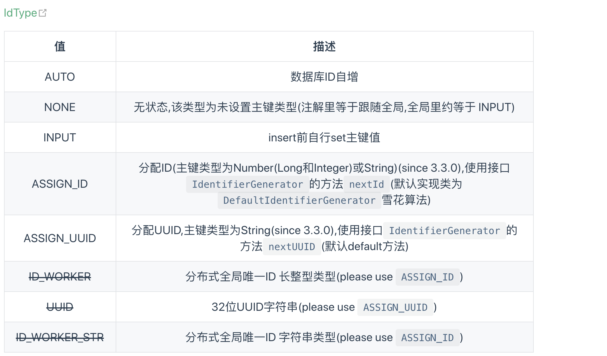
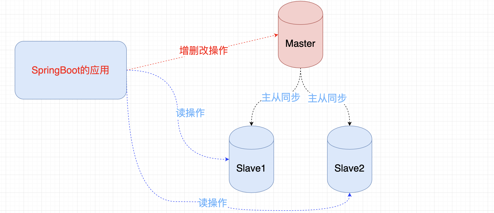

[**首页**](https://github.com/qdw497874677/myNotes/blob/master/首页检索.md)

# Mybatis-Plus 实战教程


## 1.什么是Mybatis-Plus

### 1.1 什么是mybatis-plus

`官网:`https://mybatis.plus/guide/

[MyBatis-Plus](https://github.com/baomidou/mybatis-plus)（简称 MP）是一个 [MyBatis](http://www.mybatis.org/mybatis-3/) 的增强工具，在 MyBatis 的基础上只做增强不做改变，为简化开发、提高效率而生。



### 1.2 官方愿景


### 1.3 特性

- **无侵入**：`只做增强不做改变，引入它不会对现有工程产生影响，如丝般顺滑`
- **损耗小**：`启动即会自动注入基本 CURD，性能基本无损耗，直接面向对象操作`
- **强大的 CRUD 操作**：`内置通用 Mapper、通用 Service，仅仅通过少量配置即可实现单表大部分 CRUD 操作，更有强大的条件构造器，满足各类使用需求`
- **支持 Lambda 形式调用**：`通过 Lambda 表达式，方便的编写各类查询条件，无需再担心字段写错`
- **支持主键自动生成**：`支持多达 4 种主键策略（内含分布式唯一 ID 生成器 - Sequence），可自由配置，完美解决主键问题`
- **支持 ActiveRecord 模式**：`支持 ActiveRecord 形式调用，实体类只需继承 Model 类即可进行强大的 CRUD 操作`
- **支持自定义全局通用操作**：`支持全局通用方法注入（ Write once, use anywhere ）`
- **内置代码生成器**：`采用代码或者 Maven 插件可快速生成 Mapper 、 Model 、 Service 、 Controller 层代码，支持模板引擎，更有超多自定义配置等您来使用`
- **内置分页插件**：`基于 MyBatis 物理分页，开发者无需关心具体操作，配置好插件之后，写分页等同于普通 List 查询`
- **分页插件支持多种数据库**：`支持 MySQL、MariaDB、Oracle、DB2、H2、HSQL、SQLite、Postgre、SQLServer 等多种数据库`
- **内置性能分析插件**：`可输出 Sql 语句以及其执行时间，建议开发测试时启用该功能，能快速揪出慢查询`
- **内置全局拦截插件**：`提供全表 delete 、 update 操作智能分析阻断，也可自定义拦截规则，预防误操作`

### 1.4 支持数据库

- mysql 、 mariadb 、 oracle 、 db2 、 h2 、 hsql 、 sqlite 、 postgresql 、 sqlserver

### 1.5 框架结构


----

## 2. 快速入门

### 2.1 创建springboot项目

#### 	1.并引入依赖

```xml
 <dependency>
   <groupId>com.baomidou</groupId>
   <artifactId>mybatis-plus-boot-starter</artifactId>
   <version>3.2.0</version>
</dependency>
```

- **注意**:`不需要在引入mybatis的相关依赖,只引入这一个即可,当然数据库相关的驱动还的显式引入`

#### 2.在入口类加入注解

```java
@SpringBootApplication
@MapperScan("com.baizhi.dao")
public class MybatisApplication {
    public static void main(String[] args) {
        SpringApplication.run(MybatisApplication.class, args);
    }
}
```

#### 3.编写配置文件

```properties
spring.datasource.type=com.alibaba.druid.pool.DruidDataSource
spring.datasource.driver-class-name=com.mysql.jdbc.Driver
spring.datasource.url=jdbc:mysql://localhost:3306/mybatis-plus?characterEncoding=UTF-8
spring.datasource.username=root
spring.datasource.password=root

logging.level.root=info
logging.level.com.baizhi.dao=debug
```


### 2.2 创建数据库以及表结构

```sql
DROP TABLE IF EXISTS `user`;
CREATE TABLE `user` (
  `id` int(11) NOT NULL AUTO_INCREMENT,
  `name` varchar(255) DEFAULT NULL,
  `age` int(11) DEFAULT NULL,
  `bir` timestamp NULL DEFAULT NULL,
  PRIMARY KEY (`id`)
) ENGINE=InnoDB DEFAULT CHARSET=utf8;

SET FOREIGN_KEY_CHECKS = 1;
```

### 2.3 开发实体类

```java

@Data //lombok的注解用来生成get set 等相关方法
public class User {
    private String id;
    private String name;
    private Integer age;
    private Date bir;
}
```

### 2.4 开发mapper通用实现

```java
import com.baomidou.mybatisplus.core.mapper.BaseMapper; //提供了各种CRUD方法
public interface UserDAO extends BaseMapper<User> {  
}
```

### 2.5 测试

```java
@Autowired
private UserDAO userDAO;
@Test
void contextLoads() {
  List<User> users = userDAO.selectList(null);
  System.out.println(users);
}
```

----

## 3.常用注解说明

- **@TableName**  
- **@TableId**
- **@TableField**

### 3.1 @TableName注解

- **描述:**`用来将实体对象与数据库表名完成映射`
- **修饰范围:** `用在类上`
- **常见属性:**
  - **value:**  `String类型,指定映射的表名`
  - **resultMap:**` String类型,用来指定XML配置中resultMap的id值`

### 3.2 @TableId注解

- **描述**：`主键注解`

- **修饰范围:**`用在属性上`

- **常见属性:**

  - **value:** `String类型,指定实体类中与表中对应的主键列名`
  - **type:**  `枚举类型,指定主键生成类型`

  


### 3.3 @TableField

- **描述**：`字段注解(非主键)`
- **修饰范围:**`用在属性上`
- **常用属性:**
  - **value:**	`String类型,用来指定对应的数据库表中的字段名`
  - **el:**	`String类型,映射为原生 #{ ... } 逻辑,相当于写在 xml 里的 #{ ... } 部分` 3.0不存在
  - exist	`boolean是否为数据库表字段 true代表是数据库字段,false代表不是`

---

## 4.常用方法

### 4.1 查询方法

- 查询所有

  ```java
  @Test
  public void testFindAll(){
    List<User> users = userDAO.selectList(null);
    users.forEach(user-> System.out.println("user = " + user));
  }
  ```

- 查询一个

  ```java
  @Test
  public void testFindOne(){
    User user = userDAO.selectById("1");
    System.out.println("user = " + user);
  }
  ```

- 条件查询

  ```java
  //条件查询
  @Test
  public void testFind(){
    QueryWrapper<User> queryWrapper = new QueryWrapper<>();
    //queryWrapper.eq("age",23);//设置等值查询
    //queryWrapper.lt("age",23);//设置小于查询
    //queryWrapper.ge("age",23);//小于等于查询 gt 大于  ge 大于等于
    List<User> users = userDAO.selectList(queryWrapper);
    users.forEach(user-> System.out.println(user));
  }
  ```

- 模糊查询

  ```java
  @Test
  public void testFindAll(){
    QueryWrapper<User> queryWrapper = new QueryWrapper<>();
    queryWrapper.likeRight("username","小");
    List<User> users = userDAO.selectList(queryWrapper);
    users.forEach(user-> System.out.println("user = " + user));
  }
  ```

  - like 相当于 %?%
  - likeLeft 相当于 %?
  - likeRight 相当于 ?%

### 4.2 添加方法

- ​	添加方法

  ```java
  @Test
  public void testSave(){
    User entity = new User();
    entity.setAge(23).setName("小明明").setBir(new Date());
    userDAO.insert(entity);
  }
  ```

### 4.3 修改方法

- 基于id修改

  ```java
  @Test
  public void testUpdateById(){
    User user = userDAO.selectById("1");
    user.setAge(24);
    userDAO.updateById(user);
  }
  ```

  基于条件修改

  ```java
  @Test
  public void testUpdate(){
    User user = userDAO.selectById("1");
    user.setName("小陈陈");
    QueryWrapper<User> updateWrapper = new QueryWrapper<>();
    updateWrapper.eq(true,"age",23);
    userDAO.update(user, updateWrapper);
  }
  ```

### 4.4 删除方法

- 基于id删除

  ```java
  @Test
  public void testDeleteById(){
    userDAO.deleteById("3");
  }
  ```

- 基于条件删除

  ```java
  @Test
  public void testDelete(){
    QueryWrapper<User> wrapper = new QueryWrapper<>();
    wrapper.lambda().eq(true,User::getAge,23);
    userDAO.delete(wrapper);
  }
  ```

----

## 5.Mybatis-Plus分页查询

### 0.预先配置

- **注意:**`使用分页查询必须设置mybatis-plus提供的分页插件,才能实现分页效果`

  ```java
  @EnableTransactionManagement
  @Configuration
  @MapperScan("com.baizhi.dao")
  public class MybatisPlusConfig {
      @Bean
      public PaginationInterceptor paginationInterceptor() {
          PaginationInterceptor paginationInterceptor = new PaginationInterceptor();
          return paginationInterceptor;
      }
  }
  ```

  `注意事项:目前分页查询仅仅支持单表查询,不能再表连接时使用分页插件`

### 1.分页查询

- 非条件分页查询

  ```java
  @Test
  public void testFindAll(){
    IPage<User> page = new Page<>(1,2);
    page = userDAO.selectPage(page, null);
    page.getRecords().forEach(user -> System.out.println("user = " + user));
  }
  ```

- 带条件分页查询

  ```java
  @Test
  public void testFindAll(){
    QueryWrapper<User> queryWrapper = new QueryWrapper<>();
    queryWrapper.eq("age",23);
    IPage<User> page = new Page<>(1,2);
    page = userDAO.selectPage(page, queryWrapper);
    page.getRecords().forEach(user-> System.out.println("user = " + user));
  }
  ```

----

## 6. Mybatis-Plus多数据源配置

### 引言

为了确保数据库产品的稳定性，很多数据库拥有双机热备功能。也就是，第一台数据库服务器，是对外提供增删改业务的生产服务器；第二台数据库服务器，主要进行读的操作。·



### 6.1 引入dynamic-datasource-spring-boot-starter

```xml
<dependency>
    <groupId>com.baomidou</groupId>
    <artifactId>dynamic-datasource-spring-boot-starter</artifactId>
    <version>3.0.0</version>
</dependency>
```

### 6.2 配置数据源

```properties
spring.datasource.primary=master  #指定默认数据源
spring.datasource.dynamic.datasource.master.driver-class-name=com.mysql.jdbc.Driver
spring.datasource.dynamic.datasource.master.url=jdbc:mysql://localhost:3306/mybatis-plus?characterEncoding=UTF-8
spring.datasource.dynamic.datasource.master.username=root
spring.datasource.dynamic.datasource.master.password=root
spring.datasource.dynamic.datasource.slave_1.driver-class-name=com.mysql.jdbc.Driver
spring.datasource.dynamic.datasource.slave_1.url=jdbc:mysql://localhost:3306/mybatis-plus-1?characterEncoding=UTF-8
spring.datasource.dynamic.datasource.slave_1.username=root
spring.datasource.dynamic.datasource.slave_1.password=root
```

### 6.3 创建多个数据库模拟不同mysql服务 

### 6.4 @DS注解

- **作用:** `用来切换数据源的注解 `
- **修饰范围:** `方法上和类上`，**同时存在方法注解优先于类上注解**。
- **Value属性:** `切换数据源名称`

### 6.5 开发业务层

- 业务接口

  ```java
  public interface UserService{
      List<User> findAll();
      void save(User user);
  }
  ```

  

- 业务实现类

  ```java
  @Service
  @Transactional
  public class UserServiceImpl implements UserService {
  
      @Autowired
      private UserDAO userDAO;
  
      @Override
      public List<User> findAll() {
          return userDAO.selectList(null);
      }
  
      @Override
      public void save(User user) {
          userDAO.insert(user);
      }
  }
  ```

### 6.6 测试结果 

```java
package com.baizhi;

import com.baizhi.entity.User;
import com.baizhi.service.UserService;
import org.junit.jupiter.api.Test;
import org.springframework.beans.factory.annotation.Autowired;
import org.springframework.boot.test.context.SpringBootTest;

import java.util.Date;

@SpringBootTest
public class TestUserService {

    
    @Autowired
    private UserService userService;
    
    @Test
    public void testFindAll(){
        userService.findAll().forEach(user-> System.out.println("user = " + user));
    }

    @Test
    public void testSave(){
        User user = new User();
        user.setName("aaa").setAge(23).setBir(new Date());
        userService.save(user);
    }
}
```


# 我的

## 分页

对于自己想用的dao方法做分页

dao层

方法参数需要有一个IPage，在前面定义好了当前页和一页的容量

~~~java
@Mapper
public interface BlogMapper extends BaseMapper<Blog> {
    @Select("select b.id,b.user_id,b.title,b.description,b.content,b.created,b.status,b.published,t.id typeId,t.name typeName from m_blog b left join m_type t on b.type_id=t.id where b.published=1  order by b.created desc")
    List<Blog> queryBlogsPublished(IPage<Blog> page);

}
~~~

service层

~~~java
public interface BlogService extends IService<Blog> {
    IPage<Blog> queryPageBlogPublished(IPage<Blog> page, int currentPage, int pageSize);
}
~~~

构建IPage，传给dao层，返回这个IPage

~~~java
@Service
public class BlogServiceImpl extends ServiceImpl<BlogMapper, Blog> implements BlogService {

    @Override
    public IPage<Blog> queryPageBlogPublished(int currentPage,int pageSize) {
        IPage<Blog> page = new Page<>(currentPage,pageSize);
        return page.setRecords(baseMapper.queryBlogsPublished(page));
    }
~~~


## 条件查询

在自己的查询上加Wrapper

如果是多表查询，记得在map的key上加上别名

dao层

传 wrapper参数，加@Param(Constants.WRAPPER)，在sql中where的位置加${ew.customSqlSegment}

~~~java
@Mapper
public interface BlogMapper extends BaseMapper<Blog> {

    @Select("select b.id,b.user_id,b.title,b.description,b.content,b.created,b.status,b.published,t.id typeId,t.name typeName from m_blog b left join m_type t on b.type_id=t.id ${ew.customSqlSegment} order by b.created desc")
    List<Blog> queryBlogsJoinType(IPage<Blog> page,@Param(Constants.WRAPPER) Wrapper wrapper);

}
~~~

service层

~~~java
public interface BlogService extends IService<Blog> {
    IPage<Blog> queryPageBlogPublished(int currentPage, int pageSize);
    IPage<Blog> queryBlogsByType(int currentPage, int pageSize, Wrapper wrapper);
}
~~~


~~~java
@Service
public class BlogServiceImpl extends ServiceImpl<BlogMapper, Blog> implements BlogService {
    @Override
    public IPage<Blog> queryBlogsByType(int currentPage, int pageSize, Wrapper wrapper){
        IPage<Blog> page = new Page<>(currentPage,pageSize);
        return page.setRecords(baseMapper.queryBlogsJoinType(page,wrapper));
    }
}
~~~

controller层

用的时候，可以调用wapper的各种方法使用条件。

~~~java
@PostMapping("/blogs")
    public Result list(BlogSearch blogSearch,Integer currentPage){
        Map<String,Object> map = new HashMap<>();
        map.put("b.published",1);
        if (blogSearch.getTypeName() != null){
            map.put("t.name",blogSearch.getTypeName());
        }

        IPage pageData = blogService.queryBlogsByType(currentPage,5,new QueryWrapper<Blog>().allEq(map));
        return Result.succ(pageData);
    }
~~~


## 动态sql

sql使用<script></script>>包裹

