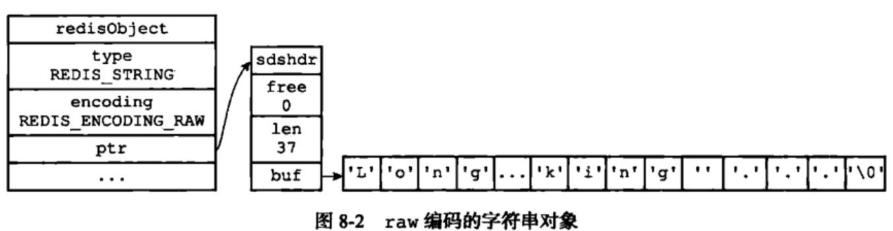

[**首页**](https://github.com/qdw497874677/myNotes/blob/master/首页检索.md)

# NoSQL

> 90年代，网站的访问量不会大大，单个数据库完全足够用，那个时候更多的去使用静态网页。

> 缓存 + MySQL + 垂直拆分（读写分离）

> 发展过程：优化数据结构和索引——文件缓存（IO）——Memcached

> 分库分表 + 水平拆分 + MySQL集群

> 如今的年代

数据量很多，变化很快，

MySQL等关系型数据库不够用了

如果有一些专门的数据库可以单独存储博客、图片等特殊的数据，那MySQl的压力就变小了

> 目前一个基础的互联网项目

用户先访问企业的防火墙，进行负载均衡，到不同的服务器。。。

## 为什么要用NoSQL

> NoSQL：不仅仅是SQL（非关系型数据库）

传统的关系型数据库很难应付web2.0时代

Redis是NoSQL中发展最快的

很多数据类型，比如用户的个人信息，社交网络，地理位置，他们的存储不需要一个固定的模式。

## NoSQL特点

1. 方便拓展（数据关系没有关系）
2. 大数据量高性能（Redis的缓存是细粒度的，性能很高）
3. 数据类型是多样型的（不需要事先设计数据库）

## 传统的RDBMS和NoSQL的区别

传统的RDBMS
- 结构化组织
- SQL
- 数据和关系都存在单独的表中
- 严格的一致性
- 基础的事务
- 。。。

NoSQL
- 不仅仅是数据
- 没有固定的查询语言
- 键值对存储、列存储、文档存储、图形数据库
- 最终一致性
- CAP定理和BASE （异地多活）
- 高性能，高可用，高可扩展性

公司中的实践 NoSQL+RDBMS

### 


## CAP理论


# NoSQL四大分类

## KV键值对
- 典型应用：内容缓存，主要用于处理大量数据的高访问负载
- 数据模型：一系列键值对
- 优点：快速查询
- 缺点：存储的数据缺少结构化

> 新浪：Redis  
> 美团：Redis+Tair  
>  阿里、百度：Redis+memecache


## 文档型数据库
- 相关产品：MongoDB
    - 基于分布式文件存储的数据库，C++编写，主要用来处理大量文档
    - 是一个介于关系型数据库和非关系型数据库中间的产品
- 典型应用：web应用（与键值对类似，值是结构化的）
- 数据模型：一系列键值对
- 优势：数据结构要求不严格
- 劣势：性能不高，缺少统一的查询语法


## 列存储数据库
- 典型应用：HBase、分布式的文件系统
- 数据模型：以列簇式存储，将同一列数据存在一起
- 优势：查找速度快，可扩展性强，更容易进行分布式扩展
- 劣势：功能相对局限  

## 图关系数据库
- 不是存图形，存的是图关系

# Redis概述

> Redis(Remote Dictionary Server),远程字典服务

> 是一个开源的使用C语言编写，支持网络、可基于内存也可持久化的日志型、Key-Value数据库，并提供多种语言的API。  
> 与memcached一样，为了保证效率，数据都是缓存在内存中。区别的是redis会周期性的把更新的数据写入磁盘或者把修改操作写入追加的记录文件，并且在此基础上实现了master-slave(主从)同步。

## 能干嘛：  

- 内存存储，持久化
- 效率高，可以用来高速缓存
- 发布订阅系统
- 地图信息分析
- 计数器、计时器
- 。。。

## 特性

- 多样的数据类型
- 持久化
- 集群
- 事务


# Redis安装

## Windows

### 下载安装Redis

### 打开目录


### 在cmd中输入

~~~
redis-server redis.windows.conf
~~~


### 或者写一个cmd脚本

`````````
redis-server.exe redis.windows.conf
`````````


> 如果立即退出，可能是端口被占用，可以查找6379的端口，杀掉占用端口的进程

~~~
netstat -ano |findstr "6379"
~~~


## Linux

### 下载Redis

~~~
wget http://download.redis.io/releases/redis-5.0.8.tar.gz
~~~

移动到/opt

~~~
mv redis-5.0.8.tar.gz /opt
~~~

### 解压

```
tar -zxvf redis-5.0.8.tar.gz
```


### 进入redis目录，开始基本安装

安装C++环境

~~~
sudo apt-get install gcc
sudo apt-get install g++
~~~

### 执行make

~~~
make
make install
~~~

完成


### 默认安装路径为

~~~
/usr/local/bin
~~~


### 将配置文件复制到当前目录下

创建一个文件夹

~~~
mkdir qdwconfig
~~~

把配置文件复制过来

~~~
cp /opt/redis-5.0.8/redis.conf ./
~~~


以后就用这个配置文件进行启动

### 启动

默认不是后台启动，需要修改配置文件


改成yes

启动Redis服务

在bin目录下使用自己的配置文件启动

~~~
root@VM-0-3-ubuntu:/usr/local/bin# redis-server qdwconfig/redis.conf 
~~~


使用redis-cli连接测试

~~~
root@VM-0-3-ubuntu:/usr/local/bin# redis-cli -p 6379
~~~


### 查看redis的进程是否开启

~~~
ps -ef|grep redis
~~~


### 关闭Redis服务

通过在redis-cli中执行

~~~
shutdown
exit
~~~


进程结束了


# 性能测试工具

## redis-benchmark 

是官方自带的性能测试工具

### 测试命令

在redis目录下执行

```
redis-benchmark [option] [option value]
```

### 实例

测试：100个并发连接 100000个请求

```
redis-benchmark -h localhost -p 6379 -c 100 -n 10000  -q
```


| 序号 | 选项      | 描述                                       | 默认值    |
| :--- | :-------- | :----------------------------------------- | :-------- |
| 1    | **-h**    | 指定服务器主机名                           | 127.0.0.1 |
| 2    | **-p**    | 指定服务器端口                             | 6379      |
| 3    | **-s**    | 指定服务器 socket                          |           |
| 4    | **-c**    | 指定并发连接数                             | 50        |
| 5    | **-n**    | 指定请求数                                 | 10000     |
| 6    | **-d**    | 以字节的形式指定 SET/GET 值的数据大小      | 3         |
| 7    | **-k**    | 1=keep alive 0=reconnect                   | 1         |
| 8    | **-r**    | SET/GET/INCR 使用随机 key, SADD 使用随机值 |           |
| 9    | **-P**    | 通过管道传输 <numreq> 请求                 | 1         |
| 10   | **-q**    | 强制退出 redis。仅显示 query/sec 值        |           |
| 11   | **--csv** | 以 CSV 格式输出                            |           |
| 12   | **-l**    | 生成循环，永久执行测试                     |           |
| 13   | **-t**    | 仅运行以逗号分隔的测试命令列表。           |           |
| 14   | **-I**    | Idle 模式。仅打开 N 个 idle 连接并等待。   |           |


# Redis基础知识


## 基本的操作

Redis默认有16个数据库

默认使用的是第0个

可以使用select进行切换


~~~bash
#切换到1号数据库
select 1
#查看当前数据库数据库大小
dbsize
#查看当前数据库所有的key
key *
#获取key:name的值
get name
#清空当前数据库
flushdb
#清空全部数据库
flushall
~~~


## Redis是单线程的

CPU不是Redis的性能瓶颈，内存和网络带宽是瓶颈

> 为什么单线程还这么快

Redis是C语言写的

CPU的上下文切换有消耗，对于内存系统来说，没有上下文切换效率就会高


# 五大数据类型

> Redis 是一个开源（BSD许可）的，内存中的数据结构存储系统，它可以用作数据库、缓存和消息中间件。 它支持多种类型的数据结构，如 字符串（strings）， 散列（hashes）， 列表（lists）， 集合（sets）， 有序集合（sorted sets） 与范围查询， bitmaps， hyperloglogs 和 地理空间（geospatial） 索引半径查询。 Redis 内置了 复制（replication），LUA脚本（Lua scripting）， LRU驱动事件（LRU eviction），事务（transactions） 和不同级别的 磁盘持久化（persistence）， 并通过 Redis哨兵（Sentinel）和自动 分区（Cluster）提供高可用性（high availability）。

## Redis-Key

~~~bash
#设置key-value
127.0.0.1:6379> set name qdw
OK
127.0.0.1:6379> set age 10
OK
#判断key是否存在
127.0.0.1:6379> exists name
(integer) 1
#把key移动到另一个数据库
127.0.0.1:6379> move name 1 
(integer) 1
#查看所有的key
127.0.0.1:6379> keys *
1) "age"
127.0.0.1:6379> set name qdw
OK
127.0.0.1:6379> keys *
1) "age"
2) "name"
#设置key的过期时间
127.0.0.1:6379> expire name 10
(integer) 1
#查看key的当前剩余时间
127.0.0.1:6379> ttl name
#查看key的数据类型
127.0.0.1:6379> type name
string
#切换数据库
127.0.0.1:6379> select 1

~~~


## String（字符串）

### 设置，追加，判断是否存在，获取值，获取长度

~~~bash
#设置key-value
127.0.0.1:6379> set name qdw
OK
127.0.0.1:6379> set age 10
OK
#判断key是否存在
127.0.0.1:6379> exists name
(integer) 1

#追加值的内容，如果key不存在，就相当于set
127.0.0.1:6379> append key1 name
(integer) 6
127.0.0.1:6379> get key1
"v1name"
#获取字符串长度
127.0.0.1:6379> strlen key1
(integer) 6
~~~

### 自增自建

~~~bash
127.0.0.1:6379> set views 0
OK
127.0.0.1:6379> get views
"0"
#+1操作
127.0.0.1:6379> incr views
(integer) 1
127.0.0.1:6379> incr views
(integer) 2
127.0.0.1:6379> get views
"2"
#-1操作
127.0.0.1:6379> decr views
(integer) 1
127.0.0.1:6379> get views
"1"
#加指定的值
127.0.0.1:6379> incrby views 10
(integer) 11
127.0.0.1:6379> decrby views 10
(integer) 1
~~~

### 获取字符串里的一个范围的子串

~~~bash
#取字符串的范围字符
127.0.0.1:6379> getrange key1 0 3
"v1na"
#取字符串的全部字符
127.0.0.1:6379> getrange key1 0 -1
"v1name"

~~~

### 从一个位置替换字符串

~~~bash
#从指定的位置替换
127.0.0.1:6379> setrange key1 2 qdw
(integer) 6
127.0.0.1:6379> get key1
"v1qdwe"

~~~

### 设置定是过期的值

~~~bash
#设置键值对，并设置过期时间
127.0.0.1:6379> setex key2 10 hello
OK
127.0.0.1:6379> ttl key2
(integer) 7

~~~

### 如果不存在，才创建值成功

~~~bash
#如果存在，就不会创建成功（set存在的会覆盖）
127.0.0.1:6379> setnx key2 qqq
(integer) 1
127.0.0.1:6379> setnx key2 www
#返回0表示没有创建成功
(integer) 0
~~~


### 批量设置

~~~bash
#批量设置
127.0.0.1:6379> mset k1 v1 k2 v2
OK
127.0.0.1:6379> keys *
1) "key2"
2) "k1"
3) "k2"
4) "key1"
5) "views"
#批量获取
127.0.0.1:6379> mget k1 k2 
1) "v1"
2) "v2"
#如果存在，就不会创建成功（set存在的会覆盖）
127.0.0.1:6379> msetnx k2 v22 k3 v33
#失败，k2和k3都没设置成功
(integer) 0
~~~

msetnx是一个原子性操作，同时成功或者同时失败


### 设置对象

~~~bash
#设置一个user:1对象，用json来存储这个对象
127.0.0.1:6379> set user:1 {name:xiaoming,age:3}
OK
127.0.0.1:6379> get user:1
"{name:xiaoming,age:3}"
#批量设置和获取对象的属性值
127.0.0.1:6379> mset user:1:name xiaoqiang user:1:age 10
OK
127.0.0.1:6379> mget user:1:name user:1:age
1) "xiaoqiang"
2) "10"

~~~

### getset操作，先获取再设置（获取后更新）

~~~bash
#先获取 再设置
127.0.0.1:6379> getset db redis
(nil)
127.0.0.1:6379> get db
"redis"
127.0.0.1:6379> getset db mongodb
"redis"
127.0.0.1:6379> get db
"mongodb"

~~~


String类型最大512MB。数值计算最大范围为java的long的最大值。

String类型的应用场景：主页高频访问信息显示控制。例如微博主页显示的粉丝数与微博数。

解决方案：

- 以用户主键和属性值作为key，对应的数据作为value，后台设置定时刷新策略即可。这样可以直接通过incr操作自加。

> user\.id:10101010:fans	1000000
> user\.id:10101010:blogs	1000
> user\.id:10101010:focuss	100

- 以用户主键作为key，用json格式存储用户信息。这种要先取出来再更新。

> user\.id:10101010	{id:10101010,fans:1000000,blogs:1000,focuss:100}


key的设置约定：

表名:主键名:主键值:字段


## Hash（哈希）

相当于map集合

用String存数据，基本上就是两种方式，一个是key+json；另一个是把属性加到key中，值存属性对应的值，相当于把json拆开。

Hash类型，把key和value中间加了个field字段，一个key可以有很多个field+value。

也相当于一个Hash存储很多个String类型，一个Hash就是一个Redis。

### 添加/获取

~~~bash
#在hash中设置一个键值对
127.0.0.1:6379> hset hash name qdw
(integer) 1
#获取值
127.0.0.1:6379> hget hash name
"qdw"
#同时设置多个
127.0.0.1:6379> hmset hash age 10 sex 1
OK
#获取多个值
127.0.0.1:6379> hmget hash name age
1) "qdw"
2) "10"
#获取所有键值对
127.0.0.1:6379> hgetall hash
1) "name"
2) "qdw"
3) "age"
4) "10"
5) "sex"
6) "1"

~~~

### 删除

~~~bash
#删除指定键的数据
127.0.0.1:6379> hdel hash sex
(integer) 1
127.0.0.1:6379> hgetall hash
1) "name"
2) "qdw"
3) "age"
4) "10"

~~~

### 获取键值对数量

~~~bash
127.0.0.1:6379> hlen hash
(integer) 2
~~~

### 判断字段（键）是否存在

~~~bash
127.0.0.1:6379> HEXISTS hash name
(integer) 1
~~~

### 只获取所有字段（键）

~~~bash
127.0.0.1:6379> hkeys hash
1) "name"
2) "age"
~~~

### 只获取所有值

~~~bash
127.0.0.1:6379> hvals hash
1) "qdw"
2) "10"
~~~

### 自增自减

~~~bash
27.0.0.1:6379> hset hash money 1
(integer) 1
#指定的字段+1
127.0.0.1:6379> HINCRBY hash money 1
(integer) 2
127.0.0.1:6379> hget hash money
"2"
#指定字段-1
127.0.0.1:6379> HINCRBY hash money -1
(integer) 1
127.0.0.1:6379> hget hash money
"1"
~~~

### 如果存在就创建失败

~~~bash
127.0.0.1:6379> hsetnx hash name qqq
(integer) 0
~~~


hash相比String更适合存储对象

String更是个存储字符串

> 应用场景1：电商网站购物车设计与实现。

解决方案：

- 用户id作为key，每位客户创建一个hash存储结构存储对应的购物车信息。
- 将商品编号作为field，购买数量作为value进行存储。
- 添加商品：追加全新的field和value。
- 浏览：遍历hash。
- 更改数量：自增/自减，设置value值。
- 删除商品：删除field。
- 清空：删除key。

但是用户要想看到具体的商品，还要去数据库查。到此为止没有起到加速的作用。

- 商品记录分成两条field保存
  - 商品id:nums
    - 数值。保存商品数量。
  - 商品id:info
    - json。保存具体商品的数据，比如文字描述，图片等。

这样商品信息会在不同用户的数据中重复。所以要把商品信息独立成一个Hash。

- 专门保存把商品信息作为一组hash保存，不涉及用户。
  - 在存储的时候，可以用hsetnx，如果没有这个field就加，如果有就不加。


> 应用场景2：抢购。商家上架几种商品一定数量，让用户来抢。


- 商家id作为key。
- 参与抢购的商品id作为field。
- 将参与抢购的商品数量作为对应的value。
- 抢购时用降值的方式控制产品数量。hincrby。
- 超卖问题这里不讨论。


> String和hash存对象区别？
>
> String讲究一致性。
>
> hash讲究字段更新方便。


## List（列表）

list可以实现成栈，队列，阻塞队列

所有的list命令都是l开头的

### 插入取出

~~~bash
#将一个值从list左边插入
127.0.0.1:6379> lpush list one
(integer) 1
127.0.0.1:6379> lpush list two
(integer) 2
127.0.0.1:6379> lpush list three
(integer) 3
#从左边按范围取出
127.0.0.1:6379> lrange list 0 -1
1) "three"
2) "two"
3) "one"
127.0.0.1:6379> lrange list 0 1
1) "three"
2) "two"
#从右边插入
127.0.0.1:6379> rpush list right
(integer) 4
127.0.0.1:6379> lrange list 0 -1
1) "three"
2) "two"
3) "one"
4) "right"

~~~

### 移除元素

~~~bash
#从左边移除一个元素
127.0.0.1:6379> lpop list
"three"
127.0.0.1:6379> lrange list 0 -1
1) "two"
2) "one"
3) "right"
#从右边移除一个元素
127.0.0.1:6379> rpop list
"right"
127.0.0.1:6379> lrange list 0 -1
1) "two"
2) "one"

~~~

### 获取指定下标的元素

~~~bash
#通过下标获取值
127.0.0.1:6379> lindex list 1
"one"
#返回列表的长度
127.0.0.1:6379> llen list
(integer) 2

~~~

### 移除指定的值

~~~bash
127.0.0.1:6379> lrange list 0 -1
1) "one"
2) "two"
3) "one"
#移除一个two
127.0.0.1:6379> lrem list 1 two
(integer) 1
127.0.0.1:6379> lrange list 0 -1
1) "one"
2) "one"
#移除两个one
127.0.0.1:6379> lrem list 2 one
(integer) 2
127.0.0.1:6379> lrange list 0 -1
(empty list or set)

~~~

### 截取list

~~~bash
127.0.0.1:6379> rpush list hello
(integer) 1
127.0.0.1:6379> rpush list hello1
(integer) 2
127.0.0.1:6379> rpush list hello12
(integer) 3
127.0.0.1:6379> rpush list hello123
(integer) 4
127.0.0.1:6379> lrange list 0 -1
1) "hello"
2) "hello1"
3) "hello12"
4) "hello123"
#通过下标截取指定的长度，列表只剩下截取的部分
127.0.0.1:6379> ltrim list 1 2 
OK
127.0.0.1:6379> lrange list 0 -1
1) "hello1"
2) "hello12"

~~~

### 把元素移到另一个列表

把一个list的左边一个元素，放到另一个list的右边

~~~bash
#把list中的右边的一个元素，移动到mylist的左边
127.0.0.1:6379> rpoplpush list mylist
"hello12"
127.0.0.1:6379> lrange list 0 -1
1) "hello1"
#元素到了mylist里面
127.0.0.1:6379> lrange mylist 0 -1
1) "hello12"

~~~

### 给列表中的指定元素重新赋值

如果列表不存在，或者指定位置无元素就会报错

~~~bash
127.0.0.1:6379> lrange list 0 -1
1) "hello1"
#给列表的指定元素重新赋值
127.0.0.1:6379> lset list 0 world
OK
127.0.0.1:6379> lrange list 0 -1
1) "world"
#指定的位置无元素就会报错
127.0.0.1:6379> lset list 1 world
(error) ERR index out of range

~~~

### 在元素的前或后插入元素

~~~bash
127.0.0.1:6379> lpush list hello
(integer) 2
127.0.0.1:6379> lrange list 0 -1
1) "hello"
2) "world"
#在一个元素左（后）边插入一个元素
127.0.0.1:6379> linsert list before world my
(integer) 3
127.0.0.1:6379> lrange list 0 -1
1) "hello"
2) "my"
3) "world"
#在一个元素右（前）边插入一个元素
127.0.0.1:6379> linsert list after my new
(integer) 4
127.0.0.1:6379> lrange list 0 -1
1) "hello"
2) "my"
3) "new"
4) "world"
~~~

> 他实际上是一个链表
>
> list中存储的数据都是string类型的，数据总容量时有限的。
>
> list可以对数据进行分页操作，通常第一页的信息放在redis的list里，第二页以及更多的信息再通过数据库的形式加载。


> 应用场景：
>
> 1. 微博的应用的个人用户的关注列表，按照用户关注的顺序进行展示。粉丝列表中的最近关注的粉丝排在前面。
> 2. 新闻资讯类，信息通过发生时间展示。
> 3. 多态服务器的产出日志按顺序输出。
>    1. 
>
> 

解决方案

- 使用栈模型解决最新消息问题
- 使用队列模型解决多录信息汇总合并问题


## Set（集合）

set中的元素不能重复

### 添加元素，查看所有，判断是否在set中，获取元素数量

~~~bash
127.0.0.1:6379> sadd set hello
(integer) 1
127.0.0.1:6379> sadd set qdw world
(integer) 2
127.0.0.1:6379> smembers set
1) "qdw"
2) "world"
3) "hello"
#判断元素是否在set中
127.0.0.1:6379> sismember set qdw
(integer) 1
127.0.0.1:6379> sismember set qqq
(integer) 0
#获取set中元素数量
127.0.0.1:6379> scard set
(integer) 3
~~~

### 移除元素

~~~bash
#移除指定元素
127.0.0.1:6379> srem set qdw
(integer) 1
127.0.0.1:6379> smembers set
1) "world"
2) "hello"

~~~

### 随机获取/移除一个元素

（这里指令是大写，因为用了自动提示，redis不区分大小写）

~~~bash
#随机获取一个元素
127.0.0.1:6379> SRANDMEMBER set
"hello"
127.0.0.1:6379> SRANDMEMBER set
"hello"
127.0.0.1:6379> SRANDMEMBER set
"world"
#随意移除一个元素
127.0.0.1:6379> spop set
"hello"
127.0.0.1:6379> SMEMBERS set
1) "world"

~~~

### 移动到另一个set

~~~bash
127.0.0.1:6379> sadd set qdw hello
(integer) 2
127.0.0.1:6379> SMEMBERS set
1) "qdw"
2) "world"
3) "hello"
#把一个元素移动到另一个set
127.0.0.1:6379> smove set myset qdw
(integer) 1
127.0.0.1:6379> SMEMBERS set
1) "world"
2) "hello"
127.0.0.1:6379> SMEMBERS myset
1) "qdw"

~~~

### 差集

~~~bash
127.0.0.1:6379> flushdb
OK
127.0.0.1:6379> sadd set1 a b c
(integer) 3
127.0.0.1:6379> sadd set2 c d e
(integer) 3
#比较两个set，获取差集
127.0.0.1:6379> SDIFF set1 set2
1) "a"
2) "b"

~~~

### 交集

~~~bash
#比较两个set，获取交集
127.0.0.1:6379> SINTER set1 set2
1) "c"
~~~

### 并集

~~~bash
#比较两个set，获取并集
127.0.0.1:6379> SUNION set1 set2
1) "c"
2) "e"
3) "a"
4) "b"
5) "d"

~~~


> 应用场景1：公司每个员工有一个或多个角色，如果进行业务操作的权限校验。一个角色的操作权限有很多，多个角色的权限可能又重叠，怎样解决重叠问题。

解决方案：

- 依赖set中元素不重复，对同类型不重复数据进行合并操作
- 根据用户id获取用户的所有角色
- 根据用户所有角色获取用户所有权限放入这个用户的权限set集合
- 想知道用户是否有权限，从权限set中获取所有操作，去比较。


> 应用场景2：统计网站的PV（访问量），UV（独立访客），IP（独立IP）

解决方案：

- 利用string，用incr统计日访问量（PV）
- 利用set去对同类数据进行去重
- 利用set，记录不同cookie数量（UV）
- 利用set，记录不同IP数量（IP）

> 应用场景3：
>
> 黑名单：
>
> 白名单：

解决方案：

- 利用set，周期性更新用户黑名单
- 用户到达后与黑名单比对，确认去向
- 过滤IP地址：应用于开放游客访问权限的信息源
- 过滤设备信息：应用于限定访问设备的信息源
- 过滤用户：应用于基于访问权限的信息源


## Sorted_set（有序集合）

在set基础上，增加了一个值，来分组排序


### 添加

~~~bash
127.0.0.1:6379> zadd zset 1 a
(integer) 1
127.0.0.1:6379> zadd zset 2 b
(integer) 1
127.0.0.1:6379> zadd zset 2 c 3 d
(integer) 2
127.0.0.1:6379> zrange zset 0 -1
1) "a"
2) "b"
3) "c"
4) "d"
~~~

### 排序

~~~bash
#升序排列
127.0.0.1:6379> ZRANGE zset 0 -1
1) "a"
2) "b"
3) "c"

#降序排列
127.0.0.1:6379> ZREVRANGE zset 0 -1
1) "c"
2) "b"
3) "a"

#在范围里，获取升序排列
127.0.0.1:6379> ZRANGEBYSCORE zset -inf +inf
1) "a"
2) "b"
3) "c"
4) "d"
#带分数来排序
127.0.0.1:6379> ZRANGEBYSCORE zset 0 10 withscores
1) "a"
2) "1"
3) "b"
4) "2"
5) "c"
6) "2"
7) "d"
8) "3"
#在范围里降序排序
127.0.0.1:6379> ZREVRANGEBYSCORE zset 10 0
1) "d"
2) "c"
3) "b"
4) "a"

~~~

可以用 (0 表示开区间

### 移除

~~~bash
127.0.0.1:6379> ZRANGE zset 0 -1
1) "a"
2) "b"
3) "c"
4) "d"
#移除元素
127.0.0.1:6379> zrem zset d
(integer) 1
127.0.0.1:6379> ZRANGE zset 0 -1
1) "a"
2) "b"
3) "c"
~~~

### 获取个数

~~~bash
#获取集合的元素个数
127.0.0.1:6379>  zcard zset
(integer) 3
#获取范围里元素的个数
127.0.0.1:6379> zcount zset 1 2
(integer) 3

~~~


> 业务场景：各种排序：活跃度、各种排行榜。

解决方案

- 获取数据对应的索引（排名）
  - zrank
  - zrevrank
- score值获取与修改
  - zscore
  - zincrby


# 三种特殊数据类型

## geospatial 地理位置

只有六个命令


- 有效的经度从-180度到180度。
- 有效的纬度从-85.05112878度到85.05112878度。

### 添加地理位置

~~~bash
127.0.0.1:6379> geoadd china:city 116.40 39.90 beijing
(integer) 1
127.0.0.1:6379> geoadd china:city 121.47 31.23 shanghai
(integer) 1
127.0.0.1:6379> geoadd china:city 108.96 34.26 xian 114.05 22.52 shenzhen
(integer) 2
~~~

### 获取指定城市的经度和纬度

~~~bash
127.0.0.1:6379> geopos china:city beijing xian
1) 1) "116.39999896287918091"
   2) "39.90000009167092543"
2) 1) "108.96000176668167114"
   2) "34.25999964418929977"

~~~

### 获取两个位置之间的距离

如果两个位置之间的其中一个不存在， 那么命令返回空值。

指定单位的参数 unit 必须是以下单位的其中一个：

- **m** 表示单位为米。
- **km** 表示单位为千米。
- **mi** 表示单位为英里。
- **ft** 表示单位为英尺。

~~~bash
127.0.0.1:6379> geodist china:city beijing xian
"910056.5237"
#指定了单位
127.0.0.1:6379> geodist china:city beijing xian km
"910.0565"

~~~

### 按指定坐标的半径搜索包含的位置

~~~bash
127.0.0.1:6379> georadius china:city 110 30 1000 km
1) "xian"
2) "shenzhen"
127.0.0.1:6379> georadius china:city 110 30 1500 km
1) "xian"
2) "shenzhen"
3) "shanghai"
4) "beijing"
#显示距离
127.0.0.1:6379> georadius china:city 110 30 1000 km withdist
1) 1) "xian"
   2) "483.8340"
2) 1) "shenzhen"
   2) "924.6408"
#显示经纬度
127.0.0.1:6379> georadius china:city 110 30 1000 km withcoord
1) 1) "xian"
   2) 1) "108.96000176668167114"
      2) "34.25999964418929977"
2) 1) "shenzhen"
   2) 1) "114.04999762773513794"
      2) "22.5200000879503861"
#规定数量
127.0.0.1:6379> georadius china:city 110 30 1000 km withdist withcoord count 1
1) 1) "xian"
   2) "483.8340"
   3) 1) "108.96000176668167114"
      2) "34.25999964418929977"

~~~


### 按指定位置的半径搜索包含的位置

~~~bash
127.0.0.1:6379> GEORADIUSBYMEMBER china:city xian 1000 km
1) "xian"
2) "beijing"
~~~

### 返回11个字符的geohash字符串

将经纬度转换为11个字符的hash值

~~~bash
127.0.0.1:6379> geohash china:city beijing xian
1) "wx4fbxxfke0"
2) "wqj6zky6bn0"
~~~


### 底层是zset，可以用一些zset的命令

~~~bash
127.0.0.1:6379> zrange china:city 0 -1
1) "xian"
2) "shenzhen"
3) "shanghai"
4) "beijing"
127.0.0.1:6379> zrem china:city shenzhen
(integer) 1
127.0.0.1:6379> zrange china:city 0 -1
1) "xian"
2) "shanghai"
3) "beijing"

~~~


## Hyperloglog

> 什么是基数？

找不重复的元素的个数

### Hyperloglog用来做基数统计

传统方式，set保存，统计set容器中的元素数量

如果元素数量过大，会占过多资源

用Hyperloglog占用内存很小，但是有0.81%的错误率

~~~bash
#添加元素
127.0.0.1:6379> pfadd key a b c d e f g
(integer) 1
#查看数量
127.0.0.1:6379> pfcount key
(integer) 7
#加进去重复的，并不算
127.0.0.1:6379> pfcount key a b c
(integer) 7
127.0.0.1:6379> pfcount key
(integer) 7
127.0.0.1:6379> pfadd key2 a b c h i j
(integer) 1
#合并两个key，把结果放到新key中
127.0.0.1:6379> pfmerge key3 key key2
OK
127.0.0.1:6379> pfcount key3
(integer) 10

~~~


## Bitmaps

位存储

例如，统计疫情，未感染0感染1，只用到0和1

两个状态的，都可以用Bitmaps

### 例如，记录打卡

~~~bash
127.0.0.1:6379> setbit sign 0 1
(integer) 0
127.0.0.1:6379> setbit sign 1 0
(integer) 0
127.0.0.1:6379> setbit sign 2 0
(integer) 0
127.0.0.1:6379> setbit sign 3 1 
(integer) 0
#统计值为1的个数
127.0.0.1:6379> bitcount sign
(integer) 2

~~~

最后判断什么位置是0 什么位置是1


# Redis事务

### Redis的事务和关系型数据库中事务的区别

- 不保证原子性

- 没有隔离级别的概念

- 单条命令是保证原子性的

Redis的一个事务中的所有命令会被序列化，在事务执行过程中，会按照顺序执行

- 一次性
- 顺序性
- 排他性

所有的命令在事务中，没有直接执行，只有发起执行命令才会执行


### 流程

- 开启事务（multi）
- 命令入队（。。。）
- 执行事务（exec）

~~~bash
#开启事务
127.0.0.1:6379> multi
OK
127.0.0.1:6379> set k1 v1
QUEUED
127.0.0.1:6379> set k2 v2
QUEUED
127.0.0.1:6379> get k2
QUEUED
#执行事务
127.0.0.1:6379> exec
1) OK
2) OK
3) "v2"

~~~

- 放弃事务

事务中的命令不会执行

~~~bash
127.0.0.1:6379> multi
OK
127.0.0.1:6379> set k3 v3
QUEUED
127.0.0.1:6379> get k3
QUEUED
127.0.0.1:6379> DISCARD
OK
127.0.0.1:6379> get k3
(nil)

~~~


### 遇到错误

- 编译型异常

事务中的所有命令都不会执行

~~~bash
127.0.0.1:6379> multi
OK
127.0.0.1:6379> set k4 v4
QUEUED
127.0.0.1:6379> incr k4
QUEUED
127.0.0.1:6379> set k5 v5
QUEUED
127.0.0.1:6379> get k5
QUEUED
127.0.0.1:6379> exec
1) OK
2) (error) ERR value is not an integer or out of range
3) OK
4) "v5"

~~~


- 运行时异常

如果存在语法型错误，执行命令时，其他命令可以正常执行

~~~bash
127.0.0.1:6379> multi
OK
127.0.0.1:6379> set k4 v4
QUEUED
127.0.0.1:6379> set k5
(error) ERR wrong number of arguments for 'set' command
127.0.0.1:6379> set k6 v6
QUEUED
127.0.0.1:6379> exec
(error) EXECABORT Transaction discarded because of previous errors.
127.0.0.1:6379> get k4
(nil)
127.0.0.1:6379> get k5
(nil)

~~~


## 乐观锁、悲观锁

悲观锁：

- 悲观，认为什么时候都会出问题，做什么都会加锁

乐观锁：

- 乐观，认为什么时候都不会出问题，所以不上锁，更新数据时区判断一下，此期间是否有人修改过这个数据


### 实现乐观锁

**使用watch相当于乐观锁**


正常执行

~~~bash
127.0.0.1:6379> flushdb
OK
127.0.0.1:6379> set money 100
OK
127.0.0.1:6379> set out 0
OK
#监视money
127.0.0.1:6379> watch money
OK
127.0.0.1:6379> multi
OK
127.0.0.1:6379> DECRBY money 20
QUEUED
127.0.0.1:6379> INCRBY out 20
QUEUED
127.0.0.1:6379> exec
1) (integer) 80
2) (integer) 20

~~~

事务从开始到执行前，数据没有发生变动，这个时候执行成功

如果同时有两个事务，在一个事务开始后，提交前，修改是watch的对象，这个事务提交就不能执行成功

~~~bash
127.0.0.1:6379> flushdb
OK
127.0.0.1:6379> set money 100
OK
127.0.0.1:6379> set out 0
OK
127.0.0.1:6379> watch money
OK
127.0.0.1:6379> multi
OK
127.0.0.1:6379> decrby money 10
QUEUED
127.0.0.1:6379> incrby out 10
QUEUED
#没有提交事务
127.0.0.1:6379> 

~~~

连接另一个cli，对money操作

~~~bash
127.0.0.1:6379> keys *
1) "money"
2) "out"
127.0.0.1:6379> multi
OK
127.0.0.1:6379> decrby money 20
QUEUED
127.0.0.1:6379> incrby out 20
QUEUED
127.0.0.1:6379> exec
1) (integer) 80
2) (integer) 20

~~~

前面watch的那个事务执行，会失败

~~~bash
127.0.0.1:6379> exec
(nil)

~~~


如果想把接下来的事做完

先取消监视，然后从新监视，然后接着做要做的事

~~~bash
127.0.0.1:6379> unwatch
OK
127.0.0.1:6379> watch money
OK
127.0.0.1:6379> multi
OK
127.0.0.1:6379> decrby money 10
QUEUED
127.0.0.1:6379> incrby out 10
QUEUED
127.0.0.1:6379> exec
1) (integer) 70
2) (integer) 30

~~~

# Jedis

官方推荐的java连接开发工具。使用java操作Redis中间件

## 导入依赖

~~~
    <dependencies>
        <dependency>
            <groupId>redis.clients</groupId>
            <artifactId>jedis</artifactId>
            <version>3.2.0</version>
        </dependency>
        <dependency>
            <groupId>cn.bestwu</groupId>
            <artifactId>fastjson</artifactId>
            <version>1.2-unwrap</version>
        </dependency>
    </dependencies>
~~~

## 命令测试

默认redis只允许本地访问，这里测试本地访问

~~~java
public class TestPing {
    public static void main(String[] args) {
        //1.new一个对象
        Jedis jedis = new Jedis("127.0.0.1",6379);
        String ping = jedis.ping();
        System.out.println(ping);
    }
}
~~~


### 常用API

- String
- List
- Set
- Hash
- Zset

和上面的指令是一样的

Stirng的例子

~~~java
public class TestKey {
    public static void main(String[] args) {
        Jedis jedis = new Jedis("localhost",6379);
        System.out.println(jedis.ping());
        System.out.println(jedis.flushDB());
        System.out.println(jedis.set("name", "qdw"));
        System.out.println(jedis.set("age", "10"));
        System.out.println(jedis.keys("*"));
        System.out.println(jedis.del("age"));
        System.out.println(jedis.exists("age"));
        System.out.println(jedis.type("name"));
        System.out.println(jedis.randomKey());
        jedis.rename("name","name1");
        System.out.println(jedis.get("name1"));
        System.out.println(jedis.select(1));
        System.out.println(jedis.dbSize());
        System.out.println(jedis.keys("*"));
        System.out.println(jedis.flushAll());
    }
}
~~~


### 事务

~~~java
public class TestTx {
    public static void main(String[] args) {

        Jedis jedis = new Jedis("127.0.0.1",6379);

        JSONObject jsonObject = new JSONObject();
        jsonObject.put("hello","world");
        jsonObject.put("name","qdw");
        String res = jsonObject.toJSONString();
        jedis.watch("user1");
        //开启事务
        Transaction multi = jedis.multi();
        try {
            multi.set("user1",res);
            multi.set("user2",res);
            multi.exec();
        } catch (Exception e) {
            //放弃事务
            multi.discard();
            e.printStackTrace();
        } finally {
            System.out.println(jedis.get("user1"));
            System.out.println(jedis.get("user2"));
            //关闭连接
            jedis.close();
        }
    }
}
~~~


# Springboot整合


或者直接添加这个依赖

~~~
<dependency>
	<groupId>org.springframework.boot</groupId>
	<artifactId>spring-boot-starter-data-redis</artifactId>
</dependency>
~~~

配置

~~~
spring:
  redis:
    database: 1
    host: 49.233.90.47
    port: 6379
~~~


> springboot2.0以后jedis被替换哼了lettuce

- jedis：采用直连，多个线程操作时不安全的，使用jedis pool连接池解决
- lettuce：采用netty，实例可以在多个线程中进行共享，不存在线程不安全的情况


## 自动配置的源码


~~~java
@Configuration(proxyBeanMethods = false)
@ConditionalOnClass(RedisOperations.class)
@EnableConfigurationProperties(RedisProperties.class)
@Import({ LettuceConnectionConfiguration.class, JedisConnectionConfiguration.class })
public class RedisAutoConfiguration {

	@Bean
    //可以替换redisTemplate
	@ConditionalOnMissingBean(name = "redisTemplate")
	public RedisTemplate<Object, Object> redisTemplate(RedisConnectionFactory redisConnectionFactory)
			throws UnknownHostException {
		RedisTemplate<Object, Object> template = new RedisTemplate<>();
		template.setConnectionFactory(redisConnectionFactory);
		return template;
	}

	@Bean
	@ConditionalOnMissingBean
    //因为String类型很常用，说以单独成一个bean
	public StringRedisTemplate stringRedisTemplate(RedisConnectionFactory redisConnectionFactory)
			throws UnknownHostException {
		StringRedisTemplate template = new StringRedisTemplate();
		template.setConnectionFactory(redisConnectionFactory);
		return template;
	}

}
~~~


## 测试


配置

~~~
spring:
  redis:
    host: 127.0.0.1
    port: 6379
~~~


测试

~~~java
@SpringBootTest
class Redis02SpringbootApplicationTests {
    @Autowired
    private RedisTemplate redisTemplate;

    @Test
    void contextLoads() {

        //opsForValue(),操作字符串
        redisTemplate.opsForValue().set("name","qdw");
        //opsForList(),操作list
        redisTemplate.opsForList().leftPush("user","qdw");
    }

}
~~~


配置RedisTemplate

~~~java
@Configuration
public class RedisConfig {

    @Bean
    public RedisTemplate<String, Object> redisTemplate(RedisConnectionFactory redisConnectionFactory)
            throws UnknownHostException {
        RedisTemplate<String, Object> template = new RedisTemplate<>();
        template.setConnectionFactory(redisConnectionFactory);
        return template;
    }
}
~~~


# 自定义RedisTemplate


## 序列化

如果不对存储的对象序列化，会报错

~~~java
    public void test1() throws JsonProcessingException {
        User user = new User("qdw",10);
//        String jsonUser = new ObjectMapper().writeValueAsString(user);
        //开发一般用json来传递对象
        redisTemplate.opsForValue().set("user",user);
        System.out.println(redisTemplate.opsForValue().get("user"));
    }
~~~


序列化后就不会报错了

~~~java
@Component
@Data
@AllArgsConstructor
@NoArgsConstructor
public class User implements Serializable {
    private String name;
    private int age;
}
~~~


一般会用json传对象

~~~java
@Test
    public void test1() throws JsonProcessingException {
        User user = new User("qdw",10);
        String jsonUser = new ObjectMapper().writeValueAsString(user);
        //开发一般用json来传递对象
        redisTemplate.opsForValue().set("user",jsonUser);
        System.out.println(redisTemplate.opsForValue().get("user"));
    }
~~~


默认是用JDK的序列化方式，也可以使用别的方式

## 配置如下

~~~java
@Configuration
public class RedisConfig {

    @Bean
    //前面的类型换成String，为了使用方便
    public RedisTemplate<String, Object> redisTemplate(RedisConnectionFactory redisConnectionFactory) {
        RedisTemplate<String, Object> template = new RedisTemplate<>();
        //json序列化配置
        Jackson2JsonRedisSerializer objectJackson2JsonRedisSerializer = new Jackson2JsonRedisSerializer(Object.class);
        ObjectMapper objectMapper = new ObjectMapper();
        objectMapper.setVisibility(PropertyAccessor.ALL, JsonAutoDetect.Visibility.ANY);
        objectMapper.enableDefaultTyping(ObjectMapper.DefaultTyping.NON_FINAL);
        objectJackson2JsonRedisSerializer.setObjectMapper(objectMapper);
        //String序列化
        StringRedisSerializer stringRedisSerializer = new StringRedisSerializer();
        //key采用String的序列化方式
        template.setKeySerializer(stringRedisSerializer);
        //hash的key也采用String的序列化方式
        template.setHashKeySerializer(stringRedisSerializer);
        //value采用json的序列化方式
        template.setValueSerializer(objectJackson2JsonRedisSerializer);
        //hash的value也采用json的序列化方式
        template.setHashValueSerializer(objectJackson2JsonRedisSerializer);

        template.afterPropertiesSet();
        return template;
    }
}
~~~


测试

~~~java
@SpringBootTest
class Redis02SpringbootApplicationTests {
    @Autowired
    @Qualifier("redisTemplate")
    private RedisTemplate redisTemplate;

    @Test
    public void test1() throws JsonProcessingException {
        User user = new User("qdw",10);
//        String jsonUser = new ObjectMapper().writeValueAsString(user);
        //开发一般用json来传递对象
        redisTemplate.opsForValue().set("user",user);
        System.out.println(redisTemplate.opsForValue().get("user"));
    }

}
~~~


~~~bash
127.0.0.1:6379> keys *
1) "user"
~~~


## 编写工具类

~~~java
package com.qdw.utils;

import org.springframework.beans.factory.annotation.Autowired;
import org.springframework.data.redis.core.RedisTemplate;
import org.springframework.stereotype.Component;
import org.springframework.util.CollectionUtils;

import java.util.List;
import java.util.Map;
import java.util.Set;
import java.util.concurrent.TimeUnit;

// 在我们真实的分发中，或者你们在公司，一般都可以看到一个公司自己封装RedisUtil
@Component
public final class RedisUtil {

    @Autowired
    private RedisTemplate<String, Object> redisTemplate;
    
    // =============================common============================
    /**
     * 指定缓存失效时间
     * @param key  键
     * @param time 时间(秒)
     */
    public boolean expire(String key, long time) {
        try {
            if (time > 0) {
                redisTemplate.expire(key, time, TimeUnit.SECONDS);
            }
            return true;
        } catch (Exception e) {
            e.printStackTrace();
            return false;
        }
    }

    /**
     * 根据key 获取过期时间
     * @param key 键 不能为null
     * @return 时间(秒) 返回0代表为永久有效
     */
    public long getExpire(String key) {
        return redisTemplate.getExpire(key, TimeUnit.SECONDS);
    }


    /**
     * 判断key是否存在
     * @param key 键
     * @return true 存在 false不存在
     */
    public boolean hasKey(String key) {
        try {
            return redisTemplate.hasKey(key);
        } catch (Exception e) {
            e.printStackTrace();
            return false;
        }
    }


    /**
     * 删除缓存
     * @param key 可以传一个值 或多个
     */
    @SuppressWarnings("unchecked")
    public void del(String... key) {
        if (key != null && key.length > 0) {
            if (key.length == 1) {
                redisTemplate.delete(key[0]);
            } else {
                redisTemplate.delete(CollectionUtils.arrayToList(key));
            }
        }
    }


    // ============================String=============================

    /**
     * 普通缓存获取
     * @param key 键
     * @return 值
     */
    public Object get(String key) {
        return key == null ? null : redisTemplate.opsForValue().get(key);
    }
    
    /**
     * 普通缓存放入
     * @param key   键
     * @param value 值
     * @return true成功 false失败
     */

    public boolean set(String key, Object value) {
        try {
            redisTemplate.opsForValue().set(key, value);
            return true;
        } catch (Exception e) {
            e.printStackTrace();
            return false;
        }
    }


    /**
     * 普通缓存放入并设置时间
     * @param key   键
     * @param value 值
     * @param time  时间(秒) time要大于0 如果time小于等于0 将设置无限期
     * @return true成功 false 失败
     */

    public boolean set(String key, Object value, long time) {
        try {
            if (time > 0) {
                redisTemplate.opsForValue().set(key, value, time, TimeUnit.SECONDS);
            } else {
                set(key, value);
            }
            return true;
        } catch (Exception e) {
            e.printStackTrace();
            return false;
        }
    }


    /**
     * 递增
     * @param key   键
     * @param delta 要增加几(大于0)
     */
    public long incr(String key, long delta) {
        if (delta < 0) {
            throw new RuntimeException("递增因子必须大于0");
        }
        return redisTemplate.opsForValue().increment(key, delta);
    }


    /**
     * 递减
     * @param key   键
     * @param delta 要减少几(小于0)
     */
    public long decr(String key, long delta) {
        if (delta < 0) {
            throw new RuntimeException("递减因子必须大于0");
        }
        return redisTemplate.opsForValue().increment(key, -delta);
    }


    // ================================Map=================================

    /**
     * HashGet
     * @param key  键 不能为null
     * @param item 项 不能为null
     */
    public Object hget(String key, String item) {
        return redisTemplate.opsForHash().get(key, item);
    }
    
    /**
     * 获取hashKey对应的所有键值
     * @param key 键
     * @return 对应的多个键值
     */
    public Map<Object, Object> hmget(String key) {
        return redisTemplate.opsForHash().entries(key);
    }
    
    /**
     * HashSet
     * @param key 键
     * @param map 对应多个键值
     */
    public boolean hmset(String key, Map<String, Object> map) {
        try {
            redisTemplate.opsForHash().putAll(key, map);
            return true;
        } catch (Exception e) {
            e.printStackTrace();
            return false;
        }
    }


    /**
     * HashSet 并设置时间
     * @param key  键
     * @param map  对应多个键值
     * @param time 时间(秒)
     * @return true成功 false失败
     */
    public boolean hmset(String key, Map<String, Object> map, long time) {
        try {
            redisTemplate.opsForHash().putAll(key, map);
            if (time > 0) {
                expire(key, time);
            }
            return true;
        } catch (Exception e) {
            e.printStackTrace();
            return false;
        }
    }


    /**
     * 向一张hash表中放入数据,如果不存在将创建
     *
     * @param key   键
     * @param item  项
     * @param value 值
     * @return true 成功 false失败
     */
    public boolean hset(String key, String item, Object value) {
        try {
            redisTemplate.opsForHash().put(key, item, value);
            return true;
        } catch (Exception e) {
            e.printStackTrace();
            return false;
        }
    }

    /**
     * 向一张hash表中放入数据,如果不存在将创建
     *
     * @param key   键
     * @param item  项
     * @param value 值
     * @param time  时间(秒) 注意:如果已存在的hash表有时间,这里将会替换原有的时间
     * @return true 成功 false失败
     */
    public boolean hset(String key, String item, Object value, long time) {
        try {
            redisTemplate.opsForHash().put(key, item, value);
            if (time > 0) {
                expire(key, time);
            }
            return true;
        } catch (Exception e) {
            e.printStackTrace();
            return false;
        }
    }


    /**
     * 删除hash表中的值
     *
     * @param key  键 不能为null
     * @param item 项 可以使多个 不能为null
     */
    public void hdel(String key, Object... item) {
        redisTemplate.opsForHash().delete(key, item);
    }


    /**
     * 判断hash表中是否有该项的值
     *
     * @param key  键 不能为null
     * @param item 项 不能为null
     * @return true 存在 false不存在
     */
    public boolean hHasKey(String key, String item) {
        return redisTemplate.opsForHash().hasKey(key, item);
    }


    /**
     * hash递增 如果不存在,就会创建一个 并把新增后的值返回
     *
     * @param key  键
     * @param item 项
     * @param by   要增加几(大于0)
     */
    public double hincr(String key, String item, double by) {
        return redisTemplate.opsForHash().increment(key, item, by);
    }


    /**
     * hash递减
     *
     * @param key  键
     * @param item 项
     * @param by   要减少记(小于0)
     */
    public double hdecr(String key, String item, double by) {
        return redisTemplate.opsForHash().increment(key, item, -by);
    }


    // ============================set=============================

    /**
     * 根据key获取Set中的所有值
     * @param key 键
     */
    public Set<Object> sGet(String key) {
        try {
            return redisTemplate.opsForSet().members(key);
        } catch (Exception e) {
            e.printStackTrace();
            return null;
        }
    }


    /**
     * 根据value从一个set中查询,是否存在
     *
     * @param key   键
     * @param value 值
     * @return true 存在 false不存在
     */
    public boolean sHasKey(String key, Object value) {
        try {
            return redisTemplate.opsForSet().isMember(key, value);
        } catch (Exception e) {
            e.printStackTrace();
            return false;
        }
    }


    /**
     * 将数据放入set缓存
     *
     * @param key    键
     * @param values 值 可以是多个
     * @return 成功个数
     */
    public long sSet(String key, Object... values) {
        try {
            return redisTemplate.opsForSet().add(key, values);
        } catch (Exception e) {
            e.printStackTrace();
            return 0;
        }
    }


    /**
     * 将set数据放入缓存
     *
     * @param key    键
     * @param time   时间(秒)
     * @param values 值 可以是多个
     * @return 成功个数
     */
    public long sSetAndTime(String key, long time, Object... values) {
        try {
            Long count = redisTemplate.opsForSet().add(key, values);
            if (time > 0)
                expire(key, time);
            return count;
        } catch (Exception e) {
            e.printStackTrace();
            return 0;
        }
    }


    /**
     * 获取set缓存的长度
     *
     * @param key 键
     */
    public long sGetSetSize(String key) {
        try {
            return redisTemplate.opsForSet().size(key);
        } catch (Exception e) {
            e.printStackTrace();
            return 0;
        }
    }


    /**
     * 移除值为value的
     *
     * @param key    键
     * @param values 值 可以是多个
     * @return 移除的个数
     */

    public long setRemove(String key, Object... values) {
        try {
            Long count = redisTemplate.opsForSet().remove(key, values);
            return count;
        } catch (Exception e) {
            e.printStackTrace();
            return 0;
        }
    }

    // ===============================list=================================
    
    /**
     * 获取list缓存的内容
     *
     * @param key   键
     * @param start 开始
     * @param end   结束 0 到 -1代表所有值
     */
    public List<Object> lGet(String key, long start, long end) {
        try {
            return redisTemplate.opsForList().range(key, start, end);
        } catch (Exception e) {
            e.printStackTrace();
            return null;
        }
    }


    /**
     * 获取list缓存的长度
     *
     * @param key 键
     */
    public long lGetListSize(String key) {
        try {
            return redisTemplate.opsForList().size(key);
        } catch (Exception e) {
            e.printStackTrace();
            return 0;
        }
    }


    /**
     * 通过索引 获取list中的值
     *
     * @param key   键
     * @param index 索引 index>=0时， 0 表头，1 第二个元素，依次类推；index<0时，-1，表尾，-2倒数第二个元素，依次类推
     */
    public Object lGetIndex(String key, long index) {
        try {
            return redisTemplate.opsForList().index(key, index);
        } catch (Exception e) {
            e.printStackTrace();
            return null;
        }
    }


    /**
     * 将list放入缓存
     *
     * @param key   键
     * @param value 值
     */
    public boolean lSet(String key, Object value) {
        try {
            redisTemplate.opsForList().rightPush(key, value);
            return true;
        } catch (Exception e) {
            e.printStackTrace();
            return false;
        }
    }


    /**
     * 将list放入缓存
     * @param key   键
     * @param value 值
     * @param time  时间(秒)
     */
    public boolean lSet(String key, Object value, long time) {
        try {
            redisTemplate.opsForList().rightPush(key, value);
            if (time > 0)
                expire(key, time);
            return true;
        } catch (Exception e) {
            e.printStackTrace();
            return false;
        }

    }


    /**
     * 将list放入缓存
     *
     * @param key   键
     * @param value 值
     * @return
     */
    public boolean lSet(String key, List<Object> value) {
        try {
            redisTemplate.opsForList().rightPushAll(key, value);
            return true;
        } catch (Exception e) {
            e.printStackTrace();
            return false;
        }

    }


    /**
     * 将list放入缓存
     *
     * @param key   键
     * @param value 值
     * @param time  时间(秒)
     * @return
     */
    public boolean lSet(String key, List<Object> value, long time) {
        try {
            redisTemplate.opsForList().rightPushAll(key, value);
            if (time > 0)
                expire(key, time);
            return true;
        } catch (Exception e) {
            e.printStackTrace();
            return false;
        }
    }

    /**
     * 根据索引修改list中的某条数据
     *
     * @param key   键
     * @param index 索引
     * @param value 值
     * @return
     */

    public boolean lUpdateIndex(String key, long index, Object value) {
        try {
            redisTemplate.opsForList().set(key, index, value);
            return true;
        } catch (Exception e) {
            e.printStackTrace();
            return false;
        }
    }

    /**
     * 移除N个值为value
     *
     * @param key   键
     * @param count 移除多少个
     * @param value 值
     * @return 移除的个数
     */

    public long lRemove(String key, long count, Object value) {
        try {
            Long remove = redisTemplate.opsForList().remove(key, count, value);
            return remove;
        } catch (Exception e) {
            e.printStackTrace();
            return 0;
        }

    }

}
~~~


测试

~~~java
@Test
    public void test2(){
        User user = new User("qdw",11);
        redisUtil.set("user",user);
        System.out.println(redisUtil.get("user"));
    }
~~~


# 配置文件详解

打开配置文件，这里打开远程linux的redis原始目录里的配置文件redis.conf

## 单位


### 单位的写法，对大小写不敏感


## 包含


## 网络

绑定ip

~~~bash
bind 127.0.0.1
~~~


保护模式

~~~bash
protected-mode yes
~~~

端口

~~~bash
port 6379
~~~


## 通用

守护模式（后台开启）

~~~bash
daemonize no
~~~


如果后台开启，就需要指定一个pid文件

~~~bash
pidfile /var/run/redis_6379.pid
~~~


日志级别，和文件名

~~~bash
# Specify the server verbosity level.
# This can be one of:
# debug (a lot of information, useful for development/testing)
# verbose (many rarely useful info, but not a mess like the debug level)
# notice (moderately verbose, what you want in production probably)
# warning (only very important / critical messages are logged)
loglevel notice
# Specify the log file name. Also the empty string can be used to force
# Redis to log on the standard output. Note that if you use standard
# output for logging but daemonize, logs will be sent to /dev/null
logfile ""
~~~


数据库数量

~~~bash
databases 16
~~~

是否显示logo

~~~bash
always-show-logo yes
~~~


## 快照

在规定的时间内，执行了多少次操作，会持久化到文件

持久化配置

~~~bash
#如果在900秒内，如果至少有1个key修改，就进行持久化操作
save 900 1
#如果在300秒内，如果至少有10个key修改，就进行持久化操作
save 300 10
#如果在60秒内，如果至少有10000个key修改，就进行持久化操作
save 60 10000
#持久化出错，是否继续工作
stop-writes-on-bgsave-error yes
#是否压缩rdb文件
rdbcompression yes
#保存rdb文件的时候，进行错误检查
rdbchecksum yes
#文件保存目录
dir ./
~~~


## 复制

主从复制再讲


## 安全

设置密码

默认没有密码

~~~bash
127.0.0.1:6379> config get requirepass
1) "requirepass"
2) ""
~~~

通过命令设置密码

~~~bash
127.0.0.1:6379> config set requirepass 123321
OK
127.0.0.1:6379> config get requirepass
(error) NOAUTH Authentication required.
127.0.0.1:6379> auth 123321
OK
127.0.0.1:6379> config get requirepass
1) "requirepass"
2) "123321"
~~~


## 客户端

最大客户端连接数量

~~~bash
maxclients 10000

~~~


## 内存


~~~bash
#最大内存限制
maxmemory <bytes>
#内存满了的处理策略
#1、volatile-lru：只对设置了过期时间的key进行LRU（默认值） 
#2、allkeys-lru ： 删除lru算法的key   
#3、volatile-random：随机删除即将过期key   
#4、allkeys-random：随机删除   
#5、volatile-ttl ： 删除即将过期的   
#6、noeviction ： 永不过期，返回错误
maxmemory-policy noeviction
~~~


## APPEND ONLY MODE （AOF模式配置）


~~~bash
#默认不开启，默认使用rdb来做持久化
appendonly no
#持久化文件名字
appendfilename "appendonly.aof"

#同步的频率
# appendfsync always
appendfsync everysec
# appendfsync no

~~~


# 持久化——RDB

(redis database)

## 简介

全量持久化

持久化默认使用RDB

Redis会创建一个子进程来做持久化

将数据写到一个临时文件中，持久化结束，把临时文件覆盖到上次持久化好的文件。主进程是不做持久化操作的。

- 数据以快照的形式保存，可能会数据丢失
- 速度快

RDB默认保存的文件是dump.rdb，可以再配置文件中配置

## 测试

修改配置文件的快照配置，便于操作 60秒内有3次操作，就进行持久化

~~~bash
save 60 3
~~~

删除之前的rdb文件

~~~bash
rm -rf dump.rdb 
~~~

set数据，并关闭redis

~~~bash
127.0.0.1:6379> set k1 v1
OK
127.0.0.1:6379> set k2 v2
OK
127.0.0.1:6379> set k3 v3
OK
127.0.0.1:6379> set k4 v4
OK
127.0.0.1:6379> SHUTDOWN

~~~

重新打开后，发现数据还在

~~~bash
127.0.0.1:6379> keys *
1) "k4"
2) "k2"
3) "k1"
4) "k3"
~~~

断开服务后，删除rdb文件，重启redis，发现数据也没有了

## 触发rdb时机

- save的规则满足的情况下，会触发rdb
- 执行flushall
- 退出redis

## 恢复备份

把rdb文件放到redis配置的放rdb文件目录的位置

redis就会自动检查并恢复

~~~bash
127.0.0.1:6379> config get dir
1) "dir"
2) "/usr/local/bin"
~~~


## 适合的场景

- 适合大规模的数据恢复
- 对数据的完整性不高

## 缺点

- 需要时间间隔进行操作，如果redis宕机了，会丢失一部分数据
- fork进程的时候，会占用一定的内容空间


# 持久化——AOF

（Append Only File）

增量持久化

## 简介

将我们所有的命令都记录下来，恢复的时候，把命令重新执行一遍

以日志的形式记录每个写操作，只追加文件，不改写文件。redis启动之初读取这个文件，重新构造数据

默认的文件为appendonly.aof

默认是不开启的，需要手动配置

## 测试

删除到rdb，重启redis

就会出现aof文件

执行一些操作

~~~bash
127.0.0.1:6379> set k1 v1
OK
127.0.0.1:6379> set k2 v2
OK
127.0.0.1:6379> set k3 v3
OK
~~~

这时查看aof文件

~~~bash
2
$6
SELECT
$1
0
*3
$3
set
$2
k1
$2
v1
*3
$3
set
$2
k2
$2
v2
*3
$3
set
~~~

aof如果有问题，redis不能启动

可以修复aof文件，redis提供了一个工具redis-check-aof

修复后可以启动，但是可能会损失一些数据

## 重写

aof默认就是对aof文件无限的追加

配置是否开启重写

~~~bash
no-appendfsync-on-rewrite no
~~~

如果aof文件大小等于设定的大小，就会新建一个线程重写数据


## 优点

- 每一次修改都同步，数据完整性更好（默认每秒同步一次）
- 如果从不同步，那么效率比较高

缺点

- 文件大，恢复速度慢
- 运行效率低

# 持久化拓展


# Redis发布订阅

## 简介

Redis发布订阅（pub/sub）是一种消息通信模式。发送者发送消息，订阅者接收消息。

Redis客户端可以订阅任意数量的频道


## 模型


## 测试

在一个redis客户端上订阅一个频道

此时，这个客户端就会监听这个频道中的信息

~~~bash
127.0.0.1:6379> SUBSCRIBE qdw123
Reading messages... (press Ctrl-C to quit)
1) "subscribe"
2) "qdw123"
3) (integer) 1
~~~

打开另外一个客户端，在频道中发布信息

~~~bash
127.0.0.1:6379> PUBLISH qdw123 helloqdw
(integer) 1

~~~

订阅的客户端就会收到消息

~~~bash
127.0.0.1:6379> SUBSCRIBE qdw123
Reading messages... (press Ctrl-C to quit)
1) "subscribe"
2) "qdw123"
3) (integer) 1
1) "message"
2) "qdw123"
3) "helloqdw"
~~~


## 原理

> redis-server里维护了一个字典，字典的键就是一个个频道。字典的值是一个链表，链表保存了所有订阅这个频道的客户端。  
>
> 在Redis中，可以在一个key发布或者订阅一个key。当在一个key上发布消息后，所有订阅这个key的客户端都会收到消息。


# Redis主从复制

## 简介

> 主从复制，指将一台Redis服务器的数据，复制到其他的Redis服务器。前者称为主节点（master/leader），后者称为节点（slave/follower）  
>
> 数据的复制是单向的，只能从主节点到从节点，Master以写为主，Slave以读为主  
>
> 默认每台Redis服务器都是主节点，一个主节点可以有多个从节点，一个从节点只能有一个主节点

## 作用

- 数据冗余：实现了数据的热备份
- 故障恢复：主节点出问题，可以让从节点提供服务
- 负载均衡：读写分离，分担服务器负载，多个从节点可以分担大量的读操作
- 高可用基石：是哨兵模式和集群能够实施的基础


## 环境配置

查看信息

~~~bash
127.0.0.1:6379> info replication
# Replication
role:master #角色
connected_slaves:0 #没有从机
master_replid:e3366133ef5f5bc8d7e9615bd5c83becd1fca695
master_replid2:0000000000000000000000000000000000000000
master_repl_offset:0
second_repl_offset:-1
repl_backlog_active:0
repl_backlog_size:1048576
repl_backlog_first_byte_offset:0
repl_backlog_histlen:0
~~~

模拟多个服务器

复制多个配置文件，把配置文件中的一些配置修改，不能重复

~~~bash
port 6380
pidfile /var/run/redis_6380.pid
logfile "80.log"
dbfilename dump80.rdb
~~~

在不同的窗口使用不同的配置文件开启redis-server

查看

~~~bash
root@VM-0-3-ubuntu:/usr/local/bin/qdwconfig# ps -ef|grep redis
root     14498     1  0 19:31 ?        00:00:18 redis-server 127.0.0.1:6379
root     15216 11034  0 23:18 pts/0    00:00:00 redis-cli
root     17482     1  0 23:30 ?        00:00:00 redis-server 127.0.0.1:6380
root     17598     1  0 23:30 ?        00:00:00 redis-server 127.0.0.1:6381
root     17859 11058  0 23:32 pts/1    00:00:00 grep --color=auto redis

~~~


## 一主二从

默认每台都是主节点

一般只配置从机，找自己跟随的主机

### 客户端上配置主从

在想作为从机的客户端上配置自己的主机，把两台都连上

~~~bash
127.0.0.1:6380> SLAVEOF 127.0.0.1 6379
OK
127.0.0.1:6380> info replication
# Replication
role:slave
master_host:127.0.0.1
master_port:6379
master_link_status:up
master_last_io_seconds_ago:3
master_sync_in_progress:0
slave_repl_offset:14
slave_priority:100
slave_read_only:1
connected_slaves:0
master_replid:50187f0d1c769525395350dc1554d45972bfffae
master_replid2:0000000000000000000000000000000000000000
master_repl_offset:14
second_repl_offset:-1
repl_backlog_active:1
repl_backlog_size:1048576
repl_backlog_first_byte_offset:1
repl_backlog_histlen:14

~~~

主机的信息

~~~bash
127.0.0.1:6379> info replication
# Replication
role:master
connected_slaves:1
slave0:ip=127.0.0.1,port=6380,state=online,offset=280,lag=1
master_replid:50187f0d1c769525395350dc1554d45972bfffae
master_replid2:0000000000000000000000000000000000000000
master_repl_offset:294
second_repl_offset:-1
repl_backlog_active:1
repl_backlog_size:1048576
repl_backlog_first_byte_offset:1
repl_backlog_histlen:294
~~~


> 这样的配置时暂时的，实际上一般是在配置文件中配置主从的，是永久的

### 在配置中配置主从

~~~bash
#配置主机ip和端口
replicaof <masterip> <masterport>
#如果有密码，配置密码
asterauth <master-password>
~~~


### 作用

主机中写入，从机可以读到（主机中本来就有的数据，也会复制到从机）

~~~bash
127.0.0.1:6379> keys *
1) "k3"
2) "k1"
3) "k2"

127.0.0.1:6380> keys *
1) "k1"
2) "k3"
3) "k2"

~~~

从机不能写入

~~~bash
127.0.0.1:6380> set k4 v4
(error) READONLY You can't write against a read only replica.
~~~


没有设置哨兵模式，主机宕机后，从机的配置不会改变，依旧连接到主机

因为没有在配置文件中配置自己的从机，所以从机宕机重启后，不再是从机，而变回了主机


## 复制原理

从节点成功连接到主节点后，会发送一个sync同步命令


- 全量复制：主节点接到后，启动后台的存盘进程，同时把当前接收到的修改数据命令也存起来，执行完毕后，主节点把收集好的整个数据发送到从节点，完成一次完全的同步，即全量复制
- 增量复制：主节点继续将新收集到的修改命令依次传给从节点，完成同步

从机每次连接到主机，都会自动执行一次全量复制

## 另一种主从复制模式

把81设置为80的从节点

~~~bash
127.0.0.1:6381> SLAVEOF 127.0.0.1 6380
OK
127.0.0.1:6381> info replication
# Replication
role:slave
master_host:127.0.0.1
master_port:6380
master_link_status:down
master_last_io_seconds_ago:-1
master_sync_in_progress:0
slave_repl_offset:0
。。。
~~~

此时的80依旧是79的从节点，依旧不能写入

~~~bash
127.0.0.1:6380> info replication
# Replication
role:slave
master_host:127.0.0.1
master_port:6379
master_link_status:up
~~~

此时79的数据，80和81依旧可以拿到


如果主机宕机，80可以在客户端上指定自己成为主机

~~~bash
127.0.0.1:6380> SLAVEOF no one
OK
127.0.0.1:6380> info replication
# Replication
role:master
connected_slaves:1
slave0:ip=127.0.0.1,port=6381,state=online,offset=2936,lag=0
master_replid:140b98305121c10cd9ff08b73b0bbc615cd69499
。。。
~~~

之前的主机79重启了，但是79没有从机了


# 哨兵模式

## 简介

能够后台监测主机是否故障，如果故障，根据投票数自动将从库转换为主库

单个哨兵进程也可能会出问题，可以采用多个哨兵进行监控，各个哨兵之间还会进行监控，形成了多哨兵模式

### 过程


假设主机宕机，哨兵1最先检测到主机失效、不在线，这个现象为主观下线。接着其他的哨兵也监测**主机下线**，当监测到下线的哨兵数量到达一定值时，哨兵之间会进行一次投票，选出一个从机作为主机，投票的结果由一个哨兵发起，进行故障转移操作。切换成功后，就会通过发布订阅模式，让各个哨兵，把这个从机服务器切换为主机，这个过程叫**客观下线**。

## 测试

目前服务器状态是一主二从

创建一个sentinel.config配置文件

~~~bash
#指定监测的主机
#后面的数字，表示多少个哨兵监测主机失效后开始投票，这里1表示一个哨兵监测主机失效就任务主机真的失效然后进行投票
sentinel monitor myredis 127.0.0.1 6379 1
~~~

启动哨兵

~~~bash
redis-sentinel qdwconfig/sentinel.conf
~~~


把主机停止，过一会后，哨兵自动进行处理


81变成了主机

~~~bash
127.0.0.1:6381> info replication
# Replication
role:master
connected_slaves:1
slave0:ip=127.0.0.1,port=6380,state=online,offset=70180,lag=1
master_replid:c4c5f01a6e75c1964c46bc05e802c6ce3b78ee7f
~~~

主机上线后，作为新主机的从机

~~~bash
127.0.0.1:6379> info replication
# Replication
role:slave
master_host:127.0.0.1
master_port:6381
master_link_status:up

~~~

## 优点

- 哨兵基于主从复制，有主从复制模式的优点
- 主从可以自动切换，可用性好

## 缺点

- 很难在线扩容，集群数量一旦达到上限，扩容很麻烦
- 哨兵模式的配置很麻烦

## 全部配置

~~~bash
修改sentinel配置文件
vim /usr/local/redis/6379/26379.conf

修改内容：
# 添加守护进程模式
daemonize yes

# 添加指明日志文件名
logfile "/usr/local/redis/6379/sentinel26379.log"

# 修改工作目录
dir "/usr/local/redis/6379"

# 修改启动端口
port 26379

# 添加关闭保护模式
protected-mode no

# 修改sentinel monitor
sentinel monitor macrog-master 192.168.24.131 6379 2

# 将配置文件中mymaster全部替换macrog-master
# 在末行模式下 输入 :%s/mymaster/macrog-master/g

依次修改26380,26381配置

说明：
macrog-master:监控主数据的名称,自定义即可,可以使用大小写字母和“.-_”符号
192.168.24.131:监控的主数据库的IP
6379:监控的主数据库的端口
2:最低通过票数


sentinel auth-pass <master-name> <password>
设置连接master和slave时的密码，注意的是sentinel不能分别为master和slave设置不同的密码，因此master和slave的密码应该设置相同。

sentinel down-after-milliseconds <master-name> <milliseconds> 
这个配置项指定了需要多少失效时间，一个master才会被这个sentinel主观地认为是不可用的。 单位是毫秒，默认为30秒

sentinel parallel-syncs <master-name> <numslaves> 
这个配置项指定了在发生failover主备切换时最多可以有多少个slave同时对新的master进行 同步，这个数字越小，完成failover所需的时间就越长，但是如果这个数字越大，就意味着越 多的slave因为replication而不可用。可以通过将这个值设为 1 来保证每次只有一个slave 处于不能处理命令请求的状态。

sentinel failover-timeout <master-name> <milliseconds>
failover-timeout 可以用在以下这些方面：     
1. 同一个sentinel对同一个master两次failover之间的间隔时间。   
2. 当一个slave从一个错误的master那里同步数据开始计算时间。直到slave被纠正为向正确的master那里同步数据时。    
3.当想要取消一个正在进行的failover所需要的时间。    
4.当进行failover时，配置所有slaves指向新的master所需的最大时间。不过，即使过了这个超时，slaves依然会被正确配置为指向master，但是就不按parallel-syncs所配置的规则来了。
~~~


# Redis缓存穿透和雪崩

## 缓存穿透

指用户不断**请求缓存和数据库都没有的数据。**

用户查询数据，在redis缓存中没有找到，就去持久层数据库去查找。如果请求很多都没用命中缓存，持久层数据库就会承担巨大压力。在数据库中没有查到，所以缓存中还是没有，如果这样的请求很多，持久层数据库可能无法承担这样的压力。

> 解决方法

### 对请求参数校验

拦截不合法的请求。


### 缓存空标记


在持久层数据库中查到的空值也放到缓存（比如"NULL"）中，这样就可以在缓存中知道数据库也没有这个值，不过过期时间设置的**短一些**

可能存在问题

- 存很多空值的键，占用很多空间
- 缓存和持久数据，存在无法保证一致性的问题


### 布隆过滤器


布隆过滤器是一种数据结构，对所有可能查询的参数以hash形式存储，在控制层进行校验，不符合就丢弃，从而避免对底层存储施加压力


## 缓存击穿

指一个key很热门，大量的并发请求都查询这个key，当这个key失效的瞬间，大量的并发请求访问数据库。

击穿单指对一个key

> 解决方法

### 设置热点数据永不过期

不设置过期时间

### 加互斥锁

使用分布式锁，保证对于每一个key同时只有一个线程去查询后端服务，其他线程没有获得分布式锁的的权限， 只能等待。将高并发的压力转移到了分布式锁，对分布式锁的考验很大


## 缓存雪崩

指，某一时间段，缓存集中过期失效，redis宕机

在某些情况下，集中的放入缓存一些数据，到了这些数据的过期时间，集体过期，造成数据库的压力突然变大。这种是一种缓存雪崩

最严重的就是缓存直接宕机。

> 解决方法

### 设置随机过期时间

对于集中过期，可以为数据设置不同的过期时间，使数据的过期时刻不会太集中

### 不设置过期时间

热点数据永不过期，有更新操作就更新缓存

### redis高可用

多用几台redis服务器，搭建集群

### 限流降级

缓存失效后，通过加锁或者队列来控制读数据库写缓存的线程数量。比如某个key只允许一个线程查询数据和写缓存，其他线程等待

### 数据预热

在正式部署前，把可能访问到的数据先预先访问一遍，让一些数据加载到缓存中，设置不同的过期时间，让数据失效的时间点尽量均匀


# 数据过期策略

处理过期数据

- 定期删除：redis每隔一段时间就随机抽取一些设置过期时间的数据，检查是否过期。
- 惰性删除：当用户访问数据时，会检查过期时间，如果过期就会删除。


内存淘汰

当内存占用过大时写入数据，Redis根据不同策略删除数据

- 写入时报错
- 写入时删除最久没有访问的数据
- 写入时随机删除一个数据
- 写入时删除设置了过期时间的最久没有访问的数据
- 写入时随机删除设置了过期时间的一个数据
- 写入时删除设置了过期时间的最先要过期的数据


# 缓存一致性

常见的四个方案

> 方案一

通过Redis的过期时间来更新缓存，MySQL数据库更新不会触发Redis更新。只有Redis的key过期后才会重新加载。

缺点：

- 数据不一致的时间比较长，会产生一定的脏数据
- 完全依赖过期时间，太短频繁失效，太长有延迟


> 方案二

在方案一的基础上，增加了更新MySQL同时更新Redis

缺点

- 更新MySQL成功，更新Redis失败，就成了方案一

> 方案三

在方案三的基础上，将更新Redis的操作交给MQ由消息队列保证可靠性，异步更新Redis

缺点

- 解决不了时序问题，如果多个业务实例对同一数据进行更新，数据的先后顺序可能会乱
- 增加了维护MQ的成本

> 方案四

将MySQL更新和Redis更新放到一个事务中

缺点

- MySQL或Redis任何一个环节出问题，都会造成数据回滚或撤销
- 如果网络出现超时，不仅可能会造成数据回滚或撤销，还会引起并发问题。


> 方案五

通过订阅Binlog来更新Redis，把我们搭建的消费服务，作为MySQL的一个slave，订阅Binlog，解析出更新内容，再更新到Redis

缺点

- 需要单独搭建一个同步服务，并引入Binlog同步机制，成本较大


# 实现消息队列

- 生产者
  - 用lpush
- 消费者
  - 用rpop

需要不停地rpop来确认有没有消息。可以设置sleep，但是时间不好掌控。

可以用brpop或blpop。阻塞的pop还可以接收多个键，是按照key的顺序，可以实现具有优先级的队列。


# 实现延时队列

自己实现要考虑什么

- 消息存储
- 过期延时消息实时获取
- 高可用性

实现思路

- 将整个Redis当做消息池，key为id，value为具体的消息body
- 用ZSET做优先队列，按照score维持优先级（用当前时间+需要延时的时间作为score）
- 轮询ZSET，拿出score比当前时间戳大的数据（过期的）
- 根据id拿到消息池中具体的消息进行消费
- 消费成功删除队列和消息
- 消费失败让该消息重新回到队列


# 布隆过滤器

适用场景

- 防止缓存穿透
- WEB拦截器。用户第一次请求，将请求参数放入布隆过滤器中，第二次请求时，先判断请求是否被布隆过滤器命中，提高缓存的命中率。
- 恶意地址检测。


# I/O模型

## Blocking I/O


## I/O多路复用


## Redis的Reactor设计模式


# 数据类型实现原理

## 对象的类型和编码

每创建一个键值对，至少会创建两个对象，一个是键对象，一个是值对象。

每个对象都是由redisObject结构表示：

~~~c
typedef struct redisObject{
     //类型
     unsigned type:4;
     //编码
     unsigned encoding:4;
     //指向底层数据结构的指针
     void *ptr;
     //引用计数
     int refcount;
     //记录最后一次被程序访问的时间
     unsigned lru:22;
 
}robj
~~~

- type属性

对象的type属性记录了对象的类型，这里的类型就是五大数据类型


> 键总是一个String对象，值可以使字符串、列表等对象。和通常说的五大类型的键值不一样。

- encoding属性和*ptr指针

ptr指针指向对象底层的数据结构，而数据结构由encoding属性来决定。


每种类型的对象使用的编码：（都至少使用了两种不同的编码）


## 字符串对象

所有的key都是字符串类型的，字符串的值也是字符串类型的，其他几种数据结构构成的元素也是字符串。字符串的长度不能超过512M

- 编码

字符串对象的编码可以是int、raw或者embstr。

1. int：保存的是可以用long类型表示的整数值。
2. raw：保存长度大于44字节的字符串。
   1. 
3. embstr：保存长度小于44字节的字符串。
   1. 

Redis中对于浮点数类型作为字符串保存，在需要的时候转化成浮点数。

- 编码转换

int编码保存的值不再是整数，或者大小超过了long的范围，会自动转化为raw。

Redis没有对embstr编写任何修改程序（embstr是只读的），在对embstr对象进行修改时，都会先转化为raw在进行修改，修改之后会变成raw。


## 列表对象

list列表，它是简单的字符串列表，按照插入循序排序，可以在头部（左边）或者尾部（右边）添加元素，它的底层实际上是个链表结构。

- 编码

列表对象的编码可以使ziplist（压缩列表）和linkedlist（双端链表）。

1. ziplist：Redis为了节省内存，将数据安装一定的规则编码在一块连续的内存区域。有一系列特殊编码的连续内存块组成的循序型数据结构。一个压缩列表可以包含任意多个节点（entry），每个节点可以保存一个字节数组或者一个整型值。
   1. 
2. linkedlist：双端链表，节点为StringObject
   1. 


- 编码转换

当满足下面两个条件时，使用ziplist编码：

1. 列表保存元素个数小于512
2. 每个元素长度小于64字节

不满足这两个条件时使用linkedlist编码

上面两个条件可以在redis.conf 配置文件中的 list-max-ziplist-value选项和 list-max-ziplist-entries 选项进行配置。


## 哈希对象

哈希对象的键是一个字符串类型，值是一个键值对集合

- 编码

1. ziplist：当使用压缩列表时，新增的键值对是保存到压缩列表的尾部。
   1. 
2. hashtable：hashtable编码的哈希表对象底层使用字典数据结构，哈希对象中的每个键值对都是用一个字典键值对。
   1. 


- 编码转换

和列表对象的一样

满足下面两个条件就会用压缩列表

1. 列表保存元素个数小于512个
2. 每个元素长度小于64字节

不能满足这两个条件的时候使用 hashtable 编码。第一个条件可以通过配置文件中的 set-max-intset-entries 进行修改。


## 集合对象

是string类型（整数也会转换成string）的无序集合。

- 编码

1. intset：使用整数集合作为底层实现，集合对象包含的所有元素都被保存在整数集合中。
   1. 
2. hashtable：使用字典作为底层实现。字典的每个键都是一个字符串对象，这里的每个字符串对象就是一个集合中的元素，字典的值设置为null，类似java中的HashSet。
   1. 

- 编码转换

当集合同时满足以下两个条件时，使用intset编码

1. 集合对象中所有元素都是整数
2. 集合对象所有元素数量不超过512

不满足就是用hashtable。第二个条件可以通过配置文件的 set-max-intset-entries 进行配置。

## 有序集合对象

对象是有序的。与列表使用索引下标作为排序依据不同，有序集合通过每个元素的分数作为排序依据。

- 编码

1. ziplist：使用压缩列表作为底层。每个集合元素用两个挨在一起的压缩列表节点来保存，第一个存元素成员，第二个阶段保存分值。压缩列表内的元素按照分值从小到大排序，小的靠近表头，大的靠近表尾。
   1. 
2. skiplist：用shiplist编码的有序结合使用zet结构作为底层实现。一个zet结构同时包含一个字典和一个跳跃表。字典的**键保存元素值**，字典的**值保存元素的分值**；跳跃表节点**object属性保存元素值**，**score属性保存分值**。两种数据结构通过指针来共享相同元素的成员和分值，所以不会产生重复数据。单独使用调表的查找复杂度是O(log(N))，插入复杂度是O(log(N))，结合两种结构既保证查找的复杂度是O(1)，又保证是有序的。
   1. 结构：几个链表，其中有些节点是共享的。level0：是存储原始数据的，是一个有序链表。level0+：通过指针串联起节点，是原始数据的子集，level越大，串联的数据越少，这样可以显著提高查找效率（加快遍历速度）。
   2. 

- 编码转换

当满足下面两个条件，使用ziplist编码

1. 保存的元素小于128
2. 保存的所有元素长度都小于64字节

不满足就用skiplist编码。以上两个条件也可以通过Redis配置文件zset-max-ziplist-entries 选项和 zset-max-ziplist-value 进行修改。


## 跳跃列表

https://www.cnblogs.com/hunternet/p/11248192.html


# 五大基本数据类型的应用场景

- string：可以用来存放图片，视频等内容。value可以是数字，可以用来做计数器，比如在线人数，访问量。
- hash：value可以存放键值对，可以做单点登录存放用户信息。
- list：可以实现简单的消息队列，另外可恶意利用lrange命令。做基于redis的分页功能。
- set：底层是字典实现，查找元素快，不允许重复，可以进行全局去重。比如注册模块判断用户名是否注册。另外可以利用交集并集差集等操作，计算共同喜好、共同好友之类的。
- zset：有序，可以做范围查找，排行版，topn之类的操作。


# 跳跃表

## 为什么用跳跃表

zset需要支持随机插入和删除，不适合用数组。还需要有排序功能，那为什么不能用平衡树。

1. 性能考虑：高并发下，树形结构的重新平衡的操作可能涉及整个树，而跳跃表只涉及局部
2. 实现考虑：跳跃表实现相对简单。

## 选择的过程

对于一个普通链表，每个节点包含数据和分值。如果插入或者删除，只能去遍历链表找到对应的位置。

为了提高遍历效率，可以对相隔一个节点的两个节点**添加一个指针，这样来增加遍历的速度。**同样的可以对相隔两个节点的两个节点用指针相连。如果要找的节点过了，就用低层的去尝试。

跳跃表（skiplist）就是利用这种多层链表的结构设计的。但是要解决一个问题，在新插入一个节点时，会打乱上下相邻两层链表上节点个数严格的2：1的对应关系。这样假如**他们之间节点多**了，对于这些节点的查找就无法通过高增的指针来加速遍历了。

解决办法：为插入的每个节点随机层数。这样他的插入不会影响其他节点的层数，插入只需要修改该节点前后的指针，就能保证一个相对平衡的分布。

## 实现

随机层数算法：50%分配到1层，25分配到二层，12.5%分配到三层，每一层的晋升率都是50%。默认允许的最大层数时32层。

# 项目案例

添加文章的最近七天热门文章

设计Redis

- 用zset存储文章id和标题，分数存储文章阅读量。

项目启动时候初始化，实现springboot默认的监听接口，该方法在spring容器加载完自动监听。

从数据库中把最近七天的文章查出来，把他们的id，标题和阅读量放到Redis里。

