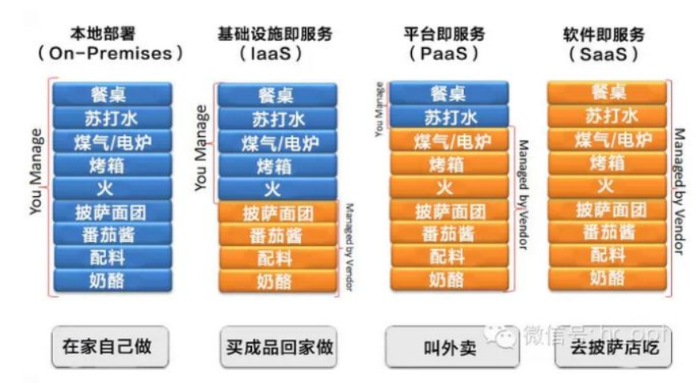

## 流量分类

- 实时的，低延迟的流量
- 大数据量的，优先吞吐量的流量。因为云计算的兴起，数据中心间进行数据交换。

## SDN

### 分层

- 应用层：SDN应用，比如流量控制，网络虚拟化，监控
  - 北向接口
- 控制平台层
  - 南向接口
- 数据平台层

## 云计算

## 流量工程

### 传统

### SDN

SDN提供了：

1. 集中可见性：包括全局网络信息（比如网络资源限制或者动态改变网络状态）和全局应用信息（比如QoS需求）
2. 可编程性：无需处理单个基础设施元素。集中控制器可以对数据平面上的OF交换机进行主动编程和动态可擦写编程，优化分配网络资源，避免网络拥塞，提高QoS性能。
3. 开放性：数据平面元素（交换机），无论供应商是谁，都有一个向控制器开放的统一接口，用于数据平面编程和网络状态收集。
4. OF交换机支持多流表通道：管理流更灵活有效

当前流量工程主要关注四点：

1. 流管理：交换机和路由器的负载均衡、多流表
2. 容错能力：数据平面和控制平面的容错
3. 拓扑更新：策略更新、同步流表项、基于时间的配置
4. 流量分析描述：

## Floodlight

### 架构

#### 主要功能模块

### 部署

http://localhost:8080/ui/pages/index.html

### 源码

#### ForwardingBase

实现了转发模块的抽象类

主要方法

- receive：处理packet_in类型的OF信息，调用processPacketInMessage去处理信息，返回Command。
- processPacketInMessage（需要实现）：

#### Forwarding

继承ForwardingBase，实现了抽象方法，定义了如何处理PacketIn消息。

## 自己的点

底层支持：

- 带宽预留
  - 流量监控
  - QoS配置
  - 应用流量标记

### 针对带宽调度中的在线和离线问题

**在线算法**：对于输入系统的一个请求，系统会同步计算得出结果。

**离线算法**：对于输入系统的一个请求，系统会积累请求异步批量处理，来达到更好的分配效果，但是舍弃了实时性，请求可能在很久之后才能得到是否能分配或者何时怎么分配的答复。

 

### 周期性调度

#### 离线和在线算法

为了提高流量分配的合理性，提高网络的吞吐量，通过阶段性得批量处理请求，使一次计算中包含更多的信息，也就是周期性调度。这样对用户请求的要求为，传输请求的截至时间必须在当前周期的下一个周期开始之后（这个请求不能在当前周期内去传输数据了）。在这一个周期内部相当于就是离线算法，知道整个涉及的阶段内的所有输入信息（请求信息）。

> 这里有个小问题，如果当前时间为周期n，有一个请求，最早开始时间在周期n内，最晚结束时间在周期n+1内。能不能把一个请求拆分为一个实时调度和一个周期调度。

对于周期性调度的离线算法

#### 后计算路径

对批量请求进行排序，贪心地为每个请求单独找符合地路径，路径和带宽同时分配

- 根据F(请求数据量,请求最早开始时间)，对请求排序
- 按顺序计算每一个请求，网络中是否有满足带宽的路径。VBVP
  - 方案一：对一个请求的带宽要求和时间要求，在每个时隙的网络资源中计算带宽最大的路径。每个时隙的数据量累加，如果满足，就使用最少的时隙数。将网络资源更新后，继续计算下一个请求。
  - **方案二**：为了让请求相互照顾，动态地修改请求地权重。遍历每一个时隙，在时隙t中，根据请求的剩余时间和待传输数据来作为优先级对请求排序。每个时隙都去计算一次得到当前时隙的带宽分配结果，得到当前时隙的分配结果，最终将分配结果合并。
- 

#### 缓存路径

先计算出所有节点之间地路径。然后对每个请求在两点之间选择合适地路径并且分配合适地流量。

- 计算出每两个节点之间地多条路径。Yen的k条最短路径。
- 规划每个请求在路径上预留的带宽。
  - 直接规划出每个时隙的每个流的占用带宽，计算规模大
  - 依次规划每个时隙中的每个流的占用带宽，

### 实时调度

应该是尽快进行传输，不受时隙影响直接传输。

#### 需求为数据量

剩下的数据量并入时隙计算。

对于当前时隙，对所有需要传输请求（新请求和旧请求）去计算路径和带宽。随着一个请求计算时隙越来越接近Deadline，它的优先级越大。

每个

### 需求为带宽

直接根据网路资源判断是否能预留请求需要的时间内的带宽。

### 离线和在线结合

选路算法中的离线：根据网络资源数据，去计算每个节点之间的路径信息，放到路径池中等待被直接选择使用。

缺点：可能会导致局部拥塞，网络整体利用率不高。

选路算法中的在线：对于请求实时地计算合适地路径。

缺点：造成相应缓慢。

### 离线和在线两者在周期性调度和实时调度中的区别

### 大概结构

VBVP

- 单路径分时隙贪心预留策略
- 多路径分时隙贪心预留策略
- 多路径全时隙LP预留策略
- 多路径分时隙LP预留策略

### 对流量去做整形

在线算法效果接近离线的方法

Lp、预知当前请求时间范围内的网络状态（不可能）、根据已知的网络状态（未完成的请求在网络中预留的带宽）计算、适当的选择不紧急的预留流量（旧暂未完成请求的）一起加入新的lp中去重新计算

https://blog.csdn.net/u011470552/article/details/78282536

 

路径是和网络拓扑绑定的，修改拓扑的同时也可能会修改路径，为请求分配路径从拓扑实例中去拿。所以将计算路径的逻辑放到修改拓扑中去。

