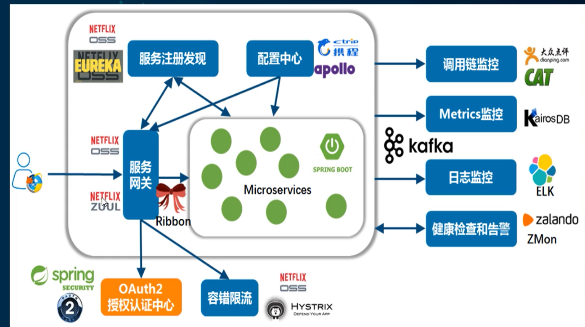

# 微服务

微服务架构是一种架构模式。

# SpringCloud

SpringCloud是分布式微服务架构的一站式解决方案。是多种微服务架构落地技术的结合体。

主要技术栈

- 服务注册与发现：Eureka、Zonkeeper、Consul、Nacos
- 服务负载：Ribbon、LoadBalancer
- 服务调用：Feign、OpenFeign
- 服务熔断降级：Hystrix、Resilience4j、Sentinel
- 服务网关：Zuul、Gateway
- 服务分布式配置：SpringCloudConfig、Nacos
- 服务总线：Bus、Nacos
- 服务开发：SpringBoot

## SpringCloud和SpringBoot的关系

- SpringBoot专注于快速方便的开发单个个体微服务
- SpringCloud是关注全局的微服务协调整理治理框架，他将SpringBoot开发的一个个单体微服务整合并管理，为各个微服务之间提供：配置管理，服务发现，熔断器，路由，微代理，事件总线，全局锁，决策竞选，分布式会话等等集成服务
- SpringBoot可以离开SpringCloud独立使用，SpringCloud离不开SpringBoot
- SpringBoot专注快速、方便的开发单个个体微服务，SpringCloud关注全局的微服务治理框架

## Dubbo和SpringCloud技术选型

### 分布式+服务治理Dubbo

这里学H.SR1+2.2.2

# 创建父工程

创建一个总的Maven项目

删掉父工程的src

## 导入依赖

~~~xml
<?xml version="1.0" encoding="UTF-8"?>
<project xmlns="http://maven.apache.org/POM/4.0.0"
         xmlns:xsi="http://www.w3.org/2001/XMLSchema-instance"
         xsi:schemaLocation="http://maven.apache.org/POM/4.0.0 http://maven.apache.org/xsd/maven-4.0.0.xsd">
    <modelVersion>4.0.0</modelVersion>

    <groupId>com.qdw</groupId>
    <artifactId>springcloud2020-study</artifactId>
    <version>1.0-SNAPSHOT</version>
    <properties>
        <project.build.sourceEncoding>UTF-8</project.build.sourceEncoding>
        <maven.compiler.source>12</maven.compiler.source>
        <maven.compiler.target>12</maven.compiler.target>
        <junit.version>4.12</junit.version>
        <lombok.version>1.18.10</lombok.version>
        <log4j.version>1.2.17</log4j.version>
        <mysql.version>8.0.18</mysql.version>
        <druid.version>1.1.16</druid.version>
        <mybatis.spring.boot.version>2.1.1</mybatis.spring.boot.version>
    </properties>
<!--    子模块继承后，提工作用：锁定版本，子模块不用再写groupId和version。如果不在子项目中声明依赖，是不引用父工程的，如果子工程声明版本号，就用自己的版本-->
    <dependencyManagement>
        <dependencies>
<!--            <dependency>-->
<!--                <groupId>org.apache.maven.plugins</groupId>-->
<!--                <artifactId>maven-project-info-reports-plugin</artifactId>-->
<!--                <version>3.0.0</version>-->
<!--            </dependency>-->
            <!--spring boot 2.2.2-->
            <dependency>
                <groupId>org.springframework.boot</groupId>
                <artifactId>spring-boot-dependencies</artifactId>
                <version>2.2.2.RELEASE</version>
                <type>pom</type>
                <scope>import</scope>
            </dependency>
            <!--spring cloud Hoxton.SR1-->
            <dependency>
                <groupId>org.springframework.cloud</groupId>
                <artifactId>spring-cloud-dependencies</artifactId>
                <version>Hoxton.SR1</version>
                <type>pom</type>
                <scope>import</scope>
            </dependency>
            <dependency>
                <groupId>org.mybatis.spring.boot</groupId>
                <artifactId>mybatis-spring-boot-starter</artifactId>
                <version>${mybatis.spring.boot.version}</version>
            </dependency>
            <!--junit-->
            <dependency>
                <groupId>junit</groupId>
                <artifactId>junit</artifactId>
                <version>${junit.version}</version>
            </dependency>
            <!--log4j-->
            <dependency>
                <groupId>log4j</groupId>
                <artifactId>log4j</artifactId>
                <version>${log4j.version}</version>
            </dependency>
        </dependencies>
    </dependencyManagement>

</project>
~~~

# 微服务提供者——支付模块

建module——改pom——写yml——主启动——业务类

pom

~~~xml
<?xml version="1.0" encoding="UTF-8"?>
<project xmlns="http://maven.apache.org/POM/4.0.0"
         xmlns:xsi="http://www.w3.org/2001/XMLSchema-instance"
         xsi:schemaLocation="http://maven.apache.org/POM/4.0.0 http://maven.apache.org/xsd/maven-4.0.0.xsd">
    <parent>
        <artifactId>springcloud2020-study</artifactId>
        <groupId>com.qdw</groupId>
        <version>1.0-SNAPSHOT</version>
    </parent>
    <modelVersion>4.0.0</modelVersion>

    <artifactId>cloudprovider-payment8001</artifactId>

    <dependencies>
        <dependency>
            <groupId>org.springframework.boot</groupId>
            <artifactId>spring-boot-starter-web</artifactId>
        </dependency>
        <dependency>
            <groupId>org.springframework.boot</groupId>
            <artifactId>spring-boot-starter-actuator</artifactId>
        </dependency>
        <dependency>
            <groupId>org.mybatis.spring.boot</groupId>
            <artifactId>mybatis-spring-boot-starter</artifactId>
        </dependency>
        <dependency>
            <groupId>com.alibaba</groupId>
            <artifactId>druid-spring-boot-starter</artifactId>
        </dependency>
        <dependency>
            <groupId>mysql</groupId>
            <artifactId>mysql-connector-java</artifactId>
        </dependency>
        <dependency>
            <groupId>org.springframework.boot</groupId>
            <artifactId>spring-boot-starter-jdbc</artifactId>
        </dependency>
        <dependency>
            <groupId>org.springframework.boot</groupId>
            <artifactId>spring-boot-devtools</artifactId>
            <scope>runtime</scope>
            <optional>true</optional>
        </dependency>
        <dependency>
            <groupId>org.projectlombok</groupId>
            <artifactId>lombok</artifactId>
            <optional>true</optional>
        </dependency>
        <dependency>
            <groupId>org.springframework.boot</groupId>
            <artifactId>spring-boot-starter-test</artifactId>
            <scope>test</scope>
        </dependency>
    </dependencies>

</project>
~~~

yml

~~~yml
server:
  port: 8001

spring:
  application:
    name: cloud-payment-service
  datasource:
    type: com.alibaba.druid.pool.DruidDataSource
    driver-class-name: com.mysql.cj.jdbc.Driver
    url: jdbc:mysql://localhost:3306/db2020?useUnicode=true&characterEncoding=utf-8&useSSL-false&serverTimezome=UTC
    username: root
    password: 123321

mybatis:
  mapper-locations: classpass:mapper/*xml
  type-aliases-package: com.qdw.springcloud.pojo
~~~

主启动类

~~~java
package com.qdw.springcloud;

import org.springframework.boot.SpringApplication;
import org.springframework.boot.autoconfigure.SpringBootApplication;

@SpringBootApplication
public class PaymentMain8001 {
    public static void main(String[] args) {
        SpringApplication.run(PaymentMain8001.class,args);
    }
}

~~~

实体类

payment

~~~java
package com.qdw.springcloud.entities;

import lombok.AllArgsConstructor;
import lombok.Data;
import lombok.NoArgsConstructor;

import java.io.Serializable;

/**
 * @PackageName:com.qdw.springcloud.entities
 * @ClassName: Payment
 * @Description:
 * @date 2020/5/10 0010 0:10
 */
@Data
@AllArgsConstructor
@NoArgsConstructor
public class Payment implements Serializable {
    private Long id;
    private String serial;
}
~~~

CommonResult，用于传数据给前端

~~~java
package com.qdw.springcloud.entities;

import lombok.AllArgsConstructor;
import lombok.Data;
import lombok.NoArgsConstructor;

/**
 * @PackageName:com.qdw.springcloud.entities
 * @ClassName: CommonResult
 * @Description:
 * @date 2020/5/10 0010 0:09
 */
@Data
@AllArgsConstructor
@NoArgsConstructor
public class CommonResult<T> {
    private Integer code;
    private String message;
    private T data;
    public CommonResult(Integer code,String message){
        this(code,message,null);
    }
}

~~~

dao

~~~java
package com.qdw.springcloud.dao;

import com.qdw.springcloud.entities.Payment;
import org.apache.ibatis.annotations.Mapper;
import org.apache.ibatis.annotations.Param;

/**
 * @PackageName:com.qdw.springcloud.dao
 * @ClassName: PaymentDao
 * @Description:
 * @date 2020/5/10 0010 0:13
 */
@Mapper
public interface PaymentDao {
    int insert(Payment payment);
    Payment queryPaymentById(@Param("id") Long id);
}

~~~

mapper

~~~xml
<?xml version="1.0" encoding="utf-8" ?>
<!DOCTYPE mapper PUBLIC "-//mybatis.org//DTD Mapper 3.0//EN" "http://mybatis.org/dtd/mybatis-3-mapper.dtd" >
<mapper namespace="com.qdw.springcloud.dao.PaymentDao">

    <insert id="insert" parameterType="Payment" useGeneratedKeys="true" keyProperty="id">
        insert into Payment (serial) values (#{serial})
    </insert>

    <select id="queryPaymentById" resultMap="PaymentResultMap">
        select id,serial from Payment where id=#{id}
    </select>
    <resultMap id="PaymentResultMap" type="Payment">
        <result column="id" property="id" jdbcType="BIGINT"/>
        <result column="serial" property="serial" jdbcType="VARCHAR"></result>
    </resultMap>

</mapper>
~~~

service实体类

~~~java
package com.qdw.springcloud.service;

import com.qdw.springcloud.dao.PaymentDao;
import com.qdw.springcloud.entities.Payment;
import org.springframework.beans.factory.annotation.Autowired;
import org.springframework.stereotype.Service;

import javax.annotation.Resource;

/**
 * @PackageName:com.qdw.springcloud.service
 * @ClassName: PaymentServiceImpl
 * @Description:
 * @date 2020/5/11 0011 0:10
 */
@Service
public class PaymentServiceImpl implements PaymentService {
    @Autowired
    private PaymentDao paymentDao;
    @Override
    public int createPayment(Payment payment) {
        return paymentDao.insert(payment);
    }

    @Override
    public Payment getPaymentById(Long id) {
        return paymentDao.queryPaymentById(id);
    }
}

~~~

controller

~~~java
package com.qdw.springcloud.controller;

import com.qdw.springcloud.entities.CommonResult;
import com.qdw.springcloud.entities.Payment;
import com.qdw.springcloud.service.PaymentService;
import lombok.extern.slf4j.Slf4j;
import org.springframework.beans.factory.annotation.Autowired;
import org.springframework.stereotype.Controller;
import org.springframework.web.bind.annotation.GetMapping;
import org.springframework.web.bind.annotation.PathVariable;
import org.springframework.web.bind.annotation.PostMapping;
import org.springframework.web.bind.annotation.RestController;

/**
 * @PackageName:com.qdw.springcloud.controller
 * @ClassName: PaymentController
 * @Description:
 * @date 2020/5/11 0011 0:15
 */
@RestController
@Slf4j
public class PaymentController {
    @Autowired
    private PaymentService paymentService;

    @PostMapping("/payment/create")
    public CommonResult createPayment(Payment payment){
        int result = paymentService.createPayment(payment);
        log.info("***插入结果"+result);
        if (result > 0){
            return new CommonResult(200,"插入数据库成功",result);
        }else {
            return new CommonResult(444,"插入数据库失败",null);
        }
    }

    @GetMapping("/payment/get/{id}")
    public CommonResult getPayment(@PathVariable("id") Long id){
        Payment result = paymentService.getPaymentById(id);
        log.info("***查询结果"+result);
        if (result != null){
            return new CommonResult(200,"查询成功",result);
        }else {
            return new CommonResult(444,"查询失败",null);
        }
    }
}

~~~

## 新建API模块

springcloud-api

连接数据库

插入数据

~~~sql
insert into dept (name, db_name) VALUES ('后勤部',DATABASE());
~~~

新建一个实体类

~~~java
package com.qdw.springcloud.pojo;

import lombok.AllArgsConstructor;
import lombok.Data;
import lombok.NoArgsConstructor;
import lombok.experimental.Accessors;

import java.io.Serializable;
@Data
@NoArgsConstructor
@AllArgsConstructor
//支持链式写法
@Accessors(chain = true)
@Alias("Dept")
public class Dept implements Serializable {
    private Long id;
    private String name;
    //数据库名字
    private String dbName;
    public Dept(String name){
        this.name = name;
    }
}
~~~

## 新建提供者模块

springcloud-provider-dept-8001

导入api模块

~~~xml
<dependencies>
    <dependency>
        <groupId>com.qdw</groupId>
        <artifactId>springcloud-api</artifactId>
        <version>1.0-SNAPSHOT</version>
    </dependency>
</dependencies>
~~~

创建配置文件application.yaml

~~~yaml
server:
  port: 8001
mybatis:
  type-aliases-package: com.qdw.springcloud.pojo
  config-location: classpath:mybatis/mybatis-config.xml
  mapper-locations: classpath:mybatis/mapper/*.xml
spring:
  application:
    name: springcloud-provider-dept
  datasource:
    type: com.alibaba.druid.pool.DruidDataSource
    driver-class-name: com.mysql.cj.jdbc.Driver
    url: jdbc:mysql://localhost:3306/sc_test1?serverTimeZone=UTC
    username: root
    password: 123321
~~~

创建mybatis核心配置，mybatis.config.xml

~~~xml
<?xml version="1.0" encoding="UTF-8" ?>
<!DOCTYPE configuration
        PUBLIC "-//mybatis.org//DTD Config 3.0//EN"
        "http://mybatis.org/dtd/mybatis-3-config.dtd">
<configuration>
    <settings>
<!--        开启二级缓存-->
        <setting name="cacheEnabled" value="true"/>
    </settings>
    <mappers>
        <mapper resource="org/mybatis/example/BlogMapper.xml"/>
    </mappers>
</configuration>
~~~

mapper

DeptMapper

~~~java
package com.qdw.springcloud.mapper;

import com.qdw.springcloud.pojo.Dept;
import org.apache.ibatis.annotations.Mapper;
import org.springframework.stereotype.Repository;

import java.util.List;

@Mapper
@Repository
public interface DeptMapper {
    Dept queryDept(Long id);
    List<Dept> queryDepts();
    Boolean insertDept(Dept dept);
}
~~~

mappe.xml

DeptMapper.xml

~~~xml
<?xml version="1.0" encoding="utf-8" ?>
<!DOCTYPE mapper PUBLIC "-//mybatis.org//DTD Mapper 3.0//EN" "http://mybatis.org/dtd/mybatis-3-mapper.dtd" >
<mapper namespace="com.qdw.springcloud.mapper.DeptMapper">

    <select id="queryDept" resultType="Dept" parameterType="long">
        select * from dept where id=#{id}
    </select>

    <select id="queryDepts" resultType="Dept">
        select * from dept
    </select>

    <insert id="insertDept" parameterType="Dept">
        insert into dept (name, db_name) VALUES (#{name},DATABASE());
    </insert>

</mapper>
~~~

service

DeptService

~~~java
package com.qdw.springcloud.service;

import com.qdw.springcloud.pojo.Dept;

import java.util.List;

public interface DeptService {
    Dept getDept(Long id);
    List<Dept> getDepts();
    Boolean addDept(Dept dept);
}
~~~

DeptServiceImpl

~~~java
package com.qdw.springcloud.service;

import com.qdw.springcloud.mapper.DeptMapper;
import com.qdw.springcloud.pojo.Dept;
import org.springframework.beans.factory.annotation.Autowired;
import org.springframework.stereotype.Service;

import java.util.List;
@Service
public class DeptServiceImpl implements DeptService {
    @Autowired
    private DeptMapper deptMapper;
    public Dept getDept(Long id) {
        return deptMapper.queryDept(id);
    }

    public List<Dept> getDepts() {
        return deptMapper.queryDepts();
    }

    public Boolean addDept(Dept dept) {
        return deptMapper.insertDept(dept);
    }
}
~~~

启动类

Provider_8001

~~~java
package com.qdw.springcloud;

import org.springframework.boot.SpringApplication;
import org.springframework.boot.autoconfigure.SpringBootApplication;

@SpringBootApplication
public class Provider_8001 {
    public static void main(String[] args) {
        SpringApplication.run(Provider_8001.class,args);
    }
}
~~~

## 新建消费者模块

