[**首页**](https://github.com/qdw497874677/myNotes/blob/master/首页检索.md)

# Swagger

## 前后端分离

- 后端：后端控制层，服务层，数据访问层
- 前端：前端控制层，视图层

通过API交互

## Swagger简介

- 非常流行的API框架
- RestFul API文档在线自动生成工具
- 直接运行，可以在线测试API接口

## Springboot集成Swagger

### 新建项目

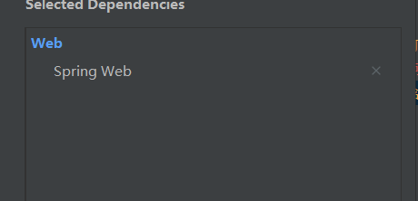


### 导入依赖

~~~
        <dependency>
            <groupId>io.springfox</groupId>
            <artifactId>springfox-swagger2</artifactId>
            <version>2.9.2</version>
        </dependency>
        <dependency>
            <groupId>io.springfox</groupId>
            <artifactId>springfox-swagger-ui</artifactId>
            <version>2.9.2</version>
        </dependency>
~~~


### 配置

最简单的

~~~java
@Configuration
//开启Swagger2
@EnableSwagger2
public class SwaggerConfig {
    
}
~~~


### 测试访问

http://localhost:8080/swagger-ui.html

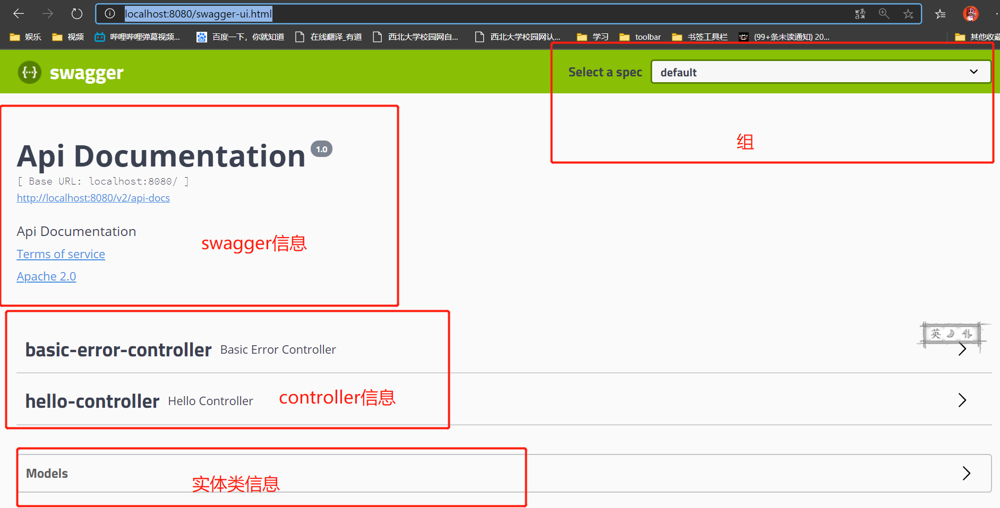


### 仔细配置

~~~java
@Configuration
//开启Swagger2
@EnableSwagger2
public class SwaggerConfig {

    @Bean
    public Docket docket(){

        return new Docket(DocumentationType.SWAGGER_2)
                .apiInfo(apiInfo());
    }

    private ApiInfo apiInfo(){
        Contact contact = new Contact("qdw","www.baidu.com","nwu_qdw@163.com");
        return new ApiInfo("qdw:Api Documentation"
                , "Api Documentation"
                , "1.0"
                , "urn:tos"
                , contact
                , "Apache 2.0"
                , "http://www.apache.org/licenses/LICENSE-2.0"
                , new ArrayList());

    }
}
~~~


## 配置扫描接口

~~~java
@EnableSwagger2
public class SwaggerConfig {

    @Bean
    public Docket docket(){

        return new Docket(DocumentationType.SWAGGER_2)
                .apiInfo(apiInfo())
                .select()
                //RequestHandlerSelectors配置扫描接口的方式，basePackage根据包扫描
                .apis(RequestHandlerSelectors.basePackage("com.qdw.controller"))
                //ant只扫描指定路径
                .paths(PathSelectors.ant("/qdw/**"))
                .build();
    }

    private ApiInfo apiInfo(){
        Contact contact = new Contact("qdw","www.baidu.com","nwu_qdw@163.com");
        return new ApiInfo("qdw:Api Documentation"
                , "Api Documentation_测试"
                , "1.0"
                , "urn:tos"
                , contact
                , "Apache 2.0"
                , "http://www.apache.org/licenses/LICENSE-2.0"
                , new ArrayList());

    }
}
~~~


## 配置是否启动

false,不启动

~~~java
return new Docket(DocumentationType.SWAGGER_2)
                .apiInfo(apiInfo()).enable(false);
~~~


## 如何在生成中使用，发布时不适用

### 判断生产环境

~~~java
@Configuration
//开启Swagger2
@EnableSwagger2
public class SwaggerConfig {

    @Bean
    public Docket docket(Environment environment){

        //设置要显示的环境
        Profiles dev = Profiles.of("dev","test");
        //判断是否在设定的环境中
        //如果当前环境为dev，那么flag为true
        boolean flag = environment.acceptsProfiles(dev);

        return new Docket(DocumentationType.SWAGGER_2)
                .apiInfo(apiInfo())
                //如果enable()的参数为true就启动，false就不启动
                .enable(flag)
                .select()
                //RequestHandlerSelectors配置扫描接口的方式，basePackage根据包扫描
                .apis(RequestHandlerSelectors.basePackage("com.qdw.controller"))
                //ant只扫描指定路径
                .paths(PathSelectors.ant("/qdw/**"))
                .build();
    }

    private ApiInfo apiInfo(){
        Contact contact = new Contact("qdw","www.baidu.com","nwu_qdw@163.com");
        return new ApiInfo("qdw:Api Documentation"
                , "Api Documentation_测试"
                , "1.0"
                , "urn:tos"
                , contact
                , "Apache 2.0"
                , "http://www.apache.org/licenses/LICENSE-2.0"
                , new ArrayList());

    }
}
~~~


~~~
spring.profiles.active=dev
~~~


## 分组和接口注释

### 配置多个分组

~~~java
@Configuration
//开启Swagger2
@EnableSwagger2
public class SwaggerConfig {

    @Bean
    public Docket docket1(){
        return new Docket(DocumentationType.SWAGGER_2).groupName("qdw1");
    }
    @Bean
    public Docket docket2(){
        return new Docket(DocumentationType.SWAGGER_2).groupName("qdw2");
    }
    
    @Bean
    public Docket docket(Environment environment){

        //设置要显示的环境
        Profiles dev = Profiles.of("dev","test");
        //判断是否在设定的环境中
        //如果当前环境为dev，那么flag为true
        boolean flag = environment.acceptsProfiles(dev);

        return new Docket(DocumentationType.SWAGGER_2)
                .apiInfo(apiInfo())
                .groupName("qdw")
                //如果enable()的参数为true就启动，false就不启动
                .enable(flag)
                .select()
                //RequestHandlerSelectors配置扫描接口的方式，basePackage根据包扫描
                .apis(RequestHandlerSelectors.basePackage("com.qdw.controller"))
                //ant只扫描指定路径
                .paths(PathSelectors.ant("/qdw/**"))
                .build();
    }

    private ApiInfo apiInfo(){
        Contact contact = new Contact("qdw","www.baidu.com","nwu_qdw@163.com");
        return new ApiInfo("qdw:Api Documentation"
                , "Api Documentation_测试"
                , "1.0"
                , "urn:tos"
                , contact
                , "Apache 2.0"
                , "http://www.apache.org/licenses/LICENSE-2.0"
                , new ArrayList());

    }
}
~~~


## 扫描实体类

在接口中，有返回实体类就会被扫描到

~~~java
@Controller
@ResponseBody
public class HelloController {
    @RequestMapping("/hello")
    public String hello(){
        return "hello";
    }
    @PostMapping("/user")
    public User user(){
        return new User();
    }
}
~~~

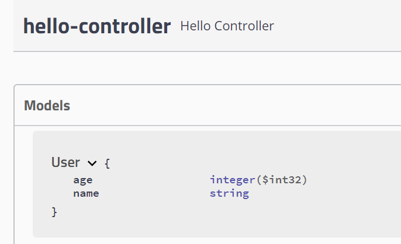

通过注解给实体类接口文档加注释

非String类型，加接口注释的话，注解上要写example，因为默认example是""，其他类型会转换失败，报错

~~~java
@Data
@AllArgsConstructor
@NoArgsConstructor
//给实体类加注释
@ApiModel("用户实体类")
public class User {
    @ApiModelProperty("名字")
    private String name;
    @ApiModelProperty(value = "年龄",example = "1")
    private int age;
}
~~~

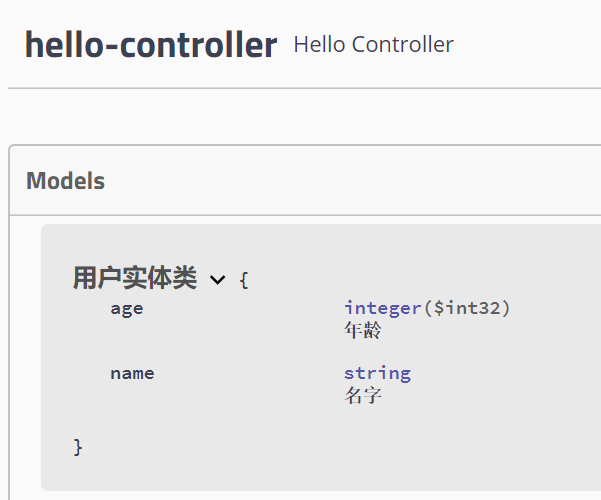

controller的方法也可以加注释

~~~java
@Controller
@ResponseBody
public class HelloController {
    @PostMapping("/hello")
    public String hello(){
        return "hello";
    }
    @PostMapping("/user")
    public User user(){
        return new User();
    }

    @ApiOperation("测试hello")
    @GetMapping("/hello")
    public String helloName(@ApiParam("名字") String name){
        return "hello";
    }
}
~~~

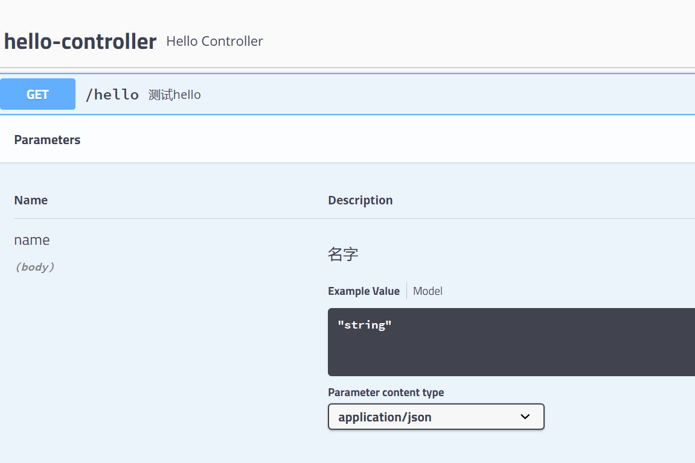


## 测试接口

~~~java
@Controller
@ResponseBody
public class HelloController {
    @GetMapping("/hello")
    public String hello(){
        return "hello";
    }
    @PostMapping("/user")
    public User user(){
        return new User();
    }

    @ApiOperation("测试hello-POST")
    @GetMapping("/helloParam")
    public String helloName(@ApiParam("名字")@RequestParam String name){
        System.out.println("name"+name);
        return name;
    }

    @ApiOperation("测试helloUser")
    @PostMapping("/helloUser")
    public User helloUser(@ApiParam("用户") User user){
        return user;
    }
}

~~~

测试几个接口

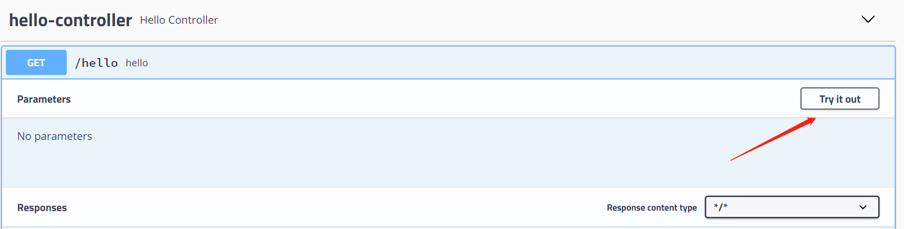

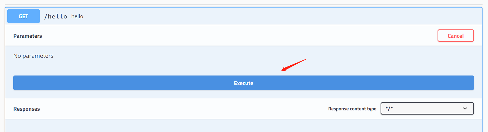

返回的结果

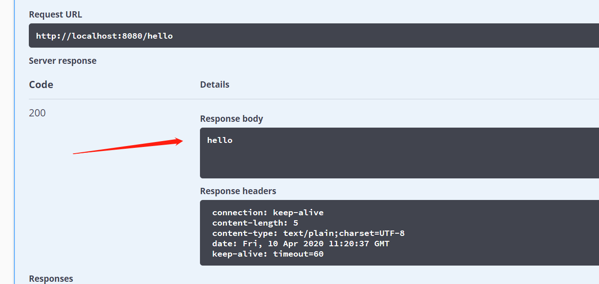


测试传入参数

- GET

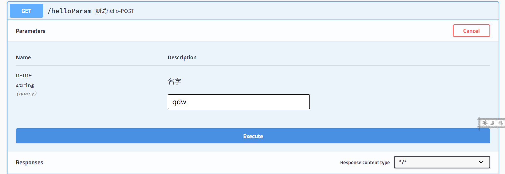

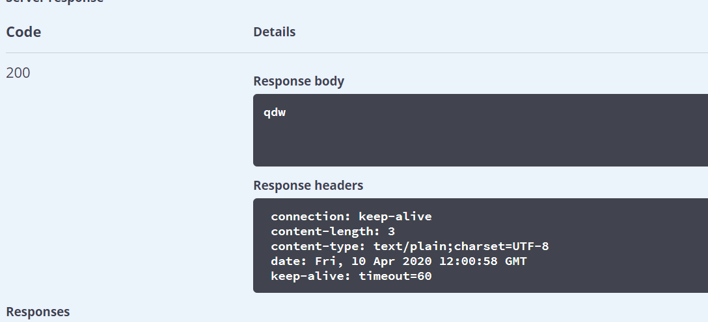


- POST

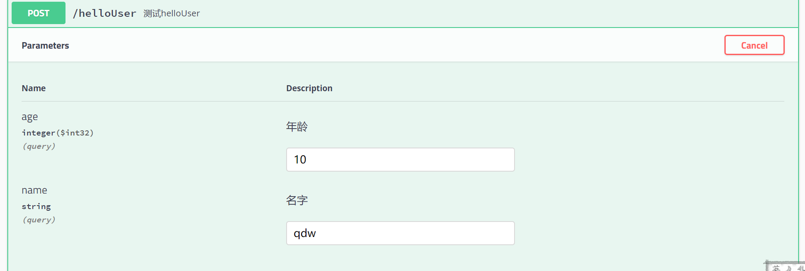

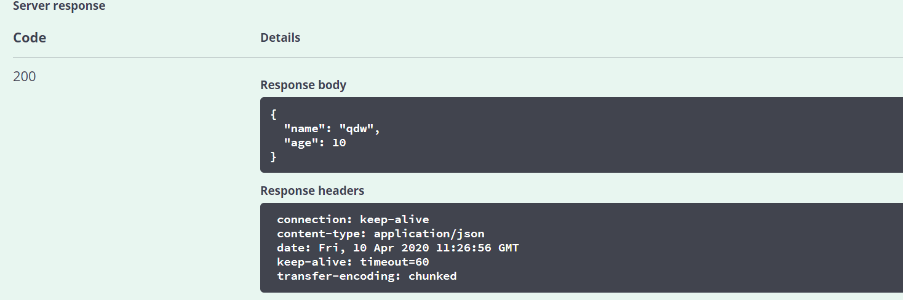


## 总结

- 给接口加注释
- 接口文档实时更新
- 在线测试
- 就是为了协调前后端


# 任务

## 异步任务

如果一个方法不是一部，浏览器会一直等待结果

要实现异步任务

先开启

~~~java
@SpringBootApplication
//开启异步任务
@EnableAsync
public class Sprinboot09TestApplication {

    public static void main(String[] args) {
        SpringApplication.run(Sprinboot09TestApplication.class, args);
    }
}
~~~

在方法上加上注解

~~~java
@Service
public class AsyncService {
    //使用异步处理，spring自动使用一个线程处理这个方法
    @Async
    public void hello(){
        System.out.println("数据正在处理");
        try {
            Thread.sleep(3000);
        } catch (InterruptedException e) {
            e.printStackTrace();
        }
        System.out.println("数据处理完毕");
    }
}
~~~

这样可以对浏览器立即做出反应，任务异步去执行

~~~java
@Controller
@ResponseBody
public class AsyncController {
    @Autowired
    private AsyncService asyncService;

    @GetMapping("/hello")
    public String hello(){
        asyncService.hello();
        return "OK";
    }
}
~~~


## 邮件任务


导入依赖

~~~
<dependency>
	<groupId>org.springframework.boot</groupId>
	<artifactId>spring-boot-starter-mail</artifactId>
</dependency>
~~~


在自己的邮箱设置中开启POP3/SMTP服务

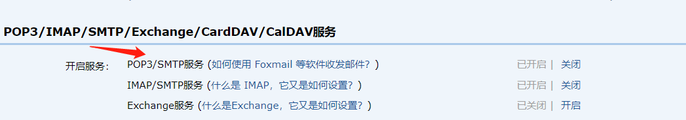

获取一个密码


配置

~~~
spring.mail.username=497874677@qq.com
spring.mail.password=ipeyvlirhdorbgjb
spring.mail.host=smtp.qq.com
#开启加密验证
spring.mail.properties.mail.smtl.ssl.enable=true
~~~

发送一个简单的邮件

~~~java
@SpringBootTest
class Sprinboot09TestApplicationTests {
    @Autowired
    private JavaMailSenderImpl javaMailSender;
    @Test
    void contextLoads() {
        SimpleMailMessage simpleMailMessage = new SimpleMailMessage();
        simpleMailMessage.setSubject("你好");
        simpleMailMessage.setText("非常感谢");
        simpleMailMessage.setTo("497874677@qq.com");
        simpleMailMessage.setFrom("497874677@qq.com");
        javaMailSender.send(simpleMailMessage);
    }
}
~~~

复杂的邮件

~~~java
@SpringBootTest
class Sprinboot09TestApplicationTests {
    @Autowired
    private JavaMailSenderImpl javaMailSender;
    @Test
    void test1() throws MessagingException {
        //有很多创建的方法
        MimeMessage mimeMessage = javaMailSender.createMimeMessage();
        MimeMessageHelper mimeMessageHelper = new MimeMessageHelper(mimeMessage,true);
        mimeMessageHelper.setSubject("qdw,你好");
        mimeMessageHelper.setText("<p style='color:red'>非常感谢</p>",true);
        mimeMessageHelper.addAttachment("权头像.jpeg",new File("C:\\Users\\qdw49\\Pictures\\权头像.jpeg"));
        mimeMessageHelper.setTo("497874677@qq.com");
        mimeMessageHelper.setFrom("497874677@qq.com");
        javaMailSender.send(mimeMessage);
    }

}

~~~


## 定时任务

在启动类中上加开启定时任务注解

~~~java
//开启定时任务
@EnableScheduling
~~~


要用cron表达式

关于cron可以上网去查

~~~java
@Service
public class ScheduledService {
    //特定时间执行这个方法
    //cron表达式
    //秒 分 时 日 月 周
    @Scheduled(cron = "0 36 * * * ?")
    public void hello(){
        Calendar calendar = Calendar.getInstance(TimeZone.getDefault());
        SimpleDateFormat sdf1 = new SimpleDateFormat("yyyy-MM-dd HH:mm"); // HH ~ 24小时制
        System.out.println("\nTime1 in 24h : " + sdf1.format(calendar.getTime()));
        System.out.println("执行任务");
    }
}
~~~


# 分布式

> 分布式系统由一组通过网络进行通信，为了完成共同任务而协调工作的计算机节点组成的系统。


## RPC

远程过程调用，是一种进程间通信方式，是一种技术思想。它允许程序调用另一个地址空间的过程或函数，而不用程序员去管细节

通过RPC去调用远程的方法


# Dubbo

一个高可用的RPC框架

提供了三大核心能力

- 面向接口的远程方法调用
- 智能熔断和负载均衡
- 服务自动注册和发现

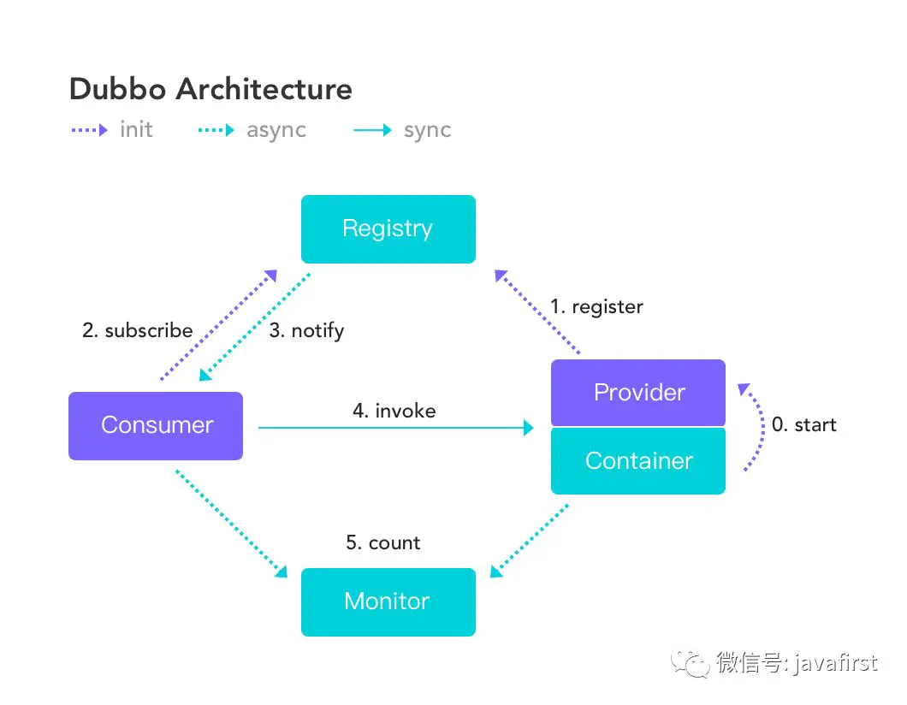

- Provider: 暴露服务的服务提供方。
- Consumer: 调用远程服务的服务消费方。
- Registry: 服务注册与发现的注册中心。
- Monitor: 统计服务的调用次数和调用时间的监控中心。


## zookeeper

是一个分布式应用协调服务，在dubbo中作为注册中心


下载apache-zookeeper-3.5.7-bin.tar.gz

解压后conf目录下复制出一个zoo.cfg

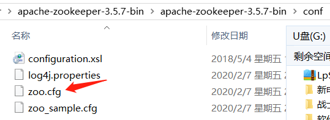

然后在bin目录里，windows执行zkServer.cmd

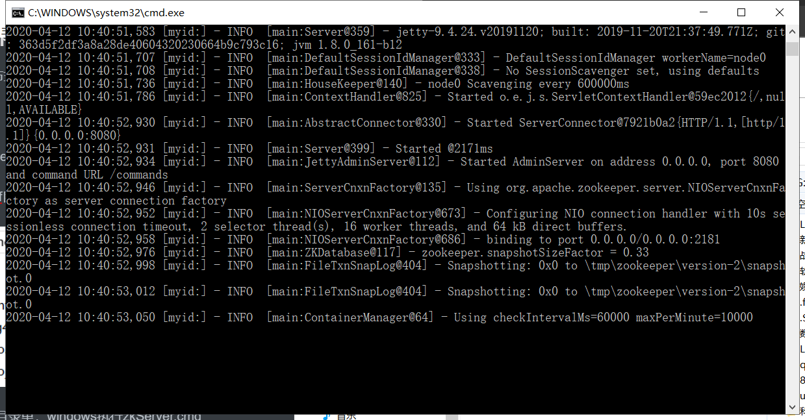

使用客户端连接zkCli.cmd

连接成功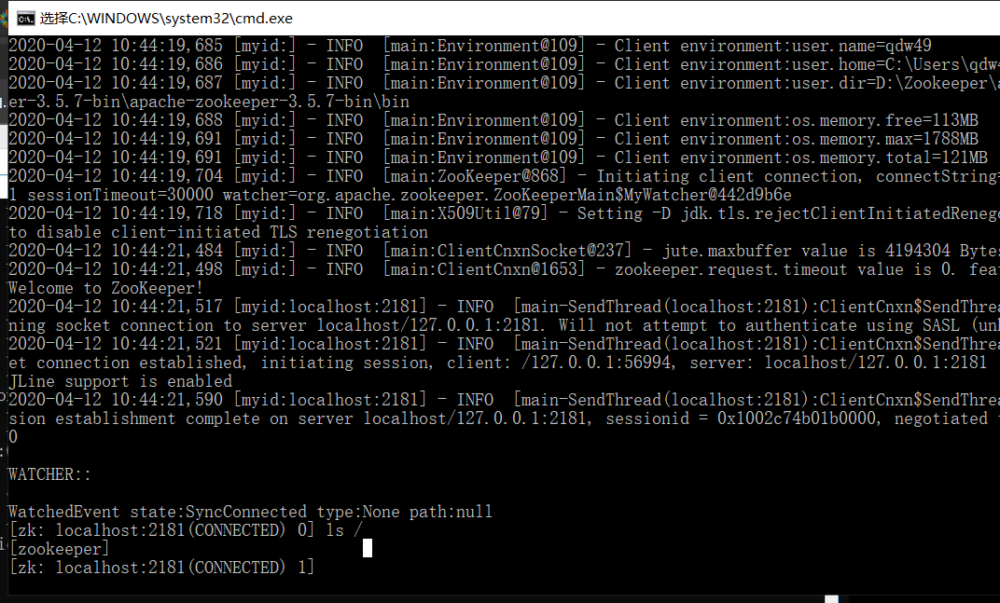

~~~bash
[zk: localhost:2181(CONNECTED) 0] ls /
[zookeeper]
[zk: localhost:2181(CONNECTED) 1] create -e /qdw 123
Created /qdw
[zk: localhost:2181(CONNECTED) 2] ls /
[qdw, zookeeper]
[zk: localhost:2181(CONNECTED) 3] get /qdw
123
[zk: localhost:2181(CONNECTED) 4]
~~~


## 使用dubbo-admin

dubbo不是一个服务，是一个jar包

这里安装一个可视化的监控程序dubbo-admin（可用可不用）

> 它是监控管理后台，可视化地查看注册了哪些服务，消费了哪些

下载项目

用maven构建项目

~~~bash
mvn clean package -Dmaven.test.skip=true
~~~

打开Zookeeper，然后dubbo-admin的jar包

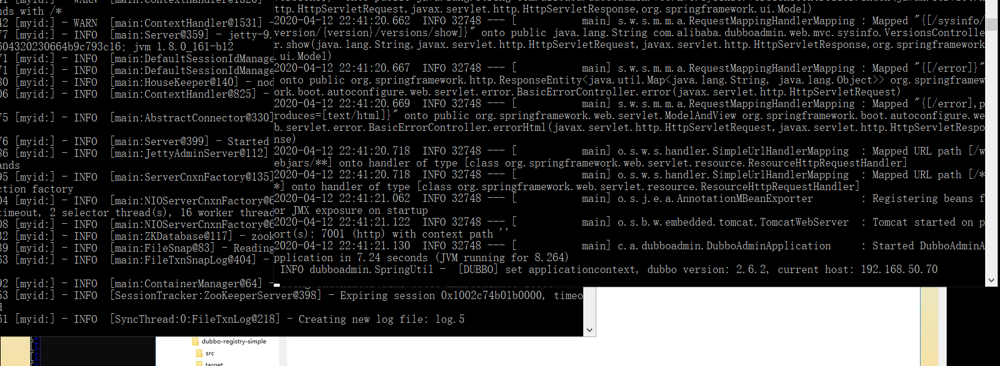


访问http://localhost:7001/

默认账号密码 root root

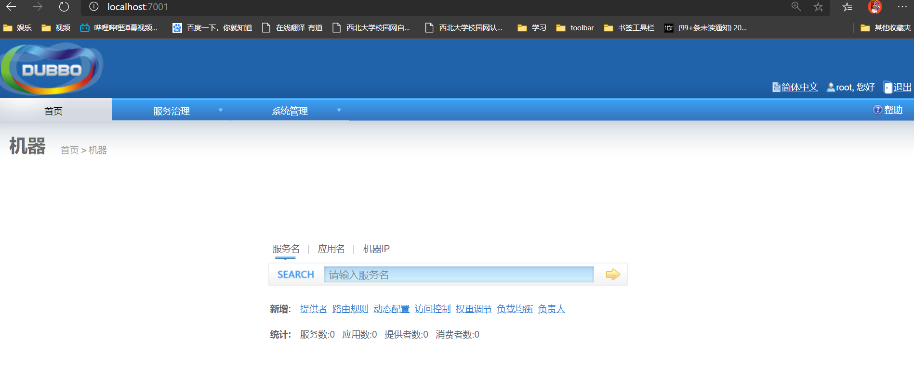


## springboot+dubbo+zookeeper


创建两个springboot项目，添加web依赖，配置不同的端口

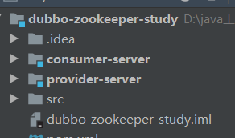


### 服务提供者

服务提供者导入依赖，dubbo和zookeeper

~~~
<!--        dubbo-->
        <dependency>
            <groupId>org.apache.dubbo</groupId>
            <artifactId>dubbo-spring-boot-starter</artifactId>
            <version>2.7.6</version>
        </dependency>
<!--        zookeeper client-->
        <dependency>
            <groupId>com.github.sgroschupf</groupId>
            <artifactId>zkclient</artifactId>
            <version>0.1</version>
        </dependency>
<!--        zonkeeper-->
        <dependency>
            <groupId>org.apache.curator</groupId>
            <artifactId>curator-framework</artifactId>
            <version>3.3.0</version>
        </dependency>
        <dependency>
            <groupId>org.apache.curator</groupId>
            <artifactId>curator-recipes</artifactId>
            <version>3.3.0</version>
        </dependency>
        <dependency>
            <groupId>org.apache.zookeeper</groupId>
            <artifactId>zookeeper</artifactId>
            <version>3.5.6</version>
            <exclusions>
                <exclusion>
                    <groupId>org.slf4j</groupId>
                    <artifactId>slf4j-log4j12</artifactId>
                </exclusion>
                <exclusion>
                    <groupId>org.slf4j</groupId>
                    <artifactId>slf4j-api</artifactId>
                </exclusion>
            </exclusions>
        </dependency>
~~~

配置provider

```
server.port=8081
#服务应用名字
dubbo.application.name=provider-server
#注册中心地址
dubbo.registry.address=zookeeper://127.0.0.1:2181
#哪些服务要被注册
dubbo.scan.base-packages=com.qdw.service
```

把要扫描的包内的要提供服务的类加上注解@Component

~~~java
package com.qdw.service;
import org.springframework.stereotype.Component;
//为了区分dubbo的service，这里用Component加载到spring容器中
@Component
//这个Service注解是dubbo的，加了这个就可以被扫描到
@Service
public class TicketServiceImpl implements TicketService {
    @Override
    public String getTicket() {
        return "qdw:拿到了票";
    }
}
~~~

启动zookeeper服务器

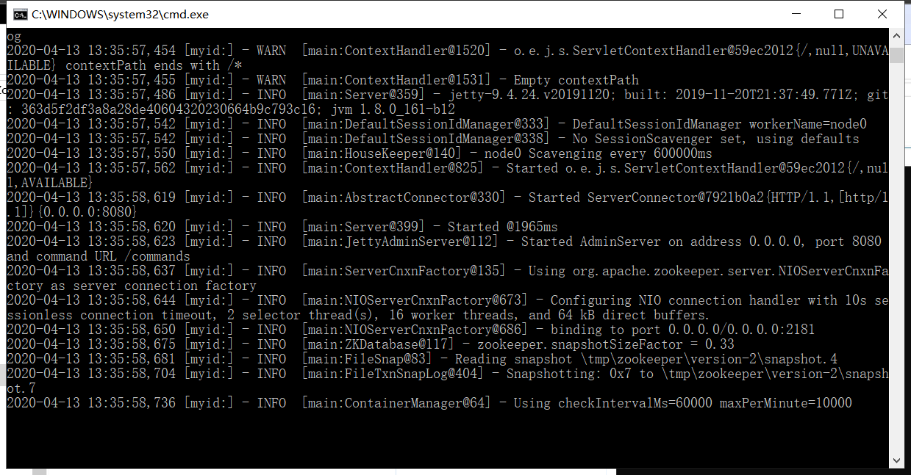

运行provider项目


用dubbo-admin去查看，找到一个注册的提供者

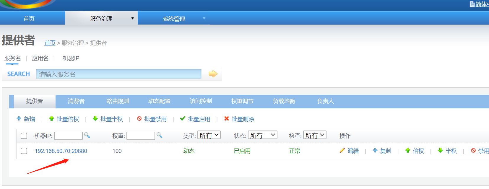


### 服务消费者

消费者导入依赖，和提供者一样

~~~
<!--        dubbo-->
        <dependency>
            <groupId>org.apache.dubbo</groupId>
            <artifactId>dubbo-spring-boot-starter</artifactId>
            <version>2.7.6</version>
        </dependency>
<!--        zookeeper client-->
        <dependency>
            <groupId>com.github.sgroschupf</groupId>
            <artifactId>zkclient</artifactId>
            <version>0.1</version>
        </dependency>
<!--        zonkeeper-->
        <dependency>
            <groupId>org.apache.curator</groupId>
            <artifactId>curator-framework</artifactId>
            <version>3.3.0</version>
        </dependency>
        <dependency>
            <groupId>org.apache.curator</groupId>
            <artifactId>curator-recipes</artifactId>
            <version>3.3.0</version>
        </dependency>
        <dependency>
            <groupId>org.apache.zookeeper</groupId>
            <artifactId>zookeeper</artifactId>
            <version>3.5.6</version>
            <exclusions>
                <exclusion>
                    <groupId>org.slf4j</groupId>
                    <artifactId>slf4j-log4j12</artifactId>
                </exclusion>
                <exclusion>
                    <groupId>org.slf4j</groupId>
                    <artifactId>slf4j-api</artifactId>
                </exclusion>
            </exclusions>
        </dependency>
~~~

配置

~~~
server.port=8082
dubbo.application.name=consumer-server
dubbo.registry.address=zookeeper://127.0.0.1:2181
dubbo.scan.base-packages=com.qdw.service
~~~

在消费者的service中要获取提供者的

在消费者中创建一个提供者提供服务的接口文件

~~~java
package com.qdw.service;
import org.apache.dubbo.config.annotation.Reference;
import org.springframework.stereotype.Service;
//这个Service是spring的
@Service
public class UserService {
    //用来拿到远程的接口的实现，这个接口要定义在与远程相同的路径下
    @Reference
    TicketService ticketService;
    public void buyTicket(){
        String ticket = ticketService.getTicket();
        System.out.println(ticket);
    }
}

~~~

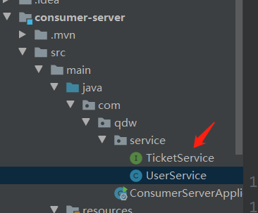


测试远程调用

~~~java
package com.qdw;

import com.qdw.service.UserService;
import org.junit.jupiter.api.Test;
import org.springframework.beans.factory.annotation.Autowired;
import org.springframework.boot.test.context.SpringBootTest;
@SpringBootTest
class ConsumerServerApplicationTests {
    @Autowired
    UserService userService;
    @Test
    void contextLoads() {
        userService.buyTicket();
    }
}

~~~

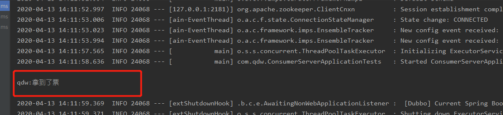


# 日志

配置**Logback**

在**resources**中创建配置文件**logback-spring.xml**

~~~xml
<configuration scan="true" scanPeriod="60 seconds" debug="false">  
         <!-- 属性文件:在properties/yml文件中找到对应的配置项 -->
    <springProperty scope="context" name="logging.path" source="logging.path"/>
    <contextName>魔力小佳佳</contextName> 

    <appender>
        //xxxx
    </appender>   

    <logger>
        //xxxx
    </logger>

    <root>             
       //xxxx
    </root>  
</configuration>
~~~

- contextName
  - 每个logger都关联到logger上下文，默认上下文名称为“default”。但可以使用contextName标签设置成其他名字，用于区分不同应用程序的记录
- property
  - 用来定义变量值的标签，property标签有两个属性，name和value；其中name的值是变量的名称，value的值时变量定义的值。通过property定义的值会被插入到logger上下文中。定义变量后，可以使“${name}”来使用变量。如上面的xml所示。
- logger
  - 用来设置某一个包或者具体的某一个类的日志打印级别以及指定appender。
- root
  - 根logger，也是一种logger，且只有一个level属性
- appender
  - 负责写日志的组件


有关日志的简单配置，我们可以直接在application.yml中进行简单的配置，比如指明日志的打印级别和日志的输出位置

~~~yml
logging:
  level:
    root: info
  path: ./logs
~~~

也可以根据分环境配置指明使用的配置文件，缺省为logback-spring.xml

~~~yml
logging:
  level:
    root: info
  path: ./logs
  config: classpath:/logback-dev.xml
~~~


在resources目录下新建logback-spring.xml文件，举例一个简单的需求，如果在项目中我们如果需要指定日志的输出格式以及根据日志级别输出到不同的文件，可以配置如下：

~~~xml
<?xml version="1.0" encoding="UTF-8" ?>
<configuration>
    <!-- 属性文件:在properties文件中找到对应的配置项 -->
    <springProperty scope="context" name="logging.path" source="logging.path"/>
    <contextName>xiaoming</contextName>
    <appender name="consoleLog" class="ch.qos.logback.core.ConsoleAppender">
        <encoder class="ch.qos.logback.classic.encoder.PatternLayoutEncoder">
            <!--格式化输出（配色）：%d表示日期，%thread表示线程名，%-5level：级别从左显示5个字符宽度%msg：日志消息，%n是换行符-->
            <pattern>%yellow(%d{yyyy-MM-dd HH:mm:ss}) %red([%thread]) %highlight(%-5level) %cyan(%logger{50}) - %magenta(%msg) %n
            </pattern>
            <charset>UTF-8</charset>
        </encoder>
    </appender>

    <!--根据日志级别分离日志，分别输出到不同的文件-->
    <appender name="fileInfoLog" class="ch.qos.logback.core.rolling.RollingFileAppender">
        <filter class="ch.qos.logback.classic.filter.LevelFilter">
            <level>ERROR</level>
            <onMatch>DENY</onMatch>
            <onMismatch>ACCEPT</onMismatch>
        </filter>
        <encoder class="ch.qos.logback.classic.encoder.PatternLayoutEncoder">
            <pattern>
                %d{yyyy-MM-dd HH:mm:ss} [%thread] %-5level %logger{50} - %msg%n
            </pattern>
            <charset>UTF-8</charset>
        </encoder>
        <!--滚动策略-->
        <rollingPolicy class="ch.qos.logback.core.rolling.TimeBasedRollingPolicy">
            <!--按时间保存日志 修改格式可以按小时、按天、月来保存-->
            <fileNamePattern>${logging.path}/xiaoming.info.%d{yyyy-MM-dd}.log</fileNamePattern>
            <!--保存时长-->
            <MaxHistory>90</MaxHistory>
            <!--文件大小-->
            <totalSizeCap>1GB</totalSizeCap>
        </rollingPolicy>
    </appender>

    <appender name="fileErrorLog" class="ch.qos.logback.core.rolling.RollingFileAppender">
        <filter class="ch.qos.logback.classic.filter.ThresholdFilter">
            <level>ERROR</level>
        </filter>
        <encoder>
            <pattern>
                %d{yyyy-MM-dd HH:mm:ss} [%thread] %-5level %logger{50} - %msg%n
            </pattern>
        </encoder>
        <!--滚动策略-->
        <rollingPolicy class="ch.qos.logback.core.rolling.TimeBasedRollingPolicy">
            <!--路径-->
            <fileNamePattern>${logging.path}/xiaoming.error.%d{yyyy-MM-dd}.log</fileNamePattern>
            <MaxHistory>90</MaxHistory>
        </rollingPolicy>
    </appender>
    <root level="info">
        <appender-ref ref="consoleLog"/>
        <appender-ref ref="fileInfoLog"/>
        <appender-ref ref="fileErrorLog"/>
    </root>
</configuration>
~~~

再比如如果粒度再细一些，根据不同的模块，输出到不同的文件，可以如下配置

~~~xml
<!--特殊功能单独appender 例如调度类的日志-->
    <appender name="CLASS-APPENDER" class="ch.qos.logback.core.rolling.RollingFileAppender">
        <filter class="ch.qos.logback.classic.filter.ThresholdFilter">
            <level>INFO</level>
        </filter>
        <encoder>
            <pattern>
                %d{yyyy-MM-dd HH:mm:ss} [%thread] %-5level %logger{50} - %msg%n
            </pattern>
        </encoder>
        <!--滚动策略-->
        <rollingPolicy class="ch.qos.logback.core.rolling.TimeBasedRollingPolicy">
            <!--路径-->
            <fileNamePattern>${logging.path}/mkc.class.%d{yyyy-MM-dd}.log</fileNamePattern>
            <MaxHistory>90</MaxHistory>
        </rollingPolicy>
    </appender>
    <!--这里的name和业务类中的getLogger中的字符串是一样的-->
    <logger name="xiaojia" level="INFO" additivity="true">
        <appender-ref ref="CLASS-APPENDER" />
    </logger>
~~~


## Springboot配置文件配置logback

### 配置输出到文件中

默认是叠加的，每次启动项目不会删除之前的日志信息，也不会将当前使用的日志清空。

~~~yml
logging:
 # 配置输出额日志文件名,可以带路径
 # file: out.log
 # 配置日志存放路径,日志文件名为：spring.log
 path: ./log
 file:
  # 设置日志文件大小
  max-size: 10MB
~~~

注意:file 和 path 是不能同时配置的，如果同时配置path不会生效。

### 日志级别

logging.level.*=TRACE/DEBUG/INFO/...

*可以是包名和日志名。root为日志名，表示系统日志。

~~~yml
logging:
  level:
  	# root日志以WARN级别输出
    root: warn
    # 此包下所有class以DEBUG级别输出
	com.example.log_demo.log1: warn
~~~


