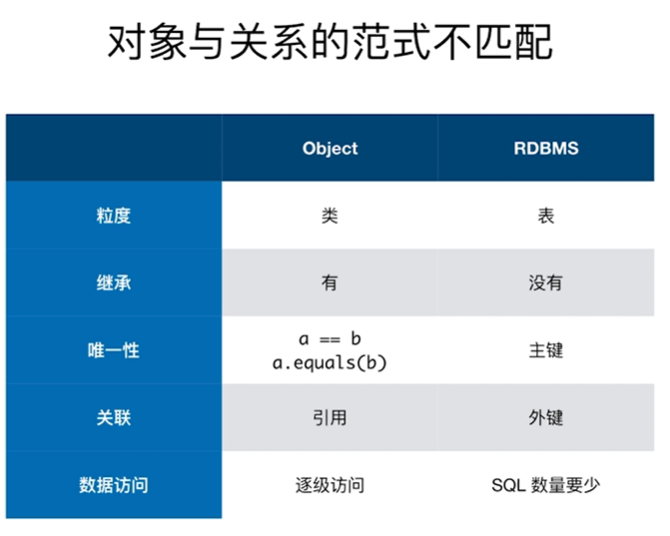
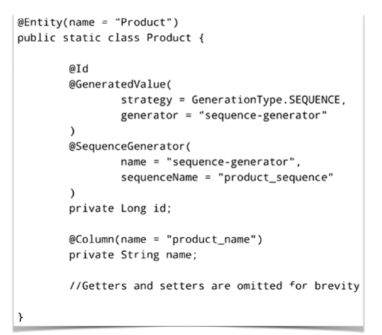
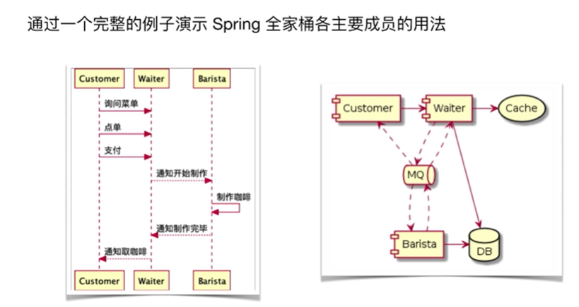
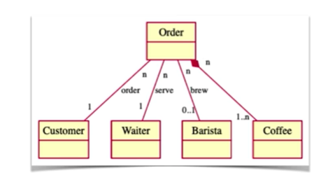
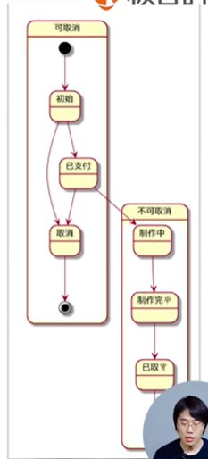
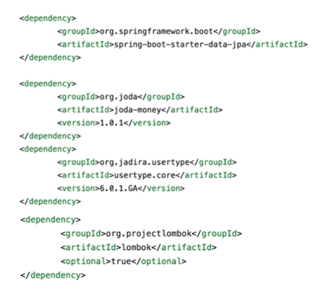

# O/R Mapping实践

## 认识Spring Data JPA

### Hibernate

- 一款开源的对象关系映射（ORM）框架
- 将开发者从95%的常见数据持久化工作中解放出来
- 屏蔽了底层数据库的各种细节

06年Hibernate成为了JPA的实现

### JPA（Java Persisitence API）

JPA为对象关系映射提供了一种基于POJO的持久化模型

- 简化数据持久化代码的开发工作
- 为Java社区屏蔽不同持久化API的差异

### Spring Data

在保留底层存储特性的同时，提供相对一致的、基于Spring的编程模型

主要模块

- Spring Data Commons
- Spring Data JDBC
- Spring Data JPA
- Spring Data Redis
- 。。。

## 定义JPA的实体对象

### 常用JPA注解

实体

- @Entity、@MappedSuperclass
- @Table(name)

主键

- @Id
  - @GeneratedValue(strategy,generator)
  - @SequenceGenerator(name,sequenceName)

例子

映射

- @Column(name,nullable,length,insertable,updatable)
- @JoinTable(name)、@JoinColumn(name)

关系

- @OneToOne、@OneToMany、@ManyToOne、@ManyToMany
- @OrderBy

# 线上咖啡馆实战项目

## 实体

- 咖啡、订单、顾客、服务员、咖啡师

依赖

