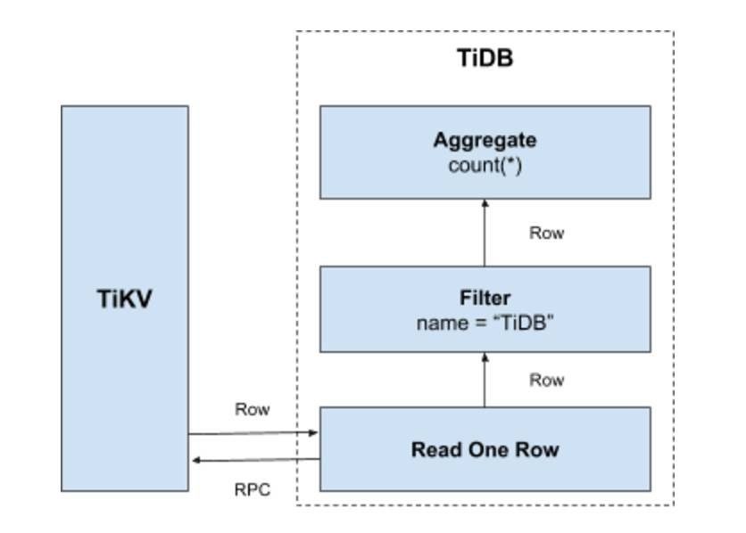
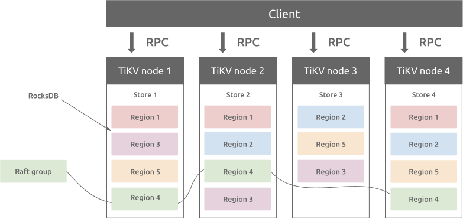

# 概述

> [TiDB](https://github.com/pingcap/tidb) 是 [PingCAP](https://pingcap.com/about-cn/) 公司自主设计、研发的开源分布式关系型数据库，是一款同时支持在线事务处理与在线分析处理 (Hybrid Transactional and Analytical Processing, HTAP) 的融合型分布式数据库产品
>
> [PingCAP 文档中心 | PingCAP 文档中心](https://docs.pingcap.com/zh/)

## 核心特征

- 一键水平扩容或者缩容

  得益于 TiDB **存储计算分离的架构**的设计，可按需对计算、存储分别进行在线扩容或者缩容，扩容或者缩容过程中对应用运维人员透明。

- 金融级高可用

  数据采用**多副本存储**，数据副本通过 Multi-Raft 协议同步事务日志，多数派写入成功事务才能提交，**确保数据强一致性**且少数副本发生故障时不影响数据的可用性。可按需配置副本地理位置、副本数量等策略满足不同容灾级别的要求。

- 实时 HTAP

  提供**行存储引擎 [TiKV](https://docs.pingcap.com/zh/tidb/stable/tikv-overview)**、**列存储引擎 [TiFlash](https://docs.pingcap.com/zh/tidb/stable/tiflash-overview)** 两款存储引擎，TiFlash 通过 Multi-Raft Learner 协议实时从 TiKV 复制数据，确保行存储引擎 TiKV 和列存储引擎 TiFlash 之间的数据强一致。TiKV、TiFlash 可按需部署在不同的机器，解决 HTAP 资源隔离的问题。

- 云原生的分布式数据库

  **专为云而设计**的分布式数据库，通过 [TiDB Operator](https://docs.pingcap.com/zh/tidb-in-kubernetes/stable/tidb-operator-overview) 可在公有云、私有云、混合云中实现部署工具化、自动化。

- 兼容 MySQL 5.7 协议和 MySQL 生态

  **兼容 MySQL 5.7 协议、MySQL 常用的功能、MySQL 生态**，应用无需或者修改少量代码即可从 MySQL 迁移到 TiDB。提供丰富的[数据迁移工具](https://docs.pingcap.com/zh/tidb/stable/ecosystem-tool-user-guide)帮助应用便捷完成数据迁移。


# HTAP（额外）

在 HTAP 概念之前，业务类型大致可以分成两大类：联机事务处理 OLTP、联机分析处理 OLAP。

- OLTP （On-Line Transaction Processing，联机事务处理）是传统的关系型数据库的主要应用，主要是基本的、日常的事务处理，例如银行交易。
- OLAP （On-Line Analytical Processing，联机分析处理）是数据仓库系统的主要应用，支持复杂的分析操作，侧重决策支持，并且提供直观的查询结果，例如业务销售报表。


## 传统OLTP 与 OLAP 分离架构

在同一组织中，通常 OLTP 和 OLAP 系统并存，且 OLAP 数据来源于 OLTP 系统，系统架构大致可分为 ETL 数据同步和数据库 LOG 同步两种，以下的两种架构都各有优缺点。

> ETL：Extract Transform Load三个单词。抽取、转换、加载，常用于数据仓库中。


- 架构一：来自**一个或多个 OLTP 数据库**的数据通过 GoldenGate、DSG 等 **ETL** 工具提取、转换、加载到 **OLAP 系统**中，随着大数据的到来 ， 后期又出现了 Debezium 、Kafka、Flink 等流式计算引擎。使用 ETL 工具，用户可以从多个来源收集数据并将其发送到目的地。
  - 它的缺点就是**组件太多**，各项成本非常高。
- 架构二：这种架构是指通过**数据库自带的日志同步功能**，实时将数据**同步到备库**，**备库只读对外提供 OLAP 的服务**。相比架构一在产品的维护性，实时性以及数据的一致性上有了质的提高。
  - 但是架构二在使用场景上相比架构一有所限制，**只能对单一同源数据库进行同步**。


## 分析型需求崛起，推送技术架构演进

当前的解决方案**无法满足实时分析的需求**。随着数据量的积累，分析型需求不断涌现，这也推动了数据库技术的变革，从 OLTP 到 OLAP，进而演进到 HTAP 理念，**混合事务分析处理数据库蓬勃发展**。


1. 1990年代以前，日常处理相关的动态业务以 OLTP 需求为主，OLAP 并未独立；
2. 1990s ，随着数据量不断增多、场景逐渐丰富，分析型需求开始普及，MPP 架构的 OLAP 产品开始出现；

> MPP，全称为Massively Parallel Processor，翻译过来就是大规模并行处理。MPP系统是由许多松耦合的处理单元组成的（要注意的是这里指的是处理单元而不是处理器）。每个处理单元内的CPU都有自己私有的资源，如总线，内存，硬盘等，且都有操作系统和管理数据库的实例复本。这种结构最大的特点在于不共享资源(share-nothing)。

3. 2010s，物联网等技术的发展，使得企业对实时数据分析的需求提升，且 OLAP、大数据技术栈不断分化也给企业实际运维管理多套系统带来挑战，HTAP 混合事务分析处理数据库的概念也应运而生。


**2005 年，Gartner 正式提出了 HTAP 这一概念**，并且迅速引起了一些企业的关注，这一概念被视为是未来数据发展的重要趋势之一。**2014 年，Gartner 又对 HTAP 数据库给出了明确的定义**：**即需要同时支持 OLTP 和 OLAP 场景**，基于创新的计算存储框架，在同一份数据上保证事务的同时支持实时分析，省去费时的 ETL 过程。


## HTAP数据库核心技术

根据 2022 年 SIGMOD 收录的论文《HTAP Databases: What is New and What is Next》 ，目前 HTAP 的相关技术包括：**事务处理 (TP) 技术、分析处理（AP）技术、数据同步 (DS) 技术、查询优化技术、资源调度技术**。

### 事务处理 (TP) 技术

HTAP 数据库中的 OLTP 工作负载是通过**行存储处理**的，但不同的架构会导致不同的 TP 技术。它主要由两种类型组成：

- **MVCC+logging**。依赖**MVCC协议**和**日志记录**技术来处理事务。具体来说，每个插入首先写入日志和行存储，然后附加到内存中的增量存储。更新创建具有新生命周期的行的新版本，即开始时间戳和结束时间戳，即旧版本在删除位图中被标记为删除行。
- **2PC+Raft+logging**。它依赖于分布式事务，它通过**分布式事务**处理提供了高可扩展性。ACID 事务在分布式节点上使用两阶段提交 (2PC) 协议、**基于 Raft 的共识算法**和预写**日志 (WAL)** 技术进行处理。

> **WAL**(Write Ahead Log)预写日志，它的关键点就是先写日志，再写磁盘，是数据库系统中常见的一种手段，用于保证数据操作的原子性和持久性。


> 基于多版本的并发控制协议——MVCC (Multi-Version Concurrency Control) 。通过版本号来保证读取的数据永远不变且读是并发的。在读多写少的OLTP应用中，读写不冲突是非常重要的，极大的增加了系统的并发性能。
>
> 在MVCC并发控制中，读操作可以分成两类：
>
> 1、快照读 (snapshot read)：读取的是记录的可见版本 (有可能是历史版本)，不用加锁（共享读锁s锁也不加，所以不会阻塞其他事务的写）。
>
> 2、当前读 (current read)：读取的是记录的最新版本，并且，当前读返回的记录，都会加上锁，保证其他事务不会再并发修改这条记录。
>
> 通过版本号减少了锁的争用，**提高了系统性能**；可以实现**提交读**和**可重复读**两种隔离级别，未提交读无需使用MVCC。


> **Raft** 算法是一类基于日志复制的分布式共识算法，旨在提供与  Multi-Paxos 共识算法相同的容错性和性能的前提下，追求更好的可理解性和工程可实现性。
>
> 在这个分布式 KV 系统中我们主要面临两个问题：
>
> - 如何正确选举出一个 Leader 节点？
>
> - 如何实现日志数据从 Leader 向其它节点有序且一致的复制？
>
>   这也是 Raft 算法要解决的两个基本问题。


### 分析处理（AP）技术

对于 HTAP 数据库，OLAP 负载使用**面向列**的技术执行，例如压缩数据上的聚合和单指令多数据 (SIMD) 指令 ，主要分为三种类型：

- **内存中增量和列扫描：** 将**内存中的增量和列数据一起扫描**，因为增量存储可能包括尚未合并到列存储的更新记录。由于它已经扫描了最近可见的 delta tuples 在内存，因此 OLAP 的数据新鲜度很高。
- **基于日志的增量和列扫描：** 将基于**日志的增量数据和列数据一起扫描**以获取传入查询。与第一种类似，第二种使用列存储扫描最新的增量用于 OLAP。但是，由于读取可能尚未合并的 delta 文件，这样的过程更加昂贵。因此，数据新鲜度较低，因为发送和合并 delta 文件的高延迟。
- **列扫描：** **只扫描列数据**以获得高效率，因为没有读取任何增量数据的开销。但是当数据在行存储中经常更新时，这种技术会导致新鲜度低。

数据新鲜度逐渐降低。

### 数据同步（DS）技术

由于在查询时读取增量数据的成本很高 ，因此需要**定期将增量数据合并到主列存储** 中。各种 HTAP 数据库有 3 种 DS 技术。

- 内存中增量合并
- 基于磁盘的增量合并
- 从主行存储重建


### 查询优化技术

查询优化技术的三个方面，包括：

- **HTAP 的列选择**。靠历史工作负载和统计数据来选择**从主存储中提取的频繁访问的列到内存中**。因此，可以将查询下推到内存中的列存储以进行加速。缺点是可能没有选择新查询的列，导致基于行的查询处理。
- **混合行 / 列扫描**。可以**分解复杂**的查询以在行存储或列存储上执行，然后**组合结果**。这对于可以使用基于行的索引扫描和完整的基于列的扫描执行的 SPJ 查询来说是典型的。
- **HTAP 的 CPU/GPU 加速**。分别利用 CPU 的任务并行性和 GPU 的数据并行性来处理 OLTP 和 OLAP。然而，这些技术有利于高 OLAP 吞吐量，同时具有低 OLTP 吞吐量。


### 资源调度技术

对于 HTAP 数据库，资源调度是指为 OLTP 和 OLAP 工作负载分配资源。当前的技术可以动态控制 OLTP 和 OLAP 工作负载的执行模式，以更好地利用资源。调度技术有两种类型：**工作负载驱动的方法**和**新鲜度驱动的方法**。


- **工作负载驱动的方法**:根据两者运行时的性能负载 来 调整 OLTP 和 OLAP 任务各自的并行度。
- **新鲜度驱动的方法**:定期切换 OLTP 和 OLAP 的独占资源执行模式和数据交换时的资源共享执行模式。


[聊聊 HTAP 的前世今生_MoMoSQL666的博客-CSDN博客](https://blog.csdn.net/Era666/article/details/129182893)


# 架构设计

## 概述

与传统的单机数据库相比，TiDB 具有以下优势：

- 纯分布式架构，拥有良好的扩展性，支持弹性的扩缩容
- 支持 SQL，对外暴露 MySQL 的网络协议，并兼容大多数 MySQL 的语法，在大多数场景下可以直接替换 MySQL
- 默认支持高可用，在少数副本失效的情况下，数据库本身能够自动进行数据修复和故障转移，对业务透明
- 支持 ACID 事务，对于一些有强一致需求的场景友好，例如：银行转账
- 具有丰富的工具链生态，覆盖数据迁移、同步、备份等多种场景


内核设计上主要分为了三个模块。


### TiDB Server

[TiDB Server](https://docs.pingcap.com/zh/tidb/stable/tidb-computing)：SQL 层，对外暴露 MySQL 协议的连接 endpoint，负责接受客户端的连接，执行 SQL 解析和优化，最终生成分布式执行计划。TiDB 层本身是无状态的，实践中可以启动多个 TiDB 实例，通过负载均衡组件（如 LVS、HAProxy 或 F5）对外提供统一的接入地址，客户端的连接可以均匀地分摊在多个 TiDB 实例上以达到负载均衡的效果。TiDB Server 本身并不存储数据，只是解析 SQL，将实际的数据读取请求转发给底层的存储节点 TiKV（或 TiFlash）。


- 处理客户端的连接
- sql语句的解析和编译
- 关系型数据与KV的转化
- sql语句的执行
- 在线DDL的执行
  - DDL不阻碍读写，online DDL模块来完成
- 垃圾回收


### PD Server

[PD (Placement Driver) Server](https://docs.pingcap.com/zh/tidb/stable/tidb-scheduling)：**整个 TiDB 集群的元信息管理模块，负责存储每个 TiKV 节点实时的数据分布情况和集群的整体拓扑结构，提供 TiDB Dashboard 管控界面，并为分布式事务分配事务 ID**。PD 不仅存储元信息，同时还会根据 TiKV 节点实时上报的数据分布状态，下发数据调度命令给具体的 TiKV 节点，可以说是整个集群的“大脑”。此外，PD 本身也是由至少 3 个节点构成，拥有高可用的能力。建议部署奇数个 PD 节点。


- 整个集群TIKV的元数据存储
  - 例如保存了表对应的TIKV和Region
- 分配全局id和事务id
- 生成全局时间戳TSO
- 收集集群信息进行调度
  - 根据心跳信息协调TIKV
- 提供TIDB Dashboard服务


### 存储节点

[TiKV Server](https://docs.pingcap.com/zh/tidb/stable/tidb-storage)：**负责存储数据，从外部看 TiKV 是一个分布式的提供事务的 Key-Value 存储引擎。**存储数据的**基本单位是 Region**，每个 Region 负责存储一个 Key Range（从 StartKey 到 EndKey 的左闭右开区间）的数据，**每个 TiKV 节点会负责多个 Region。**TiKV 的 API 在 KV 键值对层面提供对分布式事务的原生支持，默认提供了 SI (Snapshot Isolation) 的隔离级别，这也是 TiDB 在 SQL 层面支持分布式事务的核心。TiDB 的 SQL 层做完 SQL 解析后，会将 SQL 的执行计划转换为对 TiKV API 的实际调用。所以，数据都存储在 TiKV 中。另外，TiKV 中的数据都会自动维护多副本（默认为三副本），天然支持高可用和自动故障转移。


- 数据持久化
- 分布式事务支持
- 副本的强一致性和高可用性（multi raft方案）
- MVCC
- Coprocessor（算子下推）
  - 更多地利用tikv的计算能力，也减少了TIKV与tidb server的数据交互量（更多地数据在TIKV被筛选掉）


[TiFlash](https://docs.pingcap.com/zh/tidb/stable/tiflash-overview)：TiFlash 是一类**特殊的存储节点**。和普通 TiKV 节点不一样的是，在 TiFlash 内部，数据是**以列式的形式进行存储**，主要的功能是为分析型（OLAP）的场景加速。


- 列式存储，提高分析查询效率
  - 分担OLAP场景的负载
- 支持强一致性和实时性
- 业务隔离
  - OLTP与OLAP相互隔离不干扰
- 智能选择
  - TIDB Server中的优化器会判断sql属于什么业务场景


## 存储


### Key-Value Pairs（键值对）

TiKV 的选择是 Key-Value 模型来保存数据，并且提供有序遍历方法。

**TiKV 的 KV 存储模型和 SQL 中的 Table 无关**。专注于讨论如何实现 TiKV 这样一个高性能、高可靠性、分布式的 Key-Value 存储。

TiKV 数据存储的两个关键点：

- 这是一个巨大的 Map，存储的是 Key-Value Pairs（键值对）
- 这个 Map 中的 Key-Value pair 按照 **Key 的二进制顺序有序**，也就是可以 Seek 到某一个 Key 的位置，然后不断地调用 Next 方法以递增的顺序获取比这个 Key 大的 Key-Value。


### 本地存储（RocksDB）

持久化就要存磁盘，TiKV也不例外，但是TiKV本身不写磁盘，而是保存在RocksDB中，具体的数据落地由 RocksDB 负责。

这个选择的原因是开发一个单机存储引擎工作量很大，特别是要做一个高性能的单机引擎，需要做各种细致的优化，而 **RocksDB 是由 Facebook 开源的一个非常优秀的单机 KV 存储引擎，可以满足 TiKV 对单机引擎的各种要求**。这里可以简单的认为 RocksDB 是一个单机的持久化 Key-Value Map。


### Raft协议

如何保证单机失效的情况下，数据不丢失？

需要想办法把数据复制到多台机器上，TiKV 选择了 Raft 算法。Raft 是一个一致性协议。Raft 提供几个重要的功能：

- Leader（主副本）选举
- 成员变更（如添加副本、删除副本、转移 Leader 等操作）
- 日志复制


总结一下，通过单机的 RocksDB，TiKV 可以将数据快速地存储在磁盘上；通过 Raft，将数据复制到多台机器上，以防单机失效。数据的写入是通过 Raft 这一层的接口写入，而不是直接写 RocksDB。通过实现 Raft，TiKV 变成了一个分布式的 Key-Value 存储，少数几台机器宕机也能通过原生的 Raft 协议自动把副本补全，可以做到对业务无感知。


### Region

首先，为了便于理解，在此节，假设所有的数据都只有一个副本。前面提到，TiKV 可以看做是一个巨大的有序的 KV Map，那么为了**实现存储的水平扩展，数据将被分散在多台机器上**。对于一个 KV 系统，将数据分散在多台机器上有两种比较典型的方案：

- Hash：按照 Key 做 Hash，根据 Hash 值选择对应的存储节点。
- **Range**：按照 Key 分 Range，某一段连续的 Key 都保存在一个存储节点上。

TiKV 选择了**第二种方式**，将整个 Key-Value 空间分成很多段，**每一段是一系列连续的 Key，将每一段叫做一个 Region**，可以用 [StartKey，EndKey) 这样一个左闭右开区间来描述。每个 Region 中保存的数据量默认维持在 96 MiB 左右（可以通过配置修改）。


**这里的讨论依然不涉及 SQL，只和 KV 有关。**

将数据划分成 Region 后，TiKV 将会做两件重要的事情：

- 以 Region 为单位，将数据**分散在集群中所有的节点上**，并且尽量保证每个节点上服务的 Region 数量差不多。
- **以 Region 为单位**做 Raft 的复制和成员管理。

这两点非常重要：

- 先看第一点，数据按照 Key 切分成很多 Region，每个 Region 的数据只会保存在一个节点上面（暂不考虑多副本）。TiDB 系统会有一个**组件 (PD) 来负责将 Region 尽可能均匀的散布在集群中所有的节点上**，这样一方面实现了存储容量的**水平扩展**（增加新的节点后，会自动将其他节点上的 Region 调度过来），另一方面也实现了**负载均衡**（不会出现某个节点有很多数据，其他节点上没什么数据的情况）。同时为了保证上层客户端能够访问所需要的数据，系统中也会有一个**组件 (PD) 记录 Region 在节点上面的分布情况**，也就是通过任意一个 Key 就能查询到这个 Key 在哪个 Region 中，以及这个 Region 目前在哪个节点上（即 Key 的位置路由信息）。至于负责这两项重要工作的组件 (PD)，会在后续介绍。
- 对于第二点，TiKV 是以 Region 为单位做数据的复制，也就是**一个 Region 的数据会保存多个副本**，TiKV 将每一个副本叫做一个 Replica。Replica 之间是通过 Raft 来保持数据的一致，**一个 Region 的多个 Replica 会保存在不同的节点上**，构成一个 Raft Group。其中一个 Replica 会作为这个 Group 的 Leader，其他的 Replica 作为 Follower。默认情况下，所有的读和写都是通过 Leader 进行，读操作在 Leader 上即可完成，而写操作再由 Leader 复制给 Follower。


**以 Region 为单位做数据的分散和复制**，TiKV 就成为了一个分布式的具备一定容灾能力的 KeyValue 系统，不用再担心数据存不下，或者是磁盘故障丢失数据的问题。


### MVCC

很多数据库都会实现多版本并发控制 (MVCC)，TiKV 也不例外。设想这样的场景：两个客户端同时去修改一个 Key 的 Value，如果没有数据的多版本控制，就需要对数据上锁，在分布式场景下，可能会带来性能以及死锁问题。TiKV 的 MVCC 实现是通过**在 Key 后面添加版本号**来实现，简单来说，没有 MVCC 之前，可以把 TiKV 看做这样的：

```
Key1 -> Value
Key2 -> Value
……
KeyN -> Value
```

有了 MVCC 之后，TiKV 的 Key 排列是这样的：

```
Key1_Version3 -> Value
Key1_Version2 -> Value
Key1_Version1 -> Value
……
Key2_Version4 -> Value
Key2_Version3 -> Value
Key2_Version2 -> Value
Key2_Version1 -> Value
……
KeyN_Version2 -> Value
KeyN_Version1 -> Value
……
```

注意，对于**同一个 Key 的多个版本，版本号较大的会被放在前面**，版本号小的会被放在后面（见 [Key-Value](https://docs.pingcap.com/zh/tidb/stable/tidb-storage#key-value-pairs键值对) 一节，Key 是有序的排列），这样当用户通过一个 Key + Version 来获取 Value 的时候，可以**通过 Key 和 Version 构造出 MVCC 的 Key，也就是 Key_Version**。然后可以直接**通过 RocksDB 的 SeekPrefix(Key_Version) API，定位到第一个大于等于这个 Key_Version 的位置。**


### 分布式 ACID 事务

TiKV 的事务采用的是 Google 在 BigTable 中使用的事务模型：[Percolator](https://research.google.com/pubs/pub36726.html)，TiKV 根据这篇论文实现，并做了大量的优化。详细介绍参见[事务概览](https://docs.pingcap.com/zh/tidb/stable/transaction-overview)。


## 计算

TiDB 在 TiKV 提供的分布式存储能力基础上，构建了兼具优异的交易处理能力与良好的数据分析能力的计算引擎。本文首先从**数据映射算法**入手介绍 TiDB 如何将库表中的数据映射到 TiKV 中的 (Key, Value) 键值对，然后描述 **TiDB 元信息管理方式**，最后介绍 TiDB **SQL 层的主要架构**。

对于计算层依赖的存储方案，本文只介绍基于 TiKV 的行存储结构。针对分析型业务的特点，TiDB 推出了作为 TiKV 扩展的列存储方案 [TiFlash](https://docs.pingcap.com/zh/tidb/stable/tiflash-overview)。


### 数据映射

#### 表数据与键值对的映射

本小节介绍 TiDB 中数据到 (Key, Value) 键值对的映射方案。这里的数据主要包括以下两个方面：

- 表中每一行的数据，以下简称**表数据**
- 表中所有索引的数据，以下简称**索引数据**

在关系型数据库中，一个表可能有很多列。要将一行中各列数据映射成一个 (Key, Value) 键值对，需要考虑如何构造 Key。

- **OLTP 场景下有大量针对单行或者多行的增、删、改、查**等操作，**要求数据库具备快速读取一行数据的能力**。因此，对应的 Key 最好**有一个唯一 ID**（显示或隐式的 ID），以方便快速定位。
- 很多 **OLAP 型查询需要进行全表扫描**。如果能够将一个表中**所有行的 Key 编码到一个区间内**，就可以通过范围查询高效完成全表扫描的任务。

基于上述考虑，TiDB 中的表数据与 Key-Value 的映射关系作了如下设计：

- 为了**保证同一个表的数据放在一起**，方便查找，TiDB 会为**每个表分配一个表 ID**，用 **`TableID`** 表示。**表 ID 是一个整数，在整个集群内唯一**。
- TiDB 会为**表中每行数据分配一个行 ID，用 `RowID` 表示**。行 ID 也**是一个整数，在表内唯一**。对于行 ID，TiDB 做了一个小优化，如果某个表有**整数型的主键**，TiDB 会使用**主键的值当做这一行数据的行 ID。**

**每行数据**按照如下规则编码成 (Key, Value) 键值对：

- key中包含表id和行id。行id是一个整数，如果表有整数型主键，这个行id就用这个主键。
- value为这一行的每一列的数据（不包含作为行id的主键）。

```avrasm
Key:   tablePrefix{TableID}_recordPrefixSep{RowID}
Value: [col1, col2, col3, col4]
```

其中 `tablePrefix` 和 `recordPrefixSep` 都是特定的字符串常量，用于在 Key 空间内区分其他数据。其具体值在后面的小结中给出。

#### 索引数据与键值对的映射

TiDB 同时**支持主键和二级索引**（包括唯一索引和非唯一索引）。与表数据映射方案类似，TiDB 为表中每个索引分配了一个索引 ID，用 `IndexID` 表示。

对于**主键和唯一索引**，需要根据键值快速**定位到对应的 RowID**，因此，按照如下规则编码成 (Key, Value) 键值对：

- key中包含表id和索引id
- value为行id

```
Key:   tablePrefix{TableID}_indexPrefixSep{IndexID}_indexedColumnsValue
Value: RowID
```

对于不需要满足唯一性约束的普通二级索引，一个键值可能对应多行，需要根据键值范围查询对应的 RowID。因此，按照如下规则编码成 (Key, Value) 键值对：

- key中包含表id、索引id、行id
- value为这个索引的值

```
Key:   tablePrefix{TableID}_indexPrefixSep{IndexID}_indexedColumnsValue_{RowID}
Value: null
```


#### 映射关系小结

上述所有编码规则中的 `tablePrefix`、`recordPrefixSep` 和 `indexPrefixSep` 都是字符串常量，用于在 Key 空间内区分其他数据，定义如下：

```
tablePrefix     = []byte{'t'}
recordPrefixSep = []byte{'r'}
indexPrefixSep  = []byte{'i'}
```

另外请注意，上述方案中，无论是表数据还是索引数据的 Key 编码方案，一个表内所有的行都有相同的 Key 前缀，一个索引的所有数据也都有相同的前缀。这样具有**相同的前缀**的数据，在 TiKV 的 Key 空间内，是**排列在一起**的。因此只要小心地设计后缀部分的编码方案，保证编码前和编码后的比较关系不变，就可以将表数据或者索引数据有序地保存在 TiKV 中。采用这种编码后，**一个表的所有行数据会按照 `RowID` 顺序地排列**在 TiKV 的 Key 空间中，某**一个索引的数据也会按照索引数据的具体的值（编码方案中的 `indexedColumnsValue`）顺序地排列**在 Key 空间内。


#### 键值对映射关系示例

最后通过一个简单的例子，来理解 TiDB 的 Key-Value 映射关系。假设 TiDB 中有如下这个表：

```sql
CREATE TABLE User (
    ID int,
    Name varchar(20),
    Role varchar(20),
    Age int,
    PRIMARY KEY (ID),
    KEY idxAge (Age)
);
```

假设该表中有 3 行数据：

```apache
1, "TiDB", "SQL Layer", 10
2, "TiKV", "KV Engine", 20
3, "PD", "Manager", 30
```

首先每行数据都会映射为一个 (Key, Value) 键值对，同时该表有一个 `int` 类型的主键，所以 `RowID` 的值即为该主键的值。假设该表的 `TableID` 为 10，则其存储在 TiKV 上的表数据为：

```xl
t10_r1 --> ["TiDB", "SQL Layer", 10]
t10_r2 --> ["TiKV", "KV Engine", 20]
t10_r3 --> ["PD", "Manager", 30]
```

除了主键外，该表还有一个非唯一的普通二级索引 `idxAge`，假设这个索引的 `IndexID` 为 1，则其存储在 TiKV 上的索引数据为：

```livescript
t10_i1_10_1 --> null
t10_i1_20_2 --> null
t10_i1_30_3 --> null
```

以上例子展示了 TiDB 中关系模型到 Key-Value 模型的映射规则，以及选择该方案背后的考量。


### 元信息管理

TiDB 中每个 `Database` 和 `Table` 都有元信息，也就是**其定义以及各项属性**。这些信息也需要持久化，TiDB 将这些信息也**存储在了 TiKV** 中。

每个 `Database`/`Table` 都被分配了一个唯一的 ID，这个 ID 作为唯一标识，并且在编码为 Key-Value 时，这个 ID 都会编码到 Key 中，再加上 `m_` 前缀。这样可以构造出一个 Key，Value 中存储的是序列化后的元信息。

除此之外，TiDB 还用一个专门的 (Key, Value) 键值对存储当前所有**表结构信息的最新版本号**。这个键值对是全局的，**每次 DDL 操作的状态改变时其版本号都会加 1**。目前，TiDB 把这个键值对**持久化存储在 PD Server 中**，其 Key 是 "/tidb/ddl/global_schema_version"，Value 是类型为 int64 的版本号值。TiDB 采用 **Online Schema 变更算法**，有一个后台线程在不断地检查 PD Server 中存储的表结构信息的版本号是否发生变化，并且保证在一定时间内一定能够获取版本的变化。

## 

#### SQL层简介

TiDB 的 SQL 层，即 **TiDB Server**，负责**将 SQL 翻译成 Key-Value** 操作，将其**转发**给共用的分布式 Key-Value 存储层 TiKV，然后**组装 TiKV 返回的结果**，最终将查询结果**返回**给客户端。

这一层的**节点都是无状态**的，节点本身并不存储数据，节点之间完全对等。


#### SQL运算

最简单的方案就是通过上一节所述的[表数据与 Key-Value 的映射关系](https://docs.pingcap.com/zh/tidb/stable/tidb-computing#表数据与-key-value-的映射关系)方案，将 SQL 查询映射为对 KV 的查询，再通过 KV 接口获取对应的数据，最后执行各种计算。

比如 `select count(*) from user where name = "TiDB"` 这样一个 SQL 语句，它需要读取表中所有的数据，然后检查 `name` 字段是否是 `TiDB`，如果是的话，则返回这一行。具体流程如下：

1. **构造出 Key Range**：一个表中**所有的 `RowID` 都在 `[0, MaxInt64)`** 这个范围内，使用 `0` 和 `MaxInt64` 根据行数据的 `Key` 编码规则，就能构造出一个 `[StartKey, EndKey)`的左闭右开区间。
2. **扫描 Key Range**：根据上面构造出的 Key Range，读取 TiKV 中的数据。
3. **过滤数据**：对于读到的每一行数据，计算 `name = "TiDB"` 这个表达式，如果为真，则向上返回这一行，否则丢弃这一行数据。
4. **计算** `Count(*)`：对符合要求的每一行，累计到 `Count(*)` 的结果上面。



这个方案是直观且可行的，但是在分布式数据库的场景下有一些显而易见的问题：

- 在扫描数据的时候，**每一行都要通过 KV 操作从 TiKV 中读取出来**，至少有一次 RPC 开销，如果需要扫描的数据很多，那么这个开销会非常大。
- 并**不是所有的行都满足过滤条件** `name = "TiDB"`，如果不满足条件，其实可以不读取出来。
- **此查询只要求返回符合要求行的数量**，不要求返回这些行的值。


#### 分布式SQL运算

为了解决上述问题，**计算应该需要尽量靠近存储节点**，以避免大量的 RPC 调用。首先，SQL 中的谓词条件 `name = "TiDB"` 应被下推到存储节点进行计算，这样只需要返回有效的行，避免无意义的网络传输。然后，聚合函数 `Count(*)` 也可以被下推到存储节点，进行预聚合，每个节点只需要返回一个 `Count(*)` 的结果即可，再由 SQL 层将各个节点返回的 `Count(*)` 的结果累加求和。

以下是数据逐层返回的示意图：


#### SQL层框架

通过上面的例子，希望大家对 SQL 语句的处理有一个基本的了解。实际上 TiDB 的 SQL 层要复杂得多，模块以及层次非常多，下图列出了重要的模块以及调用关系：


用户的 SQL 请求会直接或者通过 `Load Balancer` 发送到 TiDB Server，TiDB Server 会解析 `MySQL Protocol Packet`，获取请求内容，对 SQL 进行语法解析和语义分析，制定和优化查询计划，执行查询计划并获取和处理数据。数据全部存储在 TiKV 集群中，所以在这个过程中 TiDB Server 需要和 TiKV 交互，获取数据。最后 TiDB Server 需要将查询结果返回给用户。


## 调度

[PD](https://github.com/tikv/pd) (Placement Driver) 是 TiDB 集群的**管理模块**，同时也负责集群数据的**实时调度**。本文档介绍一下 PD 的设计思想和关键概念。

### 场景描述

TiKV 集群是 TiDB 数据库的分布式 KV 存储引擎，数据以 Region 为单位进行复制和管理，每个 Region 会有多个副本 (Replica)，这些副本会分布在不同的 TiKV 节点上，其中 **Leader 负责读/写，Follower 负责同步** Leader 发来的 Raft log。

需要考虑以下场景：

- 为了提高集群的空间利用率，需要根据 Region 的空间占用对副本进行**合理的分布**。
- 集群进行跨机房部署的时候，要保证**一个机房掉线，不会丢失 Raft Group 的多个副本**。
- 添加一个节点进入 TiKV 集群之后，需要合理地将集群中其他节点上的**数据搬到新增节点**。
- 当一个节点掉线时，需要考虑**快速稳定地进行容灾**。
  - 从节点的恢复时间来看
    - 如果节点只是短暂掉线（重启服务），是否需要进行调度。
    - 如果节点是长时间掉线（磁盘故障，数据全部丢失），如何进行调度。
  - 假设集群需要每个 Raft Group 有 N 个副本，从单个 Raft Group 的副本个数来看
    - 副本数量不够（例如节点掉线，失去副本），需要选择适当的机器的进行补充。
    - 副本数量过多（例如掉线的节点又恢复正常，自动加入集群），需要合理的删除多余的副本。
- 读/写通过 Leader 进行，Leader 的分布只集中在少量几个节点会对集群造成影响。
- 并不是所有的 Region 都被频繁的访问，可能访问热点只在少数几个 Region，需要通过调度进行**负载均衡**。
- 集群在做负载均衡的时候，往往需要搬迁数据，这种**数据的迁移**可能会占用大量的网络带宽、磁盘 IO 以及 CPU，进而**影响在线服务**。

以上问题和场景如果多个同时出现，就不太容易解决，因为需要考虑全局信息。同时整个系统也是在动态变化的，因此需要一个中心节点，来对系统的整体状况进行把控和调整，所以有了 PD 这个模块。


### 调度需求

对以上的问题和场景进行分类和整理，可归为以下两类：

**第一类：作为一个分布式高可用存储系统，必须满足的需求，包括几种**

- 副本数量不能多也不能少
- 副本需要根据拓扑结构分布在不同属性的机器上
- 节点宕机或异常能够自动合理快速地进行容灾

**第二类：作为一个良好的分布式系统，需要考虑的地方包括**

- 维持整个集群的 Leader 分布均匀
- 维持每个节点的储存容量均匀
- 维持访问热点分布均匀
- 控制负载均衡的速度，避免影响在线服务
- 管理节点状态，包括手动上线/下线节点

满足第一类需求后，整个系统将具备强大的容灾功能。满足第二类需求后，可以使得系统整体的资源利用率更高且合理，具备良好的扩展性。

为了满足这些需求，**首先需要收集足够的信息**，比如每个节点的状态、每个 Raft Group 的信息、业务访问操作的统计等；**其次需要设置一些策略**，PD 根据这些信息以及调度的策略，制定出尽量满足前面所述需求的调度计划；**最后需要一些基本的操作**，来完成调度计划。


### 调度的基本操作

调度的基本操作指的是为了满足调度的策略。上述调度需求可整理为以下三个操作：

- **增加**一个副本
- **删除**一个副本
- 将 **Leader 角色**在一个 Raft Group 的不同副本之间 transfer（**迁移**）

刚好 Raft 协议通过 `AddReplica`、`RemoveReplica`、`TransferLeader` 这三个命令，可以支撑上述三种基本操作。


### 信息收集

调度依赖于整个集群信息的收集，简单来说，调度需要知道每个 TiKV 节点的状态以及每个 Region 的状态。**TiKV 集群会向 PD 汇报两类消息**，**TiKV 节点信息和 Region 信息**：

**每个 TiKV 节点会定期向 PD 汇报节点的状态信息**

**TiKV 节点 (Store) 与 PD** 之间存在心跳包，一方面 PD 通过心跳包检测每个 Store 是否存活，以及是否有新加入的 Store；另一方面，心跳包中也会携带这个 [Store 的状态信息](https://github.com/pingcap/kvproto/blob/master/proto/pdpb.proto#L473)，主要包括：

- 总磁盘容量
- 可用磁盘容量
- 承载的 Region 数量
- 数据写入/读取速度
- 发送/接受的 Snapshot 数量（副本之间可能会通过 Snapshot 同步数据）
- 是否过载
- labels 标签信息（标签是具备层级关系的一系列 Tag，能够[感知拓扑信息](https://docs.pingcap.com/zh/tidb/stable/schedule-replicas-by-topology-labels)）

通过使用 `pd-ctl` 可以查看到 TiKV Store 的状态信息。TiKV Store 的状态具体分为 Up，Disconnect，Offline，Down，Tombstone。各状态的关系如下：

- **Up**：表示当前的 TiKV Store 处于提供服务的状态。
- **Disconnect**：当 PD 和 TiKV Store 的心跳信息丢失超过 20 秒后，该 Store 的状态会变为 Disconnect 状态，当时间超过 `max-store-down-time` 指定的时间后，该 Store 会变为 Down 状态。
- **Down**：表示该 TiKV Store 与集群失去连接的时间已经超过了 `max-store-down-time` 指定的时间，默认 30 分钟。超过该时间后，对应的 Store 会变为 Down，并且开始在存活的 Store 上补足各个 Region 的副本。
- **Offline**：当对某个 TiKV Store 通过 PD Control 进行手动下线操作，该 Store 会变为 Offline 状态。该状态只是 Store 下线的中间状态，处于该状态的 Store 会将其上的所有 Region 搬离至其它满足搬迁条件的 Up 状态 Store。当该 Store 的 `leader_count` 和 `region_count` (在 PD Control 中获取) 均显示为 0 后，该 Store 会由 Offline 状态变为 Tombstone 状态。在 Offline 状态下，禁止关闭该 Store 服务以及其所在的物理服务器。下线过程中，如果集群里不存在满足搬迁条件的其它目标 Store（例如没有足够的 Store 能够继续满足集群的副本数量要求），该 Store 将一直处于 Offline 状态。
- **Tombstone**：表示该 TiKV Store 已处于完全下线状态，可以使用 `remove-tombstone` 接口安全地清理该状态的 TiKV。


**每个 Raft Group 的 Leader 会定期向 PD 汇报 Region 的状态信息**

每个 Raft Group 的 **Leader 和 PD** 之间存在心跳包，用于汇报这个 [Region 的状态](https://github.com/pingcap/kvproto/blob/master/proto/pdpb.proto#L312)，主要包括下面几点信息：

- Leader 的位置
- Followers 的位置
- 掉线副本的个数
- 数据写入/读取的速度

PD 不断的通过这两类心跳消息收集整个集群的信息，再以这些信息作为决策的依据。

除此之外，PD 还可以**通过扩展的接口接受额外的信息**，用来做更准确的决策。比如当某个 Store 的心跳包中断的时候，PD 并不能判断这个节点是临时失效还是永久失效，只能经过一段时间的等待（默认是 30 分钟），如果一直没有心跳包，就认为该 Store 已经下线，再决定需要将这个 Store 上面的 Region 都调度走。

但是有的时候，是运维人员主动将某台机器下线，这个时候，可以通过 PD 的管理接口通知 PD 该 Store 不可用，PD 就可以马上判断需要将这个 Store 上面的 Region 都调度走。


### 调度策略

PD 收集了这些信息后，还需要一些策略来制定具体的调度计划。

#### **一个 Region 的副本数量正确**

当 PD 通过某个 Region Leader 的心跳包发现这个 Region 的副本数量不满足要求时，需要通过 Add/Remove Replica 操作调整副本数量。出现这种情况的可能原因是：

- 某个节点掉线，上面的数据全部丢失，导致一些 Region 的副本数量不足
- 某个掉线节点又恢复服务，自动接入集群，这样之前已经补足了副本的 Region 的副本数量过多，需要删除某个副本
- 管理员调整副本策略，修改了 [max-replicas](https://github.com/pingcap/pd/blob/v4.0.0-beta/conf/config.toml#L95) 的配置


#### **一个 Raft Group 中的多个副本不在同一个位置**

注意这里用的是『同一个位置』而不是『同一个节点』。在一般情况下，PD 只会保证多个副本不落在一个节点上，以避免单个节点失效导致多个副本丢失。在实际部署中，还可能出现下面这些需求：

- 多个节点部署在同一台物理机器上
- TiKV 节点分布在多个机架上，希望单个机架掉电时，也能保证系统可用性
- TiKV 节点分布在多个 IDC 中，希望单个机房掉电时，也能保证系统可用性

这些需求本质上都是某一个节点具备共同的位置属性，**构成一个最小的『容错单元』**，希望这个单元内部不会存在一个 Region 的多个副本。这个时候，可以给节点配置 [labels](https://github.com/tikv/tikv/blob/v4.0.0-beta/etc/config-template.toml#L140) 并且通过在 PD 上配置 [location-labels](https://github.com/pingcap/pd/blob/v4.0.0-beta/conf/config.toml#L100) 来指名哪些 label 是位置标识，需要在副本分配的时候尽量保证一个 Region 的多个副本不会分布在具有相同的位置标识的节点上。


**总结：实际部署中，可能很多节点都部署在一个机架或者一个机房，需要将这些作为一个整体，构成最小容错单元。所以可以通过将他们配置为同一个地点，来让副本分散在不同的地方。**


#### **副本在 Store（TiKV节点）之间的分布均匀分配**

由于每个 Region 的副本中存储的数据容量上限是固定的，通过维持每个节点上面副本数量的均衡，使得各节点间承载的数据更均衡。


#### **Leader 数量在 Store 之间均匀分配**

Raft 协议要求读取和写入都通过 Leader 进行，所以计算的负载主要在 Leader 上面，PD 会尽可能将 Leader 在节点间分散开。


#### **访问热点数量在 Store 之间均匀分配**

每个 Store 以及 Region Leader 在上报信息时携带了当前访问负载的信息，比如 Key 的读取/写入速度。PD 会检测出访问热点，且将其在节点之间分散开。


#### **各个 Store 的存储空间占用大致相等**

每个 Store 启动的时候都会指定一个 `Capacity` 参数，表明这个 Store 的存储空间上限，PD 在做调度的时候，会考虑节点的存储空间剩余量。


#### **控制调度速度，避免影响在线服务**

调度操作需要耗费 CPU、内存、磁盘 IO 以及网络带宽，需要避免对线上服务造成太大影响。PD 会对当前正在进行的操作数量进行控制，默认的速度控制是比较保守的，如果希望加快调度（比如停服务升级或者增加新节点，希望尽快调度），那么可以通过调节 PD 参数动态加快调度速度。


### 调度实现

本节介绍调度的实现

PD 不断地通过 Store 或者 Leader 的心跳包收集整个集群信息，并且根据这些信息以及调度策略生成调度操作序列。每次收到 Region Leader 发来的心跳包时，PD 都会检查这个 Region 是否有待进行的操作，然后通过心跳包的回复消息，将需要进行的操作返回给 Region Leader，并在后面的心跳包中监测执行结果。

注意这里的操作**只是给 Region Leader 的建议**，并**不保证一定能得到执行**，具体是否会执行以及什么时候执行，由 Region Leader 根据当前自身状态来定。


# 存储引擎TiKV

## 整体架构

与传统的整节点备份方式不同，TiKV 参考 Spanner 设计了 **multi-raft-group 的副本机制**。将数据按照 key 的范围划分成大致**相等的切片**（下文统称为 Region），**每一个切片会有多个副本**（通常是 3 个），其中一个副本是 Leader，提供读写服务。TiKV 通过 PD 对 Region 和副本进行调度，以保证数据和读写负载都均匀地分散在各个 TiKV 上。这样的设计保证了整个集群资源的**充分利用**并且可以随着机器数量的增加**水平扩展**。

总结：raft副本，数据分成多个切片，每个切片还有多个副本，leader副本提供读写服务，并且有专门的调度机制来保证数据负载均衡。

调度的原因就是为了保证数据和读写负载都均匀地分散在各个 TiKV 上。




### Region 与 RocksDB

虽然 TiKV 将数据按照范围切割成了多个 Region，但是同一个节点的所有 Region 数据仍然是不加区分地存储于同一个 RocksDB 实例上，而用于 Raft 协议复制所需要的日志则存储于另一个 RocksDB 实例。这样设计的原因是因为**随机 I/O 的性能远低于顺序 I/O**，所以 TiKV 使用同一个 RocksDB 实例来存储这些数据，**以便不同 Region 的写入可以合并在一次 I/O 中。**

### Region 与 Raft 协议

#### 数据一致性

Region 与副本之间通过 Raft 协议来维持数据一致性，任何写请求都只能在 Leader 上写入，并且**需要写入多数副本后**（默认配置为 3 副本，即所有请求必须至少写入两个副本成功）**才会返回客户端写入成功。**

#### 分裂与合并

TiKV 会尽量保持每个 Region 中保存的数据在一个合适的大小，目前默认是 96 MB，这样更有利于 PD 进行调度决策。当某个 Region 的大小**超过一定限制（默认是 144 MiB）后，TiKV 会将它分裂为两个或者更多个 Region。**同样，当某个 Region 因为大量的删除请求而变得太小时（默认是 20 MiB），TiKV 会将比较小的两个相邻 Region 合并为一个。

#### 调度

当 PD 需要把某个 Region 的一个副本从一个 TiKV 节点调度到另一个上面时，PD 会先为这个 Raft Group 在目标节点上增加一个 Learner 副本（虽然会复制 Leader 的数据，但是不会计入写请求的多数副本中）。当这个 Learner 副本的进度大致追上 Leader 副本时，Leader 会将它变更为 Follower，之后再移除操作节点的 Follower 副本，这样就完成了 Region 副本的一次调度。（**将Region 副本在不同节点调度的方式就是，在目标节点创建一个 Learner 副本先进行同步，当大致追上leader进度时，将被作为新的Follower，并将要被转移的原follower节点删除。**）

**Leader 副本的调度原理**也类似，不过需要在目标节点的 Learner 副本**变为 Follower 副本后，再执行一次 Leader Transfer**，让该 Follower 主动发起一次选举成为新 Leader，之后新 Leader 负责删除旧 Leader 这个副本。

### 分布式事务

TiKV 支持分布式事务，用户（或者 TiDB）可以一次性写入多个 key-value 而不必关心这些 key-value 是否处于同一个数据切片 (Region) 上，TiKV 通过**两阶段提交**保证了这些读写请求的 ACID 约束。

[TiDB 乐观事务模型 | PingCAP 文档中心](https://docs.pingcap.com/zh/tidb/stable/optimistic-transaction)
