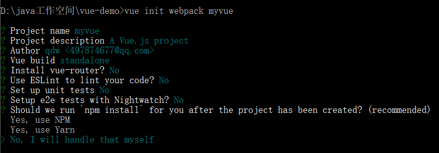
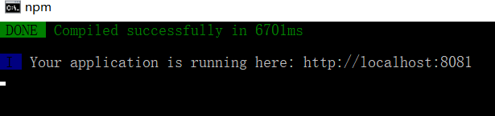
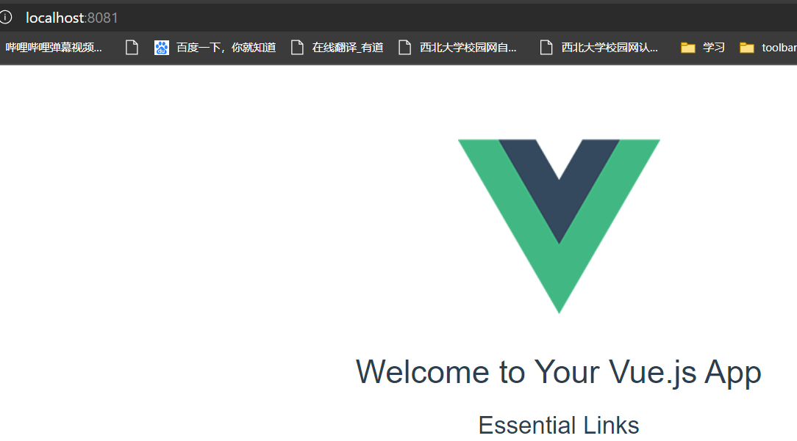
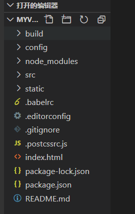
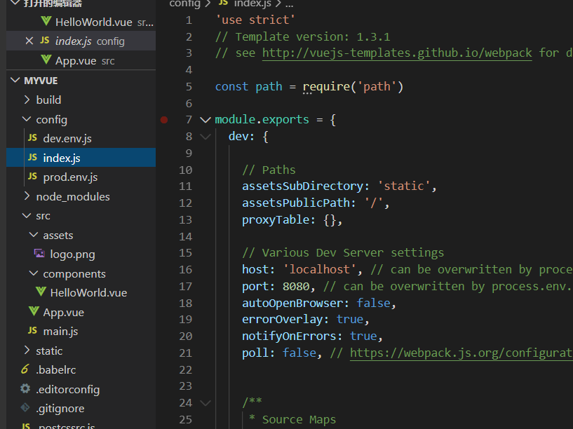

# 基础

## el挂载点

## data数据对象

## 基本指令

### v-text

### v-html

### v-on

### v-show

v-show只是在修改元素的css样式（display属性值）

### v-if

v-if是根据后面数据的真假，来判断DOM的添加删除等操作

### v-bind

### v-for

### v-on

### v-model

可以用 v-model 指令在表单 <input>、<textarea> 及 <select> 元素上创建双向数据绑定。

## 组件

定义一个vue组件

向组件中传值需要用props：在组件的自定义标签中通过v-bind绑定数据到props里。

## axios

加载页面的方法，设置vue生命周期的钩子函数

~~~js
      mounted(){
        axios.get('/index2/get').then(response=>{
          this.results = response.data;
        }).catch(function (err) {
            console.log(err);
        });
      },
~~~

调用方法

~~~js
      methods: {
        searchKey: function(){
          var keywords = this.keywords;
          console.log(keywords);
          //开始对接
          axios.get('search/'+keywords+'/1/10').then(response=>{
            console.log(response);
            //绑定数据
            this.results = response.data;
          })
        }
      }
~~~

## 计算属性

跟方法的区别，调用是通过属性调用的。数据缓存在内存中作为属性。目的就是为了将不经常变化的计算结果缓存起来，减少开销。

~~~html

  
Original message: "{{ message }}"

  
Computed reversed message: "{{ reversedMessage }}"

~~~

~~~js
var vm = new Vue({
  el: '#example',
  data: {
    message: 'Hello'
  },
  computed: {
    // 计算属性的 getter
    reversedMessage: function () {
      // `this` 指向 vm 实例
      return this.message.split('').reverse().join('')
    }
  }
})
~~~

## 插槽

将 <slot> 元素作为承载分发内容的出口。

# vue-cli

使用cnmp安装vue-cli

~~~
cnpm install vue-cli -g
~~~

查看模板

~~~
vue list
~~~

在一个空文件夹中创建项目

~~~
vue init webpack myvue
~~~

进入项目目录，安装依赖

~~~
npm install
~~~

修复

~~~
npm audit fix
~~~

启动项目

~~~
npm run dev
~~~

可以用各种编辑器导入项目

这里我用vscode

配置端口

安装webpack

~~~
cnpm install webpack -g
cnpm install webpack-cli -g
~~~

