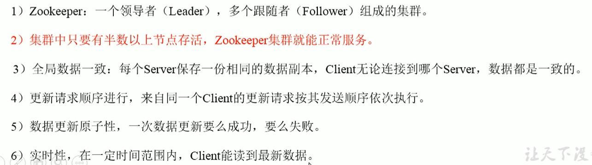
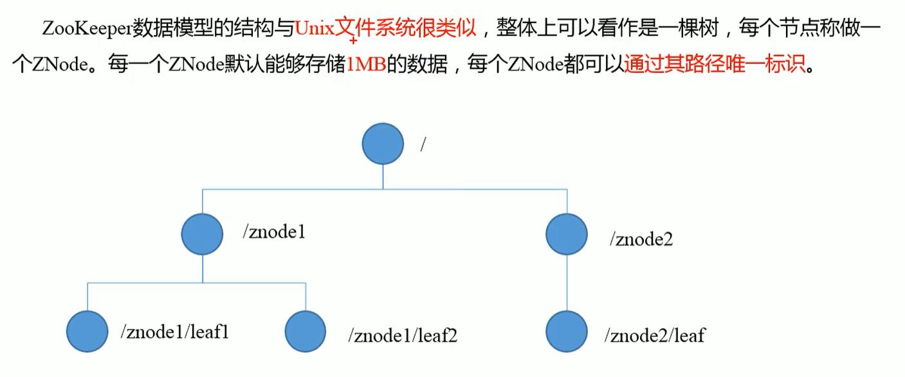

# 入门

## 概述

Zookeeper是一个开源的分布式的，为分布式应用提供协调服务的Apache项目

## 工作机制

从设计模式角度来理解：是一个基于观察者模式的分布式服务管理框架。负责存储和管理大家都关心的数据，然后接受观察者的注册，一旦这些数据的状态发生变化，Zookeeper就会负责通知已经在Zookeeper上注册哪些观察者做出相应的反应。

Zookeeper=文件系统+通知机制

## 特点

## 数据结构

