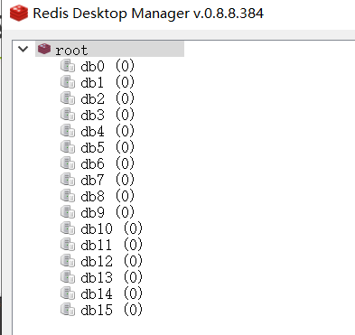
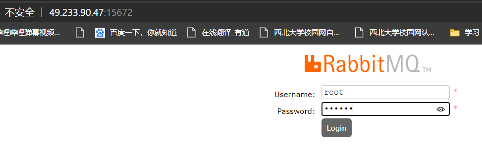
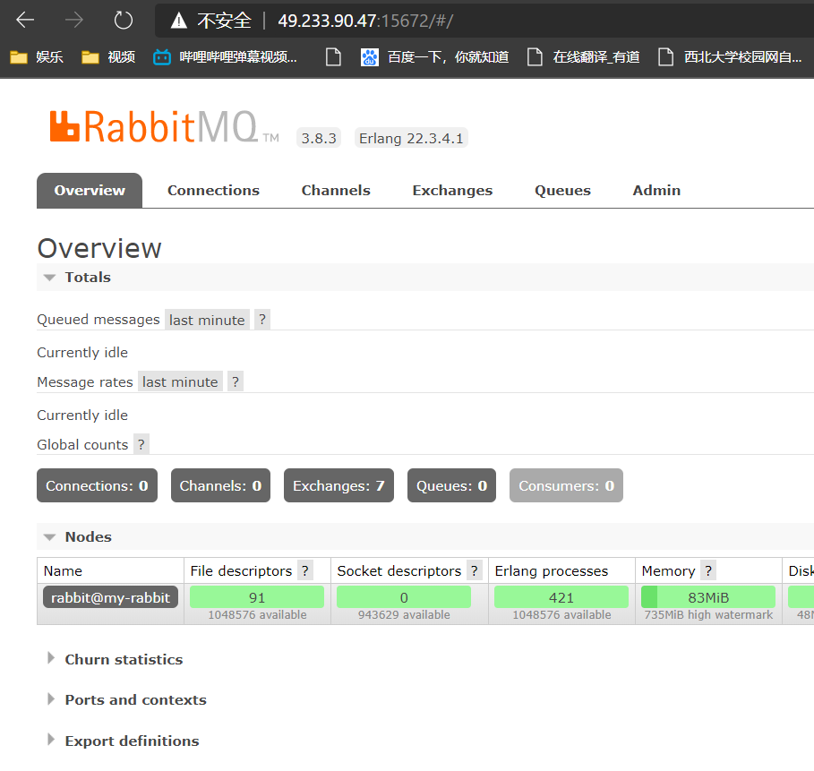

ip:49.233.90.47

## Java

~~~bash
yum -y install java-1.8.0-openjdk
~~~

#### docker中

~~~bash
docker run -d -it --name java java
~~~

## nodejs

将nodejs添加到yum库

~~~bash
yum clean all && yum makecache fast
yum install -y gcc-c++ make
curl -sL https://rpm.nodesource.com/setup_12.x | sudo -E bash -
~~~

安装

~~~bash
sudo yum install nodejs
node -v 
~~~

## Docker

~~~bash
yum update
yum install -y yum-utils device-mapper-persistent-data lvm2
yum-config-manager --add-repo https://download.docker.com/linux/centos/docker-ce.repo
yum list docker-ce --showduplicates | sort -r
yum install docker-ce-18.06.1.ce
systemctl start docker
# 加入开启启动
systemctl enable docker
# 查看版本
docker version 
# 设置镜像源
vim /etc/docker/daemon.json
# {
# "registry-mirrors":["https://12pqsix0.mirror.aliyuncs.com"]
# }

# 重启
systemctl restart docker
~~~

## Redis

### docker中

~~~bash
# 拉取redis镜像
docker pull redis
# 查看本地镜像
docker images
# 运行redis。run表示运行，-p 6379:6379表示把服务器的6379映射到docker的6379端口。-d表示以后台形式运行redis。redis redos-server --appendonly yes表示开启持久化。
docker run --name myredis -p 6379:6379 -d redis redis-server --appendonly yes
# 查看运行的容器
docker ps
~~~

## MySQL

### docker中

~~~bash
docker pull mysql:5.7.27
docker run --name mymysql -e MYSQL_ROOT_PASSWORD=123321 -d  -p 3306:3306 mysql:5.7.27
# 如果要保存表情包，需要改变编码形式，加上另外的参数，可以去docker官方文档中找
~~~

## RabbitMQ

### docker中

~~~bash
docker pull rabbitmq:management
docker run -d --hostname my-rabbit --name myrabbit -e RABBITMQ_DEFAULT_USER=root -e RABBITMQ_DEFAULT_PASS=123321 -p 15672:15672 -p 5672:5672 rabbitmq:management
~~~

## ElasticSearch

#### docker中

~~~bash
# 先配置下系统
sysctl -w vm.max_map_count=262144
# 拉取
docker pull elasticsearch:6.4.3
# 运行 因为服务器内存太小，所以设置下内存占用
docker run --name es_643 -p 9200:9200 -p 9300:9300 -e  ES_JAVA_OPTS="-Xmx256m -Xms256m" -d elasticsearch:6.4.3
# 查看容器的日志
docker logs -f es_643
# es配置文件位置： 
vi /usr/share/elasticsearch/config/elasticsearch.yml
#  修改名字 cluster.name: "blogs"

~~~

安装分词器

~~~bash
# 进入容器
docker exec -it es_643 /bin/bash
# 安装
./bin/elasticsearch-plugin install https://github.com/medcl/elasticsearch-analysis-ik/releases/download/v6.4.3/elasticsearch-analysis-ik-6.4.3.zip
~~~

重启容器

~~~bash
exit
docker restart es_643
~~~

## Docker创建镜像

### 编写Dockerfile

要和jar包在同一个目录下

~~~bash
FROM java:8
EXPOSE 8080
VOLUME /tmp

ENV TZ=Asia/beijing
RUN ln -sf /usr/share/zoneinfo/{TZ} /etc/localtime && echo "{TZ}" > /etc/timezone

ADD eblog-0.0.1-SNAPSHOT.jar  /app.jar
RUN bash -c 'touch /app.jar'
ENTRYPOINT ["java","-jar","/app.jar"]
~~~

### 构建镜像

~~~bash
docker build -t eblog .
~~~

### 启动

~~~bash
docker run -p 8080:8080 -p 9326:9326 --name eblog --link es_643:ees --link myrabbit:erabbitmq --link mymysql:emysql --link myredis:eredis -d eblog
~~~

