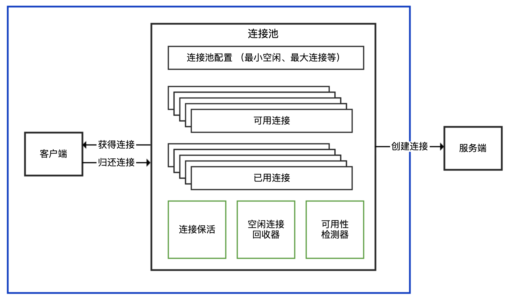
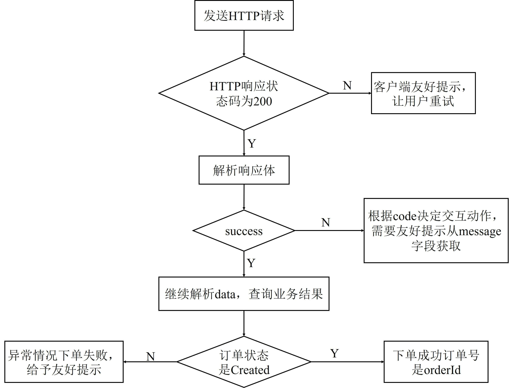

《Java业务开发常见错误》


## Spring声明式事务

### 注解生效

@Transactional 生效原则：

1. 除非特殊配置（比如使用 AspectJ 静态织入实现 AOP），否则只有定义在 public 方法上的 @Transactional 才能生效
   1. 原因：CGLIB方式可以对public和protected的方法进行增强（因为都对子类可见）。而JDK动态代理方式就只能对public方法进行增强（因为是基于接口，接口中方法默认都是public）。也正是这个原因，所以Spring只对public开启了事务增强的支持，避免当代理方式不一样时导致了事务增强的不一致性。
2. 目标方法被代理，且通过本类外部（除非把自己再注入一下）调用才能生效。
   1. 原因：A类实例a被注入后，public方法被代理，用invoke调用，但是invoke中用到的this.method调用的其实是target的method方法。换而言之，动态代理永远**只能代理一层方法**，如果方法内还是this引导的方法则无法代理，但是如果是static的方法就不存在这个问题。

)

图中的self就是把自己又注入了进来。

-20231024134111034.(null))


### 生效不一定回滚

通过 AOP 实现事务处理可以理解为，使用 try…catch…来包裹标记了 @Transactional 注解的方法，**当方法出现了异常并且满足一定条件的时候**，在 catch 里面我们可以设置事务回滚，没有异常则直接提交事务。

回滚有两个条件

1. 只有异常传播出了标记了 @Transactional 注解的方法，事务才能回滚。
2. 默认情况下，出现 RuntimeException（非受检异常）或 Error 的时候，Spring 才会回滚事务。


## 代码重复

### 用工厂+模板模式，消除ifelse和重复代码

```Java
@GetMapping("right")

public Cart right(@RequestParam("userId") int userId) {

    String userCategory = Db.getUserCategory(userId);

    AbstractCart cart = (AbstractCart) applicationContext.getBean(userCategory + "UserCart");

    return cart.process(userId, items);

}
```


### 利用注解+反射消除重复代码

通过注解，统一对标记了注解的字段进行统一处理。


### 利用属性拷贝工具消除重复代码

mapstruct


## 异步处理

区别于同步处理，异步处理无需同步等待流程处理完毕，因此适用场景主要包括：

- 服务于主流程的分支流程。比如，在注册流程中，把数据写入数据库的操作是主流程，但注册后给用户发优惠券或欢迎短信的操作是分支流程，时效性不那么强，可以进行异步处理。
- 用户不需要实时看到结果的流程。比如，下单后的配货、送货流程完全可以进行异步处理，每个阶段处理完成后，再给用户发推送或短信让用户知晓即可。


异步处理虽然好用，但在实现的时候却有三个最容易犯的错，分别是异步处理流程的可靠性问题、消息发送模式的区分问题，以及大量死信消息堵塞队列的问题。


### 需要消息补偿闭环

主要处理三种情况：1）客户端发送消息给MQ发生异常 2）MQ发送消息给客户端发生异常 3）MQ服务不可用

因此，对于异步处理流程，必须考虑**补偿或者说建立主备双活流程**。


### 注意消息模式是广播还是工作队列


### 别让死信堵塞了消息队列

解决死信无限重复进入队列最简单的方式是，在程序处理出错的时候，直接抛出 AmqpRejectAndDontRequeueException 异常，避免消息重新进入队列

## 线程池

### 线程池需要手动声明

Java 中的 Executors 类定义了一些快捷的工具方法，来帮助我们快速创建线程池。《阿里巴巴 Java 开发手册》中提到，禁止使用这些方法来创建线程池，而应该手动 new ThreadPoolExecutor 来创建线程池。这一条规则的背后，是大量血淋淋的生产事故，最典型的就是 newFixedThreadPool 和 newCachedThreadPool，可能因为资源耗尽导致 OOM 问题。

#### newFixedThreadPool 为什么可能会出现 OOM 的问题？

new 了一个 LinkedBlockingQueue，而默认构造方法的 LinkedBlockingQueue 是一个 Integer.MAX_VALUE 长度的队列，可以认为是无界的。

虽然使用 newFixedThreadPool 可以把工作线程控制在固定的数量上，但任务队列是无界的。如果任务较多并且执行较慢的话，队列可能会快速积压，撑爆内存导致 OOM。

#### newCachedThreadPool 为什么可能会出现 OOM 的问题？

这种线程池的最大线程数是 Integer.MAX_VALUE，可以认为是没有上限的，而其工作队列 SynchronousQueue 是一个没有存储空间的阻塞队列。

在任务执行时间比较长，来的新任务又多的情况下，会无线创建新的线程，最终导致OOM。


#### Executors 提供的两种快捷的线程池

不建议使用 Executors 提供的两种快捷的线程池，原因如下：

- 我们需要根据自己的场景、并发情况来评估线程池的几个核心参数，包括核心线程数、最大线程数、线程回收策略、工作队列的类型，以及拒绝策略，确保线程池的工作行为符合需求，一般都需要设置有界的工作队列和可控的线程数。
- 任何时候，都应该为自定义线程池指定有意义的名称，以方便排查问题。当出现线程数量暴增、线程死锁、线程占用大量 CPU、线程执行出现异常等问题时，我们往往会抓取线程栈。此时，有意义的线程名称，就可以方便我们定位问题。


#### 建议增加一下监控手段

除了建议手动声明线程池以外，还建议用一些监控手段来观察线程池的状态。


### 线程池线程管理策略详解

线程池默认的工作行为：

- 不会初始化 corePoolSize 个线程，有任务来了才创建工作线程；
- 当核心线程满了之后不会立即扩容线程池，而是把任务堆积到工作队列中；
- 当工作队列满了后扩容线程池，一直到线程个数达到 maximumPoolSize 为止；
- 如果队列已满且达到了最大线程后还有任务进来，按照拒绝策略处理；
- 当线程数大于核心线程数时，线程等待 keepAliveTime 后还是没有任务需要处理的话，收缩线程到核心线程数。

也可以通过一些手段来改变这些默认工作行为，比如：

- 声明线程池后立即调用 prestartAllCoreThreads 方法，来启动所有核心线程；
- 传入 true 给 allowCoreThreadTimeOut 方法，来让线程池在空闲的时候同样回收核心线程。

#### 有没有办法让线程池更激进一点，优先开启更多的线程，而把队列当成一个后备方案呢？

Java 线程池是先用工作队列来存放来不及处理的任务，满了之后再扩容线程池。当我们的工作队列设置得很大时，最大线程数这个参数显得没有意义，因为队列很难满，或者到满的时候再去扩容线程池已经于事无补了。

实现大致思路：

- 由于线程池在工作队列满了无法入队的情况下会扩容线程池，那么我们是否可以重写队列的 offer 方法，造成这个**队列已满的假象**呢？
- 由于我们 Hack 了队列，在达到了最大线程后势必会触发拒绝策略，那么能否实现一个自定义的**拒绝策略**处理程序，这个时候再**把任务真正插入队列**呢？


### 务必确认线程池本身是不是复用的

确保不是每次创建线程的时候创建线程池。保证线程池做到复用，也不能盲目复用，要看适不适合。


### 需要仔细斟酌线程池的混用策略

要根据任务的“轻重缓急”来指定线程池的核心参数，包括线程数、回收策略和任务队列：

- 对于执行比较慢、数量不大的 IO 任务，或许要考虑更多的线程数，而不需要太大的队列。
- 而对于吞吐量较大的计算型任务，线程数量不宜过多，可以是 CPU 核数或核数 *2（理由是，线程一定调度到某个 CPU 进行执行，如果任务本身是 CPU 绑定的任务，那么过多的线程只会增加线程切换的开销，并不能提升吞吐量），但可能需要较长的队列来做缓冲。

**不能盲目复用不同的任务，要看适不适合。**


## 连接池

连接池一般对外提供获得连接、归还连接的接口给客户端使用，并暴露最小空闲连接数、最大连接数等可配置参数，在内部则实现连接建立、连接心跳保持、连接管理、空闲连接回收、连接可用性检测等功能。连接池的结构示意图，如下所示：




### 注意鉴别客户端 SDK 是否基于连接池

TCP 是面向连接的基于字节流的协议：

- 面向连接，意味着连接需要先创建再使用，创建连接的三次握手有一定开销；
- 基于字节流，意味着字节是发送数据的最小单元，TCP 协议本身无法区分哪几个字节是完整的消息体，也无法感知是否有多个客户端在使用同一个 TCP 连接，TCP 只是一个读写数据的管道。

使用使用三方客户端进行网络通信时，我们首先要确定客户端 SDK 是否是基于连接池技术实现的。

如果客户端 SDK 没有使用连接池，而直接是 TCP 连接，那么就需要考虑每次建立 TCP 连接的开销，并且因为 TCP 基于字节流，在**多线程的情况下对同一连接进行复用，可能会产生线程安全问题。**

先看一下涉及 TCP 连接的客户端 SDK，对外提供 **API 的三种方式**。

- 连接池和连接分离的 API：有一个 XXXPool 类负责连接池实现，先从其获得连接 XXXConnection，然后用获得的连接进行服务端请求，完成后使用者需要归还连接。通常，XXXPool 是线程安全的，可以并发获取和归还连接，而 XXXConnection 是非线程安全的。对应到连接池的结构示意图中，XXXPool 就是右边连接池那个框，左边的客户端是我们自己的代码。
- 内部带有连接池的 API：对外提供一个 XXXClient 类，通过这个类可以直接进行服务端请求；这个类内部维护了连接池，SDK 使用者无需考虑连接的获取和归还问题。一般而言，XXXClient 是线程安全的。对应到连接池的结构示意图中，整个 API 就是蓝色框包裹的部分。
- 非连接池的 API：一般命名为 XXXConnection，以区分其是基于连接池还是单连接的，而不建议命名为 XXXClient 或直接是 XXX。直接连接方式的 API 基于单一连接，每次使用都需要创建和断开连接，性能一般，且通常不是线程安全的。对应到连接池的结构示意图中，这种形式相当于没有右边连接池那个框，客户端直接连接服务端创建连接。

明确了 SDK 连接池的实现方式后，我们就大概知道了使用 SDK 的最佳实践：

- 如果是分离方式，那么连接池本身一般是线程安全的，可以复用。每次使用需要从连接池获取连接，使用后归还，归还的工作由使用者负责。
- 如果是内置连接池，SDK 会负责连接的获取和归还，使用的时候直接复用客户端。
- 如果 SDK 没有实现连接池（大多数中间件、数据库的客户端 SDK 都会支持连接池），那通常不是线程安全的，而且短连接的方式性能不会很高，使用的时候需要考虑是否自己封装一个连接池。


### 使用连接池务必确保复用

在介绍线程池的时候我们强调过，池一定是用来复用的，否则其使用代价会比每次创建单一对象更大。对连接池来说更是如此，原因如下：

- 创建连接池的时候很**可能一次性创建了多个连接**。
  - 大多数连接池考虑到性能，会在初始化的时候维护一定数量的最小连接（毕竟初始化连接池的过程一般是一次性的），可以直接使用。如果每次使用连接池都按需创建连接池，那么很可能你只用到一个连接，但是创建了 N 个连接。
- 连接池一般会有一些管理模块，也就是连接池的结构示意图中的绿色部分。
  - 举个例子，大多数的连接池都有闲置超时的概念。连接池会检测连接的闲置时间，定期回收闲置的连接，把活跃连接数降到最低（闲置）连接的配置值，减轻服务端的压力。一般情况下，闲置连接由独立线程管理，启动了空闲检测的连接池相当于还会启动一个线程。此外，有些连接池还需要独立线程负责连接保活等功能。因此，**启动一个连接池相当于启动了 N 个线程**。

除了使用代价，**连接池不释放，还可能会引起线程泄露**。


### 连接池的配置不是一成不变的

- 最大连接数不是设置得越大越好。
  - 如果设置得太大，不仅仅是客户端需要耗费过多的资源维护连接，更重要的是由于服务端对应的是多个客户端，每一个客户端都保持大量的连接，会给服务端带来更大的压力。
- 连接池最大连接数设置得太小，很可能会因为获取连接的等待时间太长，导致吞吐量低下，甚至超时无法获取连接。
- 对类似数据库连接池的重要资源进行持续检测，并设置一半的使用量作为报警阈值，出现预警后及时扩容。


## 坑满地的List列表操作


### 使用 Arrays.asList 把数据转换为 List 的三个坑

- 不能直接使用 Arrays.asList 来转换基本类型数组。
- Arrays.asList 返回的 List 不支持增删操作。
  - Arrays.asList 返回的 List 并不是我们期望的 java.util.ArrayList，而是 Arrays 的内部类 ArrayList。
- 对原始数组的修改会影响到我们获得的那个 List。
  - ArrayList 其实是直接使用了原始的数组。


### 使用 List.subList 进行切片操作居然会导致 OOM？

List.subList 返回的子 List 不是一个普通的 ArrayList。这个子 List 可以认为是原始 List 的视图，会和原始 List 相互影响。

当不断地从父list中切分出子list作为父list的视图，他们始终强引用着父list。


首先初始化一个包含数字 1 到 10 的 ArrayList，然后通过调用 subList 方法取出 2、3、4；随后删除这个 SubList 中的元素数字 3，并打印原始的 ArrayList；最后为原始的 ArrayList 增加一个元素数字 0，遍历 SubList 输出所有元素：

可以看到两个现象：

- 原始 List 中数字 3 被删除了，说明删除子 List 中的元素影响到了原始 List；
- 尝试为原始 List 增加数字 0 之后再遍历子 List，会出现 ConcurrentModificationException。


既然 SubList 相当于原始 List 的视图，那么避免相互影响的修复方式有两种：

- 一种是，不直接使用 subList 方法返回的 SubList，而是重新使用 new ArrayList，在构造方法传入 SubList，来构建一个独立的 ArrayList；
- 另一种是，对于 Java 8 使用 Stream 的 skip 和 limit API 来跳过流中的元素，以及限制流中元素的个数，同样可以达到 SubList 切片的目的。


### 一定要让合适的数据结构做合适的事情

- 对大 List 进行单值搜索的话，可以考虑使用 HashMap，其中 Key 是要搜索的值，Value 是原始对象，会比使用 ArrayList 有非常明显的性能优势。
- ArrayList 和 LinkedList更推荐前者。
  - 虽然对于数组，随机元素访问的时间复杂度是 O(1)，元素插入操作是 O(n)；对于链表，随机元素访问的时间复杂度是 O(n)，元素插入操作是 O(1)。但是对于**随机**插入链表的性能不如数组。


## 接口设计

### 接口的响应要明确表示接口的处理结果

为了将接口设计得更合理，我们需要考虑如下两个原则：

- **对外隐藏内部实现。**虽然说收单服务调用订单服务进行真正的下单操作，但是直接接口其实是收单服务提供的，收单服务不应该“直接”暴露其背后订单服务的状态码、错误描述。
- 设计接口结构时，**明确每个字段的含义**，以及客户端的处理方式。

```java
@Data
public class APIResponse<T> {
    private boolean success;
    private T data;
    private int code;
    private String message;
}
```

并明确接口的设计逻辑：

- 如果出现非 200 的 **HTTP 响应状态码**，就代表请求没有到收单服务，可能是网络出问题、网络超时，或者网络配置的问题。这时，肯定无法拿到服务端的响应体，客户端可以给予友好提示，比如让用户重试，不需要继续解析响应结构体。
- 如果 HTTP 响应码是 200，解析响应体**查看 success**，为 false 代表下单请求处理失败，可能是因为收单服务参数验证错误，也可能是因为订单服务下单操作失败。这时，根据收单服务定义的错误码表和 code，做不同处理。比如友好提示，或是让用户重新填写相关信息，其中友好提示的文字内容可以从 message 中获取。
- success 为 true 的情况下，才需要**继续解析响应体中的 data 结构体**。data 结构体代表了业务数据，通常会有下面两种情况。
  - 通常情况下，success 为 true 时订单状态是 Created，获取 orderId 属性可以拿到订单号。
  - 特殊情况下，比如收单服务内部处理不当，或是订单服务出现了额外的状态，虽然 success 为 true，但订单实际状态不是 Created，这时可以给予友好的错误提示。

**HTTP code -> success -> data**



相比原来混乱的接口定义和处理逻辑，改造后的代码，明确了接口每一个字段的含义，以及对于各种情况服务端的输出和客户端的处理步骤，对齐了客户端和服务端的处理逻辑。


### 要考虑接口变迁的版本控制策略


1. 版本策略最好一开始就考虑

确定是通过 URL Path 实现，是通过 QueryString 实现，还是通过 HTTP 头实现。这三种实现方式的代码如下：

```java
//通过URL Path实现版本控制
@GetMapping("/v1/api/user")
public int right1(){
    return 1;
}
//通过QueryString中的version参数实现版本控制
@GetMapping(value = "/api/user", params = "version=2")
public int right2(@RequestParam("version") int version) {
    return 2;
}
//通过请求头中的X-API-VERSION参数实现版本控制
@GetMapping(value = "/api/user", headers = "X-API-VERSION=3")
public int right3(@RequestHeader("X-API-VERSION") int version) {
    return 3;
}
```

这三种方式中，URL Path 的方式最直观也最不容易出错；QueryString 不易携带，不太推荐作为公开 API 的版本策略；HTTP 头的方式比较没有侵入性，如果仅仅是部分接口需要进行版本控制，可以考虑这种方式。


2. 版本实现方式要统一

实现方式不统一，有的是 /api/item/v1，有的是 /api/v1/shop，还有的是 /v1/api/merchant

理想的方式是在框架层面实现统一。如果你使用 Spring 框架的话，可以按照下面的方式自定义 RequestMappingHandlerMapping 来实现。

首先，创建一个注解来定义接口的版本。@APIVersion 自定义注解可以应用于方法或 Controller 上：

```java
@Target({ElementType.METHOD, ElementType.TYPE})
@Retention(RetentionPolicy.RUNTIME)
public @interface APIVersion {
    String[] value();
}
```

然后，定义一个 APIVersionHandlerMapping 类继承 RequestMappingHandlerMapping。

RequestMappingHandlerMapping 的作用，是根据类或方法上的 @RequestMapping 来生成 RequestMappingInfo 的实例。我们覆盖 registerHandlerMethod 方法的实现，从 @APIVersion 自定义注解中读取版本信息，拼接上原有的、不带版本号的 URL Pattern，构成新的 RequestMappingInfo，来通过注解的方式为接口增加基于 URL 的版本号：

~~~java
public class APIVersionHandlerMapping extends RequestMappingHandlerMapping {
    @Override
    protected boolean isHandler(Class<?> beanType) {
        return AnnotatedElementUtils.hasAnnotation(beanType, Controller.class);
    }


    @Override
    protected void registerHandlerMethod(Object handler, Method method, RequestMappingInfo mapping) {
        Class<?> controllerClass = method.getDeclaringClass();
        //类上的APIVersion注解
        APIVersion apiVersion = AnnotationUtils.findAnnotation(controllerClass, APIVersion.class);
        //方法上的APIVersion注解
        APIVersion methodAnnotation = AnnotationUtils.findAnnotation(method, APIVersion.class);
        //以方法上的注解优先
        if (methodAnnotation != null) {
            apiVersion = methodAnnotation;
        }

        String[] urlPatterns = apiVersion == null ? new String[0] : apiVersion.value();
       
        PatternsRequestCondition apiPattern = new PatternsRequestCondition(urlPatterns);
        PatternsRequestCondition oldPattern = mapping.getPatternsCondition();
        PatternsRequestCondition updatedFinalPattern = apiPattern.combine(oldPattern);
        //重新构建RequestMappingInfo
        mapping = new RequestMappingInfo(mapping.getName(), updatedFinalPattern, mapping.getMethodsCondition(),
                mapping.getParamsCondition(), mapping.getHeadersCondition(), mapping.getConsumesCondition(),
                mapping.getProducesCondition(), mapping.getCustomCondition());
        super.registerHandlerMethod(handler, method, mapping);
    }
}
~~~

最后，也是特别容易忽略的一点，要通过实现 WebMvcRegistrations 接口，来生效自定义的 APIVersionHandlerMapping：

~~~java
@SpringBootApplication
public class CommonMistakesApplication implements WebMvcRegistrations {
...
    @Override
    public RequestMappingHandlerMapping getRequestMappingHandlerMapping() {
        return new APIVersionHandlerMapping();
    }
}
~~~

这样，就实现了在 Controller 上或接口方法上通过注解，来实现以统一的 Pattern 进行版本号控制：

~~~java
@GetMapping(value = "/api/user")
@APIVersion("v4")
public int right4() {
    return 4;
}
~~~


### 接口处理方式要明确同步还是异步

如果 API 列表中既有同步接口也有异步接口，那么最好直接在接口名中明确。


如果是后端批处理使用，那么可以使用同步上传，多等待一些时间问题不大；如果是面向用户的接口，那么接口响应时间不宜过长，可以调用异步上传接口，然后定时轮询上传结果，拿到结果再显示。
