## 弹力设计

容错设计又叫弹力设计，其中着眼于分布式系统的各种“容忍”能力，包括**容错能力**（服务隔离、异步调用、请求幂等性）、**可伸缩性**（有 / 无状态的服务）、**一致性**（补偿事务、重试）、**应对大流量的能力**（熔断、降级）。可以看到，在确保系统正确性的前提下，系统的可用性是弹力设计保障的重点。

### 概述和总结

#### 弹力设计总图

- 首先，我们的服务不能是单点，所以，我们需要在我们的架构中**冗余服务**，也就是说有多个服务的副本。这需要使用到的具体技术有：
  - 负载均衡 + 服务健康检查 -- 可以使用像 Nginx 或 HAProxy 这样的技术；
  - 服务发现 + 动态路由 + 服务健康检查，比如 Consul 或 Zookeeper；
  - 自动化运维，Kubernetes 服务调度、伸缩和故障迁移。
- 然后，我们需要**隔离**我们的业务，要隔离我们的服务我们就需要**对服务进行解耦和拆分**，这需要使用到以前的相关技术。
  - bulkheads 模式：业务分片 、用户分片、数据库拆分。
  - 自包含系统：所谓自包含的系统是从单体到微服务的中间状态，其把一组密切相关的微服务给拆分出来，只需要做到没有外部依赖就行。
  - 异步通讯：服务发现、事件驱动、消息队列、业务工作流。
  - 自动化运维：需要一个服务调用链和性能监控的监控系统。
- 然后，接下来，我们就要进行和能让整个架构接受失败的相关处理设计，也就是所谓的**容错设计**。这会用到下面的这些技术。
  - 错误方面：调用重试 + 熔断 + 服务的幂等性设计。
  - 一致性方面：强一致性使用两阶段提交、最终一致性使用异步通讯方式。
  - 流控方面：使用限流 + 降级技术。
  - 自动化运维方面：网关流量调度，服务监控。

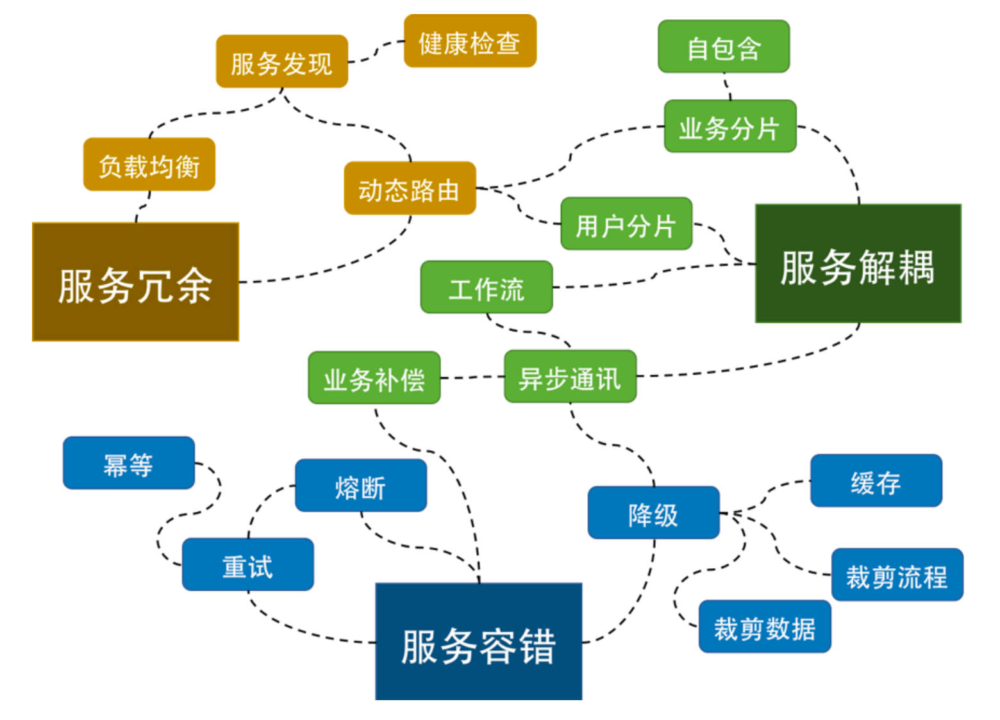

在上面这个图上，我们可以看到，有三个大块的东西：

- **冗余服务。**通过冗余服务的复本数可以消除单点故障。这需要服务发现，负载均衡，动态路由和健康检查四个功能或组件。
- **服务解耦。**通过解耦可以做到把业务隔离开来，不让服务间受影响，这样就可以有更好的稳定性。
  - 在水平层面上，需要把**业务或用户分片分区**（业分做隔离，用户做多租户）。
  - 在垂直层面上，需要**异步通讯机制**。
  - 因为应用被分解成了一个一个的服务，所以在**服务的编排和聚合**上，需要有工作流（像 Spring 的 Stream 或 Akk 的 flow 或是 AWS 的 SimpleWorkflow）来把服务给串联起来。而**一致性的问题又需要业务补偿机制**来做反向交易。
- **服务容错。**服务容错方面，需要有**重试机制**，重试机制会带来**幂等**操作，对于服务保护来说，**熔断，限流，降级**都是为了保护整个系统的稳定性，并在可用性和一致性方面在出错的情况下做一部分的妥协。

当然，除了这一切的架构设计外，你还需要一个或多个自动运维的工具，否则，如果是人肉运维的话，那么在故障发生的时候，不能及时地做出运维决定，也就空有这些弹力设计了。比如：监控到服务性能不够了，就自动或半自动地开始进行限流或降级。

#### 弹力设计开发和运维

对于运维工具来说，你至少需要两个系统：

- 一个是像 APM 这样的服务监控；
- 另一个是服务调度的系统，如：Docker + Kubernetes。

### 隔离设计

**隔离设计对应的单词是 Bulkheads，中文翻译为隔板。**但其实，这个术语是用在造船上的，也就是船舱里防漏水的隔板。一般的船无论大小都会有这个东西，大一点的船都会把船舱隔成若干个空间。这样，如果船舱漏水，只会进到一个小空间里，不会让整个船舱都进水而导致整艘船都沉了。

在分布式软件架构中，我们同样需要**使用类似这样的技术来让我们的故障得到隔离**。这就需要我们对系统进行分离。一般来说，对于系统的分离有两种方式，一种是**以服务的种类来做分离**，一种是**以用户来做分离**。下面具体说明一下这两种方式。

#### 服务分离

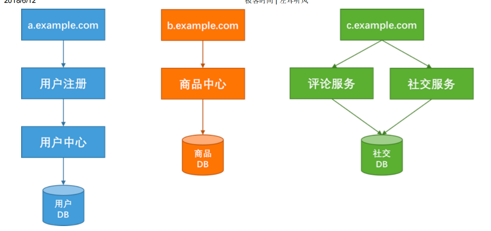

上图中，我们将系统分成了用户、商品、社区三个版块。**三个板块分别使用不同的域名、服务器和数据库**，做到从接入层到应用层再到数据层三层完全隔离。这样一来，在物理上来说，一个版块的故障就不会影响到另一版块。

然而任何架构都有其好和不好的地方，上面这种架构虽然在系统隔离上做得比较好，但是也存在以下一些问题：

- **性能降低。**如果我们需要同时获得多个版块的数据，那么就需要调用多个服务，这会降低性能。注意，这里性能降低指的是响应时间，而不是吞吐量（相反，在这种架构下，吞吐量可以得到提高）。
  - 解决思路：需要小心地设计用户交互，最好**不要让用户在一个页面上获得所有的数据**。
- **数据分散。**如果有大数据平台，就需要把这些数据都抽取到一个数据仓库中进行计算，这也增加了数据合并的复杂度。
  - 解决思路：对于这个问题，我们需要一个框架或是一个中间件来对数据进行相应的抽取。
- **不同板块也会相互影响。**如果我们的业务逻辑或是业务流程需要跨版块的话，那么一个版块的故障也会导致整个流程走不下去，同样会导致整体业务故障。
  - 解决思路：我们需要保证这个业务流程中**各个子系统的高可用性**，并且在业务流程上做成 **Step-by-Step 的方式**，这样用户交互的每一步都可以保存，以便故障恢复后可以继续执行，而不是从头执行。
- **板块之间的交互增加复杂性。**如果需要有跨版块的交互也会变得有点复杂。
  - 解决思路：对此我们需要一个类似于 Pub/Sub 的高可用的并可以持久化的消息**订阅通知的中间件**来打通各个版块的数据和信息交换。
- **分布式事务问题。**最后还会有在多个版块中分布式事务的问题。
  - 解决思路：对此，我们需要“二阶段提交”这样的方案。在亚马逊中，使用的是 Plan – Reserve – Commit/Cancel 模式。

#### 用户分离

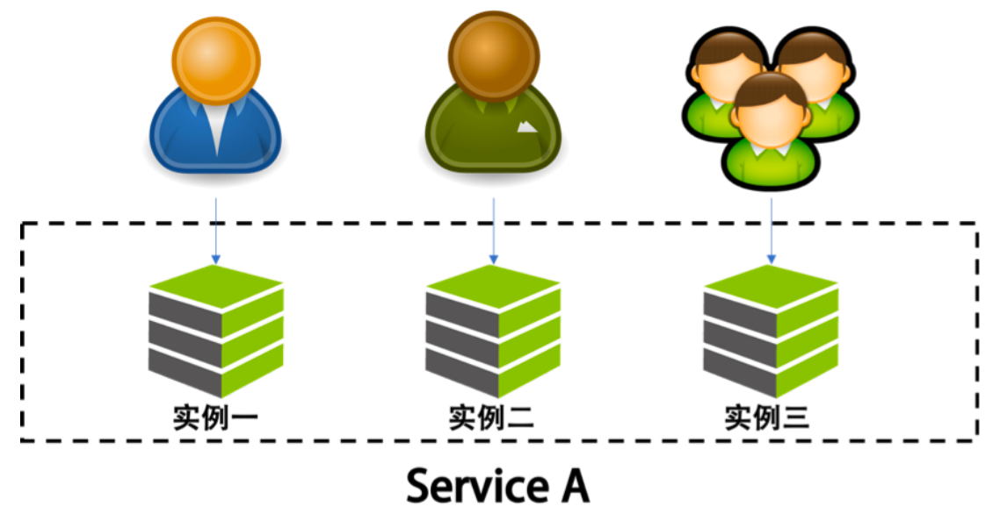

在这个图中，可以看到，我们将用户分成不同的组，并把后端的同一个服务根据这些不同的组分成不同的实例。让同一个服务对于不同的用户进行冗余和隔离，这样一来，当服务实例挂掉时，只会影响其中一部分用户，而不会导致所有的用户无法访问。

这种分离和上面按功能的分离可以融合。说白了，这就是所谓的“多租户”模式。对于一些比较大的客户，我们可以为他们设置专门独立的服务实例，或是服务集群与其他客户隔离开来，对于一些比较小的用户来说，可以让他们共享一个服务实例，这样可以节省相关的资源。

对于“多租户”的架构来说，会**引入一些系统设计的复杂度**。一方面，如果完全隔离，资源使用上会比较浪费，如果共享，又会导致程序设计的一些复杂度。

通常来说多租户的做法有三种：

- **完全独立的设计。**每个租户有自己完全独立的服务和数据。
-  **独立的数据分区，共享的服务。**多租户的服务是共享的，但数据是分开隔离的。
- **共享的服务，共享的数据分区。**每个租户的数据和服务都是共享的。

这三种方案各有优缺点，如图所示。

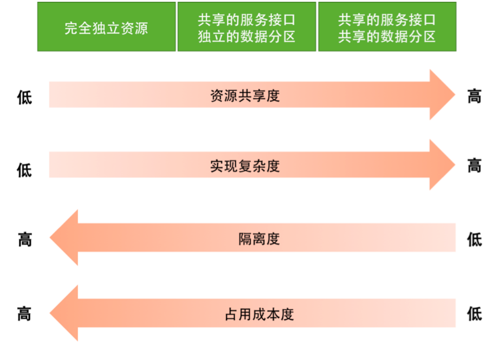

通过上图，可以看到：

- 如果使用完全独立的方案，在开发实现上和资源隔离度方面会非常好，然而，成本会比较高，计算资源也会有一定的浪费。
- 如果使用完全共享的方案，在资源利用和成本上会非常好，然而，开发难度非常大，而且数据和资源隔离非常不好。

一般来说，技术方案会使用折衷方案，也就是**中间方案，服务是共享的，数据通过分区来隔离**，而对于一些比较重要的租户（需要好的隔离性），则使用完全独立的方式。

然而，在虚拟化技术非常成熟的今天，我们完全**可以使用“完全独立”（完全隔离）的方案，通过底层的虚拟化技术**（Hypervisor 的技术，如 KVM，或是 Linux Container 的技术，如Docker）来实现物理资源的共享和成本的节约。

要能做好隔离设计，我们需要有如下的一些设计考量：

- **控制好隔离颗粒度。**我们需要定义好隔离业务的大小和粒度，过大和过小都不好。这需要认真地做业务上的需求和系统分析。
- **综合考虑。**无论是做系统版块还是多租户的隔离，你都需要考虑系统的复杂度、成本、性能、资源使用的问题，找到一个合适的均衡方案，或是分布实施的方案尤其重要，这其中需要你定义好要什么和不要什么。因为，我们不可能做出一个什么都能满足的系统。
- **配套中间件。**隔离模式需要配置一些高可用、重试、异步、消息中间件，流控、熔断等设计模式的方式配套使用。
- **考虑方便运维。**不要忘记了分布式系统中的运维的复杂度的提升，要能驾驭得好的话，还需要很多自动化运维的工具，尤其是使用像容器或是虚拟机这样的虚拟化技术可以帮助我们更方便地管理，和对比资源更好地利用。否则做出来了也管理不好。
- **完善的监控机制。**最后，你需要一个非常完整的能够看得到所有服务的监控系统，这点非常重要。

### 异步通信设计

通讯一般来说分同步和异步两种。同步调用虽然让系统间只耦合于接口，而且实时性也会比异步调用要高，但是我们也需要知道**同步调用所带来如下的问题**：

- 同步调用需要被调用方的吞吐不低于调用方的吞吐。否则会导致被调用方因为性能不足而拖死调用方。换句话说，整个**同步调用链的性能会由最慢的那个服务所决定。**

- 同步调用会导致调用方一直在等待被调用方完成，如果一层接一层地同步调用下去，所有的参与方会有相同的等待时间。这会非常**消耗调用方的资源**（因为调用方需要保存现场（Context）等待远端返回，所以对于并发比较高的场景来说，这样的等待可能会极度消耗资源）。

- 同步调用只能是一对一的，**很难做到一对多**的通讯方式。

- 同步调用最不好的是，如果**被调用方有问题，那么其调用方就会跟着出问题**，于是会出现多米诺骨牌效应，故障一下就蔓延开来。

  

异步通讯相对于同步通讯来说，除了可以增加系统的吞吐量之外，最大的一个好处是其可以**让服务间的解耦更为彻底**，系统的调用方和被调用方可以按照自己的速率而不是步调一致，从而可以更好地保护系统，让系统更有弹力。

#### 异步通讯的三种方式

##### 请求响应式

在这种情况下，**发送方（sender）会直接请求接收方（receiver），被请求方接收到请求后，直接返回**：收到请求，正在处理。

对于返回结果，有两种方法：

- 一种是发送方时不时地去**轮询**一下，问一下干没干完。
- 另一种方式是发送方注册一个**回调**方法，也就是接收方处理完后回调请求方。
  - 这种架构模型在以前的网上支付中比较常见，页面先从商家跳转到支付宝或银行，商家会把回调的 URL 传给支付页面，支付完后，再跳转回商家的 URL。

##### 通过订阅的方式

这种情况下，**接收方（receiver）会来订阅发送方（sender）的消息**，**发送方会把相关的消息或数据放到接收方所订阅的队列中**，而接收方会从队列中获取数据。

这种方式下，**发送方并不关心订阅方的处理结果**，它只是告诉订阅方有事要干，收完消息后给个ACK 就好了，你**干成啥样我不关心**。

但是，在这种方式下，接收方需要向发送方订阅事件，所以是接收方依赖于发送方。这种方式还是有一定的耦合。

##### 通过 Broker 的方式

所谓 Broker，就是一个中间人，**发送方（sender）和接收方（receiver）都互相看不到对方，它们看得到的是一个 Broker**，发送方向 Broker 发送消息，接收方向 Broker 订阅消息。如下图所示。

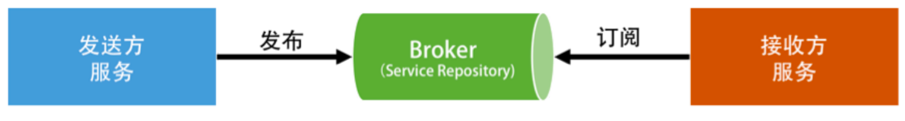

这是完全的解耦。所有的服务都不需要相互依赖，而是依赖于一个中间件 Broker。这个 Broker是一个像数据总线一样的东西，所有的服务要接收数据和发送数据都发到这个总线上，这个总线就像协议一样，让服务间的通讯变得标准和可控。

在 Broker 这种模式下，发送方的服务和接收方的服务最大程度地解耦。但是所有人都依赖于一个总线，所以这个总线就需要有如下的特性：

- 必需是高可用的，因为它成了整个系统的关键；
- 必需是高性能而且是可以水平扩展的；
- 必需是可以持久化不丢数据的。

例如mq。

#### 事件驱动设计

上述的第二种和第三种方式就是比较著名的事件驱动架构（EDA – Event Driven Architecture）。正如前面所说，事件驱动最好是使用 Broker 方式，服务间通过交换消息来完成交流和整个流程的驱动。

举个例子，如下图所示，这是一个订单处理流程。下单服务通知订单服务有订单要处理，而订单服务生成订单后发出通知，库存服务和支付服务得到通知后，一边是占住库存，另一边是让用户支付，等待用户支付完成后通知配送服务进行商品配送。

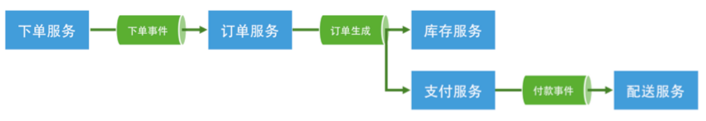

每个服务都是“自包含”的。所谓“自包含”也就是没有和别人产生依赖。而要把整个流程给串联起来，我们需要一系列的“消息通道（Channel）”。各个服务做完自己的事后，发出相应的事件，而又有一些服务在订阅着某些事件来联动。

事件驱动方式的好处至少有五个：

- 服务间的依赖没有了，服务间是平等的，**每个服务都是高度可重用并可被替换的。**
- 服务的开发、测试、运维，以及故障处理都是**高度隔离**的。
- 服务间通过事件关联，所以**服务间是不会相互 block** 的。
- 在**服务间增加一些 Adapter**（如日志、认证、版本、限流、降级、熔断等）相当容易。
- 服务间的吞吐也被解开了，**各个服务可以按照自己的处理速度处理**。

我们知道任何设计都有好有不好的方式。事件驱动的架构也会有一些不好的地方：

- **业务流程不再那么明显和好管理。**整个架构变得比较复杂。解决这个问题需要有一些可视化的工具来呈现整体业务流程。
- **事件可能会乱序。**这会带来非常 Bug 的事。解决这个问题需要很好地管理一个状态机的控制。
- **事务处理变得复杂。**需要使用两阶段提交来做强一致性，或是退缩到最终一致性。

#### 异步通讯的设计重点

为什么要异步通讯：

- **异步通讯最重要的是解耦服务间的依赖。**最佳解耦的方式是通过 Broker 的机制。
- 解耦的目的是让各个服务的**隔离性更好，**这样不会出现“一倒倒一片”的故障。
- 异步通讯的架构**可以获得更大的吞吐量**，而且各个服务间的性能不受干扰相对独立。
- 利用 Broker 或队列的方式还可以达到把抖动的吞吐量变成均匀的吞吐量，这就是所谓的“**削峰**”，这对后端系统是个不错的保护。
- **服务相对独立**，在部署、扩容和运维上都可以做到独立不受其他服务的干扰。

在设计成异步通信的时候需要注意如下事宜：

- 用于异步通讯的中间件 Broker 成为了关键，**需要设计成高可用不丢消息的**。另外，因为是分布式的，所以可能**很难保证消息的顺序，因此你的设计最好不依赖于消息的顺序。**
- 异步通讯会导致业务处理流程不那么直观，因为像接力一样，所以在 Broker 上**需要有相关的服务消息跟踪机制**，否则出现问题后不容易调试。
- 因为服务间只通过消息交互，所以**业务状态最好由一个总控方来管理，这个总控方维护一个业务流程的状态变迁逻辑**，以便系统发生故障后知道业务处理到了哪一步，从而可以在故障清除后继续处理。
- 消息传递中，可能有的业务逻辑会有像 TCP 协议那样的 send 和 ACK 机制。比如：A 服务发出一个消息之后，开始等待处理方的 ACK，如果等不到的话，就需要做重传。此时，**需要处理方有幂等的处理**，即同一件消息无论收到多少次都只处理一次。

### 幂等性设计

就是在我们把系统解耦隔离后，服务间的调用可能会有三个状态，一个是成功（Success），一个是失败（Failed），一个是超时（Timeout）。前两者都是明确的状态，而**超时则是完全不知道是什么状态。**

因为系统超时，而调用户方重试一下，会给我们的系统带来不一致的副作用。在这种情况下，一般有两种处理方式：

- 一种是需要下游系统提供相应的**查询接口**。上游系统在 timeout 后去查询一下。如果查到了，就表明已经做了，**成功了就不用做了，失败了就走失败流程**。
- 另一种是通过**幂等性的方式**。也就是说，把这个查询操作交给下游系统，我**上游系统只管重试**，下游系统保证一次和多次的请求结果是一样的。

对于第一种方式，需要对方提供一个查询接口来做配合。而第二种方式则需要下游的系统提供支持幂等性的交易接口。

#### 全局id

要做到幂等性的交易接口，需要有一个唯一的标识，来标志交易是同一笔交易。而这个交易 ID由谁来分配是一件比较头疼的事。因为这个标识要能做到全局唯一。

如果由一个中心系统来分配，那么每一次交易都需要找那个中心系统来。 这样增加了程序的性能开销。如果由上游系统来分配，则可能会导致可能会出现分配 ID 重复了的问题。因为上游系统可能会是一个集群，它们同时承担相同的工作。

UUID 的问题是，它的字符串占用的空间比较大，索引的效率非常低，生成的 ID 太过于随机，完全不是人读的，而且没有递增，如果要按前后顺序排序的话，基本不可能。

在全局唯一 ID 的算法中，这里介绍一个 Twitter 的开源项目 Snowflake。它是一个分布式 ID的生成算法。其核心思想是，产生一个 long 型的 ID，其中：

- 41bits 作为毫秒数。大概可以用 69.7 年。
- 10bits 作为机器编号（5bits 是数据中心，5bits 的机器 ID），支持 1024 个实例。
- 12bits 作为毫秒内的序列号。一毫秒可以生成 4096 个序号。

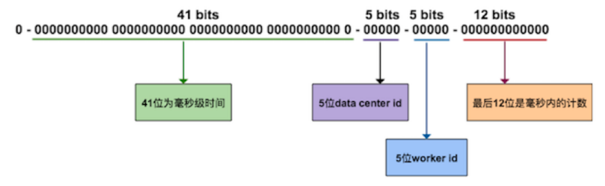

其他的像 Redis 或 MongoDB 的全局 ID 生成都和这个算法大同小异。我在这里就不多说了。你可以根据实际情况加上业务的编号。

#### 处理流程

对于幂等性的处理流程来说，说白了就是要过滤一下已经收到的交易。要做到这个事，我们需要一个存储来记录收到的交易。

于是，当收到交易请求的时候，我们就会到这个存储中去查询。如果查找到了，那么就不再做查询了，并把上次做的结果返回。如果没有查到，那么我们就记录下来。

因为大部分请求不会重复，如果每一个请求去查询处理结果可能会比较慢。

最好设计成如下：

- 新增：当这个存储出现冲突的时报错，自然就不做了。
- 更新：如果只是状态更新，可以使用如下的方式。如果出错，要么是非法操作，要么是已被更新，要么是状态不对，总之多次调用是不会有副作用的。

当然，网上还有 MVCC 通过使用版本号的方式，等等方式，我觉得这些都不标准，我们希望我们有一个标准的方式来做这个事，所以，最好还是用一个 ID。

因为我们的幂等性服务也是分布式的，所以，需要这个存储也是共享的。这样每个服务就变成没有状态的了。但是，这个存储就成了一个非常关键的依赖，其扩展性和可用性也成了非常关键的指标。可以使用关系型数据库，或是 key-value 的 NoSQL（如 MongoDB）来构建这个存储系统。

#### HTTP 的幂等性

- GET：HTTP GET 方法用于获取资源，不应有副作用，所以是幂等的。不会改变资源的状态，不论调用一次还是 N 次都没有副作用。请注意，这里强调的是一次和 N 次具有相同的副作用，而不是每次 GET 的结果相同。
- HEAD：HTTP HEAD 和 GET 本质是一样的，区别在于 HEAD 不含有呈现数据，而仅仅是 HTTP 头信息，不应用有副作用，也是幂等的。
- OPTIONS：HTTP OPTIONS 主要用于获取当前 URL 所支持的方法，所以也是幂等的。
- DELETE：HTTP DELETE 方法用于删除资源，有副作用，但它应该满足幂等性。
  - 比如：DELETEhttp://www.forum.com/article/4231，调用一次和 N 次对系统产生的副作用是相同的，即删掉 ID 为 4231 的帖子。
- POST：HTTP POST 方法用于创建资源，所对应的 **URI 并非创建的资源本身**，而是去执行创建动作的操作者，有副作用，**不满足幂等性**。
- PUT：HTTP PUT 方法用于创建或更新操作，所对应的 **URI 是要创建或更新的资源本身**，有副作用，它应该满足幂等性。

所以，对于 **POST 的方式，很可能会出现多次提交的问题**，就好比，我们在论坛中发贴时，所遇到的有时候网络有问题对同一篇贴子出现多次提交的情况。对此的一般的幂等性的设计如下：

- 首先，在表单中需要隐藏一个 token，这个 token 可以是前端生成的一个唯一的 ID。用于防止用户多次点击了表单提交按钮，而导致后端收到了多次请求，却不能分辨是否是重复的提交。这个 token 是表单的唯一标识。（这种情况其实是**通过前端生成 ID 把 POST 变成了PUT。**）
- 然后，当用户点击提交后，后端会把用户提示的数据和这个 token 保存在数据库中。如果有重复提交，那么数据库中的 token 会做排它限制，从而做到幂等性。
- 当然，更为稳妥的做法是，后端成功后向前端返回 302 跳转，把用户的前端页跳转到 GET请求，把刚刚 POST 的数据给展示出来。如果是 Web 上的最好还把之前的表单设置成过期，这样用户不能通过浏览器后退按钮来重新提交。这个模式又叫做 PRG 模式（Post/Redirect/Get）。

### 服务的状态

所谓“状态”，就是为了**保留程序的一些数据或是上下文。**比如之前幂等性设计中所说的需要保留下每一次请求的状态，或是像用户登录时的 Session，我们需要这个 Session 来判断这个请求的合法性，还有一个业务流程中需要让多个服务组合起来形成一个业务逻辑的运行上下文Context。这些都是所谓的状态。

我们的代码中基本上到处都是这样的状态。

#### 无状态的服务 Stateless

一直以来，无状态的服务被当成分布式服务设计的最佳实践和铁律。因为无状态的服务对于**扩展性和运维实在是太方便了**。没有状态的服务，可以随意地增加和减少结点，同样可以随意地搬迁。而且，无状态的服务可以大幅度降低代码的复杂度以及 Bug 数，因为没有状态，所以也没有明显的“副作用”。

基本上来说，无状态的服务和“函数式编程”的思维方式如出一辙。在函数式编程中，一个铁律是，函数是无状态的。换句话说，函数是 immutable 不变的，所有的函数只描述其逻辑和算法，根本不保存数据，也不会修改输入的数据，而是把计算好的结果返回出去，哪怕要把输入的数据重新拷贝一份并只做少量的修改。

但是，现实世界是一定会有状态的。这些状态可能表现在如下的几个方面：

- 程序调用的结果。
- 服务组合下的上下文。
- 服务的配置。

**为了做出无状态的服务，我们通常需要把状态保存到一个第三方的地方。**比如，不太重要的数据可以放到 Redis 中，重要的数据可以放到 MySQL 中，或是像 ZooKeeper/Etcd 这样的高可用的强一致性的存储中，或是分布式文件系统中。

于是，我们为了做成无状态的服务，会导致这些服务需要耦合第三方有状态的存储服务。一方面是有依赖，另一方面也增加了网络开销，导致服务的响应时间也会变慢。

所以，第三方的这些存储服务也必须要做成高可用高扩展的方式。而且，为了减少网络开销，还需要在无状态的服务中增加缓存机制。然而，下次这个用户的请求并不一定会在同一台机器，所以，这个缓存会在所有的机器上都创建，也算是一种浪费吧。

这种“转移责任”的玩法也催生出了对分布式存储的强烈需求。正如之前在《分布式系统架构的本质》系列文章中谈到的关键技术之一的“状态 / 数据调度”所说的，因为数据层的 scheme众多，所以，很难做出一个放之四海皆准的分布式存储系统。

这也是为什么无状态的服务需要依赖于像 ZooKeeper/Etcd 这样的高可用的有强一致的服务，或是依赖于底层的分布式文件系统（像开源的 Ceph 和 GlusterFS）。而现在分布式数据库也开始将服务和存储分离，也是为了让自己的系统更有弹力。

#### 有状态的服务 Stateful

在今天看来，有状态的服务在今天看上去的确比较“反动”，但是，我们也需要比较一下它和无状态服务的优劣。

正如上面所说的，无状态服务在程序 Bug 上和水平扩展上有非常优秀的表现，但是其需要把状态存放在一个第三方存储上，增加了网络开销，而在服务内的缓存需要在所有的服务实例上都有（因为每次请求不会都落在同一个服务实例上），这是比较浪费资源的。

而有状态的服务有这些好处。

- 数据本地化（Data Locality）。一方面状态和数据是本机保存，这方面不但有更低的延时，而且对于数据密集型的应用来说，这会更快。
- 更高的可用性和更强的一致性。也就是 CAP 原理中的 A 和 C。

为什么会这样呢？因为对于有状态的服务，我们需要对于客户端传来的请求，都必需保证其落在同一个实例上，这叫 Sticky Session 或是 Sticky Connection。这样一来，我们完全不需要考虑数据要被加载到不同的结点上去，而且这样的模型更容易理解和实现。

可见，最重要的区别就是，无状态的服务需要我们把数据同步到不同的结点上，而有状态的服务通过 Sticky Session 做数据分片（当然，同步有同步的问题，分片也有分片的问题，这两者没有谁比谁好，都有 trade-off）。

这种 Sticky Session 是怎么实现的呢？

**最简单的实现就是用持久化的长连接。**就算是 HTTP 协议也要用长连接。或是通过一个简单的哈希（hash）算法，比如，通过 uid 求模的方式，走一致性哈希的玩法，也可以方便地做水平扩展。

然而，这种方式也会带来问题，那就是，结点的负载和数据并不会很均匀。尤其是长连接的方式，连上了就不断了。所以，玩长连接的玩法一般都会有一种叫“反向压力 (BackPressure)”。也就是说，如果服务端成为了热点，那么就主动断连接，这种玩法也比较危险，需要客户端的配合，否则容易出 Bug。

**另一种比较好的做法是使用到 Gossip 协议**，通过这个协议在各个节点之间互相散播消息来同步元数据，这样新增或减少结点，集群内部可以很容易重新分配（听起来要实现好真的好复杂）。

#### 服务状态的容错设计

在容错设计中，服务状态是一件非常复杂的事。尤其对于运维来说，因为你要调度服务就需要调度服务的状态，迁移服务的状态就需要迁移服务的数据。在数据量比较大的情况下，这一点就变得更为困难了。

### 补偿事务

前面，我们说过，分布式系统有一个比较明显的问题就是，一个业务流程需要组合一组服务。这样的事情在微服务下就更为明显了，因为这需要业务上的一致性的保证。也就是说，如果一个步骤失败了，那么要么回滚到以前的服务调用，要么不断重试保证所有的步骤都成功。

这里，如果需要强一性的需求，那么，在业务层上需要使用“两阶段提交”这样的方式。但是好在我们的很多情况下并不需要这么强的一致性，而且强一致性的最佳保证最好是在底层完成。或是像之前说的那样 Stateful 的 Sticky Session 那样在一台机器上完成。在我们接触到的**大多数业务，其实只需要最终一致性就好。**

#### ACID 和 BASE

谈到这里，有必要先说一下 ACID 和 BASE 的差别。传统关系型数据库系统的事务都有 ACID属性，即原子性（Atomicity）、一致性（Consistency）、隔离性（Isolation，又称独立性）、持久性（Durability）。

- 原子性: 整个事务中的所有操作，要么全部完成，要么全部不完成，不可能停滞在中间某个环节。事务在执行过程中发生错误，会被回滚（Rollback）到事务开始前的状态，就像这个事务从来没有执行过一样。
- 一致性: 在事务开始之前和事务结束以后，数据库的完整性约束没有被破坏。
- 隔离性: 两个事务的执行是互不干扰的，一个事务不可能看到其他事务运行时，中间某一时刻的数据。两个事务不会发生交互。
- 持久性: 在事务完成以后，该事务对数据库所做的更改便持久地保存在数据库之中，并不会被回滚。

事务的 ACID 属性保证了数据库的一致性，比如银行系统中，转账就是一个事务，从原账户扣除金额，以及向目标账户添加金额，这两个数据库操作的总和构成一个完整的逻辑过程，是不可拆分的原子操作，从而保证了整个系统中的总金额没有变化。

然而，这对于我们的**分布式系统来说**，尤其是微服务来说，这样的方式是**很难适合高性能的要求的**。我们都很熟悉 CAP 理论——在分布式的服务架构中，**一致性（Consistency）、可用性（Availability）、分区容忍性（Partition Tolerance）**，在现实中不能都满足，最多只能满足其中两个。

所以，为了提高性能，出现了 ACID 的一个变种 BASE。

- Basic Availability：基本可用。这意味着，系统可以出现暂时不可用的状态，而后面会快速恢复。
- Soft-state：软状态。它是我们前面的“有状态”和“无状态”的服务的一种中间状态。也就是说，为了提高性能，我们可以让服务暂时保存一些状态或数据，这些状态和数据不是强一致性的。
- Eventual Consistency：最终一致性，系统在一个短暂的时间段内是不一致的，但最终整个系统看到的数据是一致的。

可以看到，BASE 系统是允许或是容忍系统出现暂时性的问题的，这样一来，我们的系统就能更有弹力。因为我们知道，在分布式系统的世界里，**故障是不可避免的，我们能做的就是把故障处理当成功能写入代码中，这就是 Design for Failure。**

**BASE 的系统倾向于设计出更加有弹力的的系统**，这种系统的设计特点是，要保证在短时间内，就算是有数据不同步的风险，我们也应该允许新的交易可以发生，而后面我们在业务上将可能出现问题的事务给处理掉，以保证最终的一致性。

#### 业务补偿

有了上面对 ACID 和 BASE 的分析，我们知道，在很多情况下，我们是无法做到强一致的 ACID的。特别是我们需要跨多个系统的时候，而且这些系统还不是由一个公司所提供的。比如，在我们的日常生活中，我们经常会遇到这样的情况，就是要找很多方协调很多事，而且要保证我们每一件事都成功，否则整件事就做不到。

比如，要出门旅游， 我们需要干这么几件事。第一，向公司请假，拿到相应的假期；第二，订飞机票或是火车票；第三，订酒店；第四，租车。这四件事中，前三件必需完全成功，我们才能出行，而第四件事只是一个锦上添花的事，但第四件事一旦确定，那么也会成为整个事务的一部分。这些事都是要向不同的组织或系统请求。我们可以并行地做这些事，而如果某个事有变化，其它的事都会跟着出现一些变化。

对于业务补偿来说，**首先需要将服务做成幂等性的**，如果一个事务失败了或是超时了，我们需要不断地重试，努力地达到最终我们想要的状态。然后，如果我们不能达到这个我们想要的状态，我们需要把整个状态恢复到之前的状态。另外，如果有变化的请求，我们需要启动整个事务的业务更新机制。

所以，一个好的业务补偿机制需要做到下面这几点：

- **要能清楚地描述出要达到什么样的状态**（比如：请假、机票、酒店这三个都必须成功，租车是可选的），以及如果其中的条件不满足，那么，我们要回退到哪一个状态。这就是所谓的整个业务的起始状态定义。
- 当整条业务跑起来的时候，我们可以串行或并行地做这些事。对于旅游订票是可以并行的，但是对于网购流程（下单、支付、送货）是不能并行的。总之，我们的系统需要努力地通过一系列的操作达到一个我们想要的状态。如果达不到，就需要通过补偿机制回滚到之前的状态。这就是所谓的**状态拟合**。
- 对于已经完成的事务进行整体修改。其实可以考虑成一个修改事务。

#### 业务补偿的设计重点

业务补偿主要做两件事：

1. 努力地把一个业务流程执行完成。
2. 如果执行不下去，需要启动补偿机制，回滚业务流程。

下面是几个重点：

- 因为**要把一个业务流程执行完成，需要这个流程中所涉及的服务方支持幂等性**。并且在**上游有重试机制**。
- 我们**需要小心维护和监控整个过程的状态**，所以，千万不要把这些状态放到不同的组件中，最好是一个业务流程的控制方来做这个事，也就是一个工作流引擎。所以，这个工作流引擎是需要高可用和稳定的。这就好像旅行代理机构一样，我们把需求告诉它，它会帮我们搞定所有的事。如果有问题，也会帮我们回滚和补偿的。
- 补偿的业务逻辑和流程不一定非得是严格反向操作。有时候可以并行，有时候，可能会更简单。总之，**设计业务正向流程的时候，也需要设计业务的反向补偿流程。**
- 我们要清楚地知道，**业务补偿的业务逻辑是强业务相关的，很难做成通用的**。
- **下层的业务方最好提供短期的资源预留机制。**就像电商中的把货品的库存预先占住等待用户在 15 分钟内支付。如果没有收到用户的支付，则释放库存。然后回滚到之前的下单操作，等待用户重新下单。

### 重试设计

#### 重试的场景

所以，我们需要一个重试的机制。但是，我们需要明白的是，**" 重试 " 的语义是我们认为这个故障是暂时的，而不是永久的，所以，我们会去重试。**

所以，设计重试这个事时，我们需要定义出什么情况下需要重试，例如，调用超时、被调用端返回了某种可以重试的错误（如繁忙中、流控中、维护中、资源不足等）。

而对于一些别的错误，则最好不要重试，比如：业务级的错误（如没有权限、或是非法数据等错误），技术上的错误（如：HTTP 的 503 等，这种原因可能是触发了代码的 bug，重试下去没有意义）。

#### 重试的策略

关于重试的设计，一般来说，都**需要有个重试的最大值**，经过一段时间不断的重试后，就没有必要再重试了，应该报故障了。在重试过程中，**每一次重试时不成功时都应该休息一会儿再重试**，这样可以避免因为重试过快而导致网络上的负担更重。

在重试的设计中，我们一般都会引入，**Exponential Backoff 的策略，也就是所谓的 " 指数级退避 "**。在这种情况下，每一次重试所需要的休息时间都会翻倍增加。这种机制主要是用来让被调用方能够有更多的时间来从容处理我们的请求。这其实和 TCP 的拥塞控制有点像。

#### Spring 的重试策略

Spring Retry 是专门的一个项目：https://github.com/spring-projects/spring-retry ，其中把Spring 封装成了一个组件，是以 AOP 的方式通过 Annotation 的方式使用。例如如下的使用方式。

~~~java
@Service
public interface MyService {
@Retryable(
	value = { SQLException.class },
	maxAttempts = 2,
	backoff = @Backoff(delay = 5000))
	void retryService(String sql) throws SQLException;
	...
}
~~~

配置 @Retryable 注解，只对 SQLException 的异常进行重试，重试两次，每次延时5000ms。相关的细节可以看相应的文档。我在这里，只想让你看一下 Spring 有哪些重试的策略。

- NeverRetryPolicy：只允许调用 RetryCallback 一次，不允许重试。
- AlwaysRetryPolicy：允许无限重试，直到成功，此方式逻辑不当会导致死循环。
- SimpleRetryPolicy：固定次数重试策略，默认重试最大次数为 3 次，RetryTemplate 默认使用的策略。
- TimeoutRetryPolicy：超时时间重试策略，默认超时时间为 1 秒，在指定的超时时间内允许重试。
- CircuitBreakerRetryPolicy：有熔断功能的重试策略，需设置 3 个参数 openTimeout、resetTimeout 和 delegate；关于熔断，会在后面描述。
- CompositeRetryPolicy：组合重试策略。有两种组合方式，乐观组合重试策略是指只要有一个策略允许重试即可以，悲观组合重试策略是指只要有一个策略不允许重试即不可以。但不管哪种组合方式，组合中的每一个策略都会执行。

关于 Backoff 的策略如下。

- NoBackOffPolicy：无退避算法策略，即当重试时是立即重试；
- FixedBackOffPolicy：固定时间的退避策略，需设置参数 sleeper 和 backOffPeriod，sleeper 指定等待策略，默认是 Thread.sleep，即线程休眠，backOffPeriod 指定休眠时间，默认 1 秒。
- UniformRandomBackOffPolicy：随机时间退避策略，需设置 sleeper、minBackOffPeriod 和 maxBackOffPeriod。该策略在 [minBackOffPeriod,maxBackOffPeriod] 之间取一个随机休眠时间，minBackOffPeriod 默认为 500 毫秒，maxBackOffPeriod 默认为 1500 毫秒。
- ExponentialBackOffPolicy：指数退避策略，需设置参数 sleeper、initialInterval、maxInterval 和 multiplier。initialInterval 指定初始休眠时间，默认为 100 毫秒。maxInterval 指定最大休眠时间，默认为 30 秒。multiplier 指定乘数，即下一次休眠时间为当前休眠时间 *multiplier。
- ExponentialRandomBackOffPolicy：随机指数退避策略，引入随机乘数，之前说过固定乘数可能会引起很多服务同时重试导致 DDos，使用随机休眠时间来避免这种情况。

#### 重试设计的重点

重试的设计重点主要如下：

- 要**确定什么样的错误**下需要重试；
- 重试的**时间**和重试的**次数**。这种在不同的情况下要有不同的考量。有时候，而对一些不是很重要的问题时，我们应该更快失败而不是重试一段时间若干次。比如一个前端的交互需要用到后端的服务。这种情况下，在面对错误的时候，应该快速度失败报错（比如：网络错误请重试）。而面对其它的一些错误，比如流控，那么应该使用指数退避的方式，以避免造成更多的流量。
- 如果超过**重试次数**，或是一段时间，那么重试就没有意义了。这个时候，说明这个错误不是一个短暂的错误，那么我们对于新来的请求，就没有必要再进行重试了，这个时候对新的请求直接返回错误就好了。但是，这样一来，如果后端恢复了，我们怎么知道呢，此时需要使用我们的熔断设计了。这个在后面会说。
- 重试还需要考虑**被调用方是否有幂等的设计**。如果没有，那么重试是不安全的，可能会导致一个相同的操作被执行多次。
- 重试的代码比较简单也比较通用，完全可以**不用侵入到业务**代码中。这里有两个模式。一个是代码级的，像 Java 那样可以使用 Annotation 的方式（在 Spring 中你可以用到这样的注释），如果没有注释也可以包装在底层库或是 SDK 库中不需要让上层业务感知到。另外一种是走 Service Mesh 的方式（关于 Service Mesh 的方式，会在后面的文章中介绍）。
- 对于有事务相关的操作。我们可能会希望能重试成功，而不至于走业务补偿那样的复杂的回退流程。对此，我们可能需要一个比较长的时间来做重试，但是我们需要**保存住请求的上下文**，这可能对程序的运行有比较大的开销，因此，有一些设计会先把这样的上下文暂存在本机或是数据库中，然后腾出资源来去做别的事，过一会再回来把之前的请求从储中捞出来重试。

### 熔断设计

熔断器模式可以防止应用程序不断地尝试执行可能会失败的操作，使得应用程序继续执行而不用等待修正错误，或者浪费 CPU 时间去等待长时间的超时产生。熔断器模式也可以使应用程序能够诊断错误是否已经修正。如果已经修正，应用程序会再次尝试调用操作。

熔断器模式就像是那些容易导致错误的操作的一种代理。这种代理能够记录最近调用发生错误的次数，然后决定允许操作继续，或者立即返回错误。

#### 熔断器设计

熔断器可以使用状态机来实现，内部模拟以下几种状态。

- 闭合（Closed）状态：我们需要一个调用失败的计数器，如果调用失败，则使失败次数加1。如果最近失败次数超过了在给定时间内允许失败的阈值，则切换到断开 (Open) 状态。此时开启了一个超时时钟，当该时钟超过了该时间，则切换到半断开（Half-Open）状态。该超时时间的设定是给了系统一次机会来修正导致调用失败的错误，以回到正常工作的状态。在 Closed 状态下，错误计数器是基于时间的。在特定的时间间隔内会自动重置。这能够防止由于某次的偶然错误导致熔断器进入断开状态。也可以基于连续失败的次数。
- 断开 (Open) 状态：在该状态下，对应用程序的请求会立即返回错误响应，而不调用后端的服务。这样也许比较粗暴，有些时候，我们可以 cache 住上次成功请求，直接返回缓存（当然，这个缓存放在本地内存就好了），如果没有缓存再返回错误（缓存的机制最好用在全站一样的数据，而不是用在不同的用户间不同的数据，因为后者需要缓存的数据有可能会很多）。
- 半开（Half-Open）状态：允许应用程序一定数量的请求去调用服务。如果这些请求对服务的调用成功，那么可以认为之前导致调用失败的错误已经修正，此时熔断器切换到闭合状态(并且将错误计数器重置)。

如果这一定数量的请求有调用失败的情况，则认为导致之前调用失败的问题仍然存在，熔断器**切回到断开状态**，然后**重置计时器来给系统一定的时间来修正错误**。**半断开状态能够有效防止正在恢复中的服务被突然而来的大量请求再次拖垮。**

#### 熔断设计的重点

在实现熔断器模式的时候，以下这些因素需可能需要考虑。

- 错误的类型。需要注意的是请求失败的原因会有很多种。需要根据不同的错误情况来调整相应的策略。所以，熔断和重试一样，需要对返回的错误进行识别。一些错误先走重试的策略（比如限流，或是超时），重试几次后再打开熔断。一些错误是远程服务挂掉，恢复时间比较长；这种错误不必走重试，可以直接打开熔断策略。
- 日志监控。熔断器应该能够记录所有失败的请求，以及一些可能会尝试成功的请求，使得管理员能够监控使用熔断器保护的服务的执行情况。
- 测试服务是否可用。在断开状态下，熔断器可以采用定期地 ping 一下远程的服务的健康检查接口，来判断服务是否恢复，而不是使用计时器来自动切换到半开状态。这样做的一个好处是，在服务恢复的情况下，不需要真实的用户流量就可以把状态从半开状态切回关闭状态。否则在半开状态下，即便服务已恢复了，也需要用户真实的请求来恢复，这会影响用户的真实请求。
- 手动重置。在系统中对于失败操作的恢复时间是很难确定的，提供一个手动重置功能能够使得管理员可以手动地强制将熔断器切换到闭合状态。同样的，如果受熔断器保护的服务暂时不可用的话，管理员能够强制将熔断器设置为断开状态。
- 并发问题。相同的熔断器有可能被大量并发请求同时访问。熔断器的实现不应该阻塞并发的请求或者增加每次请求调用的负担。尤其是其中的对调用结果的统计，一般来说会成为一个共享的数据结构，这个会导致有锁的情况。在这种情况下，最好使用一些无锁的数据结构，或是 atomic 的原子操作。这样会带来更好的性能。
- 资源分区。有时候，我们会把资源分布在不同的分区上。比如，数据库的分库分表，某个分区可能出现问题，而其它分区还可用。在这种情况下，单一的熔断器会把所有的分区访问给混为一谈，从而，一旦开始熔断，那么所有的分区都会受到熔断影响。或是出现一会儿熔断一会儿又好，来来回回的情况。所以，熔断器需要考虑这样的问题，只对有问题的分区进行熔断，而不是整体。
- 重试错误的请求。有时候，错误和请求的数据和参数有关系，所以，记录下出错的请求，在半开状态下重试能够准确地知道服务是否真的恢复。当然，这需要被调用端支持幂等调用，否则会出现一个操作被执行多次的副作用。

### 限流设计

#### 限流的策略

限流的目的是通过对并发访问进行限速，相关的策略一般是，一旦达到限制的速率，那么就会触发相应的限流行为。一般来说，触发的限流行为如下：

- **拒绝服务。**把多出来的请求拒绝掉。一般来说，好的限流系统在受到流量暴增时，会统计当前哪个客户端来的请求最多，直接拒掉这个客户端，这种行为可以把一些不正常的或者是带有恶意的高并发访问抵挡掉。
- **服务降级。**关闭或是把后端服务做降级处理。这样可以让服务有足够的资源来处理更多的请求。降级有很多方式，一种是把一些**不重要的服务给停掉**，把 CPU、内存或是数据的资源让给更重要的功能；一种是**不再返回全量数据**，只返回部分数据。
  - 因为全量数据需要做 SQL Join 操作，部分的数据则不需要，所以可以让 SQL 执行更快，还有最快的一种是直接返回预设的缓存，以牺牲一致性的方式来获得更大的性能吞吐。
- **特权请求。**所谓特权请求的意思是，资源不够了，我只能把有限的资源分给重要的用户，比如：分给权利更高的 VIP 用户。在多租户系统下，限流的时候应该保大客户的，所以大客户有特权可以优先处理，而其它的非特权用户就得让路了。
- **延时处理。**在这种情况下，一般会有一个队列来缓冲大量的请求，这个队列如果满了，那么就只能拒绝用户了，如果这个队列中的任务超时了，也要返回系统繁忙的错误了。使用缓冲队列只是为了减缓压力，一般用于应对短暂的峰刺请求。
- **弹性伸缩。**动用自动化运维的方式对相应的服务做自动化的伸缩。这个需要一个应用性能的监控系统，能够感知到目前最繁忙的 TOP 5 的服务是哪几个。

#### 限流的实现方式

##### 计数器方式

最简单的限流算法就是维护一个计数器 Counter，当一个请求来时，就做加一操作，当一个请求处理完后就做减一操作。如果这个 Counter 大于某个数了（我们设定的限流阈值），那么就开始拒绝请求以保护系统的负载了。

这个算法足够的简单粗暴了。

##### 队列算法

在这个算法下，请求的速度可以是波动的，而处理的速度则是非常均速的。这个算法其实有点像一个 FIFO 的算法。

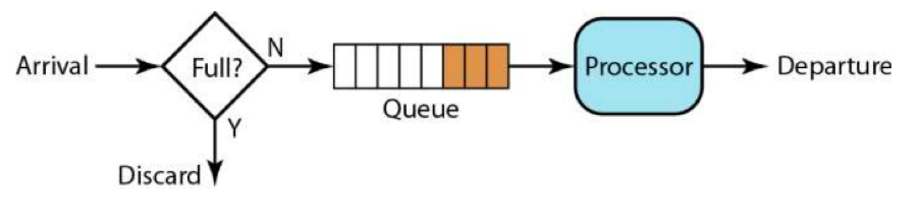

在上面这个 FIFO 的队列上，我们可以扩展出一些别的玩法。

一个是有优先级的队列，处理时先处理高优先级的队列，然后再处理低优先级的队列。 如下图所示，只有高优先级的队列被处理完成后，才会处理低优先级的队列。

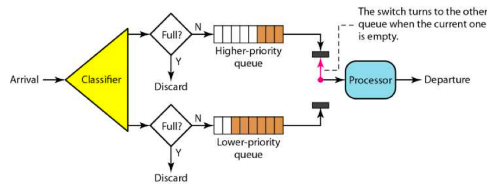

有优先级的队列可能会导致低优先级队列长时间得不到处理。为了避免低优先级的队列被饿死，一般来说是分配不同的比例的处理时间到不同的队列上，于是我们有了带权重的队列。

如下图所示。有三个队列的权重分布是 3:2:1，这意味着我们需要在权重为 3 的这个队列上处理3 个请求后，再去权重为 2 的队列上处理 2 个请求，最后再去权重为 1 的队列上处理 1 个请求，如此返复。

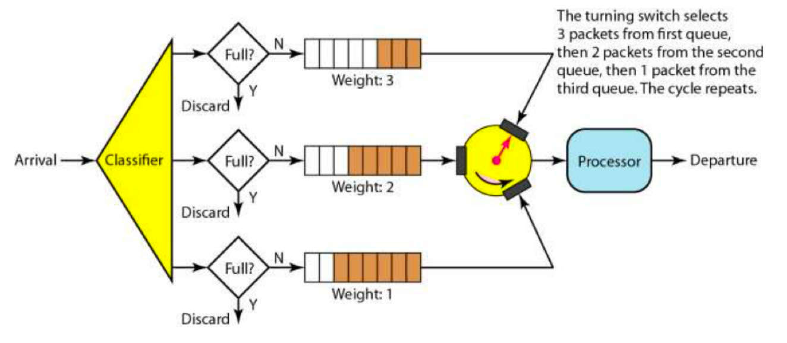

队列流控是以队列的的方式来处理请求。如果处理过慢，那么就会导致队列满，而开始触发限流。

但是，这样的算法需要用队列长度来控制流量，在配置上比较难以操作。如果队列过长，导致后端服务在队列没有满时就挂掉了。一般来说，这样的模型不能做 push 的，而是要做 pull 方式的会好一些。

##### 漏斗算法 Leaky Bucket

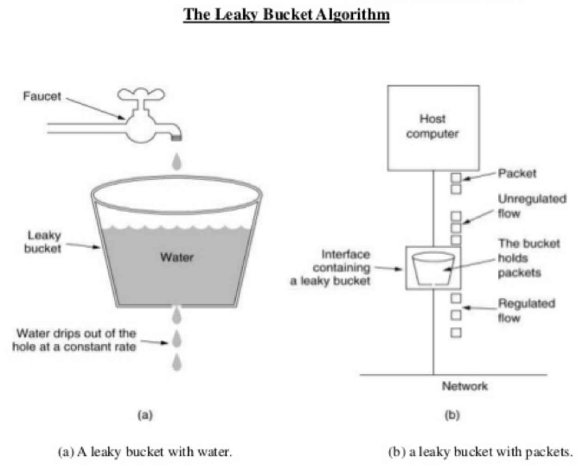

我们可以看到，就像一个漏斗一样，进来的水量就好像访问流量一样，而出去的水量就像是我们的系统处理请求一样。当访问流量过大时这个漏斗中就会积水，如果水太多了就会溢出。

一般来说，这个“漏斗”是用一个队列来实现的，当请求过多时，队列就会开始积压请求，如果队列满了，就会开拒绝请求。很多系统都有这样的设计，比如 TCP。当请求的数量过多时，就会有一个 sync backlog 的队列来缓冲请求，或是 TCP 的滑动窗口也是用于流控的队列。

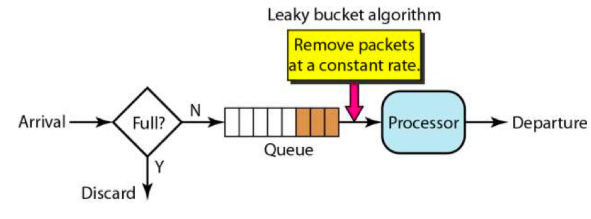

我们可以看到，漏斗算法其实就是在队列请求中加上一个限流器，来让 Processor 以一个均匀的速度处理请求。

##### 令牌桶算法 Token Bucket

关于令牌桶算法，主要是有一个中间人。在一个桶内按照一定的速率放入一些 token，然后，处理程序要处理请求时，需要拿到 token，才能处理；如果拿不到，则不处理。

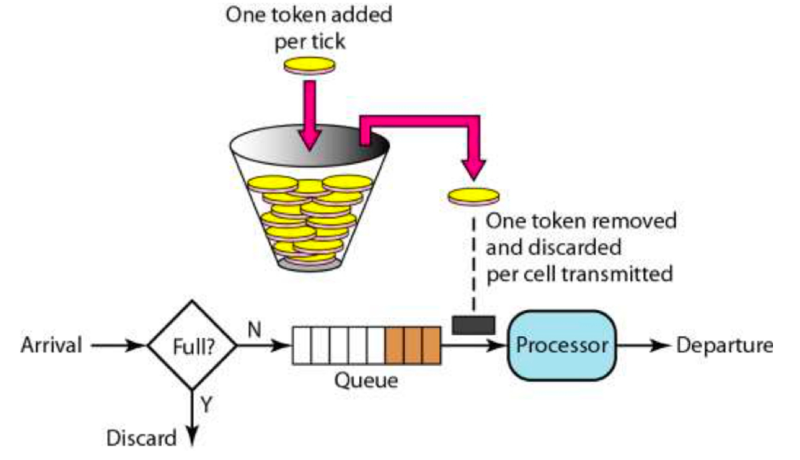

从理论上来说，令牌桶的算法和漏斗算法不一样的是，**漏斗算法中，处理请求是以一个常量和恒定**的速度处理的，而**令牌桶算法则是在流量小的时候“攒钱”**，流量大的时候，可以快速处理。

然而，我们可能会问，Processor 的处理速度因为有队列的存在，所以其总是能以最大处理能力来处理请求的，这也是我们所希望的方式。因此，令牌桶和漏斗都是受制于 Processor 的最大处理能力的。无论令牌桶里有多少令牌，也无论队列中还有多少请求。总之，Processor 在大流量来临时总是按照自己最大的处理能力来处理的。

但是，试想一下，如果我们的 Processor 只是一个非常简单的任务分配器，比如像 Nginx 这样的基本没有什么业务逻辑的网关，那么它的处理速度一定很快，不会有什么瓶颈，而其用来把请求转发给后端服务，那么在这种情况下，这两个算法就有不一样的情况了。

漏斗算法会以一个稳定的速度转发，而令牌桶算法平时流量不大时在“攒钱”，流量大时，可以一次发出队列里有的请求，而后就受到令牌桶的流控限制。

另外，令牌桶还可能做成第三方的一个服务，这样可以在分布式的系统中对全局进行流控，这也是一个很好的方式。

##### 基于响应时间的动态限流

上面的算法有个不好的地方，就是需要设置一个确定的限流值。这就要求我们每次发布服务时都做相应的性能测试，找到系统最大的性能值。

然而，在很多时候，我们却并不知道这个限流值，或是很难给出一个合适的值。其基本会有如下的一些因素：

- 实际情况下，很多服务会依赖于数据库。所以，不同的用户请求，会对不同的数据集进行操作。就算是相同的请求，可能数据集也不一样（比如，现在很多应用都会有一个时间线 Feed流，不同的用户关心的主题人人不一样，数据也不一样）。
  - 而且数据库的数据是在不断地变化的，可能前两天性能还行，因为数据量增加导致性能变差。在这种情况下，我们很难给出一个确定的一成不变的值，因为关系型数据库对于同一条 SQL 语句的执行时间其实是不可预测的（NoSQL 的就比 RDBMS 的可预测性要好）。
- 不同的 API 有不同的性能。我们要在线上为每一个 API 配置不同的限流值，这点太难配置，也很难管理。
- 而且，现在的服务都是能自动化伸缩的，不同大小的集群的性能也不一样，所以，在自动化伸缩的情况下，我们要动态地调整限流的阈值，这点太难做到了。

基于上述这些原因，我们的限流的值是很难被静态地设置成恒定的一个值。

我们想使用一种动态限流的方式。这种方式，不再设定一个特定的流控值，而是能够动态地感知系统的压力来自动化地限流。

**这方面设计的典范是 TCP 协议的拥塞控制的算法。**TCP 使用 RTT - Round Trip Time 来探测网络的延时和性能，从而设定相应的“滑动窗口”的大小，以让发送的速率和网络的性能相匹配。这个算法是非常精妙的，我们完全可以借鉴在我们的流控技术中。

我们记录下每次调用后端请求的响应时间，然后在一个时间区间内（比如，过去 10 秒）的请求计算一个响应时间的 P90 或 P99 值，也就是把过去 10 秒内的请求的响应时间排个序，然后看90% 或 99% 的位置是多少。

这样，我们就知道有多少请求大于某个响应时间。如果这个 P90 或 P99 超过我们设定的阈值，那么我们就自动限流。

这个设计中有几个要点：

- 你需要计算的一定时间内的 P90 或 P99。在有大量请求的情况下，这个非常地耗内存也非常地耗 CPU，因为需要对大量的数据进行排序。
  - 解决方案有两种，一种是不记录所有的请求，**采样**就好了，另一种是使用一个叫**蓄水池的近似算法**。关于这个算法这里我不就多说了，《编程珠玑》里讲过这个算法，你也可以自行 Google，英文叫 Reservoir Sampling。
- 这种动态流控需要像 TCP 那样，你需要记录一个当前的 QPS. 如果发现后端的 P90/P99 响应太慢，那么就可以把这个 QPS 减半，然后像 TCP 一样走慢启动的方式，直接到又开始变慢，然后减去 1/4 的 QPS，再慢启动，然后再减去 1/8 的 QPS……
  - 这个过程有点像个阻尼运行的过程，然后整个限流的流量会在一个值上下做小幅振动。这么做的目的是，如果后端扩容伸缩后性能变好，系统会自动适应后端的最大性能。
- 这种动态限流的方式实现起来并不容易。
  - [TCP 的那些事儿（下） | 酷 壳 - CoolShell](https://coolshell.cn/articles/11609.html)

#### 限流的设计要点

限流主要是有四个目的：

- 为了向用户承诺 SLA。我们保证我们的系统在某个速度下的响应时间以及可用性。
- 同时，也可以用来阻止在多租户的情况下，某一用户把资源耗尽而让所有的用户都无法访问的问题。
- 为了应对突发的流量。
- 节约成本。我们不会为了一个不常见的尖峰来把我们的系统扩容到最大的尺寸。而是在有限的资源下能够承受比较高的流量。

在设计上，我们还要有以下的考量：

- 限流应该是在架构的早期考虑。当架构形成后，限流不是很容易加入。
- 限流模块必需是非常好的性能，而且对流量的变化也是非常灵敏的，否则太过迟钝的限流，系统早因为过载而挂掉了。
- 限流应该有个手动的开关，这样在应急的时候，可以手动操作。
- 当限流发生时，应该有个监控事件通知。让我们知道有限流事件发生，这样，运维人员可以及时跟进。而且还可以自动化触发扩容或降级，以缓解系统压力。
- 当限流发生时，对于拒掉的请求，我们应该返回一个特定的限流错误码。这样，可以和其它错误区分开来。而客户端看到限流，可以调整发送速度，或是走重试机制。
- 限流应该让后端的服务感知到。限流发生时，我们应该在协议头中塞进一个标识，比如HTTP Header 中，放入一个限流的级别，告诉后端服务目前正在限流中。这样，后端服务可以根据这个标识决定是否做降级。

### 降级设计

所谓的降级设计（Degradation），**本质是为了解决资源不足和访问量过大的问题。**当资源和访问量出现矛盾的时候，在有限的资源内为了能够扛住大量的请求，我们就需要对我们的系统进行降级操作。也就是，**暂时牺牲掉一些东西，保障整个系统的平稳运行。**

一般来说，我们的降级需要牺牲掉的东西有：

- 降低一致性。从强一致性变成最终一致性。
- 停止次要功能。停止访问不重要的功能，从而释放出更多的资源。
- 简化功能。把一些功能简化掉，比如，简化业务流程，或是不再返回全量数据，只返回部分数据。

#### 降低一致性

我们要清楚地认识到，这世界上大多数系统并不是都需要强一致性的。对于降低一致性，把强一致性变成最终一致性的做法可以有效地释放资源，并且让系统运行得更快，从而可以扛住更大的流量。**一般来说，会有两种做法，一种是简化流程的一致性，一种是降低数据的一致性。**

#### 使用异步简化流程

举个例子，比如电商的下单交易系统，在强一致的情况下，需要结算账单，扣除库存，扣除账户上的余额（或发起支付），最后进行发货流程，这一系列的操作。

如果需要是强一致性的，那么就会非常慢。尤其是支付环节可能会涉及银行方面的接口性能，就像双 11 那样，银行方面出问题会导致支付不成功，而订单流程不能往下走。

在系统降级时，我们可以把这一系列的操作做成异步的，快束结算订单，不占库存，然后把在线支付降级成用户到付，这样就省去支付环节，然后批量处理用户的订单，向用户发货，用户货到付款。

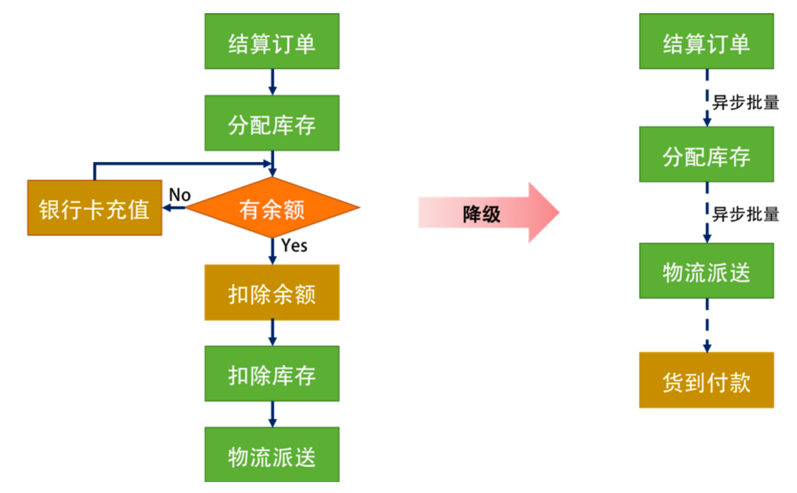

如上图所示，一开始需要的**全同步的方式，降级成了全异步的方式**，**库存从单笔强一致性也变成了多笔最终一致性**，如果库存不够了，就只能根据先来后到取消订单了。**而支付也从最开始的下单请求时的强一致性，变成了用户到付的最终一致性。**

一般来说，功能降级都有可能会损害用户的体验，所以，最好给出友好的用户提示。比如，“系统当前繁忙，您的订单已收到，我们正努力为您处理订单中，我们会尽快给您发送订单确认通知……还请见谅”诸如此类的提示信息。

#### 降低数据的一致性

降低数据的一致性一般来说会使用缓存的方式，或是直接就去掉数据。比如，在页面上不显示库存的具体数字，只显示有还是没有库存这两种状态。

对于缓存来说，可以有效地降低数据库的压力，把数据库的资源交给更重要的业务，这样就能让系统更快速地运行。

对于降级后的系统，不再通过数据库获取数据，而是通过缓存获取数据。关于缓存的设计模式，我在 CoolShell 中有一篇叫《缓存更新的套路》中讲述过缓存的几种更新模式，大家可以前往一读。在功能降级中，我们一般使用 Cache Aside 模式或是 Read Through 模式。也就是下图所示的这个策略。

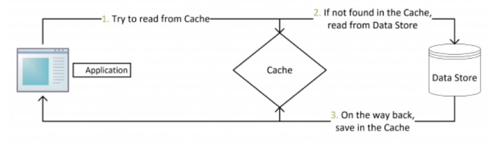

- 失效：应用程序先从 cache 取数据，没有得到，则从数据库中取数据，成功后，放到缓存中。
- 命中：应用程序从 cache 中取数据，取到后返回。
- 更新：先把数据存到数据库中，成功后，再让缓存失效

Read Through 模式就是在查询操作中更新缓存，也就是说，当缓存失效的时候（过期或 LRU换出），Cache Aside 是由调用方负责把数据加载入缓存，而 Read Through 则用缓存服务自己来加载，从而对应用方是透明的。

#### 停止次要的功能

停止次要的功能也是一种非常有用的策略。把一些不重要的功能给暂时停止掉，让系统释放出更多的资源来。比如，电商中的搜索功能，用户的评论功能，等等。等待访问的峰值过去后，我们再把这些功能给恢复回来。

当然，最好不要停止次要的功能，**首先可以限制次要的功能的流量**，或是把次要的功能退化成简单的功能，最后**如果量太大了，我们才会进入停止功能的状态。**

停止功能对用户会带来一些用户体验的问题，尤其是要停掉一些可能对于用户来说是非常重要的功能。所以，**如果可能，最好给用户一些补偿**，比如把用户切换到一个送积分卡，或是红包抽奖的网页上，有限地补偿一下用户。

#### 简化功能

关于功能的简化上，上面的下单流程中已经提到过相应的例子了。而且，从缓存中返回数据也是其中一个。这里再提一个，就是一般来说，一个 API 会有两个版本，一个版本返回全量数据，另一个版本只返回部分或最小的可用的数据。

举个例子，对于一个文章，一个 API 会把商品详情页或文章的内容和所有的评论都返回到前端。那么在降级的情况下，我们就只返回商品信息和文章内容，而不返回用户评论了，因为用户评论会涉及更多的数据库操作。

所以，这样可以释放更多的数据资源。而商品信息或文章信息可以放在缓存中，这样又能释放出更多的资源给交易系统这样的需要更多数据库资源的业务使用。

#### 降级设计的要点

- 对于降级，一般来说是要牺牲业务功能或是流程，以及一致性的。所以，我们需要对业务做非常仔细的梳理和分析。我们**很难通过不侵入业务的方式来做到功能降级。**
- 在设计降级的时候，需要清楚地**定义好降级的关键条件，比如，吞吐量过大、响应时间过慢、失败次数多过，有网络或是服务故障，等等**，然后做好相应的应急预案。这些预案最好是写成代码可以快速地自动化或半自动化执行的。
- 功能降级**需要梳理业务的功能**，哪些是 must-have 的功能，哪些是 nice-to-have 的功能；哪些是必需要死保的功能，哪些是可以牺牲的功能。而且需要在事前设计好可以简化的或是用来应急的业务流程。当系统出问题的时候，就需要走简化应急流程。
- 降级的时候，**需要牺牲掉一致性，或是一些业务流程**：对于读操作来说，使用缓存来解决，对于写操作来说，需要异步调用来解决。并且，我们需要以流水账的方式记录下来，这样方便对账，以免漏掉或是和正常的流程混淆。
- 对于**数据方面的降级，需要前端程序的配合**。一般来说，前端的程序可以根据后端传来的数据来决定展示哪些界面模块。比如，当前端收不到商品评论时，就不展示。为了区分本来就没有数据，还是因为降级了没有数据的两种情况，在协议头中也应该加上降级的标签。
- 因为降级的功能平时不会总是会发生，属于应急的情况，所以，降级的这些业务流程和功能有可能长期不用而出现 bug 或问题，对此，需要在**平时做一些演练**。

## 性能设计

### 缓存设计

缓存是提高性能最好的方式，一般来说，缓存有以下三种模式

- Cache Aside 更新模式
- Read/Write Through 更新模式
- Read Through
- Write Through
- Write Behind Caching 更新模式
- 

#### Cache Aside 更新模式

这是最常用的设计模式了，其具体逻辑如下：

- 失效：应用程序先从 cache 取数据，没有得到，则从数据库中取数据，成功后，放到缓存中。
- 命中：应用程序从 cache 中取数据，取到后返回。
- 更新：先把数据存到数据库中，成功后，再让缓存失效。
  - 为什么不是更新缓存，是为了避免并发问题。

有极小的概率还是会因为并发，产生脏数据：

比如，一个是读操作，但是没有命中缓存，就会到数据库中取数据。而此时来了一个写操作，写完数据库后，让缓存失效，然后**之前的那个读操作再把老的数据放进去**，所以会造成脏数据。

产生的概率非常小：这个条件需要发生在**读缓存时**缓存失效，而且**有一个并发的写操作**。实际上**数据库的写操作会比读操作慢得多**，而且还要锁表，而**读操作必需在写操作前进入数据库操作，又要晚于写操作更新缓存**，所有这些条件都具备的概率并不大。

#### Read/Write Through 更新模式

我们可以看到，在上面的 Cache Aside 套路中，应用代码需要维护两个数据存储，一个是缓存（cache），一个是数据库（repository）。所以，应用程序比较啰嗦。而 Read/WriteThrough 套路是把更新数据库（repository）的操作由缓存自己代理了，所以，对于应用层来说，就简单很多了。可以理解为，应用认为后端就是一个单一的存储，而**存储自己维护自己的Cache。**

#### Read Through

Read Through 套路就是**在查询操作中更新缓存**，也就是说，当缓存失效的时候（过期或 LRU换出），Cache Aside 是由调用方负责把数据加载入缓存，而 **Read Through 则用缓存服务自己来加载**，从而对应用方是透明的。

#### Write Through

Write Through 套路和 Read Through 相仿，不过是**在更新数据时发生**。当有数据更新的时候，如果**没有命中缓存，直接更新数据库**，然后返回。如果**命中了缓存，则更新缓存，然后由Cache 自己更新数据库**（这是一个同步操作）。

#### Write Behind Caching 更新模式

Write Behind 又叫 Write Back。一些了解 Linux 操作系统内核的同学对 write back 应该非常熟悉，这不就是 Linux 文件系统的 page cache 算法吗？是的，你看基础知识全都是相通的。所以，基础很重要，我已经说过不止一次了。

Write Back 套路就是，在**更新数据的时候，只更新缓存，不更新数据库**，而我们的**缓存会异步地批量更新数据库**。这个设计的好处就是让数据的 I/O 操作飞快无比（因为直接操作内存嘛）。**因为异步**，Write Back 还可以**合并对同一个数据的多次操作**，所以性能的提高是相当可观的。

但其**带来的问题是，数据不是强一致性的**，而且可能会丢失（我们知道 Unix/Linux 非正常关机会导致数据丢失，就是因为这个事）。在软件设计上，我们基本上不可能做出一个没有缺陷的设计，就像算法设计中的时间换空间、空间换时间一个道理。有时候，**强一致性和高性能，高可用和高性能是有冲突的**。软件设计从来都是 trade-off（取舍）。

另外，Write Back 实现逻辑比较复杂，因为它需要 track 有哪些数据是被更新了的，需要刷到持久层上。操作系统的 Write Back 会在仅当这个 cache 需要失效的时候，才会把它真正持久起来。比如，内存不够了，或是进程退出了等情况，这又叫 lazy write。

#### 缓存设计的重点

缓存更新的模式基本如前面所说，不过这还没完，缓存已经成为高并发高性能架构的一个关键组件了。现在，很多公司都在用 Redis 来搭建他们的缓存系统。一方面是因为 Redis 的数据结构比较丰富。另一方面，我们不能在 Service 内放 local cache，一是每台机器的内存不够大，二是我们的 Service 有多个实例，负载均衡器会把请求随机分布到不同的实例。缓存需要在所有的Service 实例上都建好，这让我们的 Service 有了状态，更难管理了。

所以，在分布式架构下，一般都**需要一个外部的缓存集群。**关于这个缓存集群，你需要保证的是**内存要足够大，网络带宽也要好**，因为缓存本质上是个内存和 IO 密集型的应用。

另外，如果需要内存很大，那么你还要**动用数据分片技术来把不同的缓存分布到不同的机器上。**这样，可以保证我们的缓存集群可以不断地 scale 下去。关于数据分片的事，我会在后面讲述。

**缓存的好坏要看命中率。**缓存的命中率高说明缓存有效，一般来说命中率到 80% 以上就算很高了。当然，有的网络为了追求更高的性能，要做到 95% 以上，甚至可能会把数据库里的**数据几乎全部装进缓存中。这当然是不必要的，也是没有效率的**，因为通常来说，热点数据只会是少数。

另外，**缓存是通过牺牲强一致性来提高性能的**，这世上任何事情都不是免费的，所以并不是所有的业务都适合用缓存，这需要在设计的时候仔细调研好需求。使用缓存提高性能，就是会有数据更新的延迟。

**缓存数据的时间周期也需要好好设计，太长太短都不好**，过期期限不宜太短，因为可能导致应用程序不断从数据存储检索数据并将其添加到缓存。同样，过期期限不宜太长，因为这会导致一些没人访问的数据还在内存中不过期，而浪费内存。

**使用缓存的时候，一般会使用 LRU 策略。**也就是说，当内存不够需要有数据被清出内存时，会找最不活跃的数据清除。所谓最不活跃的意思是最长时间没有被访问过了。所以，开启 LRU 策略会让缓存在每个数据访问的时候把其调到前面，而要淘汰数据时，就从最后面开始淘汰。

于是，对于 LRU 的缓存系统来说，其需要在 key-value 这样的非顺序的数据结构中维护一个顺序的数据结构，并在读缓存时，需要改变被访问数据在顺序结构中的排位。于是，我们的 LRU在读写时都需要加锁（除非是单线程无并发），因此 **LRU 可能会导致更慢的缓存存取的时间。这点要小心。**

最后，我们的世界是比较复杂的，很多网站都会被爬虫爬，要小心这些爬虫。因为这些爬虫可能会爬到一些很**古老的数据**，而程序会把这些数据加入到缓存中去，而**导致缓存中那些真实的热点数据被挤出去**（因为机器的速度足够快）。对此，一般来说，我们需要有一个爬虫保护机制，或是我们引导这些人去使用我们提供的外部 API。在那边，我们可以有针对性地做多租户的缓存系统（也就是说，**把用户和第三方开发者的缓存系统分离开来**）。

### 异步处理设计

在弹力设计篇中我们讲过，异步通讯的设计模式有助于**提高系统的稳定性和容错能力**。其实，异步通讯在分布式系统中还可以**增加整个系统的吞吐量**，从而可以面对更高的并发，并可以更多地利用好现有的系统资源。

异步系统所带来的好处——让我们的系统可以统一调度。

另外，我举上面这两个例子是想告诉你，我们可能会觉得异步通讯慢，其实并不然，我们同样也可以把异步做得比较实时。

多说一句，就算是有延时，异步处理在用户体验上也可以给用户带来一个不错的用户体验，那就是用户可以有机会反悔之前的操作。

#### 异步处理的设计

之前，我们在弹力设计中讲的是异步通讯，这里，我们想讲的是异步任务处理。当然，这里面没有什么冲突的，只不过是，**异步通讯讲的是怎么把系统连接起来，而我们这里想讲的是怎么处理任务。**

首先，我们**需要一个前台系统，把用户发来的请求一一记录下来。**这有点像请求日志。这样，我们的操作在数据库或是存储上只会有追加的操作，性能会很高。我们收到请求后，给客户端返回" 收到请求，正在处理中 "。

然后，我们有个**任务处理系统来真正地处理收到的这些请求。**为了解耦，我们需要一个任务派发器，这里就会出来两个事，一个是推模型 Push，一个是拉模型 Pull。

所谓 Push 推模型，就是把任务派发给相应的人去处理，有点像是一个工头的调度者的角色。而Pull 拉模型，则是由处理的人来拉取任务处理。这两种模型各有各的好坏。一般来说，Push 模型可以做调度，但是它需要知道下游工作结点的情况。

除了要知道哪些是活着的，还要知道它们的忙闲程度。这样一来，当下游工作结点扩容缩容或是有故障需要维护等一些情况发生时，Push 结点都需要知道，这会增加一定的系统复杂度。而Pull 的好处则是可以让上游结点不用关心下游结点的状态，只要自己忙得过来，就会来拿任务处理，这样可以减少一定的复杂度，但是少了整体任务调度。

**一般来说，我们构建的都是推拉结合的系统**，Push 端会做一定的任务调度，比如它可以像物流那样把相同商品的订单都合并起来，打成一个包，交给下游系统让其一次处理掉；也可以把同一个用户的订单中的不同商品给拆成多个订单。然后 Pull 端来订阅 Push 端发出来的异步消息，处理相应的任务。

#### 事件溯源

在这里，我们需要提一下 Event Sourcing（事件溯源）这个设计模式。

所谓 Event Sourcing，其主要想解决的问题是，我们可以看到数据库中的一个数据的值（状态），但我们完全不知道这个值是怎么得出来的。就像银行的存折一样，我们可以在银行的存折看到我们收支的所有记录，也能看得到每一笔记录后的余额。

当然，如果我们有了所有的收支流水账的记录，我们完全不需要保存余额，因为我们只需要回放一下所有的收支事件，就可以得到最终的数据状态。这样一来，我们的系统就会变得非常简单，只需要追加不可修改的数据操作事件，而不是保存最终状态。除了可以提高性能和响应时间之外，还可以提供事务数据一致性，并保留了可以启用补偿操作的完整记录和历史记录。

还有一个好处，就是如果我们的代码里有了 bug，在记录状态的系统里，我们修改 bug 后还需要做数据修正。然而，在 Event Sourcing 的系统里，我们只需要把所有事件重新播放一遍就好了，因为整个系统没有状态了。

事件不可变，并且可使用只追加操作进行存储。 用户界面、工作流或启动事件的进程可继续，处理事件的任务可在后台异步运行。 此外，处理事务期间不存在争用，这两点可极大提高应用程序的性能和可伸缩性。

事件是描述已发生操作的简单对象以及描述事件代表的操作所需的相关数据。 事件不会直接更新数据存储，只会对事件进行记录，以便在合适的时间进行处理。 这可简化实施和管理。

事件溯源不需要直接更新数据存储中的对象，因而有助于防止并发更新造成冲突。

最重要的是，**异步处理 + 事件溯源的方式，可以很好地让我们的整个系统进行任务的统筹安排、批量处理，可以让整体处理过程达到性能和资源的最大化利用。**

#### 异步处理的分布式事务

是的，你可以看到，我们的现实世界中有很多这样先付钱，拿小票去领货的场景，也有先消费，然后拿一个账单去付钱的场景。总之，完全不需要两阶段提交这种方式。我们完全可以使用异步的方式来达到一致性，当然，是最终一致性。

要达到最终一致性，我们需要有个交易凭证。也就是说，如果一个事务需要做 A 和 B 两件事，比如，把我的钱转给我的朋友，首先先做扣钱交易，然后，记录下扣钱的凭证，拿这个凭证去给我朋友的账号上加钱。

在达成这个事务的过程中，有几点需要注意。

- 凭证需要非常好地保存起来，不然会导致事务做不下去。
- 凭证处理的幂等性问题，不然在重试时就会出现多次交易的情况。
- 如果事务完成不了，需要做补偿事务处理。

#### 异步处理的设计要点

异步处理中的**事件驱动**和**事件溯源**是两个比较关键的技术。

异步处理可能会因为一些故障导致我们的一些任务没有被处理，比如消息丢失，没有通知到，或通知到了，没有处理。有这一系列的问题，**异步通知的方式需要任务处理方处理完成后，给任务发起方回传状态，这样确保不会有漏掉的。**

另外，发起方也需要有个定时任务，**把一些超时没有回传状态的任务再重新做**一遍，你可以认为这是异步系统中的 " 对账 " 功能。当然，如果要重做的话，就**需要处理方支持幂等性处理**。

**异步处理的整体业务事务问题**，也就是说，异步处理在处理任务的时候，并不知道能否处理成功，于是其会一步一步地处理，如果到最后一步不能成功，那么你就需要回滚。这个时候，**需要走我们在弹力设计中说的补偿事务的流程。**

并不是所有的业务都可以用异步的方式，比如一些**需要强一致性的业务，使用异步的方式可能就不适合**，这里需要我们小心地分析业务。我相信绝大多数的业务场景都用不到强一致性，包括银行业务。另外，在需要性能的时候，需要牺牲强一致性，变为最终一致性。

在运维时，我们要**监控任务队列里的任务积压情况**。如果有任务积压了，要能做到快速地扩容。如果不能扩容，而且任务积压太多，可能会导致整个系统挂掉，那么就要开始对前端流量进行限流。

最后，还想强调一下，**异步处理系统的本质是把被动的任务处理变成主动的任务处理，其本质是在对任务进行调度和统筹管理**。

### 数据库扩展

#### 读写分离 CQRS

读写分离是数据库扩展最简单实用的玩法了，这种方法**针对读多写少的业务场景还是很管用的，而且还可以有效地把业务做相应的隔离。**

如下图所示，数据库只有一个写库，有两个读库，所有的服务都写一个数据库。对于读操作来说，服务 A 和服务 B 走从库 A，服务 D 和服务 E 走从库 B，服务 C 在从库 A 和从库 B 间做轮询。

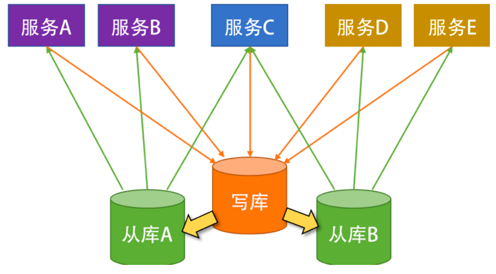

这样的方法好处是：

- 比较容易实现。数据库的 master-slave 的配置和服务框架里的读写分离都比较成熟，应用起来也很快。
- 可以很好地把各个业务隔离开来。不会因为一个业务把数据库拖死而导致所有的业务都死掉。
- 可以很好地分担数据库的读负载，毕竟读操作是最耗数据库 CPU 的操作。

这样的方法不好的地方是：

- 写库有单点故障问题。如果是写库出了性能问题，那么所有的业务一样不可用。对于交易型的业务，要得到高的写操作速度，这样的方式不行。
- 数据库同步不实时，需要强一致性的读写操作还是需要落在写库上。

综上所述，一般来说，这样的玩法主要是为了减少读操作的压力。我们还是为之找一个更靠谱的设计——CQRS。

CQRS 全称 Command and Query Responsibility Segregation，也就是**命令与查询职责分离。**其原理是，**用户对于一个应用的操作可以分成两种**，一种是 Command 也就是我们的**写操作（增，删，改）**，另一种是 **Query 操作（查）**，也就是读操作。Query 操作基本上是在做数据整合显现，而 Command 操作这边会有更重的业务逻辑。分离开这两种操作**可以在语义上做好区分。**

- 命令 Command **不会返回结果数据**，只会**返回执行状态**，但会**改变数据**。
- 查询 Query 会**返回结果数据**，但是**不会改变数据**，**对系统没有副作用**。

这样一来，可以带来一些好处：

- **分工明确**，可以负责不同的部分。
- 将业务上的命令和查询的**职责分离**，能够提高系统的性能、可扩展性和安全性。并且在系统的**演化中能够保持高度的灵活性**，能够防止出现 CRUD 模式中，对查询或者修改中的某一方进行改动，导致另一方出现问题的情况。
- **逻辑清晰**，**能够看到**系统中的**哪些行为或者操作导致了系统的状态变化**。
- 可以从**数据驱动**（Data-Driven）**转到**任务驱动（Task-Driven）以及**事件驱动**。

如果把 Command 操作变成 Event Sourcing，那么只需要记录不可修改的事件，并通过回溯事件得到数据的状态。于是，我们可以把写操作给完全简化掉，也变成无状态的，这样可以大幅度降低整个系统的副作用，并可以得到更大的并发和性能。

文本中有 Event Sourcing 和 CQRS 的架构示意图。

相当于就是命令请求调用时，把这个事件保存起来，然后异步调度这个事件去完成命令的写任务。查询请求调用时，在事件执行完成的结果表中直接返回结果。

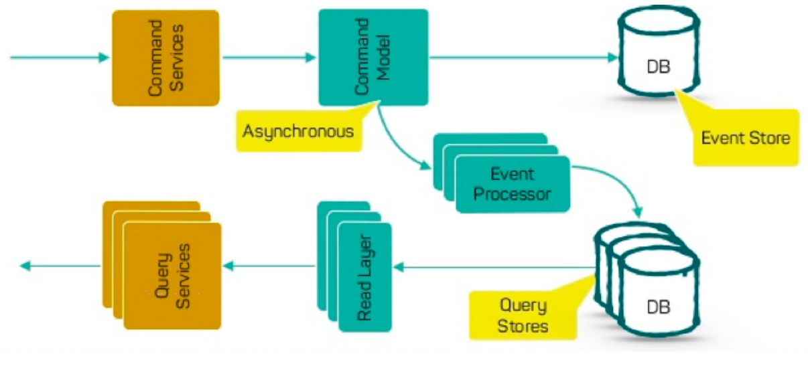

#### 分库分表 Sharding

一般来说，影响数据库最大的性能问题有两个，一个是对数据库的操作，一个是数据库中数据的大小。

对于前者，我们需要从业务上来优化。一方面，简化业务，不要在数据库上做太多的关联查询，而对于一些更为复杂的用于做报表或是搜索的数据库操作，应该把其移到更适合的地方。比如，用 ElasticSearch 来做查询，用 Hadoop 或别的数据分析软件来做报表分析。

对于后者，如果数据库里的数据越来越多，那么也会影响我们的数据操作。而且，对于我们的分布式系统来说，后端服务都可以做成分布式的，而数据库最好也是可以拆开成分布式的。读写分离也因为数据库里的数据太多而变慢，于是，分库分表就成了我们必须用的手段。

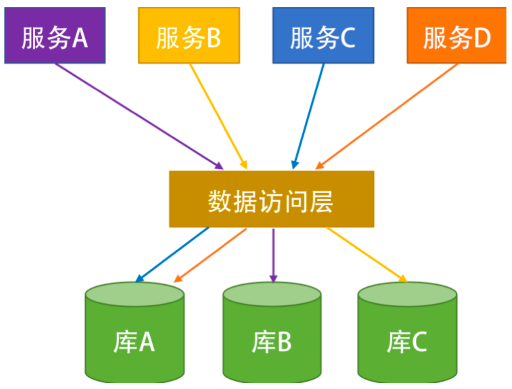

为了避免数据访问层（需要处理跨库的查询和事务等问题）的麻烦，分片策略一般如下：

- 按**多租户**的方式。用租户 ID 来分，这样可以把租户隔离开来。比如：一个电商平台的商家中心可以按商家的 ID 来分。
- 按**数据的种类**来分。比如，一个电商平台的商品库可以按类目来分，或是商家按地域来分。
- 通过**范围**来分。这样分片，可以保证在**同一分片中的数据是连续的**，于是我们数据库操作，比如分页查询会更高效一些。一般来说，大多数情况是用时间来分片的，比如，一个电商平台的订单中心是按月份来分表的，这样可以快速检索和统计一段连续的数据。
- 通过**哈希散列算法**来分（比如：主键 id % 3 之类的算法。）此策略的目的是降低形成热点的可能性（接收不成比例的负载的分片）。但是，这会带来**两个问题**，一个就是前面所说的**跨库跨表的查询和事务**问题，另一个就是如果要扩容需要重新哈希部分或全部数据

上面是最常见的分片模式，但是你还应考虑应用程序的业务要求及其数据使用模式。这里请注意几个非常关键的事宜：

- 数据库分片**必须考虑业务**，从业务的角度入手，而不是从技术的角度入手，如果你不清楚业务，那么无法做出好的分片策略。
- **请只考虑业务分片。请不要走哈希散列的分片方式**，除非有个人拿着把刀把你逼到墙角，你马上就有生命危险，你才能走哈希散列的分片方式。

#### 数据库扩展的设计重点

首先，你需要把数据库和应用服务一同拆开。也就是说，一个服务一个库，这就是微服务的玩法。这样一来，你的数据库就会被 " 天生地 " 给拆成服务化的，而不是一个单体的库。

**在一个单体的库上做读写分离或是做分片都是一件治标不治本的事**，真正治本的方法就是要**数据库要和服务一起拆解**。当数据库也服务化后，我们才会在这个小的服务数据库上进行读写分离或分片的方式来获得更多的性能和吞吐量。这是整个设计模式的原则——**先做服务化拆分，再做分片。**

对于分片来说，有两种分片模式，一种是水平分片，一种是垂直分片。水平分片就是我们之前说的那种分片。而**垂直分片是把一张表中的一些字段放到一张表中，另一些字段放到另一张表中**。垂直分片主要是把一些经常修改的数据和不经常修改的数据给分离开来，这样在修改某个字段的数据时，不会导致其它字段的数据被锁而影响性能。比如，对于电商系统来说，商品的描述信息不常改，但是商品的库存和价格经常改，所以，可以把描述信息和库存价格分成两张表，这样可以让商品的描述信息的查询更快。

我们所说的 sharding 更多的是说水平分片。水平分片需要有以下一些注意事项：

- 随着数据库中数据的变化，我们有可能需要定期重新平衡分片，以保证均匀分布并降低形成热点的可能性。 但是，重新平衡是一项昂贵的操作。 若要**减少重新平衡的频率**，我们需要通过确保每个分片包含足够的可用空间来处理未来一段时间的变化。 另外，我们还需要**开发用于快速重新平衡分片的工具和脚本**。
- 分片是静态的，而数据的访问则是不可预期的，可能会需要经常性地调整我们的分片，这样一来成本太高。所以，我们**最好使用一个索引表的方式来进行分片**。也就是说，把我们数据的索引动态地记录在一个索引表中。这样一来，我们就可以非常灵活地调度我们的数据了。当数据调度到另一台结点上时，我们只需要去索引表里改一下这个数据的位置就好了。**能够灵活应对调度的数据。**
- 如果程序必须要从多个分片检索数据的查询，则可以使用**并行任务从各个分片上提取此数据，然后聚合到单个结果中**。 但是，此方法不可避免地会在一定程度上增加解决方案数据访问逻辑的复杂性。
- 数据分片后，我们很难在分片之间保持引用完整性和一致性，也就是所谓的跨分片的事务，因此应尽量减少会影响多个分片中的数据的操作。如果应用程序必须**跨分片修改数据，那么我们需要评估一致性以及评估是否采用两阶段提交的方式。**
- **配置和管理大量分片可能是一个挑战**。在做相应的变更时，一定要先从生产线上拉出数据，然后根据数据计划好新的分片方式，并做好相当的测试工作。否则，这个事出了问题会是一个灾难性的问题。

### 秒杀设计

#### 秒杀的流程

先从用户或是产品的角度来看一下，秒杀的流程是什么样的：

- 首先，你需要一个秒杀的 landing page，在这个秒杀页上有一个倒计时的按钮。
- 一旦这个倒计时的时间到了，按钮就被点亮，让你可以点击按钮下单。
- 一般来说下单时需要你填一个校验码，以防止是机器来抢。

从技术上来说，这个倒计时按钮上的时间和按钮可以被点击的时间是需要后台服务器来校准的，这意味着：

- 前端页面要不断地向后端来请求，开没开始，开没开始……
- 每次询问的时候，后端都会给前端一个时间，以校准前端的时间。
- 一旦后端服务器表示 OK 可以开始，后端服务会返回一个 URL。
- 这个 URL 会被安置在那个按钮上，就可以点击了。
- 点击后，如果抢到了库存，就进入支付页面，如果没有则返回秒杀已结束。

#### 秒杀的技术挑战

- 怎么应对这 100 万人同时下单请求。
- 请求都是针对一个单点数据，压力很大。

#### 秒杀的解决方案

- CDN分流（适合演唱会门票这种单点秒杀，不适合火车票这种分散的大流量）
  - 利用CDN处理来自前端的查询秒杀是否开启的请求。在此期间还可以统计总数，做一个概率的预判，让每个请求有一定概率请求到秒杀业务服务器。
  - 也可以理解成用CDN来限流，限流的策略多种多样。
- 预售抽签
  - 提前收集用户的购买意愿，尽可能的安排商品或者进行抽签。

### 边缘计算

