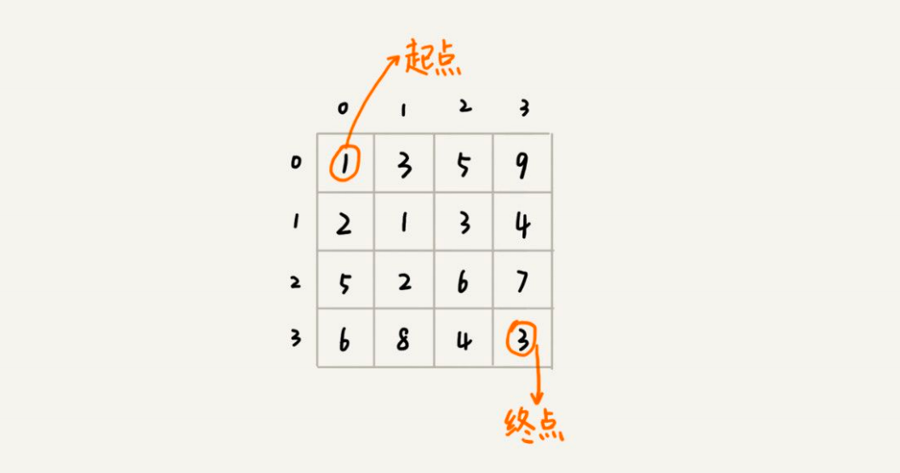
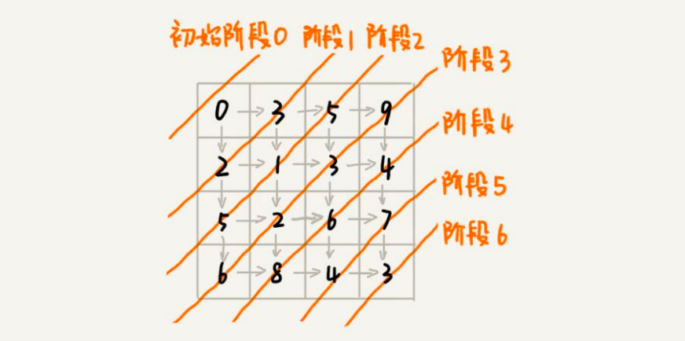
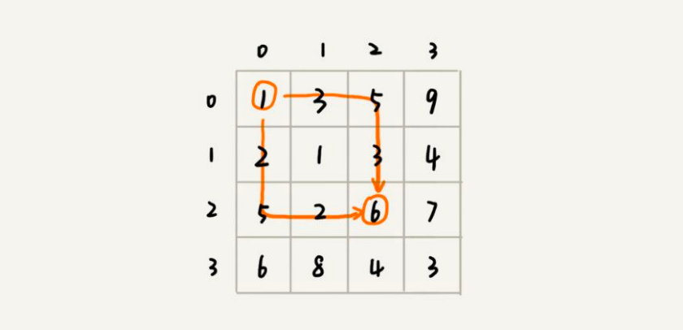
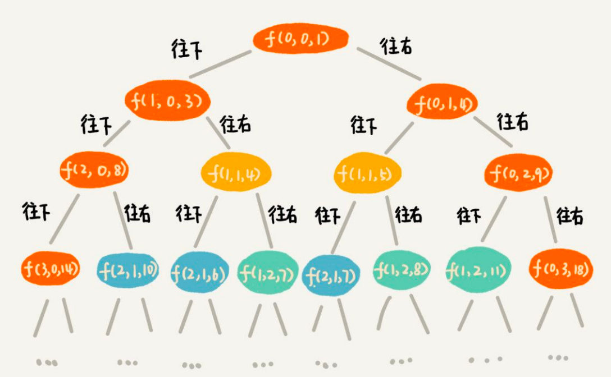
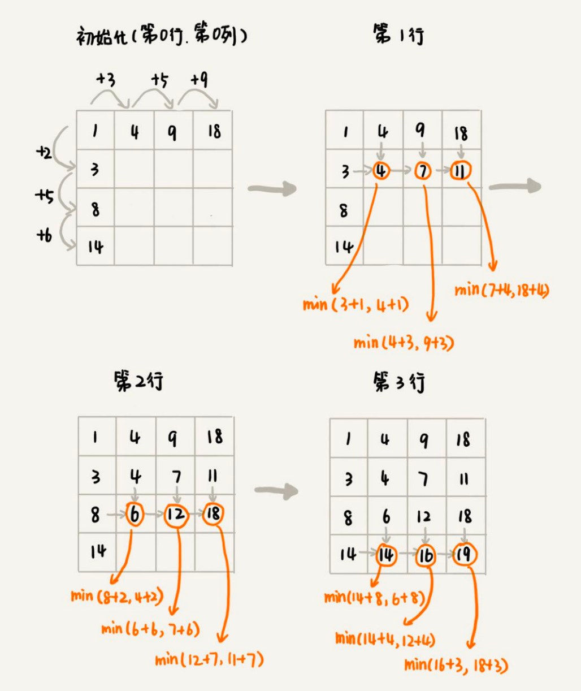

## 动态规划理论：一个模型三个特征

### 理论

一个模型：指的是动态规划适合解决的问题的模型。我把这个模型定义为“多阶段决策最优解模型”。

三个特征：

1. 最优子结构

   1. 问题的最优解包含子问题的最优解。反过来说就是，我们可以通过子问题的最优解，推导出问题的最优解。

2. 无后效性

   1. 有两层含义，

      1. 第一层含义是，在推导后面阶段的状态的时候，我们只关心前面阶段的状态值，不关心这个状态是怎么一步一步推导出来的。
      2. 第二层含义是，某阶段状态一旦确定，就不受之后阶段的决策影响。

   2. 无后效性是一个非常“宽松”的要求。只要满足前面提到的动态规划问题模

      型，其实基本上都会满足无后效性。

3. 重复子问题。

   1. 不同的决策序列，到达某个相同的阶段时，可能会产生重复的状态。

### 实例剖析

假设我们有一个n乘以n的矩阵w[n][n]。矩阵存储的都是正整数。棋子起始位置在左上角，终止位置在右下角。我们将棋子从左上角移动到右下角。每次只能向右或者向下移动一位。从左上角到右下角，会有很多不同的路径可以走。我们把每条路径经过的数字加起来看作路径的长度。那从左上角移动到右下角的最短路径长度是多少呢？

#### 是否符合一个模型

从(0, 0)走到(n-1, n-1)，总共要走2*(n-1)步，也就对应着2*(n-1)个阶段。每个阶段都有向右走或者向下走两种决策，并且每个阶段都会对应一个状态集合。

我们把状态定义为min_dist(i, j)，其中i表示行，j表示列。min_dist表达式的值表示从(0, 0)到达(i, j)的最短路径长度。所以，这个问题是一个多阶段决策最优解问题，符合动态规划的模型。

我们把状态定义为min_dist(i, j)，其中i表示行，j表示列。min_dist表达式的值表示从(0, 0)到达(i, j)的最短路径长度。所以，这个问题是一个多阶段决策最优解问题，符合动态规划的模型。

#### 是否符合三个特征

我们可以用回溯算法来解决这个问题。如果你自己写一下代码，画一下递归树，就会发现，递归树中有重复的节点。**重复的节点表示，从左上角到节点对应的位置，有多种路线，这也能说明这个问题中存在重复子问题。**

如果我们走到(i, j)这个位置，我们只能通过(i-1, j)，(i, j-1)这两个位置移动过来，也就是说，我们**想要计算(i, j)位置对应的状态，只需要关心(i-1, j)，(i, j-1)两个位置对应的状态，**并不关心棋子是通过什么样的路线到达这两个位置的。而且，**我们仅仅允许往下和往右移动，不允许后退，所以，前面阶段的状态确定之后，不会被后面阶段的决策所改变，所以，这个问题符合“无后效性”这一特征。**

我们把从起始位置(0, 0)到(i, j)的最小路径，记作min_dist(i, j)。因为我们只能往右或往下移动，所以，我们只有可能从(i, j-1)或者(i-1, j)两个位置到达(i, j)。也就是说，到达(i, j)的最短路径要么经过(i, j-1)，要么经过(i-1, j)，而且到达(i, j)的最短路径肯定包含到达这两个位置的最短路径之一。换句话说就是，min_dist(i, j)可以通过min_dist(i, j-1)和min_dist(i-1, j)两个状态推导出来。这就说明，这个问题符合“最优子结构“

~~~bash
min_dist(i, j) = w[i][j] + min(min_dist(i, j-1), min_dist(i-1, j))
~~~

### 两种动态规划解题思路

解决动态规划问题，一般有两种思路。我把它们分别叫作，状态转移表法和状态转移方程法。

#### 状态转移表法

一般能用动态规划解决的问题，都可以使用回溯算法的暴力搜索解决。从递归树中，我们很容易可以看出来，是否存在重复子问题，以及重复子问题是如何产生的。以此来寻找规律，看是否能用动态规划解决。

找到重复子问题之后，接下来，我们有两种处理思路，第一种是直接用**回溯加“备忘录”**的方法，来避免重复子问题。从执行效率上来讲，这跟动态规划的解决思路没有差别。第二种是使用**动态规划的解决方法，状态转移表法**。我们重点来看状态转移表法是如何工作的。

我们先画出一个状态表。状态表一般都是二维的，所以你可以把它想象成二维数组。其中，**每个状态包含三个变量，行、列、数组值。**我们根据决策的先后过程，从前往后，根据递推关系，分阶段填充状态表中的每个状态。最后，我们将这个递推填表的过程，翻译成代码，就是动态规划代码了。

但是如果问题的状态比较复杂，需要很多变量来表示，那对应的状态表可能就是高维的，比如**三维、四维。那这个时候，我们就不适合用状态转移表法来解决了。**一方面是因为高维状态转移表不好画图表示，另一方面是因为人脑确实很不擅长思考高维的东西。

##### 回溯加备忘录

如果用回溯算法：

~~~java
private int minDist = Integer.MAX_VALUE; // 全局变量或者成员变量
// 调用方式：minDistBacktracing(0, 0, 0, w, n);
public void minDistBT(int i, int j, int dist, int[][] w, int n) {
 // 到达了n-1, n-1这个位置了，这里看着有点奇怪哈，你自己举个例子看下
 if (i == n && j == n) {
 if (dist < minDist) minDist = dist;
 return;
 }
 if (i < n) { // 往下走，更新i=i+1, j=j
 minDistBT(i + 1, j, dist+w[i][j], w, n);
 }
 if (j < n) { // 往右走，更新i=i, j=j+1
 minDistBT(i, j+1, dist+w[i][j], w, n);
 }
}
~~~

然后画出递归树，以此来寻找重复子问题。在递归树中，**一个状态（也就是一个节点）包含三个变量(i, j, dist)**，其中i，j分别表示行和列，dist表示从起点到达(i, j)的路径长度。从图中，我们看出，尽管(i, j, dist)不存在重复的，但是**(i, j)重复的有很多。对于(i, j)重复的节点，我们只需要选择dist最小的节点**，继续递归求解，其他节点就可以舍弃了。

##### 状态转移表法

既然存在重复子问题，我们就可以尝试看下，是否可以用动态规划来解决呢？

我们画出一个二维状态表，表中的**行、列表示棋子所在的位置**，表中的**数值表示从起点到这个位置的最短路径**。我们按照决策过程，通过不断状态递推演进，将状态表填好。为了方便代码实现，我们按行来进行依次填充。

弄懂了填表的过程，代码实现就简单多了。我们将上面的过程，翻译成代码，就是下面这个样子。

~~~java
public int minDistDP(int[][] matrix, int n) {
 int[][] states = new int[n][n];
 int sum = 0;
 for (int j = 0; j < n; ++j) { // 初始化states的第一行数据
 sum += matrix[0][j];
 states[0][j] = sum;
 }
 sum = 0;
 for (int i = 0; i < n; ++i) { // 初始化states的第一列数据
 sum += matrix[i][0];
 states[i][0] = sum;
 }
 for (int i = 1; i < n; ++i) {
 for (int j = 1; j < n; ++j) {
 states[i][j] = 
 matrix[i][j] + Math.min(states[i][j-1], states[i-1][j]);
 }
 }
 return states[n-1][n-1];
}
~~~

#### 状态转移方程法

状态转移方程法有点类似递归的解题思路。我们需要分析，某个问题如何通过子问题来递归求解，也就是所谓的最优子结构。根据最优子结构，**写出递归公式，也就是所谓的状态转移方程。有了状态转移方程，代码实现就非常简单了。**一般情况下，我们有两种代码实现方法，一种是**递归加“备忘录”**，另一种是**迭代递推**。

~~~java
min_dist(i, j) = w[i][j] + min(min_dist(i, j-1), min_dist(i-1, j))
~~~

##### 递归加“备忘录”

用递归加“备忘录”的方式，将状态转移方程翻译成来代码。

~~~java
private int[][] matrix = 
 {{1，3，5，9}, {2，1，3，4}，{5，2，6，7}，{6，8，4，3}};
private int n = 4;
// 记录到这个点的最小路径
private int[][] mem = new int[4][4];
public int minDist(int i, int j) { // 调用minDist(n-1, n-1);
 if (i == 0 && j == 0) return matrix[0][0];
 // 如果当前节点几率过最小路径，则直接返回最小路径
 if (mem[i][j] > 0) return mem[i][j];
 int minLeft = Integer.MAX_VALUE;
 if (j-1 >= 0) {
 minLeft = minDist(i, j-1);
 }
 int minUp = Integer.MAX_VALUE;
 if (i-1 >= 0) {
 minUp = minDist(i-1, j);
 }
 
 int currMinDist = matrix[i][j] + Math.min(minLeft, minUp);
 mem[i][j] = currMinDist;
 return currMinDist;
}
~~~

我要强调一点，不是每个问题都同时适合这两种解题思路。有的问题可能用第一种思路更清晰，而有的问题可能用第二种思路更清晰，所以，你要结合具体的题目来看，到底选择用哪种解题思路。

