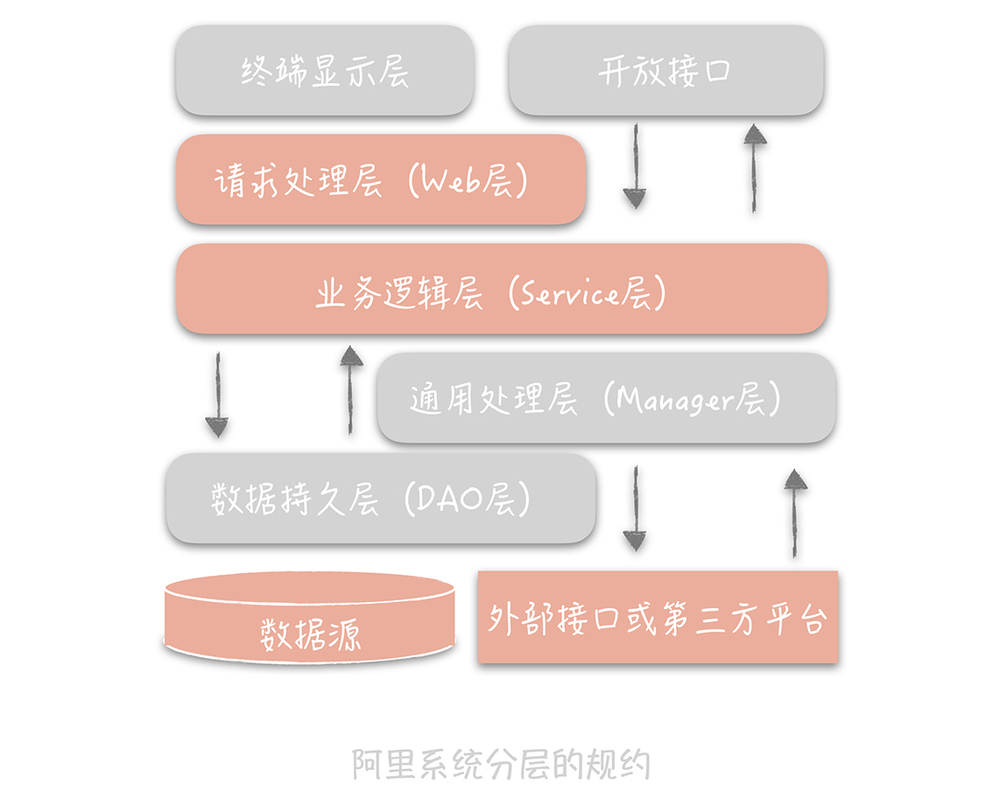
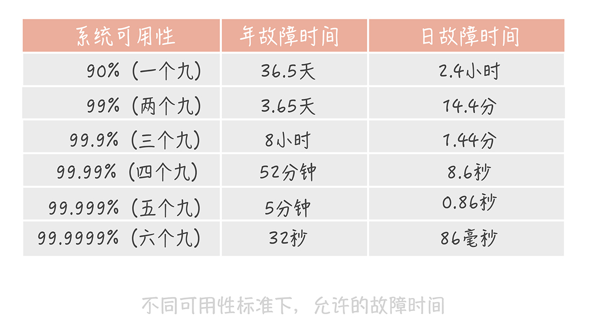

## 高并发系统的通用设计方法

高并发代表着大流量，处理高并发就像治水抵御洪水。

三种方法：

- Scale-out（横向扩展）：分而治之，采用分布式部署的方式把流量分开，让每个服务器都承担一部分并发和流量。
- 缓存：就好像是扩宽河道的方式，来为大流量提供缓冲。
- 异步：在某些场景下，未处理完成之前可以让请求先返回，在数据准备好之后再通知请求方。

在这三种方法中，可以细化出更多的内容。

### Scale-out

将类似追逐摩尔定律不断**提升 CPU 性能**的方案叫做 Scale-up（纵向扩展），把类似 CPU **多核心**的方案叫做 Scale-out（横向扩展），这两种思路在实现方式上是完全不同的。

那么什么时候选择 Scale-up，什么时候选择 Scale-out 呢？

- **初期会考虑使用 Scale-up**： 因为这种方案足够简单，所谓能用堆砌硬件解决的问题就用硬件来解决
- **系统并发超过了单机的极限时，使用 Scale-out**：
  - 虽然能够突破单机的限制，但也会引入一些复杂问题：比如，如果某个节点出现故障如何保证整体可用性？当多个节点有状态需要同步时如何保证状态信息在不同节点的一致性？如何做到使用方无感知的增加和删除节点？

### 使用缓存提高性能

在整个计算机体系中磁盘是最慢的一环，甚至比其它的组件要慢几个数量级。因此我们通常使用以内存作为存储介质的缓存，以此提升性能。

缓存的语义已经丰富了很多，我们可以将任何降低响应时间的中间存储都称为缓存。缓存的思想遍布很多设计领域，比如在操作系统中 CPU 有多级缓存，文件有 Page Cache 缓存。

### 异步处理

那么什么是同步，什么是异步呢？

以方法调用为例，同步调用代表调用方要阻塞等待被调用方法中的逻辑执行完成。这种方式下，当被调用方法响应时间较长时，会造成调用方长久的阻塞，在高并发下会造成整体系统性能下降甚至发生雪崩。

异步调用恰恰相反，调用方不需要等待方法逻辑执行完成就可以返回执行其他的逻辑，在被调用方法执行完毕后再通过回调、事件通知等方式将结果反馈给调用方。

处理逻辑后移到异步处理程序中，Web 服务的压力小了，资源占用的少了，自然就能接收更多的用户订票请求，系统承受高并发的能力也就提升了。

**罗马不是一天建成的，系统的设计也是如此。**不同量级的系统有不同的痛点，也就有不同的架构设计的侧重点。

建议一般系统的演进过程应该遵循下面的思路：

- 最简单的系统设计满足业务需求和流量现状，选择最熟悉的技术体系。
- 随着流量的增加和业务的变化修正架构中存在问题的点，如单点问题、横向扩展问题、性能无法满足需求的组件。在这个过程中，选择社区成熟的、团队熟悉的组件帮助我们解决问题，在社区没有合适解决方案的前提下才会自己造轮子。
- 当对架构的小修小补无法满足需求时，考虑重构、重写等大的调整方式以解决现有的问题。

归根结底一句话：高并发系统的演进应该是循序渐进，以解决系统中存在的问题为目的和驱动力的。

## 架构分层

### 什么是分层架构

软件架构分层在软件工程中是一种常见的设计方式，它是将整体系统拆分成 N 个层次，每个层次有独立的职责，多个层次协同提供完整的功能。

使用分层架构的例子很多

- 业务代码开发中的MVC架构
  - 将整体的系统分成了 Model（模型），View（视图）和 Controller（控制器）三个层次
  - 另外一种常见的分层方式是将整体架构分为表现层、逻辑层和数据访问层
- OSI 网络模型
  - 把整个网络分成了七层，自下而上分别是物理层、数据链路层、网络层、传输层、会话层、表示层和应用层。
- TCP/IP 协议
  - 把网络简化成了四层，即链路层、网络层、传输层和应用层。
- Linux 文件系统
  - 最上层是虚拟文件系统（VFS），虚拟文件系统的下层是 Ext3、Ext4 等各种文件系统，再向下是为了屏蔽不同硬件设备的实现细节，我们抽象出来的单独的一层——通用块设备层，然后就是不同类型的磁盘了。

### 分层的好处

- 分层的设计可以**简化系统设计**。让不同的人专注做某一层次的事情。
- 分层之后可以做到很高的**复用**。
- 分层架构可以让我们更**容易做横向扩展**。精确的对某一层做扩展。

### 怎么分层

- 终端显示层：各端模板渲染并执行显示的层。当前主要是 Velocity 渲染，JS 渲染， JSP 渲染，移动端展示等。
- 开放接口层：将 Service 层方法封装成开放接口，同时进行网关安全控制和流量控制等。
- Web 层：主要是对访问控制进行转发，各类基本参数校验，或者不复用的业务简单处理等。
- Service 层：业务逻辑层。
- Manager 层：通用业务处理层。这一层主要有两个作用，其一，你可以将原先 Service 层的一些通用能力下沉到这一层，比如与缓存和存储交互策略，中间件的接入；其二，你也可以在这一层封装对第三方接口的调用，比如调用支付服务，调用审核服务等。
- DAO 层：数据访问层，与底层 MySQL、Oracle、HBase 等进行数据交互。外部接口或第三方平台：包括其它部门 RPC 开放接口，基础平台，其它公司的 HTTP 接口。

在这个分层架构中主要增加了 Manager 层，它与 Service 层的关系是：Manager 层提供原子的服务接口，Service 层负责依据业务逻辑来编排原子接口。

然后可以在结合DDD，将Manager层作为领域层。

### 分层架构的不足

- 增加代码复杂度
- 如果我们把每个层次独立部署，性能上有损耗

那我们是否要选择分层的架构呢？答案当然是肯定的。

你要知道，任何的方案架构都是有优势有缺陷的，天地尚且不全何况我们的架构呢？分层架构固然会增加系统复杂度，也可能会有性能的损耗，但是相比于它能带给我们的好处来说，这些都是可以接受的，或者可以通过其它的方案解决的。我们在做决策的时候切不可以偏概全，因噎废食。

## 如何提升系统性能

### 高并发系统的三大目标

高性能、高可用、可扩展

### 性能优化原则

- 一定不能盲目，一定是问题导向的
- 遵循“八二原则”
  - 可以用 20% 的精力解决 80% 的性能问题。一定要抓住主要矛盾，优先优化主要的性能瓶颈点。
- 要有数据支撑
  - 优化过程中，你要时刻了解你的优化让响应时间减少了多少，提升了多少的吞吐量。
- 过程是持续的
  - 高并发的系统通常是业务逻辑相对复杂的系统，那么在这类系统中出现的性能问题通常也会有多方面的原因。因此，我们在做性能优化的时候要明确目标，比方说，支撑每秒 1 万次请求的吞吐量下响应时间在 10ms，那么我们就需要持续不断地寻找性能瓶颈，制定优化方案，直到达到目标为止。

### 性能的度量指标

- 平均值
- 最大值
- 分位值
  - 我们把这段时间请求的响应时间从小到大排序，假如一共有 100 个请求，那么排在第 90 位的响应时间就是 90 分位值。**分位值排除了偶发极慢请求对于数据的影响，能够很好地反应这段时间的性能情况，分位值越大，对于慢请求的影响就越敏感。**

上面提到的指标，如果脱离了并发程度，是没有意义的。

我们通常使用**吞吐量**或者**响应时间**来度量并发和流量，使用吞吐量的情况会更多一些。但是你要知道，这两个指标是呈倒数关系的。

**理解吞吐量：**

响应时间 1s 时，吞吐量是每秒 1 次，响应时间缩短到 10ms，那么吞吐量就上升到每秒 100 次。所以，一般我们度量性能时都会同时兼顾吞吐量和响应时间，比如我们设立性能优化的目标时通常会这样表述：在每秒 1 万次的请求量下，响应时间 99 分位值在 10ms 以下。

**究竟多长合适呢？**

从用户使用体验的角度来看，200ms 是第一个分界点：接口的响应时间在 200ms 之内，用户是感觉不到延迟的，就像是瞬时发生的一样。而 1s 是另外一个分界点：接口的响应时间在 1s 之内时，虽然用户可以感受到一些延迟，但却是可以接受的，超过 1s 之后用户就会有明显等待的感觉，等待时间越长，用户的使用体验就越差。所以，健康系统的 99 分位值的响应时间通常需要控制在 200ms 之内，而不超过 1s 的请求占比要在 99.99% 以上。

### 高并发下的优化

#### 提高系统的处理核心数

随着并发进程数的增加，并行的任务对于系统资源的争抢也会愈发严重。在某一个临界点上继续增加并发进程数，反而会造成系统性能的下降。

在评估系统性能时通常需要做压力测试，目的就是找到系统的“拐点”，从而知道系统的承载能力，也便于找到系统的瓶颈，持续优化系统性能。

#### 减少单次任务响应时间

想要减少任务的响应时间，首先要看你的系统是 CPU 密集型还是 IO 密集型的，因为不同类型的系统性能优化方式不尽相同。

**CPU 密集型系统中**，需要处理大量的 CPU 运算，那么选用**更高效的算法或者减少运算次数**就是这类系统重要的优化手段。比方说，如果系统的主要任务是计算 Hash 值，那么这时选用更高性能的 Hash 算法就可以大大提升系统的性能。发现这类问题的主要方式，是通过一些 Profile 工具来找到消耗 CPU 时间最多的方法或者模块，比如 Linux 的 perf、eBPF 等。

**IO 密集型**系统指的是系统的大部分操作是在等待 IO 完成，这里 IO 指的是磁盘 IO 和网络 IO。我们熟知的系统大部分都属于 IO 密集型，比如数据库系统、缓存系统、Web 系统。这类系统的性能瓶颈可能出在系统内部，也可能是依赖的其他系统。

优化方案会随着问题的不同而不同。比方说，如果是数据库访问慢，那么就要看是不是有锁表的情况、是不是有全表扫描、索引加的是否合适、是否有 JOIN 操作、需不需要加缓存，等等；如果是网络的问题，就要看网络的参数是否有优化的空间，抓包来看是否有大量的超时重传，网卡是否有大量丢包等。

## 如何做到系统的高可用性

高可用性（High Availability，HA）是你在系统设计时经常会听到的一个名词，它指的是系统具备较高的无故障运行的能力。

我们在很多开源组件的文档中看到的 HA 方案就是提升组件可用性，让系统免于宕机无法服务的方案。

### 可用性的度量

MTBF（Mean Time Between Failure）是**平均故障间隔**的意思，代表两次故障的间隔时间，也就是系统正常运转的平均时间。这个时间越长，系统稳定性越高。

MTTR（Mean Time To Repair）表示故障的**平均恢复时间**，也可以理解为平均故障时间。这个值越小，故障对于用户的影响越小。

用性与 MTBF 和 MTTR 的值息息相关，我们可以用下面的公式表示它们之间的关系：

Availability = MTBF / (MTBF + MTTR)

这个公式计算出的结果是一个比例，而这个比例代表着系统的可用性。一般来说，我们会使用几个九来描述系统的可用性。

三个九之后，系统的年故障时间从 3 天锐减到 8 小时。到了四个九之后，年故障时间缩减到 1 小时之内。在这个级别的可用性下，你可能需要建立完善的运维值班体系、故障处理流程和业务变更流程。你可能还需要在系统设计上有更多的考虑。比如，在开发中你要考虑，如果发生故障，是否不用人工介入就能自动恢复。

### 高可用系统设计的思路

#### 系统设计

failover（故障转移）、超时控制以及降级和限流。

- 故障转移
  - 在完全对等的节点之间做故障转移。
    - 在这类系统中所有节点都承担读写流量，并且节点中不保存状态，每个节点都可以作为另一个节点的镜像。在这种情况下，如果访问某一个节点失败，那么简单地随机访问另一个节点就好了
  - 在不对等的节点之间，即系统中存在主节点也存在备节点。
    - 复杂很多。比方说我们有一个主节点，有多台备用节点，这些备用节点可以是热备（同样在线提供服务的备用节点），也可以是冷备（只作为备份使用），那么我们就需要在代码中控制**如何检测主备机器是否故障**，以及**如何做主备切换**。
      - 最广泛的故障检测机制是“心跳”。可以在客户端上定期地从主节点发送心跳包，也可以从备份节点上定期发送心跳包。当一段时间内未收到心跳包，就可以认为主节点已经发生故障，可以触发选主的操作。
      - 选主的结果需要在多个备份节点上达成一致，所以会使用某一种分布式一致性算法，比方说 Paxos，Raft。
- 超时控制
  - 超时时间短了，会造成大量的超时错误，对用户体验产生影响；超时时间长了，又起不到作用。我建议你通过收集系统之间的调用日志，统计比如说 99% 的响应时间是怎样的，然后依据这个时间来指定超时时间。
- 降级和限流
  - 降级是为了保证核心服务的稳定而牺牲非核心服务的做法。
  - 限流完全是另外一种思路。

