# 准备

## Redis

## MySQL

用8，设置mysql的默认时区

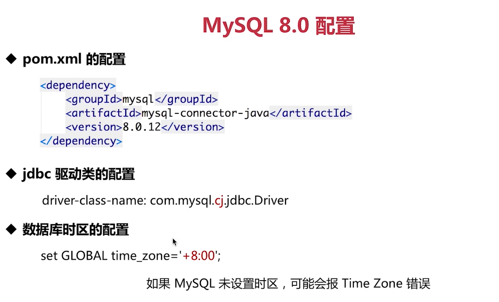

## Kafka

### 消息系统

- 点对点消息系统
- 发布订阅消息系统

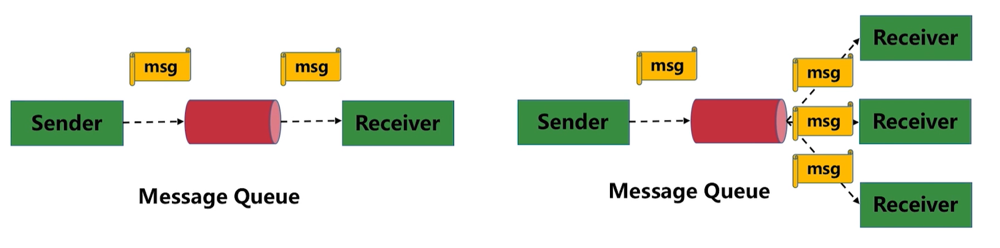

Kafka是一个分布式的发布订阅消息系统

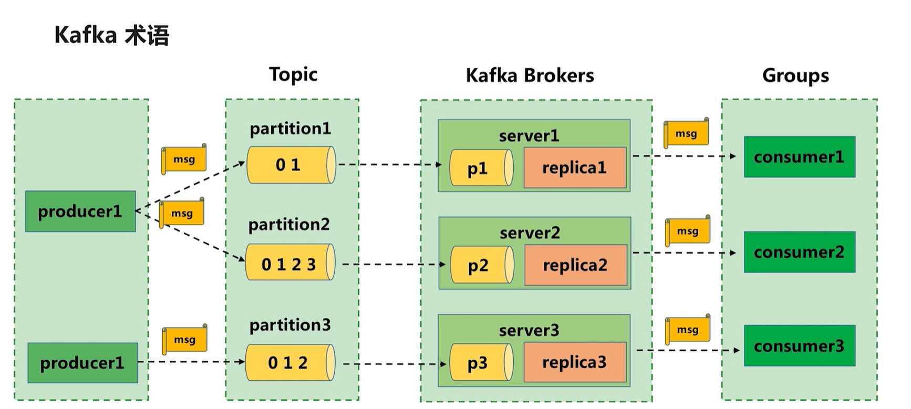

- Topic：划分数据的类
- partition：每个Topic至少有一个partition。同一个partition里的数据是有序的，不同partition的数据可能是无序的，发送的消息可能进入p1或者p2
- Brokers：一个集群有多台服务器，一个服务器有一个Brokers，存储Topic中的数据，来维护负载均衡。
- producer：数据发布者，将消息发送到Topic，Brokers接收到消息后，把消息追加到partition中
- consumer：消费者，可以消费多个Topic中的数据。多个消费者可以组成消费者组。

### 安装

下载压缩包

打开config文件夹中server.properties

- broker.id：集群中唯一标识，这里默认就好
  - 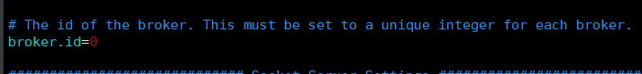
- log.dirs：日志地址，根据需求自己修改
  - 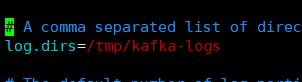

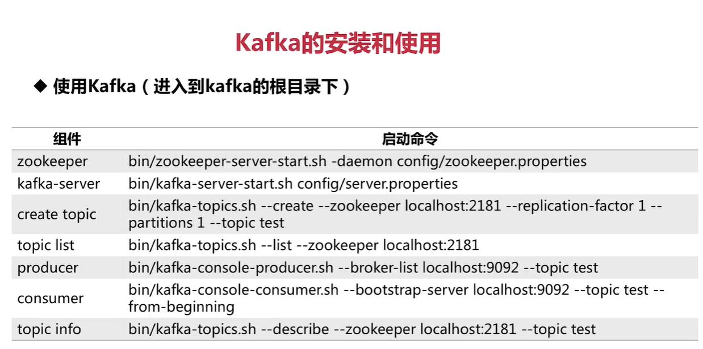

- 先启动zk
- 启动kafka-server
- 创建topic
  - bin/kafka-topics.sh --create --zookeeper localhost:2181 --replication-factor 1 --partitions 1 --topic first-kafka-topic
  - 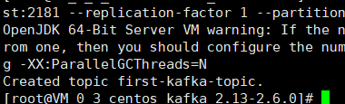
- 查看topic
  - bin/kafka-topics.sh --list --zookeeper localhost:2181
- 启动消费者
  - bin/kafka-console-consumer.sh --bootstrap-server localhost:9092 --topic first-kafka-topic --from-beginning
- 启动生产者
  - bin/kafka-console-producer.sh --broker-list localhost:9092 --topic first-kafka-topic
  - 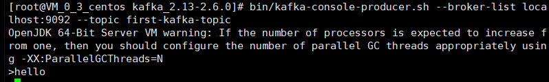

### 生产者消费者

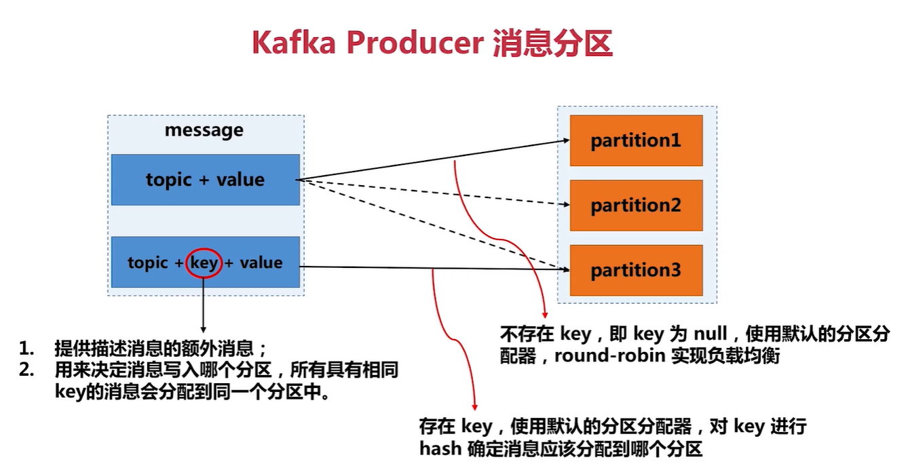

消息中key的作用

- 提供描述消息的额外信息
- 决定消息写入哪个分区，相同key的消息肯定会分配到同一个分区

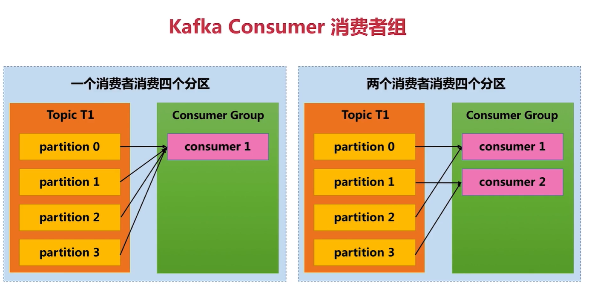

一个topic中的分区只会消费一次，不管消费者组中有多少个消费者

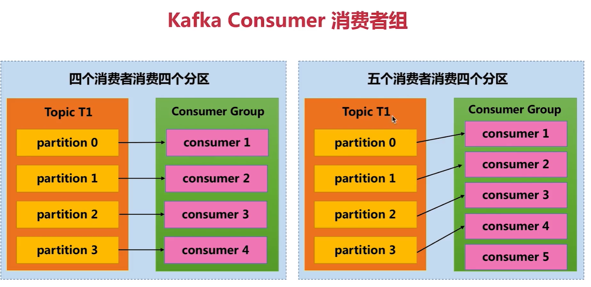

消费者组中消费者数量应该小于一个topic中分区的数量

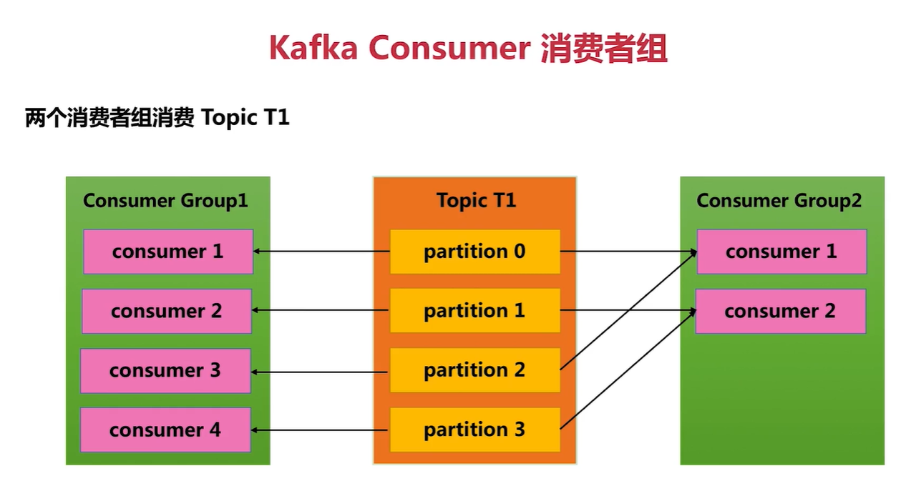

### docker中安装

# Springboot相关

## 监控

## 异步任务

首先需要starter-web的依赖

在启动类上加上注解@EnableAsync来开启异步功能

### 定义异步方法

~~~java
@Component
public class AsynService {

    @Async("getAsyncExecutor")
    public void asynProcess() throws Exception {
        System.out.println(Thread.currentThread().getName()+" 执行异步任务——不返回值");
        try {
            Thread.sleep(3000);
        } catch (InterruptedException e) {
            e.printStackTrace();
        }

        System.out.println("异步任务执行完成");
        throw new Exception();
    }
    @Async("getAsyncExecutor")
    public Future<String> asynProcessHasReturn(){

        System.out.println("执行异步任务——带返回值");
        try {
            Thread.sleep(3000);
        } catch (InterruptedException e) {
            e.printStackTrace();
        }
        System.out.println("异步任务执行完成");
        return new AsyncResult<>("完成");
    }
}
~~~

### 自定义异步线程池

springboot默认提供给异步方法的默认线程池的核心数是1，为了自定义线程配置，需要自己去配置一个Bean加入容器。之后在异步方法上的注解里填写Bean的名字就可以指定线程池了。

创建一个配置类，加配置注解，实现AsynConfigurer。这里重写两个方法一个返回执行器作为自定义的线程池，另一个方法返回一个异常处理的Handler，来处理没有返回值的线程的异常。

~~~java
@Slf4j
@Configuration
public class AsyncPoolConfig implements AsyncConfigurer {

    @Bean
    @Override
    public Executor getAsyncExecutor() {
        ThreadPoolTaskExecutor executor = new ThreadPoolTaskExecutor();
        executor.setCorePoolSize(10);
        executor.setMaxPoolSize(20);
        executor.setQueueCapacity(20);
        executor.setThreadNamePrefix("AsyncPoll_");
        executor.setKeepAliveSeconds(60);
        executor.setWaitForTasksToCompleteOnShutdown(true);
        executor.setRejectedExecutionHandler(
                new ThreadPoolExecutor.CallerRunsPolicy()
        );
        return executor;
    }

    // 这个方法返回的handler可以处理没有返回值线程任务抛出的异常
    @Override
    public AsyncUncaughtExceptionHandler getAsyncUncaughtExceptionHandler() {
        return new AsyncExHandler();
    }

    static class AsyncExHandler implements AsyncUncaughtExceptionHandler {
        @Override
        public void handleUncaughtException(Throwable throwable, Method method, Object... objects) {
            System.out.println();
            log.error("AsyncError: {}, Method: {}, Param: {}",throwable.getMessage(),method.getName(), JSON.toJSONString(objects));

            // TODO 发送邮件
        }
    }
}
~~~

# SpringCloud

## 项目结构

- coupon：总的微服务系统的父模块
  - eureka：基础组件
  - gateway：基础组件
  - service：功能微服务的父模块
    - common

父模块的pom中要设置打包类型为pom

## Eureka

### 介绍

注册中心

两个核心功能

- Service Registry 服务注册
- Service Discovery 服务发现

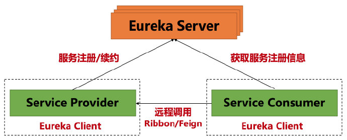

包含三个组件

- Eureka Server：提供服务注册与发现
- Eureka Client
  - Service Provider：服务提供方。将自身服务注册到Eureka Server上，让其他服务消费方能够找到当前服务。服务注册、心跳续约（告诉Server自己还活着）、下线（自己要下线，让Server删除自己的原信息）
  - Service Consumer：服务消费方，从Eureka Server上获取服务注册信息

Eureka用一个map管理原信息

~~~java
// 第一个key存储服务名称，第二个key存储实例名称，value表示实例的信息
ConcurrentHashMap<String,Map<String,Lease<InstanceInfo>>>
~~~

元信息包含：端口，服务健康信息，续约信息等。

### 创建一个Eureka应用

引入依赖

~~~xml
<?xml version="1.0" encoding="UTF-8"?>
<project xmlns="http://maven.apache.org/POM/4.0.0"
         xmlns:xsi="http://www.w3.org/2001/XMLSchema-instance"
         xsi:schemaLocation="http://maven.apache.org/POM/4.0.0 http://maven.apache.org/xsd/maven-4.0.0.xsd">
    <parent>
        <artifactId>imooc-coupon</artifactId>
        <groupId>com.imooc.coupon</groupId>
        <version>1.0-SNAPSHOT</version>
    </parent>

    <modelVersion>4.0.0</modelVersion>

    <artifactId>coupon-eureka</artifactId>
    <version>1.0-SNAPSHOT</version>
    <packaging>jar</packaging>

    <!-- 模块名及描述信息 -->
    <name>coupon-eureka</name>
    <description>Spring Cloud Eureka For Coupon</description>

    <!-- eureka server: 提供服务发现与服务注册 -->
    <dependencies>
        <dependency>
            <groupId>org.springframework.cloud</groupId>
            <artifactId>spring-cloud-starter-netflix-eureka-server</artifactId>
        </dependency>
    </dependencies>

    <!--
        SpringBoot的Maven插件, 能够以Maven的方式为应用提供SpringBoot的支持，可以将
        SpringBoot应用打包为可执行的jar或war文件, 然后以通常的方式运行SpringBoot应用
     -->
    <build>
        <plugins>
            <plugin>
                <groupId>org.springframework.boot</groupId>
                <artifactId>spring-boot-maven-plugin</artifactId>
            </plugin>
        </plugins>
    </build>

</project>
~~~

启动类，注意多了个Eureka的注解

~~~java
@EnableEurekaServer
@SpringBootApplication
public class EurekaApplication {

    public static void main(String[] args) {
        SpringApplication.run(EurekaApplication.class, args);
    }
}
~~~

配置application.yml

~~~yml
spring:
  application:
    name: coupon-eureka

server:
  port: 8000

eureka:
  instance:
    hostname: localhost
  client:
    # 标识是否从 Eureka Server 获取注册信息, 默认是 true. 如果这是一个单节点的 Eureka Server
    # 不需要同步其他节点的数据, 设置为 false
    fetch-registry: false
    # 是否将自己注册到 Eureka Server, 默认是 true. 由于当前应用是单节点的 Eureka Server
    # 需要设置为 false
    register-with-eureka: false
    # 设置 Eureka Server 所在的地址, 查询服务和注册服务都需要依赖这个地址
    service-url:
      defaultZone: http://${eureka.instance.hostname}:${server.port}/eureka/
  server:
    enable-self-preservation: false
#    renewal-percent-threshold: 0.45
~~~

本地模拟多实例集群

配置文件

~~~yml
spring:
  application:
    name: coupon-eureka
  profiles: server1
server:
  port: 8000
eureka:
  instance:
  # eureka不允许单机多实例，同一个ip不通过，这里用用host
    hostname: server1
    prefer-ip-address: false
  client:
    service-url:
      defaultZone: http://server2:8001/eureka/,http://server3:8002/eureka/

---
spring:
  application:
    name: coupon-eureka
  profiles: server2
server:
  port: 8001
eureka:
  instance:
    hostname: server2
    prefer-ip-address: false
  client:
    service-url:
      defaultZone: http://server1:8000/eureka/,http://server3:8002/eureka/

---
spring:
  application:
    name: coupon-eureka
  profiles: server3
server:
  port: 8002
eureka:
  instance:
    hostname: server3
    prefer-ip-address: false
  client:
    service-url:
      defaultZone: http://server1:8000/eureka/,http://server2:8001/eureka/

~~~

maven打包

~~~bash
mvn clean package -Dmaven.test.skip=true -U
~~~

进入项目target，找到eureka的jar包，根据不同配置启动三个eureka

~~~bash
java -jar coupon-eureka-1.0-SNAPSHOT.jar --spring.profiles.active=server1
java -jar coupon-eureka-1.0-SNAPSHOT.jar --spring.profiles.active=server2
java -jar coupon-eureka-1.0-SNAPSHOT.jar --spring.profiles.active=server3

~~~

## Zuul

### 介绍

是一个API 网关服务器，本质上就是一个Web Servlet应用

提供了**负载均衡，反向代理，动态路由，监控，请求转发**等服务。实现的核心就是**过滤器**。

微服务系统中的各种微服务往往不直接开放给调用者，而是通过一个服务网关根据请求url，记性请求转发。

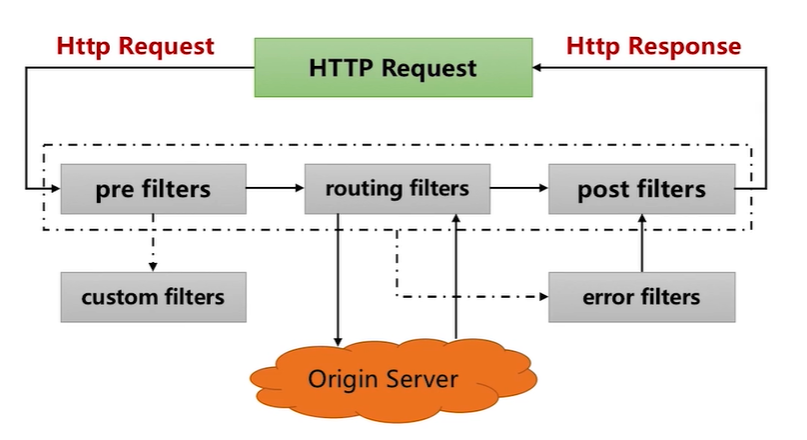

### 过滤器类型

Zuul中定义了四种标准的过滤器类型。还支持自定义过滤器。

- pre filters：请求在被路由之前调用
- routing filters：路由请求时调用
- post filters：在rount和error过滤器之后被调用
- error filters：处理请求时发生错误时调用

自定义Zuul过滤器

需要继承ZuulFilter，并实现四个抽象方法

- filterType：对应Zuul生命周期的四个阶段
- filterOrder：过滤器的优先级，数字越小优先级越高
- shouldFilter：返回true就执行run方法
- run：过滤逻辑

### 搭建网关服务

依赖

~~~xml
<?xml version="1.0" encoding="UTF-8"?>
<project xmlns="http://maven.apache.org/POM/4.0.0"
         xmlns:xsi="http://www.w3.org/2001/XMLSchema-instance"
         xsi:schemaLocation="http://maven.apache.org/POM/4.0.0 http://maven.apache.org/xsd/maven-4.0.0.xsd">
    <parent>
        <artifactId>imooc-coupon</artifactId>
        <groupId>com.imooc.coupon</groupId>
        <version>1.0-SNAPSHOT</version>
    </parent>

    <modelVersion>4.0.0</modelVersion>

    <artifactId>coupon-gateway</artifactId>
    <version>1.0-SNAPSHOT</version>
    <packaging>jar</packaging>

    <!-- 模块名及描述信息 -->
    <name>coupon-gateway</name>
    <description>Spring Cloud Gateway For Coupon</description>

    <dependencies>
        <!--
            Eureka 客户端, 客户端向 Eureka Server 注册的时候会提供一系列的元数据信息, 例如: 主机, 端口, 健康检查url等
            Eureka Server 接受每个客户端发送的心跳信息, 如果在某个配置的超时时间内未接收到心跳信息, 实例会被从注册列表中移除
        -->
        <dependency>
            <groupId>org.springframework.cloud</groupId>
            <artifactId>spring-cloud-starter-netflix-eureka-client</artifactId>
        </dependency>
        <!-- 服务网关 -->
        <dependency>
            <groupId>org.springframework.cloud</groupId>
            <artifactId>spring-cloud-starter-netflix-zuul</artifactId>
        </dependency>
        <!-- apache 工具类 -->
        <dependency>
            <groupId>commons-io</groupId>
            <artifactId>commons-io</artifactId>
            <version>1.3.2</version>
        </dependency>
        <dependency>
            <groupId>com.google.guava</groupId>
            <artifactId>guava</artifactId>
            <version>16.0</version>
        </dependency>
    </dependencies>

    <!--
        SpringBoot的Maven插件, 能够以Maven的方式为应用提供SpringBoot的支持，可以将
        SpringBoot应用打包为可执行的jar或war文件, 然后以通常的方式运行SpringBoot应用
     -->
    <build>
        <plugins>
            <plugin>
                <groupId>org.springframework.boot</groupId>
                <artifactId>spring-boot-maven-plugin</artifactId>
            </plugin>
        </plugins>
    </build>

</project>
~~~

启动类

两个新注解

~~~java
/**
 * <h1>网关应用启动入口</h1>
 * 1. @EnableZuulProxy 标识当前的应用是 Zuul Server
 * 2. @SpringCloudApplication 组合了 SpringBoot 应用 + 服务发现 + 熔断
 */
@EnableZuulProxy
@SpringCloudApplication
public class ZuulGatewayApplication {

    public static void main(String[] args) {

        SpringApplication.run(ZuulGatewayApplication.class, args);
    }
}

~~~

配置

~~~yml
server:
  port: 9000

spring:
  application:
    name: coupon-gateway

eureka:
  client:
    service-url:
      defaultZone: http://server1:8000/eureka/

zuul:
  prefix: /imooc
  routes:
    # 优惠券模板微服务路由配置定义
    template:
      path: /coupon-template/**
      serviceId: eureka-client-coupon-template
      strip-prefix: false
    # 优惠券分发微服务路由配置定义
    distribution:
      path: /coupon-distribution/**
      serviceId: eureka-client-coupon-distribution
      strip-prefix: false
    # 优惠券结算微服务路由配置定义
    settlement:
      path: /coupon-settlement/**
      serviceId: eureka-client-coupon-settlement
      strip-prefix: false
  host:
    connect-timeout-millis: 15000
    socket-timeout-millis: 60000

ribbon:
  ConnectTimeout: 15000
  ReadTimeout: 15000

~~~

#### 编写抽象过滤器

要继承ZuulFilter

ZuulFilter中主要四个需要实现的方法

- public abstract String filterType();确定过滤器的类型，不同类型的过滤器执行点不同
- public abstract int filterOrder();确定同类型过滤器的**执行顺序**
- boolean shouldFilter();返回true就执行run方法。
- Object run() throws ZuulException;run为过滤器主要逻辑

在这个继承ZuulFilter的抽血过滤器中，先只实现shouldFilter和run。对于针对具体类型的过滤器，再通过继承去实现。

~~~java
package com.imooc.coupon.filter;

import com.netflix.zuul.ZuulFilter;
import com.netflix.zuul.context.RequestContext;
import com.netflix.zuul.exception.ZuulException;

/**
 * <h1>通用的抽象过滤器类</h1>
 * Created by Qinyi.
 */
public abstract class AbstractZuulFilter extends ZuulFilter {

    // 用于在过滤器之间传递消息, 数据保存在每个请求的 ThreadLocal 中
    // 扩展了 Map
    RequestContext context;

    private final static String NEXT = "next";

    /**
     * a "true" return from this method means that the run() method should be invoked
     *
     * @return true if the run() method should be invoked. false will not invoke the run() method
     */
    @Override
    public boolean shouldFilter() {

        RequestContext ctx = RequestContext.getCurrentContext();
        return (boolean) ctx.getOrDefault(NEXT, true);
    }

    /**
     * if shouldFilter() is true, this method will be invoked. this method is the core method of a ZuulFilter
     *
     * @return Some arbitrary artifact may be returned. Current implementation ignores it.
     * @throws ZuulException if an error occurs during execution.
     */
    @Override
    public Object run() throws ZuulException {

        context = RequestContext.getCurrentContext();
        return cRun();
    }

    protected abstract Object cRun();

    Object fail(int code, String msg) {

        context.set(NEXT, false);
        context.setSendZuulResponse(false);
        context.getResponse().setContentType("text/html;charset=UTF-8");
        context.setResponseStatusCode(code);
        context.setResponseBody(String.format("{\"result\": \"%s!\"}", msg));

        return null;
    }

    Object success() {

        context.set(NEXT, true);

        return null;
    }
}

~~~

创建对应类型的抽象过滤器类，这样可以把一些通用的部分复用。

~~~java
package com.imooc.coupon.filter;

import org.springframework.cloud.netflix.zuul.filters.support.FilterConstants;

/**
 * Created by Qinyi.
 */
public abstract class AbstractPostZuulFilter extends AbstractZuulFilter {

    /**
     * to classify a filter by type. Standard types in Zuul are "pre" for pre-routing filtering,
     * "route" for routing to an origin, "post" for post-routing filters, "error" for error handling.
     * We also support a "static" type for static responses see  StaticResponseFilter.
     * Any filterType made be created or added and run by calling FilterProcessor.runFilters(type)
     *
     * @return A String representing that type
     */
    @Override
    public String filterType() {
        return FilterConstants.POST_TYPE;
    }
}

~~~

#### 自定义Token过滤器

他是在过滤器的最前面，所以是pre类型

继承pre抽象类，去重写实现run和filterOrder

这里具体的验证逻辑就不写了，大概流程是这样的

~~~java
package com.imooc.coupon.filter;

import lombok.extern.slf4j.Slf4j;
import org.springframework.stereotype.Component;

import javax.servlet.http.HttpServletRequest;

/**
 * <h1>校验请求中传递的 Token</h1>
 * Created by Qinyi.
 */
@Slf4j
//@Component
public class TokenFilter extends AbstractPreZuulFilter {

    @Override
    protected Object cRun() {

        HttpServletRequest request = context.getRequest();
        log.info(String.format("%s request to %s",
                request.getMethod(), request.getRequestURL().toString()));

        Object token = request.getParameter("token");
        if (null == token) {
            log.error("error: token is empty");
            return fail(401, "error: token is empty");
        }

        return success();
    }

    /**
     * filterOrder() must also be defined for a filter. Filters may have the same  filterOrder if precedence is not
     * important for a filter. filterOrders do not need to be sequential.
     *
     * @return the int order of a filter
     */
    @Override
    public int filterOrder() {
        return 1;
    }
}

~~~

#### 自定义限流过滤器

重写filterOrder，设置order为2

用guava提供的RateLimiter

可以对所有请求限流，也可以通过对每个ip缓存，实现对单个ip的限流

~~~java
package com.imooc.coupon.filter;

import com.google.common.cache.CacheBuilder;
import com.google.common.cache.CacheLoader;
import com.google.common.cache.LoadingCache;
import com.google.common.util.concurrent.RateLimiter;
import lombok.extern.slf4j.Slf4j;
import org.springframework.stereotype.Component;

import javax.servlet.http.HttpServletRequest;
import java.util.concurrent.ExecutionException;
import java.util.concurrent.TimeUnit;

/**
 * 限流过滤器
 */
@Slf4j
@Component
@SuppressWarnings("all")
public class RateLimiterFilter extends AbstractPreZuulFilter {
    // 通过缓存每个IP的限流器，设置超时时间。
    LoadingCache<String, RateLimiter> ipRequestCaches = CacheBuilder.newBuilder()
            .maximumSize(1000)// 设置缓存个数
            .expireAfterWrite(1, TimeUnit.MINUTES)
            .build(new CacheLoader<String, RateLimiter>() {
                @Override
                public RateLimiter load(String s) throws Exception {
                    return RateLimiter.create(1.0);// 新的IP初始化 (限流每秒0.1个令牌响应,即10s一个令牌)
                }
            });

    // 每秒可以获取到两个令牌
    RateLimiter rateLimiter = RateLimiter.create(2.0);

    @Override
    protected Object cRun() {
        // 拿到request
        HttpServletRequest request = context.getRequest();

        //1. 对所有请求限流
        // 尝试获取令牌
//        if (rateLimiter.tryAcquire()) {
//            log.info("get rate token success");
//            return success();
//        } else {
//            log.error("rate limit: {}", request.getRequestURI());
//            return fail(402, "error: rate limit");
//        }
        //2. 对单个ip的请求限流
        try {
            String ip = request.getRemoteAddr();
            RateLimiter rateLimiter = ipRequestCaches.get(ip);
            if (rateLimiter.tryAcquire()){
                log.info("ip:"+ip+" 通过");
                return success();
            }else {
                log.info("ip:"+ip+" 被限流");
                return fail(402,"error: 限流");
            }
        } catch (ExecutionException e) {
            e.printStackTrace();
        }
        return null;
    }

    /**
     * filterOrder() must also be defined for a filter. Filters may have the same  filterOrder if precedence is not
     * important for a filter. filterOrders do not need to be sequential.
     *
     * @return the int order of a filter
     */
    @Override
    public int filterOrder() {
        return 2;
    }
}

~~~

#### 访问日志过滤器

用pre和post两个过滤器来实现访问日志的过滤。这里简单实现一个，**记录请求开始和结束的耗时**。

将信息存储在context

先创建一个pre，order设置为0，请求进来第一个过滤器就记录时间戳

~~~java
package com.imooc.coupon.filter;

import lombok.extern.slf4j.Slf4j;
import org.springframework.stereotype.Component;

/**
 * 在过滤器中存储客户端发起请求的时间戳
 */
@Slf4j
@Component
public class PreRequestFilter extends AbstractPreZuulFilter {

    @Override
    protected Object cRun() {
        // 存储发起请求的时间戳
        context.set("startTime", System.currentTimeMillis());

        return success();
    }

    /**
     * filterOrder() must also be defined for a filter. Filters may have the same  filterOrder if precedence is not
     * important for a filter. filterOrders do not need to be sequential.
     *
     * @return the int order of a filter
     */
    @Override
    public int filterOrder() {
        return 0;
    }
}

~~~

创建post过滤器，设置order为最后一个

~~~java
package com.imooc.coupon.filter;

import lombok.extern.slf4j.Slf4j;
import org.springframework.cloud.netflix.zuul.filters.support.FilterConstants;
import org.springframework.stereotype.Component;

import javax.servlet.http.HttpServletRequest;

/**
 * Created by Qinyi.
 */
@Slf4j
@Component
public class AccessLogFilter extends AbstractPostZuulFilter {

    @Override
    protected Object cRun() {

        HttpServletRequest request = context.getRequest();

        // 从 PreRequestFilter 中获取设置的请求时间戳
        Long startTime = (Long) context.get("startTime");
        String uri = request.getRequestURI();
        long duration = System.currentTimeMillis() - startTime;

        // 从网关通过的请求打印延时时间: uri + duration
        log.info("uri: {}, duration: {}", uri, duration);

        return success();
    }

    /**
     * filterOrder() must also be defined for a filter. Filters may have the same  filterOrder if precedence is not
     * important for a filter. filterOrders do not need to be sequential.
     *
     * @return the int order of a filter
     */
    @Override
    public int filterOrder() {
        return FilterConstants.SEND_RESPONSE_FILTER_ORDER - 1;
    }
}

~~~

### 配置网关路由

在yml文件中配置网关的总前缀，路由路径

- path为服务模块的前缀地址
- serviceId为服务的name
- strip-prefix表示是否跳过前缀，上面的path和服务的前缀是重合的所以这里false不跳过
  - 过程为到网关时的url为/coupon-template/a。如果跳过前缀，转发到服务时的url为/a

~~~yml
server:
  port: 9000

spring:
  application:
    name: coupon-gateway

eureka:
  client:
    service-url:
      defaultZone: http://server1:8000/eureka/

zuul:
  # 网关的前缀
  prefix: /my-coupon
  routes:
    # 优惠券模板微服务路由配置定义
    template:
      # 和对应模块的前缀一致
      path: /coupon-template/**
      serviceId: eureka-client-coupon-template
      strip-prefix: false
    # 优惠券分发微服务路由配置定义
    distribution:
      path: /coupon-distribution/**
      serviceId: eureka-client-coupon-distribution
      strip-prefix: false
    # 优惠券结算微服务路由配置定义
    settlement:
      path: /coupon-settlement/**
      serviceId: eureka-client-coupon-settlement
      strip-prefix: false
  host:
    connect-timeout-millis: 15000
    socket-timeout-millis: 60000

ribbon:
  ConnectTimeout: 15000
  ReadTimeout: 15000

~~~

网关路由的过程，请求达到网关上，网关根据url上的前缀在eureka上查询到对应的服务id，然后根据查询到的服务的地址把请求转发过去。

## common模块

### 作用

- 通用代码定义
- 通用配置定义
- 统一的异常处理
- 统一的响应处理

common模块不需要独立运行，只是作为其他微服务依赖的jar包

把starter-web依赖放在这里，其他的服务就直接使用common中的web框架。common可以对web框架中的某些部分进行增强。

### 依赖

~~~xml
<?xml version="1.0" encoding="UTF-8"?>
<project xmlns="http://maven.apache.org/POM/4.0.0"
         xmlns:xsi="http://www.w3.org/2001/XMLSchema-instance"
         xsi:schemaLocation="http://maven.apache.org/POM/4.0.0 http://maven.apache.org/xsd/maven-4.0.0.xsd">
    <parent>
        <artifactId>imooc-coupon-service</artifactId>
        <groupId>com.imooc.coupon</groupId>
        <version>1.0-SNAPSHOT</version>
    </parent>

    <modelVersion>4.0.0</modelVersion>

    <artifactId>coupon-common</artifactId>
    <version>1.0-SNAPSHOT</version>
    <packaging>jar</packaging>

    <dependencies>
        <!-- 引入 Web 功能 -->
        <dependency>
            <groupId>org.springframework.boot</groupId>
            <artifactId>spring-boot-starter-web</artifactId>
        </dependency>
        <!-- JSON 处理工具 -->
        <dependency>
            <groupId>com.alibaba</groupId>
            <artifactId>fastjson</artifactId>
            <version>1.2.31</version>
        </dependency>
        <dependency>
            <groupId>org.apache.commons</groupId>
            <artifactId>commons-lang3</artifactId>
            <version>3.0</version>
        </dependency>
        <!-- https://mvnrepository.com/artifact/org.apache.commons/commons-collections4 -->
        <dependency>
            <groupId>org.apache.commons</groupId>
            <artifactId>commons-collections4</artifactId>
            <version>4.0</version>
        </dependency>
    </dependencies>

</project>
~~~

### 定义通用配置

#### 自定义消息转换器

转换器的作用是将HTTP数据转换为Java对象，将Java对象转换为HTTP数据。

默认是根据不同的类型选择默认提供的很多种转换器。这里我们**只指定用JSON的形式转换**。

配置类加上@Configuration，实现WebMvcConfigurer重写configureMessageConverters方法，修改转换器list中的转换器。

~~~java
package com.imooc.coupon.conf;

import org.springframework.context.annotation.Configuration;
import org.springframework.http.converter.HttpMessageConverter;
import org.springframework.http.converter.json.MappingJackson2HttpMessageConverter;
import org.springframework.web.servlet.config.annotation.WebMvcConfigurer;

import java.util.List;

/**
 * 定制 HTTP 消息转换器
 */
@Configuration
public class WebConfiguration implements WebMvcConfigurer {

    @Override
    public void configureMessageConverters(
            List<HttpMessageConverter<?>> converters) {
        //  清除默认的所有转换器
        converters.clear();
        // 只放入一个指定的转换器
        converters.add(new MappingJackson2HttpMessageConverter());
    }
}

~~~

#### 自定义jackson

~~~java
package com.imooc.coupon.conf;

import com.fasterxml.jackson.databind.ObjectMapper;
import org.springframework.context.annotation.Bean;
import org.springframework.context.annotation.Configuration;

import java.text.SimpleDateFormat;

/**
 * Jackson 的自定义配置
 */
@Configuration
public class JacksonConfig {

    // 注入到容器
    @Bean
    public ObjectMapper getObjectMapper() {

        ObjectMapper mapper = new ObjectMapper();
        mapper.setDateFormat(new SimpleDateFormat(
                "yyyy-MM-dd HH:mm:ss"
        ));
        return mapper;
    }
}

~~~

### 统一响应

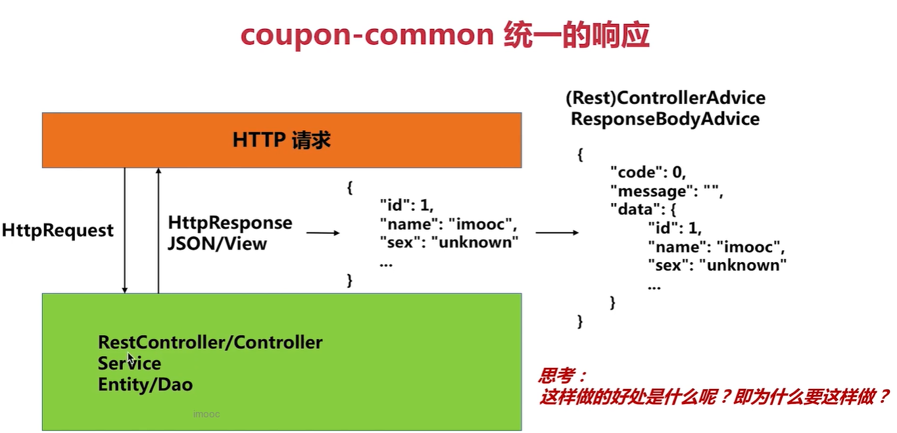

编写一个统一响应类

#### 自定义注解

编写一个注解，来忽略统一响应，表示标记的类或者方法返回的类型不要去处理。在对ResponseBody进行后处理时，会判断是否有这个注解来进行忽略。

~~~java
package com.imooc.coupon.annotation;

import java.lang.annotation.ElementType;
import java.lang.annotation.Retention;
import java.lang.annotation.RetentionPolicy;
import java.lang.annotation.Target;

/**
 * 忽略统一响应注解定义
 */
// Target表示注解可以标注在什么类型上面，可以标注在类或者方法上面
@Target({ElementType.TYPE, ElementType.METHOD})
@Retention(RetentionPolicy.RUNTIME)
public @interface IgnoreResponseAdvice {
}

~~~

#### 定义统一返回类型

~~~java
package com.imooc.coupon.vo;

import lombok.AllArgsConstructor;
import lombok.Data;
import lombok.NoArgsConstructor;

import java.io.Serializable;

/**
 * 通用响应对象定义
 */
@Data
@NoArgsConstructor
@AllArgsConstructor
public class CommonResponse<T> implements Serializable {

    private Integer code;
    private String message;
    private T data;

    public CommonResponse(Integer code, String message) {

        this.code = code;
        this.message = message;
    }
}

~~~

#### RestControllerAdvice

定义ResponseBody处理的代码

通过这个组件对所有controller返回的ResponseBody进行拦截后处理。去**实现ResponseBodyAdvice接口，表示@RestControllerAdvice注解**

实现两个方法：

- supports：判断是否需要进行后处理。这里去判断是否有上面定义的注解，来忽略后处理。
- beforeBodyWrite：做后处理的逻辑。在这里去写包装body的代码
  - 在这里需要有个逻辑，去判断返回的对象类型是不是CommonResponse，如果是就直接返回这个构件好的CommonResponse。这种情况是为了：比如想返回code和message不是上面默认的，就自己在创建CommonResponse，这里就不帮忙了。其实也可以通过注解忽略。

~~~java
package com.imooc.coupon.advice;

import com.imooc.coupon.annotation.IgnoreResponseAdvice;
import com.imooc.coupon.vo.CommonResponse;
import org.springframework.core.MethodParameter;
import org.springframework.http.MediaType;
import org.springframework.http.converter.HttpMessageConverter;
import org.springframework.http.server.ServerHttpRequest;
import org.springframework.http.server.ServerHttpResponse;
import org.springframework.web.bind.annotation.RestControllerAdvice;
import org.springframework.web.servlet.mvc.method.annotation.ResponseBodyAdvice;

/**
 * 统一响应
 * 对ResponseBody进行增强
 */
@RestControllerAdvice
public class CommonResponseDataAdvice implements ResponseBodyAdvice<Object> {

    /**
     * <h2>判断是否需要对响应进行处理</h2>
     * */
    @Override
    @SuppressWarnings("all")
    public boolean supports(MethodParameter methodParameter,
                            Class<? extends HttpMessageConverter<?>> aClass) {

        // 如果当前方法所在的类标识了 @IgnoreResponseAdvice 注解, 不需要处理
        if (methodParameter.getDeclaringClass().isAnnotationPresent(
                IgnoreResponseAdvice.class
        )) {
            return false;
        }

        // 如果当前方法标识了 @IgnoreResponseAdvice 注解, 不需要处理
        if (methodParameter.getMethod().isAnnotationPresent(
                IgnoreResponseAdvice.class
        )) {
            return false;
        }

        // 对响应进行处理, 执行 beforeBodyWrite 方法
        return true;
    }

    /**
     * <h2>响应返回之前的处理</h2>
     * */
    @Override
    @SuppressWarnings("all")
    public Object beforeBodyWrite(Object o,
                                  MethodParameter methodParameter,
                                  MediaType mediaType,
                                  Class<? extends HttpMessageConverter<?>> aClass,
                                  ServerHttpRequest serverHttpRequest,
                                  ServerHttpResponse serverHttpResponse) {

        // 定义最终的返回对象
        CommonResponse<Object> response = new CommonResponse<>(
                0, ""
        );

        // 如果 o 是 null, response 不需要设置 data，直接返回对象
        if (null == o) {
            return response;
            // 在controller中可以去自行返回CommonResponse对象，如果是这种情况就这里就不再封装
        } else if (o instanceof CommonResponse) {
            response = (CommonResponse<Object>) o;
        } else {// 否则, 把响应对象作为 CommonResponse 的 data 部分
            response.setData(o);
        }

        return response;
    }
}

~~~

### 统一异常处理

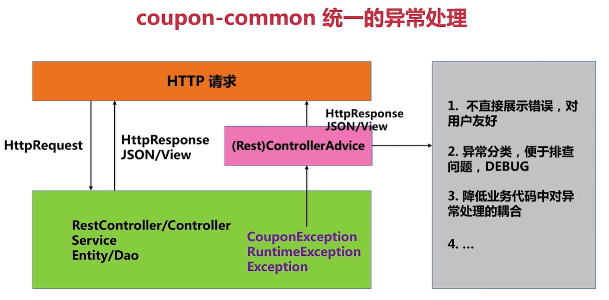

统一异常处理的好处：

- 不直接显示错误，对用户友好
- 异常分类，便于排查问题
- 降低业务代码中对异常处理的耦合

也是通过对controller增强后处理的形式，去处理抛出的异常。

#### 定义异常

继承Exception

~~~java
package com.imooc.coupon.exception;

/**
 * <h1>优惠券项目通用异常定义</h1>
 */
public class CouponException extends Exception {

    public CouponException(String message) {
        super(message);
    }
}

~~~

#### RestControllerAdvice

也是用RestControllerAdvice对controller增强

用@ExceptionHandler去处理异常

~~~java
package com.imooc.coupon.advice;

import com.imooc.coupon.exception.CouponException;
import com.imooc.coupon.vo.CommonResponse;
import org.springframework.web.bind.annotation.ExceptionHandler;
import org.springframework.web.bind.annotation.RestControllerAdvice;

import javax.servlet.http.HttpServletRequest;

/**
 * <h1>全局异常处理</h1>
 * 
 * 对Controller增强
 */
@RestControllerAdvice
public class GlobalExceptionAdvice {

    /**
     * <h2>对 CouponException 进行统一处理</h2>
     * 
     * 如果catch到这种异常，就对调用者发送错误响应
     * */
    @ExceptionHandler(value = CouponException.class)
    public CommonResponse<String> handlerCouponException(
            HttpServletRequest req, CouponException ex
    ) {

        CommonResponse<String> response = new CommonResponse<>(
                -1, "business error");
        response.setData(ex.getMessage());
        return response;
    }
}

~~~

## 功能微服务

### 业务思想

#### 优惠券模板模块

包含有三个功能点

>  根据运营人员设定条件构造优惠券模板。
>
>  作用：方便优惠券生成，只要创建好模板后，输入数量就能直接生成优惠券。

一个优惠券包括的信息可以有：名称、logo、分类、产品线、数量、规则等。一个优惠券必须有**优惠券码**。生成优惠券必须有数量限制。

核心：

- 异步：生成优惠券的过程的异步的，可以在之后查看生成的优惠券
- 优惠券码：
  - 设计为：18位，不可重复，有一定识别性
    - 产品线+类型（4位）  日期（6位）  0-9随机数（8位）

> 根据模板生成优惠券，并保存到Redis中

核心：

- 通过静态的方式去生成优惠券：给定数量直接全部生成，而不是用户请求再生成。
- 用单实例去生成：

为什么？

解决一致性问题，通过放在Set保证不重复。放在单实例中静态生成就不用考虑超发和配额问题。如果多个实例根据用户请求动态生成优惠券，这样为了保证多个实例不超发，要给每个实例设置配额，并且还要保证负载均衡的效果。

> 清理过期优惠券模板

参考Redis的过期策略

方法：

- 定时：通过定时任务定期检查，清除过期模板。
- 惰性：在使用模板时再去检查是否过期。

#### 优惠券分发模块

> 根据用户id和优惠券状态查找用户优惠券记录

关键：

- 因为不涉及用户系统，用户id不需要做校验，用mock数据
- 优惠券状态有三类：可用的、已使用的、过期的（未被使用）
- 用户数据存储在Redis中
- 获取用户优惠券，延时处理过期

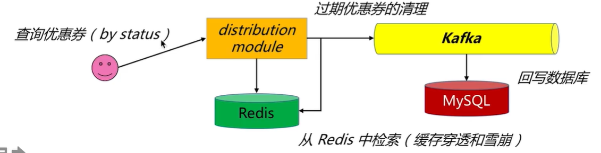

核心流程：

- 用户根据状态查询自己的优惠券
- 分发模块会从Redis中查询优惠券
- 检查，如果存在过期优惠券，就通过Kafka，异步会写MySQL

> 根据用户id，查找可以领取的优惠券模板

- 分发模块从模板模块获取模板（熔断兜底）。访问任何微服务模块都会有不确定性。
- 根据优惠券领取限制，对比用户拥有的优惠券，做出判断

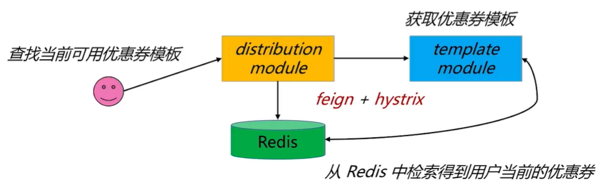

> 用户领取优惠券

- 先查找可用模板，上一条
- 从Redis中获取优惠券码
- 优惠券写入MySQL和Redis中

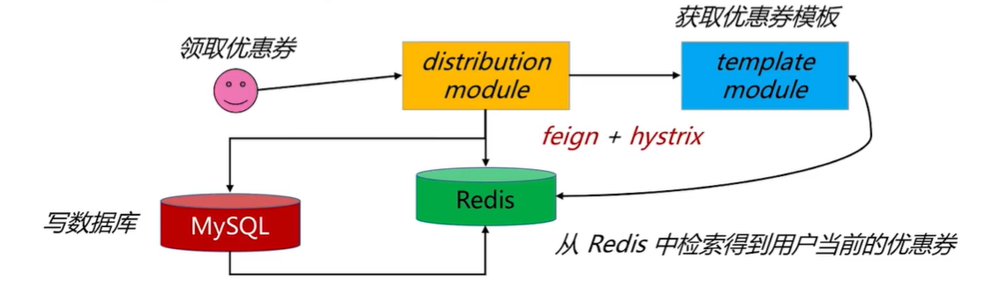

> 结算（核销）优惠券
>
> 结算：计算优惠券可以减免的金额。相当于只查看数据库
>
> 核销：使用优惠券。对数据库数据进行修改

- 校验需要结算的优惠券是否合法（属于用户并且可用）
- 利用结算模块计算结算数据
- 如果需要核销，需要用Kafka异步回写数据库

#### 优惠券结算模块

只有一个功能

> 根据优惠券类型去结算优惠券

- 优惠券是分类的，**不同类**的优惠券有不同的计算方法
- 不同类的优惠券**可以组合**，所以也需要不同的计算方式

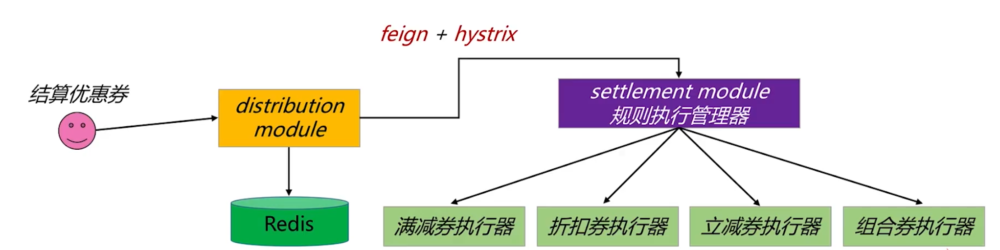

核心流程：

- 用户结算优惠券，请求分发模块
- 分发模块去Redis中去优惠券信息
- 分发模块调用结算模块去进行结算（熔断兜底）
- 结算模块根据优惠券类型，执行不同的执行器来进行结算

### 数据表设计

#### coupon_tempale

模版表示对一种优惠券描述

- id：自增主键
- available：是否可用
- expired：标示模版是否过期
- name：模板名字
- logo：模板loge
- intro：模板描述
- category：模板分类
- product_line：产品线
- coupon_count：优惠券个数
- create_time：创建时间
- user_id：创建模版的运营人员id
- template_key：对模板进行标示的key，也就是模板编码
- target：之后可以对业务进行扩展。是批量还是单独领取
- rule：优惠券规则。规则是作为json存储

name有唯一索引，方便搜索

category和user_id有单列索引

~~~sql
create table coupon_template
(
	id int auto_increment,
	available tinyint(1) default 0 not null comment '模板是否可用',
	expired tinyint(1) default 0 not null comment '模版是否过期',
	name varchar(64) not null,
	logo varchar(256) not null,
	intro varchar(256) not null comment '介绍',
	category varchar(64) not null,
	product_line int not null,
	coupon_count int default 0 not null comment '优惠券剩余数量',
	create_time datetime not null,
	user_id bigint not null comment '创建模板的运营人员的id',
	template_key varchar(128) not null,
	target int default 0 not null comment '表示优惠券针对的目标，是单人领取，还是多人分发，用于之后扩展',
	rule varchar(1024) not null comment '存储规则的JSON数据',
	constraint coupon_template_name_uindex
        unique (name)
);
create index coupon_template_category
    on coupon_template (category);

create index coupon_template_user_id
    on coupon_template (user_id);

~~~

#### coupon

优惠券表是表示每一张优惠券

- id：自增主键
- template_id：模版表逻辑外键
- user_id：用户的id
- coupon_code：优惠券码
- assign_time：领取时间
- status：优惠券状态

template_id和user_id有单列索引

~~~sql
create table coupon
(
	id int auto_increment,
	template_id int not null comment '优惠券模版外键',
	user_id bigint not null comment '领优惠券的用户的id',
	coupon_code varchar(64) not null comment '优惠券码',
	assign_time datetime not null comment '领取日期',
	status int default 0 not null comment '优惠券状态',
	constraint coupon_pk
		primary key (id),
	constraint coupon_template_id
		unique (template_id),
	constraint coupon_user_id
		unique (user_id)
);
~~~

### 缓存设计

#### 优惠券码缓存

优惠券码永久存在，不设过期时间

- key：前缀（coupon_template_code_） + 后缀（优惠券模版表主键）
- value：
  - list或者set都可以

#### 用户优惠券缓存

为三类优惠券（未使用、已使用、已过期）创建三个key

这些优惠券是缓存中数据库中都存在，需要考虑数据一致性。

用户数据保存在MySQL中，且数据量大，不适合长期驻留在Redis中，需要设置过期时间

- key：前缀（user_coupon_usable_、user_coupon_used\_、user_coupon_expired\_） + 后缀（优惠券模版表主键）
- value：
  - hash
    - key：优惠券id
    - value：优惠券信息

### 架构设计

#### SpringCloud微服务组件架构

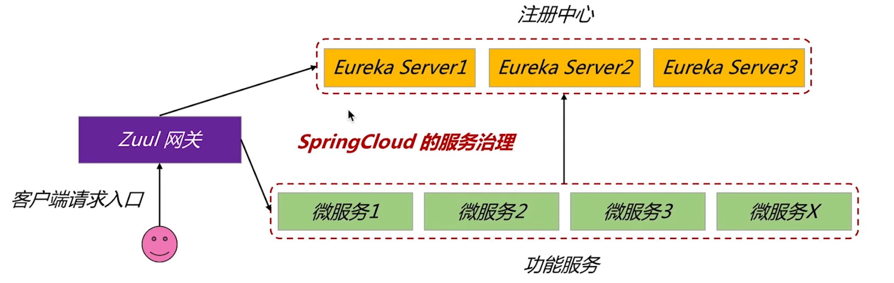

Zuul网关作为客户端请求的入口

Eureka集群作为注册中心，各个功能微服务将自己注册到注册中心中。

#### 功能微服务设计

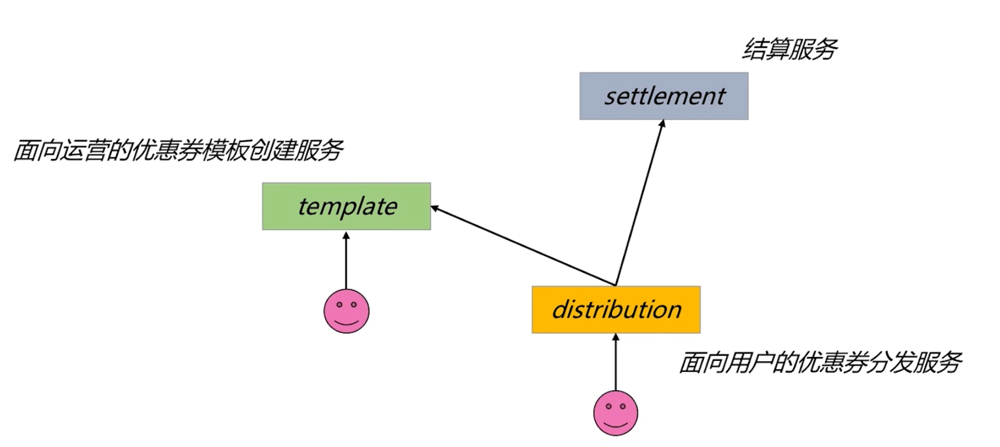

- 模版创建服务：面向运营
- 分发服务：面向用户
- 结算服务：分发服务会调用。因为结算服务可以很通用，所以单独设计为一个服务。

### 模版模块微服务

实体相关代码的编写：几个枚举，优惠券模板实例类，和模板中包含的一些属性也作为实体类。用JPA关联数据库表，自定义转换器，自定义序列化器。

每一个实例类内部都定义一个validate对象，来对对象做一个校验。

#### 依赖

~~~xml
<?xml version="1.0" encoding="UTF-8"?>
<project xmlns="http://maven.apache.org/POM/4.0.0"
         xmlns:xsi="http://www.w3.org/2001/XMLSchema-instance"
         xsi:schemaLocation="http://maven.apache.org/POM/4.0.0 http://maven.apache.org/xsd/maven-4.0.0.xsd">
    <parent>
        <artifactId>imooc-coupon-service</artifactId>
        <groupId>com.imooc.coupon</groupId>
        <version>1.0-SNAPSHOT</version>
    </parent>

    <modelVersion>4.0.0</modelVersion>

    <artifactId>coupon-template</artifactId>
    <version>1.0-SNAPSHOT</version>
    <packaging>jar</packaging>

    <dependencies>
        <!--
            Eureka 客户端, 客户端向 Eureka Server 注册的时候会提供一系列的元数据信息, 例如: 主机, 端口, 健康检查url等
            Eureka Server 接受每个客户端发送的心跳信息, 如果在某个配置的超时时间内未接收到心跳信息, 实例会被从注册列表中移除
        -->
        <dependency>
            <groupId>org.springframework.cloud</groupId>
            <artifactId>spring-cloud-starter-netflix-eureka-client</artifactId>
        </dependency>
        <!-- 引入 redis 的依赖 -->
        <dependency>
            <groupId>org.springframework.boot</groupId>
            <artifactId>spring-boot-starter-data-redis</artifactId>
        </dependency>
        <!-- Java Persistence API, ORM 规范 -->
        <dependency>
            <groupId>org.springframework.boot</groupId>
            <artifactId>spring-boot-starter-data-jpa</artifactId>
        </dependency>
        <!-- MySQL 驱动, 注意, 这个需要与 MySQL 版本对应 -->
        <dependency>
            <groupId>mysql</groupId>
            <artifactId>mysql-connector-java</artifactId>
            <version>8.0.12</version>
            <scope>runtime</scope>
        </dependency>
        <!-- 通用模块 -->
        <dependency>
            <groupId>com.imooc.coupon</groupId>
            <artifactId>coupon-common</artifactId>
            <version>1.0-SNAPSHOT</version>
        </dependency>
        <!-- apache 提供的一些工具类 -->
        <dependency>
            <groupId>commons-codec</groupId>
            <artifactId>commons-codec</artifactId>
            <version>1.9</version>
        </dependency>
        <!-- https://mvnrepository.com/artifact/com.google.guava/guava -->
        <dependency>
            <groupId>com.google.guava</groupId>
            <artifactId>guava</artifactId>
            <version>16.0</version>
        </dependency>
        <!-- Actuator 对微服务端点进行管理和配置监控 -->
        <dependency>
            <groupId>org.springframework.boot</groupId>
            <artifactId>spring-boot-starter-actuator</artifactId>
        </dependency>
    </dependencies>

    <!--
        SpringBoot的Maven插件, 能够以Maven的方式为应用提供SpringBoot的支持，可以将
        SpringBoot应用打包为可执行的jar或war文件, 然后以通常的方式运行SpringBoot应用
     -->
    <build>
        <plugins>
            <plugin>
                <groupId>org.springframework.boot</groupId>
                <artifactId>spring-boot-maven-plugin</artifactId>
            </plugin>
        </plugins>
    </build>

</project>
~~~

引入actuator，通过简单的配置可以对微服务进行监控，通过http的形式观察微服务的状态

#### 启动类

~~~java
package com.imooc.coupon;

import org.springframework.boot.SpringApplication;
import org.springframework.boot.autoconfigure.SpringBootApplication;
import org.springframework.cloud.netflix.eureka.EnableEurekaClient;
import org.springframework.data.jpa.repository.config.EnableJpaAuditing;
import org.springframework.scheduling.annotation.EnableScheduling;

/**
 * <h1>模板微服务的启动入口</h1>
 */
// 定时任务注解
@EnableScheduling
// JPA注解
@EnableJpaAuditing

@EnableEurekaClient
@SpringBootApplication
public class TemplateApplication {

    public static void main(String[] args) {
        SpringApplication.run(TemplateApplication.class, args);
    }
}

~~~

#### yml配置

~~~yml
server:
  port: 7001
  servlet:
    # 所有controller路径的前缀。让网关来识别微服务
    context-path: /coupon-template

spring:
  application:
    name: eureka-client-coupon-template
  jpa:
    show-sql: true
    hibernate:
      ddl-auto: none
    properties:
      hibernate.show_sql: true
      hibernate.format_sql: true
    open-in-view: false
  datasource:
    # 数据源
    url: jdbc:mysql://49.233.90.47:3305/coupon?autoReconnect=true&useUnicode=true&characterEncoding=utf8&useSSL=false
    username: root
    password: 123321
    type: com.zaxxer.hikari.HikariDataSource
    driver-class-name: com.mysql.cj.jdbc.Driver
    # 连接池
    hikari:
      maximum-pool-size: 8
      minimum-idle: 4
      idle-timeout: 30000
      connection-timeout: 30000
      max-lifetime: 45000
      auto-commit: true
      pool-name: ImoocCouponHikariCP
  redis:
    database: 0
    host: 49.233.90.47
    port: 6379
    # password:
    # 连接超时时间
    timeout: 10000

eureka:
  client:
    service-url:
      defaultZone: http://server1:8000/eureka/

# ------------------------------------------------------------------------------------------------------

management:
  endpoints:
    web:
      exposure:
        include: "*"

# 配置监控端点
info:
  app:
    name: imooc-coupon-template
    groupId: imooc-coupon-service
    artifactId: coupon-template
    version: 1.0-SNAPSHOT

# ------------------------------------------------------------------------------------------------------

logging:
  level:
    com.imooc.coupon: debug

~~~

#### 定义分类枚举

所有的微服务都可用，所以定义在common中

枚举一般需要一个有参构造器，需要get方法，在里面定义多个枚举元素

根据code返回枚举的方法

##### 优惠券分类枚举

分为满减、折扣、立减

~~~java
package com.imooc.coupon.constant;

import lombok.AllArgsConstructor;
import lombok.Getter;

import java.util.Objects;
import java.util.stream.Stream;

/**
 * <h1>优惠券分类</h1>
 */
@Getter
@AllArgsConstructor
public enum CouponCategory {

    MANJIAN("满减券", "001"),
    ZHEKOU("折扣券", "002"),
    LIJIAN("立减券", "003");

    /** 优惠券描述(分类) */
    private String description;

    /** 优惠券分类编码 */
    private String code;

    public static CouponCategory of(String code) {
        // 要求是非空
        Objects.requireNonNull(code);
        // 通过流操作，将枚举数组转换为流，根据code过滤，任选一个，如果没有抛出一个非法参数异常
        return Stream.of(values())
                .filter(bean -> bean.code.equals(code))
                .findAny()
                .orElseThrow(() -> new IllegalArgumentException(code + " not exists!"));
    }
}

~~~

##### 产品线枚举

分为支付、理财、保险

~~~java
package com.imooc.coupon.constant;

import lombok.AllArgsConstructor;
import lombok.Getter;

import java.util.Objects;
import java.util.stream.Stream;

/**
 * <h1>分发目标</h1>
 */
@Getter
@AllArgsConstructor
public enum DistributeTarget {

    SINGLE("单用户", 1),
    MULTI("多用户", 2);

    /** 分发目标描述 */
    private String description;

    /** 分发目标编码 */
    private Integer code;

    public static DistributeTarget of(Integer code) {

        Objects.requireNonNull(code);

        return Stream.of(values())
                .filter(bean -> bean.code.equals(code))
                .findAny()
                .orElseThrow(() -> new IllegalArgumentException(code + " not exists!"));
    }
}

~~~

##### 分发目标枚举

分为：

- 单用户：需要用户自己领取
- 多用户：对用户进行分发

~~~java
package com.imooc.coupon.constant;

import lombok.AllArgsConstructor;
import lombok.Getter;

import java.util.Objects;
import java.util.stream.Stream;

/**
 * <h1>产品线枚举</h1>
 */
@Getter
@AllArgsConstructor
public enum ProductLine {

    ZHIFU("支付", 1),
    LICAI("理财", 2),
    BAOXIAN("保险", 2);

    /** 产品线描述 */
    private String description;

    /** 产品线编码 */
    private Integer code;

    public static ProductLine of(Integer code) {

        Objects.requireNonNull(code);

        return Stream.of(values())
                .filter(bean -> bean.code.equals(code))
                .findAny()
                .orElseThrow(() -> new IllegalArgumentException(code + " not exists!"));
    }
}

~~~

##### 有效期类型注解

分为：

- 固定有效期：有效期都是一样的
- 可变有效期：有效期根据领取日期可变的

~~~java
package com.imooc.coupon.constant;

import lombok.AllArgsConstructor;
import lombok.Getter;

import java.util.Objects;
import java.util.stream.Stream;

/**
 * <h1>有效期类型</h1>
 */
@Getter
@AllArgsConstructor
public enum PeriodType {

    REGULAR("固定的(固定日期)", 1),
    SHIFT("变动的(以领取之日开始计算)", 2);

    /** 有效期描述 */
    private String description;

    /** 有效期编码 */
    private Integer code;

    public static PeriodType of(Integer code) {

        Objects.requireNonNull(code);

        return Stream.of(values())
                .filter(bean -> bean.code.equals(code))
                .findAny()
                .orElseThrow(() -> new IllegalArgumentException(code + " not exists!"));
    }
}

~~~

#### 定义优惠券规则

这个规则**表示这个这个优惠券如何使用的**，其中包括：

- 有效期：定义有效期。内部类：类型code，有效间隔，截止日期
- 折扣：定义折扣数值。内部类：数值，基准。这里不需要类型了，在优惠券模版中有折扣类型的字段。
- 使用地区和品类：定义针对那些地区和品类来使用。内部类：地区JSONString list，品类JSONString list
- 限制：限制用户可以领取几张
- 权重：表示那些优惠券可以叠加。同类肯定不能叠加

其中前三需要同内部类形式多定义几个字段。

这些都作为一个JSON存在数据库的一个字段上。所以所有的数据以**Java类来定义**。这个**规则还需要通过一些类型去进行解释。**比如知道是是满减类型，才能知道折扣的数值和基准的意思是根据达到基准去减去数值。

也定义在common中

~~~java
package com.imooc.coupon.vo;

import com.imooc.coupon.constant.PeriodType;
import lombok.AllArgsConstructor;
import lombok.Data;
import lombok.NoArgsConstructor;
import org.apache.commons.lang3.StringUtils;

/**
 * <h1>优惠券规则对象定义</h1>
 */
@Data
@NoArgsConstructor
@AllArgsConstructor
public class TemplateRule {

    /** 优惠券过期规则 */
    private Expiration expiration;

    /** 折扣 */
    private Discount discount;

    /** 每个人最多领几张的限制 */
    private Integer limitation;

    /** 使用范围: 地域 + 商品类型 */
    private Usage usage;

    /** 权重(可以和哪些优惠券叠加使用, 同一类的优惠券一定不能叠加): list[], 优惠券的唯一编码 */
    private String weight;

    /**
     * <h2>校验功能</h2>
     * */
    public boolean validate() {

        return expiration.validate() && discount.validate()
                && limitation > 0 && usage.validate()
                && StringUtils.isNotEmpty(weight);
    }

    /**
     * <h2>有效期限规则</h2>
     * */
    @Data
    @NoArgsConstructor
    @AllArgsConstructor
    public static class Expiration {

        /** 有效期规则, 对应 PeriodType 的 code 字段 */
        private Integer period;

        /** 有效间隔: 只有作为可变型的有效期才有效*/
        private Integer gap;

        /** 优惠券模板的失效日期, 两类规则都有效，如果gap有效，真正失效日期取两个最小 */
        private Long deadline;
        // 验证优惠券是否有效，而不是检验过期
        boolean validate() {
            // 最简化校验
            return null != PeriodType.of(period) && gap > 0 && deadline > 0;
        }
    }

    /**
     * <h2>折扣, 需要与类型配合决定</h2>
     * */
    @Data
    @NoArgsConstructor
    @AllArgsConstructor
    public static class Discount {

        /** 额度: 满减(20), 折扣(85), 立减(10) ，需要配合折扣类型*/
        private Integer quota;

        /** 基准, 需要满多少才可用 */
        private Integer base;

        boolean validate() {

            return quota > 0 && base > 0;
        }
    }

    /**
     * <h2>使用范围</h2>
     * */
    @Data
    @NoArgsConstructor
    @AllArgsConstructor
    public static class Usage {

        /** 省份 */
        private String province;

        /** 城市 */
        private String city;

        /** 商品类型, list[文娱, 生鲜, 家居, 全品类] 是一个list的JSON*/
        private String goodsType;

        boolean validate() {

            return StringUtils.isNotEmpty(province)
                    && StringUtils.isNotEmpty(city)
                    && StringUtils.isNotEmpty(goodsType);
        }
    }
}

~~~

#### 定义优惠券实体类

优惠券实体类是定义在模板模块服务中的

~~~java
package com.imooc.coupon.entity;

import com.fasterxml.jackson.databind.annotation.JsonSerialize;
import com.imooc.coupon.constant.CouponCategory;
import com.imooc.coupon.constant.DistributeTarget;
import com.imooc.coupon.constant.ProductLine;
import com.imooc.coupon.converter.CouponCategoryConverter;
import com.imooc.coupon.converter.DistributeTargetConverter;
import com.imooc.coupon.converter.ProductLineConverter;
import com.imooc.coupon.converter.RuleConverter;
import com.imooc.coupon.serialization.CouponTemplateSerialize;
import com.imooc.coupon.vo.TemplateRule;
import lombok.AllArgsConstructor;
import lombok.Data;
import lombok.NoArgsConstructor;
import org.springframework.data.annotation.CreatedDate;
import org.springframework.data.jpa.domain.support.AuditingEntityListener;

import javax.persistence.Column;
import javax.persistence.Convert;
import javax.persistence.Entity;
import javax.persistence.EntityListeners;
import javax.persistence.GeneratedValue;
import javax.persistence.GenerationType;
import javax.persistence.Id;
import javax.persistence.Table;
import java.io.Serializable;
import java.text.SimpleDateFormat;
import java.util.Date;

/**
 * <h1>优惠券模板实体类定义: 基础属性 + 规则属性</h1>
 */
@Data
@NoArgsConstructor
@AllArgsConstructor
@Entity
// 利用这个对某些列自动赋值
@EntityListeners(AuditingEntityListener.class)
@Table(name = "coupon_template")
@JsonSerialize(using = CouponTemplateSerialize.class)
public class CouponTemplate implements Serializable {

    /** 自增主键 */
    @Id
    @GeneratedValue(strategy = GenerationType.IDENTITY)
    @Column(name = "id", nullable = false)
    private Integer id;

    /** 是否是可用状态 */
    @Column(name = "available", nullable = false)
    private Boolean available;

    /** 是否过期 */
    @Column(name = "expired", nullable = false)
    private Boolean expired;

    /** 优惠券名称 */
    @Column(name = "name", nullable = false)
    private String name;

    /** 优惠券 logo */
    @Column(name = "logo", nullable = false)
    private String logo;

    /** 优惠券描述，因为desc是mysql中的关键字，所以用注解去做映射 */
    @Column(name = "intro", nullable = false)
    private String desc;

    /** 优惠券分类 */
    @Column(name = "category", nullable = false)
    @Convert(converter = CouponCategoryConverter.class)
    private CouponCategory category;

    /** 产品线 */
    @Column(name = "product_line", nullable = false)
    @Convert(converter = ProductLineConverter.class)
    private ProductLine productLine;

    /** 总数 */
    @Column(name = "coupon_count", nullable = false)
    private Integer count;

    /** 创建时间 */
    // 自动填充属性
    @CreatedDate
    @Column(name = "create_time", nullable = false)
    private Date createTime;

    /** 创建用户 */
    @Column(name = "user_id", nullable = false)
    private Long userId;

    /** 优惠券模板的编码 */
    @Column(name = "template_key", nullable = false)
    private String key;

    /** 目标用户 */
    @Column(name = "target", nullable = false)
    @Convert(converter = DistributeTargetConverter.class)
    private DistributeTarget target;

    /** 优惠券规则 */
    @Column(name = "rule", nullable = false)
    @Convert(converter = RuleConverter.class)
    private TemplateRule rule;

    /**
     * <h2>自定义构造函数</h2>
     * */
    public CouponTemplate(String name, String logo, String desc, String category,
                          Integer productLine, Integer count, Long userId,
                          Integer target, TemplateRule rule) {

        this.available = false;
        this.expired = false;
        this.name = name;
        this.logo = logo;
        this.desc = desc;
        this.category = CouponCategory.of(category);
        this.productLine = ProductLine.of(productLine);
        this.count = count;
        this.userId = userId;
        // 优惠券模板唯一编码 = 4(产品线1位数字和类型3位数字) + 8(日期: 20190101) + id(扩充为4位)
        this.key = productLine.toString() + category +
                new SimpleDateFormat("yyyyMMdd").format(new Date());// 后四位利用数据库中生成的主键，所以后续再去添加
        this.target = DistributeTarget.of(target);
        this.rule = rule;
    }
}

~~~

#### 定义存储数据库的转换器

JPA提供了Converter，这里定义三个转换器来把三个枚举类转换为表中的字段。也就是code和枚举元素的转换

在需要进行转换的字段上添加@Convert注解来指定转换器

定义转换器，实现AttributeConverter

##### 优惠券分类转换器

比如想去让枚举存在数据库的形式是它的code，取出来把code映射成枚举。这些逻辑可以不用写在业务代码中。通过JPA的转换器来实现。

~~~java
package com.imooc.coupon.converter;

import com.imooc.coupon.constant.CouponCategory;

import javax.persistence.AttributeConverter;
import javax.persistence.Converter;

/**
 * <h1>优惠券分类枚举属性转换器</h1>
 * AttributeConverter<X, Y>
 * X: 是实体属性的类型
 * Y: 是数据库字段的类型
 */
@Converter
public class CouponCategoryConverter
        implements AttributeConverter<CouponCategory, String> {

    /**
     * <h2>将实体属性X转换为Y存储到数据库中, 插入和更新时执行的动作</h2>
     * */
    @Override
    public String convertToDatabaseColumn(CouponCategory couponCategory) {
        return couponCategory.getCode();
    }

    /**
     * <h2>将数据库中的字段Y转换为实体属性X, 查询操作时执行的动作</h2>
     * */
    @Override
    public CouponCategory convertToEntityAttribute(String code) {
        return CouponCategory.of(code);
    }
}

~~~

##### 分发目标转换器

~~~java
package com.imooc.coupon.converter;

import com.imooc.coupon.constant.DistributeTarget;

import javax.persistence.AttributeConverter;
import javax.persistence.Converter;

/**
 * <h1>分发目标枚举属性转换器</h1>
 */
@Converter
public class DistributeTargetConverter
        implements AttributeConverter<DistributeTarget, Integer> {

    @Override
    public Integer convertToDatabaseColumn(DistributeTarget distributeTarget) {
        return distributeTarget.getCode();
    }

    @Override
    public DistributeTarget convertToEntityAttribute(Integer code) {
        return DistributeTarget.of(code);
    }
}

~~~

##### 生产线转换器

~~~java
package com.imooc.coupon.converter;

import com.imooc.coupon.constant.ProductLine;

import javax.persistence.AttributeConverter;
import javax.persistence.Converter;

/**
 * <h1>产品线枚举属性转换器</h1>
 */
@Converter
public class ProductLineConverter
        implements AttributeConverter<ProductLine, Integer> {

    @Override
    public Integer convertToDatabaseColumn(ProductLine productLine) {
        return productLine.getCode();
    }

    @Override
    public ProductLine convertToEntityAttribute(Integer code) {
        return ProductLine.of(code);
    }
}

~~~

##### 优惠券规则转换器

把规则类转换为JSON

~~~java
package com.imooc.coupon.converter;

import com.alibaba.fastjson.JSON;
import com.imooc.coupon.vo.TemplateRule;

import javax.persistence.AttributeConverter;
import javax.persistence.Converter;

/**
 * <h1>优惠券规则属性转换器</h1>
 */
@Converter
public class RuleConverter
        implements AttributeConverter<TemplateRule, String> {

    @Override
    public String convertToDatabaseColumn(TemplateRule rule) {
        return JSON.toJSONString(rule);
    }

    @Override
    public TemplateRule convertToEntityAttribute(String rule) {
        return JSON.parseObject(rule, TemplateRule.class);
    }
}

~~~

#### 自定义序列化器

去自定义对这个优惠券模板实例类的序列化。比如枚举默认序列化成name，这里可以改成更好理解的数值——desc描述。

这里来定义一个序列化器。继承JsonSerializer，重写serialize方法

~~~java
package com.imooc.coupon.serialization;

import com.alibaba.fastjson.JSON;
import com.fasterxml.jackson.core.JsonGenerator;
import com.fasterxml.jackson.databind.JsonSerializer;
import com.fasterxml.jackson.databind.SerializerProvider;
import com.imooc.coupon.entity.CouponTemplate;

import java.io.IOException;
import java.text.SimpleDateFormat;

/**
 * <h1>优惠券模板实体类自定义序列化器</h1>
 */
public class CouponTemplateSerialize
        extends JsonSerializer<CouponTemplate> {

    @Override
    public void serialize(CouponTemplate template,
                          JsonGenerator generator,
                          SerializerProvider serializerProvider)
            throws IOException {

        // 开始序列化对象
        generator.writeStartObject();

        generator.writeStringField("id", template.getId().toString());
        generator.writeStringField("name", template.getName());
        generator.writeStringField("logo", template.getLogo());
        generator.writeStringField("desc", template.getDesc());
        generator.writeStringField("category",
                template.getCategory().getDescription());
        generator.writeStringField("productLine",
                template.getProductLine().getDescription());
        generator.writeStringField("count", template.getCount().toString());
        generator.writeStringField("createTime",
                new SimpleDateFormat("yyyy-MM-dd HH:mm:ss").format(template.getCreateTime()));
        generator.writeStringField("userId", template.getUserId().toString());
        generator.writeStringField("key",
                template.getKey() + String.format("%04d", template.getId()));
        generator.writeStringField("target",
                template.getTarget().getDescription());
        generator.writeStringField("rule",
                JSON.toJSONString(template.getRule()));

        // 结束序列化对象
        generator.writeEndObject();
    }
}

~~~

通过注解的形式注册序列化器。在实体类上加上注解@JsonSerialize(using = CouponTemplateSerialize.class)

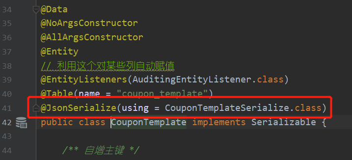

#### Dao接口

继承JpaRepository

~~~java
package com.imooc.coupon.dao;

import com.imooc.coupon.entity.CouponTemplate;
import org.springframework.data.jpa.repository.JpaRepository;

import java.util.List;

/**
 * <h1>CouponTemplate Dao 接口定义</h1>
 */
public interface CouponTemplateDao
        extends JpaRepository<CouponTemplate, Integer> {

    /**
     * <h2>根据模板名称查询模板</h2>
     * where name = ...
     * */
    CouponTemplate findByName(String name);
    
    /**
     * <h2>根据 available 和 expired 标记查找模板记录</h2>
     * where available = ... and expired = ...
     * */
    List<CouponTemplate> findAllByAvailableAndExpired(
            Boolean available, Boolean expired
    );

    /**
     * <h2>根据 expired 标记查找模板记录</h2>
     * where expired = ...
     * */
    List<CouponTemplate> findAllByExpired(Boolean expired);
}

~~~

#### 服务Service

##### 创建vo对象

定义客户端发来的请求对象。

~~~java
package com.imooc.coupon.vo;

import com.imooc.coupon.constant.CouponCategory;
import com.imooc.coupon.constant.DistributeTarget;
import com.imooc.coupon.constant.ProductLine;
import lombok.AllArgsConstructor;
import lombok.Data;
import lombok.NoArgsConstructor;
import org.apache.commons.lang3.StringUtils;

/**
 * <h1>优惠券模板创建请求对象</h1>
 */
@Data
@NoArgsConstructor
@AllArgsConstructor
public class TemplateRequest {

    /** 优惠券名称 */
    private String name;

    /** 优惠券 logo */
    private String logo;

    /** 优惠券描述 */
    private String desc;

    /** 优惠券分类 */
    private String category;

    /** 产品线 */
    private Integer productLine;

    /** 总数 */
    private Integer count;

    /** 创建用户 */
    private Long userId;

    /** 目标用户 */
    private Integer target;

    /** 优惠券规则 */
    private TemplateRule rule;

    /**
     * <h2>校验对象的合法性</h2>
     * */
    public boolean validate() {

        boolean stringValid = StringUtils.isNotEmpty(name)
                && StringUtils.isNotEmpty(logo)
                && StringUtils.isNotEmpty(desc);
        boolean enumValid = null != CouponCategory.of(category)
                && null != ProductLine.of(productLine)
                && null != DistributeTarget.of(target);
        boolean numValid = count > 0 && userId > 0;

        return stringValid && enumValid && numValid && rule.validate();
    }
}

~~~

##### 构建优惠券模板

用来创建优惠券模板

调用dao把优惠券模板信息写数据库，让模板可用的前提是处理好对应优惠券的优惠券码，所以接着调用异步服务写优惠券码到Redis。

###### 接口定义

定义一个创建模板的方法

~~~java
package com.imooc.coupon.service;

import com.imooc.coupon.entity.CouponTemplate;
import com.imooc.coupon.exception.CouponException;
import com.imooc.coupon.vo.TemplateRequest;

/**
 * <h1>构建优惠券模板接口定义</h1>
 */
public interface IBuildTemplateService {

    /**
     * <h2>创建优惠券模板</h2>
     * @param request {@link TemplateRequest} 模板信息请求对象
     * @return {@link CouponTemplate} 优惠券模板实体
     * */
    CouponTemplate buildTemplate(TemplateRequest request)
            throws CouponException;
}

~~~

###### 实现

存储到数据库中后去异步执行优惠券码的生成

~~~java
package com.imooc.coupon.service.impl;

import com.imooc.coupon.dao.CouponTemplateDao;
import com.imooc.coupon.entity.CouponTemplate;
import com.imooc.coupon.exception.CouponException;
import com.imooc.coupon.service.IAsyncService;
import com.imooc.coupon.service.IBuildTemplateService;
import com.imooc.coupon.vo.TemplateRequest;
import lombok.extern.slf4j.Slf4j;
import org.springframework.beans.factory.annotation.Autowired;
import org.springframework.stereotype.Service;

/**
 * <h1>构建优惠券模板接口实现</h1>
 */
@Slf4j
@Service
public class BuildTemplateServiceImpl implements IBuildTemplateService {

    /** 异步服务 */
    private final IAsyncService asyncService;

    /** CouponTemplate Dao */
    private final CouponTemplateDao templateDao;

    @Autowired
    public BuildTemplateServiceImpl(IAsyncService asyncService,
                                    CouponTemplateDao templateDao) {
        this.asyncService = asyncService;
        this.templateDao = templateDao;
    }

    /**
     * <h2>创建优惠券模板</h2>
     * @param request {@link TemplateRequest} 模板信息请求对象
     * @return {@link CouponTemplate} 优惠券模板实体
     */
    @Override
    public CouponTemplate buildTemplate(TemplateRequest request)
            throws CouponException {

        // 参数合法性校验
        if (!request.validate()) {
            throw new CouponException("BuildTemplate Param Is Not Valid!");
        }

        // 判断同名的优惠券模板是否存在
        if (null != templateDao.findByName(request.getName())) {
            throw new CouponException("Exist Same Name Template!");
        }

        // 构造 CouponTemplate 并保存到数据库中
        CouponTemplate template = requestToTemplate(request);
        template = templateDao.save(template);

        // 根据优惠券模板异步生成优惠券码
        asyncService.asyncConstructCouponByTemplate(template);

        return template;
    }

    /**
     * <h2>将 定义的模板请求类（vo） 转换为 模板类（entity）</h2>
     * */
    private CouponTemplate requestToTemplate(TemplateRequest request) {

        return new CouponTemplate(
                request.getName(),
                request.getLogo(),
                request.getDesc(),
                request.getCategory(),
                request.getProductLine(),
                request.getCount(),
                request.getUserId(),
                request.getTarget(),
                request.getRule()
        );
    }
}

~~~

##### 异步生成优惠券码

通过异步任务来生成优惠券码

###### 自定义异步任务使用的线程池

在启动类上加上@EnableAsync注解来启动异步功能。

自定义异步任务线程池。创建一个AsyncConfigurer接口实现类，加上@Configuration注解作为配置类，重写getAsyncExecutor方法返回一个线程池Bean去注入对应的Bean。

另外重写getAsyncUncaughtExceptionHandler方法，通过这个方法返回一个Handler来处理没有返回值的线程任务抛出的异常。这个方法不需要加@Bean

~~~java
package com.imooc.coupon.config;

import com.alibaba.fastjson.JSON;
import lombok.extern.slf4j.Slf4j;
import org.springframework.aop.interceptor.AsyncUncaughtExceptionHandler;
import org.springframework.context.annotation.Bean;
import org.springframework.context.annotation.Configuration;
import org.springframework.scheduling.annotation.AsyncConfigurer;
import org.springframework.scheduling.annotation.EnableAsync;
import org.springframework.scheduling.concurrent.ThreadPoolTaskExecutor;

import java.lang.reflect.Method;
import java.util.concurrent.Executor;
import java.util.concurrent.ThreadPoolExecutor;

/**
 * <h1>自定义异步任务线程池</h1>
 */
@Slf4j
@EnableAsync
@Configuration
public class AsyncPoolConfig implements AsyncConfigurer {

    @Bean
    @Override
    public Executor getAsyncExecutor() {
        // 定义线程池
        ThreadPoolTaskExecutor executor = new ThreadPoolTaskExecutor();
        executor.setCorePoolSize(10);
        executor.setMaxPoolSize(20);
        executor.setQueueCapacity(20);
        executor.setKeepAliveSeconds(60);
        executor.setThreadNamePrefix("ImoocAsync_");

        executor.setWaitForTasksToCompleteOnShutdown(true);
        executor.setAwaitTerminationSeconds(60);

        executor.setRejectedExecutionHandler(
                new ThreadPoolExecutor.CallerRunsPolicy()
        );

        executor.initialize();

        return executor;
    }

    @Override
    public AsyncUncaughtExceptionHandler getAsyncUncaughtExceptionHandler() {
        return new AsyncExceptionHandler();
    }

    @SuppressWarnings("all")
    class AsyncExceptionHandler implements AsyncUncaughtExceptionHandler {

        @Override
        public void handleUncaughtException(Throwable throwable,
                                            Method method,
                                            Object... objects) {
            throwable.printStackTrace();
            log.error("AsyncError: {}, Method: {}, Param: {}",
                    throwable.getMessage(), method.getName(),
                    JSON.toJSONString(objects));

            // TODO 发送邮件或短信, 做进一步的处理
        }
    }
}

~~~

###### 异步服务接口定义

定义一个方法，就是用来做优惠券码的异步生成

~~~java
package com.imooc.coupon.service;

import com.imooc.coupon.entity.CouponTemplate;

/**
 * <h1>异步服务接口定义</h1>
 */
public interface IAsyncService {

    /**
     * <h2>根据模板异步的创建优惠券码</h2>
     * @param template {@link CouponTemplate} 优惠券模板实体
     * */
    void asyncConstructCouponByTemplate(CouponTemplate template);
}

~~~

###### 定义常量

因为生成的优惠券码需要存储的Redis中。对于Redis的一些通用代码先定义到common项目中。

定义常量：Kafka和Redis常量

~~~java
package com.imooc.coupon.constant;

/**
 * <h1>常用常量定义</h1>
 */
public class Constant {

    /** Kafka 消息的 Topic */
    public static final String TOPIC = "user_coupon_op";

    /**
     * <h2>Redis Key 前缀定义</h2>
     * */
    public static class RedisPrefix {

        /** 优惠券码 key 前缀 */
        public static final String COUPON_TEMPLATE =
                "coupon_template_code_";

        /** 用户当前所有可用的优惠券 key 前缀 */
        public static final String USER_COUPON_USABLE =
                "user_coupon_usable_";

        /** 用户当前所有已使用的优惠券 key 前缀 */
        public static final String USER_COUPON_USED =
                "user_coupon_used_";

        /** 用户当前所有已过期的优惠券 key 前缀 */
        public static final String USER_COUPON_EXPIRED =
                "user_coupon_expired_";
    }
}

~~~

###### 服务实现类

其中除了实现的接口方法的其他方法

- private Set<String> buildCouponCode(CouponTemplate template)：通过模板生成count个数个优惠券码，
  - 优惠券码构成：18位数字。前四位: 产品线 + 类型。中间六位: 模板的日期的随机(200101)。后八位: 0 ~ 9 随机数构成
  - 生成优惠券码的过程循环。**先用for做count次生成，然后用while去判断set的size去做补充。**这样效率比较高。
- private String buildCouponCodeSuffix14(String date)：构建优惠券码的后14位。日期的随机使用Collections.shuffle方法对字符元素的list做随机。

其中实现的异步创建优惠券的方法，加上@Async注解，并标注上自定义的线程池，就成为了异步方法。

~~~java
package com.imooc.coupon.service.impl;

import com.google.common.base.Stopwatch;
import com.imooc.coupon.constant.Constant;
import com.imooc.coupon.dao.CouponTemplateDao;
import com.imooc.coupon.entity.CouponTemplate;
import com.imooc.coupon.service.IAsyncService;
import com.sun.jmx.remote.internal.ArrayQueue;
import lombok.extern.slf4j.Slf4j;
import org.apache.commons.lang3.RandomStringUtils;
import org.springframework.beans.factory.annotation.Autowired;
import org.springframework.data.redis.core.StringRedisTemplate;
import org.springframework.scheduling.annotation.Async;
import org.springframework.stereotype.Service;

import java.text.SimpleDateFormat;
import java.util.*;
import java.util.concurrent.*;
import java.util.stream.Collectors;

/**
 * <h1>异步服务接口实现</h1>
 * Created by Qinyi.
 */
@Slf4j
@Service
public class AsyncServiceImpl implements IAsyncService {

    /** CouponTemplate Dao */
    private final CouponTemplateDao templateDao;

    /** 注入 Redis 模板类 */
    private final StringRedisTemplate redisTemplate;

    // 基于构造函数的自动注入方式
    @Autowired
    public AsyncServiceImpl(CouponTemplateDao templateDao,
                            StringRedisTemplate redisTemplate) {
        this.templateDao = templateDao;
        this.redisTemplate = redisTemplate;
    }

    /**
     * <h2>根据模板异步的创建优惠券码</h2>
     * @param template {@link CouponTemplate} 优惠券模板实体
     */
    @Async("getAsyncExecutor")
    @Override
    @SuppressWarnings("all")
    public void asyncConstructCouponByTemplate(CouponTemplate template) {

        Stopwatch watch = Stopwatch.createStarted();
        // 这里就是模板对应的所有优惠券码
        Set<String> couponCodes = buildCouponCode(template);

        // 把优惠券码放到Redis中，用list存储
        String redisKey = String.format("%s%s",
                Constant.RedisPrefix.COUPON_TEMPLATE, template.getId().toString());
        log.info("Push CouponCode To Redis: {}",
                redisTemplate.opsForList().rightPushAll(redisKey, couponCodes));
        // 修改模板的状态为可用
        template.setAvailable(true);
        templateDao.save(template);

        watch.stop();
        log.info("Construct CouponCode By Template Cost: {}ms",
                watch.elapsed(TimeUnit.MILLISECONDS));

        // TODO 发送短信或者邮件通知优惠券模板已经可用
        log.info("CouponTemplate({}) Is Available!", template.getId());
    }

    /**
     * <h2>构造优惠券码</h2>
     * 优惠券码(对应于每一张优惠券, 18位)
     *  前四位: 产品线 + 类型
     *  中间六位: 日期随机(190101)
     *  后八位: 0 ~ 9 随机数构成
     * @param template {@link CouponTemplate} 实体类
     * @return Set<String> 与 template.count 相同个数的优惠券码
     * */
    @SuppressWarnings("all")
    private Set<String> buildCouponCode(CouponTemplate template) {
        // 用来记录耗时
        Stopwatch watch = Stopwatch.createStarted();

        Set<String> result = new HashSet<>(template.getCount());
        Map<Integer,Integer> map = new LinkedHashMap<>();
        Queue<Integer> deap = new PriorityQueue<>((a,b)->{
            int x = map.get(a);
            int y = map.get(b);
            if (x==y){
                return a-b;
            }
            return y-x;
        });
        deap.add(1);

        deap.poll();
        // 前四位
        String prefix4 = template.getProductLine().getCode().toString()
                + template.getCategory().getCode();
        String date = new SimpleDateFormat("yyMMdd")
                .format(template.getCreateTime());

        // 先用for去创建一定数量优惠券
        for (int i = 0; i != template.getCount(); ++i) {
            result.add(prefix4 + buildCouponCodeSuffix14(date));
        }

        // 用while去补充之前创建重复的
        while (result.size() < template.getCount()) {
            result.add(prefix4 + buildCouponCodeSuffix14(date));
        }

        assert result.size() == template.getCount();

        watch.stop();
        log.info("Build Coupon Code Cost: {}ms",
                watch.elapsed(TimeUnit.MILLISECONDS));

        return result;
    }

    /**
     * <h2>构造优惠券码的后 14 位</h2>
     * @param date 创建优惠券的日期
     * @return 14 位优惠券码
     * */
    private String buildCouponCodeSuffix14(String date) {

        char[] bases = new char[]{'1', '2', '3', '4', '5', '6', '7', '8', '9'};

        // 中间六位
        List<Character> chars = date.chars()
                .mapToObj(e -> (char) e).collect(Collectors.toList());
        Collections.shuffle(chars);
        String mid6 = chars.stream()
                .map(Object::toString).collect(Collectors.joining());

        // 后八位
        String suffix8 = RandomStringUtils.random(1, bases)
                + RandomStringUtils.randomNumeric(7);

        return mid6 + suffix8;
    }
}

~~~

##### 优惠券模板基础服务

用于提供其他服务的基础服务，一般是供其他服务查询数据的

###### 定义SDK

首先定义**一个微服务之间传递信息类CouponTemplateSDK。**这个通用的类定义在**common项目**中。

为什么不直接通过CouponTemplate来传递信息呢：一是CouponTemplate作为数据库表的映射类，**可能有些信息不适合暴露给其他服务。**

~~~java
package com.imooc.coupon.vo;

import lombok.AllArgsConstructor;
import lombok.Data;
import lombok.NoArgsConstructor;

/**
 * <h1>微服务之间用的优惠券模板信息定义</h1>
 */
@Data
@NoArgsConstructor
@AllArgsConstructor
public class CouponTemplateSDK {

    /** 优惠券模板主键 */
    private Integer id;

    /** 优惠券模板名称 */
    private String name;

    /** 优惠券 logo */
    private String logo;

    /** 优惠券描述 */
    private String desc;

    /** 优惠券分类 */
    private String category;

    /** 产品线 */
    private Integer productLine;

    /** 优惠券模板的编码 */
    private String key;

    /** 目标用户 */
    private Integer target;

    /** 优惠券规则 */
    private TemplateRule rule;
}

~~~

###### 定义接口

定义一下对于优惠券模板的基础操作

- 根据模板id获取优惠券模板信息
- 查找可用的优惠券
- 根据模板id获取模板到SDK的映射Map，key为id

~~~java
package com.imooc.coupon.service;

import com.imooc.coupon.entity.CouponTemplate;
import com.imooc.coupon.exception.CouponException;
import com.imooc.coupon.vo.CouponTemplateSDK;

import java.util.Collection;
import java.util.List;
import java.util.Map;

/**
 * <h1>优惠券模板基础(view, delete...)服务定义</h1>
 */
public interface ITemplateBaseService {

    /**
     * <h2>根据优惠券模板 id 获取优惠券模板信息</h2>
     * @param id 模板 id
     * @return {@link CouponTemplate} 优惠券模板实体
     * */
    CouponTemplate buildTemplateInfo(Integer id) throws CouponException;

    /**
     * <h2>查找所有可用的优惠券模板</h2>
     * @return {@link CouponTemplateSDK}s
     * */
    List<CouponTemplateSDK> findAllUsableTemplate();

    /**
     * <h2>获取模板 ids 到 CouponTemplateSDK 的映射</h2>
     * @param ids 模板 ids
     * @return Map<key: 模板 id， value: CouponTemplateSDK>
     * */
    Map<Integer, CouponTemplateSDK> findIds2TemplateSDK(Collection<Integer> ids);
}

~~~

###### 接口实现

模板类转换为SDK，然后三个方法就是用不同方式去提供查询SDK结果

~~~java
package com.imooc.coupon.service.impl;

import com.imooc.coupon.dao.CouponTemplateDao;
import com.imooc.coupon.entity.CouponTemplate;
import com.imooc.coupon.exception.CouponException;
import com.imooc.coupon.service.ITemplateBaseService;
import com.imooc.coupon.vo.CouponTemplateSDK;
import lombok.extern.slf4j.Slf4j;
import org.springframework.beans.factory.annotation.Autowired;
import org.springframework.stereotype.Service;

import java.util.Collection;
import java.util.List;
import java.util.Map;
import java.util.Optional;
import java.util.function.Function;
import java.util.stream.Collectors;

/**
 * <h1>优惠券模板基础服务接口实现</h1>
 */
@Slf4j
@Service
public class TemplateBaseServiceImpl implements ITemplateBaseService {

    /** CouponTemplate Dao */
    private final CouponTemplateDao templateDao;

    @Autowired
    public TemplateBaseServiceImpl(CouponTemplateDao templateDao) {
        this.templateDao = templateDao;
    }

    /**
     * <h2>根据优惠券模板 id 获取优惠券模板信息</h2>
     * @param id 模板 id
     * @return {@link CouponTemplate} 优惠券模板实体
     */
    @Override
    public CouponTemplate buildTemplateInfo(Integer id) throws CouponException {
        // 查找模板信息
        Optional<CouponTemplate> template = templateDao.findById(id);
        if (!template.isPresent()) {
            throw new CouponException("Template Is Not Exist: " + id);
        }

        return template.get();
    }

    /**
     * <h2>查找所有可用的优惠券模板</h2>
     * @return {@link CouponTemplateSDK}s
     */
    @Override
    public List<CouponTemplateSDK> findAllUsableTemplate() {
        // 模板状态可用并且未过期，就是可用的
        List<CouponTemplate> templates =
                templateDao.findAllByAvailableAndExpired(
                        true, false);

        // 用流操作的map对每个元素类型转换映射，然后放到list集合中
        return templates.stream()
                .map(this::template2TemplateSDK).collect(Collectors.toList());
    }

    /**
     * <h2>获取模板 ids 到 CouponTemplateSDK 的映射</h2>
     * @param ids 模板 ids
     * @return Map<key: 模板 id, value: CouponTemplateSDK>
     */
    @Override
    public Map<Integer, CouponTemplateSDK> findIds2TemplateSDK(
            Collection<Integer> ids) {

        List<CouponTemplate> templates = templateDao.findAllById(ids);

        // 最终转换为Map
        return templates.stream().map(this::template2TemplateSDK)
                .collect(Collectors.toMap(
                        CouponTemplateSDK::getId, Function.identity()// 这个表示本身
                ));
    }

    /**
     * <h2>将 CouponTemplate 转换为 CouponTemplateSDK</h2>
     * */
    private CouponTemplateSDK template2TemplateSDK(CouponTemplate template) {
        String id = template.getId()+"";
        return new CouponTemplateSDK(
                template.getId(),
                template.getName(),
                template.getLogo(),
                template.getDesc(),
                template.getCategory().getCode(),
                template.getProductLine().getCode(),
//                template.getKey(),  // 并不是拼装好的 Template Key
                template.getKey()+id.substring(id.length()-4),  // 也可以拼装好
                template.getTarget().getCode(),
                template.getRule()
        );
    }
}

~~~

##### 定期清理优惠券服务

这里是定期对所有还没有确定为已过期的模板进行检查，如果检验已经过期就更新为过期的模板。

通过定时任务实现

在启动类中用@EnableScheduling开启定时任务

~~~java
package com.imooc.coupon.schedule;

import com.imooc.coupon.dao.CouponTemplateDao;
import com.imooc.coupon.entity.CouponTemplate;
import com.imooc.coupon.vo.TemplateRule;
import lombok.extern.slf4j.Slf4j;
import org.apache.commons.collections4.CollectionUtils;
import org.springframework.beans.factory.annotation.Autowired;
import org.springframework.scheduling.annotation.Scheduled;
import org.springframework.stereotype.Component;

import java.util.ArrayList;
import java.util.Date;
import java.util.List;

/**
 * <h1>定时清理已过期的优惠券模板</h1>
 */
@Slf4j
@Component
public class ScheduledTask {

    /** CouponTemplate Dao */
    private final CouponTemplateDao templateDao;

    @Autowired
    public ScheduledTask(CouponTemplateDao templateDao) {
        this.templateDao = templateDao;
    }

    /**
     * <h2>下线已过期的优惠券模板</h2>
     *
     * 每小时处理下线模板。对于没有过期的去判断是否过期，然后把过期的模板的过期字段改为true
     * */
    @Scheduled(fixedRate = 60 * 60 * 1000)
    public void offlineCouponTemplate() {

        log.info("Start To Expire CouponTemplate");

        List<CouponTemplate> templates =
                templateDao.findAllByExpired(false);
        if (CollectionUtils.isEmpty(templates)) {
            log.info("Done To Expire CouponTemplate.");
            return;
        }

        Date cur = new Date();
        List<CouponTemplate> expiredTemplates =
                new ArrayList<>(templates.size());

        templates.forEach(t -> {

            // 根据优惠券模板规则中的 "过期规则" 校验模板是否过期
            TemplateRule rule = t.getRule();
            if (rule.getExpiration().getDeadline() < cur.getTime()) {
                t.setExpired(true);
                expiredTemplates.add(t);
            }
        });

        // 把过期的修改信息更新到数据库
        if (CollectionUtils.isNotEmpty(expiredTemplates)) {
            log.info("Expired CouponTemplate Num: {}",
                    templateDao.saveAll(expiredTemplates));
        }

        log.info("Done To Expire CouponTemplate.");
    }
}

~~~

#### Controller

##### 健康检查接口

API提供当前服务的基本信息，包括

- 返回是否运行正常
- 测试异常
- 获取Eureka服务上的微服务元信息
  - 需要注入org.springframework.cloud.client.discovery.DiscoveryClient来发现其他客户端（微服务）的元信息和org.springframework.cloud.client.serviceregistry.Registration服务注册接口，提供获取服务id的方法
  - 注册到Eureka上获取到自己的注册id，用这个这个id可以查询对应的服务信息

~~~java
package com.imooc.coupon.controller;

import com.imooc.coupon.exception.CouponException;
import lombok.extern.slf4j.Slf4j;
import org.springframework.beans.factory.annotation.Autowired;
import org.springframework.cloud.client.ServiceInstance;
import org.springframework.cloud.client.discovery.DiscoveryClient;
import org.springframework.cloud.client.serviceregistry.Registration;
import org.springframework.web.bind.annotation.GetMapping;
import org.springframework.web.bind.annotation.RestController;

import java.util.ArrayList;
import java.util.HashMap;
import java.util.List;
import java.util.Map;

/**
 * <h1>健康检查接口</h1>
 */
@Slf4j
@RestController
public class HealthCheck {

    /** 服务发现客户端 */
    private final DiscoveryClient client;

    /** 服务注册接口, 提供了获取服务 id 的方法 */
    private final Registration registration;

    @Autowired
    public HealthCheck(DiscoveryClient client, Registration registration) {
        this.client = client;
        this.registration = registration;
    }

    /**
     * <h2>健康检查接口</h2>
     * 127.0.0.1:7001/coupon-template/health
     * 127.0.0.1:9000/imooc/coupon-template/health
     * */
    @GetMapping("/health")
    public String health() {
        log.debug("view health api");
        return "CouponTemplate Is OK!";
    }

    /**
     * <h2>异常测试接口</h2>
     * 127.0.0.1:7001/coupon-template/exception
     * 127.0.0.1:9000/imooc/coupon-template/exception
     * */
    @GetMapping("/exception")
    public String exception() throws CouponException {

        log.debug("view exception api");
        throw new CouponException("CouponTemplate Has Some Problem");
    }

    /**
     * <h2>获取 Eureka Server 上的微服务元信息</h2>
     * 127.0.0.1:7001/coupon-template/info
     * 127.0.0.1:9000/imooc/coupon-template/info
     * */
    @GetMapping("/info")
    public List<Map<String, Object>> info() {

        // 大约需要等待两分钟时间才能获取到注册信息
        List<ServiceInstance> instances =
                client.getInstances(registration.getServiceId());

        List<Map<String, Object>> result =
                new ArrayList<>(instances.size());

        instances.forEach(i -> {
            Map<String, Object> info = new HashMap<>();
            info.put("serviceId", i.getServiceId());
            info.put("instanceId", i.getInstanceId());
            info.put("port", i.getPort());

            result.add(info);
        });

        return result;
    }
}

~~~

##### 优惠券模板相关接口

提供模板相关的API

- 构建模板
- 获取模板信息
- 获取所有可用模板信息
- 根据模板id获取SDK映射

### 分发模块微服务

#### 依赖

~~~xml
<?xml version="1.0" encoding="UTF-8"?>
<project xmlns="http://maven.apache.org/POM/4.0.0"
         xmlns:xsi="http://www.w3.org/2001/XMLSchema-instance"
         xsi:schemaLocation="http://maven.apache.org/POM/4.0.0 http://maven.apache.org/xsd/maven-4.0.0.xsd">
    <parent>
        <artifactId>imooc-coupon-service</artifactId>
        <groupId>com.imooc.coupon</groupId>
        <version>1.0-SNAPSHOT</version>
    </parent>

    <modelVersion>4.0.0</modelVersion>

    <artifactId>coupon-distribution</artifactId>
    <version>1.0-SNAPSHOT</version>
    <packaging>jar</packaging>

    <dependencies>
        <!--
            Eureka 客户端, 客户端向 Eureka Server 注册的时候会提供一系列的元数据信息, 例如: 主机, 端口, 健康检查url等
            Eureka Server 接受每个客户端发送的心跳信息, 如果在某个配置的超时时间内未接收到心跳信息, 实例会被从注册列表中移除
        -->
        <dependency>
            <groupId>org.springframework.cloud</groupId>
            <artifactId>spring-cloud-starter-netflix-eureka-client</artifactId>
        </dependency>
        <!-- 引入 Feign, 可以以声明的方式调用微服务 -->
        <dependency>
            <groupId>org.springframework.cloud</groupId>
            <artifactId>spring-cloud-starter-openfeign</artifactId>
        </dependency>
        <!-- 引入服务容错 Hystrix 的依赖 -->
        <dependency>
            <groupId>org.springframework.cloud</groupId>
            <artifactId>spring-cloud-starter-netflix-hystrix</artifactId>
        </dependency>
        <!-- 引入服务消费者 Ribbon 的依赖 -->
        <dependency>
            <groupId>org.springframework.cloud</groupId>
            <artifactId>spring-cloud-starter-netflix-ribbon</artifactId>
        </dependency>
        <!-- 引入 redis 的依赖 -->
        <dependency>
            <groupId>org.springframework.boot</groupId>
            <artifactId>spring-boot-starter-data-redis</artifactId>
        </dependency>
        <!-- Java Persistence API, ORM 规范 -->
        <dependency>
            <groupId>org.springframework.boot</groupId>
            <artifactId>spring-boot-starter-data-jpa</artifactId>
        </dependency>
        <!-- MySQL 驱动, 注意, 这个需要与 MySQL 版本对应 -->
        <dependency>
            <groupId>mysql</groupId>
            <artifactId>mysql-connector-java</artifactId>
            <version>8.0.12</version>
            <scope>runtime</scope>
        </dependency>
        <dependency>
            <groupId>org.springframework.kafka</groupId>
            <artifactId>spring-kafka</artifactId>
            <version>2.2.0.RELEASE</version>
        </dependency>
        <!-- 通用模块 -->
        <dependency>
            <groupId>com.imooc.coupon</groupId>
            <artifactId>coupon-common</artifactId>
            <version>1.0-SNAPSHOT</version>
        </dependency>
        <!-- apache 提供的一些工具类 -->
        <dependency>
            <groupId>commons-codec</groupId>
            <artifactId>commons-codec</artifactId>
            <version>1.9</version>
        </dependency>
    </dependencies>

    <!--
        SpringBoot的Maven插件, 能够以Maven的方式为应用提供SpringBoot的支持，可以将
        SpringBoot应用打包为可执行的jar或war文件, 然后以通常的方式运行SpringBoot应用
     -->
    <build>
        <plugins>
            <plugin>
                <groupId>org.springframework.boot</groupId>
                <artifactId>spring-boot-maven-plugin</artifactId>
            </plugin>
        </plugins>
    </build>

</project>
~~~

#### 启动类

~~~java
package com.imooc.coupon;

import org.springframework.boot.SpringApplication;
import org.springframework.boot.autoconfigure.SpringBootApplication;
import org.springframework.cloud.client.circuitbreaker.EnableCircuitBreaker;
import org.springframework.cloud.client.loadbalancer.LoadBalanced;
import org.springframework.cloud.netflix.eureka.EnableEurekaClient;
import org.springframework.cloud.openfeign.EnableFeignClients;
import org.springframework.context.annotation.Bean;
import org.springframework.data.jpa.repository.config.EnableJpaAuditing;
import org.springframework.web.client.RestTemplate;

/**
 * <h1>分发系统的启动入口</h1>
 */
@EnableJpaAuditing
@EnableFeignClients
@EnableCircuitBreaker
@EnableEurekaClient
@SpringBootApplication
public class DistributionApplication {

    // 定义RestTemplate实例， 通过这个去访问HTTP接口，即可以调用其他微服务。并且开启负载均衡
    @Bean
    @LoadBalanced
    RestTemplate restTemplate() {
        return new RestTemplate();
    }

    public static void main(String[] args) {
        SpringApplication.run(DistributionApplication.class, args);
    }
}

~~~

#### yml

~~~yml
server:
  port: 7002
  servlet:
    context-path: /coupon-distribution

spring:
  application:
    name: eureka-client-coupon-distribution
  jpa:
    show-sql: true
    hibernate:
      ddl-auto: none
    properties:
      hibernate.show_sql: true
      hibernate.format_sql: true
    open-in-view: false
  datasource:
    # 数据源
    url: jdbc:mysql://49.233.90.47:3306/imooc_coupon_data?autoReconnect=true&useUnicode=true&characterEncoding=utf8&useSSL=false
    username: root
    password: 123321
    type: com.zaxxer.hikari.HikariDataSource
    driver-class-name: com.mysql.cj.jdbc.Driver
    # 连接池
    hikari:
      maximum-pool-size: 8
      minimum-idle: 4
      idle-timeout: 30000
      connection-timeout: 30000
      max-lifetime: 45000
      auto-commit: true
      pool-name: ImoocCouponHikariCP
  redis:
    database: 0
    host: 49.233.90.47
    port: 6379
    # password:
    # 连接超时时间
    timeout: 10000
  kafka:
    bootstrap-servers: 49.233.90.47:9092
    consumer:
      # 默认的组id
      group-id: imooc-coupon-x
      # 从最后一条消费
      auto-offset-reset: latest
  # 开启 ribbon 重试机制, 即获取服务失败是否从另外一个节点重试
  cloud:
    loadbalancer:
      retry:
        enabled: true

eureka:
  client:
    service-url:
      defaultZone: http://server1:8000/eureka/

logging:
  level:
    com.imooc.coupon: debug

# feign 相关的配置
feign:
  hystrix:
    enabled: true   # Hystrix 默认是关闭的
  client:
    config:
      default:  # 全局的
        connectTimeout: 2000  # 默认的连接超时时间是 10s
        readTimeout: 5000
      eureka-client-coupon-template:  # 单独服务的配置
        connectTimeout: 3000  # 默认的连接超时时间是 10s
        readTimeout: 5000

~~~

#### 定义优惠券状态常量

优惠券状态

~~~java
package com.imooc.coupon.constant;

import lombok.AllArgsConstructor;
import lombok.Getter;

import java.util.Objects;
import java.util.stream.Stream;

/**
 * <h1>用户优惠券的状态</h1>
 */
@Getter
@AllArgsConstructor
public enum CouponStatus {

    USABLE("可用的", 1),
    USED("已使用的", 2),
    EXPIRED("过期的(未被使用的)", 3);

    /** 优惠券状态描述信息 */
    private String description;

    /** 优惠券状态编码 */
    private Integer code;

    /**
     * <h2>根据 code 获取到 CouponStatus</h2>
     * */
    public static CouponStatus of(Integer code) {

        Objects.requireNonNull(code);

        return Stream.of(values())
                .filter(bean -> bean.code.equals(code))
                .findAny()
                .orElseThrow(
                        () -> new IllegalArgumentException(code + " not exists")
                );
    }
}

~~~

#### 用户优惠券实体类

~~~java
package com.imooc.coupon.entity;

import com.fasterxml.jackson.databind.annotation.JsonSerialize;
import com.imooc.coupon.constant.CouponStatus;
import com.imooc.coupon.converter.CouponStatusConverter;
import com.imooc.coupon.serialization.CouponSerialize;
import com.imooc.coupon.vo.CouponTemplateSDK;
import lombok.AllArgsConstructor;
import lombok.Data;
import lombok.NoArgsConstructor;
import org.springframework.data.annotation.CreatedDate;
import org.springframework.data.jpa.domain.support.AuditingEntityListener;

import javax.persistence.Column;
import javax.persistence.Convert;
import javax.persistence.Entity;
import javax.persistence.EntityListeners;
import javax.persistence.GeneratedValue;
import javax.persistence.GenerationType;
import javax.persistence.Id;
import javax.persistence.Table;
import javax.persistence.Transient;
import java.util.Date;

/**
 * <h1>优惠券(用户领取的优惠券记录)实体表</h1>
 */
@Data
@NoArgsConstructor
@AllArgsConstructor
@Entity
@EntityListeners(AuditingEntityListener.class)
@Table(name = "coupon")
@JsonSerialize(using = CouponSerialize.class)
public class Coupon {

    /** 自增主键 */
    @Id
    @GeneratedValue(strategy = GenerationType.IDENTITY)
    @Column(name = "id", nullable = false)
    private Integer id;

    /** 关联优惠券模板的主键(逻辑外键) */
    @Column(name = "template_id", nullable = false)
    private Integer templateId;

    /** 领取用户 */
    @Column(name = "user_id", nullable = false)
    private Long userId;

    /** 优惠券码 */
    @Column(name = "coupon_code", nullable = false)
    private String couponCode;

    /** 领取时间 */
    @CreatedDate
    @Column(name = "assign_time", nullable = false)
    private Date assignTime;

    /** 优惠券状态 */
    @Column(name = "status", nullable = false)
    @Convert(converter = CouponStatusConverter.class)
    private CouponStatus status;

    /** 用户优惠券对应的模板信息 */
    @Transient
    private CouponTemplateSDK templateSDK;

    /**
     * <h2>返回一个无效的 Coupon 对象</h2>
     * */
    public static Coupon invalidCoupon() {

        Coupon coupon = new Coupon();
        coupon.setId(-1);
        return coupon;
    }

    /**
     * <h2>构造优惠券</h2>
     * */
    public Coupon(Integer templateId, Long userId, String couponCode,
                  CouponStatus status) {

        this.templateId = templateId;
        this.userId = userId;
        this.couponCode = couponCode;
        this.status = status;
    }
}

~~~

#### 优惠券表定义

~~~sql
create table coupon
(
    id          int auto_increment
        primary key,
    template_id int           not null comment '优惠券模版外键',
    user_id     bigint        not null comment '领优惠券的用户的id',
    coupon_code varchar(64)   not null comment '优惠券码',
    assign_time datetime      not null comment '领取日期',
    status      int default 0 not null comment '优惠券状态',
    constraint coupon_template_id
        unique (template_id),
    constraint coupon_user_id
        unique (user_id)
);
~~~

#### 映射转换器和自定义序列化器

将表中优惠券类型code对应优惠券实体类中的枚举类型，自定义转换器

~~~java
package com.imooc.coupon.converter;

import com.imooc.coupon.constant.CouponStatus;

import javax.persistence.AttributeConverter;
import javax.persistence.Converter;

/**
 * <h1>优惠券状态枚举属性转换器</h1>
 */
@Converter
public class CouponStatusConverter implements
        AttributeConverter<CouponStatus, Integer> {

    @Override
    public Integer convertToDatabaseColumn(CouponStatus status) {
        return status.getCode();
    }

    @Override
    public CouponStatus convertToEntityAttribute(Integer code) {
        return CouponStatus.of(code);
    }
}

~~~

自定义一个实体类的序列化器

~~~java
package com.imooc.coupon.serialization;

import com.alibaba.fastjson.JSON;
import com.fasterxml.jackson.core.JsonGenerator;
import com.fasterxml.jackson.databind.JsonSerializer;
import com.fasterxml.jackson.databind.SerializerProvider;
import com.imooc.coupon.entity.Coupon;

import java.io.IOException;
import java.text.SimpleDateFormat;

/**
 * <h1>优惠券实体类自定义序列化器</h1>
 */
public class CouponSerialize extends JsonSerializer<Coupon> {

    @Override
    public void serialize(Coupon coupon, JsonGenerator generator,
                          SerializerProvider serializerProvider)
            throws IOException {

        // 开始序列化
        generator.writeStartObject();

        generator.writeStringField("id", coupon.getId().toString());
        generator.writeStringField("templateId",
                coupon.getTemplateId().toString());
        generator.writeStringField("userId",
                coupon.getUserId().toString());
        generator.writeStringField("couponCode",
                coupon.getCouponCode());
        generator.writeStringField("assignTime",
                new SimpleDateFormat("yyyy-MM-dd HH:mm:ss")
        .format(coupon.getAssignTime()));
        generator.writeStringField("name",
                coupon.getTemplateSDK().getName());
        generator.writeStringField("logo",
                coupon.getTemplateSDK().getLogo());
        generator.writeStringField("desc",
                coupon.getTemplateSDK().getDesc());
        generator.writeStringField("expiration",
                JSON.toJSONString(
                        coupon.getTemplateSDK().getRule().getExpiration()));
        generator.writeStringField("discount",
                JSON.toJSONString(
                        coupon.getTemplateSDK().getRule().getDiscount()));
        generator.writeStringField("usage",
                JSON.toJSONString(coupon.getTemplateSDK().getRule().getUsage()));

        // 结束序列化
        generator.writeEndObject();
    }
}

~~~

#### Dao接口

JPA需要实现的Dao接口

~~~java
package com.imooc.coupon.dao;

import com.imooc.coupon.constant.CouponStatus;
import com.imooc.coupon.entity.Coupon;
import org.springframework.data.jpa.repository.JpaRepository;

import java.util.List;

/**
 * <h1>Coupon Dao 接口定义</h1>
 */
public interface CouponDao extends JpaRepository<Coupon, Integer> {// 返回映射的实体类，主键类型

    /**
     * <h2>根据 userId + 状态寻找优惠券记录</h2>
     * where userId = ... and status = ...
     * */
    List<Coupon> findAllByUserIdAndStatus(Long userId, CouponStatus status);
}
~~~

#### Service

设计两个中间件相关的操作

##### Redis相关操作

接口

涉及的操作

1. 用户优惠券三个状态的缓存相关操作：获取，添加
2. 优惠券模板生成优惠券码的缓存相关操作：获取只有Redis中有的优惠券码

~~~java
package com.imooc.coupon.service;

import com.imooc.coupon.entity.Coupon;
import com.imooc.coupon.exception.CouponException;

import java.util.List;

/**
 * <h1>Redis 相关的操作服务接口定义</h1>
 * 1. 用户的三个状态优惠券 Cache 相关操作
 * 2. 优惠券模板生成的优惠券码 Cache 操作
 */
public interface IRedisService {

    /**
     * <h2>根据 userId 和状态找到缓存的优惠券列表数据</h2>
     * @param userId 用户 id
     * @param status 优惠券状态 {@link com.imooc.coupon.constant.CouponStatus}
     * @return {@link Coupon}s, 注意, 可能会返回 null, 代表从没有过记录
     * */
    List<Coupon> getCachedCoupons(Long userId, Integer status);

    /**
     * <h2>保存空的优惠券列表到缓存中</h2>
     * 这里是为了避免缓存穿透
     * @param userId 用户 id
     * @param status 优惠券状态列表
     * */
    void saveEmptyCouponListToCache(Long userId, List<Integer> status);

    /**
     * <h2>尝试从 Cache 中获取一个优惠券码</h2>
     * @param templateId 优惠券模板主键
     * @return 优惠券码
     * */
    String tryToAcquireCouponCodeFromCache(Integer templateId);

    /**
     * <h2>将优惠券保存到 Cache 中</h2>
     * @param userId 用户 id
     * @param coupons {@link Coupon}s
     * @param status 优惠券状态
     * @return 保存成功的个数
     * */
    Integer addCouponToCache(Long userId, List<Coupon> coupons,
                             Integer status) throws CouponException;
}

~~~

实现

##### Kafka相关操作

消费消息的方法

~~~java
package com.imooc.coupon.service;

import org.apache.kafka.clients.consumer.ConsumerRecord;

/**
 * <h1>Kafka 相关的服务接口定义</h1>
 */
public interface IKafkaService {

    /**
     * <h2>消费优惠券 Kafka 消息</h2>
     * ConsumerRecord为kafka定义的消息对象
     * @param record {@link ConsumerRecord}
     * */
    void consumeCouponKafkaMessage(ConsumerRecord<?, ?> record);
}

~~~

##### 用户相关操作

针对于用户的总服务

1. 根据用户id和类型获取优惠券信息
2. 根据用户id获取所有可以领取的优惠券模板：根据模板的条件。这里模板的获取涉及到模板微服务
3. 领取优惠券操作：提供优惠券模板，返回优惠券
4. 结算（核销）优惠券：提供结算info，返回结算后的结算info。这里涉及到结算微服务

~~~java
package com.imooc.coupon.service;

import com.imooc.coupon.entity.Coupon;
import com.imooc.coupon.exception.CouponException;
import com.imooc.coupon.vo.AcquireTemplateRequest;
import com.imooc.coupon.vo.CouponTemplateSDK;
import com.imooc.coupon.vo.SettlementInfo;

import java.util.List;

/**
 * <h1>用户服务相关的接口定义</h1>
 * 1. 用户三类状态优惠券信息展示服务
 * 2. 查看用户当前可以领取的优惠券模板 - coupon-template 微服务配合实现
 * 3. 用户领取优惠券服务
 * 4. 用户消费优惠券服务 - coupon-settlement 微服务配合实现
 */
public interface IUserService {

    /**
     * <h2>根据用户 id 和状态查询优惠券记录</h2>
     * @param userId 用户 id
     * @param status 优惠券状态
     * @return {@link Coupon}s
     * */
    List<Coupon> findCouponsByStatus(Long userId, Integer status)
            throws CouponException;

    /**
     * <h2>根据用户 id 查找当前可以领取的优惠券模板</h2>
     * @param userId 用户 id
     * @return {@link CouponTemplateSDK}s
     * */
    List<CouponTemplateSDK> findAvailableTemplate(Long userId)
        throws CouponException;

    /**
     * <h2>用户领取优惠券</h2>
     * @param request {@link AcquireTemplateRequest}
     * @return {@link Coupon}
     * */
    Coupon acquireTemplate(AcquireTemplateRequest request)
            throws CouponException;

    /**
     * <h2>结算(核销)优惠券</h2>
     * @param info {@link SettlementInfo}
     * @return {@link SettlementInfo}
     * */
    SettlementInfo settlement(SettlementInfo info) throws CouponException;
}

~~~

定义获取优惠券请求类

包含用户id和模板信息

~~~java
package com.imooc.coupon.vo;

import lombok.AllArgsConstructor;
import lombok.Data;
import lombok.NoArgsConstructor;

/**
 * <h1>获取优惠券请求对象定义</h1>
 */
@Data
@NoArgsConstructor
@AllArgsConstructor
public class AcquireTemplateRequest {

    /** 用户 id */
    private Long userId;

    /** 优惠券模板信息 */
    private CouponTemplateSDK templateSDK;
}

~~~

之后做核销，需要去mock一些商品。就需要定义一些商品相关的类

商品类型枚举

定义在common中

~~~java
package com.imooc.coupon.constant;

import lombok.AllArgsConstructor;
import lombok.Getter;

import java.util.Objects;
import java.util.stream.Stream;

/**
 * <h1>商品类型枚举</h1>
 */
@Getter
@AllArgsConstructor
public enum GoodsType {

    WENYU("文娱", 1),
    SHUMA("数码", 2),
    SHENGXIAN("生鲜", 3),
    JIAJU("家居", 4),
    OTHERS("其他", 5),
    ALL("全品类", 6);

    /** 商品类型描述 */
    private String description;

    /** 商品类型编码 */
    private Integer code;

    public static GoodsType of(Integer code) {

        Objects.requireNonNull(code);

        return Stream.of(values())
                .filter(bean -> bean.code.equals(code))
                .findAny()
                .orElseThrow(
                        () -> new IllegalArgumentException(code + " not exists!")
                );
    }
}

~~~

common中定义商品信息作为vo

~~~java
package com.imooc.coupon.vo;

import lombok.AllArgsConstructor;
import lombok.Data;
import lombok.NoArgsConstructor;

/**
 * <h1>mock 商品信息</h1>
 */
@Data
@NoArgsConstructor
@AllArgsConstructor
public class GoodsInfo {

    /** 商品类型*/
    private Integer type;

    /** 商品价格 */
    private Double price;

    /** 商品数量 */
    private Integer count;

    // TODO 名称, 使用信息
}

~~~

定义结算信息类

信息包含：用户、商品列表、优惠券列表

#### 结合Hystrix实现熔断

这里用注解的方式来实现熔断。

熔断类的方法要求和做熔断的方法名相等

可以通过实现同一个接口，或者自己直接定义

填写方法熔断的逻辑，一般是返回一些默认的信息，提示一些错误信息

# 1