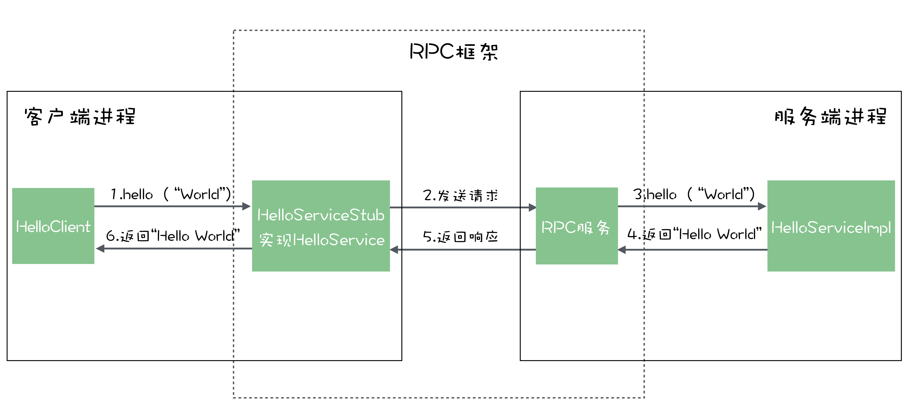
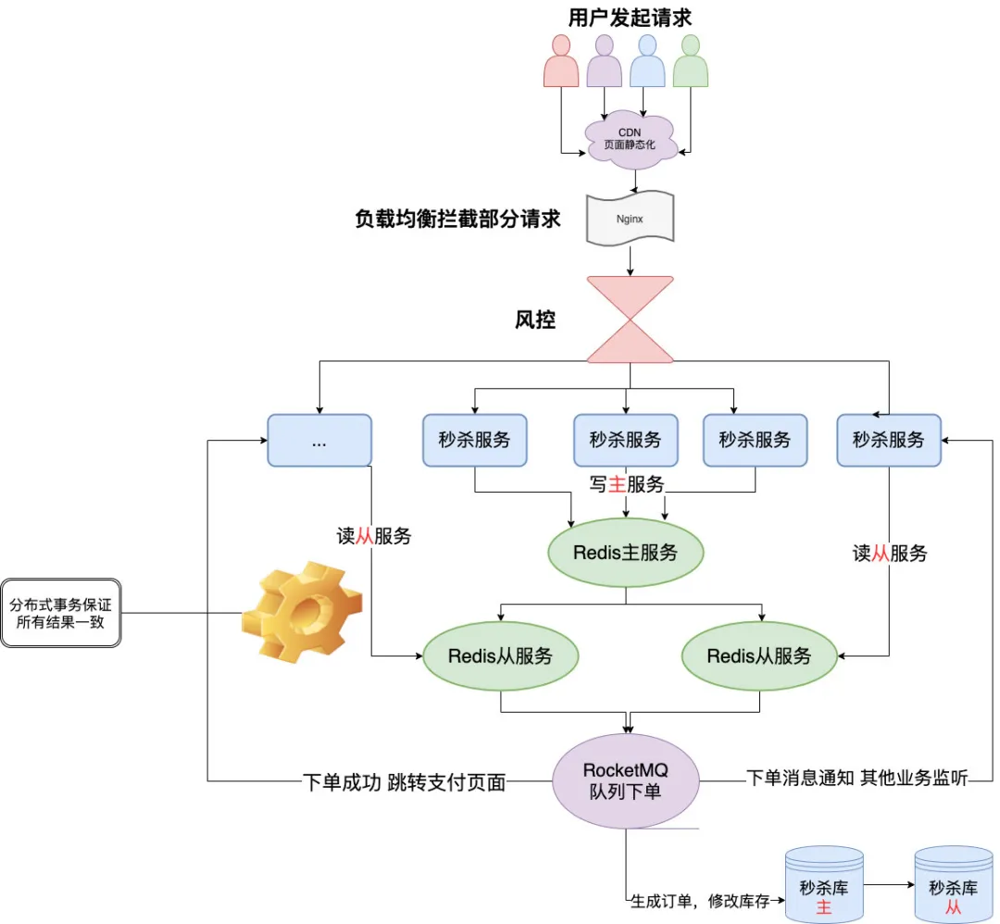

[**首页**](https://github.com/qdw497874677/myNotes/blob/master/首页检索.md)

# 分布式原理

随着系统访问量的增加，使用分布式架构对服务器进行冗余，在通过负载均衡去分发请求。演变成下图

## 分布式事务

指事务的参与者、支持事务的服务器、资源服务器以及事务管理器分别位于不同的节点上

特点

- 数据库基于业务特点，进行**分库分表**
- **业务拆分**

## CAP

CAP理论，描述了分布式系统的三大指标。当网络分区出现时，一致性和可用性不能同时保证。

### C - Consistency

一致性是指写操作后读操作可以读到最新的状态，如果数据分布在多个节点上，在任意节点都能读到最新数据。

通过锁定资源，等到分布式系统中各节点数据同步完成后在提供服务。这种方式可以提高一致性但是降低可用性。

### A - Availability

可用性指任何操作都能得到响应结果，且不会出现响应结果或者超时。

减少对操作的限制，不要求操作数据为最新，可以降低响应时间，提高可用性。

### P - Partition tolerance

分区容忍性指不同的节点或者区域之间通信失败后，仍然可以提供对外服务。主要体现在别的服务器节点挂掉或者数据库从库同步失败，自己仍然可以提供服务。

### 组合

所有的分布式事务场景中不会同时具备CAP三个特性，因为具备了P的前提下C和A是不能共存的。

#### AP

放弃一致性，追求分区容忍度和可用性。这种方式都会保证最终数据一致性，将数据更新到整个系统中的时间延迟，比如两小时内到账。这是最常见的选择。

#### CP

放弃可用性，追求一致性和分区容错性。Zookeeper就追求强一致性，还有跨行转账需要等到双方银行系统都玩成整个事务才算完成。

#### CA

放弃分区容错性，追求一致性和分区容错性，即不进行分区。**这样系统将不是一个标准的分布式系统**，就像我们常用的关系型数据就满足了CA。**可以把需要CA的业务不进行分区。**

## BASE

BASE理论主要对CAP理论中的**一致性和可用性做权衡**结果。核心思想是：即使无法做到强一致性，但每个应用都可以根据自身业务特点，采用适当策略实现数据的最终一致性。

### Basically Available

基本可用。分布式系统出现故障时，允许损失部分可用性。例如电商甩卖，为保证主业务，不重要的业务进行服务降级降低可用性。

### Soft State

软状态。允许系统中的数据存在中间状态，并认为该中间状态的存在不会影响系统的整体可用性，即允许系统在多个不同节点的数据副本存在数据延时。

### Eventually Consistent

最终一致性。数据不能一直处于软状态，必须有一个时间期限，时间过后保证所有副本保持数据一致性，从而达到数据的最终一致性。

#### 五种最终一致性

#### 因果一致性（Causal consistency）

因果一致性指的是：如果节点A在更新完某个数据后通知了节点B，那么节点B之后对该数据的访问和修改都是基于A更新后的值。于此同时，和节点A无因果关系的节点C的数据访问则没有这样的限制。

#### 读己之所写（Read your writes）

读己之所写指的是：节点A更新一个数据后，它自身总是能访问到自身更新过的最新值，而不会看到旧值。其实也算一种因果一致性。

#### 会话一致性（Session consistency）

会话一致性将对系统数据的访问过程框定在了一个会话当中：系统能保证在同一个有效的会话中实现 “读己之所写” 的一致性，也就是说，执行更新操作之后，客户端能够在同一个会话中始终读取到该数据项的最新值。

#### 单调读一致性（Monotonic read consistency）

单调读一致性指的是：如果一个节点从系统中读取出一个数据项的某个值后，那么系统对于该节点后续的任何数据访问都不应该返回更旧的值。

#### 单调写一致性（Monotonic write consistency）

单调写一致性指的是：一个系统要能够保证来自同一个节点的写操作被顺序的执行。

> 在实际的实践中，这5种系统往往会结合使用，以构建一个具有最终一致性的分布式系统。

实际上，不只是分布式系统使用最终一致性，关系型数据库在某个功能上，也是使用最终一致性的。比如备份，数据库的复制过程是需要时间的，这个复制过程中，业务读取到的值就是旧的。当然，最终还是达成了数据一致性。这也算是一个最终一致性的经典案例。

# 负载均衡

## 概念

将请求分发到多台应用服务器，以此来分散压力的一种架构方式。

## 实现方式

### 重定向

请求都发给前置机，前置机去计算要分配给那个服务器，然后响应给客户端，让客户端重定向。

### 反向代理

请求发给前置机，使用反向代理方式，将请求分发给服务器，客户端不用再请求一次。通常有两种实现，一是交换机实现，另外一种是通过nginx这种软件方式实现

### 数据链路返回

前置机通过给服务器设置虚拟ip和修改mac地址的方式，将请求分发给服务器，服务器处理完直接响应给客户端

## 负载均衡算法

### 轮询法

按请求顺序均匀分配到后端服务器。不关心服务器实际的连接数和当前的系统负载。

### 随机法

通过系统的随机算法，根据服务器的列表大小来随机一台服务器进行访问。访问次数多时，效果类似平均分配。

### 源地址哈希法

根据客户端的ip地址，通过Hash算法得到一个数值，然后对服务器列表大小进行取模，得到服务器序号。这样同一ip当列表不变时，他访问的服务器也不变。

### 加权轮询法

不同的服务器可能配置不相同，抗压能力不同。通过配置不同的权重，去顺序轮询，权重高的会多分配请求。

### 加权随机法

也是加权，通过权重高的随机到的概率高来分配请求

### 最小连接数法

动态**选取当前积压连接数少**的来处理当前请求。

## 一致性Hash

### 背景

当一个单节点的缓存容量不够后，需要增加节点来分库，对于每个key都映射到对应的节点上。如果分布式集群中有个集群宕机了，对应的key的缓存无法存储导致服务器压力过大。对于增加机器时，又需要保证大部分key在原有映射到的服务器上保持不变。

总结：**如何保证分布式集群中添加节点和删除节点，对应key的映射保持稳定。可以通过一致性哈希算法解决。**

如果简单的使用普通Hash算法，得到服务器序号，当服务器数量发生变化，对应key算出来序号都会变化。

这种方式要求增加一台缓存服务器时，新的服务器尽量分担存储其他服务器的缓存资源。减少一台缓存服务器时，其他所有服务器可以尽量分担存储它的缓存资源。

### 实现原理

**一致性哈希算法**主要思想：将每个缓存服务器与一个或多个哈希**值域区间**关联起来，其中区间边界通过计算缓存服务器对应的哈希值来决定。如果一个缓存服务器被移除，则它所对应的区间会被并入到邻近的区间，其他的缓存服务器不需要任何改变。

将映射空间组织成一个环，值的范围为0 - 2^23-1，也就是一个无符号整形的范围。

- 先对服务器进行Hash计算。
- 当请求到来时，对请求进行Hash计算，从计算的哈希值开始顺时针找到第一个服务器的Hash位置，这个服务器就是分配给请求的服务器。

也就是把服务器Hash之前的服务分配给一个服务器。

### 效果

当一个节点A不可用。把他从移除，请求接着顺时针寻找下一个可用节点B。这样原本打到节点A的请求就快速分给节点B，同时不影响打到其他节点的请求。

当需要添加一个节点，比如在A和B中间添加一个C，原本打到B的一部分请求就分配给了，分担了B的请求，同时不影响其他。

### 问题

上面的设置中会有数据倾斜问题。当服务器比较少是，分配在整个区域的位置可能不会很均匀。就会导致请求打到服务器不均匀。

解决：可以在服务器较少的情况下，用多用几个虚拟节点再次映射到对应的服务器上。比如开始只有两个节点A、B。为A和B设置对应的虚拟节点A2、A3、B2、B3，这样总共6个几点，相对会分布均匀一些。对于打到虚拟节点的请求会再次映射到真正的节点上。

# CDN

CDN的全称是Content Delivery Network，即内容分发网络。通过在现有的Internet中增加一层新的网络架构，**将网站的内容发布到最接近用户的网络“边缘”**，使用户可以就近取得所需的内容，提高用户访问网站的响应速度。

## 相关技术

### 负载均衡

### 动态分发和复制

可以避免访问距离过长，通信经过多次路由和转发处理。将占网站主体的大部分静态页面、图像和流媒体分发复制到各地的加速节点上。

### 缓存技术

## 工作原理

在用户和服务器之间增加Cache层，主要通过接管DNS实现，将用户请求引导到Cache上获得源服务器的数据，降低访问时间。

CNAME，别名记录。当解析到源站ip后，发现有CNAME记录，之后解析请求会到对应的DNS服务器中解析出最佳节点ip。

使用CDN后的访问过程

- 本地域名服务器迭代从授权服务器解析到源站ip后，发现存在CNAME，则去想DNS调度服务器解析出最佳CDN服务器节点ip
- 本地服务器把节点ip返回给用户。
- 访问节点后，如果节点未缓存对应数据，则节点会访问源站，请求获取到资源。

# 分布式缓存

缓存的发展：本地缓存 -> 集群缓存 -> 分布式缓存

缓存的好处：

- **加速读写**。缓存一般是把数据存到内存中，
- **降低后端负载**。阻挡大量请求直接落到系统底层。降低后端对CPU、IO、线程这些资源的需求。

带来的问题：

- 数据不一致：存储层和存储层的数据，存在一定时间窗口一致。时间窗口与缓存的过期时间更新策略有关。
- 代码维护成本：加入缓存层后，要同时处理缓存层和存储层的逻辑。
- 运营成本：为了保证高可用，要做主从，做集群

## 缓存更新

对缓存中存储的数据的更新方式，更新包括删除和修改。如果要维持比较好的一致性需要去用比较适合的删除策略和主动更新结合的方式。

### LRU、LFU、FIFO

这三种算法都是在缓存不够用时采用的更新算法。区别是选择要淘汰的数据的规则不一样。

LRU淘汰最久不访问的数据、LFU淘汰操作频率最低的数据、FIFO先进先出。

一致性差

**使用场景**：适合内存空间有限，数据长期不变动，基本不存在数据不一致性的业务。

### 超时删除

给缓存数据设置一个过期时间。当数据在缓存中不存在后，从数据源重新放到缓存中。

数据一致性一般。

**使用场景**：适合能够容忍一定时间内数据不一致的业务，比如促销活动的描述文案。

### 主动更新

如果数据源有更新，则主动更新缓存。

一致性较高。开发维护成本比较高，**业务数据的更新与缓存更新耦合**到了一起。需要处理业务数据更新成功，缓存更新失败的情景。

为了解耦一般用消息队列的方式来更新。为了提高容错率，会结合超时删除的方案，避免缓存得不到更新的场景。

优化：

- **异步更新缓存**：来解耦业务数据更新和缓存更新，提高容错率。
- **结合缓存超时删除**：防止缓存得不到更新的情况。

**使用场景**：对于数据的一致性要求高，比如交易系统，优惠券的总张数。

### 总结

**低一致性业务**：过量删除 + 超时删除

**高一致性业务**：超时删除 + 主动更新

## 缓存更新方案

### 更db，更（删）缓存

写多读少的场景如果总是主动更新缓存的话会造成很多无用的操作，所以更适合直接删除缓存。在查缓存时再从db获取。

可能出现的问题：

- 脏数据
- 更新缓存频繁（不更新缓存，而是删除缓存就减少了）

### 更缓存，更db

优先更新缓存，然后异步更新数据库。

对于更新频繁的情况可以选择这样，但是如果有大量请求对同一个key做更新，容易发生数据不一致：更新db的操作的覆盖。

## 缓存穿透、击穿

### 穿透

指查询一个不存在的数据，缓存和数据源存储都不能命中。如果没有做处理，大量的请求可能击垮存储层。

有下面方法：

#### 缓存空对象

如果存储层没有查到，就在缓存层中存储一个空的对象。

问题：

- 如果一瞬间有大量不同的请求同时查同一个不存在的数据，在还没有更新缓存空对象时，大量查询还是会穿透到数据层。
- 缓存层中的空对象浪费空间

针对这种方案作出优化：

- 做好业务过滤：通过缩小范围，将越界的请求直接返回，不查询。
- 给缓存的空对象设置较短的过期时间。

#### 布隆过滤器

布隆过滤器是一种**Hash和Bitmap**结合的数据结构。可以把一个值经过不同的Hash得到几个索引值，映射到Bitmap中，设置为1。如果查询时发现对应Hash后的几个索引位都不全是1，说明肯定是不存在的，但是如果全是1，是不一定存在的。

可以优先判断元素是否存在于集合中，在业务中主动更新布隆过滤器。

使用：可以在本地用布隆过滤器去主动缓存，对于漏判的使用空对象处理。

##### 使用

Redis中有bloomfilter插件。常用命令有：

~~~shell
bf.add users user3

bf.exists users user1
~~~

### 击穿

某个热点数据不可用，导致存储层压力增大。

优化方案：主要是优化热点key的重建

- 互斥锁：同时只允许一个线程对缓存重建。用集群服务用分布式锁。
- 永不过期：更新是独立的，主动更新。
- 后端限流：前两个是知道哪些是热点key的情况。如果不知道还得是后端自己做限流，主要安全的更新一个就好了
- 减少同时过期的key：对一批key的过期时间可以设置为一定范围的随机数。
- 热点key预热：在关键时间提前对一些热点数据更新随机的过期时间等。

### 雪崩

大量缓存数据不可使用，所有请求到达存储层，导致存储层宕机。可能是因为大量热点数据同时击穿，或者是缓存服务器宕机。

优化方案：

- 保证缓存层的高可用：比如Redis集群的哨兵机制
- 为后端限流降级：比如用hystrix。
  - 保证还可以处理少量的请求，用户点一次不行多点几次会有。

# 分布式锁

在集群中，多台主机都有一个共同的资源，如果不加分布式锁，不同的访问后，他们的结果可能不一样。

分布式锁需要具备的条件

- 一个方法同一时间只能被一台机器的一个线程执行。
  - （Redis）setnx。
- 获取锁，释放锁要高可用高性能。
  - （Redis）setnx。
- 具备可重用。
  - （Redis）在获取锁的时候，判断当前线程是否已经拿到锁了。然后将计数器加减，每获取一次锁加一，每解锁一次减一。
- 具备锁失效机制，防止死锁。
  - （Redis）设置过期时间，为了保证业务完成，每过一定时间重新设置超时时间 ，让业务异步的执行。
- 具备非阻塞锁特性，即没有获得锁可以返回获取锁失败。
  - （Redis）让线程阻塞，然后利用发布订阅解决实时性。

## Redis实现的分布式锁

### 加锁

加锁可以用过setnx key value来实现。为了保证出现故障没有进行del从而发生死锁，要给锁加一个过期时间。需要保证设置锁并且加过期时间的操作为原子性的。方法有：

- 事务
- lua脚本
- set key value ex 10 nx：设置key并且加过期时间并且是如果存在key就不操作返回失败。

### 超时问题

当获取锁后的逻辑处理时间过长导致锁超时清除后，进行解锁时已经被别的线程获取，这时如果删除锁key就会出现问题。

所以解锁时要先判断锁是否为自己的，通过比对自己设置的value值来判断(可以用uuid)。如果相同就去进行删除key。这两个操作需要保证原子性。

可以使用lua脚本处理

~~~lua
if redis.call("get",KEYS[1]) == ARGV[1] then
    return redis.call("del",KEYS[1])
else
    return 0
end
~~~

### 可重入性

可以对客户端的get进行包装，使用线程的Threadlocal变量存储当前锁的计数。

## Redisson

~~~java
Rlock product = redisson.getLock("priduct");
product.lock();
priduct.unlock();
~~~

## Redlock

### 集群下的问题

在集群结合哨兵的设置下，客户端对主节点没有特别的感知，当锁所在的主节点宕机了，锁数据还没来得及同步到从节点，哨兵已经指定了新的主节点。其他线程尝试获取锁时，发现可用，这时就有两个线程同时拥有了锁。

### 红锁原理

使用Redlock需要提供多个独立的Redis实例，这些实例之间相互独立，使用大多数机制。

加锁时会向过半节点发送设置锁指令，只要过半设置成功，就认为加锁成功。释放锁时向所有节点发送删除锁key指令。

# 微服务

## 什么是

将单体应用分成一组小型服务。每个小型服务运行在自己的进程中，之间通过轻量级机制通信（HTTP REST API）。这些服务都是围绕业务建立的，可以独立开发（可用不同语言实现，存储不同数据），独立部署。

## 为什么用微服务

- 有更好的可扩展性：分为三个维度

  - 水平可扩展：部署了一个服务，可以通过部署在多台服务器，增加性能
  - 业务可扩容：把多个业务中的通用的业务提取成服务，把不同的业务提取成为多个服务，来与公共服务连接
  - 数据可扩展：每个服务可以只使用自己需要的数据来源

- 独立发布和部署

- 独立开发：每个服务可以使用独立的技术栈来开发

- 优雅降级：如果单个服务崩溃，影响会比较小，提高整机的健壮性

# RPC

## RPC和HTTP接口的区别

这两者都可以调用远程的方法。RPC是一种设计，为了解决服务之间的调用问题，包含传输协议和序列化协议，rpc的传输协议可以建立在tcp上，也可以建立在http协议之上。http调用只是遵循http协议的一种传输过程。

HTTP协议支持连接池复用，可以在一个tcp连接中发送多个http请求。对于一个http请求，报文中的信息密度不高。RPC可以自定义数据整体，可增大数据密度来针对不同类型。

对于http2.0的编码问题已经不是最终问题了，主要是，RPC内部也可以使用HTTP请求来通信，同时也可以自定义自己的数据传输。RPC还包含很多服务治理相关的功能，包括服务发现，负载均衡，熔断等

## Thrift

## 实现一个简单的RPC

RPC框架可以实现，在客户端直接调用服务端的方法，就像调用本地方法一样。

## Dubbo的基本使用

在客户端通过@Reference注解加载接口引用上，就获得一个接口的实现类，对于客户端就可以直接调用了，而真正的服务是写在服务端的。

在服务端创建对应接口的实现类，来类上写上Dubbo的@Service，这个实现类注册到了Dubbo框架中。

## 基本原理

客户端得到的接口实例，并不是在服务器端提供的实现类实例，而是RPC框架提供的一个代理类实例，称为桩（Stub）。

不同的RPC框架中，桩的生成方式不一样，**有的是在编译阶段生成，有的是在运行时动态生成。**

### **桩**

桩要实现接口，供客户端去调用。**桩实现的方法中会构造一个请求**，然后发送给服务端。这个请求就是一段数据结构，包含两个重要的信息：

1. **请求的服务名**，一般表示为：接口名#方法明和参数。
2. **请求的所有参数**，包括参数类型和具体的值。

然后它会把这个请求发送给服务端，等待服务的响应。

服务端的RPC框架收到请求后，先把**服务名解析**出来，然后根据这个服务名在注册到RPC框架中的实现类中寻找对应服务提供者。找到后会使用请求中的参数来调用实现类的方法，**将返回结果封装成响应返回**给客户端。

### 客户端怎么找到服务端地址

需要有中间件作为一个注册中心。服务端的业务代码向RPC框架中注册服务之后，就会把服务的名称的地址发布到注册中心中。客户端的桩在调用前，会向注册中心请求服务端的地址，请求的**参数就是服务名称**，注册中心会返回服务的地址，然后客户端去请求服务端。

### IDL

对于跨语言的RPC框架，本质和普通RPC是一样的，只要在RPC框架中使用相同的序列化协议，就可以实现跨语言通信。

为了在不同的语言中能描述相同的服务定义，还需要提供一套通用的描述服务的语言，成为IDL（Interface description language）接口描述语言。所有的服务都需要用IDL定义，再由RPC框架转换为特定的编程语言的接口或者实现类。

# 测试接口的工具

postman、jmeter

# 秒杀

特点：时间极短、瞬间用户量大

对于秒杀商品这种高并发场景，要怎么处理？

## 问题

- 超卖
- 恶意请求：机器把商品全部抢走
- 连接暴露：开发者提前知道链接。出现内部秒杀
- 数据库压力

## 解决

- **服务单一职责**
  - 用微服务的思想，把各个业务拆分成服务。秒杀作为一个单独的微服务。单独建立一个秒杀数据库。其他的有短信服务、数据分析服务订单服务等等。
  - 好处就是秒杀服务崩了，不会影响其他服务。
- **秒杀链接加盐**
  - 将秒杀URL动态化，写代码的人也不知道链接。
  - 秒杀开始前设置一个随机数作为盐，通过MD5加密后，提供一个接口来获取这个盐。前端发送秒杀请求时，先获取加密的盐，秒杀请求需要带上这个参数。服务端去解密出盐来对比，如果相等就进行秒杀逻辑。
- **Redis集群**
  - 搭建集群、主从同步、独写分离、持久化，来提高服务的可用性
- **负载均衡**
  - 对秒杀服务，横向扩展。用Nginx或者网关服务去做负载均衡，让多实例分担流量。
  - 同时也去拦截而已请求，对单个用户流量做限流
- **资源静态化**
  - 前端做好静态资源的缓存，把能放的都放进CDN服务器
- **按钮控制**
  - 通过按钮限制用户操作
- **物理限流**
  - 前端限流：限制请求发送频率
  - 后端限流：当商品卖光了，return了false，直接秒杀结束。
- **库存预热**
  - 提前把商品加载到Redis中，秒杀流程都去操作Redis，等秒杀结束去异步的修改DB。
  - 先读如果有存货，再去扣库存，需要两步。这两步需要具有**原子性。可以使用lua脚本或者pipeline**
- **限流&降级&熔断&隔离**
  - 万一顶不住了。限流可以挡住一部分请求，只服务一部分请求。降级，把资源分配给更重要的请求。熔断，挂掉后做兜底，不会影响其他服务。隔离，通过微服务的形式避免服务间的影响。
- **削峰填谷**
  - 通过MQ对一些耗时但是实时性不高的操作，做异步处理。比如同步缓存到数据库

