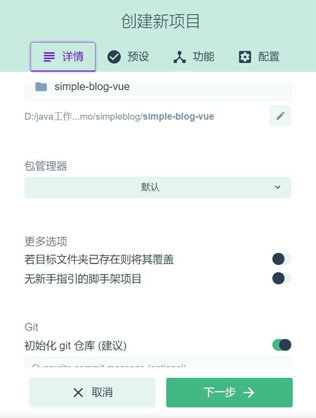
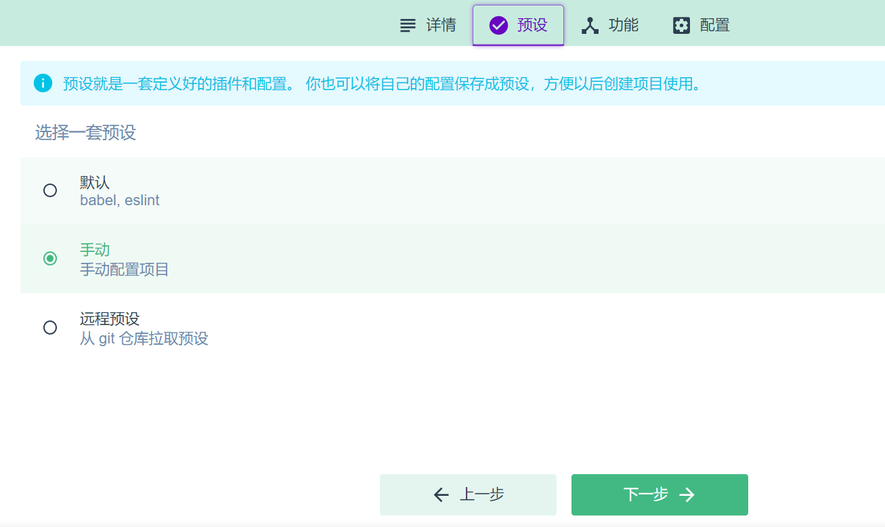
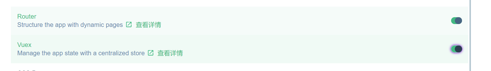
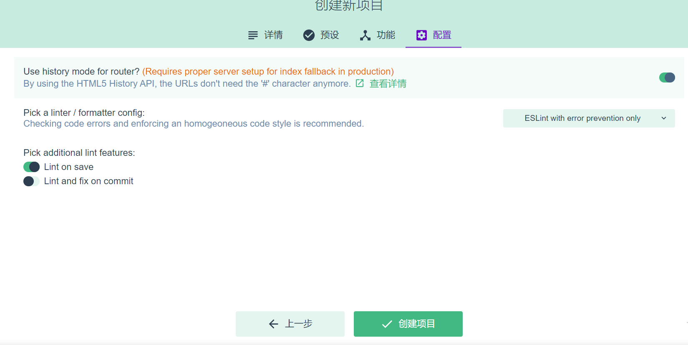
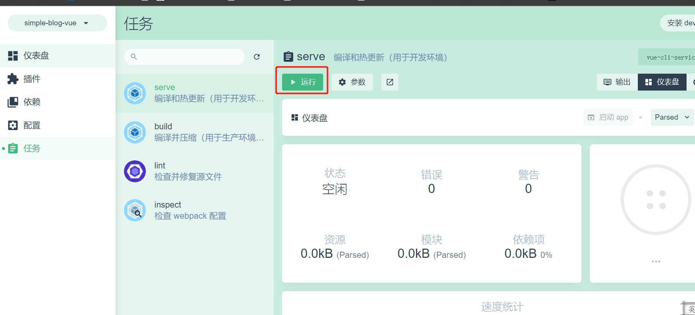
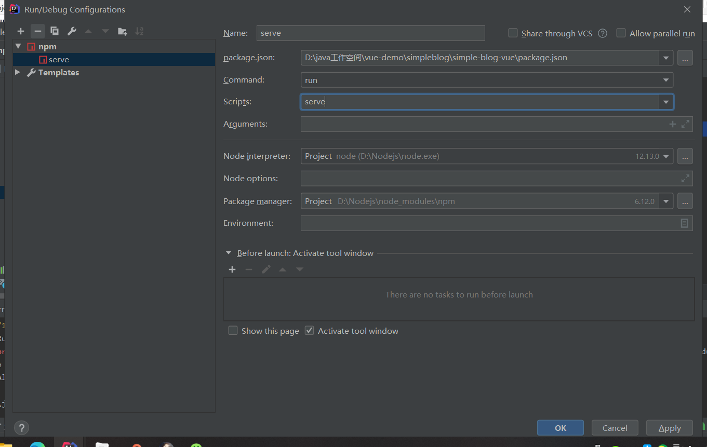
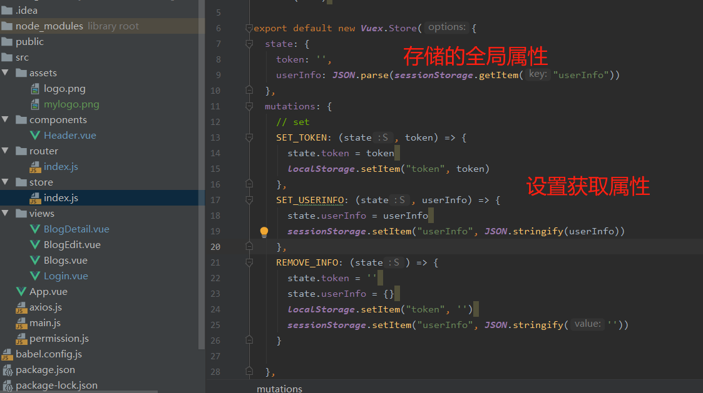
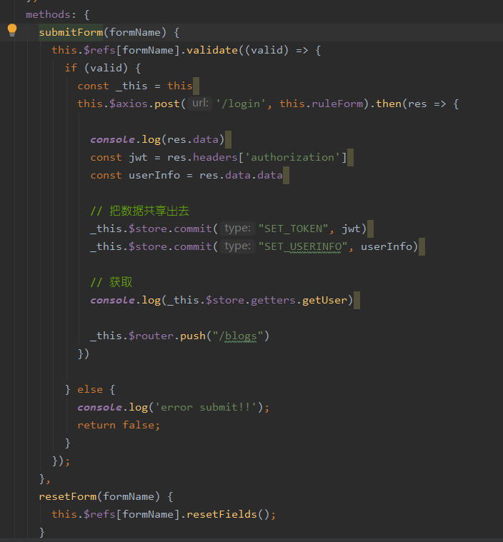

[**首页**](https://github.com/qdw497874677/myNotes/blob/master/首页检索.md)

# 安装环境

~~~cmd
npm i -g @vue/cli
~~~

打开网页8000

用idea打开项目（安装vue插件）

## 安装elementUI

关闭vueui那个cmd窗口

直接在idea中操作

~~~cmd
cnpm install element-ui --save
~~~

然后在main.js中引入依赖

~~~js
import Element from 'element-ui'
import "element-ui/lib/theme-chalk/index.css"
Vue.use(Element)
~~~

配置运行，就可以在idea中运行通过按钮运行，或者直接通过终端运行。

## 安装axios

~~~shell
cnpm install axios --save
~~~

在main.js中引用

~~~js
import axios from 'axios'
Vue.prototype.$axios = axios
~~~

## 登录

### 保存状态

获取jwt，把jwt放在所有组件都能访问到的地方。

放在之前导入的store中

SET_TOKEN设置token，并且保存到localStorage中。localStorage 方法存储的数据没有时间限制。第二天、第二周或下一年之后，数据依然可用。

~~~
用法： 
存： //
1. 点（.）运算符                 sessionStorage.lastname = 'key';
2. 方括号（[ ]）运算符           sessionStorage['lastname'] = 'key';
3. localStorage.setItem         sessionStorage.setItem("lastname", "key");

取： 
1. 点（.）运算符                 sessionStorage.lastname  => key
2. 方括号（[ ]）运算符           sessionStorage['lastname']  => key
3. localStorage.getItem         sessionStorage.getItem("lastname")  => localStorage
~~~

SET_USERINFO设置userInfo，保存在sessionStorage中。sessionStorage 方法针对一个 session 进行数据存储。当用户关闭浏览器窗口后，数据会被删除。

~~~
用法： 
存：
1. 点（.）运算符                 localStorage.lastname = 'key';  
2. 方括号（[ ]）运算符           localStorage['lastname'] = 'key';
3. localStorage.setItem         localStorage.setItem("lastname", "key");

取：
1. 点（.）运算符                 localStorage.lastname  => key
2. 方括号（[ ]）运算符           localStorage['lastname']  => key
3. localStorage.getItem         localStorage.getItem("lastname")  => key
~~~

REMOVE_INFO移除token和info

### 登录界面

## 全局axios拦截

新建一个axios.js，之后引入到main.js中

