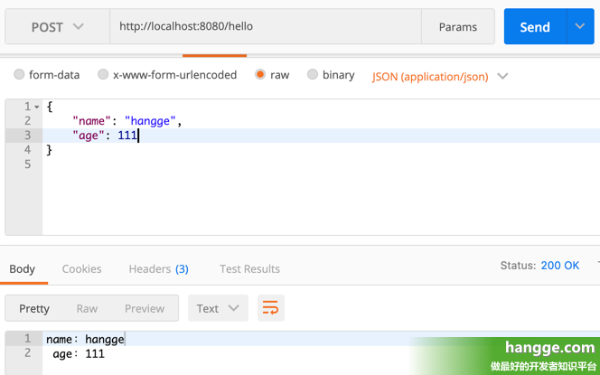

[**首页**](https://github.com/qdw497874677/myNotes/blob/master/首页检索.md)

# 简介

我做了一个个人博客网站的一个项目。主要用的框架是springboot和mybatis。实现添加博客和展示博客，和给博客添加分类和标签。后面又用redis实现一个根据访问量最多的10篇博客的排行。然后把博客id、标题、简介放入ElasticSearch中，实现对标题和简介中的关键字的搜索。


# 问题

## 跨域问题

### 什么是跨域

JavaScript出于安全方面的考虑，不允许跨域调用其他页面的对象。那什么是跨域呢，简单地理解就是因为JavaScript同源策略的限制，a.com域名下的js无法操作b.com或是c.a.com域名下的对象。

当协议、子域名、主域名、端口号中任意一个不相同时，都算作不同域。不同域之间相互请求资源，就算作“跨域”。

例如：http://www.abc.com/index.html 请求 http://www.efg.com/service.php。

跨域并不是请求发不出去，请求能发出去，服务端能收到请求并正常返回结果，只是结果被浏览器拦截了。之所以会跨域，是因为受到了同源策略的限制，同源策略要求源相同才能正常进行通信，即协议、域名、端口号都完全一致。


# 排行

排行是每天更新。启动时添加到缓存

缓存中zset存储，blogid，分值是view访问量。

~~~shell
zset rank view blogid
zrerangebyscore rank 0 -1 withscores
~~~


数据库操作

~~~sql
select blogid,view order by view desc limit 1,10
~~~

同部数据库

# 搜索


# GET传参

## 一、参数直接在路径中

（1）假设请求地址是如下这种 **RESTful** 风格，**hangge** 这个参数值直接放在路径里面：

```
http://localhost:8080/hello/hangge
```


（2）**Controller** 可以这么获取该参数： 

```
package com.example.demo;
 
import org.springframework.web.bind.annotation.PathVariable;
import org.springframework.web.bind.annotation.RestController;
import org.springframework.web.bind.annotation.GetMapping;
 
@RestController
public class HelloController {
    @GetMapping("/hello/{name}")
    public String hello(@PathVariable("name") String name) {
        return "获取到的name是：" + name;
    }
}
```

[](https://www.hangge.com/blog/cache/detail_2484.html#)

## 二、参数跟在 ? 号后面

### 1，获取参数的基本方法

（1）假设请求地址是如下这种传统方式，参数跟在问号后面：

```
http://localhost:8080/hello?name=hangge
```

（2）**Controller** 可以这么获取该参数：

```
package com.example.demo;
 
import org.springframework.web.bind.annotation.RequestParam;
import org.springframework.web.bind.annotation.RestController;
import org.springframework.web.bind.annotation.GetMapping;
 
@RestController
public class HelloController {
    @GetMapping("/hello")
    public String hello(@RequestParam("name") String name) {
        return "获取到的name是：" + name;
    }
}
```

[](https://www.hangge.com/blog/cache/detail_2484.html#)

### 2，参数没有传递的情况

（1）如果没有传递参数 **Controller** 将会报错，我们可以使用 **required = false** 标注参数是非必须的。

```
package com.example.demo;
 
import org.springframework.web.bind.annotation.RequestParam;
import org.springframework.web.bind.annotation.RestController;
import org.springframework.web.bind.annotation.GetMapping;
 
@RestController
public class HelloController {
    @GetMapping("/hello")
    public String hello(@RequestParam(name = "name", required = false) String name) {
        return "获取到的name是：" + name;
    }
}
```

[](https://www.hangge.com/blog/cache/detail_2484.html#)


（2）或者可以指定个默认值，当没有传递参数时自动使用默认值：

```
package com.example.demo;
 
import org.springframework.web.bind.annotation.RequestParam;
import org.springframework.web.bind.annotation.RestController;
import org.springframework.web.bind.annotation.GetMapping;
 
@RestController
public class HelloController {
    @GetMapping("/hello")
    public String hello(@RequestParam(name = "name", defaultValue = "xxx") String name) {
        return "获取到的name是：" + name;
    }
}
```

[](https://www.hangge.com/blog/cache/detail_2484.html#)

### 3，使用 map 来接收参数

（1）**Controller** 还可以直接使用 **map** 来接收所有的请求参数：

```
package com.example.demo;
 
import org.springframework.web.bind.annotation.RequestParam;
import org.springframework.web.bind.annotation.RestController;
import org.springframework.web.bind.annotation.GetMapping;
 
import java.util.Map;
 
@RestController
public class HelloController {
    @GetMapping("/hello")
    public String hello(@RequestParam Map<String, Object> params) {
        return "name：" + params.get("name") + "<br>age：" + params.get("age");
    }
}
```


（2）下面是一个简单的测试样例：

[](https://www.hangge.com/blog/cache/detail_2484.html#)


### 4，接收一个数组

（1）假设请求地址是如下这种，有多个同名参数：

```
http://localhost:8080/hello?name=hangge&name=google
```


（2）我们可以定义一个数组类型的参数来接收：

```
package com.example.demo;
 
import org.springframework.web.bind.annotation.RequestParam;
import org.springframework.web.bind.annotation.RestController;
import org.springframework.web.bind.annotation.GetMapping;
 
@RestController
public class HelloController {
    @GetMapping("/hello")
    public String hello(@RequestParam("name") String[] names) {
        String result = "";
        for(String name:names){
            result += name + "<br>";
        }
        return result;
    }
}
```

[](https://www.hangge.com/blog/cache/detail_2484.html#)

## 附：使用对象来接收参数

### 1，基本用法

（1）如果一个 **get** 请求的参数太多，我们构造一个对象来简化参数的接收方式：

```
package com.example.demo;
 
import org.springframework.web.bind.annotation.RestController;
import org.springframework.web.bind.annotation.GetMapping;
 
@RestController
public class HelloController {
    @GetMapping("/hello")
    public String hello(User user) {
        return "name：" + user.getName() + "<br> age：" + user.getAge();
    }
}
```


（2）**User** 类的定义如下，到时可以直接将多个参数通过 **getter**、**setter** 方法注入到对象中去：

```
package com.example.demo;
 
public class User {
    private String name;
    private Integer age;
 
    public String getName() {
        return name;
    }
 
    public void setName(String name) {
        this.name = name;
    }
 
    public Integer getAge() {
        return age;
    }
 
    public void setAge(Integer age) {
        this.age = age;
    }
}
```

（3）下面是一个简单的测试样例：

[](https://www.hangge.com/blog/cache/detail_2484.html#)


（4）如果传递的参数有前缀，且前缀与接收实体类的名称相同，那么参数也是可以正常传递的：

[](https://www.hangge.com/blog/cache/detail_2484.html#)


### 2，指定参数前缀

（1）如果传递的参数有前缀，且前缀与接收实体类的名称不同相，那么参数无法正常传递：

[](https://www.hangge.com/blog/cache/detail_2484.html#)


（2）我们可以结合 **@InitBinder** 解决这个问题，通过参数预处理来指定使用的前缀为 **u**.

  除了在 **Controller** 里单独定义预处理方法外，我们还可以通过 **@ControllerAdvice** 结合 **@InitBinder** 来定义全局的参数预处理方法，方便各个 **Controller** 使用。具体做法参考我之前的文章：

- [SpringBoot - @ControllerAdvice的使用详解3（请求参数预处理 @InitBinder）](https://www.hangge.com/blog/cache/detail_2483.html)

```
package com.example.demo;
 
import org.springframework.web.bind.WebDataBinder;
import org.springframework.web.bind.annotation.*;
 
@RestController
public class HelloController {
    @GetMapping("/hello")
    public String hello(@ModelAttribute("u") User user) {
        return "name：" + user.getName() + "<br> age：" + user.getAge();
    }
 
    @InitBinder("u")
    private void initBinder(WebDataBinder binder) {
        binder.setFieldDefaultPrefix("u.");
    }
}
```


（3）重启程序可以看到参数以及成功接收了：

[](https://www.hangge.com/blog/cache/detail_2484.html#)


### 3，构造多个对象来接收参数

（1）如果一个 **get** 请求的参数分属不同的对象，也可以使用多个对象来接收参数：

```
package com.example.demo;
 
import org.springframework.web.bind.annotation.RestController;
import org.springframework.web.bind.annotation.GetMapping;
 
@RestController
public class HelloController {
    @GetMapping("/hello")
    public String hello(User user, Phone phone) {
        return "name：" + user.getName() + "<br> age：" + user.getAge()
                + "<br> number：" + phone.getNumber();
    }
}
```


（2）新增的 **Phone** 类定义如下：

```
package com.example.demo;
 
public class Phone {
    private String number;
 
    public String getNumber() {
        return number;
    }
 
    public void setNumber(String number) {
        this.number = number;
    }
}
```


（3）下面是一个简单的测试样例：

[](https://www.hangge.com/blog/cache/detail_2484.html#)


# POST传参

## 一、接收 Form 表单数据

### 1，基本的接收方法

（1）下面样例 **Controller** 接收 **form-data** 格式的 **POST** 数据：

```java
package com.example.demo;
 
import org.springframework.web.bind.annotation.PostMapping;
import org.springframework.web.bind.annotation.RequestParam;
import org.springframework.web.bind.annotation.RestController;
 
@RestController
public class HelloController {
    @PostMapping("/hello")
    public String hello(@RequestParam("name") String name,
                        @RequestParam("age") Integer age) {
        return "name：" + name + "\nage：" + age;
    }
}
```

（2）下面是一个简单的测试样例：

[](https://www.hangge.com/blog/cache/detail_2485.html#)

### 2，参数没有传递的情况

（1）如果没有传递参数 **Controller** 将会报错，这个同样有如下两种解决办法：

- 使用 **required = false** 标注参数是非必须的。
- 使用 **defaultValue** 给参数指定个默认值。

```
package com.example.demo;
 
import org.springframework.web.bind.annotation.PostMapping;
import org.springframework.web.bind.annotation.RequestParam;
import org.springframework.web.bind.annotation.RestController;
 
@RestController
public class HelloController {
    @PostMapping("/hello")
    public String hello(@RequestParam(name = "name", defaultValue = "xxx") String name,
                        @RequestParam(name = "age", required = false) Integer age) {
        return "name：" + name + "\nage：" + age;
    }
}
```

（2）下面是一个简单的测试样例：

[](https://www.hangge.com/blog/cache/detail_2485.html#)

### 3，使用 map 来接收参数

（1）**Controller** 还可以直接使用 **map** 来接收所有的请求参数：

```
package com.example.demo;
 
import org.springframework.web.bind.annotation.PostMapping;
import org.springframework.web.bind.annotation.RequestParam;
import org.springframework.web.bind.annotation.RestController;
 
import java.util.Map;
 
@RestController
public class HelloController {
    @PostMapping("/hello")
    public String hello(@RequestParam Map<String,Object> params) {
        return "name：" + params.get("name") + "\nage：" + params.get("age");
    }
}
```


（2）下面是一个简单的测试样例：

[](https://www.hangge.com/blog/cache/detail_2485.html#)


### 4，接收一个数组

（1）表单中有多个同名参数，**Controller** 这边可以定义一个数据进行接收：

```
package com.example.demo;
 
import org.springframework.web.bind.annotation.PostMapping;
import org.springframework.web.bind.annotation.RequestParam;
import org.springframework.web.bind.annotation.RestController;
 
import java.util.Map;
 
@RestController
public class HelloController {
    @PostMapping("/hello")
    public String hello(@RequestParam("name") String[] names) {
        String result = "";
        for(String name:names){
            result += name + "\n";
        }
        return result;
    }
}
```


（2）下面是一个简单的测试样例：


[](https://www.hangge.com/blog/cache/detail_2485.html#)


### 5，使用对象来接收参数

（1）如果一个 **post** 请求的参数太多，我们构造一个对象来简化参数的接收方式：

```java
package com.example.demo;
 
import org.springframework.web.bind.annotation.PostMapping;
import org.springframework.web.bind.annotation.RestController;
 
@RestController
public class HelloController {
    @PostMapping("/hello")
    public String hello(User user) {
        return "name：" + user.getName() + "\nage：" + user.getAge();
    }
}
```


（2）**User** 类的定义如下，到时可以直接将多个参数通过 **getter**、**setter** 方法注入到对象中去：

```java
package com.example.demo;
 
public class User {
    private String name;
    private Integer age;
 
    public String getName() {
        return name;
    }
 
    public void setName(String name) {
        this.name = name;
    }
 
    public Integer getAge() {
        return age;
    }
 
    public void setAge(Integer age) {
        this.age = age;
    }
}
```

（3）下面是一个简单的测试样例：

[](https://www.hangge.com/blog/cache/detail_2485.html#)

（4）如果传递的参数有前缀，且前缀与接收实体类的名称相同，那么参数也是可以正常传递的：

[](https://www.hangge.com/blog/cache/detail_2485.html#)


（5）如果一个 **get** 请求的参数分属不同的对象，也可以使用多个对象来接收参数：

```java
package com.example.demo;
 
import org.springframework.web.bind.annotation.PostMapping;
import org.springframework.web.bind.annotation.RestController;
 
@RestController
public class HelloController {
    @PostMapping("/hello")
    public String hello(User user, Phone phone) {
        return "name：" + user.getName() + "\nage：" + user.getAge()
                + "\nnumber：" + phone.getNumber();
    }
}
```

[](https://www.hangge.com/blog/cache/detail_2485.html#)

### 6，使用对象接收时指定参数前缀

（1）如果传递的参数有前缀，且前缀与接收实体类的名称不同相，那么参数无法正常传递：

[](https://www.hangge.com/blog/cache/detail_2485.html#)


（2）我们可以结合 **@InitBinder** 解决这个问题，通过参数预处理来指定使用的前缀为 u.

  除了在 Controller 里单独定义预处理方法外，我们还可以通过 **@ControllerAdvice** 结合 **@InitBinder** 来定义全局的参数预处理方法，方便各个 **Controller** 使用。具体做法参考我之前的文章：

- [SpringBoot - @ControllerAdvice的使用详解3（请求参数预处理 @InitBinder）](https://www.hangge.com/blog/cache/detail_2483.html)

```java
package com.example.demo;
 
import org.springframework.web.bind.WebDataBinder;
import org.springframework.web.bind.annotation.*;
 
@RestController
public class HelloController {
    @PostMapping("/hello")
    public String hello(@ModelAttribute("u") User user) {
        return "name：" + user.getName() + "\nage：" + user.getAge();
    }
 
    @InitBinder("u")
    private void initBinder(WebDataBinder binder) {
        binder.setFieldDefaultPrefix("u.");
    }
}
```


（3）重启程序再次发送请求，可以看到参数已经成功接收了：

[](https://www.hangge.com/blog/cache/detail_2485.html#)


## 二、接收字符串文本数据

（1）如果传递过来的是 **Text** 文本，我们可以通过 **HttpServletRequest** 获取输入流从而读取文本内容。

```
package com.example.demo;
 
import org.springframework.web.bind.annotation.PostMapping;
import org.springframework.web.bind.annotation.RestController;
 
import javax.servlet.ServletInputStream;
import javax.servlet.http.HttpServletRequest;
import java.io.IOException;
 
@RestController
public class HelloController {
    @PostMapping("/hello")
    public String hello(HttpServletRequest request) {
        ServletInputStream is = null;
        try {
            is = request.getInputStream();
            StringBuilder sb = new StringBuilder();
            byte[] buf = new byte[1024];
            int len = 0;
            while ((len = is.read(buf)) != -1) {
                sb.append(new String(buf, 0, len));
            }
            System.out.println(sb.toString());
            return "获取到的文本内容为：" + sb.toString();
        } catch (IOException e) {
            e.printStackTrace();
        } finally {
            try {
                if (is != null) {
                    is.close();
                }
            } catch (IOException e) {
                e.printStackTrace();
            }
        }
        return null;
    }
}
```


（2）下面是一个简单的测试样例：

[](https://www.hangge.com/blog/cache/detail_2485.html#)


## 三、接收 JSON 数据

### 1，使用 Map 来接收数据

（1）如果把 **json** 作为参数传递，我们可以使用 **@requestbody** 接收参数，将数据转换 **Map**：

```
package com.example.demo;
 
import org.springframework.web.bind.annotation.PostMapping;
import org.springframework.web.bind.annotation.RequestBody;
import org.springframework.web.bind.annotation.RestController;
 
import java.util.Map;
 
@RestController
public class HelloController {
    @PostMapping("/hello")
    public String hello(@RequestBody Map params) {
        return "name：" + params.get("name") + "\n age：" + params.get("age");
    }
}
```


（2）下面是一个简单的测试样例：


[](https://www.hangge.com/blog/cache/detail_2485.html#)


### 2，使用 Bean 对象来接收数据

（1）如果把 **json** 作为参数传递，我们可以使用 **@requestbody** 接收参数，将数据直接转换成对象：

```
package com.example.demo;
 
import org.springframework.web.bind.annotation.PostMapping;
import org.springframework.web.bind.annotation.RequestBody;
import org.springframework.web.bind.annotation.RestController;
 
@RestController
public class HelloController {
    @PostMapping("/hello")
    public String hello(@RequestBody User user){
        return user.getName() + " " + user.getAge();
    }
}
```


（2）**User** 类定义如下：

```
package com.example.demo;
 
public class User {
    private String name;
    private Integer age;
 
    public String getName() {
        return name;
    }
 
    public void setName(String name) {
        this.name = name;
    }
 
    public Integer getAge() {
        return age;
    }
 
    public void setAge(Integer age) {
        this.age = age;
    }
}
```


（3）下面是一个简单的测试样例：

[](https://www.hangge.com/blog/cache/detail_2485.html#)


（4）如果传递的 **JOSN** 数据是一个数组也是可以的，**Controller** 做如下修改：

```
package com.example.demo;
 
import org.springframework.web.bind.annotation.PostMapping;
import org.springframework.web.bind.annotation.RequestBody;
import org.springframework.web.bind.annotation.RestController;
 
import java.util.List;
 
@RestController
public class HelloController {
    @PostMapping("/hello")
    public String hello(@RequestBody List<User> users){
        String result = "";
        for(User user:users){
            result += user.getName() + " " + user.getAge() + "\n";
        }
        return result;
    }
}
```

[](https://www.hangge.com/blog/cache/detail_2485.html#)


# @RequestParam和@RequestBody

##  @RequestParam注解

~~~java
@Target(ElementType.PARAMETER)
@Retention(RetentionPolicy.RUNTIME)
@Documented
public @interface RequestParam {
 
    /**
     * 参数名称（和value同等意思）
     */
    @AliasFor("name")
    String value() default "";
 
    /**
     * 参数名称 (和name同等意思)
     */
    @AliasFor("value")
    String name() default "";
 
    /**
     * 是否必选（默认必选）
     */
    boolean required() default true;
 
    /**
     * 参数默认值
     */
    String defaultValue() default ValueConstants.DEFAULT_NONE;
 
}
~~~

### （1）@RequestParam总体上来说，该注解类拥有三个参数：

　　a）value、name 属性都标识请求参数名（必须配置）;

　　b）required：参数是否必传，默认为 true，可以设置为非必传 false；（如果设置了必传或默认，请求未传递参数，将会抛出异常）;

　　c）defaultValue：参数默认值，如果设置了该值，required 将会自动设置为 false；

### （2）@RequestParam注解获取的参数放在请求哪？

　　a）get请求的 requestHeaders 中 content-type 这个字段，使用 form-data 表单形式携带参数请求；

　　b）Spring中的@RequestParam注解接收的参数大多数场景是来自requestHeaders中，即请求头，也就是url中，格式为：http://localhost:8080?name=yc&age=23，由于 url 长度有限制，所以参数需要限制数量和值得长度；

### （3）如何使用：

　　使用一：利用Postman工具，使用form-data提交Get请求


执行代码：

~~~java
@RequestMapping(value = "/test", method = RequestMethod.GET)
    public void test(@RequestParam("id") Integer id,
                     @RequestParam("name") String name,
                     @RequestParam("age") Integer age) {
        log.info("id = {}, name = {}, age = {}", id, name, age);
    }
~~~

结果：

~~~java
id = 1, name = yc, age = 23
~~~

使用二：不使用@RequestParam注解直接进行对象属性赋值（不推荐使用，容易和@ReuqestBody混淆）

　　代码执行：

~~~java
@Data
@AllArgsConstructor
@NoArgsConstructor
public class User {
    private Integer id;
    private String name;
    private Integer age;
}
 
@RequestMapping(value = "/test", method = RequestMethod.GET)
    public void test(User user) {
        log.info("id = {}, name = {}, age = {}", user.getId(), user.getName(), user.getAge());
    }
~~~

结果：

~~~java
id = 1, name = yc, age = 23
~~~

### （4）使用场景：

　　a）请求是为了查找资源，获取服务器数据；

　　b）请求结果无持续性的副作用，例如：不会对数据库进行添加、修改、删除操作；

　　c）传入的参数不会太长，因为Get请求可能会产生很长的URL，或许会超过某些浏览器与服务器对URL的长度限制，导致请求失败；

## @RequestBody注解

~~~java
@Target(ElementType.PARAMETER)
@Retention(RetentionPolicy.RUNTIME)
@Documented
public @interface RequestBody {
 
    /**
     * 默认参数必传
     */
    boolean required() default true;
 
}
~~~

### （1）@RequestBody注解只拥有一个参数：

　　required 默认为 true，即对象中的属性必须有一个要传，否则会抛出异常：org.springframework.http.converter.HttpMessageNotReadableException: Required request body is missing

### （2）@RequestBody注解获取的参数在请求哪？

　　a）post请求的requestHeaders请求头中有content-type字段，一般用来处理：applicatin/json格式的参数；

　　b）Spring中的@RequestBody注解是用来接收请求体中的参数数据，即requestBody请求体中，故不受参数数据长度的限制；

### （3）如何使用？

　　使用Postman工具发送json格式的数据：


执行代码：

~~~java
@Data
@AllArgsConstructor
@NoArgsConstructor
public class User {
    private Integer id;
    private String name;
    private Integer age;
 
}
 
@RequestMapping(value = "/test", method = RequestMethod.POST)
    public void test(@RequestBody User user) {
        log.info("id = {}, name = {}, age = {}", user.getId(), user.getName(), user.getAge());
    }
~~~

结果：

~~~java
id = 1, name = yc, age = 23
~~~

### （4）使用场景：

　　a）请求的结果有持续性作用，例如：对数据库添加、更新、删除操作；

　　b）若使用Get请求，表单参数过长；

　　c）要传送的数据不是采用7位的ASCII编码；

 

测试三：使用Post请求，@RequestParam也可以接收参数；

　　注意：也可以使用这种方式用，发送Post请求，参数拼接到url之后，这是因为协议之间没有做严格的区分，但这种方式不建议使用，这种方式就使用Get方式即可。例如：localhost:8888/optimus-prime/project/test?id=1&name=yc&age=23 使用浏览器请求数据，这种方式Get请求，但后端使用Post方式接收，访问不成功！


执行代码：

~~~java
@PostMapping(value = "/test")
public void test(@RequestParam("id") Integer id,
                 @RequestParam("name") String name,
                 @RequestParam("age") Integer age) {
    log.info("id = {}, name = {}, age = {}", id, name, age);
}
~~~

结果：

~~~java
id = 1, name = yc, age = 12
~~~


**额外知识1**：Http协议常用的四种请求方式：Post、Get、Put、Delete等；其中Put、Delete请求方式很少见，都可用Post方式代替！

　　a）对数据库而言： get 请求不修改数据库，只是查询。Post是增加记录，put是更新，Delete数据库删除；

　　b）Put，Post，Delete 方式的请求参数会直接放在requestBody里；

　　c）处理 request uri 部分的注解，路径参数变量：@PathVariable；

　　d）处理request header部分的注解：  @RequestHeader, @CookieValue，@RequestParam；

　　e）处理request body部分的注解：@RequestParam， @RequestBody；　　

综上所述：@RequestParam注解既可以接收Get方式的请求头中的参数，也可以接收Post方式的请求体中的参数；

 

**额外知识2：**get请求的 headers 中没有 content-type 这个字段，post 的 content-type 有 ：

　　a）application/x-www-form-urlencoded 这种就是一般的文本表单用 post 传地数据，只要将得到的 data 用 @RequestParam 或 request.getParamter() 获取即可；

　　b）multipart/form-data ，用于文件上传，此时 form 的 enctype 属性必须指定为 multipart/form-data；

　　c）application/json，将数据以json对象的格式传递；

　　d）text/xml；

　　e）put 和 delete 请求的headers 是有 content-type 这个字段的，只不过这两个方法类型目前不常用；


# @RequestParam和@PathVariable

**@RequestParam和@PathVariable使用**

**一.@RequestParam**

@RequestParam用于获取参数，可获取?username="sss"这种？后面的参数值

**方式一:**

~~~java
//在url中输入:localhost:8080/**/?userName=zhangsan
//请求中包含username参数（如/requestparam1?userName=zhang），则自动传入。
public String queryUserName(@RequestParam String userName)
~~~


**方式二:**

处理参数名称不一致的情况，如果前台传入lid到后台，可给该参数设置别名为id(也可将String类型换成int，会自动转换)，用@RequestParam注解从请求参数中映射到控制器中的参数时，控制器的参数一定要用对象类型或简单类型的包装类。例如@RequestParam(value="lid") Integer id)不能写成@RequestParam(value="lid") int id)，不能用简单int类型去接收请求中的整数。因为，若请求中的对象为空，则int类型的参数不能接收空对象，int类型的参数必须要有一个默认值的。 

若想用简单类型去接收请求中的值，需要赋值一个默认值，写成如下的形式：@RequestParam(value = "lid", required = false, defaultValue = "0") int id)

~~~java
@RequestMapping("/") 
public String Demo1(@RequestParam(name="lid") String id){     
    System.out.println("----"+id);    return id; 
}  
//控制台输出  ----10
~~~


**特殊一:**

但是在传递参数的时候如果是url?userName=zhangsan&userName=wangwu时，即两个同名参数，前台传递了两个一样的参数，可用如下方式:

~~~java
public String requestparam8(@RequestParam(value="userName") String []  userNames)
//或者是
public String requestparam8(@RequestParam(value="list") List<String> list)
~~~


**特殊二:** 

前端传参的URL： url = “${ctx}/main/mm/am/edit?Id=${Id}&name=${name}” 后端使用集合来接受参数，灵活性较好

~~~java
@RequestMapping("/edit")
    public String edit(Model model, @RequestParam Map<String, Object> paramMap ) {
        long id = Long.parseLong(paramMap.get("id").toString());
        String name = paramMap.get("name").toString;
        return page("edit");
    }
~~~


基本参数绑定容易出现的问题

@RequestParam绑定基本数据类型，若required属性为false（默认为true），且设置了defaultValue属性，没有问题；

@RequestParam绑定基本数据类型，若required属性为false（默认为true），且没有设置defaultValue属性，则当没有传该参数时，会报500（因为无法将null赋值给基本数据类型）

**二.@PathVariable**

使用@PathVariable接收参数，参数值需要在url进行占位， 前端传参的URL：url = “${ctx}/main/mm/am/edit/${Id}/${name}”

~~~java
@RequestMapping("/edit/{id}/{name}")
    public String edit(Model model, @PathVariable long id,@PathVariable String name) {
        
        return page("edit");
    }
~~~


PathVariable 汉语意思是：路径变量，顾名思义，就是要获取一个url 地址中的一部分值，那一部分呢？ RequestMapping 上说明了@RequestMapping(value="/edit/{id}/{name}"），我就是想获取你URL地址 /edit/ 的后面的那个 {id}以及name的。

例如下列地址:http://localhost:8989/SSSP/emp/7

如果我需要获取emp后面的7，如下:

~~~java
@RequestMapping(value="/emp/{id}",method=RequestMethod.GET)  
public String edit(@PathVariable("id")Integer id,Map<String , Object>map){  
    Employee employee = employeeService.getEmployee(id);  
    List<Department> departments = departmentService.getAll();  
    map.put("employee", employee);  
    map.put("departments", departments);  
    return "emp/input";  
} 
~~~


# 统一结果封装

~~~java
package com.qdw.common.lang;

import lombok.Data;

import java.io.Serializable;

// 封装返回结果
@Data
public class Result implements Serializable {

    private int code; // 200是正常，非200表示异常
    private String msg;
    private Object data;

    public static Result succ(Object data) {
        return succ(200, "操作成功", data);
    }

    public static Result succ(int code, String msg, Object data) {
        Result r = new Result();
        r.setCode(code);
        r.setMsg(msg);
        r.setData(data);
        return r;
    }

    public static Result fail(String msg) {
        return fail(400, msg, null);
    }

    public static Result fail(String msg, Object data) {
        return fail(400, msg, data);
    }

    public static Result fail(int code, String msg, Object data) {
        Result r = new Result();
        r.setCode(code);
        r.setMsg(msg);
        r.setData(data);
        return r;
    }

}

~~~


# 权限管理

shiro+jwt

## session、token、jwt


## 登录

客户端通过用户名和密码进行登录。后端进行校验，如果不对就抛出异常，全局捕获异常，返回结果；如果核实成功就生成jwt，结果返回。

## 访问

- 用户访问
  - 先通过定义的JwtFiter判断
    - 如果没有jwt：访问接口
    - 如果有jwt：通过shiro进行登录处理。（为了配合前后端分离，不使用重定向页面，而是去向前端返回json对象）
      - 如果错误：抛出异常，全局异常捕获，返回异常数据
      - 如果正确：访问接口
  - 访问接口：对controller的权限进行判断，判断角色是否匹配。（shiro的注解来拦截）


## 整合shiro+jwt，会话共享

为了在集群的情况下实现登录，就需要会话共享。shiro的缓存和会话信息，可以放在redis中。可以利用开源项目shiro+redis。

前后端分离的项目，一般采用token或者jwt作为跨域身份验证方案。这里选用shiro+jwt。

### 导包

~~~xml
		<dependency>
            <groupId>org.crazycake</groupId>
            <artifactId>shiro-redis-spring-boot-starter</artifactId>
            <version>3.2.1</version>
        </dependency>

        <!-- hutool工具类-->
        <dependency>
            <groupId>cn.hutool</groupId>
            <artifactId>hutool-all</artifactId>
            <version>5.3.3</version>
        </dependency>

        <!-- jwt -->
        <dependency>
            <groupId>io.jsonwebtoken</groupId>
            <artifactId>jjwt</artifactId>
            <version>0.9.1</version>
        </dependency>
~~~

### shiro-redisl配置

~~~yml
shiro-redis:
  enabled: true
  redis-manager:
    host: 49.233.90.47:6379
~~~

如果要在spring-boot-devtools下运行，还需要加一个配置文件

在resources中的META-INF目录中加一个配置文件spring-devtools.properties

~~~properties
restart.include.shiro-redis=/shiro-[\\w-\\.]+jar
~~~


### 编写配置类

~~~java
package com.qdw.config;

import com.qdw.shiro.AccountRealm;
import com.qdw.shiro.JwtFilter;
import org.apache.shiro.mgt.SecurityManager;
import org.apache.shiro.session.mgt.SessionManager;
import org.apache.shiro.spring.web.ShiroFilterFactoryBean;
import org.apache.shiro.spring.web.config.DefaultShiroFilterChainDefinition;
import org.apache.shiro.spring.web.config.ShiroFilterChainDefinition;
import org.apache.shiro.web.mgt.DefaultWebSecurityManager;
import org.apache.shiro.web.session.mgt.DefaultWebSessionManager;
import org.crazycake.shiro.RedisCacheManager;
import org.crazycake.shiro.RedisSessionDAO;
import org.springframework.beans.factory.annotation.Autowired;
import org.springframework.context.annotation.Bean;
import org.springframework.context.annotation.Configuration;

import javax.servlet.Filter;
import java.util.HashMap;
import java.util.LinkedHashMap;
import java.util.Map;

@Configuration
public class ShiroConfig {

    @Autowired
    JwtFilter jwtFilter;

    @Bean
    public SessionManager sessionManager(RedisSessionDAO redisSessionDAO) {
        DefaultWebSessionManager sessionManager = new DefaultWebSessionManager();

        // inject redisSessionDAO
        sessionManager.setSessionDAO(redisSessionDAO);
        return sessionManager;
    }

    @Bean
    public DefaultWebSecurityManager securityManager(AccountRealm accountRealm,
                                                   SessionManager sessionManager,
                                                   RedisCacheManager redisCacheManager) {

        DefaultWebSecurityManager securityManager = new DefaultWebSecurityManager(accountRealm);

        //inject sessionManager
        securityManager.setSessionManager(sessionManager);

        // inject redisCacheManager
        securityManager.setCacheManager(redisCacheManager);
        return securityManager;
    }

    // 设置过滤器
    @Bean
    public ShiroFilterChainDefinition shiroFilterChainDefinition() {
        DefaultShiroFilterChainDefinition chainDefinition = new DefaultShiroFilterChainDefinition();

        Map<String, String> filterMap = new LinkedHashMap<>();

        filterMap.put("/**", "jwt");
        // shiro默认的过滤器，表示需要登录才能访问。
//        filterMap.put("/**", "authc");
        chainDefinition.addPathDefinitions(filterMap);
        return chainDefinition;
    }

    // 通过shiroFilterFactory创建shiro过滤器，这里创建jwt过滤器，来实现之前定义的逻辑
    @Bean("shiroFilterFactoryBean")
    public ShiroFilterFactoryBean shiroFilterFactoryBean(SecurityManager securityManager,
                                                         ShiroFilterChainDefinition shiroFilterChainDefinition) {
        ShiroFilterFactoryBean shiroFilter = new ShiroFilterFactoryBean();
        shiroFilter.setSecurityManager(securityManager);

        Map<String, Filter> filters = new HashMap<>();
        filters.put("jwt", jwtFilter);
        shiroFilter.setFilters(filters);

        Map<String, String> filterMap = shiroFilterChainDefinition.getFilterChainMap();

        shiroFilter.setFilterChainDefinitionMap(filterMap);
        return shiroFilter;
    }
}

~~~


### 处理jwt的工具类

#### 工具类

~~~java
package com.qdw.util;

import io.jsonwebtoken.Claims;
import io.jsonwebtoken.Jwts;
import io.jsonwebtoken.SignatureAlgorithm;
import lombok.Data;
import lombok.extern.slf4j.Slf4j;
import org.springframework.boot.context.properties.ConfigurationProperties;
import org.springframework.stereotype.Component;

import java.util.Date;

/**
 * jwt工具类
 */
@Slf4j
@Data
@Component
@ConfigurationProperties(prefix = "markerhub.jwt")
public class JwtUtils {

    private String secret;
    private long expire;
    private String header;

    /**
     * 生成jwt token
     */
    public String generateToken(long userId) {
        Date nowDate = new Date();
        //过期时间
        Date expireDate = new Date(nowDate.getTime() + expire * 1000);

        return Jwts.builder()
                .setHeaderParam("typ", "JWT")
                .setSubject(userId+"")
                .setIssuedAt(nowDate)
                .setExpiration(expireDate)
                .signWith(SignatureAlgorithm.HS512, secret)
                .compact();
    }

    public Claims getClaimByToken(String token) {
        try {
            return Jwts.parser()
                    .setSigningKey(secret)
                    .parseClaimsJws(token)
                    .getBody();
        }catch (Exception e){
            log.debug("validate is token error ", e);
            return null;
        }
    }

    /**
     * token是否过期
     * @return  true：过期
     */
    public boolean isTokenExpired(Date expiration) {
        return expiration.before(new Date());
    }
}

~~~


#### jwtUtils的yml配置

~~~yml
markerhub:
  jwt:
    # 加密秘钥
    secret: f4e2e52034348f86b67cde581c0f9eb5
    # token有效时长，7天，单位秒
    expire: 604800
    header: Authorization
~~~


### 定义jwt过滤器

客户端携带的jwt信息存在在请求的header中，需要获取出来。

1. 创建包含jwt的token
2. 拦截jwt
3. 处理jwt登录失败

~~~java
package com.qdw.shiro;

import cn.hutool.json.JSONUtil;
import com.qdw.common.lang.Result;
import com.qdw.util.JwtUtils;
import io.jsonwebtoken.Claims;
import org.apache.shiro.authc.AuthenticationException;
import org.apache.shiro.authc.AuthenticationToken;
import org.apache.shiro.authc.ExpiredCredentialsException;
import org.apache.shiro.web.filter.authc.AuthenticatingFilter;
import org.apache.shiro.web.util.WebUtils;
import org.springframework.beans.factory.annotation.Autowired;
import org.springframework.stereotype.Component;
import org.springframework.util.StringUtils;
import org.springframework.web.bind.annotation.RequestMethod;

import javax.servlet.ServletRequest;
import javax.servlet.ServletResponse;
import javax.servlet.http.HttpServletRequest;
import javax.servlet.http.HttpServletResponse;
import java.io.IOException;

@Component
public class JwtFilter extends AuthenticatingFilter {

    // 通过这个工具类，处理jwt信息
    @Autowired
    JwtUtils jwtUtils;

    // 创建自定义的token
    @Override
    protected AuthenticationToken createToken(ServletRequest servletRequest, ServletResponse servletResponse) throws Exception {
        // 将header中的jwt内容作为token的一部分
        HttpServletRequest request = (HttpServletRequest) servletRequest;
        String jwt = request.getHeader("Authorization");
        if(StringUtils.isEmpty(jwt)) {
            return null;
        }
        return new JwtToken(jwt);
    }

    // 拦截
    @Override
    protected boolean onAccessDenied(ServletRequest servletRequest, ServletResponse servletResponse) throws Exception {
        // 如果jwt不存在，就直接返回true，不拦截。
        HttpServletRequest request = (HttpServletRequest) servletRequest;
        String jwt = request.getHeader("Authorization");
        if(StringUtils.isEmpty(jwt)) {
            return true;
        } else {

            // 校验jwt
            Claims claim = jwtUtils.getClaimByToken(jwt);
            if(claim == null || jwtUtils.isTokenExpired(claim.getExpiration())) {
                throw new ExpiredCredentialsException("token已失效，请重新登录");
            }

            // 执行登录
            return executeLogin(servletRequest, servletResponse);
        }
    }

    // 为了满足前后端分离，所以要重写这个方法
    @Override
    protected boolean onLoginFailure(AuthenticationToken token, AuthenticationException e, ServletRequest request, ServletResponse response) {

        HttpServletResponse httpServletResponse = (HttpServletResponse) response;
        // 获取错误
        Throwable throwable = e.getCause() == null ? e : e.getCause();
        // 将错误作为Result转化为json
        Result result = Result.fail(throwable.getMessage());
        String json = JSONUtil.toJsonStr(result);

        try {
            // 把json返回去
            httpServletResponse.getWriter().print(json);
        } catch (IOException ioException) {

        }
        return false;
    }

    @Override
    protected boolean preHandle(ServletRequest request, ServletResponse response) throws Exception {

        HttpServletRequest httpServletRequest = WebUtils.toHttp(request);
        HttpServletResponse httpServletResponse = WebUtils.toHttp(response);
        httpServletResponse.setHeader("Access-control-Allow-Origin", httpServletRequest.getHeader("Origin"));
        httpServletResponse.setHeader("Access-Control-Allow-Methods", "GET,POST,OPTIONS,PUT,DELETE");
        httpServletResponse.setHeader("Access-Control-Allow-Headers", httpServletRequest.getHeader("Access-Control-Request-Headers"));
        // 跨域时会首先发送一个OPTIONS请求，这里我们给OPTIONS请求直接返回正常状态
        if (httpServletRequest.getMethod().equals(RequestMethod.OPTIONS.name())) {
            httpServletResponse.setStatus(org.springframework.http.HttpStatus.OK.value());
            return false;
        }

        return super.preHandle(request, response);
    }
}

~~~


### 定义realm

通过realm定义拦截逻辑和登录逻辑

先定义一个保存jwt的token。继承AuthenticationToken，添加构造函数和token变量存储jwt字符串。

~~~java
package com.qdw.shiro;

import org.apache.shiro.authc.AuthenticationToken;

public class JwtToken implements AuthenticationToken {

    private String token;

    public JwtToken(String jwt) {
        this.token = jwt;
    }

    @Override
    public Object getPrincipal() {
        return token;
    }

    @Override
    public Object getCredentials() {
        return token;
    }
}

~~~

编写验证的逻辑，对对应的token进行验证，将结果自定义地操作。这里对无权限的请求，抛出异常。

同时引用两个依赖实现登录逻辑。

1. 从token中获取用户id
2. 根据用户id从数据区获取user
   1. 如果user为空，抛表示账户不存在的异常。
   2. user的status字段为-1，表示账户被锁定，抛出表示账户被锁定的异常。
   3. 返回用户信息。

~~~java
package com.qdw.shiro;

import cn.hutool.core.bean.BeanUtil;
import com.qdw.entity.User;
import com.qdw.service.UserService;
import com.qdw.util.JwtUtils;
import org.apache.shiro.authc.*;
import org.apache.shiro.authz.AuthorizationInfo;
import org.apache.shiro.realm.AuthorizingRealm;
import org.apache.shiro.subject.PrincipalCollection;
import org.springframework.beans.factory.annotation.Autowired;
import org.springframework.stereotype.Component;

@Component
public class AccountRealm extends AuthorizingRealm {
	// 注入两个依赖来完成登录逻辑
    @Autowired
    JwtUtils jwtUtils;
	
    @Autowired
    UserService userService;

    // 确保支持的是JwtToken
    @Override
    public boolean supports(AuthenticationToken token) {
        return token instanceof JwtToken;
    }

    @Override
    protected AuthorizationInfo doGetAuthorizationInfo(PrincipalCollection principals) {
        return null;
    }

    @Override
    protected AuthenticationInfo doGetAuthenticationInfo(AuthenticationToken token) throws AuthenticationException {

        JwtToken jwtToken = (JwtToken) token;

        String userId = jwtUtils.getClaimByToken((String) jwtToken.getPrincipal()).getSubject();

        User user = userService.getById(Long.valueOf(userId));
        if (user == null) {
            throw new UnknownAccountException("账户不存在");
        }

        if (user.getStatus() == -1) {
            throw new LockedAccountException("账户已被锁定");
        }
		// 把user中的用户信息放到自定义的一个类中，为了保证屏蔽掉一定的私密信息。
        AccountProfile profile = new AccountProfile();
        BeanUtil.copyProperties(user, profile);

        return new SimpleAuthenticationInfo(profile, jwtToken.getCredentials(), getName());
    }
}

~~~


#### 返回用户信息

创建一个类表示profile

~~~java
package com.qdw.shiro;

import lombok.Data;

import java.io.Serializable;

@Data
public class AccountProfile implements Serializable {

    private Long id;

    private String username;

    private String avatar;

    private String email;

}

~~~


# 全局异常处理

对于项目中抛出的异常，比如shiro、字段检验、其他部分抛出的异常等，都放到一个地方去统一处理。

@ControllerAdvice和@RestControllerAdvice（后者相当于前者的基础上在每个方法上加@ResponseBody，类controller那两个注解的关系）是一种特殊的@Component。有这两个注解的类可以可以拥有@ExceptionHandler, @InitBinder或 @ModelAttribute注解的方法，并且这些方法会被应用到控制器类层次的所有@RequestMapping方法上。

全局异常捕获类加上@RestControllerAdvice，来返回

需要捕获什么异常，参数就是什么


~~~java
package com.qdw.common.exception;

import com.qdw.common.lang.Result;
import lombok.extern.slf4j.Slf4j;
import org.apache.shiro.ShiroException;
import org.springframework.http.HttpStatus;
import org.springframework.validation.BindingResult;
import org.springframework.validation.ObjectError;
import org.springframework.web.bind.MethodArgumentNotValidException;
import org.springframework.web.bind.annotation.ExceptionHandler;
import org.springframework.web.bind.annotation.ResponseStatus;
import org.springframework.web.bind.annotation.RestControllerAdvice;

@Slf4j
@RestControllerAdvice
public class GlobalExceptionHandler {

    @ResponseStatus(HttpStatus.UNAUTHORIZED)
    @ExceptionHandler(value = ShiroException.class)
    public Result handler(ShiroException e) {
        log.error("运行时异常：----------------{}", e);
        return Result.fail(401, e.getMessage(), null);
    }

    @ResponseStatus(HttpStatus.BAD_REQUEST)
    @ExceptionHandler(value = MethodArgumentNotValidException.class)
    public Result handler(MethodArgumentNotValidException e) {
        log.error("实体校验异常：----------------{}", e);
        BindingResult bindingResult = e.getBindingResult();
        ObjectError objectError = bindingResult.getAllErrors().stream().findFirst().get();

        return Result.fail(objectError.getDefaultMessage());
    }

    @ResponseStatus(HttpStatus.BAD_REQUEST)
    @ExceptionHandler(value = IllegalArgumentException.class)
    public Result handler(IllegalArgumentException e) {
        log.error("Assert异常：----------------{}", e);
        return Result.fail(e.getMessage());
    }

    @ResponseStatus(HttpStatus.BAD_REQUEST)
    @ExceptionHandler(value = RuntimeException.class)
    public Result handler(RuntimeException e) {
        log.error("运行时异常：----------------{}", e);
        return Result.fail(e.getMessage());
    }

}
~~~


# 实体校验

在实体类属性上加注解

```java
@NotBlank(message = "标题不能为空")
private String title;
@JsonFormat(pattern="yyyy-MM-dd")
private LocalDateTime created;

@NotBlank(message = "邮箱不能为空")
@Email(message = "邮箱格式不正确")
private String email;
```


# 网络通信

## websocket

websocket是一种网络通信协议，我们都知道http协议，http协议只能从客户端主动发起，不能从服务端推送数据到客户端，websocket就是一种不仅能从客户端发送数据到服务端，也可以主动从服务的推送数据给客户端的一种协议。


http请求是客户端发起请求，服务端响应，然后断开连接，客户端发起，服务端响应的一种循环。而websocket协议是客户端发起连接后，就会一直保持连接，期间客户端和服务端都可以向对方发送数据，直到连接关闭。

特点：

- 建立在 TCP 协议之上，服务器端的实现比较容易。
- 与 HTTP 协议有着良好的兼容性。默认端口也是80和443，并且**握手阶段采用 HTTP 协议**，因此握手时不容易屏蔽，能通过各种 HTTP 代理服务器。
- 数据格式比较轻量，性能开销小，通信高效。
- 可以发送文本，也可以发送二进制数据。
- 没有同源限制，客户端可以与任意服务器通信。
- 协议标识符是`ws`（如果加密，则为`wss`），服务器网址就是 URL。

ajax轮询和long poll

- ajax轮询：让浏览器每隔一段时间发送一次请求，询问服务器是否有新消息。
- long poll：也是采用轮询的方式，不过采用的是阻塞模型。客户端发起请求后，如果没有消息，就不返回response给客户端。直到有消息才返回，返回之后，客户端再次建立连接。

应用场景：

我们需要实现一个支付成功后，向用户给一个成功的提示，那么在websocket协议没有应用之前，人们是使用一种轮询的方式。就是客户端定时向服务端发送请求，看有没有收到支付金额，没有就一直发送，收到了再停止。类似下面的代码：

~~~js
function getIsPaySuccess() {
	var timmer = setInterval(function () {
		$.ajax({
			url: '/getJayStatus',
			success: function (res) {
				if (res.status) {
					clearInterval(timmer)
				}
			},
			fail: function () {

			}
		})
	}, 1000)
}
~~~

在发送请求的工程中，浪费了大量的资源，而且响应也不是及时的，因为我是每隔1秒请求一次，并不能立刻得到支付成功的状态。这时候我们就需要用到websocket的方式了。总体来说，websocket需要用在一些能及时响应的场景中。

- 社交订阅：有时候我们需要及时收到订阅消息，比如说开奖通知，比如说在线邀请，支付结果等。
- 多玩家游戏：很多游戏都是协同作战的，玩家的操作和状态肯定需要及时同步到所有玩家。
- 协同编辑文档：同一份文档，编辑状态得同步到所有参与的用户界面上。
- 数据流状态：比如说上传下载文件，文件进度，文件是否上传成功。
- 多人聊天：很多场景下都需要多人参与讨论聊天，用户发送的消息得第一时间同步到所有用户。
- 股票虚拟货币价格：股票和虚拟货币的价格都是实时波动的，价格跟用户的操作息息相关，及时推送对用户跟盘有很大的帮助。


# 数据库

## mybatisplus

### 联表查询

查询所有type，以type对应的blog数量降序排列，并且分页。

mapper

~~~java
package com.qdw.mapper;

import com.qdw.entity.Type;
import com.baomidou.mybatisplus.core.mapper.BaseMapper;
import org.apache.ibatis.annotations.Select;

import java.util.List;
/**
 * <p>
 *  Mapper 接口
 * </p>
 *
 * @author qdw
 * @since 2020-05-30
 */
public interface TypeMapper extends BaseMapper<Type> {

    @Select("select t.id,t.name,count(*) c from m_type t,m_blog b where t.id=b.type_id group by t.id order by c desc")
    List<Type> queryListByBlogNum();
}

~~~

service

~~~java
package com.qdw.service.impl;

import com.baomidou.mybatisplus.extension.plugins.pagination.Page;
import com.qdw.entity.Type;
import com.qdw.mapper.TypeMapper;
import com.qdw.service.TypeService;
import com.baomidou.mybatisplus.extension.service.impl.ServiceImpl;
import org.springframework.beans.factory.annotation.Autowired;
import org.springframework.stereotype.Service;

import java.util.List;

/**
 * <p>
 *  服务实现类
 * </p>
 *
 * @author qdw
 * @since 2020-05-30
 */
@Service
public class TypeServiceImpl extends ServiceImpl<TypeMapper, Type> implements TypeService {


    @Override
    public Page<Type> queryPageByBlogNum(int currentPage,int pageSize) {
        Page<Type> page = new Page<Type>(currentPage, pageSize);
        return page.setRecords(baseMapper.queryListByBlogNum());
    }
}

~~~


## 表结构

博文表：作者id，作者名，标题，摘要，内容，发布标记，访问量，时间，分类id。

分类表：分类名称，时间

标签表：标签名称，时间

博文-标签表：博文id，标签id

博文表和分类表是多对一的。

博文表和标签表是一对多的。

用一个中间表去存博文和标签的对应关系。


# ！！！！！评论

## 常用的查询

查博文信息带分类带标签：对于分类就是多对多，用博文表join分类表，通过association把分类的字段映射分类属性上。对于多个标签用collection把子查询的结果映射到集合属性上，子查询：用映射表join，根据博文id过滤数据。

查对应博文最多的分类：分类表和博文表联表，根据分类id分组，根据count降序。

查对应博文最多的分类：映射表根据标签id分组，根据count降序

# Redis

导包

~~~xml
<dependency>        
    <groupId>org.springframework.boot</groupId>
    <artifactId>spring-boot-starter-data-redis</artifactId>
</dependency>
~~~

yml配置

~~~yml
spring:
	redis:
		host: localhost
		port: 6379
~~~

为了让存到redis中的缓存数据容易看懂，需要换一种序列化方式。这选用jackson2JsonRedisSerializer。只需要**重写redisTemplate操作模板的生成方式**即可。新建一个config包，放在这个包下。

~~~java
@Configuration
public class RedisConfig {
    @Bean
    public RedisTemplate redisTemplate(RedisConnectionFactory redisConnectionFactory){
        RedisTemplate<Object, Object> template = new RedisTemplate();
        template.setConnectionFactory(redisConnectionFactory);

        Jackson2JsonRedisSerializer jackson2JsonRedisSerializer = new Jackson2JsonRedisSerializer(Object.class);
        jackson2JsonRedisSerializer.setObjectMapper(new ObjectMapper());

        template.setKeySerializer(new StringRedisSerializer());
        template.setValueSerializer(jackson2JsonRedisSerializer);

        template.setHashKeySerializer(new StringRedisSerializer());
        template.setHashValueSerializer(jackson2JsonRedisSerializer);

        return template;
    }
}
~~~


## 缓存访问量，博客内容，博客排行榜

### 缓存

项目启动同步MySQL的vews到Redis。每点开一个博客的详细展示就会给Redis对应的博客的views+1。定时任务每隔1分钟同步Redis的views到MySQL。

从MySQL的vews到Redis

~~~java
public void initRedis(){
        List<Blog> blogs = blogService.list();
        ExecutorService executorService = Executors.newFixedThreadPool(10);
        for (Blog blog : blogs) {
            executorService.execute(new Thread(()->{
                redisUtil.set("views-id:" + blog.getId(),blog.getViews());
            }));
        }
        executorService.shutdown();
        logger.debug("c初始任务（{}）完成","从MySQL更新Redis");
    }
~~~

增加views

~~~java
public long addViews(long id,int incr){
        long res = redisUtil.incr("views-id:" + id, incr);
        redisUtil.expire("views-id:" + id,1000);
        logger.debug("在Redis中增加{}",res);
//        blogService.updateView(id,incr);
        return res;
    }
~~~

定时从Redis同步到MySQL

~~~java
@Scheduled(fixedRate = 1000*60)
    public void redis2MySQL(){
//        System.out.println("同步Redis数据到MySQL Task executed at " + LocalDateTime.now());
        Set<String> set = redisUtil.queryKeys("views-id:*");
        Set<Blog> blogs = new HashSet<>();
        for (String s : set) {
            blogs.add(new Blog().setId(Long.parseLong(s.split(":")[1])).setViews((long)(int)redisUtil.get(s)));
        }
        boolean b = blogService.updateBatchById(blogs);
        logger.debug("同步Redis的views数据到MySQL  "+b);
    }
~~~

### 缓存博客内容

如果不存在就更新博客内容

~~~java
private void hashCacheBLogIdAndTitle(Blog blog) {
        boolean isExist = redisUtil.hasKey("bloginfo-" + blog.getId());
        if(!isExist) {
//            long between = DateUtil.between(new Date(), blog.getCreated(), DateUnit.DAY);
            long expireTime = (7 - 0) * 24 * 60 * 60;
            //缓存文章基本信息（hash结构）
            redisUtil.hset("bloginfo-" + blog.getId(), "id", blog.getId(), expireTime);
            redisUtil.hset("bloginfo-" + blog.getId(), "title", blog.getTitle(), expireTime);
            logger.debug("更新bloginfo");
        }
    }
~~~

### 排行榜

项目启动执行，并定时执行，缓存博客内容

~~~java
@Scheduled(fixedRate = 1000*3000)
    public void initRedisBlogsInfo(){
        QueryWrapper<Blog> blogQueryWrapper = new QueryWrapper<>();
        blogQueryWrapper.eq("published",1);
        IPage<Blog> blogIPage = blogService.queryBlogs(1, 5, blogQueryWrapper);
        for (Blog record : blogIPage.getRecords()) {
            hashCacheBLogIdAndTitle(record);
        }
        logger.debug("更新bloginfo");
    }
~~~

项目启动执行，并定时执行，缓存排行榜信息。用zset，分数为从数据库查到的浏览量。同时更新博客缓存。

~~~java
@Scheduled(fixedRate = 1000*300)
    public void initRedisRank(){
        QueryWrapper<Blog> blogQueryWrapper = new QueryWrapper<>();
        blogQueryWrapper.eq("published",1).orderByDesc("views");
        IPage<Blog> blogIPage = blogService.queryBlogs(1, 5, blogQueryWrapper);
        String key = "rank-blog";
        for (Blog record : blogIPage.getRecords()) {

            hashCacheBLogIdAndTitle(record);
            redisUtil.zSet(key, "id:"+record.getId(), record.getViews());
            //设置有效期
            redisUtil.expire(key, 1000);
            //缓存文章基本信息（hash结构）
            hashCacheBLogIdAndTitle(record);
        }
        logger.debug("设置Rank，更新bloginfo");
    }
~~~

获取排行榜的接口

~~~java
@GetMapping("/rank")
    public Result rank(){
        List<RankBlog> list = new LinkedList<>();
        Set<ZSetOperations.TypedTuple> zSetRank = redisUtil.getZSetRank("rank-blog", 0, -1);
        for (ZSetOperations.TypedTuple typedTuple : zSetRank) {
            Integer id = Integer.parseInt(((String)typedTuple.getValue()).split(":")[1]);
            Object title = redisUtil.hget("bloginfo-" + id, "title");
            logger.debug("rank id:"+id+" title:"+(String)title);
            list.add(new RankBlog().setId(id).setTitle((String)title));
        }
        return Result.succ(list);
    }
~~~


## 缓存

博客文章：用String存，类型的前缀加博客id组成key，value为对象转Json。

排行榜：用Zset存，score为博文排行榜类型标记，key为博文id，值为博文id。每次查根据所要的top数量去查博文id。对应的redis命令：ZREVRANGE zset 0 -1。score在博文内容时就会更新，先更新redis，然后通过Spring定时任务来把Redis里的score-访问量数据更新到mysql。有新删除或者新增的博文，就对应删除zset中的数据。


## 缓存一致性

## MySQL -> Redis

利用Redis的list

生产者利用lpush，将不同的类型的同步任务放到redis中。key为任务的类型String，value为任务需要的数据。

消费者利用brpop，可阻塞去获取list中的任务。在本地用责任链模式处理不同的任务。

缺点：redis作为消息队列的缺点，难以处理机器宕机消息消失。暂时只能去容忍暂时的数据不一致，等缓存过期后被动更新。

项目中用到的是：在Redis中查不到，就从MySQL中查，然后放到Redis中，设置一个过期时间。对博文增删改会放到队列中取慢慢消费更新Redis。把各种任务抽象为work类，包括发布文章，更新Redis。这里我尝试过直接放到Java内存中，ArrayBlockingQueue阻塞队列中，然后创建一个@Scheduled定时任务创建一个线程去消费队列。生产用offer()，如果满了就把work存到mysql中。消费用poll()，队列没元素就把数据库里的任务拿出来处理，如果没有就阻塞自己。

之后尝试将work放到Redis的list理，生产用lpush，消费用brpop。用责任链模式，有对应的处理不同work实例的hander。hander内部如果不是自己对应的work类型，把任务交给自己的next去处理，如果返回false就执行失败处理，比如存到MySQL之后再做处理。

## Redis -> MySQL

 对于优先修改缓存数据的字段：浏览量

在Redis里写，在Redis里读。

用定时任务去Redis里的浏览量数同步到MySQL中。

## 延时发布

通过ZSET，实现时延队列，value为任务消息的id，score为延时处理的时间。任务消息以String的形式缓存。每隔1秒，从ZSET中拿score从0到当前时间的元素，然后从根据任务id获取对应的任务。依次处理任务。

对处理任务的流程的实现，我用了责任链模式，为每一种任务编写对应的hander。初始化完组件后，每次把任务放到责任链中去处理。

## 评论队列

用Redis的队列来存储发送评论的任务

## 防缓存穿透

查数据先查Redis，如果Redis没有去查数据库，如果数据库没有，就在Redis中缓存字符串null。在查数据从Redis中拿到数据为null字符串后就知道数据库中也没有。在数据库更新了新数据后会同步更新Redis数据。

# 定时任务

在启动项目中添加@EnableScheduling注解，开启对定时任务的支持。

~~~java
@EnableScheduling
@MapperScan("com.*.mapper")
@SpringBootApplication
public class VueblogApplication {

    public static void main(String[] args) {
        SpringApplication.run(VueblogApplication.class, args);
    }

}
~~~

定时任务的类添加组件注解

在定时方法上添加@Scheduled注解

~~~java
@Component
public class Scheduling {

    @Scheduled(fixedRate = 8000)
    public void redis2MySQL(){
        System.out.println("同步Redis数据到MySQL Task executed at " + LocalDateTime.now());
    }
}
~~~


定时任务注解和websocket注解有冲突

需要配置下增加一个Bean

~~~java
@Configuration
public class ScheduledConfig {
    @Bean
    public TaskScheduler taskScheduler() {
        ThreadPoolTaskScheduler scheduling = new ThreadPoolTaskScheduler();
        scheduling.setPoolSize(10);
        scheduling.initialize();
        return scheduling;
    }
}
~~~


# 项目启动执行任务

创建一个组件，继承ApplicationRunner，重写run方法，方法中调用的方法会在项目启动时调用

~~~java
@Component
@Order(1000)
public class ContextStartup implements ApplicationRunner {
    @Autowired
    Scheduling scheduling;
    @Override
    public void run(ApplicationArguments args) throws Exception {
        scheduling.initRedis();
    }
}
~~~

