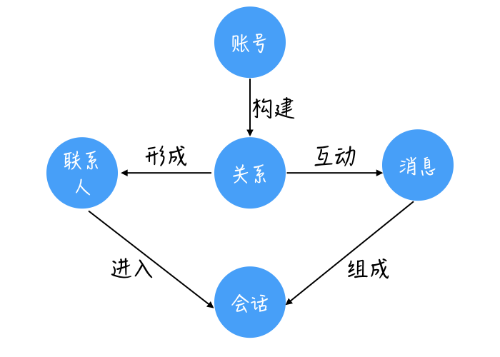
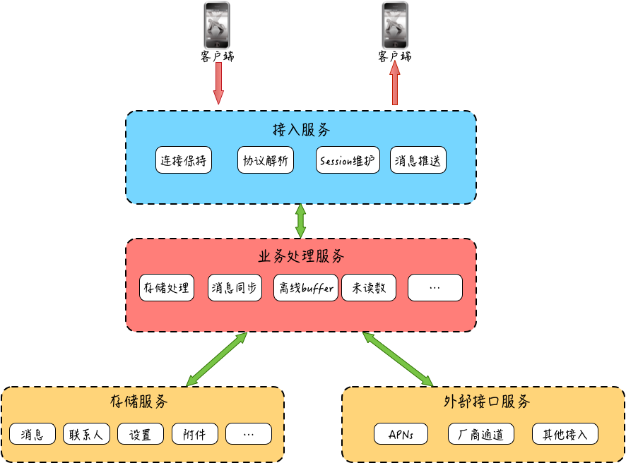

## IM

即时消息

### 主要场景和业务

- 聊天类（QQ）：即时通讯
- 社区类（知乎）：用户点对点聊天
- 直播类（斗鱼）：主播互动，实时弹幕
- 智能家居类（小米）：实时监控、远程控制
- 游戏类（畅游）：多人互动
- 交通类（滴滴）：位置共享
- 教育类（新东方）：在线白班

在整个 IM 系统的实现上深度用到了网络、数据库、缓存、加密、消息队列等后端必备知识。架构设计中也在大规模分布式、高并发、一致性架构设计等方面有众多成熟的解决方案。

## 整体架构

以一个简单的聊天系统为例。

### 用户眼中

### 开发者眼中

- 客户端
- 接入服务：服务端的最外层
  - 连接保持
  - 协议解析：编解码主要为了让传输内容紧凑。
  - Session维护：Session用来标识哪个用户在哪个TCP链接
  - 消息推送
- 业务处理服务：消息业务的处理层，比如
  - 消息的存储
  - 未读数的变更
  - 更新最近联系人
  - 等等
- 存储服务
- 外部接口服务：在有些情况下app对与服务器断开链接，有些操作系统会有公共的链接服务来解决消息推送问题。需要给手机系统提供外部接口。

IM系统的特性

- 实时性
- 可靠性
- 一致性
- 安全性

## 添加实时通信模块

