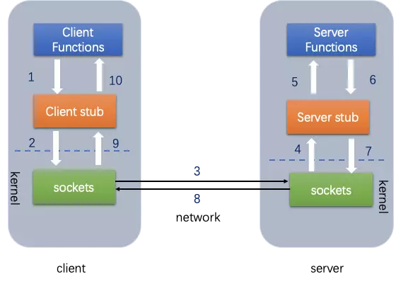

## 微服务

### 什么是

将单体应用分成一组小型服务。每个小型服务运行在自己的进程中，之间通过轻量级机制通信（HTTP REST API）。这些服务都是围绕业务建立的，可以独立开发，独立部署。

## RPC

远程调用过程

网络通信过程中，如果使用应用层的HTTP，那么代价会比较高，所以一般直接基于TCP进行远程调用，在客户端和服务器端建立Socket链接进行。

## Thrift

