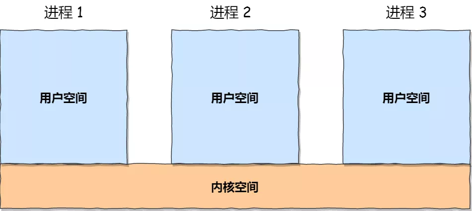

[**首页**](https://github.com/qdw497874677/myNotes/blob/master/首页检索.md)

# 进程与线程

## 进程

- 进程是程序的一次执行过程，是动态的，是系统资源分配的单位。
- 进程控制块 (Process Control Block, PCB) 描述进程的基本信息和运行状态，创建和销毁进程都是对PCB的操作。
- 一个进程包含多个线程。
- 操作系统分配给每个进程一些内存寻址空间。进程有自己独立的地址空间。

## 线程

- 线程是CPU调度和执行的单位，一个进程可以有多个线程，他们可以共享进程的公共资源
- 虚拟机栈
- 程序计数器，记录当前要执行的指令。指向内存中，也就是进程的内存。
- TLS，线程自己的内存，用来存放变量。

引入线程可以提高并发度。

## 区别

- 拥有资源：进程是资源分配的基本单位，但是线程不拥有资源，线程可以访问所属进程的资源。
- 调度：线程是独立调度的基本单位。在同一进程中，线程的切换不会引起进程切换。从一个进程中的线程切换到另一个进程总的线程时，会引起进程调度。
- 系统开销：创建或撤销进程时，系统要为其分配或回收资源，如内存空间、I/O设备等，付出的开销远大于创建或撤销线程。在进行进程切换时，涉及当前执行进程CPU环境的保存以及新调度进程的CPU环境的设置；而线程切换时**只需保存和设置少量寄存器内容**，开销小。
- 通信：线程间通信通过读写同一进程中的数据间接通信；进程通信需要借助IPC。

## 协程

协程比线程更加轻量级，不受操作系统内核管理，是完全由程序控制的（用户态执行）。

特点：

- 执行效率高：切换由程序控制，切换开销小。
- 不需要锁机制：因为在一个线程内执行，所以不会有变量冲突，控制共享资源只需要判断状态就好了，效率高。

## 进程状态

- 创建状态：进程申请空白的进程控制块（PCB），填写控制管理进程的信息，分配资源，把进程转为就绪状态并插入到就绪队列
- 就绪状态：进程已经获取到了处CPU之外的所有资源，只有获取CPU资源就能立刻执行。很多就绪状态的进程排成就绪队列。
- 运行状态：进程已经获取CPU，正在执行
- 阻塞状态：正在执行的进程由于发生一些事件（IO请求，申请缓冲区失败）暂时无法继续执行，操作系统把处理器分配给另一个就绪状态的进程，而受阻的进程处于的暂停执行的状态就是阻塞状态。
- 终止状态：当一个进程被终止（自然结束，出现错误，被操作系统终结，被其他有终止权的进程终结）就进入终止状态。终止过程需要两个步骤：先是等待操作系统进行善后处理，然后将其PCB清零返还空间。

### 什么是挂起

进程被交换到外存，状态变为挂起状态。

如果是就绪状态被挂起，就是就绪/挂起。调入内存即可执行。

如果是阻塞状态被挂起，就是阻塞/挂起。等待事件然后才能进入就绪/挂起状态。

# 为什么进程切换的开销比线程切换大

进程需要很多资源如寄存器，内存，文件等。每当进程切换时，必须考虑保存当前进程的状态并切换。进程切换时要切页表，而且往往伴随着页调度，因为进程的数据段代码要换出去，以便把执行的进程的内容换进来。

- 切换页目录以使用新的地址空间。
- 切换内核栈和硬件上下文。

主要的性能消耗是：

1. 上下文的切换通过操作系统内核来完成。将寄存器中的内容切换出十分消耗性能。
2. 上下文切换回打乱处理器的缓存机制。

进程的内容是线程的超集，上述问题的影响都很小。

# 待更新！！！进程间通信（IPC）

每个进程的用户地址空间都是独立的，但是内核空间时每个进程共享的，进程之间通信需要通过内核。

- 文件
- 信号Signal（kill -9   -15）：软件层次上对中断机制的一种模拟，是一种异步通信方式
  - 信号的处理有三种：
    - 1. 忽略该信号，大多数信号都可以这样处理，SIGKILL、SIGSTOP除外
      2. 捕获信号，用户自定义一个信号处理函数，SIGKILL、SIGSTOP不能被捕获
      3. 系统默认动作，大多数信号的默认动作是终止进程
  - 运行在shell终端的进程，可以通过键盘输入某些组合键，给进程发送信号
    - Ctrl+C产生SIGNT（kill -2）信号，表示中断。终止前台进程
    - Ctrl+Z产生SIGTSTOP信号，表示停止该进程，但还未结束。可以暂停前台进程，不能被阻断
  - 在后台运行的进程，可以通过kill命令给进程发送信号
    - 如：kill -9 PID 给指定PID的进程发送SIGKILL信号，来立刻终结进程，强行终止进程，本信号不能被阻塞、处理和忽略。
- 管道/命名管道
  - 匿名管道：ps -ef | grep java
    - 是单向的，相互通信需要创建两个，用完了就销毁
  - 命名管道：也叫FIFO，因为数据先进先出。通过mkfifo命令创建管道指定名字。管道是p类型的文件。
    - 创建管道：mkfifo myPipe
    - 写入数据：echo "hello" > myPipe   命令就挺住了，只有当管道里的数据被读完，命令才可以正常退出
    - 读取数据：cat < myPipe   可以看到打印了hello
- 消息队列：
  - 相比FIFO的优点
    - 独立于读写进程，避免同步管道的打开关闭的不便
    - 避免了FIFO的同步阻塞问题，不需要进程自己提供同步方法
    - 读进程可以根据消息类型有选择地接收消息。
- 共享内存：允许多个进程共享一个给定的存储区，数据不需要在进程间复制，是最快的一种IPC
  - 需要使用信号量来同步
- 信号量：主要作为进程间的同步
- Socket（最常用的）：可以跨网络在不同主机的进程之间通信。主要由三种编程模型
  - 针对TCP协议的Socket编程模型
    - 客户端：
      - 初始化socket，调用connect向服务端指定的地址和端口发送连接请求。连接完成后，通过read、write读写数据
    - 服务端：
      - 初始化serversocket实例，调用bind绑定ip地址和端口，调用listen进行监听，调用accept等待客户端连接，连接成功后得到socket实例，通过read、write读写数据

# （待更新）进程句柄

# 硬链接和软连接的区别

- 硬链接：与普通文件没什么不同，inode（可以理解成指针，指向物理硬盘的一个区块）都指向同一个文件在硬盘中的区块。
- 软链接（符号链接）：保存了其代表的文件的绝对路径，是另一种文件，在硬盘中有独立的区块，访问时替换自身的路径。

# 32位和64位操作系统的区别

进程的寻址空间的大小不同

# 进程调度算法

## 批处理系统

- 先来先服务（FCFS）：按照请求的顺序进行调度。
- 短作业优先（SJF）：每一次总是先调度估运行时间最短的作业。
- 最短剩余时间（SRTN）：最短作业优先的抢占式版本。如果新到的任务的估计运行时间比当前剩余时间还要短，就要挂起当前线程，运行新线程。

## 交互式系统

有大量的用户操作，目标是快速响应。

- 时间片轮转
- 优先级调度
- 多级反馈队列

## 实时系统

# 页面置换算法

- 最佳置换算法（OPT）
- 先进先出置换算法（FIFO）
- 最近最久未使用（LRU）
- 时钟置换算法

# 虚拟内存

是一种内存管理技术，它使程序任务他有连续的可用内存，而实际上，真的的空间是被分割成多个物理内存碎片，并且还有部分暂时存储在外存中，在需要的时候进行数据交换。

# 内存管理机制

内存管理主要做什么：内存管理主要负责内存的分配和回收，还有地址转换（将逻辑地址转换成物理地址）

内存管理机制的分类：

- 连续分配管理机制：指为一个用户程序分配一个连续的内存空间
  - 块式管理：远古时期操作系统的内存管理机制。将内存分为几个**固定大小的块**，每个块只包含一个进程。如果程序需要内存，操作系统会分配一块，如果需要的很小，就会浪费内存空间。
- 非连续分配管理机制：允许一个程序使的内存分布在不相邻的内存中
  - 页式管理：把内存分为大小相等且固定的页。也很小，相比块划分力度更大。通过页表对应逻辑地址和物理地址。
  - 段式管理：把程序按照一定逻辑（内容或者函数关系）分为段，以段在内存中分配，相比页式，段比页更小，且段是有意义的，每个段定义了一组逻辑信息。
  - 段页式管理：结合页式和段式的优点，先把内存分为若干段，然后再把段划分为若干个页。每个段必须建立一张页表，来吧段中的虚页变换为内存中的实际页面。

# 死锁

### 产生死锁的主要原因

> 死锁指两个或者两个以上的进程在执行过程中，因争夺资源而造成的一种互相等待的现象，若无外力干涉，它们都将无法推进下去。

死锁产生的四个必要条件

- 互斥：进程对资源进行排他控制。
- 请求并保持：进程因请求资源而阻塞时，对已获得的资源保持不放。
- 不剥夺：进程获得的资源在未使用之前，不能进行剥夺，只能自己释放。
- 环路等待：必然会有进程——资源的环形链。

预防死锁

- 破坏请求条件：资源一次性分配
- 破坏保持条件：只要有一个资源得不到分配，就不给这个进程分配其他资源。
- 破坏不可剥夺：可剥夺资源
- 破坏环路等待：资源有序分配，给资源赋予编号，每个进程按标号递增的循序请求资源，释放相反。

## 死锁检测

- Jstack命令
- JConsole工具

### 定位死锁

~~~bash
#找到出问题的进程
jps -l
#根据进程id
jstack 进程id
~~~

### 如何避免死锁

- 银行家

在进程申请资源时，检测是否满足。

- 指定加锁顺序

如果确保所有线程都是按照相同的顺序获得锁，就不会发生死锁了。这种方式需要事先知道所有可能会用到的锁。

- 加锁时限

在尝试获取锁的时候加一个超时时间，如果在时间内没有获取到锁，就释放所有已经获得的锁，然后等待一段随机的时间后重试。超时锁可以通过自定义锁来实现。超时锁可能带来饥饿的情况。

- 死锁监测

上面两中都不合适的情况下使用。每当一个线程获得了锁，会在线程和锁相关的数据结构中将其记下。每当有线程请求锁，也需要记录在这个数据结构中。当一个线程请求锁失败时，这个线程可以遍历锁的关系图，看是否有死锁发生，如果请求链中包含了自己，就说明发生了死锁。

当检查出死锁时：可以选择释放所有的锁，回退，等待一段随机的时间后重试。（和超时锁的区别是这个只是在检查到死锁后才执行）另一个办法就是给这些线程随机设置优先级，让一个或几个线程回退，剩下的线程就像没发生死锁一样继续保持。

## 模拟死锁代码

~~~java
public class Test8 {
    public static void main(String[] args) {
        String lockA = "lockA";
        String lockB = "lockB";
        new Thread(new HoldLockThread(lockA,lockB)).start();
        new Thread(new HoldLockThread(lockB,lockA)).start();
    }
}
class HoldLockThread implements Runnable{
    private String lockA;
    private String lockB;
    public HoldLockThread(String lockA, String lockB) {
        this.lockA = lockA;
        this.lockB = lockB;
    }
    @Override
    public void run() {
        synchronized (lockA){
            System.out.println(Thread.currentThread().getName()+" 自己持有"+lockA+" 尝试获取；lockB");
            try {
                TimeUnit.SECONDS.sleep(1L);
            } catch (InterruptedException e) {
                e.printStackTrace();
            }
            synchronized (lockB){
                System.out.println(Thread.currentThread().getName()+" 自己持有"+lockB+" 尝试获取；lockA");
            }
        }
    }
}
~~~

