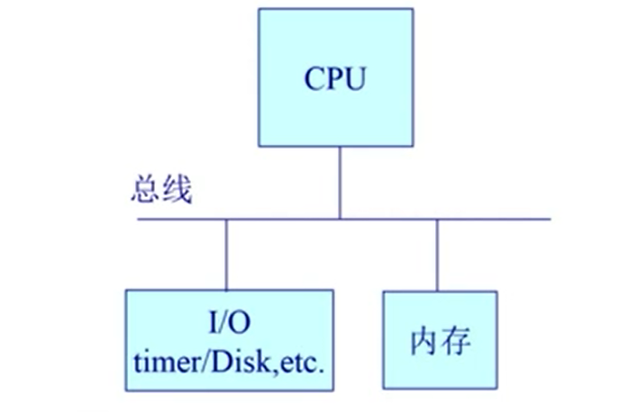
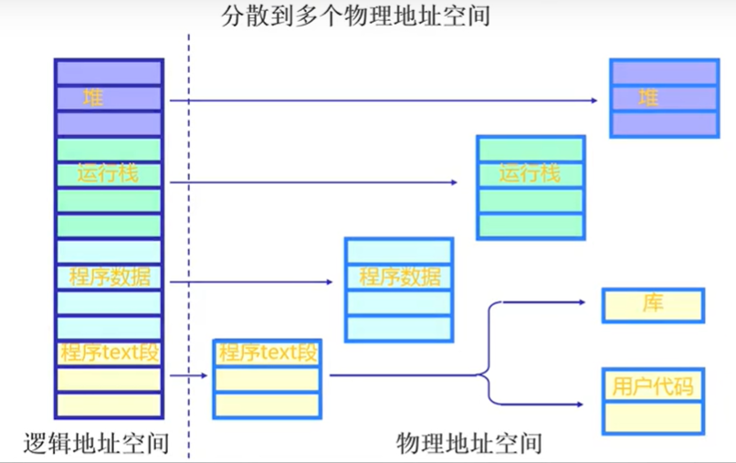

[**首页**](https://github.com/qdw497874677/myNotes/blob/master/首页检索.md)

## 什么是操作系统

- OS是管理计算机硬件和软件资源的程序
- OS屏蔽了硬件层的复杂度
- Kerne（内核）是OS的核心部分，负责系统的**内存**管理，**硬件设备**的管理，**文件系统**的管理以及**应用程序**的管理
- Shell包括GUI、CLI等，是指用户与操作系统进行交互的界面或接口。

## 启动

- DISK：存放OS
- BIOS：基本IO处理系统
- Bootloader：加载OS

## 用户态和内核态

根据进程访问资源的特性，把OS的执行分为两种状态

- 用户态：用户态运行的进程可以直接读取用户程序的数据
- 内核态：内核态运行的进程可以访问计算机的所有资源

### 为什么要分

为了安全，有些指令比较危险，对系统造成的影响比较大，如果所有进程都能调用这些指令，那系统出错的概率就很大。cpu将指令分为特权指令和非特权指令。

## 系统调用

处于用户态的进程想要操作更高级的资源时，只能通过OS提供的系统调用接口，让OS进入内核态代替完成。这种用户态的进程请求内核态服务的行为就叫做系统调用。

按功能大概可分为：

- 设备管理：完成设备的请求、释放、启动等功能
- 文件管理：完成文件的读写创建删除等功能
- 进程管理：完成进程的创建、撤销、阻塞和唤醒等功能
- 进程通讯：完成进程之间的消息传递或信号传递等功能
- 内存管理：完成内存的分配、回收等功能

## 异常

程序执行过程中发生了意想不到的事情，请求操作系统来处理。

常见的有：

- 运行时异常：比如除0
- 恶意访问异常：比如恶意程序想要访问不属于该进程的地址空间
- 死锁

## 中断

计算机执行期间有非寻常或者非预期的急处理事件，使得CPU暂时中断当前正在执行的程序，去执行别的程序，当处理完再回来继续。一般来源于外设或者网络

### 为什么应用程序不能直接访问外设

- OS是可信任的，应用程序不是可信任的，**提高安全性**
- OS屏蔽掉了各种外设的复杂性和差异性，让应用程序**更简洁通用**
- OS能够协调多个程序去调用外设，**避免冲突**

## 进程与线程

### 进程

- 定义：一个具有一定独立功能的**程序在数据集合上的一次动态执行过程**。
- 进程是**系统资源分配的单位**。每个进程的内存之间相互独立。
- 进程有共有文件和网络句柄。可以打开同一个文件，抢同一个网络端口。

一个进程包含多个线程。

进程是一个实体，每一个进程都有它自己的独立的逻辑地址空间，对于进程来说它看的逻辑内存就是全部内存。

#### 进程组成

主要由三个部分组成：**进程控制块、程序段、数据段**

#### PCB

进程控制块 (Process Control Block, PCB) **描述进程的基本信息和运行状态**，创建和销毁进程都是对PCB的操作。是进程的唯一标识。由下面组成：

- **进程标识**信息：进程标识符、用户标识符等
- 进程**控制和管理信息**：包括进程状态、优先级等等
- **资源分配**清单：代码段指针、数据段指针、堆栈段指针、文件描述符、外设等
- **处理机相关信息**：各种寄存器值

#### 程序段

能被进程调度程序调度到CPU来执行的**程序代码段**。程序可以被多个进程共享。

#### 数据段

可以是进程对程序**加工处理的原始数据**，也可以是程序执行时产生的**中间或者最终数据**。

### 线程

- 可以理解为轻量级进程。
- 线程是CPU调度和执行的单位，自己不拥有系统资源，他们可以共享进程的公共资源
- 一个线程包括：线程ID、程序计数器、寄存器集合、堆栈。

引入线程可以提高并发度。

#### 为什么要引入线程

#### 单进程的缺陷

- 一次只能执行一个功能，造成系统浪费
- 无法满足某些场景（比如GUI程序）

#### 多进程的问题

- 进程之间通信开销大，因为要通过系统调用切换到内核态。
- 多个进程本身的开销大，包括创建、切换、销毁

通过在进程内增加一类实体来解决上面问题，就引入了线程。相比进程他的上下文切换开销就小了很多

### 区别

- 拥有资源：进程是资源分配的基本单位，但是线程不拥有资源，线程可以访问所属进程的资源。
- 调度：线程是独立调度的基本单位。在同一进程中，线程的切换不会引起进程切换。从一个进程中的线程切换到另一个进程中的线程时，会引起进程调度。
- 系统开销：**创建或撤销进程**时，系统要为其**分配或回收资源**，如内存空间、I/O设备等，付出的开销远大于创建或撤销线程。在进行**进程切换**时，涉及当前执行进程CPU**环境的保存**以及新调度进程的CPU环境的设置；而线程切换时**只需保存和设置少量寄存器内容**，开销小。
- 地址空间：进程之间的地址空间相互隔离。同一进程内的线程之间共享进程资源，线程之间是相互隔离的
- 通信：线程间通信通过读写同一进程中的数据间接通信；进程通信需要借助IPC。

### 为什么进程上下文切换代价更高

进程切换需要两步：

- 切换页目录，使用新的地址空间
- 切换内核栈和硬件上下文

对于线程来说，不需要进程的第一步，不需要切换虚拟内存空间。

进程切换额外的消耗：

- 进程切换需要切换虚拟内存空间
- 扰乱处理器的缓存机制，切换了进程，处理器的

### 线程的实现

#### 用户线程（主流）

线程的管理工作由应用程序来完成，**内核感知不到线程**

优点：

- 线程不依赖于操作系统，即使操作系统不支持多线程
- 线程**切换速度快**，因为不用切换到内核态
- 线程的调度可以由进程自行控制

缺点：

- **一个线程阻塞，导致整个进程阻塞**。因为对于内核来说，线程就是进程
- OS把时间片分给的是进程，所以多线程下每个线程的时间很少

#### 内核线程

线程的管理工作由内核来完成

线程控制块在内核态让OS管理，通过系统调用实现线程的创建、调度和销毁。程序一般不会直接使用内核线程，而是使用内核线程的一种高级接口——轻量级进程，即通常意义上的线程。

这种模式下，进程主要完成对资源的管理

优点：

- 当一个线程被阻塞时，允许其他线程继续执行。

缺点：

- 线程切换，一定伴随用户态到内核态，开销比较大

#### 混合方式

混合模式下，既存在用户线程，也存在轻量级进程。用户线程完全建立在用户空间中，因此开销依然很小，可以支持大规模并发。轻量级进程作为用户线程和内核线程之间的桥梁，使用内核提供的线程调度功能及处理器映射，降低整个进程阻塞的风险。

### 协程

协程比线程更加轻量级，不受操作系统内核管理，是完全由程序控制的（用户态执行）。

特点：

- 执行效率高：切换由程序控制，切换开销小。
- 不需要锁机制：因为在一个线程内执行，所以不会有变量冲突，控制共享资源只需要判断状态就好了，效率高。

实现：

就是在线程中去，也就是在**用户态中去仿真线程**，

- 用户态创建协程
- 协程让出执行权，保存执行现场，切换到别的协程，恢复到中断前的状态继续执行。

## 进程状态

五种状态

1. 创建状态：进程申请空白的进程控制块（PCB），填写控制管理进程的信息，分配资源，但还没有竞争资源。
2. 就绪状态：进程已经获取到了除CPU之外的所有资源，只有获取CPU资源就能立刻执行。很多就绪状态的进程排成就绪队列。
3. 运行状态：进程已经获取CPU，正在执行
4. 阻塞状态：**正在执行的进程由于发生一些事件**（IO请求，申请缓冲区失败）暂时无法继续执行，操作系统把处理器分配给另一个就绪状态的进程，而受阻的进程处于的暂停执行的状态就是阻塞状态。
5. 终止状态：当一个进程被终止（自然结束，出现错误，被操作系统终结，被其他有终止权的进程终结）就进入终止状态。终止过程需要两个步骤：先是等待操作系统进行善后处理，然后将其PCB清零返还空间。

### 什么是挂起

**进程被交换到外存**，状态变为挂起状态。

如果是就绪状态被挂起，就是就绪/挂起。调入内存即可执行。

如果是阻塞状态被挂起，就是阻塞/挂起。等待事件出现后会**进入就绪/挂起**状态。

## 为什么进程切换的开销比线程切换大

进程需要很多资源如寄存器，内存，文件等。每当进程切换时，必须考虑**保存当前进程的状态并切换**。进程切换时要切页表，而且往往伴随着页调度，因为进程的数据段代码要换出去，以便**把执行的进程的内容换进来**。

- 切换页目录以使用新的地址空间。
- 切换内核栈和硬件上下文。

主要的性能消耗是：

1. 上下文的切换通过**操作系统内核**来完成。将寄存器中的内容切换出十分消耗性能。
2. 上下文切换回打乱处理器的缓存机制。

进程的内容是线程的超集，上述问题的影响都很小。

## 处理机调度

调度的任务是**作业或者进程**。一般来说处理机调度分为三个级别，分别是高级调度、中级调度和低级调度。

- 高级调度：又称作业调度，作业就是用户程序和他所需要的数据和命令的集合。
- 中级调度：又称内存调度，引入中级调度是为了提高内存的利用率和系统吞吐量，使暂时不运行的进程从内存换到外存上。
- 低级调度：又称进程调度，将cpu分配给一个进程。是操作系统中最基本的一种调度。

### 基本准则

- CPU利用率
- 系统吞吐量：单位时间内完成作业的数量
- 周转时间：作业从提交到完成的时间
- 等待时间：作业处于等待状态的时间
- 响应时间：作业提交到系统首次响应的时间

### 批处理系统

批处理系统没**有太多的用户操作**，在该系统中，调度算法目标是**保证吞吐量和周转时间**。

- 先来先服务（FCFS）：按照请求的顺序进行调度。
  - 不可剥夺，对长作业有利
- 短作业优先（SJF）：每一次总是先调度估运行时间最短的作业。
  - 不可剥夺，对长作业不利
- 最短剩余时间（SRTN）：最短作业优先的抢占式版本。如果新到的任务的估计运行时间比当前剩余时间还要短，就要挂起当前作业，运行新作业。

### 交互式系统

交互式系统**有大量的用户交互**操作，在该系统中调度算法的目标就是**快速进行响应**。

- 时间片轮转调度算法：把所有的就绪进程按FCFS排成一个队列，每次调度时，把CPU时间分配给队首进程，当时间片用完计时器发出时钟中断，就停止该进程的执行并放到队尾。

- 优先级调度调度算法：对每个线程分配一个优先级，按优先级执行调度。为了防止低优先的进程永远得不到调度，就可以随着时间推移增加等待进程的优先级。

- 高响应比优先调度算法：这个主要是进行作业调度。是先来先服务和短作业的结合。选择后备队列中响应比最高的作业。

  - 响应比=（等待时间+要求服务时间）/ 要求服务时间

- 多级反馈队列调度算法：时间片和优先级的结合。动态调整优先级和时间片大小。为在时间片轮转中，需要执行多次时间片的进程考虑。根据时间片大小不同设置了**多个队列，时间片依次增大**。进程在第一个队列**没执行完，就会被放到下一个队列**。**队列的优先级依次减小**，前面的队列没有进程任务后，后面的才执行。优先级低的队列中的任务不会一直得不到执行，会定期把优先级低的作业重新放入优先级最高的队列。
  
  - 优点：针对不同类型的用户都有比较好的效果。
    - 终端型用户：短作业优先
    - 短批处理用户：周转时间较短
    - 长批处理用户：先做了部分处理，也不会长期得不到处理
  - 
  
  

### 实时系统

要求一个请求在一个确定时间内得到相应。

- 分为硬实时和软实时，前者必须满足绝对的截止时间，后者可以容忍一定的超时。

## 进程通信（IPC）

和进程同步的区别是

- 进程同步：控制多个进程按一定顺序执行，是一种目的
- 进程通信：进程间传输信息，是一种手段

每个**进程的用户地址空间都是独立的，但是内核空间是每个进程共享的，进程之间通信需要通过内核**。

### 直接通信

要求进程能够正确的命名对方。

#### 共享内存

特点：

- 是最快的IPC，直接对内存进行存取
- 需要通过信号量来进行同步

让操作系统获取或者**创建一块共享内存空间**，把它**映射到进程的地址空间**中，进程就能操作这块和其他进程共享的内存了。需要进程自己去处理同步问题，一般**使用信号量来同步**对共享内存的访问。

### 间接通信

#### 管道

管道，通常指无名管道。

特点：

- 半双工，有固定的的读端和写端
- 只能用于具有亲缘关系的进程之间通信
- 可以看成特殊文件，但是只存在于内存，不属于文件系统。

一般使用过程中，**先创建一个管道，这个管道有读端和写端都是开启的。fork出一个子进程**，此时如果想要从父进程像子进程传输数据，就把父进程的读端关闭并写入，把子进程的写端关闭并读取。

#### FIFO

FIFO，也称命名管道，以磁盘文件的方式存在。可以实现本机任意两个进程通信。

特点：

- 可以在无关的进程之间交换数据
- 有路径名与之相连，存在于文件系统中

通信方式类似于文件传输，创建FIFO后可以像其中写入和读取数据，先进先出。**去除了管道只能在父子进程中使用的限制**。随意可以在两个进程之间创建两个管道，来实现双向通信。**需要手动创建**，通过mkfifo命令创建管道指定名字。管道是p类型的文件。

#### 消息队列

消息队列是消息的链表，具有特定的格式，存放在内核内存中，由消息队列标识符标识。独立于进程，只有在内核重启或者显示删除，消息队列才会消失。

特点：

- 面向记录的，其中消息是具有特定的格式以及特定的优先级。
- **存放在内核内存中，消息队列独立于发送和接收进程。**进程终止时，消息队列和其中内容不会删除。
- **消息队列可以实现消息的随机查询，不一定要用先进先出。可以按消息的类型读取。**

相比FIFO的优点

- 独立于读写进程，避免同步管道的打开关闭的肯能产生的困难
- 避免了FIFO的同步阻塞问题，不需要进程自己提供同步方法
- 读进程可以根据消息类型有选择地接收消息。

#### 信号量

是一个计数器，同于多进程对共享数据的访问。主要作用域进程间同步。

特点：

- 是计数器，用于进程间同步，需要结合共享内存来传递数据
- 信号量基于操作系统的PV操作，操作都是原子性的

#### Socket

可以**跨网络在不同主机的进程之间通信**。主要由三种编程模型

- 针对TCP协议的Socket编程模型
  - 客户端：
    - 初始化socket，调用connect向服务端指定的地址和端口发送连接请求。连接完成后，通过read、write读写数据
  - 服务端：
    - 初始化serversocket实例，调用bind绑定ip地址和端口，调用listen进行监听，调用accept等待客户端连接，连接成功后得到socket实例，通过read、write读写数据

- 文件
- 信号Signal（kill -9   -15）：软件层次上对中断机制的一种模拟，是一种异步通信方式
  - 信号的处理有三种：
    - 1. 忽略该信号，大多数信号都可以这样处理，SIGKILL、SIGSTOP除外
      2. 捕获信号，用户自定义一个信号处理函数，SIGKILL、SIGSTOP不能被捕获
      3. 系统默认动作，大多数信号的默认动作是终止进程
  - 运行在shell终端的进程，可以通过键盘输入某些组合键，给进程发送信号
    - Ctrl+C产生SIGNT（kill -2）信号，表示中断。终止前台进程
    - Ctrl+Z产生SIGTSTOP信号，表示停止该进程，但还未结束。可以暂停前台进程，不能被阻断
  - 在后台运行的进程，可以通过kill命令给进程发送信号
    - 如：kill -9 PID 给指定PID的进程发送SIGKILL信号，来立刻终结进程，强行终止进程，本信号不能被阻塞、处理和忽略。
- 管道/命名管道：
  - 管道（匿名管道）：只支持半双工通信（**单相传输**），只能在**父子进程**中使用。
    - ps -ef | grep java
    - 父进程fork后，子进程继承父进程的文件描述符，所以他们指向同一个数据结构。
  - 命名管道（FIFO）：**去除了管道只能在父子进程中使用的限制**。随意可以在两个进程之间创建两个管道，来实现双向通信。**需要手动创建**，通过mkfifo命令创建管道指定名字。管道是p类型的文件。
    - 创建管道：mkfifo myPipe
    - 写入数据：echo "hello" > myPipe   命令就挺住了，只有当管道里的数据被读完，命令才可以正常退出
    - 读取数据：cat < myPipe   可以看到打印了hello
- 消息队列：
  - 相比FIFO的优点
    - 独立于读写进程，避免同步管道的打开关闭的肯能产生的困难
    - 避免了FIFO的同步阻塞问题，不需要进程自己提供同步方法
    - 读进程可以根据消息类型有选择地接收消息。
- 共享内存：**允许多个进程共享一个给定的内存存储区**，数据不需要在进程间复制，是最快的一种IPC。需要进程自己去处理同步问题，一般**使用信号量来同步**对共享内存的访问。
  - 让操作系统在内存中创建一块共享内存空间，把它映射到进程的地址空间中，进程就能取操作这块和其他进程共享的内存了。
- 信号量：是一个计数器，进程通过修改变量值来通信，用于为多个进程提供对共享数据对象的访问。
- Socket（最常用的）：可以**跨网络在不同主机的进程之间通信**。主要由三种编程模型
  - 针对TCP协议的Socket编程模型
    - 客户端：
      - 初始化socket，调用connect向服务端指定的地址和端口发送连接请求。连接完成后，通过read、write读写数据
    - 服务端：
      - 初始化serversocket实例，调用bind绑定ip地址和端口，调用listen进行监听，调用accept等待客户端连接，连接成功后得到socket实例，通过read、write读写数据

## 进程同步

### 临界值

对临界资源进行访问的那段代码成为临界区

为了互斥访问临界资源，每个进程在进入临界区之前，需要先进行检查。

类似于线程中的同步区域

### 同步与互斥

- 同步：多个进程因为合作产生的直接制约关系，使得进程有一定的先后执行关系。
- 互斥：多个进程在同一时刻只有一个进程能进入临界区。

### 信号量

信号量（Semaphore）是一个整形变量，可以对其执行down和up操作，也就是常见的P和V操作。

- down：如果信号量大于0，执行-1操作；如果信号量等于0，进程睡眠，等待信号量大于0
- up：对信号量执行+1操作，唤醒睡眠的进程让其完成down操作。

两个操作被设计成原语，不可分割，通常做法是在执行这些操作的时候屏蔽中断。

如果信号量的取值只能为0或者1，那么就成为了**互斥量（Mutex）**，0表示临界区加锁，1表示临界区解锁。

### 管程

## 内存管理

### 计算机内存层次的结构

- cpu寄存器
- cpu缓存（L1/L2/L3三层）
- 物理内存
- 磁盘

### 地址空间

分为**物理地址空间**和**逻辑地址空间**

- 物理地址空间：由**硬件支持**的地址空间，从起始地址0，到最大地址MAX
- 逻辑地址空间：一个**进程拥有**的内存空间范围，最终是要映射到物理地址空间上才能被找到

#### 逻辑地址生成

编译器，将基于符号的地址转换为逻辑地址空间

#### 物理地址生成

物理地址的生成就是指从逻辑地址映射到物理地址的过程，这个具体的映射由CPU中的**内存管理单元（MMU）**来完成，但是整个建立这个映射关系是由OS来完成的。概括为：

1. CPU中的计算逻辑单元ALU**需要某个逻辑地址**的内容
2. MMU完成逻辑地址到物理地址的**映射**
3. 控制器从**总线**发出对该物理地址的内容的**请求**
4. 内存将该请求的内容发给CPU

#### 安全检查

每个进程都有只属于自己进程的逻辑地址空间，不能访问不属于自己的，所以OS要对进程的访问请求做安全检查。OS维护的有每个进程的逻辑地址空间的基址和界限，根据这两项内容来判断是否安全。

### 内存碎片

指物理内存中的一些无法被利用的空间

在内存上，**外部碎片**是位于任何两个**操作系统分配的用于装载进程的内存区域**或页面之间的空闲区域，**内部碎片**是位于一个**操作系统分配的用于装载进程的内存区域**或页面内部的空闲区域。

### 连续内存分配

是一种简单的内存分配策略，给每个进程分配的物理内存中的一块连续的区域。

在早期逻辑地址和地址和物理地址都是连续的，所以当进程多次创建和回收之后，内存中会产生很多内存碎片，很浪费内存空间。所以之后引入了分块和分段

#### 块式管理

分配时，OS会维护一个**空闲分区表**，可以通过快速找到空闲分区，来使用于不同分配策略。

- 首次分配：从低地址开始找，找到第一个能够容纳进程的空闲分区。
  - 优点：实现容易
  - 缺点：容易产生外碎片，分配的速度不稳定（分配大块时速度较慢）
- 最优适配：遍历所有空闲块，寻找能满足进程的最小的空闲分区
  - 优点：避免对大块拆分
  - 缺点：会产生很小的外碎片
- 最差适配：遍历所有的空闲块，寻找能满足进程需求的最大的块，然后分配。
  - 优点：避免了小的外碎片
  - 缺点：优先对大块拆分，不利于大进程的分配

**连续内存分配的缺点：无法避免碎片问题、因为要连续，内存利用率低**

### 非连续内存分配

分配给进程的物理内存空间是不连续的区域

#### 内存管理机制

##### 段式管理

把程序**按内容和构成关系分成段**，每个段内空间要求连续，段之前不要求连续。段的概念：一个段表示访问方式和存储数据的属性相同的一段连续地址空间。

也就是说，**相同类型的数据一般作为一个段。**

一般进程可以分为以下几个段：

- 栈
- 堆
- 程序数据
- 程序代码（可分为库代码和用户代码）

###### 为什么要分段

利用程序本身的特点，做到更好的分离和共享

###### 段寻址过程

段表：通过逻辑地址（段号+偏移量）直接映射到物理地址

逻辑地址由**段号**和**偏移量**组成。

地址映射由CPU中的MMU完成。

过程：1.根据段号查段表，得到段表项。2. 根据段表项的limit检查偏移量是否越界。3. 没有越界，就base+偏移量就是物理地址

##### 页式管理

将物理内存和逻辑内存都划分为**大小相同的单元**，其中物理内存中的单元称为帧，逻辑内存中的单元称为页。

每个进程都有一个页表，负责页号到帧号的转换。页表的每一项包括两部分：**3位标志位**和**帧号**。标志位可以表示位页不存在，即缺页异常。

###### 页寻址过程

页表：通过逻辑地址（页号+偏移量）得到帧号，帧号加上偏移量得到物理地址

- 根据逻辑地址的页号，查页表，得到帧号
- 根据帧号和偏移量组成物理地址，这个物理地址也是一种物理帧的表示（不需要考虑越界问题）
- 通过物理地址，计算实际地址

###### 快表

在页式管理中，加快虚拟地址到物理地址的转换。

**快表可以看成是缓存**，他是页表的一部分，访问很快。优先查询快表，如果没有再去查内存中的页表，同时会添加到缓存中，根据一定的淘汰错略淘汰掉别的页记录。

###### 多级页表

引入多级页表为了解决虚拟地址空间很大，导致页表也很大的问题。

经典的时间换空间

##### 段页式管理

结合段式和页式的优点，在段式的基础上，给每个段加一级页表。根据段号查段表，得到页号，根据页号查页表得到帧号，帧号+偏移量得到物理地址。

### 虚拟内存

因为主存不够，所以想要**利用外存**，**只将必要的数据装入内存**，**间接扩大主存的容量**。

**虚拟内存**是一种内存管理技术，他定义了一个**连续的虚拟地址空间，并且把内存扩展到磁盘空间**。他**为每个进程提供了一个一致的、连续的、私有的地址空间**，让每个进程拥有一片连续完整的内存空间。它使程序任务他有连续的可用内存，而实际上，真的空间是被分割成多个物理内存碎片，并且还有部分暂时存储在外存中，在需要的时候进行数据交换。

#### 好处

- 编写大型程序更容易，不用去让开发者考虑过多
- 对于物理内存的使用效率大大提升

#### 早期内存不够的解决方案

- 覆盖overlay：程序太大，手动覆盖，选择哪些数据和指令需要驻留在内存中
  - 要求程序员自己手动把程序按照功能划分若干模块，并确定模块间的覆盖关系
- 交换swapping：程序太多，将暂时不用执行的程序反倒外存
  - 交换操作的是整个程序

要实现虚拟页式管理，只需要在页式基础上增加两个核心功能：**请求调页**和**页面置换**页表项中有个重要的标志位：**驻留位**，0表示该也不在内存中

#### 局部性原则

某个较短的时间内，程序执行局限于某一小部分，访问的存储空间也局限于某个区域。

主要体现在下面两个方面：

- 时间局部性：程序中的某条执行一旦执行，不久之后可能再次执行；如果数据被访问，不久之后可能被再次访问。因为程序中存在大量循环操作
- 空间局部性：程序访问某个存储单元，不久之后附近的存储单元可能也被访问，即一段时间内的访问数据可能聚集在一起。因为通常指令都是顺序存放，顺序执行。

虚拟内存技术，实际上就是建立了内存——外存的两级存储器结构，利用结构性原则实现高速缓存。

#### 虚拟内存的技术实现

虚拟内存的实现是**建立在非连续分配的内存管理方式上**。主要的实现有三种。不管哪种都需要有一定的硬件支持（内存和外存、**页表机制、中断机构、地址变换机构**）。

- 请求分页存储
- 请求分段存储
- 请求段叶式存储

###### 请求分页管理方式

请求分页系统是建立在基本分页基础之上，为了支持虚拟内存，增加了**请求调页功能**和**页面置换功能**。只需要一部分页面装入内存，就可以启动作业。

除了需要内存和外存空间，还需要页表机制、缺页中断机构和地址变换机构。

- 页表机制：在普通页表上增加四个字段，在支持页在内外存中置换。
  - 状态位P：标识页面是否调入内存。
  - 访问字段A：记录本页访问次数或者上次访问时间，用来配合不同的置换算法。
  - 修改位M：标识页面调入内存后是否被修改过。对于修改过的页被淘汰后需要写回外存。
  - 外存地址：标识本页在外存的地址。
- 缺页中断机制：请求的页面不在内存中，需要产生一个缺页中断，使进程阻塞，请求操作系统将所缺的页面装入内存，如果内存没有空闲位置，还需要淘汰页面（如果页面修改过，需要写入外存中）。然后去唤醒进程。
  - 与一般的中断相比，缺页中断发生在执行指令期间，并且可以发生多次，而不是发生在指令执行完成后。
- 地址变换机构：在普通分页的地址变换机构上去支持虚拟内存。从请求页到面到形成物理地址的流程。
  - 先查快表，如果快表中有对应页表项就修改访问位和修改位，形成物理地址。如果快表没有，查询页表，如果页表有，更新快表，然后修改页表项形成物理地址。
  - 如果页表没有，就产生缺页中断，请求调页
    - 中断处理
    - 从外存找到缺页，如果内存满，选择一页淘汰，然后继续检查内存是否满
      - 置换时如果内存中页修改过，就更新到外存
    - 当内存空间足够就，从外存把缺页装入内存，修改页表，然后重新读取页。

#### 局部页面置换算法

如何去管理页面的置换，当把外存中的页加载到内存中，内存空间不足需要选择页面来置换出去。如何选择要置换的页面。

- **最优置换算法**（OPT）：预测未来程序访问页面的顺序，将最久不会被访问的页面置换出去。无法实现，只能当做其他算法的评价依据。
- **先进先出置换算法**（FIFO）：将内存中驻留时间最长的页面进行置换
- **最近最久未使用**（LRU）：将最久没有使用过的页面进行置换。LRU是根据历史推测未来。通常用HashMap+双向链表来实现。
- **时钟置换算法**（CLOCK）：将所有的页组织成一个环形链表，可以看做是LRU的简单模拟。当缺页时，指针遍历，遇到标记为1就改为0继续遍历，如果标记为0，将做置换。刚置换进来的标记为1。
  - 可以通过使用的位数目，来使算法更高效更接近LRU。
- **最不常用算法**（LFU）：对每个页面都设置一个访问计数器，每访问一次就加一，选择置换计数最少的页。

#### 页面分配策略

**驻留集**（工作集）：进程要访问的页面集合。就是说操作系统分配给一个进程的主存空间。

需要考虑一下几点：

- 驻留集小，主存中的执行进程就多，可以提高处理器效率
- 驻留集小，缺页率就增高。
- 根据局部性原理，如果把驻留集增大，可能对缺页率的降低不明显。

常用的三种页面分配策略

- 固定分配局部置换：给每个进程分配固定的内存区域不改变。
- 可变分配**全局**置换：给每个进程分配一定的内存区域，同时系统保留一部分内存区域。在进程发生缺页时从系统内存区域分配一块空闲页给进程。这是最易实现的策略
- 可变分配局部置换：给每个进程分配一定的内存区域，系统也会保留一部分内存区域。进程缺页只在自己的区域置换。如果发生频繁缺页，系统会动态增加内存区域；反之会减少内存区域。

#### 调入页面时机

关于调入哪些页面的两种策略

- 预调页策略：根据局部性原理，一次调入若干个相邻的页可能比只调入一个更高效。这种策略主要用于进程的首次调入时。
- 请求调页策略：请求的页面不在内存中时，请求从外存调入页面，只调入一个页面。

#### 抖动

在页面置换过程中，刚刚换出的页面马上又要换入主存。这种频繁调度的行为称为抖动。

## （待更新）进程句柄

## 硬链接和软连接的区别

- 硬链接：与普通文件没什么不同，inode（可以理解成指针，指向物理硬盘的一个区块）都指向同一个文件在硬盘中的区块。
- 软链接（符号链接）：保存了其代表的文件的绝对路径，是另一种文件，在硬盘中有独立的区块，访问时替换自身的路径。

## 32位和64位操作系统的区别

进程的寻址空间的大小不同

## 死锁

### 产生死锁的主要原因

> 死锁指多个进程在执行过程中，**因相互争夺对方持有的资源而造成的一种互相等待的现象**，若无外力干涉，它们都将无法推进下去。

死锁产生的四个必要条件

- 互斥：进程对资源进行排他控制。
- 非抢占：进程对于获得的资源，不能被强行剥夺，只能自己释放。
- 请求并保持：进程因请求资源而阻塞时，对已获得的资源保持不放。
- 循环等待：多个进程都持有资源，并且在等待其他进程释放资源，形成循环。

### 死锁检测

- Jstack命令
- JConsole工具

### 定位死锁

~~~bash
#找到出问题的进程
jps -l
#根据进程id
jstack 进程id
~~~

### 解决死锁

解决死锁的方案有很多，强度由高到低依次是：死锁预防、死锁避免、死锁检测、死锁解决

#### 死锁预防

死锁是由四个必要条件导致的，破坏其中的任意一个条件，死锁情况就应该不会发生了。实现简单，但是限制相对比较严格，会导致整体吞吐量降低。

1. 破坏互斥条件：不现实。这个需要进程同时访问某些资源，这种方法受限于实际场景，比较难实现，一般都需要对资源独占。
2. 破坏不可抢占条件：允许对资源进行抢夺，比如优先级高的线程需要优先级低的线程的资源，可以要求线程释放资源。但是要在优先级都不相同的条件下才能实现预防死锁，很难找到适用场景。
3. 破坏请求并保持：可行。就是在进程运行之前，要一次性申请其所需要的全部资源，否则不能执行。显然这种方式导致资源的**利用率比较低，进程经常发生饥饿**。
4. 破坏循环等待：可行。**对所有资源类型进行分类并排序**，每个进程**按照资源的顺序**进行申请，这样不会造成循环等待。环境比较复杂，资源种类优先，不常用

#### 死锁避免

也是事先预防，不同的是，预防是不做检查直接限制，而避免是**申请资源时做检查**。影响整体程度更小，效率更高。 

思路就是在一个**进程请求资源时进行动态检查**，并根据检查结果决定是否分配资源。如果分配后系统可能发生死锁，则不分配，否则分配。

**安全状态**：系统能够按某种进程顺序来为每个进程分配其所需要的资源。这个约束比形成死锁大，是包含死锁状态的，比如可能形成环就是不安全的。

> 银行家算法
>
> 是一个比较著名的死锁避免算法。主要思想：进程向操作系统请求资源，就比作向银行家贷款。
>
> - 进程首次请求资源：操作系统先会检查进程对资源**最大需求量**是否超过现在能提供的**资源总量**，如果可以就分配，如果超过就**推迟分配**。
> - 进程过程中继续请求资源：操作系统检查进程**已获取的资源**加上**当前请求的资源**量是否大于当初规定的**最大需求量**，超过就**拒绝分配**。如果没有超过继续检查当前**请求的资源**是否超过**资源总量**，超过就**推迟分配**。
>
> 通过这种方式避免系统进入不安全的状态。

前提条件

- 多个实例
- 每个进程都必须能够最大限度地利用资源
- 当一个一成请求一个资源，就不得不等待
- 当一个进程获得所有的资源就必须在一段有限的时间释放他们

基于上述条件，尝试

主要思想就是避免系统进入不安全状态，每次资源分配，首先**检查是否有足够资源满足**。如果有就**先试行分配**，并对分配后的新状态进行安全性检查。如果是状态安全，则正式分配上述资源，否则拒绝分配。

#### 死锁检测

死锁检测不事先采取任何限制性措施，而是允许发生死锁。可以及时的检测出发生死锁，然后精准确定与死锁有关的进程和资源。

**每次进程获取资源的关系都存储到一个数据结构中，如果发生获取资源失败的情况，就检查遍历关系图，如果请求资源的链条中包含了自己，说明发生了死锁。**

上面两种都不合适的情况下使用。每当一个线程获得了锁，会在线程和锁相关的数据结构中将其记下。每当有线程请求锁，也需要记录在这个数据结构中。当一个线程请求锁失败时，这个线程可以遍历锁的关系图，看是否有死锁发生，如果请求链中包含了自己，就说明发生了死锁。

#### 消除死锁

如果我们在死锁检查时发现了死锁情况，那么就要努力消除死锁，使系统从死锁状态中恢复过来。消除死锁的几种方式：

- 重启系统：最简单、最常用的方法就是进行系统的重新启动，不过这种方法代价很大，它意味着在这之前所有的进程已经完成的计算工作都将付之东流，包括参与死锁的那些进程，以及未参与死锁的进程；

- 撤销进程：撤消或者挂起一些进程，来释放资源。终止参与死锁的进程，收回它们占有的资源，从而解除死锁。这时又分两种情况：一次性撤消参与死锁的全部进程，剥夺全部资源；或者逐步撤消参与死锁的进程，逐步收回死锁进程占有的资源。一般来说，选择逐步撤消的进程时要按照一定的原则进行，目的是撤消那些代价最小的进程，比如按进程的优先级确定进程的代价；考虑进程运行时的代价和与此进程相关的外部作业的代价等因素；

- 回退进程：进程回退策略，即让参与死锁的进程回退到没有发生死锁前某一点处，并由此点处继续执行，以求再次执行时不再发生死锁。虽然这是个较理想的办法，但是操作起来系统开销极大，要有堆栈这样的结构记录进程的每一步变化，以便今后的回退，有时这是无法做到的。

### 模拟死锁代码

~~~java
public class Test8 {
    public static void main(String[] args) {
        String lockA = "lockA";
        String lockB = "lockB";
        new Thread(new HoldLockThread(lockA,lockB)).start();
        new Thread(new HoldLockThread(lockB,lockA)).start();
    }
}
class HoldLockThread implements Runnable{
    private String lockA;
    private String lockB;
    public HoldLockThread(String lockA, String lockB) {
        this.lockA = lockA;
        this.lockB = lockB;
    }
    @Override
    public void run() {
        synchronized (lockA){
            System.out.println(Thread.currentThread().getName()+" 自己持有"+lockA+" 尝试获取；lockB");
            try {
                TimeUnit.SECONDS.sleep(1L);
            } catch (InterruptedException e) {
                e.printStackTrace();
            }
            synchronized (lockB){
                System.out.println(Thread.currentThread().getName()+" 自己持有"+lockB+" 尝试获取；lockA");
            }
        }
    }
}
~~~

