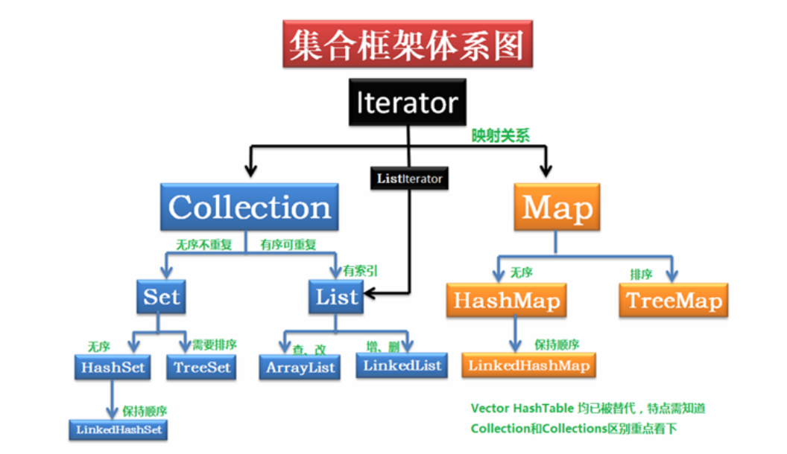
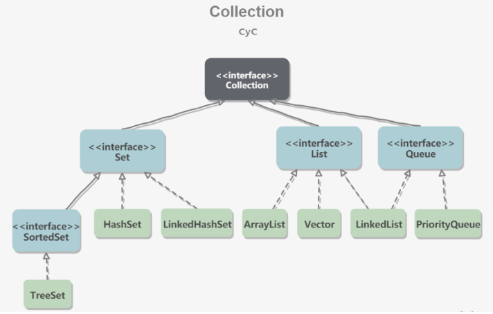
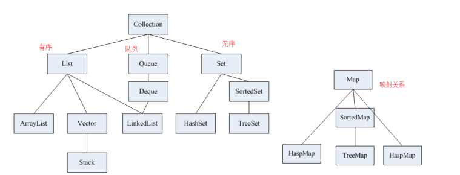
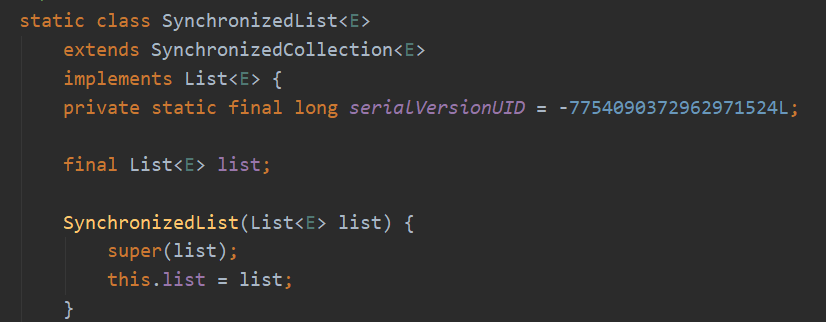
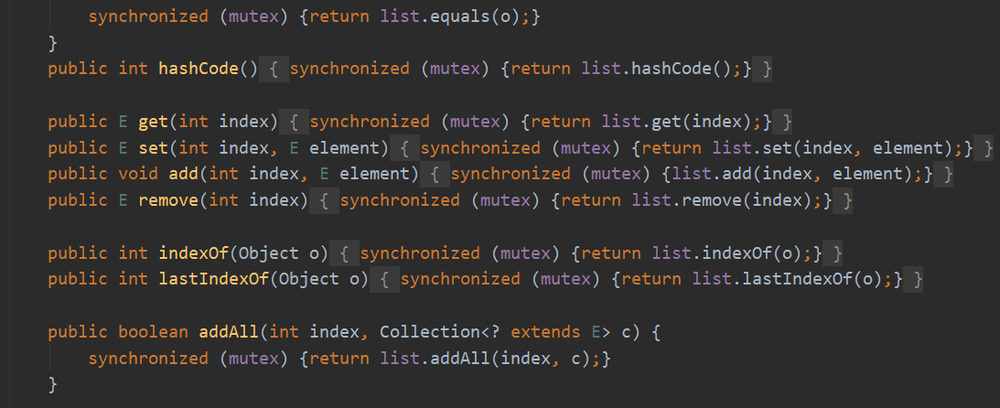
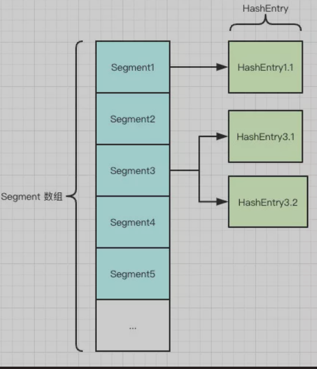
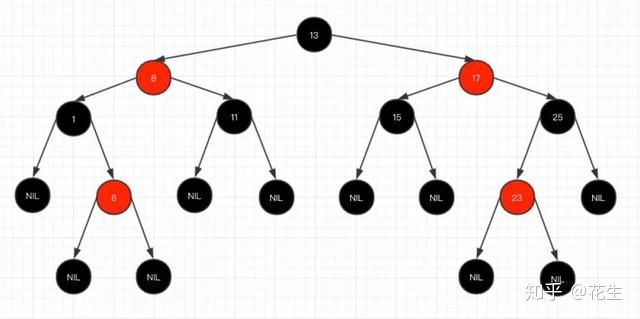
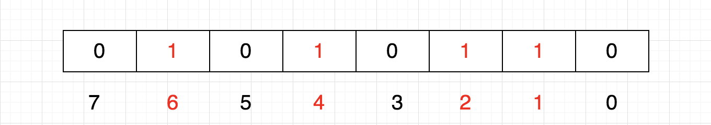

[**首页**](https://github.com/qdw497874677/myNotes/blob/master/首页检索.md)

# 树（待更新！！！）

## 红黑树

### 二叉查找树

特性

1. 左子树上所有结点的值均小于或等于它的根节点的值。
2. 右子树上所有结点的值均大于或等于它的根结点的值。
3. 左右子树也分别是二叉排序树。

查找和插入利用二分法，最大次数约等于树的高度

缺点：插入数导致数的不平衡，查找和插入效率降低。

**红黑树是一种自平衡的二叉查找树**

特性

1. 节点是红色或黑色
2. 根节点是黑色
3. 每个叶子节点都是黑色空节点（NIL节点）
4. 每个红色节点的两个子节点都是黑色。（从每个叶子到根的所有路径上不能有两个连续的红色节点）
5. 从任一节点到其每个叶子的所有路径都包含相同数目的黑色节点。

这些规则保证：从根节点到叶子节点的最长路径不会超过最短路径的2倍。

在插入和删除节点时，红黑树的规则可能被打破，这时候需要做调整。

## 应用

# 集合

- Collection
  - Queue
    - Deque
  - List
  - Set

- Map

## list set map的区别

- list：允许重复元素、可以插入多个null元素、保持每个元素的插入顺序
- set：不允许重复元素、只允许有一个null元素、不保证每个元素的存储顺序（TreeSet可以通过Comparator  或者 Comparable 维护了一个排序顺序）
- map：每个元素包括key和value、key是唯一的不重复的、可以快速通过key找到对应的value

# ArrayList

> 底层是Object数组，默认长度为10，每次add前判断是否扩容，扩容策略为new = old + (old >> 1)，数组按索引插入和扩容时都会移动元素，移动元素的方式为用System.arraycopy()浅拷贝

## 概述

 ArrayList 是基于数组实现的，所以支持快速随机访问。用一个Object类型的数组存元素。

~~~java
public class ArrayList<E> extends AbstractList<E>
        implements List<E>, RandomAccess, Cloneable, java.io.Serializable
~~~

数组的默认大小为 10。

~~~java
private static final int DEFAULT_CAPACITY = 10;
~~~

如果不指定默认大小，创建对象后，数组是空的。在add是会检测然后扩容到默认大小。

## 扩容

添加元素时使用 ensureCapacityInternal() 方法来保证容量足够，如果不够时，需要使用 grow() 方法进行扩容，新容量的大小为 oldCapacity + (oldCapacity >> 1)，也就是旧容量的 1.5 倍。

扩容需要调用 Arrays.copyOf()把原数组复制到新数组中。

~~~java
public boolean add(E e) {
    ensureCapacityInternal(size + 1);  // Increments modCount!!
    elementData[size++] = e;
    return true;
}

private void ensureCapacityInternal(int minCapacity) {
    if (elementData == DEFAULTCAPACITY_EMPTY_ELEMENTDATA) {
        minCapacity = Math.max(DEFAULT_CAPACITY, minCapacity);
    }
    ensureExplicitCapacity(minCapacity);
}

private void ensureExplicitCapacity(int minCapacity) {
    modCount++;
    // overflow-conscious code
    if (minCapacity - elementData.length > 0)
        grow(minCapacity);
}

private void grow(int minCapacity) {
    // overflow-conscious code
    int oldCapacity = elementData.length;
    int newCapacity = oldCapacity + (oldCapacity >> 1);
    if (newCapacity - minCapacity < 0)
        newCapacity = minCapacity;
    if (newCapacity - MAX_ARRAY_SIZE > 0)
        newCapacity = hugeCapacity(minCapacity);
    // minCapacity is usually close to size, so this is a win:
    elementData = Arrays.copyOf(elementData, newCapacity);
}
~~~

## add(E e)

先扩容再添加

## remove(int index)

时间复杂度O(n)，通过System.arraycopy()来把删除位置之后的元素向前复制一位。

## remove(Object o)

移除指定对象元素，判断如果是null遍历数组用==判断，如果不是null遍历数组用equals判断

## 删除元素

需要调用 System.arraycopy() 将 index+1 后面的元素都复制到 index 位置上，然后把数组最后面的引用置为null，该操作的时间复杂度为 O(N)，可以看到 ArrayList 删除元素的代价是非常高的。

~~~java
public E remove(int index) {
    rangeCheck(index);
    modCount++;
    E oldValue = elementData(index);
    int numMoved = size - index - 1;
    if (numMoved > 0)
        System.arraycopy(elementData, index+1, elementData, index, numMoved);
    elementData[--size] = null; // clear to let GC do its work
    return oldValue;
}
~~~

## 边遍历边删除

三种方式

### 迭代器

~~~java
public class Test1 {
    public static void main(String[] args) {
        List<Integer> list = new ArrayList<>();
        list.add(1);
        list.add(2);
        list.add(3);
        list.add(4);
        list.add(5);
        list.add(6);
        Iterator<Integer> iterator = list.iterator();
        while (iterator.hasNext()){
            System.out.println(iterator.next());
            iterator.remove();
        }
        System.out.println("size:"+list.size());
    }
}
~~~

### 每次移除后，当前索引不要动

~~~java
public class Test1 {
    public static void main(String[] args) {
        List<Integer> list = new ArrayList<>();
        list.add(1);
        list.add(2);
        list.add(3);
        list.add(4);
        list.add(5);
        list.add(6);
        for (int i = 0; i < list.size(); i++) {
            System.out.println(list.get(i));
            list.remove(i--);
        }
        System.out.println("size:"+list.size());
    }
}
~~~

### 倒着遍历

~~~java
public class Test1 {
    public static void main(String[] args) {
        List<Integer> list = new ArrayList<>();
        list.add(1);
        list.add(2);
        list.add(3);
        list.add(4);
        list.add(5);
        list.add(6);
        for (int i = list.size()-1; i >=0 ; i--) {
            System.out.println(list.get(i));
            list.remove(i);
        }
        System.out.println("size:"+list.size());
    }
}
~~~

## 线程不安全

两种情况

- add时判断需要扩容，在扩容过程中，另一个线程add，可能就判断不需要扩容了，插入数组elementDatap[]时会越界。
- add时，elementDatap[size++]， i++不是原子操作，可能多个线程的add操作会覆盖在同一位置。

~~~java
public class Test4 {
    public static void main(String[] args) {
        List<String> list = new ArrayList<>();
        for (int i = 0; i < 100; i++) {
            new Thread(()->{
                list.add(UUID.randomUUID().toString().substring(0,8));
//                System.out.println(list);
            },String.valueOf(i)).start();

        }
        while (Thread.activeCount()>2){
            Thread.yield();
        }
        System.out.println(list);
    }
}
~~~

### 解决方法

- Vector（加锁的ArrayList）
- Collections.synchronizedList(new ArrayList<>())：实现了一个List的实现类，方法的实现是通过对传入的ArrayList<>()方法加锁实现的。
  - 
  - 
- CopyOnWriteArrayList：写的时候复制一个新数组去写。

## 版本比较

- 1.7相对于1.6，扩容的容量计算从整除改成了位运算
- 1.8相对于1.7，增加了一个最大容量

# LinkedList

## 概述

基于**双向链表**，使用Node存储链表节点。

~~~java
private static class Node<E> {
    E item;
    Node<E> next;
    Node<E> prev;
}
~~~

每个链表存储了 first 和 last 指针

~~~java
transient Node<E> first;
transient Node<E> last;
~~~

## add(E e)

就是调用addFirst()，插到链表的头

## remove(Object o)

参数是null就遍历链表用==null判断，不是null就遍历链表用equals判断

## get(int index)

那size的一半(size>>1)和index去比较，如果index小于一半就从头部开始遍历，如果大于一半就从尾部开始遍历

## 与 ArrayList 的比较

- ArrayList 基于动态数组实现，数组支持随机访问，但插入删除的代价很高，需要移动大量元素。
- LinkedList 基于双向链表实现。链表不支持随机访问，但插入删除只需要改变指针。

# CopyOnWriteArrayList

> 写时复制。读写分离的思想。
>
> 读元素不加锁，array数组用volatile修饰的。
>
> 写入元素的时候，**用可重入锁加锁**，先把原数组复制一份去写，把新元素放到新数组最后。**写完后把原数组引用指向新数组**。
>
> 写的时候是会加锁的。

## add()

~~~java
//array是用volatile修饰的
private transient volatile Object[] array;

public boolean add(E e) {
        final ReentrantLock lock = this.lock;
        lock.lock();
        try {
            Object[] elements = getArray();
            int len = elements.length;
            Object[] newElements = Arrays.copyOf(elements, len + 1);
            newElements[len] = e;
            setArray(newElements);
            return true;
        } finally {
            lock.unlock();
        }
    }
~~~

适合读多写少的场景。

缺点

- 内存占用大。
- 数据不一致：读取不及时。

所以不适合内存敏感，实时性要求很高的场景

# HashSet

HashSet底层是一个初始容量为16，负载因子为0.75的HashMap。用HashMap的key存元素，value是一个Object类型的常量。

- add
  - 把值作为HashMap的key，put进去，value是用同一个Object对象
- 

## 线程不安全

~~~java
public class Test4 {
    public static void main(String[] args) {
//        List<String> list = new ArrayList<>();
//        List<String> list = Collections.synchronizedList(new ArrayList<>());
//        List<String> list = new CopyOnWriteArrayList<>();
        Set<String> set = new HashSet<>();
        for (int i = 0; i < 100; i++) {
            new Thread(()->{
                set.add(UUID.randomUUID().toString().substring(0,8));
                System.out.println(set);
            },String.valueOf(i)).start();
        }
        while (Thread.activeCount()>2){
            Thread.yield();
        }
        System.out.println(set);
    }
}
~~~

### 解决方法

- Collections.synchronizedSet(new HashSet<>())
- CopyOnWriteArraySet

# CopyOnWriteArraySet

CopyOnWriteArraySet底层是CopyOnWriteArrayList。

add最终会调用CopyOnWriteArrayList中的一个方法，addIfAbsentadd元素前要检查集合中是否包含这个元素。

~~~java
private boolean addIfAbsent(E e, Object[] snapshot) {
        final ReentrantLock lock = this.lock;
        lock.lock();
        try {
            Object[] current = getArray();
            int len = current.length;
            if (snapshot != current) {
                // Optimize for lost race to another addXXX operation
                int common = Math.min(snapshot.length, len);
                for (int i = 0; i < common; i++)
                    if (current[i] != snapshot[i] && eq(e, current[i]))
                        return false;
                if (indexOf(e, current, common, len) >= 0)
                        return false;
            }
            Object[] newElements = Arrays.copyOf(current, len + 1);
            newElements[len] = e;
            setArray(newElements);
            return true;
        } finally {
            lock.unlock();
        }
    }
~~~

# HashMap

默认容量为16，默认装载因子为0.75，扩容后变为之前的2倍。key、value可以为null。

推荐的初始容量值设为：(需要存储的元素个数/负载因子)+1

## 数据结构

有一个Entry（1.8为Node）类型的数组table。Entry存储键值对，组成链表。

HashMap 使用拉链法来解决冲突，同一个链表中存放哈希值和散列桶取模运算结果相同的 Entry。

## 拉链法的工作原理

~~~java
HashMap<String, String> map = new HashMap<>();
map.put("K1", "V1");
map.put("K2", "V2");
map.put("K3", "V3");
~~~

- 新建一个 HashMap，默认大小为 16；
- 插入 <K1,V1> 键值对，先计算 K1 的 hashCode 为 115，将哈希值和数组大小取模，获取余数作为下标 115%16=3。
- 插入 <K2,V2> 键值对，先计算 K2 的 hashCode 为 118，将哈希值和数组大小取模，获取余数作为下标 118%16=6。
- 插入 <K3,V3> 键值对，先计算 K3 的 hashCode 为 118，将哈希值和数组大小取模，获取余数作为下标 118%16=6，头插法插在 <K2,V2> 前面。

## put操作

~~~java
public V put(K key, V value) {
    if (table == EMPTY_TABLE) {
        inflateTable(threshold);
    }
    // 键为 null 单独处理
    if (key == null)
        return putForNullKey(value);
    int hash = hash(key);
    // 确定桶下标
    int i = indexFor(hash, table.length);
    // 先找出是否已经存在键为 key 的键值对，如果存在的话就更新这个键值对的值为 value
    for (Entry<K,V> e = table[i]; e != null; e = e.next) {
        Object k;
        //判断hash相等，并且key用过==相等或者通过equals相等，才算存在相同的key
        if (e.hash == hash && ((k = e.key) == key || key.equals(k))) {
            V oldValue = e.value;
            e.value = value;
            e.recordAccess(this);
            return oldValue;
        }
    }

    modCount++;
    // 插入新键值对，插入i是头插法（1.8之前）
    addEntry(hash, key, value, i);
    return null;
}

final int hash(Object k) {
   int h = hashSeed;
   if (0 != h && k instanceof String) {
       return sun.misc.Hashing.stringHash32((String) k);
   }

   h ^= k.hashCode();
   h ^= (h >>> 20) ^ (h >>> 12);
   return h ^ (h >>> 7) ^ (h >>> 4);
}

static int indexFor(int h, int length) {
   return h & (length-1);
}
~~~

- 如果key为null，单独处理。
- 通过hash()方法获取整形，然后通过int indexFor(int h, int length)方法来获取下标。获取下标的方式是通过取模（位运算）（h & (length-1)，为了使用高效的位运算，所以要求容量capacity为2的幂），获取到数组的下标。
- 遍历链表，检查时候有相同的key，如果有相同，就把value更新。
- 如果没有新建一个键值对，**头插法**（作者认为后放入map的数据被查的可能性更大）放到对应的位置。

## 为什么初始容量为16

为了让根据整形获取下标这个操作更高效。一个数对2^n取模 == 一个数和(2^n - 1)做按位与运算 。但是有些哈希值高位不同低位相同导致单纯的位运算会产生冲突。下面代码为了对key的hashCode进行扰动计算。可以把高位的特征和低位的组合起来，降低哈希冲突的概率。

~~~java
h ^= k.hashCode();
h ^= (h >>> 20) ^ (h >>> 12);
return h ^ (h >>> 7) ^ (h >>> 4);
~~~

## 为什么负载因子是0.75

在提高空间利用率和减少哈希冲突中折中

## 扩容

## JDK1.7

### 整个put键值对的过程

1. **初始化**数组
2. 如果**key为空**单独处理，找到key为null的头结点更新value，如果没有就在下标0处头插这个key为null的节点
3. 如果容量+1大于等于阈值且头结点不为空，就先扩容，然后把旧数组中的所有链表，从头结点开始，依次计算新下标头插到新数组中
4. 对于不为null的，计算hash值，计算下标，遍历链表，如果有**相等key**就替换value返回旧value
5. 然后去创建**新节点插入**对应头部，size++

### put()

- 如果数组为空就先初始化
- 如果key为null，就用putForNullKey()插入
- 如果size+1大于等于阈值（数组长度*负载因子）且头结点不为空就先扩容
- 计算hash值，计算数组下标，遍历链表
  - 如果有相等key的元素替换value，并返回旧value。判断元素相等：大概(e.hash==hash && (e.key==key || e.equals(key)))，即先判断hash，再用==判断key或者用equals。用hash加速大部分的判断，再用==和equals判断。
- 调用addEntry()方法插入新节点

### putForNullKey(）

- 遍历数组
  - 如果有头结点的key为null的：把节点的value替换，返回旧value
- 没有key为null的节点，就直接用addEntry()添加新的key为null的节点到数组下标位0的位置

### addEntry()

- 如果元素个数大于等于阈值且对应下标不是null：就用resize()进行扩容，**重新计算hash**和下标值
- 调用createEntry()方法插入

### createEntry()

- 创建新节点同时头插到对应位置
- size++

### resize()

- 创建新数组
- 用transfer()把旧数组节点转移到新数组上
- table引用指向新数组，更新阈值

### transfer()

遍历数组中的每一个链表，把每个节点计算新下标后头插到新数组，接着操作下一个节点。

~~~java
void addEntry(int hash, K key, V value, int bucketIndex) {
    Entry<K,V> e = table[bucketIndex];
    table[bucketIndex] = new Entry<>(hash, key, value, e);
    if (size++ >= threshold)
        resize(2 * table.length);
}

void resize(int newCapacity) {
    Entry[] oldTable = table;
    int oldCapacity = oldTable.length;
    if (oldCapacity == MAXIMUM_CAPACITY) {
        threshold = Integer.MAX_VALUE;
        return;
    }
    Entry[] newTable = new Entry[newCapacity];
    transfer(newTable);
    table = newTable;
    threshold = (int)(newCapacity * loadFactor);
}

// 把就链表数组中的元素转移到新数组中
void transfer(Entry[] newTable) {
    Entry[] src = table;
    int newCapacity = newTable.length;
    for (int j = 0; j < src.length; j++) {
        Entry<K,V> e = src[j];
        if (e != null) {
            src[j] = null;
            do {
                Entry<K,V> next = e.next;
                int i = indexFor(e.hash, newCapacity);
                e.next = newTable[i];
                newTable[i] = e;
                e = next;
            } while (e != null);
        }
    }
}
~~~

## JDK1.8

主要的改变：

- 链表长度**等于8**转红黑树，删除时**小于等6**如果是红黑树就转为链表。
- put时从**先size++判断size>=阈值就扩容再插入，改为先插入再size++判断size>阈值就扩容。**
- put节点从头插改为尾插
- 优化扩容过程。
  - 遍历链表用每个节点的**hash和旧数组长度与操作**（&），对于等于0的连成一个链表，等于1的连成另一个链表，把第一个链表按照之前的下标k迁移到新数组，第二个数组迁移到新数组的（k+旧数组长度）下标处。然后直接迁移到新数组中。节点的先后位置是没有变化的。

### 为什么链表转红黑树的阈值为8

- 从概率上：
- 从查询效率上：红黑树的平均查找长度是log(n)，长度为8时，红黑树的平均查找长度为3，而链表的平均查找长度为8/2=4，这样才有

### put过程

~~~java
public V put(K key, V value) {
        return putVal(hash(key), key, value, false, true);
    }
final V putVal(int hash, K key, V value, boolean onlyIfAbsent, boolean evict) {
        Node<K,V>[] tab; Node<K,V> p; int n, i;
        if ((tab = table) == null || (n = tab.length) == 0)
            n = (tab = resize()).length;
    	//如果对应下标的桶是空的，直接把新节点放到这
        if ((p = tab[i = (n - 1) & hash]) == null)
            tab[i] = newNode(hash, key, value, null);
        else {
            Node<K,V> e; K k;
            //检查第一个节点hash，然后用==或者equals去比较key，如果相等就用e存着这个节点
            if (p.hash == hash &&
                ((k = p.key) == key || (key != null && key.equals(k))))
                e = p;
            else if (p instanceof TreeNode)
                //检查第一个节点是不是树的节点，就把新节点加入到树中，e保存插入后对应的节点
                e = ((TreeNode<K,V>)p).putTreeVal(this, tab, hash, key, value);
            else {
                //既不与第一个节点相等，第一个节点又不是树节点，就遍历所有节点。直到到头或者需要转换为树，或者有相等的节点，直到对应要放新节点的位置，把新节点放上去
                for (int binCount = 0; ; ++binCount) {
                    if ((e = p.next) == null) {
                        p.next = newNode(hash, key, value, null);
                        if (binCount >= TREEIFY_THRESHOLD - 1) // -1 for 1st
                            treeifyBin(tab, hash);
                        break;
                    }
                    if (e.hash == hash &&
                        ((k = e.key) == key || (key != null && key.equals(k))))
                        break;
                    p = e;
                }
            }
            if (e != null) { // existing mapping for key
                V oldValue = e.value;
                if (!onlyIfAbsent || oldValue == null)
                    e.value = value;
                afterNodeAccess(e);
                return oldValue;
            }
        }
        ++modCount;
        if (++size > threshold)
            resize();
        afterNodeInsertion(evict);
        return null;
    }
~~~

### 扩容

## 线程不安全

### 1.7并发扩容

会产生死循环

形成原因：当一个线程去扩容，用e去遍历就数组中的链表，next记录e的下一个节点。当把A节点头插到新数组中时，这个线程出于一些原因阻塞了，另一个线程进行完扩容工作。让第一个线程继续执行时，A节点和A的下一个节点都在新数组中了，并且因为是头插所以B的next是A。第一个线程继续操作B进行插入，把B的下一个节点赋给了next，这样又去加入A，A又被插入到B的前面，形成了循环。

简单说：线程1在扩容没完成时暂停，线程2把扩容完成了，线程1继续，但是此时他的引用指向的节点都已经在新的数组中且顺序相反的，所以再按之前的顺序操作就会形成循环。

### 并发put

假设：两个线程分别将两条对象不同但hash值相同的数据同时put到一个hashmap中，假如hash相同的位置正好为null，两个线程会都对入到对同一位置赋值的操作。假设一个挂起另一个正常插入数据了，挂起的重新获取cpu后，会把之前的数据覆盖掉。

**先put的数据覆盖了后put的数据**

put的时候导致的多线程数据不一致。
 这个问题比较好想象，比如有两个线程A和B，首先A希望插入一个key-value对到HashMap中，首先计算记录所要落到的桶的索引坐标，然后获取到该桶里面的链表头结点，此时线程A的时间片用完了，而此时线程B被调度得以执行，和线程A一样执行，只不过线程B成功将记录插到了桶里面，假设线程A插入的记录计算出来的桶索引和线程B要插入的记录计算出来的桶索引是一样的，那么当线程B成功插入之后，线程A再次被调度运行时，它依然持有过期的链表头但是它对此一无所知，以至于它认为它应该这样做，如此一来就覆盖了线程B插入的记录，这样线程B插入的记录就凭空消失了，造成了数据不一致的行为。

2、另外一个比较明显的线程不安全的问题是HashMap的get操作可能因为resize而引起死循环（cpu100%），具体分析如下：

~~~java
public class Test4 {
    public static void main(String[] args) {
        Map<String,String> map = new HashMap();
        for (int i = 0; i < 100; i++) {
            new Thread(()->{
                map.put(Thread.currentThread().getName(),UUID.randomUUID().toString().substring(0,8));
                System.out.println(map);
            },String.valueOf(i)).start();
        }
        while (Thread.activeCount()>2){
            Thread.yield();
        }
        System.out.println(map);
    }
}
~~~

### 解决方法

- HashTable
  - Hashtable 使用 synchronized 来进行同步。
  - HashMap 可以插入键为 null 的 Entry。
  - HashMap 的迭代器是 fail-fast 迭代器。
  - HashMap 不能保证随着时间的推移 Map 中的元素次序是不变的。
- ConcurrentHashMap

# HashTable 

HashTable的**默认初始大小为11，之后每次扩充为原来的2n+1。** 

HashTable会尽量使用素数、奇数作为容量的大小。当数组大小为素数时，**简单的取余结果会更加均匀**。

key和value都不能为null，使用 synchronized 来进行同步实现线程安全。

JDK1.7中

HashTable中的hash方法，就是做了一个简单的哈希。

~~~java
private int hash(Object k) {
   // hashSeed will be zero if alternative hashing is disabled.
   return hashSeed ^ k.hashCode();
}
~~~

HashTable中没有indexOf方法，取而代之就是一段代码。就是采用直接取余。

~~~java
int index = (hash & 0x7FFFFFFF) % tab.length;
~~~

# TreeMap

key-value集合，通过红黑树实现。可以根据**Comparator 进行排序**

TreeMap的基本操作 containsKey、get、put 和 remove 的时间复杂度是 log(n) 。

# ConcurrentHashMap

实现上和HashMap类似。

## 为什么value不能为null

key和value不能为null。因为对于判断value的null需要两步：如果发现key对应的value为null，还要通过containsKey()判断是put的时候value就是null还是没有对应的键值对。因为ConcurrentHashMap常用在多线程情况下，所以这个两步操作可能会不一致。

## JDK1.7

ConcurrentHashMap 采用了分段锁技术。数据结构主要是Segment数组和HashEntry数组。每个Segment 里面包含一个HashEntry数组，每个HashEntry可以组成链表，HashEntry用于存储键值对数据，类似于HashMap的结构。每个Segment自己操作自己内部的HashEntry，操作时需要对Segment加锁。

所以理想情况下在同一时间里，每个线程操作不同的segment，这样把锁的竞争降到最低，并发度更高

默认的并发级别为 16，也就是默认的Segment数量。

并发度高是因为采用分段锁技术，Segment继承ReentrantLock可重用锁。

读操作不加锁，因为HashEntry中的value是volatile修饰的

### 构造函数

共有5个，最终都调用一个核心的。参数为初始容量，负载因子，并发级别

~~~java
public ConcurrentHashMap(int initialCapacity,
                             float loadFactor, int concurrencyLevel) {}
~~~

### put()方法

1. 计算hash：通过哈希算法计算key的hash值
2. 找Segment数组下标：通过hash值找到它所对应的Segment，如果为空，就调用ensureSegment()初始化Segment
3. 用Segment的put()添加元素
   1. 通过tryLock()获取到segment的锁（这个tryLock加锁失败不会阻塞），没有获取到就执行scanAndLockForPut()，方法返回时肯定已经获取到了锁。
   2. 计算HashEntry数组的下标
   3. 找到合适的位置插入元素

#### 两词hash算法的不同

- 计算Segment下标：用hash值的高几位和掩码做与运算。(hash >>> segmentShift) & segmentMask
- 计算HashEntry下标：用hash值和数组长度-1做与运算。(tab.length - 1) & hash

计算不同是为了**避免两个结果关联度太高**，导致同一个Segment中的元素扎堆，从而是链表过长，同时也减少了并发

### ensureSegment()

初始化Segment对象。传入k，为计算的Segment的下标值。

> **边创建对象边判断下标位是否还是null，最后cas+自旋放入新对象。**

1. 判断下标处是否为null
2. 根据Segment数组第一个作为原型，拿到Segment的参数
3. 判断下标处是否为null
4. 创建Segment对象
5. 判断下标出是否为null
6. 用CAS把新对象加入到数组中，如果不成功回到5，这样自旋

### scanAndLockForPut()

Segment的put中获取锁失败执行的方法。

> **在没有获取到锁的同时，去遍历链表，尝试利用空余时间先找找一会应该处理的位置**。如果没有相同key就创建一个新节点并停止遍历，如果有相同key就停止遍历。遍历过程中如果发现链表头结点改变，那么下次就重新开始遍历。**期间如果获取了锁或者超出最大次数直接用lock获取锁就退出**，返回node，node可能为null可能为预先创建的新节点。这个node节点在put()中判断下，如果不为空就直接头插到链表中。

这个方法返回时，确保当前线程是获取了锁的。

1. 根据hash值找到HashEntry数组的下标，并找到链表第一个节点。用HashEntry类型引用e指向这个第一个节点，创建一个引用node为null。
2. 设置重试标记为-1。接下来如果tryLock()失败，就执行下面，直到成功获取锁
   1. 三种情况：
      1. 如果标记<0
         1. 如果e节点和node节点都为null：说明到头了没有key相同的节点，就预先创建node节点，并把标记记为0（表示停止遍历）
         2. 如果e的key等于传进来的key：并把标记记为0（表示停止遍历）
         3. 否则：e向后遍历
      2. 标记++，如果标记超过最大尝试次数：就调用lock()加锁，一定要获取锁
      3. 如果标记为偶数 且 当前链表头结点不是之前获取的头结点：就需要重新设置头结点和e，并且重置标记为-1（接下来如果还是没获取到锁，就接着从头遍历）

### rehash()

扩容方法。在用Segment中的put()时，如果发现元素个数超过阈值，就会扩容。**每个Segment只管自己的扩容**。

> 创建新数组，遍历旧数组中每一个链表，先把链表中**靠尾部连续相同新下标的子链表迁移到新数组中**，在把链表中剩下的节点从前到后**依次头插到新数组**中，最后把**新节点头插到新数组中**。期间**不需要重新哈希**。（每次迁移时新下标肯定是空的）

1. 更新容量，更新阈值，创建新数组
2. 用e遍历旧数组
   1. 如果e节点不为空：next记录e在旧数组中的下一个节点。计算e在新数组中的下标。
      1. 如果next为null：说明这条链表只有一个节点e，直接放到新数组的对应下标
      2. 如果next不为null：用lastRun记录上一次遍历到的节点，lastIdx记录上一次遍历到节点在新数组的下标。接下来开始循环，把从last从next节点开始到链表尾部的每一个节点：计算新下标，如果新下标不等于lastIdx，就更新lastRun和lastIdx为当前节点的。这样的话从**lastRun节点到尾部之间的所有节点都是相同下标的，方便直接迁移过去**。先把上面从尾开始连续相同新下标的链表**直接迁移到新数组对应下标处**。然后把**从e到lastRun节点前**的节点依次计算新下标，然后**创建新节点头插到新数组对象下标处。**
      3. 所有旧节点都处理完了，再把新的节点头插到对应位置。

### get()

> 先hash一次，计算下标找到Segment，再hash一次，计算下标找到HashEntry，然后遍历链表找到对应key的value返回。

### remove()

和put()类似

### size()  count和modCount是啥

> 每次循环**累加所有Segment的modCount和count**，如果**两次循环的累加相等就可以返回结果**。如果循环次数超出了（执行到第四次，重试了两次都没成功），就把所有Segment**加锁**再循环，最后全部解锁。

1. 重试标记初始为-1
2. 循环
   1. 重试标记++，如果超过重试此时，就把所有的Segment加锁
   2. 遍历所有Segment。如果遍历到的Segment不为空，就累加统计它的modCount（put和remove都会影响modCount）并且通过它的count和当前累加的sum来判断是否溢出（超过32位）
   3. 如果和上次循环计算的sum相等就可以返回统计结果
3. 判断如果之前超过重试次数了，就说明加锁了，需要依次解锁
4. 返回结果如果溢出返回int最大值

## JDK1.8

摒弃了Segment，用Node数组+链表+红黑树的数据结构。使用了 CAS 操作来支持更高的并发度，在 CAS 操作失败时给数组中的头结点加synchronized锁。

链表过长时会转换为红黑树。HashEntry改为Node，val和next都用volatile关键字修饰。

### put元素整个流程

1. 计算hash
2. 数组为空先初始化数组（只保证初始化一个）
3. 找到对应下标，如果没有hash冲突就直接用CAS添加数据。如果有冲突，就用**synchronized** 给头节点加锁，如果是链表就按链表的方式发现相同key就替换，返回就value，如果是树节点就按树的方式操作。
4. 之后判断元素个数是否大于等于8，考虑转红黑树
5. 调用addCount，去给总数+1.
6. 判断是否需要扩容

### get元素流程

### 扩容

相比于1.7，并发粒度缩小到数组的每个下表。扩容要对整个table扩容，考虑到效率问题，在扩容时，其他线程队map做修改操作时，去尝试帮助一起扩容。

### put()

key和value都不能为空。

1. 计算hash
2. 循环：当节点插入后才break
   1. 如果数组为空，使用initTable()初始化数组。
   2. 找到key所在的下标
      1. 如果节点为空：用CAS把新节点直接查到此位置
      2. 如果不为空，节点的hash值为-1：使用helpTransfer()帮助迁移数据
      3. 否则：用**synchronized** 给头节点加锁。重新确认下第一个节点无变化且
         1. 头节点hash值大于0（是正常链表结构），从有节点开始遍历，每次binCount+1，
            1. 如果发现相同key的节点：用新节点替换，break
            2. 如果到了为节点：把新节点尾插，break
         2. 头结点是树节点：操作红黑树
   3. 如果binCount不为0
      1. 如果大于等于8：转化为红黑树
      2. 如果有替换旧节点：return旧节点（就不执行下面的addCount()了，元素个数没变）
      3. break
3. 调用addCount()给元素个数+1，方法里可能触发扩容，返回null

### initTable()

初始化数组

1. 循环判断数组是否为空，直到初始化成功
   1. 判断sizeCtl的值，如果<0：说明有别的线程正在初始化，当前线程放弃cpu时间片yield()
   2. 如果不<0：把sizeCtl设为-1，表示自己正在进行初始化。判断下数组还是否为空，创建数组，更新阈值，把sizeCtl更新为阈值sizeCtl
2. 返回数组

### addCount()

为了把整个表的元素个数+1。如果用一个volatile修饰的变量表示数量，用cas来增，这样如果线程很多，竞争是很激烈的。这里做的优化是，**把这些变量和操作的线程分算到不同对象里去，在统计size时在相加。**

baseCount 为总szie，分散的对象为CounterCell ，对象里的计数变量叫value。

大概思路：线程需要修改元素数量时，先用CAS尝试给baseCount +1，如果失败就随机分配到某个CounterCell ，CAS尝试给value+1，如果失败就用fullAddCount()一定要加进去。

### fullAddCount()

如果分配的cell为空，就尝试创建新的CounterCell。尝试用CAS改变互斥量cellsBusy，创建Cell，然后把互斥量改回来。接下来包括扩容的内容，待更新。。。

### transfer()

开始帮忙迁移数据

### helpTransfer()

尝试帮忙迁移

### **sumCount**()

计算表中的元素总个数

以baseCount为基准，把每个CounterCell中的value累加返回

get

- 计算hash值，定位到索引位置，如果是首节点符合就返回
- 如果遇到扩容的时候，会调用标志正在扩容节点ForwardingNode的find方法，查找该节点，匹配就返回
- 如果上面都不符合，就遍历红黑树或者链表找匹配的值返回，如果没有返回null。

~~~java
final V putVal(K key, V value, boolean onlyIfAbsent) {
        if (key == null || value == null) throw new NullPointerException();
        int hash = spread(key.hashCode());
        int binCount = 0;
        for (Node<K,V>[] tab = table;;) {
            Node<K,V> f; int n, i, fh;
            if (tab == null || (n = tab.length) == 0)
                tab = initTable();
            else if ((f = tabAt(tab, i = (n - 1) & hash)) == null) {
                //如果对应的key为空，就尝试用CAS
                if (casTabAt(tab, i, null,
                             new Node<K,V>(hash, key, value, null)))
                    break;                   // no lock when adding to empty bin
            }
            else if ((fh = f.hash) == MOVED)
                //检查是否要扩容
                tab = helpTransfer(tab, f);
            else {
                //否则就用synchronized
                V oldVal = null;
                synchronized (f) {
                    if (tabAt(tab, i) == f) {
                        if (fh >= 0) {
                            binCount = 1;
                            for (Node<K,V> e = f;; ++binCount) {
                                K ek;
                                if (e.hash == hash &&
                                    ((ek = e.key) == key ||
                                     (ek != null && key.equals(ek)))) {
                                    oldVal = e.val;
                                    if (!onlyIfAbsent)
                                        e.val = value;
                                    break;
                                }
                                Node<K,V> pred = e;
                                if ((e = e.next) == null) {
                                    pred.next = new Node<K,V>(hash, key,
                                                              value, null);
                                    break;
                                }
                            }
                        }
                        else if (f instanceof TreeBin) {
                            Node<K,V> p;
                            binCount = 2;
                            if ((p = ((TreeBin<K,V>)f).putTreeVal(hash, key,
                                                           value)) != null) {
                                oldVal = p.val;
                                if (!onlyIfAbsent)
                                    p.val = value;
                            }
                        }
                    }
                }
                if (binCount != 0) {
                    if (binCount >= TREEIFY_THRESHOLD)
                        treeifyBin(tab, i);
                    if (oldVal != null)
                        return oldVal;
                    break;
                }
            }
        }
        addCount(1L, binCount);
        return null;
    }
~~~

(待更新)size

通过sumCount()获取。通过遍历CounterCell[]数组中的CounterCell实例，累加CounterCell里面用volatile修饰的value。每次put的最后会执行addCount()

## 主要区别

- put元素：1.7用Segment分段锁两次Hash。1.8如果没有冲突用CAS直接添加，如果失败对链表头用synchronized同步
- 计算size：1.7当需要返回size时去做计算，统计sigment中的计数。1.8在put时就会操作baseCount的值，在需要返回size时返回baseCount并且把之前计算的一些暂存在CounterCell中的值也累加上

## 红黑树的特点

红黑树查询：其访问性能近似于折半查找，时间复杂度 O(logn)；

- 每个节点要么是红色，要么是黑色，但根节点永远是黑色的；
- 每个红色节点的两个子节点一定都是黑色；
- 红色节点不能连续（也即是，红色节点的孩子和父亲都不能是红色）；
- 从任一节点到其子树中每个叶子节点的路径都包含相同数量的黑色节点；
- 所有的叶节点都是是黑色的（注意这里说叶子节点其实是上图中的 NIL 节点）；

## 转化为红黑树的过程

先将Node替换为TreaNode，然后再将单链表转为双链表。然后调用ThreeNode的treeify方法进行树化。

# LinkedHashMap

承与HashMap、底层使用哈希表与双向链表来保存所有元素。其基本操作与父类HashMap相似，它通过重写父类相关的方法，来实现自己的链接列表特性。

可以用LinkedHashMap实现LRU，重写

~~~java
@Override
    protected boolean removeEldestEntry(Map.Entry<Integer, Integer> eldest) {
        return size()>capacity;
    }
~~~

# BitMap

用int作为布尔值数组。

int的每一位表示对应的数存在与否。

## 位置

一个int有4字节，每字节8位，总共32位。所以一个int可以表示32个数是否存在。对于存N个数，可以用int[] aar = int[1+N/32] 把每一个数映射到bigmap中表示是否存在。

数字n在Bitmap中对应的位置为arr[n/32]的int中的第n%32位

## 添加

让第i个int中的第j位为1。通过数组下标找到对应的int——arr[ i ]，把1向左移j个位置 1 << j，然后把这个数与arr[ i ]做 | （或）计算。

总结一下：arr[n/32] = arr[n/32] | (1 << (n%32))

## 删除

把1向左移j为，然后按位取反，与int做&操作

arr[n/32] = arr[n/32] & (~(1 << (n%32)))

## 查找

判断对应为位是1还是0。

arr[n/32] & (1 << (n%32)) 是0表示不存在，是1表示存在。

## 场景

### 快速排序

对于没有重复元素的数据排序。把数据放进bitmap中，然后在从低到高或者从高到低取一遍，就达到了排序的目的。O(n)

优点：效率高，占内存少

缺点：需要数据不能重复，数据密集有效率，松散会浪费空间。

### 快速去重

用两个位去表示数字的三种状态：00不存在、01有一个、11有多个。最后统计01的个数。O(n)

### 快速查找

用查找快速知道数存在不存在

# 布隆过滤器

是一种概率型的数据结构，特点是：

- 高效查询和插入
- 能够通过他知道某元素肯定不存在或者可能存在

添加元素：把值的多次不同的hash得到多个索引值，在bit数组中对应的位置设置为1.

查找：做多次hash，得到对应索引，判断索引对应的位的值，如果不都为0说明肯定不存在，如果都为1说明可能存在。

