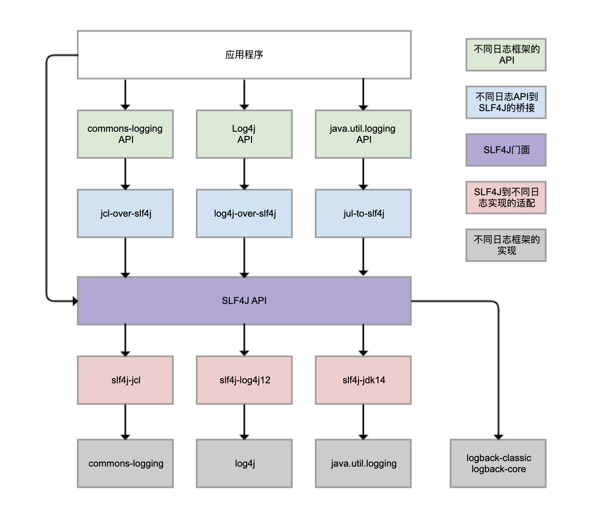
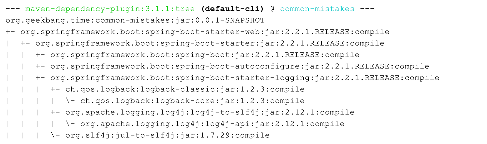

## 日志框架

Logback、Log4j、Log4j2、commons-logging、JDK 自带的 java.util.logging 等，都是 Java 体系的日志框架，确实非常多。而不同的类库，还可能选择使用不同的日志框架。这样一来，日志的统一管理就变得非常困难。为了解决这个问题，就有了 SLF4J（Simple Logging Facade For Java），如下图所示：

SLF4J 实现了三种功能：

- 一是提供了**统一的日志门面 API**，即图中紫色部分，实现了中立的日志记录 API。
- 二是**桥接**功能，即图中蓝色部分，用来把各种日志框架的 API（图中绿色部分）桥接到 SLF4J API。这样一来，即便你的程序中使用了各种日志 API 记录日志，最终都可以桥接到 SLF4J 门面 API。
- 三是**适配**功能，即图中红色部分，可以实现 SLF4J API 和实际日志框架（图中灰色部分）的绑定。SLF4J 只是日志标准，我们还是需要一个实际的日志框架。日志框架本身没有实现 SLF4J API，所以需要有一个前置转换。Logback 就是按照 SLF4J API 标准实现的，因此不需要绑定模块做转换。

需要理清楚的是，虽然我们可以使用 log4j-over-slf4j 来实现 Log4j 桥接到 SLF4J，也可以使用 slf4j-log4j12 实现 SLF4J 适配到 Log4j，也把它们**画到了一列，但是它不能同时使用它们**，否则就会产生死循环。jcl 和 jul 也是同样的道理。**也就是说同一个日志框架，它的接口到SLF4J的桥接，和SLF4J到它的实现，只能用一个。**

虽然图中有 4 个灰色的日志实现框架，但我看到的业务系统使用最广泛的是 Logback 和 Log4j，它们是同一人开发的。**Logback 可以认为是 Log4j 的改进版本，更推荐使用。**所以，关于日志框架配置的案例，都会围绕 Logback 展开。

## Logback

Spring Boot 是目前最流行的 Java 框架，它的日志框架也用的是 Logback。那，为什么我们没有手动引入 Logback 的包，就可以直接使用 Logback 了呢？

看 Spring Boot 的 Maven 依赖树，可以发现 spring-boot-starter 模块依赖了 spring-boot-starter-logging 模块，而 spring-boot-starter-logging 模块又帮我们自动引入了 logback-classic（包含了 SLF4J 和 Logback 日志框架）和 SLF4J 的一些适配器。其中，log4j-to-slf4j 用于实现 Log4j2 API 到 SLF4J 的桥接，jul-to-slf4j 则是实现 java.util.logging API 到 SLF4J 的桥接：

也就是说，引入log4j的api和log4j2的api都能够桥接到SLF4J上，并使用Logback实现。

## 日志重复记录？

[13 | 日志：日志记录真没你想象的那么简单 (geekbang.org)](https://time.geekbang.org/column/article/220307)

