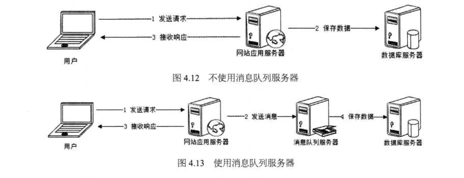
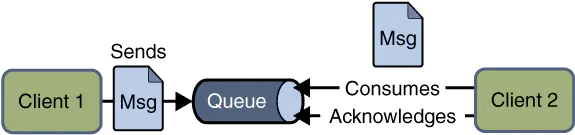
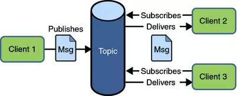

[**首页**](https://github.com/qdw497874677/myNotes/blob/master/首页检索.md)

## 什么是消息队列

我们可以把消息队列比作是一个存放消息的容器，当我们**需要使用消息的时候可以取出消息供自己使用**。消息队列是分布式系统中重要的组件，使用消息队列主要是为了通过异步处理提高系统性能和削峰、降低系统耦合性。目前使用较多的消息队列有ActiveMQ，RabbitMQ，Kafka，RocketMQ，我们后面会一一对比这些消息队列。

队列 Queue 是一种**先进先出**的数据结构，所以消费消息时也是按照顺序来消费的。

除了上面说的消息消费顺序的问题，使用消息队列，我们还要考虑如何保证消息不被重复消费？如何保证消息的可靠性传输（如何处理消息丢失的问题）？......等等问题。

## 为什么用消息队列

两个好处：

- 通过异步处理提高系统性能。（削峰、减少响应所需时间）
  - 
  - 高并发的情况下，服务器把用户请求放到消息队列中，然后立即返回（减少响应时间）。消息队列的消费者从消息队列中获取数据进行下一步处理，比如写入数据库，可以削平高峰期的并发事务。
- 降低系统耦合性。
  - 如果模块之间不存在直接调用，那么可拓展性就更好。大型网站常常利用消息队列实现**事件驱动结构**。
  - 
  - **消息队列使利用发布-订阅模式工作，消息发送者（生产者）发布消息，一个或多个消息接受者（消费者）订阅消息。** 从上图可以看到**消息发送者（生产者）和消息接受者（消费者）之间没有直接耦合**，消息发送者将消息发送至分布式消息队列即结束对消息的处理，消息接受者从分布式消息队列获取该消息后进行后续处理，并不需要知道该消息从何而来。**对新增业务，只要对该类消息感兴趣，即可订阅该消息，对原有系统和业务没有任何影响，从而实现网站业务的可扩展性设计**。

另外为了避免消息队列服务器宕机造成消息丢失，会将成功发送到消息队列的消息**存储在消息生产者服务器**上，等消息**真正被消费者服务器处理后才删除消息**。在消息队列服务器宕机后，生产者服务器会选择分布式消息队列服务器集群中的其他服务器发布消息。

## 带来的问题

- **系统可用性降低：** 系统可用性在某种程度上降低，为什么这样说呢？在加入MQ之前，你不用考虑消息丢失或者说MQ挂掉等等的情况，但是，引入MQ之后你就需要去考虑了！
- **系统复杂性提高：** 加入MQ之后，你需要保证消息没有被重复消费、处理消息丢失的情况、保证消息传递的顺序性等等问题！
- **一致性问题：** 我上面讲了消息队列可以实现异步，消息队列带来的异步确实可以提高系统响应速度。但是，万一消息的真正消费者并没有正确消费消息怎么办？这样就会导致数据不一致的情况了!

## JMS VS AMQP

### JMS

#### 简介

JMS（JAVA Message Service,java消息服务）是java的消息服务，JMS的客户端之间可以通过JMS服务进行异步的消息传输。**JMS（JAVA Message Service,Java消息服务）API是一个消息服务的标准或者说是规范**，允许应用程序组件基于JavaEE平台创建、发送、接收和读取消息。它使分布式通信耦合度更低，消息服务更加可靠以及异步性。

**ActiveMQ 就是基于 JMS 规范实现的。**

#### **JMS两种消息模型**

1. 点到点（P2P）模型

使用**队列（Queue）**作为消息通信载体；满足**生产者与消费者模式**，一条消息只能被一个消费者使用，未被消费的消息在队列中保留直到被消费或超时。比如：我们生产者发送100条消息的话，两个消费者来消费一般情况下两个消费者会按照消息发送的顺序各自消费一半（也就是你一个我一个的消费。）

2. 发布/订阅（Pub/Sub）模型

发布订阅模型（Pub/Sub） 使用**主题（Topic）**作为消息通信载体，类似于**广播模式**；发布者发布一条消息，该消息通过主题传递给所有的订阅者，**在一条消息广播之后才订阅的用户则是收不到该条消息的**。

#### JMS五种消息正文格式

JMS定义了五种不同的消息正文格式，以及调用的消息类型，允许你发送并接收以一些不同形式的数据，提供现有消息格式的一些级别的兼容性。

- StreamMessage -- Java原始值的数据流
- MapMessage--一套名称-值对
- TextMessage--一个字符串对象
- ObjectMessage--一个序列化的 Java对象
- BytesMessage--一个字节的数据流

### AMQP

 AMQP，即Advanced Message Queuing Protocol,一个提供统一消息服务的应用层标准 **高级消息队列协议**（二进制应用层协议），是应用层协议的一个开放标准,为面向消息的中间件设计，兼容 JMS。基于此协议的客户端与消息中间件可传递消息，并不受客户端/中间件同产品，不同的开发语言等条件的限制。

**RabbitMQ 就是基于 AMQP 协议实现的。**

## 常见消息队列对比

| 对比方向 | 概要                                                         |
| -------- | ------------------------------------------------------------ |
| 吞吐量   | 万级的 ActiveMQ 和 RabbitMQ 的吞吐量（ActiveMQ 的性能最差）要比 十万级甚至是百万级的 RocketMQ 和 Kafka 低一个数量级。 |
| 可用性   | 都可以实现高可用。ActiveMQ 和 RabbitMQ 都是基于主从架构实现高可用性。RocketMQ 基于分布式架构。 kafka 也是分布式的，一个数据多个副本，少数机器宕机，不会丢失数据，不会导致不可用 |
| 时效性   | RabbitMQ 基于erlang开发，所以并发能力很强，性能极其好，延时很低，达到微秒级。其他三个都是 ms 级。 |
| 功能支持 | 除了 Kafka，其他三个功能都较为完备。 Kafka 功能较为简单，主要支持简单的MQ功能，在大数据领域的实时计算以及日志采集被大规模使用，是事实上的标准 |
| 消息丢失 | ActiveMQ 和 RabbitMQ 丢失的可能性非常低， RocketMQ 和 Kafka 理论上不会丢失。 |

**总结：**

- ActiveMQ 的社区算是比较成熟，但是较目前来说，ActiveMQ 的性能比较差，而且版本迭代很慢，不推荐使用。
- RabbitMQ 在吞吐量方面虽然稍逊于 Kafka 和 RocketMQ ，但是由于它基于 erlang 开发，所以并发能力很强，性能极其好，延时很低，达到微秒级。但是也因为 RabbitMQ 基于 erlang 开发，所以国内很少有公司有实力做erlang源码级别的研究和定制。如果业务场景对并发量要求不是太高（十万级、百万级），那这四种消息队列中，RabbitMQ 一定是你的首选。如果是大数据领域的实时计算、日志采集等场景，用 Kafka 是业内标准的，绝对没问题，社区活跃度很高，绝对不会黄，何况几乎是全世界这个领域的事实性规范。
- RocketMQ 阿里出品，Java 系开源项目，源代码我们可以直接阅读，然后可以定制自己公司的MQ，并且 RocketMQ 有阿里巴巴的实际业务场景的实战考验。RocketMQ 社区活跃度相对较为一般，不过也还可以，文档相对来说简单一些，然后接口这块不是按照标准 JMS 规范走的有些系统要迁移需要修改大量代码。还有就是阿里出台的技术，你得做好这个技术万一被抛弃，社区黄掉的风险，那如果你们公司有技术实力我觉得用RocketMQ 挺好的
- kafka 的特点其实很明显，就是仅仅提供较少的核心功能，但是提供超高的吞吐量，ms 级的延迟，极高的可用性以及可靠性，而且分布式可以任意扩展。同时 kafka 最好是支撑较少的 topic 数量即可，保证其超高吞吐量。kafka 唯一的一点劣势是有可能消息重复消费，那么对数据准确性会造成极其轻微的影响，在大数据领域中以及日志采集中，这点轻微影响可以忽略这个特性天然适合大数据实时计算以及日志收集。

## 消息模型

### 队列模型

生产者（Producer）发消息入队，消费者（Consumer）收消息出队。存放消息的容器就称为队列。

这种情况下，**一个队列中的消息只能被一个消费者消费**，多个消费者之间是竞争关系。

可以通过为每个消费者创建一个单独的队列，生产者生产多份。

### 发布订阅模型

这个模型可以实现消息多次消费。

在发布订阅模型中，消息发送者称为发布者（Publisher），消息接收方称为订阅者（Subscriber），服务端存放消息的容器称为主题（Topic）。

发布者将消息发送到主题中，订阅者在接收消息之前需要先“订阅主题”。“订阅”既是一个动作，也可以表示主题在消费时的一个逻辑副本。每份订阅中，订阅者都可以接收到主题的所有消息。

**两种模型最大的区别就是：一份消息能不能被消费多次。**

### RabbitMQ的消息模型

RabbitMQ坚持使用队列模型。通过Exchange模块实现多消费者问题。

Exchange位于生产者和队列之间，生产者不关心队列，只需要**把消息发送给Exchange，Exchange根据配置测策略来决定将消息投递到哪些队列中**。Exchange可以为消费者提供多个队列，变相实现发布订阅模式。

### RocketMQ的消息模型

RocketMQ使用发布订阅模型。

RocketMQ中也有队列（Queue）的概念。这个队列是为消息提供保障的。

几乎所有MQ都使用请求-确认机制，来确保消息不会在传递过程中丢失。具体做法就是，生产者将消息发送给服务端（Broker），服务端收到消息后，将消息写入主题或者队列中后，会**给生产者发送确认的响应。**如果生产者没有收到服务端响应或者收到失败响应，就会重发消息。服务端会等待消费者消费成功的响应消息，只有收到消费成功的消息后才会认为一条消息被成功消费。

> 生产者等待服务端存储后的确认。服务端等待消费者消费后的确认。

这个确认机制保证消息传递的可靠性。会引发一个问题，为了保证消息的有序性，一条消息被成功消费之前，不能去消费下一条消息。这样就无法通过水平扩展消费者数量来提高消费性能。RocketMQ就通过队列来解决。

每个主题包含多个队列，通过**多个队列实现多实例并行生产和消费**。RocketMQ只保证队列上的消息消费的有序性，不保证主题层面上的。这样对于要求有序的消息可以放在同一个队列中。

RocketMQ中订阅组的概念通过**消费者组**（Consumer Group）来体现。每一个消费者组消费一份主题中的消息。不同消费者组之间的消费进度不受影响。而消费者组内对于一份消息是竞争关系，在组内只能消费一次，消息被一个消费者消费后，组内其他消费者就不会收到这条消息了。

因为一条消息要被多个消费者组消费，所以消费一次后不会删除。这就需要**消费者组为每个队列维护一个消费位置**（Consumer Offset）。消费位置之前的消息被消费过，之后的没有被消费过。

- **消费者组内可以水平扩展消费者，并发消费不同的队列，来提高消费性能。**
- **主题内设置多个有序队列提供队列内的有序性，并且可以让消费者并发消费。**
- **多个消费者组利用消费位置，满足重复消费的需求。**

### Kafka

Kafka的消息模型和RocketMQ是一样的。只不过RocketMQ中的队列在Kafka中对应的是分区（Partition）。

## 如何确保消息不会丢失

主流的MQ都提供了完善的消息可靠性。业务中绝大部分丢失消息的情况是由于开发者的缘故。

### 检测消息丢失的方法

开发者怎么检测消息是否丢失

- 利用消息队列的有序性验证是否有消息丢失
  - 在生产者端对每个消息附加递增的序号，消费者端来检测是否连续递增。一般利用客户端的拦截器机制来执行这些逻辑。
  - 对于有序性只针对不同分区的MQ，就需要执行分区去判断是否连续递增。
  - 生产者如果是多实例，还要区分每个生产者的编号，判断也根据每个生产者去判断连续性。

### 确保消息可靠传递

一条消息的三个阶段

- 生产阶段：生产者生产消息经过网络发送到Broker
- 存储阶段：消息在Broker存储，如果是集群，还会被复制到副本上
- 消费阶段：消费者从Broker中拉取消息，经过网络到消费者上

分析这三个阶段中消息的丢失情况。

1. 生产阶段

生产者发送消息给Broker后等待确认响应，如果收到响应就表明没有丢失。如果失败后注意需要正确处理返回值或者捕获异常。同步发送和异步发送都需要捕获异常做响应处理。异步发送时注意在回调方法中捕获异常。

2. 存储阶段

除非Broker出现故障，一般这个阶段不会出现丢失消息的问题。

可以通过配置Broker参数，减少宕机的影响

- 配置Broker，使其收到消息后先将消息**写入磁盘后，再给生产者返回确认响应**
- 配置Broker集群，**发送消息到2个以上节点后**，再给生产者返回确认响应。

3. 消费阶段

消费阶段采用和生产阶段类似的确认机制。消费者拉取消息后，执行完消费逻辑成功后，才会返回给Broker确认响应。如果Broker没收到确认，下次拉取还是同一条消息。

这里编写代码注意的是，不要在收到消息就立刻发送消息确认，而是应该在执行完所有逻辑后，再发送消息确认。

## 如何处理消费过程中的重复消息

消息传递过程中，如果传递失败发送方会重试，重试过程中可能会产生重复的消息。如果没有对重复处理，就可能会导致错误的数据。

消费者难免会收到重复消息。

### 消息重复必然存在

三种消息传递的服务质量标准，由低到高。

- At most once:  至多一次。消息在传递时，最多会被送达一次。没什么消息可靠性保证，**允许丢消息**。一般都是一些对消息可靠性要求不太高的监控场景使用，比如每分钟上报一次机房温度数据，可以接受数据少量丢失。
- At least once: 至少一次。消息在传递时，至少会被送达一次。**不允许丢消息，但是允许有少量重复消息出现。**
- Exactly  once：恰好一次。消息在传递时，只会被送达一次，**不允许丢失也不允许重复**，这个是最高的等级。

一般MQ都是支持At least once的，也就是不允许丢消息，但允许重复。

### 用幂等性解决

一般的解决办法就是：**在消费端，让消费操作具备幂等性**。

幂等操作的特点：**其任意多次执行所产生的影响均与一次执行的影响相同。**一个幂等方法，用同样的参数多次调用，对系统的影响是一样的。比如：将账户X的余额设置为100元。这个是幂等的方法。

**At least once + 幂等 = Exactly  once**

操作方式就是将消费的业务逻辑设计成具有幂等性的操作。

几种常见的设计幂等操作的方法：

#### 缓存预更新

对于一个值最终的更新，先做预备更新，把真正要操作的逻辑异步地处理。比如：对于用户余额的更新，

- 数据库的唯一性：在关系型数据库中，设计一个对于更新操作具有唯一性的表，比如字段有：用户id，账单id，变更金额。对用户id和账单id联合创建唯一约束。这样再真正更新数据前，这个预备表只会有一条数据。
- 利用不存在才插入：在支持类似“不存在才插入”这种语义的数据库中都可以。比如用Redis中的setnx来代替唯一约束，也可以这样实现幂等操作。

#### 为更新数据设置前置条件

给数据变更加前置条件，先判断条件是否满足，满足后才会更新，同时变更前置条件。比较通用的做法就是更新前判断版本号，更新后版本号+1。类似CAS

#### 记录并检查操作

通用性最强的方式。发送消息时为每个消息指定一个全局唯一id。消费时先根据id检查是否被消费过，如果没有才更新数据。

在分布式系统中，生成全局唯一id比较困难。同时检查，更新，设置消费状态，这三个操作都需要原子性。

## 如何处理消息积压

消息积压的直接问题就是，系统中某个部分出现了性能问题，来不及处理上游发送的消息。

### 性能优化避免消息积压

主要的性能提升在于生产者和消费者的业务逻辑中。

#### 发送端

发送一个消息的主要耗时为：

- 发送端准备数据、序列化消息、构建请求等
- 发送消息和接收响应在网络中传输的耗时
- Broker处理消息的时延

可以通过**提高并发或者批量发送**的形式，来缩短耗时。**根据具体业务来选择**：

对于**在线业务**，比较在意响应时延，适合通过**并发来提升发送性能**。一般系统中对于每个请求，直接去发送消息就好了，一般请求间都是支持并发的。

对于**离线分析业务**，不关注时延，更关注吞吐量。这种情况适合**批量发送**，一般发送的数据来自于数据库，这样就可以批量从数据库读取数据，然后批量发送。

#### 消费端

大部分性能问题出现在消费端。如果性能问题是暂时的，在消费端性能恢复后能慢慢消化堆积的消息，那 问题不大。如果时间长了就会出现问题，要么无法提供服务，消息丢失。

在设计系统时就要保证：**消费性能大于生产端的发送性能**。

尽量将**消费业务写好**。也可以通过对**消费端进行水平扩容**，同时增加Broker的分区数量，保证和消费者数量一致。

**错误的解决**：在消费端通过把消息放到内存队列中，让业务线程并发的处理队里中的消息。这种方法无法保证消息丢失问题。

### 消费积压怎么处理

系统日常运转过程中出现了消息积压问题，需要快速解决。

通过监控功能，先确定两种情况：**发送快了还是消费慢了**。

- 发送快了：说明什么服务调用暴增。只能通过对消费端扩容来提高总体的消费性能。如果无法扩容，就进行服务降级，关闭不必要的业务，减少发送方发送的数据量，让系统最低限度运转，服务重要业务。
- 消费慢了：要检查消费者实例，分析是什么原因导致变慢。
- 没变化：可能是因为消费端有消费失败导致大量的反复尝试消费的情况。

## 发现服务

对于分布式集群，都需要一种服务来供外界寻找集群中的节点。这种服务可以监控每个节点的路由信息，供客户端查看，同时保证节点信息的一致性。

Kafka选择使用ZooKeeper ——一个分布式协调服务，来实现服务发现。

### ZooKeeper 

ZooKeeper  作为一个分布式的协调服务框架，主要用来解决分布式集群中，应用系统需要面对的各种通用的一致性问题。ZooKeeper  本身可以部署为一个集群，集群的各个节点之间可以通过选举来产生一个 Leader，选举遵循半数以上的原则，所以一般集群需要部署奇数个节点。

核心功能：提供了一个分布式的存储系统，数据的组织方式类似于 UNIX 文件系统的树形结构。

### Kafka存了什么

