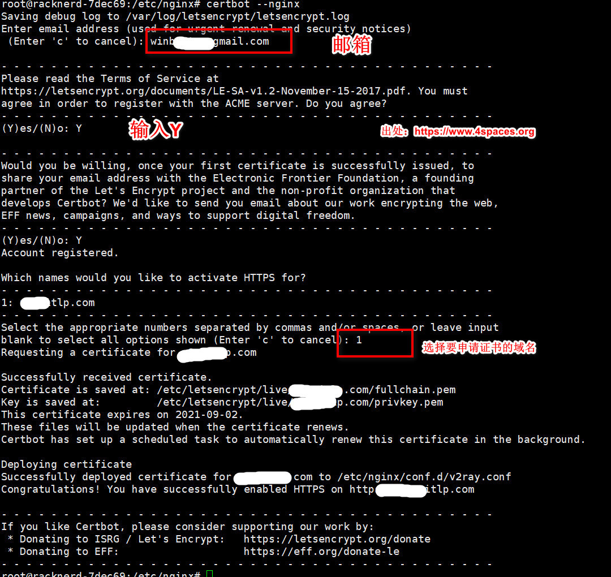
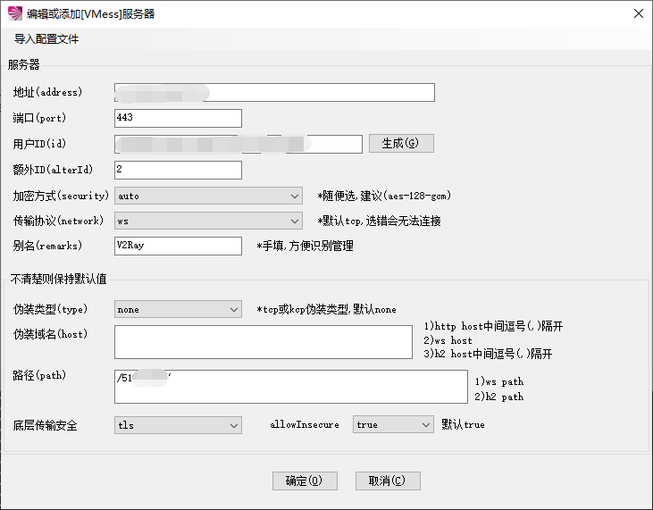

# 科学上网

VMess+WS(websocket)+TLS

## 搭建流程

1. 连接vps


2. 更新

```bash
apt update
```


3. 安装curl

```bash
apt install curl
```


4. 安装v2ray

```bash
// 安裝執行檔和 .dat 資料檔
bash <(curl -L https://raw.githubusercontent.com/v2fly/fhs-install-v2ray/master/install-release.sh)
```

在安装过程中，会打印详细的安装说明，里面有使用的配置文件信息，显示配置文件在`/usr/local/etc/v2ray/config.json`这个位置。

输入`vi /usr/local/etc/v2ray/config.json`命令，编辑配置文件的内容为以下内容：

```json
{
    "log": {
        "access": "/var/log/v2ray/access.log",
        "error": "/var/log/v2ray/error.log",
        "loglevel": "warning"
    },
    "inbounds": [{
            "port": 11055,
            "protocol": "vmess",
            "settings": {
                "clients": [{
                        "id": "27848739-7e62-4138-9fd3-098a63964b6b",
                        "level": 1,
                        "alterId": 0
                    }
                ]
            },
            "streamSettings": {
                "network": "ws",
                "wsSettings": {
                    "path": "/tech"
                }
            }
        }
    ],

    "outbounds": [{
            "protocol": "freedom"
        }
    ]
}
```


5. 启动v2ray

```bash
#启动并加入开机自启
systemctl start v2ray;systemctl enable v2ray
```


6. 安装nginx

```bash
apt install -y nginx
```

**新建网页目录**

这里在假设是`/root/www`。

```
mkdir -p /root/www
```

**新建首页**

在`/root/www`目录下新建一个`index.html`文件，

```
vi /root/www/index.html
```

内容如下：

```
<html>
   <title>欢迎访问四个空格</title>
   <head><meta charset="UTF-8"></head>
   <body>
     <a href="https://www.4spaces.org/install-v2ray-v-4-44-on-debian-2022/">四个空格</a>
   </body>
</html>
```

**新建配置文件**

**注：** 不同版本的nginx配置文件可能有区别，我的是`nginx/1.18.0`，配置文件`/etc/nginx/sites-enabled/default`。或者你的配置文件可能在`/etc/nginx/conf.d/default.conf`。

输入`vi /etc/nginx/sites-enabled/default`命令，编辑nginx配置文件为如下内容：

```
server{
    listen 80;
    server_name v1.xxxx.com;
    index index.html;
    root /root/www/;
}
```

> 这里你可能需要将`/etc/nginx/nginx.conf`中第一行`user www-data`改为`user root`，即当前用户。

**启动nginx服务**

**复制

```
#启动Nginx并设置为开机自启
systemctl start nginx;systemctl enable nginx

#查看nginx启动状态
systemctl status nginx
```

在浏览器里访问`v1.xxxx.com`，如果正常则说明nginx配置没问题，这是是没有加密的，不带HTTPS的网址：`http://v1.xxxx.com`。

7. 安装certbot并申请ssl证书

详细的申请证书流程参考： [certbot instructions – Nginx on Debian 10 (buster)](https://certbot.eff.org/lets-encrypt/debianbuster-nginx)。具体如下：

**安装snapd**

```
apt install -y snapd
```

**确保snapd为最新版本**

```
snap install core; snap refresh core
```

**安装certbot**

```
snap install --classic certbot
```

**创建软链**

```
ln -s /snap/bin/certbot /usr/bin/certbot
```

**申请证书**

运行`certbot --nginx`开始申请证书，如下：



稍等一会，会提示证书安装成功！ 你会发现nginx的配置已经更改，我的`/etc/nginx/sites-enabled/default`文件被自动修改为以下内容：

**复制

```
server{
    server_name v1.xxxx.com;
    index index.html;
    root /root/www/;

    listen 443 ssl; # managed by Certbot
    ssl_certificate /etc/letsencrypt/live/v1.xxxx.com/fullchain.pem; # managed by Certbot
    ssl_certificate_key /etc/letsencrypt/live/v1.xxxx.com/privkey.pem; # managed by Certbot
    include /etc/letsencrypt/options-ssl-nginx.conf; # managed by Certbot
    ssl_dhparam /etc/letsencrypt/ssl-dhparams.pem; # managed by Certbot

}
server{
    if ($host = v1.xxxx.com) {
        return 301 https://$host$request_uri;
    } # managed by Certbot


    listen 80;
    server_name v1.xxxx.com;
    return 404; # managed by Certbot


}
```

此时，在浏览器里访问`v1.xxxx.com`已经是`https`开头的了，地址：`https://v1.xxxx.com`。

8. 添加v2ray转发

将`/etc/nginx/sites-enabled/default`更改为以下内容：

**复制

```
server{
    server_name v1.xxxx.com;
    index index.html;
    root /root/www/;

    listen 443 ssl; # managed by Certbot
    ssl_certificate /etc/letsencrypt/live/v1.xxxx.com/fullchain.pem; # managed by Certbot
    ssl_certificate_key /etc/letsencrypt/live/v1.xxxx.com/privkey.pem; # managed by Certbot
    include /etc/letsencrypt/options-ssl-nginx.conf; # managed by Certbot
    ssl_dhparam /etc/letsencrypt/ssl-dhparams.pem; # managed by Certbot

   ## 添加这部分内容,22055对应/usr/local/etc/v2ray/config.json 里面inbounds端口
   ## /tech客户端配置的时候需要,对应/usr/local/etc/v2ray/config.json streamSettings里的path
    location /tech {
        proxy_redirect off;
        proxy_pass http://127.0.0.1:11055;
        proxy_http_version 1.1;
        proxy_set_header Upgrade $http_upgrade;
        proxy_set_header Connection "upgrade";
        proxy_set_header Host $http_host;
    }
}
server{
    if ($host = v1.xxxx.com) {
        return 301 https://$host$request_uri;
    } # managed by Certbot


    listen 80;
    server_name v1.xxxx.com;
    return 404; # managed by Certbot


}
```

然后运行`systemctl restart nginx`重启nginx。


卸载：

执行脚本的卸载命令即可：

```bash
bash <(curl -L https://raw.githubusercontent.com/v2fly/fhs-install-v2ray/master/install-release.sh) --remove
```


## 一键安装

### **Vmess+websocket+TLS+Nginx+Website**

```bash
bash <(curl -L -s https://raw.githubusercontent.com/wulabing/V2Ray_ws-tls_bash_onekey/master/install.sh) | tee v2ray_ins.log
```

**执行安装前先将域名解析A记录到VPS/云服务器IP，可解析www或任意其他二级域名，解析域名与安装配置域名一致即可，安装脚本配置端口选择443（默认）。**

**脚本管理命令**

启动 V2ray：

```
systemctl start v2ray
```

停止 V2ray：

```
systemctl stop v2ray
```

启动 Nginx：

```
systemctl start nginx
```

停止 Nginx：

```
systemctl stop nginx
```

**脚本相关目录**

Web 目录：

```
/home/wwwroot/levis
```

V2ray 服务端配置：

```
/etc/v2ray/config.json
```

V2ray 客户端配置：

```
执行安装时所在目录下的 v2ray_info.txt
```

Nginx 目录：

```
/etc/nginx
```

证书目录：

```
/data/v2ray.key 和 /data/v2ray.crt
```

### v2rayN Windows客户端下载/配置


**Windows客户端下载地址：https://down.wangchao.info/soft/v2rayN.zip**

打开软件，点击：服务器→添加[VMess]服务器：



填上你设置的对应数据，请务必完全参照服务端返回的数据，服务端和客户端必须一致，如**地址（域名）**、**端口**、**用户ID**、**路径**等，**加密方式**一般为auto，**传输协议**为ws，**伪装类型**一般为none，**伪装域名**留空，开启tls和不安全传输，设置完保存。

右键V2RayN的系统栏小图标，点击**启用Http代理**，**Http代理模式**选择第二个**PAC模式**，最后再打开V2RayN软件面板，在**检查更新**里选择**更新PAC**。

到此，V2Ray就全部配置完成了。


## 防火墙开启端口

### iptables(centos 6及以前)

1.打开/关闭/重启防火墙

**复制

```
开启防火墙(重启后永久生效)：chkconfig iptables on

关闭防火墙(重启后永久生效)：chkconfig iptables off

开启防火墙(即时生效，重启后失效)：service iptables start

关闭防火墙(即时生效，重启后失效)：service iptables stop

重启防火墙:service iptables restartd
```

2.查看打开的端口

**复制

```
/etc/init.d/iptables status
```

3.打开某个端口(以8080为例)

（1）开启端口

**复制

```
iptables -A INPUT -p tcp --dport 8080 -j ACCEPT 
```

（2）保存并重启防火墙

**复制

```
/etc/rc.d/init.d/iptables save
/etc/init.d/iptables restart
```

4.打开`49152~65534`之间的端口

**复制

```
iptables -A INPUT -p tcp --dport 49152:65534 -j ACCEPT  
```

同样，这里需要对设置进行保存，并重启防火墙。

5.其他打开方式

我们还可以通过修改/etc/sysconfig/iptables文件的方式开启端口，如下

**复制

```
vi /etc/sysconfig/iptables
```

然后在文件中增加一行

**复制

```
-A RH-Firewall-1-INPUT -m state –state NEW -m tcp -p tcp –dport 8080 -j ACCEPT
```

参数说明:

- –A 参数就看成是添加一条规则
- –p 指定是什么协议，我们常用的tcp 协议，当然也有udp，例如53端口的DNS
- –dport 就是目标端口，当数据从外部进入服务器为目标端口
- –sport 数据从服务器出去，则为数据源端口使用
- –j 就是指定是 ACCEPT -接收 或者 DROP 不接收

### firewalld(centos7)

Centos7默认安装了firewalld，如果没有安装的话，可以使用 `yum install firewalld firewalld-config`进行安装。

1.启动防火墙

**复制

```
systemctl start firewalld 
```

2.禁用防火墙

**复制

```
systemctl stop firewalld
```

3.设置开机启动

**复制

```
systemctl enable firewalld
```

4.停止并禁用开机启动

**复制

```
systemctl disable firewalld
```

5.重启防火墙

**复制

```
firewall-cmd --reload
```

6.查看状态

**复制

```
systemctl status firewalld或者 firewall-cmd --state
```

7.查看版本

**复制

```
firewall-cmd --version
```

8.查看帮助

**复制

```
firewall-cmd --help
```

9.查看区域信息

**复制

```
firewall-cmd --get-active-zones
```

10.查看指定接口所属区域信息

**复制

```
firewall-cmd --get-zone-of-interface=eth0
```

11.拒绝所有包

**复制

```
firewall-cmd --panic-on
```

12.取消拒绝状态

**复制

```
firewall-cmd --panic-off
```

13.查看是否拒绝

**复制

```
firewall-cmd --query-panic
```

14.将接口添加到区域(默认接口都在public)

**复制

```
firewall-cmd --zone=public --add-interface=eth0(永久生效再加上 --permanent 然后reload防火墙)
```

15.设置默认接口区域

**复制

```
firewall-cmd --set-default-zone=public(立即生效，无需重启)
```

16.更新防火墙规则

**复制

```
firewall-cmd --reload或firewall-cmd --complete-reload(两者的区别就是第一个无需断开连接，就是firewalld特性之一动态
添加规则，第二个需要断开连接，类似重启服务)
```

17.查看指定区域所有打开的端口

**复制

```
firewall-cmd --zone=public --list-ports
```

18.在指定区域打开端口（记得重启防火墙）

**复制

```
firewall-cmd --zone=public --add-port=80/tcp(永久生效再加上 --permanent)
```

> 说明：
> –zone 作用域
> –add-port=8080/tcp 添加端口，格式为：端口/通讯协议
> –permanent #永久生效，没有此参数重启后失效

19.允许指定范围tcp端口至public级别（记得重启防火墙）

**复制

```
firewall-cmd --zone=public --add-port=5060-5059/tcp --permanent
```