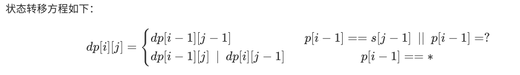

[**首页**](https://github.com/qdw497874677/myNotes/blob/master/首页检索.md)

# 排序

## n^2

### 冒泡排序

比较相邻数字，如果大/小就交换，一遍一遍循环遍历
稳定。最好的时候n，最坏的时候n2

~~~java
public static int[] bubbleSort(int[] array) {
        if (array.length == 0)
            return array;
        for (int i = 0; i < array.length; i++)
            for (int j = 0; j < array.length - 1 - i; j++)
                if (array[j + 1] < array[j]) {
                    int temp = array[j + 1];
                    array[j + 1] = array[j];
                    array[j] = temp;
                }
        return array;
    }
~~~

### 插入排序

前面放排序好的部分，对没有排序的部分的最左边的数，和排序好部分比较，插入到合适的部分
稳定。最好的时候n，最坏的时候n2

~~~java
    public static int[] selectionSort(int[] array) {
        if (array.length == 0)
            return array;
        for (int i = 0; i < array.length; i++) {
            int minIndex = i;
            for (int j = i; j < array.length; j++) {
                if (array[j] < array[minIndex]) //找到最小的数
                    minIndex = j; //将最小数的索引保存
            }
            int temp = array[minIndex];
            array[minIndex] = array[i];
            array[i] = temp;
        }
        return array;
    }
~~~

### 选择排序

遍历所有的，把最小/大的选出来放前面
不稳定。n2

~~~java
    public static int[] selectionSort(int[] array) {
        if (array.length == 0)
            return array;
        for (int i = 0; i < array.length; i++) {
            int minIndex = i;
            for (int j = i; j < array.length; j++) {
                if (array[j] < array[minIndex]) //找到最小的数
                    minIndex = j; //将最小数的索引保存
            }
            int temp = array[minIndex];
            array[minIndex] = array[i];
            array[i] = temp;
        }
        return array;
    }
~~~

## nlogn

### 归并排序

稳定

### 希尔排序

不稳定

### 快速排序

不稳定。最好的时候nlogn，最坏的时候n2，平均nlogn

~~~java
public static int[] fast(int[] arr,int left,int right){
    if (left<right){
        int index = part(arr,left,right);
        fast(arr,left,index-1);
        fast(arr,index+1,right);
    }
    return arr;
}
public static int part(int[] arr,int left,int right){
    int index = arr[left];
    while (left<right){
        while (left<right && arr[right]>=index){
            right--;
        }
        if (left<right){
            arr[left] = arr[right];
            left++;
        }
        while (left<right && arr[left]<=index){
            left++;
        }
        if (left<right){
            arr[right] = arr[left];
            right--;
        }

    }
    arr[left] = index;
    return left;
}
~~~

### 堆排序

不稳定

时间复杂度O(nlog2(n))，额外空间复杂度O(1)。

堆排序：堆是一颗完全二叉树，可以是链表或者数组的形式。利用完全二叉树的性质来。把无序数组构建成二叉堆，然后循环取堆顶与尾部元素交换，就可以实现排序。父节点的下标是i，左孩子的下标就是2*i+1，右孩子下标就是2*i+2。

1. 维护堆：调整一次的时间复杂度是O(log2(n))
   1. 删除堆顶元素：删除堆顶后要选择一个新的元素作为二叉树的根节点。把最后一个元素放到堆顶位置，然后调整成堆的定义。和子节点比较，交换后在对交换后的子节点检查是否符合，然后向下一一调整。
   2. 添加一个元素：把新元素放在末尾，然后和它的父节点比较，自下向上比较，直到符合堆的结构。（这里和父节点交换后不用考虑父节点对现在的子节点的影响了，因为前提是已经在堆中添加，节点的祖先节点都是肯定满足要求的。）
2. 构建堆：
   1. 把数据作为完全二叉树（数组可以当成是二叉树的层次遍历）交换元素调整成堆。O(n)
      1. 从最后一个非叶子节点开始向下调整堆，比较节点和子节点选出合适的替换，对调整后新的叶子节接着进行调整。直到最后从根节点调整。
   2. 还可以借鉴插入排序的思路。视第一个元素为一个堆，然后不断向其中添加新的元素。需要循环插入n-1个元素。O(log2(n))。

首先构建一个堆，然后依次取出堆顶，然后把最后一个元素放到堆顶重新调整堆，这样不断地取出堆顶的元素，就实现排序
最佳情况：T(n) = O(nlogn)   最差情况：T(n) = O(n2)   
平均情况：T(n) = O(nlogn)　

~~~java
//声明全局变量，用于记录数组array的长度；
static int len;
    /**
     * 堆排序算法
     *
     * @param array
     * @return
     */
    public static int[] HeapSort(int[] array) {
        len = array.length;
        if (len < 1) return array;
        //1.构建一个最大堆
        buildMaxHeap(array);
        //2.循环将堆首位（最大值）与末位交换，然后在重新调整最大堆
        while (len > 0) {
            swap(array, 0, len - 1);
            len--;
            adjustHeap(array, 0);
        }
        return array;
    }
    /**
     * 建立最大堆
     *
     * @param array
     */
    public static void buildMaxHeap(int[] array) {
        //从最后一个非叶子节点开始向上构造最大堆
        for (int i = (len/2 - 1); i >= 0; i--) { //感谢 @让我发会呆 网友的提醒，此处应该为 i = (len/2 - 1) 
            adjustHeap(array, i);
        }
    }
    /**
     * 调整使之成为最大堆
     *
     * @param array
     * @param i
     */
    public static void adjustHeap(int[] array, int i) {
        int maxIndex = i;
        //如果有左子树，且左子树大于父节点，则将最大指针指向左子树
        if (i * 2 < len && array[i * 2] > array[maxIndex])
            maxIndex = i * 2;
        //如果有右子树，且右子树大于父节点，则将最大指针指向右子树
        if (i * 2 + 1 < len && array[i * 2 + 1] > array[maxIndex])
            maxIndex = i * 2 + 1;
        //如果父节点不是最大值，则将父节点与最大值交换，并且递归调整与父节点交换的位置。
        if (maxIndex != i) {
            swap(array, maxIndex, i);
            adjustHeap(array, maxIndex);
        }
    }
~~~

## n+k

### 计数排序

稳定

### 桶排序

稳定

### 基数排序

稳定

# 位运算

& (并且)  两个1才是1

^ (异或) 两个0才是0

| (或者) 相等是0，不等是1

! (非)

~（反）

### **2的幂**

> 给定一个整数，编写一个函数来判断它是否是 2 的幂次方。
> 示例 1:
> 输入: 1
> 输出: true
> 解释: 20 = 1
> 示例 2:
> 输入: 16
> 输出: true
> 解释: 24 = 16
> 示例 3:
> 输入: 218
> 输出: false

可以通过不断的取余，如果为余0表示是，余1表示不是。
可以通过位运算。n&(n-1)为0说明是2的幂。

~~~java
class Solution {
    public boolean isPowerOfTwo(int n) {
        return n>0 && (n&(n-1)) == 0;
    }
}
~~~

### [**数组中数字出现的次数**](https://leetcode-cn.com/problems/shu-zu-zhong-shu-zi-chu-xian-de-ci-shu-lcof/)

> 一个整型数组 nums 里除两个数字之外，其他数字都出现了两次。请写程序找出这两个只出现一次的数字。要求时间复杂度是O(n)，空间复杂度是O(1)。
> 示例 1：
> 输入：nums = [4,1,4,6]
> 输出：[1,6] 或 [6,1]
> 示例 2：
> 输入：nums = [1,2,10,4,1,4,3,3]
> 输出：[2,10] 或 [10,2]
> 限制：
> 2 <= nums <= 10000

通过亦或找出两个不同数亦或的结果，然后根据这个结果中为1的一位，把数组中的数划分为分别有一个唯一数字的两组，分别在两组找到唯一数。

~~~java
class Solution {
    public int[] singleNumbers(int[] nums) {
        int i = 0;
        //得到的i就是两个不相等的数的亦或结果，因为其他都是成对的亦或后归零
        for (int num : nums) {
            i = i^num;
        }
        int j = 1;
        //找到i中那个不为0的一位，这位就是两个特殊数中不相等的一位。（这位为1说明这两个不同的数中，其中一个的这位为0，另一个的这位为1。这样这两位亦或^才会是1.）
        //通过二进制1、10、100等去和i做与运算。当i&j为1说明，i的这位为1（1&0=0、1&1=1）。
        // 找到这个不同的最低位，一会通过这位的不同来区分两个数。
        while ((i&j)==0){
            j = j<<1;
        }
        int a = 0;
        int b = 0;
        //这两个不同的数分别在num & j为0和num & j为1这两组数中，这样就把这两组数差分开。
        //两组分别自我做亦或，各得到一个没有成对的数。
        for (int num : nums) {
            if((num & j) == 0){
                a = a^num;
            }else {
                b = b^num;
            }
        }
        return new int[]{a,b};
    }
}
~~~

### [根据数字二进制下 1 的数目排序](https://leetcode-cn.com/problems/sort-integers-by-the-number-of-1-bits/)

> 给你一个整数数组 arr 。请你将数组中的元素按照其二进制表示中数字 1 的数目升序排序。
> 如果存在多个数字二进制中 1 的数目相同，则必须将它们按照数值大小升序排列。
> 请你返回排序后的数组。
> 示例 1：
> 输入：arr = [0,1,2,3,4,5,6,7,8]
> 输出：[0,1,2,4,8,3,5,6,7]
> 解释：[0] 是唯一一个有 0 个 1 的数。
> [1,2,4,8] 都有 1 个 1 。
> [3,5,6] 有 2 个 1 。
> [7] 有 3 个 1 。
> 按照 1 的个数排序得到的结果数组为 [0,1,2,4,8,3,5,6,7]
> 示例 2：
> 输入：arr = [1024,512,256,128,64,32,16,8,4,2,1]
> 输出：[1,2,4,8,16,32,64,128,256,512,1024]
> 解释：数组中所有整数二进制下都只有 1 个 1 ，所以你需要按照数值大小将它们排序。
> 示例 3：
> 输入：arr = [10000,10000]
> 输出：[10000,10000]
> 示例 4：
> 输入：arr = [2,3,5,7,11,13,17,19]
> 输出：[2,3,5,17,7,11,13,19]
> 示例 5：
> 输入：arr = [10,100,1000,10000]
> 输出：[10,100,10000,1000]
> 提示：
> 1 <= arr.length <= 500
> 0 <= arr[i] <= 10^4

自带的计算二进制1的个数。

~~~java
class Solution {
    public int[] sortByBits(int[] arr) {
        int[] res = new int[arr.length];
        for (int i = 0; i < arr.length; i++) {
            //把十进制的值放在后面来比较二进制中1数量相等的情况。
            res[i] = Integer.bitCount(arr[i])*100000+arr[i];
        }
        Arrays.sort(res);
        for (int i = 0; i < res.length; i++) {
            //取余得到十进制的值。
            res[i] = res[i]%100000;
        }
        return res;
    }
}
~~~

自己写的逐位计算1位的数量的方法

~~~java
public int countBit(int num){
        int i = 1;
        int res = 0;
        while(num!=0){
            res += (1&num);
            num = num >> 1;
        }
        return res;
    }
~~~

# 数组

## 分治法

### [**数组中的第K个最大元素**](https://leetcode-cn.com/problems/kth-largest-element-in-an-array/)（字节跳动、小米、学而思）

> 在未排序的数组中找到第 k 个最大的元素。请注意，你需要找的是数组排序后的第 k 个最大的元素，而不是第 k 个不同的元素。
> 示例 1:
> 输入: [3,2,1,5,6,4] 和 k = 2
> 输出: 5
> 示例 2:
> 输入: [3,2,3,1,2,4,5,5,6] 和 k = 4
> 输出: 4
> 说明:
> 你可以假设 k 总是有效的，且 1 ≤ k ≤ 数组的长度。

可以用小顶堆，如果元素数量等于k，就比较堆顶，如果当前元素比堆顶大就移除堆顶元素，将新元素加入堆。最后堆顶就是第k大。

~~~java
class Solution {
    public int findKthLargest(int[] nums, int k) {
        Queue<Integer> queue = new PriorityQueue<>((a,b)->{
            return a-b;
        });
        for (int num : nums) {
            if (queue.size()==k){
                if(queue.peek()<=num){
                    queue.poll();
                    queue.add(num);
                }
            }else {
                queue.add(num);
            }
        }
        return queue.poll();
    }
}
~~~

用快排的一个partition函数，找到第n-k小的数。

~~~java
class Solution {
    public int findKthLargest(int[] nums, int k) {
        return fastGetK(0,nums.length-1,nums,nums.length-k);
    }
    public int fastGetK(int left,int right,int[] nums,int minK){
        if (left == right){
            return nums[left];
        }
        Random random = new Random();
        //我的这个快排 基数只能是第一个，暂时不用随机基数
//        int pivotIndex = left + random.nextInt(right-left);
        int pivotIndex = left;
        pivotIndex = partiton(left,right,pivotIndex,nums);
        if (pivotIndex == minK){
            return nums[pivotIndex];
        }else if (pivotIndex > minK){
            return fastGetK(left,pivotIndex-1,nums,minK);
        }
        return fastGetK(pivotIndex+1,right,nums,minK);
    }
    public int partiton(int left,int right,int pivotIndex,int[] nums){
        int pivot = nums[pivotIndex];
        while (left<right){
            while (left<right && nums[right]>=pivot){
                right--;
            }
            if (left<right){
                nums[left++] = nums[right];
            }
            while (left<right && nums[left]<=pivot){
                left++;
            }
            if (left<right){
                nums[right--] = nums[left];
            }
        }
        nums[left] = pivot;
        return left;
    }
}
~~~

## 二分法

### [**x 的平方根**](https://leetcode-cn.com/problems/sqrtx/)

> 实现 int sqrt(int x) 函数。
> 计算并返回 x 的平方根，其中 x 是非负整数。
> 由于返回类型是整数，结果只保留整数的部分，小数部分将被舍去。
> 示例 1:
> 输入: 4
> 输出: 2
> 示例 2:
> 输入: 8
> 输出: 2
> 说明: 8 的平方根是 2.82842..., 
>      由于返回类型是整数，小数部分将被舍去。

l为1，r为x，通过二分来确认最大的l，且平方小于等于x

每次用x除中间值mid，如果比mid小说明目标比mid小，如果比mid大说明目标比mid大。

x/mid如果大于mid，说明mid偏大，目标值在mid的左边；x/mid如果小于mid，说明mid偏小，目标值在mid的右边。结束条件为l和r最大只差1。结束后的左边l为目标结果。

~~~java
class Solution {
    public int mySqrt(int x) {
        if (x==0){
            return 0;
        }
        int l = 1;
        int r = x;
        //l和r只差1或者相等，说明l就是要找的数。
        while (r-l>1){
            int mid = l+(r-l)/2;
            //不能用mid*mid<x
            if (x/mid<mid){
                r = mid;
            }else {
                l = mid;
            }
        }
        return l;
    }
}
~~~

### [搜索旋转排序数组](https://leetcode-cn.com/problems/search-in-rotated-sorted-array/)（百度）

> 假设按照升序排序的数组在预先未知的某个点上进行了旋转。
>
> ( 例如，数组 [0,1,2,4,5,6,7] 可能变为 [4,5,6,7,0,1,2] )。
>
> 搜索一个给定的目标值，如果数组中存在这个目标值，则返回它的索引，否则返回 -1 。
>
> 你可以假设数组中不存在重复的元素。
>
> 你的算法时间复杂度必须是 O(log n) 级别。
>
> 示例 1:
>
> 输入: nums = [4,5,6,7,0,1,2], target = 0
> 输出: 4
> 示例 2:
>
> 输入: nums = [4,5,6,7,0,1,2], target = 3
> 输出: -1

判断mid在旋转点的左边还是右边，分情况考虑。如果mid在旋转点右边，优先和r去跟目标值比，如果目标在mid和r之间，就移动l否则移动r；如果mid在旋转点左边，目标在l和mid之间，就移动r否则移动l。

~~~java
class Solution {
    public int search(int[] nums, int target) {
        int l = 0;
        int r = nums.length-1;
        while (l<=r){
            int mid = l + (r-l)/2;
            if (nums[mid]==target){
                return mid;
            }
            //mid在旋转点右边
            if (nums[mid]<nums[l]){
                //目标在mid和r之间
                if (nums[mid]<target && nums[r]>=target){
                    l = mid + 1;
                }else {
                    r = mid - 1;
                }
            }else {
                //目标在l和mid之间
                if (nums[mid]>target && nums[l]<=target){
                    r = mid - 1;
                }else {
                    l = mid + 1;
                }
            }
        }
        return -1;
    }
}
~~~

### **有序矩阵中第K小的元素**

> 给定一个 n x n 矩阵，其中每行和每列元素均按升序排序，找到矩阵中第k小的元素。
> 请注意，它是排序后的第k小元素，而不是第k个元素。
> 示例:
> matrix = [
>    [ 1,  5,  9],
>    [10, 11, 13],
>    [12, 13, 15]
> ],
> k = 8,
> 返回 13。
> 说明:
> 你可以假设 k 的值永远是有效的, 1 ≤ k ≤ n2 。

~~~java
class Solution {
    public int kthSmallest(int[][] matrix, int k) {
        //二分查找
        int r = matrix.length;
        int c = matrix[0].length;
        int low = matrix[0][0];//最小值
        int high = matrix[r-1][c-1];//最大值
        while (low<=high){
            //取中间值
            int mid = (high-low)/2+low;
            int count=0;
            //算出小于等于中间值的有多少个数
            for (int i = 0; i < r; i++) {
                for (int j = 0; j < c && matrix[i][j]<=mid; j++) {
                    count++;
                }
            }
            //如果比k小，说明第k小在右边
            if (count<k){
                low = mid+1;
            }else {//如果比k大，说明第k小在左边
                high = mid-1;//为什么是mid-1，还在想,
                // 因为假如第k小数是此时的mid，
                // 那么下次，新的mid就是上次的high，
                // 那么low就是mid+1，也就是上次的mid
                //如果此时high=mid,那么循环条件就不存在low等于high
            }
        }
        return low;
    }
}
~~~

## 三指针、三路快排

### 颜色分类

> 颜色分类
> 给定一个包含红色、白色和蓝色，一共 n 个元素的数组，原地对它们进行排序，使得相同颜色的元素相邻，并按照红色、白色、蓝色顺序排列。
> 此题中，我们使用整数 0、 1 和 2 分别表示红色、白色和蓝色。
> 注意:
> 不能使用代码库中的排序函数来解决这道题。
> 示例:
> 输入: [2,0,2,1,1,0]
> 输出: [0,0,1,1,2,2]
> 进阶：
> 一个直观的解决方案是使用计数排序的两趟扫描算法。
> 首先，迭代计算出0、1 和 2 元素的个数，然后按照0、1、2的排序，重写当前数组。
> 你能想出一个仅使用常数空间的一趟扫描算法吗？

> 三个指针，左右指针分别指向最左和最右，一个指针从左到右移动，如果当前为0就和最左交换值，最指针右移，当前指针右移；如果当前值为2和右指针交换值，右指针左移，但是当前指针不动，因为不知道当前新交换过来的值是什么，所以不用右移

~~~java
class Solution {
    public void sortColors(int[] nums) {
        int left = 0;
        int right = nums.length-1;
        // 到right就够了，要由=，需要重新检查
        for (int i = 0; i <= right;) {
            //如果当前指针是0，就和左指针交换，两个指针都右移
            //因为每次循环要比较的都要求是新的值，所以和左边交换后，当前指针不用右移；
            // 而和右边交换后，就不用右移，因为右边交换来的值也是新的值
            if (nums[i] == 0){
                nums[i] = nums[left];
                nums[left] = 0;
                left++;
                i++;
            }else if(nums[i] == 2){
                //如果当前指针是2，就和右指针交换，右指针左移
                nums[i] = nums[right];
                nums[right] = 2;
                right--;
            }else {
                //如果当前指针是中间的1，就不变，当前指针右移
                i++;
            }
        }
    }
}
~~~

### 合并两个有序数组

> 给你两个有序整数数组 nums1 和 nums2，请你将 nums2 合并到 nums1 中，使 nums1 成为一个有序数组。 
>
>  说明: 
>
>  初始化 nums1 和 nums2 的元素数量分别为 m 和 n 。 
>  你可以假设 nums1 有足够的空间（空间大小大于或等于 m + n）来保存 nums2 中的元素。 
>
>
>  示例: 
>
>  输入:
> nums1 = [1,2,3,0,0,0], m = 3
> nums2 = [2,5,6],       n = 3
>
> 输出: [1,2,2,3,5,6] 
>  Related Topics 数组 双指针

~~~java
class Solution {
    public void merge(int[] nums1, int m, int[] nums2, int n) {
        int mr = m-1;
        int nr = n-1;
        int i = m+n-1;
        //从后向前遍历
        while (i>=0 && mr>=0 && nr>=0){
            if (nums2[nr] >= nums1[mr]){
                nums1[i--] = nums2[nr--];
            }else {
                nums1[i--] = nums1[mr--];
            }
        }
        if (nr>=0){
            for (int j = nr; j >= 0; j--) {
                nums1[i--] = nums2[nr--];
            }
        }
    }
}
~~~

### 寻找两个有序数组的中位数

> 给定两个大小为 m 和 n 的正序（从小到大）数组 nums1 和 nums2。
> 请你找出这两个正序数组的中位数，并且要求算法的时间复杂度为 O(log(m + n))。
> 你可以假设 nums1 和 nums2 不会同时为空。
> 示例 1:
> nums1 = [1, 3]
> nums2 = [2]
> 则中位数是 2.0
> 示例 2:
> nums1 = [1, 2]
> nums2 = [3, 4]
> 则中位数是 (2 + 3)/2 = 2.5

用三路快排来找中位数，分成三个指针去移动进行选择，两个指针分别指向两个数组，另外一个指针指向right和left，移动和比较前两个指针来改变第三个指针。时间复杂度为O(m+n)

~~~java
class Solution {
    public double findMedianSortedArrays(int[] nums1, int[] nums2) {
        int m = nums1.length;
        int n = nums2.length;
        int len = m + n;
        //　right,left表示中间两个数
        int left = -1, right = -1;
        int start1 = 0, start2 = 0;
        //把两个数组放在一起比较，去寻找中间两个数
        for (int i = 0; i <= len / 2; i++) {
            //right表示当前i所在的最新的值，left表示right左边的值
            left = right;
            //start1为nums1的指针，start2为nums2的指针
            //如果start1没有越界且(start2已经越界 或者　start1所在的值比start2所在的值大)
            //此时应该选start1所在的值作为下一个值附给right，start1++
            if (start1 < m && (start2 >= n || nums1[start1] < nums2[start2])) {
                right = nums1[start1++];
            } else {
                right = nums2[start2++];
            }
        }
        //如果有偶数个元素就把中间的两个数相加除二
        if ((len & 1) == 0){
            return (left + right) / 2.0;
        }else {
            //如果有奇数个，right的值就是中位数的值
            return right;
        }
    }
}
~~~

## 双指针

### **移动零**（小米）

> 给定一个数组 nums，编写一个函数将所有 0 移动到数组的末尾，同时保持非零元素的相对顺序。
> 示例:
> 输入: [0,1,0,3,12]
> 输出: [1,3,12,0,0]
> 说明:
> 必须在原数组上操作，不能拷贝额外的数组。
> 尽量减少操作次数。

将不是零的数移到前面，后面的就都是0了。

~~~java
class Solution {
    public void moveZeroes(int[] nums) {
        //j从0位置开始，把所有不是零的数都放到前面
        int j = 0;
        for (int i = 0; i < nums.length; i++) {
            //如果位置i不是零，i的数放到j上
            if(nums[i] != 0){
                nums[j] = nums[i];
                j++;
            }
        }
        //j以后的都是零
        for (int i = j; i < nums.length ; i++) {
            nums[i] = 0;
        }
    }
}
~~~

~~~java
class Solution {
    public void moveZeroes(int[] nums) {
        int i = 0;
        int j = 0;
        while(j<nums.length){
            // 如果快指针不是0，把不是零的值赋给慢指针并把自己位置设为0，慢指针才移动
            if(nums[j]!=0){
                nums[i++] = nums[j];
                if(i-1!=j){
                    nums[j] = 0;
                }
            }
            j++;
        }
    }
}
~~~

### [**旋转数组**](https://leetcode-cn.com/problems/rotate-array/)

> 给定一个数组，将数组中的元素向右移动 k 个位置，其中 k 是非负数。
> 示例 1:
> 输入: [1,2,3,4,5,6,7] 和 k = 3
> 输出: [5,6,7,1,2,3,4]
> 解释:
> 向右旋转 1 步: [7,1,2,3,4,5,6]
> 向右旋转 2 步: [6,7,1,2,3,4,5]
> 向右旋转 3 步: [5,6,7,1,2,3,4]
> 示例 2:
> 输入: [-1,-100,3,99] 和 k = 2
> 输出: [3,99,-1,-100]
> 解释: 
> 向右旋转 1 步: [99,-1,-100,3]
> 向右旋转 2 步: [3,99,-1,-100]
> 说明:
> 尽可能想出更多的解决方案，至少有三种不同的方法可以解决这个问题。
> 要求使用空间复杂度为 O(1) 的 原地 算法。

暴力循环k次
利用辅助数组存储
三次倒置
循环交换

~~~java
class Solution {
    public void rotate(int[] nums, int k) {
        int n = nums.length;
        k = k % n;
        int count = 0;
        for(int i=0;count<n;i++){
            //cur存储当前的索引
            int cur = i;
            //cur存储当前的索引的数值
            int curNum = nums[i];
            do{
                //找到当前索引移动后的下一个位置
                int next = (cur+k)%n;
                //保存这个位置
                int temp = nums[next];
                //把cur的值转移到下个位置上
                nums[next] = curNum;
                //更新当前索引和当前索引值
                cur = next;
                curNum = temp;
                //计数加一，操作n次后结束外层循环。
                count++;
            }while(cur!=i);//有些情况会导致交换一圈后回到之前位置，这时需要到下一个位置继续操作。
        }
    }
}
~~~

### [**寻找重复数**](https://leetcode-cn.com/problems/find-the-duplicate-number/)

> 给定一个包含 n + 1 个整数的数组 nums，其数字都在 1 到 n 之间（包括 1 和 n），可知至少存在一个重复的整数。假设只有一个重复的整数，找出这个重复的数。
> 示例 1:
> 输入: [1,3,4,2,2]
> 输出: 2
> 示例 2:
> 输入: [3,1,3,4,2]
> 输出: 3
> 说明：
> 不能更改原数组（假设数组是只读的）。
> 只能使用额外的 O(1) 的空间。
> 时间复杂度小于 O(n2) 。
> 数组中只有一个重复的数字，但它可能不止重复出现一次。

二分法，根据小于等于mid的个数来判断重复的数在左边还是右边。

~~~java
class Solution {
    public int findDuplicate(int[] nums) {
        int n = nums.length;
        int l = 0;
        int r = n-1;
        int res = -1;
        while(l<=r){
            int mid = (r-l)/2 + l;
            int count = 0;
            for(int i=0;i<n;i++){
                if(nums[i]<=mid){
                    count++;
                }
            }
            if(count<=mid){
                l = mid+1;
            }else{
                r = mid-1;
                res = mid;
            }
        }
        return res;
    }
}
~~~

快慢指针

通过找环的入口的方式来解答。因为数组的值为1到n，数组容量为n+1，所以不会越界。

~~~java
class Solution {
    public int findDuplicate(int[] nums) {
        int fast = 0;
        int slow = 0;
        while(true){
            slow = nums[slow];
            fast = nums[nums[fast]];
            // 两个指针相撞，把一个指针放到开始处，同时一步一步走，相撞的地方就是环入口
            if(slow == fast){
                fast = 0;
                while(nums[fast]!=nums[slow]){
                    slow = nums[slow];
                    fast = nums[fast];
                }
                return nums[slow];
            }
        }
    }
}
~~~

### 特工抓人

> 1. 我们在字节跳动大街的N个建筑中选定3个埋伏地点。
> 2. 为了相互照应，我们决定相距最远的两名特工间的距离不超过D。
>
> 请听题：给定N（可选作为埋伏点的建筑物数）、D（相距最远的两名特工间的距离的最大值）以及可选建筑的坐标，计算在这次行动中，大锤的小队有多少种埋伏选择。  
>
>   注意： 
>
>   \1. 两个特工不能埋伏在同一地点 
>
>   \2. 三个特工是等价的：即同样的位置组合(A, B, C) 只算一种埋伏方法，不能因“特工之间互换位置”而重复使用

右指针找到符合条件的最右边，计算除了第一个特工其他两个特工的所有情况，然后移动左指针重复。

~~~java
public int method(int[] arr,int d){
        int n = arr.length;
        int res = 0;
        int i = 0;
        int j = 2;
        while(i<n-2){
            while(j<n && arr[j]-arr[i]<=d){
                j++;
            }
            if (j-1-i>=2){
                int num = j-1-i;
                res += num*(num-1)/2;
            }
            i++;
        }
        return res;
    }
~~~

## 对撞指针

## 滑动窗口

### [最少交换次数来组合所有的 1](https://leetcode-cn.com/problems/minimum-swaps-to-group-all-1s-together/)

> 给出一个二进制数组 data，你需要通过交换位置，将数组中 任何位置 上的 1 组合到一起，并返回所有可能中所需 最少的交换次数。
> 示例 1：
> 输入：[1,0,1,0,1]
> 输出：1
> 解释： 
> 有三种可能的方法可以把所有的 1 组合在一起：
> [1,1,1,0,0]，交换 1 次；
> [0,1,1,1,0]，交换 2 次；
> [0,0,1,1,1]，交换 1 次。
> 所以最少的交换次数为 1。
> 示例 2：
> 输入：[0,0,0,1,0]
> 输出：0
> 解释： 
> 由于数组中只有一个 1，所以不需要交换。
> 示例 3：
> 输入：[1,0,1,0,1,0,0,1,1,0,1]
> 输出：3
> 解释：
> 交换 3 次，一种可行的只用 3 次交换的解决方案是 [0,0,0,0,0,1,1,1,1,1,1]。

找出1数量大小的窗口中最少的0
先算总1，然后初始化窗口，和开始的0数量

~~~java
class Solution {
    public int minSwaps(int[] data) {
        int n = data.length;
        int count = 0;
        for(int i=0;i<n;i++){
            if(data[i]==1){
                count++;
            }
        }
        if(count==0){
            return 0;
        }
        // 初始第一个窗口的0数量
        int res = 0;
        for(int i=0;i<count;i++){
            if(data[i]==0){
                res++;
            }
        }
        int i = 0;
        int j = i+count-1;
        int cur = res;
        while(j<n-1){
            if(data[++j]==0){
                cur++;
            }
            if(data[i++]==0){
                cur--;
            }
            res = Math.min(res,cur);
        }
        return res;
    }
}
~~~

## 前缀和

简单来说：我们有一个数组x和它的前缀和数组y，他们满足以下公式。
y 0 = x 0
y 1 = x 0 + x 1
y 2 = x 0 + x 1 + x 2
...

### [**航班预订统计**](https://leetcode-cn.com/problems/corporate-flight-bookings/)

> 这里有 n 个航班，它们分别从 1 到 n 进行编号。
> 我们这儿有一份航班预订表，表中第 i 条预订记录 bookings[i] = [i, j, k] 意味着我们在从 i 到 j 的每个航班上预订了 k 个座位。
> 请你返回一个长度为 n 的数组 answer，按航班编号顺序返回每个航班上预订的座位数。
> 示例：
> 输入：bookings = [[1,2,10],[2,3,20],[2,5,25]], n = 5
> 输出：[10,55,45,25,25]

差分法、前缀和：**每个区间开始的位置加上数，结尾的下一个位置减去数。最后把每个数加到后面的位置。**
将每个区间里都要加的k只放到i上面，为了防止区间外的班次也加上k，所以需要在j+1班班次上减去k。在最后数组中的每位要加上上一位的数，来保证i到j都加上了k，来代替每次遍历区间来加，减少操作次数。

~~~java
class Solution {
    public int[] corpFlightBookings(int[][] bookings, int n) {
        // int[] arr = new int[n];
        // for(int[] book:bookings){
        //     for(int i=book[0];i<=book[1];i++){
        //         arr[i-1] += book[2];
        //     }
        // }
        // return arr;
        
        int[] counters = new int[n];
        for (int[] booking : bookings) {
            // 从第i个航班增加k人，这里只在i位置加上k，最后会对后面的累加前面人数
            counters[booking[0] - 1] += booking[2];
            if (booking[1] < n) {
                // 从j+1开始不加k了，因为之后会累加，所以这里减k来抵消累加
                counters[booking[1]] -= booking[2];
            }
        }
        // 将前一个班次的数加到自己身上，这里是为了减少循环加的操作，将很多加的操作重叠在一起
        for (int i = 1; i < n; ++i) {
            counters[i] += counters[i - 1];
        }
        return counters;
    }
}
~~~

## 数学

### [**有效的正方形**](https://leetcode-cn.com/problems/valid-square/)

> 给定二维空间中四点的坐标，返回四点是否可以构造一个正方形。
> 一个点的坐标（x，y）由一个有两个整数的整数数组表示。
> 示例:
> 输入: p1 = [0,0], p2 = [1,1], p3 = [1,0], p4 = [0,1]
> 输出: True
> 注意:
> 所有输入整数都在 [-10000，10000] 范围内。
> 一个有效的正方形有四个等长的正长和四个等角（90度角）。
> 输入点没有顺序。

每个点，到其他三个点的三条边长为两短一长，算出来所有的边长为8短4长，且有且只有两种长度。

~~~java
class Solution {
    public boolean validSquare(int[] p1, int[] p2, int[] p3, int[] p4) {
        Map<Integer,Integer> map = new HashMap<>();
        Set<int[]> set = new HashSet<>();
        int[][] g = new int[][]{p1,p2,p3,p4};
        set.add(p1);
        set.add(p2);
        set.add(p3);
        set.add(p4);
        helper(p1, map, g);
        helper(p2, map, g);
        helper(p3, map, g);
        helper(p4, map, g);
        if(map.size()!=2){
            return false;
        }
        int[][] arr = new int[2][2];
        int i = 0;
        for(int key:map.keySet()){
            arr[i][0] = key;
            arr[i++][1] = map.get(key);
        }
        if(arr[0][0] == arr[1][0]){
            return false;
        }
        if((arr[0][1]==8 && arr[1][1]==4) || (arr[1][1]==8 && arr[0][1]==4)){
            return true;
        }
        return false;
    }
    public void helper(int[] p1,Map<Integer,Integer> map,int[][] g){
        for(int[] p2:g){
            if(p1==p2){
                continue;
            }
            int temp = (p1[0]-p2[0])*(p1[0]-p2[0]) + (p1[1]-p2[1])*(p1[1]-p2[1]);
            map.put((int)temp,map.getOrDefault(temp,0)+1);
        }
    }
}
~~~

## 矩阵

### **矩形重叠**

> 矩形以列表 [x1, y1, x2, y2] 的形式表示，其中 (x1, y1) 为左下角的坐标，(x2, y2) 是右上角的坐标。
> 如果相交的面积为正，则称两矩形重叠。需要明确的是，只在角或边接触的两个矩形不构成重叠。
> 给出两个矩形，判断它们是否重叠并返回结果。
> 示例 1：
> 输入：rec1 = [0,0,2,2], rec2 = [1,1,3,3]
> 输出：true
> 示例 2：
> 输入：rec1 = [0,0,1,1], rec2 = [1,0,2,1]
> 输出：false
> 提示：
> 1. 两个矩形 rec1 和 rec2 都以含有四个整数的列表的形式给出。
> 2. 矩形中的所有坐标都处于 -10^9 和 10^9 之间。
> 3. x 轴默认指向右，y 轴默认指向上。
> 4. 你可以仅考虑矩形是正放的情况。

排除四种不重叠的情况
a矩形的下边在b矩形的上边的上边
a矩形的上边在b矩形的下边的下边
a矩形的右边在b矩形的左边的左边
a矩形的左边在b矩形的右边的右边

~~~java
class Solution {
    public boolean isRectangleOverlap(int[] rec1, int[] rec2) {
        //排除四种不重叠的情况
        return !(rec1[2] <= rec2[0] ||   // 左边矩形的最右在右边矩形的最左的左边，说明不重叠
                rec1[3] <= rec2[1] ||   // 上面的矩形最下在下面矩形最上的上面
                rec1[0] >= rec2[2] ||   // 右边矩形最左在左边矩形最右的右边
                rec1[1] >= rec2[3]);    // 下面矩形最上在上面矩形最下的下面
    }
}
~~~

### **旋转矩阵**

> 给你一幅由 N × N 矩阵表示的图像，其中每个像素的大小为 4 字节。请你设计一种算法，将图像旋转 90 度。
> 不占用额外内存空间能否做到？
> 示例 1:
> 给定 matrix = 
> [
>   [1,2,3],
>   [4,5,6],
>   [7,8,9]
> ],
> 原地旋转输入矩阵，使其变为:
> [
>   [7,4,1],
>   [8,5,2],
>   [9,6,3]
> ]

~~~java
class Solution {
    public void rotate(int[][] matrix) {
        int n = matrix.length;
        int m = matrix[0].length;
        // 对角线翻转
        for(int i=0;i<n-1;i++){
            for(int j=0;j<m-1-i;j++){
                int temp = matrix[i][j];
                matrix[i][j] = matrix[m-j-1][n-i-1];
                matrix[m-j-1][n-i-1] = temp;
            }
        }
        // 中间一行作为轴翻转
        for(int i=0;i<n/2;i++){
            for(int j=0;j<m;j++){
                int temp = matrix[i][j];
                matrix[i][j] = matrix[n-i-1][j];
                matrix[n-i-1][j] = temp;
            }
        }
    }
}
~~~

## 其他

### [**岛屿的周长**](https://leetcode-cn.com/problems/island-perimeter/)

> 给定一个包含 0 和 1 的二维网格地图，其中 1 表示陆地 0 表示水域。
> 网格中的格子水平和垂直方向相连（对角线方向不相连）。整个网格被水完全包围，但其中恰好有一个岛屿（或者说，一个或多个表示陆地的格子相连组成的岛屿）。
> 岛屿中没有“湖”（“湖” 指水域在岛屿内部且不和岛屿周围的水相连）。格子是边长为 1 的正方形。网格为长方形，且宽度和高度均不超过 100 。计算这个岛屿的周长。
> 示例 :
> 输入:
> [[0,1,0,0],
>  [1,1,1,0],
>  [0,1,0,0],
>  [1,1,0,0]]
> 输出: 16

遍历，判断上面或者左边是否有相邻的

~~~java
class Solution {
    public int islandPerimeter(int[][] grid) {
        int n = grid.length;
        int m = grid[0].length;
        int res = 0;
        for(int i=0;i<n;i++){
            for(int j=0;j<m;j++){
                if(grid[i][j]==1){
                    res += 4;
                    // 判断上面或者左边是否有相邻的
                    if(i>0 && grid[i-1][j]==1){
                        res -= 2;
                    }
                    if(j>0 && grid[i][j-1]==1){
                        res -= 2;
                    }
                }
            }
        }
        return res;
    }
}
~~~

### [**除自身以外数组的乘积**](https://leetcode-cn.com/problems/product-of-array-except-self/)

> 给你一个长度为 n 的整数数组 nums，其中 n > 1，返回输出数组 output ，其中 output[i] 等于 nums 中除 nums[i] 之外其余各元素的乘积。
> 示例:
> 输入: [1,2,3,4]
> 输出: [24,12,8,6]
> 提示：题目数据保证数组之中任意元素的全部前缀元素和后缀（甚至是整个数组）的乘积都在 32 位整数范围内。
> 说明: 请不要使用除法，且在 O(n) 时间复杂度内完成此题。
> 进阶：
> 你可以在常数空间复杂度内完成这个题目吗？（ 出于对空间复杂度分析的目的，输出数组不被视为额外空间。）

**分别从左和从右，将左边和右边的值的乘数乘到结果中**

~~~java
class Solution {
    public int[] productExceptSelf(int[] nums) {
        int[] res = new int[nums.length];
        //k记录i左边的值相乘，将值放到结果中
        int k = 1;
        for (int i = 0; i < nums.length; i++) {
            res[i] = k;
            k *= nums[i];
        }
        //k记录i右边的值相乘，将值放到结果中
        k = 1;
        for (int i = nums.length-1; i >= 0; i--) {
            res[i] *= k;
            k *= nums[i];
        }
        //从左从右各走一半，res中就为除自己以为左右相乘的值
        return res;
    }
}
~~~

### [**最佳观光组合**](https://leetcode-cn.com/problems/best-sightseeing-pair/)

> 给定正整数数组 A，A[i] 表示第 i 个观光景点的评分，并且两个景点 i 和 j 之间的距离为 j - i。
> 一对景点（i < j）组成的观光组合的得分为（A[i] + A[j] + i - j）：景点的评分之和减去它们两者之间的距离。
> 返回一对观光景点能取得的最高分。
> 示例：
> 输入：[8,1,5,2,6]
> 输出：11
> 解释：i = 0, j = 2, A[i] + A[j] + i - j = 8 + 5 + 0 - 2 = 11

一对观光区景点取得的分数为：（A[i] + A[j] + i - j）

（A[i] + A[j] + i - j）转化为（A[i] +i）+（A[j] -j）
在一次遍历中，维护这两个值最大。

~~~java
class Solution {
    public int maxScoreSightseeingPair(int[] A) {
        int ans = 0；
        int mx = A[0] + 0;
        // j一定要从1开始，保证mx和当前景点不重合
        for (int j = 1; j < A.length; ++j) {
            // 先当前的新景点和存储的分数最高的节点是否分时最高
            ans = Math.max(ans, mx + A[j] - j);
            // 边遍历边维护至今为止分数最高的节点
            mx = Math.max(mx, A[j] + j);
        }
        return ans;
    }
}
~~~

### [**缺失的第一个正数**](https://leetcode-cn.com/problems/first-missing-positive/)

> 给你一个未排序的整数数组，请你找出其中没有出现的最小的正整数。
> 示例 1:
> 输入: [1,2,0]
> 输出: 3
> 示例 2:
> 输入: [3,4,-1,1]
> 输出: 2
> 示例 3:
> 输入: [7,8,9,11,12]
> 输出: 1

新建一个数组，把原数组中的所有不超过数组长度的正数放到新数组中。然后遍历新数组，如果i索引处的值不是i+1就是缺少的数，如果遍历完数组，那缺少就是n+1

~~~java
class Solution {
    public int firstMissingPositive(int[] nums) {
        int n = nums.length;
        int[] temp = new int[n];
        System.arraycopy(nums,0,temp,0,n);
        for(int i=0;i<n;i++){
            if(nums[i]>=1 && nums[i]<=nums.length){
                temp[nums[i]-1] = nums[i];
            }
        }
        int i = 0;
        for(;i<n;i++){
            if(temp[i] != i+1){
                return i+1;
            }
        }
        return i+1;
    }
}
~~~

### [**魔术索引**](https://leetcode-cn.com/problems/magic-index-lcci/)

> 魔术索引。 在数组A[0...n-1]中，有所谓的魔术索引，满足条件A[i] = i。给定一个有序整数数组，编写一种方法找出魔术索引，若有的话，在数组A中找出一个魔术索引，如果没有，则返回-1。若有多个魔术索引，返回索引值最小的一个。
> 示例1:
>  输入：nums = [0, 2, 3, 4, 5]
>  输出：0
>  说明: 0下标的元素为0
> 示例2:
>  输入：nums = [1, 1, 1]
>  输出：1
> 说明:
> nums长度在[1, 1000000]之间
> 此题为原书中的 Follow-up，即数组中可能包含重复元素的版本

因为是有序的，通过索引位的值来跳跃着遍历

~~~java
class Solution {
    public int findMagicIndex(int[] nums) {
        for(int i=0;i<nums.length;){
            if(nums[i] == i){
                return i;
            }
            i = Math.max(nums[i],i+1);
        }
        return -1;
    }
}
~~~

### [**最大数**](https://leetcode-cn.com/problems/largest-number/)（百度）

> 给定一组非负整数，重新排列它们的顺序使之组成一个最大的整数。
> 示例 1:
> 输入: [10,2]
> 输出: 210
> 示例 2:
> 输入: [3,30,34,5,9]
> 输出: 9534330
> 说明: 输出结果可能非常大，所以你需要返回一个字符串而不是整数。

用字符串数组去排序，把两个数拼接到一起，比较b前a后大还是a前b后大。最后得到结果后判断下多个0的特殊情况。

~~~java
class Solution {
    public String largestNumber(int[] nums) {
        String[] arr = new String[nums.length];
        for(int i=0;i<nums.length;i++){
            arr[i] = String.valueOf(nums[i]);
        }
        Arrays.sort(arr,(a,b)->{
            return (b+a).compareTo(a+b);
        });
        StringBuffer sb = new StringBuffer();
        for(String s:arr){
            sb.append(s);
        }
        String res = sb.toString();
        if(res.charAt(0)=='0'){
            res = "0";
        }
        return res;
    }
}
~~~

# 字符串

### [**字符串转换整数 (atoi)**](https://leetcode-cn.com/problems/string-to-integer-atoi/)

> 请你来实现一个 atoi 函数，使其能将字符串转换成整数。
> 首先，该函数会根据需要丢弃无用的开头空格字符，直到寻找到第一个非空格的字符为止。接下来的转化规则如下：
> 如果第一个非空字符为正或者负号时，则将该符号与之后面尽可能多的连续数字字符组合起来，形成一个有符号整数。
> 假如第一个非空字符是数字，则直接将其与之后连续的数字字符组合起来，形成一个整数。
> 该字符串在有效的整数部分之后也可能会存在多余的字符，那么这些字符可以被忽略，它们对函数不应该造成影响。
> 注意：假如该字符串中的第一个非空格字符不是一个有效整数字符、字符串为空或字符串仅包含空白字符时，则你的函数不需要进行转换，即无法进行有效转换。
> 在任何情况下，若函数不能进行有效的转换时，请返回 0 。
> 提示：
> 本题中的空白字符只包括空格字符 ' ' 。
> 假设我们的环境只能存储 32 位大小的有符号整数，那么其数值范围为 [−231,  231 − 1]。如果数值超过这个范围，请返回  INT_MAX (231 − 1) 或 INT_MIN (−231) 。
> 示例 1:
> 输入: "42"
> 输出: 42
> 示例 2:
> 输入: "   -42"
> 输出: -42
> 解释: 第一个非空白字符为 '-', 它是一个负号。
>      我们尽可能将负号与后面所有连续出现的数字组合起来，最后得到 -42 。
> 示例 3:
> 输入: "4193 with words"
> 输出: 4193
> 解释: 转换截止于数字 '3' ，因为它的下一个字符不为数字。
> 示例 4:
> 输入: "words and 987"
> 输出: 0
> 解释: 第一个非空字符是 'w', 但它不是数字或正、负号。
>      因此无法执行有效的转换。
> 示例 5:
> 输入: "-91283472332"
> 输出: -2147483648
> 解释: 数字 "-91283472332" 超过 32 位有符号整数范围。 
>      因此返回 INT_MIN (−231) 。

考虑好各种情况。

~~~java
class Solution {
    public int myAtoi(String str) {
        StringBuilder sb = new StringBuilder();
        boolean negative = false;
        for (int i = 0; i < str.length(); i++) {
            char c = str.charAt(i);
            //如果是数字。
            if (c<='9' && c>='0'){
                sb.append(str.charAt(i));
            }else {
                //如果不是数字，且还没有遇到数字。
                if (sb.length()==0){
                    //如果是空格，接着继续。
                    if (c==' '){
                        continue;
                    }else if(c=='-' || c=='+') {
                        //如果是正负号，且下一个是数字，就记录正负然后继续。
                        if (i+1!=str.length() && str.charAt(i+1)<='9' && str.charAt(i+1)>='0'){
                            if (c=='-'){
                                negative = true;
                            }
                            continue;
                        }
                    }
                }
                break;
            }
        }
        if (sb.length()==0){
            return 0;
        }
        int res = 0;
        for (int i = 0; i < sb.length(); i++) {
            int a = sb.charAt(i)-'0';
            //判断是否越界
            if (res > (Integer.MAX_VALUE-a)/10){
                return negative?Integer.MIN_VALUE:Integer.MAX_VALUE;
            }
            res = res*10 + (sb.charAt(i)-'0');
        }
        if (negative){
            res = -res;
        }
        return res;
    }
}
~~~

### [**最长有效括号**](https://leetcode-cn.com/problems/longest-valid-parentheses/)

> 给定一个只包含 '(' 和 ')' 的字符串，找出最长的包含有效括号的子串的长度。
> 示例 1:
> 输入: "(()"
> 输出: 2
> 解释: 最长有效括号子串为 "()"
> 示例 2:
> 输入: ")()())"
> 输出: 4
> 解释: 最长有效括号子串为 "()()"

正向和反向都检查一遍最长符合的长度，注意反向时，‘(’不能多于‘)’，和正向相反

~~~java
class Solution {
    public int longestValidParentheses(String s) {
        StringBuilder sb = new StringBuilder(s);
        // 从左到右，从右到左都要检查一遍，从右到左的时候（不能比）多，和正向是相反的
        return Math.max(helper(sb,'('),helper(sb.reverse(),')'));
    }
    public int helper(StringBuilder s,char c){
        // 最大的符合条件的括号对长度
        int max = 0;
        // 左括号比右括号多的个数
        int sum = 0;
        // 当前有可能符合条件的长度
        int curLen = 0;
        // 符合条件的括号对长度
        int validLen = 0;
        for(int i=0;i<s.length();i++){
            if(s.charAt(i) == c){
                sum++;
            }else{
                sum--;
            }
            curLen ++;
            if(sum < 0){
                max = Math.max(max,validLen);
                sum = 0;
                curLen = 0;
            }else if(sum == 0){
                validLen = curLen;
            }
        }
        return Math.max(max,validLen);
    }
}
~~~

## 滑动窗口

### [**无重复字符的最长子串**](https://leetcode-cn.com/problems/longest-substring-without-repeating-characters/)

> 给定一个字符串，请你找出其中不含有重复字符的 最长子串 的长度。
> 示例 1:
> 输入: "abcabcbb"
> 输出: 3 
> 解释: 因为无重复字符的最长子串是 "abc"，所以其长度为 3。
> 示例 2:
> 输入: "bbbbb"
> 输出: 1
> 解释: 因为无重复字符的最长子串是 "b"，所以其长度为 1。
> 示例 3:
> 输入: "pwwkew"
> 输出: 3
> 解释: 因为无重复字符的最长子串是 "wke"，所以其长度为 3。
>   请注意，你的答案必须是 子串 的长度，"pwke" 是一个子序列，不是子串。

滑动窗口，保持窗口内的字符不重复。

~~~java
class Solution {
    public int lengthOfLongestSubstring(String s) {
        //统计子串中的字符。
        int[] freq = new int[256];
        //起始状态，左指针i，右指针j。
        int i = 0;
        int j = 0;
        char[] chars = s.toCharArray();
        int res = 0;
        int n = s.length();
        while(i<n && j<n){
            //如果j指针没有遇到重复字符，将将这个字符加入到集合中。
            if(freq[chars[j]]==0){
                freq[chars[j++]]++;
                res = Math.max(res,j-i);
            }else{
                //如果j指针遇到重复字符，就不断地移动i指针，把i指针的字符从集合中排除
                // 直到i指针遇见j指针遇到的字符，将这个字符排除。
                freq[chars[i++]]--;
            }
        }
        return res;
    }
}
~~~

~~~java
class Solution {
    public int lengthOfLongestSubstring(String s) {
        int[] arr = new int[256];
        int i=0;
        int j=0;
        int n = s.length();
        int res = 0;
        while(i<n&&j<n){
            if(arr[s.charAt(j)]==0){
                arr[s.charAt(j++)]++;
                res = Math.max(res,j-i);
            }else{
                arr[s.charAt(i++)]--;
            }
        }
        return res;
    }
}
~~~

### [**最小覆盖子串**](https://leetcode-cn.com/problems/minimum-window-substring/)

> 给你一个字符串 S、一个字符串 T，请在字符串 S 里面找出：包含 T 所有字符的最小子串。
> 示例：
> 输入: S = "ADOBECODEBANC", T = "ABC"
> 输出: "BANC"
> 说明：
> 如果 S 中不存这样的子串，则返回空字符串 ""。
> 如果 S 中存在这样的子串，我们保证它是唯一的答案。

T字符串中的字符放到数组freqT中。用双指针维护子串区间的字符。当子串中包含T中所有字符，尝试右移左指针。

~~~java
class Solution {
    public String minWindow(String s, String t) {
        int nl = s.length();
        int[] freqCur = new int[256];
        int[] freqT= new int[256];
        for (char c : t.toCharArray()) {
            freqT[c]++;
        }
        int i=0;int j=0;
        int start = -1;
        int end = nl;
        while(j<nl){
            char c = s.charAt(j);
            if (freqT[c]>0){// 如果S中包含T中的字符，把字符放到当前区间数组中
                freqCur[c]++;
            }
            j++;
            while(i<=j && check(freqCur,freqT)){// 尝试移动左指针知道不超过右指针且当前区间说租包含T所有字符
                if(j-i<end-start){
                    start = i;
                    end = j;
                }
                if (freqCur[s.charAt(i)]>0){
                    freqCur[s.charAt(i)]--;
                }
                i++;
            }
        }
        return start==-1?"":s.substring(start,end);
    }
    public boolean check(int[] freqS,int[] freqT){
        for (int i = 0; i < freqT.length; i++) {
            if (freqS[i]<freqT[i]){
                return false;
            }
        }
        return true;
    }
}
~~~

### [**长度最小的子数组**](https://leetcode-cn.com/problems/minimum-size-subarray-sum/)

> 给定一个含有 n 个正整数的数组和一个正整数 s ，找出该数组中满足其和 ≥ s 的长度最小的连续子数组，并返回其长度。如果不存在符合条件的连续子数组，返回 0。
> 示例：
> 输入：s = 7, nums = [2,3,1,2,4,3]
> 输出：2
> 解释：子数组 [4,3] 是该条件下的长度最小的连续子数组。

和上面的类似，符合条件就尝试移动左指针

~~~java
class Solution {
    public int minSubArrayLen(int s, int[] nums) {
        int i = 0;
        int sum = 0;
        int len = 0;
        for (int j = 0; j < nums.length; j++) {
            sum += nums[j];
            // 如果大于等于s，就开始逐渐把左指针右移
            while (sum >= s) {
                // len等于最小的i到j的距离
                len = len == 0 ? j - i + 1 : Math.min(len, j - i + 1);
                // 左指针向右移动，把对应的数值减去
                sum -= nums[i++];
            }
        }
        return len;
    }
}
~~~

## 二分法

### [**最长公共前缀**](https://leetcode-cn.com/problems/longest-common-prefix/)

> 编写一个函数来查找字符串数组中的最长公共前缀。
> 如果不存在公共前缀，返回空字符串 ""。
> 示例 1:
> 输入: ["flower","flow","flight"]
> 输出: "fl"
> 示例 2:
> 输入: ["dog","racecar","car"]
> 输出: ""
> 解释: 输入不存在公共前缀。
> 说明:
> 所有输入只包含小写字母 a-z 。

普通解法，根据每个字符串去更新前缀

~~~java
class Solution {
    public String longestCommonPrefix(String[] strs) {
        if (strs==null || strs.length==0){
            return "";
        }
        String res = strs[0];
        for (int i = 1; i < strs.length; i++) {
            if ("".equals(res)){
                return res;
            }
            res = help(res,strs[i]);
        }
        return res;
    }
    // 找出两个字符串的最大前缀
    public String help(String a,String b){
        int l = Math.min(a.length(),b.length());
        int i = 0;
        for (i = 0; i < l; i++) {
            if (a.charAt(i) != b.charAt(i)){
                break;
            }

        }
        return a.substring(0,i);
    }
}
~~~

二分法

~~~java
class Solution {
    public String longestCommonPrefix(String[] strs) {
        if (strs == null || strs.length == 0) {
            return "";
        }
        //最短的字符串长度
        int minLength = Integer.MAX_VALUE;
        for (String str : strs) {
            minLength = Math.min(minLength, str.length());
        }
        int low = 0, high = minLength;
        while (low < high) {
            int mid = (high - low + 1) / 2 + low;
            //判断这个mid长度能否作为公共前缀
            if (isCommonPrefix(strs, mid)) {
                //如果是，就在向后找到
                //low永远指向可以成为前缀的位置
                low = mid;
            } else {
                //如果不是，向前找
                high = mid - 1;
            }
        }
        return strs[0].substring(0, low);
    }
    // 判断前length个字符是否为公共前缀
    public boolean isCommonPrefix(String[] strs, int length) {
        String str0 = strs[0].substring(0, length);
        int count = strs.length;
        for (int i = 1; i < count; i++) {
            String str = strs[i];
            for (int j = 0; j < length; j++) {
                if (str0.charAt(j) != str.charAt(j)) {
                    return false;
                }
            }
        }
        return true;
    }
}
~~~

## 双指针

### [**字符串相加**](https://leetcode-cn.com/problems/add-strings/)

> 给定两个字符串形式的非负整数 num1 和num2 ，计算它们的和。
> 提示：
> num1 和num2 的长度都小于 5100
> num1 和num2 都只包含数字 0-9
> num1 和num2 都不包含任何前导零
> 你不能使用任何內建 BigInteger 库， 也不能直接将输入的字符串转换为整数形式

双指针，模拟

~~~java
class Solution {
    public String addStrings(String num1, String num2) {
        int i1 = num1.length()-1;
        int i2 = num2.length()-1;
        int add = 0;
        StringBuffer sb = new StringBuffer();
        while(i1>=0 || i2>=0 || add!=0){
            add += i1>=0?num1.charAt(i1--)-'0':0;
            add += i2>=0?num2.charAt(i2--)-'0':0;
            sb.append(add%10);
            add = add/10;
        }
        sb.reverse();
        return sb.toString();
    }
}
~~~

### [**字符串相乘**](https://leetcode-cn.com/problems/multiply-strings/)

> 给定两个以字符串形式表示的非负整数 num1 和 num2，返回 num1 和 num2 的乘积，它们的乘积也表示为字符串形式。
> 示例 1:
> 输入: num1 = "2", num2 = "3"
> 输出: "6"
> 示例 2:
> 输入: num1 = "123", num2 = "456"
> 输出: "56088"
> 说明：
> num1 和 num2 的长度小于110。
> num1 和 num2 只包含数字 0-9。
> num1 和 num2 均不以零开头，除非是数字 0 本身。
> 不能使用任何标准库的大数类型（比如 BigInteger）或直接将输入转换为整数来处理。

模拟乘法，每一位去相乘，然后结果放到数组对应的位置。

~~~java
class Solution {
    public String multiply(String num1, String num2) {
        int i1 = num1.length()-1;
        int i2 = num2.length()-1;
        if(i1<0 || i2<0){
            return "";
        }
        int[] arr = new int[i1+i2+2];
        for(int i=i1;i>=0;i--){
            for(int j=i2;j>=0;j--){
                int mul = (num1.charAt(i)-'0')*(num2.charAt(j)-'0');
                // 判断是否需要进位,把对应位置的数加到mul然后看是否进位
                mul += arr[i+j+1];
                arr[i+j+1] = mul%10;
                arr[i+j] += mul/10;
            }
        }
        int i=0;
        // 最后一个0不能去掉，所以<arr.length-1
        while(i<arr.length-1 && arr[i]==0){
            i++;
        }
        StringBuffer sb = new StringBuffer();
        for(;i<arr.length;i++){
            sb.append(arr[i]);
        }
        return sb.toString()==""?"0":sb.toString();
    }
}
~~~

### 聪明的编辑（字节）（重要）

> 1. 三个同样的字母连在一起，一定是拼写错误，去掉一个的就好啦：比如 helllo -> hello
> 2. 两对一样的字母（AABB型）连在一起，一定是拼写错误，去掉第二对的一个字母就好啦：比如 helloo -> hello
> 3. 上面的规则优先“从左到右”匹配，即如果是AABBCC，虽然AABB和BBCC都是错误拼写，应该优先考虑修复AABB，结果为AABCC
>
> 请听题：请实现大锤的自动校对程序

快慢双指针，在符合条件的情况下满指针不走，慢指针记录符合条件的字符，表示结果的字符串。

~~~java
public static String Method(String s){
        char[] chars = s.toCharArray();
        StringBuilder sb = new StringBuilder();
        int i = 0;
        for (int j = 0; j < chars.length; j++) {
            chars[i] = chars[j];
            // 符合规则说明当前快指针所指字符不符合就跳过
            if (i>=2 && chars[i-2]==chars[i-1] & chars[i-1]==chars[i]){
                continue;
            }
            if (i>=3 && chars[i-3]==chars[i-2] && chars[i-1]==chars[i]){
                continue;
            }
            sb.append(chars[i]);
            i++;
        }
        return sb.toString();
    }
~~~

# 查找表

## 数组

### [**同构字符串**](https://leetcode-cn.com/problems/isomorphic-strings/)

> 给定两个字符串 s 和 t，判断它们是否是同构的。
> 如果 s 中的字符可以被替换得到 t ，那么这两个字符串是同构的。
> 所有出现的字符都必须用另一个字符替换，同时保留字符的顺序。两个字符不能映射到同一个字符上，但字符可以映射自己本身。
> 示例 1:
> 输入: s = "egg", t = "add"
> 输出: true
> 示例 2:
> 输入: s = "foo", t = "bar"
> 输出: false
> 示例 3:
> 输入: s = "paper", t = "title"
> 输出: true
> 说明:
> 你可以假设 s 和 t 具有相同的长度。

记录一个字符上次出现的位置，如果两个字符串中的字符上次出现的位置一样，那么就属于同构。

~~~java
class Solution {
    public boolean isIsomorphic(String s, String t) {
        int[] preS = new int[256];
        int[] preT = new int[256];
        for (int i = 0; i < s.length(); i++) {
            char cs = s.charAt(i);
            char ct = t.charAt(i);
            if(preS[cs] != preT[ct]){
                return false;
            }
            //标记上次出现的位置，为了和没出现过的情况值为0，做出区别，位置是从1开始
            preS[cs] = i+1;
            preT[ct] = i+1;
        }
        return true;
    }
}
~~~

### [**根据字符出现频率排序**](https://leetcode-cn.com/problems/sort-characters-by-frequency/)

> 给定一个字符串，请将字符串里的字符按照出现的频率降序排列。
> 示例 1:
> 输入:
> "tree"
> 输出:
> "eert"
> 解释:
> 'e'出现两次，'r'和't'都只出现一次。
> 因此'e'必须出现在'r'和't'之前。此外，"eetr"也是一个有效的答案。
> 示例 2:
> 输入:
> "cccaaa"
> 输出:
> "cccaaa"
> 解释:
> 'c'和'a'都出现三次。此外，"aaaccc"也是有效的答案。
> 注意"cacaca"是不正确的，因为相同的字母必须放在一起。
> 示例 3:
> 输入:
> "Aabb"
> 输出:
> "bbAa"
> 解释:
> 此外，"bbaA"也是一个有效的答案，但"Aabb"是不正确的。
> 注意'A'和'a'被认为是两种不同的字符。

用map存储字符和个数。通过大顶堆排序。

~~~java
class Solution {
    public String frequencySort(String s) {
        Map<Character,Integer> map = new HashMap<>();
        //把字符和频次加入map
        for (int i = 0; i < s.length(); i++) {
            map.put(s.charAt(i),map.getOrDefault(s.charAt(i),0)+1);
        }
        //定义优先队列，通过map中的频次比较大小，频率大的在堆顶，所以后面-前面
        Queue<Character> maxHeap = new PriorityQueue<>((a,b)->{
            return map.get(b)-map.get(a);
        });
        for (Character character : map.keySet()) {
            maxHeap.add(character);
        }
        StringBuilder res = new StringBuilder();
        while (!maxHeap.isEmpty()){
            char c = maxHeap.poll();
            int a = map.get(c);
            for (int i = 0; i < a; i++) {
                res.append(c);
            }
        }
        return res.toString();
    }
}
~~~

### [**三数之和**](https://leetcode-cn.com/problems/3sum/)

> 给你一个包含 n 个整数的数组 nums，判断 nums 中是否存在三个元素 a，b，c ，使得 a + b + c = 0 ？请你找出所有满足条件且不重复的三元组。
> 注意：答案中不可以包含重复的三元组。
> 示例：
> 给定数组 nums = [-1, 0, 1, 2, -1, -4]，
> 满足要求的三元组集合为：
> [
>   [-1, 0, 1],
>   [-1, -1, 2]
> ]

先排序，然后遍历数组，在遍历指针后面创建双指针相互靠近寻找三数之和为0的值。指针都要跳过和上一个自己相同的数。

~~~java
class Solution {
    public List<List<Integer>> threeSum(int[] nums) {
        List<List<Integer>> res = new ArrayList<>();
        int n = nums.length;
        if (n<3){
            return res;
        }
        Arrays.sort(nums);
        int i = 0;
        int j = 0;
        for (int k = 0; k < n; k++) {
            //如果最左边的值比0大，之后的值不可能比0小了，所以直接返回结果。
            if (nums[k]>0){
                return res;
            }
            //跳过重复的值。
            if (k>0 && nums[k]==nums[k-1]){
                continue;
            }
            //k指针后面创建双指针互相靠近。
            i = k+1;
            j = n-1;
            int temp = 0;
            while (i<j){
                temp = nums[i]+nums[j]+nums[k];
                if (temp==0){
                    res.add(Arrays.asList(nums[k],nums[i],nums[j]));
                    while (i<j && nums[i+1]==nums[i]){
                        i++;
                    }
                    while (i<j && nums[j-1]==nums[j]){
                        j--;
                    }
                    i++;
                    j--;
                }else if (temp<0){
                    i++;
                }else {
                    j--;
                }
            }
        }
        return res;
    }
}
~~~

### [**最接近的三数之和**](https://leetcode-cn.com/problems/3sum-closest/)

> 给定一个包括 n 个整数的数组 nums 和 一个目标值 target。找出 nums 中的三个整数，使得它们的和与 target 最接近。返回这三个数的和。假定每组输入只存在唯一答案。
> 例如，给定数组 nums = [-1，2，1，-4], 和 target = 1.
> 与 target 最接近的三个数的和为 2. (-1 + 2 + 1 = 2).

不用考虑重复，比较最接近的三数之和。

~~~java
class Solution {
    public int threeSumClosest(int[] nums, int target) {
        int n = nums.length;
        Arrays.sort(nums);
        int res = nums[0]+nums[1]+nums[2];
        for (int i = 0; i < n; i++) {
            int l = i+1;
            int r = n-1;
            int temp = 0;
            while (l<r){
                temp = nums[i] + nums[l] + nums[r];
                if (temp==target){
                    //如果等于target，就是最近的了，直接返回结果。
                    return temp;
                }
                if (Math.abs(temp-target)<Math.abs(res-target)){
                    res = temp;
                }else if (temp>target){
                    r--;
                }else {
                    l++;
                }
            }
        }
        return res;
    }
}
~~~

### [**四数之和**](https://leetcode-cn.com/problems/4sum/)

> 给定一个包含 n 个整数的数组 nums 和一个目标值 target，判断 nums 中是否存在四个元素 a，b，c 和 d ，使得 a + b + c + d 的值与 target 相等？找出所有满足条件且不重复的四元组。
> 注意：
> 答案中不可以包含重复的四元组。
> 示例：
> 给定数组 nums = [1, 0, -1, 0, -2, 2]，和 target = 0。
> 满足要求的四元组集合为：
> [
>   [-1,  0, 0, 1],
>   [-2, -1, 1, 2],
>   [-2,  0, 0, 2]
> ]

四数拆成三数。

~~~java
class Solution {
    public List<List<Integer>> fourSum(int[] nums, int target) {
        List<List<Integer>> res = new ArrayList<>();
        int n = nums.length;
        if (n<4){
            return res;
        }
        Arrays.sort(nums);
        for (int i = 0; i < n; i++) {
            if (i>0 && nums[i]==nums[i-1]){
                continue;
            }
            //三数之和
            for (int j = i+1; j < n; j++) {
                if (j>i+1 && nums[j]==nums[j-1]){
                    continue;
                }
                int l = j+1;
                int r = n-1;
                int temp = 0;
                while (l<r){
                    temp = nums[i]+nums[j]+nums[l]+nums[r];
                    if (temp==target){
                        res.add(Arrays.asList(nums[i],nums[j],nums[l],nums[r]));
                        while (l<r && nums[r]==nums[r-1]){
                            r--;
                        }
                        r--;
                        while (l<r && nums[l]==nums[l+1]){
                            l++;
                        }
                        l++;
                    }else if (temp>target){
                        r--;
                    }else {
                        l++;
                    }
                }
            }
        }
        return res;
    }
}
~~~

## 集合类

### [**字母异位词分组**](https://leetcode-cn.com/problems/group-anagrams/)

> 给定一个字符串数组，将字母异位词组合在一起。字母异位词指字母相同，但排列不同的字符串。
> 示例:
> 输入: ["eat", "tea", "tan", "ate", "nat", "bat"]
> 输出:
> [
>   ["ate","eat","tea"],
>   ["nat","tan"],
>   ["bat"]
> ]
> 说明：
> 所有输入均为小写字母。
> 不考虑答案输出的顺序。

把排序好的字符串作为key。

~~~java
class Solution {
    public List<List<String>> groupAnagrams(String[] strs) {
        List<List<String>> res = new ArrayList<>();
        Map<String,List<String>> map = new HashMap<>();
        for (String str : strs) {
            char[] chars = str.toCharArray();
            Arrays.sort(chars);
            String s = String.valueOf(chars);
            List<String> list = map.get(s);
            if (list==null){
                list = new ArrayList<>();
                map.put(s,list);
            }
            list.add(str);
        }
        for (String s : map.keySet()) {
            res.add(map.get(s));
        }
        return res;
    }
}
~~~

### [**回旋镖的数量**](https://leetcode-cn.com/problems/number-of-boomerangs/)

> 给定平面上 n 对不同的点，“回旋镖” 是由点表示的元组 (i, j, k) ，其中 i 和 j 之间的距离和 i 和 k 之间的距离相等（需要考虑元组的顺序）。
> 找到所有回旋镖的数量。你可以假设 n 最大为 500，所有点的坐标在闭区间 [-10000, 10000] 中。
> 示例:
> 输入:
> [[0,0],[1,0],[2,0]]
> 输出:
> 2
> 解释:
> 两个回旋镖为 [[1,0],[0,0],[2,0]] 和 [[1,0],[2,0],[0,0]]

把到i的所有距离都加入哈希表。

~~~java
class Solution {
    public int numberOfBoomerangs(int[][] points) {
        int res = 0;
        Map<Integer,Integer> map = new HashMap<>();
        for (int i = 0; i < points.length; i++) {
            for (int j = 0; j < points.length; j++) {
                if (j!=i){
                    int dis = (points[j][0]-points[i][0])*(points[j][0]-points[i][0])
                            + (points[j][1]-points[i][1])*(points[j][1]-points[i][1]);
                    map.put(dis,map.getOrDefault(dis,0)+1);
                }
            }
            for (Integer value : map.values()) {
                int num = value;
                //先拿一个，然后从剩下的中再拿一个。
                res += num*(num-1);
            }
            map.clear();
        }
        return res;
    }
}
~~~

### [**直线上最多的点数**](https://leetcode-cn.com/problems/max-points-on-a-line/)

> 给定一个二维平面，平面上有 n 个点，求最多有多少个点在同一条直线上。
> 示例 1:
> 输入: [[1,1],[2,2],[3,3]]
> 输出: 3
> 解释:
> ^
> |
> |        o
> |     o
> |  o  
> +------------->
> 0  1  2  3  4
> 示例 2:
> 输入: [[1,1],[3,2],[5,3],[4,1],[2,3],[1,4]]
> 输出: 4
> 解释:
> ^
> |
> |  o
> |     o        o
> |        o
> |  o        o
> +------------------->
> 0  1  2  3  4  5  6

通过公约数将两个点xy差之比化简到最小，来做为区分是否在一条直线的key。

~~~java
class Solution {
    public int maxPoints(int[][] points) {
        if (points.length==1){
            return 1;
        }
        int res = 0;
        Map<String,Integer> map = new HashMap<>();
        for (int i = 0; i < points.length; i++) {
            //与i重合的点的个数
            int r = 0;
            //以i为基准的直线上最长点数量
            int tempMax = 0;
            for (int j = 0; j < points.length; j++) {
                int a = points[j][0]-points[i][0];
                int b = points[j][1]-points[i][1];
                if (a==0 && b==0){
                    r++;
                    continue;
                }
                int gcd = gcd(a,b);
                String s = a/gcd+"/"+b/gcd;
                Integer num = map.get(s);
                if (num==null){
                    num=0;
                }
                map.put(s,num+1);
                tempMax = Math.max(tempMax,num+1);
            }
            res = Math.max(res,tempMax+r);
            map.clear();
        }
        return res;
    }
    //辗转相除求公约数
    public int gcd(int a,int b){
        return b==0?a:gcd(b,a%b);
    }
}
~~~

### [**四数相加 II**](https://leetcode-cn.com/problems/4sum-ii/)

> 给定四个包含整数的数组列表 A , B , C , D ,计算有多少个元组 (i, j, k, l) ，使得 A[i] + B[j] + C[k] + D[l] = 0。
> 为了使问题简单化，所有的 A, B, C, D 具有相同的长度 N，且 0 ≤ N ≤ 500 。所有整数的范围在 -228 到 228 - 1 之间，最终结果不会超过 231 - 1 。
> 例如:
> 输入:
> A = [ 1, 2]
> B = [-2,-1]
> C = [-1, 2]
> D = [ 0, 2]
> 输出:
> 2
> 解释:
> 两个元组如下:
>
> 1. (0, 0, 0, 1) -> A[0] + B[0] + C[0] + D[1] = 1 + (-2) + (-1) + 2 = 0
> 2. (1, 1, 0, 0) -> A[1] + B[1] + C[0] + D[0] = 2 + (-1) + (-1) + 0 = 0

把c和d的所有组合放进哈希表去查找。

~~~java
class Solution {
    public int fourSumCount(int[] A, int[] B, int[] C, int[] D) {
        int res = 0;
        Map<Integer,Integer> map = new HashMap<>();
        //把所有c和d的组合都存进哈希表
        for (int c : C) {
            for (int d : D) {
                map.put(c + d, map.getOrDefault(c + d, 0) + 1);
            }
        }
        for (int a : A) {
            for (int b : B) {
                if (map.containsKey(-a - b)) {
                    res += map.get(-a - b);
                }
            }
        }
        return res;
    }
}
~~~

### [**存在重复元素 III**](https://leetcode-cn.com/problems/contains-duplicate-iii/)

> 给定一个整数数组，判断数组中是否有两个不同的索引 i 和 j，使得 nums [i] 和 nums [j] 的差的绝对值最大为 t，并且 i 和 j 之间的差的绝对值最大为 ķ。
> 示例 1:
> 输入: nums = [1,2,3,1], k = 3, t = 0
> 输出: true
> 示例 2:
> 输入: nums = [1,0,1,1], k = 1, t = 2
> 输出: true
> 示例 3:
> 输入: nums = [1,5,9,1,5,9], k = 2, t = 3
> 输出: false

利用平衡二叉树的有序性。

~~~java
class Solution {
    public boolean containsNearbyAlmostDuplicate(int[] nums, int k, int t) {
        TreeSet<Integer> set = new TreeSet<>();
        for (int i = 0; i < nums.length; i++) {
            // 返回Set中小于/等于e的最大元素。
            Integer f = set.floor(nums[i]);
            //为了防止越界，把t加到左边来。
            if (f!=null && f+t>=nums[i]){
                return true;
            }
            // 返回Set中大于/等于e的最小元素。
            Integer c = set.ceiling(nums[i]);

            if (c!=null && c<=nums[i]+t){
                return true;
            }
            set.add(nums[i]);
            //元素个数超过了，就把最前面的元素删除。
            if (set.size()>k){
                set.remove(nums[i-k]);
            }
        }
        return false;
    }
}
~~~

### [**和为K的子数组**](https://leetcode-cn.com/problems/subarray-sum-equals-k/)

> 给定一个整数数组和一个整数 k，你需要找到该数组中和为 k 的连续的子数组的个数。
> 示例 1 :
> 输入:nums = [1,1,1], k = 2
> 输出: 2 , [1,1] 与 [1,1] 为两种不同的情况。
> 说明 :
> 数组的长度为 [1, 20,000]。
> 数组中元素的范围是 [-1000, 1000] ，且整数 k 的范围是 [-1e7, 1e7]。

sum(i,j)=sum(0,j)-sum(0,i)=k
sum(0,i)=sum(0,j) - k
每次找是否存在sum(0,i)。

~~~java
class Solution {
    public int subarraySum(int[] nums, int k) {
        int pre = 0;
        int count = 0;
        Map<Integer,Integer> map = new HashMap<>();
        //初始值，和为0的子数组有一个
        map.put(0,1);
        for(int num : nums){
            pre += num;
            Integer i = map.get(pre-k);
            if(i!=null){
                count += i;
            }
            map.put(pre,map.getOrDefault(pre,0)+1);
        }
        return count;
    }
}
~~~

### [**前K个高频单词**](https://leetcode-cn.com/problems/top-k-frequent-words/)

> 给一非空的单词列表，返回前 k 个出现次数最多的单词。
> 返回的答案应该按单词出现频率由高到低排序。如果不同的单词有相同出现频率，按字母顺序排序。
> 示例 1：
> 输入: ["i", "love", "leetcode", "i", "love", "coding"], k = 2
> 输出: ["i", "love"]
> 解析: "i" 和 "love" 为出现次数最多的两个单词，均为2次。
>     注意，按字母顺序 "i" 在 "love" 之前。
> 示例 2：
> 输入: ["the", "day", "is", "sunny", "the", "the", "the", "sunny", "is", "is"], k = 4
> 输出: ["the", "is", "sunny", "day"]
> 解析: "the", "is", "sunny" 和 "day" 是出现次数最多的四个单词，
>     出现次数依次为 4, 3, 2 和 1 次。
> 注意：
> 假定 k 总为有效值， 1 ≤ k ≤ 集合元素数。
> 输入的单词均由小写字母组成。
> 扩展练习：
> 尝试以 O(n log k) 时间复杂度和 O(n) 空间复杂度解决。

用map存频度。大顶堆维护顺序，注意比较字符串，频度相等用compareTo()比较。

~~~java
class Solution {
    public List<String> topKFrequent(String[] words, int k) {
        LinkedList<String> res = new LinkedList<>();
        int n = words.length;
        if (n==0){
            return res;
        }
        Map<String,Integer> map = new HashMap<>();
        for (String word : words) {
            map.put(word,map.getOrDefault(word,0)+1);
        }
        Queue<String> heap = new PriorityQueue<>((a,b)->{
            int aq = map.get(a);
            int bq = map.get(b);
            //注意：频数相等，优先排除字母顺序大的，所以要比较字符串
            return aq==bq ? b.compareTo(a) : aq-bq;
        });
        for (String s : map.keySet()) {
            heap.add(s);
            if (heap.size()>k){
                heap.poll();
            }
        }
        while (!heap.isEmpty()){
            res.addFirst(heap.poll());
        }
        return res;
    }
}
~~~

### 压缩状态

### [**每个元音包含偶数次的最长子字符串**](https://leetcode-cn.com/problems/find-the-longest-substring-containing-vowels-in-even-counts/)

> 给你一个字符串 s ，请你返回满足以下条件的最长子字符串的长度：每个元音字母，即 'a'，'e'，'i'，'o'，'u' ，在子字符串中都恰好出现了偶数次。
> 示例 1：
> 输入：s = "eleetminicoworoep"
> 输出：13
> 解释：最长子字符串是 "leetminicowor" ，它包含 e，i，o 各 2 个，以及 0 个 a，u 。
> 示例 2：
> 输入：s = "leetcodeisgreat"
> 输出：5
> 解释：最长子字符串是 "leetc" ，其中包含 2 个 e 。
> 示例 3：
> 输入：s = "bcbcbc"
> 输出：6
> 解释：这个示例中，字符串 "bcbcbc" 本身就是最长的，因为所有的元音 a，e，i，o，u 都出现了 0 次。
> 提示：
> 1 <= s.length <= 5 x 10^5
> s 只包含小写英文字母。

前缀和+状态压缩。奇偶性就两个值，压缩到二进制，0代表出现偶数次，1代表出现偶数次。奇数减奇数等于偶数，偶数减偶数等于偶数。
00001表示a出现次数为奇数，其他出现次数为偶数的情况。当出现00001的情况下记录最新出现的位置，当下一次出现00001后和之前位置相减，就是一次中间出现偶数个的子串长度。

~~~java
class Solution {
    public int findTheLongestSubstring(String s) {
        int n = s.length();
        //存储每种奇偶性最早出现的位置，5位二进制
        int[] arr = new int[1<<5];
        Arrays.fill(arr,-1);
        String str = "aeiou";
        int res = 0;
        int status = 0;//00000
        arr[0] = 0;
        for (int i = 0; i < s.length(); i++) {
            char c = s.charAt(i);
            for (int j = 0; j < str.length(); j++) {
                if (c==str.charAt(j)){
                    status ^= (1<<j);
                    break;
                }
            }
            if (arr[status] >= 0){
                //和当前奇偶情况的最早位置之差，就是包含偶数个元音的子串长度。
                //因为，奇数减奇数等于偶数，偶数减偶数等于偶数。
                res = Math.max(res,i+1 - arr[status]);
            }else {
                //记录当前奇偶情况最早出现的位置
                arr[status] = i+1;
            }
        }
        return res;
    }
}
~~~

### [**最长连续序列**](https://leetcode-cn.com/problems/longest-consecutive-sequence/)（巧妙）

> 给定一个未排序的整数数组，找出最长连续序列的长度。
> 要求算法的时间复杂度为 O(n)。
> 示例:
> 输入: [100, 4, 200, 1, 3, 2]
> 输出: 4
> 解释: 最长连续序列是 [1, 2, 3, 4]。它的长度为 4。

把所有数放到集合中。找是否存在相邻的数，统计最长的相邻数量。每次把当前数作为连续序列最左边的数，都只找统一方向的，防止重复操作。

~~~java
class Solution {
    public int longestConsecutive(int[] nums) {
        Set<Integer> set = new HashSet<>();
        for(int num:nums){
            set.add(num);
        }
        int res = 0;
        // 每次只从找右边的，如果左边不存在再找右边。
        // 如果存在就说明已经找过了，少了左边的肯定不会更长，所以就不找了。
        for(int num:nums){
            if(!set.contains(num-1)){
                int curRes = 1;
                // 找右边是否有相邻的数
                while(set.contains(num+1)){
                    num++;
                    curRes++;
                }
                res = Math.max(res,curRes);
            }
        }
        return res;
    }
}
~~~

### 最后一个被删除的数

> 有一个数组a[N]顺序存放0~N-1，要求每隔两个数删掉一个数，到末尾时循环至开头继续进行，求最后一个被删掉的数的原始下标位置。以8个数(N=7)为例:｛0，1，2，3，4，5，6，7｝，0->1->2(删除)->3->4->5(删除)->6->7->0(删除),如此循环直到最后一个数被删除。

把所有数放到list中，通过索引增加取余来判断删除哪个数。

~~~java
public class Test3 {
    public static void main(String[] args) {
        Scanner sc = new Scanner(System.in);
        while(sc.hasNextInt()){
            int n = sc.nextInt();
            if(n>1000){
                n=999;
            }
            List<Integer> list = new ArrayList<>();
            for (int i = 0; i < n; i++) {
                list.add(i);
            }
            int i=0;
            while (list.size()>1){
                i = (i+2)%list.size();
                list.remove(i);
            }
            System.out.println(list.get(0));
        }
    }
}
~~~

### [**和可被 K 整除的子数组**](https://leetcode-cn.com/problems/subarray-sums-divisible-by-k/)

> 给定一个整数数组 A，返回其中元素之和可被 K 整除的（连续、非空）子数组的数目。
> 示例：
> 输入：A = [4,5,0,-2,-3,1], K = 5
> 输出：7
> 解释：
> 有 7 个子数组满足其元素之和可被 K = 5 整除：
> [4, 5, 0, -2, -3, 1], [5], [5, 0], [5, 0, -2, -3], [0], [0, -2, -3], [-2, -3]

利用前缀和与k取余，存入map，对于n个取余结果相同的前缀和，就会有C2n个结果

~~~java
class Solution {
    public int subarraysDivByK(int[] A, int K) {
        Map<Integer,Integer> map = new HashMap<>();
        map.put(0,1);
        int sum = 0;
        for(int a : A){
            sum += a;
            // 正数负数取余
            int b = (sum % K + K) % K;
            map.put(b,map.getOrDefault(b,0)+1);
        }
        int res = 0;
        for(int value:map.values()){
            res += value*(value-1)/2;
        }
        return res;
    }
}
~~~

## 状态压缩

### [**每个元音包含偶数次的最长子字符串**](https://leetcode-cn.com/problems/find-the-longest-substring-containing-vowels-in-even-counts/)

> 给你一个字符串 s ，请你返回满足以下条件的最长子字符串的长度：每个元音字母，即 'a'，'e'，'i'，'o'，'u' ，在子字符串中都恰好出现了偶数次。
> 示例 1：
> 输入：s = "eleetminicoworoep"
> 输出：13
> 解释：最长子字符串是 "leetminicowor" ，它包含 e，i，o 各 2 个，以及 0 个 a，u 。
> 示例 2：
> 输入：s = "leetcodeisgreat"
> 输出：5
> 解释：最长子字符串是 "leetc" ，其中包含 2 个 e 。
> 示例 3：
> 输入：s = "bcbcbc"
> 输出：6
> 解释：这个示例中，字符串 "bcbcbc" 本身就是最长的，因为所有的元音 a，e，i，o，u 都出现了 0 次。
> 提示：
> 1 <= s.length <= 5 x 10^5
> s 只包含小写英文字母。

前缀和+状态压缩。奇偶性就两个值，压缩到二进制，0代表出现偶数次，1代表出现偶数次。奇数减奇数等于偶数，偶数减偶数等于偶数。
00001表示a出现次数为奇数，其他出现次数为偶数的情况。当出现00001的情况下记录最新出现的位置，当下一次出现00001后和之前位置相减，就是一次中间出现偶数个的子串长度。

~~~java
class Solution {
    public int findTheLongestSubstring(String s) {
        int n = s.length();
        //存储每种奇偶性最早出现的位置，5位二进制
        int[] arr = new int[1<<5];
        Arrays.fill(arr,-1);
        String str = "aeiou";
        int res = 0;
        int status = 0;//00000
        arr[0] = 0;
        for (int i = 0; i < s.length(); i++) {
            char c = s.charAt(i);
            for (int j = 0; j < str.length(); j++) {
                if (c==str.charAt(j)){
                    status ^= (1<<j);
                    break;
                }
            }
            if (arr[status] >= 0){
                //和当前奇偶情况的最早位置之差，就是包含偶数个元音的子串长度。
                //因为，奇数减奇数等于偶数，偶数减偶数等于偶数。
                res = Math.max(res,i+1 - arr[status]);
            }else {
                //记录当前奇偶情况最早出现的位置
                arr[status] = i+1;
            }
        }
        return res;
    }
}
~~~

# 优先队列

### [**最小区间**](https://leetcode-cn.com/problems/smallest-range-covering-elements-from-k-lists/)

> 你有 k 个升序排列的整数数组。找到一个最小区间，使得 k 个列表中的每个列表至少有一个数包含在其中。
> 我们定义如果 b-a < d-c 或者在 b-a == d-c 时 a < c，则区间 [a,b] 比 [c,d] 小。
> 示例 1:
> 输入:[[4,10,15,24,26], [0,9,12,20], [5,18,22,30]]
> 输出: [20,24]
> 解释: 
> 列表 1：[4, 10, 15, 24, 26]，24 在区间 [20,24] 中。
> 列表 2：[0, 9, 12, 20]，20 在区间 [20,24] 中。
> 列表 3：[5, 18, 22, 30]，22 在区间 [20,24] 中。
> 注意:
> 给定的列表可能包含重复元素，所以在这里升序表示 >= 。
> 1 <= k <= 3500
> -105 <= 元素的值 <= 105
> 对于使用Java的用户，请注意传入类型已修改为List<List<Integer>>。重置代码模板后可以看到这项改动。

利用小顶堆堆来维护每个集合中最小值存在。循环的把堆顶的集合重最小的元素去掉，直到堆顶集合只有一个元素，每次如果有间隔更短的最大最小值就这两个作为结果。

~~~java
class Solution {
    public int[] smallestRange(List<List<Integer>> nums) {
        List<Integer> first = nums.get(0);
        if(nums.size()==1){
            return new int[]{first.get(0),first.get(first.size()-1)};
        }
        Queue<List<Integer>> heap = new PriorityQueue<>((a,b)->{
            return a.get(0)-b.get(0);
        });
        int max = 0;
        int min = Integer.MAX_VALUE;
        for(int i=0;i<nums.size();i++){
            List<Integer> list= nums.get(i);
            max = Math.max(max,list.get(0));
            heap.add(list);
        }
        min = heap.peek().get(0);
        int left = min;
        int right = max;
        while(true){
            // 取出堆顶集合，如果没有元素可以移除了，循环结束
            List<Integer> list = heap.poll();
            if(list.size()==1){
                break;
            }
            // 把集合的最下元素移除，重新放入堆排序，同时判断最小最大值
            list.remove(0);
            heap.add(list);
            min = heap.peek().get(0);
            max = Math.max(max,list.get(0));
            if(max-min<right-left){
                right = max;
                left = min;
            }
        }
        return new int[]{left,right};
    }
}
~~~

# 栈

### [**简化路径**](https://leetcode-cn.com/problems/simplify-path/)

> 以 Unix 风格给出一个文件的绝对路径，你需要简化它。或者换句话说，将其转换为规范路径。
> 在 Unix 风格的文件系统中，一个点（.）表示当前目录本身；此外，两个点 （..） 表示将目录切换到上一级（指向父目录）；两者都可以是复杂相对路径的组成部分。更多信息请参阅：Linux / Unix中的绝对路径 vs 相对路径
> 请注意，返回的规范路径必须始终以斜杠 / 开头，并且两个目录名之间必须只有一个斜杠 /。最后一个目录名（如果存在）不能以 / 结尾。此外，规范路径必须是表示绝对路径的最短字符串。
> 示例 1：
> 输入："/home/"
> 输出："/home"
> 解释：注意，最后一个目录名后面没有斜杠。
> 示例 2：
> 输入："/../"
> 输出："/"
> 解释：从根目录向上一级是不可行的，因为根是你可以到达的最高级。
> 示例 3：
> 输入："/home//foo/"
> 输出："/home/foo"
> 解释：在规范路径中，多个连续斜杠需要用一个斜杠替换。
> 示例 4：
> 输入："/a/./b/../../c/"
> 输出："/c"
> 示例 5：
> 输入："/a/../../b/../c//.//"
> 输出："/c"
> 示例 6：
> 输入："/a//b////c/d//././/.."
> 输出："/a/b/c"

遇到..出栈，遇到.和空不变，遇到其他入栈。最后反向出栈。

~~~java
class Solution {
    public String simplifyPath(String path) {
        Deque<String> stack = new ArrayDeque<>();
        String[] split = path.split("/");
        for (String s : split) {
            if ("".equals(s) || ".".equals(s)){
                continue;
            }
            if ("..".equals(s)){
                if (!stack.isEmpty()){
                    stack.pollFirst();
                }
            }else {
                stack.addFirst(s);
            }
        }
        StringBuilder res = new StringBuilder();
        if (stack.isEmpty()){
            return "/";
        }
        while (!stack.isEmpty()){
            res.append("/");
            res.append(stack.pollLast());
        }
        return res.toString();
    }
}
~~~

## 单调栈

### **每日温度**

> 根据每日 气温 列表，请重新生成一个列表，对应位置的输入是你需要再等待多久温度才会升高超过该日的天数。如果之后都不会升高，请在该位置用 0 来代替。
> 例如，给定一个列表 temperatures = [73, 74, 75, 71, 69, 72, 76, 73]，你的输出应该是 [1, 1, 4, 2, 1, 1, 0, 0]。
> 提示：气温 列表长度的范围是 [1, 30000]。每个气温的值的均为华氏度，都是在 [30, 100] 范围内的整数。

把数组序号依次入栈，同时如果发现栈顶的元素在数组中的值比当前序号在数组中的值小，说明找到了栈顶的这个序号的数组中对应值的下一个变大的值。就栈顶出站并记录，当前序号接着入栈。

所有出栈的元素表明他们找到了他们后面的对应匹配的数，没有出栈的说明没有找到。

~~~java
class Solution {
        public int[] dailyTemperatures(int[] T) {
            int n = T.length;
            int[] dist = new int[n];//存储结果，也就是距离温度高的天数
            Stack<Integer> stack = new Stack<>();//栈中存储序号，即第几天
            for (int curi = 0; curi < n; curi++) {
                //当栈不为空，且当前温度比栈顶温度高，就找到了栈顶元素的升温天数
                //即当前温度的序号减去栈顶存的序号
                while(!stack.isEmpty() && T[curi] > T[stack.peek()]){
                    //找到栈顶升温那天 就 栈顶出栈
                    int prei = stack.pop();
                    //记录下栈顶元素的升温天数，为当前序号减去栈顶序号
                    dist[prei] = curi - prei;
                }
                //如果栈为空 或者 当前元素比栈顶元素小，就把当前元素的序号入栈
                stack.add(curi);
            }
            return dist;
        }
    }
~~~

### **下一个更大元素1**

> 给定两个没有重复元素的数组 nums1 和 nums2 ，其中nums1 是 nums2 的子集。找到 nums1 中每个元素在 nums2 中的下一个比其大的值。
> nums1 中数字 x 的下一个更大元素是指 x 在 nums2 中对应位置的右边的第一个比 x 大的元素。如果不存在，对应位置输出-1。
> 示例 1:
> 输入: nums1 = [4,1,2], nums2 = [1,3,4,2].
> 输出: [-1,3,-1]
> 解释:
>  对于num1中的数字4，你无法在第二个数组中找到下一个更大的数字，因此输出 -1。
>  对于num1中的数字1，第二个数组中数字1右边的下一个较大数字是 3。
>  对于num1中的数字2，第二个数组中没有下一个更大的数字，因此输出 -1。

~~~java
class Solution {
    public int[] nextGreaterElement(int[] nums1, int[] nums2) {
        Stack<Integer> stack = new Stack<>();
        int n1 = nums1.length;
        int n2 = nums2.length;
        //把结果先存到哈希表里
        //之所以要用map的原因是，两个数组长度不同，找下一个最大要在大的数组里找
        Map<Integer,Integer> map = new HashMap<>();
        int[] res = new int[nums1.length];
        //注意 要循环的是大的数组的所有数
        for(int curi=0;curi<n2;curi++){
            while (!stack.isEmpty() && nums2[curi]>stack.peek()){
                map.put(stack.pop(),nums2[curi]);
            }
            stack.add(nums2[curi]);
        }
        while (!stack.isEmpty()){
            map.put(stack.pop(),-1);
        }
        //把小数组里的数挑出来
        for(int i=0;i<n1;i++){
            res[i] = map.get(nums1[i]);
        }
        return res;
    }
}
~~~

### **接雨水**

> 给定 n 个非负整数表示每个宽度为 1 的柱子的高度图，计算按此排列的柱子，下雨之后能接多少雨水。
>
> 
>
> 上面是由数组 [0,1,0,2,1,0,1,3,2,1,2,1] 表示的高度图，在这种情况下，可以接 6 个单位的雨水（蓝色部分表示雨水）。 感谢 Marcos 贡献此图。
> 示例:
> 输入: [0,1,0,2,1,0,1,3,2,1,2,1]
> 输出: 6

如果遇到右边比自己大的元素，意味着就有可能接住水了。

~~~java
class Solution {
    public int trap(int[] height) {
        int res = 0;
        Stack<Integer> stack = new Stack<>();
        for (int i = 0; i < height.length; i++) {
            while (!stack.isEmpty() && height[stack.peek()] < height[i]){
                //找到能盛雨的底
                int low = stack.pop();
                // 如果栈顶元素一直相等，那么全都pop出去，只留第一个
                while (!stack.isEmpty() && height[stack.peek()]==height[low]){
                    stack.pop();
                }
                if (!stack.isEmpty()){
                    // Math.min(height[stack.peek()], height[i]) 是左右柱子高度的min，减去height[low]就是雨水的高度。
                    // i - stackTop - 1 是雨水的宽度。
                    res += (Math.min(height[i],height[stack.peek()])-height[low])*(i-stack.peek()-1);
                }
            }
            stack.add(i);
        }
       return res;
    }
}
~~~

### [**移掉K位数字**](https://leetcode-cn.com/problems/remove-k-digits/)

> 给定一个以字符串表示的非负整数 num，移除这个数中的 k 位数字，使得剩下的数字最小。
> 注意:
> num 的长度小于 10002 且 ≥ k。
> num 不会包含任何前导零。
> 示例 1 :
> 输入: num = "1432219", k = 3
> 输出: "1219"
> 解释: 移除掉三个数字 4, 3, 和 2 形成一个新的最小的数字 1219。
> 示例 2 :
> 输入: num = "10200", k = 1
> 输出: "200"
> 解释: 移掉首位的 1 剩下的数字为 200. 注意输出不能有任何前导零。
> 示例 3 :
> 输入: num = "10", k = 2
> 输出: "0"
> 解释: 从原数字移除所有的数字，剩余为空就是0。

若栈顶元素比当前大，移除。确保移除k个。

~~~java
class Solution {
    public String removeKdigits(String num, int k) {
        if(k>=num.length()){
            return "0";
        }
        Deque<Character> stack = new LinkedList<>();
        char[] chars = num.toCharArray();
        for (char aChar : chars) {
            while(!stack.isEmpty() && k>0 && stack.peekLast()>aChar){
                stack.pollLast();
                k--;
            }
            stack.addLast(aChar);
        }
        for (int i = 0; i < k; i++) {
            stack.pollLast();
        }
        StringBuilder res = new StringBuilder();
        boolean flag = false;
        for (Character c : stack) {
            if (!flag && c=='0'){
                continue;
            }
            flag = true;
            res.append(c);
        }
        return res.length()==0?"0":res.toString();
    }
}
~~~

# 设计

### [**扁平化嵌套列表迭代器**](https://leetcode-cn.com/problems/flatten-nested-list-iterator/)

> 给你一个嵌套的整型列表。请你设计一个迭代器，使其能够遍历这个整型列表中的所有整数。
> 列表中的每一项或者为一个整数，或者是另一个列表。其中列表的元素也可能是整数或是其他列表。
> 示例 1:
> 输入: [[1,1],2,[1,1]]
> 输出: [1,1,2,1,1]
> 解释: 通过重复调用 next 直到 hasNext 返回 false，next 返回的元素的顺序应该是: [1,1,2,1,1]。
> 示例 2:
> 输入: [1,[4,[6]]]
> 输出: [1,4,6]
> 解释: 通过重复调用 next 直到 hasNext 返回 false，next 返回的元素的顺序应该是: [1,4,6]。

一次性加载所有元素到队列中。

~~~java
public class NestedIterator implements Iterator<Integer> {
    Queue<Integer> queue = new LinkedList<>();
    public NestedIterator(List<NestedInteger> nestedList) {
        dfs(nestedList);
    }
    public void dfs(List<NestedInteger> list){
        for (NestedInteger nestedInteger : list) {
            if (nestedInteger.isInteger()){
                queue.add(nestedInteger.getInteger());
            }else {
                dfs(nestedInteger.getList());
            }
        }
    }

    @Override
    public Integer next() {
        return queue.poll();
    }

    @Override
    public boolean hasNext() {
        return !queue.isEmpty();
    }
}
~~~

### [**最小栈**](https://leetcode-cn.com/problems/min-stack/)

> 设计一个支持 push ，pop ，top 操作，并能在常数时间内检索到最小元素的栈。
> push(x) —— 将元素 x 推入栈中。
> pop() —— 删除栈顶的元素。
> top() —— 获取栈顶元素。
> getMin() —— 检索栈中的最小元素。
> 示例:
> 输入：
> ["MinStack","push","push","push","getMin","pop","top","getMin"]
> [[],[-2],[0],[-3],[],[],[],[]]
> 输出：
> [null,null,null,null,-3,null,0,-2]
> 解释：
> MinStack minStack = new MinStack();
> minStack.push(-2);
> minStack.push(0);
> minStack.push(-3);
> minStack.getMin();   --> 返回 -3.
> minStack.pop();
> minStack.top();      --> 返回 0.
> minStack.getMin();   --> 返回 -2.
> 提示：
> pop、top 和 getMin 操作总是在 非空栈 上调用。

用一个minStack存储当前最小值，跟着数据栈一起入栈出栈。

~~~java
class MinStack {
    Deque<Integer> dataStack;
    Deque<Integer> minStack;
    int min;
    /** initialize your data structure here. */
    public MinStack() {
        dataStack = new LinkedList();
        //只入当前最小的值
        minStack = new LinkedList();
        min = Integer.MAX_VALUE;
    }
    
    public void push(int x) {
        dataStack.addFirst(x);
        min = Math.min(min,x);
        //压入当前最小的值
        minStack.addFirst(min);
    }
    
    public void pop() {
        dataStack.pollFirst();
        minStack.pollFirst();
        //最小值min就是栈顶的值，如果栈空就是Integer.MAX_VALUE
        min = minStack.isEmpty()?Integer.MAX_VALUE:minStack.peek();
    }
    
    public int top() {
        return dataStack.peek();
    }
    
    public int getMin() {
        return minStack.peek();
    }
}
~~~

### LFU缓存（字节跳动、阿里）

> LFU缓存
> 请你为 最不经常使用（LFU）缓存算法设计并实现数据结构。它应该支持以下操作：get 和 put。
> get(key) - 如果键存在于缓存中，则获取键的值（总是正数），否则返回 -1。
> put(key, value) - 如果键不存在，请设置或插入值。当缓存达到其容量时，则应该在插入新项之前，使最不经常使用的项无效。在此问题中，当存在平局（即两个或更多个键具有相同使用频率）时，应该去除 最近 最少使用的键。
> 「项的使用次数」就是自插入该项以来对其调用 get 和 put 函数的次数之和。使用次数会在对应项被移除后置为 0 。
> 进阶：
> 你是否可以在 O(1) 时间复杂度内执行两项操作？
> 示例：
> LFUCache cache = new LFUCache( 2 /* capacity (缓存容量) */ );
> cache.put(1, 1);
> cache.put(2, 2);
> cache.get(1);       // 返回 1
> cache.put(3, 3);    // 去除 key 2
> cache.get(2);       // 返回 -1 (未找到key 2)
> cache.get(3);       // 返回 3
> cache.put(4, 4);    // 去除 key 1
> cache.get(1);       // 返回 -1 (未找到 key 1)
> cache.get(3);       // 返回 3
> cache.get(4);       // 返回 4

继承LinkedHashMap

~~~java
class LRUCache extends LinkedHashMap<Integer,Integer> {
    private int capacity;
    public LRUCache(int capacity) {
        // 这里的 accessOrder 默认是为false，如果要按读取顺序排序需要将其设为 true
        // initialCapacity 代表 map 的 容量，loadFactor 代表加载因子 (默认即可)
        super(capacity,0.75F,true);
        this.capacity = capacity;
    }

    public int get(int key) {
        return super.getOrDefault(key,-1);
    }

    public void put(int key, int value) {
        super.put(key,value);
    }

    //重写这个方法来规定什么时候删除最老的元素，返回true就会删除最老的元素
    @Override
    protected boolean removeEldestEntry(Map.Entry<Integer, Integer> eldest) {
        return size()>capacity;
    }
}
~~~

可以自定义双向链表+HashMap

HashMap中的值为双向链表的节点。

~~~java
import java.util.Hashtable;
public class LRUCache {

  class DLinkedNode {
    int key;
    int value;
    DLinkedNode prev;
    DLinkedNode next;
  }

  private void addNode(DLinkedNode node) {
    /**
     * Always add the new node right after head.
     */
    node.prev = head;
    node.next = head.next;

    head.next.prev = node;
    head.next = node;
  }

  private void removeNode(DLinkedNode node){
    /**
     * Remove an existing node from the linked list.
     */
    DLinkedNode prev = node.prev;
    DLinkedNode next = node.next;

    prev.next = next;
    next.prev = prev;
  }

  private void moveToHead(DLinkedNode node){
    /**
     * Move certain node in between to the head.
     */
    removeNode(node);
    addNode(node);
  }

  private DLinkedNode popTail() {
    /**
     * Pop the current tail.
     */
    DLinkedNode res = tail.prev;
    removeNode(res);
    return res;
  }

  private Hashtable<Integer, DLinkedNode> cache =
          new Hashtable<Integer, DLinkedNode>();
  private int size;
  private int capacity;
  private DLinkedNode head, tail;

  public LRUCache(int capacity) {
    this.size = 0;
    this.capacity = capacity;

    head = new DLinkedNode();
    // head.prev = null;

    tail = new DLinkedNode();
    // tail.next = null;

    head.next = tail;
    tail.prev = head;
  }

  public int get(int key) {
    DLinkedNode node = cache.get(key);
    if (node == null) return -1;

    // move the accessed node to the head;
    moveToHead(node);

    return node.value;
  }

  public void put(int key, int value) {
    DLinkedNode node = cache.get(key);

    if(node == null) {
      DLinkedNode newNode = new DLinkedNode();
      newNode.key = key;
      newNode.value = value;

      cache.put(key, newNode);
      addNode(newNode);

      ++size;

      if(size > capacity) {
        // pop the tail
        DLinkedNode tail = popTail();
        cache.remove(tail.key);
        --size;
      }
    } else {
      // update the value.
      node.value = value;
      moveToHead(node);
    }
  }
}
~~~

### 用栈实现队列

# 链表

### [**反转链表**](https://leetcode-cn.com/problems/reverse-linked-list/)（oppo）

> 反转一个单链表。
> 示例:
> 输入: 1->2->3->4->5->NULL
> 输出: 5->4->3->2->1->NULL
> 进阶:
> 你可以迭代或递归地反转链表。你能否用两种方法解决这道题？

每次把最后一个节点最为新的头节点。

~~~java
class Solution {
    public ListNode reverseList(ListNode head) {
        if (head==null || head.next==null){
            return head;
        }
        //p指向要头插到前面的节点
        ListNode p = head;
        //temp用来存储p的下一个节点
        ListNode temp = null;
        //newHead指向新的头结点
        ListNode newHead = null;
        while (p!=null){
            temp = p.next;
            p.next = newHead;
            newHead = p;
            p = temp;
        }
        return newHead;
    }
}
~~~

另一种思路。用虚拟头结点。

~~~java
class Solution {
    public ListNode reverseList(ListNode head) {
        if (head==null){
            return head;
        }
        ListNode dummyHead = new ListNode(-1);
        dummyHead.next = head;
        //不断地把head后面的节点头插到虚拟头结点后面
        ListNode temp = null;
        while(head.next!=null){
            temp = head.next;
            head.next = temp.next;
            temp.next = dummyHead.next;
            dummyHead.next = temp;
        }
        return dummyHead.next;
    }
}
~~~

### [反转链表 II](https://leetcode-cn.com/problems/reverse-linked-list-ii/)

> 反转从位置 m 到 n 的链表。请使用一趟扫描完成反转。
> 说明:
> 1 ≤ m ≤ n ≤ 链表长度。
> 示例:
> 输入: 1->2->3->4->5->NULL, m = 2, n = 4
> 输出: 1->4->3->2->5->NULL

找到要反转的子链，把子链的前一个pre和后一个节点next链接，然后把子链反转头插到pre的后面。

~~~java
class Solution {
    public ListNode reverseBetween(ListNode head, int m, int n) {
        if (head==null || head.next==null){
            return head;
        }
        ListNode dummyHead = new ListNode(-1);
        dummyHead.next = head;
        ListNode pre = dummyHead;
        ListNode p = head;
        int i = 1;
        //先找到要反转的第一个。
        while (i<m){
            pre = p;
            p = p.next;
            i++;
        }
        //找到要反转的最后一个。
        ListNode next = p;
        while (i<n){
            next = next.next;
            i++;
        }
        //把要反转的最后一个和后面的节点断开，准备常规的反转。
        ListNode temp = next;
        next = next.next;
        temp.next = null;
        //把反转第一个的上一个节点和反转最后一个的下一个节点连接。
        pre.next = next;
        //头插法把节点插入到pre的后面。
        while (p!=null){
            temp = p.next;
            p.next = pre.next;
            pre.next = p;
            p = temp;
        }
        return dummyHead.next;
    }
}
~~~

### [**分隔链表**](https://leetcode-cn.com/problems/partition-list/)

> 给定一个链表和一个特定值 x，对链表进行分隔，使得所有小于 x 的节点都在大于或等于 x 的节点之前。
> 你应当保留两个分区中每个节点的初始相对位置。
> 示例:
> 输入: head = 1->4->3->2->5->2, x = 3
> 输出: 1->2->2->4->3->5

~~~java
class Solution {
    public ListNode partition(ListNode head, int x) {
        if (head == null){
            return head;
        }
        //vH是一个虚拟头节点，他带头的链表节点都是比x小的，p指针为这个链表的最后一个
        ListNode vH = new ListNode(-1);
        ListNode p = vH;
        //cur为原链表中正在处理的节点，如果小于x就尾接到p后面。
        ListNode cur = head;
        ListNode next;
        ListNode pre = null;
        while (cur!=null){
            next = cur.next;
            if (cur.val<x){
                if (cur==head){
                    head = next;
                }
                if (pre!=null){
                    pre.next = next;
                }
                p.next = cur;
                p = p.next;
            }else {
                pre = cur;
            }
            cur = next;
        }
        //两个链表连接起来。
        p.next = head;
        return vH.next;
    }
}
~~~

### [**奇偶链表**](https://leetcode-cn.com/problems/odd-even-linked-list/)

> 给定一个单链表，把所有的奇数节点和偶数节点分别排在一起。请注意，这里的奇数节点和偶数节点指的是节点编号的奇偶性，而不是节点的值的奇偶性。
> 请尝试使用原地算法完成。你的算法的空间复杂度应为 O(1)，时间复杂度应为 O(nodes)，nodes 为节点总数。
> 示例 1:
> 输入: 1->2->3->4->5->NULL
> 输出: 1->3->5->2->4->NULL
> 示例 2:
> 输入: 2->1->3->5->6->4->7->NULL 
> 输出: 2->3->6->7->1->5->4->NULL
> 说明:
> 应当保持奇数节点和偶数节点的相对顺序。
> 链表的第一个节点视为奇数节点，第二个节点视为偶数节点，以此类推。

把奇偶节点分别放到连个链表中。

~~~java
class Solution {
    public ListNode oddEvenList(ListNode head) {
        if (head==null || head.next==null){
            return head;
        }
        //把奇偶节点分别放到连个链表中
        ListNode vH1 = new ListNode(-1);
        ListNode q1 = vH1;
        ListNode vH2 = new ListNode(-1);
        ListNode q2 = vH2;
        int i = 1;
        ListNode cur = head;
        ListNode next;
        while (cur != null){
            next = cur.next;
            if (i%2 == 1){
                i++;
                q1.next = cur;
                q1 = q1.next;
                q1.next = null;
            }else {
                i++;
                q2.next = cur;
                q2 = q2.next;
                q2.next = null;
            }
            cur = next;
        }
        q1.next = vH2.next;
        return vH1.next;
    }
}
~~~

### [**两数相加**](https://leetcode-cn.com/problems/add-two-numbers/)（学而思）

> 给出两个 非空 的链表用来表示两个非负的整数。其中，它们各自的位数是按照 逆序 的方式存储的，并且它们的每个节点只能存储 一位 数字。
> 如果，我们将这两个数相加起来，则会返回一个新的链表来表示它们的和。
> 您可以假设除了数字 0 之外，这两个数都不会以 0 开头。
> 示例：
> 输入：(2 -> 4 -> 3) + (5 -> 6 -> 4)
> 输出：7 -> 0 -> 8
> 原因：342 + 465 = 807

链表的顺序是从低位到高位。

~~~java
class Solution {
    public ListNode addTwoNumbers(ListNode l1, ListNode l2) {
        ListNode dummyHead = new ListNode(-1);
        ListNode p = dummyHead;
        int pre = 0;
        int sum = 0;
        while (l1!=null || l2!=null){
            sum = 0;
            if (l1!=null){
                sum += l1.val;
                l1 = l1.next;
            }
            if (l2!=null){
                sum += l2.val;
                l2 = l2.next;
            }
            sum += pre;
            pre = sum/10;
            p.next = new ListNode(sum%10);
            p = p.next;
        }
        if (pre!=0){
            p.next = new ListNode(pre);
        }
        return dummyHead.next;
    }
}
~~~

### **两数相加 II**

> 给你两个 非空 链表来代表两个非负整数。数字最高位位于链表开始位置。它们的每个节点只存储一位数字。将这两数相加会返回一个新的链表。
> 你可以假设除了数字 0 之外，这两个数字都不会以零开头。
> 进阶：
> 如果输入链表不能修改该如何处理？换句话说，你不能对列表中的节点进行翻转。
> 示例：
> 输入：(7 -> 2 -> 4 -> 3) + (5 -> 6 -> 4)
> 输出：7 -> 8 -> 0 -> 7

因为最低位在链表的尾部，所以利用栈来从尾部进行操作。

~~~java
class Solution {
    public ListNode addTwoNumbers(ListNode l1, ListNode l2) {
        //结果的头结点，没有用虚拟头结点
        ListNode head = null;
        Deque<Integer> stack1 = new ArrayDeque<>();
        Deque<Integer> stack2 = new ArrayDeque<>();
        ListNode p = l1;
        while(p!=null){
            stack1.addFirst(p.val);
            p = p.next;
        }
        p = l2;
        while (p!=null){
            stack2.addFirst(p.val);
            p = p.next;
        }
        int pre = 0;
        int sum = 0;
        while (!stack1.isEmpty() || !stack2.isEmpty()){
            sum = 0;
            if (!stack1.isEmpty()){
                sum += stack1.pollFirst();
            }
            if (!stack2.isEmpty()){
                sum += stack2.pollFirst();
            }
            sum += pre;
            pre = sum/10;
            //头插法
            ListNode listNode = new ListNode(sum % 10);
            listNode.next = head;
            head = listNode;
        }
        if (pre!=0){
            ListNode listNode = new ListNode(pre);
            listNode.next = head;
            head = listNode;
        }
        return head;
    }
}
~~~

### [**删除排序链表中的重复元素 II**](https://leetcode-cn.com/problems/remove-duplicates-from-sorted-list-ii/)

> 给定一个排序链表，删除所有含有重复数字的节点，只保留原始链表中 没有重复出现 的数字。
> 示例 1:
> 输入: 1->2->3->3->4->4->5
> 输出: 1->2->5
> 示例 2:
> 输入: 1->1->1->2->3
> 输出: 2->3

同时比较两个不是null的节点，如果值相等把所有下一个相等的找出来。

~~~java
class Solution {
    public ListNode deleteDuplicates(ListNode head) {
        if (head==null || head.next==null){
            return head;
        }
        ListNode dummyHead = new ListNode(-1);
        dummyHead.next = head;
        ListNode cur = head;
        ListNode pre = dummyHead;
        //如果当前节点和下一个节点都不为空，就可以比较这连个节点的值是否相等
        while (cur!=null && cur.next!=null){
            if (cur.val == cur.next.val){
                int temp = cur.val;
                cur = cur.next;
                while (cur.next!=null && cur.next.val==temp){
                    cur = cur.next;
                }
                cur = cur.next;
                pre.next = cur;
            }else {
                pre = cur;
                cur = cur.next;
            }
        }
        return dummyHead.next;
    }
}
~~~

### [**两两交换链表中的节点**](https://leetcode-cn.com/problems/swap-nodes-in-pairs/)

> 给定一个链表，两两交换其中相邻的节点，并返回交换后的链表。
> 你不能只是单纯的改变节点内部的值，而是需要实际的进行节点交换。
> 示例:
> 给定 1->2->3->4, 你应该返回 2->1->4->3.

一些指针可以选择在循环内部在进行赋值。

~~~java
class Solution {
    public ListNode swapPairs(ListNode head) {
        ListNode dummyHead = new ListNode(-1);
        dummyHead.next = head;
        ListNode pre = dummyHead;
        ListNode cur1 = null;
        ListNode cur2 = null;
        while (pre.next!=null && pre.next.next!=null){
            cur1 = pre.next;
            cur2 = cur1.next;
            cur1.next = cur2.next;
            cur2.next = cur1;
            pre.next = cur2;
            pre = cur1;
        }
        return dummyHead.next;
    }
}
~~~

### [**K 个一组翻转链表**](https://leetcode-cn.com/problems/reverse-nodes-in-k-group/)

> 给你一个链表，每 k 个节点一组进行翻转，请你返回翻转后的链表。
> k 是一个正整数，它的值小于或等于链表的长度。
> 如果节点总数不是 k 的整数倍，那么请将最后剩余的节点保持原有顺序。
> 示例：
> 给你这个链表：1->2->3->4->5
> 当 k = 2 时，应当返回: 2->1->4->3->5
> 当 k = 3 时，应当返回: 3->2->1->4->5
> 说明：
> 你的算法只能使用常数的额外空间。
> 你不能只是单纯的改变节点内部的值，而是需要实际进行节点交换。

~~~java
class Solution {
    public ListNode reverseKGroup(ListNode head, int k) {
        if (head == null || k==1){
            return head;
        }
        ListNode dummyHead = new ListNode(-1);
        dummyHead.next = head;
        //i之后j之前包括j的子链表需要反转
        ListNode i = dummyHead;
        ListNode j = head;
        int index = 1;
        while(j!=null){
            if(index == k){
                j = j.next;
                index = 1;
                //p为准备反转的子链表的第一个节点
                ListNode p = i.next;
                i.next = j;
                //记录反转之后i的新位置为翻转链表的最后一个节点，即翻转前的第一个节点
                ListNode newI = p;
                ListNode temp = null;
                while(p!=j){
                    temp = p.next;
                    p.next = i.next;
                    i.next = p;
                    p = temp;
                }
                i = newI;
            }else{
                index++;
                j = j.next;
            }
        }
        return dummyHead.next;
    }
}
~~~

### [**对链表进行插入排序**](https://leetcode-cn.com/problems/insertion-sort-list/)（小米）

> 对链表进行插入排序。
> 插入排序算法：
> 插入排序是迭代的，每次只移动一个元素，直到所有元素可以形成一个有序的输出列表。
> 每次迭代中，插入排序只从输入数据中移除一个待排序的元素，找到它在序列中适当的位置，并将其插入。
> 重复直到所有输入数据插入完为止。
> 示例 1：
> 输入: 4->2->1->3
> 输出: 1->2->3->4
> 示例 2：
> 输入: -1->5->3->4->0
> 输出: -1->0->3->4->5

~~~java
class Solution {
    public ListNode insertionSortList(ListNode head) {
        if (head == null || head.next == null){
            return head;
        }
        //已排序链表的虚拟头节点
        ListNode dummyHead = new ListNode(-1);
        //p用来在有序部分寻找节点要插入的位置，要插入他的后面
        ListNode p = dummyHead;
        ListNode cur = head;
        while (cur != null){
            //把当前节点放到有序链表的对应位置
            while (p.next!=null && p.next.val<cur.val){
                p = p.next;
            }
            ListNode temp = cur.next;
            cur.next = p.next;
            p.next = cur;
            //p归位
            p = dummyHead;
            cur = temp;
        }
        return dummyHead.next;
    }
}
~~~

优化，如果当前节点值比p的值大时，在重置p，其他时候就直接从p开始找。

~~~java
class Solution {
    public ListNode insertionSortList(ListNode head) {
        if(head == null || head.next == null){
            return head;
        }
        ListNode dummyHead = new ListNode(-1);
        ListNode p = dummyHead;
        ListNode q = head;
        while(q!=null){
            //判断p是否要重置
            if(p.next!=null && p.next.val>q.val){
                p = dummyHead;
            }
            while(p.next!=null && p.next.val<q.val){
                p = p.next;
            }
            ListNode temp = q.next;
            q.next = p.next;
            p.next = q;
            q = temp;
        }
        return dummyHead.next;
    }
}
~~~

### [**删除链表的倒数第N个节点**](https://leetcode-cn.com/problems/remove-nth-node-from-end-of-list/)

> 给定一个链表，删除链表的倒数第 n 个节点，并且返回链表的头结点。
> 示例：
> 给定一个链表: 1->2->3->4->5, 和 n = 2.
> 当删除了倒数第二个节点后，链表变为 1->2->3->5.
> 说明：
> 给定的 n 保证是有效的。
> 进阶：
> 你能尝试使用一趟扫描实现吗？

~~~java
class Solution {
    public ListNode removeNthFromEnd(ListNode head, int n) {
        if (head==null || n==0){
            return head;
        }
        ListNode dummyHead = new ListNode(-1);
        dummyHead.next = head;
        ListNode p = dummyHead;
        //cur为要删除的节点的前一个节点
        ListNode cur = dummyHead;
        while (p.next!=null){
            p = p.next;
            n--;
            //n=0的时候head是倒数第n个节点
            if (n<0){
                cur = cur.next;
            }
        }
        ListNode temp = cur.next;
        cur.next = temp.next;
        temp = null;
        return dummyHead.next;
    }
}
~~~

### [**旋转链表**](https://leetcode-cn.com/problems/rotate-list/)

> 给定一个链表，旋转链表，将链表每个节点向右移动 k 个位置，其中 k 是非负数。
> 示例 1:
> 输入: 1->2->3->4->5->NULL, k = 2
> 输出: 4->5->1->2->3->NULL
> 解释:
> 向右旋转 1 步: 5->1->2->3->4->NULL
> 向右旋转 2 步: 4->5->1->2->3->NULL
> 示例 2:
> 输入: 0->1->2->NULL, k = 4
> 输出: 2->0->1->NULL
> 解释:
> 向右旋转 1 步: 2->0->1->NULL
> 向右旋转 2 步: 1->2->0->NULL
> 向右旋转 3 步: 0->1->2->NULL
> 向右旋转 4 步: 2->0->1->NULL

相当于把倒数后k个节点接到头节点。
应为k可能比长度大，所以我先算长度，然后取余，在遍历到余数位置进行拼接。

~~~java
class Solution {
    public ListNode rotateRight(ListNode head, int k) {
        if (head==null || head.next==null || k==0){
            return head;
        }
        ListNode dummyHead = new ListNode(-1);
        dummyHead.next = head;
        ListNode p = dummyHead;
        int len = 0;
        //先算长度
        while (p.next!=null){
            p = p.next;
            len++;
        }
        //取余
        k = k % len;
        int i = 0;
        ListNode q = dummyHead;
        while (i != len-k){
            q = q.next;
            i++;
        }
        p.next = dummyHead.next;
        dummyHead.next = q.next;
        q.next = null;
        return dummyHead.next;
    }
}
~~~

## 快慢指针

### [**环形链表**](https://leetcode-cn.com/problems/linked-list-cycle/)

> 给定一个链表，判断链表中是否有环。
> 为了表示给定链表中的环，我们使用整数 pos 来表示链表尾连接到链表中的位置（索引从 0 开始）。 如果 pos 是 -1，则在该链表中没有环。
> 示例 1：
> 输入：head = [3,2,0,-4], pos = 1
> 输出：true
> 解释：链表中有一个环，其尾部连接到第二个节点。
>
> 

1.hashset
2.快慢指针

~~~java
public class Solution {
    public boolean hasCycle(ListNode head) {
        if (head==null || head.next==null){
            return false;
        }
        ListNode slow = head;
        ListNode fast = head.next;
        //只要没到头就继续走
        while(fast.next!=null && fast.next.next!=null){
            slow = slow.next;
            fast = fast.next.next;
            if (slow == fast){
                return true;
            }
        }
        return false;
    }
}
~~~

### [**重排链表**](https://leetcode-cn.com/problems/reorder-list/)

> 给定一个单链表 L：L0→L1→…→Ln-1→Ln ，
> 将其重新排列后变为： L0→Ln→L1→Ln-1→L2→Ln-2→…
> 你不能只是单纯的改变节点内部的值，而是需要实际的进行节点交换。
> 示例 1:
> 给定链表 1->2->3->4, 重新排列为 1->4->2->3.
> 示例 2:
> 给定链表 1->2->3->4->5, 重新排列为 1->5->2->4->3.

先把链表拆成两半，快慢指针初始位置一前一后，这样满指针的位置为链表的中心，前面的节点大于等于后面的。

把后半部分反转，然后进行拼接。

~~~java
class Solution {
    public void reorderList(ListNode head) {
        if (head==null || head.next==null){
            return;
        }
        ListNode p = head;
        ListNode q = head.next;
        //用快慢指针，把链表拆成两半
        //快慢指针，起始位置一前一后
        while (q!=null && q.next!=null){
            p = p.next;
            q = q.next.next;
        }
        ListNode newHead = null;
        q = p.next;
        p.next = null;
        ListNode temp = null;
        //将后半个链表反转
        while (q!=null){
            temp = q.next;
            q.next = newHead;
            newHead = q;
            q = temp;
        }
        p = head;
        q = newHead;
        //两个链表进行拼接
        while (p!=null && q!=null){
            temp = p.next;
            p.next = q;
            p = temp;
            temp = q.next;
            q.next = p;
            q = temp;
        }
    }
}
~~~

### [**排序链表**](https://leetcode-cn.com/problems/sort-list/)

> 在 O(n log n) 时间复杂度和常数级空间复杂度下，对链表进行排序。
> 示例 1:
> 输入: 4->2->1->3
> 输出: 1->2->3->4
> 示例 2:
> 输入: -1->5->3->4->0
> 输出: -1->0->3->4->5

分治法，利用归并排序的思想

~~~java
class Solution {
    public ListNode sortList(ListNode head) {
        //如果链表为空或者只有一个节点就返回
        if (head==null || head.next==null){
            return head;
        }
        //用快慢指针将链表拆成两部分
        ListNode slow = head;
        ListNode fast = head.next;
        while (fast!=null && fast.next!=null){
            fast = fast.next.next;
            slow = slow.next;
        }
        ListNode temp = slow.next;
        slow.next = null;
        //分治
        ListNode left = sortList(head);
        ListNode right = sortList(temp);
        ListNode dummyHead = new ListNode(-1);
        ListNode p = dummyHead;
        //合并
        while (left!=null && right!=null){
            if (left.val<right.val){
                p.next = left;
                p = p.next;
                left = left.next;
            }else {
                p.next = right;
                p = p.next;
                right = right.next;
            }
        }
        p.next = left!=null?left:right;
        return dummyHead.next;
    }
}
~~~

### [**合并K个排序链表**](https://leetcode-cn.com/problems/merge-k-sorted-lists/)

> 合并 k 个排序链表，返回合并后的排序链表。请分析和描述算法的复杂度。
> 示例:
> 输入:
> [
>   1->4->5,
>   1->3->4,
>   2->6
> ]
> 输出: 1->1->2->3->4->4->5->6

用优先队列

~~~java
class Solution {
    public ListNode mergeKLists(ListNode[] lists) {
        Queue<ListNode> heap = new PriorityQueue<>((a,b)->{
            return a.val-b.val;
        });
        ListNode p;
        for (int i = 0; i < lists.length; i++) {
            p = lists[i];
            while (p!=null){
                heap.add(p);
                p = p.next;
            }
        }
        ListNode dummyHead = new ListNode(-1);
        p = dummyHead;
        while (!heap.isEmpty()){
            p.next = heap.poll();
            p = p.next;
        }
        p.next = null;
        return dummyHead.next;
    }
}
~~~

用分治

~~~java
class Solution {
    public ListNode mergeKLists(ListNode[] lists) {
        int length = lists.length;
        if (length==0){
            return null;
        }
        if (length==1){
            return lists[0];
        }
        //如果数组中元素只有两个，就归并两个链表
        if (length==2){
            return mergeTwoLists(lists[0],lists[1]);
        }
        //把链表数组分成两个
        int mid = length/2;
        ListNode[] l1 = new ListNode[mid];
        for (int i = 0; i < mid; i++) {
            l1[i] = lists[i];
        }
        ListNode[] l2 = new ListNode[length-mid];
        for (int i = mid; i < length; i++) {
            l2[i-mid] = lists[i];
        }
        return mergeTwoLists(mergeKLists(l1),mergeKLists(l2));
    }
    public ListNode mergeTwoLists(ListNode l1,ListNode l2){
        if (l1==null){
            return l2;
        }
        if (l2==null){
            return l1;
        }
        ListNode head = null;
        if (l1.val<=l2.val){
            head = l1;
            head.next = mergeTwoLists(l1.next,l2);
        }else {
            head = l2;
            head.next = mergeTwoLists(l1,l2.next);
        }
        return head;
    }
}
~~~

# 递归

### [**Pow(x, n)**](https://leetcode-cn.com/problems/powx-n/)

> 实现 pow(x, n) ，即计算 x 的 n 次幂函数。
> 示例 1:
> 输入: 2.00000, 10
> 输出: 1024.00000
> 示例 2:
> 输入: 2.10000, 3
> 输出: 9.26100
> 示例 3:
> 输入: 2.00000, -2
> 输出: 0.25000
> 解释: 2-2 = 1/22 = 1/4 = 0.25
> 说明:
> -100.0 < x < 100.0
> n 是 32 位有符号整数，其数值范围是 [−231, 231 − 1] 。

~~~java
class Solution {
    public double myPow(double x, int n) {
        long N = n;
        return n<0?1/helper(x,n):helper(x,n);
    }
    public double helper(double x, long n){
        if (n==0){
            return 1.0;
        }
        double y = helper(x,n/2);
        //如果是奇数就要再×一个x
        return n%2==0?y*y:y*y*x;
    }
}
~~~

### [**验证回文字符串 Ⅱ**](https://leetcode-cn.com/problems/valid-palindrome-ii/)

> 给定一个非空字符串 s，最多删除一个字符。判断是否能成为回文字符串。
> 示例 1:
> 输入: "aba"
> 输出: True
> 示例 2:
> 输入: "abca"
> 输出: True
> 解释: 你可以删除c字符。
> 注意:
> 字符串只包含从 a-z 的小写字母。字符串的最大长度是50000。

用一个标记表示是否删除过。遇到不符合后分别删除左边和右边，看子串是否满足。

~~~java
class Solution {
    boolean flag = false;
    public boolean validPalindrome(String s) {
        if(s==null){
            return true;
        }
        return helper(s,0,s.length()-1);
    }
    public boolean helper(String s,int i,int j) {
        while(i<j){
            if(s.charAt(i)!=s.charAt(j)){
                if(!flag){
                    flag = true;
                    return helper(s,i,j-1) || helper(s,i+1,j);
                }
                return false;
            }
            i++;
            j--;
        }
        return true;
    }
}
~~~

### [**字符串解码**](https://leetcode-cn.com/problems/decode-string/)

> 给定一个经过编码的字符串，返回它解码后的字符串。
> 编码规则为: k[encoded_string]，表示其中方括号内部的 encoded_string 正好重复 k 次。注意 k 保证为正整数。
> 你可以认为输入字符串总是有效的；输入字符串中没有额外的空格，且输入的方括号总是符合格式要求的。
> 此外，你可以认为原始数据不包含数字，所有的数字只表示重复的次数 k ，例如不会出现像 3a 或 2[4] 的输入。
> 示例:
> s = "3[a]2[bc]", 返回 "aaabcbc".
> s = "3[a2[c]]", 返回 "accaccacc".
> s = "2[abc]3[cd]ef", 返回 "abcabccdcdcdef".

通过递归，解析字符串。遇到数字解析成数字乘后面括号中的字符串。

~~~java
class Solution {
    String src;
    int ptr;
    public String decodeString(String s) {
        src = s;
        ptr = 0;
        return getString();
    }
    //解析String
    public String getString() {
        //如果指针到了最后，后者遇到了右括号，就返回
        if (ptr == src.length() || src.charAt(ptr) == ']') {
            // String -> EPS
            return "";
        }
        char cur = src.charAt(ptr);
        int repTime = 1;
        String ret = "";
        //如果当前字符是数字，就获取这个数字，作为字符串的系数
        if (Character.isDigit(cur)) {
            //获取了系数
            repTime = getDigits();
            // 跳过左括号
            ++ptr;
            // 解析 String
            String str = getString();
            // 跳过右括号
            ++ptr;
            // 构造字符串，系数个字符串相连
            while (repTime-- > 0) {
                ret += str;
            }
        } else if (Character.isLetter(cur)) {
            // 如果是字符，就获取连续的字符，加入待返回的结果中
            ret = String.valueOf(src.charAt(ptr++));
        }
        //放回当前解析出的字符串，和接下来解析的字符串
        return ret + getString();
    }
    // 获取数字
    public int getDigits() {
        int ret = 0;
        //只要后面还是数字，就全部按位加起来，组成一个数字。
        while (ptr < src.length() && Character.isDigit(src.charAt(ptr))) {
            ret = ret * 10 + src.charAt(ptr++) - '0';
        }
        return ret;
    }
}
~~~

### [**面试题64. 求1+2+…+n**](https://leetcode-cn.com/problems/qiu-12n-lcof/)

> 求 1+2+...+n ，要求不能使用乘除法、for、while、if、else、switch、case等关键字及条件判断语句（A?B:C）。
> 示例 1：
> 输入: n = 3
> 输出: 6
> 示例 2：
> 输入: n = 9
> 输出: 45
> 限制：
> 1 <= n <= 10000

使用递归，通过&&来判断是否执行函数

~~~java
class Solution {
    public int sumNums(int n) {
        int sum = n;
        boolean flag = n > 0 && (sum += sumNums(n-1)) > 0;
        return sum;
    }
}
~~~

# 树

## 二叉树

### [**二叉树的最小深度**](https://leetcode-cn.com/problems/minimum-depth-of-binary-tree/)

> 给定一个二叉树，找出其最小深度。
> 最小深度是从根节点到最近叶子节点的最短路径上的节点数量。
> 说明: 叶子节点是指没有子节点的节点。
> 示例:
> 给定二叉树 [3,9,20,null,null,15,7],
>     3
>    / \
>   9  20
>     /  \
>    15   7
> 返回它的最小深度  2.

注意终止条件，要有叶子节点，所以要判断是否是叶子节点。和最大的区别，多一个判断，不能总是用min判断，有子节点就要用子节点的深度。

~~~java
class Solution {
    public int minDepth(TreeNode root) {
        if(root==null){
            return 0;
        }
        int left = minDepth(root.left);
        int right = minDepth(root.right);
        if(root.left==null || root.right==null){
            return left+right+1;
        }
        return 1+Math.min(left,right);
    }
}
~~~

### [**对称二叉树**](https://leetcode-cn.com/problems/symmetric-tree/)（小米）

> 给定一个二叉树，检查它是否是镜像对称的。
> 例如，二叉树 [1,2,2,3,4,4,3] 是对称的。
>     1
>    / \
>   2   2
>  / \ / \
> 3  4 4  3
> 但是下面这个 [1,2,2,null,3,null,3] 则不是镜像对称的:
>     1
>    / \
>   2   2
>    \   \
>    3    3
> 进阶：
> 你可以运用递归和迭代两种方法解决这个问题吗？

~~~java
class Solution {
    public boolean isSymmetric(TreeNode root) {
        if(root==null){
            return true;
        }
        return f(root.left,root.right);
    }
    public boolean f(TreeNode l,TreeNode r){
        if (l==null && r==null){
            return true;
        }
        if (l==null || r==null){
            return false;
        }
        if (l.val!=r.val){
            return false;
        }
        return f(l.left,r.right) && f(l.right,r.left);
    }
}
~~~

### [**平衡二叉树**](https://leetcode-cn.com/problems/balanced-binary-tree/)

> 给定一个二叉树，判断它是否是高度平衡的二叉树。
> 本题中，一棵高度平衡二叉树定义为：
> 一个二叉树每个节点 的左右两个子树的高度差的绝对值不超过1。
> 示例 1:
> 给定二叉树 [3,9,20,null,null,15,7]
>     3
>    / \
>   9  20
>     /  \
>    15   7
> 返回 true 。
> 示例 2:
> 给定二叉树 [1,2,2,3,3,null,null,4,4]
>        1
>       / \
>      2   2
>     / \
>    3   3
>   / \
>  4   4
> 返回 false 。

~~~java
class Solution {
    public boolean isBalanced(TreeNode root) {
        if (root==null){
            return true;
        }
        //比较两个子树的深度差的绝对值，大于一说明不平衡
        if (Math.abs(depth(root.left)-depth(root.right))>1){
            return false;
        }
        //接着检查两个子树是不是平衡
        return isBalanced(root.left) && isBalanced(root.right);
    }
    public int depth(TreeNode root){
        if (root==null){
            return 0;
        }
        int left = depth(root.left)+1;
        int right = depth(root.right)+1;
        //返回最深的子树
        return left>right?left:right;
    }
}
~~~

### [**二叉树的前序遍历**](https://leetcode-cn.com/problems/binary-tree-preorder-traversal/)（学而思）

> 给定一个二叉树，返回它的 前序 遍历。
>  示例:
> 输入: [1,null,2,3]  
>    1
>     \
>      2
>     /
>    3 
> 输出: [1,2,3]
> 进阶: 递归算法很简单，你可以通过迭代算法完成吗？

递归方法。

~~~java
class Solution {
    public List<Integer> preorderTraversal(TreeNode root) {
        if (root == null){
            return new ArrayList<>();
        }
        List<Integer> res = new ArrayList<>();
        res.add(root.val);
        res.addAll(preorderTraversal(root.left));
        res.addAll(preorderTraversal(root.right));
        return res;
    }
}
~~~

迭代算法。通过栈模拟递归。根右左。

~~~java
class Solution {
    public List<Integer> preorderTraversal(TreeNode root) {
        List<Integer> res = new ArrayList<>();
        if (root==null){
            return res;
        }
        Deque<TreeNode> stack = new ArrayDeque<>();
        stack.addFirst(root);
        while (!stack.isEmpty()){
            //先操作栈顶的节点
            TreeNode treeNode = stack.pollFirst();
            res.add(treeNode.val);
            //将节点的右孩子入栈
            if (treeNode.right!=null){
                stack.addFirst(treeNode.right);
            }
            //将节点的左孩子入栈
            if (treeNode.left!=null){
                stack.addFirst(treeNode.left);
            }
        }
        return res;
    }
}

~~~

模拟计算机的方式，同样的方法只要简单修改下就能用到中序和后序遍历中。

~~~java
class Command{
    //表示两个状态，继续遍历和打印
    String s;
    TreeNode node;
    public Command(String s,TreeNode node){
        this.s = s;
        this.node = node;
    }
}
class Solution {
    public List<Integer> preorderTraversal(TreeNode root) {
        List<Integer> res = new ArrayList<>();
        if (root==null){
            return res;
        }
        Deque<Command> stack = new ArrayDeque<>();
        stack.addFirst(new Command("go",root));
        while (!stack.isEmpty()){
            Command command = stack.pollFirst();
            if ("print".equals(command.s)){
                res.add(command.node.val);
            }else {
                if (command.node.right!=null){
                    stack.addFirst(new Command("go",command.node.right));
                }
                if (command.node.left!=null){
                    stack.addFirst(new Command("go",command.node.left));
                }
                stack.addFirst(new Command("print",command.node));
            }
        }
        return res;
    }
}
~~~

### [二叉树的后序遍历](https://leetcode-cn.com/problems/binary-tree-postorder-traversal/)

> 给定一个二叉树，返回它的 后序 遍历。
>
> 示例:
>
> 输入: [1,null,2,3]  
>    1
>     \
>      2
>     /
>    3 
>
> 输出: [3,2,1]
> 进阶: 递归算法很简单，你可以通过迭代算法完成吗？

迭代算法。根左右，然后翻转结果

~~~java
class Solution {
    public List<Integer> postorderTraversal(TreeNode root) {
        List<Integer> res = new ArrayList<>();
        if (root==null){
            return res;
        }
        Deque<TreeNode> stack = new ArrayDeque<>();
        Deque<Integer> ans = new ArrayDeque<>();
        stack.addFirst(root);
        while (!stack.isEmpty()){
            TreeNode treeNode = stack.pollFirst();
            ans.addFirst(treeNode.val);
            if (treeNode.left!=null){
                stack.addFirst(treeNode.left);
            }
            if (treeNode.right!=null){
                stack.addFirst(treeNode.right);
            }

        }
        while (!ans.isEmpty()){
            res.add(ans.pollFirst());
        }
        return res;
    }
}
//leetcode submit region end(Prohibit modification and deletion)
class TreeNode {
    int val;
    TreeNode left;
    TreeNode right;
    TreeNode(int x) { val = x; }
}
~~~

 模拟计算机。

~~~java
class Command{
    String s;
    TreeNode node;
    public Command(String s,TreeNode node){
        this.s = s;
        this.node = node;
    }
}
class Solution {
    public List<Integer> postorderTraversal(TreeNode root) {
        List<Integer> res = new ArrayList<>();
        if (root==null){
            return res;
        }
        Deque<Command> stack = new ArrayDeque<>();
        stack.addFirst(new Command("go",root));
        while (!stack.isEmpty()){
            Command command = stack.pollFirst();
            if ("print".equals(command.s)){
                res.add(command.node.val);
            }else {
                stack.addFirst(new Command("print",command.node));
                if (command.node.right!=null){
                    stack.addFirst(new Command("go",command.node.right));
                }
                if (command.node.left!=null){
                    stack.addFirst(new Command("go",command.node.left));
                }
            }
        }
        return res;
	}
}
~~~

### [**另一个树的子树**](https://leetcode-cn.com/problems/subtree-of-another-tree/)

> 给定两个非空二叉树 s 和 t，检验 s 中是否包含和 t 具有相同结构和节点值的子树。s 的一个子树包括 s 的一个节点和这个节点的所有子孙。s 也可以看做它自身的一棵子树。
> 示例 1:
> 给定的树 s:
>      3
>     / \
>    4   5
>   / \
>  1   2
> 给定的树 t：
>    4 
>   / \
>  1   2
> 返回 true，因为 t 与 s 的一个子树拥有相同的结构和节点值。
> 示例 2:
> 给定的树 s：
>      3
>     / \
>    4   5
>   / \
>  1   2
>     /
>    0
> 给定的树 t：
>    4
>   / \
>  1   2
> 返回 false。

判断s的每个子树时候相等。

~~~java
class Solution {
    public boolean isSubtree(TreeNode s, TreeNode t) {
        if (isEqual(s,t)){
            return true;
        }
        if (s==null){
            return false;
        }
        //判断s子树中是否有和t相等的
        return isSubtree(s.left,t) || isSubtree(s.right,t);
    }
    //判断两个树是否相等
    public boolean isEqual(TreeNode s, TreeNode t){
        if (s==null && t==null){
            return true;
        }
        if (s==null || t==null){
            return false;
        }
        if (s.val!=t.val){
            return false;
        }
        return isEqual(s.left,t.left) && isEqual(s.right,t.right);
    }
}
~~~

### [**二叉树的最近公共祖先**](https://leetcode-cn.com/problems/lowest-common-ancestor-of-a-binary-tree/)

> 给定一个二叉树, 找到该树中两个指定节点的最近公共祖先。
> 百度百科中最近公共祖先的定义为：“对于有根树 T 的两个结点 p、q，最近公共祖先表示为一个结点 x，满足 x 是 p、q 的祖先且 x 的深度尽可能大（一个节点也可以是它自己的祖先）。”
> 例如，给定如下二叉树:  root = [3,5,1,6,2,0,8,null,null,7,4]
>
> 
>
> 示例 1:
> 输入: root = [3,5,1,6,2,0,8,null,null,7,4], p = 5, q = 1
> 输出: 3
> 解释: 节点 5 和节点 1 的最近公共祖先是节点 3。
> 示例 2:
> 输入: root = [3,5,1,6,2,0,8,null,null,7,4], p = 5, q = 4
> 输出: 5
> 解释: 节点 5 和节点 4 的最近公共祖先是节点 5。因为根据定义最近公共祖先节点可以为节点本身。
> 说明:
> 所有节点的值都是唯一的。
> p、q 为不同节点且均存在于给定的二叉树中。

如果左右叶子节点都不是空，说明自己就是公共祖先，就返回自己。

如果子节点不为空就把它返回，这样可以把最近公共祖先返回。

~~~java
class Solution {
    public TreeNode lowestCommonAncestor(TreeNode root, TreeNode p, TreeNode q) {
        if (root==null){
            return root;
        }
        if (root==p || root==q){
            return root;
        }
        TreeNode left = lowestCommonAncestor(root.left,p,q);
        TreeNode right = lowestCommonAncestor(root.right,p,q);
        //如果左右子树都不是空，返回当前节点
        if (left!=null && right!=null){
            return root;
        }else if (left!=null){//如果左子树为空，返回左子树
            return left;
        }else if (right!=null){//如果右子树为空，返回右子树
            return right;
        }
        return null;
    }
}
public class TreeNode {
    int val;
    TreeNode left;
    TreeNode right;
    TreeNode(int x) { val = x; }
}
~~~

### [**路径总和**](https://leetcode-cn.com/problems/path-sum/)

> 给定一个二叉树和一个目标和，判断该树中是否存在根节点到叶子节点的路径，这条路径上所有节点值相加等于目标和。
> 说明: 叶子节点是指没有子节点的节点。
> 示例: 
> 给定如下二叉树，以及目标和 sum = 22，
>               5
>              / \
>             4   8
>            /   / \
>           11  13  4
>          /  \      \
>         7    2      1
> 返回 true, 因为存在目标和为 22 的根节点到叶子节点的路径 5->4->11->2。

注意：要找从根到叶子，所以判断节点的两个孩子都是null才终止

~~~java
class Solution {
    public boolean hasPathSum(TreeNode root, int sum) {
        if (root==null){
            return false;
        }
        sum -= root.val;
        if (root.left==null && root.right==null){
            return sum==0;
        }
        return hasPathSum(root.left,sum) || hasPathSum(root.right,sum);
    }
}
~~~

### [**路径总和 II**](https://leetcode-cn.com/problems/path-sum-ii/)

> 给定一个二叉树和一个目标和，找到所有从根节点到叶子节点路径总和等于给定目标和的路径。
> 说明: 叶子节点是指没有子节点的节点。
> 示例:
> 给定如下二叉树，以及目标和 sum = 22，
>               5
>              / \
>             4   8
>            /   / \
>           11  13  4
>          /  \    / \
>         7    2  5   1
> 返回:
> [
>    [5,4,11,2],
>    [5,8,4,5]
> ]

~~~java
class Solution {
    public List<List<Integer>> pathSum(TreeNode root, int sum) {
        List<List<Integer>> lists = new ArrayList<>();
        if (root==null){
            return lists;
        }
        //如果是叶子节点，并且值之和等于sum，就创建一个集合递归的把值放进去
        if (sum==root.val && root.left==null && root.right==null){
            List<Integer> list = new ArrayList<>();
            list.add(root.val);
            lists.add(list);
            return lists;
        }
        List<List<Integer>> left = pathSum(root.left, sum - root.val);
        for (List<Integer> integers : left) {
            integers.add(0,root.val);
            lists.add(integers);
        }
        List<List<Integer>> right = pathSum(root.right, sum - root.val);
        for (List<Integer> integers : right) {
            integers.add(0,root.val);
            lists.add(integers);
        }
        return lists;
    }
}
~~~

### [**路径总和 III**](https://leetcode-cn.com/problems/path-sum-iii/)

> 给定一个二叉树，它的每个结点都存放着一个整数值。
> 找出路径和等于给定数值的路径总数。
> 路径不需要从根节点开始，也不需要在叶子节点结束，但是路径方向必须是向下的（只能从父节点到子节点）。
> 二叉树不超过1000个节点，且节点数值范围是 [-1000000,1000000] 的整数。
> 示例：
> root = [10,5,-3,3,2,null,11,3,-2,null,1], sum = 8
>       10
>      /  \
>     5   -3
>    / \    \
>   3   2   11
>  / \   \
> 3  -2   1
> 返回 3。和等于 8 的路径有:
> 1.  5 -> 3
> 2.  5 -> 2 -> 1
> 3.  -3 -> 11

因为路径不限定要从根节点开始，到叶子节点，所以要考虑两种情况
一种是当前路径包括这个节点，下一次调用把sum的值减掉
一种是当前路径不包括这个节点
双重递归

~~~java
class Solution {
    public int pathSum(TreeNode root, int sum) {
        if (root == null){
            return 0;
        }
        int res = helper(root,sum);
        res += pathSum(root.left,sum);
        res += pathSum(root.right,sum);
        return res;
    }
    public int helper(TreeNode root,int sum){
        if (root == null){
            return 0;
        }
        int res = 0;
        if (root.val == sum){
            res += 1;
        }
        res += helper(root.left,sum-root.val);
        res += helper(root.right,sum-root.val);
        return res;
    }
}
~~~

### [**二叉树的所有路径**](https://leetcode-cn.com/problems/binary-tree-paths/)

> 给定一个二叉树，返回所有从根节点到叶子节点的路径。
> 说明: 叶子节点是指没有子节点的节点。
> 示例:
> 输入:
>    1
>  /   \
> 2     3
>  \
>   5
> 输出: ["1->2->5", "1->3"]
> 解释: 所有根节点到叶子节点的路径为: 1->2->5, 1->3

~~~java
class Solution {
    public List<String> binaryTreePaths(TreeNode root) {
        List<String> res = new ArrayList<>();
        if (root==null){
            return res;
        }
        //叶子节点，把值放到字符串集合中
        if (root.left==null && root.right==null){
            res.add(String.valueOf(root.val));
            return res;
        }
        //把当前节点的值加到左子树路径的前面
        List<String> left = binaryTreePaths(root.left);
        for (String s : left) {
            res.add(String.valueOf(root.val)+"->"+s);
        }
        //把当前节点的值加到右子树路径的前面
        List<String> right = binaryTreePaths(root.right);
        for (String s : right) {
            res.add(String.valueOf(root.val)+"->"+s);
        }
        return res;
    }
}
~~~

### [**二叉树中的最大路径和**](https://leetcode-cn.com/problems/binary-tree-maximum-path-sum/)

> 给定一个非空二叉树，返回其最大路径和。
> 本题中，路径被定义为一条从树中任意节点出发，达到任意节点的序列。该路径至少包含一个节点，且不一定经过根节点。
> 示例 1:
> 输入: [1,2,3]
>     1
>    / \
>   2   3
> 输出: 6
> 示例 2:
> 输入: [-10,9,20,null,null,15,7]
> -10
> / \
> 9  20
>  /  \
> 15   7
> 输出: 42

~~~java
class Solution {
    int max = Integer.MIN_VALUE;
    public int maxPathSum(TreeNode root) {
        if (root==null){
            return 0;
        }
        helper(root);
        return max;
    }
    public int helper(TreeNode root){
        if (root==null){
            return 0;
        }
        //左边最大的路径或者不选左边即为0
        int left = Math.max(0,helper(root.left));
        //右边最大的路径或者不选右边即为0
        int right = Math.max(0,helper(root.right));
        //比较通过本节点的最大路径和最大值max
        max = Math.max(max,left+root.val+right);
        //返回自己加上比较大的路径值
        return root.val+Math.max(left,right);
    }
}
~~~

### [**求根到叶子节点数字之和**](https://leetcode-cn.com/problems/sum-root-to-leaf-numbers/)

> 给定一个二叉树，它的每个结点都存放一个 0-9 的数字，每条从根到叶子节点的路径都代表一个数字。
> 例如，从根到叶子节点路径 1->2->3 代表数字 123。
> 计算从根到叶子节点生成的所有数字之和。
> 说明: 叶子节点是指没有子节点的节点。
> 示例 1:
> 输入: [1,2,3]
>     1
>    / \
>   2   3
> 输出: 25
> 解释:
> 从根到叶子节点路径 1->2 代表数字 12.
> 从根到叶子节点路径 1->3 代表数字 13.
> 因此，数字总和 = 12 + 13 = 25.
> 示例 2:
> 输入: [4,9,0,5,1]
>     4
>    / \
>   9   0
>  / \
> 5   1
> 输出: 1026
> 解释:
> 从根到叶子节点路径 4->9->5 代表数字 495.
> 从根到叶子节点路径 4->9->1 代表数字 491.
> 从根到叶子节点路径 4->0 代表数字 40.
> 因此，数字总和 = 495 + 491 + 40 = 1026.

~~~java
class Solution {
    public int sumNumbers(TreeNode root) {
        //把之前的值传给子树，子树把这个值*10加上自己的值
        return helper(root,0);
    }
    public int helper(TreeNode root,int i){
        if (root==null){
            return 0;
        }
        int temp = i*10 + root.val;
        //遇到叶子节点，返回之前的值*10，加上自己的值
        if (root.left==null && root.right==null){
            return temp;
        }
        return helper(root.left,temp)+helper(root.right,temp);
    }
}
~~~

### [从前序与中序遍历序列构造二叉树](https://leetcode-cn.com/problems/construct-binary-tree-from-preorder-and-inorder-traversal/)

> 根据一棵树的前序遍历与中序遍历构造二叉树。
> 注意:
> 你可以假设树中没有重复的元素。
> 例如，给出
> 前序遍历 preorder = [3,9,20,15,7]
> 中序遍历 inorder = [9,3,15,20,7]
> 返回如下的二叉树：
>     3
>    / \
>   9  20
>     /  \
>    15   7

~~~java
class Solution {
    public TreeNode buildTree(int[] preorder, int[] inorder) {
        Map<Integer,Integer> map = new HashMap<>();
        //为了快速根据值查到再中序序列中的位置
        for(int i=0;i<inorder.length;i++){
            map.put(inorder[i],i);
        }
        return helper(preorder,0,preorder.length-1,0,map);
    }
    public TreeNode helper(int[] preorder,int preL,int preR,int in,Map<Integer,Integer> map){
        if(preL>preR){
            return null;
        }
        //当前范围内前序最左边的值为根节点
        TreeNode root = new TreeNode(preorder[preL]);
        //在中序中找到根节点对应的位置，它左边是左子树，右边是右子树
        int inIndex = map.get(preorder[preL]);
        //当前范围内前序最左边的节点-当前在中序的位置=左子树的节点个数
        int leftTreeSize = inIndex - in;
        //在左子树中找根节点，作为当前根节点的左孩子
        root.left = helper(preorder,preL+1,preL+leftTreeSize,in,map);
        //在右子树中找根节点，作为当前根节点的右孩子
        root.right = helper(preorder,preL+leftTreeSize+1,preR,in+leftTreeSize+1,map);
        return root;
    }
}
~~~

### [**根据前序和后序遍历构造二叉树**](https://leetcode-cn.com/problems/construct-binary-tree-from-preorder-and-postorder-traversal/)

> 返回与给定的前序和后序遍历匹配的任何二叉树。
>  pre 和 post 遍历中的值是不同的正整数。
> 示例：
> 输入：pre = [1,2,4,5,3,6,7], post = [4,5,2,6,7,3,1]
> 输出：[1,2,3,4,5,6,7]
> 提示：
> 1 <= pre.length == post.length <= 30
> pre[] 和 post[] 都是 1, 2, ..., pre.length 的排列
> 每个输入保证至少有一个答案。如果有多个答案，可以返回其中一个。

~~~java
class Solution {
    public TreeNode constructFromPrePost(int[] pre, int[] post) {
        return constructFromPrePost(pre,post,0,pre.length-1,0,post.length-1);
    }
    public TreeNode constructFromPrePost(int[] pre,int[] post,int prestart,int preend,int poststart,int postend){
        if(prestart>preend||poststart>postend){
            return null;
        }
        TreeNode root=new TreeNode(pre[prestart]);
        if (prestart == preend){
            return root;
        }

        int index=0;
        while(post[index]!=pre[prestart+1]){
            index++;
        }
        root.left=constructFromPrePost(pre,post,prestart+1,prestart+1+index-poststart,poststart,index);
        root.right=constructFromPrePost(pre,post,prestart+2+index-poststart,preend,index+1,preend-1);
        return root;

    }
}
    class TreeNode {
        int val;
        TreeNode left;
        TreeNode right;
        TreeNode(int x) { val = x; }
    }
~~~

### [**二叉树的序列化与反序列化**](https://leetcode-cn.com/problems/serialize-and-deserialize-binary-tree/)

> 序列化是将一个数据结构或者对象转换为连续的比特位的操作，进而可以将转换后的数据存储在一个文件或者内存中，同时也可以通过网络传输到另一个计算机环境，采取相反方式重构得到原数据。
> 请设计一个算法来实现二叉树的序列化与反序列化。这里不限定你的序列 / 反序列化算法执行逻辑，你只需要保证一个二叉树可以被序列化为一个字符串并且将这个字符串反序列化为原始的树结构。
> 示例: 
> 你可以将以下二叉树：
>     1
>    / \
>   2   3
>      / \
>     4   5
> 序列化为 "[1,2,3,null,null,4,5]"
> 提示: 这与 LeetCode 目前使用的方式一致，详情请参阅 LeetCode 序列化二叉树的格式。你并非必须采取这种方式，你也可以采用其他的方法解决这个问题。
> 说明: 不要使用类的成员 / 全局 / 静态变量来存储状态，你的序列化和反序列化算法应该是无状态的。

递归前序遍历，空的位置用n填补。反序列化时遇见n返回null，做为递归终止的条件。

~~~java
public class Codec {
    // Encodes a tree to a single string.
    public String serialize(TreeNode root) {
        return serialize(root,"");
    }
    public String serialize(TreeNode root,String data){
        if (root == null){
            data += "n,";
            return data;
        }
        data += root.val+",";
        data = serialize(root.left,data);
        data = serialize(root.right,data);
        return data;
    }

    // Decodes your encoded data to tree.
    public TreeNode deserialize(String data) {
        String[] str = data.split(",");
        // 要用链表
        List<String> list = new LinkedList<>(Arrays.asList(str));
        return deserialize(list);
    }
    public TreeNode deserialize(List<String> list) {
        // 遇到n就返回空
        if (list.get(0).equals("n")){
            list.remove(0);
            return null;
        }
        TreeNode root = new TreeNode(Integer.parseInt(list.get(0)));
        list.remove(0);
        root.left = deserialize(list);
        root.right = deserialize(list);
        return root;
    }
}
~~~

### [**二叉树展开为链表**](https://leetcode-cn.com/problems/flatten-binary-tree-to-linked-list/)

> 给定一个二叉树，原地将它展开为一个单链表。
> 例如，给定二叉树
>     1
>    / \
>   2   5
>  / \   \
> 3   4   6
> 将其展开为：
> 1
>  \
>   2
>    \
>     3
>      \
>       4
>        \
>         5
>          \
>           6

先前序遍历，然后一个一个处理

~~~java
class Solution {
    public void flatten(TreeNode root) {
        List<TreeNode> list = new ArrayList<>();
        hepler(root,list);
        for(int i=1;i<list.size();i++){
            root.left = null;
            root.right = list.get(i);
            root = root.right;
        }
    }
    public void hepler(TreeNode root,List<TreeNode> list){
        if(root == null){
            return;
        }
        list.add(root);
        if(root.left != null){
            hepler(root.left,list);
        }
        if(root.right != null){
            hepler(root.right,list);
        }
    }
}
~~~

## 二叉搜索树

### [**将有序数组转换为二叉搜索树**](https://leetcode-cn.com/problems/convert-sorted-array-to-binary-search-tree/)

> 将一个按照升序排列的有序数组，转换为一棵高度平衡二叉搜索树。
> 本题中，一个高度平衡二叉树是指一个二叉树每个节点 的左右两个子树的高度差的绝对值不超过 1。
> 示例:
> 给定有序数组: [-10,-3,0,5,9],
> 一个可能的答案是：[0,-3,9,-10,null,5]，它可以表示下面这个高度平衡二叉搜索树：
>
>       0
>      / \
>    -3   9
>    /   /
>  -10  5

~~~java
class Solution {
    public TreeNode sortedArrayToBST(int[] nums) {
        if (nums.length==0){
            return null;
        }
        return buildTree(nums,0,nums.length-1);
    }
    public TreeNode buildTree(int[] nums,int l,int r){
        if (l>r){
            return null;
        }
        int mid = l + (r-l)/2;
        TreeNode root = new TreeNode(nums[mid]);
        root.left = buildTree(nums,l,mid-1);
        root.right = buildTree(nums,mid+1,r);
        return root;
    }
}
~~~

### [二叉搜索树的最近公共祖先](https://leetcode-cn.com/problems/lowest-common-ancestor-of-a-binary-search-tree/)

> 给定一个二叉搜索树, 找到该树中两个指定节点的最近公共祖先。
> 百度百科中最近公共祖先的定义为：“对于有根树 T 的两个结点 p、q，最近公共祖先表示为一个结点 x，满足 x 是 p、q 的祖先且 x 的深度尽可能大（一个节点也可以是它自己的祖先）。”
> 例如，给定如下二叉搜索树:  root = [6,2,8,0,4,7,9,null,null,3,5]
>
> 
>
> 示例 1:
> 输入: root = [6,2,8,0,4,7,9,null,null,3,5], p = 2, q = 8
> 输出: 6 
> 解释: 节点 2 和节点 8 的最近公共祖先是 6。
> 示例 2:
> 输入: root = [6,2,8,0,4,7,9,null,null,3,5], p = 2, q = 4
> 输出: 2
> 解释: 节点 2 和节点 4 的最近公共祖先是 2, 因为根据定义最近公共祖先节点可以为节点本身
> 说明:
> 所有节点的值都是唯一的。
> p、q 为不同节点且均存在于给定的二叉搜索树中。

根据大小判断p和q在左子树还是右子树中。

~~~java
class Solution {
    public TreeNode lowestCommonAncestor(TreeNode root, TreeNode p, TreeNode q) {
        if (root==null){
            return null;
        }
        //如果p和q都在左子树，就在左子树找
        if (p.val<root.val && q.val<root.val){
            return lowestCommonAncestor(root.left,p,q);
        }
        //如果p和q都在右子树，就在右子树找
        if (p.val>root.val && q.val>root.val){
            return lowestCommonAncestor(root.right,p,q);
        }
        //否则这个节点就是p和q的最近公共祖先
        //包括p和q在两边，或者p或q就是当前根节点
        return root;
    }
}
~~~

### [验证二叉搜索树](https://leetcode-cn.com/problems/validate-binary-search-tree/)

> 给定一个二叉树，判断其是否是一个有效的二叉搜索树。
> 假设一个二叉搜索树具有如下特征：
> 节点的左子树只包含小于当前节点的数。
> 节点的右子树只包含大于当前节点的数。
> 所有左子树和右子树自身必须也是二叉搜索树。
> 示例 1:
> 输入:
>     2
>    / \
>   1   3
> 输出: true
> 示例 2:
> 输入:
>     5
>    / \
>   1   4
>      / \
>     3   6
> 输出: false
> 解释: 输入为: [5,1,4,null,null,3,6]。
>      根节点的值为 5 ，但是其右子节点值为 4 。

根据定义检查节点。

~~~java
class Solution {
    public boolean isValidBST(TreeNode root) {
        return helper(root,Long.MIN_VALUE,Long.MAX_VALUE);
    }
    //递归检查节点的值是否在给定的范围里
    public boolean helper(TreeNode root,long low,long high){
        if (root==null){
            return true;
        }
        //如果当前节点值没有在范围里就返回false
        if (root.val<=low || root.val>=high){
            return false;
        }
        //检查左节点和右节点
        return helper(root.left,low,root.val) && helper(root.right,root.val,high);
    }
}
~~~

根据中序遍历判断。

~~~java
class Solution {
    long pre = Long.MIN_VALUE;
    public boolean isValidBST(TreeNode root) {
        if (root==null){
            return true;
        }
        if (!isValidBST(root.left)){
            return false;
        }
        //pre存储中序中上一个值，如果当前值比上一个值小，说明不符合规则
        if (pre>=root.val){
            return false;
        }
        //比较完满足后，将pre重新赋值
        pre = root.val;
        if (!isValidBST(root.right)){
            return false;
        }
        return true;
    }
}
~~~

### [**删除二叉搜索树中的节点**](https://leetcode-cn.com/problems/delete-node-in-a-bst/)

> 定一个二叉搜索树的根节点 root 和一个值 key，删除二叉搜索树中的 key 对应的节点，并保证二叉搜索树的性质不变。返回二叉搜索树（有可能被更新）的根节点的引用。
> 一般来说，删除节点可分为两个步骤：
> 首先找到需要删除的节点；
> 如果找到了，删除它。
> 说明： 要求算法时间复杂度为 O(h)，h 为树的高度。
> 示例:
> root = [5,3,6,2,4,null,7]
> key = 3
>     5
>    / \
>   3   6
>  / \   \
> 2   4   7
> 给定需要删除的节点值是 3，所以我们首先找到 3 这个节点，然后删除它。
> 一个正确的答案是 [5,4,6,2,null,null,7], 如下图所示。
>     5
>    / \
>   4   6
>  /     \
> 2       7
> 另一个正确答案是 [5,2,6,null,4,null,7]。
>     5
>    / \
>   2   6
>    \   \
>     4   7

递归返回包含被删除节点的数的根节点。

~~~java
class Solution {
    //递归返回包含被删除节点的数的根节点
    public TreeNode deleteNode(TreeNode root, int key) {
        if (root==null){
            return null;
        }
        //如果等于key，说明这个是要删除的节点。
        if (root.val==key){
            if (root.left==null){
                return root.right;
            }else if (root.right==null){
                return root.left;
            }else {
                //当这个将要被删除的节点有左右孩子
                //需要将左孩子移到右孩子的最左边
                TreeNode node = root.right;
                //找到最左边
                while (node.left!=null){
                    node = node.left;
                }
                //把root的左孩子放到最左边
                node.left = root.left;
                return root.right;
            }
        }else if (root.val>key){
            //左子树中存在被删除的节点，把删除的新子树最为root的左孩子
            root.left = deleteNode(root.left,key);
        }else {
            root.right = deleteNode(root.right,key);
        }
        return root;
    }
}
~~~

### [**二叉搜索树中第K小的元素**](https://leetcode-cn.com/problems/kth-smallest-element-in-a-bst/)

> 给定一个二叉搜索树，编写一个函数 kthSmallest 来查找其中第 k 个最小的元素。
> 说明：
> 你可以假设 k 总是有效的，1 ≤ k ≤ 二叉搜索树元素个数。
> 示例 1:
> 输入: root = [3,1,4,null,2], k = 1
>    3
>   / \
>  1   4
>   \
>    2
> 输出: 1
> 示例 2:
> 输入: root = [5,3,6,2,4,null,null,1], k = 3
>        5
>       / \
>      3   6
>     / \
>    2   4
>   /
>  1
> 输出: 3
> 进阶：
> 如果二叉搜索树经常被修改（插入/删除操作）并且你需要频繁地查找第 k 小的值，你将如何优化 kthSmallest 函数？

遍历一遍，时间复杂度O(n)。

~~~java
class Solution {
    public int kthSmallest(TreeNode root, int k) {
        List<Integer> list = new ArrayList<>();
        inorder(root,list);
        return list.get(k-1);
    }
    public List<Integer> inorder(TreeNode root,List<Integer> arr){
        if (root==null){
            return null;
        }
        inorder(root.left,arr);
        arr.add(root.val);
        inorder(root.right,arr);
        return arr;
    }
}
~~~

用栈迭代。

~~~java
class Solution {
    public int kthSmallest(TreeNode root, int k) {
        Deque<TreeNode> stack = new ArrayDeque<>();
        while (true){
            while (root!=null){
                stack.addFirst(root);
                root = root.left;
            }
            root = stack.pollFirst();
            if (root==null){
                break;
            }
            k--;
            if (k==0){
                return root.val;
            }
            root = root.right;
        }
        return -1;
    }
}
~~~

# 优先队列

### [**前 K 个高频元素**](https://leetcode-cn.com/problems/top-k-frequent-elements/)

> 给定一个非空的整数数组，返回其中出现频率前 k 高的元素。
> 示例 1:
> 输入: nums = [1,1,1,2,2,3], k = 2
> 输出: [1,2]
> 示例 2:
> 输入: nums = [1], k = 1
> 输出: [1]
> 提示：
> 你可以假设给定的 k 总是合理的，且 1 ≤ k ≤ 数组中不相同的元素的个数。
> 你的算法的时间复杂度必须优于 O(n log n) , n 是数组的大小。
> 题目数据保证答案唯一，换句话说，数组中前 k 个高频元素的集合是唯一的。
> 你可以按任意顺序返回答案。

用小顶堆，这样取出来的都是比较小的。

~~~java
class Solution {
    public int[] topKFrequent(int[] nums, int k) {
        Map<Integer,Integer> freq = new HashMap<>();
        for (int num : nums) {
            freq.put(num,freq.getOrDefault(num,0)+1);
        }
        //PriorityQueue默认是小顶堆
        Queue<int[]> heap = new PriorityQueue<>((a,b)->{
            return a[1]-b[1];
        });
        for (Integer key : freq.keySet()) {
            Integer f = freq.get(key);
            if (heap.size()<k){
                heap.add(new int[]{key,f});
            }else {
                if (heap.peek()[1]<f){
                    heap.poll();
                    heap.add(new int[]{key,f});
                }
            }
        }
        int size = heap.size();
        int[] res = new int[size];
        for (int i = 0; i < size; i++) {
            res[i] = heap.poll()[0];
        }
        return res;
    }
}
~~~

## 动态规划

### [**打家劫舍 III**](https://leetcode-cn.com/problems/house-robber-iii/)

> 在上次打劫完一条街道之后和一圈房屋后，小偷又发现了一个新的可行窃的地区。这个地区只有一个入口，我们称之为“根”。 除了“根”之外，每栋房子有且只有一个“父“房子与之相连。一番侦察之后，聪明的小偷意识到“这个地方的所有房屋的排列类似于一棵二叉树”。 如果两个直接相连的房子在同一天晚上被打劫，房屋将自动报警。
> 计算在不触动警报的情况下，小偷一晚能够盗取的最高金额。
> 示例 1:
> 输入: [3,2,3,null,3,null,1]
>      3
>     / \
>    2   3
>     \   \ 
>      3   1
> 输出: 7 
> 解释: 小偷一晚能够盗取的最高金额 = 3 + 3 + 1 = 7.
> 示例 2:
> 输入: [3,4,5,1,3,null,1]
>      3
>     / \
>    4   5
>   / \   \ 
>  1   3   1
> 输出: 9
> 解释: 小偷一晚能够盗取的最高金额 = 4 + 5 = 9.

在树中使用动态规划思想，记录子状态。

~~~java
class Solution {
    public int rob(TreeNode root) {
        int[] helper = helper(root);
        //偷第一个还是不偷，选择大的
        return Math.max(helper[0],helper[1]);
    }
    public int[] helper(TreeNode root){
        if (root==null){
            return new int[2];
        }
        int[] left = helper(root.left);
        int[] right = helper(root.right);
        int[] res = new int[2];
        //不偷当前节点，左右子节点可以随便抢，选大的
        res[0] = Math.max(left[0],left[1]) + Math.max(right[0],right[1]);
        //偷当前节点，两个子节点不能偷了
        res[1] = left[0] + right[0] + root.val;
        return res;
    }
}
~~~

# BFS

显示用队列。

## 二维数组

### [**01 矩阵**](https://leetcode-cn.com/problems/01-matrix/)

> 给定一个由 0 和 1 组成的矩阵，找出每个元素到最近的 0 的距离。
> 两个相邻元素间的距离为 1 。
> 示例 1:
> 输入:
> 0 0 0
> 0 1 0
> 0 0 0
> 输出:
> 0 0 0
> 0 1 0
> 0 0 0
> 示例 2:
> 输入:
> 0 0 0
> 0 1 0
> 1 1 1
> 输出:
> 0 0 0
> 0 1 0
> 1 2 1
> 注意:
> 给定矩阵的元素个数不超过 10000。
> 给定矩阵中至少有一个元素是 0。
> 矩阵中的元素只在四个方向上相邻: 上、下、左、右。

可以用动态规划、DFS、BFS。

这里用BFS。

~~~java
public int[][] updateMatrix(int[][] matrix) {
        if (matrix == null || matrix.length == 0) {
            return matrix;
        }
        int n = matrix.length;
        int m = matrix[0].length;
        int[][] res = new int[n][m];
        // 标记当前位置是否被访问过
        boolean[][] visited = new boolean[n][m];
        // 第一步：设置队列，添加初始结点
        Queue<int[]> queue = new ArrayDeque<>();
        for (int i = 0; i < n; i++) {
            for (int j = 0; j < m; j++) {
                // 因为要统计到1到0的距离，最后在1上算出累计值，所以，我们需要从0开始，不断的累加到1
                if (matrix[i][j] == 0) {
                    queue.offer(new int[]{i, j});
                    visited[i][j] = true;
                }
            }
        }
        // 第二步：定义方向向量
        int dx[] = {0, 0, 1, -1};
        int dy[] = {1, -1, 0, 0};
        // 第三步：判断队列是否为空
        while (!queue.isEmpty()) {
            // 第四步：弹出队列元素
            int[] point = queue.poll();
            int x = point[0];
            int y = point[1];
            for (int i = 0; i < 4; i++) {
                int newX = x + dx[i];
                int newY = y + dy[i];
                if (newX < 0 || newX >= n || newY < 0 || newY >= m || visited[newX][newY]) {
                    continue;
                }
                // 逻辑处理
                res[newX][newY] = res[x][y] + 1;
                visited[newX][newY] = true;
                // 第五步：当前队列元素的下级元素，入队，重复步骤三四
                queue.offer(new int[]{newX, newY});
            }
        }
        return res;
    }
~~~

## 图

### [**完全平方数**](https://leetcode-cn.com/problems/perfect-squares/)

> 给定正整数 n，找到若干个完全平方数（比如 1, 4, 9, 16, ...）使得它们的和等于 n。你需要让组成和的完全平方数的个数最少。
> 示例 1:
> 输入: n = 12
> 输出: 3 
> 解释: 12 = 4 + 4 + 4.
> 示例 2:
> 输入: n = 13
> 输出: 2
> 解释: 13 = 4 + 9.

这个用动态规划比较直观，也可以用BFS。
先建模，把问题转化为图，图中的元素为0到n，一个数通过加一个完全平方数等于另一个数，那么这两个数就相连。
转化为了在图中找n到0的最短路径

~~~java
class Solution {
    public int numSquares(int n) {
        //队列的元素为一个数组，第二个位置为n到第一个数字的最短距离
        Queue<int[]> queue = new LinkedList<>();
        boolean[] visited = new boolean[n+1];
        visited[n] = true;
        queue.add(new int[]{n,0});
        while (!queue.isEmpty()){
            int[] poll = queue.poll();
            int num = poll[0];
            int step = poll[1];
            if (num == 0){
                return step;
            }
            //对于所有中间可能存在的完全平方数，且没有访问过得，都加入队列，并且step+1
            for(int i=1;;i++){
                int a = num-i*i;
                if(a<0){
                    break;
                }
                if(a==0){
                    return step+1;
                }
                if(!visited[a]){
                    visited[a] = true;
                    queue.add(new int[]{a,step+1});
                }
            }
        }
        return -1;
    }
}
~~~

### [**单词接龙**](https://leetcode-cn.com/problems/word-ladder/)

> 给定两个单词（beginWord 和 endWord）和一个字典，找到从 beginWord 到 endWord 的最短转换序列的长度。转换需遵循如下规则：
> 每次转换只能改变一个字母。
> 转换过程中的中间单词必须是字典中的单词。
> 说明:
> 如果不存在这样的转换序列，返回 0。
> 所有单词具有相同的长度。
> 所有单词只由小写字母组成。
> 字典中不存在重复的单词。
> 你可以假设 beginWord 和 endWord 是非空的，且二者不相同。
> 示例 1:
> 输入:
> beginWord = "hit",
> endWord = "cog",
> wordList = ["hot","dot","dog","lot","log","cog"]
> 输出: 5
> 解释: 一个最短转换序列是 "hit" -> "hot" -> "dot" -> "dog" -> "cog",
>      返回它的长度 5。
> 示例 2:
> 输入:
> beginWord = "hit"
> endWord = "cog"
> wordList = ["hot","dot","dog","lot","log"]
> 输出: 0
> 解释: endWord "cog" 不在字典中，所以无法进行转换。

单个队列，BFS

~~~java
class Solution {
    public int ladderLength(String beginWord, String endWord, List<String> wordList) {
        if (!wordList.contains(endWord)){
            return 0;
        }
        Set<String> visited = new HashSet<>();
        Queue<String> queue = new LinkedList<>();
        visited.add(beginWord);
        queue.add(beginWord);
        int step = 0;
        while (!queue.isEmpty()){
            step++;
            int size = queue.size();
            for (int i = 0; i < size; i++) {
                String poll = queue.poll();
                for (String s : wordList) {
                    //如果已经访问过就跳过
                    if (visited.contains(s)){
                        continue;
                    }
                    //如果不能转换就跳过
                    if (!canConvert(poll,s)){
                        continue;
                    }
                    //如果等于目标就完成
                    if (s.equals(endWord)){
                        return step+1;
                    }
                    visited.add(s);
                    queue.add(s);
                }
            }
        }
        return 0;
    }
    public boolean canConvert(String s1,String s2){
        if (s1.length()!=s2.length()){
            return false;
        }
        int count = 0;
        for (int i = 0; i < s1.length(); i++) {
            if (s1.charAt(i)!=s2.charAt(i)){
                count++;
                if (count>1){
                    return false;
                }
            }
        }
        return count == 1;
    }
}
~~~

优化：双队列双BFS

~~~java
class Solution {
    public int ladderLength(String beginWord, String endWord, List<String> wordList) {
        if (!wordList.contains(endWord)){
            return 0;
        }
        Set<String> visited1 = new HashSet<>();
        Set<String> visited2 = new HashSet<>();
        Queue<String> queue1 = new LinkedList<>();
        Queue<String> queue2 = new LinkedList<>();
        queue1.add(beginWord);
        queue2.add(endWord);
        visited1.add(beginWord);
        visited2.add(endWord);
        int step = 0;
        while (!queue1.isEmpty() && !queue2.isEmpty()){
            //比较两个队列，操作短的队列
            if (queue1.size()>queue2.size()){
                Queue<String> temp = queue1;
                queue1 = queue2;
                queue2 = temp;
                Set<String> tempV = visited1;
                visited1 = visited2;
                visited2 = tempV;
            }
            step++;
            int size = queue1.size();
            for (int i = 0; i < size; i++) {
                String poll = queue1.poll();
                for (int j = 0; j < wordList.size(); j++) {
                    //如果已经访问过就跳过
                    if (visited1.contains(wordList.get(j))){
                        continue;
                    }
                    String s = wordList.get(j);
                    //如果不能转换就跳过
                    if (!canConvert(poll,s)){
                        continue;
                    }
                    //如果两个方向碰上了
                    if (visited2.contains(wordList.get(j))){
                        return step+1;
                    }
                    visited1.add(wordList.get(j));
                    queue1.add(s);
                }
            }
        }
        return 0;
    }
    public boolean canConvert(String s1,String s2){
        int count = 0;
        for (int i = 0; i < s1.length(); i++) {
            if (s1.charAt(i)!=s2.charAt(i)){
                count++;
                if (count>1){
                    return false;
                }
            }
        }
        return count == 1;
    }
}
~~~

优化：不判断字符串，而是改变字符串去字典里找是否有这个单词。

~~~java
class Solution {
    public int ladderLength(String beginWord, String endWord, List<String> wordList) {
        if (!wordList.contains(endWord)){
            return 0;
        }
        Set<String> visited1 = new HashSet<>();
        Set<String> visited2 = new HashSet<>();
        Queue<String> queue1 = new LinkedList<>();
        Queue<String> queue2 = new LinkedList<>();
        queue1.add(beginWord);
        queue2.add(endWord);
        visited1.add(beginWord);
        visited2.add(endWord);
        //用哈希存储单词，方便查找
        Set<String> words = new HashSet<>(wordList);
        int step = 0;
        while (!queue1.isEmpty() && !queue2.isEmpty()){
            //比较两个队列，操作短的队列
            if (queue1.size()>queue2.size()){
                Queue<String> temp = queue1;
                queue1 = queue2;
                queue2 = temp;
                Set<String> tempV = visited1;
                visited1 = visited2;
                visited2 = tempV;
            }
            step++;
            int size = queue1.size();
            for (int i = 0; i < size; i++) {
                String poll = queue1.poll();
                char[] chars = poll.toCharArray();
                for (int j = 0; j < chars.length; j++) {
                    //暂存字符
                    char temp = chars[j];
                    //替换字符
                    for (char c = 'a'; c <= 'z'; c++) {
                        chars[j] = c;
                        String newS = new String(chars);
                        //如果字典中不包含这个单词，跳过
                        if (!words.contains(newS)){
                            continue;
                        }
                        //如果访问就跳过
                        if (visited1.contains(newS)){
                            continue;
                        }
                        //如果另外一个路径包含这个单词，说明相连，返回结果
                        if (visited2.contains(newS)){
                            return step+1;
                        }
                        visited1.add(newS);
                        queue1.add(newS);
                    }
                    chars[j] = temp;
                }
            }
        }
        return 0;
    }
}
~~~

### [**单词接龙 II**](https://leetcode-cn.com/problems/word-ladder-ii/)

> 给定两个单词（beginWord 和 endWord）和一个字典 wordList，找出所有从 beginWord 到 endWord 的最短转换序列。转换需遵循如下规则：
> 每次转换只能改变一个字母。
> 转换过程中的中间单词必须是字典中的单词。
> 说明:
> 如果不存在这样的转换序列，返回一个空列表。
> 所有单词具有相同的长度。
> 所有单词只由小写字母组成。
> 字典中不存在重复的单词。
> 你可以假设 beginWord 和 endWord 是非空的，且二者不相同。
> 示例 1:
> 输入:
> beginWord = "hit",
> endWord = "cog",
> wordList = ["hot","dot","dog","lot","log","cog"]
> 输出:
> [
>   ["hit","hot","dot","dog","cog"],
>   ["hit","hot","lot","log","cog"]
> ]
> 示例 2:
> 输入:
> beginWord = "hit"
> endWord = "cog"
> wordList = ["hot","dot","dog","lot","log"]
> 输出: []
> 解释: endWord "cog" 不在字典中，所以不存在符合要求的转换序列。

队中用List存储路径。

~~~java
class Solution {
    public List<List<String>> findLadders(String beginWord, String endWord, List<String> wordList) {
        List<List<String>> res = new ArrayList<>();
        if (!wordList.contains(endWord)){
            return res;
        }
        Queue<List<String>> queue = new LinkedList<>();
        queue.add(Arrays.asList(beginWord));
        Set<String> visited = new HashSet<>();
        visited.add(beginWord);
        // 方便检索单词
        Set<String> words = new HashSet<>(wordList);
        // 表示当前层是否找到了符合条件的路径
        boolean flag = false;
        // 表示一条子路径，通过子路径生成新的路径最终生成所有满足条件的路径
        List<String> subPath;
        while (!queue.isEmpty() && !flag){
            int size = queue.size();
            // 本层找到的单词
            Set<String> subV = new HashSet<>();
            // 层次遍历
            while (size-->0){
                subPath = queue.poll();
                String poll = subPath.get(subPath.size()-1);
                char[] chars = poll.toCharArray();
                // 判断新的字符串是否存在
                for (int i = 0; i < chars.length; i++) {
                    // 把替换前的字符存起来
                    char temp = chars[i];
                    for(char c='a';c<='z';c++){
                        chars[i] = c;
                        String newS = new String(chars);
                        if (!words.contains(newS)){
                            continue;
                        }
                        if (visited.contains(newS)){
                            continue;
                        }
                        // 合格
                        List<String> newPath = new ArrayList<>(subPath);
                        newPath.add(newS);
                        if (newS.equals(endWord)){
                            flag = true;
                            res.add(newPath);
                        }
                        subV.add(newS);
                        queue.add(newPath);
                    }
                    chars[i] = temp;
                }
            }
            // 把本层符合的字符串一起加入到visited中
            visited.addAll(subV);
        }
        return res;
    }
}
~~~

### [**课程表 II**](https://leetcode-cn.com/problems/course-schedule-ii/)

> 现在你总共有 n 门课需要选，记为 0 到 n-1。
> 在选修某些课程之前需要一些先修课程。 例如，想要学习课程 0 ，你需要先完成课程 1 ，我们用一个匹配来表示他们: [0,1]
> 给定课程总量以及它们的先决条件，返回你为了学完所有课程所安排的学习顺序。
> 可能会有多个正确的顺序，你只要返回一种就可以了。如果不可能完成所有课程，返回一个空数组。
> 示例 1:
> 输入: 2, [[1,0]] 
> 输出: [0,1]
> 解释: 总共有 2 门课程。要学习课程 1，你需要先完成课程 0。因此，正确的课程顺序为 [0,1] 。
> 示例 2:
> 输入: 4, [[1,0],[2,0],[3,1],[3,2]]
> 输出: [0,1,2,3] or [0,2,1,3]
> 解释: 总共有 4 门课程。要学习课程 3，你应该先完成课程 1 和课程 2。并且课程 1 和课程 2 都应该排在课程 0 之后。
>      因此，一个正确的课程顺序是 [0,1,2,3] 。另一个正确的排序是 [0,2,1,3] 。
> 说明:
> 输入的先决条件是由边缘列表表示的图形，而不是邻接矩阵。详情请参见图的表示法。
> 你可以假定输入的先决条件中没有重复的边。
> 提示:
> 这个问题相当于查找一个循环是否存在于有向图中。如果存在循环，则不存在拓扑排序，因此不可能选取所有课程进行学习。
> 通过 DFS 进行拓扑排序 - 一个关于Coursera的精彩视频教程（21分钟），介绍拓扑排序的基本概念。
> 拓扑排序也可以通过 BFS 完成。

层次遍历，根据课程的入度，从前向后找。把入度为零的加入队列，出队时，因为入度为0，表示没有前序课程了，就可以学习了，记录结果。每出队一个课程，就要去把这个课程能到达的所有课程的入度减一，如果出现入度为零就入队。

~~~java
class Solution {
    public int[] findOrder(int numCourses, int[][] prerequisites) {
        if (numCourses==0){
            return new int[]{0};
        }
        //统计每个课程的入度。
        int[] inDegrees = new int[numCourses];
        //把一个课程下一步可以学的都放在一个列表中。
        List<Integer>[] lists = new ArrayList[numCourses];
        for (int[] p : prerequisites) {
            if (lists[p[1]]==null){
                lists[p[1]] = new ArrayList<>();
            }
            lists[p[1]].add(p[0]);
            inDegrees[p[0]]++;
        }
        Queue<Integer> queue = new LinkedList<>();
        //将入度为0的课程加入队列。
        for (int i = 0; i < numCourses; i++) {
            if (inDegrees[i]==0){
                queue.add(i);
            }
        }
        //记录已经学习的课程数。
        int count = 0;
        int[] res = new int[numCourses];
        //当一门课程的入度为0的时候就可以进行学习了。
        while (!queue.isEmpty()){
            Integer poll = queue.poll();
            res[count++] = poll;
            if (lists[poll]==null){
                continue;
            }
            //对于当前课程能访问的课程中，把他们的入度减掉。
            for (Integer integer : lists[poll]) {
                inDegrees[integer]--;
                //如果入度为零就说明学完了前驱课程就可以准备学了，加入队列。
                if (inDegrees[integer]==0){
                    queue.add(integer);
                }
            }
        }
        if (count==numCourses){
            return res;
        }
        return new int[0];
    }
}
~~~

## 树

### [**二叉树的锯齿形层次遍历**](https://leetcode-cn.com/problems/binary-tree-zigzag-level-order-traversal/)

> 给定一个二叉树，返回其节点值的锯齿形层次遍历。（即先从左往右，再从右往左进行下一层遍历，以此类推，层与层之间交替进行）。
> 例如：
> 给定二叉树 [3,9,20,null,null,15,7],
>     3
>    / \
>   9  20
>     /  \
>    15   7
> 返回锯齿形层次遍历如下：
> [
>   [3],
>   [20,9],
>   [15,7]
> ]

~~~java
class Solution {
    public List<List<Integer>> zigzagLevelOrder(TreeNode root) {
        List<List<Integer>> res = new ArrayList<>();
        if (root==null){
            return res;
        }
        Queue<TreeNode> queue = new LinkedList<>();
        queue.add(root);
        int count;
        int i = 0;
        LinkedList<Integer> deque;
        while (!queue.isEmpty()){
            //一层一层处理
            count = queue.size();
            deque = new LinkedList<>();
            while (count>0) {
                TreeNode poll = queue.poll();
                if (poll.left!=null){
                    queue.add(poll.left);
                }
                if (poll.right!=null){
                    queue.add(poll.right);
                }
                if (i%2==0){
                    //偶数用队列
                    deque.addLast(poll.val);
                }else {
                    //奇数用栈
                    deque.addFirst(poll.val);
                }
                count--;
            }
            res.add(deque);
            i++;
        }
        return res;
    }
}
~~~

# DFS、回溯

递归、DFS、回溯。

隐式用栈。

## 树型问题

### [电话号码的字母组合](https://leetcode-cn.com/problems/letter-combinations-of-a-phone-number/)

给定一个仅包含数字 2-9 的字符串，返回所有它能表示的字母组合。

给出数字到字母的映射如下（与电话按键相同）。注意 1 不对应任何字母。

示例:

输入："23"
输出：["ad", "ae", "af", "bd", "be", "bf", "cd", "ce", "cf"].
说明:
尽管上面的答案是按字典序排列的，但是你可以任意选择答案输出的顺序。

~~~java
class Solution {
        List<String> res;
        String[] letterMap = {
                " ",
                "",
                "abc",
                "def",
                "ghi",
                "jkl",
                "mno",
                "pqrs",
                "tuv",
                "wxyz"
        };
    public List<String> letterCombinations(String digits) {
        res = new ArrayList<>();
        if (digits.length()==0){
            return res;
        }
        find(digits,0,"");
        return res;
    }
    //s表示i之前的数字转化为字符转的一个结果
    public void find(String digits,int i,String s){
        //如果i是末尾了，就把这个结果加进去
        if (i==digits.length()){
            res.add(s);
            return;
        }
        //通过字母数组去除数字对应的字符串，将他们一个一个加入到结果中，然后递归
        int cur = digits.charAt(i)-'0';
        for (int j = 0; j < letterMap[cur].length(); j++) {
            find(digits,i+1,s+letterMap[cur].charAt(j));
        }
    }
}
~~~

### [**复原IP地址**](https://leetcode-cn.com/problems/restore-ip-addresses/)

> 给定一个只包含数字的字符串，复原它并返回所有可能的 IP 地址格式。
> 示例:
> 输入: "25525511135"
> 输出: ["255.255.11.135", "255.255.111.35"]

~~~java
class Solution {
    List<String> list = new ArrayList<>();
    public List<String> restoreIpAddresses(String s) {
        if(s.length()<=3){
            return list;
        }
        dfs(s,0,0);
        return list;
    }
    public void dfs(String s,int index,int count){
        // 放置三个"."就可以做最终判断。最后剩下的字符是否符合格式要求
        if(count == 3){
            if(s.length()-index<=3 && check(s.substring(index,s.length()))){
                list.add(s);
            }
            return;
        }

        // // 选择放置"."，把"."放在index后第几位后面
        for(int i=1;i<=3;i++){
            //检查是否越界
            if(index+i >= s.length()){
                continue;
            }
            StringBuilder sb = new StringBuilder(s);
            //检查数组是否符合
            if(!check(sb.substring(index,index+i))){
                continue;
            }
            sb.insert(index+i,".");
            // 把加了一个"."的字符串传过去接着操作，index要额外+1，因为操作的字符串多了一个.
            dfs(sb.toString(),index+i+1,count+1);
        }
    }
    //检查子串是否符合要求,>=0，<256,如果不是0第一位不能是0
    public boolean check(String s){
        int a = Integer.parseInt(s);
        if(a>=0 && a<256 && String.valueOf(a).length()==s.length()){
            return true;
        }
        return false;
    }
}
~~~

### **括号生成**

> 数字 n 代表生成括号的对数，请你设计一个函数，用于能够生成所有可能的并且 有效的 括号组合。
> 示例：
> 输入：n = 3
> 输出：[
>        "((()))",
>        "(()())",
>        "(())()",
>        "()(())",
>        "()()()"
>      ]

终止条件是左括号的数量大于n，后者右括号的数量大于n，或者右括号数量大于左括号。

当左右括号数量都等于n时，就找到了一种括号组合，把这个组合添加进结果。

~~~java
class Solution {
    public List<String> generateParenthesis(int n) {
        List<String> res = new ArrayList<>();
        dfs(res,"",0,0,n);
        return res;
    }
    public void dfs(List res,String str,int count1,int count2,int n){
        if (count1>n || count2>n || count1<count2){
            return;
        }
        if (count1==n && count2==n){
            res.add(str);
        }
        if (count1>=count2){
            String newStr = new String(str);
            dfs(res,str+"(",count1+1,count2,n);
            dfs(res,newStr+")",count1,count2+1,n);
        }
    }
}
~~~

### [**格雷编码**](https://leetcode-cn.com/problems/gray-code/)

> 格雷编码是一个二进制数字系统，在该系统中，两个连续的数值仅有一个位数的差异。
> 给定一个代表编码总位数的非负整数 n，打印其格雷编码序列。即使有多个不同答案，你也只需要返回其中一种。
> 格雷编码序列必须以 0 开头。
> 示例 1:
> 输入: 2
> 输出: [0,1,3,2]
> 解释:
> 00 - 0
> 01 - 1
> 11 - 3
> 10 - 2
> 对于给定的 n，其格雷编码序列并不唯一。
> 例如，[0,2,3,1] 也是一个有效的格雷编码序列。
> 00 - 0
> 10 - 2
> 11 - 3
> 01 - 1
> 示例 2:
> 输入: 0
> 输出: [0]
> 解释: 我们定义格雷编码序列必须以 0 开头。
>      给定编码总位数为 n 的格雷编码序列，其长度为 2n。当 n = 0 时，长度为 20 = 1。
>      因此，当 n = 0 时，其格雷编码序列为 [0]。

如果有n位就说明结果有2^n个数。
每次改变一位。

~~~java
class Solution {
            List<Integer> res;
            boolean[] used;
    public List<Integer> grayCode(int n) {
        res = new LinkedList<>();
        used = new boolean[1<<n];
        backTrack(n,0);
        return res;
    }
    public void backTrack(int n,int cur){
        if (res.size()==1<<n){
            return;
        }
        res.add(cur);
        used[cur] = true;
        for (int i = 0; i < n; i++) {
            //改变一位
            int newCur = cur^(1<<i);
            if (!used[newCur]){
                backTrack(n,newCur);
            }
        }
    }
}
~~~

### [**全排列**](https://leetcode-cn.com/problems/permutations/)

> 给定一个 没有重复 数字的序列，返回其所有可能的全排列。
> 示例:
> 输入: [1,2,3]
> 输出:
> [
>   [1,2,3],
>   [1,3,2],
>   [2,1,3],
>   [2,3,1],
>   [3,1,2],
>   [3,2,1]
> ]

~~~java
class Solution {
        List<List<Integer>> res;
        boolean[] used;
    public List<List<Integer>> permute(int[] nums) {
        res = new ArrayList<>();
        if (nums.length==0){
            return res;
        }
        used = new boolean[nums.length];
        List<Integer> list = new ArrayList<>();
        find(nums,0,list);
        return res;
    }
    public void find(int[] nums,int index,List<Integer> list){
        if (index == nums.length){
            res.add(new ArrayList<>(list));
//            res.add(list);
            return;
        }
        for (int i = 0; i < nums.length; i++) {
            //如果当前线路中，用过这个数，这个数之后就不能用了
            if (!used[i]){
                used[i] = true;
                list.add(nums[i]);
//                List<Integer> newList = new ArrayList<>(list);
//                newList.add(nums[i]);
                find(nums,index+1,list);
//                find(nums,index+1,newList);
                //回溯回来后，记得把对修改的复原，为了下一条路
                used[i] = false;
                list.remove(list.size()-1);
            }
        }
    }
}
~~~

### [**全排列 II**](https://leetcode-cn.com/problems/permutations-ii/)

> 给定一个可包含重复数字的序列，返回所有不重复的全排列。
> 示例:
> 输入: [1,1,2]
> 输出:
> [
>   [1,1,2],
>   [1,2,1],
>   [2,1,1]
> ]

多一次剪枝

~~~java
class Solution {
            List<List<Integer>> res;
            boolean[] used;
    public List<List<Integer>> permuteUnique(int[] nums) {
        res = new ArrayList<>();
        if (nums.length==0){
            return res;
        }
        used = new boolean[nums.length];
        find(nums,0,new ArrayList<>());
        return res;
    }
    public void find(int[] nums,int index,List<Integer> list){
        if (index==nums.length){
            res.add(list);
            return;
        }
        Set<Integer> set = new HashSet<>();
        //选择分支的过程中一个值只能选一次
        for (int i = 0; i < nums.length; i++) {
            if (!used[i] && !set.contains(nums[i])){
                set.add(nums[i]);
                used[i]=true;
                List<Integer> newList = new ArrayList<>(list);
                newList.add(nums[i]);
                find(nums,index+1,newList);
                used[i]=false;
            }
        }
    }
}
~~~

### 麻将牌

> 总共有36张牌，每张牌是1~9。每个数字4张牌。
> 你手里有其中的14张牌，如果这14张牌满足如下条件，即算作和牌
> 14张牌中有2张相同数字的牌，称为雀头。
> 除去上述2张牌，剩下12张牌可以组成4个顺子或刻子。顺子的意思是递增的连续3个数字牌（例如234,567等），刻子的意思是相同数字的3个数字牌（例如111,777）
>
> 例如：
> 1 1 1 2 2 2 6 6 6 7 7 7 9 9 可以组成1,2,6,7的4个刻子和9的雀头，可以和牌
> 1 1 1 1 2 2 3 3 5 6 7 7 8 9 用1做雀头，组123,123,567,789的四个顺子，可以和牌
> 1 1 1 2 2 2 3 3 3 5 6 7 7 9 无论用1 2 3 7哪个做雀头，都无法组成和牌的条件。
>
> 现在，小包从36张牌中抽取了13张牌，他想知道在剩下的23张牌中，再取一张牌，取到哪几种数字牌可以和牌。

回溯。把牌的频率存到数组中。先抓拍，选个数作为雀头，判断剩下的牌是不是由顺子和刻子组成。

~~~java
int[] count;
public List<Integer> method(int[] arr){
        List<Integer> res = new ArrayList<>();
        count = new int[9];
        for (int i : arr) {
            count[i-1]++;
        }
        for (int i = 0; i < 9; i++) {
            if (count[i]<4){
                count[i]++;
                if (win()){
                    res.add(i+1);
                }
                count[i]--;
            }
        }
        return res;
    }
    public boolean win(){
        for (int i = 0; i < 9; i++) {
            if (count[i]>=2){
                count[i] -= 2;
                boolean b = backTrack(4);
                count[i] += 2;
                if (b){
                    return b;
                }
            }
        }
        return false;
    }
    public boolean backTrack(int n){
        if(n==0){
            return true;
        }
        // 判断是否有顺子或者刻子
        for (int i = 0; i < 9; i++) {
            // 尝试刻子
            if (count[i]>=3){
                count[i] -= 3;
                boolean b = backTrack(n - 1);
                count[i] += 3;
                return b;
            }
            // 尝试顺子
            if (i<=6 && count[i]>0 && count[i+1]>0 && count[i+2]>0){
                count[i]--;
                count[i+1]--;
                count[i+2]--;
                boolean b = backTrack(n - 1);
                count[i]++;
                count[i+1]++;
                count[i+2]++;
                return b;
            }

        }
        return false;
    }
~~~

### [**火柴拼正方形**](https://leetcode-cn.com/problems/matchsticks-to-square/)

> 还记得童话《卖火柴的小女孩》吗？现在，你知道小女孩有多少根火柴，请找出一种能使用所有火柴拼成一个正方形的方法。不能折断火柴，可以把火柴连接起来，并且每根火柴都要用到。
> 输入为小女孩拥有火柴的数目，每根火柴用其长度表示。输出即为是否能用所有的火柴拼成正方形。
> 示例 1:
> 输入: [1,1,2,2,2]
> 输出: true
> 解释: 能拼成一个边长为2的正方形，每边两根火柴。
> 示例 2:
> 输入: [3,3,3,3,4]
> 输出: false
> 解释: 不能用所有火柴拼成一个正方形。

通过回溯，放四个边长里加数值，直到全部加完且四个边相等。

~~~java
class Solution {
    int[] sums = new int[4];
    List<Integer> list;
    int sum;
    public boolean makesquare(int[] nums) {
        if (nums==null || nums.length<4){
            return false;
        }
        sum = 0;
        for (int num : nums) {
            sum += num;
        }
        if (sum%4!=0){
            return false;
        }
        // 把类型数组转化为list并排序
        list = Arrays.stream(nums).boxed().sorted((a, b) -> {
            return b - a;
        }).collect(Collectors.toList());
        return dfs(0);
    }
    public boolean dfs(int index){
        if (index == list.size()){
            // 四个边相等就成功
            if (sums[0]==sums[1] && sums[1]==sums[2] && sums[2]==sums[3]){
                return true;
            }else {
                return false;
            }
        }
        int e = list.get(index);
        // 放四个边里放
        for (int i = 0; i < 4; i++) {
            // 边不能大于总长的四分之一
            if (sums[i]+e<=sum/4){
                sums[i] += e;
                if (dfs(index + 1)){
                    return true;
                }
                sums[i] -= e;
            }
        }
        return false;
    }
}
~~~

## 图问题

### **岛屿的最大面积**

> 给定一个包含了一些 0 和 1的非空二维数组 grid , 一个 岛屿 是由四个方向 (水平或垂直) 的 1 (代表土地) 构成的组合。你可以假设二维矩阵的四个边缘都被水包围着。
> 找到给定的二维数组中最大的岛屿面积。(如果没有岛屿，则返回面积为0。)
> 示例 1:
> [[0,0,1,0,0,0,0,1,0,0,0,0,0],
> [0,0,0,0,0,0,0,1,1,1,0,0,0],
> [0,1,1,0,1,0,0,0,0,0,0,0,0],
> [0,1,0,0,1,1,0,0,1,0,1,0,0],
> [0,1,0,0,1,1,0,0,1,1,1,0,0],
> [0,0,0,0,0,0,0,0,0,0,1,0,0],
> [0,0,0,0,0,0,0,1,1,1,0,0,0],
> [0,0,0,0,0,0,0,1,1,0,0,0,0]]
> 对于上面这个给定矩阵应返回 6。注意答案不应该是11，因为岛屿只能包含水平或垂直的四个方向的‘1’。
> 示例 2:
> [[0,0,0,0,0,0,0,0]]
> 对于上面这个给定的矩阵, 返回 0。
> 注意: 给定的矩阵grid 的长度和宽度都不超过 50。

深度优先搜索
从矩阵中每一为1的位置开始搜索，搜索从四个方法搜索
比较出最大的

~~~java
class Solution {
    public int maxAreaOfIsland(int[][] grid) {
        int max = 0;
        for (int i = 0; i < grid.length; i++) {
            for (int j = 0; j < grid[0].length; j++) {
                if (grid[i][j] == 1){
                    max = Math.max(max,deep(i,j,grid));
                }
            }
        }
        return max;
    }
    public int deep(int i,int j,int[][] grid){
        if (i<0 || i>=grid.length || j<0 || j>=grid[0].length || grid[i][j] == 0){
            return 0;
        }
        grid[i][j] = 0;
        int res = 1;
        res += deep(i-1,j,grid);
        res += deep(i+1,j,grid);
        res += deep(i,j-1,grid);
        res += deep(i,j+1,grid);
        return res;
    }
}
~~~

### [**被围绕的区域**](https://leetcode-cn.com/problems/surrounded-regions/)

> 给定一个二维的矩阵，包含 'X' 和 'O'（字母 O）。
> 找到所有被 'X' 围绕的区域，并将这些区域里所有的 'O' 用 'X' 填充。
> 示例:
> X X X X
> X O O X
> X X O X
> X O X X
> 运行你的函数后，矩阵变为：
> X X X X
> X X X X
> X X X X
> X O X X
> 解释:
> 被围绕的区间不会存在于边界上，换句话说，任何边界上的 'O' 都不会被填充为 'X'。 任何不在边界上，或不与边界上的 'O' 相连的 'O' 最终都会被填充为 'X'。如果两个元素在水平或垂直方向相邻，则称它们是“相连”的。

从边缘深度搜索，这些都是不变的‘O’，可以记录在布尔数组中，也可以直接标记在原矩阵中，这里通过'Y'标记在原矩阵中。
然后遍历矩阵，剩下的‘O’变为‘X’。

~~~java
class Solution {
    public void solve(char[][] board) {
        if (board==null){
            return;
        }
        int m = board.length;
        if (m==0){
            return;
        }
        int n = board[0].length;
        if (m==0 || n==0){
            return;
        }
        for (int i = 0; i < m; i++) {
            for (int j = 0; j < n; j++) {
                if ((i==0 || j==0 || i==m-1 || j==n-1) && board[i][j]=='O'){
                    dfs(board,i,j);
                }
            }
        }
        for (int i = 0; i < m; i++) {
            for (int j = 0; j < n; j++) {
                if (board[i][j]=='Y'){
                    board[i][j]='O';
                }else if (board[i][j]=='O'){
                    board[i][j]='X';
                }
            }
        }
    }
    public void dfs(char[][] board,int i,int j){
        if (i<0 || j<0 || i>=board.length || j>=board[0].length || board[i][j]=='X' || board[i][j]=='Y'){
            return;
        }
        board[i][j] = 'Y';
        dfs(board,i+1,j);
        dfs(board,i,j+1);
        dfs(board,i-1,j);
        dfs(board,i,j-1);
    }
}
~~~

### [**太平洋大西洋水流问题**](https://leetcode-cn.com/problems/pacific-atlantic-water-flow/)

> 给定一个 m x n 的非负整数矩阵来表示一片大陆上各个单元格的高度。“太平洋”处于大陆的左边界和上边界，而“大西洋”处于大陆的右边界和下边界。
> 规定水流只能按照上、下、左、右四个方向流动，且只能从高到低或者在同等高度上流动。
> 请找出那些水流既可以流动到“太平洋”，又能流动到“大西洋”的陆地单元的坐标。
> 提示：
> 输出坐标的顺序不重要
> m 和 n 都小于150
> 示例：
> 给定下面的 5x5 矩阵:
>
> ~~~
>  太平洋 ~   ~   ~   ~   ~ 
>        ~  1   2   2   3  (5) *
>        ~  3   2   3  (4) (4) *
>        ~  2   4  (5)  3   1  *
>        ~ (6) (7)  1   4   5  *
>        ~ (5)  1   1   2   4  *
>   		 *   *   *   *   * 大西洋
> ~~~
>
> 返回:
> [[0, 4], [1, 3], [1, 4], [2, 2], [3, 0], [3, 1], [4, 0]] (上图中带括号的单元).

两个布尔数组，分别存储能流向太平洋和大西洋的坐标。
然后遍历，都能流向的就是要找的坐标。

~~~java
class Solution {
    public List<List<Integer>> pacificAtlantic(int[][] matrix) {
        List<List<Integer>> res = new ArrayList<>();
        if (matrix==null || matrix.length==0 || matrix[0].length==0){
            return res;
        }
        int m = matrix.length;
        int n = matrix[0].length;
        //一个存储能流向太平洋的的坐标
        boolean[][] pa = new boolean[m][n];
        //一个存储能流向大西洋的的坐标
        boolean[][] at = new boolean[m][n];
        for (int i = 0; i < m; i++) {
            for (int j = 0; j < n; j++) {
                //从海洋开始找
                if (i==0 || j==0){
                    dfs(matrix,i,j,matrix[i][j], pa);
                }
                if (i==m-1 || j==n-1){
                    dfs(matrix,i,j,matrix[i][j],at);
                }
            }
        }
        //一个坐标既能流向太平洋，又能流向大西洋，就是要找的。
        for (int i = 0; i < m; i++) {
            for (int j = 0; j < n; j++) {
                if (pa[i][j] && at[i][j]){
                    res.add(Arrays.asList(i,j));
                }
            }
        }
        return res;
    }
    public void dfs(int[][] matrix,int i,int j,int pre,boolean[][] visited){
        //pre为上一个坐标的高度
        if (i<0 || j<0 || i>=matrix.length || j>=matrix[0].length || visited[i][j] || matrix[i][j] < pre){
            return;
        }
        visited[i][j] = true;
        dfs(matrix,i+1,j,matrix[i][j],visited);
        dfs(matrix,i,j+1,matrix[i][j],visited);
        dfs(matrix,i-1,j,matrix[i][j],visited);
        dfs(matrix,i,j-1,matrix[i][j],visited);
    }
}
~~~

### [**克隆图**](https://leetcode-cn.com/problems/clone-graph/)

> 给你无向 连通 图中一个节点的引用，请你返回该图的 深拷贝（克隆）。
> 图中的每个节点都包含它的值 val（int） 和其邻居的列表（list[Node]）。
> class Node {
>     public int val;
>     public List<Node> neighbors;
> }
> 测试用例格式：
> 简单起见，每个节点的值都和它的索引相同。例如，第一个节点值为 1（val = 1），第二个节点值为 2（val = 2），以此类推。该图在测试用例中使用邻接列表表示。
> 邻接列表 是用于表示有限图的无序列表的集合。每个列表都描述了图中节点的邻居集。
> 给定节点将始终是图中的第一个节点（值为 1）。你必须将 给定节点的拷贝 作为对克隆图的引用返回。
> 示例 1：
>
> 
>
> 输入：adjList = [[2,4],[1,3],[2,4],[1,3]]
> 输出：[[2,4],[1,3],[2,4],[1,3]]
> 解释：
> 图中有 4 个节点。
> 节点 1 的值是 1，它有两个邻居：节点 2 和 4 。
> 节点 2 的值是 2，它有两个邻居：节点 1 和 3 。
> 节点 3 的值是 3，它有两个邻居：节点 2 和 4 。
> 节点 4 的值是 4，它有两个邻居：节点 1 和 3 。

把复制过的节点放入map中暂存，防止重复。

~~~java
/*
// Definition for a Node.
class Node {
    public int val;
    public List<Node> neighbors;
    
    public Node() {
        val = 0;
        neighbors = new ArrayList<Node>();
    }
    
    public Node(int _val) {
        val = _val;
        neighbors = new ArrayList<Node>();
    }
    
    public Node(int _val, ArrayList<Node> _neighbors) {
        val = _val;
        neighbors = _neighbors;
    }
}
*/

class Solution {
    Map<Integer,Node> map = new HashMap<>();
    public Node cloneGraph(Node node) {
        if (node==null){
            return null;
        }
        if (map.containsKey(node.val)){
            return map.get(node.val);
        }
        Node newNode = new Node(node.val);
        map.put(node.val,newNode);
        int n = node.neighbors.size();
        for(Node neighbor:node.neighbors){
            if(map.containsKey(neighbor.val)){
                newNode.neighbors.add(map.get(neighbor.val));
            }else{
                newNode.neighbors.add(cloneGraph(neighbor));
            }
        }
        return newNode;
    }
}
~~~

## 棋盘问题

### [**N皇后**](https://leetcode-cn.com/problems/n-queens/)

> n 皇后问题研究的是如何将 n 个皇后放置在 n×n 的棋盘上，并且使皇后彼此之间不能相互攻击。
>
> 
>
> 给定一个整数 n，返回所有不同的 n 皇后问题的解决方案。
> 每一种解法包含一个明确的 n 皇后问题的棋子放置方案，该方案中 'Q' 和 '.' 分别代表了皇后和空位。
> 示例:
> 输入: 4
> 输出: [
>  [".Q..",  // 解法 1
>   "...Q",
>   "Q...",
>   "..Q."],
>
>  ["..Q.",  // 解法 2
>   "Q...",
>   "...Q",
>   ".Q.."]
> ]
> 解释: 4 皇后问题存在两个不同的解法。
>
> 提示：
> 皇后，是国际象棋中的棋子，意味着国王的妻子。皇后只做一件事，那就是“吃子”。当她遇见可以吃的棋子时，就迅速冲上去吃掉棋子。当然，她横、竖、斜都可走一或七步，可进可退。（引用自 百度百科 - 皇后 ）

对于index行，i列，如何表示列和两个对角线。
用col[i]表示i行是否存在皇后。
用dia1[index+i]表示i行index列所在的右上到左下的对角线中是否存在皇后。
用dia2[index-i+n-1]，n为边长，表示i行index列所在的左上到右下的对角线中是否存在皇后。

~~~java
class Solution {
    private List<List<String>> res;
    private boolean[] col;
    private boolean[] dia1;
    private boolean[] dia2;
    public List<List<String>> solveNQueens(int n) {
        res = new ArrayList<>();
        if (n==0){
            return res;
        }
        col = new boolean[n];
        dia1 = new boolean[n*2-1];
        dia2 = new boolean[n*2-1];
        findQueens(n,0,new ArrayList<>());
        return res;
    }
    public void findQueens(int n,int index,List<Integer> row){
        if (index == n){
            List<String> list = new ArrayList<>();
            for (Integer integer : row) {
                StringBuilder sb = new StringBuilder();
                for (int i = 0; i < n; i++) {
                    if (i!=integer){
                        sb.append(".");
                    }else {
                        sb.append("Q");
                    }
                }
                list.add(sb.toString());
            }
            res.add(list);
            return;
        }
        //i表示列
        for (int i = 0; i < n; i++) {
            //col表示当前列是否有皇后
            //dia1表示当前斜列右上到左下是否有皇后
            //dia2表示当前斜列左上到右下是否有皇后
            if (!col[i] && !dia1[i+index] && !dia2[index-i+n-1]){
                col[i]=true;
                dia1[i+index]=true;
                dia2[index-i+n-1]=true;
                row.add(i);
                findQueens(n,index+1,row);
                row.remove(row.size()-1);
                col[i]=false;
                dia1[i+index]=false;
                dia2[index-i+n-1]=false;
            }
        }
    }
}
~~~

### [**解数独**](https://leetcode-cn.com/problems/sudoku-solver/)

> 编写一个程序，通过已填充的空格来解决数独问题。
> 一个数独的解法需遵循如下规则：
> 数字 1-9 在每一行只能出现一次。
> 数字 1-9 在每一列只能出现一次。
> 数字 1-9 在每一个以粗实线分隔的 3x3 宫内只能出现一次。
> 空白格用 '.' 表示。
>
> 
>
> 
>
> Note:
> 给定的数独序列只包含数字 1-9 和字符 '.' 。
> 你可以假设给定的数独只有唯一解。
> 给定数独永远是 9x9 形式的。

和n皇后类似。用两个二维数组表示，行或者列上某个数是否存在，用一个二维数组表示一个块内某个数是否存在

~~~java
class Solution {
        boolean[][] row;
        boolean[][] col;
        boolean[][] block;
    public void solveSudoku(char[][] board) {
        if (board==null){
            return;
        }
        //row[i][num]表示i行存不存在数字num
        row = new boolean[9][9];
        //col[j][num]表示j列存不存在数字num
        col = new boolean[9][9];
        //block[b][num]表示b块存不存在数字num
        block = new boolean[9][9];
        // 更新三个二维数组
        for (int i = 0; i < 9; i++) {
            for (int j = 0; j < 9; j++) {
                if (board[i][j]!='.'){
                    int num = board[i][j] - '1';
                    row[i][num] = true;
                    col[j][num] = true;
                    //b为9个块的索引，从0到8
                    int b = i/3*3 + j/3;
                    block[b][num] = true;
                }
            }
        }
        find(board,0,0);
    }
    public boolean find(char[][] board,int i,int j){
        //从当前位置向右遍历，直到当前位置为空位，则继续下面的回溯。如果到头也没找到空位，就说明都填完了。
        while (board[i][j]!='.'){
            if (++j>8){
                i++;
                j=0;
            }
            if (i>=9){
                return true;
            }
        }
        //九个数里挑一个
        for (int k = 0; k < 9; k++) {
            int b = i/3*3 + j/3;
            if (!row[i][k] && !col[j][k] && !block[b][k]){
                row[i][k] = true;
                col[j][k] = true;
                block[b][k] = true;
                board[i][j] = (char)('1'+k);
                //从当前位置接着找
                if (find(board,i,j)){
                    return true;
                }else {
                    row[i][k] = false;
                    col[j][k] = false;
                    block[b][k] = false;
                    board[i][j] = '.';
                }
            }
        }
        return false;
    }
}
~~~

## 拓扑问题

### [**课程表**](https://leetcode-cn.com/problems/course-schedule/)（重要）

> 你这个学期必须选修 numCourse 门课程，记为 0 到 numCourse-1 。
> 在选修某些课程之前需要一些先修课程。 例如，想要学习课程 0 ，你需要先完成课程 1 ，我们用一个匹配来表示他们：[0,1]
> 给定课程总量以及它们的先决条件，请你判断是否可能完成所有课程的学习？
> 示例 1:
> 输入: 2, [[1,0]] 
> 输出: true
> 解释: 总共有 2 门课程。学习课程 1 之前，你需要完成课程 0。所以这是可能的。
> 示例 2:
> 输入: 2, [[1,0],[0,1]]
> 输出: false
> 解释: 总共有 2 门课程。学习课程 1 之前，你需要先完成课程 0；并且学习课程 0 之前，你还应先完成课程 1。这是不可能的。
> 提示：
> 输入的先决条件是由 边缘列表 表示的图形，而不是 邻接矩阵 。详情请参见图的表示法。
> 你可以假定输入的先决条件中没有重复的边。
> 1 <= numCourses <= 10^5

dfs，构造课和先修课程的二维数组，从每门课开始搜索，used[]数组0表示还没学，1表示正在学遇到需要终止，2表示学完，遇到终止并返回true。

~~~java
class Solution {
    public boolean canFinish(int numCourses, int[][] prerequisites) {
        int[] used = new int[numCourses];
        int[][] graph = new int[numCourses][numCourses];
        for(int i=0;i<prerequisites.length;i++){
            graph[prerequisites[i][1]][prerequisites[i][0]] = 1;
        }
        for(int i=0;i<numCourses;i++){
            if(!dfs(graph,used,i)){
                return false;
            }
        }
        return true;
    }
    public boolean dfs(int[][] graph,int[] used,int i) {
        if(used[i]==1){// ==1表示正在学
            return false;
        }else if(used[i]==2){// ==2表示学习成功
            return true;
        }
        used[i] = 1;
        // 遍历找i课的先修课程
        for(int j=0;j<graph.length;j++){
            // 有先修课程，且有环
            if(graph[i][j]==1 && !dfs(graph,used,j)){
                    return false;
            }
        }
        used[i] = 2;
        return true;
    }
}
~~~

### [**课程表 II**](https://leetcode-cn.com/problems/course-schedule-ii/)

> 现在你总共有 n 门课需要选，记为 0 到 n-1。
> 在选修某些课程之前需要一些先修课程。 例如，想要学习课程 0 ，你需要先完成课程 1 ，我们用一个匹配来表示他们: [0,1]
> 给定课程总量以及它们的先决条件，返回你为了学完所有课程所安排的学习顺序。
> 可能会有多个正确的顺序，你只要返回一种就可以了。如果不可能完成所有课程，返回一个空数组。
> 示例 1:
> 输入: 2, [[1,0]] 
> 输出: [0,1]
> 解释: 总共有 2 门课程。要学习课程 1，你需要先完成课程 0。因此，正确的课程顺序为 [0,1] 。
> 示例 2:
> 输入: 4, [[1,0],[2,0],[3,1],[3,2]]
> 输出: [0,1,2,3] or [0,2,1,3]
> 解释: 总共有 4 门课程。要学习课程 3，你应该先完成课程 1 和课程 2。并且课程 1 和课程 2 都应该排在课程 0 之后。
>      因此，一个正确的课程顺序是 [0,1,2,3] 。另一个正确的排序是 [0,2,1,3] 。
> 说明:
> 输入的先决条件是由边缘列表表示的图形，而不是邻接矩阵。详情请参见图的表示法。
> 你可以假定输入的先决条件中没有重复的边。
> 提示:
> 这个问题相当于查找一个循环是否存在于有向图中。如果存在循环，则不存在拓扑排序，因此不可能选取所有课程进行学习。
> 通过 DFS 进行拓扑排序 - 一个关于Coursera的精彩视频教程（21分钟），介绍拓扑排序的基本概念。
> 拓扑排序也可以通过 BFS 完成。

深度遍历，找每个课程的所有前序课程，同时避免有环。找到课程的顺序是由后到前，所以用栈存，之后倒置。

~~~java
class Solution {
    public int[] findOrder(int numCourses, int[][] prerequisites) {
        if (numCourses==0){
            return new int[]{0};
        }
        int[] status = new int[numCourses];
        int[][] graph = new int[numCourses][numCourses];
        for (int[] p : prerequisites) {
            //学p[0]前，先学p[1]
            graph[p[1]][p[0]] = 1;
        }
        Deque<Integer> stack = new LinkedList<>();
        //从每个课开始深度遍历，找前驱课程。
        for (int i = 0; i < numCourses; i++) {
            //如果有环(遇到访问过的课)，就直接返回空结果。
            if (!dfs(status,graph,i,stack)){
                return new int[0];
            }
        }
        int[] res = new int[stack.size()];
        for (int i = 0; i < res.length; i++) {
            res[i] = stack.pollFirst();
        }
        return res;
    }
    public boolean dfs(int[] status, int[][] graph, int i, Deque<Integer> stack){
        if(status[i]==1){
            return false;
        }else if(status[i]==2){
            return true;
        }
        status[i] = 1;
        //在课程表中找前驱课程。
        for (int j = 0; j < graph.length; j++) {
            //如果能连接，并且访问到了正在访问的节点，说明有环。有环就直接返回false。
            if (graph[i][j]==1 && !dfs(status,graph,j,stack)){
                return false;
            }
        }
        status[i] = 2;
        stack.addFirst(i);
        return true;
    }
}
~~~

也可以使用BFS，利用入度。

# （！！！待完成）地杰斯特拉

# 动态规划

- 状态表示：
  - 集合：
  - 属性：
- 状态计算：关于如果到达最后一个状态的。然后根据每种情况，取max或min或count等等
  - 从A情况到达
  - 从B情况到达
  - 。。。

## **斐波那契数列**

### **打家劫舍**

> 你是一个专业的小偷，计划偷窃沿街的房屋。每间房内都藏有一定的现金，影响你偷窃的唯一制约因素就是相邻的房屋装有相互连通的防盗系统，如果两间相邻的房屋在同一晚上被小偷闯入，系统会自动报警。
> 给定一个代表每个房屋存放金额的非负整数数组，计算你在不触动警报装置的情况下，能够偷窃到的最高金额。
> 示例 1:
> 输入: [1,2,3,1]
> 输出: 4
> 解释: 偷窃 1 号房屋 (金额 = 1) ，然后偷窃 3 号房屋 (金额 = 3)。
>      偷窃到的最高金额 = 1 + 3 = 4 。
> 示例 2:
> 输入: [2,7,9,3,1]
> 输出: 12
> 解释: 偷窃 1 号房屋 (金额 = 2), 偷窃 3 号房屋 (金额 = 9)，接着偷窃 5 号房屋 (金额 = 1)。
>      偷窃到的最高金额 = 2 + 9 + 1 = 12 。

~~~java
class Solution {
    public int rob(int[] nums) {
        int pre2 = 0;
        int pre1 = 0;
        int cur = 0;//表示到当前数目的住户，最多可以偷多少钱
        for (int i = 0; i < nums.length; i++) {
            cur = Math.max(pre1,pre2+nums[i]);
            pre2 = pre1;
            pre1 = cur;
        }
        return cur;
    }
}
~~~

### [**打家劫舍 II**](https://leetcode-cn.com/problems/house-robber-ii/)

> 你是一个专业的小偷，计划偷窃沿街的房屋，每间房内都藏有一定的现金。这个地方所有的房屋都围成一圈，这意味着第一个房屋和最后一个房屋是紧挨着的。同时，相邻的房屋装有相互连通的防盗系统，如果两间相邻的房屋在同一晚上被小偷闯入，系统会自动报警。
> 给定一个代表每个房屋存放金额的非负整数数组，计算你在不触动警报装置的情况下，能够偷窃到的最高金额。
> 示例 1:
> 输入: [2,3,2]
> 输出: 3
> 解释: 你不能先偷窃 1 号房屋（金额 = 2），然后偷窃 3 号房屋（金额 = 2）, 因为他们是相邻的。
> 示例 2:
> 输入: [1,2,3,1]
> 输出: 4
> 解释: 你可以先偷窃 1 号房屋（金额 = 1），然后偷窃 3 号房屋（金额 = 3）。
>      偷窃到的最高金额 = 1 + 3 = 4 。

前后连着，那就用分情况，从0偷到倒数第二家，和，从1偷到倒数第一家

~~~java
class Solution {
    public int rob(int[] nums) {

        int n = nums.length;
        if(n==1){
            return nums[0];
        }
        int res1 = 0;
        int pre1 = 0;
        int pre2 = 0;
        // 不能选最火一个
        for(int i=0;i<n-1;i++){
            res1 = Math.max(nums[i]+pre2,pre1);
            pre2 = pre1;
            pre1 = res1;
        }
        int res2 = 0;
        pre1 = 0;
        pre2 = 0;
        // 不能选第一个
        for(int i=1;i<n;i++){
            res2 = Math.max(nums[i]+pre2,pre1);
            pre2 = pre1;
            pre1 = res2;
        }
        return Math.max(res1,res2);
    }
}
~~~

### [**打家劫舍 III**](https://leetcode-cn.com/problems/house-robber-iii/)

> 在上次打劫完一条街道之后和一圈房屋后，小偷又发现了一个新的可行窃的地区。这个地区只有一个入口，我们称之为“根”。 除了“根”之外，每栋房子有且只有一个“父“房子与之相连。一番侦察之后，聪明的小偷意识到“这个地方的所有房屋的排列类似于一棵二叉树”。 如果两个直接相连的房子在同一天晚上被打劫，房屋将自动报警。
> 计算在不触动警报的情况下，小偷一晚能够盗取的最高金额。
> 示例 1:
> 输入: [3,2,3,null,3,null,1]
>      3
>     / \
>    2   3
>     \   \ 
>      3   1
> 输出: 7 
> 解释: 小偷一晚能够盗取的最高金额 = 3 + 3 + 1 = 7.
> 示例 2:
> 输入: [3,4,5,1,3,null,1]
>      3
>     / \
>    4   5
>   / \   \ 
>  1   3   1
> 输出: 9
> 解释: 小偷一晚能够盗取的最高金额 = 4 + 5 = 9.

在树中使用动态规划思想，记录子状态。

~~~java
class Solution {
    public int rob(TreeNode root) {
        if(root==null){
            return 0;
        }
        // 这个节点偷还是不偷，选个大的
        return Math.max(helper(root)[0],helper(root)[1]);
    }
    public int[] helper(TreeNode root){
        if(root==null){
            return new int[2];
        }
        int[] left = helper(root.left);
        int[] right = helper(root.right);
        int[] res = new int[2];
        // 不偷这个节点，那就偷两个子节点
        res[0] = Math.max(left[0],left[1])+ Math.max(right[0],right[1]);
        // 偷这个节点，就不偷两个子节点
        res[1] = left[0] + right[0] + root.val;
        return res;
    }
}
~~~

### [**把数字翻译成字符串**](https://leetcode-cn.com/problems/ba-shu-zi-fan-yi-cheng-zi-fu-chuan-lcof/)

> 给定一个数字，我们按照如下规则把它翻译为字符串：0 翻译成 “a” ，1 翻译成 “b”，……，11 翻译成 “l”，……，25 翻译成 “z”。一个数字可能有多个翻译。请编程实现一个函数，用来计算一个数字有多少种不同的翻译方法。
> 示例 1:
> 输入: 12258
> 输出: 5
> 解释: 12258有5种不同的翻译，分别是"bccfi", "bwfi", "bczi", "mcfi"和"mzi"

~~~java
class Solution {
    public int translateNum(int num) {
        String src = String.valueOf(num);
        int p = 0, q = 0, r = 1;
        for (int i = 0; i < src.length(); ++i) {
            p = q; 
            q = r; 
            r = 0;
            r += q;
            // 如果当前数字为0，则不会增加数量
            if (i == 0) {
                continue;
            }
            // 和前一个数合在一起，如果一个字符，那么再把前前的位置对应的数量加到结果中
            String pre = src.substring(i - 1, i + 1);
            if (pre.compareTo("25") <= 0 && pre.compareTo("10") >= 0) {
                r += p;
            }
        }
        return r;
    }
}
~~~

## 分割整数

### **整数拆分**

> 给定一个正整数 n，将其拆分为至少两个正整数的和，并使这些整数的乘积最大化。 返回你可以获得的最大乘积。
> 示例 1:
> 输入: 2
> 输出: 1
> 解释: 2 = 1 + 1, 1 × 1 = 1。
> 示例 2:
> 输入: 10
> 输出: 36
> 解释: 10 = 3 + 3 + 4, 3 × 3 × 4 = 36。
> 说明: 你可以假设 n 不小于 2 且不大于 58。

求最大的一个组合。dp都为0，初试值dp[1]=1。

状态计算：dp[i] = Math.max(dp[i],Math.max(j*(i-j),dp[j]*(i-j)));

~~~java
class Solution {
    public int integerBreak(int n) {
        //dp[i]表示整数i拆分最大乘积
        int[] dp = new int[n+1];
        dp[1] = 1;
        for (int i = 2; i <= n; i++) {
            for (int j = 1; j < i; j++) {
                dp[i] = Math.max(dp[i],Math.max(j*(i-j),dp[j]*(i-j)));
            }
        }
        return dp[n];
    }
}
~~~

### **完全平方数**

> 给定正整数 n，找到若干个完全平方数（比如 1, 4, 9, 16, ...）使得它们的和等于 n。你需要让组成和的完全平方数的个数最少。
> 示例 1:
> 输入: n = 12
> 输出: 3
> 解释: 12 = 4 + 4 + 4.
> 示例 2:
> 输入: n = 13
> 输出: 2
> 解释: 13 = 4 + 9.

求最小的组合。初始值都是当前情况的最大，即一个值由1相加得到。

状态计算：dp[i]=Math.min(dp[i],dp[i-j*j]+1);

~~~java
class Solution {
    public int numSquares(int n) {
        int[] dp = new int[n+1];//dp[i]表示i的最多完全平方数
        for (int i = 0; i <= n; i++) {
            dp[i] = i;//最坏情况就是都是1相加
            for (int j = 0; j*j<=i; j++) {
                dp[i]=Math.min(dp[i],dp[i-j*j]+1);
            }
        }
        return dp[n];
    }
}
~~~

### **解码方法**

> 一条包含字母 A-Z 的消息通过以下方式进行了编码：
> 'A' -> 1
> 'B' -> 2
> ...
> 'Z' -> 26
> 给定一个只包含数字的非空字符串，请计算解码方法的总数。
>
> 示例 1:
> 输入: "12"
> 输出: 2
> 解释: 它可以解码为 "AB"（1 2）或者 "L"（12）。
> 示例 2:
> 输入: "226"
> 输出: 3
> 解释: 它可以解码为 "BZ" (2 26), "VF" (22 6), 或者 "BBF" (2 2 6)

类似爬楼梯，dp[i]表示从0到i的字串的所有解码方式的总数。

要几种情况分开考虑。dp默认都是0，dp[0]=1,如果第一位0，dp[1]=0否则dp[1]=1。

- 判断是否加上上一步的组合数
  - 如果第i个字符是0，不用加上dp[i-1]。
  - 如果第i个字符不是0，dp[i]要加上dp[i-1]。（相当于爬楼梯的加上最后一次跨一步）

- 判断是否加上上上一步的组合数
  - 如果第i-1个字符是0，那么i-1和i位不能组成二位数了，不用加上dp[i-2]的组合数。
  - 如果第i-1个字符不是0且两位组合的数组小于等于26，那么i-1和i位可能能组成二位数，就要再加上dp[i-2]的组合数。（相当于爬楼梯的加上最后一次跨两步）

~~~java
class Solution {
    public int numDecodings(String s) {
        char[] chars = s.toCharArray();
        int[] dp = new int[chars.length+1];
        dp[0] = 1;
        dp[1] = chars[0]-'0'==0?0:1;
        for (int i = 2; i < chars.length+1; i++) {
            //当前位的值如果是0，有没有这位没有区别，dp[i]的值不改变，如果不等于0就把前一位的值加上
            int one = chars[i-1]-'0';
            if (one != 0){
                dp[i] += dp[i-1];
            }
            //如果前一位的值是0，就没有必要考虑这两位放在一起了
            //如果前一位不是0，那么这两位就肯定是10以上
            if (chars[i-2]-'0' == 0){
                continue;
            }
            //如果这两位小于等于26，就可拆可合，上上位的值再加上
            int two = (chars[i-2]-'0')*10+(chars[i-1]-'0');
            if (two <= 26){
                dp[i] += dp[i-2];
            }
        }
        return dp[chars.length];
    }
}
~~~

## 最长递增子序列

### 最长上升子序列

> 给定一个无序的整数数组，找到其中最长上升子序列的长度。
> 示例:
> 输入: [10,9,2,5,3,7,101,18]
> 输出: 4
> 解释: 最长的上升子序列是 [2,3,7,101]，它的长度是 4。
> 说明:
> 可能会有多种最长上升子序列的组合，你只需要输出对应的长度即可。
> 你算法的时间复杂度应该为 O(n2) 。
> 进阶: 你能将算法的时间复杂度降低到 O(n log n) 吗?

外循环大圈，内循环小圈。

找最长的子序列。所有的dp情况初始为1，至少有一个。

~~~java
class Solution {
    public int lengthOfLIS(int[] nums) {
        int max = 0;
        //dp[i]表示0到i的最长上升子序列
        int[] dp = new int[nums.length];
        Arrays.fill(dp,1);
        //i的值如果比j的大，那么i的值是dp[j]下一个升序的值
        //所以dp[i]可能是dp[j]+1,或者dp[i]已经取到更大的值了
        for (int i = 0; i < nums.length; i++) {
            for (int j = 0; j < i; j++) {
                if (nums[i] > nums[j]){
                    dp[i] = Math.max(dp[i],dp[j]+1);
                }
            }
            max = Math.max(max,dp[i]);
        }
        //在所有的序列中看看谁最长
        return max;
    }
}
~~~

### [**最长重复子数组**](https://leetcode-cn.com/problems/maximum-length-of-repeated-subarray/)

> 给两个整数数组 A 和 B ，返回两个数组中公共的、长度最长的子数组的长度。
> 示例：
> 输入：
> A: [1,2,3,2,1]
> B: [3,2,1,4,7]
> 输出：3
> 解释：
> 长度最长的公共子数组是 [3, 2, 1] 。

~~~java
class Solution {
    public int findLength(int[] A, int[] B) {
        int n = A.length, m = B.length;
        int[][] dp = new int[n + 1][m + 1];
        int ans = 0;
        for (int i = n - 1; i >= 0; i--) {
            for (int j = m - 1; j >= 0; j--) {
                dp[i][j] = A[i] == B[j] ? dp[i + 1][j + 1] + 1 : 0;
                ans = Math.max(ans, dp[i][j]);
            }
        }
        return ans;
    }
}
~~~

### 最长公共子序列

> 给定两个字符串 text1 和 text2，返回这两个字符串的最长公共子序列。
> 一个字符串的 子序列 是指这样一个新的字符串：它是由原字符串在不改变字符的相对顺序的情况下删除某些字符（也可以不删除任何字符）后组成的新字符串。
> 例如，"ace" 是 "abcde" 的子序列，但 "aec" 不是 "abcde" 的子序列。两个字符串的「公共子序列」是这两个字符串所共同拥有的子序列。
> 若这两个字符串没有公共子序列，则返回 0。
> 示例 1:
> 输入：text1 = "abcde", text2 = "ace"
> 输出：3  
> 解释：最长公共子序列是 "ace"，它的长度为 3。
> 示例 2:
> 输入：text1 = "abc", text2 = "abc"
> 输出：3
> 解释：最长公共子序列是 "abc"，它的长度为 3。
> 示例 3:
> 输入：text1 = "abc", text2 = "def"
> 输出：0
> 解释：两个字符串没有公共子序列，返回 0。
> 提示:
>
> 1 <= text1.length <= 1000
> 1 <= text2.length <= 1000
> 输入的字符串只含有小写英文字符。

二维的最长子序列问题。

每一层循环一个字符串。

初始值dp都是0。

~~~java
//如果当前两个数组的指针处的字符相等
if(text1.charAt(i-1) == text2.charAt(j-1)){
    dp[i][j] = dp[i-1][j-1]+1;
}else{
    //如果不等找一个他们之前最大的
    dp[i][j] = Math.max(dp[i-1][j],dp[i][j-1]);
}
~~~

~~~java
class Solution {
    public int longestCommonSubsequence(String text1, String text2) {
        int l1 = text1.length();
        int l2 = text2.length();
        //dp[i][j]表示text1前i字符串和text2前j字符串的最长公共子序列
        int[][] dp = new int[l1+1][l2+1];
        //j=0 j=0的一行一列都是0，是基础
        for (int i = 1; i <= l1; i++) {
            for (int j = 1; j <= l2; j++) {
                //如果两个字符相等，那么当前位置的最长公共子序列长度比之前多+1
                if(text1.charAt(i-1) == text2.charAt(j-1)){
                    dp[i][j] = dp[i-1][j-1]+1;
                }else {
                    //如果不相等，那么当前的最长公共子序列长度就要选一个之前的最大的，两个里选最大的
                    dp[i][j] = Math.max(dp[i-1][j],dp[i][j-1]);
                }
            }
        }
        return dp[l1][l2];
    }
}
~~~

### **摆动序列**

> 如果连续数字之间的差严格地在正数和负数之间交替，则数字序列称为摆动序列。第一个差（如果存在的话）可能是正数或负数。少于两个元素的序列也是摆动序列。
> 例如， [1,7,4,9,2,5] 是一个摆动序列，因为差值 (6,-3,5,-7,3) 是正负交替出现的。相反, [1,4,7,2,5] 和 [1,7,4,5,5] 不是摆动序列，第一个序列是因为它的前两个差值都是正数，第二个序列是因为它的最后一个差值为零。
> 给定一个整数序列，返回作为摆动序列的最长子序列的长度。 通过从原始序列中删除一些（也可以不删除）元素来获得子序列，剩下的元素保持其原始顺序。
> 示例 1:
> 输入: [1,7,4,9,2,5]
> 输出: 6
> 解释: 整个序列均为摆动序列。
> 示例 2:
> 输入: [1,17,5,10,13,15,10,5,16,8]
> 输出: 7
> 解释: 这个序列包含几个长度为 7 摆动序列，其中一个可为[1,17,10,13,10,16,8]。
> 示例 3:
> 输入: [1,2,3,4,5,6,7,8,9]
> 输出: 2
> 进阶:
> 你能否用 O(n) 时间复杂度完成此题?

两个dp数组相互比较。

up[i]和down[i]都表示从开始到i的最长摆动序列长度。

up[i]为i处于上升的。down[i]表示i处于下降的。最后选出这两个比较大的。

~~~java
class Solution {
    public int wiggleMaxLength(int[] nums) {
        //普通的动态规划
        if (nums.length<=1){
            return nums.length;
        }
        int[] up = new int[nums.length];
        int[] down = new int[nums.length];
        for (int i = 1; i < nums.length; i++) {
            for (int j = 0; j < i; j++) {
                //如果i相对于j是上升的，就比较以下降为结尾的j，
                if (nums[j]<nums[i]){
                    up[i] = Math.max(up[i],down[j]+1);
                }
                if (nums[j]>nums[i]){
                    down[i] = Math.max(down[i],up[j]+1);
                }
            }
        }
        return Math.max(up[nums.length-1],down[nums.length-1])+1;
    }
}
~~~

优化。只用一次循环，只比较i和i-1的值就够了。

当前上升了，那么down = up + 1;当前下降了，就 up = down + 1;

~~~java
class Solution {
    public int wiggleMaxLength(int[] nums) {
        //其实每次只用比较i和i-1就好，不用比较所有小于i的j
        if (nums.length<=1){
            return nums.length;
        }
        int up=1,down=1;
        for (int i = 1; i < nums.length; i++) {
            if (nums[i]>nums[i-1]){
                down = up + 1;
            }
            if (nums[i]<nums[i-1]){
                up = down + 1;
            }
        }
        return Math.max(down,up);
    }
}
~~~

### [**乘积最大子数组**](https://leetcode-cn.com/problems/maximum-product-subarray/)

> 给你一个整数数组 nums ，请你找出数组中乘积最大的连续子数组（该子数组中至少包含一个数字），并返回该子数组所对应的乘积。
> 示例 1:
> 输入: [2,3,-2,4]
> 输出: 6
> 解释: 子数组 [2,3] 有最大乘积 6。
> 示例 2:
> 输入: [-2,0,-1]
> 输出: 0
> 解释: 结果不能为 2, 因为 [-2,-1] 不是子数组。

一个数组存最大，一个数组存最小。

~~~java
class Solution {
    public int maxProduct(int[] nums) {
        int n = nums.length;
        //两个数组，一个存最大的，一个保存最小的，每次都互相比较下。
        int[] dpmax = new int[n];
        dpmax[0] = nums[0];
        int[] dpmin = new int[n];
        dpmin[0] = nums[0];
        int res = nums[0];
        for (int i = 1; i < n; i++) {
            //nums[i]自己，nums[i]乘之前最大值，nums[i]乘之前最小值。找出一个最大值，作为当前的最大值。
            dpmax[i] = Math.max(nums[i],Math.max(dpmax[i-1]*nums[i],dpmin[i-1]*nums[i]));
            dpmin[i] = Math.min(nums[i],Math.min(dpmin[i-1]*nums[i],dpmax[i-1]*nums[i]));
            res = Math.max(res,dpmax[i]);
        }
        return res;
    }
}
~~~

空间优化

~~~java
class Solution {
    public int maxProduct(int[] nums) {
        int n = nums.length;
        int min = nums[0];
        int max = nums[0];
        int res = nums[0];
        for (int i = 1; i < n; i++) {
            //防止min去比较修改后的max。
            int tempMax = max;
            int tempMin = min;
            max = Math.max(nums[i],Math.max(max*nums[i],min*nums[i]));
            min = Math.min(nums[i],Math.min(tempMin*nums[i],tempMax*nums[i]));
            res = Math.max(max,res);
        }
        return res;
    }
}
~~~

## 矩阵

### **最小路径和**

> 给定一个包含非负整数的 m x n 网格，请找出一条从左上角到右下角的路径，使得路径上的数字总和为最小。
> 说明：每次只能向下或者向右移动一步。
> 示例:
> 输入:
> [
>   [1,3,1],
>   [1,5,1],
>   [4,2,1]
> ]
> 输出: 7
> 解释: 因为路径 1→3→1→1→1 的总和最小。

dp[i] [j] 表示到i，j的最小和。

dp[i] [j] 从 dp[i-1] [j] 和 dp[i] [j-1] 中选个小的加上dp[i] [j] 的值。

~~~java
class Solution {
    public int minPathSum(int[][] grid) {
        int r = grid.length;
        int c = grid[0].length;
        for (int i = 0; i < r; i++) {
            for (int j = 0; j < c; j++) {
                //第一行
                if (i == 0 && j != 0){
                    grid[i][j] += grid[i][j-1];
                }
                //第一列
                if (i != 0 && j == 0){
                    grid[i][j] += grid[i-1][j];
                }
                //不在第一行和第一列，就可以和左和上同时比
                if (i != 0 && j != 0){
                    grid[i][j] += Math.min(grid[i-1][j],grid[i][j-1]);
                }
            }
        }
        return grid[r-1][c-1];
    }
}
~~~

### [**最大正方形**](https://leetcode-cn.com/problems/maximal-square/)（华为、字节）

> 在一个由 0 和 1 组成的二维矩阵内，找到只包含 1 的最大正方形，并返回其面积。
> 示例:
> 输入: 
> 1 0 1 0 0
> 1 0 1 1 1
> 1 1 1 1 1
> 1 0 0 1 0
> 输出: 4

dp[i] [j] 表示以i，j作为正方形的右下角的正方型的最大边长。在dp[i] [j]所在位置为1的前提下，dp[i] [j]为dp[i-1] [j]、dp[i] [j-1]、dp[i-1] [j-1]中最小的再加一。

~~~java
class Solution {
    public int maximalSquare(char[][] matrix) {
        if (matrix==null || matrix.length==0 || matrix[0].length==0){
            return 0;
        }
        int m = matrix.length;
        int n = matrix[0].length;
        //res为最大正方形的边长
        int res = 0;
        int[][] dp = new int[m][n];
        for (int i = 0; i < m; i++) {
            for (int j = 0; j < n; j++) {
                if (matrix[i][j]=='1'){
                    if (i==0 || j==0){
                        dp[i][j] = 1;
                    }else {
                        dp[i][j] = Math.min(Math.min(dp[i-1][j],dp[i][j-1]),dp[i-1][j-1])+1;
                    }
                }
                res = Math.max(res,dp[i][j]);
            }
        }
        return res*res;
    }
}
~~~

### **不同路径**

> 一个机器人位于一个 m x n 网格的左上角 （起始点在下图中标记为“Start” ）。
> 机器人每次只能向下或者向右移动一步。机器人试图达到网格的右下角（在下图中标记为“Finish”）。
> 问总共有多少条不同的路径？
>
> 
>
> 示例 1:
> 输入: m = 3, n = 2
> 输出: 3
> 解释:
> 从左上角开始，总共有 3 条路径可以到达右下角。
> 1. 向右 -> 向右 -> 向下
> 2. 向右 -> 向下 -> 向右
> 3. 向下 -> 向右 -> 向右
> 示例 2:
> 输入: m = 7, n = 3
> 输出: 28
> 提示：
> 1 <= m, n <= 100
> 题目数据保证答案小于等于 2 * 10 ^ 9

以值为1为开始表示一种，每个位置等于它上面的数量+左边的数量

~~~java
class Solution {
    public int uniquePaths(int m, int n) {
        //优化空间复杂度
        int[] arr = new int[n];
        Arrays.fill(arr,1);
        for (int i = 1; i < m; i++) {
            for (int j = 1; j < n; j++) {
                arr[j] += arr[j-1];
            }
        }
        return arr[n-1];
    }
}
~~~

### [**不同路径 II**](https://leetcode-cn.com/problems/unique-paths-ii/)

> 一个机器人位于一个 m x n 网格的左上角 （起始点在下图中标记为“Start” ）。
> 机器人每次只能向下或者向右移动一步。机器人试图达到网格的右下角（在下图中标记为“Finish”）。
> 现在考虑网格中有障碍物。那么从左上角到右下角将会有多少条不同的路径？
> 网格中的障碍物和空位置分别用 1 和 0 来表示。
> 说明：m 和 n 的值均不超过 100。
> 示例 1:
> 输入:
> [
>   [0,0,0],
>   [0,1,0],
>   [0,0,0]
> ]
> 输出: 2
> 解释:
> 3x3 网格的正中间有一个障碍物。
> 从左上角到右下角一共有 2 条不同的路径：
> 1. 向右 -> 向右 -> 向下 -> 向下
> 2. 向下 -> 向下 -> 向右 -> 向右

~~~java
class Solution {
    public int uniquePathsWithObstacles(int[][] obstacleGrid) {
        if (obstacleGrid == null || obstacleGrid.length == 0) {
            return 0;
        }
        // 定义 dp 数组并初始化第 1 行和第 1 列。
        int m = obstacleGrid.length, n = obstacleGrid[0].length;
        int[][] dp = new int[m][n];
        for (int i = 0; i < m && obstacleGrid[i][0] == 0; i++) {
            dp[i][0] = 1;
        }
        for (int j = 0; j < n && obstacleGrid[0][j] == 0; j++) {
            dp[0][j] = 1;
        }
        // 根据状态转移方程 dp[i][j] = dp[i - 1][j] + dp[i][j - 1] 进行递推。
        for (int i = 1; i < m; i++) {
            for (int j = 1; j < n; j++) {
                if (obstacleGrid[i][j] == 0) {
                    dp[i][j] = dp[i - 1][j] + dp[i][j - 1];
                }
            }
        }
        return dp[m - 1][n - 1];
    }
}
~~~

### [**01 矩阵**](https://leetcode-cn.com/problems/01-matrix/)

## 0-1背包问题

### 0-1背包

> 作为0-1背包的特点就是每个元素只能用一次。
>
> 有一个容量为 N 的背包，要用这个背包装下物品的价值最大，这些物品有两个属性：体积 w 和价值 v。

dpij表示前i个物品在容量为j的情况的下能装的最大价值。

- 状态表示：f(i,j)
  - 集合：背包容量j的情况下，前i个物品中最多能装多少。
  - 属性：背包中的物品的价值。
- 状态计算：f(i,j) = MAX(f(i-1,j),f(i-1,j-(i的体积))）
  - i-1，容量为j考虑i的时候，不把i放进背包。
  - i-1，容量为j-i的体积即刚好能放下j的时候，把i放进背包。（如果j小于i的体积，就不考虑这个）

~~~java
// W 为背包总体积// N 为物品数量// weights 数组存储 N 个物品的重量// values 数组存储 N 个物品的价值
public int knapsack(int W, int N, int[] weights, int[] values){
    int[][] dp = new int[N+1][W+1];
    for (int i = 1; i < N + 1; i++) {
        int w = weights[i-1];
        int v = values[i-1];
        for (int j = 0; j < W+1; j++) {
            //如果当前要考虑的i物品的体积小于当前的容量j的话，i物品可以装
            if (w<=j){
                //装不装，要比较j容量装i-1件物品价值高，还是把第i件装上，即j-w的容量装i-1件物品的价值加上第i件的价值，那个更大
                dp[i][j] = Math.max(dp[i-1][j],dp[i-1][j-w]+v);
            }else {
                dp[i][j] = dp[i-1][j];
            }
        }
    }
    return dp[N][W];
}
~~~

空间上优化。用一维数组存储。

> 因为到dp[j]要用到之前的j的数据。所以换成一维数组的话，要保证，计算新的dp[j]的状态是旧的，是上一层i的对应的dp[j]。
>
> 内层循环用倒循环来解决。

~~~java
public int knapsack(int W, int N, int[] weights, int[] values) {
    int[] dp = new int[W + 1];
    for (int i = 1; i <= N; i++) {
        int w = weights[i - 1], v = values[i - 1];
        for (int j = W; j >= w; j--) {
            if (j >= w) {
                dp[j] = Math.max(dp[j], dp[j - w] + v);
            }
            //j<w的情况就不需要改变dp[j]了，他的值就是上一个i中留下的值
        }
    }
    return dp[W];
}
~~~

### 分割等和子集

> 给定一个只包含正整数的非空数组。是否可以将这个数组分割成两个子集，使得两个子集的元素和相等。
> 注意:
> 1. 每个数组中的元素不会超过 100
> 2. 数组的大小不会超过 200
> 示例 1:
> 输入: [1, 5, 11, 5]
> 输出: true
> 解释: 数组可以分割成 [1, 5, 5] 和 [11].
> 示例 2:
> 输入: [1, 2, 3, 5]
> 输出: false
> 解释: 数组不能分割成两个元素和相等的子集.

可以看成是背包容量是sum/2的背包问题，求的不是最大容积，而是是否存在。

数组中是否存在一些数可以相加刚好等于sum/2

求是否存在，初始dp[0]=true，为了判断刚好等于。

~~~java
class Solution {
    public boolean canPartition(int[] nums) {
        int sum = 0;
        for (int num : nums) {
            sum += num;
        }
        if (sum%2!=0){
            return false;
        }
        int w = sum/2;
        boolean[] dp = new boolean[w+1];
        dp[0] = true;
        for (int num : nums) {
            //二维数组优化为一维，为了防止新值提前覆盖旧值，要从后向前
            for (int i = w; i >= num; i--) {
                //因为之前放入物品已经满足了所以不选择当前物品 或者 选择当前物品看除去这个物品后是否满足
                dp[i] = dp[i] || dp[i-num];
            }
        }
        return dp[w];
    }
}
~~~

### **一和零**

> 在计算机界中，我们总是追求用有限的资源获取最大的收益。
> 现在，假设你分别支配着 m 个 0 和 n 个 1。另外，还有一个仅包含 0 和 1 字符串的数组。
> 你的任务是使用给定的 m 个 0 和 n 个 1 ，找到能拼出存在于数组中的字符串的最大数量。每个 0 和 1 至多被使用一次。
> 注意:
> 1. 给定 0 和 1 的数量都不会超过 100。
> 2. 给定字符串数组的长度不会超过 600。
> 示例 1:
> 输入: Array = {"10", "0001", "111001", "1", "0"}, m = 5, n = 3
> 输出: 4
> 解释: 总共 4 个字符串可以通过 5 个 0 和 3 个 1 拼出，即 "10","0001","1","0" 。
> 示例 2:
> 输入: Array = {"10", "0", "1"}, m = 1, n = 1
> 输出: 2
> 解释: 你可以拼出 "10"，但之后就没有剩余数字了。更好的选择是拼出 "0" 和 "1" 

相当于容量有两个维度的0-1背包问题。

~~~java
class Solution {
    public int findMaxForm(String[] strs, int m, int n) {
        if(strs==null || strs.length==0){
            return 0;
        }
        //背包是两维的，要求0不超过m，1不超过n
        int[][] dp = new int[m+1][n+1];
        //先对物品遍历，得到物品的两个维度
        for (String s: strs) {
            //先求出0和1的个数
            int num0 = 0;
            int num1 = 0;
            for (char c : s.toCharArray()) {
                if (c == '0'){
                    num0++;
                }
                if (c == '1'){
                    num1++;
                }
            }
            //从总的三维优化到只有背包的两维，要从后往前循环
            for (int i = m; i >= num0; i--) {
                for (int j = n; j >= num1; j--) {
                    //判断是否放入当前物品
                    dp[i][j] = Math.max(dp[i][j],dp[i-num0][j-num1]+1);
                }
            }
        }
        return dp[m][n];
    }
}
~~~

### **目标和**

> 给定一个非负整数数组，a1, a2, ..., an, 和一个目标数，S。现在你有两个符号 + 和 -。对于数组中的任意一个整数，你都可以从 + 或 -中选择一个符号添加在前面。
> 返回可以使最终数组和为目标数 S 的所有添加符号的方法数。
> 示例 1:
> 输入: nums: [1, 1, 1, 1, 1], S: 3
> 输出: 5
> 解释:
> -1+1+1+1+1 = 3
> +1-1+1+1+1 = 3
> +1+1-1+1+1 = 3
> +1+1+1-1+1 = 3
> +1+1+1+1-1 = 3
> 一共有5种方法让最终目标和为3。
> 注意:
> 1. 数组非空，且长度不会超过20。
> 2. 初始的数组的和不会超过1000。
> 3. 保证返回的最终结果能被32位整数存下。

转化为01背包问题。

~~~java
class Solution {
    public int findTargetSumWays(int[] nums, int S) {
        int sum = 0;
        for (int num : nums) {
            sum += num;
        }
        //数字和比S小，肯定不符合
        //sum + S如果不是被分成两份，即不是偶数，是不符合的
        if (sum<S || (sum+S)%2!=0){
            return 0;
        }
        //如果能找到数字和为W的正数，那剩下的都为数字都为负数，就是符合要求的。
        int W = (sum+S)/2;
        int[] dp = new int[W+1];
        dp[0] = 1;
        for (int num : nums) {
            //01背包，因为只考虑之前物品和之前背包的结果，所以为了避免被心的结果影响，倒序遍历
            for (int i = W; i >= num; i--) {
                dp[i] = dp[i] + dp[i-num];
            }
        }
        return dp[W];
    }
}
~~~

## 完全背包问题

元素最小或最大的一个结果，初始dp[0]=0。dp[i] = 选一个(dp[i] , dp[i-物品])。

求是否存在，初始值dp[0]=true，为了判断刚好满足的情况。dp[i] = dp[i] || dp[i-物品]。看求形式对顺序有没有要求，顺序没要求就进可能遍历，物品在内循环；顺序有要求，元素相同循序不同的不算，物品在外循环。

求总组合数，初始dp[0]=1，dp[i] = dp[i] + dp[i-物品]。元素相同顺序不同的组合算结果的话，物品在内循环；元素相同不算结果的话，物品在外循环。

**完全背包问题不用考虑对背包倒序循环**。01背包之所以对背包倒序循环是因为，当前位置只考虑上一层，也就是上一个物品之前的结果（上一行当前，上一行左边）。而完全背包还要考虑当前物品的之前背包的结果（当前左边，上面一行当前）。

### 零钱兑换

> 给定不同面额的硬币 coins 和一个总金额 amount。编写一个函数来计算可以凑成总金额所需的最少的硬币个数。如果没有任何一种硬币组合能组成总金额，返回 -1。
>
> 示例 1:
>
> 输入: coins = [1, 2, 5], amount = 11
> 输出: 3
> 解释: 11 = 5 + 5 + 1
> 示例 2:
>
> 输入: coins = [2], amount = 3
> 输出: -1
> 说明:
> 你可以认为每种硬币的数量是无限的。

求最小的一个，循环里外没有影响。

求次所有组合中最少的一个，dp默认所有的情况都是最大值，dp[0]=0。

~~~java
class Solution {
    public int coinChange(int[] coins, int amount) {
        int length = coins.length;
        int[] dp = new int[amount+1];
        Arrays.fill(dp,amount+1);
        //初始值，为了判断刚好等于总钱的硬币面额
        dp[0] = 0;
        for (int coin : coins) {
            for (int i = coin; i <= amount; i++) {
                dp[i] = Math.min(dp[i],dp[i-coin]+1);
            }
        }
        return dp[amount]>amount?-1:dp[amount];
    }
}
~~~

### 零钱兑换 II

> 给定不同面额的硬币和一个总金额。写出函数来计算可以凑成总金额的硬币组合数。假设每一种面额的硬币有无限个。 
> 示例 1:
>
> 输入: amount = 5, coins = [1, 2, 5]
> 输出: 4
> 解释: 有四种方式可以凑成总金额:
> 5=5
> 5=2+2+1
> 5=2+1+1+1
> 5=1+1+1+1+1
> 示例 2:
>
> 输入: amount = 3, coins = [2]
> 输出: 0
> 解释: 只用面额2的硬币不能凑成总金额3。
> 示例 3:
>
> 输入: amount = 10, coins = [10] 
> 输出: 1
>
> 注意:
>
> 你可以假设：
>
> 0 <= amount (总金额) <= 5000
> 1 <= coin (硬币面额) <= 5000
> 硬币种类不超过 500 种
> 结果符合 32 位符号整数

结果中不含重复元素的集合。要把物品放在外循环，背包放在内循环。

求组合数，初始情况dp[0]=1

~~~java
public int change(int amount, int[] coins) {
    int[] dp = new int[amount+1];
    dp[0] = 1;
    for (int coin : coins) {
        for (int i = coin; i <= amount; i++) {
            //i块钱的最多种类，是不考虑当前硬币的i的种类数量 + 考虑了当前硬币的种类
            dp[i] += dp[i-coin];
        }
    }
    return dp[amount];
}
~~~

### 组合总和 Ⅳ

> 给定一个由正整数组成且不存在重复数字的数组，找出和为给定目标正整数的组合的个数。
> 示例:
> nums = [1, 2, 3]
> target = 4
> 所有可能的组合为：
> (1, 1, 1, 1)
> (1, 1, 2)
> (1, 2, 1)
> (1, 3)
> (2, 1, 1)
> (2, 2)
> (3, 1)
> 请注意，顺序不同的序列被视作不同的组合。
> 因此输出为 7。
> 进阶：
> 如果给定的数组中含有负数会怎么样？
> 问题会产生什么变化？
> 我们需要在题目中添加什么限制来允许负数的出现？

结果中允许有元素相同的结果，顺序不同就可以。

这样背包循环放外层，物品循环放里层。

求组合的个数，初始dp[0]=1。

~~~java
class Solution {
    public int combinationSum4(int[] nums, int target) {
        int[] dp = new int[target+1];
        dp[0]=1;
        //顺序不同的序列被视作不同的组合,元素可以重复。
        //这种情况需要把物品的循环放在内层，会产生元素重复但顺序不同的组合
        for(int i=1;i<=target;i++){
            for(int num:nums){
                if(i>=num){
                    dp[i] = dp[i]+dp[i-num];
                }
            }
        }
        return dp[target];
    }
}
~~~

###  单词拆分

> 给定一个非空字符串 s 和一个包含非空单词列表的字典 wordDict，判定 s 是否可以被空格拆分为一个或多个在字典中出现的单词。
> 说明：
> 拆分时可以重复使用字典中的单词。
> 你可以假设字典中没有重复的单词。
> 示例 1：
> 输入: s = "leetcode", wordDict = ["leet", "code"]
> 输出: true
> 解释: 返回 true 因为 "leetcode" 可以被拆分成 "leet code"。
> 示例 2：
> 输入: s = "applepenapple", wordDict = ["apple", "pen"]
> 输出: true
> 解释: 返回 true 因为 "applepenapple" 可以被拆分成 "apple pen apple"。
>      注意你可以重复使用字典中的单词。
> 示例 3：
> 输入: s = "catsandog", wordDict = ["cats", "dog", "sand", "and", "cat"]
> 输出: false
> dict 中的单词没有使用次数的限制，因此这是一个完全背包问题。

物品可重复使用，是完全背包的，判断是否存在。

单词的不同顺序都要考虑一遍，即要求存在相同元素不同顺序的组合，所以把物品放内层循环

~~~java
class Solution {
    public boolean wordBreak(String s, List<String> wordDict) {
        int n = s.length();
        boolean[] dp = new boolean[n+1];
        dp[0] = true;
        //单词的不同顺序都要考虑一遍，所以把物品放内层循环
        for (int i = 1; i <= n; i++) {
            for (String word : wordDict) {
                int l = word.length();
                //当前单词要比当前背包小 且 与背包后面相等，就可以进行判断。否则不用重新判断了。
                if (l<=i && word.equals(s.substring(i-l,i))){
                    dp[i] = dp[i] || dp[i-l];
                }
            }
        }
        return dp[n];
    }
}
~~~

## 字符串编辑

### **两个字符串的删除操作**

> 给定两个单词 word1 和 word2，找到使得 word1 和 word2 相同所需的最小步数，每步可以删除任意一个字符串中的一个字符。
> 示例：
> 输入: "sea", "eat"
> 输出: 2
> 解释: 第一步将"sea"变为"ea"，第二步将"eat"变为"ea"

> word1[0..i] 变换到 word2[0..j] 需要几步呢?
>
> - 如果 word1[0..i-1] 变换到 word2[0..j] 最少需要x步。
>   - 那么从 word1[0..i] 的话。先把 word1[0..i-1] 变换到 word2[0..j] ，花费x步，然后把 word1[i] 删除+1步，总共x+1步。
> - 如果 word1[0..i] 变换到 word2[0..j-1] 最少需要y步。
>   - 那么从 word1[0..i] 的话。先把 word1[0..i] 变换到 word2[0..j-1] ，花费y步，然后把 word2[j] 加上+1步，总共y+1步。

删除任意一个字符串中的一个字符，可以转化为。在任意一个单词中插入一个字符。

dp[i] [j] 表示word1从0到i的子串和word2从0到j的子串，相等所需的最小步数。

初始的时候dp[i] [0] = i;dp[0] [i] = i;表示另一个word字串为空，自己需要删除所有的字符才能相等。

状态计算：

- 如果当前指针指向的两个字符串的字符相等（word1.charAt(i-1) == word2.charAt(j-1)），则dp[i] [j] = dp[i-1] [j-1]，即当前状态所需要的步数和两个去掉当前字符子串的状态所需步数是一样的;
- 如果不等，要么是word1添加一个，要么是word2添加一个。则选最小的dp[i][j] = Math.min(dp[i-1] [j]+1,dp[i] [j-1]+1);

~~~java
class Solution {
    public int minDistance(String word1, String word2) {
        int m = word1.length();
        int n = word2.length();
        if (n*m==0){
            return m+n;
        }
        int[][] dp = new int[m+1][n+1];
        for (int i = 0; i < m + 1; i++) {
            dp[i][0] = i;
        }
        for (int i = 0; i < n + 1; i++) {
            dp[0][i] = i;
        }
        for (int i = 1; i < m + 1; i++) {
            for (int j = 1; j < n + 1; j++) {
                if (word1.charAt(i-1) == word2.charAt(j-1)){
                    dp[i][j] = dp[i-1][j-1];
                }else {
                    // 两个子串少一个字符，选择值最小的
                    dp[i][j] = Math.min(dp[i-1][j]+1,dp[i][j-1]+1);
                }
            }
        }
        return dp[m][n];
    }
}
~~~

### **编辑距离**

> 给你两个单词 word1 和 word2，请你计算出将 word1 转换成 word2 所使用的最少操作数 。
> 你可以对一个单词进行如下三种操作：
> 插入一个字符
> 删除一个字符
> 替换一个字符
> 示例 1：
> 输入：word1 = "horse", word2 = "ros"
> 输出：3
> 解释：
> horse -> rorse (将 'h' 替换为 'r')
> rorse -> rose (删除 'r')
> rose -> ros (删除 'e')
> 示例 2：
> 输入：word1 = "intention", word2 = "execution"
> 输出：5
> 解释：
> intention -> inention (删除 't')
> inention -> enention (将 'i' 替换为 'e')
> enention -> exention (将 'n' 替换为 'x')
> exention -> exection (将 'n' 替换为 'c')
> exection -> execution (插入 'u')

> word1[0..i] 变换到 word2[0..j] 需要几步呢?
>
> - 如果知道 word1[0..i-1] 变换到 word2[0..j] 最少需要x步。
>   - 先把 word1[0..i-1] 变换到 word2[0..j] ，花费x步，然后再把 word1[i] 删除+1步，总共x+1步。
> - 如果知道 word1[0..i] 变换到 word2[0..j-1] 最少需要y步。
>   - 先把 word1[0..i] 变换到 word2[0..j-1] ，花费y步，然后再把 word1[j] 加上+1步，总共y+1步。
> - 如果知道 word1[0..i-1] 变换到 word2[0..j-1] 最少需要z步。
>   - 如果word1[i] 不等于 word2[j] ：先把word1[0..i-1] 变换到 word2[0..j-1]，花费z步，然后再把 word2[0..j-1] 变换到 word2[0..j] +1步。总共z+1步。
>   - 如果word1[i] 等于 word2[j] ：将 word1[0..i-1] 到 word2[0..j-1] 就好了，总共z步。

本质不同的操作实际上只有三种：

- 在单词 A 中插入一个字符；
- 在单词 B 中插入一个字符；
- 修改单词 A 的一个字符。

~~~java
class Solution {
        public int minDistance(String word1, String word2) {
            int n = word1.length();
            int m = word2.length();
            // 有一个字符串为空串
            if (n * m == 0){
                return n + m;
            }
            // DP 数组
            int [][] D = new int[n + 1][m + 1];
            // 边界状态初始化
            // 相当于和空串比较，空串要要操作 非空串的长度 次数
            //从非空字符串变换成空串需要把字符全部移除，相当于把空字符串全部复制插入到空串中
            for (int i = 0; i < n + 1; i++) {
                D[i][0] = i;
            }
            for (int j = 0; j < m + 1; j++) {
                D[0][j] = j;
            }
            // 计算所有 DP 值
            for (int i = 1; i < n + 1; i++) {
                for (int j = 1; j < m + 1; j++) {
                    //在word1后面加一个字符，操作数加1
                    int left = D[i - 1][j] + 1;
                    //在word2后面加一个字符，操作数加1
                    int down = D[i][j - 1] + 1;
                    int left_down = D[i - 1][j - 1];
                    //如果当前两个字符不同，要修改word1，操作数要加1
                    //如果相同，就不用修改word1，对于修改word1，操作数不变
                    if (word1.charAt(i - 1) != word2.charAt(j - 1)){
                        left_down += 1;
                    }
                    //选最小的操作
                    D[i][j] = Math.min(left, Math.min(down, left_down));
                }
            }
            return D[n][m];
        }
}
~~~

### [**交错字符串**](https://leetcode-cn.com/problems/interleaving-string/)

> 给定三个字符串 s1, s2, s3, 验证 s3 是否是由 s1 和 s2 交错组成的。
> 示例 1：
> 输入：s1 = "aabcc", s2 = "dbbca", s3 = "aadbbcbcac"
> 输出：true
> 示例 2：
> 输入：s1 = "aabcc", s2 = "dbbca", s3 = "aadbbbaccc"
> 输出：false

~~~java
class Solution {
    public boolean isInterleave(String s1, String s2, String s3) {
        int n = s1.length(), m = s2.length(), t = s3.length();
        if (n + m != t) {
            return false;
        }
        // f[i][j]表示s1的前i个元素和s2的前j个元素是否能交错成s3的前i+j个元素
        boolean[][] f = new boolean[n + 1][m + 1];
        // f[i][j]为true取决于f[i - 1][j]为true且s1的第i-1个字符和s3的第i+j-1个字符相等
        f[0][0] = true;
        for (int i = 0; i <= n; ++i) {
            for (int j = 0; j <= m; ++j) {
                int p = i + j - 1;
                if (i > 0) {
                    f[i][j] = f[i][j] || (f[i - 1][j] && s1.charAt(i - 1) == s3.charAt(p));
                }
                if (j > 0) {
                    f[i][j] = f[i][j] || (f[i][j - 1] && s2.charAt(j - 1) == s3.charAt(p));
                }
            }
        }
        return f[n][m];
    }
}
~~~

### [**通配符匹配**](https://leetcode-cn.com/problems/wildcard-matching/)

> 给定一个字符串 (s) 和一个字符模式 (p) ，实现一个支持 '?' 和 '*' 的通配符匹配。
> '?' 可以匹配任何单个字符。
> '*' 可以匹配任意字符串（包括空字符串）。
> 两个字符串完全匹配才算匹配成功。
> 说明:
> s 可能为空，且只包含从 a-z 的小写字母。
> p 可能为空，且只包含从 a-z 的小写字母，以及字符 ? 和 *。
> 示例 1:
> 输入:
> s = "aa"
> p = "a"
> 输出: false
> 解释: "a" 无法匹配 "aa" 整个字符串。
> 示例 2:
> 输入:
> s = "aa"
> p = "*"
> 输出: true
> 解释: '*' 可以匹配任意字符串。
> 示例 3:
> 输入:
> s = "cb"
> p = "?a"
> 输出: false
> 解释: '?' 可以匹配 'c', 但第二个 'a' 无法匹配 'b'。
> 示例 4:
> 输入:
> s = "adceb"
> p = "*a*b"
> 输出: true
> 解释: 第一个 '*' 可以匹配空字符串, 第二个 '*' 可以匹配字符串 "dce".
> 示例 5:
> 输入:
> s = "acdcb"
> p = "a*c?b"
> 输出: false

动态规划：dp[i][j]表示通配符p的前i个字符和s的前i个字符是否匹配

~~~java
class Solution {
    public boolean isMatch(String s, String p) {
        int len1 = p.length(), len2 = s.length();
        boolean[][] dp = new boolean[len1 + 1] [len2 + 1];
        // 空串肯定匹配空串
        dp[0][0] = true;
        // 处理p为若干个*的情况，可以匹配空串
        for (int i = 1; i <= len1; i++) {
            if (p.charAt(i - 1) != '*') {
                break;
            } 
            dp[i][0] = true;
        }
        for (int i = 1; i <= len1; i++) {
            for (int j = 1; j <= len2; j++) {
                // 如果字符相同，或者p的第i个为？所以也匹配，然后状态从dp[i - 1][j - 1]转移
                if (p.charAt(i - 1) == s.charAt(j - 1) || p.charAt(i - 1) == '?') {
                    dp[i][j] = dp[i - 1][j - 1];
                } else if (p.charAt(i - 1) == '*') {
                    // 如果p的第i个为*，有两种转移方式，1.*没有匹配s的当前位置，由p的下一位转移，所以从dp[i - 1][j]转移；2.*匹配了s的当前位置，就由s的下一位转移过来，dp[i][j - 1]
                    dp[i][j] = dp[i - 1][j] | dp[i][j - 1];
                } 
            }
        }
        return dp[len1][len2];
    }
}
~~~

### **只有两个键的键盘**

> 最初在一个记事本上只有一个字符 'A'。你每次可以对这个记事本进行两种操作：
> Copy All (复制全部) : 你可以复制这个记事本中的所有字符(部分的复制是不允许的)。
> Paste (粘贴) : 你可以粘贴你上一次复制的字符。
> 给定一个数字 n 。你需要使用最少的操作次数，在记事本中打印出恰好 n 个 'A'。输出能够打印出 n 个 'A' 的最少操作次数。
> 示例 1:
> 输入: 3
> 输出: 3
> 解释:
> 最初, 我们只有一个字符 'A'。
> 第 1 步, 我们使用 Copy All 操作。
> 第 2 步, 我们使用 Paste 操作来获得 'AA'。
> 第 3 步, 我们使用 Paste 操作来获得 'AAA'。
> 说明:
> n 的取值范围是 [1, 1000] 。

dp[i]表示打印i个A需要几次操作。

如果j能整除i，那么dp[i]可以通过粘贴多次dp[j]来得到。

~~~java
class Solution {
    public int minSteps(int n) {
        int[] dp = new int[n+1];
        for (int i = 2; i < n + 1; i++) {
            for (int j = 1; j < i; j++) {
                //如果i是j的整倍数，说明可以直接把i复制多次得到结果
                if (i%j==0){
                    dp[i] = dp[j] + i/j;
                }
            }
        }
        return dp[n];
    }
}
~~~

## 数组

### **区域和检索 - 数组不可变**（小米）

> 给定一个整数数组  nums，求出数组从索引 i 到 j  (i ≤ j) 范围内元素的总和，包含 i,  j 两点。
> 示例：
> 给定 nums = [-2, 0, 3, -5, 2, -1]，求和函数为 sumRange()
> sumRange(0, 2) -> 1
> sumRange(2, 5) -> -1
> sumRange(0, 5) -> -3
> 说明:
> 你可以假设数组不可变。
> 会多次调用 sumRange 方法。

前缀和。

初始类的时候，计算出sum[i]之前的位置的值之和sum[i+1] = sum[i] + nums[i];
调用范围求和时，用sum[j+1]-sum[i]表示i到j的值之和。

~~~java
class NumArray {
    int[] sum;
    public NumArray(int[] nums) {
        //sum[i] 表示i之前的数之和，不包括i。这样设置防止在不想包括0位置的数时左边越界
        sum = new int[nums.length+1];
        for(int i=0;i<nums.length;i++){
            sum[i+1] = sum[i] + nums[i];
        }
    }
    public int sumRange(int i, int j) {
        return sum[j+1]-sum[i];
    }
}
~~~

### **最大子序和**

> 给定一个整数数组 nums ，找到一个具有最大和的连续子数组（子数组最少包含一个元素），返回其最大和。
> 示例:
> 输入: [-2,1,-3,4,-1,2,1,-5,4],
> 输出: 6
> 解释: 连续子数组 [4,-1,2,1] 的和最大，为 6。
> 进阶:
> 如果你已经实现复杂度为 O(n) 的解法，尝试使用更为精妙的分治法求解。

贪心：前面小于零就丢了。

~~~java
class Solution {
    public int maxSubArray(int[] nums) {
        int res = nums[0];
        int sum = 0;
        for (int num : nums) {
            if (sum>0){
                sum += num;
            }else {
                //如果sum小于零了，那就重置sum
                sum = num;
            }
            res = Math.max(res,sum);
        }
        return res;
    }
}
~~~

动态规划：前面大于零就加上。

~~~java
class Solution {
    public int maxSubArray(int[] nums) {
        int res = nums[0];
        for (int i = 1; i < nums.length; i++) {
            //如果前面的值不为零，就加到当前。
            if (nums[i-1]>0){
                nums[i] += nums[i-1];
            }
            res = Math.max(res,nums[i]);
        }
        return res;
}        
~~~

分治动态规划

~~~java

~~~

### [**预测赢家**](https://leetcode-cn.com/problems/predict-the-winner/)

> 给定一个表示分数的非负整数数组。 玩家1从数组任意一端拿取一个分数，随后玩家2继续从剩余数组任意一端拿取分数，然后玩家1拿，……。每次一个玩家只能拿取一个分数，分数被拿取之后不再可取。直到没有剩余分数可取时游戏结束。最终获得分数总和最多的玩家获胜。
> 给定一个表示分数的数组，预测玩家1是否会成为赢家。你可以假设每个玩家的玩法都会使他的分数最大化。
> 示例 1:
> 输入: [1, 5, 2]
> 输出: False
> 解释: 一开始，玩家1可以从1和2中进行选择。
> 如果他选择2（或者1），那么玩家2可以从1（或者2）和5中进行选择。如果玩家2选择了5，那么玩家1则只剩下1（或者2）可选。
> 所以，玩家1的最终分数为 1 + 2 = 3，而玩家2为 5。
> 因此，玩家1永远不会成为赢家，返回 False。
> 示例 2:
> 输入: [1, 5, 233, 7]
> 输出: True
> 解释: 玩家1一开始选择1。然后玩家2必须从5和7中进行选择。无论玩家2选择了哪个，玩家1都可以选择233。
> 最终，玩家1（234分）比玩家2（12分）获得更多的分数，所以返回 True，表示玩家1可以成为赢家。
> 注意:
> 1 <= 给定的数组长度 <= 20.
> 数组里所有分数都为非负数且不会大于10000000。
> 如果最终两个玩家的分数相等，那么玩家1仍为赢家。

dp\[i][j]表示i到j，先手玩家比与后手玩家获取分数的差。
dp\[i][i]，表示对于一个数，肯定是先手玩家赢，分数为nums[i]。
dp\[i][j]，可以从两种状态转移：当前选择左边的拿：nums[i]-dp\[i+1][j]，当前选择右边的拿：nums[j]-dp\[i][j-1]。

~~~java
class Solution {
    public boolean PredictTheWinner(int[] nums) {
        int n = nums.length;
        int[][] dp = new int[n][n];
        for (int i = 0; i < n; i++) {
            dp[i][i] = nums[i];
        }
        //i要从i+1推，所以i从大到小
        //j要从j-1推，所以j从小到大
        for (int i = n-1; i >= 0; i--) {
            for (int j = i+1; j < n; j++) {
                dp[i][j] = Math.max(nums[i]-dp[i+1][j],nums[j]-dp[i][j-1]);
            }
        }
        return dp[0][n-1]>=0;
    }
}
~~~

### [**戳气球**](https://leetcode-cn.com/problems/burst-balloons/)

> 有 n 个气球，编号为0 到 n-1，每个气球上都标有一个数字，这些数字存在数组 nums 中。
> 现在要求你戳破所有的气球。每当你戳破一个气球 i 时，你可以获得 nums[left] * nums[i] * nums[right] 个硬币。 这里的 left 和 right 代表和 i 相邻的两个气球的序号。注意当你戳破了气球 i 后，气球 left 和气球 right 就变成了相邻的气球。
> 求所能获得硬币的最大数量。
> 说明:
> 你可以假设 nums[-1] = nums[n] = 1，但注意它们不是真实存在的所以并不能被戳破。
> 0 ≤ n ≤ 500, 0 ≤ nums[i] ≤ 100
> 示例:
> 输入: [3,1,5,8]
> 输出: 167 
> 解释: nums = [3,1,5,8] --> [3,5,8] -->   [3,8]   -->  [8]  --> []
>      coins =  3*1*5      +  3*5*8    +  1*3*8      + 1*8*1   = 167

自下而上。先考虑只戳一个球，然后两个，最后n个。
dp[i][j]表示戳爆从i到j的气球得到的硬币。
转移方程：dp[i][j] = dp[i][k-1]+dp\[k+1][j]+arr[i-1]\*arr[k]\*arr[j+1]
逆向思考。标记一个k为最后戳的气球。先戳左右再戳自己，所以戳k获得硬币为dp[i][k-1]+dp\[k+1][j]+arr[i-1]\*arr[k]\*arr[j+1]

~~~java
class Solution {
    public int maxCoins(int[] nums) {
        int n = nums.length;
        //数组两边各加一个1。
        int[] arr = new int[n+2];
        for (int i = 0; i < n; i++) {
            arr[i+1] = nums[i];
        }
        arr[0] = arr[n+1] = 1;
        //dp[i][j]表示戳爆从i到j的气球得到的硬币。
        int[][] dp = new int[n+2][n+2];
        //第一层循环：表示戳气球的长度
        for (int len = 1; len <= n; len++) {
            //第二层循环：表示戳气球范围所在的位置。比如上一层表示戳3个气球，这一层就表示从每个位置开始的3个气球范围。
            for (int i = 1; i <= n - len + 1; i++) {
                //从i到j闭区间的气球都要戳。
                int j = i+len-1;
                //第三层循环：k表示最后要戳的气球。之所以用k表示最后戳，是因为如果表示先戳，那么左右的子问题并不独立。所以需要逆向思考。
                for (int k = i; k <= j; k++) {
                    //先戳左边dp[i][k-1]，和右边dp[k+1][j]，最后是当前k：arr[i-1]*arr[k]*arr[j+1]
                    dp[i][j] = Math.max(dp[i][j],dp[i][k-1]+dp[k+1][j]+arr[i-1]*arr[k]*arr[j+1]);
                }
            }
        }
        return dp[1][n];
    }
}
~~~

## 股票问题

### **买卖股票的最佳时机**

> 给定一个数组，它的第 i 个元素是一支给定股票第 i 天的价格。
> 如果你最多只允许完成一笔交易（即买入和卖出一支股票），设计一个算法来计算你所能获取的最大利润。
> 注意你不能在买入股票前卖出股票。
> 示例 1:
> 输入: [7,1,5,3,6,4]
> 输出: 5
> 解释: 在第 2 天（股票价格 = 1）的时候买入，在第 5 天（股票价格 = 6）的时候卖出，最大利润 = 6-1 = 5 。
>      注意利润不能是 7-1 = 6, 因为卖出价格需要大于买入价格。
> 示例 2:
> 输入: [7,6,4,3,1]
> 输出: 0
> 解释: 在这种情况下, 没有交易完成, 所以最大利润为 0。

记录最低价格。

~~~java
class Solution {
    public int maxProfit(int[] prices) {
        int res = 0;
        for(int i=1;i<prices.length;i++){
            if(prices[i]>prices[i-1]){
                res = Math.max(res,prices[i]-prices[i-1]);
                prices[i] = prices[i-1];
            }
        }
        return res;
    }
}
~~~

### **最佳买卖股票时机含冷冻期**

> 给定一个整数数组，其中第 i 个元素代表了第 i 天的股票价格 。
> 设计一个算法计算出最大利润。在满足以下约束条件下，你可以尽可能地完成更多的交易（多次买卖一支股票）:
> 你不能同时参与多笔交易（你必须在再次购买前出售掉之前的股票）。
> 卖出股票后，你无法在第二天买入股票 (即冷冻期为 1 天)。
> 示例:
> 输入: [1,2,3,0,2]
> 输出: 3 
> 解释: 对应的交易状态为: [买入, 卖出, 冷冻期, 买入, 卖出]

定义每天有四种状态。买了股票、手里有股票不操作、卖了股票、手里无股票不操作。

~~~java
public int maxProfit(int[] prices) {
    if (prices == null || prices.length == 0) {
        return 0;
    }
    int N = prices.length;
    //买了股票
    int[] buy = new int[N];
    //手里有股票不动
    int[] s1 = new int[N];
    //买了股票
    int[] sell = new int[N];
    //手里没股票不动
    int[] s2 = new int[N];
    //最开始不可能拥有股票
    s1[0] = buy[0] = -prices[0];
    sell[0] = s2[0] = 0;
    for (int i = 1; i < N; i++) {
        //买之前肯定要休息，不能刚卖就买
        buy[i] = s2[i - 1] - prices[i];
        //手里有股票，可能是之前买了股票，可能是之前也是手里有股票
        s1[i] = Math.max(buy[i - 1], s1[i - 1]);
        //买股票，之前可能是买了股票，或者是之前有股票
        sell[i] = Math.max(buy[i - 1], s1[i - 1]) + prices[i];
        //手里没有股票，可能是之前也美哦与股票，或者之前卖了股票
        s2[i] = Math.max(sell[i - 1], s2[i - 1]);
    }
    return Math.max(sell[N - 1], s2[N - 1]);
}
~~~

空间优化

~~~java
class Solution {
    public int maxProfit(int[] prices) {
        int n = prices.length;
        //开始的时候没有股票，没有收益
        int dp_i_0 = 0;
        //开始的时候有股票，不可能
        int dp_i_1 = Integer.MIN_VALUE;
        // 代表 dp[i-2][0]
        int dp_pre_0 = 0;
        for (int i = 0; i < n; i++) {
            //记录当天没有股票的状态，最后赋给dp_pre_0 
            int temp = dp_i_0;
            //手里没有股票是从，手里没股票或者手里有股票然后买了股票，两个状态转化来的
            dp_i_0 = Math.max(dp_i_0, dp_i_1 + prices[i]);
            //手里有股票是从，手里有股票或者上上次手里没有股票（dp_pre_0）买了股票，两个状态转化来的。
            dp_i_1 = Math.max(dp_i_1, dp_pre_0 - prices[i]);
            dp_pre_0 = temp;
        }
        return dp_i_0;
    }
}
~~~

## 回文串

### **回文子串**

> 给定一个字符串，你的任务是计算这个字符串中有多少个回文子串。
> 具有不同开始位置或结束位置的子串，即使是由相同的字符组成，也会被计为是不同的子串。
> 示例 1:
> 输入: "abc"
> 输出: 3
> 解释: 三个回文子串: "a", "b", "c".
> 示例 2:
> 输入: "aaa"
> 输出: 6
> 说明: 6个回文子串: "a", "a", "a", "aa", "aa", "aaa".
> 注意:
> 输入的字符串长度不会超过1000。

~~~java
class Solution {
    public int countSubstrings(String s) {
        int count = 0;
        int length = s.length();
        boolean[][] dp = new boolean[length][length];
        for (int j = 0; j < length; j++) {
            for (int i = 0; i <= j; i++) {
                //如果第一个字符和最后一个字符相等且他们中间加的是回文或者之间没有字符或只有一个
                //就表示这个是回文
                if(s.charAt(i) == s.charAt(j) && (j-i<2 || dp[i+1][j-1])){
                    dp[i][j] = true;
                    count++;
                }
            }
        }
        return count;
    }
}
~~~

### [**最长回文子串**](https://leetcode-cn.com/problems/longest-palindromic-substring/)

> 给定一个字符串 s，找到 s 中最长的回文子串。你可以假设 s 的最大长度为 1000。
> 示例 1：
> 输入: "babad"
> 输出: "bab"
> 注意: "aba" 也是一个有效答案。
> 示例 2：
> 输入: "cbbd"
> 输出: "bb"

如果是回文，就比较一下。

~~~java
class Solution {
        public String longestPalindrome(String s) {
            int len = s.length();
            if (len < 2) {
                return s;
            }
            boolean[][] dp = new boolean[len][len];
            // 初始化，只有一个字符肯定是回文
            for (int i = 0; i < len; i++) {
                dp[i][i] = true;
            }
            int maxLen = 1;
            int start = 0;
            for (int j = 1; j < len; j++) {
                for (int i = 0; i < j; i++) {
                    //如果两边的字符相等，才有可能是回文
                    if (s.charAt(i) == s.charAt(j)) {
                        //小于3个三个字符，一定是回文
                        if (j - i < 3) {
                            dp[i][j] = true;
                        } else {
                            //大于三个，如果中间的是回文，那这个就是回文
                            dp[i][j] = dp[i + 1][j - 1];
                        }
                    } else {//首尾字符不等，肯定不是回文
                        dp[i][j] = false;
                    }
                    // 如果是回文，就比较，找出长的
                    if (dp[i][j]) {
                        int curLen = j - i + 1;
                        if (curLen > maxLen) {
                            maxLen = curLen;
                            start = i;
                        }
                    }
                }
            }
            return s.substring(start, start + maxLen);
        }
    }
~~~

# 贪心算法

### [分发饼干](https://leetcode-cn.com/problems/assign-cookies/)

> 假设你是一位很棒的家长，想要给你的孩子们一些小饼干。但是，每个孩子最多只能给一块饼干。对每个孩子 i ，都有一个胃口值 gi ，这是能让孩子们满足胃口的饼干的最小尺寸；并且每块饼干 j ，都有一个尺寸 sj 。如果 sj >= gi ，我们可以将这个饼干 j 分配给孩子 i ，这个孩子会得到满足。你的目标是尽可能满足越多数量的孩子，并输出这个最大数值。
> 注意：
> 你可以假设胃口值为正。
> 一个小朋友最多只能拥有一块饼干。
> 示例 1:
> 输入: [1,2,3], [1,1]
> 输出: 1
> 解释: 
> 你有三个孩子和两块小饼干，3个孩子的胃口值分别是：1,2,3。
> 虽然你有两块小饼干，由于他们的尺寸都是1，你只能让胃口值是1的孩子满足。
> 所以你应该输出1。
> 示例 2:
> 输入: [1,2], [1,2,3]
> 输出: 2
> 解释: 
> 你有两个孩子和三块小饼干，2个孩子的胃口值分别是1,2。
> 你拥有的饼干数量和尺寸都足以让所有孩子满足。
> 所以你应该输出2.

尽量把最大的饼干给食量最大的小孩。

~~~java
class Solution {
    public int findContentChildren(int[] g, int[] s) {
        Arrays.sort(g);
        Arrays.sort(s);
        int g1 = g.length-1;
        int s1 = s.length-1;
        int res = 0;
        //尽量把最大的饼干给食量最大的小孩
        while (g1>=0 && s1>=0){
            if (g[g1]<=s[s1]){
                g1--;
                s1--;
                res++;
            }else {
                g1--;
            }
        }
        return res;
    }
}
~~~

### [**跳跃游戏**](https://leetcode-cn.com/problems/jump-game/)

> 给定一个非负整数数组，你最初位于数组的第一个位置。
> 数组中的每个元素代表你在该位置可以跳跃的最大长度。
> 判断你是否能够到达最后一个位置。
> 示例 1:
> 输入: [2,3,1,1,4]
> 输出: true
> 解释: 我们可以先跳 1 步，从位置 0 到达 位置 1, 然后再从位置 1 跳 3 步到达最后一个位置。
> 示例 2:
> 输入: [3,2,1,0,4]
> 输出: false
> 解释: 无论怎样，你总会到达索引为 3 的位置。但该位置的最大跳跃长度是 0 ， 所以你永远不可能到达最后一个位置。

依次遍历记录最远能条的位置，如果当前索引i比能跳的最远索引还大，说明跳不到了。

~~~java
class Solution {
    public boolean canJump(int[] nums) {
        //k表示最远能跳到哪
        int k = 0;
        for (int i = 0; i < nums.length; i++) {
            if (i>k){
                return false;
            }
            //比较，从当前起跳时候能跳的更远
            k = Math.max(k,i+nums[i]);
        }
        return true;
    }
}
~~~

### [**跳跃游戏 II**](https://leetcode-cn.com/problems/jump-game-ii/)

> 给定一个非负整数数组，你最初位于数组的第一个位置。
> 数组中的每个元素代表你在该位置可以跳跃的最大长度。
> 你的目标是使用最少的跳跃次数到达数组的最后一个位置。
> 示例:
> 输入: [2,3,1,1,4]
> 输出: 2
> 解释: 跳到最后一个位置的最小跳跃数是 2。
>      从下标为 0 跳到下标为 1 的位置，跳 1 步，然后跳 3 步到达数组的最后一个位置。

每次都在能跳到的范围里找到下一次能跳到的最远，然后在新的多出来的范围里找下下次能跳到的最远。

~~~java
class Solution {
    public int jump(int[] nums) {
        int n = nums.length;
        int res = 0;
        //当前跳跃能到的最远。
        int max = 0;
        //这次跳跃的边界。
        int end = 0;
        for (int i = 0; i < n-1; i++) {
            max = Math.max(max,i+nums[i]);
            //等于这个边界说明，完成一次跳跃。
            //更新边界为下次跳跃能到的最远。
            if (i == end){
                end = max;
                res++;
            }
        }
        return res;
    }
}
~~~

### [**根据身高重建队列**](https://leetcode-cn.com/problems/queue-reconstruction-by-height/)

> 假设有打乱顺序的一群人站成一个队列。 每个人由一个整数对(h, k)表示，其中h是这个人的身高，k是排在这个人前面且身高大于或等于h的人数。 编写一个算法来重建这个队列。
> 注意：
> 总人数少于1100人。
> 示例
> 输入:
> [[7,0], [4,4], [7,1], [5,0], [6,1], [5,2]]
> 输出:
> [[5,0], [7,0], [5,2], [6,1], [4,4], [7,1]]

先根据k升序，再根据h降序，然后按顺序把人插入到k位置。

~~~java
class Solution {
    public int[][] reconstructQueue(int[][] people) {
        //根据k升序。
        Arrays.sort(people,(a,b)->{
            return a[1]-b[1];
        });
        //再根据h降序。
        Arrays.sort(people,(a,b)->{
            return b[0]-a[0];
        });
        List<int[]> list = new LinkedList<>();
        //按照循序插入集合的k位置，再转化为数组。
        // k相等数组h大的在前面，所以插入集合后，k位置优先放矮的，因为他们在数组的靠后位置。
        // 而对于挤到后面的高的，前面有矮的并不影响他们。
        for (int[] person : people) {
            list.add(person[1],person);
        }
        int[][] res = new int[people.length][2];
        list.toArray(res);
        return res;
    }
}
~~~

### [**无重叠区间**](https://leetcode-cn.com/problems/non-overlapping-intervals/)

> 给定一个区间的集合，找到需要移除区间的最小数量，使剩余区间互不重叠。
> 注意:
> 可以认为区间的终点总是大于它的起点。
> 区间 [1,2] 和 [2,3] 的边界相互“接触”，但没有相互重叠。
> 示例 1:
> 输入: [ [1,2], [2,3], [3,4], [1,3] ]
> 输出: 1
> 解释: 移除 [1,3] 后，剩下的区间没有重叠。
> 示例 2:
> 输入: [ [1,2], [1,2], [1,2] ]
> 输出: 2
> 解释: 你需要移除两个 [1,2] 来使剩下的区间没有重叠。
> 示例 3:
> 输入: [ [1,2], [2,3] ]
> 输出: 0
> 解释: 你不需要移除任何区间，因为它们已经是无重叠的了。

最长子序列的动态规划方法

~~~java
class Solution {
    public int eraseOverlapIntervals(int[][] intervals) {
        int n = intervals.length;
        if (n==0){
            return 0;
        }
        //对数组排序
        Arrays.sort(intervals,(a,b)->{
            return a[0]!=b[0] ? a[0]-b[0] : a[1]-b[1];
        });
        int[] dp = new int[n];
        Arrays.fill(dp,1);
        int maxL = 1;
        for (int i = 1; i < n; i++) {
            for (int j = 0; j < i; j++) {
                if (intervals[i][0]>=intervals[j][1]){
                    dp[i] = Math.max(dp[i],dp[j]+1);
                }
            }
            maxL = Math.max(maxL,dp[i]);
        }
        return n - maxL;
    }
}
~~~

贪心算法

~~~java
class Solution {
    public int eraseOverlapIntervals(int[][] intervals) {
        //贪心算法
        int n = intervals.length;
        if (n == 0){
            return 0;
        }
        //区间右边越小越靠前，若右边相等左边越小越靠前
        Arrays.sort(intervals,(a,b)->{
            return a[1]!=b[1] ? a[1]-b[1] : a[0]-b[0];
        });
        //记录上一个不重叠的区间的索引
        int pre = 0;
        int length = 1;
        for (int i = 1; i < n; i++) {
            if (intervals[i][0] >= intervals[pre][1]){
                pre = i;
                length++;
            }
        }
        return n - length;
    }
}
~~~

### [**盛最多水的容器**](https://leetcode-cn.com/problems/container-with-most-water/)

> 给你 n 个非负整数 a1，a2，...，an，每个数代表坐标中的一个点 (i, ai) 。在坐标内画 n 条垂直线，垂直线 i 的两个端点分别为 (i, ai) 和 (i, 0)。找出其中的两条线，使得它们与 x 轴共同构成的容器可以容纳最多的水。
> 说明：你不能倾斜容器，且 n 的值至少为 2。
> 示例：
> 输入：[1,8,6,2,5,4,8,3,7]
> 输出：49

移动矮的边

~~~java
class Solution {
    public int maxArea(int[] height) {
        int n = height.length;
        if(n<2){
            return 0;
        }
        int l = 0;
        int r = n-1;
        int res = 0;
        while(l<r){
            res = Math.max(res,Math.min(height[l],height[r])*(r-l));
            //移动矮的一边
            if(height[l]<height[r]){
                l++;
            }else {
                r--;
            }
        }
        return res;
    }
}
~~~

# 回文串

