# 什么是缓存

缓存：可以进行高速数据交换的存储器。

- 系统级缓存
  - 硬盘缓存（机械硬盘）：硬盘和内存交换数据
  - CPU缓存：CPU和内存交换数据

缓存可以在内存中，也可以是别的框架。

缓存的几种淘汰策略

- 先进先出(FIFO)
- 最不经常使用(LRU)
- 最近最少使用(LFU)

使用缓存的前提：应用扛不住用户并发量的时候

场景：

- 将数据库的部分数据加入到缓存
- 列表排序分页
- 计数器
- 详情页面放在缓存中
- 分布式Session
- 热点数据排名
- 发布订阅
- 分布式锁

# 单体架构看缓存

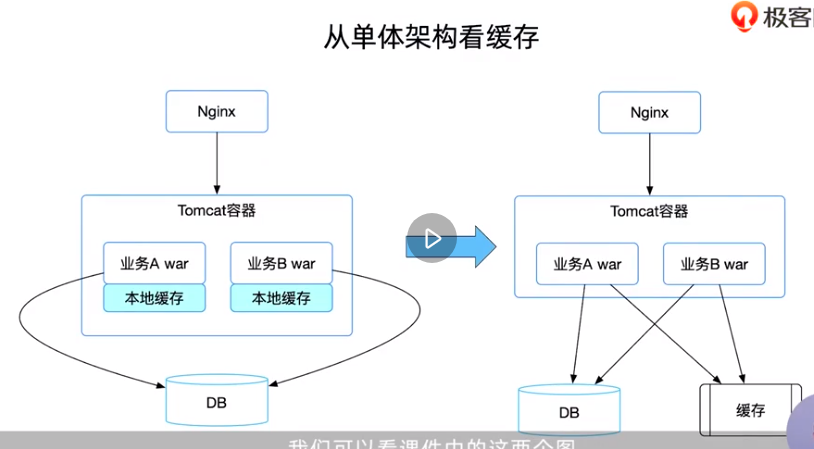

单体项目的特点

- 单体项目中模块众多
- 模块之间紧耦合，不利于拆分
- 拓展性差
- 项目部署较复杂

# 集群架构看缓存

把缓存根据业务拆分

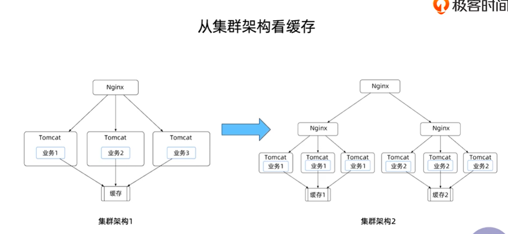

当并发量变大，又采用本地缓存+集中式缓存，对缓存一致性要求不高

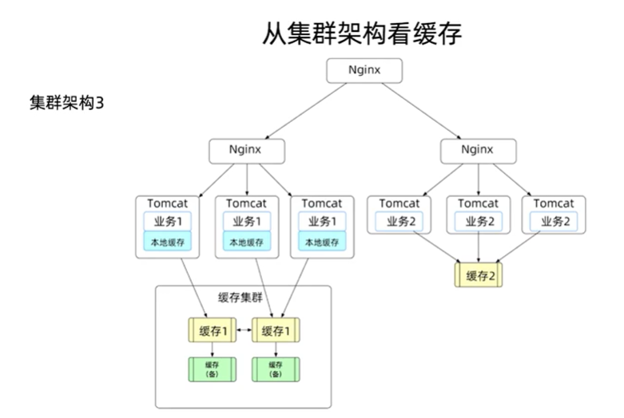

对数据一致性有更高要求，加上监听

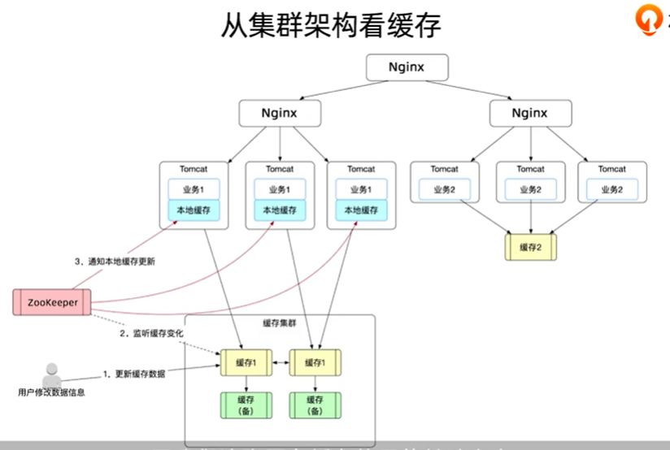

# 微服务架构中看缓存

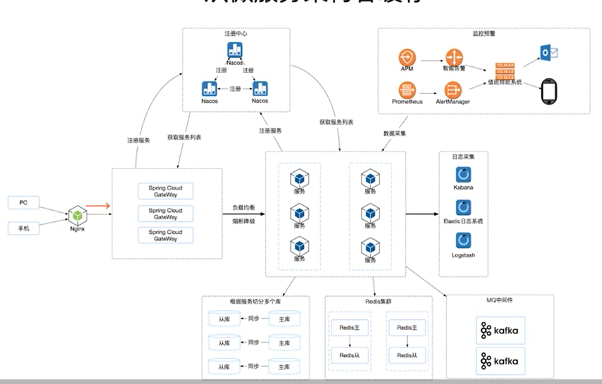

# 客户端缓存

常见的

- 页面缓存
  - 两层含义
    - 页面自身对某些元素或者全部元素进行缓存。
    - 服务器端将静态页面元素或者动态页面进行缓存，然后提供给客户端。
- 浏览器缓存
  - 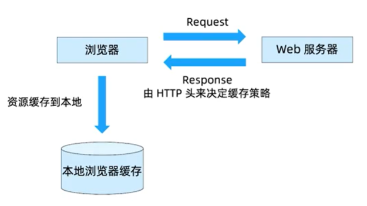
- App缓存
  - Android
    - 轻量级缓存框架：ASimpleCache
    - 可以缓存：JSon、BitMap、序列化的Java对象和二进制数据等
  - IOS
    - 常用缓存框架：SDWebImage、NsCache等

# 服务端缓存

## 数据库缓存

是数据库自身的一种缓存机制。

如果数据库频繁修改，数据库缓存会成为负担。

## 平台级缓存

带有缓存功能的专用库，或者具有缓存特性的框架。

- Ehcache
- Jboss Cache
- OSCache
- Guava Cache

> 为什么不用Map来作为本地缓存

1. 内存管理：没有管理机制，可以无限放
2. 缓存过期策略
3. 容量规划
4. 线程安全问题
5. 持久化
6. 多实例数据同步及一致性

平台级缓存的特点

- **基于应用程序的缓存库**
- 具有一定的分布式能力
- 数据不能保证强一致性
- 无法保证高可用

## 应用级缓存

或者说是集中式缓存

比较

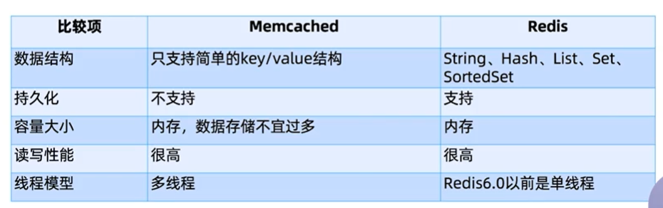

还有CDN（内容分发网络）缓存

- 本地Cache加速
- 实现跨运营商的网络加速
- 远程加速
- 带宽优化
- 集群抗攻击

# JSR107缓存规范

定义了一种对Java对象临时在内存中进行缓存的方法，包括对象的创建、共享访问、假脱机（spooling）、失效、各JVM的一致性等。可用于缓存经常访问的数据。

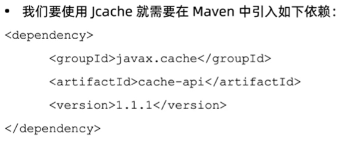

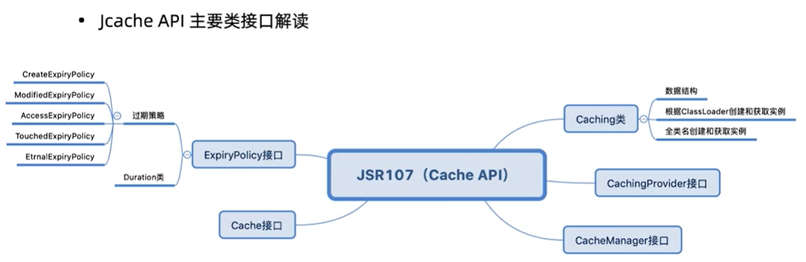

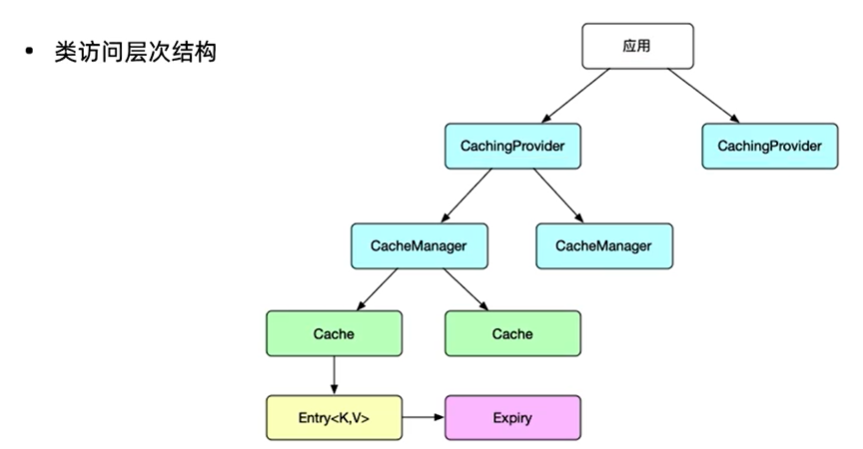

# 客户端缓存选型

要求：

1. 项目对数据一致性要求不高
2. 需要缓存的数据量是可控的
3. 需要提升一些并发能力即可

- Ｅhcache
  - 多级缓存策略
  - 缓存的数据在内存和磁盘中
  - 缓存数据在虚拟机重启的过程中写入磁盘
  - 可以通过RMI或者接口的方式实现分布式缓存
  - 允许注册事件来监听缓存
- Guava Cache
  - 轻量级，基于CurrentHashMap
  - 相比CurrentHashMap，限制内存的使用，会自动回收元素
- Spring Cache
  - 通过少量的配置就可以使用
  - 不需要安装和部署额外的第三方组件
  - 支持Spring Express Language
  - 支持AspectJ
  - 支持自定义key，具有相当的灵活性和扩展性

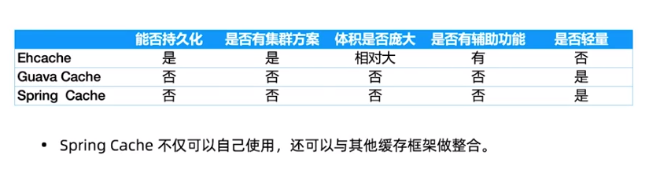

最终使用Spring Cache + Ehcache组合的方式

# Ehcache

## 前置

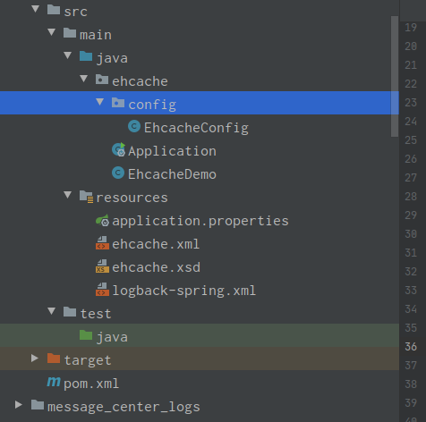

pom

~~~xml
<?xml version="1.0" encoding="UTF-8"?>
<project xmlns="http://maven.apache.org/POM/4.0.0"
         xmlns:xsi="http://www.w3.org/2001/XMLSchema-instance"
         xsi:schemaLocation="http://maven.apache.org/POM/4.0.0 http://maven.apache.org/xsd/maven-4.0.0.xsd">
    <parent>
        <artifactId>CacheTest</artifactId>
        <groupId>com.qdw</groupId>
        <version>1.0-SNAPSHOT</version>
    </parent>
    <modelVersion>4.0.0</modelVersion>

    <artifactId>EhcacheTest</artifactId>

    <dependencies>
        <dependency>
            <groupId>org.springframework.boot</groupId>
            <artifactId>spring-boot-starter</artifactId>
            <version>2.3.1.RELEASE</version>
        </dependency>
        <dependency>
            <groupId>org.springframework.boot</groupId>
            <artifactId>spring-boot-starter-cache</artifactId>
            <version>2.3.1.RELEASE</version>
        </dependency>
        <dependency>
            <groupId>org.projectlombok</groupId>
            <artifactId>lombok</artifactId>
            <version>1.18.12</version>
        </dependency>
        <!--  Ehcache 坐标  -->
        <!--  https://mvnrepository.com/artifact/org.ehcache/ehcache  -->
        <!--  https://mvnrepository.com/artifact/net.sf.ehcache/ehcache-core  -->
        <dependency>
            <groupId>net.sf.ehcache</groupId>
            <artifactId>ehcache-core</artifactId>
            <version>2.6.11</version>
        </dependency>
        <dependency>
            <groupId>com.google.guava</groupId>
            <artifactId>guava</artifactId>
            <version>26.0-jre</version>
        </dependency>
        <dependency>
            <groupId>org.springframework.boot</groupId>
            <artifactId>spring-boot-starter-test</artifactId>
            <version>2.3.1.RELEASE</version>
        </dependency>
    </dependencies>

</project>
~~~

resources

ehcache.xml

~~~xml
<?xml version="1.0" encoding="UTF-8"?>
<ehcache xmlns:xsi="http://www.w3.org/2001/XMLSchema-instance"
         xsi:noNamespaceSchemaLocation="/ehcache.xsd"
         updateCheck="false">
    <diskStore path="java.io.tmpdir/Tmp_EhCache" />

    <!-- defaultCache，是默认的缓存策略 -->
    <!-- 如果你指定的缓存策略没有找到，那么就用这个默认的缓存策略 -->
    <!-- external：缓存对象是否一直存在，如果设置为true的话，那么timeout就没有效果，缓存就会一直存在，一般默认就是false -->
    <!-- maxElementsInMemory：内存中可以缓存多少个缓存条目 -->
    <!-- overflowToDisk：如果内存不够的时候，是否溢出到磁盘 -->
    <!-- diskPersistent：是否启用磁盘持久化的机制，在jvm崩溃的时候和重启之间 -->
    <!-- timeToIdleSeconds：对象最大的闲置的时间，如果超出闲置的时间，可能就会过期  单位：秒 当eternal=false对象不是永久有效时使用，可选属性，默认值是0，也就是可闲置时间无穷大-->
    <!-- timeToLiveSeconds：对象最多存活的时间  单位：秒 当eternal=false对象不是永久有效时使用，可选属性，默认值是0，也就是存活时间无穷大-->
    <!-- memoryStoreEvictionPolicy：当缓存数量达到了最大的指定条目数的时候，需要采用一定的算法，从缓存中清除一批数据，LRU，最近最少使用算法，最近一段时间内，最少使用的那些数据，就被干掉了 -->
    <defaultCache
            eternal="false"
            maxElementsInMemory="1000"
            overflowToDisk="false"
            diskPersistent="false"
            timeToIdleSeconds="300"
            timeToLiveSeconds="0"
            memoryStoreEvictionPolicy="LRU" />

    <!-- 手动指定的缓存策略 -->
    <!-- 对不同的数据，缓存策略可以在这里配置多种 -->
    <cache
            name="accountCache"
            eternal="false"
            maxElementsInMemory="1000"
            overflowToDisk="false"
            diskPersistent="false"
            timeToIdleSeconds="300"
            timeToLiveSeconds="0"
            memoryStoreEvictionPolicy="LRU" />
</ehcache>

~~~

ehcache.xsd

~~~java
<?xml version="1.0" encoding="UTF-8" standalone="no"?>
<xs:schema xmlns:xs="http://www.w3.org/2001/XMLSchema" elementFormDefault="qualified" version="1.7">

    <xs:element name="ehcache">
        <xs:complexType>
            <xs:sequence>
                <xs:element maxOccurs="1" minOccurs="0" ref="diskStore"/>
                <xs:element maxOccurs="1" minOccurs="0" ref="sizeOfPolicy"/>
                <xs:element maxOccurs="1" minOccurs="0" ref="transactionManagerLookup"/>
                <xs:element maxOccurs="1" minOccurs="0" ref="cacheManagerEventListenerFactory"/>
                <xs:element maxOccurs="1" minOccurs="0" ref="managementRESTService"/>
                <xs:element maxOccurs="unbounded" minOccurs="0" ref="cacheManagerPeerProviderFactory"/>
                <xs:element maxOccurs="unbounded" minOccurs="0" ref="cacheManagerPeerListenerFactory"/>
                <xs:element maxOccurs="1" minOccurs="0" ref="terracottaConfig"/>
                <xs:element maxOccurs= "1" minOccurs="0" ref="defaultCache"/>
                <xs:element maxOccurs="unbounded" minOccurs="0" ref="cache"/>
            </xs:sequence>
            <xs:attribute name="name" use="optional"/>
            <xs:attribute default="true" name="updateCheck" type="xs:boolean" use="optional"/>
            <xs:attribute default="autodetect" name="monitoring" type="monitoringType" use="optional"/>
            <xs:attribute default="true" name="dynamicConfig" type="xs:boolean" use="optional"/>
            <xs:attribute default="15" name="defaultTransactionTimeoutInSeconds" type="xs:integer" use="optional"/>
            <xs:attribute default="0" name="maxBytesLocalHeap" type="memoryUnitOrPercentage" use="optional"/>
            <xs:attribute default="0" name="maxBytesLocalOffHeap" type="memoryUnit" use="optional"/>
            <xs:attribute default="0" name="maxBytesLocalDisk" type="memoryUnit" use="optional"/>
        </xs:complexType>
    </xs:element>
    <xs:element name="managementRESTService">
        <xs:complexType>
            <xs:attribute name="enabled" type="xs:boolean" use="optional"/>
            <xs:attribute name="bind" use="optional"/>
            <xs:attribute name="securityServiceLocation" use="optional"/>
            <xs:attribute name="securityServiceTimeout" use="optional" type="xs:integer"/>
            <xs:attribute name="sslEnabled" use="optional" type="xs:boolean"/>
            <xs:attribute name="needClientAuth" use="optional" type="xs:boolean"/>
            <xs:attribute name="sampleHistorySize" use="optional" type="xs:integer"/>
            <xs:attribute name="sampleIntervalSeconds" use="optional" type="xs:integer"/>
            <xs:attribute name="sampleSearchIntervalSeconds" use="optional" type="xs:integer"/>
        </xs:complexType>
    </xs:element>
    <xs:element name="diskStore">
        <xs:complexType>
            <xs:attribute name="path" use="optional"/>
        </xs:complexType>
    </xs:element>
    <xs:element name="transactionManagerLookup">
        <xs:complexType>
            <xs:attribute name="class" use="required"/>
            <xs:attribute name="properties" use="optional"/>
            <xs:attribute name="propertySeparator" use="optional"/>
        </xs:complexType>
    </xs:element>
    <xs:element name="cacheManagerEventListenerFactory">
        <xs:complexType>
            <xs:attribute name="class" use="required"/>
            <xs:attribute name="properties" use="optional"/>
            <xs:attribute name="propertySeparator" use="optional"/>
        </xs:complexType>
    </xs:element>
    <xs:element name="cacheManagerPeerProviderFactory">
        <xs:complexType>
            <xs:attribute name="class" use="required"/>
            <xs:attribute name="properties" use="optional"/>
            <xs:attribute name="propertySeparator" use="optional"/>
        </xs:complexType>
    </xs:element>
    <xs:element name="cacheManagerPeerListenerFactory">
        <xs:complexType>
            <xs:attribute name="class" use="required"/>
            <xs:attribute name="properties" use="optional"/>
            <xs:attribute name="propertySeparator" use="optional"/>
        </xs:complexType>
    </xs:element>
    <xs:element name="terracottaConfig">
        <xs:complexType>
            <xs:sequence>
                <xs:element maxOccurs="1" minOccurs="0" name="tc-config">
                    <xs:complexType>
                        <xs:sequence>
                            <xs:any maxOccurs="unbounded" minOccurs="0" processContents="skip"/>
                        </xs:sequence>
                    </xs:complexType>
                </xs:element>
            </xs:sequence>
            <xs:attribute default="localhost:9510" name="url" use="optional"/>
            <xs:attribute name="rejoin" type="xs:boolean" use="optional" default="false"/>
            <xs:attribute name="wanEnabledTSA" type="xs:boolean" use="optional" default="false"/>
        </xs:complexType>
    </xs:element>
    <!-- add clone support for addition of cacheExceptionHandler. Important! -->
    <xs:element name="defaultCache">
        <xs:complexType>
            <xs:sequence>
                <xs:element minOccurs="0" maxOccurs="unbounded" ref="cacheEventListenerFactory"/>
                <xs:element minOccurs="0" maxOccurs="unbounded" ref="cacheExtensionFactory"/>
                <xs:element minOccurs="0" maxOccurs="unbounded" ref="cacheLoaderFactory"/>
                <xs:element minOccurs="0" maxOccurs="unbounded" ref="cacheDecoratorFactory"/>
                <xs:element minOccurs="0" maxOccurs="1" ref="bootstrapCacheLoaderFactory"/>
                <xs:element minOccurs="0" maxOccurs="1" ref="cacheExceptionHandlerFactory"/>
                <xs:element minOccurs="0" maxOccurs="1" ref="pinning"/>
                <xs:element minOccurs="0" maxOccurs="1" ref="terracotta"/>
                <xs:element minOccurs="0" maxOccurs="1" ref="cacheWriter"/>
                <xs:element minOccurs="0" maxOccurs="1" ref="copyStrategy"/>
                <xs:element minOccurs="0" maxOccurs="1" ref="elementValueComparator"/>
                <xs:element minOccurs="0" maxOccurs="1" ref="sizeOfPolicy"/>
                <xs:element minOccurs="0" maxOccurs="1" ref="persistence"/>
            </xs:sequence>
            <xs:attribute name="diskExpiryThreadIntervalSeconds" type="xs:integer" use="optional"/>
            <xs:attribute name="diskSpoolBufferSizeMB" type="xs:integer" use="optional"/>
            <xs:attribute name="diskPersistent" type="xs:boolean" use="optional"/>
            <xs:attribute name="diskAccessStripes" type="xs:integer" use="optional" default="1"/>
            <xs:attribute name="eternal" type="xs:boolean" use="optional" default="false"/>
            <xs:attribute name="maxElementsInMemory" type="xs:nonNegativeInteger" use="optional"/>
            <xs:attribute name="maxEntriesLocalHeap" type="xs:nonNegativeInteger" use="optional"/>
            <xs:attribute name="clearOnFlush" type="xs:boolean" use="optional"/>
            <xs:attribute name="memoryStoreEvictionPolicy" type="xs:string" use="optional"/>
            <xs:attribute name="overflowToDisk" type="xs:boolean" use="optional"/>
            <xs:attribute name="timeToIdleSeconds" type="xs:nonNegativeInteger" use="optional"/>
            <xs:attribute name="timeToLiveSeconds" type="xs:nonNegativeInteger" use="optional"/>
            <xs:attribute name="maxElementsOnDisk" type="xs:nonNegativeInteger" use="optional"/>
            <xs:attribute name="maxEntriesLocalDisk" type="xs:nonNegativeInteger" use="optional"/>
            <xs:attribute name="transactionalMode" type="transactionalMode" use="optional" default="off"/>
            <xs:attribute name="statistics" type="xs:boolean" use="optional" default="false"/>
            <xs:attribute name="copyOnRead" type="xs:boolean" use="optional" default="false"/>
            <xs:attribute name="copyOnWrite" type="xs:boolean" use="optional" default="false"/>
            <xs:attribute name="cacheLoaderTimeoutMillis" type="xs:integer" use="optional" default="0"/>
            <xs:attribute name="overflowToOffHeap" type="xs:boolean" use="optional" default="false"/>
            <xs:attribute name="maxMemoryOffHeap" type="xs:string" use="optional"/>
        </xs:complexType>
    </xs:element>
    <xs:element name="cache">
        <xs:complexType>
            <xs:sequence>
                <xs:element minOccurs="0" maxOccurs="unbounded" ref="cacheEventListenerFactory"/>
                <xs:element minOccurs="0" maxOccurs="unbounded" ref="cacheExtensionFactory"/>
                <xs:element minOccurs="0" maxOccurs="unbounded" ref="cacheLoaderFactory"/>
                <xs:element minOccurs="0" maxOccurs="unbounded" ref="cacheDecoratorFactory"/>
                <xs:element minOccurs="0" maxOccurs="1" ref="bootstrapCacheLoaderFactory"/>
                <xs:element minOccurs="0" maxOccurs="1" ref="cacheExceptionHandlerFactory"/>
                <xs:element minOccurs="0" maxOccurs="1" ref="pinning"/>
                <xs:element minOccurs="0" maxOccurs="1" ref="terracotta"/>
                <xs:element minOccurs="0" maxOccurs="1" ref="cacheWriter"/>
                <xs:element minOccurs="0" maxOccurs="1" ref="copyStrategy"/>
                <xs:element minOccurs="0" maxOccurs="1" ref="searchable"/>
                <xs:element minOccurs="0" maxOccurs="1" ref="elementValueComparator"/>
                <xs:element minOccurs="0" maxOccurs="1" ref="sizeOfPolicy"/>
                <xs:element minOccurs="0" maxOccurs="1" ref="persistence"/>
            </xs:sequence>
            <xs:attribute name="diskExpiryThreadIntervalSeconds" type="xs:integer" use="optional"/>
            <xs:attribute name="diskSpoolBufferSizeMB" type="xs:integer" use="optional"/>
            <xs:attribute name="diskPersistent" type="xs:boolean" use="optional"/>
            <xs:attribute name="diskAccessStripes" type="xs:integer" use="optional" default="1"/>
            <xs:attribute name="eternal" type="xs:boolean" use="optional" default="false"/>
            <xs:attribute name="maxElementsInMemory" type="xs:nonNegativeInteger" use="optional"/>
            <xs:attribute name="maxEntriesLocalHeap" type="xs:nonNegativeInteger" use="optional"/>
            <xs:attribute name="memoryStoreEvictionPolicy" type="xs:string" use="optional"/>
            <xs:attribute name="clearOnFlush" type="xs:boolean" use="optional"/>
            <xs:attribute name="name" type="xs:string" use="required"/>
            <xs:attribute name="overflowToDisk" type="xs:boolean" use="optional"/>
            <xs:attribute name="timeToIdleSeconds" type="xs:nonNegativeInteger" use="optional"/>
            <xs:attribute name="timeToLiveSeconds" type="xs:nonNegativeInteger" use="optional"/>
            <xs:attribute name="maxElementsOnDisk" type="xs:nonNegativeInteger" use="optional"/>
            <xs:attribute name="maxEntriesLocalDisk" type="xs:nonNegativeInteger" use="optional"/>
            <xs:attribute name="maxEntriesInCache" type="xs:nonNegativeInteger" use="optional"/>
            <xs:attribute name="transactionalMode" type="transactionalMode" use="optional" default="off" />
            <xs:attribute name="statistics" type="xs:boolean" use="optional" default="false"/>
            <xs:attribute name="copyOnRead" type="xs:boolean" use="optional" default="false"/>
            <xs:attribute name="copyOnWrite" type="xs:boolean" use="optional" default="false"/>
            <xs:attribute name="logging" type="xs:boolean" use="optional" default="false"/>
            <xs:attribute name="cacheLoaderTimeoutMillis" type="xs:integer" use="optional" default="0"/>
            <xs:attribute name="overflowToOffHeap" type="xs:boolean" use="optional" default="false"/>
            <xs:attribute name="maxMemoryOffHeap" type="xs:string" use="optional"/>
            <xs:attribute default="0" name="maxBytesLocalHeap" type="memoryUnitOrPercentage" use="optional"/>
            <xs:attribute default="0" name="maxBytesLocalOffHeap" type="memoryUnitOrPercentage" use="optional"/>
            <xs:attribute default="0" name="maxBytesLocalDisk" type="memoryUnitOrPercentage" use="optional"/>
        </xs:complexType>
    </xs:element>
    <xs:element name="cacheEventListenerFactory">
        <xs:complexType>
            <xs:attribute name="class" use="required"/>
            <xs:attribute name="properties" use="optional"/>
            <xs:attribute name="propertySeparator" use="optional"/>
            <xs:attribute name="listenFor" use="optional" type="notificationScope" default="all"/>
        </xs:complexType>
    </xs:element>
    <xs:element name="bootstrapCacheLoaderFactory">
        <xs:complexType>
            <xs:attribute name="class" use="required"/>
            <xs:attribute name="properties" use="optional"/>
            <xs:attribute name="propertySeparator" use="optional"/>
        </xs:complexType>
    </xs:element>
    <xs:element name="cacheExtensionFactory">
        <xs:complexType>
            <xs:attribute name="class" use="required"/>
            <xs:attribute name="properties" use="optional"/>
            <xs:attribute name="propertySeparator" use="optional"/>
        </xs:complexType>
    </xs:element>
    <xs:element name="cacheExceptionHandlerFactory">
        <xs:complexType>
            <xs:attribute name="class" use="required"/>
            <xs:attribute name="properties" use="optional"/>
            <xs:attribute name="propertySeparator" use="optional"/>
        </xs:complexType>
    </xs:element>
    <xs:element name="cacheLoaderFactory">
        <xs:complexType>
            <xs:attribute name="class" use="required"/>
            <xs:attribute name="properties" use="optional"/>
            <xs:attribute name="propertySeparator" use="optional"/>
        </xs:complexType>
    </xs:element>
    <xs:element name="cacheDecoratorFactory">
        <xs:complexType>
            <xs:attribute name="class" use="required"/>
            <xs:attribute name="properties" use="optional"/>
            <xs:attribute name="propertySeparator" use="optional"/>
        </xs:complexType>
    </xs:element>
    <xs:element name="searchAttribute">
        <xs:complexType>
        	<xs:attribute name="name" use="required" type="xs:string" />
        	<xs:attribute name="expression" type="xs:string" />
        	<xs:attribute name="class" type="xs:string" />
        	<xs:attribute name="type" type="xs:string" use="optional"/>
        	<xs:attribute name="properties" use="optional" />
        	<xs:attribute name="propertySeparator" use="optional" />
        </xs:complexType>
    </xs:element>

    <xs:element name="searchable">
      <xs:complexType>
        <xs:sequence>
          <xs:element minOccurs="0" maxOccurs="unbounded" ref="searchAttribute"/>
        </xs:sequence>
        <xs:attribute name="keys" use="optional" type="xs:boolean" default="true"/>
        <xs:attribute name="values" use="optional" type="xs:boolean" default="true"/>
        <xs:attribute name="allowDynamicIndexing" use="optional" type="xs:boolean" default="false"/>
      </xs:complexType>
    </xs:element>

    <xs:element name="pinning">
        <xs:complexType>
            <xs:attribute name="store" use="required" type="pinningStoreType"/>
        </xs:complexType>
    </xs:element>

    <xs:element name="terracotta">
        <xs:complexType>
            <xs:sequence>
                <xs:element minOccurs="0" maxOccurs="1" ref="nonstop"/>
            </xs:sequence>
            <xs:attribute name="clustered" use="optional" type="xs:boolean" default="true"/>
            <xs:attribute name="coherentReads" use="optional" type="xs:boolean" default="true"/>
            <xs:attribute name="localKeyCache" use="optional" type="xs:boolean" default="false"/>
            <xs:attribute name="localKeyCacheSize" use="optional" type="xs:positiveInteger" default="300000"/>
            <xs:attribute name="orphanEviction" use="optional" type="xs:boolean" default="true"/>
            <xs:attribute name="orphanEvictionPeriod" use="optional" type="xs:positiveInteger" default="4"/>
            <xs:attribute name="copyOnRead" use="optional" type="xs:boolean" default="false"/>
            <xs:attribute name="coherent" use="optional" type="xs:boolean" default="false"/>
            <xs:attribute name="consistency" use="optional" type="consistencyType" default="eventual"/>
            <xs:attribute name="synchronousWrites" use="optional" type="xs:boolean" default="false"/>
            <xs:attribute name="concurrency" use="optional" type="xs:nonNegativeInteger" default="0"/>
            <xs:attribute name="localCacheEnabled" use="optional" type="xs:boolean" default="true"/>
            <xs:attribute name="compressionEnabled" use="optional" type="xs:boolean" default="false"/>
        </xs:complexType>
    </xs:element>
    <xs:simpleType name="consistencyType">
        <xs:restriction base="xs:string">
            <xs:enumeration value="strong" />
            <xs:enumeration value="eventual" />
        </xs:restriction>
    </xs:simpleType>
    <xs:element name="nonstop">
        <xs:complexType>
            <xs:sequence>
                <xs:element minOccurs="0" maxOccurs="1" ref="timeoutBehavior"/>
            </xs:sequence>
            <xs:attribute name="enabled" use="optional" type="xs:boolean" default="true"/>
            <xs:attribute name="immediateTimeout" use="optional" type="xs:boolean" default="false"/>
            <xs:attribute name="timeoutMillis" use="optional" type="xs:positiveInteger" default="30000"/>
            <xs:attribute name="searchTimeoutMillis" use="optional" type="xs:positiveInteger" default="30000"/>
        </xs:complexType>
    </xs:element>
    <xs:element name="timeoutBehavior">
        <xs:complexType>
            <xs:attribute name="type" use="optional" type="timeoutBehaviorType" default="exception"/>
            <xs:attribute name="properties" use="optional" default=""/>
            <xs:attribute name="propertySeparator" use="optional" default=","/>
        </xs:complexType>
    </xs:element>
    <xs:simpleType name="timeoutBehaviorType">
        <xs:restriction base="xs:string">
            <xs:enumeration value="noop" />
            <xs:enumeration value="exception" />
            <xs:enumeration value="localReads" />
            <xs:enumeration value="localReadsAndExceptionOnWrite" />
        </xs:restriction>
    </xs:simpleType>
    <xs:simpleType name="monitoringType">
        <xs:restriction base="xs:string">
            <xs:enumeration value="autodetect"/>
            <xs:enumeration value="on"/>
            <xs:enumeration value="off"/>
        </xs:restriction>
    </xs:simpleType>
    <xs:simpleType name="pinningStoreType">
        <xs:restriction base="xs:string">
            <xs:enumeration value="localMemory" />
            <xs:enumeration value="inCache" />
        </xs:restriction>
    </xs:simpleType>
    <xs:simpleType name="terracottaCacheValueType">
        <xs:restriction base="xs:string">
            <xs:enumeration value="serialization" />
            <xs:enumeration value="identity" />
        </xs:restriction>
    </xs:simpleType>

    <xs:simpleType name="transactionalMode">
        <xs:restriction base="xs:string">
            <xs:enumeration value="off"/>
            <xs:enumeration value="xa_strict"/>
            <xs:enumeration value="xa"/>
            <xs:enumeration value="local"/>
        </xs:restriction>
    </xs:simpleType>

    <xs:element name="cacheWriter">
        <xs:complexType>
            <xs:sequence >
                <xs:element minOccurs="0" maxOccurs="1" ref="cacheWriterFactory"/>
            </xs:sequence>
            <xs:attribute name="writeMode" use="optional" type="writeModeType" default="write-through"/>
            <xs:attribute name="notifyListenersOnException" use="optional" type="xs:boolean" default="false"/>
            <xs:attribute name="minWriteDelay" use="optional" type="xs:nonNegativeInteger" default="1"/>
            <xs:attribute name="maxWriteDelay" use="optional" type="xs:nonNegativeInteger" default="1"/>
            <xs:attribute name="rateLimitPerSecond" use="optional" type="xs:nonNegativeInteger" default="0"/>
            <xs:attribute name="writeCoalescing" use="optional" type="xs:boolean" default="false"/>
            <xs:attribute name="writeBatching" use="optional" type="xs:boolean" default="false"/>
            <xs:attribute name="writeBatchSize" use="optional" type="xs:positiveInteger" default="1"/>
            <xs:attribute name="retryAttempts" use="optional" type="xs:nonNegativeInteger" default="0"/>
            <xs:attribute name="retryAttemptDelaySeconds" use="optional" type="xs:nonNegativeInteger" default="1"/>
            <xs:attribute name="writeBehindConcurrency" use="optional" type="xs:nonNegativeInteger" default="1"/>
            <xs:attribute name="writeBehindMaxQueueSize" use="optional" type="xs:nonNegativeInteger" default="0"/>
        </xs:complexType>
    </xs:element>
    <xs:simpleType name="writeModeType">
        <xs:restriction base="xs:string">
            <xs:enumeration value="write-through" />
            <xs:enumeration value="write-behind" />
        </xs:restriction>
    </xs:simpleType>
    <xs:element name="cacheWriterFactory">
        <xs:complexType>
            <xs:attribute name="class" use="required"/>
            <xs:attribute name="properties" use="optional"/>
            <xs:attribute name="propertySeparator" use="optional"/>
        </xs:complexType>
    </xs:element>

    <xs:element name="copyStrategy">
        <xs:complexType>
            <xs:attribute name="class" use="required" type="xs:string" />
        </xs:complexType>
    </xs:element>

    <xs:element name="elementValueComparator">
        <xs:complexType>
            <xs:attribute name="class" use="required" type="xs:string" />
        </xs:complexType>
    </xs:element>

    <xs:element name="sizeOfPolicy">
        <xs:complexType>
            <xs:attribute name="maxDepth" use="required" type="xs:integer" />
            <xs:attribute name="maxDepthExceededBehavior" use="optional" default="continue" type="maxDepthExceededBehavior" />
        </xs:complexType>
    </xs:element>

	<xs:element name="persistence">
	    <xs:complexType>
            <xs:attribute name="strategy" use="required" type="persistenceStrategy"/>
            <xs:attribute name="synchronousWrites" use="optional" default="false" type="xs:boolean"/>
	    </xs:complexType>
	</xs:element>
	
	<xs:simpleType name="persistenceStrategy">
	    <xs:restriction base="xs:string">
	        <xs:enumeration value="localTempSwap"/>
	        <xs:enumeration value="localRestartable"/>
	        <xs:enumeration value="none"/>
	        <xs:enumeration value="distributed"/>
	    </xs:restriction>
	</xs:simpleType>
	
    <xs:simpleType name="maxDepthExceededBehavior">
        <xs:restriction base="xs:string">
            <xs:enumeration value="continue"/>
            <xs:enumeration value="abort"/>
        </xs:restriction>
    </xs:simpleType>

    <xs:simpleType name="notificationScope">
        <xs:restriction base="xs:string">
            <xs:enumeration value="local"/>
            <xs:enumeration value="remote"/>
            <xs:enumeration value="all"/>
        </xs:restriction>
    </xs:simpleType>
    <xs:simpleType name="memoryUnit">
        <xs:restriction base="xs:token">
            <xs:pattern value="[0-9]+[bBkKmMgG]?"/>
        </xs:restriction>
    </xs:simpleType>
    <xs:simpleType name="memoryUnitOrPercentage">
        <xs:restriction base="xs:token">
            <xs:pattern value="([0-9]+[bBkKmMgG]?|100%|[0-9]{1,2}%)"/>
        </xs:restriction>
    </xs:simpleType>
</xs:schema>
~~~

springboot的配置

~~~java
package ehcache.config;

import org.springframework.cache.CacheManager;
import org.springframework.cache.annotation.EnableCaching;
import org.springframework.cache.ehcache.EhCacheCacheManager;
import org.springframework.cache.ehcache.EhCacheFactoryBean;
import org.springframework.cache.ehcache.EhCacheManagerFactoryBean;
import org.springframework.context.annotation.Bean;
import org.springframework.context.annotation.Configuration;
import org.springframework.core.io.ClassPathResource;

/**
 * @Author: xiaomi
 * @Description: TODO
 * @date: 2020/7/25 下午2:54
 */
@Configuration
@EnableCaching
public class EhcacheConfig {

    @Bean
    public CacheManager cacheManager(){
        return new EhCacheCacheManager(ehCacheManagerFactoryBean().getObject());
    }

    @Bean
    public EhCacheManagerFactoryBean ehCacheManagerFactoryBean(){
        EhCacheManagerFactoryBean ehCacheManagerFactoryBean = new EhCacheManagerFactoryBean();
        ehCacheManagerFactoryBean.setConfigLocation(new ClassPathResource("ehcache.xml"));
        ehCacheManagerFactoryBean.setShared(true);
        return ehCacheManagerFactoryBean;

    }
}

~~~

springboot启动类

~~~java
package ehcache;

import org.springframework.boot.SpringApplication;
import org.springframework.boot.autoconfigure.SpringBootApplication;

/**
 * @Author: xiaomi
 * @Description: TODO
 * @date: 2020/7/25 下午2:51
 */
@SpringBootApplication
public class Application {
    public static void main(String[] args){
        EhcacheDemo ehcacheDemo = (EhcacheDemo) SpringApplication.run(Application.class, args).getBean("ehcacheDemo");
        ehcacheDemo.print();
    }
}

~~~

## EhcacheDemo

~~~java
package ehcache;

import lombok.extern.slf4j.Slf4j;
import net.sf.ehcache.Cache;
import net.sf.ehcache.CacheManager;
import net.sf.ehcache.Element;
import org.springframework.stereotype.Service;

/**
 * @Author: xiaomi
 * @Description: TODO
 * @date: 2020/7/25 下午2:15
 */

@Slf4j
@Service
public class EhcacheDemo {
    private static CacheManager cacheManager;
    static {
        // 通过反射获取路径
        String path = EhcacheDemo.class.getResource("/").toString() + "/ehcache.xml";
        System.out.println("path:"+path);
        String[] tmp = path.split("\\:");
        cacheManager = new CacheManager(tmp[1]);
    }
    public void print(){
        cacheManager.addCacheIfAbsent("cache_test");
        Cache cache = cacheManager.getCache("cache_test");
        cache.put(new Element("frist","第一个"));
        Element element = cache.get("frist");
        log.info("获取到的元素是：{}",element);

    }
}

~~~

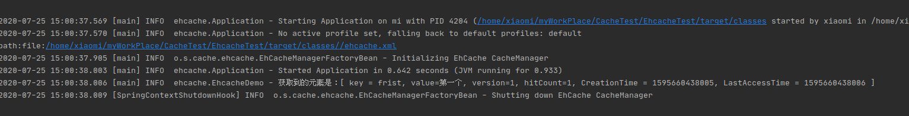

# 服务端缓存选型

面对高并发和高缓存一致性的要求，选择集中式缓存Redis或Memcached

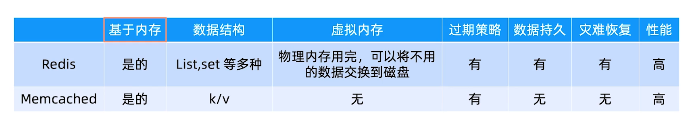

- Memcached只适合基于内存的缓存框架，对数据持久和灾难恢复所提供能力是欠缺的。

最终选择Redis

# Redis

## Redis与Reactor模式的关系

- Redis的工作模式
  - 多个client链接server
  - 发送命令给server
  - server返回结果给client

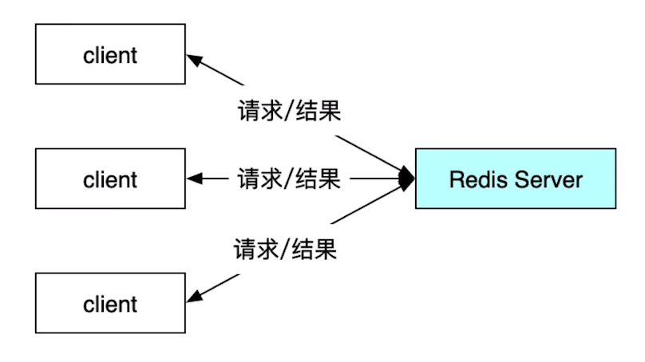

> Redis使用单进程还是多进程？

Redis6.0之前是使用单进程。

> Redis使用单线程还是多线程处理客户端请求？

使用单线程。

> 对于多个连接server的client，server怎么处理

1. 使用一个线程监听，每个client连接，要创建新的线程来处理链接
   1. 直接创建线程：创建过多的线程
   2. 用线城池：受限与线程池的线程数
2. **采用I/O多路复用技术**

Redis就是使用Reactor模式

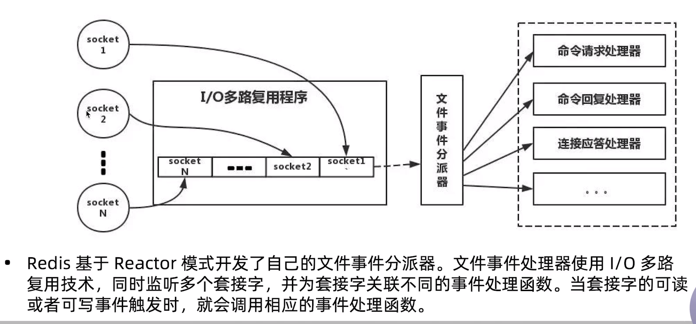

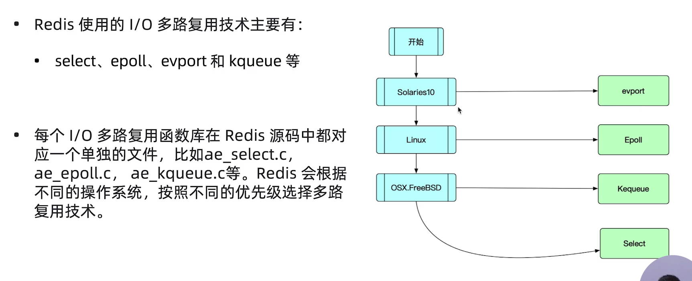