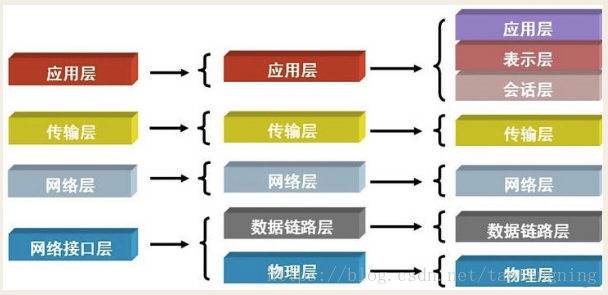
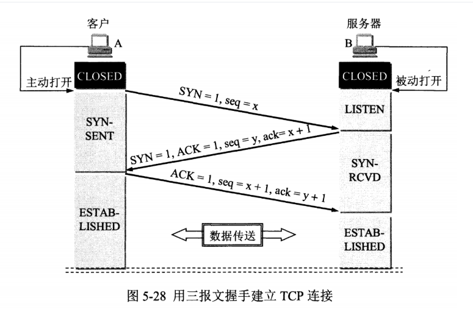
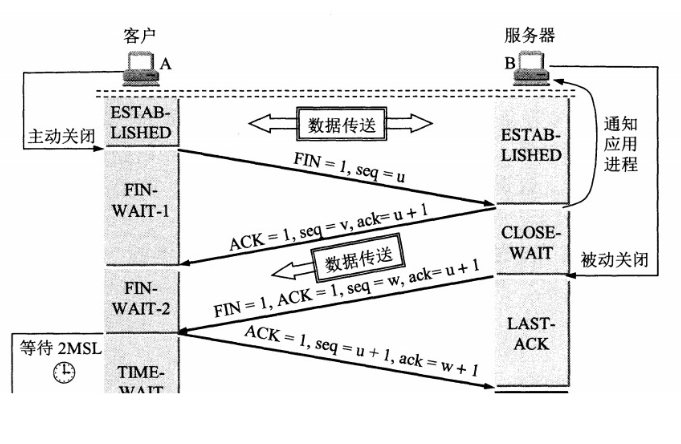
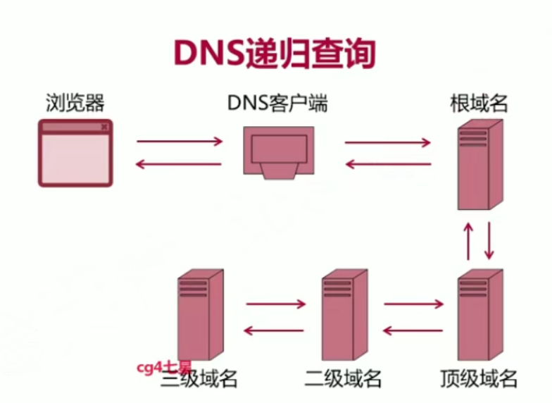
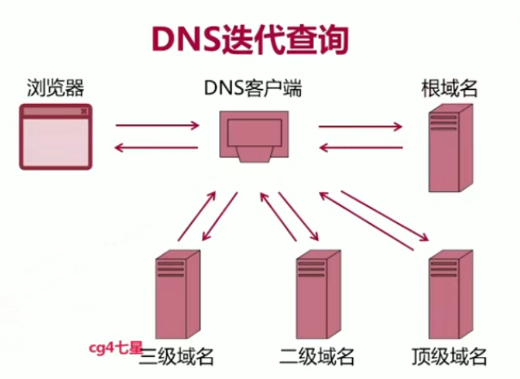

[**首页**](https://github.com/qdw497874677/myNotes/blob/master/首页检索.md)

# OIS

一系列协议

- 应用层：
  - 应用层：HTTP、DNS、DHCP、SMTP
  - 表示层：FTP
  - 会话层：RPC、SQL、SSH
- 传输层：TCP、UDP
- 网络层：IP、ICMP
- 数据链路层：ARP
- 物理层

# TCP/IP

TCP/IP是一类协议系统。

- 应用层：通过应用进程之间的交互来完成特定网络应用。这一层的数据单元叫做报文。
  - TELNET（网络远程访问协议）
  - FTP（文件传输协议）：使用TCP进行可靠传输。使用CS方式，服务端可以为服务多个客户端。
  - HTTP（超文本传输协议）
  - SMTP（简单邮件传输协议）
  - DNS（域名系统）：既可以用TCP，也可以用UDP。
  - DHCP（动态主机配置协议）：用UDP
  - SNMP（简单网络管理协议）：用UDP
- 传输层：负责两台主机中进程之间的数据传输服务。
  - TCP（传输控制协议）：数据传输单位是用户数据报。
  - UDP（用户数据报协议）：数据传输单元是报文。
- 网络层：负责为分组交换网上的不同主机提供通信服务。
  - IP（网际协议）
  - ARP（地址解析协议）：根据ip地址获取MAC地址。
    - 将ARP请求广播到本地网络中的所有主机，当有主机发现和自己的ip一致就做出响应。
  - ICMP（网络控制报文协议）：基于ip协议工作的。一个重要应用就是用PING来测试两台主机之间的连通性。PING使用了ICMP回送请求与回送回答报文。
    - 确认ip包是否成功到达目标地址
    - 通知ip包被丢弃的原因
  - IGMP（网际组管理协议）：提供在转发组播数据包到目的地的最后阶段所需的信息
    - 主机通过IGMP告知路由器接收或者离开某个特定组播组的信息
    - 路由器通过IGMP周期性地查询局域网内的组播组成员是否处于活动状态
- 网络接口层
  - 数据链路层：两个相邻节点之间的点对点传送数据。数据单位为数据帧。
    - RARP（逆地址解析协议）
    - PPP（点对点协议）
  - 物理层：传输比特流
    - IEEE802.2

# TCP

## TCP和UDP对比

- TCP是面向连接的，提供可靠的交付，支持流量控制，拥塞控制，面向字节流（把报文看成字节流，组织成数据块），每一条TCP连接只能是点对点的。
- UPD是无连接的，尽可能最大交付，没有拥塞控制，面向报文的（不会对应用层传下来的报文进行合并和拆分），支持一对一、多对多、一对多、多对一。

## 特点

- **面向连接的传输层协议**：用tcp传输数据，首先要建立tcp连接，发送预备报文段，来建立数据传输的一些起始参数。
- **全双工**：通信双方都有各自的发送和接收缓存。
- **点对点**：每个tcp连接只有两个端点。
- **提供可靠交付**：保证数据无差错、不丢失、不重复、按序到达。
- **面向字节流**：TCP把应用层的数据看成是无结构的字节流，根据自己的需求去包装成报文段传输，交付给应用层的也是流的形式。

## 报文结构

TCP传送的数据单元是报文段。一个TCP报文段分为**首部**和**数据**两部分。首部的前20个字节是固定的，后面有4n字节是根据需要增加的选项。所以TCP首部的**最小长度是20字节**。

首都的重要字段：

- 源端口和目的端口：各占2字节，共4字节。
- **序号**：占4字节。因为面向字节流，所以传输的每一个字节数据都是有序号的。每个报文段的序号表示当前报文段中数据的一个字节的序号
- **确认号**：占4字节。表示**期望**对方发送数据报文的序号。如确认号是N，表明N-1和之前的字节数据都已经成功接收。
- 数据偏移：占4位。表示首部长度。单位是4字节。因为首部有不固定的选项，所以偏移量是有必要的。
- **标志字段**：占6位
  - URG：紧急标志。=1时表示此报文段中有紧急数据。
  - ACK：确认标志。=1时表示成功接收报文段。
  - SYN：同步标志。建立连接时用来同步信号。=1表示这个连接请求报文。
  - FIN：终止标志。=1时表示请求释放连接。
  - PSH：推送标志。=1表示让接收方不等缓冲区，尽快交付数据。
  - PST：复位标志。=1表示TCP连接出现严重错误，必须释放重新建立连接。
- **接收窗口**：占2字节。表示发送这个报文段的一方的接收窗口大小。
- 检验和：占2字节。

## 三次握手

客户端发送SYN，服务端回复ACK同时发送SYN，客户端回复ACK。带有SYN必须要ACK回复。过程中双方相互确认对方的起始序号，通过自己发送的标示位为SYN为1，等待对方通过ACK为1来确认。

A是客户端（请求发起方），B是服务器端。

- B处于监听状态，等待请求到来。
- A向B发送请求连接的报文段，其中主要包含：SYN标志位为1（表示这是一个请求连接报文或接受连接报文，也表示这个数据报不携带数据），随机序号是x（表示A之后序号的开始，从x+1开始）。
- B收到后，向A发送确认报文，其中主要包含：SYN标志位为1，ACK标志位为1，确认号是x+1，序号是一个随机的y（表示B之后序号的开始，从y+1开始）。
- A收到后，向B发送确认报文，ACK标志位为1，确认号是y+1。

### 为什么需要握手

因为TCP是可靠的，双方要对对方的请求作出响应，这个过程中需要维护一个序列号。而握手可以确定双方的起始序列号。

### 为什么要三次

从三个方面分析

- **可以阻止历史重复连接的初始化**（首要原因）

假如一个旧的报文比新的报文早到达服务器，服务器做了回复，客户端收到后，判断这是个历史连接，就发送RST报文中断这次连接。如果两次握手，就不能判断当前连接是历史连接。比如客户端发送了一个请求连接报文，超时了，然后又发送一个，服务器端先收到了旧请求然后给了回复，客户端收到后会终止这个旧的连接请求。

- **可以同步双方的初始序列号**

另一种说法就是，TCP协议的双方，都要**维护一个序列号**，以标识发出去的数据包，哪些是被对方收到的。序列号是可靠传输的一个关键因素。三次握手的过程也是通信双方告知序列号起始值，并确认对方已经收到了序列号起始值的毕竟步骤。A发送一个序列号，B回复收到，这算确认了A方的起始号；B发送一个序列号，A回复收到，B方的起始号也确认了。**结合在一起最少是三次握手。**

- 避免资源浪费

为了防止服务器对已经失效的请求建立连接，而造成资源浪费。如果没有三次握手，服务器可能因为网络原因，收到很多同一个客户端发来的请求。双方无法确认到底要连接哪个。所以三次握手就只能来一个连一个。而三次握手之后，服务器就会忽略客户端的其他连接请求了。

### SYN-Flood攻击

在第二次握手后，服务器会等待客户端的请求确认。假设攻击者短时间伪造（如果攻击者有公网IP）大量不同ip的syn报文，服务器对每个报文响应，但攻击者不回应。服务器默认会等待然后重试几次，对服务器压力很大，会占满服务端的SYN接收队列。

#### 如何避免

- 增大请求等待队列：增大这个值tcp_max_syn_backlog
- 减少重试次数：把tcp_synack_retries设置为0或者1。
- syn缓存技术：将最终连接的实例化推迟。

- 修改参数，控制队列大小和当队列满时应该怎么处理。比如
  - 设置状态连接最大值
  - 设置超出处理能力时，对新的SYN返回RST，丢弃连接

### 服务器没有收到第三次挥手会怎么办

服务器端：

 第三次的ACK在网络中丢失，那么Server 端该TCP连接的状态为SYN_RECV,并且会根据 TCP的超时重传机制，会等待3秒、6秒、12秒后重新发送SYN+ACK包，以便Client重新发送ACK包。

而**Server重发SYN+ACK包**的次数，可以通过设置/proc/sys/net/ipv4/tcp_synack_retries修改，默认值为5.

客户端：

客户端会感知到服务器端发送的信息，从而感知到错误。

## 四次挥手

双方都可以主动断开连接。

客户端发送FIN，服务器端回复ACK，之后传完数据发送FIN（这里和前面的ACK分开发送，所以多了一次挥手），客户端回复ACK。

A是客户端，B是服务器端。

- A向B发送释放连接报文，FIN标志位为1，序号为x。此时这一方向就不能发送数据了。
- B收到后，向A发送确认报文，ACK标志位为1，确认号x+1，序号y。此时A到B的连接就释放了，TCP处于半关闭状态。
- B接着向A发送剩下的数据。传输完成后，向A发送释放连接报文，FIN标志位为1，ACK标志位为1，确认号x+1，序号z（z就是这段时间B发送数据的最后一个字节序号的下一个）。
- A收到释放报文，向B发送确认报文，ACK标志位为1，确认号z+1，序号x+1（没有增加）。然后进入TIME-WAIT状态，等待2MSL时间后，释放连接。

### 为什么四次

因为TCP连接是全双工的，每个方向都必须单独进行关闭。确保两个方向都不需要传输，所以双方都要发送一个表示结束的报文。因为服务器在收到释放请求后，需要把剩余的数据传完，比三次多一次就是为了传完数据。

### 为什么需要TIME-WAIT

- 让本次连接的数据在网络中消失（包括自己发送的ACK和对方的重发报文之和），防止下次连接到旧数据
- 保证连接正确关闭。确保最后的ACK让被动关闭防接收，如果对方没有接收到，会在2MSL时间内重发FIN报文。

### 为什么进入TIME-WAIT等待时间时2MSL

MSL是报文最大生存时间，任何报文在网络上存在的最长时间。

确保发送方发送的最后一个ACK确认请求能够到达。如果接收方没收到ACK，会重发FIN，2MSL的时间是可以接收到被动断开连接的重发FIN报文的最长时间。

## 如何可供可靠的数据传输

- **字节编号机制**
- TCP数据中每一个字节都有一个序号。
- **数据段确认机制**
- 接收方收到报文就会按序确认。确认号之前的数据表明已经接收到了，希望对方发送确认号之后的数据。
- **重传机制**：两种事件会导致重传
  - 超时：TCP每发送一个报文段，就对这个报文段计时，如果到时间还没有收到确认，就需要重传这个报文段。
  - 冗余ACK：当接收方没有收到期望的序号的数据时，会接着发送确认号和之前相同确认报文，即ACK标志位为1，表示自己期望收到的序号。当发送方收到三个相同的确认报文，就任务这个确认号之后的都丢失了，就会从这个确认号开始从新发送数据。
- **校验机制**：和UDP一样。
  - 目的：为了发现TCP首部和数据在**端到端**之间是否发生了变化。
  - 发送的数据包的二进制相加然后取反，**目的是检测数据在传输过程中的任何变化**。如果收到段的检验和有差错，TCP将丢弃这个报文段和不确认收到此报文段
- **流量控制和拥塞控制**

## 流量控制

目的：**防止发送方发送速率太快，接收方缓存区溢出。**

TCP基于**滑动窗口协议**实现流量控制。

- 接收窗口（rwnd）：表明接收方的最大接收能力。单位是字节。在TCP字段中体现。
- 拥塞窗口（cwnd）：发送方根据网络拥塞程度估计的窗口。
- 发送窗口：限制发送方的发送能力，为接收窗口和拥塞窗口的最小值。

在通信过程中，接收方根据自己接收能力，动态表明自己的接收窗口的大小（设置TCP首部的窗口字段），来限制发送方的发送窗口。发送方根据拥塞窗口和接收方反馈的接收窗口来调整自己的发送窗口。

当发送方收到**接收窗口大小为0**时，发送方就会停止发送数据，防止出现大量丢包的情况。停止发送后，同时开启一个定时器，每隔一段时间就发送一个测试报文去询问接收方是否可以继续发送数据，如果可以接收方就告诉此时的接收窗口大小。如果还是为0，发送方就刷新定时器。

### 传输层和数据链路层

两层中流量控制的区别：

- 传输层定义了端到端用户之间的流量控制，窗口大小可以动态变化
- 数据链路层定义了两个相邻节点的流量控制，窗口大小不是动态变化的

### 滑动窗口的过程

- 发送方按顺序发送数据包，发送的数据包都在窗口中，窗口满后不能继续发送新的数据包。当收到窗口中最左边包的ack响应后，就把这个包从窗口中移除。
- 接收方收到包之后会发送ack响应，按序进行响应。

## 拥塞控制

目的：防止过多的数据注入网络。和流量控制的手段类似，都是控制发送方的发送数据的速率。

拥塞控制主要就是用拥塞窗口去限制发送窗口，拥塞窗口主要是**通过一些逻辑，根据确认包情况估算出来的。**

为了更好地对传输层进行拥塞控制，因特网定义了四个算法：**慢开始、拥塞避免、快重传、快恢复**。

- 慢开始（**指数增加**）：刚开始发送数据时，先把拥塞窗口设置为一个单位。发送方发送一个窗口数量的报文段。当接收到所有报文段的确认报文后，窗口就会增大一倍，然后接着发送一个窗口数量的报文段。每次发送报文的数量是指数上升的。
- 拥塞避免（**上限减半，窗口为1，指数增加**）：拥塞窗口到达慢开始上限时，改为线性增加窗口大小。每次发送一个窗口数量的报文段，并收到所有确认后，窗口只增加一。如果前两个阶段出现在计时器时间内没有接收到确认的情况，发送方就认为发生了拥塞，就会把**慢开始上限设为当前窗口大小的一半，窗口大小设为1，重新开始慢开始**。
- 快重传：**快重传可以一定程度上快速判断丢包的情况**。当接收方收到不是按序到达的报文后，就会重复发送确认号为期望序号的ACK报文。发送方收到三个以后，就会从缺失的报文段重新发送。
- 快恢复（**上限和窗口都减半，线性增加**）：发送快重传后，**把慢开始上限和拥塞窗口都改为当前拥塞窗口的一半**，然后执行拥塞避免（线性增加）。

## 拆包和粘包

tcp 粘包可能发生在发送端或者接收端，分别来看两端各种产生粘包的原因：

- 粘包：发送程序输出的小于socket的缓冲区大小，网卡将应用多次写入的数据发送到网络上，造成粘包；
- 拆包：发送程序输出的大于socket的缓冲区大小，造成多个包接收。

# DNS

把主机名转换为ip地址。

采用客户/服务器模型，使用53号端口。

## 域名层级

- 根域名：.root
- 顶级域名：表示国家或地区或组织。.com  .cn   .edu
- 二级域名（次级域名）：个人或组织在因特网上使用的名称。.baidu
- 三级域名（主机名）：注册的二级域名的派生的域名。www

## 域名服务器

域名系统被设计为一个分布式的数据库系统。

- 本地域名服务器：主机发出的DNS查询请求，先发送到本地域名服务器查询。系统中设置的DNS服务器地址就是本地域名服务器的地址。
- 根域名服务器：管辖所有顶级域名。本地域名服务器查找不到的，首先到根域名服务器查找。
- 顶级域名服务器：负责管理在在本顶级域名服务器注册的二级域名。
- 权限域名服务器：将其管辖的主机名转换为主机的IP地址。**很多域名服务器同时充当本地域名和权限域名服务器。**

## 解析过程

> www.google.com.root

从右向左解析。

**递归查询**：主机向本地域名服务器（DNS客户端）查询。如果主机询问的本地域名服务器不知道，本地域名服务器以主机的身份向根域名服务器继续发出查询请求，如果根域名服务器不知道自己就去查询顶级域名服务器。最后递归地返回结果。

**迭代查询**：本地域名服务器向根域名服务器查询，如果根域名服务器不知道就返回接下要查询的顶级域名服务器。之后本地域名服务器依次去查询对应的域名服务器直到查到结果。

递归查询对根域名的负载较大，一般不用。同时使用递归和迭代结合的方式。主机向本地域名服务器查询用递归查询，本地域名服务器像根域名服务器查询用迭代查询。

过程：主机想获取www.baidu.com的ip地址

1. 主机向本地域名服务器发送DNS请求报文，递归查询。
2. 本地域名服务器查询本地缓存没有记录，会以客户端主机的身份查询根域名服务器。
3. 根域名服务器收到请求后，判断域名属于.com域，将对应的顶级域名服务器的ip地址发送给本地域名服务器。
4. 本地域名服务器收到回复后，向顶级域名服务器查询。
5. 顶级域名服务器收到请求后，判断域名属于abc.com域。将对应的权限域名服务器的ip地址发送给本地域名服务器。
6. 本地域名服务器收到后，向权限域名服务器查询。
7. 权限域名服务器收到请求后，将查询结果发送给本地域名服务器。
8. 本地域名服务器收到结果后，保存到本地缓存，同时返回给客户端主机。

## 传输协议

DNS占用53号端口，同时使用TCP和UDP协议。

**DNS区域传输的时候使用TCP协议：**

1.辅域名服务器会定时（一般3小时）向主域名服务器进行查询以便了解数据是否有变动。如有变动，会执行一次区域传送，进行数据同步。区域传送使用TCP而不是UDP，因为数据同步传送的数据量比一个请求应答的数据量要多得多。

2.TCP是一种可靠连接，保证了数据的准确性。

**域名解析时使用UDP协议：**

客户端向DNS服务器查询域名，一般返回的内容都不超过512字节，用UDP传输即可（超过用TCP）。不用经过三次握手，这样DNS服务器负载更低，响应更快。理论上说，客户端也可以指定向DNS服务器查询时用TCP，但事实上，很多DNS服务器进行配置的时候，仅支持UDP查询包。

# HTTP

超文本传输协议，是应用层协议

## 特点

- **无状态**：协议对事务处理没有记忆能力。无状态特性简化了服务器的设计，可以更容易地支持大量并发的HTTP请求。（HTTP/1.1引入了Cookie技术来保存状态，虽然还是无状态协议）
- CS模式：请求都是由客户端发起的。
- 可靠：HTTP采用TCP最为传输层协议，保证数据的可靠性。
- 简单快速，客户端请求服务器时，只需传送请求方法和路径
- 灵活，允许传输任意类型的数据对象
- 无连接：通信双方在建立TCP连接后，不需要再建立HTTP连接。
- 可非持久可持久：在HTTP/1.1之前，每次TCP连接只处理一个HTTP请求和响应。HTTP/1.1支持了持久连接，TCP连接默认不关闭，可以被多个HTTP请求复用。
  - 对于持久连接有两种方式：
    - 非流水线连接：一个HTTP请求发送完，收到响应后，才能继续发送下一个HTTP请求。
    - 流水线连接：可以连续发送多个HTTP请求。

### 版本演化

- 0.9：最初版本，只有一个GET方法，服务器只能回应HTML格式字符串
- 1.0：新方法POST、HEAD。每个TCP连接只能发送一个请求，发送数据完毕，连接就会关闭。头部信息是ASCII码，后面的数据可以为任何格式。
- 1.1：
  - 新增方法PUT、PATCH、OPTIONS、DELETE。
  - 引入持久连接。TCP连接默认不关闭，可以被多个请求复用。（不用声明Connection: keep-alive）同一个TCP连接里，所有**请求按次序**，可能会造成对头阻塞。
  - 引入更多缓存控制策略。
  - 带宽优化。可以通过请求头的range，请求资源的某个部分
- 2.0：
  - 头信息和数据体都是二进制
  - 多路复用。发送的多个请求不用按顺序，避免的队头阻塞
  - 允许服务器未经请求，主动向客户端发送资源，即服务器推送（server push）

## URL、URI

统一资源标志符URI：能把一个资源独一无二地标识出来。

统一资源定位符URL：URL时URI地子集，提供找到资源地路径

## 报文结构

### 请求报文

- 请求行：第一行。包括：**请求方法**、**资源标识符**（URI）、**HTTP版本**。之间为空格
- 头部字段
  - 请求头部字段：
    - Accept：用户代理可处理的媒体类型
    - Accept-Language：优先的语言
    - Authorization：Web认证信息
    - Host：请求资源所在的服务器
    - TE：传输编码的优先级
    - User-Agent：HTTP客户端程序的信息
  - 通用头部字段：请求和响应都会使用的首部字段
    - Cache-Control：控制缓存行为
    - Connection：逐跳首部、连接的管理
    - Date：创建报文的日期时间
    - Via：代理服务器的相关信息
    - Warning：错误通知
  - 实体头部字段：针对报文实体部分使用的首部
- 空行
- 请求数据（报文主体）

### 响应报文

- 状态行：**HTTP版本**、**状态码**，**原因短语**
- 头部字段
  - 响应头部字段
    - Location：令客户端重定向的URI
  - 通用头部字段
  - 实体头部字段
    - Allow：资源可支持的HTTP方法
    - Content-Encding：实体主体使用的编码方式
    - Content-Language：实体主体的自然语言
    - Content-Langth：实体主体的大小（字节）
- 空行
- 响应体

主要的区别是开始行不同。

## 状态码

- 1xx：消息：接收的请求正在处理
- 2xx：成功：请求正常处理完毕
  - 200：表示请求被服务器成功处理。
- 3xx：重定向：需要请求进一步操作
  - 301：永久重定向。表示请求的资源已经分配了新的URI，以后应该使用新的URI。
  - 302：暂时重定向。表示资源分配了新的URI，希望用户本次用新的URI访问。
  - 304：没有修改。告诉客户端请求的资源没有做修改，**可以使用未过期的缓存**。
- 4xx：请求错误：服务器无法处理请求
  - 400：表示请求报文中存在语法错误
  - 401：表示发送的请求需要有通过HTTP认证的认证信息，若之前进行过一次请求，表示用户认证失败。**返回401的响应报文必须包含一个适用于被请求资源的www-Authenticate首部字段**，来质问用户信息。
  - 403：服务器拒绝请求，没必要给出理由。（可能是权限不够）
  - 404：服务器上无法找到请求的资源，也可以表示服务器拒绝请求而不说理由
- 5xx：服务器错误：服务器处理请求出错
  - 500：服务器执行请求时发生错误。
  - 501：服务器不支持请求的功能，无法完成请求
  - 502：bad gateway
  - 503：表示服务器超负载或者正在停机维护。

## GET和POST的区别

是HTTP常用的请求类型

### 参数

- GET请求，把请求地参数拼接到URI后面，用？分割，多个参数之间用&连接。如果是英文或数字就原样发送，如果是空格或中文就用Base64编码
- POST请求，把提交地数据放在请求体中。允许二进制数据

### 传输数据大小

- GET浏览器和服务器会限制URL长度，所以数据有限，一般是2k
- POST请求把数据放在请求体，可以传输较大量的数据

### 数据解析

- GET请求，通过Request.QueryString获取变量的值
- POST请求，通过Request.form获取变量的值

### 安全性

- GET请求，参数可以被人看到。并且可以被浏览器缓存（包括可回退，收藏，在历史记录中）
- POST请求，数据无法直接拿到，相对GET安全性更高一些

## 点击访问网页的过程

1. 浏览器解析URL
2. 浏览器查询DNS，获取域名对应的IP地址。
   1. 先到浏览器的DNS缓存中查找。
   2. 如果没有到操作系统的DNS缓存中查找。
   3. 如果没有，向本地服务器递归查询。
   4. 本地服务器如果没有，本地服务器就会进行一个迭代的查询。
      1. 本地服务器先向一个根域名服务器查询，收到对应顶级域名服务器的ip地址。
      2. 本地服务器查询顶级域名服务器，收到对应权限域名服务器的ip地址。
      3. 本地服务器向权限域名服务器查询，收到对应结果。
      4. 本地服务器将结果返回给客户端主机。
3. 拿到ip地址后，浏览器用一个随机端口向服务器发起TCP连接请求（服务器默认端口80）。通过三次握手建立连接。
4. 建立TCP之后发起HTTP请求
5. 服务器处理请求
   1. 大部分web服务器都是基于MVC模型的。一般将web层解耦为
6. 服务器通过HTTP响应返回结果
7. 浏览器解析渲染页面：边解析边渲染
   1. 解析HTML文件构建DOM树，然后解析CSS文件构建渲染树。然后开始布局渲染树并将其绘制到屏幕上。

## HTTP安全性的缺点

- 通信使用明文，内存可能被窃取
- 不验证对方身份，可能遭遇伪装
  - 伪装的web服务器
  - 伪装的客户端
  - DDOS攻击（无意义的请求照单全收）
- 无法证明报文的完整性，报文可能被篡改
  - 中间人攻击（MITM）

## HTTPS

HTTP+加密+认证+完整性保护=HTTPS

内容加密：采用对称与非对称结合的**混合加密方式**。使用非对称加密，处理共享密钥。共享密钥交换完成后，改为对称加密通信。中间者无法查看明文内容，因为没有私钥。

身份认证：可以通过证书解决。网站向数字证书认证机构（CA）申请，机构认清身份后，对网站申请的公开密钥做数字签名，将这个数字签名和公钥作为证书发布。

保护数据完整性：防止创数内容被中间人篡改

- 服务器：服务器将这份由数字证书认证机构颁发的证书发送给客户端。客户端收到后，对证书上的数字签名进行验证，验证通过表明：一、认证服务器的是真实有效的CA；二、服务器的公钥值得信任。
- 客户端：客户端证书可以确保客户端是服务器意料之内的。

## HTTP和HTTPS的区别

- HTTP是明文传输；HTTPS是基于SSL加密传输。
- HTTP不需要证书；HTTPS需要到CA申请证书。
- HTTP默认端口号为80；HTTPS默认端口号为443。

## 非对称加密

使用一对密钥，公钥和私钥。私钥只能由一方安全保管，不能外泄，公钥可以发送给任何请求公钥的人。

**加密需要使用一方的公钥进行加密，然后解密需要使用另一方的私钥解密。**

相比于对称加密安全性高，但是加密与解密的速度慢。

## SSL

### 介绍

SSL (Secure Sockets Layer）安全套接层。主要任务是提供私密性、信息完整性和身份验证

SSL是一个不依赖于平台和应用程序的协议，位于传输层和应用层之间。属于传输层面的安全协议。

ssl主要分为两层：

- SSL记录协议层
- SSL握手协议层：主要作用是协调客户和服务器的状态，在实际数据开始之前，通信双方进行身份认证、协商加密算法、交换密钥等。

### 握手过程

1. 第一阶段：协商加密算法
   1. 客户端向服务器端**请求建立连接**，消息里包含客户端生成的**随机数1**、**支持的加密套件**、SessionId（第一次没有）和SSL **Vsersion信息**。
   2. 服务器接受后，会发送一个**响应**的hello，消息中包含**随机数2**、**选择的加密套件**、SessionId
2. 第二阶段：认证服务器端。全部由服务器端发送。
   1. 发送**数字证书**（可以自己制作（自己颁发的证书需要客户端验证通过），可以向组织申请），证书中**包含公钥和其他证书和服务端信息**（过期时间、CA签名、服务端域名等）。
   2. 服务器密钥交换（可选），视密钥减缓算法而定。
   3. 证书请求（可选），服务端可能要求客户端自身的认证。
   4. 服务器第二阶段要发的全部发完，第二阶段结束。
3. 第三阶段：建立密钥。客户端发送
   1. 发送客户端的电子证书（可选），证明自己。
   2. 客户端验证证书。首先解析电子证书，**验证公钥是否有效**，比如颁发机构，过期时间等。验证通过后，生成一个随机值——预主密钥。通过随机数1、随机数2、预主密钥**组装成会话密钥**。通过证书的**公钥加密**会话密钥，发给服务器端。
   3. 证书验证（可选），如果发送了证书证明自己，还需发送这个，包换一个对从第一条消息以来的所有握手信息的摘要用密钥进行签名。
4. 第四阶段：检验连接，完成握手协议，建立SSL连接
   1. 服务端用自己的私钥解密，拿到会话密钥。
   2. 客户端发送消息，然后再用新的对称密钥和算法发送一个Finished消息，来检验是否成功。
   3. 服务器端同理。

握手完成后，就可以在建立好的SSL连接里安全地传输数据了。

## HTTPS的通信过程

一个HTTPS请求实际上包含了两次HTTP传输

先进行SSL层的建立连接

- 客户端向服务器请求连接。发送的信息有SSL协议版本，加密方法，随机数1。
- 服务端确认建立连接，返回选择的加密方法，随机数2。
- 服务器发送给客户端的**电子证书**，证书中包含公钥、CA签名、客户端信息等。
- 客户端收到后验证证书有效性，包括是否过期，颁发机构等。验证有效后生成一个随机数作为预主密钥，将随机数12和预主密钥组装成会话密钥，**用公钥对这个密钥加密**。把加密的密钥发送给客户端。
- 服务器收到后，用自己的私钥进行非对称解密，就获取到了这个会话密钥。
- 客户端验证了可以通信后，就建立完成了SSL层
- 以后就用这个会话秘钥进行HTTP的数据传输。

## 持久连接

浏览一个网页的同时，发送请求获取这个网页的资源，也会去访问别的资源，如果每次都建立TCP连接，会消耗很多资源。

HTTP/1.1和一部分HTTP/1.0提出了**持久连接（HTTP keep-alive**）。持久连接的特点是，只要任意一段没有明确提出断开连接，就保持TCP连接。

持久连接使得多数请求以**管线化**方式发送成为可能。之前发送请求后需要等待收到响应后，才能发送下一个请求。管线化技术出现后，不用等待响应也可以直接发送下一个请求。

## request和response

一个请求传到服务器端的时候，服务器会创建对应的request和response。使用request可以获取请求数据，使用response来完成对客户端的响应。

- request：请求行（HTTP方法、请求目标、HTTP版本）、请求头、请求体（GET请求没有请求体）。
- response：状态行、响应头、响应体。

## Cookie

HTTP是无状态协议，它不对之前发生过的请求和响应的状态进行管理。由于不必保存状态，所以可以减少服务器的CPU和内存的消耗。

为了保存无状态这个特征，同时保存状态，引入了Cookie技术。Cookie技术通过在请求和响应报文中写入Cookie信息来控制客户端的状态。

Cookie会根据从服务器端发送的响应报文内的一个叫**Set-Cookie**的首部字段信息，通知客户端保存Cookie。当下次客户端往服务器发送请求时，会自动在请求报文中加入Cookie的值并发送。

服务器端发现客户端发送的Cookie后，检查Cookie从哪个客户端发来的，然后对比Cookie中的 记录和服务器上的记录，得到之前的状态信息。

## Session 、Cookie 、Token

### Session

以前的web主要是浏览，不需要记录谁浏览了谁。随着交互式web的兴起，客户端会与服务器端进行交互，就需要隔离每个每个用户的请求，管理会话。因为HTTP是无状态协议，就需要**Session来标识每个会话**。

缺点：

- 需要存储在服务器端，用户越来越多，存储压力越来越大
- 如果是一个服务的集群或者是多个服务共用一套认证系统，Session就不能存在单机上了。要放在其他分布式缓存中去存储，也是不小的负担。

### Cookie

**Cookie**是一个很具体的东西，就是**在浏览器中负责存储功能**。服务器端通过在响应中设置Cookie的kv值，浏览器会存储在本地，下次请求同一网站时会把Cookie带上。主要作用是记录服务端给客户端的标识信息的。

### Session和Cookie的区别

- 存储**位置**不同：Session存在服务器端，存储结构为ConcurrentHashMap；Cookie存储在浏览器。
- **安全**性不同：Session存在服务器安全性比较好；Cookie在浏览器存储，可以被用户访问，所以安全性一般。
- 容量和个数**限制**：Cookie有个数和容量限制，根据浏览器不同个数和容量限制不同。容量限制大概在4kB左右。
- 存储的**多样**性：Session可以存储在Redis、数据库、应用程序中；Cookie只能存储在浏览器中。

### Token

cookie需要要求前后端同一个项目。对于前后端分离的情况需要用token来做用户认证。

Token就是一段字符串。用户登录成功时，服务器生成对应的key和用户信息并加密成字符串，将{token:'字符串'}放在相应体中返回给客户端，也可以放在请求中的Authorization字段上，也可以直接放在url上作为参数。客户端通过cookie、sessionStorage、localStorage都可以存储。但是在发送请求时不会默认携带，在服务器要求携带认证信息时，会把Token信息放在请求头中的认证信息中。

在之前，服务器需要自己存放一份Session信息，可能会出现一些问题。现在通过Token可以实现服务器自己不用存放Session信息就能实现身份验证。JWT（JSON Web Token）就是这种方式的实现，只要客户端保存了服务器根据Session为客户端生成的Token就可以了。

优势：

- 无状态，可扩展：不需要在服务端去存储Session信息。
- 安全性：防止CSRF（跨站请求伪造），有时效。
- 可扩展性：多套系统可以方便地共用一套认证系统。
- 可跨域：

## session

Session是另一种记录客户状态的机制，存储在服务器端，**增加了服务器的存储压力**

Cookie是主动出示身份证，Session就是有白名单记录表

### 工作原理

在用户完成登录后，服务器会为用户创建一个session。然后把session id发送到客户端，客户端存储到浏览器中的cookie中。用户每次访问服务器都会带着session id，服务器拿到session id后，就可以分辨用户。

- 用户登录成功，服务器创建在session中添加这个用户信息对象。
- 将session在数据结构中的key（sessionid），通过setCookie，返回给客户端。
- 客户端下次访问，cookie带上这个sessionid，在服务器端检查session中是否有这个key。如果有就说明已登录，没有就未登录。（cookie只在当前域名下生效）

客户端也可以不用cookie存储sessionid，可以通过在url上添加sessionid，保证session正常使用。但是降低了安全性。当然也可以对sessionid加密后再传

可能出现的问题：

- 服务器中的session在停止服务后会消失，需要做持久化。
- 因为负载均衡，可能改变服务器，导致session失效。用缓存服务器解决记录用户状态问题。

## JWT

Json Web Token。可以解决传动身份状态验证无法横向扩展的缺点。使用JWT的话，验证成功后会生成带有签名的JSON对象，将它返回给客户端，服务器不用保存会话信息，

**JWT以JSON对象的形式安全传递信息。**因为他是带签名的，因此接受者便可以验证它的真实性。

组成结构：由三个字符串和两个"."组成，没有换行。

1. Header：Json，描述JWT的元数据，定义了生成签名算法以及Token的类型。例如json{"alg":"HS256","typ":"JWT"}
2. Payload（负载）：Json，用来存放实际需要传递的数据。
   1. 标准注册声明：不强制使用
      1. iss：jwt的签发者\发行人
      2. sub：主题
      3. aud：接收方
      4. exp：过期时间
      5. nbf：生效时间
      6. iat：签发时间
      7. jti：唯一身份标识，可以避免重放攻击
   2. 公共声明：这部分可以在客户端解密，所以一般不添加敏感信息，一般添加用户信息和业务信息。
   3. 私有声明：服务器和客户端共同定义的声明，不建议添加敏感信息
3. Signature（签名）：服务器通过Payload、Header和一个秘钥（secret）使用**Header里面制定的签名算法**（默认是HMAC SHA256）生成。

验证流程：

1. 用户向服务器发送登录信息。
2. 服务器验证成功后，根据Header、Payload、secret生成组成JWT的签名，然后组合成JWT作为Token放在相应体中返回给客户端。客户端把Token存放到cookie或者localStorage中。
3. 在服务器需要的时候，把Token带上，一般是放在请求头的Authorization字段中。
4. 服务器检查JWT并从中获取用户相关信息。

## CSRF攻击

**CSRF（Cross Site Request Forgery）**一般被翻译为 **跨站请求伪造** 。简单的理解就是用你的身份去发送一些对你不友好的请求。

在你点击一个链接后，这个链接目的是想利用你的信息发送一些对你不好的请求。如果你的cookie中有链接预想的用户信息，就会被链接用你的用户信息去做不好的事。

而使用**Token**是可以避免CSRF的。因为Token是默认不携带的。

## 基于HTTP的优化

> 解决HTTP的瓶颈：数据有更新，需要在客户端实时更新。

### Ajax

Ajax（异步JavaScript与XML技术）是一种有效利用JavaScript和DOM的操作，以达到局部Web页面替换加载的异步通信手段。

利用Ajax实时从服务器获取内容，有可能导致大量请求产生。

### Comet

一旦服务器有内容更新，Comet不会让请求等待，而是直接给客户端返回响应。通过延迟应答，模拟实现服务器端向客户端推送的功能。

为了实现推送，服务端收到请求后，先将响应挂起，当有内容有更新时再响应客户端。

虽然能做到实时更新，但是一次连接的持续时间变长了，期间为了维持连接会消耗更多资源。

### SPDY

通过协议层面的改动来对HTTP进行根本性的改善。

在TCP/IP的应用层与传输层之间通过新加的会话层来运作，并在通信中使用SSL。SPDY以会话层的形式加入，控制对数据的流动，但还是采用HTTP建立通信连接，可以照常使用HTTP的功能。

使用SPDY后，HTTP协议额外获得以下功能。

- 多路复用流：通过一个TCP连接，可以无限制处理多个HTTP请求。
- 赋予请求优先级：可以给请求分配优先级顺序。解决因带宽低导致响应变慢的问题。
- 压缩HTTP首部：压缩HTTP请求和响应的首部。
- 推送功能：支持服务器主动向客户端推送数据的功能。
- 服务器提示功能：服务器可以主动提示客户端请求所需的资源

SPDY需要客户端作响应的修改，并且SPDY基本上时值单个域名（IP）的通信多路复用。

### WebSocket

WebSocket解决Ajax和Comet所要解决的问题。它逐渐成为了独立的协议。

Webocket可以让客户端和服务器端之间实现全双工通信。一旦服务器端和客户端建立起WebSocket协议的通信连接，之后所有的通信都依靠这个专用协议进行。通信过程中可以互相发送JSON、XML、HTML或图片等任意格式的数据。

由于是建立在HTTP基础上的协议，因此连接的发起方依然要求是客户端。

主要特点：

- 推送功能：支持服务器端主动推送数据给客户端。
- 减少通信量：Webocket的首部信息很小，通信量也响应减少了。

为了实现Webocket的通信，在建立HTTP连接之后，需要完成一次“握手”的步骤：

- 握手：请求
  - 用到HTTP的Upgrade首部字段，告知服务器通信协议发生改变。
  - Sec-Webocket-Key字段记录握手过程中必不可少的键值
  - Sec-Webocket-Protocol字段记录使用的子协议
- 握手：响应
  - 返回状态码101 Switching Protocols的响应。
  - Sec-Webocket-Accept的字段值是由握手请求中Sec-Webocket-Key的字段值生成的。

成功握手后确立WebSocket连接之后，通信时不再需要HTTP数据帧，而采用WebSocket数据帧。

# Socket

redis用epoll、nginx用epoll

