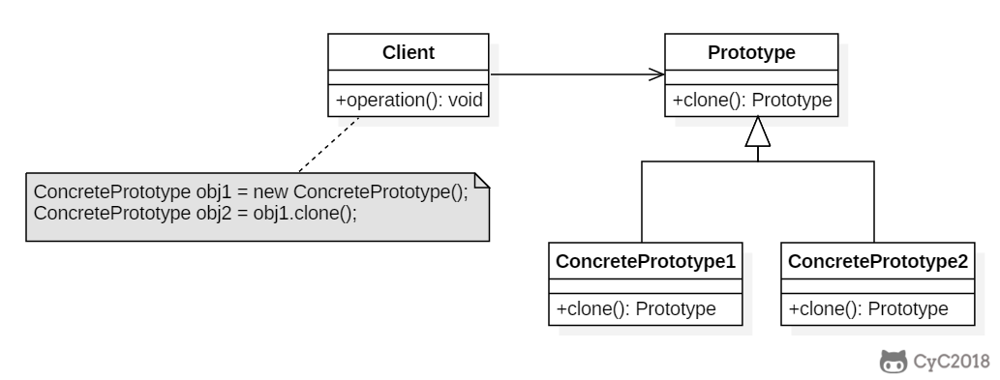

[**首页**](https://github.com/qdw497874677/myNotes/blob/master/首页检索.md)


[设计模式二三事 - 美团技术团队 (meituan.com)](https://tech.meituan.com/2022/03/10/interesting-talk-about-design-patterns.html)

# 设计模式类型

分为三种类型，共23中：

1. 创建型模式：**单例模式**、抽象工厂模式、原型模式、建造者模式、**工厂模式**。
2. 结构型模式：适配器模式、桥接模式、**装饰模式**、组合模式、外观模式、享元模式、**代理模式**。
3. 行为型模式：模板方法模式、命令模式、访问者模式、迭代器模式、**观察者模式**、中介者模式、备忘录模式、解释器模式、状态模式、策略模式、职责链模式。


# （旧）工厂模式

- 实例化对象不使用new，用工厂方法代替。
- 将选择实现类、创建对象统一管理和控制。从而将调用者和实现类解耦·。


## 简单工厂模式

抽象类——Car

~~~java
package com.qdw.factory.simplefactory;

public abstract class Car {
    protected String name;
    protected Car(String name){
        this.name = name;
    }
    public abstract void prepare();
    public void start(){
        System.out.println(name+" 启动");
    }
}
~~~

子类A——CarA

~~~java
package com.qdw.factory.simplefactory;

public class CarA extends Car {
    public CarA(String name){
        super(name);
    }
    @Override
    public void prepare() {
        System.out.println("准备五菱宏光");
    }
}
~~~

子类B——CarB

~~~java
package com.qdw.factory.simplefactory;

public class CarB extends Car {

    protected CarB(String name) {
        super(name);
    }

    @Override
    public void prepare() {
        System.out.println("准备特斯拉");
    }
}
~~~

消费者

~~~java
package com.qdw.factory.simplefactory;

public class Consumer {
    public static void main(String[] args) {
        Car carA = CarFactory.getCar("特斯拉");
        carA.prepare();
        carA.start();
    }
}
~~~


> 缺点：增加新产品要修改代码。


## 工厂方法模式

多一个工厂接口——CarFactory

~~~java
package com.qdw.factory.method;

public interface CarFactory {
    Car getCar();
}
~~~

每个产品都对应一个工厂实现

CarAFactory

~~~java
package com.qdw.factory.method;

public class CarAFactory implements CarFactory {
    public Car getCar() {
        return new CarA("五菱宏光");
    }
}
~~~

CarBFactory

~~~java
package com.qdw.factory.method;

public class CarBFactory implements CarFactory {
    public Car getCar() {
        return new CarA("特斯拉");
    }
}
~~~

消费者

~~~java
package com.qdw.factory.method;


public class Consumer {
    public static void main(String[] args) {
        CarFactory carFactory = new CarAFactory();
        Car carA = carFactory.getCar();
        carA.prepare();
        carA.start();
    }
}
~~~


> 新增产品的话要创建对应的工厂，不用修改代码。但是代码量增加。


## 抽象工厂模式

提供一个接口，用于创建 **相关的对象家族** 。一个工厂负责一个同一个系列的不同产品

~~~java
public class AbstractProductA {
}
public class AbstractProductB {
}
~~~

~~~java
public class ProductA1 extends AbstractProductA {
}
public class ProductA2 extends AbstractProductA {
}
public class ProductB1 extends AbstractProductB {
}
public class ProductB2 extends AbstractProductB {
}
~~~

~~~java
public abstract class AbstractFactory {
    abstract AbstractProductA createProductA();
    abstract AbstractProductB createProductB();
}
public class ConcreteFactory1 extends AbstractFactory {
    AbstractProductA createProductA() {
        return new ProductA1();
    }

    AbstractProductB createProductB() {
        return new ProductB1();
    }
}
public class ConcreteFactory2 extends AbstractFactory {
    AbstractProductA createProductA() {
        return new ProductA2();
    }

    AbstractProductB createProductB() {
        return new ProductB2();
    }
}
~~~

```java
public class Client {
    public static void main(String[] args) {
        AbstractFactory abstractFactory = new ConcreteFactory1();
        AbstractProductA productA = abstractFactory.createProductA();
        AbstractProductB productB = abstractFactory.createProductB();
        // do something with productA and productB
    }
}
```


# （旧）代理模式

Spring中AOP的底层。

## 静态代理

角色分析

- 抽象角色：一般使用接口或者抽象类
- 真实角色：被代理的角色
- 代理角色：代理真实角色。代理真实角色后，一般会做一些附属操作。
- 客户：访问代理对象的人。

好处：

- 是真实角色本身的业务逻辑更纯粹，不用关注一些公共业务。
- 实现业务分工。
- 公共业务拓展方便。

缺点：

- 一个真实角色就需要一个代理角色。


## 动态代理

- 动态代理和静态代理角色一样。
- 动态代理的代理类是动态生成的。
- 分为两大类
  - 基于接口的动态代理：JDK动态代理。这里使用
  - 基于类的动态代理：cglib
  - java字节码实现：javasist


# （旧）单例模式

饿汉式

~~~java
public class Hungry {
    private Hungry(){
    }
    private final static Hungry HUNGRY = new Hungry();
    public static Hungry getInstance(){
        return HUNGRY;
    }
}
~~~


双重检查锁懒汉式

~~~java
public class LazyMan {
    private LazyMan(){
    }
    //加上volatile防止指令重排
    private volatile static LazyMan lazyMan;
    public static LazyMan getInstance(){
        //外面再判断一次为了效率，如果存在对象就不进入同步代码块了
        if (lazyMan == null){
            //加锁如果两个线程同时进入这个方法，可能创建两个实例
            synchronized (LazyMan.class){
                if (lazyMan == null){
                    //可能发生指令重排产生错误
                    lazyMan = new LazyMan();
                }
            }
        }
        return lazyMan;
    }
}
~~~


静态内部类

~~~java
public SingletonDemo{
    private SingletonDemo(){}
    public static SingletonDemo getInstance(){
        return InnerClass.instance;
    }
    private static class InnerClass{
        private static SingletonDemo instance = new SingletonDemo();
    }
}
~~~


枚举

~~~java
public enum SingletonDemo{
    instance;
    public SingletonDemo getInstance(){
        return instance;
    }
}
~~~


# （旧）生成器模式

封装一个对象的构造过程，并允许按步骤构造。

StringBuilder 就是用了生成器模式。


# （旧）原型模式

使用原型实例指定要创建对象的类型，通过复制这个原型来创建新对象。



**适用性**

在以下情况下可以使用 Prototype 模式：

- 一个系统要独立于它的产品的创建、构成和表示时。
- 当要实例化的类是在运行时刻指定时，例如：通过动态装载。
- 为了避免创建一个与产品类层次平行的工厂类层次时。
- 当一个类的实例只能有几个不同状态组合中的一种时。建立相应数目的原型并克隆它们可能比每次用合适的状态手工实例化该类更方便一些。

**缺点**

- 每一个 Prototype 子类都必须实现 Clone 操作。当内部包括一些不支持拷贝或有循环引用的对象时，实现克隆可能也会很困难。

**效果**

- 它对客户隐藏了具体的产品类，因此减少了客户知道的名字的数目。
- 使客户无需改变即可使用与特定应用相关的类。
- 运行时刻增加和删除产品。
- 改变值以指定新对象。
- 改变结构以指定新对象。
- 减少子类的构造。
- 用类动态配置应用。

~~~java
public abstract class Prototype {
    abstract Prototype myClone();
}
~~~

~~~java
public class ConcretePrototype extends Prototype {

    private String filed;

    public ConcretePrototype(String filed) {
        this.filed = filed;
    }

    @Override
    Prototype myClone() {
        return new ConcretePrototype(filed);
    }

    @Override
    public String toString() {
        return filed;
    }
}
~~~

~~~java
public class Client {
    public static void main(String[] args) {
        Prototype prototype = new ConcretePrototype("abc");
        Prototype clone = prototype.myClone();
        System.out.println(clone.toString());
    }
}
~~~

~~~
abc
~~~


# 理论

## 面向对象设计

### 面向对象中的面向过程

1. 滥用 getter、setter 方法

违反了封装特性，不应该将内部的逻辑全部暴露给上层，避免数据被随意修改

1. 滥用全局变量和全局方法

Constants 类和 Utils 类里面有大量的全局变量和全局方法，开发过程中都放在一起难以维护（越来越大，代码冲突），还被大量的类依赖，导致编译速度很慢，复用常量也会代入很多没用的变量。

CartonMatDetailFlowServiceImpl

解决方法：将Constants按照类型划分

1. 基于贫血模型的开发模式

实体类只包含数据，不业务逻辑，就是贫血模型。将数据与操作分离，破坏面向对象的封装特性，是一种面向过程的编程风格。


### 多用组合少用继承

一味地通过继承来限定实现类的功能，会导致组合爆炸，层次过多。

例如：开始设计了个鸟，加了一些看起来通用的方法，但是有的子类实际上不可以使用这个方法，为了减少不必要的方法的暴露，又加了一层。然后又出现这种情况，会导致组合过多。


可以利用**组合（composition）、接口、委托（delegation）**三个技术手段，一块儿来解决刚刚继承存在的问题。

我们知道继承主要有三个作用：表示 is-a 关系，支持多态特性，代码复用。而这三个作用都可以通过其他技术手段来达成。比如 is-a 关系，我们可以通过组合和接口的 has-a 关系来替代；多态特性我们可以利用接口来实现；代码复用我们可以通过组合和委托来实现。所以，从理论上讲，通过组合、接口、委托三个技术手段，我们完全可以替换掉继承，在项目中不用或者少用继承关系，特别是一些复杂的继承关系。

#### 如何判断该用组合还是继承？

尽管我们鼓励多用组合少用继承，但组合也并不是完美的，继承也并非一无是处。从上面的例子来看，继承改写成组合意味着要做更细粒度的类的拆分。这也就意味着，我们要定义更多的类和接口。类和接口的增多也就或多或少地增加代码的复杂程度和维护成本。所以，在实际的项目开发中，我们还是要根据具体的情况，来具体选择该用继承还是组合。如果类之间的**继承结构稳定**（不会轻易改变），继承层次比较浅（比如，最多有两层继承关系），继承关系不复杂，我们就可以**大胆地使用继承**。反之，系统越不稳定，继承层次很深，**继承关系复杂，我们就尽量使用组合来替代继承**。除此之外，**还有一些设计模式会固定使用继承或者组合。**比如，装饰者模式（decorator pattern）、策略模式（strategy pattern）、组合模式（composite pattern）等都使用了组合关系，而模板模式（template pattern）使用了继承关系。


### DDD领域驱动模型

目前大部分系统都采用MVC的分层架构，贫血模型很多，主要逻辑集中在service，相对偏离了面向对象的设计理念。

基于充血模型的 DDD 开发模式实现的代码，也是按照 MVC 三层架构分层的。Controller 层还是负责暴露接口，Repository 层还是负责数据存取，Service 层负责核心业务逻辑。它跟基于贫血模型的传统开发模式的区别主要在 Service 层。

在基于充血模型的 DDD 开发模式中，Service 层包含 Service 类和 Domain 类两部分。Domain 就相当于贫血模型中的 BO。不过，Domain 与 BO 的区别在于它是基于充血模型开发的，既包含数据，也包含业务逻辑。而 Service 类变得非常单薄。总结一下的话就是，基于贫血模型的传统的开发模式，重 Service 轻 BO；**基于充血模型的 DDD 开发模式，轻 Service 重 Domain。**

在复杂的系统中使用DDD，可以提高代码复用。在这种开发模式下，我们需要事先理清楚所有的业务，定义领域模型所包含的属性和方法。领域模型相当于可复用的业务中间层。新功能需求的开发，都基于之前定义好的这些领域模型来完成。


### 类与类的交互关系

泛化（Generalization）可以简单理解为继承关系。

实现（Realization）一般是指接口和实现类之间的关系。

聚合（Aggregation）是一种包含关系，A 类对象包含 B 类对象，B 类对象的生命周期**可以不依赖** A 类对象的生命周期，也就是说可以单独销毁 A 类对象而不影响 B 对象，比如课程与学生之间的关系。

表示A有B作为属性，有B的能力

```Java
public class A {
  private B b;
  public A(B b) {
    this.b = b;
  }
}
```

组合（Composition）也是一种包含关系。A 类对象包含 B 类对象，B 类对象的生命周期**依赖** A 类对象的生命周期，B 类对象不可单独存在，比如鸟与翅膀之间的关系。

表示B是在A的创建过程中产生的，B的生命周期依赖于A。B一定存在于A中，不能单独存在

```Java
public class A {
  private B b;
  public A() {
    this.b = new B();
  }
}
```

关联（Association）是一种非常弱的关系，包含聚合、组合两种关系。

```Java
public class A {
  private B b;
  public A(B b) {
    this.b = b;
  }
}
或者
public class A {
  private B b;
  public A() {
    this.b = new B();
  }
}
```


依赖（Dependency）是一种比关联关系更加弱的关系，包含关联关系。不管是 B 类对象是 A 类对象的成员变量，还是 A 类的方法使用 B 类对象作为参数或者返回值、局部变量，只要 B 类对象和 A 类对象有任何使用关系，我们都称它们有依赖关系。

```Java
public class A {
  private B b;
  public A(B b) {
    this.b = b;
  }
}
或者
public class A {
  private B b;
  public A() {
    this.b = new B();
  }
}
或者
public class A {
  public void func(B b) { ... }
}
```


### 如何面向对象设计

面向对象分析的产出是详细的需求描述。**面向对象设计的产出的类**。通过下面的流程将需求描述转化为具体的类的设计：

1. 划分职责进而识别有哪些类

根据需求描述，将其中涉及的功能点，一个一个罗列出来，看看哪些功能职责相近，操作同样的属性，能否归为一个类


1. 定义类及其属性和方法

识别需求描述中的动词，作为候选方法，再进一步筛选出真正的方法，把功能点中涉及的名词作为候选属性，然后同样删选中真正的属性


1. 定义类与类之间的交互关系

泛化、实现、关联、聚合、组合、依赖。从更加贴近变成的角度，保留四个关系：泛化、实现、组合、依赖。


1. 将类组合起来并提供执行入口

将类组装起来，提供一个执行入口


## 设计原则


### 单一职责原则

Single Responsibility Principle

SRP


### 开闭原则

Open Closed Principle

OCP

> **对扩展开放、对修改关闭。**

添加一个新的功能应该是，在已有代码基础上扩展代码（新增模块、类、方法等），而非修改已有代码（修改模块、类、方法等）。


最常用来提高代码扩展性的方法有：多态、依赖注入、基于接口而非实现编程，以及大部分的设计模式（比如，装饰、策略、模板、职责链、状态）。


### 里式替换原则

Liskov Substitution Principle

LSP

> 子类对象能够替换程序中的父类对象出现的任何地方，并且保证原来程序的逻辑正确性不配破坏。

**就是要求子类完成继承父类的设计初衷**

和面向对象的多态类似，不一样的点是多肽不保证父类被子类替换后，逻辑还保持之前的重要性。

**哪些代码明显违背了****LSP****：**

1. 子类违背父类声明要实现的功能

比如，父类方法声明要将结果根据创建时间正序，但是子类重载将结果根据更新时间倒序。

1. 子类违背父类对输入、输出、异常的约定

比如，父类声明的结果如果不存在返回空集合，而子类重载后在结果不存在时返回null。

1. 子类违背父类注释中的任何特殊说明


### 接口隔离原则

Interface Segregation Principle

ISP

> 客户端不应该被迫用来它不需要的接口

客户端指接口的使用者

通常把接口理解成三种

1. 一组API接口集合

例如一个微服务系统提供了一组用户相关的API给其他系统使用。这种理解下，ISP要求在设计微服务或者类库接口时，如果接口只是被部分调用者使用，那就把这部分接口隔离出来，单独给对应的调用者使用，而不是强迫调用者依赖这部分不需要的。

1. 单个API接口或函数

例如就是一个函数。ISP要求这个函数的功能细化，做到一个单一功能一个接口，不要将多个不同的功能逻辑在一个函数中实现。

判断是否单一很具有主观性，还要结合不同的场景判断。

1. OOP中的接口概念

例如就是java中的接口概念。ISP要求设计接口的时候要把功能类类型细化拆分，尽量避免一个实现类要依赖不需要的函数、强行实现他不需要提供的功能。


### 依赖反转原则


#### IOC

先了解下IOC，Inversion Of Control，控制反转，这里解释的概念和Spring的IOC不一样，目的是将非业务相关的流程集成到框架中，利用框架来驱动逻辑执行，为开发者留出拓展点去添加业务相关代码。

例如下面的例子：

改造前，main方法中为总的执行流程，是开发者需要主动控制的

```Java
public class UserServiceTest {
  public static boolean doTest() {
    // ... 
  }
  
  public static void main(String[] args) {//这部分逻辑可以放到框架中
    if (doTest()) {
      System.out.println("Test succeed.");
    } else {
      System.out.println("Test failed.");
    }
  }
}
```

通过IOC思想改造后，将非业务的代码放到框架中，并为开发者提供业务相关的拓展点

```Java
public abstract class TestCase {
  public void run() {
    if (doTest()) {
      System.out.println("Test succeed.");
    } else {
      System.out.println("Test failed.");
    }
  }
  
  public abstract boolean doTest();
}

public class JunitApplication {
  private static final List<TestCase> testCases = new ArrayList<>();
  
  public static void register(TestCase testCase) {
    testCases.add(testCase);
  }
  
  public static final void main(String[] args) {
    for (TestCase case: testCases) {
      case.run();
    }
  }
```


上面就是通过框架实现控制反转的例子，**框架提供一个可拓展的代码骨架**，用来**组装对象、管理整个执行流程**。开发者利用框架进行开发时，只需要往预留的拓展点上添加自己业务相关的代码，可以利用框架来驱动整个程序流程的执行。

上面的控制反转中的控制指的是**对程序执行流程的控制**，反转指的是使用框架可以**从开发者自己控制程序的执行转换为通过框架来控制执行流程**，流程的控制权从开发者反转到了框架。

实现控制反转的方式很多，除了上面类似**模板方法**的方式，还有**依赖注入**的方式，**控制反转是一种笼统的设计思想**。


#### DI

Dependency Injection，依赖注入

依赖注入是一种具体的编程技巧，一句话概括，不通过new的方式在类内部创建依赖类对象，而是将依赖的类对象在外部创建好，通过构造函数等方式传递（注入）进来给类使用。


依赖注入框架

DI只是将创建类的过程从一个类的内部提出来，在实际开发中，这些类的创建比较繁琐，可以将这些类的创建交给框架去做，开发者只需要简单的配置一下类与类之间的依赖关系，框架就可以去管理具体对象的生命周期。

依赖注入框架很多，比如 Google Guice、Java Spring、Pico Container、Butterfly Container 等。

Spring声称自己是控制反转器，而空转反转的概念是很宽泛的，**Spring主要是通过依赖注入****DI****来体现了空转反转IOC的思想。**


#### 依赖反转原则

Dependency Inversion Principle

DIP

> 高层模块不要依赖低层模块。高层模块和低层模块应该通过抽象来相互依赖，而抽象不需要依赖具体实现细节，具体实现细节依赖抽象。

高层低层主要体现在调用链上，举个例子Servlet容器和Tomcat，Tomcat可以运行javaweb应用代码，但是Tomcat不直接和开发者编写的代码交互，两者都需要依赖Servlet规范。

而spring的兴起，tomcat集成到了spring中，开发者在spring框架中做web开发，控制权又到了spring手中。


### KISS原则

Keep It Simple and Stupid.

> 尽量保持简单。


如何做：

1. 不要使用同事可能不懂的技术来实现代码。不过也看是不是核心知识，有没有利于团队发展。
2. 不要重复造轮子。
3. 不要过度优化。


### YAGNI原则

You Ain’t Gonna Need It.

> 你不会需要他。

不要去设计当前用不到的功能；不要去编写当前用不到的代码。实际上，这条原则的核心思想就是：不要做过度设计。


### DRY原则


# 迭代器模式

角色

- 迭代器接口
  - hasNext()：当前是否有元素
  - Next()：返回当前元素，将index指向下一个元素
- 存储数据的集合接口
  - getIterator()：获取集合对应的迭代器
- 实现迭代器接口
- 实现集合接口


# 代理模式

目的：通过代理类，去替本体做一些力所能及的事，直到自己不能做的事，再去创建本人去做。可能因为开始就去创建本人是不符合实际的，所以先让代理类做一些力所能及的。

## 角色

- 主体（Subject）：定义接口。代理人和本体都要实现。
- 本体（RealSubject）：实际的主体。
- 代理人（Proxy）：也实现主机接口，当遇到自己不能处理的方法，会将工作交给本体。
- 请求者：使用代理模式的角色。


## 例子

主体接口

~~~java
public interface Subject {
    void setName(String name);
    String getName();
    void print(String name);
}
~~~

真正的主体，被代理的类

~~~java
public class RealSubject implements Subject {
    private String name;
    public RealSubject(String name){
        this.name = name;
        heavyJob();
    }

    private void heavyJob(){
        System.out.print("开始初始化");
        for (int i = 0; i < 6; i++) {
            System.out.print(".");
            try {
                Thread.sleep(1000);
            } catch (InterruptedException e) {
                e.printStackTrace();
            }
        }
        System.out.println("初始化完成");
    }

    @Override
    public void setName(String name) {
        this.name = name;
    }

    @Override
    public String getName() {
        return name;
    }

    @Override
    public void print(String word) {
        System.out.println(name+"说:"+word);
    }
}
~~~

代理类

~~~java
public class Proxy implements Subject {
    private String name;
    private RealSubject realSubject;
    @Override
    public void setName(String name) {
        this.name = name;
    }

    @Override
    public String getName() {
        return name;
    }

    @Override
    public void print(String word) {
        realize();
        realSubject.print(word);
    }

    public synchronized void realize(){
        if (realSubject == null){
            realSubject = new RealSubject(name);
        }
    }
}
~~~

执行

~~~java
public class Main {
    public static void main(String[] args) {
        Subject subject = new Proxy();
        subject.setName("qdw");
        System.out.println(subject.getName());
        subject.print("hello world");
    }
}
~~~


## 要点

- 使用代理人来提升处理速度：由于本体自身初始化比较费时，所以在除了一些必须需要主体自己的方法处理的情况下，其他方法的调用都通过代理人实现。（比如说编辑器里面包含的图片，在浏览到时再去真正初始化本体）
- 划分代理和本人：也可以不划分，在本人的代码中的必要方法中加入懒加载的机制。但是划分后可以将组件查分，方便修改。比如改变那些需要本人来处理，直接在代理类中修改，或者不想用懒加载，在main中直接修改获取的示例为本人就好了。
- 委托：在必要的时候要让本人去处理，这个就是委托。和现实中的委托的形式相反，设计模式代码中是相当于代理人把本人叫过来利用本人去完成自己的任务。
- HTTP代理：在浏览器访问网站时，先去查找是否有对应的缓存。HTTP代理就是web服务器的代理人，当需要最新页面或者页面缓存过期，HTTP代理才会去委托Web服务器。
- 不同的代理模式
  - 虚拟代理：上面讲的在真正需要本体的时候才去初始化本体实例。
  - 远程代理：让调用者不用在意本体实体是否在远程网络中，就当它在本地一样调用。
  - 访问代理：为本体提供不同的访问控制，有些方法在有些用户那里是不能调用的。


## 应用场景

代理模式常用在业务系统中开发一些非功能性需求，比如：监控、统计、鉴权、限流、事务、幂等、日志。我们将这些附加功能与业务功能解耦，放到代理类统一处理，让程序员只需要关注业务方面的开发。除此之外，代理模式还可以用在 RPC、缓存等应用场景中。


# 桥接模式


> 在 GoF 的《设计模式》一书中，桥接模式是这么定义的：“Decouple an abstraction from its implementation so that the two can vary independently。”翻译成中文就是：“将抽象和实现解耦，让它们可以独立变化。”


JDBC 驱动是桥接模式的经典应用。我们先来看一下，如何利用 JDBC 驱动来查询数据库。


## 角色

- 客户端：执行抽象1方法，最终执行抽象2的实现
- 抽象1：
- 抽象1实现类：作为桥梁连接两个抽象
- 抽象2：
- 抽象2实现类

## 例子

~~~java
public interface Subject1 {
    void doSomething();
}


public interface Subject2 {
    void doSomethingMore();
}


public class Subject1Impl implements Subject1 {
    
    private Subject2 subject2;
  
    public Subject1Impl(Subject2 subject2) {
        this.subject2 = subject2;
    }
  
    public void doSomething() {
        System.out.println("发送消息");
        subject2.doSomethingMore();
    }
}

public class Subject2Impl implements Subject2 {
  
    public void doSomethingMore() {
        System.out.println("使用邮件发送消息");
    }
}

~~~


# 装饰器模式

为对象添加装饰

特点：

1. 装饰器是对功能的增强。
2. 可以为原始类嵌套多个装饰器，获得更多功能


## 角色

- 组件（Component）：定义了API
- 具体组件（ConcreteComponent）：实现API，是被装饰的对象
- 装饰物（Decorator）：与组件有相同API，并且内部保存了被装饰对象——组件
- 具体装饰物（ConcreteDecorator）：实现API，有被装饰的对象


## 例子

~~~java
public interface Component {
    void doSomething();
}

public class ConcreteComponent implements Component {
    public void doSomething() {
        System.out.println("hello");
    }
}

public abstract class Decorator implements Component {
  
    private ConcreteComponent concreteComponent;
  
    public Decorator(ConcreteComponent concreteComponent) {
        this.concreteComponent = concreteComponent;
    }
}

public class ConcreteDecorator extends Decorator {
    @Override
    public void doSomething() {
        this.doSomething();
        System.out.println(" world");
    }
}


~~~


## 应用

### JAVA IO类

#### 为什么很多类要继承FilterInputStream

BufferedInputStream、DataInputStream 并非继承自 InputStream，而是另外一个叫 FilterInputStream 的类。本来可以通过组合来避免继承，为什么还要去继承FilterInputStream呢。

因为单纯组合的话，装饰器类还要依次实现每一个接口，哪怕这些接口不会被修改。这就造成了一些代码重复。通过继承一个写好默认实现的FilterInputStream，来避免不必要的方法实现，只重写需要的方法就可以了。

~~~java
public class FilterInputStream extends InputStream {
  protected volatile InputStream in;

  protected FilterInputStream(InputStream in) {
    this.in = in;
  }

  public int read() throws IOException {
    return in.read();
  }

  public int read(byte b[]) throws IOException {
    return read(b, 0, b.length);
  }
   
  public int read(byte b[], int off, int len) throws IOException {
    return in.read(b, off, len);
  }

  public long skip(long n) throws IOException {
    return in.skip(n);
  }

  public int available() throws IOException {
    return in.available();
  }

  public void close() throws IOException {
    in.close();
  }

  public synchronized void mark(int readlimit) {
    in.mark(readlimit);
  }

  public synchronized void reset() throws IOException {
    in.reset();
  }

  public boolean markSupported() {
    return in.markSupported();
  }
}
~~~


# 适配器模式

角色

- 目标需求
  - 可能是接口或者类，里面有需求的方法。
- 调用者
  - 调用者的目的是使用需求的方法
- 被适配者
  - 本来就存在的类，自己没有需求方法
- 适配器
  - 通过被适配者的类去继承含有需求方法的类，或者实现含有需求方法接口，来编写的一个新的类，就是适配器。可以通过被适配者，也就是父类的一些代码来实现新的需求的方法。

继承方式（类适配器）

~~~java
class A{
    public Integer doSomeString(){
        return 8401;
    }
}

class B extends A implements C{
    @Override
    public String doSomeInteger() {
        Integer i = super.doSomeString();
        return "\""+String.valueOf(i)+"\"";
    }
}

interface C{
    String doSomeInteger();
}

public class Test6 {
    public static void main(String[] args) {
        C c = new B();
        String s = c.doSomeInteger();
        System.out.println(s);
    }
}
~~~

委托方式（对象适配器）

~~~java
class A{
    public Integer doSomeString(){
        return 8401;
    }
}

class B2 implements C{
    private A a;
    public B2(A a){
        this.a = a;
    }
    @Override
    public String doSomeInteger() {
        Integer i = a.doSomeString();
        return "\""+String.valueOf(i)+"\"";
    }
}

interface C{
    String doSomeInteger();
}

public class Test6 {
    public static void main(String[] args) {
        C c = new B2(new A());
        String s = c.doSomeInteger();
        System.out.println(s);
    }
}
~~~


适配器模式可以看作一种“补偿模式”，用来补救设计上的缺陷。应用这种模式算是“无奈之举”。如果在设计初期，我们就能协调规避接口不兼容的问题，那这种模式就没有应用的机会了。


要点

- 可以通过老类来满足新的需求，一方面可以代码复用，例如可以让现有的类在不改变现有代码的情况下通过适配器模式，用适配器类实现新的接口
- 另一方面可以去兼容旧版本，例如今后只想维护新版本，这时可以让新版本扮演被适配这角色，旧版本扮演目标需求角色。接着写一个扮演适配器角色的类，通过适配器来实现用新版本的类来实现旧版本的类中的方法。

# 模板方法模式

角色

- 抽象类
  - 抽象方法，需要由子类重写。可以有钩子函数返回布尔值可以干预逻辑方法的流程。
  - 具体逻辑方法，调用抽象方法完成逻辑
- 具体类：可以有很多子类，通过不同的重写，来让父类引用去调用逻辑方法，实现不同需求。
  - 实现父类中的抽象方法

要点

- 可以使逻辑处理通用化，需要区别对待的就留给子类去重写
- 通过父类调用子类，调用者消除子类的差异


~~~java


~~~

应用场景:

1. 算法的整体步骤很固定，但其中个别部分易变时，这时候可以使用模板方法模式，将容易变的部分抽象出来，供子类实现。
2. 当多个子类存在公共的行为时，可以将其提取出来并集中到一个公共父类中以避免代码重复。首先，要识别现有代码中的不同之处，并且将不同之处分离为新的操作。最后，用一个调用这些新的操作的模板方法来替换这些不同的代码。
3. 当需要控制子类的扩展时，模板方法只在特定点调用钩子操作，这样就只允许在这些点进行扩展。
   


# 工厂

## 简单工厂

抽象出产品，编写多个具体产品。在一个工厂方法中通过传入名字等信息，进行判断选择返回哪个具体产品。

缺点：如果新添加产品就要在工厂类中的方法中去修改。


## 工厂方法模式

抽象出工厂和产品，编写多个具体工厂和具体产品。一个工厂对应生产一个产品。

缺点：新增产品时，虽然不需要去类中修改方法，但是需要为产品创建新的工厂。工厂过多


### 角色

分成两个包

- 框架（父类）包
  - 产品：抽象类
    - 定义产品子类的方法抽象
  - 创建者（工厂）：抽象类
    - 负责生产产品，定义一些创建产品流程中的抽象方法，和一个创建产品的总方法，通过这个方法来生成产品实例。（这块类似模板方法）
    - 生产产品方法的参数需要Class对象，通过类名创建实例。
- 具体加工（子类）包
  - 具体的产品：构造函数不设置为public，这样别的包只能通过工厂去创建这个类
    - 定义了具体的产品。
  - 具体的创建者
    - 负责生产具体的产品

### 例子

~~~java
//抽象的工厂
abstract class Factory<T> {
    abstract Product createProduct(Class<T> c);
}
//抽象的产品
public abstract class Product {
    public abstract void method();
}

//定义一个具体的产品 (可以定义多个具体的产品)
class ProductA extends Product {
    Product(){}
    @Override
    public void method() {}  //具体的执行逻辑
}
//具体的工厂可以生产出相应的产品
class FactoryA extends Factory{
    @Override
    Product createProduct(Class c) {
        Product product = (Product) Class.forName(c.getName()).newInstance();
        return product;
    }
}
~~~


### 要点

- 工厂产出产品，将这个工厂和产品抽象出来。之后需要用新的工厂和产品，只需要实现或者继承就好了。调用的时候通过接口或者父类的去调用。


## 抽象工厂

抽象出工厂和产品，编写多个具体工厂和具体产品。一个工厂可以生产同一种产品的不同类型。比如手机工厂可以生产华为手机和苹果手机。

这样减少了具体工厂的数量，新增产品时，去对应的工厂类里添加方法即可。不能完全避免类内修改。


### 角色

- 抽象产品（AbstractProduct）：定义各种抽象的零件或者产品，抽象类和接口都可。所有的抽象产品还可以有统一父类或接口来方便统一管理。
- 抽象工厂（AbstractFactory）：定义生成抽象产品的抽象方法。定义生成具体工厂的方法，可以根据类名生成对应的工厂，方法可以定义为静态方法。
- 具体产品（ConcreteProduct）：一系列实现抽象产品的具体产品。由一中具体方法创建的一系列具体产品可以放在一个包里。
- 具体工厂（ConcreteFactory）：一个具体的工厂，实现了抽象工厂中创建抽象产品的方法。一个具体的工厂可以创建关于他的一系列具体产品。


### 要点

- 易于增加具体的工厂：只要实现抽象工厂就好了。
- 难以增加新的零件：增加新的零件需要修改抽象工厂创建对应的抽象零件的方法。具体的工厂越多，改动越多。
- 和工厂方法的区别：
  - 工厂方法：定义一个生产抽象产品的抽象工厂，由工厂的子类决定生产什么具体的产品。利用工厂生产同类型的不同产品，产品的共同属性已经被抽象到抽象产品中了。**产品都是同一类。**比如电脑厂商生产戴尔电脑、华硕电脑。
  - 抽象工厂：定义一个可以生产的几类抽象产品的抽象工厂。子类实现抽象工厂成为具体工厂，创建实现抽象产品的与具体工厂对应的具体产品，可以让这个具体工厂生产。通过工厂生产不同类型的不同产品，所以还需要再把共同点抽象出来，一种工厂可以生产不同类型的某型号产品，多了一个维度。**一个工厂生产的产品之间就是不同类的，并且把这些不同类的产品的共性又抽象出来。**比如苹果公司生产苹果手机和苹果电脑，华为公司生产华为手机和华为电脑。


## 区别

- 简单工厂：产品抽象。工厂根据传入参数确定创建那种产品返回。拓展时需要修改方法。
- 工厂方法：工厂和产品抽象。一个工厂对应生产一个产品。拓展时需要新增工厂类。
- 抽象工厂：工厂和产品抽象。一个工厂对应一种产品的多个类型。拓展时可以给新厂品的不同种类的创建放到一个类中。（比方：华为工厂生产高端手机和低端手机，苹果工厂生产高端手机和低端手机。新来一个小米工厂，可以把高端和低端的生产线都放到一个工厂里。当然也可以把抽象方式换一下。高端工厂生产华为和苹果，低端工厂生产华为和苹果， 新来一个中端工厂，在类里实现华为和苹果就好了。所以一般看之后要拓展什么类型。）


## 场景


# 原型模式

## 角色

- 产品（product）：接口，继承Cloneable
  - use方法：使用产品
  - createClone方法：获得产品的复制
- 管理（Manager）类，
  - 哈希表：存储产品名字和产品实例的键值对。
  - 注册（register）：传入名称和产品实例，放入哈希表中。
  - 创建（create）：根据参数名称，从哈希表中取一个实例，调用他的createClone方法，返回这个实例的复制。
- 具体的产品：类，实现产品接口
  - use：具体的使用
  - createClone：通过实现cloneable接口，调用紫的clone方法返回产品接口类型的自己的复制
- Main
  - 准备：
    - new一个manager
    - new具体的产品
    - 把具体的产品注册到manager中
  - 生成
    - 通过注册时的名字，调用manager的create来生成对应实例的复制


## 场景


# 建造者模式

## 角色

- 建造者：抽象类或者接口
  - 定义用于生成实例的方法
- 具体的建造者
  - 实现建造者的方法。还可以加上自己的一些方法。
- 监工（Director）
  - 使用建造者的接口来生成实例，不依赖于具体的建造者。
  - 构造方法传入建造者
  - 使用一个方法以建造者的api操作
- 使用者
  - 调用监工根据不同情况创建不同的实例

~~~java
public class Test7 {
    public static void main(String[] args) {
        Builder builderA = new BuilderA();
        Builder builderB = new BuilderB();
        Director director = new Director(builderA);
        director.build();
        builderA.print();
    }
}

abstract class  Builder{
    public abstract void doSome(String s);
    public abstract void close();
    public abstract void print();
}

class Director{
    private Builder builder;
    public Director(Builder builder){
        this.builder = builder;
    }

    public void build(){
        builder.doSome("hello");
        builder.close();
    }
}

class BuilderA extends Builder{
    private String s;
    @Override
    public void doSome(String s) {
        this.s = "("+s+")";

    }
    @Override
    public void close() {
        s = s+"!";
    }

    @Override
    public void print() {
        System.out.println(s);
    }
}
~~~


建造者模式中，监工决定建造者中api的执行顺序；而模板方法模式中，父类决定子类的方法的调用顺序。

# 责任链模式

## 角色

- 问题类（Trouble）：表示问题的类
- 处理者（Hander）：抽象类。具体定了如果设置推卸的类，和如果解决问题（模板方法，里面调用其他一些抽象方法）
  - 属性：name表示处理者名字，next表示自己处理不了要推卸给的类（处理者的一个子类）
  - 具体方法setNext，设置推卸的类，返回这个类，方便连续设置推卸责任的类。
  - 抽象方法resolve，参数为问题，需要解决问题，返回true表示处理成功。
  - 抽象方法done，fail，成功做什么，失败做什么。
  - 具体方法support，参数为问题。模板方法，调用其他抽象类，比如resolve处理问题，如果处理失败，尝试用next去处理，如果不行，就调用方法处理失败的结果。
- 具体的处理者
  - 实现done成功做什么
  - 实现fail失败做什么
  - 实现resolve
- 请求者：第一个处理者，每次问题都是从他开始解决。

## 例子


## 要点

- 个人认为：使用责任链主要有两种目的
  - 拆分代码：想通过责任链代替ifelse，将都将单独处理事件的同类任务解耦出来，方便拓展。
  - 逐层操作：通过责任链，实现多个handler都可以根据事件的状态是否满足自己的要求而去做一些操作，多个handler可能或多或少都有参与。强调逐步剥离事件。


## 场景


# 策略模式

定义一系列算法，将每个算法都封装起来。他们之间可以互换。

## 角色

- 策略（strategy）：决定实现策略需要的必要的API
- 具体的策略（concreteStrategy）
- 上下文（Context）：负责使用策略

## 例子

~~~java
//定义一个策略接口
public interface Strategy {
    void strategyImplementation();
}

//具体的策略实现(可以定义多个具体的策略实现)
public class StrategyA implements Strategy{
    @Override
    public void strategyImplementation() {
        System.out.println("正在执行策略A");
    }
}

//封装策略，屏蔽高层模块对策略、算法的直接访问，屏蔽可能存在的策略变化
public class Context {
    private Strategy strategy = null;

    public Context(Strategy strategy) {
        this.strategy = strategy;
    }
  
    public void doStrategy() {
        strategy.strategyImplementation();
    }
}
~~~


策略模式与工厂方法模式的结合

~~~java
//抽象策略
public abstract class RewardStrategy {
    public abstract void reward(long userId);
  
    public void insertRewardAndSettlement(long userId, int reward) {} ; //更新用户信息以及结算
}
//新用户返奖具体策略A
public class newUserRewardStrategyA extends RewardStrategy {
    @Override
    public void reward(long userId) {}  //具体的计算逻辑，...
}

//老用户返奖具体策略A
public class OldUserRewardStrategyA extends RewardStrategy {
    @Override
    public void reward(long userId) {}  //具体的计算逻辑，...
}

//抽象工厂
public abstract class StrategyFactory<T> {
    abstract RewardStrategy createStrategy(Class<T> c);
}

//具体工厂创建具体的策略
public class FactorRewardStrategyFactory extends StrategyFactory {
    @Override
    RewardStrategy createStrategy(Class c) {
        RewardStrategy product = null;
        try {
            product = (RewardStrategy) Class.forName(c.getName()).newInstance();
        } catch (Exception e) {}
        return product;
    }
}
~~~


策略模式的精髓就是用查表法（比如map或者反射获取类）代码冗长的if-else/switch分支判断


## 策略模式和模板方法的区别

两者提供的颗粒度有所差异，当模板方法中的已经定义的流程步骤、共用方法都去掉后，和策略模式是差不多的。也就是说模板方法可以让不同的实现模块更耦合，提高复用率，策略模式强调每个实现是独立的完整的流程。

策略模式更偏向无状态。


# 观察者模式

## 角色

- 观察对象：抽象类
  - 注册观察者的方法
  - 删除观察者的方法
  - 获取现在状态的方法
  - 执行任务的方法
  - 通知观察者的方法：告诉他们我发生了变化，会调用观察者的update方法
- 具体的观察对象：继承观察对象类，自己加一些方法实现自己的功能
  - 主要任务是：执行自己的业务操作，然后通知观察者（通知操作在抽象类中定义好，调用观察者的update方法把自己传过去，让观察者在他的update方法中去调用自己的获取新状态的方法。）
- 观察者
  - update方法：用于获取被观察对象的最新状态。参数为被观察对象，调用观察对象的获取状态的方法。
- 具体的观察者


## 例子

主体，被观察者

~~~java
public abstract class SubjectAbs {
    private List<Observer> observers;
    public SubjectAbs(){
        observers = new ArrayList<Observer>();
    }
    public void attach(Observer observer){
        observers.add(observer);
    }
    public void detach(Observer observer){
        observers.remove(observer);
    }
    protected void notifyObs(){
        Iterator<Observer> iterator = observers.iterator();
        while (iterator.hasNext()){
            iterator.next().update(this);
        }
    }
    abstract public Object getData();
    abstract public void execute();
}
~~~

具体的主体

~~~java
public class SubjectImpl extends SubjectAbs {
    private String data;
    public Object getData() {
        return data;
    }

    public void execute() {
        DateFormat instance = SimpleDateFormat.getDateTimeInstance();
        data = instance.format(new Date());
    }
}
~~~

观察者

~~~java
public interface Observer {
    void update(SubjectAbs subjectAbs);
}
~~~

具体的观察者1

~~~java
public class ObserverImpl1 implements Observer {
    @Override
    public void update(SubjectAbs subjectAbs) {
        String data = (String) subjectAbs.getData();
        System.out.println("我是1，我收到了更新:"+data);
    }
}
~~~

具体的观察者2

~~~java
public class ObserverImpl2 implements Observer {
    @Override
    public void update(SubjectAbs subjectAbs) {
        String data = (String) subjectAbs.getData();
        System.out.println("我是2，我收到了更新:"+data);
    }
}
~~~

执行

~~~java
public class Main {
    public static void main(String[] args) throws InterruptedException {
        SubjectAbs subjectAbs = new SubjectImpl();
        Observer observer1 = new ObserverImpl1();
        Observer observer2 = new ObserverImpl2();
		//　注册
        subjectAbs.attach(observer1);
        subjectAbs.attach(observer2);
		// 主体操作完，调用主体的notify去通知观察者们
        for (int i = 0; i < 10; i++) {
            subjectAbs.execute();
            subjectAbs.notifyObs();
            Thread.sleep(1000);
        }
    }
}
~~~


## 要点

- 观察者的顺序：在上面观察者update方法的调用顺序是根据注册在观察对象中的顺序决定的。
- 注意观察者会影响观察对象的操作：观察者要小心，不要触发观察对象的update方法，这样会导致循环。
- 传递更新信息的方法：update方法要传递的参数
  - 观察对象本身：观察者可以直接从被观察对象获取数据
  - 观察对象本身+数值：除了被观察对象，还有其他数据。给出被观察对象中不存在的数据，但是这样会让被观察对象去接触观察者想要的东西。相对缺少了点灵活性。
  - 数值：只传具体数据。对于观察者有很多个观察对象时，就显得不太好用了。观察者并不知道拿到的数据是属于哪个被观察者的。
- 发布订阅：从过程来看，是观察者接收被观察者的通知。所以观察者模型也叫发布订阅模式。
- MVC：M和V的关系，就是被观察对象和观察者的关系。
- Java字段的观察者模式：java.util.observer接口和java.util.observable类。


发布-订阅模型，是一对多的关系，可以以同步的方式实现，也可以以异步的方式实现。 生产-消费模型，是多对多的关系，一般以异步的方式实现 两者都可以达到解耦的作用


示例代码

~~~java
/**
 * 目标对象，他知道哪些是观察者，并提供对观察者的注册(attach)和删除(remove)
 * @author Administrator
 */
public class Sbuject {
	private List<Observer> observers = new ArrayList();
	//将观察者添加到观察者集合中
	private void attach(Observer obs){
		observers.add(obs);
	}
	//将观察者移出集合
	private void detach(Observer obs){
		observers.remove(obs);
	}
	//通知各个注册的观察者更新的内容
	protected void notifyObjservers(){
		for (Observer observer : observers){
			observer.update(this);
		}
	}
	
}
 
/**
 * 具体的目标对象，负责把状态信息存入观察者对象中
 * @author Administrator
 */
public class SbujectImpl extends Sbuject {
	//目标对象状态信息
	private String sbujectState;
 
	public String getSbujectState() {
		return sbujectState;
	}
 
	public void setSbujectState(String sbujectState) {
		this.sbujectState = sbujectState;
		this.notifyObjservers();
	}
}
 
/**
 * 观察者接口，定义一个更新(update)的方法通知那些观察者
 * @author Administrator
 */
public interface Observer {
	void update(Sbuject subject);
}
 
/**
 * 具体的观察者对象
 * @author Administrator
 */
public class ObserverImpl implements Observer {
	//观察者状态信息
	private String observerState;
 
	public String getObserverState() {
		return observerState;
	}
 
	public void setObserverState(String observerState) {
		this.observerState = observerState;
	}
 
	@Override
	public void update(Sbuject subject) {
		this.observerState = ((SbujectImpl) subject).getSbujectState();
	}
 
}

public static void main(String[] args) {
        Subject subject=new SbujectImpl();
        Observer obs1=new ObserverImpl1();
        Observer obs2=new ObserverImpl2();
        subject.add(obs1);
        subject.add(obs2);
        subject.notifyObserver();
 }

~~~


# 外观模式

场景：底层接口粒度较细，上层调用复杂。此时可以考虑在中间加一个中间层，来对底层接口调用做整合。类似于肯德基套餐。


# 享元模式

共享最小单位

## 角色

- 享元工厂
- 抽象享元
- 具体享元
- 客户端

内在状态：不随环境变化而变化

外在状态：随环境变化而变化


# 解释器模式

解释器模式为某个语言定义它的语法表示，并定义一个解释器来处理这个语法。


它的代码实现的**核心思想**，就是将语法解析的工作拆分到各个小类中，以此来避免大而全的解析类。一般的做法是，将语法规则拆分成一些小的独立的单元，然后对每个单元进行解析，最终合并为对整个语法规则的解析。


# 状态模式

状态模式一般用来实现状态机，而状态机常用在游戏、工作流引擎等系统开发中。不过，状态机的实现方式有多种，除了**状态模式**，比较常用的还有**分支逻辑法和查表法。**


## 什么是有限状态机？

有限状态机，英文翻译是 Finite State Machine，缩写为 FSM，简称为状态机。状态机有 3 个组成部分：**状态（State）、事件（Event）、动作（Action）**。其中，事件也称为转移条件（Transition Condition）。事件触发状态的转移及动作的执行。不过，动作不是必须的，也可能只转移状态，不执行任何动作。


状态机实现方式一：分支逻辑法

最简单直接的实现方式是，参照状态转移图，将每一个状态转移，原模原样地直译成代码。这样编写的代码会包含大量的 if-else 或 switch-case 分支判断逻辑，甚至是嵌套的分支判断逻辑，所以，我把这种方法暂且命名为分支逻辑法。


状态机实现方式二：查表法

除了用状态转移图来表示之外，状态机还可以用二维表来表示，如下所示。在这个二维表中，**第一维表示当前状态，第二维表示事件**，**值表示当前状态经过事件之后，转移到的新状态及其执行的动作**。


相对于分支逻辑的实现方式，查表法的代码实现更加清晰，可读性和可维护性更好。当修改状态机时，我们只需要修改 transitionTable 和 actionTable 两个二维数组即可。实际上，如果我们把这两个二维数组存储在配置文件中，当需要修改状态机时，我们甚至可以不修改任何代码，只需要修改配置文件就可以了。

**要求动作要简单，这里只是加减数所以比较方便。**


状态机实现方式三：状态模式

查表法的实现方式有一定局限性，事件触发的动作要求很简单。

虽然分支逻辑的实现方式不存在这个问题，但它又存在前面讲到的其他问题，比如分支判断逻辑较多，导致代码可读性和可维护性不好等。

针对于分支逻辑的缺点，可以通过状态模式的方式解决。

**状态模式通过将事件触发的状态转移和动作执行，拆分到不同的状态类中，来避免分支判断逻辑。**

例如

~~~java
public interface IMario {
  State getName();
  void obtainMushRoom(MarioStateMachine stateMachine);
  void obtainCape(MarioStateMachine stateMachine);
  void obtainFireFlower(MarioStateMachine stateMachine);
  void meetMonster(MarioStateMachine stateMachine);
}

public class SmallMario implements IMario {
  private static final SmallMario instance = new SmallMario();
  private SmallMario() {}
  public static SmallMario getInstance() {
    return instance;
  }

  @Override
  public State getName() {
    return State.SMALL;
  }

  @Override
  public void obtainMushRoom(MarioStateMachine stateMachine) {
    stateMachine.setCurrentState(SuperMario.getInstance());
    stateMachine.setScore(stateMachine.getScore() + 100);
  }

  @Override
  public void obtainCape(MarioStateMachine stateMachine) {
    stateMachine.setCurrentState(CapeMario.getInstance());
    stateMachine.setScore(stateMachine.getScore() + 200);
  }

  @Override
  public void obtainFireFlower(MarioStateMachine stateMachine) {
    stateMachine.setCurrentState(FireMario.getInstance());
    stateMachine.setScore(stateMachine.getScore() + 300);
  }

  @Override
  public void meetMonster(MarioStateMachine stateMachine) {
    // do nothing...
  }
}

// 省略SuperMario、CapeMario、FireMario类...

public class MarioStateMachine {
  private int score;
  private IMario currentState;

  public MarioStateMachine() {
    this.score = 0;
    this.currentState = SmallMario.getInstance();
  }

  public void obtainMushRoom() {
    this.currentState.obtainMushRoom(this);
  }

  public void obtainCape() {
    this.currentState.obtainCape(this);
  }

  public void obtainFireFlower() {
    this.currentState.obtainFireFlower(this);
  }

  public void meetMonster() {
    this.currentState.meetMonster(this);
  }

  public int getScore() {
    return this.score;
  }

  public State getCurrentState() {
    return this.currentState.getName();
  }

  public void setScore(int score) {
    this.score = score;
  }

  public void setCurrentState(IMario currentState) {
    this.currentState = currentState;
  }
}
~~~


# 备忘录模式

行为型模式

主要是用来防丢失、撤销、恢复等


## 原理和实现

在 GoF 的《设计模式》一书中说，**在不违背封装原则的前提下，捕获一个对象的内部状态，并在该对象之外保存这个状态，以便之后恢复对象为先前的状态。**

- **为什么存储和恢复副本会违背封装原则？**
- **备忘录模式是如何做到不违背封装原则的？**

先实现一个功能

> 假设有这样一道面试题，希望你编写一个小程序，可以接收命令行的输入。用户输入文本时，程序将其追加存储在内存文本中；用户输入“:list”，程序在命令行中输出内存文本的内容；用户输入“:undo”，程序会撤销上一次输入的文本，也就是从内存文本中将上次输入的文本删除掉。

~~~java
public class InputText {
  private StringBuilder text = new StringBuilder();

  public String getText() {
    return text.toString();
  }

  public void append(String input) {
    text.append(input);
  }

  public void setText(String text) {
    this.text.replace(0, this.text.length(), text);
  }
}

public class SnapshotHolder {
  private Stack<InputText> snapshots = new Stack<>();

  public InputText popSnapshot() {
    return snapshots.pop();
  }

  public void pushSnapshot(InputText inputText) {
    InputText deepClonedInputText = new InputText();
    deepClonedInputText.setText(inputText.getText());
    snapshots.push(deepClonedInputText);
  }
}

public class ApplicationMain {
  public static void main(String[] args) {
    InputText inputText = new InputText();
    SnapshotHolder snapshotsHolder = new SnapshotHolder();
    Scanner scanner = new Scanner(System.in);
    while (scanner.hasNext()) {
      String input = scanner.next();
      if (input.equals(":list")) {
        System.out.println(inputText.getText());
      } else if (input.equals(":undo")) {
        InputText snapshot = snapshotsHolder.popSnapshot();
        inputText.setText(snapshot.getText());
      } else {
        snapshotsHolder.pushSnapshot(inputText);
        inputText.append(input);
      }
    }
  }
}
~~~

要在不**违背封装原则**的前提下，进行对象的备份和恢复。而上面的代码并不满足这一点，主要体现在下面两方面：

- 为了能用快照恢复 InputText 对象，我们在 InputText 类中定义了 setText() 函数，但这个函数有可能会被其他业务使用，所以，暴露不应该暴露的函数违背了封装原则；
  - 总结就是在业务类中的属性让快照操作者随意使用。
- 快照本身是不可变的，理论上讲，不应该包含任何 set() 等修改内部状态的函数，但在上面的代码实现中，“快照“这个业务模型复用了 InputText 类的定义，而 InputText 类本身有一系列修改内部状态的函数，所以，用 InputText 类来表示快照违背了封装原则。
  - 快照本身是不能够被修改的，这里的快照直接复用的业务类。

对代码做两点修改。其一，定义一个独立的类（Snapshot 类）来表示快照，而不是复用 InputText 类。这个类只暴露 get() 方法，没有 set() 等任何修改内部状态的方法。其二，在 InputText 类中，我们把 setText() 方法重命名为 restoreSnapshot() 方法，用意更加明确，只用来恢复对象。

重构后：

~~~java
public class InputText {
  private StringBuilder text = new StringBuilder();

  public String getText() {
    return text.toString();
  }

  public void append(String input) {
    text.append(input);
  }

  public Snapshot createSnapshot() {
    return new Snapshot(text.toString());
  }

  public void restoreSnapshot(Snapshot snapshot) {
    this.text.replace(0, this.text.length(), snapshot.getText());
  }
}

public class Snapshot {
  private String text;

  public Snapshot(String text) {
    this.text = text;
  }

  public String getText() {
    return this.text;
  }
}

public class SnapshotHolder {
  private Stack<Snapshot> snapshots = new Stack<>();

  public Snapshot popSnapshot() {
    return snapshots.pop();
  }

  public void pushSnapshot(Snapshot snapshot) {
    snapshots.push(snapshot);
  }
}

public class ApplicationMain {
  public static void main(String[] args) {
    InputText inputText = new InputText();
    SnapshotHolder snapshotsHolder = new SnapshotHolder();
    Scanner scanner = new Scanner(System.in);
    while (scanner.hasNext()) {
      String input = scanner.next();
      if (input.equals(":list")) {
        System.out.println(inputText.toString());
      } else if (input.equals(":undo")) {
        Snapshot snapshot = snapshotsHolder.popSnapshot();
        inputText.restoreSnapshot(snapshot);
      } else {
        snapshotsHolder.pushSnapshot(inputText.createSnapshot());
        inputText.append(input);
      }
    }
  }
}
~~~

改进是

- 业务类自己封装生成和恢复快照的方法。
- 有单独的快照类Snapshot，只提供取业务类的方法。


# 场景


## 外卖奖励

使用工厂+策略


## IOC


## 单例Bean


## AOP

### 代理


### 增强类拦截器


## 包装类


## IO流类


