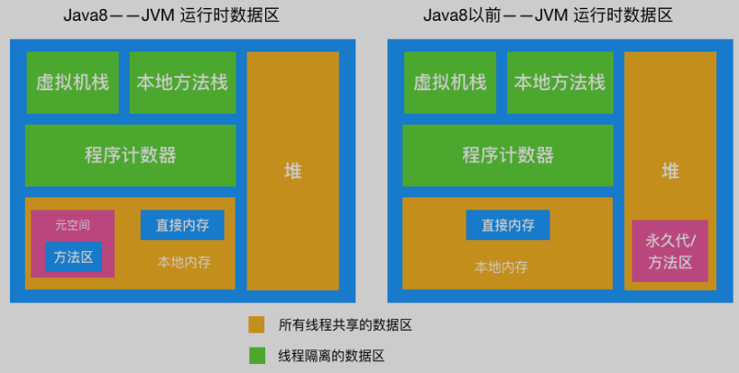

# JVM

## 运行时区域

- 程序计数器：线程私有。如果线程正在执行一个Java方法，这个计数器用来记录正在执行的虚拟机字节码指令的地址（行号）。程序计数器是Java虚拟机中**唯一一个没有规定任何OOM的情况的区域**。
- 本地方法栈：线程私有。提供本地方法的支持，其他类似虚拟机栈。
- 虚拟机栈：线程私有。线程请求的栈深度大于虚拟机允许的深度，抛出StackOverflowError。如果虚拟机栈可以动态扩展，而扩展时无法申请到足够的内存，抛出OOM。
  - 栈帧：当方法执行时，会创建一个对应的栈帧，压入栈，方法结束后出栈。
    - 局部变量表：存放局部变量，包括基本数据类型、对象引用、returnAddress 类型（指向一条字节码指令的地址）
    - 操作数栈：执行方法的操作
    - 动态链接：
    - 方法出口：通过这个出口来退出方法
- 堆：存放对象。
  - 年轻代
    - 伊甸园区
    - 幸存者区
      - To
      - From
  - 老年代
- 本地内存：
  - 元空间在直接（本地）内存中。
    - 方法区（永久代（1.8之前作为永久代，在堆中）、元空间）：存放类信息，静态变量，常量池（存放常量）。

## 类加载

在java代码中，类型的加载、连接、初始化都是在程序的运行期间完成的。

### 类加载过程

类加载指的是把通过Java源代码编译成的.class文件读入内存中，然后产生与所加载类对应的Class对象。加载完成后，Class对象还不完整。加载后进入连接阶段，这一阶段包括验证、准备、解析。最后对类进行初始化。通过这五步加载。

- 加载：
  1. 通过类的全限定名来获取类的二进制字节流。
  2. 转化为方法区（元空间）中的数据。
  3. 在方法区中创建一个这个类的java.lang.Class对象，可以访问方法区（元空间）中这个类的各种数据。
- 验证：确保.class文件中的字节流信息符合当前虚拟机要求。
- 准备：在方法区（元空间）为类变量（静态成员变量）分配内存，并设置变量初始值（零值）。如果是final修饰的变量会直接在准备阶段赋值，而不是赋零值。
- 解析：虚拟机将常量池内的符号引用替换为直接引用。解析动作主要针对类或接口、字段、类方法、接口方法、方法类型、方法句柄、调用点限定符，七类符号引用进行。
- 初始化：开始执行类中定义的Java代码。
  - 执行类构造器<clinit>()方法的过程。<clinit>()方法是由编译器自动收集类中的所有类变量的赋值动作和静态语句块static{}中的语句合并产生的。父类如果没有初始化会先初始化父类。 在同一个类加载器下，一个类型只会被初始化一次。

### 类初始化时机

- 遇到new、getstatic、putstatic或invokestatic这四条字节码指令。
  - 使用new关键字实例化对象时。
  - 读取或者设置一个类的静态字段时。
  - 调用一个类的静态方法时。
- 使用反射时，如果类没有进行过初始化，要先初始化。
- 初始化一个类，如果发现他的父类没有初始化过，先初始化父类。
- 虚拟机启动时，指定的主类（有main()方法的）要先初始化。
- 当使用jdk1.7动态语言支持时，如果一个java.lang.invoke.MethodHandle实例最后的解析结果REF_getstatic,REF_putstatic,REF_invokeStatic的方法句柄，并且这个方法句柄所对应的类没有进行初始化，则需要先出触发其初始化。

### class文件来源

- 本地磁盘中的.class文件。
- 网络下载.class文件。
- war包，jar包中的.class文件。
- 从专门的数据库中读取的.class文件（少）。
- 将java源文件动态编译成的.class文件。
  - 动态代理，运行期间生成的.class文件
  - jsp会转换为servlet，servlet是java文件，会被编译成.class文件。

通过**类加载器**加载，加载到方法区（元空间）。分两个区域：

- .class的字节码数据。
- Class对象，可以访问对应class的数据。

### 类加载器分类

#### 系统级别

- 启动类加载器
- 扩展类加载器
- 系统类加载器（App类加载器）

#### 用户级别

- 用户自定义类加载器（java.lang.ClassLoader的子类）

### 双亲委派机制

> 从JDK 1.2开始，类加载过程采用双亲委派机制。
>
> 如果一个类加载器接收到了类加载请求，它首先不会尝试自己去加载，而是把请求委托给父类加载器去加载。当父类不能加载，才尝试自己加载。
>
> 作用：保证JDK核心类的优先加载。

### 怎么打破双亲委派

- 自定义一个类加载器，重写loadClass方法。
- 使用线程上下文加载器

### 自定义类加载器

- 沿用双亲委派机制
  - 继承ClassLoader类并重写findClass方法
- 打破双亲委派机制
  - 继承ClassLoader类并重写loadClass和findClass方法
    - 默认的loadClass方法实现了双亲委派机制的逻辑，让父类加载器加载。为了破坏必须重写。

## 对象

### 对象的访问定位

使用对象时，通过栈上的引用变量（reference）来操作堆上的具体对象。

引用获取对象有两种形式

- Java堆中会分配一块内存作为句柄池。引用存储的是句柄地址。

- 引用中直接存储对象地址

> 比较：
>
> 使用句柄的最大好处是引用中存储的是稳定的句柄地址。对象移动（GC）时只改变实例数据指针地址，引用自身不用修改。
>
> 直接指针访问的好处就是速度快。
>
> 如果对象频繁GC那么句柄好，如果对象频繁访问则直接指针访问好。

### 类从加载到初始化的过程

- 类加载检查：遇到new指令时，先检查这个命令的参数是否能在常量池中定位到一个类的符号引用，并检查这个符号引用代表的类是否已被加载、解析和初始化过。如果没有先进行类的加载过程。
- 分配内存：两种方式：
  - 碰撞指针：假设Java堆中的内存是规整的，用过的内存在一边，空闲的在一边，中间有个指针指向分界点。分配内存就是把指针向空闲的那边移动对象大小的距离。
  - 空闲列表：假设Java堆中的内存不是规整的。虚拟机必须维护一个列表，记录哪些内存块可用，分配时从列表中找到一块足够大的空间划分给对象，然后更新列表的记录。
  - 划分空间时，可能会遇到线程安全问题。解决方法有两种：
    - 对分配内存空间的动作进行同步处理：采用CAS和自旋锁。
    - 把分配内存的动作划分在不同空间进行。
- 初始化零值：将分配到的内存空间都初始化为零值。
- 设置对象头：主要设置类的源数据信息、对象的哈希值、对象的GC分代年龄等信息。
- 执行init方法（构造函数）初始化。

> 总结：
>
> 一个java对象的创建过程包括两个阶段：类初始化阶段和类实例化阶段。
>
> 一个对象被创建时，虚拟机会为其分配内存来存放自己的实例变量和从父类继承过来的实例变量。同时这些实例变量被赋予初始值（零值）。
>
> 内存分配完成后，虚拟机开始对新创建的对象按照程序员的意愿进行初始化。

### 对象初始化

#### Java对象创建时机

1. 使用new关键字创建对象。
2. 反射机制。
   1. 使用Class类的newInstance方法(反射机制)。这个newInstance方法调用无参的构造器创建对象。
   2. 使用Constructor类的newInstance方法(反射机制)。可以通过这个newInstance方法调用有参数的和私有的构造函数。事实上Class的newInstance方法内部调用的也是Constructor的newInstance方法。
3. 使用Clone方法创建对象。要想使用clone方法，我们就必须先实现Cloneable接口并实现其定义的clone方法，这也是原型模式的应用。
4. 使用(反)序列化机制创建对象。

父类的类构造器<clinit>() -> 子类的类构造器<clinit>() -> 父类的成员变量和实例代码块 -> 父类的构造函数 -> 子类的成员变量和实例代码块 -> 子类的构造函数。

对象初始化过程中主要涉及三种执行对象初始化的结构。

- 实例变量初始化。
- 实例代码块初始化。
- 构造函数初始化。

#### 1.实例变量初始化和实例代码块初始化。

在定义实例变量的同时，可以直接对实例变量进行赋值，或者使用实例代码块进行赋值。这两种方式对变量进行实例化是执行在构造函数之前的。**实际上，编译器会把这种方式赋值的代码放到构造函数中去，在调用父类构造函数之后，构造函数本身的代码之前。**

#### 2.构造函数初始化。

在编辑生成的字节码中，构造函数被命名为<init>()方法。

为了保证创建一个完整的对象。Object对象之外的对象的构造函数的第一条语句必须是父类构造函数的构造函数或者调用语句。如果没有显示调用，编译器会自动生成。

## 垃圾回收算法与回收器

### 概述

> 程序计数器、虚拟机栈、本地方法栈三个区域随线程自生自灭（因为线程私有）。
>
> 堆和元空间不一样。只有在程序处于运行期才知道哪些对象会创建，这部分内存的分配和回收是动态的。

### 判断对象死活

#### 引用计数法

> 早期算法。给对象添加一个引用计数器。当对象被引用一次，计数+1。当一个对象的一个引用超过了生命周期或者被设置为新值时，计数器-1。计数器为0时，这个对象就可以被当做垃圾收集。

缺点

- 无法解决对象循环引用。

#### 可达性分析法

> 根据作为GC根（GC Roots）的对象作为起点，从这些节点出发走过的路径称为引用链。当一个对象到GC根没有任何引用链相连的时候，说明对象不可用。

可作为GC根的对象

- 虚拟机栈中引用的对象
- 本地方法栈中本地方法引用的对象
- 静态属性引用的对象
- 常量引用的对象

#### 回收元空间

元空间垃圾回收主要回收两部分：废弃的常量、无用的类

- 废弃的常量：没有被引用的常量
- 无用的类：满足下面三个条件
  - 该类的所有实例都被回收
  - 加载该类的类加载器被回收
  - 该类的Class对象没有在任何地方被引用

### GC分类

- Minor GC：Eden区被填满时，会执行Minor GC，和Young GC是等价的。
- Major GC：老年代的垃圾收集叫做Major GC，通常和full GC是等价的，收集整个GC堆。

### 垃圾回收算法

基于可达性分析

#### 复制算法

> 把空间分成两块，每次对其中的一块存有对象的区域进行GC。然后将存活的放到另一块上。解决了内存碎片问题。一般应用于年轻代。

缺点：

- 会浪费一定空间。

#### 标记清除算法

> 1. 标记阶段：进行一次可达性分析，把从GC跟可达的对象进行标记。
> 2. 清除阶段：遍历堆，把未标记的对象回收。同时恢复对象之前的标记。
>
> 一般应用于老年代。

缺点：

- 回收时，应用需要挂起
- 效率不高
- 会产生内存碎片

#### 标记整理算法

> 在标记清除的基础上，把标记的存活对象向一侧的空间移动。

解决的内存碎片的问题

#### 分代回收

> 根据不同的情况制定相应的回收算法，结合这些算法的优先，是现代虚拟机采用的首选算法（策略）。
>
> - 年轻代：每次回收都有大量的对象死去，少量存活。通常选用复制算法。
>- 老年代：对象存活率高。使用标记清楚或者标记整理算法。

##### 年轻代的回收

因为大部分对象生命周期很短，所以分代收集算法根据对象存活周期的不同将堆分成新生代和老年代，默认比例1：2。

为了节省空间，在年轻代，将空间划分为三块。伊甸园区、两个幸存者区（To、From）。他们的空间大小比例为8：1：1。

当伊甸园区满时，触发第一次young gc（Minor GC），回收伊甸园区，把存活的对象放到一个幸存者From区，对象的年龄+1（对象年龄即参与MinorGC的次数）。当伊甸园区再次触发young gc时，会回收伊甸园区和幸存者From区，存活的对象放到幸存者To区（先复制再对旧的清除）。

之后伊甸园区触发gc时，就会对伊甸园区和幸存者To区进行回收。把存活对象放到From区。

##### 进入老年代的时机

- 对象年龄到达阈值15时，进入老年代。
- 大对象：当某个对象分配需要大量连续内存时，直接分配到老年代。因为会很占用幸存者区。
- 幸存者区中，相同年龄的对象大小之和大于一个幸存者区空间一半以上时，将大于等于这个年龄的对象放入老年代。

##### 空间分配担保

发生MinorGC之前，虚拟机会先检查老年代最大可用的连续空间是否大于新生代所有对象的总空间。如果大于MinorGC就是安全的，如果不大于就会检查设置是否允许担保失败，如果允许，就会继续检查老年代最大可用连续空间是否大于历次晋升到老年代对象的平均大小，如果大于就进行MinorGC，否则可能进行一次FullGC（MajorGC）。

##### Stop The World

如果老年代满了，会触发FullGC，会同时回收年轻代和老年代（即回收整个堆）。它会导致Stop The World（STW），产生性能开销。

STW：在GC（MinorGC或FullGC）期间，只有垃圾回收器线程在工作，其他线程都被挂起。

一般FullGC会导致工作线程停顿时间过长（清理整个堆中的不可用对象），如果此时server收到很多请求，就会拒绝服务。（MinorGC一会曹正STW，但是相对影响较少）

因为GC会影响性能，就需要在一个合适的时间点发起GC，这个时间点称为Safe Point。这个时间点的选定不能太少（导致GC时间太长产生过长时间的卡顿），也不能过于频繁（导致过多的运算消耗）。

- 循环的末尾
- 方法返回前
- 调用方法的call之后
- 抛出异常的位置

### 垃圾回收器

> 垃圾回收算法是内存回收的理论，垃圾回收器是内存回收的实践。

#### 

连线说明可以搭配使用

- 在新生代工作的垃圾回收器：Serial, ParNew, ParallelScavenge
- 在老年代工作的垃圾回收器：CMS，Serial Old, Parallel Old
- 同时在新老生代工作的垃圾回收器：G1

#### Serial 收集器

> 这是一个单线程收集器。意味着它只会使用一个 CPU 或一条收集线程去完成收集工作，并且在进行垃圾回收时必须暂停其它所有的工作线程直到收集结束。

#### ParNew 收集器

> 可以认为是 Serial 收集器的多线程版本。

#### Parallel Scavenge 收集器

> 这是一个新生代收集器，也是使用复制算法实现，同时也是并行的多线程收集器。

#### Serial Old 收集器

> 收集器的老年代版本，单线程，使用 标记 —— 整理。

#### Parallel Old 收集器

> Parallel Old 是 Parallel Scavenge 收集器的老年代版本。多线程，使用 标记 —— 整理

#### CMS 收集器

> CMS (Concurrent Mark Sweep) 收集器是一种以获取最短回收停顿时间（STW）为目标的收集器。基于 标记清除 算法实现。

运作步骤:

1. 初始标记(CMS initial mark)：标记 GC Roots 能直接关联到的对象
2. 并发标记(CMS concurrent mark)：进行 GC Roots Tracing
3. 重新标记(CMS remark)：修正并发标记期间的变动部分
4. 并发清除(CMS concurrent sweep)

缺点：

- 对 CPU 资源敏感。对CPU资源的依赖较大。
- 无法收集浮动垃圾。并发清理阶段用户线程还在进行，所以清理的同时会产生新的垃圾，这部分垃圾（浮动垃圾）只能下一次GC时清理。为了保证用户线程运行，需要预留足够空间，不能等到老年代满了在使用。
- 标记清除 算法带来的空间碎片。可以设置是否开启内存碎片的整理，和整理的频率。

#### G1（Garbage First）收集器

> 面向服务端的垃圾回收器。

优点：

1. 和CMS一样，能与用户线程并发执行。
2. 整理空闲空间更快，不会产生内存碎片。从整体看是标记整理算法，局部上划分很多个区域，两个区域间是基于复制算法。（抛弃了传统的分代）
3. 不需要想CMS那样牺牲大量的性能。
4. 不需要更大的堆空间。
5. 在STW上建立了可预测的停顿时间模型，用户可以指定期望停顿时间，G1会将停顿时间控制在用户设定的停顿时间以内。

运作步骤:

1. 初始标记(Initial Marking)
2. 并发标记(Concurrent Marking)
3. 最终标记(Final Marking)
4. 筛选回收(Live Data Counting and Evacuation)

## JVM常用的基本配置

- -Xms：虚拟机中的内存大小，大概是总内存的1/64
- -Xmx：虚拟机试图使用的最大内存，大概是总内存的1/4
- 

## OOM

- StackOverflowError：栈溢出。
  - 无限递归方法。
- OutOfMemoryError:Java heap space：堆内存溢出。
  - 无限创建对象。
- OutOfMemoryError:GC overhead limit exceeded：GC回收时间过长。超过98%的时间来做GC。
  - 不断往集合中放入对象。
- OutOfMemoryError:Direct buffer memory：直接内存溢出。对于某些方法把一些对象分配到本地内存，GC不管。
  - 用BtyeBuffer.callocateDirect();不断创建对象，把直接内存撑满。
- OutOfMemoryError:unable to create new native thread：不能创建新的本地线程了。一个应用进程创建了过多的线程。linux系统默认允许单个进程最多可以创建1024个线程。
  - 不断创建持久的线程。
- OutOfMemoryError:Metaspace：元空间内存溢出。
  - 通过cglib的动态代理，不断创建代理对象，生成class填入元空间。

通过参数 -XX:+HeapDumpOnOutOfMemoryError 可以让虚拟机在出现溢出时Dump出当前的内存堆转储快照以便事后进行分析。

## 内存泄露和内存溢出

- 内存泄漏指被分配的对象可达，但无用。
- 内存溢出指无法申请到足够的内存而产生错误。

# 并发

## Java内存模型（JMM）

> JMM本身是一种抽象的概念，并不真实存在。它描述的是一种规范或者约定。这种规范定义了程序中各个变量（包括实例字段，静态字段和构成数组对象的元素）的访问方式。

JMM关于同步的规定

1. 线程解锁前，必须把共享变量的值刷回主内存
2. 线程加锁前，必须读取主内存的最新值到自己的工作内存
3. 加锁解锁是同一把锁

> 线程对变量的操作要在自己的工作内存中进行，工作内存是线程私有的。而所有的变量都存在主内存，线程不能直接操作主存，只能通过把主存的变量拷贝到自己的工作内存，操作完再写回主内存。

JMM认为如果提高线程安全，可以去保障下面三个性质。

- 可见性。一个线程获取主内存的一个变量，通过一些操作改变了变量，并写会主存。其他获取之前主内存旧的变量的线程，会发现之前的变量发生了变化。就叫可见性。
  - 解决：
    - volatile
- 原子性。不可分割。线程往主存写数据的时候被打断，等恢复后写进主存可能会导致数据错误。
  - 解决：
    - synchronized
    - 用Auomic类作为变量
      - 
    - 
- 有序性。为了提高性能，编译器和处理器常常会对指令重新排序执行。单线程环境里会保证执行结果一致。处理器在进行重排时要考虑指令之间的**数据依赖性**。但是多线程下，就可能会出现问题。因为可能认为一个线程的指令重排，按理确实不会影响自己的计算结果，但是可能会影响到别的进程中的赋值，会导致数据错误。
  - 
  - 解决：
    - 对于关键的变量用volatile修饰，可以禁止指令重排。
      - 内存屏障（Memory Barrier），是一个CPU指令。有两个作用：
        1. 保证特定操作的执行顺序
        2. 保证某些变量的内存可见性
      - 通过插入内存屏障禁止在内存屏障前后的指令执行重新排序优化。
        - 

## volatile

> volatile是java虚拟机提供的轻量级的同步机制。
>
> 与synchronized相比
>
> - volatile本质是告诉JVM当前工作内存中的值是不确定的；synchronized是锁定当前变量，只有当前线程可以访问该变量，其他线程被阻塞。
> - volatile只能使用在变量级别；synchronized可以使用在变量、方法和类级别。
> - volatile只能保证修饰的变量的可见性，并不保证原子性；synchronized可以保证可见性和原子性。
> - volatile不会造成线程的阻塞；synchronized可能会造成线程的阻塞。 
> - volatile标记的变量不会被编译器优化；synchronized标记的变量可以被编译器优化 

三个特性

- 保证可见性
- 不保证原子性
- 禁止指令重排

### 在那些地方用过volatile

#### 单例模式DCL

一个进程在执行到第一次监测时，读取到instance不为null，有可能是给instance对象分配了空间，但是还没有完成初始化。

~~~java
instance = new SingletonDemo();
//可分为三步
memory = allocate();//1.分配对象内存空间
instance(memory);//2.初始化对象
instance = memory;//3.设置instance指向刚分配的内存地址，此时instance!=null
~~~

> 步骤2和步骤3不存在数据依赖关系，这种指令重排处理器是允许的。
>
> 当一个线程读取到instance不为null时，实际上这个实例还没有完成初始化，就产生了线程安全问题。
>
> 所以对这个实例的引用变量加volatile。

~~~java
package com.qdw.main;
public class SingletonDemo {
    private static volatile SingletonDemo instance;
    private SingletonDemo(){
        System.out.println("执行构造方法");
    }
    private static SingletonDemo getInstance(){
        if (instance == null){
            synchronized (SingletonDemo.class){
                if (instance == null){
                    instance = new SingletonDemo();
                }
            }
        }
        return instance;
    }
    public static void main(String[] args) {
        for (int i = 0; i < 10; i++) {
            new Thread(()->{
                System.out.println(Thread.currentThread().getName()+" "+SingletonDemo.getInstance());
            },String.valueOf(i)).start();
        }
    }
}
~~~

#### 读写锁手写缓存

#### JUC包里面的大规模使用volatile

### synchronized关键字和volatile关键字的区别

- volatile关键字是线程同步的轻量级实现，并且只能用于变量。synchronized关键字可以修饰方法以及代码块。
- 多线程访问volatile关键字不会发生阻塞，而synchronized关键字可能会发生阻塞。
- volatile关键字能保证数据的可见性，但不能保证数据的原子性。synchronized关键字两者都能保证。
- volatile关键字主要用于解决**变量在多个线程之间的可见性**，而synchronized关键字解决的是**多个线程之间访问资源的同步性**。

## CAS

> 比较并交换。
>
> 比较目标值和我期望值是否相等，如果相等就执行一个操作，如果不等就不执行。
>
> 是乐观锁的一种实现方式。

### 应用

从原子类AtomicInteger里看CAS怎么发挥作用。

下面是AtomicInteger里的一个方法

~~~java
public final boolean compareAndSet(int expect, int update) {
        return unsafe.compareAndSwapInt(this, valueOffset, expect, update);
    }
~~~

根据内存地址，去比较主内存变量和自己的工作内存的变量进行比较，是否是期望的值，在相等的时候执行操作。（如果不等，这个unsafe类会有自己的一些操作，他会循环比较，为了就是在最新的值上去执行操作）

### 底层原理（Unsafe）

对于原子类AtomicInteger的自加方法

~~~java
public final int getAndIncrement() {
        return unsafe.getAndAddInt(this, valueOffset, 1);
    }
~~~

Unsafe类是什么

> 是CAS的核心类，类中大部分都是native方法。它的一些方法可以操作内存。
>
> Java中的CAS最终实现，就是通过Unsafe中的native方法去调用CPU原语在实现原子操作。

- var1：AtomicInteget对象本身
- var2：该对象的一个值的引用地址
- var4：需要变动的数量
- var5：通过var1和var2找出主存中真是的值

var5不断地变成最新值，如果比较成功了，就把var4加上。这个compareAndSwapInt方法是native方法，他调用CPU原语，具有原子性，是不会被打断的。var5的作用就是可以比较多次直到完成CAS操作，这个期望值只要是最新的就可以操作了。（自旋）

相当于就尽量去保证是最新的值加上了var4。类似于乐观锁，如果不对就重新取值，知道满足要求。

### 缺点

- 循环时间长开销大
- 只能保证**一个**共享变量的原子操作
- 无法解决ABA问题

### ABA问题

> 线程T1在执行CAS操作中，如果主存中的值被线程T2从A变为B之后又变为A，T1的CAS操作是发现不到的，认为没有变化，实际上是被别的线程动过的。

#### 原子引用AtomicReference

AtomicReference可以让类成为原子类。

~~~java
public class Test3 {
    public static void main(String[] args) {
        User z3 = new User("z3");
        User l4 = new User("l4");
        AtomicReference<User> atomicUser = new AtomicReference<User>();
        atomicUser.set(z3);
        System.out.println(atomicUser.compareAndSet(z3,l4)+" "+atomicUser.toString());
        System.out.println(atomicUser.compareAndSet(z3,l4)+" "+atomicUser.toString());
    }
}
@Data
@AllArgsConstructor
class User{
    private String name;
}
~~~

#### 解决ABA

用带时间戳的原子引用

~~~java
public class Test3 {
    public static void main(String[] args) {
        AtomicStampedReference<Integer> atomicStampedReference  = new AtomicStampedReference<>(100,1);
        new Thread(()->{
            //T1先获取版本号，然后没有完成CAS
            int stamp = atomicStampedReference.getStamp();
            System.out.println(Thread.currentThread().getName()+"获取版本号："+stamp);
            try {
                TimeUnit.SECONDS.sleep(2);
            } catch (InterruptedException e) {
                e.printStackTrace();
            }
            boolean b = atomicStampedReference.compareAndSet(100, 200, stamp, stamp + 1);
            System.out.println(Thread.currentThread().getName()+"尝试CAS成功与否："+b+" 当前版本号："+stamp);
        },"T1").start();

        new Thread(()->{
            //T2在T1获取版本号但是没有完成CAS时，也获取了这个值，让后出现ABA
            try {
                TimeUnit.SECONDS.sleep(1);
            } catch (InterruptedException e) {
                e.printStackTrace();
            }
            int stamp = atomicStampedReference.getStamp();
            Integer temp = 200;
            atomicStampedReference.compareAndSet(100,temp,stamp,stamp+1);
            stamp = atomicStampedReference.getStamp();
            System.out.println(Thread.currentThread().getName()+"执行CAS后，当前版本号："+stamp);
            atomicStampedReference.compareAndSet(temp, 100, stamp, stamp + 1);
            stamp = atomicStampedReference.getStamp();
            System.out.println(Thread.currentThread().getName()+"执行两次CAS，产生一个ABA后，当前版本号："+stamp);
        },"T2").start();
    }
}
~~~

## Atomic原子类

在java.util.concurrent.atomic包下。

基本类型

- AtomicInteger
- AtomicLong
- AtomicBoolean

数组类型

- AtomicIntegerArray
- AtomicLongArray
- AtomicReferenceArray

引用类型

- AtomicReference
- AtomicStampedReference
- AtomicMarkableReference

对象的属性修改类型

- AtomicIntegerFieldUpdater：原子更新整形字段的更新器
- AtomicLongFieldUpdater：原子更新长整形字段的更新器
- AtomicStampedReference：原子更新带有版本号的引用类型。该类将整数值与引用关联起来，可用于解决原子的更新数据和数据的版本号，可以解决使用 CAS 进行原子更新时可能出现的 ABA 问题。

例如。AtomicInteger 类主要利用 CAS (compare and swap) + volatile 和 native 方法来保证原子操作，从而避免 synchronized 的高开销，执行效率大为提升。

## 集合类不安全

### ArrayList

#### 线程不安全的例子

~~~java
public class Test4 {
    public static void main(String[] args) {
        List<String> list = new ArrayList<>();
        for (int i = 0; i < 100; i++) {
            new Thread(()->{
                list.add(UUID.randomUUID().toString().substring(0,8));
//                System.out.println(list);
            },String.valueOf(i)).start();

        }
        while (Thread.activeCount()>2){
            Thread.yield();
        }
        System.out.println(list);
    }
}
~~~

#### 解决方法

- Vector（加锁的ArrayList）
- Collections.synchronizedList(new ArrayList<>())（通过工具类转换为一个线程安全的集合）
- CopyOnWriteArrayList

##### CopyOnWriteArrayList

> 写时复制。读写分离的思想。
>
> 写入元素的时候，先把原数组复制一份把新元素放到新数组上面。然后把数组引用指向新数组。
>
> 写的时候是会加锁的。读在原数组上读，读写分离不影响，所以可以同时读写性能好，同时写操作也加了锁保证并发安全

add方法

~~~java
//array是用volatile修饰的
private transient volatile Object[] array;

public boolean add(E e) {
        final ReentrantLock lock = this.lock;
        lock.lock();
        try {
            Object[] elements = getArray();
            int len = elements.length;
            Object[] newElements = Arrays.copyOf(elements, len + 1);
            newElements[len] = e;
            setArray(newElements);
            return true;
        } finally {
            lock.unlock();
        }
    }
~~~

### HashSet

> HashSet底层是一个初始容量为16，负载因子为0.75的HashMap。用HashMap的key存元素，value是一个Object类型的常量。

#### 线程不安全例子

~~~java
public class Test4 {
    public static void main(String[] args) {
//        List<String> list = new ArrayList<>();
//        List<String> list = Collections.synchronizedList(new ArrayList<>());
//        List<String> list = new CopyOnWriteArrayList<>();
        Set<String> set = new HashSet<>();
        for (int i = 0; i < 100; i++) {
            new Thread(()->{
                set.add(UUID.randomUUID().toString().substring(0,8));
                System.out.println(set);
            },String.valueOf(i)).start();
        }
        while (Thread.activeCount()>2){
            Thread.yield();
        }
        System.out.println(set);
    }
}
~~~

#### 解决方法

- Collections.synchronizedSet(new HashSet<>())
- CopyOnWriteArraySet

##### CopyOnWriteArraySet

> CopyOnWriteArraySet底层是CopyOnWriteArrayList。

add最终会调用CopyOnWriteArrayList中的一个方法，addIfAbsentadd元素前要检查集合中是否包含这个元素。

~~~java
private boolean addIfAbsent(E e, Object[] snapshot) {
        final ReentrantLock lock = this.lock;
        lock.lock();
        try {
            Object[] current = getArray();
            int len = current.length;
            if (snapshot != current) {
                // Optimize for lost race to another addXXX operation
                int common = Math.min(snapshot.length, len);
                for (int i = 0; i < common; i++)
                    if (current[i] != snapshot[i] && eq(e, current[i]))
                        return false;
                if (indexOf(e, current, common, len) >= 0)
                        return false;
            }
            Object[] newElements = Arrays.copyOf(current, len + 1);
            newElements[len] = e;
            setArray(newElements);
            return true;
        } finally {
            lock.unlock();
        }
    }
~~~

### HashMap

#### 例子

~~~java
public class Test4 {
    public static void main(String[] args) {
        Map<String,String> map = new HashMap();
        for (int i = 0; i < 100; i++) {
            new Thread(()->{
                map.put(Thread.currentThread().getName(),UUID.randomUUID().toString().substring(0,8));
                System.out.println(map);
            },String.valueOf(i)).start();
        }
        while (Thread.activeCount()>2){
            Thread.yield();
        }
        System.out.println(map);
    }
}
~~~

#### 解决方法

- ConcurrentHashMap<>()

## Java锁

### 公平和非公平锁

> 公平锁：多个线程按照申请锁的顺序来获取锁。
>
> 非公平锁：多个线程获取锁的顺序不是按照申请锁的顺序，有可能后申请的线程比先申请的线程优先获取锁。有可能造成优先级反转或者饥饿现象。

synchronized关键字，他是获取一个非公平锁。

ReentrantLock默认是非公平，可以设置一个参数为true改为公平。

### 可重入锁（递归锁）

> 一个线程获取锁之后，锁没有释放的情况下，再次要获取同一把锁，可以立刻获取。
>
> 线程可以进入任何一个它已经拥有的锁所同步着的代码块。
>
> 最大作用：避免死锁。

synchronized、ReentrantLock是可重入锁。

这里线程锁了data对象，对于data对象的两个方法都可以执行。

~~~java
public class Test5 {
    public static void main(String[] args) {
        Data data = new Data();
        new Thread(()->{
            data.A();
        },"T1").start();
        new Thread(()->{
            data.A();
        },"T2").start();
    }
}
class Data{
    public synchronized void A(){
        System.out.println(Thread.currentThread().getName()+" invoked A");
        B();
    }
    public synchronized void B(){
        System.out.println(Thread.currentThread().getName()+" invoked B");
    }
}
~~~

~~~java
public class Test5 {
    public static void main(String[] args) {
        Data data = new Data();
        new Thread(()->{
            data.X();
        },"T1").start();
        new Thread(()->{
            data.X();
        },"T2").start();
    }
}
class Data{
    Lock lock = new ReentrantLock();
    public void X(){
        lock.lock();
        try {
            System.out.println(Thread.currentThread().getName()+" invoked X");
            Y();
        } catch (Exception e) {
            e.printStackTrace();
        } finally {
            lock.unlock();
        }
    }
    public void Y(){
        lock.lock();
        try {
            System.out.println(Thread.currentThread().getName()+" invoked Y");
        } catch (Exception e) {
            e.printStackTrace();
        } finally {
            lock.unlock();
        }
    }
}
~~~

#### 如何实现

### 自旋锁

> 尝试获取锁的线程不会立即阻塞，而是采用**循环的方式去尝试获取锁**。好处是减少线程上下文切换的消耗，缺点是循环会消耗CPU。

~~~java
public final int getAndSetInt(Object var1, long var2, int var4) {
        int var5;
        do {
            var5 = this.getIntVolatile(var1, var2);
        } while(!this.compareAndSwapInt(var1, var2, var5, var4));

        return var5;
    }
~~~

自旋锁Demo

~~~java
public class Test6 {
    public static void main(String[] args) {
        SpinLockDemo spinLockDemo = new SpinLockDemo();
        new Thread(()->{
            spinLockDemo.lock();
            try {
                TimeUnit.SECONDS.sleep(3);
            } catch (InterruptedException e) {
                e.printStackTrace();
            }
            spinLockDemo.unlock();
        },"T1").start();

        try {
            TimeUnit.SECONDS.sleep(1);
        } catch (InterruptedException e) {
            e.printStackTrace();
        }

        new Thread(()->{
            spinLockDemo.lock();
            try {
                TimeUnit.SECONDS.sleep(3);
            } catch (InterruptedException e) {
                e.printStackTrace();
            }
            spinLockDemo.unlock();
        },"T2").start();
    }

}
class SpinLockDemo{
    AtomicReference<Thread> atomicReference = new AtomicReference<>();
    public void lock(){
        while (!atomicReference.compareAndSet(null,Thread.currentThread())){

        }
        System.out.println(Thread.currentThread().getName()+" 获得锁");
    }
    public void unlock(){
        atomicReference.compareAndSet(Thread.currentThread(),null);
        System.out.println(Thread.currentThread().getName()+" 释放锁");
    }
}

~~~

### 独占锁

> 该锁只能被一个线程持有。

synchronized、ReentrantLock都是独占锁。

### 共享锁

> 该锁可被多个线程持有。

ReentrantReadWriteLock，其读锁是共享锁，其写锁是独占锁。

### 读写锁

> 多个线程可以同时读一个共享数据，如果有线程想写共享数据，那么其他线程就不能对该资源进行读或写。
>
> 写操作：原子+独占。

ReadWriteLock接口，实现类 ReentrantReadWriteLock。

~~~java
public class Test7 {
    public static void main(String[] args) {
        ReadWriteLock lock = new ReentrantReadWriteLock();
        lock.readLock().lock();
        try {

        } finally {
            lock.readLock().unlock();
        }
        lock.writeLock().lock();
        try {

        } finally {
            lock.writeLock().unlock();
        }
    }
}
~~~

### synchronized

synchronized是Java关键字，解决多个线程之间访问资源的同步性，可以保证被它修饰的方法或者代码块在任意时刻只能有一个线程执行。

Java早期版本中，synchronized属于重量级锁，Java6之后官方从JVM层面对synchronized进行了优化。

#### synchronized保证：

- 原子性
- 可见性
- 有序性

#### synchronized可以修饰：

- 实例方法：对当前对象实例加锁，进入同步代码需要获得当前对象实例的锁。
- 静态方法：对当前类加锁。可以同时两个线程分别调用一个类的静态方法和非静态方法，不会互斥。
- 代码块：对指定的目标加锁。指定类就对类加锁，指定对象实例就对实例加锁。

尽量不要对带有常量池的对象加锁。

#### synchronized底层原理

1. 修饰代码块

在字节码中显示，同步块的实现使用monitorenter和monitorexit指令。前置在同步块的开始位置，后者在结束位置。（重量级锁）当执行monitorenter指令时，线程试图获取对象的monitor（monitor对象存在于每个Java对象的对象头）的持有权。当计数器为0就可以成功获取。获取后计数器加1。执行monitorexit指令后，计数器减1。如果获取monitor失败，当前线程就要阻塞等待。

2. 修饰方法

在字节码中显示，用ACC_SYNCHRONIZED标识这个方法为同步方法。JVM通过这个标识辨别方法是否为同步，从而执行响应的同步操作。（重量级锁）当某个线程要访问某个方法时，会检查是否有ACC_SYNCHRONIZED，如果有设置就要先获得监视器锁，然后执行方法，执行后释放监视器锁。

3. 对象头

jvm用三个字宽（Word）存储对象头（如果不是数组类型， 有两个）

- Mark Word：存储对象的hashCode或锁信息等。长度32/64bit
- Class Metadata Address：存储到对象类型数据的指针。长度32/64bit
- Array length：数组的长度（如果当前对象是数组）。长度32/64bit

Java对象头的MarkWord里默认存储对象的HashCode、分代年龄和锁标志位。

#### 1.6之后synchronized做了什么优化

锁主要存在四种状态：无锁状态、偏向锁状态、轻量级锁状态、重量级锁状态。他们随着竞争的激烈逐渐升级。只可升级不可降级。这种策略为了提高获得锁和释放锁的效率。

- 偏向锁

引入偏向锁和引入轻量级锁的目的很像，他们都是为了没有多线程竞争的前提下，减少传统的重量级锁带来的性能消耗。不同的是轻量级锁在无竞争的情况下使用CAS操作代替使用互斥量；而偏向锁在无竞争的情况下会把整个同步都消除掉。

偏向锁，会偏向第一个获得它的线程，如果接下来的执行中，该锁没有被其他线程获取，那线程就不需要进行同步。在净重激烈的场合，偏向锁失效，优先升级为轻量级锁。

- 轻量级锁（1.6之后加入的）

轻量级锁，用CAS代替互斥量，在没有多线程竞争的前提下，减少重量级锁使用操作系统互斥量产生的性能消耗。在有竞争的情况下，会比重量级锁更慢，所以会升级为重量级锁。

- 自旋锁和自适应自旋

轻量级锁失败后，虚拟机为了避免线程真实地在操作系统层面挂起，还会使用自旋锁优化。（自旋占用处理器，阻塞状态不占用处理器但是切换耗时）如果自旋超过了一定次数，就要挂起线程了。

1.6加入自适应的自旋锁，自旋的时间不固定，而是由上一次同一个锁上的自旋时间和锁拥有者的状态决定。

- 锁消除

虚拟机检测到一些共享变量不可能存在竞争，就会执行锁消除，节省请求锁的时间。

- 锁粗化

原则上，代码中尽量将同步块的作用范围缩小。但是如果一些列的连续操作都对同一个对象反复加锁和解锁，会带来不必要的性能消耗。所以这种情况要对锁范围加粗。

### synchronized和Lock对比

- 都是可重入锁
- synchronized是一个java关键字；Lock是一个接口，是api层面的锁。
- synchronized不需要手动释放锁；Lock需要手动释放锁。
- synchronized不可中断，除非抛出异常或者正常运行完成；Lock可中断：

  - Lock：

    1. 用tryLock(long time, TimeUnit unit)方法尝试获取锁，优先响应中断再响应所获取，可以设置超时参数。

    2. 用lockInterruptibly()去尝试获取锁，优先响应中断再响应所获取（就是说如果在获取锁的过程中进入阻塞，对他发起的中断它可以响应到，Thread.interrupt()可以发起中断。）。
- synchronized是非公平锁；Lock两者都可，默认是非公平锁，传入参数true就为公平锁。
- synchronized唤醒线程要么随机唤醒一个线程。要么唤醒全部线程；Lock可以通过绑定多个Condition（对象监视器）来实现分组唤醒需要唤醒的线程，可以精准唤醒。

### Lock精准唤醒

~~~java
class Data{
    private int flag;
    private Lock lock;
    private Condition conditionA;
    private Condition conditionB;
    private Condition conditionC;
    public Data(){
        flag = 1;
        lock = new ReentrantLock();
        conditionA = lock.newCondition();
        conditionB = lock.newCondition();
        conditionC = lock.newCondition();
    }
    public void printA(){
        lock.lock();
        try {
            while (flag!=1){
                conditionA.await();
            }
            System.out.println("A");
            flag = 2;
            conditionB.signal();
        } catch (InterruptedException e) {
            e.printStackTrace();
        } finally {
            lock.unlock();
        }
    }
    public void printB(){
        lock.lock();
        try {
            while (flag!=2){
                conditionB.await();
            }
            System.out.println("B");
            flag = 3;
            conditionC.signal();
        } catch (InterruptedException e) {
            e.printStackTrace();
        } finally {
            lock.unlock();
        }
    }
    public void printC(){
        lock.lock();
        try {
            while (flag!=3){
                conditionC.await();
            }
            System.out.println("C");
            flag = 1;
            conditionA.signal();
        } catch (InterruptedException e) {
            e.printStackTrace();
        } finally {
            lock.unlock();
        }
    }
}

~~~

## AQS

AbstractQueuedSynchronizer，在java.util.concurrent.locks包下面。

AQS是一个用来构建锁和同步器的框架，使用AQS能简单高效地个构造出应用广泛的大量的同步器。比如ReentrantLock，Semaphore，ReentrantReadWriteLock，SynchronousQueue，FutureTask，等等都是基于AQS的。

### 原理

核心思想是，如果被请求的共享资源空闲，就将当前请求资源的线程设置为有效的工作线程，并且将共享资源设置为锁定状态。如果请求的共享资源被占用，那么就需要一套线程阻塞等待以及被唤醒时锁分配的机制，这个机制AQS使用CLH队列锁实现的，即把暂时获取不到锁的线程加入队列。

## CountDownLatch

倒计时器。可以让一个线程等待计数器归零时，再开始执行。

~~~java
//调用await()方法的线程会被挂起，它会等待直到count值为0才继续执行
public void await() throws InterruptedException { };   
//和await()类似，只不过等待一定的时间后count值还没变为0的话就会继续执行
public boolean await(long timeout, TimeUnit unit) throws InterruptedException { };  
//将count值减1
public void countDown() { };  
~~~

## CyclicBarrier

循环栅栏。和倒计时器类似。让一组线层到达一个屏障（同步点）时被阻塞，直到最后一个线程到达时，屏障会被打开，这些阻塞的线程被唤醒。

## Semaphore

信号量。允许多个线程同时访问一个资源。可以管理线程的数量。设置初值，通过获取和释放来控制线程数量。

## 阻塞队列

> 首先是一个队列。
>
> 试图从空的阻塞队列中获取元素的线程会被阻塞。
>
> 试图往满的阻塞队列中添加元素的线程会被阻塞。
>
> 帮助阻塞和唤醒线程。

BlockingQueue接口。

7个实现类

- **ArrayBlockingQueue**：由数组结构组成的有界阻塞队列。
- **LinkedBlockingQueue**：由链表结构组成的有界（但默认大小为integet.MAX_VALUE）阻塞队列。
- PriorityBlockingQueue：支持优先级排序的无界阻塞队列。
- DelayQueue：使用优先级队列实现的延迟无界阻塞队列。
- **SynchronousQueue**：不存储元素的阻塞队列，也即单个元素的队列。
- LinkedTransferQueue：由链表结构组成的无界阻塞队列。
- LinkedBlockingDeque：由链表结构组成的双向阻塞队列。

### API

#### 抛出异常组

> 队列满时，再添加就报队满异常。
>
> 队列空时，再移除就报没有元素异常。

~~~java
public class Test7 {
    public static void main(String[] args) {
        BlockingQueue<String> blockingQueue = new ArrayBlockingQueue<>(3);
        System.out.println(blockingQueue.add("a"));
        System.out.println(blockingQueue.add("b"));
        System.out.println(blockingQueue.add("c"));
        //队列满时，再添加就报队满异常
//        System.out.println(blockingDeque.add("d"));
        //检查队首元素
        System.out.println(blockingQueue.element());
        System.out.println(blockingQueue.remove());
        System.out.println(blockingQueue.remove());
        System.out.println(blockingQueue.remove());
        //队列空时，再移除就报没有元素异常
//        System.out.println(blockingQueue.remove());
    }
}
~~~

#### 布尔值组

> 正常插入，返回true.
>
> 插入满队，返回false
>
> 正常移除，返回true
>
> 移除空队，返回false

~~~java
public class Test7 {
    public static void main(String[] args) {
        BlockingQueue<String> blockingQueue = new ArrayBlockingQueue<>(3);
        //正常插入，返回true
        System.out.println(blockingQueue.offer("a"));
        System.out.println(blockingQueue.offer("b"));
        System.out.println(blockingQueue.offer("c"));
        //插入满队，返回false
        System.out.println(blockingQueue.offer("d"));
        //检查元素，空返回false
        System.out.println(blockingQueue.peek());
        //正常移除，返回true
        System.out.println(blockingQueue.poll());
        System.out.println(blockingQueue.poll());
        System.out.println(blockingQueue.poll());
        //移除空队，返回false
        System.out.println(blockingQueue.poll());
    }
}
~~~

#### 阻塞组

> 线程试图插入满队，会阻塞线程。
>
> 线程试图移除空队，会阻塞线程。

~~~java
public class Test7 {
    public static void main(String[] args) throws InterruptedException {
        BlockingQueue<String> blockingQueue = new ArrayBlockingQueue<>(3);
        //正常插入
        blockingQueue.put("a");
        blockingQueue.put("b");
        blockingQueue.put("c");
        //线程试图插入满队，会阻塞线程
//        blockingQueue.put("c");
        //正常移除
        System.out.println(blockingQueue.take());
        System.out.println(blockingQueue.take());
        System.out.println(blockingQueue.take());
        //线程试图移除空队，会阻塞线程
        System.out.println(blockingQueue.take());
    }
}
~~~

#### 超时控制组

> 线程试图插入满队，会阻塞线程固定时间。
>
> 线程试图移除空队，会阻塞线程固定时间。

~~~java
public class Test7 {
    public static void main(String[] args) throws InterruptedException {
        BlockingQueue<String> blockingQueue = new ArrayBlockingQueue<>(3);
        //正常插入，返回true
        System.out.println(blockingQueue.offer("a", 2L, TimeUnit.SECONDS));
        System.out.println(blockingQueue.offer("b", 2L, TimeUnit.SECONDS));
        System.out.println(blockingQueue.offer("c", 2L, TimeUnit.SECONDS));
        //线程试图插入满队，会阻塞线程固定时间，不行就返回false
        System.out.println(blockingQueue.offer("d", 2L, TimeUnit.SECONDS));
        //正常移除，返回true
        System.out.println(blockingQueue.poll( 2L, TimeUnit.SECONDS));
        System.out.println(blockingQueue.poll( 2L, TimeUnit.SECONDS));
        System.out.println(blockingQueue.poll( 2L, TimeUnit.SECONDS));
        //线程试图移除空队，会阻塞线程固定时间，不行就返回null
        System.out.println(blockingQueue.poll( 2, TimeUnit.SECONDS));
    }
}
~~~

### SynchronousQueue

> 它是一个不存储元素的BlockingQueue。每一个put必须等待一个take，反之亦然。

~~~java
public class Test7 {
    public static void main(String[] args) throws InterruptedException {
        BlockingQueue<String> blockingQueue = new SynchronousQueue<>();
        new Thread(()->{
            try {
                blockingQueue.put("a");
                System.out.println(Thread.currentThread().getName()+" put a");
                blockingQueue.put("b");
                System.out.println(Thread.currentThread().getName()+" put b");
                blockingQueue.put("c");
                System.out.println(Thread.currentThread().getName()+" put c");
            } catch (InterruptedException e) {
                e.printStackTrace();
            }
        },"T1").start();
        new Thread(()->{
            try {
                System.out.println(Thread.currentThread().getName()+" put "+blockingQueue.take());
                System.out.println(Thread.currentThread().getName()+" put "+blockingQueue.take());
                System.out.println(Thread.currentThread().getName()+" put "+blockingQueue.take());
            } catch (InterruptedException e) {
                e.printStackTrace();
            }
        },"T2").start();
    }
}
~~~

### 使用场景

#### 生产者消费者

- Lock版

防止虚假唤醒，唤醒操作要在while里

~~~java
public class PC {
    public static void main(String[] args) {
        Data data = new PC().new Data();
        new Thread(()->{
            for (int i = 0; i < 100; i++) {
                data.decrement();
            }
        }).start();
        new Thread(()->{
            for (int i = 0; i < 100; i++) {
                data.increment();
            }
        }).start();

    }
    class Data{
        int sum = 0;
        Lock lock = new ReentrantLock();
        Condition condition = lock.newCondition();
        public void increment(){
            lock.lock();
            try {
                while (sum!=0){
                    condition.await();
                }
                sum++;
                System.out.println("increment:1 sum="+sum);
                condition.signalAll();
            } catch (InterruptedException e) {
                e.printStackTrace();
            } finally {
                lock.unlock();
            }
        }
        public void decrement(){
            lock.lock();
            try {
                while (sum==0){
                    condition.await();
                }
                sum--;
                System.out.println("decrement:1 sum="+sum);
                condition.signalAll();
            } catch (InterruptedException e) {
                e.printStackTrace();
            } finally {
                lock.unlock();
            }
        }

    }
}
~~~

- 阻塞队列版

~~~java
public class PC_New {
    public static void main(String[] args) throws InterruptedException {
        Resource resource = new Resource(new ArrayBlockingQueue<String>(3));
        new Thread(()->{
            try {
                resource.producer();
            } catch (InterruptedException e) {
                e.printStackTrace();
            }
        },"T1").start();
        new Thread(()->{
            try {
                resource.consumer();
            } catch (InterruptedException e) {
                e.printStackTrace();
            }
        },"T2").start();

        TimeUnit.SECONDS.sleep(10);
        resource.stop();
        System.out.println("生产消费停止");
    }
}
class Resource{
    //貌似这个volatile在这里作用不大
    private volatile boolean flag = true;
    private AtomicInteger atomicInteger = new AtomicInteger(0);
    private BlockingQueue<String> blockingQueue;
    public Resource(BlockingQueue<String> blockingQueue){
        this.blockingQueue = blockingQueue;
        System.out.println(blockingQueue.getClass().getName());
    }
    public void stop(){
        flag = false;
    }
    public void producer() throws InterruptedException {
        String data;
        while (flag){
            TimeUnit.SECONDS.sleep(1);
            data = atomicInteger.incrementAndGet() + "";
            blockingQueue.put(data);
            System.out.println(Thread.currentThread().getName()+" 生产"+data+" 总数："+blockingQueue.size());
        }
        System.out.println(Thread.currentThread().getName()+" 生产停止");
    }

    public void consumer() throws InterruptedException {
        String res;
        while (flag){
            TimeUnit.SECONDS.sleep(1);
            res = blockingQueue.take();
            System.out.println(Thread.currentThread().getName()+" 消费"+res+" 总数："+blockingQueue.size());
        }
        System.out.println(Thread.currentThread().getName()+" 消费停止");
    }
}
~~~

## 创建线程

### 继承Thread

### 实现Runnable

### 实现Callable

有返回值

通过FutureTask类，传入Callable接口实现。FutureTask实现了Runnable接口，可以作为Thread的参数传入。（适配器模式）

一个FutureTask只执行一次。

~~~java
public class Test7 {
    public static void main(String[] args) throws InterruptedException, ExecutionException {
        FutureTask<Integer> futureTask = new FutureTask<>(new MyThread());
        Thread t1 = new Thread(futureTask,"T1");
        t1.start();
        //获取线程执行的结果，如果还没有完成就会阻塞，直到完成
        System.out.println("result:"+futureTask.get());
    }
}
class MyThread implements Callable<Integer>{
    @Override
    public Integer call() throws Exception {
        System.out.println("call");
        return 1024;
    }
}
~~~

### 实现Runnable接口和Callable接口的区别

Runnable接口不会返回结果或抛出异常检查，Callable接口可以。

工具类Executors可以实现两者实现类对象之间的像话转化。（Executors.callable（Runnable task）或 Executors.callable（Runnable task，Object resule））。

## 线程池

> 主要工作是控制运行的线程的数量，处理过程中将任务放入队列，然后在线程创建后启动这些任务。如果线程数量超过最大数量+队列里排队的数量，就要等其他线程执行完毕，再从队列中取出任务来执行。

### 为什么要用线程池

通过池化技术的思想减少每次获取资源的消耗。

- 降低资源消耗。通过重复利用已创建的线程，降低线程创建和销毁造成的消耗。
- 提高响应速度。当任务到达时，不需要等待线程创建就能立刻执行。
- 提高线程的可管理性。可以进行线程的统一分配，调优和监控。

### 三个常用方法（Executors工具类中创建线程池）

newFixedThreadPool(int nThreads)

返回一个固定线程数量的线程池。一个池子n个线程。

~~~java
public class Test7 {
    public static void main(String[] args) throws InterruptedException, ExecutionException {
        ExecutorService threadPool = Executors.newFixedThreadPool(3);
//        ExecutorService threadPool = Executors.newSingleThreadExecutor();
//        ExecutorService threadPool = Executors.newCachedThreadPool();
        try {
            for (int i = 0; i < 10; i++) {
                threadPool.execute(()->{
                    System.out.println(Thread.currentThread().getName()+" 执行");
                });
            }
        } catch (Exception e) {
            e.printStackTrace();
        } finally {
            threadPool.shutdown();
        }
    }
}
~~~

newSingleThreadExecutor()

返回一个只有一个线程的线程池。一个池子1个线程

~~~java
public class Test7 {
    public static void main(String[] args) throws InterruptedException, ExecutionException {
//        ExecutorService threadPool = Executors.newFixedThreadPool(3);
        ExecutorService threadPool = Executors.newSingleThreadExecutor();
//        ExecutorService threadPool = Executors.newCachedThreadPool();
        try {
            for (int i = 0; i < 10; i++) {
                threadPool.execute(()->{
                    System.out.println(Thread.currentThread().getName()+" 执行");
                });
            }
        } catch (Exception e) {
            e.printStackTrace();
        } finally {
            threadPool.shutdown();
        }
    }
}
~~~

newCachedThreadPool()

返回一个可根据实际情况调整线程数量的线程池。一个池子n个线程

~~~java
public class Test7 {
    public static void main(String[] args) throws InterruptedException, ExecutionException {
//        ExecutorService threadPool = Executors.newFixedThreadPool(3);
//        ExecutorService threadPool = Executors.newSingleThreadExecutor();
        ExecutorService threadPool = Executors.newCachedThreadPool();
        try {
            for (int i = 0; i < 10; i++) {
                threadPool.execute(()->{
                    System.out.println(Thread.currentThread().getName()+" 执行");
                });
            }
        } catch (Exception e) {
            e.printStackTrace();
        } finally {
            threadPool.shutdown();
        }
    }
}
~~~

~~~java
pool-1-thread-2 执行
pool-1-thread-3 执行
pool-1-thread-1 执行
pool-1-thread-5 执行
pool-1-thread-4 执行
pool-1-thread-6 执行
pool-1-thread-7 执行
pool-1-thread-3 执行
pool-1-thread-7 执行
pool-1-thread-6 执行

~~~

> 为什么不推荐用三个默认方法创建线程池。
>
> - newFixedThreadPool和newSingleThreadExecutor的等待队列大小没有限制，可能堆积大量的任务请求，导致OOM。
> - newCachedThreadPool的线程数量没有限制，可能创建大量的线程，导致OOM。

### 七大参数

~~~java
ThreadPoolExecutor(int corePoolSize,
                              int maximumPoolSize,
                              long keepAliveTime,
                              TimeUnit unit,
                              BlockingQueue<Runnable> workQueue,
                              ThreadFactory threadFactory,
                              RejectedExecutionHandler handler)
~~~

- int corePoolSize：核心线程数。当线程池中的线程数量达到核心线程数后，会吧之后到达的任务放到阻塞队列中。
- int maximumPoolSize：线程池能同时容纳的最大线程数。
- long keepAliveTime：空闲线程的存活时间。当线程池中线程的数量超过核心线程数后，**多余线程的空闲时间达到这个存活时间时**，就销毁空闲线程直到剩下核心数量的线程。
- TimeUnit unit：存活时间的单位。
-  BlockingQueue<Runnable> workQueue：任务队列。是阻塞队列，元素是Runnable实现类，相当于要创建线程的任务。如果队列满了，又有任务来，且线程数量没有到最大线程数。这时要创建非核心线程并且立刻执行这个新来的任务。
- ThreadFactory threadFactory：线程工厂。
- RejectedExecutionHandler handler：拒绝策略。

执行任务的主要流程

- 提交任务
  - 如果未达到核心线程数
    - **创建线程执行任务。**
  - 如果已达到核心线程数
    - 如果阻塞队列未满
      - **将任务存储在阻塞队列中。**
    - 如果阻塞队列已满
      - 如果未达到最大线程数
        - **创建线程执行任务。**（执行的是这个新来的任务，而不是阻塞队列中的任务）
      - 如果已达到最大线程数
        - **按照拒绝策略执行任务。**
- 当一个线程空闲超过超时时间，线程池判断当前线程数是否大于核心线程数。如果大于就会销毁这个线程。所以任务都完成后，线程池会收缩到核心线程数的大小。

### 拒绝策略

> 线程数量达到最大数量，队列也满了，这时来了新的任务，就要对这个任务执行拒绝策略。

- AbortPolicy（默认）：直接抛出RejectedExecutionException异常。
- CallerRunsPolicy：将任务回退给调用者。
- DiscardOldestPolicy：丢弃阻塞队列中等待最久的任务，然后尝试执行任务（加入到则阻塞队列）。
- DiscardPolicy：直接丢弃任务。

### 自定义线程池例子

submit和executor连个方法执行线程的区别，submit可以提供Task<T>返回值。

~~~java
public class Test7 {
    public static void main(String[] args) throws InterruptedException, ExecutionException {
        ExecutorService executorService = new ThreadPoolExecutor(
                2,
                5,
                1L,
                TimeUnit.SECONDS,
                new LinkedBlockingQueue<Runnable>(3),
                Executors.defaultThreadFactory(),
//                new ThreadPoolExecutor.AbortPolicy());
//                new ThreadPoolExecutor.CallerRunsPolicy());
//                new ThreadPoolExecutor.DiscardOldestPolicy());
                new ThreadPoolExecutor.DiscardPolicy());
        try {
            for (int i = 0; i < 10; i++) {
                final int temp = i;
                executorService.execute(()->{
                    System.out.println(Thread.currentThread().getName()+" 执行"+temp);
                });
            }
        } catch (Exception e) {
            e.printStackTrace();
        } finally {
            executorService.shutdown();
        }

    }
}
~~~

### 如何配置

首先知道机器的配置，有多少核，支持多少线程。

- CPU密集型：任务需要大量的运算，没有阻塞，CPU全速运行。
- IO密集型：任务线程并不是一直在执行任务，则应该配置尽量多的线程数，比如CPU核数*2。
  - 还可以参考一个公式：CPU核数/（1-阻塞系数）。阻塞系数一般在0.8-0.9之间。

### 执行execute()方法和submit()方法的区别是什么呢？

- execute()方法用于不需要返回值的任务。
- submit()方法用于提交需要返回值的任务。线程池会返回一个Future类型的对象，通过Future对象可判断任务是否执行成功，可通过get()方法获取返回值，get()方法会阻塞当前线程直到任务完成，用get（long timeout，TimeUnit unit）方法会阻塞一段时间后返回。

## ThreadLocal

ThreadLocal类可以让每个线程绑定自己的值。线程通过ThreadLocal获取自己现成的变量副本。

~~~java
public class Local implements Runnable {
    private static final ThreadLocal<String> localStr = ThreadLocal.withInitial(()->"init");
    public static void main(String[] args) {
        new Thread(new Local(),"线程1").start();
        new Thread(new Local(),"线程2").start();
    }
    @Override
    public void run() {
        try {
            Thread.sleep(1000);
        } catch (InterruptedException e) {
            e.printStackTrace();
        }
        System.out.println(Thread.currentThread().getName()+" "+localStr.get());
        localStr.set(Thread.currentThread().getName());
        System.out.println(Thread.currentThread().getName()+" "+localStr.get());
    }
}
~~~

~~~
线程2 init
线程2 线程2
线程1 init
线程1 线程1
~~~

#### 原理

Thread类中有两个变量：threadLocals和inheritableThreadLocals。他们都是ThreadLocalMap类型的变量，这个类型可以理解为ThreadLocal类实现的定制化HashMap。默认情况两个变量都是null，只有当线程调用ThreadLocal类的set或get方法时，才创建他们。使用他们要调用ThreadLocalMap类对应的get()、set()方法。

~~~java
public void set(T value) {
        Thread t = Thread.currentThread();
        ThreadLocalMap map = getMap(t);
        if (map != null)
            map.set(this, value);
        else
            createMap(t, value);
    }
    ThreadLocalMap getMap(Thread t) {
        return t.threadLocals;
    }
~~~

所以变量是放在当前线程对应的ThreadLocalMap中，并不是存在ThreadLocal中。ThreadLocal可以理解为是ThreadLocalMap的封装，用来传递变量值。

**ThreadLocal类中可以通过Thread.currentThread()获取到当前线程对象后，直接通过getMap(Thread t)可以访问到该线程的ThreadLocalMap对象。**

#### ThreadLocalMap

ThreadLocalMap是ThreadLocal的静态内部类，可以存储以ThreadLocal为key 的键值对。

#### 原理总结

Thread类中有ThreadLocalMap类型的变量，存储以ThreadLocal为key的键值对。ThreadLocal可以通过获取当前线程获取ThreadLocalMap变量，然后根据自身ThreadLocal对象作为key找到对应的值。

#### 内存泄漏问题

ThreadLocalMap使用的key是ThreadLocal的弱引用，而value是强引用。所以如果ThreadLocal没有被外部强引用的情况下，垃圾回收时，key会被清理掉，而value不会被清理掉。这样ThreadLocalMap中出现key为null的Entry。假如我们不做任何措施，**value永远无法被GC回收**，就出现了内存泄漏。ThreadLocalMap视线中已经考虑了这种情况，在调用set()、get()、remove()方法的时候，会清理掉key为null的记录。使用完ThreadLocal方法后最好手动调用remove()方法。

~~~java
staticclass Entry extends WeakReference<ThreadLocal<?>> {
            /** The value associated with this ThreadLocal. */
            Object value;

            Entry(ThreadLocal<?> k, Object v) {
                super(k);
                value = v;
            }
        }
~~~

## 死锁

### 产生死锁的主要原因

> 死锁指两个或者两个以上的进程在执行过程中，因争夺资源而造成的一种互相等待的现象，若无外力干涉，它们都将无法推进下去。

例子

~~~java
public class Test8 {
    public static void main(String[] args) {
        String lockA = "lockA";
        String lockB = "lockB";
        new Thread(new HoldLockThread(lockA,lockB)).start();
        new Thread(new HoldLockThread(lockB,lockA)).start();
    }
}
class HoldLockThread implements Runnable{
    private String lockA;
    private String lockB;
    public HoldLockThread(String lockA, String lockB) {
        this.lockA = lockA;
        this.lockB = lockB;
    }
    @Override
    public void run() {
        synchronized (lockA){
            System.out.println(Thread.currentThread().getName()+" 自己持有"+lockA+" 尝试获取；lockB");
            try {
                TimeUnit.SECONDS.sleep(1L);
            } catch (InterruptedException e) {
                e.printStackTrace();
            }
            synchronized (lockB){
                System.out.println(Thread.currentThread().getName()+" 自己持有"+lockB+" 尝试获取；lockA");
            }
        }
    }
}
~~~

### 死锁产生的必要条件

只要有一条不满足，就不会发生死锁。

- 互斥条件：对资源的占用具有排他性。
- 不剥夺条件：资源使用完毕前，不能被夺走。
- 请求和保持条件：因为请求资源而阻塞时，对已获得的资源保持不放。
- 循环等待：存在对资源的循环等待。链中每个资源的获取者，等待获取其他人持有的资源。

### 定位死锁

~~~bash
#找到出问题的进程
jps -l
#根据进程号
jstack 进程号
~~~

### 如何避免死锁

- 指定加锁顺序

如果确保所有线程都是按照相同的顺序获得锁，就不会发生死锁了。这种方式需要事先知道所有可能会用到的锁。

- 加锁时限

在尝试获取锁的时候加一个超时时间，如果在时间内没有获取到锁，就释放所有已经获得的锁，然后等待一段随机的时间后重试。超时锁可以通过自定义锁来实现。超时锁可能带来饥饿的情况。

- 死锁监测

上面两中都不合适的情况下使用。每当一个线程获得了锁，会在线程和锁相关的数据结构中将其记下。每当有线程请求锁，也需要记录在这个数据结构中。当一个线程请求锁失败时，这个线程可以遍历锁的关系图，看是否有死锁发生，如果请求链中包含了自己，就说明发生了死锁。

当检查出死锁时：可以选择释放所有的锁，回退，等待一段随机的时间后重试。（和超时锁的区别是这个只是在检查到死锁后才执行）另一个办法就是给这些线程随机设置优先级，让一个或几个线程回退，剩下的线程就像没发生死锁一样继续保持。

# 集合

- Collection
  - Queue
    - Deque
  - List
  - Set

- Map

## ArrayList

### 概述

 ArrayList 是基于数组实现的，所以支持快速随机访问。用一个Object类型的数组存元素。

~~~java
public class ArrayList<E> extends AbstractList<E>
        implements List<E>, RandomAccess, Cloneable, java.io.Serializable
~~~

数组的默认大小为 10。

~~~java
private static final int DEFAULT_CAPACITY = 10;
~~~

### 扩容

添加元素时使用 ensureCapacityInternal() 方法来保证容量足够，如果不够时，需要使用 grow() 方法进行扩容，新容量的大小为 oldCapacity + (oldCapacity >> 1)，也就是旧容量的 1.5 倍。

扩容需要调用 Arrays.copyOf()把原数组复制到新数组中。

~~~java
public boolean add(E e) {
    ensureCapacityInternal(size + 1);  // Increments modCount!!
    elementData[size++] = e;
    return true;
}

private void ensureCapacityInternal(int minCapacity) {
    if (elementData == DEFAULTCAPACITY_EMPTY_ELEMENTDATA) {
        minCapacity = Math.max(DEFAULT_CAPACITY, minCapacity);
    }
    ensureExplicitCapacity(minCapacity);
}

private void ensureExplicitCapacity(int minCapacity) {
    modCount++;
    // overflow-conscious code
    if (minCapacity - elementData.length > 0)
        grow(minCapacity);
}

private void grow(int minCapacity) {
    // overflow-conscious code
    int oldCapacity = elementData.length;
    int newCapacity = oldCapacity + (oldCapacity >> 1);
    if (newCapacity - minCapacity < 0)
        newCapacity = minCapacity;
    if (newCapacity - MAX_ARRAY_SIZE > 0)
        newCapacity = hugeCapacity(minCapacity);
    // minCapacity is usually close to size, so this is a win:
    elementData = Arrays.copyOf(elementData, newCapacity);
}
~~~

### 删除元素

需要调用 System.arraycopy() 将 index+1 后面的元素都复制到 index 位置上，然后把数组最后面的引用置为null，该操作的时间复杂度为 O(N)，可以看到 ArrayList 删除元素的代价是非常高的。

~~~java
public E remove(int index) {
    rangeCheck(index);
    modCount++;
    E oldValue = elementData(index);
    int numMoved = size - index - 1;
    if (numMoved > 0)
        System.arraycopy(elementData, index+1, elementData, index, numMoved);
    elementData[--size] = null; // clear to let GC do its work
    return oldValue;
}
~~~

### 线程不安全

~~~java
public class Test4 {
    public static void main(String[] args) {
        List<String> list = new ArrayList<>();
        for (int i = 0; i < 100; i++) {
            new Thread(()->{
                list.add(UUID.randomUUID().toString().substring(0,8));
//                System.out.println(list);
            },String.valueOf(i)).start();

        }
        while (Thread.activeCount()>2){
            Thread.yield();
        }
        System.out.println(list);
    }
}
~~~

#### 解决方法

- Vector（加锁的ArrayList）
- Collections.synchronizedList(new ArrayList<>())（通过工具类转换为一个线程安全的集合）
- CopyOnWriteArrayList

## CopyOnWriteArrayList

> 写时复制。读写分离的思想。
>
> 写入元素的时候，先把原数组复制一份把新元素放到新数组上面。然后把数组引用指向新数组。
>
> 写的时候是会加锁的。

add方法

~~~java
//array是用volatile修饰的
private transient volatile Object[] array;

public boolean add(E e) {
        final ReentrantLock lock = this.lock;
        lock.lock();
        try {
            Object[] elements = getArray();
            int len = elements.length;
            Object[] newElements = Arrays.copyOf(elements, len + 1);
            newElements[len] = e;
            setArray(newElements);
            return true;
        } finally {
            lock.unlock();
        }
    }
~~~

## HashSet

HashSet底层是一个初始容量为16，负载因子为0.75的HashMap。用HashMap的key存元素，value是一个Object类型的常量。

### 线程不安全

~~~java
public class Test4 {
    public static void main(String[] args) {
//        List<String> list = new ArrayList<>();
//        List<String> list = Collections.synchronizedList(new ArrayList<>());
//        List<String> list = new CopyOnWriteArrayList<>();
        Set<String> set = new HashSet<>();
        for (int i = 0; i < 100; i++) {
            new Thread(()->{
                set.add(UUID.randomUUID().toString().substring(0,8));
                System.out.println(set);
            },String.valueOf(i)).start();
        }
        while (Thread.activeCount()>2){
            Thread.yield();
        }
        System.out.println(set);
    }
}
~~~

#### 解决方法

- Collections.synchronizedSet(new HashSet<>())
- CopyOnWriteArraySet

## CopyOnWriteArraySet

CopyOnWriteArraySet底层是CopyOnWriteArrayList。

add最终会调用CopyOnWriteArrayList中的一个方法，addIfAbsentadd元素前要检查集合中是否包含这个元素。

~~~java
private boolean addIfAbsent(E e, Object[] snapshot) {
        final ReentrantLock lock = this.lock;
        lock.lock();
        try {
            Object[] current = getArray();
            int len = current.length;
            if (snapshot != current) {
                // Optimize for lost race to another addXXX operation
                int common = Math.min(snapshot.length, len);
                for (int i = 0; i < common; i++)
                    if (current[i] != snapshot[i] && eq(e, current[i]))
                        return false;
                if (indexOf(e, current, common, len) >= 0)
                        return false;
            }
            Object[] newElements = Arrays.copyOf(current, len + 1);
            newElements[len] = e;
            setArray(newElements);
            return true;
        } finally {
            lock.unlock();
        }
    }
~~~

## LinkedList

### 概述

基于双向链表，使用Node存储链表节点。

~~~java
private static class Node<E> {
    E item;
    Node<E> next;
    Node<E> prev;
}
~~~

每个链表存储了 first 和 last 指针

~~~java
transient Node<E> first;
transient Node<E> last;
~~~

### 与 ArrayList 的比较

- ArrayList 基于动态数组实现，数组支持随机访问，但插入删除的代价很高，需要移动大量元素。
- LinkedList 基于双向链表实现。链表不支持随机访问，但插入删除只需要改变指针。

## HashMap

默认容量为16，默认装载因子为0.75，扩容后变为之前的2倍。

### 数据结构

有一个Entry（1.8为Node）类型的数组table。Entry存储键值对，组成链表。

HashMap 使用拉链法来解决冲突，同一个链表中存放哈希值和散列桶取模运算结果相同的 Entry。

### 拉链法的工作原理

~~~java
HashMap<String, String> map = new HashMap<>();
map.put("K1", "V1");
map.put("K2", "V2");
map.put("K3", "V3");
~~~

- 新建一个 HashMap，默认大小为 16；
- 插入 <K1,V1> 键值对，先计算 K1 的 hashCode 为 115，将哈希值和数组大小取模，获取余数作为下标 115%16=3。
- 插入 <K2,V2> 键值对，先计算 K2 的 hashCode 为 118，将哈希值和数组大小取模，获取余数作为下标 118%16=6。
- 插入 <K3,V3> 键值对，先计算 K3 的 hashCode 为 118，将哈希值和数组大小取模，获取余数作为下标 118%16=6，头插法插在 <K2,V2> 前面。

### put操作

~~~java
public V put(K key, V value) {
    if (table == EMPTY_TABLE) {
        inflateTable(threshold);
    }
    // 键为 null 单独处理
    if (key == null)
        return putForNullKey(value);
    int hash = hash(key);
    // 确定桶下标
    int i = indexFor(hash, table.length);
    // 先找出是否已经存在键为 key 的键值对，如果存在的话就更新这个键值对的值为 value
    for (Entry<K,V> e = table[i]; e != null; e = e.next) {
        Object k;
        //判断hash相等，并且key用过==相等或者通过equals相等，才算存在相同的key
        if (e.hash == hash && ((k = e.key) == key || key.equals(k))) {
            V oldValue = e.value;
            e.value = value;
            e.recordAccess(this);
            return oldValue;
        }
    }

    modCount++;
    // 插入新键值对，插入i是头插法（1.8之前）
    addEntry(hash, key, value, i);
    return null;
}

final int hash(Object k) {
   int h = hashSeed;
   if (0 != h && k instanceof String) {
       return sun.misc.Hashing.stringHash32((String) k);
   }

   h ^= k.hashCode();
   h ^= (h >>> 20) ^ (h >>> 12);
   return h ^ (h >>> 7) ^ (h >>> 4);
}

static int indexFor(int h, int length) {
   return h & (length-1);
}
~~~

- 如果key为null，单独处理。
- 通过hash()方法获取整形，然后通过int indexFor(int h, int length)方法来获取下标。获取下标的方式是通过取模（位运算）（h & (length-1)，为了使用高效的位运算，所以要求容量capacity为2的幂），获取到数组的下标。
- 遍历链表，检查时候有相同的key，如果有相同，就把value更新。
- 如果没有新建一个键值对，**头插法**（作者认为后放入map的数据被查的可能性更大）放到对应的位置。

### 为什么初始容量为16

为了让根据整形获取下标这个操作更高效。一个数对2^n取模 == 一个数和(2^n - 1)做按位与运算 。但是有些哈希值高位不同低位相同导致单纯的位运算会产生冲突。下面代码为了对key的hashCode进行扰动计算。可以把高位的特征和低位的组合起来，降低哈希冲突的概率。

~~~java
h ^= k.hashCode();
h ^= (h >>> 20) ^ (h >>> 12);
return h ^ (h >>> 7) ^ (h >>> 4);
~~~

### 扩容

#### JDK1.7

~~~java
void addEntry(int hash, K key, V value, int bucketIndex) {
    Entry<K,V> e = table[bucketIndex];
    table[bucketIndex] = new Entry<>(hash, key, value, e);
    if (size++ >= threshold)
        resize(2 * table.length);
}

void resize(int newCapacity) {
    Entry[] oldTable = table;
    int oldCapacity = oldTable.length;
    if (oldCapacity == MAXIMUM_CAPACITY) {
        threshold = Integer.MAX_VALUE;
        return;
    }
    Entry[] newTable = new Entry[newCapacity];
    transfer(newTable);
    table = newTable;
    threshold = (int)(newCapacity * loadFactor);
}

void transfer(Entry[] newTable) {
    Entry[] src = table;
    int newCapacity = newTable.length;
    for (int j = 0; j < src.length; j++) {
        Entry<K,V> e = src[j];
        if (e != null) {
            src[j] = null;
            do {
                Entry<K,V> next = e.next;
                int i = indexFor(e.hash, newCapacity);
                e.next = newTable[i];
                newTable[i] = e;
                e = next;
            } while (e != null);
        }
    }
}
~~~

- 加入元素后，如果当前元素数量>=临界值（容量*负载因子），就执行扩容resize(int newCapacity)，新容量为旧容量的两倍。
- resize()方法中，先判断旧容量是否为最大容量MAXIMUM_CAPACITY，如果是不扩容了。
- resize()方法中执行transfer()方法把就数组上的元素放到新数组上。遍历数组，如果引用不为空，就把这个链表上的每个节点依次，重新根据新容量计算哈希值，然后用头插法放到新的数组对应下标位置。

#### 会产生死循环

如果两个线程同时出发扩容，一个线程在移动节点时会导致另一个线程指向链表的两个引用的节点引用顺序相反，在移动节点过程中产生环。

就是说会导致一个线程操作完成后，另一个线程的两个引用指向的节点被反转了。第二个线程扩容时e=next，然后next=e.next，最终导致成环。

### JDK1.8

主要的改变：

- 链表转红黑树。
- 优化扩容过程。
  - 扩容采用尾插法。扩容时保持链表节点原有的顺序，保持之前节点的引用关系。多线程下扩容就不会产生环了。

1.8 的put过程

~~~java
public V put(K key, V value) {
        return putVal(hash(key), key, value, false, true);
    }
final V putVal(int hash, K key, V value, boolean onlyIfAbsent, boolean evict) {
        Node<K,V>[] tab; Node<K,V> p; int n, i;
        if ((tab = table) == null || (n = tab.length) == 0)
            n = (tab = resize()).length;
    	//如果对应下标的桶是空的，直接把新节点放到这
        if ((p = tab[i = (n - 1) & hash]) == null)
            tab[i] = newNode(hash, key, value, null);
        else {
            Node<K,V> e; K k;
            //检查第一个节点hash，然后用==或者equals去比较key，如果相等就用e存着这个节点
            if (p.hash == hash &&
                ((k = p.key) == key || (key != null && key.equals(k))))
                e = p;
            else if (p instanceof TreeNode)
                //检查第一个节点是不是树的节点，就把新节点加入到树中，e保存插入后对应的节点
                e = ((TreeNode<K,V>)p).putTreeVal(this, tab, hash, key, value);
            else {
                //既不与第一个节点相等，第一个节点又不是树节点，就遍历所有节点。直到到头或者需要转换为树，或者有相等的节点，直到对应要放新节点的位置，把新节点放上去
                for (int binCount = 0; ; ++binCount) {
                    if ((e = p.next) == null) {
                        p.next = newNode(hash, key, value, null);
                        if (binCount >= TREEIFY_THRESHOLD - 1) // -1 for 1st
                            treeifyBin(tab, hash);
                        break;
                    }
                    if (e.hash == hash &&
                        ((k = e.key) == key || (key != null && key.equals(k))))
                        break;
                    p = e;
                }
            }
            if (e != null) { // existing mapping for key
                V oldValue = e.value;
                if (!onlyIfAbsent || oldValue == null)
                    e.value = value;
                afterNodeAccess(e);
                return oldValue;
            }
        }
        ++modCount;
        if (++size > threshold)
            resize();
        afterNodeInsertion(evict);
        return null;
    }
~~~

### 线程不安全

~~~java
public class Test4 {
    public static void main(String[] args) {
        Map<String,String> map = new HashMap();
        for (int i = 0; i < 100; i++) {
            new Thread(()->{
                map.put(Thread.currentThread().getName(),UUID.randomUUID().toString().substring(0,8));
                System.out.println(map);
            },String.valueOf(i)).start();
        }
        while (Thread.activeCount()>2){
            Thread.yield();
        }
        System.out.println(map);
    }
}
~~~

#### 解决方法

- HashTable
  - Hashtable 使用 synchronized 来进行同步。
  - HashMap 可以插入键为 null 的 Entry。
  - HashMap 的迭代器是 fail-fast 迭代器。
  - HashMap 不能保证随着时间的推移 Map 中的元素次序是不变的。
- ConcurrentHashMap

## HashTable 

JDK1.7中

HashTable中的hash方法，就是做了一个简单的哈希。

~~~java
private int hash(Object k) {
   // hashSeed will be zero if alternative hashing is disabled.
   return hashSeed ^ k.hashCode();
}
~~~

HashTable中没有indexOf方法，取而代之就是一段代码。就是采用直接取余。

~~~java
int index = (hash & 0x7FFFFFFF) % tab.length;
~~~

HashTable的默认初始大小为11，之后每次扩充为原来的2n+1。 

HashTable会尽量使用素数、奇数作为容量的大小。当数组大小为素数时，简单的取余结果会更加均匀。

## ConcurrentHashMap

实现上和HashMap类似。

### JDK1.7

ConcurrentHashMap 采用了分段锁（Segment），每个分段锁维护着几个数组（HashEntry），多个线程可以同时访问不同分段锁上的数组，从而使其并发度更高（并发度就是 Segment 的个数）。

Segment 继承ReentrantLock。

默认的并发级别为 16，也就是说默认创建 16 个 Segment。

Segment数组、每个Segment又有一个HashEntry数组类似于HashMap，数组加链表。

并发度高是因为采用分段锁技术，Segment继承ReentrantLock可重用锁。

put

- 尝试自旋获取锁
- 重试次数达到一定值，就改为阻塞锁获取。

get

将key通过hash后定位到Segment数组的下标，然后再通过一个hash定位到具体元素。HashEntry中的value属性是用volatile关键字修饰的，整个过程不需要加锁。

### JDK1.8

使用了 CAS 操作来支持更高的并发度，在 CAS 操作失败时使用内置锁 synchronized。

链表过长时会转换为红黑树。

采用CAS + synchronized来保证并发安全。HashEntry改为Node，val和next都用volatile关键字修饰。

put

- 根据key计算哈希值
- 判断是否需要进行初始化
- 根据key定位对应的node，如果为空就用CAS尝试写入，失败就自旋保证成功。
- 如果当前位置的hashcode == MOVED == -1，则需要扩容。
- 如果都不满足，就用synchronized锁写入数据。
- 如果数量大于TREEIFY_THRESHOLD则要转换为红黑树。

get

- 计算hash值，定位到该table索引位置，如果是首节点符合就返回
- 如果遇到扩容的时候，会调用标志正在扩容节点ForwardingNode的find方法，查找该节点，匹配就返回
- 如果是红黑树就按照树的方式获取值
- 否则就在链表上返回值。

~~~java
final V putVal(K key, V value, boolean onlyIfAbsent) {
        if (key == null || value == null) throw new NullPointerException();
        int hash = spread(key.hashCode());
        int binCount = 0;
        for (Node<K,V>[] tab = table;;) {
            Node<K,V> f; int n, i, fh;
            if (tab == null || (n = tab.length) == 0)
                tab = initTable();
            else if ((f = tabAt(tab, i = (n - 1) & hash)) == null) {
                //如果对应的key为空，就尝试用CAS
                if (casTabAt(tab, i, null,
                             new Node<K,V>(hash, key, value, null)))
                    break;                   // no lock when adding to empty bin
            }
            else if ((fh = f.hash) == MOVED)
                //检查是否要扩容
                tab = helpTransfer(tab, f);
            else {
                //否则就用synchronized
                V oldVal = null;
                synchronized (f) {
                    if (tabAt(tab, i) == f) {
                        if (fh >= 0) {
                            binCount = 1;
                            for (Node<K,V> e = f;; ++binCount) {
                                K ek;
                                if (e.hash == hash &&
                                    ((ek = e.key) == key ||
                                     (ek != null && key.equals(ek)))) {
                                    oldVal = e.val;
                                    if (!onlyIfAbsent)
                                        e.val = value;
                                    break;
                                }
                                Node<K,V> pred = e;
                                if ((e = e.next) == null) {
                                    pred.next = new Node<K,V>(hash, key,
                                                              value, null);
                                    break;
                                }
                            }
                        }
                        else if (f instanceof TreeBin) {
                            Node<K,V> p;
                            binCount = 2;
                            if ((p = ((TreeBin<K,V>)f).putTreeVal(hash, key,
                                                           value)) != null) {
                                oldVal = p.val;
                                if (!onlyIfAbsent)
                                    p.val = value;
                            }
                        }
                    }
                }
                if (binCount != 0) {
                    if (binCount >= TREEIFY_THRESHOLD)
                        treeifyBin(tab, i);
                    if (oldVal != null)
                        return oldVal;
                    break;
                }
            }
        }
        addCount(1L, binCount);
        return null;
    }
~~~

### 红黑树的特点

红黑树查询：其访问性能近似于折半查找，时间复杂度 O(logn)；

- 每个节点要么是红色，要么是黑色，但根节点永远是黑色的；
- 每个红色节点的两个子节点一定都是黑色；
- 红色节点不能连续（也即是，红色节点的孩子和父亲都不能是红色）；
- 从任一节点到其子树中每个叶子节点的路径都包含相同数量的黑色节点；
- 所有的叶节点都是是黑色的（注意这里说叶子节点其实是上图中的 NIL 节点）；

### 转化为红黑树的过程

先将Node替换为TreaNode，然后再将单链表转为双链表。然后调用ThreeNode的treeify方法进行树化。

## LinkedHashMap

承与HashMap、底层使用哈希表与双向链表来保存所有元素。其基本操作与父类HashMap相似，它通过重写父类相关的方法，来实现自己的链接列表特性。

可以用LinkedHashMap实现LRU，重写

~~~java
@Override
    protected boolean removeEldestEntry(Map.Entry<Integer, Integer> eldest) {
        return size()>capacity;
    }
~~~

# MySQL

## 数据库三大范式

- 元组的分量不可再分
- 所有分量唯一决定主键码，不允许部分依赖
- 不允许传递依赖

## 存储引擎

### MyISAM和InnoDB区别

- 事务支持：MyISAM强调的是性能，每次查询具有原子性，但是不支持事务。InnoDB提供事务、外键等高级数据库功能，具有事务提交、回滚和崩溃修复能力。
- 存储空间：MyISAM可被压缩，占据的存储空间较小，支持静态表、动态表、压缩表三种不同的存储格式。InnoDB需要更多的内存和存储，它会在主内存中建立其专用的缓冲池用于高速缓冲数据和索引。
- 可移植性、备份、恢复：MyISAM的数据是以文件的形式存储，所以在跨平台的数据转移中会很方便，同时在备份和恢复时也可单独针对某个表进行操作。InnoDB免费的方案可以是拷贝数据文件、备份 binlog，或者用 mysqldump，在数据量达到几十G的时候就相对痛苦了。
- 表锁差异：MyISAM只支持表级锁，用户在操作MyISAM表时，select、uodate、delete和insert语句都会给表自动加锁。InnoDB支持事务和行级锁，但实际上看要扫描多少行。针对InnoDB的表使用行锁，被锁定字段不是主键，也没有针对它建立索引的话。行锁锁定的也是整张表。
- 表主键：MyISAM允许没有任何索引和主键的表存在，索引都是保存行的地址。对于InnoDB，如果没有设定主键或者非空唯一索引，就会自动生成一个6字节的主键(用户不可见)，数据是主索引的一部分，附加索引保存的是主索引的值。
- 全文索引：MyISAM支持 FULLTEXT类型的全文索引；InnoDB不支持FULLTEXT类型的全文索引，但是innodb可以使用sphinx插件支持全文索引，并且效果更好。
- 表的具体行数：MyISAM保存表的总行数，select count() from table;会直接取出出该值；而InnoDB没有保存表的总行数，如果使用select count() from table；就会遍历整个表，消耗相当大，但是在加了where条件后，myisam和innodb处理的方式都一样。
- 外键：MyISAM不支持外键，而InnoDB支持外键。

## 数据类型

### int(M)

M指示最大显示宽度，最大有效显示宽度为255。会在真实数值前面补零。

### varchar的长度

MySQL5.0.3之前varchar(n)这里的n表示字节数。

MySQL5.0.3之后varchar(n)这里的n表示字符数，比如varchar（200），不管是英文还是中文都可以存放200个。

MySQL要求一个**行定义长度不能超过65535个字节**，不包括text、blob等大字段类型，**varchar长度受此长度限制**，和其他非大字段加起来不能超过65535个字节.

- varchar(n)占用几个字节

varchar(n)占用几个字节跟字符集有关系：

字符类型若为gbk，每个字符占用2个字节。

字符类型若为utf8，每个字符最多占用3个字节。

### char和varchar

- char是固定长度 字符类型。
- varchar是可变长度的字符类型。

不同引擎使用这两个的原则不同

- MyISAM存储引擎：建议使用固定长度的数据列代替可变长度的数据列。
- InnoDB存储引擎：建议使用VARCHAR类型。对于InnoDB数据表，内部的行存储格式没有区分固定长度和可变长度列（所有数据行都使用指向数据列值的头指针），因此在本质上，使用固定长度的CHAR列不一定比使用可变长度VARCHAR列性能要好。因而，主要的性能因素是数据行使用的存储总量。由于CHAR平均占用的空间多于VARCHAR，因此使用VARCHAR来最小化需要处理的数据行的存储总量和磁盘I/O是比较好的。

### TEXT与BLOB

保存较大文本时，通常会选择使用TEXT或者BLOB。

- BLOB：能用来保存二进制数据，比如照片。
- TEXT：只能保存字符数据。

删除操作会在数据库表中留下很大的“空洞”，以后要填入这些“空洞”的记录在插入的性能上会有影响。为了提高性能，建议定期使用OPTIMEIZE TABLE功能对这类表进行碎片整理，避免因为“空洞”导致性能问题。

## 索引

### 聚簇和非聚簇索引

- 聚簇索引：决定数据在磁盘上的物理排序。一个表只能有一个聚簇索引，一般用主键来约束。
- 非聚簇索引：不决定数据在磁盘上的物理排序。索引上只包含被建立索引的数据，以及一个行定位符row-locator。通过这个定位符可以找到整行数据。

### 主键就是聚集索引索引吗？主键和索引有什么区别？

主键是一种特殊的唯一索引，它可以是聚集索引，也可以是非聚集索引。

InnoDB作为MySQL存储引擎时，默认按照主键进行聚集，如果没有定义主键，InnoDB会试着使用非空的唯一索引来代替。如果没有这种索引，InnoDB就会定义隐藏的主键然后在上面进行聚集。所以，对于聚集索引来说，你创建主键的时候，自动就创建了主键的聚集索引。

### 为什么用B+树作为数据库的索引结构

B+数特征：

1. n棵子树的非叶子结点中含有n个关键字（b树是n-1个），这些关键字不保存数据，只用来索引，**所有数据都保存在叶子节点**（b树是每个关键字都保存数据）。
2. 所有的叶子结点中包含了全部关键字的信息，及指向含这些关键字记录的指针，且叶子结点本身依关键字的大小自小而大进行连接。
3. 所有的非叶子结点可以看成是索引部分，结点中仅含其子树中的最大（或最小）关键字。
4. 通常B+树上有两个头指针，一个指向根节点，一个指向关键字最小的叶子节点。
5. 同一个数字会在不同节点中重复出现，根节点的最大元素就是B+树的最大元素。

相比B树的优势

1. B+树中间结点不保存具体信息，所以节点中的关键字数量就相对较多，一次性读入内存的中的要查找的关键字就多，相对来说IO操作次数就减少了。
2. B+树查询必须查找到叶子节点，B树只要匹配到即可。B+树中所有的查找路径都是相等，所以查询数据更稳定。
3. B+树叶子节点用指针相连，对于范围查找很高效。B树需要城府的中序遍历。
4. 增删节点效率更高，因为B+树的叶子节点包含所有关键字，并以有序的链表结构存储。

### 一个B+树节点存多少个元素

B+树的一个节点为一页或者页的倍数最合适。如果小于一页，读取节点也会读出一页造成浪费。

MySQL的基本存储结构是页，数据都记录在页里面。

- 各个数据页可以组成一个双向链表。
- 每个数据页中的记录可以组成一个单项链表。
- 每个数据页都会为存储在它里面的记录生成一个页目录，在**通过主键**查找某条记录的时候可以在页目录中使用二分法款速定位到对应的槽，然后再遍历该槽对应分组的记录即可快速找到指定的记录。
- 以其他列（非主键）作为搜索条件，只能从最小记录开始依次遍历单链表中的每条记录。

例如查询 select * from user where username='qdw'。没有进行任何sql语句优化。

- 遍历双向链表，找到所在的页。（定位所在页）
- 因为不是主键，只能遍历所在页的单链表。（在页中查找记录）

### 回表

大概就是，有一个主键为id的索引，和一个普通name字段的索引。在普通字段上搜索。 select * from user where username='qdw'。

执行的流程是，查询到name索引上的qdw，然后找到他的id是2，最后去主键索引，找到id为2对饮的值。

**回到主键索引搜索的过程，就是回表。可以通过覆盖索引避免回表。**

覆盖索引就是搜索有索引的字段覆盖要查询的字段。字段值在搜索的索引上就有了，就不需要回表了。

### 如何创建好索引 

- 最左匹配原则。
- 选择区分度高的作为索引。
- 索引列不能参与计算。
- 尽可能拓展索引，而不是建一个新索引。比如有了a索引，闲在家加（a,b）索引，只需要修改原来的索引。
- 

### Redo log和bin log

- redo log：重做日志。是InnoDB存储引擎层的日志。记录的是数据修改之后的值，不管事务是否提交。会在空闲的时候按照更新策略将log中的内容更新到磁盘中。
  - 写入机制：事务执行过程中，先把日志写入binlog cache，事务提交的时候再把binlog cache写入binlog文件中。一个事务的binlog是不能被拆开的。每次事务提交后把cache里的一个事务的binlog写入binlog中。每个线程都有自己的binlog cache，但是共用一个binlog文件。
- bin log：归档日志。是Server层记录的日志。以二进制的形式记录的是语句的原始逻辑。可用于数据库的基于时间点的还原。还可用于主从复制，从库利用主库上的binlog进行重播，实现主从同步。
  - 写入机制：redo log buffer中的并不是每次生成后都要持久化到磁盘，但是由于自动执行的线程会刷一部分到磁盘。innoDB 后台有一个线程，每隔1s 就会把redo log buffer中的日志，调用write写到文件系统的page cache,然后fsync持久化到磁盘
    - redo log buffer 占用的空间即将达到 innodb_log_buffer_size 一半的时候，后台线程会主动写盘。
    - 并行的事务提交的时候，顺带将这个事务的 redo log buffer 持久化到磁盘。
- undo log：回滚日志。保存事务发生之前的数据的一个版本，可以用来回滚，同时提供MVCC下的读。

### MySQL怎么保证数据不丢失

只要redolog和binlog保证持久化到磁盘，就能确保MySQL重启后，数据可恢复。

## 事务

### ACID特性

- 原子性
- 一致性
- 隔离性
- 持久性

### 并发事务带来的问题

- 脏读
- 不可重复读
- 幻读

### 事务隔离级别

- 读未提交（read-uncommitted）：所有的数据都是共享的，不同的事务的操作对其他事务都是可见的。
- 读提交（read-committed）：事务只能看见已提交的数据。
  - 每次执行sql语句的时候创建一致性视图，数组，这些东西，它认的是语句启动前提交的数据。
- 可重复读（repeatable-read）（MySQL默认）：一个事务内读取的数据都是一致的，事务开启后，其他事务对这个数据的修改对于这个事务是不可见的，但是插入和删除是可见的。
  - 在事务开始时候创建一致性视图，数组，这些东西，它只认事务启动前提交的数据。
- 串行化（serializable）：对于同一行记录，写会加写锁，读会加读锁。

### 关于MVCC

MySQLInnoDB存储引擎，实现的是基于多版本并发控制协议——MVCC

与MVCC相对的，是基于锁的并发控制，Lock-Based Concurrency Control

MVCC的优点：读不加锁，读写不冲突。提高在读操作上的并发量。

在MVCC中读操作可以分为两类：

- 快照读：读取的是记录的可见版本。
- 当前读：读取的是记录的最新版本。并且，当前读返回的记录，都会上锁，保证其他事务不会并发修改这条记录。

### 悲观锁和乐观锁

是两种常见的资源并发锁设计思路。

- 悲观锁：先获得锁再进行业务操作。悲观锁悲观地认为所有的操作都会导致并发问题，所以要确保先获得锁。适合读多写少。
  - mysql中用select... for update 语句。这会把所有扫描的行都会加上锁。
- 乐观锁：先进行业务操作，在最后实际更新数据时检查数据是否被更新过，若未被更新过，则更新成功。否则失败重试。适合读少写多。
  - 乐观锁可以再数据库上直接实现，不需要特殊支持。一般是加入版本号或者时间戳字段。

## 优化

### SQL基本优化

- 全值匹配我最爱
- 带头大哥不能死
- 中间兄弟不能断
- 索引列上无计算
- 范围之后全失效
- like百分加右边
- 覆盖索引替换星
- 不等空值还有or
- varchar引号不能丢
- 索引失效要少用

# Linux

### 命令

统计error行数

~~~bash
cat web.access.log | grep error |wc -l
~~~

将error重定向到文件中

~~~bash
grep error web.access.log >mylog1.txt
~~~

# Redis

Redis应用于各种结构性和非结构性高热度数据访问加速。

## 数据结构

### 五中基础数据类型

- String
- List
- Set
- Hash
- Zset

### 三种特殊数据类型

- geospatial 
  - 地理位置
- Hyperloglog
  - 用来做基数（不重复的元素个数）统计。占用内存小，但是会有0.81%的错误率。
- Bitmaps
  - 位存储

# 面试题

## Java基础

### JRE和JDK

- JRE：java运行时环境。主要包含两个部分，jvm的标准实现和java的一些基本类库。相较于jvm多出来一部分java类库。
- JDK：java开发工具包。集成了jre和一些工具，如
  - javac.exe：表一java源文件
  - java.exe：启动java虚拟机运行java程序
  - jar.exe：把java应用打包成一个文件

### 面向对象

万物皆对象。对象有具体的实例化。任何方法或者属性都要写在对象（类）里面。

三大特征：

- 封装：把过程和数据包围起来，隐藏在对象内部，对数据的访问只能通过定义的权限访问。
- 继承：一个新类可以从现有的类中派生。允许和鼓励类的重用。
- 多态：不同类的对象可以对同一消息做出响应。可以把不同的子类都看作父类，来屏蔽掉子类对象之间的差异，写出通用的代码。

好处：

- 易维护
- 易复用
- 易拓展

### 访问控制符

### 接口和抽象类

接口：

- 可以有变量和方法。变量隐式的指定为public static final变量。方法隐式地指定为public abstract方法。如果一个非抽象类实现接口就要实现所有方法。如果是抽象类实现接口就可以不实现接口中的抽象方法。
- JDK8之后，接口也可以定义静态方法，可以直接用接口名调用。
- 一个类可以实现多个接口
- 从使用者角度看问题。接口是对行为的抽象。强调合约，双方无法犯错，是一种行为规范。

抽象类：

- 可以有成员变量，普通成员方法，可以有静态代码块和静态方法。
- 有抽象方法，有了抽象方法这个类就成为了抽象类。抽象方法必须为public或者protected修饰（private修饰后不能被继承，子类就不能实现方法）。抽象方法子类必须实现。如果子类没有实现父类的抽象方法，那必须将子类也定义为抽象方法。
- 抽象方法不能创建对象，
- 不可以多重继承，接口可以
- 抽象是对类的抽象，是一种模板式设计。

两者的区别

- 抽象类可以提供一些共有的实现，接口可以表示具有哪些功能
- 抽象类是对一种事物的抽象，包括属性和行为。接口是强调合约，双方无法犯错。
- 抽象类是一种模板式设计，接口是一种行为规范。
- 抽象类修改添加删除方法，子类不受影响。接口进行变更，实现接口的类都要改变。

### 类执行顺序

先父类后子类。

静态代码块，静态字段，非静态代码块，非静态字段，构造器，方法。

### 异常

#### 异常的结构

- Throwable
  - Error：错误。无法被程序处理。不应该试图去处理它引起的异常状态。
    - VirtualMachineError：虚拟机错误
    - OutOfMempryError：内存溢出
    - ThreadDeath：线程死锁
  - Exception：异常。能被程序本身处理，可以catch，尽量在程序中处理这些异常。
    - IOException：IO异常。除了RuntimeException的其他Exception子类异常都是非运行时异常，如果不处理，就不能编译通过。
    - SQLException：SQL异常
    - ClassNotFoundException：
    - RuntimeException：运行时异常。Java编译器不会检查这类异常。即使没有用trycathc捕获，也没有throws抛出，也会编译通过。为了就是找出错误从而修改程序。
      - NullPointerException：空指针异常
      - ArrayIndexOutOfBoundsException：数组下标越界异常
      - ArithmeticException：算数异常
      - ClassCastException：类型转换异常

- 可查异常：除了Exception中的RuntimeException及RuntimeException的子类以外，其他的Exception类及其子类(例如：IOException和ClassNotFoundException)都属于可查异常。
- 不可查异常：包括运行时异常（RuntimeException与其子类）和错误（Error）。

#### 异常处理机制

- 抛出异常
- 捕获异常

### JDK1.8

- Lambda表达式

- 函数式接口：只有定义一个方法的接口。为了更方便的使用lambda表达式。

- 方法引用和构造器引用：lambda体中的内容有方法已经实现了，那么可以使用“方法引用”。

- Stream API：可进行流操作

  - 创建stream
  - 中间操作（过滤、map）
  - 终止操作

- 接口中的默认方法和静态方法

  - ~~~java
    public interface Interface {
        default  String getName(){
            return "zhangsan";
        }
    
        static String getName2(){
            return "zhangsan";
        }
    }
    ~~~

    

- 新时间日期API

### 基本数据类型

- 整型：byte(1B)、short(2B)、int(4B)、long(8B)
- 浮点型：float(4B)、double(8B)
- 逻辑型：boolean(1b)
- 字符型：char(2B)

### static关键字的作用

static是一个修饰符，可以修饰

- 成员方法：静态方法，通过类直接调用。静态方法只能访问和调用静态的。
- 成员变量：静态变量，通过类访问。
- 代码块：静态代码块，在类被初次加载时，执行静态代码块，只有执行一次。

### final、finally、finalize

final可以修饰类、方法、变量。

- 修饰类：这个类无法被继承、类中的所有成员方法都默认是final修饰的。
- 修饰方法：该方法不能被重写。
- 修饰变量：表示常量，只能被赋值一次，不能再改变。赋值可以声明的时候赋值、在非静态初始代码块中赋值、在类的构造方法中赋值。如果是基本数据类型，值是不能改变的。如果是引用类型，引用的对象的值是可以改变的，但引用类型的变量值是不能改变的。final修饰的变量会直接在类加载过程的准备阶段赋值（不是零值）。

finally是异常处理的一部分。除了System.exit(0)，finally里的代码都要执行。

finalize()是Object类中的成员方法。被垃圾收集的时候会先执行这个方法，只执行一些，如果执行了，下次如果被回收，就会直接回收了。

### object类

一共有11个方法

- getClass()

> 是一个native方法，是final修饰的，不允许重写。
>
> 返回当前实例的Class对象。

- hashCode()

> 返回对象的哈希码。

- equals()

> 用于判断两个对象是否相等。默认是比较两个对象是否拥有相同的地址。

- clone()

> 用于克隆一个对象，被克隆的对象需要实现Cloneable接口。
>
> 浅拷贝：对一个对象拷贝时，拷贝出来的对象的所有变量和被拷贝的一样。对象中引用的地址也相同的。
>
> 深拷贝：拷贝所有属性，并拷贝属性指向的内存。相当于拷贝对象和这个对象引用的所有对象。

- toString()

> 默认返回类名和哈希码。

- notify()

> native方法，被final修饰。
>
> 用于唤醒正在此对象监视器上等待的一个线程。唤醒的线程是随机的。

- notifyAll()

> native方法，被final修饰。
>
> 用于唤醒所有正在等待当前对象监视器的线程。

- wait()

> 一个线程调用一个对象的wait()方法后，线程将进入WAITING或者TIMED_WAITING状态。直到被唤醒。同时会让当前线程释放它所持有的所有锁，直到其他线程调用此对象的notify()或notifyAll()。可以传入long类型参数，超时唤醒。
>
> 与sleep()的区别
>
> - sleep()是Thread类中的静态方法；wait()是Object类中的方法。
> - sleep()导致程序暂停执行指定的时间，让出cpu，它会保持监控状态，时间到了自动恢复运行，过程中不会释放锁。调用wait()方法的时候，线程会放弃对象锁，进入等待状态，只有针对此对象调用notify()方法后本线程才进入准备状态。
> - sleep()可以在任何地方使用；wait()只能在同步方法或者同步块中用。
> - 它们都可以被interrupted方法中断。
> - 

- finalize()

> 垃圾回收器回收一个无用的对象时，会调用这个方法。可以重写这个方法来做一些清除工作。

### ==、eqauls、hashcode

- ==
  - 如果是基本数据类型用==，就是比较他们的值，如果对象比较用==，就是比较他们的内存地址是否相等。
- eqauls
  - equals()用来判断两个对象是否相等。默认判断两个对象的地址是否相等。可以通过重写来实现比较对象的内容。
- hashcode
  - 返回与这个对象的存储地址和字段等相关的一个值。不同的对象可能生成相同的hashcode值。hashcode值不同，肯定是不同的对象。

### HashMap中的key为什么重写eqauls和hashcode

HashMap比较key的时候，先对key的使用hashcode()，比较其值是否相等，若相等再用equals()比较。若不等就认为他们不相等。

自定义的类的hashcode()方法继承与Object类，返回与这个对象的存储地址和字段等相关的一个值。所以逻辑上相等的对象，默认的hashcode()并不相等。

如果认为逻辑上相等的对象就是相等的。那么需要重写类的hashcode()和equals()。如果HashMap判断hashcode()相等后会接着判断equals()，equals()默认是比较对象地址是否相等，所以也要重写equals()，确保相同的对象的hashcode()和equals()是相等的。

hashmap中的判断是否是同一个key的代码

~~~java
if (p.hash == hash && ((k = p.key) == key || (key != null && key.equals(k))))
~~~

规定

> - 如果两个对象相等，则hashcode一定相等。
> - 如果两个对象相等，两对象相互电泳equals方法都返回true。
> - 如果两个对象有相等hashcode，他们不一定相等。
> - hashCode()默认是对堆上的对象产生独特值。如果没有重写，那么这个类的两个对象无论如何都不会相等。

### String、StringBuilder 和 StringBuffer

- String

String类被final修饰，不能被继承。String类底层数据结构为一个char型的数组，被final修饰的。String的值是不能改变的，String类是一个不可变类。

new String() 和 new String(“”)都是声明一个新的空字符串，是空串不是null。

String类维护了一个字符串常量池，JDK1.6在方法去、1.7在堆内存、1.8在元空间。

1. 当使用字面值（String s = "hello";）创建一个字符串时，JVM会先检查常量池中是否存在。如果存在就返回这个存在的实例的引用；如果常量池中不存在，就会在堆中创建一个String对象，然后把这个对象放到常量池中，并返回引用。如果字符串变量和字面值拼接，会在堆空间里创建。
2. 当通过new 创建字符串对象时，在堆中创建新对象返回这个对象的引用，无论字符串字面值是否相等。如果常量池没有字面相等的还要再常量池中创建一个对象。

~~~java
String s1 = "111";
String s2 = "111";
System.out.println(s1==s2);//true

String s1 = "111";
String s2 = new String("111");
System.out.println(s1==s2);//false

String s1 = new String("111");
String s2 = new String("111");
System.out.println(s1==s2);//false
~~~

因为字符串是不可变的，所以不用担心数据冲突。

- StringBuilder

StringBuilder类中修改字符串是针对对象本身，不会想String去生成新的对象重新赋给变量引用。它不是线程安全的。

- StringBuffer

StringBuffer类是线程安全的，他的很多方法用了synchronized。

### valueOf判空

~~~java
public static String valueOf(Object obj) {
    return (obj == null) ? "null" : obj.toString();
}
~~~

valueOf会对传进来的对象进行判空，如果是空就返回字符串null，否则返回对象的toString()方法。

而null调用toString()方法会报异常。

### 自动装箱和自动拆箱

- 装箱：基本类型转换为包装类型。
- 拆箱：包装类型转换为基本类型。

- 自动装箱：基本数据类型的值赋给包装类对象，会执行隐式的装箱（valueOf）。
- 主动拆箱：包装类对象的值赋给基本数据类型，会执行隐式的拆箱（intValue等等方法）。

包装类有一个缓存，将常用的一定范围的包装类对象存储在缓存中，在装箱时如果缓存中存在，就引用已有的，如果不存在就创建新的对象。

Integer、Byte、Short、Integer、Long、Character。默认缓存中有[-128,127]

### for和foreach

foreach适用于数组或者实现了iterator的集合类。用foreach循环遍历一个数组时，不能改变集合中的元素，如增加元素、修改元素。否则会抛出ConcurrentModificationException异常。

迭代器：遍历方便，删除方便；（Iterator只有3个方法：hasNext()、next()、remove()）

普通for：遍历时可删除，可修改；

增强for：遍历最方便，不可编辑。（实际上调用的还是迭代器）

### 设计模式

三大类：

- 创建型模式：单例模式、抽象工厂模式、工厂方法模式、建造者模式、原型模式
- 结构性模式：适配器模式、装饰器模式、代理模式、外观模式、桥接模式、组合模式、享元模式
- 行为型模式：策略模式、模板方法模式、观察者模式、迭代子模式、责任链模式、命令模式、备忘录模式、状态模式、访问者模式、中介者模式、解释器模式

### 四种引用

- 强引用：用强引用引用的对象，垃圾收集器不会强制回收。是内存泄漏的主要原因。
- 软引用：如果内存不足，垃圾收集器会回收软引用引用的对象。（加载缓存）
  - 比如用HashMap保存图片路径和响应关联的软引用（或者弱引用）之间的映射。内存不足时会回收图片所占的空间，避免OOM。
- 弱引用：垃圾收集器回收时，发现软引用引用的对象，无论内存是否充足，都会回收。
  - WeakHashMap。map中的key不阻止垃圾收集器回收key映射的对象。（做缓存用）
- 虚引用：虚引用不影响对象的生命周期，垃圾收集器可以随意回收，它的get方法总是返回null。主要用来跟踪垃圾收集器的活动。
  - 虚引用必须和引用队列联合引用。当对象gc后，将虚引用放到引用队列。

### Java实现回调

java提供了 接口帮我们实现 回调函数，俗称 接口回调。

这个父亲有一个儿子，一个女孩，并且父亲开始动筷子了，他们两个才可以动。

~~~java
package zt;

/**
 * 接口回调
 */
public final class App {
    public static void main(String[] args) {
        new Father(new Son(),new Sister()).start();;
    }
}

interface Start{
    void Fstart(Object obj);
}

/**
 * 父亲类，里面有个start函数，表示开始动筷子
 */
class Father{

    private Sister sister;
    private Son son;

    Father(Son son,Sister sister){
        this.son= son;
        this.sister = sister;
    }

    public void start(){
        System.out.println("父亲开始动筷子了");
        son.Fstart("父亲动了筷子");
        sister.Fstart("父亲动了筷子");
    }
}
/**
 * 儿子类，里面有个start函数，表示开始动筷子
 */
class Son implements Start{
    private void start(){
        System.out.println("儿子可以开始动筷子了");
    }

    @Override
    public void Fstart(Object obj) {
        if(obj.toString().equals("父亲动了筷子")){
            start();
        }
    }
}
/**
 * 姐姐类，里面有个start函数，表示开始动筷子
 */
class Sister implements Start{
    private void start(){
        System.out.println("姐姐可以开始动筷子了");
    }

    @Override
    public void Fstart(Object obj) {
        if(obj.toString().equals("父亲动了筷子")){
            start();
        }
    }
}
~~~

### 同步、异步、阻塞、非阻塞

同步阻塞，相当于一个线程在等待。

同步非阻塞，相当于一个线程在正常运行。

异步阻塞，相当于多个线程都在等待。

异步非阻塞，相当于多个线程都在正常运行。

### IO流

- 按照流的流向划分
  - 输入流
  - 输出流
- 按照操作单元划分
  - 字节流
  - 字符流
- 按照流的角色划分
  - 节点流
  - 处理流

java中IO流涉及40多个类。从下面4个抽象类中派生出来。

- InputStream/Reader：所有输入流的基类。前者是字节输入流，后者是字符输入流。
- OutputStream/Writer：所有输出流的基类。前者是字节流输出流，后者是字符输出流。

如果是音频文件、图片等媒体文件用字节流比较好，如果涉及到字符的话使用字符流比较好。

### IO模型

IO就包括两个过程，一个是发起IO等待数据的过程，一个是读写（拷贝）数据的过程。而且还要明白，一定不能包括操作数据的过程。

拿网络IO来说，等待的过程就是数据从网络到网卡再到内核空间。读写的过程就是内核空间和用户空间的相互拷贝。

应用程序都是运行在用户空间的，所以它们能操作的数据也都在用户空间。按照这样子来理解，只要数据没有到达用户空间，用户线程就操作不了。

- 同步和异步：两个以上的事物是否协同步调。
  - 同步：多个事物不能同时进行，要一个一个来。
  - 异步：多个事物可以用时进行，你做你的我做我的。
- 阻塞和非阻塞：对于遇到障碍后，有不同的处理方式。
  - 阻塞：遇到障碍时，进入阻塞状态，对于当前的障碍只能等待。
  - 非阻塞：遇到障碍时，就当没有遇到障碍。

阻塞IO

非阻塞

多路复用

epoll的零拷贝：上面的数据拷贝其实是不存在的，直接告诉应用程序数据的地址，免去了拷贝的过程。

同步、异步强调被调用方的执行方式和返回时机。是不做完不返回；还是立刻返回，然后再去做事，最后想办法再通知。

- 同步：被调用方做完事情之后再返回。
- 异步：被调用方先返回，然后再做事情，做完后再想办法通知调用方。

阻塞、非阻塞强调对调用方的影响，调用方是否要一直等待结果返回。

- 阻塞：A调用B，A一直等待B的返回，不做别的事情。
- 非阻塞：A调用B，A不用一直等待着B的返回，去做别的请求。

- 阻塞IO：发起IO请求的进程会被阻塞。要想拿到数据必然会被阻塞。如用户线程被阻塞在等待数据上或者拷贝数据上。
- 非阻塞IO：发起IO请求的进程不会被阻塞。用户线程不参与等待IO和拷贝数据的过程。数据拷贝到用户空间后，才去通知用户线程，上来就能直接操作数据。
- 同步IO：发起IO请求后，IO数据的拷贝需要进程参与，必须拿到IO的数据才能继续执行。
- 同步阻塞IO：
  - 在等待数据或者数据拷贝的过程中，线程都在阻塞，就是同步阻塞IO
  - 在等待数据的过程中，线程采用死循环轮询，在拷贝数据过程中，线程在阻塞，这其实还是同步阻塞IO。（并不是同步非阻塞，在IO的概念上同步和非阻塞式不能搭配的，他们是相悖的）
- 异步IO：发起IO请求后，实际的IO读写（内核态与用户态的数据拷贝）不需要进程参与，不用拿到IO的数据进程还能干活。
- 异步阻塞IO：在等待数据的过程中，用户线程继续执行，在拷贝数据的过程中，线程在阻塞。前面是异步，后面是阻塞。
- 异步非阻塞IO：在等待数据的过程中和拷贝数据的过程中，用户线程都在继续执行。
- IO多路复用：是同步非阻塞。事件驱动

Java中的IO实现。

- BIO：同步阻塞式IO。客户端类为Socket，服务器端类为ServerSocket。每个客户端接入时，服务器必须创建一个新的线程处理新接入的客户端连接。一个线程只能处理一个客户端连接。
- NIO：同步阻塞式IO和同步非阻塞式IO。支持面向缓冲区、基于通道的IO操作。客户端类为SocketChannel，服务端类为ServerSocketChannel。使用一个IO线程（Selector轮询检查每一个注册的Channel）去处理所有的客户端连接，且IO操作会立刻返回，不会产生BIO中保持资源等待的情况。三个重要组件：
  - 缓冲区Buffer：在NIO库中，所有数据都是用缓冲区处理的。在读取数据时，它是直接读到缓冲区中的； 在写入数据时，它也是写入到缓冲区中的。
  - 通道Channel：通道是双向的，通过一个Channel既可以进行读，也可以进行写。通道是一个对象，通过它可以读取和写入数据，当然了所有数据都通过Buffer对象来处理。
  - 选择器Selector：Selector会不断地轮询注册在上面的所有通道，如果某个通道为读写等事件准备好，那么就处于就绪状态。通过Selector可以不断轮询发现出就绪的channel，进行后续的IO操作。一个Selector能够同时轮询多个channel。这样，一个单独的线程就可以管理多个channel，从而管理多个网络连接。
  - 阻塞式：
  - 非阻塞式：
  - 缺点：IO操作的完成情况是不确定的，导致处理逻辑复杂。其次IO线程通过轮询方式监测，当注册在Selector上的Channel非常多时，会成为瓶颈。
- AIO：就是NIO2，异步非阻塞式IO。是基于事件和回调机制实现的，线程操作后会直接返回，不会堵塞在那里，当后台处理完成，操作系统会通知响应的线程进行后续的操作。客户端类为AsynchronousSocketChannel，服务端类为AsynchronousServerSocketChannel。相比要用一个线程处理IO操作的NIO，AIO中不需要额外的IO线程，而是通过事件回调的方式来执行。
  - 优点：不需要IO线程，相比于NIO的线程轮询，采用事件响应模式开销更小。

### 排序算法

1. 冒泡排序：O( n2 )。稳定。思路简单，适合小数据的排序。

2. 选择排序：O( n2 )。用数组实现不稳定，用链表实现稳定。在各种情况复杂度波动小，一般优于冒泡排序，适用于小数据排序。

   1. 优化：插入的过程优化为二分法查找待插入的位置。

3. 插入排序：O( n2 )。稳定。使用小数据排序。JDK 7 java.util.Arrays所用的sort方法的实现中，当待排数组长度小于47时，会使用插入排序。

4. 归并排序：O( nlogn )。稳定。空间复杂度O( n )。

5. 快速排序：O( nlogn )。不稳定。大多数情况下都适用，尤其是数据量大的时候性能更好。

   1. 优化1：三数中值。从左端中间有段三个元素中的中值作为基准。解决数据基本有序。

      1. ~~~java
         int NumberOfThree(int arr[],int low,int high)
         {
         	int mid = low + ((high - low) >> 1);//右移相当于除以2
          
         	if (arr[mid] > arr[high])
         	{
         		Swap(arr[mid],arr[high]);
         	}
         	if (arr[low] > arr[high])
         	{
         		Swap(arr[low],arr[high]);
         	}
         	if (arr[mid] > arr[low]) 
         	{
         		Swap(arr[mid],arr[low]);
         	}
         	//此时，arr[mid] <= arr[low] <= arr[high]
         	return arr[low];
         }
         ~~~

      2. 

   2. 优化2：随机选取基准。解决部分有序情况，固定选取基准效率低的问题。

   3. 优化3：优化小数组。因为对于很小或者部分有序的数据，快排不如插排好。当待排序列长度分割到一定大小后，继续分割的效率比插入排序查，此时可以使用插排而不是快排。所以待排序列长度为10的情况下改用插入排序。

6. 堆排序：堆是可以被看成是一颗完全二叉树的数组。利用完全二叉树的性质来。把无序数组构建成二叉堆，然后循环取堆顶与尾部元素交换，就可以实现排序。父节点的下标是i，左孩子的下标就是2*i+1，右孩子下标就是2*i+2。时间复杂度O(nlog2(n))，额外空间复杂度O(1)。
   1. 维护堆：调整一次的时间复杂度是O(log2(n))
      1. 删除堆顶元素：删除堆顶后要选择一个新的元素作为二叉树的根节点。把最后一个元素放到堆顶位置，然后调整成堆的定义。和子节点比较，交换后在对交换后的子节点检查是否符合，然后向下一一调整。
      2. 添加一个元素：把新元素放在末尾，然后和它的父节点比较，自下向上比较，直到符合堆的结构。（这里和父节点交换后不用考虑父节点对现在的子节点的影响了，因为前提是已经在堆中添加，节点的祖先节点都是肯定满足要求的。）
   2. 构建堆：
      1. 把数据作为完全二叉树（数组可以当成是二叉树的层次遍历）交换元素调整成堆。O(n)
         1. 从最后一个非叶子节点开始向下调整堆，比较节点和子节点选出合适的替换，对调整后新的叶子节接着进行调整。直到最后从根节点调整。
      2. 还可以借鉴插入排序的思路。视第一个元素为一个堆，然后不断向其中添加新的元素。需要循环插入n-1个元素。O(log2(n))。

## 分布式

### 负载均衡问题

使用n台缓存服务器时，一种常用的负载均衡方式是，对资源o的请求使用hash(o)=a mod n来映射到某一台缓存服务器。当增加或者减少一套服务器时这种方式可能会改变所有资源对应的hash值，那么所有缓存都失效了，导致集群集中地想原始内容服务器更新缓存。需要**一致性哈希算法**来避免这样的问题。

这种方式要求增加一台缓存服务器时，新的服务器尽量分担存储其他服务器的缓存资源。减少一台缓存服务器时，其他所有服务器可以尽量分担存储它的缓存资源。

**一致性哈希算法**主要思想：将每个缓存服务器与一个或多个哈希值域区间关联起来，其中区间边界通过计算缓存服务器对应的哈希值来决定。如果一个缓存服务器被移除，则它所对应的区间会被并入到邻近的区间，其他的缓存服务器不需要任何改变。

### 分布式锁

在集群中，多台主机都有一个共同的资源，如果不加分布式锁，不同的访问后，他们的结果可能不一样。

分布式锁需要具备的条件

- 一个方法同一时间只能被一台机器的一个线程执行
- 获取锁，释放锁要高可用高性能
- 具备可重用
- 具备锁失效机制，防止死锁
- 具备非阻塞锁特性，即没有获得锁可以返回获取锁失败

### Redis实现的分布式锁

#### Redis

- 加锁

在redis中给key设置一个值，为了避免死锁，给定一个过期时间。

- 解锁

将客户端自己的锁的key删除。

为了保证原子性，用LUA脚本来完成操作。先判断字符串是否相等，相等就删除key。

缺点：锁不是可重入锁。

#### Redisson

## Spring 

### IOC

控制反转。将对象的创建和协调工作交给Spring容器去做，在需要的地方Spring自动给你注入依赖。

### AOP

面向切面编程。使用动态代理在方法执行前后做相关逻辑。可以把一些分散的组件从业务代码中提取出来，提高代码的可重用性。

实现AOP分为两种：

- 动态代理：Spring中用动态代理实现AOP
  - 针对实现了接口的类用JDK默认的动态代理。
  - CGLIB动态代理。
- 静态织入：让编译器在编译期间织入代码。

应用场景：

- 记录日志
- 权限控制
- 缓存优化（第一次调用查数据库，第二次调用返回缓存中的数据）
- 事务处理（方法前开启事务，调用完成后提交关闭事务）

### Bean的作用范围

- singleton : 唯一 bean 实例，Spring 中的 bean 默认都是单例的。
- prototype : 每次请求都会创建一个新的 bean 实例。
- request : 每一次HTTP请求都会产生一个新的bean，该bean仅在当前HTTP request内有效。
- session : 每一次HTTP请求都会产生一个新的 bean，该bean仅在当前 HTTP session 内有效。
- global-session：全局session作用域，仅仅在基于portlet的web应用中才有意义，Spring5已经没有了。Portlet是能够生成语义代码(例如：HTML)片段的小型Java Web插件。它们基于portlet容器，可以像servlet一样处理HTTP请求。但是，与 servlet 不同，每个 portlet 都有不同的会话

### Bean的生命周期

- Bean 容器找到配置文件中 Spring Bean 的定义。
- Bean 容器利用 Java Reflection API 创建一个Bean的实例。
- 如果涉及到一些属性值 利用 `set()`方法设置一些属性值。
- 如果 Bean 实现了 `BeanNameAware` 接口，调用 `setBeanName()`方法，传入Bean的名字。
- 如果 Bean 实现了 `BeanClassLoaderAware` 接口，调用 `setBeanClassLoader()`方法，传入 `ClassLoader`对象的实例。
- 如果Bean实现了 `BeanFactoryAware` 接口，调用 `setBeanClassLoader()`方法，传入 `ClassLoade` r对象的实例。
- 与上面的类似，如果实现了其他 `*.Aware`接口，就调用相应的方法。
- 如果有和加载这个 Bean 的 Spring 容器相关的 `BeanPostProcessor` 对象，执行`postProcessBeforeInitialization()` 方法
- 如果Bean实现了`InitializingBean`接口，执行`afterPropertiesSet()`方法。
- 如果 Bean 在配置文件中的定义包含 init-method 属性，执行指定的方法。
- 如果有和加载这个 Bean的 Spring 容器相关的 `BeanPostProcessor` 对象，执行`postProcessAfterInitialization()` 方法
- 当要销毁 Bean 的时候，如果 Bean 实现了 `DisposableBean` 接口，执行 `destroy()` 方法。
- 当要销毁 Bean 的时候，如果 Bean 在配置文件中的定义包含 destroy-method 属性，执行指定的方法。

### 对SpringMVC的了解

MVC 是一种设计模式,Spring MVC 是一款很优秀的 MVC 框架。Spring MVC 可以帮助我们进行更简洁的Web层的开发，并且它天生与 Spring 框架集成。Spring MVC 下我们一般把后端项目分为 Service层（处理业务）、Dao层（数据库操作）、Entity层（实体类）、Controller层(控制层，返回数据给前台页面)。

流程：

1. 客户端（浏览器）发送请求，直接请求到 `DispatcherServlet`。
2. `DispatcherServlet` 根据请求信息调用 `HandlerMapping`，解析请求对应的 `Handler`。
3. 解析到对应的 `Handler`（也就是我们平常说的 `Controller` 控制器）后，开始由 `HandlerAdapter` 适配器处理。
4. `HandlerAdapter` 会根据 `Handler`来调用真正的处理器开处理请求，并处理相应的业务逻辑。
5. 处理器处理完业务后，会返回一个 `ModelAndView` 对象，`Model` 是返回的数据对象，`View` 是个逻辑上的 `View`。
6. `ViewResolver` 会根据逻辑 `View` 查找实际的 `View`。
7. `DispaterServlet` 把返回的 `Model` 传给 `View`（视图渲染）。
8. 把 `View` 返回给请求者（浏览器）

## MyBatis

### 是什么

ORM框架。可以通过XML或者注解

### {}和 ${}的区别是什么？

\#{}是预编译处理，${}是字符替换。 在使用 #{}时，MyBatis 会将 SQL 中的 #{}替换成“?”，配合 PreparedStatement 的 set 方法赋值，这样可以有效的防止 SQL 注入，保证程序的运行安全。

## NoSQL

NoSQL的三大基石：CAP、BASE、最终一致性。

### CAP

- C：Consistency 一致性
- A：Availability 可用性(指的是快速获取数据)
- P：Tolerance of network Partition 分区容忍性(分布式)

### BASE

- Basically Availble --基本可用
- Soft-state --软状态/柔性事务：可以理解为无连接的
- Eventual Consistency --最终一致性

### 最终一致性

一言以蔽之：过程松，结果紧，最终结果必须保持一致性

## 数据结构

### 十亿个数字找出最大的1000个数

topn问题，最直接的方法就是排序。

如果时大数据量，就用分治法，类似快排的partition操作。partition方法返回的一个下标，让左边都比下标对应值大，右边都小。如果左边的数量大于1000，下次就对左边执行partition，如果小于1000，就对右边执行。直到返回的下标是第1000个。左边就是要找的最大的10000个数。

但是数据量过大，导致无法把数据全部载入内存。那就用堆，在内存中维护一个1000个数的小顶堆。每次从文件中取。

加入要找最大的k个数，要建一个容量为k的堆，建容量为k的堆的时间复杂度为n(logk)。要对n个数进行处理，n次调整堆，所以总共的时间复杂度为n(nlogk)

### 海量日志数据，提取出某日访问百度次数最多的那个IP。

如果数据过多，就通过对ip哈希取余%1024，分出1024个较小的文件。对每一个小文件，ip作为键，出现次数作为值，放进hashmap里，记录出现最多的ip。最后取得所有文件中出现最多的ip

### 有10个文件，每个文件1G，每个文件的每一行都存放的是用户的query，每个文件的query都可能重复。如何按照query的频度排序？

读取十个文件，对query进行hash并%10，根据结果重新分配到10个文件中，同一个query只会出现在同一个文件中
把每个文件进行排序。在每个文件中用hashmap统计每个query出现的次数。然后根据出现的次数，使用堆排序进行排序。
每个文件都是排序好的，把10个文件的排序结果放在一起通过归并排序再排序

### 快速查找一个数字是否存在在40亿个数字中

利用位图bitmap来存储数据。创建一个数组arr[ 1+N/32 ]。**相当于是用一个int类型的位置存32个数字是否存在的状态。**

一个int有32位，第一个int的第一位可以表示0是否存在，如果存在0，那么第一个int的第一位为1。后面的一样，数字2存不存在可以用第一个int的第三位来表示，0表示不存在，1表示存在。

通过对数字进行除32然后取整，计算出数字在数组中的下标。对数组进行取余32，就得出在int中的位数。

把所有数字都放入数组，然后找要查找的数组所在的位置是1还是0。

时间复杂度为o(n)   查找时间为o(1）

### 使用位图法判断整形数组是否存在重复

遍历数组，把元素放进位图，检查其是否在bitmap中出现过，如果没有出现过就放入，否则就为重复的元素。

### 在2.5亿个整数中找出不重复的整数，注，内存不足以容纳这2.5亿个整数

采用2-Bitmap（每个数分配2bit，00表示不存在，01表示出现一次，10表示多次，11无意义）。

其实，这里可以使用两个普通的Bitmap，即第一个Bitmap存储的是整数是否出现，如果再次出现，则在第二个Bitmap中设置即可。这样的话，就可以使用简单的1- Bitmap了。

# 概率题

## 扑克

一副扑克牌54张，现分成3等份每份18张，问大小王出现在同一份中的概率是多少?

~~~
54张扑克牌，分三组每组18，小王一定在这3组里面。
那么现在想要把大王和小王放在一组，54张牌除去小王53张，大王就是其中1/53
一组18张，除去小王还有17张，大王放在这17张任意位置就是17*（1/53）=17/53
~~~

## 绳子期望

理想细绳随机切为 n 段，为什么最短段长度的期望

~~~
1/n²
~~~

